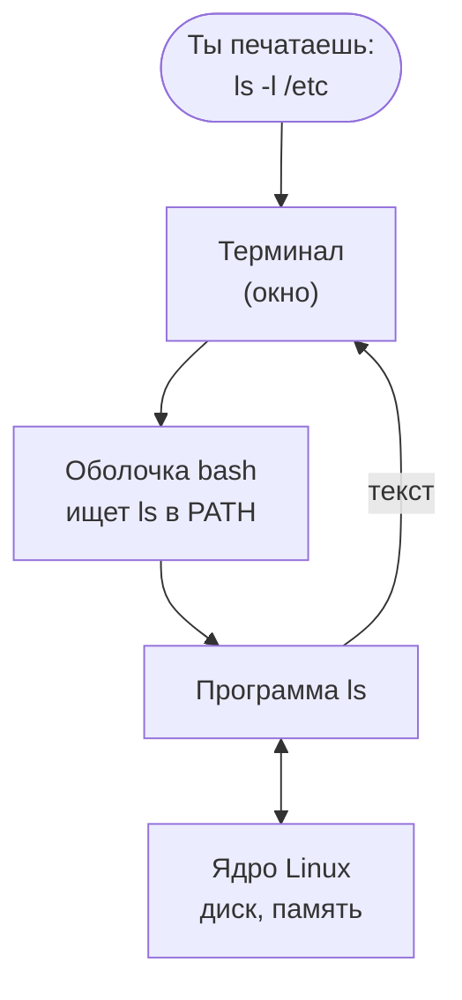
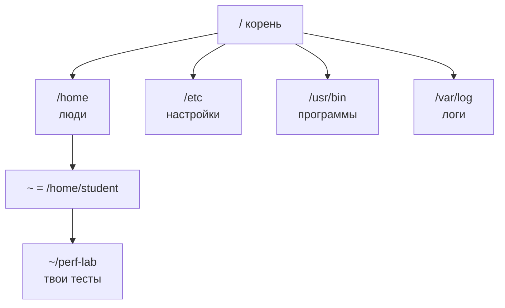
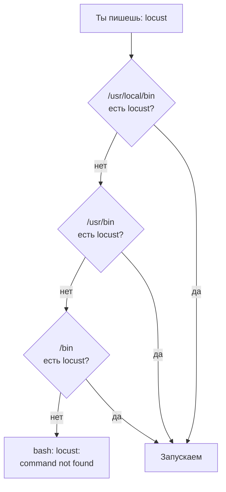

## Зачем это нужно

Нагрузочный тестировщик почти весь день проводит в терминале (окне, куда печатают команды текстом и где читают ответы). Генераторы нагрузки (Locust и k6, программы, которые изображают тысячи пользователей) запускаются командой. Тестовый стенд, то есть копия сервиса, которую можно нагружать без вреда для настоящих пользователей, поднимается командой. Логи (файлы, куда программа пишет, что с ней происходило) читают командами. Когда во время теста что-то идёт не так, некогда искать кнопки: нужно за минуту понять, где ты, что лежит вокруг и как узнать, что делает незнакомая команда.

Этот урок собирает рабочее место на весь курс и даёт базовый словарь: как устроена команда, где лежат файлы и как узнать про незнакомую программу без интернета. Если ты уже уверенно работаешь в терминале Linux, пробеги теорию глазами, ответь на вопросы «Проверь понимание» и обязательно сделай практику: в ней ты создаёшь каталоги и файлы, на которые опираются следующие уроки.

Шаг проекта: ты ставишь нужные программы, создаёшь рабочий каталог `~/perf-lab`, где будут жить все твои тесты, сценарии и отчёты курса, и записываешь **паспорт машины**: процессор, память, диск, версию системы. Без паспорта результаты нагрузочного теста нельзя ни с чем сравнить, поэтому он понадобится в каждом отчёте, начиная с [урока 8.1](../08-perf-theory/01-latency-throughput.md).

## Что нужно знать

Ничего, это первый урок. Нужны компьютер с 8 ГБ памяти (лучше 16), 30 ГБ свободного места на диске и интернет. Хочешь разобрать то же самое подробнее, с виртуальными машинами и устройством Linux изнутри: [урок 1.1 курса DevOps](https://distinguished-sre.github.io/devops/01-linux/01-first-server-shell.html).

Заранее про Docker: в [уроке 2.1](../02-web/01-client-server-http.md) ты поставишь Docker и поднимешь учебный стенд «Магазин». Первая сборка занимает 10-15 минут и около 10 ГБ диска, на машине должно быть свободно не меньше 6 ГБ памяти. Проверка в практике 1.1 (шаг 1) показывает, хватит ли твоей машине. Если не хватает, лучше узнать об этом сейчас, а не посреди урока 2.1.

## Картина целиком

Ты диктуешь заказ официанту: говоришь фразу, официант понимает её, несёт на кухню нужному повару, а потом приносит тебе результат. Ты не заходишь на кухню и не трогаешь плиту.

В компьютере то же самое:

- **Терминал** (terminal) это окно, где ты печатаешь и читаешь текст. Как блокнот официанта: сам он ничего не готовит.
- **Оболочка** (shell, у нас `bash`) это программа внутри терминала, которая читает твою строку, понимает, какую программу ты зовёшь, и запускает её. Это и есть официант.
- **Программа** (`ls`, `curl`, `python3`) делает работу и печатает результат.
- **Ядро** (kernel) это главная программа операционной системы: только оно напрямую работает с диском, памятью, сетью и процессором. Остальные программы просят его: «прочитай файл», «отправь пакет по сети». Это кухня.



На схеме твоя строка проходит через три слоя, прежде чем что-то случится с диском. Если что-то пошло не так, полезно понимать, на каком слое: оболочка не нашла программу (`command not found`), программа не поняла флаг (`invalid option`) или ядро не пустило (`Permission denied`).

Всё, что лежит на диске, собрано в одно **дерево каталогов** (папок) от корня `/`. У каждого файла есть адрес, **путь** (path): например, `/home/student/perf-lab/notes.txt`. Если ты знаешь путь, ты найдёшь файл с любого места.

## Подготовка рабочего места

Курсу нужна Ubuntu 24.04 LTS или 26.04 LTS. **Ubuntu** это один из вариантов Linux (их называют дистрибутивами), самый распространённый на серверах. **LTS** (Long Term Support) значит «долгая поддержка»: такая версия получает исправления пять лет. Варианты:

- **Ubuntu уже стоит на компьютере.** Отлично, переходи к проверке ниже.
- **Windows 10 или 11.** Поставь WSL2 (Windows Subsystem for Linux): это настоящий Linux, который запускается внутри Windows. Открой PowerShell от имени администратора (правый клик по «Пуск» → «Терминал (администратор)») и выполни `wsl --install -d Ubuntu-24.04`, затем перезагрузи компьютер. После перезагрузки откроется окно Ubuntu, придумай имя пользователя и пароль. Дальше Ubuntu запускается из меню «Пуск».
- **macOS** (в том числе Mac с процессором Apple, на нём виртуалка тоже будет ARM). Курс нужен именно с Ubuntu: без неё практика не получится, поэтому поставь виртуальную машину (программа, которая запускает Linux в окне поверх macOS). Самый простой путь, бесплатная программа Multipass. В терминале macOS:

  ```bash
  brew install --cask multipass
  multipass launch 24.04 --name lab --cpus 4 --memory 8G --disk 40G
  multipass shell lab
  ```

  Первая команда ставит Multipass через менеджер программ Homebrew (если `brew` у тебя нет, скачай установщик Multipass с сайта multipass.run). Вторая создаёт машину `lab` с 4 ядрами, 8 ГБ памяти и 40 ГБ диска, это занимает несколько минут. Третья открывает в окне терминала оболочку Ubuntu: приглашение станет `ubuntu@lab:~$`. Все команды курса выполняй в ней, а не в терминале macOS. Остановить машину можно командой `multipass stop lab`, запустить снова `multipass start lab`. Есть два отличия от обычной Ubuntu: файлы лежат внутри машины, а не в твоей папке macOS, и адрес `localhost` в браузере macOS не откроет сервисы машины: понадобится её IP из `multipass info lab`. Подробнее про виртуалки, включая UTM: [урок DevOps 1.1](https://distinguished-sre.github.io/devops/01-linux/01-first-server-shell.html), раздел «Подготовка рабочего места».

Терминал в Ubuntu с графикой открывается сочетанием `Ctrl+Alt+T`.

**Второе окно терминала.** В уроках 1.2-1.5 и дальше тебе понадобятся два окна одновременно: в одном работает программа, в другом ты за ней наблюдаешь. Как открыть второе окно, зависит от того, где у тебя Ubuntu:

- Ubuntu с графикой: ещё раз `Ctrl+Alt+T` или новая вкладка `Ctrl+Shift+T` в уже открытом терминале.
- WSL2: запусти «Ubuntu» из меню «Пуск» ещё раз или открой новую вкладку в Windows Terminal (`Ctrl+Shift+T`).
- Multipass на macOS: открой новое окно или вкладку терминала macOS (`Cmd+T`) и снова выполни `multipass shell lab`.

Новое окно это новая оболочка: переменные, которые ты задал в первом окне, там не существуют. Пока не ушёл с урока, этого достаточно. Позже, когда в уроках встретится «второй терминал», возвращайся сюда.

## Теория

### Терминал, оболочка и приглашение

**Зачем это существует.** Графический интерфейс удобен, когда действий мало и они разные. Когда нужно повторить одно действие сто раз, на ста серверах или каждую ночь, кнопки не помогают: команду можно записать в файл, отправить коллеге, вставить в инструкцию и запустить снова. Нагрузочное тестирование это много повторяемых запусков, поэтому терминал здесь главный инструмент.

**Аналогия.** Разница между «показать пальцем в меню» и «сказать официанту полную фразу». Пальцем быстрее, если ты в кафе впервые. Фразой быстрее и точнее, если заказываешь одно и то же каждый день, и её можно записать на бумажку и отдать другу.

**Как это устроено.** Открыв терминал, ты видишь **приглашение** (prompt):

```text
student@laptop:~/perf-lab$
```

Оно сообщает, что оболочка ждёт команду, и показывает, где ты:

- `student` это твоё имя пользователя;
- `laptop` это имя машины (hostname): полезно, когда открыто несколько терминалов на разных серверах;
- `~/perf-lab` это текущий каталог, `~` означает твой домашний каталог;
- `$` значит «обычный пользователь». Если в конце `#`, ты работаешь как администратор `root`, и любая ошибка может сломать систему.

Ты печатаешь команду после `$` и нажимаешь `Enter`. Оболочка `bash` разбирает строку на слова, находит программу, запускает её и ждёт, пока та закончит. Пока программа работает, новое приглашение не появится. Прервать зависшую программу можно сочетанием `Ctrl+C`.

**Разобранный пример.** Две строки, которые выглядят одинаково, но различаются символом в конце приглашения:

```text
student@laptop:~$ whoami
student
root@laptop:/etc# whoami
root
```

`whoami` («кто я») печатает имя текущего пользователя. В первой строке ты обычный пользователь в домашнем каталоге, во второй администратор в каталоге `/etc`. Привычка смотреть на приглашение перед `Enter` спасает от ошибок вроде удаления файлов не в том каталоге.

**Что путают.** Терминал и оболочку: терминал это окно, оболочка это программа в нём. Можно открыть терминал с другой оболочкой (`zsh`, `fish`), и команды будут работать чуть иначе. В курсе всегда `bash`.

> **Проверь понимание:** приглашение `deploy@stand-01:/var/log#`. Кто ты, где ты и почему стоит быть осторожнее обычного?

<details markdown="1">
<summary>Ответ</summary>

Ты на машине `stand-01`, в каталоге `/var/log`. Имя пользователя `deploy`, но в конце `#`: так оболочка показывает права администратора (обычно это `root`, здесь приглашение настроено иначе). Любая команда выполнится без ограничений, поэтому удаление или перезапись файла не остановит ни одно предупреждение.

</details>

### Устройство команды: имя, флаги, аргументы

**Зачем это существует.** Каждой программе нужно объяснить, что именно сделать и с чем. Без единого формата у каждой программы был бы свой язык.

**Аналогия.** «Принеси (команда) большой (флаг) кофе (аргумент)». Команда это глагол, флаги это наречия и прилагательные, которые меняют, как действовать, аргументы это существительные, с чем действовать.

**Как это устроено.** Строку `ls -l -h /var/log` оболочка режет по пробелам на слова:

| Слово | Что это | Что значит |
|---|---|---|
| `ls` | имя команды | «покажи содержимое каталога» (list) |
| `-l` | короткий флаг | длинный формат: права, владелец, размер, дата |
| `-h` | короткий флаг | размеры в понятных единицах: `4.0K`, `12M` (human-readable) |
| `/var/log` | аргумент | какой каталог показать |

Короткие флаги начинаются с одного дефиса и можно склеивать: `ls -lh` то же самое, что `ls -l -h`. Длинные флаги начинаются с двух дефисов и пишутся словом: `ls --all` то же, что `ls -a`. Бывают флаги со значением: `head -n 5 файл` («первые 5 строк»).

Пробел разделяет слова, поэтому путь с пробелом нужно взять в кавычки: `ls "Мои документы"`. Иначе `ls` получит два аргумента, `Мои` и `документы`, и ни один не найдёт.

**Разобранный пример.**

```bash
ls -lh /var/log
```

```text
total 2.1M
drwxr-xr-x  2 root      root   4.0K Oct  1 08:12 apt
-rw-r-----  1 syslog    adm    412K Oct  3 10:41 syslog
-rw-r--r--  1 root      root    32K Oct  3 09:02 dpkg.log
```

Как читать: первая колонка тип и права (`d` в начале это каталог, `-` обычный файл), дальше число ссылок, владелец, группа, размер, дата изменения, имя. `total 2.1M` это сколько места на диске занимают перечисленные элементы, без содержимого подкаталогов (полный размер каталога считают командой `du -sh`, о ней в [уроке 1.3](03-processes-resources.md)). Права подробно не разбираем: пока достаточно видеть, что `syslog` может читать только владелец и группа `adm`, поэтому обычному пользователю понадобится `sudo` (ниже).

**Что путают.** Флаг и аргумент: флаг меняет поведение, аргумент говорит, с чем работать. И ещё: у разных программ одинаковые буквы флагов значат разное. `-h` у `ls` это «понятные размеры», а у многих других программ «справка». Не угадывай, проверяй по справке.

> **Проверь понимание:** разбери строку `head -n 20 /var/log/dpkg.log` на имя, флаги и аргументы.

<details markdown="1">
<summary>Ответ</summary>

`head` имя команды («начало файла»), `-n 20` флаг со значением «20 строк», `/var/log/dpkg.log` аргумент, какой файл читать. Команда напечатает первые 20 строк журнала установки пакетов.

</details>

### Файловая система: дерево и пути

**Зачем это существует.** На диске сотни тысяч файлов. Чтобы их находить, нужна система адресов, одинаковая на любой машине с Linux.

**Аналогия.** Почтовый адрес: страна → город → улица → дом → квартира. В Linux: корень → каталог → подкаталог → файл. Аналогия ломается в одном: в Linux нет «дисков C: и D:», всё, даже флешка и второй диск, подключается куда-то внутрь одного дерева.

**Как это устроено.** Вершина дерева называется **корень** и обозначается `/`. Каталоги, которые встретятся в курсе:



Смотри: всё растёт из `/`. Твоё место это `~` (у пользователя `student` это `/home/student`): тут можно делать что угодно, остальное принадлежит системе. На схему не поместились `/tmp` (временные файлы, лежит прямо в корне; в Ubuntu обычно очищается при перезагрузке, поэтому важное там не храни) и `/proc` (окно в ядро: файлы там не настоящие, это живые данные системы).

**Путь** бывает двух видов:

- **Абсолютный** начинается с `/` и работает откуда угодно: `/var/log/syslog`.
- **Относительный** начинается не с `/` и отсчитывается от текущего каталога: если ты в `/var`, то `log/syslog` это тот же файл.

Особые обозначения: `.` текущий каталог, `..` каталог на уровень выше, `~` домашний каталог.

Команды навигации:

- `pwd` (print working directory): где я сейчас;
- `cd путь` (change directory): перейти; `cd` без аргумента или `cd ~` домой, `cd ..` на уровень выше, `cd -` в предыдущий каталог;
- `ls` показать содержимое, `ls -la` подробно и со скрытыми файлами (имя начинается с точки, например `.bashrc`).

**Разобранный пример.**

```bash
cd /var/log
pwd
cd ../lib
pwd
cd
pwd
```

```text
/var/log
/var/lib
/home/student
```

Читаем: из `/var/log` команда `cd ../lib` поднимается в `/var` и спускается в `lib`, получается `/var/lib`. `cd` без аргумента возвращает домой.

**Что путают.**

- `/` и `~`: корень всей системы и твой домашний каталог. `cd /` уводит в корень, где ничего твоего нет.
- Регистр букв: `Perf-Lab` и `perf-lab` в Linux это **разные** имена. В Windows они совпадают, отсюда частые ошибки у тех, кто переходит с Windows.
- Не дописывай пути руками: начни имя и нажми `Tab`. Оболочка допишет его сама или покажет варианты по второму `Tab`. Это и быстрее, и без опечаток.

> **Проверь понимание:** ты в `/home/student/perf-lab/08-theory`. Каким будет абсолютный путь для `../../.bashrc`?

<details markdown="1">
<summary>Ответ</summary>

Первое `..` поднимает в `/home/student/perf-lab`, второе в `/home/student`. Получается `/home/student/.bashrc`.

</details>

### Файлы и каталоги: создать, скопировать, удалить

**Зачем это существует.** Сценарии нагрузки, результаты прогонов, отчёты это файлы. Их нужно создавать, раскладывать и убирать.

**Как это устроено.** Основные команды:

| Команда | Что делает | Пример |
|---|---|---|
| `mkdir -p` | создать каталог; `-p` создаёт и промежуточные и не ругается, если уже есть | `mkdir -p ~/perf-lab/results` |
| `touch` | создать пустой файл (или обновить дату существующего) | `touch notes.md` |
| `cat` | напечатать файл целиком | `cat notes.md` |
| `nano` | простой редактор в терминале | `nano notes.md` |
| `cp` | копировать; `-r` для каталогов | `cp a.txt b.txt` |
| `mv` | переместить или переименовать | `mv b.txt old.txt` |
| `rm` | удалить файл; `-r` каталог со всем содержимым | `rm old.txt` |

В `nano` всё управление внизу экрана: `^O` значит `Ctrl+O` (сохранить, затем `Enter`), `^X` значит `Ctrl+X` (выйти).

**Аналогия для `rm`.** Это не корзина, а шредер. Удалённое `rm` назад не достаётся. Поэтому перед `rm -r` всегда проверяй `pwd` и смотри, что удаляешь, через `ls`.

**Разобранный пример.**

```bash
mkdir -p ~/sandbox/a/b
cd ~/sandbox
echo "первая строка" > a/note.txt
cp a/note.txt a/b/copy.txt
ls -R
```

```text
.:
a

./a:
b  note.txt

./a/b:
copy.txt
```

Читаем: `echo "текст" > файл` записывает текст в файл, заменяя содержимое (`>>` дописало бы в конец). `ls -R` (recursive) показывает содержимое всех вложенных каталогов: `.` текущий, `./a`, `./a/b`.

**Что путают.** `>` и `>>`: первый стирает файл и пишет заново, второй дописывает. Записать журнал прогонов через `>` значит потерять всё предыдущее.

> **Проверь понимание:** чем `mv report.md reports/` отличается от `mv report.md report-old.md`?

<details markdown="1">
<summary>Ответ</summary>

Если `reports/` существующий каталог, первая команда перемещает файл внутрь него с тем же именем. Вторая переименовывает файл в том же каталоге. `mv` одна команда для обоих действий: решает, что делать, по тому, чем является второй аргумент.

</details>

### Справка: как узнать про команду без интернета

**Зачем это существует.** Никто не помнит все флаги. Профессионал отличается не памятью, а тем, что находит нужное за 30 секунд.

**Как это устроено.** Порядок поиска, от быстрого к подробному:

<div class="viz" data-viz="flow" data-steps='[{"title":"Сначала --help","text":"`команда --help` печатает короткую шпаргалку флагов."},{"title":"Потом man","text":"`man команда`: полное руководство. Поиск по `/слово`, выход `q`."},{"title":"Примеры в man","text":"Раздел EXAMPLES в конце man: готовые команды."},{"title":"Только потом интернет","text":"Или нейросеть, но с точным текстом ошибки."}]'></div>

Шаги идут сверху вниз, каждый следующий дольше, но подробнее. В 9 случаях из 10 хватает первых двух.

- `команда --help` печатает краткую подсказку. Длинную подсказку удобно листать: `ls --help | less` (листать стрелками и пробелом, выход `q`). Символ `|` передаёт вывод одной команды на вход другой, подробно в [уроке 1.2](02-text-logs.md).
- `man команда` открывает руководство (manual). Внутри: `/слово` и `Enter` ищет, `n` переходит к следующему совпадению, `q` выход.
- Разделы `man` всегда одинаковые: `NAME` (что это), `SYNOPSIS` (как вызывать: в квадратных скобках необязательное), `DESCRIPTION` (флаги), часто `EXAMPLES`.

**Разобранный пример.** Хочешь, чтобы `ls` сортировал по времени изменения, новые сверху:

```bash
man ls
```

Внутри набери `/time` и `Enter`, нажимай `n`, пока не увидишь:

```text
       -t     sort by time, newest first; see --time
```

Значит, `ls -lt`. Нашёл за полминуты без интернета.

**Что путают.** Думают, что если `man` не открылся, справки нет. На минимальных системах (внутри контейнеров, о них в [теме 5](../05-docker/index.md)) руководства часто не установлены, но `--help` есть почти всегда.

> **Проверь понимание:** как через `man` найти, какой флаг у `df` показывает размеры в понятных единицах?

<details markdown="1">
<summary>Ответ</summary>

`man df`, затем `/human` и `Enter`. Найдётся `-h, --human-readable`. То есть `df -h`.

</details>

### PATH: где оболочка ищет программы

**Зачем это существует.** Когда ты пишешь `curl`, оболочка должна понять, какой файл запустить. Перебирать весь диск долго, поэтому у неё есть короткий список мест, где лежат программы.

**Аналогия.** Список полок, на которых ты ищешь нужную книгу: сначала эта полка, потом та. Если книги нет ни на одной полке из списка, ты скажешь «не нашёл», даже если она лежит в соседней комнате.

**Как это устроено.** Список хранится в **переменной окружения** `PATH`. Переменная это именованная ячейка с текстом, а переменные окружения оболочка передаёт каждой запущенной программе. В `PATH` каталоги перечислены через двоеточие, и оболочка проверяет их по порядку:



«Команда не найдена» значит не «программы нет на диске», а «её нет ни в одном каталоге из `PATH`». Это частая история с программами, поставленными в виртуальное окружение Python ([урок 4.5](../04-python/05-venv-requests.md)): пока окружение не активировано, его каталог не входит в `PATH`.

**Разобранный пример.**

```bash
echo $PATH
which python3
type cd
```

```text
/usr/local/sbin:/usr/local/bin:/usr/sbin:/usr/bin:/sbin:/bin:/snap/bin
/usr/bin/python3
cd is a shell builtin
```

`$PATH` подставляет значение переменной. `which` показывает, какой файл будет запущен по имени. `type` честнее: `cd` вообще не файл, а встроенная команда самой оболочки (builtin), поэтому `which cd` ничего бы не нашёл.

**Что путают.** Думают, что после установки программы она «сразу везде доступна». Если программа поставилась в каталог вне `PATH` (например, `~/.local/bin`), её нужно звать полным путём или добавить каталог в `PATH`.

> **Проверь понимание:** программа лежит в `/opt/tools/bin/hey`, а `hey` в терминале выдаёт `command not found`. Назови два способа её запустить.

<details markdown="1">
<summary>Ответ</summary>

Полным путём: `/opt/tools/bin/hey`. Или добавить каталог в `PATH`: `export PATH="$PATH:/opt/tools/bin"` (до закрытия терминала; чтобы навсегда, эту строку дописывают в `~/.bashrc`).

</details>

### sudo и apt: права администратора и установка программ

**Зачем это существует.** Обычный пользователь не может портить систему: менять общие настройки, ставить программы для всех. Иногда это нужно, и тогда права администратора просят на одну команду.

**Как это устроено.**

- `sudo команда` выполняет одну команду от имени администратора `root`. Спросит **твой** пароль (при вводе ничего не печатается, даже звёздочки, это нормально).
- `apt` это установщик программ (пакетов) в Ubuntu, как магазин приложений. `sudo apt update` обновляет каталог магазина (список доступных версий), `sudo apt install пакет` ставит.

**Разобранный пример.**

```bash
sudo apt update
sudo apt install -y htop
```

`-y` отвечает «да» на вопрос «Продолжить?». В выводе `apt install` в конце будет `Setting up htop (...)`: программа установлена, и `which htop` покажет `/usr/bin/htop`.

**Что путают.** Пишут `sudo` перед всем подряд «на всякий случай». Это плохая привычка: файлы, созданные через `sudo` в твоём домашнем каталоге, станут принадлежать `root`, и потом обычные команды начнут падать с `Permission denied`. `sudo` только там, где без него не работает.

## Практика

### 1. Проверь машину

```bash
cat /etc/os-release | head -n 4
nproc
free -h
df -h ~
```

```text
PRETTY_NAME="Ubuntu 24.04.3 LTS"
NAME="Ubuntu"
VERSION_ID="24.04"
VERSION="24.04.3 LTS (Noble Numbat)"
8
               total        used        free      shared  buff/cache   available
Mem:            15Gi       3.1Gi       9.2Gi       412Mi       3.3Gi        11Gi
Swap:          4.0Gi          0B       4.0Gi
Filesystem      Size  Used Avail Use% Mounted on
/dev/nvme0n1p2  468G  121G  324G  28% /
```

**Как читать вывод:**

- `/etc/os-release` файл с описанием системы: версия должна быть 24.04 или 26.04.
- `nproc` число процессорных ядер, доступных программам. Для курса нужно хотя бы 4: генератор нагрузки, сервис и база будут делить их между собой.
- `free -h` память. Смотри колонку `available` (сколько можно отдать программам), а не `free`: Linux специально занимает свободную память под кэш диска (`buff/cache`) и отдаёт её по первому требованию. Подробно в [уроке 1.3](03-processes-resources.md). Нужно хотя бы 6 ГБ `available`.
- `df -h ~` место на диске, где лежит домашний каталог. Нужно 30 ГБ в `Avail`.

**Типичные ошибки:** в WSL `nproc` и `free` показывают ресурсы, которые Windows выделила Linux. Если памяти меньше 6 ГБ, создай в Windows файл `%UserProfile%\.wslconfig` со строками `[wsl2]` и `memory=8GB`, затем в PowerShell `wsl --shutdown` и открой Ubuntu заново.

### 2. Поставь программы курса

```bash
sudo apt update
sudo apt install -y git curl jq htop tree dnsutils python3-venv python3-pip
```

Что ставим: `git` (история изменений, [тема 3](../03-git/index.md)), `curl` (HTTP-запросы из терминала), `jq` (разбор JSON-ответов), `htop` (наблюдение за процессами), `tree` (дерево каталогов), `dnsutils` (команда `dig` для DNS, [урок 1.4](04-network-cli.md)), `python3-venv` и `python3-pip` (виртуальные окружения и пакеты Python, [тема 4](../04-python/index.md)). Docker ставим отдельно в [уроке 2.1](../02-web/01-client-server-http.md), когда впервые поднимаем стенд, а подробно разбираем в [теме 5](../05-docker/index.md).

Проверь:

```bash
git --version; curl --version | head -n 1; jq --version; python3 --version
```

```text
git version 2.43.0
curl 8.5.0 (x86_64-pc-linux-gnu) ...
jq-1.7.1
Python 3.12.3
```

**Как читать вывод:** версии у тебя могут быть новее, это нормально. `;` разделяет команды в одной строке: они выполнятся по очереди. Python должен быть 3.12 или новее.

**Типичные ошибки:**

- `E: Unable to locate package dnsutils`: забыл `sudo apt update`, каталог магазина пустой.
- `E: Could not get lock /var/lib/dpkg/lock-frontend`: другой установщик уже работает (часто автоматическое обновление сразу после установки системы). Подожди пару минут и повтори, не удаляй файл блокировки.

### 3. Создай рабочий каталог

```bash
mkdir -p ~/perf-lab/{results,reports,scripts}
cd ~/perf-lab
tree
```

```text
.
├── reports
├── results
└── scripts

3 directories, 0 files
```

Фигурные скобки разворачиваются оболочкой в три слова: `mkdir -p ~/perf-lab/results ~/perf-lab/reports ~/perf-lab/scripts`. В `results` будешь класть сырые результаты прогонов, в `reports` отчёты, в `scripts` вспомогательные скрипты. Уроки будут добавлять свои подкаталоги, например `08-theory`. В [теме 3](../03-git/index.md) этот каталог станет git-репозиторием на GitHub, твоим портфолио.

### 4. Запиши паспорт машины

Паспорт нужен в каждом отчёте о нагрузке: одни и те же тесты на ноутбуке и на мощном сервере дают разные числа, и без условий измерения цифры бесполезны.

```bash
cd ~/perf-lab
echo "# Паспорт машины" > machine.md
echo "Дата: $(date +%F)" >> machine.md
echo "Система: $(grep PRETTY_NAME /etc/os-release | cut -d= -f2)" >> machine.md
echo "Ядро: $(uname -r)" >> machine.md
echo "Процессор: $(lscpu | grep -m1 'Model name' | cut -d: -f2 | xargs)" >> machine.md
echo "Ядер: $(nproc)" >> machine.md
echo "Память: $(free -h | awk '/Mem:/ {print $2}')" >> machine.md
cat machine.md
```

```text
# Паспорт машины
Дата: 2026-10-03
Система: "Ubuntu 24.04.3 LTS"
Ядро: 6.8.0-85-generic
Процессор: AMD Ryzen 7 5800H with Radeon Graphics
Ядер: 8
Память: 15Gi
```

**Как читать:** `$(команда)` подставляет вывод команды прямо в строку. `date +%F` даёт дату в формате ГГГГ-ММ-ДД. `lscpu` печатает описание процессора, `grep -m1 'Model name'` оставляет первую строку с его названием, `cut -d: -f2` отрезает всё до двоеточия, `xargs` убирает лишние пробелы по краям. `awk` из строки `Mem:` берёт второе поле. Это команды из [урока 1.2](02-text-logs.md): сейчас просто скопируй, там разберёшь, как они работают. Первая строка через `>` создаёт файл, остальные через `>>` дописывают.

**Типичные ошибки:**

- Если первую строку случайно написать с `>>`, а последующие с `>`, в файле останется только последняя строка. Проверь `cat machine.md`.
- На Mac с процессором Apple (ARM-виртуалка) в строке `Процессор:` может остаться пусто или тире: виртуальная машина не всегда сообщает модель. Допиши название вручную: `echo "Процессор: Apple M-серии (виртуальная машина)" >> machine.md`. Заодно вместо `x86_64` в выводе версий ты увидишь `aarch64`: это та же Ubuntu, только для ARM.

### 5. Разберись с командой по справке

Без интернета узнай через `--help` или `man`:

1. Как `ls` показать размеры файлов в понятных единицах и отсортировать по размеру, большие сверху?
2. Как `tree` показать только каталоги, без файлов?
3. Как `df` показать тип файловой системы?

<details markdown="1">
<summary>Ответы</summary>

1. `ls -lhS` (в `man ls`: `-S sort by file size, largest first`).
2. `tree -d` (в `tree --help`: `-d List directories only`).
3. `df -T` (в `man df`: `-T, --print-type`).

</details>

## Сломай и почини

**Поломка.** Испорти переменную `PATH` в текущем терминале:

```bash
export PATH=/nowhere
ls
```

```text
bash: ls: command not found
```

**Задача.** Не закрывая терминал, восстанови работу. Порядок рассуждения: какая ошибка, на каком слое схемы она возникла, что проверить первым.

<details markdown="1">
<summary>Разбор</summary>

`command not found` пишет оболочка: она не нашла программу ни в одном каталоге из `PATH`. Программа на диске есть, и её можно запустить полным путём: `/usr/bin/ls` работает. Встроенные команды оболочки тоже работают: `echo $PATH` покажет `/nowhere`, и причина видна.

Почини, вернув стандартный список:

```bash
export PATH=/usr/local/sbin:/usr/local/bin:/usr/sbin:/usr/bin:/sbin:/bin:/snap/bin
ls
```

Самый простой способ: закрыть терминал и открыть новый. `export` меняет переменную только в этом окне, а новое окно прочитает настройки заново. Если `PATH` сломан и в новых окнах, значит, ошибку записали в `~/.bashrc`: открой его `/usr/bin/nano ~/.bashrc` (полным путём, ведь `PATH` сломан) и исправь строку с `PATH`.

</details>

## Словарик урока

| Термин | Простыми словами |
|---|---|
| Терминал (terminal) | Окно, куда печатаешь команды и где читаешь ответы |
| Оболочка (shell), bash | Программа в терминале, которая разбирает строку и запускает программы |
| Приглашение (prompt) | Строка вроде `student@laptop:~$`: кто ты, где ты, готова ли оболочка |
| Ядро (kernel) | Главная программа ОС: раздаёт процессор, память, диск и сеть |
| Дистрибутив, Ubuntu, LTS | Набор «ядро Linux + программы»; Ubuntu самый частый на серверах; LTS значит пять лет исправлений |
| WSL2 | Настоящий Linux внутри Windows |
| Флаг (flag) | Добавка к команде, которая меняет поведение: `-l`, `--all` |
| Аргумент (argument) | С чем работает команда: файл, каталог, адрес |
| Корень `/` | Вершина дерева каталогов |
| Домашний каталог `~` | Твой каталог, `/home/имя` |
| Абсолютный и относительный путь | От корня (`/var/log`) или от текущего каталога (`../log`) |
| Переменная окружения | Именованная ячейка с текстом, которую получают все программы, например `PATH` |
| `PATH` | Список каталогов, где оболочка ищет программы |
| `sudo` | Выполнить одну команду с правами администратора |
| `apt`, пакет | Установщик программ Ubuntu; программа, упакованная для установки |

## Вопросы с собеседований

Раздел для повторения: ответь вслух, потом открой ответ. Первые три тренируй на скорость: ответ за 30 секунд.

### 1. [junior] [часто] Чем абсолютный путь отличается от относительного?

<details markdown="1">
<summary>Ответ</summary>

Абсолютный начинается с `/` и указывает на одно и то же место откуда угодно: `/var/log/syslog`. Относительный отсчитывается от текущего каталога: из `/var` путь `log/syslog` указывает на тот же файл, а из `/home` уже на другой. В скриптах надёжнее абсолютные пути, потому что скрипт могут запустить из любого каталога.

**Что хотят услышать:** начинается ли с `/`, от чего отсчитывается, что безопаснее в скриптах.

**Красный флаг:** путает `/` и `~`.

</details>

### 2. [junior] [часто] Команда выдаёт `command not found`, хотя программа установлена. Что проверишь?

<details markdown="1">
<summary>Ответ</summary>

Оболочка ищет программы в каталогах из `PATH`. Проверю `echo $PATH` и где лежит программа (`ls` по ожидаемому пути, `dpkg -L пакет`). Если каталог программы не в `PATH`, запущу полным путём или добавлю каталог в `PATH`. Частый случай: программа в виртуальном окружении Python, которое не активировано.

**Что хотят услышать:** `PATH`, `which`/`type`, полный путь, venv.

**Красный флаг:** «переустановлю программу».

</details>

### 3. [junior] [часто] Как узнать, какие флаги есть у незнакомой команды, без интернета?

<details markdown="1">
<summary>Ответ</summary>

`команда --help` для краткой подсказки, `man команда` для полного руководства, поиск внутри `man` через `/слово`, примеры в разделе `EXAMPLES`. Если `man` нет (например, в контейнере), почти всегда есть `--help`.

**Что хотят услышать:** оба способа, умение искать внутри `man`.

**Красный флаг:** «загуглю» как единственный ответ.

</details>

### 4. [junior] Что означают `.`, `..` и `~`?

<details markdown="1">
<summary>Ответ</summary>

`.` текущий каталог, `..` родительский (на уровень выше), `~` домашний каталог текущего пользователя.

**Что хотят услышать:** все три без запинки.

**Красный флаг:** не знает `..`.

</details>

### 5. [junior] Чем терминал отличается от оболочки?

<details markdown="1">
<summary>Ответ</summary>

Терминал это окно для ввода и вывода текста. Оболочка (`bash`, `zsh`) это программа в нём, которая разбирает строку, ищет программу и запускает её. В одном терминале можно запустить разные оболочки.

**Что хотят услышать:** окно и интерпретатор команд, пример оболочек.

**Красный флаг:** «это одно и то же».

</details>

### 6. [junior] Чем `>` отличается от `>>`?

<details markdown="1">
<summary>Ответ</summary>

`>` записывает вывод в файл, стирая прежнее содержимое. `>>` дописывает в конец. Для журналов и накопления результатов прогонов нужен `>>`.

**Что хотят услышать:** перезапись против дописывания, пример, где ошибка опасна.

**Красный флаг:** не знает, что `>` стирает файл.

</details>

### 7. [junior] Почему не стоит запускать всё через `sudo`?

<details markdown="1">
<summary>Ответ</summary>

Ошибка под `root` не остановится проверкой прав и может сломать систему. Файлы, созданные через `sudo` в домашнем каталоге, станут принадлежать `root`, и обычные команды потом будут падать с `Permission denied`. `sudo` нужен только для системных действий: установка пакетов, правка системных настроек.

**Что хотят услышать:** риск, владелец файлов, принцип минимальных прав.

**Красный флаг:** «так проще, меньше ошибок с правами».

</details>

### 8. [junior] Как посмотреть, сколько у машины ядер, памяти и места на диске?

<details markdown="1">
<summary>Ответ</summary>

`nproc` для ядер, `free -h` для памяти (смотреть колонку `available`), `df -h` для дисков. Для нагрузочного теста эти данные записывают в отчёт, потому что результаты зависят от железа.

**Что хотят услышать:** три команды, `available` а не `free`, зачем это в нагрузке.

**Красный флаг:** «посмотрю в настройках системы» без команд.

</details>

### 9. [middle] Ты зашёл на сервер стенда, приглашение заканчивается на `#`. О чём это говорит и как поступишь?

<details markdown="1">
<summary>Ответ</summary>

Я работаю с правами администратора. Любая ошибка в команде выполнится без ограничений. Если права администратора не нужны для задачи, выйду из этой сессии (`exit`) и работаю обычным пользователем, а `sudo` использую на отдельные команды. Перед опасными командами проверю `pwd` и что именно затрагиваю.

**Что хотят услышать:** понимание `#`, осторожность, минимальные права.

**Красный флаг:** не замечает разницы между `$` и `#`.

</details>

## Проверено на версиях

Ubuntu 24.04.3 LTS и 26.04 LTS, WSL2 на Windows 11, bash 5.2, Python 3.12. Октябрь 2026.

## Итог урока: ты умеешь

- [ ] Открыть терминал и прочитать приглашение: кто ты, где ты, обычный ли пользователь.
- [ ] Разобрать команду на имя, флаги и аргументы.
- [ ] Ходить по дереву каталогов абсолютными и относительными путями, пользоваться `Tab`.
- [ ] Создавать, копировать, перемещать и удалять файлы, понимая, что `rm` не корзина.
- [ ] Найти нужный флаг через `--help` и `man`.
- [ ] Объяснить `command not found` через `PATH` и починить его.
- [ ] Ставить программы через `apt` и не злоупотреблять `sudo`.
- [ ] Записать паспорт машины для отчётов.

Дальше: [урок 1.2. Текст и логи](02-text-logs.md), где ты научишься находить нужное в логах на сотни тысяч строк.
