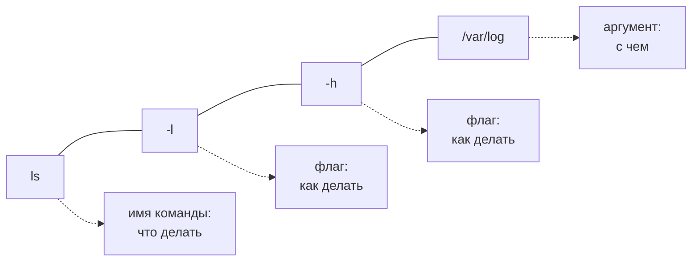
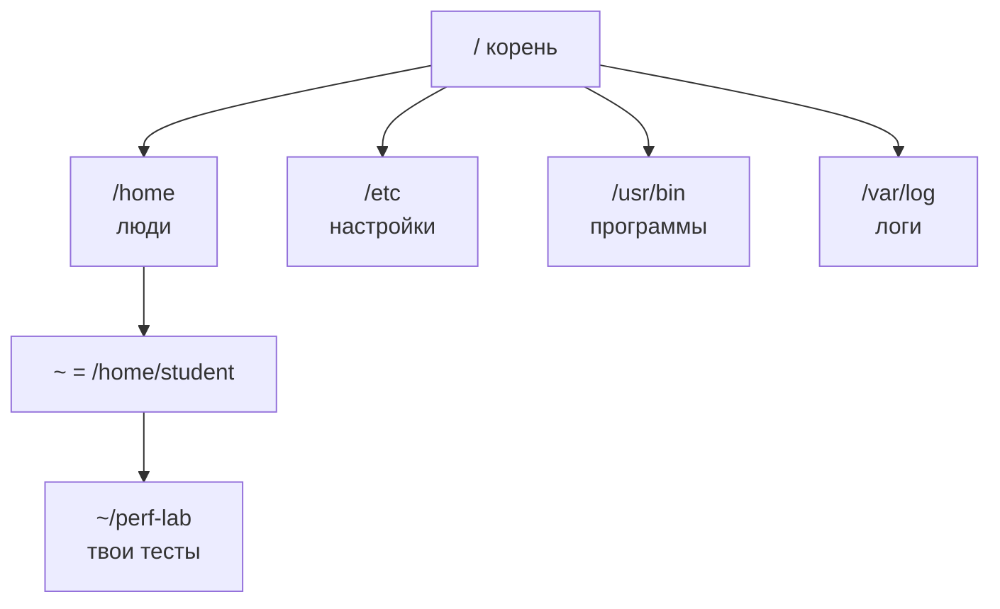
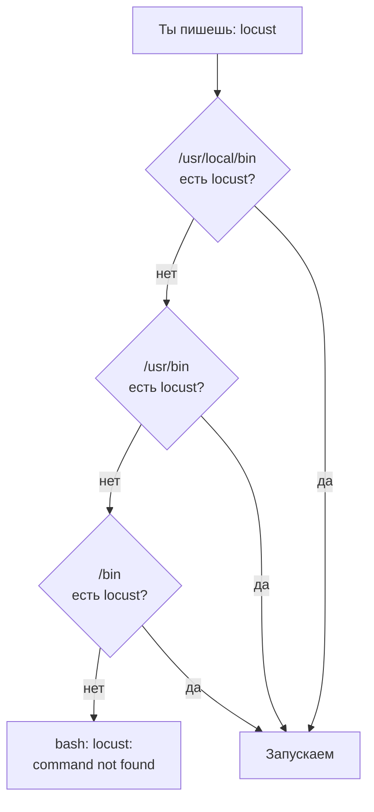

## Зачем это нужно

Я буду рядом весь курс, как опытный коллега за соседним столом. Итак, ты на первой работе в команде интернет-магазина. Впереди большая распродажа, в прошлом году сайт на ней упал. Твоя задача: устроить магазину репетицию, пустить на него тысячи искусственных покупателей и увидеть, где он начнёт тормозить. Это **нагрузочное тестирование**, а ты нагрузочный тестировщик.

В первый день тебе выдают доступ к **серверу** (компьютеру без экрана и мыши, на нём работает магазин). Стоит он в дата-центре, здании, где собраны сотни таких машин. Первая просьба от команды: «Посмотри логи». Логи это файлы, куда программа записывает, что с ней происходило. Настоящий магазин нагружать нельзя, поэтому позже ты поднимешь **стенд**: его копию, которую не жалко сломать.

Кнопок на сервере нет, есть **терминал**: окно, куда печатают команды текстом и где читают ответы. На серверах стоит **Linux**, семейство операционных систем, и работать с ним принято текстом. Тест нагрузки это одна и та же команда, запущенная сотни раз, а команду можно сохранить в файл и повторить, клик так не повторишь. Поэтому весь курс пройдёт в терминале. Когда посреди теста что-то идёт не так, за минуту надо понять, где ты и что делает незнакомая команда. Linux у тебя может не быть (Windows, Mac): как его получить, написано в конце урока, в разделе «Подготовка рабочего места». Теорию можно читать и без него.

Шаг проекта: ты ставишь программы курса, создаёшь каталог `~/perf-lab` для своих тестов и отчётов и записываешь **паспорт машины**: процессор, память, диск, версию системы. Заполнишь его в практике этого урока. Железо влияет на результат: на слабом ноутбуке тот же тест покажет худшие цифры. Поэтому паспорт нужен в каждом отчёте, начиная с [урока 8.1](../08-perf-theory/01-latency-throughput.md).

## Что нужно знать

Ничего, это первый урок. Нужны компьютер с 8 ГБ памяти (лучше 16), 30 ГБ свободного места на диске и интернет. Хочешь разобрать то же самое подробнее, с виртуальными машинами и устройством Linux изнутри: [урок 1.1 курса DevOps](https://distinguished-sre.github.io/devops/01-linux/01-first-server-shell.html).

Заранее про Docker: в [уроке 2.1](../02-web/01-client-server-http.md) ты поставишь Docker и поднимешь учебный стенд «Магазин». Первая сборка занимает 10-15 минут и около 10 ГБ диска, на машине должно быть свободно не меньше 6 ГБ памяти. Проверка в практике 1.1 (шаг 1) показывает, хватит ли твоей машине. Если не хватает, лучше узнать об этом сейчас, а не посреди урока 2.1.

## Картина целиком

Ты диктуешь заказ официанту: он понимает фразу, несёт на кухню нужному повару и приносит результат. На кухню ты не заходишь.

В компьютере так же. **Терминал** (terminal) это окно, где ты печатаешь и читаешь текст. **Оболочка** (shell, у нас `bash`) это официант: программа в окне, которая читает твою строку и запускает нужную программу. Программа (`ls`, `curl`, `python3`) это повар: делает работу и печатает результат. **Ядро** (kernel) это кухня: главная часть системы, которая одна работает с диском, памятью и процессором. Остальные просят её: «прочитай файл».


Строка проходит три слоя, прежде чем что-то случится с диском. Когда что-то ломается, важно понять, на каком слое: оболочка не нашла программу (`command not found`), программа не поняла флаг (`invalid option`) или ядро не пустило (`Permission denied`).

Всё на диске собрано в одно **дерево каталогов** (каталог это папка) от корня `/`. У файла есть адрес, **путь** (path), например `/home/student/perf-lab/notes.txt`.

## Подготовка рабочего места

Курсу нужна Ubuntu 24.04 LTS или 26.04 LTS. **Ubuntu** это один из вариантов Linux (их называют дистрибутивами), самый распространённый на серверах. **LTS** (Long Term Support) значит «долгая поддержка»: такая версия получает исправления пять лет. Варианты:

- **Ubuntu уже стоит на компьютере.** Отлично, переходи к проверке ниже.
- **Windows 10 или 11.** Поставь WSL2 (Windows Subsystem for Linux): это настоящий Linux, который запускается внутри Windows. Открой PowerShell от имени администратора (правый клик по «Пуск» → «Терминал (администратор)») и выполни `wsl --install -d Ubuntu-24.04`, затем перезагрузи компьютер. После перезагрузки откроется окно Ubuntu, придумай имя пользователя и пароль. Дальше Ubuntu запускается из меню «Пуск».
- **macOS** (в том числе Mac с процессором Apple, на нём виртуалка тоже будет ARM). Курс нужен именно с Ubuntu: без неё практика не получится, поэтому поставь виртуальную машину (программа, которая запускает Linux в окне поверх macOS). Самый простой путь, бесплатная программа Multipass. В терминале macOS:

  ```bash
  brew install --cask multipass
  multipass launch 24.04 --name lab --cpus 4 --memory 8G --disk 40G
  multipass shell lab
  ```

  Первая команда ставит Multipass через менеджер программ Homebrew (если `brew` у тебя нет, скачай установщик Multipass с сайта multipass.run). Вторая создаёт машину `lab` с 4 ядрами, 8 ГБ памяти и 40 ГБ диска, это занимает несколько минут. Третья открывает в окне терминала оболочку Ubuntu: приглашение станет `ubuntu@lab:~$`. Все команды курса выполняй в ней, а не в терминале macOS. Остановить машину можно командой `multipass stop lab`, запустить снова `multipass start lab`. Есть два отличия от обычной Ubuntu: файлы лежат внутри машины, а не в твоей папке macOS, и адрес `localhost` в браузере macOS не откроет сервисы машины: понадобится её IP из `multipass info lab`. Подробнее про виртуалки, включая UTM: [урок DevOps 1.1](https://distinguished-sre.github.io/devops/01-linux/01-first-server-shell.html), раздел «Подготовка рабочего места».

Терминал в Ubuntu с графикой открывается сочетанием `Ctrl+Alt+T`.

**Второе окно терминала.** В уроках 1.2-1.5 и дальше тебе понадобятся два окна одновременно: в одном работает программа, в другом ты за ней наблюдаешь. Как открыть второе окно, зависит от того, где у тебя Ubuntu:

- Ubuntu с графикой: ещё раз `Ctrl+Alt+T` или новая вкладка `Ctrl+Shift+T` в уже открытом терминале.
- WSL2: запусти «Ubuntu» из меню «Пуск» ещё раз или открой новую вкладку в Windows Terminal (`Ctrl+Shift+T`).
- Multipass на macOS: открой новое окно или вкладку терминала macOS (`Cmd+T`) и снова выполни `multipass shell lab`.

Новое окно это новая оболочка: переменные, которые ты задал в первом окне, там не существуют. Пока не ушёл с урока, этого достаточно. Позже, когда в уроках встретится «второй терминал», возвращайся сюда.

## Теория

### Терминал, оболочка и приглашение

Открываешь терминал на сервере и видишь пустое окно с мигающей чертой. Ни кнопок, ни меню. С чего начать?

Вот зачем тестировщику окно без кнопок: тест это команда, которую запускают сотни раз, а значит, её нужно записать в файл и повторять. Я в первый день тоже не понимал, куда нажимать, и это нормально.

Окно встречает тебя **приглашением** (prompt):

```text
student@laptop:~/perf-lab$
```

`student` это твоё имя пользователя, `laptop` имя машины, `~/perf-lab` текущий каталог (`~` значит твой домашний каталог). Знак `$` говорит: ты обычный пользователь.

Пользователей два вида. Обычному разрешено работать в своём домашнем каталоге и там, где ему явно дали права, а системные файлы он испортить не может. Администратору (`root`) разрешено всё, и система не переспросит, поэтому его приглашение заканчивается на `#`. Разделение нужно, чтобы ошибка новичка реже роняла сервер, на котором работают другие.

Ты печатаешь команду и жмёшь `Enter`, и `bash` находит программу, запускает и ждёт, пока она закончит. Зависшую программу прерывает `Ctrl+C`.

```text
student@laptop:~$ whoami
student
root@laptop:/etc# whoami
root
```

`whoami` («кто я») печатает имя пользователя. В первой строке ты обычный пользователь дома, во второй администратор в каталоге `/etc`.

> **Прикинь сам:** приглашение `admin@stand-01:/var/log#`. Кто ты, где ты и на что смотришь перед `Enter`?
{: .predict}

Ты пользователь `admin` на машине `stand-01`, в каталоге `/var/log`. Знак `#` значит права администратора: ни одну команду система не остановит. Поэтому перед каждым `Enter` смотри на приглашение.

Осторожно: терминал и оболочку путают. Терминал это окно, оболочка программа в нём.

> **Главное:** терминал это окно, `bash` запускает твои команды, а знак в приглашении (`$` или `#`) говорит, обычный ты пользователь или администратор.
{: .key}

Теперь ты видишь, где печатать. Но как записать команду, чтобы её поняла любая программа?

### Устройство команды: имя, флаги, аргументы

В инструкции написано `ls -lh /var/log`. Где тут что? У любой команды одна форма, как у фразы «принеси большой кофе»: что делать, как и с чем.



Оболочка режет строку по пробелам, и вот что получается. `ls` («покажи содержимое каталога») это имя. `-l` и `-h` это **флаги** (flag): добавки, меняющие работу команды. `-l` просит длинный формат с размером и датой, `-h` просит размеры в понятных единицах (`4.0K`, `12M`). `/var/log` это **аргумент**: с чем работать. Короткие флаги можно склеивать: `-lh` это то же, что `-l -h`. Длинные пишутся словом с двумя дефисами: `--all` то же, что `-a`. Флаг бывает со значением: `head -n 5 файл` значит «первые 5 строк». Путь с пробелом бери в кавычки: `ls "Мои документы"`, иначе `ls` увидит два аргумента.

```bash
ls -lh /var/log
```

```text
drwxr-xr-x  2 root      root   4.0K Oct  1 08:12 apt
-rw-r-----  1 syslog    adm    412K Oct  3 10:41 syslog
-rw-r--r--  1 root      root    32K Oct  3 09:02 dpkg.log
```

Смотри на пятую колонку (размер) и последнюю (имя): `syslog` весит 412 килобайт. Первая колонка с буквами и дефисами это права доступа (кто может читать и менять файл). Подробно разберём, когда понадобится. Пока знай, что `d` значит «каталог».

> **Прикинь сам:** разбери `head -n 20 /var/log/dpkg.log` на имя, флаги и аргументы.
{: .predict}

`head` имя («начало файла»), `-n 20` флаг со значением «20 строк», `/var/log/dpkg.log` аргумент. Команда напечатает первые 20 строк журнала установки программ.

Осторожно: одни и те же буквы флагов у разных программ значат разное. `-h` у `ls` это «понятные размеры», у многих других «справка». Не угадывай, проверяй по справке.

> **Главное:** команда это имя, флаги («как») и аргументы («с чем») через пробел.
{: .key}

Команду читать умеем. Но что за адрес `/var/log`?

### Файловая система: дерево и пути

На диске сотни тысяч файлов. Как указать нужный? Нужны адреса, одинаковые на любой машине с Linux.

Это почтовый адрес: страна, город, улица, дом. Здесь: корень, каталог, подкаталог, файл. Аналогия ломается в одном: «дисков C: и D:» нет, всё подключается внутрь одного дерева.

Вершина дерева это **корень** `/`. Главные каталоги:



Твоё место это `~` (у `student` это `/home/student`): тут можно делать что угодно, остальное принадлежит системе.

**Абсолютный** путь начинается с `/` и работает откуда угодно: `/var/log/syslog`. **Относительный** отсчитывается от каталога, где ты стоишь: из `/var` путь `log/syslog` тот же файл. Для коротких переходов есть значки: `.` (текущий каталог), `..` (на уровень выше), `~` (домой).

Передвигаться помогают три команды. `pwd` отвечает «где я». `cd путь` переходит (голый `cd` ведёт домой, `cd -` назад). `ls` показывает содержимое, а `ls -la` ещё и скрытые файлы, чьи имена начинаются с точки.

```bash
cd /var/log
pwd
cd ../lib
pwd
cd
pwd
```

```text
/var/log
/var/lib
/home/student
```

Из `/var/log` команда `cd ../lib` поднимается в `/var` и спускается в `lib`: получается `/var/lib`. Голый `cd` возвращает домой.

Осторожно: `/` это корень системы, где ничего твоего нет, а `~` твой дом. И регистр важен: `Perf-Lab` и `perf-lab` в Linux разные имена. Длинные пути не печатай руками: начни имя и нажми `Tab`, оболочка допишет сама.

<details markdown="1">
<summary>Для любопытных: два каталога, которых нет на схеме</summary>

`/tmp` хранит временные файлы, в Ubuntu его обычно чистят при перезагрузке. `/proc` это окно в ядро: настоящих файлов там нет, ядро показывает свои живые показатели как файлы.

</details>

> **Проверь понимание:** ты в `/home/student/perf-lab/08-theory`. Каким будет абсолютный путь для `../../.bashrc`?

<details markdown="1">
<summary>Ответ</summary>

Первое `..` поднимает в `/home/student/perf-lab`, второе в `/home/student`. Получается `/home/student/.bashrc`.

</details>

> **Главное:** все файлы лежат в одном дереве от корня, путь бывает абсолютным и относительным, а `.`, `..` и `~` сокращают переходы.
{: .key}

Ходить по дереву умеем. Теперь научимся в нём что-то создавать и не стереть лишнего.

### Файлы и каталоги: создать, скопировать, удалить

Тесты, результаты прогонов и отчёты это файлы.

| Команда | Что делает | Пример |
|---|---|---|
| `mkdir -p` | создаёт каталог (с `-p` и промежуточные, без ошибки, если уже есть) | `mkdir -p ~/perf-lab/results` |
| `touch` | создаёт пустой файл | `touch notes.md` |
| `cat` | печатает файл целиком | `cat notes.md` |
| `nano` | редактор в терминале: `Ctrl+O` и `Enter` сохраняют, `Ctrl+X` выходит | `nano notes.md` |
| `cp` | копирует (`-r` для каталогов) | `cp a.txt b.txt` |
| `mv` | перемещает или переименовывает | `mv b.txt old.txt` |
| `rm` | удаляет (`-r` каталог со всем внутри) | `rm old.txt` |

```bash
mkdir -p ~/sandbox/a/b
cd ~/sandbox
echo "первая строка" > a/note.txt
cp a/note.txt a/b/copy.txt
ls -R
```

```text
.:
a

./a:
b  note.txt

./a/b:
copy.txt
```

`echo "текст" > файл` записывает текст в файл, заменяя содержимое (`>>` дописало бы в конец). `ls -R` показывает и вложенные каталоги: `.`, `./a`, `./a/b`.

> **Прикинь сам:** чем `mv report.md reports/` отличается от `mv report.md report-old.md`?
{: .predict}

Если `reports/` это каталог, файл переедет внутрь с тем же именем. Во втором случае файл переименуется на месте. Команда одна, а выбирает она по второму аргументу.

Теперь про `rm`. В первый месяц на одной работе я чистил старые результаты тестов. Набрал `cd results`, ошибся в имени, команда выдала ошибку, а я не посмотрел и тут же ввёл `rm -r` на содержимое текущего каталога. Им оказался каталог со скриптами. Месячная работа исчезла: `rm` это не корзина, а шредер, назад ничего не вернуть. Два дня я восстанавливал скрипты по памяти и по старым письмам. С тех пор перед `rm -r` я смотрю `pwd` и `ls`.

Осторожно: `>` стирает файл и пишет заново, `>>` дописывает. Журнал прогонов через `>` потеряет всё прежнее.

> **Главное:** `rm` стирает насовсем, поэтому перед ним проверяй, где ты, а `>` стирает файл, `>>` дописывает.
{: .key}

Файлы в руках. А как узнать, что делает команда, которую видишь впервые?

### Справка: как узнать про команду без интернета

Ты забыл флаг. Справка есть прямо в системе, идём от простого к подробному:

<div class="viz" data-viz="flow" data-steps='[{"title":"Сначала --help","text":"`команда --help` печатает короткую шпаргалку флагов."},{"title":"Потом man","text":"`man команда`: полное руководство. Поиск по `/слово`, выход `q`."},{"title":"Примеры в man","text":"Раздел EXAMPLES в конце man: готовые команды."},{"title":"Только потом интернет","text":"Или нейросеть, но с точным текстом ошибки."}]'></div>

`команда --help` печатает краткую подсказку. Длинную листай через `ls --help | less` (стрелки и пробел листают, `q` выходит); значок `|` передаёт вывод одной команды другой, подробнее в [уроке 1.2](02-text-logs.md). Не хватило? `man команда` («manual», руководство): внутри `/слово` и `Enter` ищут, `n` ведёт к следующему совпадению, `q` выходит.

Пример: нужно, чтобы `ls` сортировал по времени, новые сверху. Открой `man ls`, набери `/time` и жми `n`, пока не увидишь:

```text
       -t     sort by time, newest first; see --time
```

Значит, `ls -lt`.

> **Прикинь сам:** как через `man` найти флаг `df` для понятных размеров?
{: .predict}

`man df`, затем `/human` и `Enter`. Найдётся `-h, --human-readable`, то есть `df -h`.

<details markdown="1">
<summary>Для любопытных: из чего состоит страница man</summary>

`NAME` говорит, что это за команда, `SYNOPSIS` показывает вызов (в квадратных скобках необязательное), `DESCRIPTION` описывает флаги, в конце часто `EXAMPLES` с готовыми примерами.

</details>

Осторожно: если `man` не открылся, справки это не отменяет. На минимальных системах руководств часто нет, но `--help` почти всегда работает.

> **Главное:** про команду сначала спрашивай `--help`, потом `man`, и только потом интернет.
{: .key}

Справка есть. А как оболочка находит программу по одному имени?

### PATH: где оболочка ищет программы

Ты поставил программу, набрал её имя и получил `command not found`, хотя она есть на диске. Я так потерял в первую неделю час. Дело не в диске, а в списке мест, где оболочка ищет.

Это полки в магазине: ищешь книгу на каждой по очереди. Нет ни на одной: скажешь «не нашёл», хотя она в соседней комнате.

Список лежит в **переменной окружения** `PATH`. Переменная это ячейка с именем, в которой записан текст, а «окружения» значит, что оболочка передаёт такие ячейки каждой запущенной программе. В `PATH` каталоги идут через двоеточие, и оболочка проверяет их по порядку:



`command not found` значит не «программы нет на диске», а «её нет ни в одном каталоге из `PATH`». Я при такой ошибке начинаю с `echo $PATH`.

```bash
echo $PATH
which python3
type cd
```

```text
/usr/local/sbin:/usr/local/bin:/usr/sbin:/usr/bin:/sbin:/bin:/snap/bin
/usr/bin/python3
cd is a shell builtin
```

`$PATH` подставляет значение переменной. `which` показывает файл, который запустится. `type` честнее: `cd` не файл, а встроенная команда (builtin), которую оболочка выполняет сама, без отдельной программы на диске, поэтому `which cd` её бы не нашёл.

Осторожно: программа, поставленная в каталог вне `PATH` (например, `~/.local/bin`), «не найдётся». Зови её полным путём или добавь каталог в `PATH`.

> **Проверь понимание:** программа лежит в `/opt/tools/bin/hey`, а `hey` выдаёт `command not found`. Назови два способа её запустить.

<details markdown="1">
<summary>Ответ</summary>

Полным путём: `/opt/tools/bin/hey`. Или добавить каталог в `PATH`: `export PATH="$PATH:/opt/tools/bin"` (до закрытия терминала; чтобы навсегда, эту строку дописывают в `~/.bashrc`).

</details>

> **Главное:** оболочка ищет программу только в каталогах из `PATH`, поэтому `command not found` значит «нет в списке», а не «нет на диске».
{: .key}

А если программы нет вообще, её надо поставить. Для этого нужны права администратора.

### sudo и apt: права администратора и установка программ

Ставить программы для всех разрешено только администратору, то есть нужны его права, а работать под ним весь день опасно. Вот почему права берут на одну команду.

`sudo команда` выполняет её от имени `root` и спрашивает **твой** пароль (на экране ничего не печатается, даже звёздочек, это нормально). `apt` это установщик программ Ubuntu (самой распространённой версии Linux для серверов, её мы ставим в курсе), как магазин приложений в телефоне. Программа в нём упакована в **пакет**. `sudo apt update` обновляет каталог магазина, `sudo apt install пакет` ставит.

```bash
sudo apt update
sudo apt install -y htop
```

`-y` отвечает «да» на вопрос «Продолжить?». В конце вывода будет `Setting up htop (...)`, а `which htop` покажет `/usr/bin/htop`.

Осторожно: `sudo` не пишут «на всякий случай». Файлы, созданные через него в твоём домашнем каталоге, станут принадлежать `root`, и обычные команды начнут падать с `Permission denied`.

> **Главное:** `sudo` даёт права администратора на одну команду, `apt` ставит пакеты, а `sudo` нужен только там, где без него нельзя.
{: .key}

Вернёмся в первый день. На просьбу «посмотри логи» ты откроешь терминал, прочитаешь приглашение, перейдёшь в `/var/log`, посмотришь `ls -lh`, а незнакомую команду разберёшь через `--help` и `man`. И всё это обычным пользователем, а не `root`: ничего не сломаешь.

## Практика

### 1. Проверь машину

```bash
cat /etc/os-release | head -n 4
nproc
free -h
df -h ~
```

```text
PRETTY_NAME="Ubuntu 24.04.3 LTS"
NAME="Ubuntu"
VERSION_ID="24.04"
VERSION="24.04.3 LTS (Noble Numbat)"
8
               total        used        free      shared  buff/cache   available
Mem:            15Gi       3.1Gi       9.2Gi       412Mi       3.3Gi        11Gi
Swap:          4.0Gi          0B       4.0Gi
Filesystem      Size  Used Avail Use% Mounted on
/dev/nvme0n1p2  468G  121G  324G  28% /
```

**Как читать вывод:**

- `/etc/os-release` файл с описанием системы: версия должна быть 24.04 или 26.04.
- `nproc` число процессорных ядер, доступных программам. Для курса нужно хотя бы 4: генератор нагрузки, сервис и база будут делить их между собой.
- `free -h` память. Смотри колонку `available` (сколько можно отдать программам), а не `free`: Linux специально занимает свободную память под кэш диска (`buff/cache`) и отдаёт её по первому требованию. Подробно в [уроке 1.3](03-processes-resources.md). Нужно хотя бы 6 ГБ `available`.
- `df -h ~` место на диске, где лежит домашний каталог. Нужно 30 ГБ в `Avail`.

**Типичные ошибки:** в WSL `nproc` и `free` показывают ресурсы, которые Windows выделила Linux. Если памяти меньше 6 ГБ, создай в Windows файл `%UserProfile%\.wslconfig` со строками `[wsl2]` и `memory=8GB`, затем в PowerShell `wsl --shutdown` и открой Ubuntu заново.

### 2. Поставь программы курса

```bash
sudo apt update
sudo apt install -y git curl jq htop tree dnsutils python3-venv python3-pip
```

Что ставим: `git` (история изменений, [тема 3](../03-git/index.md)), `curl` (HTTP-запросы из терминала), `jq` (разбор JSON-ответов), `htop` (наблюдение за процессами), `tree` (дерево каталогов), `dnsutils` (команда `dig` для DNS, [урок 1.4](04-network-cli.md)), `python3-venv` и `python3-pip` (виртуальные окружения и пакеты Python, [тема 4](../04-python/index.md)). Docker ставим отдельно в [уроке 2.1](../02-web/01-client-server-http.md), когда впервые поднимаем стенд, а подробно разбираем в [теме 5](../05-docker/index.md).

Проверь:

```bash
git --version; curl --version | head -n 1; jq --version; python3 --version
```

```text
git version 2.43.0
curl 8.5.0 (x86_64-pc-linux-gnu) ...
jq-1.7.1
Python 3.12.3
```

**Как читать вывод:** версии у тебя могут быть новее, это нормально. `;` разделяет команды в одной строке: они выполнятся по очереди. Python должен быть 3.12 или новее.

**Типичные ошибки:**

- `E: Unable to locate package dnsutils`: забыл `sudo apt update`, каталог магазина пустой.
- `E: Could not get lock /var/lib/dpkg/lock-frontend`: другой установщик уже работает (часто автоматическое обновление сразу после установки системы). Подожди пару минут и повтори, не удаляй файл блокировки.

### 3. Создай рабочий каталог

```bash
mkdir -p ~/perf-lab/{results,reports,scripts}
cd ~/perf-lab
tree
```

```text
.
├── reports
├── results
└── scripts

3 directories, 0 files
```

Фигурные скобки разворачиваются оболочкой в три слова: `mkdir -p ~/perf-lab/results ~/perf-lab/reports ~/perf-lab/scripts`. В `results` будешь класть сырые результаты прогонов, в `reports` отчёты, в `scripts` вспомогательные скрипты. Уроки будут добавлять свои подкаталоги, например `08-theory`. В [теме 3](../03-git/index.md) этот каталог станет git-репозиторием на GitHub, твоим портфолио.

### 4. Запиши паспорт машины

Паспорт нужен в каждом отчёте о нагрузке: одни и те же тесты на ноутбуке и на мощном сервере дают разные числа, и без условий измерения цифры бесполезны.

```bash
cd ~/perf-lab
echo "# Паспорт машины" > machine.md
echo "Дата: $(date +%F)" >> machine.md
echo "Система: $(grep PRETTY_NAME /etc/os-release | cut -d= -f2)" >> machine.md
echo "Ядро: $(uname -r)" >> machine.md
echo "Процессор: $(lscpu | grep -m1 'Model name' | cut -d: -f2 | xargs)" >> machine.md
echo "Ядер: $(nproc)" >> machine.md
echo "Память: $(free -h | awk '/Mem:/ {print $2}')" >> machine.md
cat machine.md
```

```text
# Паспорт машины
Дата: 2026-10-03
Система: "Ubuntu 24.04.3 LTS"
Ядро: 6.8.0-85-generic
Процессор: AMD Ryzen 7 5800H with Radeon Graphics
Ядер: 8
Память: 15Gi
```

**Как читать:** `$(команда)` подставляет вывод команды прямо в строку. `date +%F` даёт дату в формате ГГГГ-ММ-ДД. `lscpu` печатает описание процессора, `grep -m1 'Model name'` оставляет первую строку с его названием, `cut -d: -f2` отрезает всё до двоеточия, `xargs` убирает лишние пробелы по краям. `awk` из строки `Mem:` берёт второе поле. Это команды из [урока 1.2](02-text-logs.md): сейчас просто скопируй, там разберёшь, как они работают. Первая строка через `>` создаёт файл, остальные через `>>` дописывают.

**Типичные ошибки:**

- Если первую строку случайно написать с `>>`, а последующие с `>`, в файле останется только последняя строка. Проверь `cat machine.md`.
- На Mac с процессором Apple (ARM-виртуалка) в строке `Процессор:` может остаться пусто или тире: виртуальная машина не всегда сообщает модель. Допиши название вручную: `echo "Процессор: Apple M-серии (виртуальная машина)" >> machine.md`. Заодно вместо `x86_64` в выводе версий ты увидишь `aarch64`: это та же Ubuntu, только для ARM.

### 5. Разберись с командой по справке

Без интернета узнай через `--help` или `man`:

1. Как `ls` показать размеры файлов в понятных единицах и отсортировать по размеру, большие сверху?
2. Как `tree` показать только каталоги, без файлов?
3. Как `df` показать тип файловой системы?

<details markdown="1">
<summary>Ответы</summary>

1. `ls -lhS` (в `man ls`: `-S sort by file size, largest first`).
2. `tree -d` (в `tree --help`: `-d List directories only`).
3. `df -T` (в `man df`: `-T, --print-type`).

</details>

> Команда не работает, а причины в «Типичных ошибках» нет? Скопируй команду и весь вывод, спроси нейросеть, что значит каждая строка ошибки. Ответ проверь по `--help` и `man` своей команды, а не по её уверенному тону.
{: .ai}

## Сломай и почини

**Поломка.** Испорти переменную `PATH` в текущем терминале:

```bash
export PATH=/nowhere
ls
```

```text
bash: ls: command not found
```

**Задача.** Не закрывая терминал, восстанови работу. Порядок рассуждения: какая ошибка, на каком слое схемы она возникла, что проверить первым.

<details markdown="1">
<summary>Разбор</summary>

`command not found` пишет оболочка: она не нашла программу ни в одном каталоге из `PATH`. Программа на диске есть, и её можно запустить полным путём: `/usr/bin/ls` работает. Встроенные команды оболочки тоже работают: `echo $PATH` покажет `/nowhere`, и причина видна.

Почини, вернув стандартный список:

```bash
export PATH=/usr/local/sbin:/usr/local/bin:/usr/sbin:/usr/bin:/sbin:/bin:/snap/bin
ls
```

Самый простой способ: закрыть терминал и открыть новый. `export` меняет переменную только в этом окне, а новое окно прочитает настройки заново. Если `PATH` сломан и в новых окнах, значит, ошибку записали в `~/.bashrc`: открой его `/usr/bin/nano ~/.bashrc` (полным путём, ведь `PATH` сломан) и исправь строку с `PATH`.

</details>

## ИИ в помощь

Нейросеть хорошо объясняет команды терминала и ошибки установки, но твоей машины она не видит. Общие правила на странице [ИИ-помощник](../ai.md).

**Знакомство.** Для курса подойдут четыре нейросети: ChatGPT, Claude, DeepSeek и Qwen. ChatGPT и Claude из России открываются через VPN, DeepSeek и Qwen работают без него. Открой любую и задай ей первый вопрос прямо сейчас. На странице [ИИ-помощник](../ai.md) лежит готовый текст-преподаватель: вставь его первым сообщением, и нейросеть будет объяснять по шагам, а не выдавать готовые ответы вместо тебя. Правило на весь курс: сначала сам, потом нейросеть, ответ всегда проверяй командой.

**Задача:** разобрать незнакомую команду или флаг.

```text
Я новичок, учусь работать в терминале Ubuntu 24.04. Объясни команду простыми словами:
<вставь команду, например ls -lah /var/log>
Разбери каждую часть (команду, каждый флаг, аргумент) и покажи, как читать вывод. Что она не меняет в системе и что может изменить?
```
{: .wrap}

**Проверь ответ:** сравни с `man <команда>` или `<команда> --help` у себя в терминале. Типичная ошибка: нейросеть придумывает флаги, которых нет в твоей версии, или путает флаги GNU (Linux) и BSD (macOS).

**Задача:** понять, почему `command not found` или установка не прошла.

```text
Ubuntu 24.04, я ставлю программу из курса. Команда:
<вставь команду>
Полный вывод:
<вставь вывод целиком>
Объясни, что значит каждая строка ошибки, и предложи 2-3 причины от самой вероятной. Для каждой дай команду проверки, которая ничего не ломает.
```
{: .wrap}

**Проверь ответ:** выполняй только проверочные команды (`which`, `echo $PATH`, `apt-cache policy`). Типичная ошибка: совет с `sudo` и `rm -rf` там, где хватило бы поправить `PATH`, и пакеты из чужих репозиториев.

Пароли, токены и содержимое `~/.ssh` в чат не отправляй. В выводе команд замени имя пользователя и адреса на `<имя>` и `<адрес>`.

## Словарик урока

| Термин | Простыми словами |
|---|---|
| Терминал (terminal) | Окно, куда печатаешь команды и где читаешь ответы |
| Оболочка (shell), bash | Программа в терминале, которая разбирает строку и запускает программы |
| Приглашение (prompt) | Строка вроде `student@laptop:~$`: кто ты, где ты, готова ли оболочка |
| Ядро (kernel) | Главная программа ОС: раздаёт процессор, память, диск и сеть |
| Дистрибутив, Ubuntu, LTS | Набор «ядро Linux + программы»; Ubuntu самый частый на серверах; LTS значит пять лет исправлений |
| WSL2 | Настоящий Linux внутри Windows |
| Флаг (flag) | Добавка к команде, которая меняет поведение: `-l`, `--all` |
| Аргумент (argument) | С чем работает команда: файл, каталог, адрес |
| Корень `/` | Вершина дерева каталогов |
| Домашний каталог `~` | Твой каталог, `/home/имя` |
| Абсолютный и относительный путь | От корня (`/var/log`) или от текущего каталога (`../log`) |
| Переменная окружения | Именованная ячейка с текстом, которую получают все программы, например `PATH` |
| `PATH` | Список каталогов, где оболочка ищет программы |
| `sudo` | Выполнить одну команду с правами администратора |
| `apt`, пакет | Установщик программ Ubuntu; программа, упакованная для установки |

## Вопросы с собеседований

Раздел для повторения: ответь вслух, потом открой ответ. Первые три тренируй на скорость: ответ за 30 секунд.



## Проверено на версиях

Ubuntu 24.04.3 LTS и 26.04 LTS, WSL2 на Windows 11, bash 5.2, Python 3.12. Октябрь 2026.

## Итог урока: ты умеешь

- [ ] Открыть терминал и прочитать приглашение: кто ты, где ты, обычный ли пользователь.
- [ ] Разобрать команду на имя, флаги и аргументы.
- [ ] Ходить по дереву каталогов абсолютными и относительными путями, пользоваться `Tab`.
- [ ] Создавать, копировать, перемещать и удалять файлы, понимая, что `rm` не корзина.
- [ ] Найти нужный флаг через `--help` и `man`.
- [ ] Объяснить `command not found` через `PATH` и починить его.
- [ ] Ставить программы через `apt` и не злоупотреблять `sudo`.
- [ ] Записать паспорт машины для отчётов.

Дальше: [урок 1.2. Текст и логи](02-text-logs.md), где ты научишься находить нужное в логах на сотни тысяч строк.
