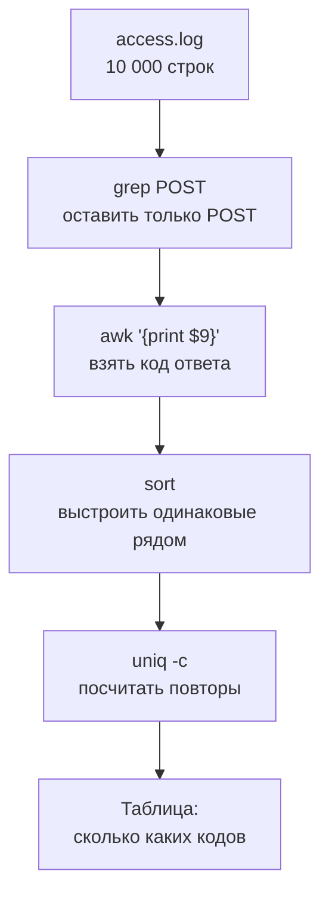
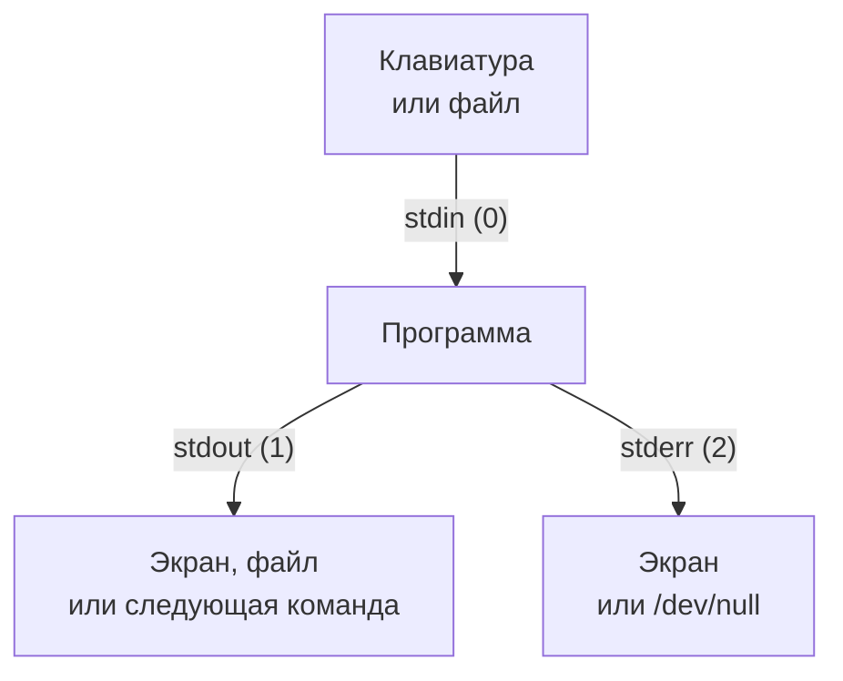

## Зачем это нужно

Во время нагрузочного теста сервис пишет в лог (файл, куда он записывает по строке на каждое событие) десятки и сотни тысяч строк. Тест закончился, и у тебя два вопроса: «были ли ошибки?» и «где именно было медленно?». Открыть такой файл в обычном редакторе и прочитать глазами нельзя, а фильтры в терминале отвечают за секунды: `grep` (найти строки по слову), `sort` и `uniq` (сгруппировать и посчитать), `awk` (достать нужное поле и посчитать среднее). Связанные в цепочку, они заменяют небольшую программу.

Эти же команды понадобятся не только для логов: результаты прогонов Locust и k6 тоже текстовые файлы (CSV, JSON), и «сколько запросов упало и на каком маршруте» ты будешь спрашивать у них теми же командами. Это самый часто используемый навык урока, поэтому практика здесь объёмная.

Шаг проекта: настоящие логи «Магазина» появятся, когда ты поднимешь стенд в [уроке 2.1](../02-web/01-client-server-http.md). Чтобы потренироваться уже сейчас, ты создаёшь **учебные логи**: 10 000 запросов за 10 минут в двух форматах (строки веб-сервера и JSON, как у «Магазина») с настоящей аварией внутри. Ты найдёшь её минуту, маршрут и причину и запишешь вывод в `~/perf-lab/01-linux/log-report.md`. Когда стенд заработает, те же команды сработают на его логах без изменений.

## Что нужно знать

- Терминал, пути, `cat`, `head`, `>` и `>>`, `man` и `--help`: [урок 1.1](01-workstation-terminal.md). Там же мы поставили `jq`: он понадобится в конце.
- Каталог `~/perf-lab` из практики 1.1. Если его нет, выполни `mkdir -p ~/perf-lab/{results,reports,scripts}`.
- Глубже: те же инструменты, но с точки зрения администратора сервера, разобраны в [уроке 1.2 курса DevOps](https://distinguished-sre.github.io/devops/01-linux/02-text-pipes.html). Урок самодостаточен без него.

## Картина целиком

Представь сортировочный цех на почте. Посылки едут по ленте, а вдоль неё стоят рабочие, и у каждого одна простая задача: один достаёт письма с красной маркой, второй считает их, третий складывает в нужные ящики. Ни один рабочий не умеет всего, но лента с несколькими рабочими отвечает на вопрос «сколько срочных писем пришло из Новосибирска».

Команды терминала устроены так же. Каждая делает одно: **читает текст на входе, что-то с ним делает и выдаёт текст на выходе**. Символ `|` (его называют **конвейер**, pipe) соединяет выход одной команды со входом следующей. Из десяти простых команд собирается любой отчёт по логу.



Что здесь видно: данные текут сверху вниз, на каждом шаге их становится либо меньше (фильтр), либо они меняют вид (выбор поля), либо превращаются в число (подсчёт). Если результат странный, конвейер можно «обрезать» справа и посмотреть, что вышло после каждого шага: ошибка почти всегда на каком-то одном звене.

Попробуй такой конвейер сам, прежде чем читать дальше. Виджет показывает ровно те шаги, которые на схеме, на двенадцати настоящих строках лога.

<div class="viz" data-viz="linux-pipeline" data-stage="0"></div>

Что здесь видно: на каждом шаге строк либо меньше, либо они короче, и в конце остаётся ответ в две-три строки. Обрати внимание на шаг с `sort`: без него `uniq -c` посчитал бы неверно (подробно в разделе про `uniq`).

## Теория

### Лог: что это и как читать строку

**Зачем это существует.** Программа не может рассказать тебе, что с ней случилось час назад, если ты не смотрел. Поэтому она записывает события в файл, как судовой журнал: в такое-то время случилось то-то. Без логов нельзя ответить на вопрос «почему упало», только «упало».

**Аналогия.** Кассовая лента магазина: каждая операция отдельной строкой с временем и суммой. Лента не объясняет, почему покупатель ушёл, но по ней можно восстановить, что происходило. Аналогия ломается в одном: ленту читают от случая к случаю, а лог сервиса растёт сотни строк в секунду, поэтому читать его приходится фильтрами, а не глазами.

**Как это устроено.** Одно событие это одна строка. Два распространённых формата:

1. **Строка веб-сервера** (access log): поля через пробел в строго одном порядке. Так пишут nginx, Apache и многие прокси:

```text
10.0.0.28 - - [03/Oct/2026:10:00:00 +0000] "GET /api/products?page=2&size=20 HTTP/1.1" 200 1192 0.042
```

2. **JSON-строка**: поля с именами, по одному объекту на строку. Так пишет «Магазин» (и большинство современных сервисов):

```text
{"ts": "2026-10-03T10:00:00.076731+00:00", "level": "INFO", "msg": "Запрос завершён", "method": "GET", "route": "/api/products", "path": "/api/products", "status": 200, "duration_ms": 42.0, "request_id": "7231fc1d02c4ffb16b57cd3a0f8a6363"}
```

**Разобранный пример.** Разберём первую строку по полям. Разделитель у неё пробел, а команда `awk`, о которой речь ниже, называет поля `$1`, `$2` и так далее:

| Поле | Значение в примере | Что это |
|---|---|---|
| `$1` | `10.0.0.28` | IP-адрес клиента (кто пришёл) |
| `$2`, `$3` | `-`, `-` | «пустые» поля, оставшиеся с давних времён (имя пользователя), нам не нужны |
| `$4`, `$5` | `[03/Oct/2026:10:00:00`, `+0000]` | время запроса и часовой пояс (UTC) |
| `$6` | `"GET` | метод HTTP: «получить» (GET) или «отправить» (POST) |
| `$7` | `/api/products?page=2&size=20` | путь и параметры запроса |
| `$8` | `HTTP/1.1"` | версия протокола |
| `$9` | `200` | **код ответа**: 2xx успех, 4xx ошибка клиента, 5xx ошибка сервера |
| `$10` | `1192` | размер ответа в байтах |
| `$11` | `0.042` | время обработки в секундах (последнее поле, его же даёт `$NF`) |

Поле `$11` в стандартном формате веб-сервера не пишется: его добавляют настройкой, и нагрузочник обычно просит именно её. Без времени в логе можно найти ошибки, но не медленные запросы.

**Что путают.** Код ответа и размер ответа: оба числа, стоят рядом. Лучше всего приучить себя к привычке: сначала посмотреть одну строку глазами и записать, что в каком поле, и только потом строить конвейер. И ещё: время в логах почти всегда в UTC (без привязки к твоему часовому поясу), поэтому «10:05» в логе может быть «13:05» на твоих часах.

> **Проверь понимание:** в строке `10.0.0.5 - - [03/Oct/2026:12:00:01 +0000] "POST /api/orders HTTP/1.1" 503 40 1.912` какой код ответа, какой метод и сколько ждал клиент?

<details markdown="1">
<summary>Ответ</summary>

Код ответа 503 (ошибка сервера: он не смог обработать запрос, 5xx), метод POST (создание заказа), время обработки 1,912 секунды. Маленький размер ответа, 40 байт, подсказывает, что вернулась короткая ошибка, а не страница заказа.

</details>

### Потоки и перенаправление: откуда данные приходят и куда уходят

**Зачем это существует.** Чтобы команды можно было соединять друг с другом, у каждой должен быть единый способ получать данные и отдавать результат, независимо от того, откуда они: с клавиатуры, из файла или от соседней команды.

**Аналогия.** У каждой команды три «трубы»: из первой данные приходят, во вторую уходит результат, в третью уходят жалобы. Обычно первая подключена к клавиатуре, а вторая и третья к экрану, но трубы можно переключить на файл или на другую команду.

**Как это устроено.** Три потока у каждой программы:

| Поток | Номер | Что это | По умолчанию |
|---|---|---|---|
| **stdin** (стандартный ввод) | 0 | откуда программа читает | клавиатура |
| **stdout** (стандартный вывод) | 1 | куда пишет результат | экран |
| **stderr** (стандартный вывод ошибок) | 2 | куда пишет сообщения об ошибках | экран |

Оболочка может переключить их:

- `команда > файл` отправляет stdout в файл (стирая старое), `>>` дописывает в конец (вы уже видели в [уроке 1.1](01-workstation-terminal.md));
- `команда < файл` берёт stdin из файла;
- `команда 2> файл` отправляет в файл только ошибки;
- `команда > файл 2>&1` отправляет туда и результат, и ошибки (читается «ошибки (2) туда же, куда результат (1)»);
- `команда 2> /dev/null` выбрасывает ошибки: `/dev/null` специальный «чёрный ящик», всё, что в него записали, пропадает;
- `команда1 | команда2` отправляет stdout первой на stdin второй.



Что здесь видно: у программы один вход и два выхода. Важная мелочь: конвейер `|` передаёт дальше только stdout. Если первая команда ругнулась, сообщение об ошибке не попадёт во вторую, а останется на экране.

**Разобранный пример.**

```bash
ls /nonexistent
ls /nonexistent 2> /dev/null
echo "после"
```

```text
ls: cannot access '/nonexistent': No such file or directory
после
```

Первая команда напечатала ошибку: каталога нет, а `ls` пишет такие сообщения в stderr. Вторая команда тоже не нашла каталог, но ошибку мы отправили в `/dev/null`, поэтому на экране тишина. Это удобно, когда нужно убрать шум (например, `find` без прав ругается на каждый закрытый каталог), и опасно, когда тишиной скрыта настоящая проблема. Поэтому `2> /dev/null` ставят осознанно, а не «чтобы не мешало».

**Что путают.**

- `>` и `|`: первый записывает в файл, второй передаёт другой команде. `ls | file.txt` не сработает: `file.txt` это не команда, оболочка скажет `command not found`.
- `команда > файл` стирает файл **до** запуска команды. Фраза `sort data.txt > data.txt` оставит файл пустым: оболочка очистила его раньше, чем `sort` успел прочитать. Результат пиши в другой файл.

> **Проверь понимание:** что окажется в файле `out.txt` после `ls /etc /nonexistent > out.txt`, и что появится на экране?

<details markdown="1">
<summary>Ответ</summary>

В `out.txt` попадёт обычный вывод: список содержимого `/etc`. На экране останется сообщение об ошибке про `/nonexistent`: это stderr, а перенаправлен был только stdout. Чтобы поймать и ошибку, нужно было дописать `2>&1`.

</details>

### Просмотр больших файлов: less, head, tail, wc

**Зачем это существует.** `cat` выбрасывает на экран весь файл разом. Для файла в 10 000 строк это неудобно: ты увидишь только последние экраны и ничего не успеешь прочитать. Нужны команды, которые показывают файл по кусочкам.

**Как это устроено.**

- `wc -l файл` (word count, флаг `-l`: lines) считает **строки**. Первое, что делают с незнакомым логом: сколько в нём строк.
- `head -n 5 файл` первые 5 строк, `tail -n 5 файл` последние 5. Смотрят, что за формат, и что происходило в самом конце.
- `tail -f файл` (follow: «следить») показывает последние строки и **не завершается**: когда в файл дописывают новое, оно тут же появляется на экране. Выход: `Ctrl+C`. Так наблюдают за логом во время теста.
- `less файл` открывает файл «страницами» и ничего не печатает в историю терминала. Клавиши:

| Клавиша | Что делает |
|---|---|
| пробел или `f` | страница вперёд |
| `b` | страница назад |
| `g` / `G` | в начало / в конец файла |
| `/слово` и `Enter` | искать вперёд, `n` следующее совпадение, `N` предыдущее |
| `?слово` | искать назад |
| `F` | режим «следить» как у `tail -f` (остановить `Ctrl+C`, вернуться) |
| `q` | выйти |

Похожие клавиши, знакомые по `man` в [уроке 1.1](01-workstation-terminal.md): `man` тоже работает через `less`.

**Разобранный пример.**

```bash
wc -l access.log
head -n 2 access.log
tail -n 1 access.log
```

```text
10000 access.log
10.0.0.28 - - [03/Oct/2026:10:00:00 +0000] "GET /api/products?page=2&size=20 HTTP/1.1" 200 1192 0.042
10.0.0.28 - - [03/Oct/2026:10:00:00 +0000] "GET /api/products/298 HTTP/1.1" 200 1174 0.012
10.0.0.25 - - [03/Oct/2026:10:09:58 +0000] "GET /api/products/1524 HTTP/1.1" 200 1287 0.015
```

Читаем: в файле 10 000 строк. Первая запись в 10:00:00, последняя в 10:09:58, значит лог охватывает десять минут, около 1000 запросов в минуту (17 в секунду). Такая оценка «по краям файла» занимает пять секунд и сразу ограничивает, где искать.

**Что путают.** `tail -f` и `tail -n`: первый «следит», второй просто показывает конец. И ещё: `less` не завершается сам. Если терминал «завис», а в углу двоеточие или `(END)`, ты внутри `less`: нажми `q`.

> **Проверь понимание:** лог за время теста вырос до 2 миллионов строк. Как за пять секунд узнать, чем он закончился и когда начался?

<details markdown="1">
<summary>Ответ</summary>

`head -n 1 файл` покажет первую строку (время начала), `tail -n 1 файл` последнюю (время конца). Читать весь файл или открывать в `less` для этого не нужно. Если интересен текущий ход событий, `tail -f файл`.

</details>

### grep: найти строки с нужным словом

**Зачем это существует.** Из 10 000 строк обычно нужны десять: ошибки, один пользователь, один маршрут. Искать их глазами нельзя, а фильтр делает это мгновенно.

**Аналогия.** Поиск по странице на сайте (Ctrl+F), только для файла любого размера и с выводом найденных строк целиком, а не подсветкой.

**Как это устроено.** `grep шаблон файл` читает файл построчно и печатает те строки, где встретился шаблон. Шаблон это текст или **регулярное выражение** (regular expression, regex): описание «какие строки подходят» с особыми символами. Минимум, который понадобится:

| Символ | Значение | Пример |
|---|---|---|
| `.` | любой один символ | `5.3` найдёт `503`, `553` |
| `^` и `$` | начало и конец строки | `^10` строки, начинающиеся с «10» |
| `[0-9]` | любая одна цифра из диапазона | `[0-9][0-9][0-9]` три цифры подряд |
| `+` в режиме `-E` | один или больше раз | `-E '[0-9]+'` число любой длины |

«Или» между вариантами пишется вертикальной чертой, и для неё нужен режим `grep -E` (extended, «расширенный»): `grep -E 'GET|POST'` найдёт строки с GET или с POST. Без `-E` черту пришлось бы экранировать (`\|`), поэтому для сложных шаблонов всегда ставь `-E`.

Флаги, которыми пользуются каждый день:

| Флаг | Что делает |
|---|---|
| `-c` | не печатать строки, только **посчитать** их |
| `-v` | **инвертировать**: показать строки, где шаблона нет |
| `-i` | не различать большие и маленькие буквы |
| `-n` | перед строкой напечатать её номер в файле |
| `-m N` | остановиться после N совпадений |
| `-A N`, `-B N`, `-C N` | показать N строк **после** (after), **до** (before) и **вокруг** (context) найденной |
| `-E` | расширенные регулярные выражения |
| `-r` | искать во всех файлах каталога |

Шаблон с пробелами или спецсимволами берётся в одинарные кавычки: `grep 'POST /api/orders' access.log`. Без кавычек оболочка разрежет шаблон на два слова и примет второе за имя файла.

**Разобранный пример.** Сколько в логе запросов за заказами и сколько из них закончились кодом 500:

```bash
grep -c 'POST /api/orders' access.log
grep -c 500 access.log
grep -c ' 500 ' access.log
```

```text
397
28
20
```

Здесь два числа 28 и 20 про одно и то же «500», а ошибок на самом деле, по статусу, 17. Причина в том, что `grep 500` ищет цифры 500 **в любом месте строки**: в ID товара (`/api/products/500`), в размере ответа (`200 500 0.012`), во времени. С пробелами вокруг (`' 500 '`) отсеялась часть случайных совпадений, но не все: три строки в логе имеют ровно 500 байт в размере ответа (поле `$10`). Настоящий ответ даст `awk '$9 == 500'`, который смотрит именно в девятое поле, об этом чуть ниже.

Посмотрим на контекст первой ошибки (`-m 1` остановиться после первого совпадения, `-B 1 -A 2` строка до и две после):

```bash
grep -n -m 1 -B 1 -A 2 ' 500 40 ' access.log | cut -c1-110
```

```text
5019-10.0.0.13 - - [03/Oct/2026:10:05:00 +0000] "POST /api/cart/items HTTP/1.1" 201 2524 0.020
5020:10.0.0.20 - - [03/Oct/2026:10:05:00 +0000] "POST /api/orders HTTP/1.1" 500 40 1.804
5021-10.0.0.14 - - [03/Oct/2026:10:05:00 +0000] "GET /api/products/803 HTTP/1.1" 200 1285 0.017
5022-10.0.0.23 - - [03/Oct/2026:10:05:00 +0000] "POST /api/login HTTP/1.1" 200 3678 0.302
```

**Как читать вывод:** номер строки с двоеточием (`5020:`) это строка с совпадением, с дефисом (`5019-`) это соседние строки контекста. Ошибка найдена: заказ закончился 500 ровно в 10:05:00 и ждал 1,8 секунды. `cut -c1-110` обрезает вывод до первых 110 символов, чтобы строка помещалась на экране.

**Что путают.**

- Что `grep` ищет **текст**, а не поле: он не знает, что где находится в строке. Для вопросов вида «значение в таком-то поле» нужен `awk`.
- `-c` считает **строки**, а не вхождения. Если слово встречается в строке дважды, она всё равно одна.
- Без кавычек шаблон со спецсимволами: `grep $9 file` оболочка сама подставит значение переменной `$9`. Используй кавычки.

> **Проверь понимание:** как показать все строки лога, которые **не** относятся к проверке `/healthz`? И как узнать, сколько их?

<details markdown="1">
<summary>Ответ</summary>

`grep -v healthz access.log` покажет все остальные строки (`-v` инвертирует), а `grep -vc healthz access.log` посчитает их: 9791. В логе 10 000 строк, значит проверок `/healthz` в нём 209.

</details>

### sort, uniq, cut, tr: группировка и подсчёт

**Зачем это существует.** Типичный вопрос по логу звучит как «сколько запросов каждого вида». Это группировка и подсчёт. Для неё хватает двух команд, но с одной хитростью.

**Как это устроено.**

- `cut -d' ' -f1,9 файл` режет строку на части по разделителю (`-d`, delimiter) и оставляет выбранные (`-f`, fields) поля. `cut -d' ' -f1,9` даёт IP и код ответа. Подходит, когда поля разделены одним символом.
- `sort` выстраивает строки по алфавиту. `-n` сортирует как числа (иначе `10` окажется раньше `9`, потому что «1» меньше «9»), `-r` наоборот (reverse), `-k 3` по третьему полю.
- `uniq` убирает **соседние** повторяющиеся строки, `uniq -c` ещё и пишет слева, сколько их было.
- `head -n N` в конце конвейера оставляет первые N строк: «топ-N».
- `tr` заменяет или удаляет символы: `tr -d '"'` убирает кавычки, `tr 'a-z' 'A-Z'` переводит в верхний регистр.

**Хитрость с `uniq`.** Эта команда замечает повторы только у **соседей**. Если одинаковые строки разбросаны, она их не схлопнет: `200, 201, 200` она считает за три разные группы. Поэтому перед `uniq` всегда ставят `sort`: сортировка сводит одинаковые рядом. Шаблон «топ частых значений» одинаков во всех задачах:

```bash
команда_выбора_поля | sort | uniq -c | sort -rn | head
```

Читается: выбери поле, сгруппируй одинаковые, посчитай, поставь самые частые наверх, оставь первые десять. Выучи эту строку наизусть: ты будешь вводить её десятки раз.

**Разобранный пример.** Сколько запросов получили каждый код ответа:

```bash
awk '{print $9}' access.log | sort | uniq -c | sort -rn
```

```text
   8968 200
    890 201
     69 404
     47 401
     17 500
      9 503
```

Первая колонка это сколько раз, вторая это код. Всего 8968 + 890 = 9858 успешных, 116 ошибок клиента (4xx: чаще всего несуществующий товар или неверный пароль) и 26 ошибок сервера (5xx: 17 + 9). Доля ошибок сервера: 26 из 10 000, то есть 0,26%. Ошибки сервера нагрузочника интересуют больше всего: клиент их исправить не может.

А вот что получится, если убрать `sort`:

```bash
awk '{print $9}' access.log | uniq -c | head -n 5
```

```text
      3 200
      1 201
     10 200
      1 404
      4 200
```

Код 200 разбросан по пяти группам из-за 201 и 404 между ними: сумму по каждому коду с таким выводом не получить.

**Что путают.** `sort` без `-n` и числа: `sort` поставит `100` перед `20`. Если сортируешь числа, добавляй `-n`. И `uniq` без `sort`, как выше.

> **Проверь понимание:** собери конвейер, который покажет топ-3 клиентских IP по числу запросов (IP это первое поле лога).

<details markdown="1">
<summary>Ответ</summary>

`awk '{print $1}' access.log | sort | uniq -c | sort -rn | head -n 3`. Можно и `cut -d' ' -f1` вместо `awk`. Результат: самый активный адрес `10.0.0.28`, 531 запрос, потом `10.0.0.13` (530) и `10.0.0.24` (521). Такая картина нормальна: нагрузка раскидана по 20 клиентам почти поровну.

</details>

### awk: поля, условия и подсчёты

**Зачем это существует.** `grep` ищет текст, `cut` режет по одному символу, но нам часто нужно «значение девятого поля больше 499», «среднее по одиннадцатому полю» или «сумма по группам». Для этого нужен маленький язык, который понимает, что строка состоит из полей. Это `awk`.

**Аналогия.** Таблица в Excel, только работает на потоке строк: для каждой строки он знает её колонки и может проверить условие или сложить значение.

**Как это устроено.** Программа `awk` состоит из пар «условие { действие }». Для каждой строки входа проверяется условие, если оно верно, выполняется действие. Условие можно опустить: тогда действие выполняется для каждой строки. Действие можно опустить: тогда строка просто печатается.

- Поля строки: `$1`, `$2` и так далее, `$0` вся строка, `$NF` последнее поле, `NF` число полей, `NR` номер текущей строки. Разделитель по умолчанию любые пробелы; другой задаётся `-F`: `awk -F, '{print $2}'` для CSV.
- `awk '{print $9}'` для каждой строки напечатать девятое поле.
- `awk '$9 >= 500'` напечатать только строки, где девятое поле не меньше 500 (условие без действия).
- `awk '$9 >= 500 {print $4, $7}'` для таких строк печатать время и путь.
- `BEGIN { ... }` выполняется один раз до чтения, `END { ... }` один раз после последней строки: там выводят итоги.
- **Массивы**: `count[$9]++` увеличивает счётчик под «ключом» `$9`. Ключом может быть что угодно (код, IP, путь). Это группировка внутри самого `awk`, `sort | uniq -c` без сортировки.
- `printf "формат", значения` печатает по шаблону: `%d` целое, `%.1f` число с одним знаком после запятой, `%-24s` строка шириной 24 с выравниванием влево, `\n` перевод строки.
- `sub(/шаблон/, "замена", $7)` заменяет в поле по регулярному выражению.

**Разобранный пример.** Вопрос: когда были ошибки сервера? Берём строки с кодом от 500 и печатаем часы и минуты (символы с 14-го по 18-й в поле времени `[03/Oct/2026:10:05:00`):

```bash
awk '$9 >= 500 {print substr($4, 14, 5)}' access.log | sort | uniq -c
```

```text
     26 10:05
```

Функция `substr(строка, начало, длина)` вырезает кусок строки. В `[03/Oct/2026:10:05:00` символ номер 1 это квадратная скобка, цифры времени начинаются с 14-го, и пять символов даёт `10:05`. Все 26 ошибок сервера случились в одну минуту, 10:05. Сколько именно секунд длился сбой, покажет такой запрос:

```bash
awk '$9 >= 500 {print substr($4, 14, 8)}' access.log | sed -n '1p;$p'
```

```text
10:05:00
10:05:36
```

Здесь `sed -n '1p;$p'` печатает только первую и последнюю строку из потока (`sed` потоковый редактор, нам он нужен только в этой роли). Сбой продолжался 36 секунд, с 10:05:00 до 10:05:36.

А теперь самое полезное: среднее время ответа по каждому маршруту. Сложнее, поэтому разберём по частям:

```bash
awk '{sub(/\?.*/, "", $7); sub(/\/[0-9]+$/, "/{id}", $7);
      n[$6 " " $7]++; s[$6 " " $7] += $NF}
     END {for (r in n) printf "%-24s %5d %6.1f мс\n", r, n[r], s[r] / n[r] * 1000}' access.log | sort -k4 -rn
```

```text
"POST /api/login           925  254.7 мс
"POST /api/orders          397  199.7 мс
"GET /api/products        3772   36.8 мс
"POST /api/cart/items      519   15.4 мс
"GET /api/products/{id}   2438   12.7 мс
"GET /api/cart             746   10.6 мс
"GET /api/categories       994    6.3 мс
"GET /healthz              209    2.1 мс
```

Что здесь происходит, по шагам:

1. `sub(/\?.*/, "", $7)` удаляет из пути всё от знака вопроса: параметры `?page=2&size=20` отрезаются. Экранирование `\?` нужно, потому что `?` в регулярных выражениях особый символ.
2. `sub(/\/[0-9]+$/, "/{id}", $7)` превращает `/api/products/298` в `/api/products/{id}`: числа в конце пути это номера товаров, и каждый номер как отдельный маршрут нам не нужен. Так мы группируем запросы по **шаблону маршрута**.
3. `n[$6 " " $7]++` считает, сколько запросов у каждого сочетания метод + путь. `s[...] += $NF` складывает время (последнее поле).
4. В блоке `END` перебираем все ключи, и для каждого печатаем: ключ, число запросов, среднее в миллисекундах (сумма / число * 1000).
5. `sort -k4 -rn` сортирует результат по четвёртому слову строки, то есть по среднему времени, самые медленные сверху.

**Как читать вывод:** самый медленный маршрут `POST /api/login` (в «Магазине» логин намеренно медленный из-за проверки пароля: об этом в [теме 11](../11-bottlenecks/index.md)). Второй, `POST /api/orders`, со средним 199,7 мс, на самом деле «испорчен» аварией: у 371 успешного заказа среднее время около 97 мс, а 26 упавших ждали по 1,7 секунды и подняли среднее вдвое. Это пример, почему среднее обманывает: разберись с ним подробнее в [уроке 8.1](../08-perf-theory/01-latency-throughput.md).

Из тех же данных строится график: он показывает то же самое, что вывод, но видно сразу.

<div class="viz" data-viz="chart" data-type="bar" data-title="Среднее время ответа по маршрутам (из access.log)" data-x="login,orders,products,cart/items,products/{id},cart,categories,healthz" data-series='[{"name":"среднее время","values":[254.7,199.7,36.8,15.4,12.7,10.6,6.3,2.1]}]' data-unit="мс" data-x-label="маршрут" data-y-label="время" data-explain="Два высоких столбца: логин (медленный по замыслу) и заказы (средний повышен 26 упавшими запросами, у успешных около 97 мс). Остальные маршруты быстрее 40 мс."></div>

Что здесь видно: два маршрута заметно выше остальных, но по разным причинам. Само по себе высокое среднее не говорит, плохо это или так задумано: нужно знать, что делает маршрут.

Пример про процентиль, который ещё понадобится: время на 95-м процентиле (95% запросов быстрее этого числа) находят сортировкой и выбором строки по номеру:

```bash
awk '{print $NF}' access.log | sort -n | awk '{a[NR] = $1} END {print "p50", a[int(NR*0.5)], "p95", a[int(NR*0.95)], "p99", a[int(NR*0.99)], "max", a[NR]}'
```

```text
p50 0.022 p95 0.243 p99 0.325 max 2.159
```

Читаем: половина запросов быстрее 22 мс, 95% быстрее 243 мс, 99% быстрее 325 мс, самый медленный занял 2,159 с. Вторая `awk` запоминает все значения в массиве `a` по номеру строки, а в конце берёт элемент на позиции 95% от общего числа. Это грубый, но честный способ, пока нет настоящих инструментов.

**Что путают.**

- Одинарные кавычки вокруг программы `awk` обязательны: иначе оболочка сама подставит `$9` и `{...}`.
- Нумерацию полей: если формат лога поменялся (например, добавили поле), номера сдвигаются, и конвейер молча считает не то. Поэтому первым делом смотри `head -n 1` и сверяй `$9`.
- Сравнение: `$9 == 500` в `awk` сравнивает как числа (если оба похожи на числа), а `$7 == "/api/login"` как строки.

> **Проверь понимание:** что напечатает `awk '$9 == 404 {c++} END {print c}' access.log` и чем это отличается от `grep -c ' 404 ' access.log`?

<details markdown="1">
<summary>Ответ</summary>

Напечатает число строк, у которых девятое поле равно 404: 69. `grep -c ' 404 '` ищет ` 404 ` где угодно в строке (в том числе и в размере ответа 404 байта) и может насчитать больше. `awk` смотрит ровно в поле, которое мы выбрали, поэтому надёжнее.

</details>

### jq: то же самое для JSON-логов

**Зачем это существует.** В JSON-строке поля называются по именам и их порядок не гарантирован, поэтому `awk '{print $9}'` не сработает: здесь нет «девятого слова». Нужен инструмент, который понимает структуру. `jq` (поставили в [уроке 1.1](01-workstation-terminal.md)) это `grep` и `awk` для JSON.

**Как это устроено.** `jq 'фильтр' файл` читает JSON-объекты и применяет фильтр к каждому. Основные части:

- `.status` значение поля `status`; `.route` поле `route`.
- `select(условие)` пропускает только объекты, для которых условие верно: `select(.status >= 500)`.
- `[.ts, .status]` собрать массив, `| @tsv` превратить массив в строку с табами.
- `-r` (raw) печатать строки без кавычек, `-c` (compact) печатать каждый объект в одну строку, `-s` (slurp) сначала прочитать все объекты в один массив, чтобы потом считать (`length`, `group_by`, `add`).
- Знак `|` внутри фильтра `jq` работает как конвейер между фильтрами, а не между программами.

**Разобранный пример.** Учебный `shop.log` содержит те же 10 000 событий в формате «Магазина». Достанем время, код, маршрут и длительность всех ошибок сервера:

```bash
jq -r 'select(.status >= 500) | [.ts[11:19], .status, .route, .duration_ms] | @tsv' shop.log | head -n 4
```

```text
10:05:00	500	/api/orders	1804.0
10:05:03	503	/api/orders	1940.0
10:05:03	503	/api/orders	1902.0
10:05:04	503	/api/orders	2121.0
```

`.ts[11:19]` вырезает из строки времени `2026-10-03T10:05:00.868365+00:00` символы с 11 по 18: `10:05:00`. Остальное по частям: `select` оставил ошибки, скобки собрали четыре поля в массив, `@tsv` соединил их табами. Результат совпал с `awk`: те же ошибки, на том же маршруте. Заодно видно то, чего в access-логе не было: у JSON-записи есть `request_id`, по которому можно найти след одного конкретного запроса.

Причину ошибки лог тоже хранит:

```bash
jq -r 'select(.status >= 500).error' shop.log | sort | uniq -c
```

```text
     26 payment timeout
```

Все 26 ошибок: `payment timeout`, то есть заказ не успел получить ответ от сервиса оплаты. `jq` и привычные `sort | uniq -c` соединяются как обычно: `jq -r` выдаёт простой текст.

Группировка прямо внутри `jq`:

```bash
jq -sc 'group_by(.route) | map({route: .[0].route, n: length}) | sort_by(-.n) | .[]' shop.log | head -n 3
```

```text
{"route":"/api/products","n":3772}
{"route":"/api/products/{id}","n":2438}
{"route":"/api/categories","n":994}
```

Читаем: `-s` собрал все 10 000 объектов в один массив, `group_by(.route)` сгруппировал их по маршруту, `map` для каждой группы взял маршрут и число элементов, `sort_by(-.n)` поставил самые частые наверх, `.[]` вывел массив по одному объекту на строку. Числа совпадают с тем, что дал `awk`, и это хороший способ проверки: два независимых способа дали одинаковый результат.

**Что путают.** `grep` по JSON-логу работает, но хрупко: `grep '"status": 500'` зависит от пробела после двоеточия, который в другом формате может отсутствовать. Для полей надёжнее `jq`. С другой стороны, для простого «сколько раз встречается слово» `grep -c` быстрее и короче.

> **Проверь понимание:** как посчитать, сколько записей в `shop.log` имеют уровень `ERROR`?

<details markdown="1">
<summary>Ответ</summary>

`jq -r 'select(.level == "ERROR") | .request_id' shop.log | wc -l` напечатает 26 (по одной строке на каждую ошибку). Либо проще: `grep -c '"level": "ERROR"' shop.log`, раз формат известен.

</details>

### Как вести расследование по логу

**Зачем это существует.** Набор команд бесполезен без порядка действий: новичок хватается за `grep` с первой пришедшей мыслью и тонет в выводе. Опытный человек всегда идёт от общего к частному.

**Как это устроено.** Порядок, который работает на любом логе:

<div class="viz" data-viz="flow" data-steps='[{"title":"Размер и границы","text":"`wc -l`, `head -n 1`, `tail -n 1`: сколько строк, с какого по какое время."},{"title":"Посмотри формат","text":"Одна-две строки глазами: какое поле что значит. Запиши номера полей."},{"title":"Общая картина","text":"Сколько запросов каждого кода: `awk` + `sort` + `uniq -c`. Доля ошибок."},{"title":"Когда и где","text":"Ошибки по минутам и по маршрутам: найди окно сбоя и виновника."},{"title":"Контекст","text":"`grep -B -A` или `jq select` вокруг первой ошибки: что было до неё."},{"title":"Запиши вывод","text":"В `log-report.md`: что нашёл, команда, число. Команду сохрани, чтобы повторить."}]'></div>

Что здесь видно: путь идёт от размера файла к одной строке с ошибкой. На каждом шаге ты задаёшь один вопрос и получаешь одно число. Если шаги пропустить и сразу искать «ошибки», легко найти не те числа (как с `grep 500` выше).

## Практика

Все файлы курса складываем в `~/perf-lab/01-linux`. Команды ниже воспроизводимы: учебные логи генерируются с фиксированным «зерном» случайных чисел, поэтому у тебя получатся **те же числа**, что в уроке. Если твои числа совпали, ты всё сделал правильно.

### 1. Создай учебные логи

Скрипт на Python (изучать его пока не нужно: он только создаёт два файла) кладёшь в каталог урока. Команда `cat > файл <<'EOF'` записывает в файл всё, что напечатано ниже, до строки `EOF`. Одинарные кавычки вокруг `EOF` нужны, чтобы оболочка не пыталась подставлять значения вместо `$` и `%`.

```bash
mkdir -p ~/perf-lab/01-linux
cd ~/perf-lab/01-linux
cat > gen_logs.py <<'EOF'
#!/usr/bin/env python3
"""Учебные логи: access.log (формат веб-сервера) и shop.log (JSON, как у «Магазина»)."""
import json
import random
from datetime import datetime, timedelta, timezone

rnd = random.Random(42)           # то же зерно, те же строки у всех
N = 10000                         # сколько запросов
START = datetime(2026, 10, 3, 10, 0, 0, tzinfo=timezone.utc)
IPS = ["10.0.0.%d" % i for i in range(11, 31)]

# (метод, шаблон маршрута, доля запросов, типичная задержка в секундах)
ROUTES = [
    ("GET", "/api/products", 0.38, 0.035),
    ("GET", "/api/products/{id}", 0.24, 0.012),
    ("GET", "/api/categories", 0.10, 0.006),
    ("POST", "/api/login", 0.09, 0.240),
    ("GET", "/api/cart", 0.08, 0.010),
    ("POST", "/api/cart/items", 0.05, 0.015),
    ("POST", "/api/orders", 0.04, 0.090),
    ("GET", "/healthz", 0.02, 0.002),
]


def pick():
    x, acc = rnd.random(), 0.0
    for r in ROUTES:
        acc += r[2]
        if x < acc:
            return r
    return ROUTES[0]


def make_path(route):
    if route == "/api/products":
        return "/api/products?page=%d&size=20" % (1 + int(rnd.random() * 5))
    if route == "/api/products/{id}":
        return "/api/products/%d" % (1 + int(rnd.random() * 10000))
    return route


events = []
t = START
for i in range(N):
    t += timedelta(seconds=rnd.random() * 0.12)
    method, route, _, base = pick()
    path = make_path(route)
    status, size = 200, 300 + int(rnd.random() * 4000)
    dur = base * (0.6 + rnd.random() * 0.8)
    if rnd.random() < 0.01:
        dur *= 6                          # редкие медленные запросы
    if route == "/api/products/{id}" and rnd.random() < 0.03:
        status, size = 404, 31
    if route == "/api/login" and rnd.random() < 0.05:
        status, size = 401, 38
    if route in ("/api/cart/items", "/api/orders"):
        status = 201
    if route == "/api/orders" and 5 * 60 <= (t - START).total_seconds() < 5 * 60 + 40:
        status, size, dur = rnd.choice([500, 503, 500]), 40, 1.2 + rnd.random()   # сбой оплаты
    if route == "/healthz":
        size = 15
    events.append((t, rnd.choice(IPS), method, route, path, status, size, round(dur, 3)))

with open("access.log", "w") as a, open("shop.log", "w") as j:
    for t, ip, method, route, path, status, size, dur in events:
        a.write('%s - - [%s +0000] "%s %s HTTP/1.1" %d %d %.3f\n'
                % (ip, t.strftime("%d/%b/%Y:%H:%M:%S"), method, path, status, size, dur))
        level = "ERROR" if status >= 500 else "WARNING" if dur > 1 else "INFO"
        row = {"ts": t.isoformat(), "level": level, "msg": "Запрос завершён", "method": method,
               "route": route, "path": path.split("?")[0], "status": status,
               "duration_ms": round(dur * 1000, 2), "request_id": "%032x" % rnd.getrandbits(128)}
        if status >= 500:
            row["error"] = "payment timeout"
        j.write(json.dumps(row, ensure_ascii=False) + "\n")
print("готово: %d строк в access.log и shop.log" % N)
EOF
python3 gen_logs.py
ls -lh
```

```text
готово: 10000 строк в access.log и shop.log
total 3.3M
-rw-r--r-- 1 student student 912K Oct  3 10:20 access.log
-rw-r--r-- 1 student student 3.1K Oct  3 10:19 gen_logs.py
-rw-r--r-- 1 student student 2.4M Oct  3 10:20 shop.log
```

**Как читать вывод:** `готово: ...` печатает сам скрипт. В `ls -lh` проверь размеры файлов: `access.log` около 900 КБ, `shop.log` около 2,4 МБ. Даты и размер `gen_logs.py` у тебя будут другими, это нормально. Аварию мы заложили в скрипт намеренно: 26 заказов с кодами 500 и 503 в минуту 10:05. Ты не знаешь деталей, как не знал бы их на работе: найди сам.

**Типичные ошибки:**

- `python3: can't open file 'gen_logs.py'`: ты не в каталоге `~/perf-lab/01-linux`. Проверь `pwd`.
- `SyntaxError`: при копировании потерялась строка. Удали `gen_logs.py` и повтори блок целиком, с первой строки `cat > ...` до `EOF`.
- Если `ls -lh` показывает файл `access.log` размером 0, скрипт упал. Прочитай последние строки его вывода: там причина.

### 2. Познакомься с форматом

```bash
cd ~/perf-lab/01-linux
wc -l access.log shop.log
head -n 3 access.log
tail -n 2 access.log
less access.log
```

```text
  10000 access.log
  10000 shop.log
  20000 total
10.0.0.28 - - [03/Oct/2026:10:00:00 +0000] "GET /api/products?page=2&size=20 HTTP/1.1" 200 1192 0.042
10.0.0.28 - - [03/Oct/2026:10:00:00 +0000] "GET /api/products/298 HTTP/1.1" 200 1174 0.012
10.0.0.19 - - [03/Oct/2026:10:00:00 +0000] "GET /api/products/2782 HTTP/1.1" 200 3777 0.014
10.0.0.28 - - [03/Oct/2026:10:09:58 +0000] "GET /healthz HTTP/1.1" 200 15 0.002
10.0.0.25 - - [03/Oct/2026:10:09:58 +0000] "GET /api/products/1524 HTTP/1.1" 200 1287 0.015
```

В `less` сделай: пробел (страница вперёд), `G` (конец файла), `g` (начало), `/POST` и `Enter` (первое совпадение), `n` (следующее), `q` (выход).

**Как читать вывод:** `wc -l` с двумя файлами печатает строки по каждому и итог. Время в первой и последней строке: десять минут лога. Запиши себе: код ответа в девятом поле, время в последнем.

**Типичные ошибки:** `less` «не закрывается»: ты внутри программы, а не в оболочке. Нажми `q`.

### 3. Посмотри за логом вживую

Тест идёт, и ты хочешь видеть новые строки по мере появления. Для этого понадобятся два терминала (окна или вкладки). В первом:

```bash
cd ~/perf-lab/01-linux
touch live.log
tail -f live.log
```

Команда ждёт. Во втором терминале допиши строку:

```bash
cd ~/perf-lab/01-linux
echo '10.0.0.99 - - [03/Oct/2026:12:00:00 +0000] "GET /healthz HTTP/1.1" 200 15 0.002' >> live.log
```

В первом терминале строка появится сразу. Допиши ещё две и останови `tail -f` сочетанием `Ctrl+C`. Удали за собой пробный файл: `rm live.log`.

**Как читать:** `>>` дописывает в конец (`>` стёр бы файл), `tail -f` следит за концом файла. Именно так во время нагрузочного теста наблюдают за логом сервера, пока он идёт.

### 4. Найди аварию

Идём по порядку из схемы расследования. Сначала общая картина:

```bash
awk '{print $9}' access.log | sort | uniq -c | sort -rn
```

```text
   8968 200
    890 201
     69 404
     47 401
     17 500
      9 503
```

Ошибки сервера есть, 26 штук (17 + 9). Теперь когда и где:

```bash
awk '$9 >= 500 {print substr($4, 14, 5)}' access.log | sort | uniq -c
awk '$9 >= 500 {print $7}' access.log | sort | uniq -c
awk '$9 >= 500 {print substr($4, 14, 8)}' access.log | sed -n '1p;$p'
```

```text
     26 10:05
     26 /api/orders
10:05:00
10:05:36
```

Все 26 ошибок: одна минута, 10:05, один маршрут, `/api/orders`, окно 36 секунд. Остальная нагрузка в это время работала: запросов в минуту (`awk '{print substr($4, 14, 5)}' access.log | sort | uniq -c`) около 1000 и в 10:05 тоже (979 запросов).

Контекст первой ошибки и результат всех заказов:

```bash
grep -n -m 1 -B 1 -A 1 ' 500 40 ' access.log | cut -c1-115
grep 'POST /api/orders' access.log | awk '{print $9}' | sort | uniq -c
```

```text
5019-10.0.0.13 - - [03/Oct/2026:10:05:00 +0000] "POST /api/cart/items HTTP/1.1" 201 2524 0.020
5020:10.0.0.20 - - [03/Oct/2026:10:05:00 +0000] "POST /api/orders HTTP/1.1" 500 40 1.804
5021-10.0.0.14 - - [03/Oct/2026:10:05:00 +0000] "GET /api/products/803 HTTP/1.1" 200 1285 0.017
    371 201
     17 500
      9 503
```

**Как читать вывод:** из 397 попыток оформить заказ 26 (6,5%) закончились ошибкой сервера, все в течение 36 секунд, и каждая упавшая ждала около 1,7 секунды, а не 0,1. Типичный отпечаток зависшего внешнего сервиса: ответ приходит не «мгновенно с ошибкой», а после таймаута.

### 5. Определи причину по JSON-логу

Тот же сбой в логе «Магазина»:

```bash
jq -r 'select(.status >= 500) | [.ts[11:19], .status, .route, .duration_ms] | @tsv' shop.log | head -n 4
jq -r 'select(.status >= 500).error' shop.log | sort | uniq -c
jq -r 'select(.status >= 500) | .request_id' shop.log | head -n 2
```

```text
10:05:00	500	/api/orders	1804.0
10:05:03	503	/api/orders	1940.0
10:05:03	503	/api/orders	1902.0
10:05:04	503	/api/orders	2121.0
     26 payment timeout
4722f083c3758381138fb80309bf3c60
4d7fecfe38fd153c62d3b65f44ff7982
```

**Как читать вывод:** причина записана прямо в лог (`payment timeout`, оплата не ответила вовремя), а `request_id` это «номер дела»: по нему в настоящем «Магазине» можно найти все строки одного запроса и в логе сервиса оплаты. В реальных логах поле `error` не всегда есть, тогда причину ищут в логах соседних сервисов по `request_id`.

### 6. Найди самые медленные маршруты

Выполни конвейер со средними по маршрутам из теории и сверь вывод с таблицей. Затем найди перцентили:

```bash
awk '{print $NF}' access.log | sort -n | awk '{a[NR] = $1} END {print "p50", a[int(NR*0.5)], "p95", a[int(NR*0.95)], "p99", a[int(NR*0.99)], "max", a[NR]}'
awk '$7 == "/api/login" {print $NF}' access.log | sort -n | awk '{a[NR] = $1} END {print "login: запросов", NR, "p50", a[int(NR*0.5)], "p95", a[int(NR*0.95)], "max", a[NR]}'
```

```text
p50 0.022 p95 0.243 p99 0.325 max 2.159
login: запросов 925 p50 0.241 p95 0.330 max 1.995
```

**Как читать вывод:** по всему логу 95% запросов быстрее 243 мс, а у логина «нормальное» время 241 мс (типичный, p50). Максимум 2,159 с принадлежит упавшему заказу, не логину: проверь `sort -n` по последнему полю и посмотри самые долгие строки: `sort -k11 -rn access.log | head -n 3 | cut -c1-115`.

**Типичные ошибки:** если `awk` вывел пустые значения, ты ошибся с номером поля: вернись к `head -n 1` и пересчитай. Если `p95` выглядит как `0.0` или пусто, а `NR` равен 0, условие не совпало ни с одной строкой (например, написал `/api/Login` с большой буквы).

### 7. Сохрани отчёт

```bash
cd ~/perf-lab/01-linux
{
  echo "# Разбор логов (учебный access.log)"
  echo "Строк: $(wc -l < access.log)"
  echo "Ошибок 5xx: $(awk '$9 >= 500' access.log | wc -l)"
  echo "Когда: $(awk '$9 >= 500 {print substr($4, 14, 8)}' access.log | sed -n '1p;$p' | tr '\n' ' ')"
  echo "Где: $(awk '$9 >= 500 {print $7}' access.log | sort -u | tr '\n' ' ')"
  echo "Причина (по shop.log): $(jq -r 'select(.status >= 500).error' shop.log | sort -u)"
} > log-report.md
cat log-report.md
```

```text
# Разбор логов (учебный access.log)
Строк: 10000
Ошибок 5xx: 26
Когда: 10:05:00 10:05:36 
Где: /api/orders 
Причина (по shop.log): payment timeout
```

Фигурные скобки `{ ...; }` собирают вывод нескольких команд в один поток, и `> log-report.md` записывает всё разом. `wc -l < access.log` берёт файл через stdin, поэтому выводит одно число без имени файла. `sort -u` убирает повторы (то же, что `sort | uniq`), `tr '\n' ' '` заменяет переводы строк пробелами, чтобы уместить результат в одну строку. Этот отчёт ты можешь повторить одной командой на новом логе, когда он появится.

## Сломай и почини

**Поломка.** Коллега прислал конвейер и просит: «посчитай, сколько ответов с каждым кодом»:

```bash
awk '{print $9}' access.log | uniq -c | sort -rn | head -n 3
```

```text
     58 200
     52 200
     47 200
```

Результат выглядит как «много запросов с кодом 200», но он показывает не то. Задача: объясни, что с ним не так, и исправь. Подсказка: сравни с таблицей из практики (8968 запросов с кодом 200).

<details markdown="1">
<summary>Разбор</summary>

Конвейер выводит по несколько групп с одним и тем же кодом 200: каждая группа это серия **соседних** строк. `uniq -c` схлопывает только соседей, а в логе 200 перемежается с 201, 404 и другими кодами. Мы видим самые длинные серии подряд, а не суммы.

Починка: перед `uniq` поставить `sort`, чтобы одинаковые коды встали рядом:

```bash
awk '{print $9}' access.log | sort | uniq -c | sort -rn | head -n 3
```

```text
   8968 200
    890 201
     69 404
```

Урок: всегда проверяй результат конвейера на здравый смысл. 58 запросов из 10 000 это слишком мало для самого частого кода. Сумма по всем строкам вывода должна давать число строк в файле. Для проверки: `awk '{print $9}' access.log | sort | uniq -c | awk '{s += $1} END {print s}'` напечатает 10000.

</details>

## Словарик урока

| Термин | Простыми словами |
|---|---|
| Лог (log) | Файл, куда программа записывает по строке на каждое событие |
| Access log | Лог веб-сервера: одна строка на каждый запрос |
| JSON-лог | Лог, где каждая строка это объект с именованными полями |
| Код ответа (status) | Число в ответе HTTP: 2xx успех, 4xx ошибка клиента, 5xx ошибка сервера |
| Конвейер (pipe) `\|` | Передача вывода одной команды на вход следующей |
| stdin, stdout, stderr | Три потока программы: ввод, вывод, сообщения об ошибках |
| Перенаправление | Отправка потока в файл: `>`, `>>`, `2>`, `2>&1` |
| `/dev/null` | «Чёрный ящик»: всё, что туда записали, исчезает |
| `grep` | Находит строки, где есть шаблон |
| Регулярное выражение | Шаблон со спецсимволами (`.`, `^`, `$`, `[0-9]`), описывающий подходящие строки |
| `sort`, `uniq -c` | Упорядочить строки и схлопнуть соседние одинаковые с подсчётом |
| `awk` | Мини-язык: условия, поля `$1`…`$NF`, счётчики, итоги |
| Поле (field) | Часть строки между разделителями; `$9` девятое слово |
| `jq` | `grep` и `awk` для JSON: фильтры по именам полей |
| `request_id` | Номер запроса в логе: по нему собирают след одного запроса |
| Процентиль (p95) | Значение, быстрее которого 95% запросов |

## Вопросы с собеседований

Раздел для повторения: ответь вслух, потом открой ответ. Вопросы с пометкой `[на скорость]` тренируй на время: ответ за 30 секунд.

### 1. [junior] [часто] Как найти в логе все строки с ошибкой и посчитать их?

<details markdown="1">
<summary>Ответ</summary>

`grep -c 'ERROR' файл` считает строки с шаблоном. Если лог в формате веб-сервера и ошибки определяются кодом ответа, надёжнее смотреть конкретное поле: `awk '$9 >= 500' файл | wc -l`. `grep` ищет текст в любом месте строки, и число 500 может встретиться в ID, размере и времени.

**Что хотят услышать:** `grep -c`, понимание, что `grep` не знает про поля, `awk` для точного условия.

**Красный флаг:** «открою файл в редакторе и посчитаю».

</details>

### 2. [junior] [часто] Что делает конвейер `sort | uniq -c | sort -rn`?

<details markdown="1">
<summary>Ответ</summary>

Первая сортировка ставит одинаковые строки рядом, `uniq -c` схлопывает соседей и пишет, сколько их было, вторая сортировка по числу (`-n`) в обратном порядке (`-r`) ставит самые частые наверх. Это универсальный «топ частых значений»: статусы, IP, маршруты.

**Что хотят услышать:** зачем первый `sort` (`uniq` видит только соседей), зачем `-n`.

**Красный флаг:** «`uniq` сам всё считает без `sort`».

</details>

### 3. [junior] [часто] Чем `>` отличается от `|`?

<details markdown="1">
<summary>Ответ</summary>

`>` записывает вывод команды в файл, стирая прежнее содержимое (`>>` дописывает). `|` передаёт вывод на вход другой команды, файл не создаётся. Справа от `>` стоит имя файла, справа от `|` стоит команда.

**Что хотят услышать:** файл против следующей команды, перезапись против дописывания.

**Красный флаг:** считает их взаимозаменяемыми.

</details>

### 4. [junior] Что такое stdin, stdout и stderr?

<details markdown="1">
<summary>Ответ</summary>

Три потока, которые есть у каждой программы: stdin (0) откуда она читает, stdout (1) куда пишет результат, stderr (2) куда пишет сообщения об ошибках. Конвейер соединяет stdout одной команды со stdin другой, а ошибки идут мимо, на экран. Поэтому `2>&1` или `2> файл` нужны, когда ошибки тоже нужно записать.

**Что хотят услышать:** три потока, что конвейер передаёт только stdout.

**Красный флаг:** «ошибки тоже идут по конвейеру».

</details>

### 5. [junior] Как наблюдать за логом в реальном времени?

<details markdown="1">
<summary>Ответ</summary>

`tail -f файл` показывает последние строки и добавляет новые по мере записи, остановка `Ctrl+C`. Можно открыть файл в `less` и нажать `F` (то же, что `tail -f`, выход `Ctrl+C`, после чего можно листать). Если нужны только ошибки: `tail -f файл | grep ERROR`.

**Что хотят услышать:** `tail -f`, комбинация с `grep`.

**Красный флаг:** «буду заново открывать файл».

</details>

### 6. [junior] Как посчитать, сколько запросов вернули каждый код ответа?

<details markdown="1">
<summary>Ответ</summary>

Вытащить поле с кодом и сгруппировать: `awk '{print $9}' access.log | sort | uniq -c | sort -rn` (номер поля зависит от формата лога, его сверяют по одной строке). Либо в одном `awk`: `awk '{c[$9]++} END {for (s in c) print s, c[s]}' access.log`.

**Что хотят услышать:** выбор поля, `sort` перед `uniq`, проверка номера поля.

**Красный флаг:** «`grep` по каждому коду отдельно» (долго и легко пропустить код).

</details>

### 7. [junior] Что значит `2> /dev/null` и когда это опасно?

<details markdown="1">
<summary>Ответ</summary>

Сообщения об ошибках (stderr) отправляются в `/dev/null`, «чёрный ящик», и пропадают. Удобно убрать шум, например права доступа в `find`. Опасно, когда ошибка настоящая: команда «молча» ничего не делает, а причина скрыта. Ставь осознанно и проверяй результат.

**Что хотят услышать:** что такое `/dev/null`, риск скрытых ошибок.

**Красный флаг:** добавляет `2> /dev/null` ко всему подряд.

</details>

### 8. [junior] В чём разница между `cut` и `awk` при разборе строки лога?

<details markdown="1">
<summary>Ответ</summary>

`cut` режет по одному символу-разделителю: хорошо для CSV, но несколько пробелов подряд даст пустые поля. `awk` по умолчанию считает разделителем любое количество пробелов, умеет условия (`$9 >= 500`), счётчики и арифметику. Для логов с выровненными пробелами и для расчётов `awk` удобнее.

**Что хотят услышать:** разделитель, условия и счёт в `awk`.

**Красный флаг:** «это одно и то же».

</details>

### 9. [middle] В логе nginx 100 000 строк, нужно найти самые медленные маршруты. Как?

<details markdown="1">
<summary>Ответ</summary>

Нужно, чтобы в логе было время обработки запроса (в nginx это `$request_time`, его добавляют в формат лога). Затем группируем по маршруту: `awk` с массивами, где ключ это метод и путь (без параметров и номеров), считает число запросов и сумму времени, в `END` печатается среднее, и `sort -rn` ставит самые медленные наверх. Среднее лучше дополнить процентилями: `sort -n` и выбор строки на позиции 95%.

**Что хотят услышать:** нормализация путей, массивы в `awk`, замечание про процентили против среднего.

**Красный флаг:** смотрит только максимум или только среднее.

</details>

### 10. [middle] `grep 500 access.log` показал 28 строк, а ошибок 500 по статусу 17. Откуда разница?

<details markdown="1">
<summary>Ответ</summary>

`grep` ищет текст «500» в любом месте строки: в номере товара, размере ответа, времени. Поэтому в счёт попали и строки с кодом 200, у которых число 500 стоит в другом поле. Надёжный способ: `awk '$9 == 500'`, который смотрит именно в поле статуса. Либо `grep` с точным контекстом, например `' 500 '`, но и он не гарантирует, что это статус.

**Что хотят услышать:** `grep` не знает про поля, пример с `awk` или контекстом, привычка проверять числа вторым способом.

**Красный флаг:** принимает число `grep` за число ошибок.

</details>

### 11. [middle] Как найти, в какую минуту случилась авария, если в логе миллион строк?

<details markdown="1">
<summary>Ответ</summary>

Выбрать строки-ошибки (`awk '$9 >= 500'`), вырезать из поля времени часы и минуты (`substr`), сгруппировать: `sort | uniq -c`. Минута с пиком и есть искомая. Потом расследовать эту минуту: `grep -B -A` вокруг первой ошибки, `request_id` для связи с логами других сервисов.

**Что хотят услышать:** от общего к частному, группировка по времени, контекст вокруг первой ошибки.

**Красный флаг:** читает файл целиком руками.

</details>

### 12. [junior] [на скорость] Как посмотреть последние 20 строк файла и следить за новыми?

<details markdown="1">
<summary>Ответ</summary>

`tail -n 20 -f файл`, остановка `Ctrl+C`.

**Что хотят услышать:** `tail`, `-f`, ответ за пару секунд.

**Красный флаг:** `cat файл`.

</details>

### 13. [junior] [на скорость] Как показать строки, где нет слова `healthz`?

<details markdown="1">
<summary>Ответ</summary>

`grep -v healthz файл`: флаг `-v` инвертирует совпадение.

**Что хотят услышать:** `-v` без подсказки.

**Красный флаг:** не знает флага.

</details>

### 14. [junior] [на скорость] Почему перед `uniq -c` ставят `sort`?

<details markdown="1">
<summary>Ответ</summary>

`uniq` склеивает только **соседние** одинаковые строки. Без сортировки одинаковые значения разбросаны по файлу, и каждая серия считается отдельно.

**Что хотят услышать:** слово «соседние».

**Красный флаг:** «чтобы было красивее».

</details>

### 15. [junior] [на скорость] Как вывести девятое поле каждой строки?

<details markdown="1">
<summary>Ответ</summary>

`awk '{print $9}' файл`. Программа в одинарных кавычках, иначе оболочка подставит значение `$9` сама.

**Что хотят услышать:** `awk`, `$9`, одинарные кавычки.

**Красный флаг:** путает поле и номер строки.

</details>

## Проверено на версиях

Ubuntu 24.04.3 LTS и 26.04 LTS: GNU `grep` 3.11, `awk` (mawk 1.3.4 и gawk 5.2), `sort` и `uniq` из coreutils 9.4, `jq` 1.7.1, Python 3.12. Все приёмы в уроке одинаково работают в `mawk` и `gawk`. Октябрь 2026.

## Итог урока: ты умеешь

- [ ] Прочитать строку лога по полям и записать, что в каком поле.
- [ ] Посмотреть большой файл: `wc -l`, `head`, `tail`, `less`, следить за ним через `tail -f`.
- [ ] Искать `grep` с флагами `-c`, `-v`, `-n`, `-E`, `-A/-B/-C` и понимать, что он ищет текст, а не поле.
- [ ] Соединять команды конвейером и различать `|`, `>`, `>>`, `2>`, `2>&1`.
- [ ] Строить «топ частых значений»: `sort | uniq -c | sort -rn | head`.
- [ ] Выбирать поле и считать по условию в `awk`, считать среднее и процентили.
- [ ] Достать поля из JSON-лога через `jq`.
- [ ] Найти аварию в логе по плану «размер, формат, общая картина, когда и где, контекст» и записать вывод в `log-report.md`.

Дальше: [урок 1.3. Процессы и ресурсы](03-processes-resources.md), где ты научишься смотреть, чем занята сама машина: процессор, память и диск.
