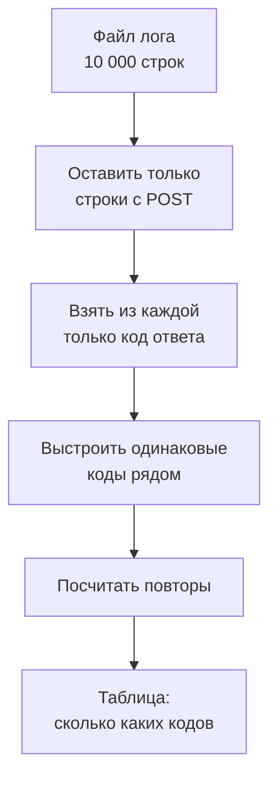
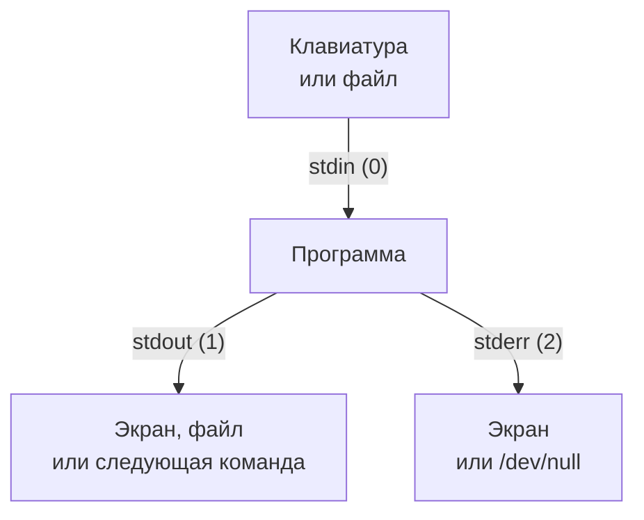
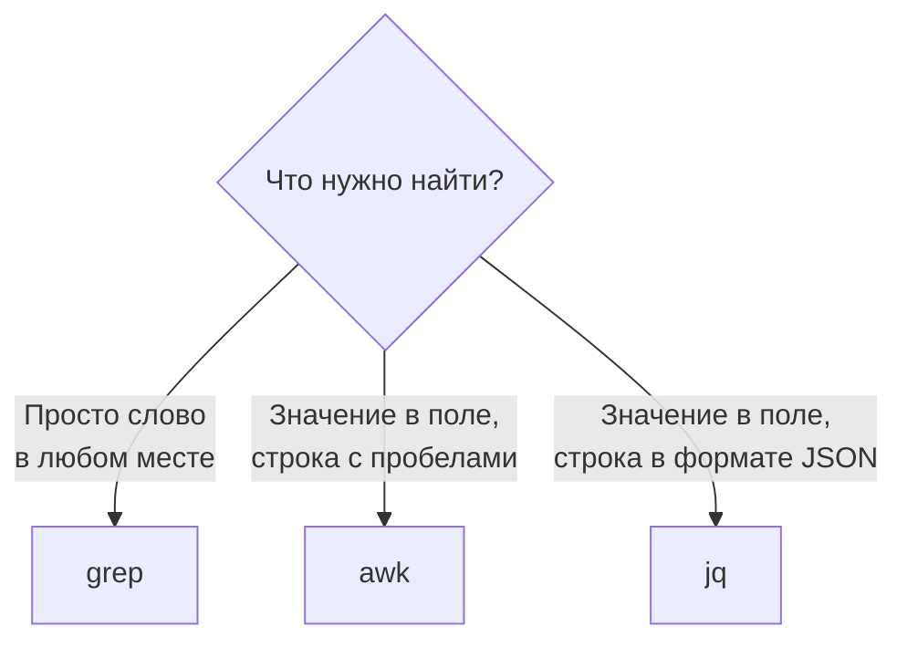

## Зачем это нужно

Я работаю с нагрузкой давно и начну с истории, знакомой каждому, кому выдавали доступ к серверу. Первый рабочий день, тебе говорят: «Посмотри логи, вечером нам было плохо». Лог (журнал: файл, куда программа записывает по строке на каждое событие) ты находишь за минуту. В нём два миллиона строк.

Мой первый такой файл я открыл в текстовом редакторе, он завис. Потом я искал глазами слово «ошибка», нашёл сорок штук и час разбирался, какие важны. Ни одна. Тогда коллега сел рядом, набрал одну строчку в терминале и через три секунды сказал: «Сбой был полминуты, и все ошибки в одном месте». Эту строчку я теперь набираю не думая, и ты научишься так же.

На работе это нужно вот для чего. Перед распродажей мы гоняем тест на «Магазине», и у тебя два вопроса: были ли ошибки и где было медленно. Ответ лежит в логе, а команды терминала достают его за секунды. Они пригодятся и для результатов Locust и k6 (программ, создающих нагрузку, темы 9 и 10): те тоже пишут текстовые файлы.

Шаг проекта: настоящие логи «Магазина» появятся, когда ты поднимешь стенд в [уроке 2.1](../02-web/01-client-server-http.md). Чтобы тренироваться сейчас, ты создашь **учебные логи**: 10 000 запросов за 10 минут в двух форматах (веб-сервера и JSON, как у «Магазина») с настоящей аварией. Найдёшь её минуту, маршрут и причину и запишешь вывод в `~/perf-lab/01-linux/log-report.md`. На логах стенда те же команды сработают без изменений.

## Что нужно знать

- Терминал, пути, `cat`, `head`, `>` и `>>`, `man` и `--help`: [урок 1.1](01-workstation-terminal.md). Там же мы поставили `jq`: он понадобится в конце.
- Каталог `~/perf-lab` из практики 1.1. Если его нет, выполни `mkdir -p ~/perf-lab/{results,reports,scripts}`.
- Глубже: те же инструменты, но с точки зрения администратора сервера, разобраны в [уроке 1.2 курса DevOps](https://distinguished-sre.github.io/devops/01-linux/02-text-pipes.html). Урок самодостаточен без него.

## Картина целиком

В сортировочном цехе на почте посылки едут по ленте, а вдоль неё стоят рабочие. У каждого одна простая задача: один достаёт письма с красной маркой, второй считает их, третий раскладывает по ящикам. Ни один не умеет всего, но вместе они отвечают на вопрос «сколько срочных писем пришло из Новосибирска».

Команды терминала устроены так же. Каждая **читает текст на входе, что-то с ним делает и выдаёт текст на выходе**. Символ `|` (конвейер, по-английски pipe) соединяет выход одной команды со входом следующей. Из десятка простых команд собирается любой отчёт по логу.



На каждом шаге данных либо меньше (фильтр), либо они меняют вид (остался один столбец), либо превращаются в число (подсчёт). Если результат странный, «обрежь» цепочку справа и посмотри, что вышло после каждого шага: ошибка почти всегда в одном звене.

Виджет ниже показывает те же шаги на двенадцати настоящих строках лога. Запусти его до чтения дальше.

<div class="viz" data-viz="linux-pipeline" data-stage="0"></div>

## Теория

### Лог: что это и как читать строку

Сервис не помнит, что с ним было час назад. Откуда тогда ответ на «почему упало»? Из журнала, который он вёл по ходу дела, как кассовая лента: каждая операция отдельной строкой. Только лог растёт на сотни строк в секунду, поэтому читать его приходится фильтрами, а не глазами.

Одно событие это одна строка, видов два. Первый пишет веб-сервер (программа, которая принимает запросы и отдаёт страницы), например nginx. Это журнал доступа (access log):

```text
10.0.0.28 - - [03/Oct/2026:10:00:00 +0000] "GET /api/products?page=2&size=20 HTTP/1.1" 200 1192 0.042
```

Поля идут через пробел в одном порядке, так что их удобно считать слева направо. Первое, `10.0.0.28`, это IP-адрес клиента (адрес его компьютера в сети, см. [урок 1.4](04-network-cli.md)). Второе и третье (два дефиса) остались с давних времён, когда там писали имя пользователя, нам не нужны. Четвёртое, `[03/Oct/2026:10:00:00`, время запроса (пятое, `+0000]`, часовой пояс). Шестое, `"GET`, метод: GET значит «получить», POST «отправить». Седьмое это путь.

Дальше три главных поля. Девятое, `200`, **код ответа**: 2xx значит успех, 4xx ошибку клиента (запросил товар, которого нет), 5xx ошибку сервера: он сам не справился. Нагрузочник смотрит прежде всего на 5xx. Десятое, `1192`, размер ответа в байтах. Последнее, `0.042`, время обработки в секундах. Команда `awk`, о которой я расскажу ниже, называет поля `$1`, `$2` и так далее, а последнее `$NF`. Значит, код это `$9`, а время `$NF`.

Время обработки стандартный формат не пишет: его добавляют в настройках веб-сервера. Без него найдёшь ошибки, но не медленные запросы.

Второй вид это JSON-строка. JSON это запись «имя: значение» в фигурных скобках (подробно в [уроке 2.2](../02-web/02-rest-json-auth.md)), по одному объекту на строку. Так пишет «Магазин»:

```text
{"ts": "2026-10-03T10:00:00.076731+00:00", "level": "INFO", "msg": "Запрос завершён", "method": "GET", "route": "/api/products", "path": "/api/products", "status": 200, "duration_ms": 42.0, "request_id": "7231fc1d02c4ffb16b57cd3a0f8a6363", "trace_id": "4bf92f3577b34da6a3ce929d0e0e4736"}
```

У каждого поля своё имя. `ts` это время, `route` шаблон маршрута (адрес без номеров), `duration_ms` время в миллисекундах, `request_id` номер запроса. Поле `trace_id` это номер цепочки шагов одного запроса: его разберём в [уроке 7.7](../07-observability/07-traces.md), пока не обращай внимания. В учебном `shop.log` его нет.

Осторожно: код и размер ответа это два числа рядом, легко спутать. Поэтому перед любой командой посмотри одну строку и запиши, что в каком поле. И время в логах почти всегда в UTC (единое мировое время без часовых поясов): «10:05» в логе может быть «13:05» на твоих часах.

> **Главное:** одно событие это одна строка. В строке веб-сервера нужное считают по номеру поля (код `$9`, время `$NF`), в JSON-строке по имени.
{: .key}

Строки читать мы научились. Но как передать их фильтру, а результат отправить дальше или в файл?

### Потоки и перенаправление: откуда данные приходят и куда уходят

Команды пишут разные люди, а соединяются легко: все договорились об одинаковых «трубах». У каждой программы их три. Вход (stdin, номер 0): откуда она читает, по умолчанию с клавиатуры. Выход (stdout, номер 1): куда пишет результат, по умолчанию на экран. Третья труба (stderr, номер 2) для жалоб: сообщения об ошибках идут на экран отдельным путём.



Конвейер `|` передаёт дальше только stdout: ошибка первой команды на вход второй не попадёт, а останется на экране. Оболочка (bash) умеет переключать трубы:

```text
команда > файл         результат в файл (старое содержимое стирается)
команда >> файл        результат дописывается в конец файла
команда < файл         читать вход из файла, а не с клавиатуры
команда 2> файл        в файл уходят только ошибки
команда > файл 2>&1    в файл уходят и результат, и ошибки
команда 2> /dev/null   ошибки выбрасываются
команда1 | команда2    результат первой становится входом второй
```

`>` и `>>` ты видел в [уроке 1.1](01-workstation-terminal.md). Запись `2>&1` читается: «ошибки (2) туда же, куда результат (1)». А `/dev/null` это «чёрный ящик»: всё, что в него записали, пропадает.

```bash
ls /nonexistent
ls /nonexistent 2> /dev/null
echo "после"
```

```text
ls: cannot access '/nonexistent': No such file or directory
после
```

Первая команда напечатала ошибку (каталога нет, `ls` пишет её в stderr). Во второй ошибку мы выбросили, и на экране тишина. Это удобно против шума, но опасно, если тишина прячет проблему: ставь `2> /dev/null` осознанно.

> **Прикинь сам:** что окажется в файле `out.txt` после `ls /etc /nonexistent > out.txt` и что появится на экране?
{: .predict}

В `out.txt` попадёт список `/etc`: `>` переключил только stdout. На экране останется ошибка про `/nonexistent`: это stderr. Чтобы поймать и её, нужно дописать `2>&1`.

Осторожно: `>` пишет в файл, а `|` передаёт команде, так что `ls | file.txt` даст `command not found` (`file.txt` не команда). И `>` стирает файл **до** запуска команды: `sort data.txt > data.txt` оставит файл пустым. Результат пиши в другой файл.

> **Главное:** у программы один вход и два выхода, а конвейер `|` передаёт дальше только обычный вывод. `>` пишет в файл, `|` передаёт команде.
{: .key}

Теперь о том, как открыть лог на сто тысяч строк.

### Просмотр больших файлов: less, head, tail, wc

Команда `cat` выбрасывает на экран весь файл разом: из 10 000 строк ты увидишь только хвост. Первое, что я делаю с незнакомым логом, считаю строки: `wc -l файл` (word count, флаг `-l`: lines). Потом смотрю края: `head -n 5 файл` показывает первые 5 строк, `tail -n 5 файл` последние 5. А `tail -f файл` (follow, «следить») не завершается: новые строки появляются на экране, как только их дописали. Выход `Ctrl+C`: так наблюдают за логом во время теста.

Для чтения подольше есть `less файл`: он открывает файл страницами. Пробел листает вперёд, `b` назад, `g` и `G` переносят в начало и в конец. `/слово` и `Enter` ищет, `n` ведёт к следующему совпадению. `F` включает режим «следить», как `tail -f`, `q` выход.

```bash
wc -l access.log
head -n 2 access.log
tail -n 1 access.log
```

```text
10000 access.log
10.0.0.28 - - [03/Oct/2026:10:00:00 +0000] "GET /api/products?page=2&size=20 HTTP/1.1" 200 1192 0.042
10.0.0.28 - - [03/Oct/2026:10:00:00 +0000] "GET /api/products/298 HTTP/1.1" 200 1174 0.012
10.0.0.25 - - [03/Oct/2026:10:09:58 +0000] "GET /api/products/1524 HTTP/1.1" 200 1287 0.015
```

В файле 10 000 строк. Первая запись в 10:00:00, последняя в 10:09:58, значит лог охватывает десять минут. Делим: 10 000 на 10 это около 1000 запросов в минуту, или 17 в секунду.

> **Прикинь сам:** лог теста вырос до 2 миллионов строк. Как за пять секунд узнать, когда он начался и когда закончился?
{: .predict}

`head -n 1 файл` покажет первую строку, то есть начало, `tail -n 1 файл` последнюю. Читать весь файл не нужно.

Осторожно: если терминал «завис», а в углу двоеточие или `(END)`, ты внутри `less`. Нажми `q`.

> **Главное:** большой файл не читают целиком: считают строки (`wc -l`), смотрят края (`head`, `tail`), следят за ростом (`tail -f`), листают через `less`.
{: .key}

Размер и формат лога известны. Теперь достанем нужные строки.

### grep: найти строки с нужным словом

Из 10 000 строк обычно нужны десять: ошибки, один пользователь, один маршрут. Для этого есть `grep`: это Ctrl+F для файла любого размера. `grep шаблон файл` читает файл по строкам и печатает те, где встретился шаблон. Шаблон это текст или **регулярное выражение** (regular expression, regex): запись «какие строки подходят» с особыми символами. Нам хватит трёх: `.` (любой один символ), `^` и `$` (начало и конец строки). Для «или» (`GET|POST`) нужен режим `grep -E` (extended, «расширенный»).

Флаги на каждый день. `-c` не печатает строки, а считает их. `-v` инвертирует: показывает строки, где шаблона нет. `-n` печатает номер строки, `-m 3` останавливается после трёх находок. `-A 2`, `-B 1` и `-C 3` добавляют строки после (after), до (before) и вокруг (context) найденной: так видно, что случилось перед ошибкой. Шаблон с пробелами берут в одинарные кавычки, иначе оболочка разрежет его на два слова.

Сколько запросов за заказами и сколько из них закончились кодом 500?

```bash
grep -c 'POST /api/orders' access.log
grep -c 500 access.log
grep -c ' 500 ' access.log
```

```text
397
28
20
```

Заказов 397. А вот 28 и 20 про «500», хотя ошибок с кодом 500 на самом деле 17. `grep 500` ищет цифры в любом месте строки: в номере товара (`/api/products/500`), в размере ответа, во времени. Пробелы вокруг отсеяли часть случайных совпадений, но у трёх строк размер ответа ровно 500 байт, и они прошли: 17 + 3 = 20. Выходит, `grep` не знает, где в строке код, а где размер. Точный ответ даёт `awk`, он смотрит в нужное поле.

Теперь контекст первой ошибки: `-m 1` оставляет первое совпадение, `-B 1 -A 2` добавляет строку до и две после.

```bash
grep -n -m 1 -B 1 -A 2 ' 500 40 ' access.log | cut -c1-110
```

```text
5019-10.0.0.13 - - [03/Oct/2026:10:05:00 +0000] "POST /api/cart/items HTTP/1.1" 201 2524 0.020
5020:10.0.0.20 - - [03/Oct/2026:10:05:00 +0000] "POST /api/orders HTTP/1.1" 500 40 1.804
5021-10.0.0.14 - - [03/Oct/2026:10:05:00 +0000] "GET /api/products/803 HTTP/1.1" 200 1285 0.017
5022-10.0.0.23 - - [03/Oct/2026:10:05:00 +0000] "POST /api/login HTTP/1.1" 200 3678 0.302
```

Двоеточие после номера (`5020:`) отмечает совпадение, дефис (`5019-`) соседние строки. Заказ закончился ошибкой в 10:05:00 и ждал 1,8 секунды. `cut -c1-110` обрезает вывод до 110 символов, чтобы строка влезла на экран.

> **Прикинь сам:** как показать все строки, которые не относятся к проверке `/healthz`, и сколько их, если проверок в логе 209?
{: .predict}

`grep -v healthz access.log` покажет их, а `grep -vc healthz access.log` посчитает: 10 000 минус 209, то есть 9791.

> **Главное:** `grep` ищет текст в любом месте строки и не знает про поля. Для «значение в таком-то поле» нужен `awk`.
{: .key}

Строки отбирать умеем. А как посчитать запросы каждого вида?

### sort, uniq, cut: группировка и подсчёт

Типичный вопрос по логу: «сколько запросов с каждым кодом ответа». Надо выбрать код из каждой строки, сгруппировать одинаковые и посчитать. Выбирает поле `cut -d' ' -f1,9`: он режет строку по разделителю (`-d`, delimiter) и оставляет выбранные поля (`-f`, fields), здесь первое и девятое.

Группировку делают две команды. Представь кладовщика, который считает коробки на ленте и записывает «5 красных», как только цвет сменился. Если идут вперемешку «красная, синяя, красная», у него выйдет три записи вместо двух. Так работает `uniq`: он склеивает только **соседние** одинаковые строки, а `uniq -c` пишет слева, сколько их склеилось. Чтобы одинаковые встали рядом, перед ним ставят `sort`, он выстраивает строки по алфавиту. Для чисел добавляют `-n` (иначе `10` окажется раньше `9`), а `-r` (reverse) переворачивает порядок. Получается шаблон «топ частых значений», который ты будешь вводить десятки раз:

```bash
команда_выбора_поля | sort | uniq -c | sort -rn | head
```

Читается так: выбери поле, сгруппируй, посчитай, самые частые наверх, оставь первые десять. Применим к кодам ответа:

```bash
awk '{print $9}' access.log | sort | uniq -c | sort -rn
```

```text
   8968 200
    890 201
     69 404
     47 401
     17 500
      9 503
```

Слева сколько раз, справа код. Успешных 8968 + 890 = 9858. Ошибок клиента (4xx) 69 + 47 = 116. Ошибок сервера (5xx) 17 + 9 = 26. Сумма 10 000: все строки на месте. Доля ошибок сервера 26 из 10 000, то есть 0,26%.

А вот что будет без `sort`:

```bash
awk '{print $9}' access.log | uniq -c | head -n 5
```

```text
      3 200
      1 201
     10 200
      1 404
      4 200
```

Код 200 разбросан по трём группам: между ними встретились 201 и 404. Сумму по коду из такого вывода не получить.

> **Прикинь сам:** как показать три самых активных клиентских IP? IP это первое поле лога.
{: .predict}

Подставляем первое поле в шаблон: `awk '{print $1}' access.log | sort | uniq -c | sort -rn | head -n 3`. Результат: `10.0.0.28` (531 запрос), `10.0.0.13` (530), `10.0.0.24` (521).

Осторожно: `sort` без `-n` ставит `100` перед `20`, а `uniq` без `sort` считает неверно.

> **Главное:** «топ частых значений» это `выбор поля | sort | uniq -c | sort -rn | head`. Первый `sort` нужен, потому что `uniq` склеивает только соседей.
{: .key}

Поле мы выбирали через `awk`. Пора его объяснить.

### awk: поля, условия и подсчёты

Чтобы найти «строки, где девятое поле не меньше 500» или посчитать среднее, нужен язык, который понимает поля. Это `awk`: как таблица в Excel, только на потоке строк. Его программа состоит из пар «условие { действие }». Условие верно: выполняется действие. Условия нет: действие для каждой строки. Действия нет: строка печатается.

```text
awk '{print $9}'                 печатать девятое поле каждой строки
awk '$9 >= 500'                  печатать строки, где девятое поле не меньше 500
awk '$9 >= 500 {print $4, $7}'   для таких строк печатать время и путь
```

Программу берут в одинарные кавычки, иначе оболочка сама подставит `$9`. Блок `END { ... }` выполняется один раз после последней строки: там выводят итоги. `NR` это номер текущей строки (в `END` он равен числу строк), `int()` отбрасывает дробную часть. Разделитель полей в `awk` любая серия пробелов, другой задают флагом (`awk -F,`). `cut` режет по одному символу, поэтому подряд идущие пробелы дадут ему пустые поля.

Когда были ошибки сервера? Берём строки с кодом от 500 и печатаем часы и минуты. Функция `substr(строка, начало, длина)` вырезает кусок: в `[03/Oct/2026:10:05:00` первый символ скобка, время начинается с 14-го, и пять символов дают `10:05`:

```bash
awk '$9 >= 500 {print substr($4, 14, 5)}' access.log | sort | uniq -c
```

```text
     26 10:05
```

Все 26 ошибок в одну минуту. А сколько длился сбой? Берём время целиком и оставляем первую и последнюю строку: `sed -n '1p;$p'` печатает именно их (`sed` это потоковый редактор, нам нужна только эта роль):

```bash
awk '$9 >= 500 {print substr($4, 14, 8)}' access.log | sed -n '1p;$p'
```

```text
10:05:00
10:05:36
```

Сбой длился 36 секунд. Теперь самое полезное: среднее время ответа по каждому маршруту. Для этого у `awk` есть **массивы**: `count[$9]++` увеличивает счётчик под «ключом» `$9`, а ключом может быть что угодно (код, IP, путь). Это `sort | uniq -c` внутри `awk`. Вывод по шаблону делает `printf`: `%d` целое число, `%.1f` число с одним знаком после запятой, `%-24s` строка шириной 24 с выравниванием влево, `\n` перенос строки. Функция `sub(/шаблон/, "замена", $7)` заменяет часть поля.

```bash
awk '{sub(/\?.*/, "", $7); sub(/\/[0-9]+$/, "/{id}", $7);
      n[$6 " " $7]++; s[$6 " " $7] += $NF}
     END {for (r in n) printf "%-24s %5d %6.1f мс\n", r, n[r], s[r] / n[r] * 1000}' access.log | sort -k4 -rn
```

```text
"POST /api/login           925  254.7 мс
"POST /api/orders          397  199.7 мс
"GET /api/products        3772   36.8 мс
"POST /api/cart/items      519   15.4 мс
"GET /api/products/{id}   2438   12.7 мс
"GET /api/cart             746   10.6 мс
"GET /api/categories       994    6.3 мс
"GET /healthz              209    2.1 мс
```

Разберём по шагам. Первый `sub` отрезает от пути всё от знака вопроса (`\?`: `?` в шаблонах особый символ). Второй превращает `/api/products/298` в `/api/products/{id}`, чтобы номера товаров не плодили маршруты. В шаблонах `.*` значит «любые символы до конца», `[0-9]+` «одна или больше цифр подряд», `$` «конец поля». Дальше `n[...]++` считает запросы по паре «метод и путь», `s[...] += $NF` складывает время. В `END` для каждого ключа печатается число запросов и среднее: сумма, делённая на число и умноженная на 1000 (секунды в миллисекунды). `sort -k4 -rn` ставит самые медленные наверх по четвёртому слову строки. Кавычка перед методом (`"POST`) осталась от формата лога.

Логин самый медленный: в «Магазине» он намеренно такой из-за проверки пароля (см. [тему 11](../11-bottlenecks/index.md)). А вот заказ со средним 199,7 мс подозрителен.

> **Прикинь сам:** заказов 397. У 371 успешного время около 0,097 с, у 26 упавших около 1,7 с (я посмотрел их в логе отдельно). Какое среднее получится?
{: .predict}

Складываем: 371 × 0,097 ≈ 36 с и 26 × 1,7 ≈ 44 с, итого 80 с. Делим на 397: около 0,2 с, то есть 200 мс, как в таблице. Двадцать шесть упавших (6,5% запросов) подняли среднее вдвое. Так среднее обманывает, подробнее в [уроке 8.1](../08-perf-theory/01-latency-throughput.md).

<div class="viz" data-viz="chart" data-type="bar" data-title="Среднее время ответа по маршрутам (из access.log)" data-x="login,orders,products,cart/items,products/{id},cart,categories,healthz" data-series='[{"name":"среднее время","values":[254.7,199.7,36.8,15.4,12.7,10.6,6.3,2.1]}]' data-unit="мс" data-x-label="маршрут" data-y-label="время" data-explain="Два высоких столбца: логин (медленный по замыслу) и заказы (средний повышен 26 упавшими запросами, у успешных около 97 мс). Остальные маршруты быстрее 40 мс."></div>

Два высоких столбца с разными причинами: логин медленный по замыслу, заказ испорчен аварией.

<details markdown="1">
<summary>Для любопытных: как найти 95-й процентиль</summary>

Процентиль p95 это время, быстрее которого отработали 95% запросов. Времена сортируют и берут значение на позиции 95%:

```bash
awk '{print $NF}' access.log | sort -n | awk '{a[NR] = $1} END {print "p50", a[int(NR*0.5)], "p95", a[int(NR*0.95)], "p99", a[int(NR*0.99)], "max", a[NR]}'
```

```text
p50 0.022 p95 0.243 p99 0.325 max 2.159
```

Половина запросов быстрее 22 мс, 95% быстрее 243 мс, самый медленный занял 2,159 с.

</details>

Осторожно: если формат лога поменялся (добавили поле), номера сдвигаются, и конвейер молча считает не то. Поэтому сначала `head -n 1` и сверка `$9`.

> **Главное:** `awk` понимает поля: условия по полю, счётчики в массивах, итоги в `END`. Для вопросов про поле он надёжнее `grep`.
{: .key}

Это работает, пока поля разделены пробелами. А что с JSON?

### jq: то же самое для JSON-логов

В JSON-строке поля называются по именам, и порядок не гарантирован, поэтому `awk '{print $9}'` здесь бесполезен. Нужен инструмент, который понимает структуру: `jq` (мы поставили его в [уроке 1.1](01-workstation-terminal.md)). Это `grep` и `awk` для JSON. `jq 'фильтр' файл` применяет фильтр к каждому объекту: `.status` значение поля `status`. `select(условие)` пропускает подходящие объекты. `[.ts, .status]` собирает поля в массив (список значений), а `| @tsv` делает из него строку с табами. Флаг `-r` (raw) убирает кавычки вокруг строк.

Учебный `shop.log` содержит те же 10 000 событий в формате «Магазина». Достанем время, код, маршрут и длительность всех ошибок сервера:

```bash
jq -r 'select(.status >= 500) | [.ts[11:19], .status, .route, .duration_ms] | @tsv' shop.log | head -n 4
```

```text
10:05:00	500	/api/orders	1804.0
10:05:03	503	/api/orders	1940.0
10:05:03	503	/api/orders	1902.0
10:05:04	503	/api/orders	2121.0
```

`.ts[11:19]` вырезает из `2026-10-03T10:05:00.868365+00:00` символы с 11 по 18: `10:05:00`. Результат совпал с `awk`. А причину лог хранит прямо в записи:

```bash
jq -r 'select(.status >= 500).error' shop.log | sort | uniq -c
```

```text
     26 payment timeout
```

Все 26 ошибок: `payment timeout`, заказ не дождался ответа сервиса оплаты. Два способа дали одно число: это проверка. Выбор инструмента такой:



Осторожно: `grep '"status": 500'` по JSON хрупок, он зависит от пробела после двоеточия. Зато для «сколько раз встречается слово» `grep -c` быстрее и короче.

> **Главное:** для JSON-логов `jq` делает то же, что `awk` для строк с пробелами, только поля берутся по имени.
{: .key}

Инструменты на руках. Остаётся порядок, в котором ими пользоваться.

### Как вести расследование по логу

Новичок хватается за `grep` с первой мысли и тонет в выводе. Опытный идёт от общего к частному, и я тоже: помогает именно порядок.

<div class="viz" data-viz="flow" data-steps='[{"title":"Размер и границы","text":"`wc -l`, `head -n 1`, `tail -n 1`: сколько строк, с какого по какое время."},{"title":"Посмотри формат","text":"Одна-две строки глазами: какое поле что значит. Запиши номера полей."},{"title":"Общая картина","text":"Сколько запросов каждого кода: `awk` + `sort` + `uniq -c`. Доля ошибок."},{"title":"Когда и где","text":"Ошибки по минутам и по маршрутам: найди окно сбоя и виновника."},{"title":"Контекст","text":"`grep -B -A` или `jq select` вокруг первой ошибки: что было до неё."},{"title":"Запиши вывод","text":"В `log-report.md`: что нашёл, команда, число. Команду сохрани, чтобы повторить."}]'></div>

На каждом шаге ты задаёшь один вопрос и получаешь одно число. Если сразу искать «ошибки», легко получить не те числа, как с `grep 500` выше.

Перед распродажей менеджер спросит: «Что падало в прошлый раз?» Ты ответишь не «где-то были ошибки», а «26 заказов за 36 секунд, оплата не ответила».

> **Главное:** расследование идёт от общего к частному: размер, формат, коды, когда и где, контекст, запись вывода.
{: .key}

## Практика

Все файлы курса складываем в `~/perf-lab/01-linux`. Команды ниже воспроизводимы: учебные логи генерируются с фиксированным «зерном» случайных чисел, поэтому у тебя получатся **те же числа**, что в уроке. Если твои числа совпали, ты всё сделал правильно.

### 1. Создай учебные логи

Скрипт на Python ниже читать не нужно: он создаёт два файла с учебными логами, и всё. Скопируй блок целиком (кнопкой копирования в углу блока) и вставь в терминал одним действием. Команда `cat > файл <<'EOF'` записывает в файл всё, что напечатано ниже, до строки `EOF`. Одинарные кавычки вокруг `EOF` нужны, чтобы оболочка не пыталась подставлять значения вместо `$` и `%`.

```bash
mkdir -p ~/perf-lab/01-linux
cd ~/perf-lab/01-linux
cat > gen_logs.py <<'EOF'
#!/usr/bin/env python3
"""Учебные логи: access.log (формат веб-сервера) и shop.log (JSON, как у «Магазина»)."""
import json
import random
from datetime import datetime, timedelta, timezone

rnd = random.Random(42)           # то же зерно, те же строки у всех
N = 10000                         # сколько запросов
START = datetime(2026, 10, 3, 10, 0, 0, tzinfo=timezone.utc)
IPS = ["10.0.0.%d" % i for i in range(11, 31)]

# (метод, шаблон маршрута, доля запросов, типичная задержка в секундах)
ROUTES = [
    ("GET", "/api/products", 0.38, 0.035),
    ("GET", "/api/products/{id}", 0.24, 0.012),
    ("GET", "/api/categories", 0.10, 0.006),
    ("POST", "/api/login", 0.09, 0.240),
    ("GET", "/api/cart", 0.08, 0.010),
    ("POST", "/api/cart/items", 0.05, 0.015),
    ("POST", "/api/orders", 0.04, 0.090),
    ("GET", "/healthz", 0.02, 0.002),
]


def pick():
    x, acc = rnd.random(), 0.0
    for r in ROUTES:
        acc += r[2]
        if x < acc:
            return r
    return ROUTES[0]


def make_path(route):
    if route == "/api/products":
        return "/api/products?page=%d&size=20" % (1 + int(rnd.random() * 5))
    if route == "/api/products/{id}":
        return "/api/products/%d" % (1 + int(rnd.random() * 10000))
    return route


events = []
t = START
for i in range(N):
    t += timedelta(seconds=rnd.random() * 0.12)
    method, route, _, base = pick()
    path = make_path(route)
    status, size = 200, 300 + int(rnd.random() * 4000)
    dur = base * (0.6 + rnd.random() * 0.8)
    if rnd.random() < 0.01:
        dur *= 6                          # редкие медленные запросы
    if route == "/api/products/{id}" and rnd.random() < 0.03:
        status, size = 404, 31
    if route == "/api/login" and rnd.random() < 0.05:
        status, size = 401, 38
    if route in ("/api/cart/items", "/api/orders"):
        status = 201
    if route == "/api/orders" and 5 * 60 <= (t - START).total_seconds() < 5 * 60 + 40:
        status, size, dur = rnd.choice([500, 503, 500]), 40, 1.2 + rnd.random()   # сбой оплаты
    if route == "/healthz":
        size = 15
    events.append((t, rnd.choice(IPS), method, route, path, status, size, round(dur, 3)))

with open("access.log", "w") as a, open("shop.log", "w") as j:
    for t, ip, method, route, path, status, size, dur in events:
        a.write('%s - - [%s +0000] "%s %s HTTP/1.1" %d %d %.3f\n'
                % (ip, t.strftime("%d/%b/%Y:%H:%M:%S"), method, path, status, size, dur))
        level = "ERROR" if status >= 500 else "WARNING" if dur > 1 else "INFO"
        row = {"ts": t.isoformat(), "level": level, "msg": "Запрос завершён", "method": method,
               "route": route, "path": path.split("?")[0], "status": status,
               "duration_ms": round(dur * 1000, 2), "request_id": "%032x" % rnd.getrandbits(128)}
        if status >= 500:
            row["error"] = "payment timeout"
        j.write(json.dumps(row, ensure_ascii=False) + "\n")
print("готово: %d строк в access.log и shop.log" % N)
EOF
python3 gen_logs.py
ls -lh
```

```text
готово: 10000 строк в access.log и shop.log
total 3.3M
-rw-r--r-- 1 student student 912K Oct  3 10:20 access.log
-rw-r--r-- 1 student student 3.1K Oct  3 10:19 gen_logs.py
-rw-r--r-- 1 student student 2.4M Oct  3 10:20 shop.log
```

**Как читать вывод:** `готово: ...` печатает сам скрипт. В `ls -lh` проверь размеры файлов: `access.log` около 900 КБ, `shop.log` около 2,4 МБ. Даты и размер `gen_logs.py` у тебя будут другими, это нормально. Аварию мы заложили в скрипт намеренно: 26 заказов с кодами 500 и 503 в минуту 10:05. Ты не знаешь деталей, как не знал бы их на работе: найди сам.

**Типичные ошибки:**

- `python3: can't open file 'gen_logs.py'`: ты не в каталоге `~/perf-lab/01-linux`. Проверь `pwd`.
- `SyntaxError`: при копировании потерялась строка. Удали `gen_logs.py` и повтори блок целиком, с первой строки `cat > ...` до `EOF`.
- Если `ls -lh` показывает файл `access.log` размером 0, скрипт упал. Прочитай последние строки его вывода: там причина.

### 2. Познакомься с форматом

```bash
cd ~/perf-lab/01-linux
wc -l access.log shop.log
head -n 3 access.log
tail -n 2 access.log
less access.log
```

```text
  10000 access.log
  10000 shop.log
  20000 total
10.0.0.28 - - [03/Oct/2026:10:00:00 +0000] "GET /api/products?page=2&size=20 HTTP/1.1" 200 1192 0.042
10.0.0.28 - - [03/Oct/2026:10:00:00 +0000] "GET /api/products/298 HTTP/1.1" 200 1174 0.012
10.0.0.19 - - [03/Oct/2026:10:00:00 +0000] "GET /api/products/2782 HTTP/1.1" 200 3777 0.014
10.0.0.28 - - [03/Oct/2026:10:09:58 +0000] "GET /healthz HTTP/1.1" 200 15 0.002
10.0.0.25 - - [03/Oct/2026:10:09:58 +0000] "GET /api/products/1524 HTTP/1.1" 200 1287 0.015
```

В `less` сделай: пробел (страница вперёд), `G` (конец файла), `g` (начало), `/POST` и `Enter` (первое совпадение), `n` (следующее), `q` (выход).

**Как читать вывод:** `wc -l` с двумя файлами печатает строки по каждому и итог. Время в первой и последней строке: десять минут лога. Запиши себе: код ответа в девятом поле, время в последнем.

**Типичные ошибки:** `less` «не закрывается»: ты внутри программы, а не в оболочке. Нажми `q`.

### 3. Посмотри за логом вживую

Тест идёт, и ты хочешь видеть новые строки по мере появления. Для этого понадобятся два терминала (как открыть второе окно, написано в [уроке 1.1](01-workstation-terminal.md), раздел «Подготовка рабочего места»). В первом:

```bash
cd ~/perf-lab/01-linux
touch live.log
tail -f live.log
```

Команда ждёт. Во втором терминале допиши строку:

```bash
cd ~/perf-lab/01-linux
echo '10.0.0.99 - - [03/Oct/2026:12:00:00 +0000] "GET /healthz HTTP/1.1" 200 15 0.002' >> live.log
```

В первом терминале строка появится сразу. Допиши ещё две и останови `tail -f` сочетанием `Ctrl+C`. Удали за собой пробный файл: `rm live.log`.

**Как читать:** `>>` дописывает в конец (`>` стёр бы файл), `tail -f` следит за концом файла. Так во время нагрузочного теста наблюдают за логом сервера.

### 4. Найди аварию

Идём по порядку из схемы расследования. Сначала общая картина:

```bash
awk '{print $9}' access.log | sort | uniq -c | sort -rn
```

```text
   8968 200
    890 201
     69 404
     47 401
     17 500
      9 503
```

Ошибки сервера есть, 26 штук (17 + 9). Теперь когда и где:

```bash
awk '$9 >= 500 {print substr($4, 14, 5)}' access.log | sort | uniq -c
awk '$9 >= 500 {print $7}' access.log | sort | uniq -c
awk '$9 >= 500 {print substr($4, 14, 8)}' access.log | sed -n '1p;$p'
```

```text
     26 10:05
     26 /api/orders
10:05:00
10:05:36
```

Все 26 ошибок: одна минута, 10:05, один маршрут, `/api/orders`, окно 36 секунд. Остальная нагрузка в это время работала: запросов в минуту (`awk '{print substr($4, 14, 5)}' access.log | sort | uniq -c`) около 1000 и в 10:05 тоже (979 запросов).

Контекст первой ошибки и результат всех заказов:

```bash
grep -n -m 1 -B 1 -A 1 ' 500 40 ' access.log | cut -c1-115
grep 'POST /api/orders' access.log | awk '{print $9}' | sort | uniq -c
```

```text
5019-10.0.0.13 - - [03/Oct/2026:10:05:00 +0000] "POST /api/cart/items HTTP/1.1" 201 2524 0.020
5020:10.0.0.20 - - [03/Oct/2026:10:05:00 +0000] "POST /api/orders HTTP/1.1" 500 40 1.804
5021-10.0.0.14 - - [03/Oct/2026:10:05:00 +0000] "GET /api/products/803 HTTP/1.1" 200 1285 0.017
    371 201
     17 500
      9 503
```

**Как читать вывод:** из 397 попыток оформить заказ 26 (6,5%) закончились ошибкой сервера, все в течение 36 секунд, и каждая упавшая ждала около 1,7 секунды, а не 0,1. Типичный отпечаток зависшего внешнего сервиса: ответ приходит не «мгновенно с ошибкой», а после таймаута.

### 5. Определи причину по JSON-логу

Тот же сбой в логе «Магазина». Оговорка: коды 500 и 503 в учебном логе упрощены. Настоящий «Магазин» на таймаут оплаты отвечает `504` с причиной `payment timeout` (а `503` у него означает `database pool timeout`, пул соединений с базой исчерпан), но формат записи тот же, и команды работают без изменений.

```bash
jq -r 'select(.status >= 500) | [.ts[11:19], .status, .route, .duration_ms] | @tsv' shop.log | head -n 4
jq -r 'select(.status >= 500).error' shop.log | sort | uniq -c
jq -r 'select(.status >= 500) | .request_id' shop.log | head -n 2
```

```text
10:05:00	500	/api/orders	1804.0
10:05:03	503	/api/orders	1940.0
10:05:03	503	/api/orders	1902.0
10:05:04	503	/api/orders	2121.0
     26 payment timeout
4722f083c3758381138fb80309bf3c60
4d7fecfe38fd153c62d3b65f44ff7982
```

**Как читать вывод:** причина записана прямо в лог (`payment timeout`, оплата не ответила вовремя), а `request_id` это «номер дела»: по нему в настоящем «Магазине» можно найти все строки одного запроса и в логе сервиса оплаты. В реальных логах поле `error` не всегда есть, тогда причину ищут в логах соседних сервисов по `request_id`.

### 6. Найди самые медленные маршруты

Выполни конвейер со средними по маршрутам из теории и сверь вывод с таблицей. Затем найди перцентили:

```bash
awk '{print $NF}' access.log | sort -n | awk '{a[NR] = $1} END {print "p50", a[int(NR*0.5)], "p95", a[int(NR*0.95)], "p99", a[int(NR*0.99)], "max", a[NR]}'
awk '$7 == "/api/login" {print $NF}' access.log | sort -n | awk '{a[NR] = $1} END {print "login: запросов", NR, "p50", a[int(NR*0.5)], "p95", a[int(NR*0.95)], "max", a[NR]}'
```

```text
p50 0.022 p95 0.243 p99 0.325 max 2.159
login: запросов 925 p50 0.241 p95 0.330 max 1.995
```

**Как читать вывод:** по всему логу 95% запросов быстрее 243 мс, а у логина «нормальное» время 241 мс (типичный, p50). Максимум 2,159 с принадлежит упавшему заказу, не логину: проверь `sort -n` по последнему полю и посмотри самые долгие строки: `sort -k11 -rn access.log | head -n 3 | cut -c1-115`.

**Типичные ошибки:** если `awk` вывел пустые значения, ты ошибся с номером поля: вернись к `head -n 1` и пересчитай. Если `p95` выглядит как `0.0` или пусто, а `NR` равен 0, условие не совпало ни с одной строкой (например, написал `/api/Login` с большой буквы).

### 7. Сохрани отчёт

```bash
cd ~/perf-lab/01-linux
{
  echo "# Разбор логов (учебный access.log)"
  echo "Строк: $(wc -l < access.log)"
  echo "Ошибок 5xx: $(awk '$9 >= 500' access.log | wc -l)"
  echo "Когда: $(awk '$9 >= 500 {print substr($4, 14, 8)}' access.log | sed -n '1p;$p' | tr '\n' ' ')"
  echo "Где: $(awk '$9 >= 500 {print $7}' access.log | sort -u | tr '\n' ' ')"
  echo "Причина (по shop.log): $(jq -r 'select(.status >= 500).error' shop.log | sort -u)"
} > log-report.md
cat log-report.md
```

```text
# Разбор логов (учебный access.log)
Строк: 10000
Ошибок 5xx: 26
Когда: 10:05:00 10:05:36 
Где: /api/orders 
Причина (по shop.log): payment timeout
```

Фигурные скобки `{ ...; }` собирают вывод нескольких команд в один поток, и `> log-report.md` записывает всё разом. `wc -l < access.log` берёт файл через stdin, поэтому выводит одно число без имени файла. `sort -u` убирает повторы (то же, что `sort | uniq`), `tr '\n' ' '` заменяет переводы строк пробелами, чтобы уместить результат в одну строку. Этот отчёт ты можешь повторить одной командой на новом логе, когда он появится.

> Вывод конвейера выглядит странно? Прогони его по частям, добавляя по одной команде, и только потом спроси нейросеть, на каком шаге данные пропали. Ответ проверь на небольшом файле, где ты знаешь правильный счёт.
{: .ai}

## Сломай и почини

**Поломка.** Коллега прислал конвейер и просит: «посчитай, сколько ответов с каждым кодом»:

```bash
awk '{print $9}' access.log | uniq -c | sort -rn | head -n 3
```

```text
     58 200
     52 200
     47 200
```

Результат выглядит как «много запросов с кодом 200», но он показывает не то. Задача: объясни, что с ним не так, и исправь. Подсказка: сравни с таблицей из практики (8968 запросов с кодом 200).

<details markdown="1">
<summary>Разбор</summary>

Конвейер выводит по несколько групп с одним и тем же кодом 200: каждая группа это серия **соседних** строк. `uniq -c` схлопывает только соседей, а в логе 200 перемежается с 201, 404 и другими кодами. Мы видим самые длинные серии подряд, а не суммы.

Починка: перед `uniq` поставить `sort`, чтобы одинаковые коды встали рядом:

```bash
awk '{print $9}' access.log | sort | uniq -c | sort -rn | head -n 3
```

```text
   8968 200
    890 201
     69 404
```

Урок: всегда проверяй результат конвейера на здравый смысл. 58 запросов из 10 000 это слишком мало для самого частого кода. Сумма по всем строкам вывода должна давать число строк в файле. Для проверки: `awk '{print $9}' access.log | sort | uniq -c | awk '{s += $1} END {print s}'` напечатает 10000.

</details>

## ИИ в помощь

Логи читаются конвейерами из `grep`, `sort` и `uniq`, а нейросеть помогает собрать такой конвейер и объяснить готовый. Общие правила на странице [ИИ-помощник](../ai.md).

**Задача:** собрать конвейер для подсчёта в логе.

```text
Я учусь анализировать логи в Linux (Ubuntu 24.04, bash). Формат строки access.log:
<вставь 3 строки из access.log>
Нужно: посчитать запросы по кодам ответа и вывести топ-5 самых частых путей. Дай команду на grep/awk/sort/uniq и объясни каждую часть конвейера. Не используй программы, которых нет в Ubuntu по умолчанию.
```
{: .wrap}

**Проверь ответ:** запусти команду на `access.log` из урока и сверь итог с `wc -l` и `grep -c`. Типичная ошибка: нейросеть берёт не ту колонку в `awk '{print $9}'` (номер зависит от формата строки) или забывает `sort` перед `uniq -c`, и счёт получается неверным.

**Задача:** вытащить поле из JSON-лога через `jq`.

```text
Строка JSON-лога сервиса:
<вставь одну строку shop.log>
Напиши команду jq, которая выберет записи со status >= 500 и выведет время, маршрут и длительность в виде таблицы. Объясни синтаксис jq по частям, я его только изучаю.
```
{: .wrap}

**Проверь ответ:** выполни команду на `shop.log` и сравни число строк с `grep -c` по тому же условию. Типичная ошибка: имена полей, которых нет в твоём логе (`.time` вместо `.ts`), и фильтры в синтаксисе другой версии: проверь `jq --help`.

Настоящие боевые логи могут содержать токены, адреса и персональные данные: перед отправкой в чат замени их на `<токен>`, `<ip>`, `<email>`. Учебные логи урока этого не требуют.

## Словарик урока

| Термин | Простыми словами |
|---|---|
| Лог (log) | Файл, куда программа записывает по строке на каждое событие |
| Access log | Лог веб-сервера: одна строка на каждый запрос |
| JSON-лог | Лог, где каждая строка это объект с именованными полями |
| Код ответа (status) | Число в ответе HTTP: 2xx успех, 4xx ошибка клиента, 5xx ошибка сервера |
| Конвейер (pipe) `\|` | Передача вывода одной команды на вход следующей |
| stdin, stdout, stderr | Три потока программы: ввод, вывод, сообщения об ошибках |
| Перенаправление | Отправка потока в файл: `>`, `>>`, `2>`, `2>&1` |
| `/dev/null` | «Чёрный ящик»: всё, что туда записали, исчезает |
| `grep` | Находит строки, где есть шаблон |
| Регулярное выражение | Шаблон со спецсимволами (`.`, `^`, `$`, `[0-9]`), описывающий подходящие строки |
| `sort`, `uniq -c` | Упорядочить строки и схлопнуть соседние одинаковые с подсчётом |
| `awk` | Мини-язык: условия, поля `$1`…`$NF`, счётчики, итоги |
| Поле (field) | Часть строки между разделителями; `$9` девятое слово |
| `jq` | `grep` и `awk` для JSON: фильтры по именам полей |
| `request_id` | Номер запроса в логе: по нему собирают след одного запроса |
| Процентиль (p95) | Значение, быстрее которого 95% запросов |

## Вопросы с собеседований

Раздел для повторения: ответь вслух, потом открой ответ. Вопросы с пометкой `[на скорость]` тренируй на время: ответ за 30 секунд.

### 1. [junior] [часто] Как найти в логе все строки с ошибкой и посчитать их?

<details markdown="1">
<summary>Ответ</summary>

`grep -c 'ERROR' файл` считает строки с шаблоном. Если лог в формате веб-сервера и ошибки определяются кодом ответа, надёжнее смотреть конкретное поле: `awk '$9 >= 500' файл | wc -l`. `grep` ищет текст в любом месте строки, и число 500 может встретиться в ID, размере и времени.

**Что хотят услышать:** `grep -c`, понимание, что `grep` не знает про поля, `awk` для точного условия.

**Красный флаг:** «открою файл в редакторе и посчитаю».

</details>

### 2. [junior] [часто] Что делает конвейер `sort | uniq -c | sort -rn`?

<details markdown="1">
<summary>Ответ</summary>

Первая сортировка ставит одинаковые строки рядом, `uniq -c` схлопывает соседей и пишет, сколько их было, вторая сортировка по числу (`-n`) в обратном порядке (`-r`) ставит самые частые наверх. Это универсальный «топ частых значений»: статусы, IP, маршруты.

**Что хотят услышать:** зачем первый `sort` (`uniq` видит только соседей), зачем `-n`.

**Красный флаг:** «`uniq` сам всё считает без `sort`».

</details>

### 3. [junior] [часто] Чем `>` отличается от `|`?

<details markdown="1">
<summary>Ответ</summary>

`>` записывает вывод команды в файл, стирая прежнее содержимое (`>>` дописывает). `|` передаёт вывод на вход другой команды, файл не создаётся. Справа от `>` стоит имя файла, справа от `|` стоит команда.

**Что хотят услышать:** файл против следующей команды, перезапись против дописывания.

**Красный флаг:** считает их взаимозаменяемыми.

</details>

### 4. [junior] Что такое stdin, stdout и stderr?

<details markdown="1">
<summary>Ответ</summary>

Три потока, которые есть у каждой программы: stdin (0) откуда она читает, stdout (1) куда пишет результат, stderr (2) куда пишет сообщения об ошибках. Конвейер соединяет stdout одной команды со stdin другой, а ошибки идут мимо, на экран. Поэтому `2>&1` или `2> файл` нужны, когда ошибки тоже нужно записать.

**Что хотят услышать:** три потока, что конвейер передаёт только stdout.

**Красный флаг:** «ошибки тоже идут по конвейеру».

</details>

### 5. [junior] Как наблюдать за логом в реальном времени?

<details markdown="1">
<summary>Ответ</summary>

`tail -f файл` показывает последние строки и добавляет новые по мере записи, остановка `Ctrl+C`. Можно открыть файл в `less` и нажать `F` (то же, что `tail -f`, выход `Ctrl+C`, после чего можно листать). Если нужны только ошибки: `tail -f файл | grep ERROR`.

**Что хотят услышать:** `tail -f`, комбинация с `grep`.

**Красный флаг:** «буду заново открывать файл».

</details>

### 6. [junior] Как посчитать, сколько запросов вернули каждый код ответа?

<details markdown="1">
<summary>Ответ</summary>

Вытащить поле с кодом и сгруппировать: `awk '{print $9}' access.log | sort | uniq -c | sort -rn` (номер поля зависит от формата лога, его сверяют по одной строке). Либо в одном `awk`: `awk '{c[$9]++} END {for (s in c) print s, c[s]}' access.log`.

**Что хотят услышать:** выбор поля, `sort` перед `uniq`, проверка номера поля.

**Красный флаг:** «`grep` по каждому коду отдельно» (долго и легко пропустить код).

</details>

### 7. [junior] Что значит `2> /dev/null` и когда это опасно?

<details markdown="1">
<summary>Ответ</summary>

Сообщения об ошибках (stderr) отправляются в `/dev/null`, «чёрный ящик», и пропадают. Удобно убрать шум, например права доступа в `find`. Опасно, когда ошибка настоящая: команда «молча» ничего не делает, а причина скрыта. Ставь осознанно и проверяй результат.

**Что хотят услышать:** что такое `/dev/null`, риск скрытых ошибок.

**Красный флаг:** добавляет `2> /dev/null` ко всему подряд.

</details>

### 8. [junior] В чём разница между `cut` и `awk` при разборе строки лога?

<details markdown="1">
<summary>Ответ</summary>

`cut` режет по одному символу-разделителю: хорошо для CSV, но несколько пробелов подряд даст пустые поля. `awk` по умолчанию считает разделителем любое количество пробелов, умеет условия (`$9 >= 500`), счётчики и арифметику. Для логов с выровненными пробелами и для расчётов `awk` удобнее.

**Что хотят услышать:** разделитель, условия и счёт в `awk`.

**Красный флаг:** «это одно и то же».

</details>

### 9. [middle] В логе nginx 100 000 строк, нужно найти самые медленные маршруты. Как?

<details markdown="1">
<summary>Ответ</summary>

Нужно, чтобы в логе было время обработки запроса (в nginx это `$request_time`, его добавляют в формат лога). Затем группируем по маршруту: `awk` с массивами, где ключ это метод и путь (без параметров и номеров), считает число запросов и сумму времени, в `END` печатается среднее, и `sort -rn` ставит самые медленные наверх. Среднее лучше дополнить процентилями: `sort -n` и выбор строки на позиции 95%.

**Что хотят услышать:** нормализация путей, массивы в `awk`, замечание про процентили против среднего.

**Красный флаг:** смотрит только максимум или только среднее.

</details>

### 10. [middle] `grep 500 access.log` показал 28 строк, а ошибок 500 по статусу 17. Откуда разница?

<details markdown="1">
<summary>Ответ</summary>

`grep` ищет текст «500» в любом месте строки: в номере товара, размере ответа, времени. Поэтому в счёт попали и строки с кодом 200, у которых число 500 стоит в другом поле. Надёжный способ: `awk '$9 == 500'`, который смотрит в поле статуса. Либо `grep` с точным контекстом, например `' 500 '`, но и он не гарантирует, что это статус.

**Что хотят услышать:** `grep` не знает про поля, пример с `awk` или контекстом, привычка проверять числа вторым способом.

**Красный флаг:** принимает число `grep` за число ошибок.

</details>

### 11. [middle] Как найти, в какую минуту случилась авария, если в логе миллион строк?

<details markdown="1">
<summary>Ответ</summary>

Выбрать строки-ошибки (`awk '$9 >= 500'`), вырезать из поля времени часы и минуты (`substr`), сгруппировать: `sort | uniq -c`. Минута с пиком и есть искомая. Потом расследовать эту минуту: `grep -B -A` вокруг первой ошибки, `request_id` для связи с логами других сервисов.

**Что хотят услышать:** от общего к частному, группировка по времени, контекст вокруг первой ошибки.

**Красный флаг:** читает файл целиком руками.

</details>

### 12. [junior] [на скорость] Как посмотреть последние 20 строк файла и следить за новыми?

<details markdown="1">
<summary>Ответ</summary>

`tail -n 20 -f файл`, остановка `Ctrl+C`.

**Что хотят услышать:** `tail`, `-f`, ответ за пару секунд.

**Красный флаг:** `cat файл`.

</details>

### 13. [junior] [на скорость] Как показать строки, где нет слова `healthz`?

<details markdown="1">
<summary>Ответ</summary>

`grep -v healthz файл`: флаг `-v` инвертирует совпадение.

**Что хотят услышать:** `-v` без подсказки.

**Красный флаг:** не знает флага.

</details>

### 14. [junior] [на скорость] Почему перед `uniq -c` ставят `sort`?

<details markdown="1">
<summary>Ответ</summary>

`uniq` склеивает только **соседние** одинаковые строки. Без сортировки одинаковые значения разбросаны по файлу, и каждая серия считается отдельно.

**Что хотят услышать:** слово «соседние».

**Красный флаг:** «чтобы было красивее».

</details>

### 15. [junior] [на скорость] Как вывести девятое поле каждой строки?

<details markdown="1">
<summary>Ответ</summary>

`awk '{print $9}' файл`. Программа в одинарных кавычках, иначе оболочка подставит значение `$9` сама.

**Что хотят услышать:** `awk`, `$9`, одинарные кавычки.

**Красный флаг:** путает поле и номер строки.

</details>

## Проверено на версиях

Ubuntu 24.04.3 LTS и 26.04 LTS: GNU `grep` 3.11, `awk` (mawk 1.3.4 и gawk 5.2), `sort` и `uniq` из coreutils 9.4, `jq` 1.7.1, Python 3.12. Все приёмы в уроке одинаково работают в `mawk` и `gawk`. Октябрь 2026.

## Итог урока: ты умеешь

- [ ] Прочитать строку лога по полям и записать, что в каком поле.
- [ ] Посмотреть большой файл: `wc -l`, `head`, `tail`, `less`, следить за ним через `tail -f`.
- [ ] Искать `grep` с флагами `-c`, `-v`, `-n`, `-E`, `-A/-B/-C` и понимать, что он ищет текст, а не поле.
- [ ] Соединять команды конвейером и различать `|`, `>`, `>>`, `2>`, `2>&1`.
- [ ] Строить «топ частых значений»: `sort | uniq -c | sort -rn | head`.
- [ ] Выбирать поле и считать по условию в `awk`, считать среднее и процентили.
- [ ] Достать поля из JSON-лога через `jq`.
- [ ] Найти аварию в логе по плану «размер, формат, общая картина, когда и где, контекст» и записать вывод в `log-report.md`.

Дальше: [урок 1.3. Процессы и ресурсы](03-processes-resources.md), где ты научишься смотреть, чем занята сама машина: процессор, память и диск.
