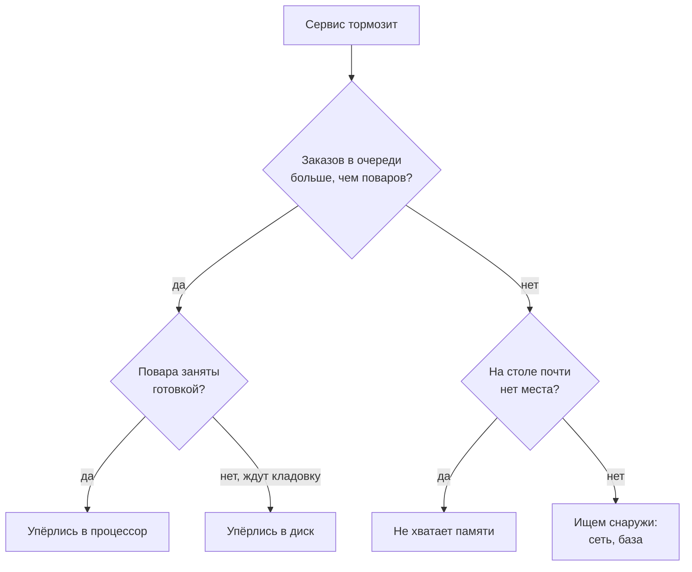
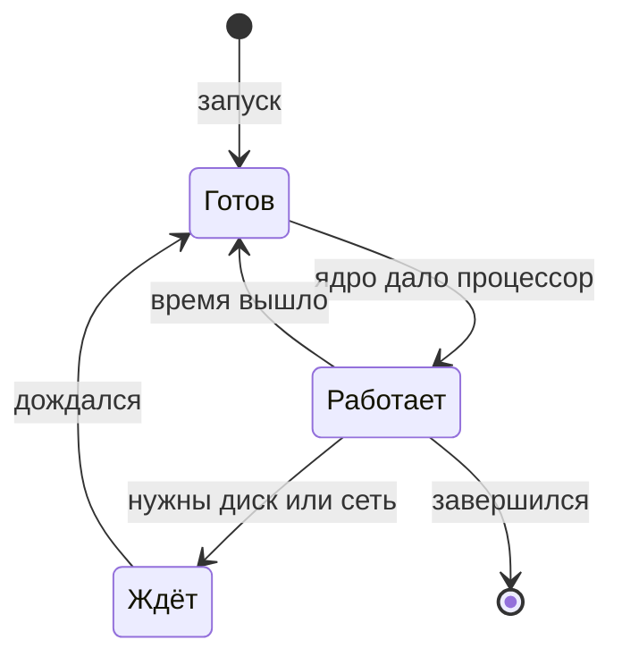
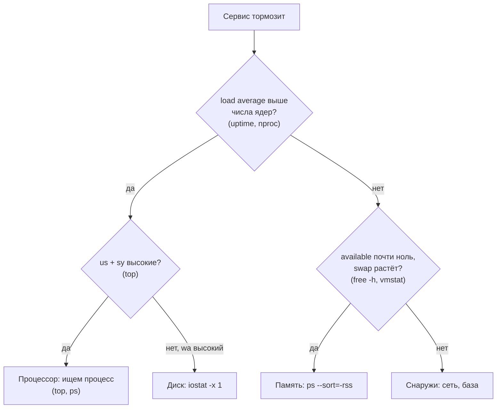

## Зачем это нужно

Я много лет смотрю, что творится на серверах под нагрузкой, и сейчас покажу, с чего начинаю. Представь твой первый рабочий день перед распродажей. Нагрузочный тест закончился, в отчёте две строки: «ответы стали медленными, а на 200 пользователях сервис упал». Руководитель говорит: «Глянь, что там с машиной».

Со мной было так в первый год. Я полдня читал код сервиса и искал в нём ошибку. Потом зашёл коллега, набрал три команды и сказал: «Память кончилась, система гоняет её на диск». Код трогать не требовалось. С тех пор я начинаю с машины, а не с кода.

У машины четыре ресурса, которые могут кончиться. **Процессор** (CPU) считает, **память** (RAM) хранит то, с чем программы работают сейчас, **диск** хранит надолго, **сеть** связывает машины. Запущенная программа называется **процессом**, и каждый берёт свою долю этих ресурсов. Ресурс, который кончился первым и не даёт сервису ускориться, называют **узким местом** (bottleneck). Поиск узких мест это половина работы нагрузочного тестировщика, на нём построена [тема 11](../11-bottlenecks/index.md).

Сеть разберём в [уроке 1.4](04-network-cli.md), здесь процессор, память и диск.

Шаг проекта: ты ставишь наблюдателей (`sysstat`), намеренно нагружаешь свою машину процессором, памятью и диском и учишься узнавать каждую перегрузку в `top`, `free`, `vmstat` и `iostat`. Результат это шпаргалка `~/perf-lab/01-linux/resource-notes.md`: что смотреть, как выглядят норма и перегрузка. Она пригодится, когда стенд «Магазин» будет работать под нагрузкой.

## Что нужно знать

- Терминал, `man`, `--help`, `sudo apt install`: [урок 1.1](01-workstation-terminal.md). Паспорт машины (`nproc`, `free -h`) оттуда будет нашей точкой отсчёта.
- Конвейеры `|`, `grep`, `sort`, `awk`, `head`: [урок 1.2](02-text-logs.md). Мы будем выделять нужное из длинного вывода `ps` и `top`.
- Глубже: [соответствующий урок курса DevOps](https://distinguished-sre.github.io/devops/01-linux/05-disk-memory-cpu.html) разбирает те же ресурсы с точки зрения администратора. Здесь всё нужное для курса собрано полностью.

## Картина целиком

Возьми кухню ресторана. **Повара** это ядра процессора: каждый в один момент готовит одно блюдо. **Рабочий стол** это память: быстрый, но маленький. **Кладовка** это диск: вместительная, но ходить туда долго. **Заказы** это процессы, и каждый хочет повара, место на столе и иногда визит в кладовку.

Кухня тормозит по четырём причинам. Заказов больше, чем поваров. Стол завален, заготовки носят в кладовку. Повара стоят у двери кладовки и ждут. Или в кладовке нет места.



Два вопроса, про очередь и про место на столе, отсекают большую часть случаев. Два «нет» значат, что ждут снаружи. В конце теории схема вернётся с командами.

## Теория

### Процесс: что запущено на машине

Открой на ноутбуке диспетчер задач: сотня строк, половину ты не узнаёшь. На сервере то же самое, и этот список отвечает на вопрос «кто виноват».

Программа на диске это файл, как рецепт в книге: сам он ничего не делает. Когда его запустили, система загружает программу в память, выдаёт ей процессор и следит за ней. Это запущенное состояние и есть **процесс**: повар, который прямо сейчас готовит по рецепту. Аналогия ломается в одном: у процесса есть номер. Он называется **PID** (process ID), по нему к процессу обращаются: «останови 48211». Список всех процессов даёт `ps aux`.

```bash
yes > /dev/null &
ps aux --sort=-%cpu | head -n 3
kill %1
```

```text
[1] 48211
USER         PID %CPU %MEM    VSZ   RSS TTY      STAT START   TIME COMMAND
student    48211 99.6  0.0   8344   640 pts/0    R    10:40   0:12 yes
root         1204  1.2  0.4 1231096 67840 ?       Ssl  Oct01  35:07 /usr/lib/snapd/snapd
```

`yes` бесконечно печатает букву `y`, а `> /dev/null` выбрасывает вывод ([урок 1.2](02-text-logs.md)). Это простейшая «нагрузка на процессор»: программа ничего не ждёт. Знак `&` отправил её в фон: оболочка написала `[1] 48211`, то есть номер задания и PID. `--sort=-%cpu` ставит сверху самых прожорливых (минус значит «по убыванию»), `head -n 3` оставляет заголовок и две строки. У `yes` в `%CPU` 99,6: одно ядро занято целиком.

Две колонки про память путают. `VSZ` (virtual size) это весь адрес, который процесс «заказал»: цифра бывает огромной, а используется малая часть. `RSS` (resident set size) это память, которую процесс **реально занимает** сейчас. Когда говорят «процесс занимает 400 МБ», имеют в виду `RSS`.

> **Прикинь сам:** у процесса `RSS` 400 МБ, а `VSZ` 4 ГБ. Сколько памяти он занимает и стоит ли волноваться?
{: .predict}

<details markdown="1">
<summary>Ответ</summary>

Он держит 400 МБ (`RSS`). Четыре гигабайта это зарезервированный адрес, волноваться из-за него не нужно. Подозрителен быстрый рост `RSS`.

</details>

В колонке `STAT` состояние процесса, и нужны три буквы. `R` (running): работает на ядре или готов работать и ждёт очереди. `S` (sleeping): спит и ждёт события, например запроса по сети, это нормально для большинства процессов. `D` (uninterruptible sleep): ждёт ответа диска и не слышит даже сигналов. Много процессов в `D` значит проблему с диском.



Процесс идёт по кругу «работает, ждёт, снова готов». «Готов» и «Работает» в `ps` оба `R`, «Ждёт» это `S` или `D`. Поэтому процессов в `R` бывает больше, чем ядер: лишние стоят в очереди.

<details markdown="1">
<summary>Для любопытных: состояния T и Z, фоновые задания</summary>

`T` (stopped) значит «остановлен», например после `Ctrl+Z`. `Z` (zombie): процесс завершился, но родитель, который его запустил, не забрал код завершения. Ресурсов он не берёт, но много «зомби» значит ошибку в родителе.

Фоном управляют `команда &`, `jobs`, `fg`, `bg` и `Ctrl+Z`; PID по имени находит `pgrep -a имя`.

</details>

> **Главное:** процесс это запущенная программа с номером (PID). Для расследования важны `%CPU`, `RSS` и состояние `R`, `S`, `D`.
{: .key}

Виновника нашли. Теперь его надо остановить, и аккуратно.

### Сигналы: как остановить процесс

Программа зависла, и ты закрываешь окно. На сервере окна нет, а процесс нельзя «выключить»: его можно только попросить.

Просьба называется **сигналом** (signal): короткое сообщение процессу. Первый сигнал ты уже знаешь: `Ctrl+C` шлёт `SIGINT` (номер 2), «прерви работу». Второй, `SIGTERM` (15), посылает команда `kill PID`: вежливое «заверши работу». Если программа это умеет, она успевает сохранить данные и закрыть файлы, если не умеет, просто завершается.

Третий устроен иначе. `SIGKILL` (9), команда `kill -9 PID`, до процесса не доходит: систему просят убрать его немедленно. Он ничего не сохранит, это как выдернуть шнур, пока документ записывается. Поэтому порядок такой: сначала `kill`, и только если процесс не реагирует, `kill -9`.

Осторожно: процесс вправе проигнорировать `kill`. Все процессы с одним именем останавливает `pkill имя`.

> **Главное:** процессу посылают сигнал. Сначала вежливый `kill` (SIGTERM), и только потом `kill -9` (SIGKILL), у которого процесс ничего не успевает сохранить.
{: .key}

Останавливать научились. Теперь главное: куда уходит время процессора.

### Процессор: ядра и куда уходит их время

На сервере сто процессов, а ядер у машины восемь. Как они делятся?

Ядро процессора (core) это «повар»: в каждый момент выполняет один процесс. Сколько их у тебя, ты записал в паспорт ([урок 1.1](01-workstation-terminal.md)): это число из `nproc`. Система выдаёт процессу кусочек времени в несколько миллисекунд и передаёт ядро следующему. Один повар обслуживает несколько столиков по очереди, но если столиков много, каждый ждёт долго: готовые процессы встают в очередь.

`top` и `vmstat` раскладывают время ядра в проценты. Важны четыре доли. `us` (user): работа обычных программ, твоего кода, сервиса, базы. `sy` (system): работа самой системы по просьбе программ, например сеть и диск. `id` (idle): ядру нечего делать. `wa` (iowait): ядро свободно, но процессы ждут диск. Последняя особенно ценна: процессор не занят, а система тормозит из-за диска.

Посмотрим на 8-ядерной машине с 12 процессами `yes`:

```bash
top -b -n 1 | head -n 12
```

```text
top - 10:41:07 up 3 days,  2:23,  1 user,  load average: 7.60, 2.20, 0.80
Tasks: 312 total,  13 running, 299 sleeping,   0 stopped,   0 zombie
%Cpu(s): 99.7 us,  0.3 sy,  0.0 ni,  0.0 id,  0.0 wa,  0.0 hi,  0.0 si,  0.0 st
MiB Mem :  15880.2 total,   9312.7 free,   3187.0 used,   3380.5 buff/cache
MiB Swap:   4096.0 total,   4096.0 free,      0.0 used.  11300.4 avail Mem

    PID USER      PR  NI    VIRT    RES    SHR S  %CPU  %MEM     TIME+ COMMAND
  48211 student   20   0    8344    640    576 R  66.7   0.0   0:41.12 yes
  48212 student   20   0    8344    640    576 R  66.7   0.0   0:41.09 yes
  48213 student   20   0    8344    640    576 R  66.7   0.0   0:41.05 yes
```

Флаг `-b` печатает один снимок и выходит, `-n 1` задаёт один кадр. Для точных %CPU смотри второй кадр (`-n 2`). В `Tasks` 13 процессов в `R`: 12 наших `yes` и сам `top`. В `%Cpu(s)` 99,7% ушло на обычные программы, простоя нет, а `wa` ноль, значит диск ни при чём.

В таблице каждый `yes` получил 66,7% ядра. Откуда число? У восьми ядер вместе 800%, делим на 12 процессов: 800 ÷ 12 = 66,7.

> **Прикинь сам:** на 4-ядерной машине работают 6 процессов `yes`. Сколько `%CPU` у каждого?
{: .predict}

У четырёх ядер вместе 400%, делим на 6: примерно 66,7. 

Процент у процесса считается от **одного** ядра, поэтому у многопоточной программы (она запускает несколько рабочих «ниток», и каждая занимает своё ядро) `%CPU` бывает больше 100. В `ps` этот `%CPU` ещё и среднее за всё время жизни процесса, а в `top` за последние секунды. А `%Cpu(s)` считается от **всех** ядер сразу: шкалы разные. Нажми в `top` клавишу `1`, и он покажет каждое ядро отдельно. Это важно для однопоточного сервиса (одна «нитка»): одно ядро занято на 100%, семь простаивают, общая загрузка 12% безобидна, а сервис уже упёрся в предел. Так ведёт себя сервис с одним воркером (рабочим процессом, который принимает запросы): [урок 11.2](../11-bottlenecks/02-cpu.md).

<details markdown="1">
<summary>Для любопытных: остальные колонки процессора и неприятный `sy`</summary>

`st` (steal) бывает на виртуальной машине (твоя виртуалка в Multipass или WSL2 тоже виртуальная): гипервизор (программа, делящая физический компьютер между виртуалками) отдал это время соседней.

Высокое `sy` (выше 20-30%, ориентир, не закон) значит, что ядро системы тратит время на переключение между процессами, сеть и диск, а не на твой код.

</details>

Осторожно: 100% процессора не всегда плохо. Если машина считает и очереди нет, это полезная работа. Плохо, когда готовых процессов заметно больше, чем ядер: запросы ждут. Или когда однопоточный сервис упёрся в своё ядро: остальные свободны, а его запросы стоят в очереди.

> **Главное:** время ядра делится на `us`, `sy`, `id` и `wa`, а 100% загрузки плохо, когда работе приходится ждать: процессов больше, чем ядер, или однопоточный сервис упёрся в своё ядро.
{: .key}

Процент показывает занятость, но не длину очереди. Нужна цифра, которая считает ждущих.

### Load average: сколько процессов хотят работать

Касса занята на 100%. Это один неторопливый покупатель или сто человек в очереди? По проценту не понять.

Для очереди в Linux есть **load average** («средняя нагрузка»): среднее число процессов, которые работают, ждут ядро (`R`) или ждут диск (`D`). Если касс четыре и людей четыре, никто не ждёт. Если людей двенадцать, восемь стоят в очереди. Число показывают `uptime`, `top` и мониторинг, и чисел **три**: среднее за последние 1, 5 и 15 минут.

```text
load average: 9.87, 5.12, 2.31
```

Пусть `uptime` показал `9.87, 5.12, 2.31`. За минуту в среднем 9,87 процесса хотели процессор, за пять 5,12, за пятнадцать 2,31. Первое число больше второго, а то больше третьего: нагрузка **растёт**.

Число надо сравнить с числом ядер (`nproc`). Возьмём 8 ядер (тогда 9,87 это чуть больше 1,2 на ядро). Load average 8: все ядра заняты, очереди нет, это предел без запаса. Load average 12: четыре процесса ждут, и 12 ÷ 8 даёт 1,5 на ядро. Меньше 0,7 на ядро обычно спокойно (запас на всплески: это практическое правило, не закон), около 1 предел, выше 1 перегрузка.

> **Прикинь сам:** load average 4,0. Это перегрузка?
{: .predict}

Зависит от ядер. На двух ядрах 4 ÷ 2 = 2 на ядро, это перегрузка вдвое. На шестнадцати 4 ÷ 16 = 0,25, почти пусто. Цифра без числа ядер ничего не значит.

Поиграй с виджетом: процессы то приходят, то уходят. Подвигай «ядер» и «процессов».

<div class="viz" data-viz="linux-load-average" data-cores="4" data-load="6"></div>

Красные кружки это процессы без ядра, жёлтая черта число ядер, толстая линия load average. Смотри, как медленно она догоняет изменения: поэтому чисел три. На 8-ядерной машине тихо, и вдруг запускают 12 неостанавливающихся процессов:

<div class="viz" data-viz="chart" data-type="line" data-title="Как растут три load average после запуска 12 процессов" data-x="0,1,2,3,5,7,10,15" data-series='[{"name":"за 1 минуту","values":[0,7.6,10.4,11.4,11.9,12,12,12]},{"name":"за 5 минут","values":[0,2.2,4,5.4,7.6,9,10.4,11.4]},{"name":"за 15 минут","values":[0,0.8,1.5,2.2,3.4,4.5,5.8,7.6]}]' data-unit="" data-x-label="минут после старта" data-y-label="load average" data-explain="Среднее за минуту догоняет настоящую нагрузку 12 уже к третьей минуте, за пять минут к пятнадцатой, а среднее за пятнадцать минут даже через пятнадцать минут ещё не дошло до 12. Если через пять минут первое число 11,9, а третье 3,4: нагрузка пришла недавно."></div>

Три значения говорят, **когда** началась нагрузка. Высоки все три: сервис перегружен давно. Высоко только первое: нагрузка пришла недавно, возможно всплеск.

Осторожно: load average не процент, он легко бывает 50. И в нём считаются процессы в `D`, которые ждут диск. Поэтому высокий load average при свободном процессоре и высоком `wa` означает проблему диска, а не процессора.

> **Проверь понимание:** `uptime` на 4-ядерной машине показал `load average: 1.20, 3.80, 6.10`. Что происходит с нагрузкой?

<details markdown="1">
<summary>Ответ</summary>

Нагрузка **спадает**: 15 минут назад было 6,1 на 4 ядра (перегрузка), пять минут назад 3,8 (почти предел), сейчас 1,2 (спокойно). Пик прошёл, причину замедлений ищи в логах за эти 15 минут.

</details>

> **Главное:** load average это очередь на процессор (и на диск), и читать его надо на ядро: делим на `nproc`, около 1 это предел.
{: .key}

С процессором ясно. Остаётся память, где «свободно» почти ничего, и это нормально. Почему?

### Память: что такое available и почему free обманчиво мал

Ты запускаешь `free` и видишь, что из 16 ГБ свободно 200 МБ. Паника? Нет.

На рабочем столе лежат документы, с которыми ты работаешь, и это память программ. Остальное место занимают бумаги, которые ты недавно брал и держишь под рукой: **кэш диска** (в выводе `buff/cache`). Так система не читает недавние файлы заново. Понадобится место, и старые бумаги уберут в шкаф: оно по сути свободно.

Linux занимает всю пустую память под кэш, поэтому `free` почти всегда мал. Настоящий показатель называется `available`: сколько можно отдать программам, считая пустую память и кэш, который освободится по первому требованию.

```bash
free -h
```

```text
               total        used        free      shared  buff/cache   available
Mem:            15Gi       3.1Gi       9.2Gi       412Mi       3.3Gi        11Gi
Swap:          4.0Gi          0B       4.0Gi
```

Ключ `-h` печатает размеры понятно (`Gi` это гигабайты, `Mi` мегабайты). Всего 15 ГБ, программы заняли 3,1 (`used`), пусто 9,2 (`free`), кэш 3,3, а доступно 11 (`available`). Про `Swap` в следующем разделе. Теперь та же машина, когда один процесс съел почти всё:

```text
               total        used        free      shared  buff/cache   available
Mem:            15Gi        14Gi       182Mi       412Mi       741Mi       412Mi
Swap:          4.0Gi       2.7Gi       1.3Gi
```

`available` упал до 412 МБ, кэш почти исчез (его отдали программам). Тревожит именно `available`: беда начинается, когда его меньше десяти процентов от всей памяти (практическое правило: с меньшим запасом первый всплеск уже загонит систему в swap).

> **Прикинь сам:** `free -h` показывает `free 300Mi`, `buff/cache 9Gi`, `available 9.5Gi`. Памяти не хватает?
{: .predict}

<details markdown="1">
<summary>Ответ</summary>

Хватает: `available` 9,5 ГБ, столько можно отдать программам, освободив кэш. Тревогой стали бы малый `available` и рост swap.

</details>

Что делает система, когда `available` кончается совсем?

> **Главное:** смотри на `available`, а не на `free`: Linux держит пустую память под кэш диска, и маленький `free` это норма.
{: .key}

### Когда память кончилась: swap, OOM killer и утечки

Нехватка памяти страшнее нехватки процессора: сервис не замедляется, а пропадает.

Сначала система спасается диском. **Swap** (раздел или файл подкачки) это место, куда она убирает редко нужные куски памяти (страницы по 4 КБ). Диск в сотни раз медленнее RAM, поэтому активный swap это беда: процессор простаивает, а всё тормозит. Признак виден в `vmstat`: колонки `si` и `so` (swap in и swap out) перестают быть нулями.

Если не помогло, срабатывает **OOM killer** (out of memory killer): ядро системы выбирает жертву (обычно процесс, который занял больше всего памяти) и убивает её сигналом `SIGKILL`. Сервис «падает» без ошибок в своём логе: ему не дали ничего записать. След остаётся в сообщениях ядра:

```bash
sudo dmesg -T | grep -i "killed process"
```

```text
[Sat Oct  3 11:02:44 2026] Out of memory: Killed process 51877 (python3) total-vm:6291456kB, anon-rss:5873212kB
```

`dmesg` печатает сообщения ядра, `-T` делает время читаемым, `sudo` нужен для доступа. Ядро убило `python3` с номером 51877, державший около 5,6 ГБ (`anon-rss`, его реальная память). Если сервис «пропал» во время теста, а в его логе пусто, проверь это первым делом. А как найти едока, пока он жив?

```bash
ps aux --sort=-rss | head -n 4
```

```text
USER         PID %CPU %MEM    VSZ   RSS TTY      STAT START   TIME COMMAND
student    52310 12.0 87.5 15728640 14221312 pts/1  S    10:55   2:03 python3 leak.py
postgres    1432  0.8  3.1 1840232 504880 ?      Ss   Oct01   4:18 postgres: shop shop
```

`--sort=-rss` ставит сверху самых прожорливых по реальной памяти. `RSS` в килобайтах: 14 221 312 КБ это примерно 13,6 ГБ (меньше `VSZ`, как и должно быть), виновник `python3 leak.py`. В `top` то же даёт клавиша `M`.

Бывает, что процесс растёт понемногу. Это **утечка памяти** (memory leak): программа берёт память и не отдаёт, и после остановки нагрузки `RSS` не падает. «Магазин» так себя ведёт при `LEAK_ENABLED=1`: см. [урок 11.4](../11-bottlenecks/04-memory-soak.md).

Осторожно: если сервис живёт в контейнере, `free` и `top` внутри него показывают память **всего компьютера**, а не лимит контейнера: об этом [урок 5.4](../05-docker/04-limits-stats.md).

> **Главное:** сначала swap (медленно), потом OOM killer убивает процесс без записи в его логе. Следы ищи в `dmesg`.
{: .key}

Осталось то, где всё хранится.

### Диск: сколько места и как быстро он работает

Диск ломается двумя независимыми способами: в кладовке нет места, или кладовщик не успевает приносить продукты.

Начнём с места. `df -h` (disk free) показывает занятость каждого раздела, `du -sh каталог` (disk usage) считает, сколько занимает один каталог: `-s` итог, `-h` понятные единицы.

```bash
df -h /
du -h --max-depth=1 ~/perf-lab | sort -h | tail -n 3
```

```text
Filesystem      Size  Used Avail Use% Mounted on
/dev/nvme0n1p2  468G  121G  324G  28% /
4.0K	/home/student/perf-lab/scripts
12K	/home/student/perf-lab/01-linux
48K	/home/student/perf-lab
```

Корень занят на 28%, свободно 324 ГБ. Когда `Use%` подбирается к 100%, не пишутся логи и падают базы. Вторая показывает самые большие подкаталоги (`sort -h` правильно сортирует `4.0K`, `12M`, `3.1G`).

Теперь скорость. Диск не успевает, когда к нему стоит очередь запросов. Её показывает `iostat -x 1` из `sysstat`: расширенная статистика (`-x`) каждую секунду.

```text
avg-cpu:  %user   %nice %system %iowait  %steal   %idle
           1.8    0.0    9.4    21.3     0.0    67.5

Device     r/s      w/s     rkB/s     wkB/s   r_await  w_await  aqu-sz  %util
nvme0n1    0.00  3720.00      0.00 951200.00     0.00     0.52    1.93  92.40
```

Здесь идёт 3720 записей в секунду (`w/s`), около 930 МБ в секунду (`wkB/s`). Запрос ждёт в среднем полмиллисекунды (`w_await`), в очереди почти два запроса (`aqu-sz`). `%util` это доля времени, когда диск был занят: 92,4%. У обычного жёсткого диска около 100% значит насыщение. Быстрые SSD и NVMe (диски без движущихся частей) обслуживают много запросов сразу, и 100% у них само по себе не беда. Поэтому смотри на `await` и `aqu-sz`: растут, значит диск не справляется. Вверху `%iowait` 21,3%: столько времени процессор ждал диск.

Почти всё сразу показывает `vmstat 1` (virtual memory statistics), строка в секунду.

```text
procs -----------memory---------- ---swap-- -----io---- -system-- ------cpu-----
 r  b   swpd   free   buff  cache   si   so    bi    bo   in   cs us sy id wa st
12  0      0 9638492 241512 3690112    0    0     0    12 4310 1980 99  1  0  0  0
 2  3      0 9120004 241512 4100008    0    0     0 951200 1810  920  2  9 67 21  0
```

Настоящую первую строку `vmstat` пропускают (это среднее с момента включения), в примере её нет. Здесь первая строка: в очереди на процессор 12 процессов (`r`), `us` 99. Вторая: диск пишет (`bo`), три процесса ждут его (`b`), `wa` 21%.

> **Прикинь сам:** load average 6 на 8 ядрах, процессор простаивает на 70%, `wa` равен 25%. Где искать проблему?
{: .predict}

<details markdown="1">
<summary>Ответ</summary>

В диске. Процессор простаивает, но `wa` 25% показывает, что процессы ждут ввода-вывода, а они в состоянии `D` входят в load average. Смотри `iostat -x 1` (`%util`, `await`) и ищи процесс, который много пишет или читает.

</details>

Осторожно: `df` молчит о скорости, а `iostat` о месте.

Место кончается и по числу файлов (inodes, записей о файлах): миллион крошечных файлов забьёт лимит при свободных гигабайтах, покажет `df -i`.

> **Главное:** у диска две независимые беды: место (`df -h`) и скорость (`iostat -x 1`, `vmstat`). Смотри очередь и `await`, а не только `%util`.
{: .key}

Как не метаться между четырьмя признаками, когда всё тормозит?

### Метод USE: что проверять про каждый ресурс

Когда всё тормозит, хочется смотреть всё сразу, и это путь к растерянности. Опытные люди задают про каждый ресурс три вопроса, это метод **USE**: Utilization, Saturation, Errors (занятость, очередь, ошибки). Занят ли ресурс и на сколько процентов, есть ли очередь, были ли сбои.

У процессора занятость это `us + sy`, очередь это load average против ядер и колонка `r`. У памяти занятость видна в `available`, очередь это `si` и `so`, ошибка это OOM killer в `dmesg`. У диска занятость это `%util`, очередь это `aqu-sz`, `await` и `wa`. У места очереди нет, а ошибка звучит в логах `No space left on device`. Вот схема из начала, теперь с командами:



Осторожно: «занят на 100%» и «есть очередь» это разные вещи. Ресурс на 100% без очереди работает на полную мощность, а с очередью начинает ограничивать систему. На 8 ядрах процессор занят на 30%, но load average 12: десяток процессов ждёт диск, а загрузка процессора их не видит. Очередь надёжнее занятости.

> **Главное:** про каждый ресурс спрашивай три вещи: занят ли, есть ли очередь, были ли ошибки. Очередь важнее занятости.
{: .key}

### Наблюдение во время теста

Во время теста разовый снимок почти бесполезен: нагрузка нарастает, и важна динамика. Простейший вариант: писать вывод в файл параллельно с тестом.

```bash
vmstat 1 > ~/perf-lab/results/vmstat-test1.txt &
```

`>` отправляет вывод в файл, `&` уводит команду в фон. После теста её останавливают `kill %1` или `pkill vmstat`, а файл остаётся: его разбирают `awk`, например считают средний `us`. Для одного процесса есть `pidstat -u -r -p PID 1` (тоже из `sysstat`): процессор (`-u`) и память (`-r`) каждую секунду. В [теме 7](../07-observability/index.md) то же станет автоматическим, с графиками в Grafana.

Вернёмся к отчёту «ответы стали медленными, на 200 пользователях упали». Теперь у тебя есть порядок: очередь процессов, память, диск, и запись цифр рядом с тестом. Коллеге из моей истории хватило трёх команд.

> **Главное:** во время теста пиши `vmstat 1` и `iostat -x 1` в файл, а не смотри разово: по записи видно, когда и что упёрлось.
{: .key}

## Практика

Все упражнения безопасны: ты нагружаешь только свою машину и всё останавливаешь после. Если у тебя другое число ядер, подставляй своё значение вместо моего (в примерах 8 ядер и 15 ГБ).

### 1. Поставь наблюдателей и сними состояние покоя

```bash
sudo apt update
sudo apt install -y sysstat
mkdir -p ~/perf-lab/01-linux
cd ~/perf-lab/01-linux
uptime
nproc
free -h
df -h /
vmstat 1 3
```

```text
 10:32:18 up 3 days,  2:14,  1 user,  load average: 0.42, 0.51, 0.48
8
               total        used        free      shared  buff/cache   available
Mem:            15Gi       3.1Gi       9.2Gi       412Mi       3.3Gi        11Gi
Swap:          4.0Gi          0B       4.0Gi
Filesystem      Size  Used Avail Use% Mounted on
/dev/nvme0n1p2  468G  121G  324G  28% /
procs -----------memory---------- ---swap-- -----io---- -system-- ------cpu-----
 r  b   swpd   free   buff  cache   si   so    bi    bo   in   cs us sy id wa st
 1  0      0 9638492 241512 3690112    0    0    12    14  410  980  3  1 96  0  0
 0  0      0 9638240 241512 3690112    0    0     0     0  280  610  1  0 99  0  0
 0  0      0 9638240 241512 3690112    0    0     0    44  305  655  1  1 98  0  0
```

**Как читать вывод:** это твоя «норма». Запиши числа: load average около 0,4 на 8 ядрах (почти пусто), `available` 11 ГБ, swap не тронут, `id` около 98%. Когда машина будет нагружена, ты будешь сравнивать с этим. Первая строка `vmstat` это среднее с момента включения, смотри строки после неё.

**Типичные ошибки:**

- `E: Unable to locate package sysstat`: не выполнил `sudo apt update`.
- `iostat: command not found` после установки: ещё не ставили `sysstat` или оболочка не обновила кэш команд: `hash -r` или открой новый терминал.

### 2. Нагрузи процессор: load average против ядер

Открой **два** терминала (как открыть второе окно, написано в [уроке 1.1](01-workstation-terminal.md); в Multipass второе окно это новый `multipass shell lab`). В первом запусти нагрузку:

```bash
for i in {1..4}; do yes > /dev/null & done
jobs
```

```text
[1]   Running                 yes > /dev/null &
[2]   Running                 yes > /dev/null &
[3]-  Running                 yes > /dev/null &
[4]+  Running                 yes > /dev/null &
```

`for ... do ... done` цикл, который четыре раза запускает `yes` в фоне (циклы подробно в [уроке 1.5](05-bash-scripts.md)): `{1..4}` разворачивается в `1 2 3 4`. Во втором терминале посмотри:

```bash
top
```

Внутри `top` нажми `1` (покажет каждое ядро отдельно), потом `q` для выхода. Типичная картина на 8 ядрах:

```text
top - 10:43:51 up 3 days,  2:25,  2 users,  load average: 2.84, 1.02, 0.45
Tasks: 318 total,   5 running, 313 sleeping,   0 stopped,   0 zombie
%Cpu(s): 50.1 us,  0.3 sy,  0.0 ni, 49.6 id,  0.0 wa,  0.0 hi,  0.0 si,  0.0 st

    PID USER      PR  NI    VIRT    RES    SHR S  %CPU  %MEM     TIME+ COMMAND
  48301 student   20   0    8344    640    576 R  99.7   0.0   0:32.10 yes
  48302 student   20   0    8344    640    576 R  99.7   0.0   0:32.07 yes
  48303 student   20   0    8344    640    576 R  99.3   0.0   0:32.03 yes
  48304 student   20   0    8344    640    576 R  99.3   0.0   0:32.01 yes
```

**Как читать вывод:** четыре процесса заняли четыре ядра из восьми, поэтому общая загрузка около 50%. Load average растёт плавно: первое число уже 2,84, пятиминутное 1,02, к четырём первое число придёт за пару минут. Очереди нет: четыре процесса на восемь ядер.

Теперь добавь нагрузку выше числа ядер. Всего должно работать примерно в полтора раза больше процессов, чем ядер: на 8 ядрах это 12, то есть к четырём запущенным добавь ещё восемь. На другом числе ядер считай так: всего должно быть `nproc` * 1,5 процессов, значит добавь это число минус 4 (при 4 ядрах всего 6, добавь 2; при 2 ядрах хватит 3 всего, этот шаг пропусти). В первом терминале (замени 8 на своё число):

```bash
for i in {1..8}; do yes > /dev/null & done
```

Теперь работают 12 процессов. Подожди минуту и во втором терминале выполни:

```bash
uptime
vmstat 1 4
```

```text
 10:46:09 up 3 days,  2:27,  2 users,  load average: 9.31, 4.78, 2.04
procs -----------memory---------- ---swap-- -----io---- -system-- ------cpu-----
 r  b   swpd   free   buff  cache   si   so    bi    bo   in   cs us sy id wa st
12  0      0 9631204 241512 3690444    0    0     0     0 4021 1820 99  1  0  0  0
13  0      0 9631204 241512 3690444    0    0     0     0 4106 1913 99  1  0  0  0
12  0      0 9631204 241512 3690444    0    0     0    12 4088 1894 99  1  0  0  0
```

**Как читать вывод:** `r` равно 12: в очереди на процессор 12 процессов, а ядер 8, значит четыре ждут. Загрузка 99% `us`, простоя нет, а load average ползёт к 12. Это и есть «упёрлись в процессор»: ядра заняты, и есть очередь. Если бы это был сервис, его запросы теперь ждали бы свою очередь на процессор, и время ответа росло бы.

**Типичные ошибки:** `-bash: fork: retry: Resource temporarily unavailable`: ты случайно запустил слишком много процессов. Выполни `pkill yes` и начни с меньшего числа.

Останови нагрузку (в любом терминале, `pkill` работает на уровне всей системы):

```bash
pkill yes
jobs
uptime
```

`pkill yes` послал SIGTERM всем процессам с именем `yes`. `uptime` сразу после показывает, что load average **ещё высокий**: первое число падает за минуту-две, пятнадцатиминутное остаётся высоким дольше. Эту инерцию учитывай, когда меряешь `uptime` сразу после теста.

### 3. Займи память

```bash
python3 -c "import time; x = b'x' * 2_000_000_000; time.sleep(120)" &
sleep 2
free -h
ps -o pid,rss,vsz,cmd -p $!
```

```text
[1] 49102
               total        used        free      shared  buff/cache   available
Mem:            15Gi       5.0Gi       7.3Gi       412Mi       3.3Gi        9.2Gi
Swap:          4.0Gi          0B       4.0Gi
    PID   RSS    VSZ CMD
  49102 1957548 1969092 python3 -c import time; x = b'x' * 2_000_000_000; time.sleep(120)
```

Коротко про команду: Python создаёт строку из двух миллиардов букв `x` (около 1,9 ГБ), и две минуты держит её (`time.sleep(120)`). `$!` оболочка заменяет на PID последнего запущенного в фоне процесса. `sleep 2` даёт процессу время выделить память.

**Как читать вывод:** `used` вырос примерно на 1,9 ГБ (с 3,1 до 5,0), `available` упал с 11 до 9,2 ГБ. `RSS` процесса около 1,9 ГБ (1 957 548 КБ): память реально занята. Теперь найди «виновника» как это делают на работе, не зная PID:

```bash
ps aux --sort=-rss | head -n 3
```

```text
USER         PID %CPU %MEM    VSZ   RSS TTY      STAT START   TIME COMMAND
student    49102  0.0 12.3 1969092 1957548 pts/0  S    10:52   0:01 python3 -c import time; x = ...
student     2210  1.1  3.9 4890124  622440 ?      Sl   Oct01   8:42 /usr/bin/gnome-shell
```

Первым стоит наш `python3`: он на первом месте по `RSS`. Остановка: `kill %1` (или `kill 49102`), и `free -h` покажет, что память вернулась.

**Типичные ошибки:** `MemoryError`: на машине меньше свободной памяти, чем ты просишь. Уменьши число (`1_000_000_000`).

### 4. Нагрузи диск и найди его в `iostat`

Нужно 5 ГБ свободного места. В первом терминале запусти `iostat`, во втором запись:

```bash
# первый терминал
iostat -x 1
```

```bash
# второй терминал
dd if=/dev/zero of=~/perf-lab/01-linux/big.bin bs=1M count=5120 conv=fdatasync status=progress
```

`dd` копирует данные «из» (`if`, input file) «в» (`of`, output file). `/dev/zero` специальный файл, из которого бесконечно читаются нули, `bs=1M` размер блока 1 МБ, `count=5120` число блоков (5 ГБ), `conv=fdatasync` дожидаться, пока данные реально лягут на диск, а не в кэш памяти. `status=progress` показывает ход работы.

```text
5120+0 records in
5120+0 records out
5368709120 bytes (5.4 GB, 5.0 GiB) copied, 6.1 s, 880 MB/s
```

А в `iostat` во время записи:

```text
avg-cpu:  %user   %nice %system %iowait  %steal   %idle
           1.8    0.0    9.4    21.3     0.0    67.5

Device     r/s      w/s     rkB/s     wkB/s   r_await  w_await  aqu-sz  %util
nvme0n1    0.00  3720.00      0.00 951200.00     0.00     0.52    1.93  92.40
```

**Как читать вывод:** диск писал около 880 МБ/с, `%util` достиг 92%: он занят почти постоянно. `%iowait` поднялся до 21%: часть процессорного времени потрачена на ожидание диска. Когда `dd` завершился, `%util` вернулся в ноль. Твои цифры будут другими: у SSD, обычного жёсткого диска и виртуальной машины скорости различаются в десятки раз. Запомни своё значение: это максимум скорости записи **твоего** диска.

Убери за собой и посмотри, что занимает место:

```bash
rm ~/perf-lab/01-linux/big.bin
du -h --max-depth=1 ~ | sort -h | tail -n 4
df -h ~
```

**Типичные ошибки:** `dd: failed to open ... Permission denied` ты пишешь не в свой каталог; `No space left on device` слишком большой `count`. Забыл `rm`: 5 ГБ файла останутся навсегда.

### 5. Запиши шпаргалку

```bash
cd ~/perf-lab/01-linux
cat > resource-notes.md <<'EOF'
# Шпаргалка: что смотреть на машине

Моя машина: ядер ___, память ___, диск (скорость записи dd) ___ МБ/с.

| Вопрос | Команда | Норма | Перегрузка |
|---|---|---|---|
| Сколько процессов ждут процессор | uptime, vmstat 1 (колонка r) | load average < ядер | load average > ядер, r > ядер |
| Сколько памяти реально свободно | free -h (колонка available) | available > 10% | available почти 0, swap растёт (si, so) |
| Кто занял память | ps aux --sort=-rss, потом head | обычные сервисы | один процесс с огромным RSS |
| Кто занял процессор | top, ps aux --sort=-%cpu, потом head | нет лидера | один процесс 100% и больше |
| Диск не успевает | iostat -x 1 (%util, await), vmstat (wa) | %util < 60% | %util около 100%, wa высокий |
| Диск заполнен | df -h | Use% < 80% | Use% около 100% |
EOF
nano resource-notes.md
```

Открой файл в `nano` и допиши свои числа: ядра, память, скорость записи диска из прошлого упражнения. Этой шпаргалкой будешь пользоваться на стенде.

> Цифры в `top` не сходятся с твоей гипотезой? Сначала проверь по алгоритму из урока (load average против ядер, `wa`, `available`), потом спроси нейросеть. Ответ проверь второй командой, например `vmstat 1` или `iostat -x 1`.
{: .ai}

## Сломай и почини

**Поломка.** Машина «тормозит»: запусти в первом терминале

```bash
for i in {1..12}; do yes > /dev/null & done
```

(на машине с другим числом ядер возьми число в полтора раза больше ядер.) Перейди во второе окно и сделай вид, что не знаешь, что запустил.

**Задача.** Во втором терминале, используя только команды из урока, выясни: есть ли перегрузка, чем она вызвана, какой процесс виноват, и останови его. Сравни с «нормой» из упражнения 1.

<details markdown="1">
<summary>Разбор</summary>

1. `uptime` и `nproc`: load average (например, `9.8, 4.1, 1.5`) выше числа ядер 8, и растёт (первое число больше третьего). Перегрузка есть, и она свежая.
2. `top`: в строке `%Cpu(s)` `us` около 99, `wa` ноль, `id` ноль. Значит, ядра заняты работой, а не ждут диск: перегрузка по процессору. `free -h` покажет `available` без изменений: память ни при чём.
3. В таблице `top` (или `ps aux --sort=-%cpu | head`) двенадцать строк `yes`, у каждого около 66% CPU. Виновник найден: программа `yes`.
4. Останови: `pkill yes` (или `kill PID` по очереди). Если `yes` запущен из другого терминала, фоновые задания чужого терминала через `jobs` не видны, но `pkill` и `kill` работают на уровне системы и найдут их.
5. Проверь: `uptime` (первое число начнёт падать, пятнадцатиминутное ещё долго остаётся высоким) и `top` (процессов `yes` больше нет).

Вывод: «упёрлись в процессор» диагностируется двумя признаками одновременно: load average выше числа ядер и `us + sy` около 100%. Один признак без другого вводит в заблуждение: при высоком load average и высоком `wa` проблема в диске, а не в процессоре.

</details>

## ИИ в помощь

Нейросеть быстро объясняет выводы `top`, `free` и `iostat`, но не знает состояния твоей машины: нужны цифры из твоего вывода. Общие правила на странице [ИИ-помощник](../ai.md).

**Задача:** прочитать вывод `top` или `free -h`.

```text
Linux Ubuntu 24.04, <число ядер> ядер, <объём> ГБ памяти. Вывод top в момент замедления:
<вставь первые 15 строк top>
Объясни каждое поле шапки (load average, us, sy, wa, MiB Mem, avail Mem). Это упёрлось в процессор, память или диск? Какой вывод какой команды мне нужен дальше, чтобы подтвердить?
```
{: .wrap}

**Проверь ответ:** сверь вывод со своими числами: load average против числа ядер (`nproc`), `available` в `free -h`. Типичная ошибка: нейросеть называет занятую память проблемой, хотя Linux держит в ней кэш, и путает `free` с `available`.

**Задача:** найти процесс-виновника и безопасно его остановить.

```text
Ubuntu 24.04. `ps aux --sort=-%cpu | head` показывает:
<вставь вывод>
Какой процесс подозрителен и почему? Как корректно остановить: сначала `kill` с обычным сигналом, и когда допустим `kill -9`? Что может потеряться?
```
{: .wrap}

**Проверь ответ:** перед `kill` проверь PID и имя командой `ps -p <PID> -o pid,cmd`. Типичная ошибка: совет сразу `kill -9` или остановка системных процессов: убивай только то, что запустил сам в практике.

## Словарик урока

| Термин | Простыми словами |
|---|---|
| Процесс (process) | Запущенная программа: у неё свой номер, владелец и состояние |
| PID | Номер процесса, по нему к нему обращаются |
| Сигнал (signal) | Короткое сообщение процессу: `SIGTERM` «заверши», `SIGKILL` «убит без вопросов» |
| Состояния `R`, `S`, `D`, `Z` | Работает или ждёт ядро; спит; ждёт диск и не слышит сигналов; зомби |
| Ядро процессора (core) | Один «повар»: в каждый момент выполняет один процесс |
| `us`, `sy`, `id`, `wa`, `st` | Куда ушло время ядра: программы, система, простой, ожидание диска, чужая виртуалка |
| Load average | Среднее число процессов, которые работают или ждут процессор или диск; за 1, 5 и 15 минут |
| Память (RAM) | Быстрое хранилище того, с чем программа работает прямо сейчас |
| `available` | Сколько памяти можно отдать программам, включая освобождаемый кэш |
| Кэш диска (buff/cache) | Память, занятая недавно прочитанными файлами; освобождается по требованию |
| Swap | Место на диске, куда система убирает память, когда RAM не хватает; медленный |
| RSS | Сколько оперативной памяти процесс занимает прямо сейчас |
| OOM killer | Механизм ядра, убивающий процесс, когда память кончилась совсем |
| Утечка памяти | Программа берёт память и не отдаёт: расход растёт с каждым запросом |
| `%util`, `await` | Занятость диска и сколько мс ждёт один запрос к диску |
| Узкое место (bottleneck) | Ресурс, который кончился первым и ограничивает работу всей системы |
| Метод USE | Для каждого ресурса проверь: занятость, очередь, ошибки |

## Вопросы с собеседований

Раздел для повторения: ответь вслух, потом открой ответ. Вопросы с пометкой `[на скорость]` тренируй на время: ответ за 30 секунд.



## Проверено на версиях

Ubuntu 24.04.3 LTS и 26.04 LTS: procps-ng (`top`, `ps`, `free`, `vmstat`), sysstat 12.x (`iostat`, `pidstat`), coreutils 9.4 (`dd`, `df`, `du`), Python 3.12. Колонки `iostat -x` зависят от версии `sysstat`: названия `r_await`, `w_await`, `aqu-sz`, `%util` одинаковы в версиях 12.x. Октябрь 2026.

## Итог урока: ты умеешь

- [ ] Объяснить, что такое процесс, PID, состояния `R`, `S`, `D`, `Z`, и остановить процесс сигналом (`kill`, `pkill`).
- [ ] Прочитать `top`: строку `%Cpu(s)`, память, таблицу процессов, отличить `us` от `wa`.
- [ ] Прочитать load average и сравнить его с числом ядер: есть очередь или нет.
- [ ] Отличить `free` от `available`, найти процесс по `RSS` и признак OOM killer в `dmesg`.
- [ ] Проверить место (`df -h`, `du`) и скорость диска (`iostat -x`, `vmstat`).
- [ ] Для каждого ресурса проверить занятость, очередь и ошибки (метод USE).
- [ ] Сохранить наблюдение за машиной во время теста в файл (`vmstat 1 > файл &`).
- [ ] Определить узкое место по комбинации показателей и найти виновный процесс.

Дальше: [урок 1.4. Сеть из терминала](04-network-cli.md): последний ресурс, сеть, и как отличить проблему сети от ошибки HTTP.
