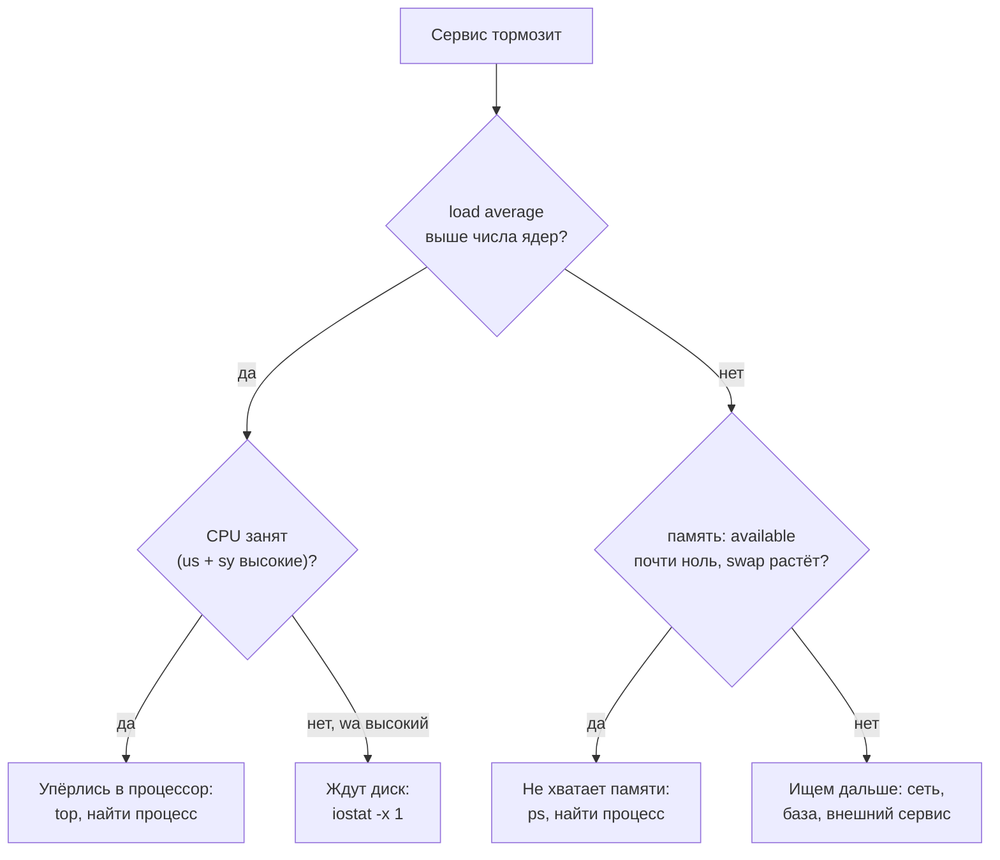
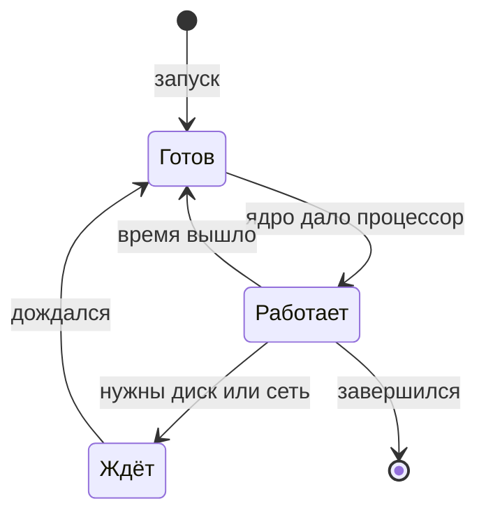

## Зачем это нужно

Нагрузочный тест показывает симптом: «ответы стали медленными, а на 200 пользователях вообще упали». Причину надо искать в машине, на которой работает сервис. Любая машина имеет всего четыре ресурса, которые могут кончиться: **процессор** (CPU), **память** (RAM, быстрое хранилище того, с чем программы работают прямо сейчас), **диск** и **сеть**. Если ты умеешь за минуту сказать «упёрлись в процессор» или «кончилась память», ты уже не гадаешь, а идёшь к месту поломки. Запущенная программа называется **процессом**, и каждый процесс берёт долю этих ресурсов. Ресурс, который кончился первым и не даёт сервису работать быстрее, называется **узким местом** (bottleneck). Поиск узких мест это половина работы нагрузочного тестировщика, и вся [тема 11](../11-bottlenecks/index.md) построена на ней.

Этот урок про первые три ресурса и про процессы, которые их расходуют. Сеть отдельно в [уроке 1.4](04-network-cli.md).

Шаг проекта: ты ставишь набор наблюдателей (`sysstat`), намеренно нагружаешь свою машину тремя способами (процессором, памятью, диском) и учишься узнавать каждую из перегрузок по характерному «почерку» в `top`, `free`, `vmstat` и `iostat`. Результат это твоя шпаргалка `~/perf-lab/01-linux/resource-notes.md`: что смотреть и как выглядит норма и перегрузка. Она пригодится, когда стенд «Магазин» будет работать под нагрузкой.

## Что нужно знать

- Терминал, `man`, `--help`, `sudo apt install`: [урок 1.1](01-workstation-terminal.md). Паспорт машины (`nproc`, `free -h`) оттуда будет нашей точкой отсчёта.
- Конвейеры `|`, `grep`, `sort`, `awk`, `head`: [урок 1.2](02-text-logs.md). Мы будем выделять нужное из длинного вывода `ps` и `top`.
- Глубже: [соответствующий урок курса DevOps](https://distinguished-sre.github.io/devops/01-linux/05-disk-memory-cpu.html) разбирает те же ресурсы с точки зрения администратора. Здесь всё нужное для курса собрано полностью.

## Картина целиком

Возьми небольшую кухню ресторана. **Повара** это процессорные ядра: каждый одновременно готовит одно блюдо. **Стол** для заготовок это память: быстрый, но маленький, всё, что нужно прямо сейчас, лежит здесь. **Кладовка** это диск: вместительная, но ходить туда долго. **Заказы** это процессы (запущенные программы), и каждый хочет поваров, место на столе и иногда сходить в кладовку.

Кухня тормозит по четырём разным причинам, и лечатся они по-разному:

- заказов больше, чем поваров: заказы ждут в очереди (перегрузка процессора);
- на столе не осталось места: часть заготовок убирают в кладовку и обратно (память кончилась, система «качает» страницы на диск) или повар вообще отказывается готовить (процесс убит за нехватку памяти);
- все повара стоят у двери кладовки и ждут, пока им что-то принесут (диск не успевает);
- в кладовке нет места для нового (диск заполнен).



На схеме диагностика идёт от общего показателя («тормозит») к конкретному ресурсу и затем к процессу. Два вопроса «load average выше числа ядер?» и «память кончается?» отсекают большую часть случаев. Если оба ответа «нет», сервис, скорее всего, ждёт чего-то снаружи машины, и искать нужно в других местах (сеть, база данных).

Почти весь урок построен вокруг этой схемы: каждый её узел это команда, которую ты научишься читать.

## Теория

### Процесс: что запущено на машине

**Зачем это существует.** Файл с программой на диске ничего не делает. Чтобы он заработал, система загружает его в память, выдаёт процессор и следит за ним. Это запущенное состояние называется **процессом** (process). Без этого понятия нельзя сказать «этот процесс съел память» или «останови этот процесс».

**Аналогия.** Программа это рецепт в книге, процесс это конкретный повар, который сейчас готовит по рецепту. По одному рецепту могут готовить несколько поваров одновременно (несколько процессов одной программы), и у каждого свои продукты и своя тарелка.

**Как это устроено.** Каждый процесс имеет:

- **PID** (process ID): уникальный номер, по нему к процессу обращаются. Первый процесс системы имеет PID 1, остальные произошли от него;
- **родителя** (PPID): процесс, который его запустил. Когда ты в терминале пишешь `yes`, родитель это твоя оболочка `bash`;
- **владельца**: пользователя, от имени которого он работает;
- **состояние**: что он делает прямо сейчас.

Состояния, которые видны в колонке `STAT` или `S` команд `ps` и `top`:

| Код | Состояние | Что значит |
|---|---|---|
| `R` | running | работает на процессоре или готов работать, ждёт своей очереди |
| `S` | sleeping | спит: ждёт события (сети, таймера, пользователя). Это нормальное состояние почти всех процессов |
| `D` | uninterruptible sleep | ждёт диск или другое устройство и **не реагирует даже на сигналы**. Много процессов в `D` это признак проблемы с диском |
| `T` | stopped | остановлен (например, `Ctrl+Z`) |
| `Z` | zombie | завершился, но родитель ещё не забрал код завершения. Сам ресурсов не берёт, но обилие «зомби» значит ошибку в родителе |



Процесс почти никогда не работает непрерывно: он идёт по кругу «работает, ждёт, снова готов». `Готов` и `Работает` в `ps` оба называются `R`, а `Ждёт` это `S` или `D`. Процессов в `R` может быть больше, чем ядер: «лишние» стоят в очереди. Эту очередь и считает load average, о нём ниже.

Основные команды:

- `ps aux` список всех процессов: `a` (чужих), `u` (понятный формат), `x` (без терминала). Слишком длинный, поэтому его почти всегда фильтруют: `ps aux | grep nginx` или сортируют `ps aux --sort=-%cpu | head -n 5`.
- `pgrep -a имя` найти PID по имени. `pkill имя` послать сигнал всем процессам с таким именем.
- `kill PID` попросить процесс завершиться, `kill -9 PID` убить без вопросов.
- `команда &` запустить в фоне (оболочка сразу возвращает приглашение, а процесс продолжает работать), `jobs` показать фоновые задачи этого терминала, `fg` вернуть на передний план, `Ctrl+Z` приостановить передний процесс.

**Сигналы.** Процессу нельзя просто «приказать», его **просят** сигналом (signal): коротким сообщением от ядра или другого процесса. Нужные три:

| Сигнал | Номер | Как послать | Что делает |
|---|---|---|---|
| `SIGINT` | 2 | `Ctrl+C` | «прерви работу»: так останавливают команду в терминале |
| `SIGTERM` | 15 | `kill PID` | «заверши работу аккуратно»: процесс может успеть сохранить данные и закрыть файлы |
| `SIGKILL` | 9 | `kill -9 PID` | «умри немедленно»: процесс не успевает ничего, система убирает его сама |

Сначала всегда `kill` (SIGTERM). `kill -9` это последнее средство: процесс не сохранит файлы и не освободит блокировки.

**Разобранный пример.**

```bash
yes > /dev/null &
ps aux --sort=-%cpu | head -n 3
kill %1
```

```text
[1] 48211
USER         PID %CPU %MEM    VSZ   RSS TTY      STAT START   TIME COMMAND
student    48211 99.6  0.0   8344   640 pts/0    R    10:40   0:12 yes
root         1204  1.2  0.4 1231096 67840 ?       Ssl  Oct01  35:07 /usr/lib/snapd/snapd
```

`yes` бесконечно печатает букву `y`, а `> /dev/null` выбрасывает вывод (из [урока 1.2](02-text-logs.md)). Это самая простая «нагрузка на процессор»: программа не ждёт ничего и занимает ядро на сто процентов. `&` отправил её в фон, и оболочка ответила `[1] 48211`: номер задания и PID. `ps aux --sort=-%cpu` отсортировал процессы по расходу процессора, самые прожорливые сверху (минус перед `%cpu` значит «по убыванию»), `head -n 3` оставил заголовок и два процесса. `%CPU` у `yes` 99,6: одно ядро занято целиком. `kill %1` послал сигнал заданию номер 1.

Колонки `ps aux`, которые нужны чаще всего: `%CPU` доля времени одного ядра, `%MEM` доля всей памяти, `VSZ` (virtual size) весь адрес, который процесс «заказал», `RSS` (resident set size) память, которую он **реально занимает в RAM** сейчас, `STAT` состояние, `TIME` сколько процессорного времени израсходовал, `COMMAND` что запущено.

**Что путают.**

- `VSZ` и `RSS`: первое может быть огромным и ничего не значить (процесс зарезервировал адреса, но не использует), второе показывает настоящий расход. Когда говорят «процесс занимает N МБ», имеют в виду `RSS`.
- `%CPU` у `ps` это доля за всё время жизни процесса, а у `top` за последние секунды. Для живого расследования смотри `top`, у `ps` берут «кто вообще прожорлив».
- `kill` не всегда «убивает»: он **отправляет сигнал**. Процесс может его проигнорировать, поэтому `kill -9`.

> **Проверь понимание:** у процесса `RSS` 400 МБ, а `VSZ` 4 ГБ. Сколько памяти он занимает и стоит ли волноваться?

<details markdown="1">
<summary>Ответ</summary>

Реально в оперативной памяти он держит 400 МБ (`RSS`). 4 ГБ это размер виртуального адресного пространства, которое он только зарезервировал: большая часть может быть пустой, поэтому волноваться из-за `VSZ` не нужно. Подозрительным был бы быстрый рост `RSS`.

</details>

### Процессор: ядра и куда уходит их время

**Зачем это существует.** Процессор выполняет команды программ. Он один (или несколько ядер), а процессов десятки и сотни, поэтому система делит его время между ними так быстро, что кажется, будто все работают одновременно. Нам важно знать, **сколько** процессорного времени у машины есть и **на что** оно тратится.

**Аналогия.** Один повар готовит блюда для нескольких столиков по очереди: пять секунд резал салат для одного, пять секунд жарил для другого. Столики видят, что все блюда продвигаются. Но если столиков очень много, каждое блюдо ждёт долго.

**Как это устроено.** Ядро (core) это «повар»: оно в каждый момент выполняет один процесс. Число ядер `nproc` ты записал в паспорт машины ([урок 1.1](01-workstation-terminal.md)). Система выдаёт процессу короткий кусочек времени (миллисекунды), потом передаёт ядро следующему. Если процессов, готовых работать, больше, чем ядер, остальные ждут.

Время каждого ядра разложено по категориям, и `top` и `vmstat` показывают их в процентах:

| Категория | Что это |
|---|---|
| `us` (user) | работа обычных программ: твой код, сервис, база |
| `sy` (system) | работа самого ядра по запросам программ: сеть, диск, переключение между процессами |
| `id` (idle) | ядро свободно, делать нечего |
| `wa` (iowait) | ядро свободно, но **есть процессы, которые ждут диск**. Важный признак: процессор не занят, а система тормозит из-за дисков |
| `st` (steal) | на виртуальной машине (твоя Multipass или WSL2 тоже виртуальная): гипервизор, программа, которая делит физический компьютер между виртуальными машинами, отдал это время другой виртуалке. Если растёт, машине не хватает физических ресурсов хозяина |
| `ni`, `hi`, `si` | редкие: процессы с низким приоритетом, прерывания от устройств |

**Как читать загрузку.** Сумма всех категорий это 100%. На 8-ядерной машине «800%» это все восемь ядер заняты целиком: `top` по умолчанию показывает долю одного ядра, поэтому процесс может иметь `%CPU` больше 100, если использует несколько ядер.

**Разобранный пример.** Смотрим `top` в момент, когда запущено 12 процессов `yes` на 8-ядерной машине:

```bash
top -b -n 1 | head -n 12
```

```text
top - 10:41:07 up 3 days,  2:23,  1 user,  load average: 9.87, 5.12, 2.31
Tasks: 312 total,  13 running, 299 sleeping,   0 stopped,   0 zombie
%Cpu(s): 99.7 us,  0.3 sy,  0.0 ni,  0.0 id,  0.0 wa,  0.0 hi,  0.0 si,  0.0 st
MiB Mem :  15880.2 total,   9412.6 free,   3187.0 used,   3604.5 buff/cache
MiB Swap:   4096.0 total,   4096.0 free,      0.0 used.  12693.2 avail Mem

    PID USER      PR  NI    VIRT    RES    SHR S  %CPU  %MEM     TIME+ COMMAND
  48211 student   20   0    8344    640    576 R  66.7   0.0   0:41.12 yes
  48212 student   20   0    8344    640    576 R  66.7   0.0   0:41.09 yes
  48213 student   20   0    8344    640    576 R  66.7   0.0   0:41.05 yes
```

(`-b` режим «пакетный»: напечатать и выйти, а не обновляться на экране; `-n 1` один снимок.) Как читать, сверху вниз:

- **Строка 1**: время, сколько машина работает (`up 3 days`), число пользователей и **load average** (три числа, разберём в следующем разделе).
- **Tasks**: всего 312 процессов, из них 13 в состоянии `R` (работают или ждут очереди), 299 спят. Здесь 12 наших `yes` плюс сам `top`.
- **%Cpu(s)**: 99,7% времени ядер занято обычными программами (`us`), на систему ушло 0,3%, простоя нет. `wa` равен нулю: диск не при чём.
- **MiB Mem**: память. `avail Mem` 12 693 МБ это то, что можно отдать программам.
- Таблица: каждый `yes` получает 66,7% ядра. 12 процессов делят 8 ядер: 800% / 12 = 66,7%. Это математика очереди: добавь ещё процессов, каждому достанется меньше.

Прибавь клавишу `1` внутри `top`, и он покажет каждое ядро отдельной строкой. Это полезно, когда один процесс однопоточный: тогда одно ядро занято на 100%, а остальные простаивают, и общая загрузка в 12% выглядит безобидно, хотя сервис упёрся в предел. Так ведёт себя сервис с одним воркером под нагрузкой: [урок 11.2](../11-bottlenecks/02-cpu.md) разбирает этот случай на «Магазине».

**Что путают.**

- **100% CPU это не всегда плохо.** Если машина считает, и очереди нет, это полезная работа. Плохо, когда процессов, готовых работать, заметно больше, чем ядер: тогда запросы ждут. Поэтому на загрузку процессора смотрят вместе с load average.
- `us` и `sy`: высокое `sy` (больше 20-30%) говорит, что ядро тратит время на переключения и сетевые/дисковые операции, а не на твой код. Это бывает при тысячах соединений и потоков.
- В `top` процент у процесса считается от **одного** ядра, а в строке `%Cpu(s)` от **всех**: это разные шкалы.

> **Проверь понимание:** на 4-ядерной машине `top` показывает один процесс с 100% CPU, а в строке `%Cpu(s)` написано 25 us, 75 id. Это проблема?

<details markdown="1">
<summary>Ответ</summary>

Зависит от процесса. Процент у процесса считается от одного ядра, значит 100% это одно ядро из четырёх (те же 25% от всей машины). Если это однопоточный сервис, он упёрся в предел одного ядра, и три остальных ему не помогут: ему нужны несколько воркеров. Если это короткая задача, которая просто считает, ничего страшного.

</details>

### Load average: сколько процессов хотят работать

**Зачем это существует.** Загрузка процессора в процентах не показывает, **сколько работы ждёт** своей очереди: в 100% одинаково упираются и один лишний процесс, и сто. Нужна ещё одна цифра, которая считает очередь. Это **load average** («средняя нагрузка»), и её первым делом показывают в `uptime`, `top` и в мониторинге.

**Аналогия.** Очередь на кассе. «Касса занята на 100%» не говорит, длинна ли очередь: может быть один покупатель, который не торопится, а может быть сто. Load average это число людей, которые либо стоят у кассы, либо ждут. Если касс четыре, а людей четыре, никто не ждёт. Если людей двенадцать, восемь ждут.

**Как это устроено.** Load average это среднее число процессов, которые **работают или готовы работать и ждут ядро** (состояние `R`), плюс те, что ждут диск (состояние `D`). Система показывает **три** числа: среднее за последние 1, 5 и 15 минут. Например:

```text
load average: 9.87, 5.12, 2.31
```

Читать так: за минуту в среднем 9,87 процесса хотели процессор, за пять минут 5,12, за пятнадцать 2,31. Раз первое число больше второго, а второе больше третьего, нагрузка **растёт**. Если порядок обратный (`2.1, 5.1, 9.9`), нагрузка спадает.

**Главное правило:** сравнивай load average с **числом ядер** `nproc`. Один процесс на ядро это «полная загрузка без очереди»:

| Load average на 8 ядрах | Что значит |
|---|---|
| 2.0 | четверть ядер занята, большой запас |
| 8.0 | все ядра заняты, очереди нет: предел, запаса нет |
| 12.0 | на 8 ядер 12 процессов: в среднем 4 ждут очереди, всё работает медленнее |
| 40.0 | сильная перегрузка: очередь в пять раз длиннее числа ядер |

Поэтому говорят «load average на ядро»: 12 / 8 = 1,5. Меньше 0,7 на ядро это обычно спокойно, около 1 предел, выше 1 перегрузка. Для одной и той же цифры 4,0 на 2-ядерной машине это перегрузка, а на 16-ядерной ничего особенного.

Потренируйся на виджете: он моделирует машину, на которой процессы то приходят, то уходят. Подвигай «ядер» и «процессов» и посмотри, как ведёт себя очередь.

<div class="viz" data-viz="linux-load-average" data-cores="4" data-load="6"></div>

Красные кружки это процессы без ядра, жёлтая черта на графике это число ядер, толстая линия это load average. Смотри, как медленно толстая линия догоняет изменения: поэтому у системы три числа.

Почему три числа, а не одно, видно на примере. Допустим, на 8-ядерной машине спокойно, и вдруг запускают 12 процессов, которые работают без остановки. Так будут расти три averages:

<div class="viz" data-viz="chart" data-type="line" data-title="Как растут три load average после запуска 12 процессов" data-x="0,1,2,3,5,7,10,15" data-series='[{"name":"за 1 минуту","values":[0,7.6,10.4,11.4,11.9,12,12,12]},{"name":"за 5 минут","values":[0,2.2,4,5.4,7.6,9,10.4,11.4]},{"name":"за 15 минут","values":[0,0.8,1.5,2.2,3.4,4.5,5.8,7.6]}]' data-unit="" data-x-label="минут после старта" data-y-label="load average" data-explain="Среднее за минуту догоняет настоящую нагрузку 12 уже к третьей минуте, за пять минут к пятнадцатой, а среднее за пятнадцать минут даже через пятнадцать минут ещё не дошло до 12. Если через пять минут первое число 11,9, а третье 3,4: нагрузка пришла недавно."></div>

Линия «за 1 минуту» прыгает почти сразу к 12, «за 15 минут» ползёт к ним очень медленно. Сравнение трёх значений говорит, **когда** началась нагрузка: если все три высокие, сервис перегружен давно, если высоко только первое, пришла недавно и может быть всплеском. Числа на графике построены по формуле экспоненциального среднего, которую использует ядро Linux.

**Разобранный пример.**

```bash
uptime
nproc
```

```text
 10:41:07 up 3 days,  2:23,  1 user,  load average: 9.87, 5.12, 2.31
8
```

Ядер 8, load average за минуту 9,87: чуть больше 1,2 на ядро, в среднем два процесса ждали очереди. За пять минут 5,12, за пятнадцать 2,31: нагрузка пришла недавно и нарастает. Если это произошло во время теста, ты видишь, что машина вышла на предел.

**Что путают.**

- Load average это **не процент** и не загрузка процессора. Он может быть 50 при 100% загрузки процессора.
- На Linux в него входят процессы, которые **ждут диск** (`D`). Поэтому высокий load average при низкой загрузке CPU и высоком `wa` означает проблему с диском, а не с процессором. Эту ветку ты видел на схеме «Картина целиком».
- На компьютере с 16 ядрами load average 12 это нормально, а на двух ядрах катастрофа. Цифра без числа ядер ничего не значит.

> **Проверь понимание:** `uptime` на 4-ядерной машине показал `load average: 1.20, 3.80, 6.10`. Что происходит с нагрузкой?

<details markdown="1">
<summary>Ответ</summary>

Нагрузка **спадает**: пятнадцать минут назад в среднем было 6,1 процесса на 4 ядра (перегрузка), пять минут назад 3,8 (почти предел), сейчас 1,2 (спокойно). Пик уже прошёл, и если во время него были замедления, причину нужно искать в логах за эти 15 минут.

</details>

### Память: что такое available и почему free обманчиво мал

**Зачем это существует.** Память это быстрое хранилище, где программа держит всё, с чем работает прямо сейчас. Если её не хватает, система либо начинает спасаться диском (медленно), либо убивает процессы. Поэтому нужно знать, сколько памяти **реально свободно**, а не сколько пустует.

**Аналогия.** Рабочий стол. На столе лежат документы (память программ), а свободные места занимают бумаги, которые ты недавно использовал и держишь поближе, на случай если понадобятся снова (кэш диска). Если нужно место для нового документа, старые бумаги спокойно убираются в шкаф. Для тебя эти места по сути свободные, хотя физически заняты.

**Как это устроено.** Оперативная память (RAM) делится на:

- память программ: то, что процессы запросили и используют (переменные, данные, которые программа создаёт по ходу работы);
- **кэш диска** (`buff/cache`, page cache): ядро запоминает недавно прочитанное с диска, чтобы не читать снова. Освобождается мгновенно, когда нужна память;
- свободную (`free`): честно пустую.

Linux намеренно занимает всю свободную память под кэш: пустая память это впустую потраченный ресурс. Поэтому `free` почти всегда маленький, и это **нормально**. Настоящий показатель это `available`: сколько можно отдать программам, считая и свободную, и освобождаемый кэш.

**Swap** (файл или раздел подкачки на диске): место, куда система убирает редко используемые страницы памяти, когда не хватает RAM. Диск в сотни раз медленнее RAM, поэтому активная работа с swap (`si` и `so` в `vmstat` не нули) это признак нехватки памяти: система тормозит, хотя процессор простаивает.

**OOM killer** (out of memory killer): последний рубеж. Когда памяти не хватает совсем и swap не помогает, ядро выбирает процесс-жертву (обычно самый большой) и убивает его сигналом `SIGKILL`. Со стороны это выглядит так: сервис внезапно «упал» без ошибок в своём логе, потому что убить его не дали ему самому ничего записать. Признак ищется в логах ядра:

```bash
sudo dmesg -T | grep -i "killed process"
```

```text
[Fri Oct  3 11:02:44 2026] Out of memory: Killed process 51877 (python3) total-vm:6291456kB, anon-rss:5873212kB
```

(`dmesg` печатает сообщения ядра, `-T` делает время читаемым, нужен `sudo`.) Строка говорит: ядро убило процесс `python3` с номером 51877, у которого `anon-rss` 5,8 ГБ: он занимал столько памяти. Если сервис «пропал» во время теста, а в его логе ничего нет, проверь это в первую очередь.

**Разобранный пример.**

```bash
free -h
```

```text
               total        used        free      shared  buff/cache   available
Mem:            15Gi       3.1Gi       9.2Gi       412Mi       3.3Gi        11Gi
Swap:          4.0Gi          0B       4.0Gi
```

Читаем: всего 15 ГБ, программы заняли 3,1 ГБ (`used`), честно пусто 9,2 ГБ, кэш диска 3,3 ГБ, а для новых программ доступно 11 ГБ (`available`). Swap не используется (`0B`). Здорово: нет ни нехватки памяти, ни обращений к диску вместо RAM.

Теперь та же машина, когда один процесс «съел» много:

```text
               total        used        free      shared  buff/cache   available
Mem:            15Gi        14Gi       182Mi       412Mi       741Mi       412Mi
Swap:          4.0Gi       2.7Gi       1.3Gi
```

`available` упал до 412 МБ, `used` 14 ГБ, кэш почти исчез (его отдали), swap использован на 2,7 ГБ. Такая машина уже тормозит. Ещё немного, и придёт OOM killer.

Как найти виновника:

```bash
ps aux --sort=-rss | head -n 4
```

```text
USER         PID %CPU %MEM    VSZ   RSS TTY      STAT START   TIME COMMAND
student    51877 12.0 89.4 6291456 14221312 pts/1  S    10:55   2:03 python3 leak.py
postgres    1432  0.8  3.1 1840232 504880 ?      Ss   Oct01   4:18 postgres: shop shop
```

`--sort=-rss` ставит наверх тех, кто занимает больше всего реальной памяти. `RSS` в килобайтах: 14 221 312 КБ это примерно 13,6 ГБ. Виновник найден: `python3 leak.py`.

**Утечка памяти** (memory leak): программа берёт память и не отдаёт назад, поэтому занятое растёт при каждом запросе. Её признак: `RSS` процесса монотонно растёт, а после остановки нагрузки не падает. «Магазин» умеет так себя вести при `LEAK_ENABLED=1`, и ты поймаешь это в [уроке 11.4](../11-bottlenecks/04-memory-soak.md) командой `ps` по `RSS`.

**Что путают.**

- `free` и `available`: по маленькому `free` нельзя судить, что память кончилась. Смотри `available`.
- Память процесса и память машины: у процесса может быть много, а у машины всё в порядке (и наоборот).
- В контейнерах `free` и `top` показывают память **всего компьютера**, а не лимит контейнера: об этом [урок 5.4](../05-docker/04-limits-stats.md).

> **Проверь понимание:** `free -h` показывает `free 300Mi`, `buff/cache 9Gi`, `available 9.5Gi`. Памяти не хватает?

<details markdown="1">
<summary>Ответ</summary>

Хватает. Маленький `free` нормален: система заняла пустую память под кэш диска. `available` 9,5 ГБ означает, что столько можно отдать программам, освободив кэш. Тревогой стали бы малый `available` (меньше 10% от общего) и рост swap.

</details>

### Диск: место и скорость

**Зачем это существует.** Диск отвечает за две разные вещи, которые ломаются независимо: **сколько места** (если закончилось, сервис не сможет писать логи и данные) и **как быстро** диск читает и пишет (если не успевает, всё, что с ним связано, тормозит).

**Аналогия.** Кладовка. Её могут забить до потолка (место кончилось) или завалить заказами так, что один кладовщик не успевает приносить продукты (скорость). Это разные проблемы.

**Как это устроено. Место.**

- `df -h` (disk free) показывает занятость каждого диска (раздела): размер, занято, свободно, процент, где подключён. Нас интересует тот, где лежит `/` и твой домашний каталог.
- `du -sh каталог` (disk usage) считает, сколько занимает каталог: `-s` итог, `-h` понятные единицы. `du -h --max-depth=1 /var | sort -h | tail -n 5` покажет пять самых больших подкаталогов (`sort -h` сортирует `4.0K`, `12M`, `3.1G` правильно).
- Место заканчивается не только на «гигабайтах»: у файловой системы есть и лимит на **число файлов** (inodes: записи о файлах). `df -i` покажет и его.

```bash
df -h /
du -h --max-depth=1 ~/perf-lab | sort -h | tail -n 3
```

```text
Filesystem      Size  Used Avail Use% Mounted on
/dev/nvme0n1p2  468G  121G  324G  28% /
4.0K	/home/student/perf-lab/scripts
12K	/home/student/perf-lab/01-linux
48K	/home/student/perf-lab
```

Первый вывод: корень занят на 28%, свободно 324 ГБ. Когда `Use%` приближается к 100%, начинаются поломки: не пишутся логи, падают базы данных. Второй вывод: самый большой каталог внутри `perf-lab` тот, где мы сейчас работаем (в начале урока).

**Как это устроено. Скорость.** Диск не успевает, когда у него очередь запросов. Для этого есть `iostat` (ставится вместе с пакетом `sysstat`):

```bash
iostat -x 1
```

Печатает статистику каждые 1 секунду (`-x` расширенную, `1` интервал). Ключевые столбцы (в выводе их больше, мы оставили нужные):

```text
avg-cpu:  %user   %nice %system %iowait  %steal   %idle
           1.8    0.0    9.4    21.3     0.0    67.5

Device     r/s      w/s     rkB/s     wkB/s   r_await  w_await  aqu-sz  %util
nvme0n1    0.00  3720.00      0.00 951200.00     0.00     0.52    1.93  92.40
```

- `w/s`, `r/s` сколько записей и чтений в секунду, `wkB/s`, `rkB/s` сколько килобайт в секунду: здесь пишется около 930 МБ/с;
- `r_await`, `w_await` сколько миллисекунд в среднем ждёт один запрос, пока диск его выполнит (здесь 0,52 мс);
- `aqu-sz` средняя длина очереди к диску;
- **`%util`** доля времени, когда диск был занят: 92,4%. Рядом с 100% диск насыщен: новые запросы ждут. SSD (твердотельный диск без движущихся частей) и NVMe (его быстрая разновидность, подключённая напрямую к шине) умеют выполнять много запросов параллельно, поэтому при 100% они ещё могут успевать: смотри ещё на `await`. Если он растёт, диск действительно не справляется.
- **`%iowait`** сверху: 21,3% процессорного времени ядра простаивали, потому что процессы ждали диск.

И ещё один удобный инструмент, показывающий почти всё сразу, `vmstat 1` (virtual memory statistics, «одна строка в секунду»):

```text
procs -----------memory---------- ---swap-- -----io---- -system-- ------cpu-----
 r  b   swpd   free   buff  cache   si   so    bi    bo   in   cs us sy id wa st
12  0      0 9638492 241512 3690112    0    0     0    12 4310 1980 99  1  0  0  0
 2  3      0 9120004 241512 4100008    0    0     0 951200 1810  920  2  9 67 21  0
```

Первая строка: 12 процессов в очереди на процессор (`r`), ничего не ждёт диск (`b`), 99% процессор занят пользовательской работой (`us`). Вторая строка: пишется диск (`bo`, блоки в секунду: около 950 000), три процесса ждут ввода-вывода (`b` = 3), 21% времени уходит на ожидание диска (`wa`). Колонки `si` и `so` (swap in и out) должны быть нулевыми: ненулевые значит система качает память на диск. В новых версиях в конце может быть ещё колонка `gu`, она нам не нужна. Первую строку `vmstat` обычно игнорируют: это среднее с момента загрузки, а не текущее значение.

**Что путают.**

- Место и скорость: `df` ничего не говорит о скорости, `iostat` ничего не говорит о месте.
- `Use%` 100% не значит, что файлы перестали читаться: страдает запись. Системы часто оставляют для `root` небольшой запас.
- `%util` 100% на медленном диске и на NVMe значат разное. Сравнивай с `await`.

> **Проверь понимание:** load average 6 на 8 ядрах, процессор простаивает на 70%, `wa` равен 25%. Где искать проблему?

<details markdown="1">
<summary>Ответ</summary>

В диске. Процессор не занят (простой 70%), но `wa` 25% показывает, что процессы ждут ввода-вывода, а такие процессы в состоянии `D` входят в load average. Нужно смотреть `iostat -x 1` (`%util`, `await`) и искать процесс, который много пишет или читает.

</details>

### Метод USE: что проверять про каждый ресурс

**Зачем это существует.** Когда всё тормозит, хочется смотреть всё сразу. Это путь к растерянности. Есть простая схема, которая превращает «тормозит» в три вопроса к каждому ресурсу.

**Как это устроено.** Метод **USE** (Utilization, Saturation, Errors: «занятость, очередь, ошибки») предлагает для каждого ресурса проверить:

1. **U**tilization: на сколько процентов он занят;
2. **S**aturation: есть ли очередь, сколько работы ждёт;
3. **E**rrors: есть ли сбои.

| Ресурс | Занятость | Очередь | Ошибки |
|---|---|---|---|
| Процессор | `%Cpu(s)`: `us + sy` в `top` | load average против числа ядер; `r` в `vmstat` | редко: `dmesg` |
| Память | `used` и `available` в `free` | swap: `si`, `so` в `vmstat` | OOM killer в `dmesg` |
| Диск | `%util` в `iostat -x` | `aqu-sz`, `await` в `iostat -x`; `b` и `wa` | `dmesg`, сообщения о сбоях диска |
| Место | `Use%` в `df -h` | нет очереди: либо место есть, либо нет | `No space left on device` в логах |

Смотри на разницу: «занят на 100%» и «есть очередь» это разные вещи. Ресурс на 100% без очереди работает на полную мощность (хорошо), с очередью начинает ограничивать систему (плохо). На это различие опирается вся теория очередей из [темы 8](../08-perf-theory/index.md), и сейчас ты видел его на практике.

**Что путают.** Смотрят только на занятость. Ядра заняты на 70% и очереди нет: всё в порядке. Ядра заняты на 70% при load average 20: это обман усреднения (кто-то работает, а остальное ждёт). Очередь надёжнее занятости.

> **Проверь понимание:** какую колонку `vmstat` нужно смотреть, чтобы проверить очередь процессора, а какие, чтобы проверить очередь по памяти?

<details markdown="1">
<summary>Ответ</summary>

Очередь процессора это колонка `r` (число процессов, готовых работать): если она заметно больше числа ядер, есть очередь. Про память очередь это колонки `si` и `so` (swap in и out): ненулевые значения значат, что система перекладывает память на диск.

</details>

### Наблюдение во время теста

**Зачем это существует.** Во время нагрузочного теста снимки «вручную» не помогают: нагрузка нарастает, и интересна динамика. Нужны непрерывные записи, которые потом можно положить рядом с результатами теста.

**Как это устроено.** Простейший вариант: пишем вывод в файл параллельно с тестом.

```bash
vmstat 1 > ~/perf-lab/results/vmstat-test1.txt &
```

`vmstat 1` печатает по строке в секунду, `>` в файл, `&` в фон. После теста останавливаешь командой `kill %1` или `pkill vmstat`, а файл остаётся и его можно разбирать `awk`: например, средний `us` за тест. Для диска то же: `iostat -x 1 > ...`. Для отдельного процесса: `pidstat -u -r -p PID 1` (из `sysstat`) показывает его процессор (`-u`) и память (`-r`) каждую секунду. В [теме 7](../07-observability/index.md) то же самое станет автоматическим, с графиками в Grafana, но привычка проверять машину вручную остаётся полезной: графики могут быть неточными, а `top` показывает правду.

## Практика

Все упражнения безопасны: ты нагружаешь только свою машину и всё останавливаешь после. Если у тебя другое число ядер, подставляй своё значение вместо моего (в примерах 8 ядер и 15 ГБ).

### 1. Поставь наблюдателей и сними состояние покоя

```bash
sudo apt update
sudo apt install -y sysstat
mkdir -p ~/perf-lab/01-linux
cd ~/perf-lab/01-linux
uptime
nproc
free -h
df -h /
vmstat 1 3
```

```text
 10:32:18 up 3 days,  2:14,  1 user,  load average: 0.42, 0.51, 0.48
8
               total        used        free      shared  buff/cache   available
Mem:            15Gi       3.1Gi       9.2Gi       412Mi       3.3Gi        11Gi
Swap:          4.0Gi          0B       4.0Gi
Filesystem      Size  Used Avail Use% Mounted on
/dev/nvme0n1p2  468G  121G  324G  28% /
procs -----------memory---------- ---swap-- -----io---- -system-- ------cpu-----
 r  b   swpd   free   buff  cache   si   so    bi    bo   in   cs us sy id wa st
 1  0      0 9638492 241512 3690112    0    0    12    14  410  980  3  1 96  0  0
 0  0      0 9638240 241512 3690112    0    0     0     0  280  610  1  0 99  0  0
 0  0      0 9638240 241512 3690112    0    0     0    44  305  655  1  1 98  0  0
```

**Как читать вывод:** это твоя «норма». Запиши числа: load average около 0,4 на 8 ядрах (почти пусто), `available` 11 ГБ, swap не тронут, `id` около 98%. Когда машина будет нагружена, ты будешь сравнивать с этим. Первая строка `vmstat` это среднее с момента включения, смотри строки после неё.

**Типичные ошибки:**

- `E: Unable to locate package sysstat`: не выполнил `sudo apt update`.
- `iostat: command not found` после установки: ещё не ставили `sysstat` или оболочка не обновила кэш команд: `hash -r` или открой новый терминал.

### 2. Нагрузи процессор: load average против ядер

Открой **два** терминала (как открыть второе окно, написано в [уроке 1.1](01-workstation-terminal.md); в Multipass второе окно это новый `multipass shell lab`). В первом запусти нагрузку:

```bash
for i in {1..4}; do yes > /dev/null & done
jobs
```

```text
[1]   Running                 yes > /dev/null &
[2]   Running                 yes > /dev/null &
[3]-  Running                 yes > /dev/null &
[4]+  Running                 yes > /dev/null &
```

`for ... do ... done` цикл, который четыре раза запускает `yes` в фоне (циклы подробно в [уроке 1.5](05-bash-scripts.md)): `{1..4}` разворачивается в `1 2 3 4`. Во втором терминале посмотри:

```bash
top
```

Внутри `top` нажми `1` (покажет каждое ядро отдельно), потом `q` для выхода. Типичная картина на 8 ядрах:

```text
top - 10:43:51 up 3 days,  2:25,  2 users,  load average: 2.84, 1.02, 0.45
Tasks: 318 total,   5 running, 313 sleeping,   0 stopped,   0 zombie
%Cpu(s): 50.1 us,  0.3 sy,  0.0 ni, 49.6 id,  0.0 wa,  0.0 hi,  0.0 si,  0.0 st

    PID USER      PR  NI    VIRT    RES    SHR S  %CPU  %MEM     TIME+ COMMAND
  48301 student   20   0    8344    640    576 R  99.7   0.0   0:32.10 yes
  48302 student   20   0    8344    640    576 R  99.7   0.0   0:32.07 yes
  48303 student   20   0    8344    640    576 R  99.3   0.0   0:32.03 yes
  48304 student   20   0    8344    640    576 R  99.3   0.0   0:32.01 yes
```

**Как читать вывод:** четыре процесса заняли четыре ядра из восьми, поэтому общая загрузка около 50%. Load average растёт плавно: первое число уже 2,84, пятиминутное 1,02, к четырём первое число придёт за пару минут. Очереди нет: четыре процесса на восемь ядер.

Теперь добавь нагрузку выше числа ядер. Всего должно работать примерно в полтора раза больше процессов, чем ядер: на 8 ядрах это 12, то есть к четырём запущенным добавь ещё восемь. На другом числе ядер считай так: всего должно быть `nproc` * 1,5 процессов, значит добавь это число минус 4 (при 4 ядрах всего 6, добавь 2; при 2 ядрах хватит 3 всего, этот шаг пропусти). В первом терминале (замени 8 на своё число):

```bash
for i in {1..8}; do yes > /dev/null & done
```

Теперь работают 12 процессов. Подожди минуту и во втором терминале выполни:

```bash
uptime
vmstat 1 4
```

```text
 10:46:09 up 3 days,  2:27,  2 users,  load average: 9.31, 4.78, 2.04
procs -----------memory---------- ---swap-- -----io---- -system-- ------cpu-----
 r  b   swpd   free   buff  cache   si   so    bi    bo   in   cs us sy id wa st
12  0      0 9631204 241512 3690444    0    0     0     0 4021 1820 99  1  0  0  0
13  0      0 9631204 241512 3690444    0    0     0     0 4106 1913 99  1  0  0  0
12  0      0 9631204 241512 3690444    0    0     0    12 4088 1894 99  1  0  0  0
```

**Как читать вывод:** `r` равно 12: в очереди на процессор 12 процессов, а ядер 8, значит четыре ждут. Загрузка 99% `us`, простоя нет, а load average ползёт к 12. Это и есть «упёрлись в процессор»: ядра заняты, и есть очередь. Если бы это был сервис, его запросы теперь ждали бы свою очередь на процессор, и время ответа росло бы.

**Типичные ошибки:** `-bash: fork: retry: Resource temporarily unavailable`: ты случайно запустил слишком много процессов. Выполни `pkill yes` и начни с меньшего числа.

Останови нагрузку (в любом терминале, `pkill` работает на уровне всей системы):

```bash
pkill yes
jobs
uptime
```

`pkill yes` послал SIGTERM всем процессам с именем `yes`. `uptime` сразу после показывает, что load average **ещё высокий**: первое число падает за минуту-две, пятнадцатиминутное остаётся высоким дольше. Эту инерцию учитывай, когда меряешь `uptime` сразу после теста.

### 3. Займи память

```bash
python3 -c "import time; x = b'x' * 2_000_000_000; time.sleep(120)" &
sleep 2
free -h
ps -o pid,rss,vsz,cmd -p $!
```

```text
[1] 49102
               total        used        free      shared  buff/cache   available
Mem:            15Gi       5.0Gi       7.3Gi       412Mi       3.3Gi        9.2Gi
Swap:          4.0Gi          0B       4.0Gi
    PID   RSS    VSZ CMD
  49102 1957548 1969092 python3 -c import time; x = b'x' * 2_000_000_000; time.sleep(120)
```

Коротко про команду: Python создаёт строку из двух миллиардов букв `x` (около 1,9 ГБ), и две минуты держит её (`time.sleep(120)`). `$!` оболочка заменяет на PID последнего запущенного в фоне процесса. `sleep 2` даёт процессу время выделить память.

**Как читать вывод:** `used` вырос примерно на 1,9 ГБ (с 3,1 до 5,0), `available` упал с 11 до 9,2 ГБ. `RSS` процесса около 1,9 ГБ (1 957 548 КБ): память реально занята. Теперь найди «виновника» как это делают на работе, не зная PID:

```bash
ps aux --sort=-rss | head -n 3
```

```text
USER         PID %CPU %MEM    VSZ   RSS TTY      STAT START   TIME COMMAND
student    49102  0.0 12.3 1969092 1957548 pts/0  S    10:52   0:01 python3 -c import time; x = ...
student     2210  1.1  3.9 4890124  622440 ?      Sl   Oct01   8:42 /usr/bin/gnome-shell
```

Первым стоит наш `python3`: он на первом месте по `RSS`. Остановка: `kill %1` (или `kill 49102`), и `free -h` покажет, что память вернулась.

**Типичные ошибки:** `MemoryError`: на машине меньше свободной памяти, чем ты просишь. Уменьши число (`1_000_000_000`).

### 4. Нагрузи диск и найди его в `iostat`

Нужно 5 ГБ свободного места. В первом терминале запусти `iostat`, во втором запись:

```bash
# первый терминал
iostat -x 1
```

```bash
# второй терминал
dd if=/dev/zero of=~/perf-lab/01-linux/big.bin bs=1M count=5120 conv=fdatasync status=progress
```

`dd` копирует данные «из» (`if`, input file) «в» (`of`, output file). `/dev/zero` специальный файл, из которого бесконечно читаются нули, `bs=1M` размер блока 1 МБ, `count=5120` число блоков (5 ГБ), `conv=fdatasync` дожидаться, пока данные реально лягут на диск, а не в кэш памяти. `status=progress` показывает ход работы.

```text
5120+0 records in
5120+0 records out
5368709120 bytes (5.4 GB, 5.0 GiB) copied, 6.1 s, 880 MB/s
```

А в `iostat` во время записи:

```text
avg-cpu:  %user   %nice %system %iowait  %steal   %idle
           1.8    0.0    9.4    21.3     0.0    67.5

Device     r/s      w/s     rkB/s     wkB/s   r_await  w_await  aqu-sz  %util
nvme0n1    0.00  3720.00      0.00 951200.00     0.00     0.52    1.93  92.40
```

**Как читать вывод:** диск писал около 880 МБ/с, `%util` достиг 92%: он занят почти постоянно. `%iowait` поднялся до 21%: часть процессорного времени потрачена на ожидание диска. Когда `dd` завершился, `%util` вернулся в ноль. Твои цифры будут другими: у SSD, обычного жёсткого диска и виртуальной машины скорости различаются в десятки раз. Запомни своё значение: это максимум скорости записи **твоего** диска.

Убери за собой и посмотри, что занимает место:

```bash
rm ~/perf-lab/01-linux/big.bin
du -h --max-depth=1 ~ | sort -h | tail -n 4
df -h ~
```

**Типичные ошибки:** `dd: failed to open ... Permission denied` ты пишешь не в свой каталог; `No space left on device` слишком большой `count`. Забыл `rm`: 5 ГБ файла останутся навсегда.

### 5. Запиши шпаргалку

```bash
cd ~/perf-lab/01-linux
cat > resource-notes.md <<'EOF'
# Шпаргалка: что смотреть на машине

Моя машина: ядер ___, память ___, диск (скорость записи dd) ___ МБ/с.

| Вопрос | Команда | Норма | Перегрузка |
|---|---|---|---|
| Сколько процессов ждут процессор | uptime, vmstat 1 (колонка r) | load average < ядер | load average > ядер, r > ядер |
| Сколько памяти реально свободно | free -h (колонка available) | available > 10% | available почти 0, swap растёт (si, so) |
| Кто занял память | ps aux --sort=-rss, потом head | обычные сервисы | один процесс с огромным RSS |
| Кто занял процессор | top, ps aux --sort=-%cpu, потом head | нет лидера | один процесс 100% и больше |
| Диск не успевает | iostat -x 1 (%util, await), vmstat (wa) | %util < 60% | %util около 100%, wa высокий |
| Диск заполнен | df -h | Use% < 80% | Use% около 100% |
EOF
nano resource-notes.md
```

Открой файл в `nano` и допиши свои числа: ядра, память, скорость записи диска из прошлого упражнения. Этой шпаргалкой будешь пользоваться на стенде.

## Сломай и почини

**Поломка.** Машина «тормозит»: запусти в первом терминале

```bash
for i in {1..12}; do yes > /dev/null & done
```

(на машине с другим числом ядер возьми число в полтора раза больше ядер.) Перейди во второе окно и сделай вид, что не знаешь, что запустил.

**Задача.** Во втором терминале, используя только команды из урока, выясни: есть ли перегрузка, чем она вызвана, какой процесс виноват, и останови его. Сравни с «нормой» из упражнения 1.

<details markdown="1">
<summary>Разбор</summary>

1. `uptime` и `nproc`: load average (например, `9.8, 4.1, 1.5`) выше числа ядер 8, и растёт (первое число больше третьего). Перегрузка есть, и она свежая.
2. `top`: в строке `%Cpu(s)` `us` около 99, `wa` ноль, `id` ноль. Значит, ядра заняты работой, а не ждут диск: перегрузка по процессору. `free -h` покажет `available` без изменений: память ни при чём.
3. В таблице `top` (или `ps aux --sort=-%cpu | head`) двенадцать строк `yes`, у каждого около 66% CPU. Виновник найден: программа `yes`.
4. Останови: `pkill yes` (или `kill PID` по очереди). Если `yes` запущен из другого терминала, фоновые задания чужого терминала через `jobs` не видны, но `pkill` и `kill` работают на уровне системы и найдут их.
5. Проверь: `uptime` (первое число начнёт падать, пятнадцатиминутное ещё долго остаётся высоким) и `top` (процессов `yes` больше нет).

Вывод: «упёрлись в процессор» диагностируется двумя признаками одновременно: load average выше числа ядер и `us + sy` около 100%. Один признак без другого вводит в заблуждение: при высоком load average и высоком `wa` проблема в диске, а не в процессоре.

</details>

## Словарик урока

| Термин | Простыми словами |
|---|---|
| Процесс (process) | Запущенная программа: у неё свой номер, владелец и состояние |
| PID | Номер процесса, по нему к нему обращаются |
| Сигнал (signal) | Короткое сообщение процессу: `SIGTERM` «заверши», `SIGKILL` «убит без вопросов» |
| Состояния `R`, `S`, `D`, `Z` | Работает или ждёт ядро; спит; ждёт диск и не слышит сигналов; зомби |
| Ядро процессора (core) | Один «повар»: в каждый момент выполняет один процесс |
| `us`, `sy`, `id`, `wa`, `st` | Куда ушло время ядра: программы, система, простой, ожидание диска, чужая виртуалка |
| Load average | Среднее число процессов, которые работают или ждут процессор или диск; за 1, 5 и 15 минут |
| Память (RAM) | Быстрое хранилище того, с чем программа работает прямо сейчас |
| `available` | Сколько памяти можно отдать программам, включая освобождаемый кэш |
| Кэш диска (buff/cache) | Память, занятая недавно прочитанными файлами; освобождается по требованию |
| Swap | Место на диске, куда система убирает память, когда RAM не хватает; медленный |
| RSS | Сколько оперативной памяти процесс занимает прямо сейчас |
| OOM killer | Механизм ядра, убивающий процесс, когда память кончилась совсем |
| Утечка памяти | Программа берёт память и не отдаёт: расход растёт с каждым запросом |
| `%util`, `await` | Занятость диска и сколько мс ждёт один запрос к диску |
| Узкое место (bottleneck) | Ресурс, который кончился первым и ограничивает работу всей системы |
| Метод USE | Для каждого ресурса проверь: занятость, очередь, ошибки |

## Вопросы с собеседований

Раздел для повторения: ответь вслух, потом открой ответ. Вопросы с пометкой `[на скорость]` тренируй на время: ответ за 30 секунд.

### 1. [junior] [часто] Что такое load average и как его читать?

<details markdown="1">
<summary>Ответ</summary>

Среднее число процессов, которые работают или готовы работать и ждут процессор (в Linux ещё и те, что ждут диск), за последние 1, 5 и 15 минут. Читают его относительно числа ядер: load average 8 на 8 ядрах это предел, на 4 ядрах двойная перегрузка. Если первое число больше третьего, нагрузка растёт, если меньше, спадает.

**Что хотят услышать:** три окна, сравнение с числом ядер, направление тренда.

**Красный флаг:** «это процент загрузки процессора».

</details>

### 2. [junior] [часто] Чем `free` отличается от `available` в выводе `free -h`?

<details markdown="1">
<summary>Ответ</summary>

`free` это честно пустая память. `available` это сколько можно отдать программам: пустая плюс то, что занято кэшем диска и освобождается по первому требованию. Linux специально использует свободную память под кэш, поэтому `free` почти всегда мал. Смотреть нужно `available`.

**Что хотят услышать:** кэш диска, что `free` мал в норме.

**Красный флаг:** «памяти почти нет, потому что free 200 МБ».

</details>

### 3. [junior] [часто] Как найти процесс, который занимает больше всего памяти или процессора?

<details markdown="1">
<summary>Ответ</summary>

`top` (сортировка по процессору по умолчанию, `M` по памяти) или `ps aux --sort=-%cpu | head` и `ps aux --sort=-rss | head`. По памяти смотрят `RSS`, не `VSZ`.

**Что хотят услышать:** оба инструмента, `RSS` как реальный расход.

**Красный флаг:** путает `RSS` с `VSZ`.

</details>

### 4. [junior] Чем `kill` отличается от `kill -9`?

<details markdown="1">
<summary>Ответ</summary>

`kill` посылает SIGTERM (15): просьбу завершиться, процесс может сохранить данные, закрыть файлы и соединения. `kill -9` посылает SIGKILL: процесс убирается ядром немедленно, ничего не успев сделать. Сначала всегда обычный `kill`, `-9` когда процесс не реагирует.

**Что хотят услышать:** «просьба» против «принудительно», порядок.

**Красный флаг:** «сразу `kill -9`, чтобы наверняка».

</details>

### 5. [junior] Что значит состояние процесса `D` и чем оно опасно?

<details markdown="1">
<summary>Ответ</summary>

`D` (uninterruptible sleep): процесс ждёт ввода-вывода (диск, сетевая файловая система) и не реагирует на сигналы, даже на `kill -9`. Много процессов в `D` и высокий `wa` указывают на проблему с диском. Такие процессы входят в load average.

**Что хотят услышать:** связь с диском, не убивается, влияет на load average.

**Красный флаг:** не знает состояний.

</details>

### 6. [junior] Что такое swap и когда он плох?

<details markdown="1">
<summary>Ответ</summary>

Swap это место на диске, куда система убирает редко используемые страницы памяти, когда RAM не хватает. Диск в сотни раз медленнее, поэтому если swap активно используется (`si` и `so` в `vmstat` не нули), система тормозит: это признак нехватки памяти.

**Что хотят услышать:** диск вместо RAM, `si`/`so` как признак.

**Красный флаг:** «swap это тоже оперативная память».

</details>

### 7. [junior] Что такое OOM killer и как понять, что он сработал?

<details markdown="1">
<summary>Ответ</summary>

Механизм ядра, который убивает процесс, когда память закончилась и swap не помог. Со стороны это выглядит как внезапное падение сервиса без ошибки в его логе. Следы в логе ядра: `sudo dmesg -T | grep -i "killed process"` или `journalctl -k`.

**Что хотят услышать:** где искать, что в логе сервиса пусто.

**Красный флаг:** «посмотрю логи приложения» и всё.

</details>

### 8. [junior] Как понять, что диск не успевает?

<details markdown="1">
<summary>Ответ</summary>

`iostat -x 1`: `%util` близко к 100% и растущие `await` (миллисекунды ожидания) и `aqu-sz` (очередь). Косвенные признаки: `wa` в `top` и `vmstat`, процессы в `D`, высокий load average при свободном процессоре.

**Что хотят услышать:** `iostat`, `%util` и `await`, косвенные признаки.

**Красный флаг:** смотрит только `df -h` (это место, не скорость).

</details>

### 9. [middle] Load average 20 на 8-ядерной машине, процессор занят на 30%. Что это может быть и как проверить?

<details markdown="1">
<summary>Ответ</summary>

Много процессов в состоянии `D`: они ждут диск или сетевой диск и входят в load average, не нагружая процессор. Проверю `vmstat 1` (колонки `b` и `wa`), `iostat -x 1` (`%util`, `await`), `ps aux | awk '$8 ~ /D/'` для процессов в состоянии `D`. Если `wa` высокий, виноват диск или хранилище, а не процессор.

**Что хотят услышать:** `D` входит в load average, идти в диск, не в процессор.

**Красный флаг:** «добавить ядер».

</details>

### 10. [middle] Сервис тормозит под нагрузкой. Как по шагам понять, какой ресурс упёрся?

<details markdown="1">
<summary>Ответ</summary>

Для каждого ресурса проверяю занятость, очередь и ошибки (метод USE). Процессор: `top` и load average против числа ядер, `r` в `vmstat`. Память: `available` в `free -h`, `si`/`so`, OOM в `dmesg`. Диск: `iostat -x` (`%util`, `await`), `wa`. Место: `df -h`. Если все четыре в порядке, смотрю наружу: сеть и зависимости (база, внешние сервисы). Затем нахожу процесс-виновник в `top` или `ps`.

**Что хотят услышать:** систематичность, очередь отдельно от занятости, переход к процессу.

**Красный флаг:** «посмотрю `top`» без дальнейшего плана.

</details>

### 11. [middle] У процесса `RSS` растёт со временем и не падает после остановки нагрузки. Что это значит?

<details markdown="1">
<summary>Ответ</summary>

Похоже на утечку памяти: процесс берёт память и не возвращает её. Подтверждение: ряд значений `RSS` во времени монотонно растёт (`ps -o rss -p PID` раз в минуту или `pidstat -r`). Без вмешательства закончится OOM killer или swap. Нужно проверить, не рост ли это легитимного кэша приложения, и дальше искать утечку в коде.

**Что хотят услышать:** динамика, не разовое значение; не путать с кэшем; чем закончится.

**Красный флаг:** «просто перезапущу».

</details>

### 12. [junior] [на скорость] Как узнать число ядер процессора?

<details markdown="1">
<summary>Ответ</summary>

`nproc`. Подробнее `lscpu`.

**Что хотят услышать:** `nproc`.

**Красный флаг:** «в диспетчере задач».

</details>

### 13. [junior] [на скорость] Какой load average считается предельным для 4-ядерной машины?

<details markdown="1">
<summary>Ответ</summary>

Около 4: по одному процессу на ядро, очереди нет. Выше значит, что процессы ждут.

**Что хотят услышать:** «равно числу ядер».

**Красный флаг:** называет число без привязки к ядрам.

</details>

### 14. [junior] [на скорость] Какая команда покажет, сколько места на дисках?

<details markdown="1">
<summary>Ответ</summary>

`df -h`. А сколько занимает каталог: `du -sh каталог`.

**Что хотят услышать:** обе команды и `-h`.

**Красный флаг:** путает `df` и `du`.

</details>

### 15. [junior] [на скорость] Как запустить команду в фоне и вернуть её на передний план?

<details markdown="1">
<summary>Ответ</summary>

`команда &` в фон, `jobs` посмотреть список, `fg` вернуть на передний план. `Ctrl+Z` приостановит передний процесс, `bg` продолжит его в фоне.

**Что хотят услышать:** `&`, `jobs`, `fg`.

**Красный флаг:** не знает `&`.

</details>

## Проверено на версиях

Ubuntu 24.04.3 LTS и 26.04 LTS: procps-ng (`top`, `ps`, `free`, `vmstat`), sysstat 12.x (`iostat`, `pidstat`), coreutils 9.4 (`dd`, `df`, `du`), Python 3.12. Колонки `iostat -x` зависят от версии `sysstat`: названия `r_await`, `w_await`, `aqu-sz`, `%util` одинаковы в версиях 12.x. Октябрь 2026.

## Итог урока: ты умеешь

- [ ] Объяснить, что такое процесс, PID, состояния `R`, `S`, `D`, `Z`, и остановить процесс сигналом (`kill`, `pkill`).
- [ ] Прочитать `top`: строку `%Cpu(s)`, память, таблицу процессов, отличить `us` от `wa`.
- [ ] Прочитать load average и сравнить его с числом ядер: есть очередь или нет.
- [ ] Отличить `free` от `available`, найти процесс по `RSS` и признак OOM killer в `dmesg`.
- [ ] Проверить место (`df -h`, `du`) и скорость диска (`iostat -x`, `vmstat`).
- [ ] Для каждого ресурса проверить занятость, очередь и ошибки (метод USE).
- [ ] Сохранить наблюдение за машиной во время теста в файл (`vmstat 1 > файл &`).
- [ ] Определить узкое место по комбинации показателей и найти виновный процесс.

Дальше: [урок 1.4. Сеть из терминала](04-network-cli.md): последний ресурс, сеть, и как отличить проблему сети от ошибки HTTP.
