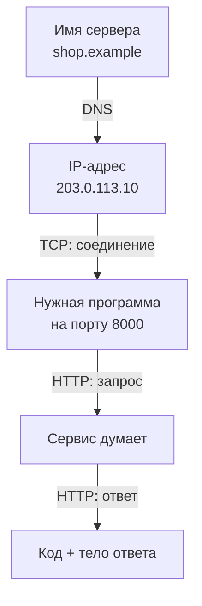
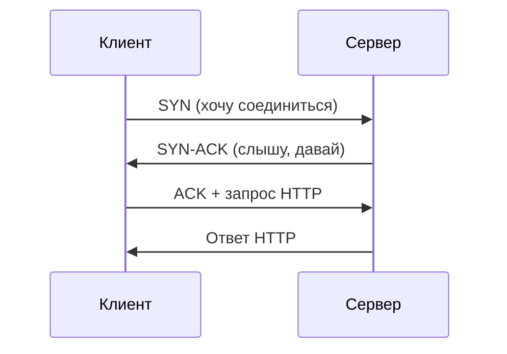
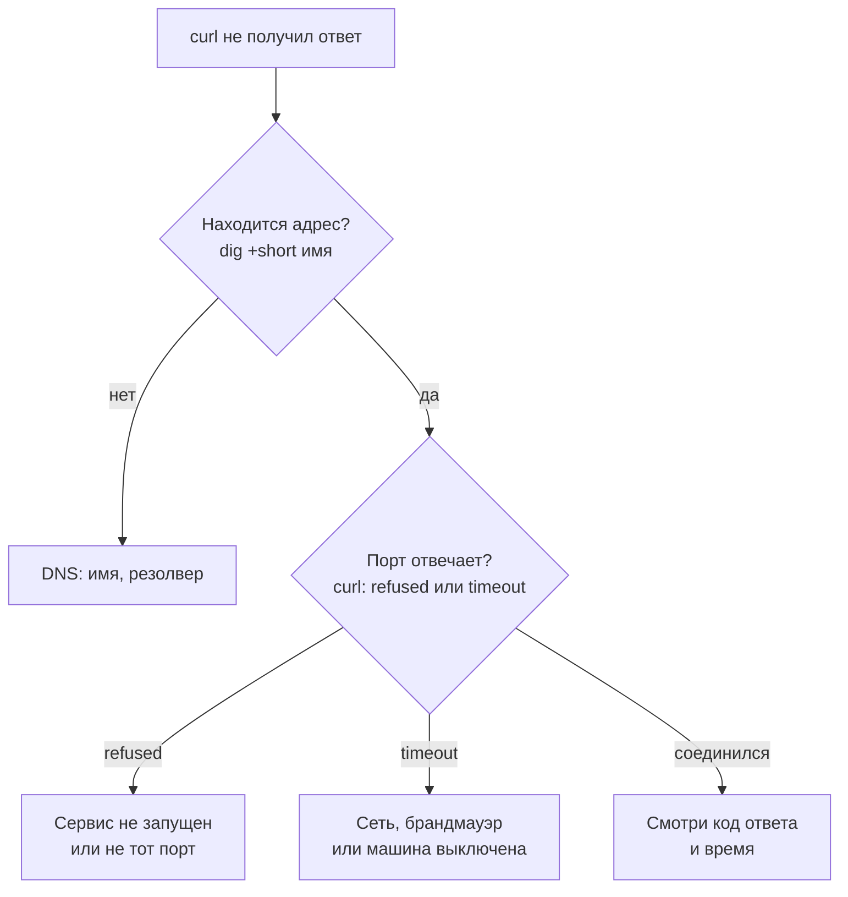

## Зачем это нужно

Я много лет занимаюсь нагрузкой и до сих пор начинаю любой разбор жалобы с одной минуты в терминале.

Представь: ты в команде интернет-магазина, до распродажи месяц. Коллега пишет в чат: «Сервис не отвечает». Для него это одна поломка, а на деле их десяток: сервис не запущен, закрыт порт, не находится имя, оборвана сеть, сервис отвечает ошибкой. Пользователь видит одно и то же: страница не открывается. Новички выбирают причину наугад, и я так делал. Однажды два часа перезапускал сервис, а он работал: просто слушал не тот порт. Одна команда показала бы это за секунду.

Поэтому умение сказать за минуту «сеть в порядке, сервис вернул 500» экономит часы споров между командами. Тестировщику оно нужно вдвойне: время ответа складывается из этапов (найти адрес, соединиться, дождаться сервера, получить данные). Не разложив его на части, не скажешь, где оно потерялось.

Шаг проекта: ты научишься проверять локальный сервис из терминала четырьмя командами (`ss`, `dig`, `ping`, `curl`), разберёшь время запроса на части и сохранишь шпаргалку «как отличить проблему сети от проблемы сервиса» в `~/perf-lab/01-linux/network-notes.md`. В уроке 1.5 из этих команд ты соберёшь скрипт проверки стенда.

## Что нужно знать

- Терминал, `sudo apt install`, `man`: [урок 1.1](01-workstation-terminal.md). Пакет `dnsutils` (команда `dig`) и `curl` ты поставил там же.
- Конвейеры `|`, `grep`, `awk`: [урок 1.2](02-text-logs.md). Они нужны, чтобы вырезать нужное из вывода.
- Процесс и PID: [урок 1.3](03-processes-resources.md). `ss` покажет, какой процесс занимает порт.
- Глубже о сети: [DNS](https://distinguished-sre.github.io/devops/02-network/03-dns.html) и [порты и TCP](https://distinguished-sre.github.io/devops/02-network/02-ports-tcp-ssh.html) в курсе DevOps. Для нас достаточно того, что написано здесь.

HTTP (протокол, на котором работают сайты и API: сообщения «запрос» и «ответ» с кодом вроде 200 или 404) подробно разбирается в [уроке 2.1](../02-web/01-client-server-http.md). Сейчас нужно знать только, что `curl` отправляет такой запрос и показывает ответ.

## Картина целиком

Заказ пиццы по телефону. Сначала узнаёшь номер по названию пиццерии (это **DNS**, справочник имён). Потом дозваниваешься и просишь нужный отдел по добавочному номеру (это **соединение**, по-научному TCP, и **порт**). Потом называешь заказ и ждёшь (время сервера). В конце получаешь пиццу (передача данных). Сорваться может любой шаг, и по тому, какой, ясно, что чинить. Нет номера, никто не берёт трубку или «такой пиццы нет» (ошибка в ответе, например 404).



На схеме четыре шага подряд, и у каждого своя команда: `dig` для DNS, `ping` и `ss` для соединения, `curl` проходит весь путь. Нельзя соединиться, не узнав адрес, поэтому диагностика проста: идёшь по цепочке сверху вниз и останавливаешься на первом сломанном шаге.

## Теория

### Как компьютеры находят друг друга: IP-адрес

Сервис на твоём ноутбуке открывается, а у коллеги из соседней комнаты по твоему адресу нет. В чём разница?

Данные между машинами идут через десятки кабелей и маршрутизаторов (устройств, пересылающих данные дальше) разных владельцев. Чтобы все друг друга понимали, правила разделили на слои, и каждый решает свою задачу, не зная о других. Это как почта: ты пишешь адрес, а письмо везут сами. Аналогия ломается в одном месте: в сети данные режутся на мелкие пакеты, которые едут разными путями и собираются на месте.

Нам нужны три слоя. Адреса машин и вопрос «жива ли она»: IP и `ping`. Доставка до нужной программы: TCP и порт, их смотрит `ss`. Язык самих программ, например HTTP и DNS: `curl` и `dig`.

**IP-адрес** это номер машины в сети, как адрес дома: четыре числа от 0 до 255 через точки, например `192.168.1.15`. Свой адрес покажет `ip -br a` (`-br` короткий вывод, `a` от address). Три особых адреса встретишь постоянно.

Адрес `127.0.0.1` (имя `localhost`) значит «сама эта машина». Запрос на него не покидает компьютер, и по нему ты будешь ходить на стенд «Магазин», который запущен у тебя. Адреса вида `192.168.x.x`, `10.x.x.x` и `172.16-31.x.x` называются частными: они работают внутри домашних и офисных сетей, из интернета их не видно. Адрес `0.0.0.0` значит «все адреса этой машины»: так программа сообщает, что принимает обращения отовсюду.

> **Прикинь сам:** сервис на твоём ноутбуке принимает запросы только на адресе `127.0.0.1`. Коллега открывает адрес ноутбука `192.168.1.15`. Получится?
{: .predict}

Нет. `127.0.0.1` значит «только эта машина», и обращения с других машин сервис не принимает. Чтобы коллега подключился, сервис должен принимать запросы на `0.0.0.0` или на `192.168.1.15`. Отсюда частая фраза «у меня работает, а у коллеги нет».

> **Главное:** IP-адрес это номер машины, `127.0.0.1` значит «только эта машина», `0.0.0.0` значит «любой адрес этой машины».
{: .key}

Адрес привёл нас к нужной машине. Но на ней работают десятки программ, и теперь надо понять, к какой из них стучаться.

### Порт и TCP: как дозвониться до нужной программы

На машине одновременно живут веб-сервер, база данных и кэш. Когда приходят данные, кому их отдать? Для этого придумали **порт**: число от 1 до 65535. Представь офисное здание с одним входом: это IP-адрес. За входом двери отделов с номерами: это порты. IP указывает дом, порт указывает дверь. Аналогия ломается в том, что программа сама занимает номер двери, и два отдела не могут занять один номер.

У стенда «Магазин» двери такие: `shop` на 8000, `payment` на 8001, PostgreSQL на 5432, Redis на 6379. Стандартные номера стоит знать наизусть: HTTP 80, HTTPS 443, SSH 22, DNS 53.

Программа, которая заняла порт и ждёт обращений, **слушает** его (listen). Так `0.0.0.0` из прошлого раздела читается как «слушаю на всех адресах машины».

Дальше работает **TCP** (Transmission Control Protocol): правила надёжной доставки. Данные приходят целыми и по порядку, а потерянные куски отправляются заново. Но сначала стороны договариваются о соединении, и это называется **трёхстороннее рукопожатие** (three-way handshake):

1. Клиент шлёт `SYN`: «хочу соединиться».
2. Сервер отвечает `SYN-ACK`: «слышу, давай».
3. Клиент шлёт `ACK`: «договорились» и сразу отправляет свой запрос.



Пока не прошёл один круг «туда и обратно», ни один байт запроса не ушёл. Время такого круга называют **RTT** (round-trip time, время кругового обхода).

> **Прикинь сам:** сервер в другом городе, RTT равен 40 мс. Сколько стоит одно рукопожатие? А если тест открывает 10 новых соединений подряд?
{: .predict}

Одно рукопожатие это один круг: 40 мс. Десять соединений подряд обойдутся в 10 раз по 40, то есть 400 мс, и всё это до того, как сервер начал думать. Вот почему далёкий сервер заметен в тесте, а переиспользование соединений ускоряет запросы.

Теперь самое полезное для диагностики. Что будет, если стучаться в порт? Есть три исхода.

Если порт слушает программа, рукопожатие проходит. Если порт на живой машине никто не слушает (и брандмауэр не молчит), машина сразу отвечает «здесь никого», и клиент получает ошибку **«Connection refused»** (отказ). Это быстрая и однозначная ошибка: машина жива, а сервис на этом порту не работает. Если же машина недоступна или пакеты теряются, ответа нет вообще. Клиент ждёт и через время сдаётся с ошибкой **таймаута** (timeout). Эта ошибка медленная и неоднозначная: машина выключена, сеть оборвана или пакеты блокирует **брандмауэр**, то есть фильтр, который пропускает не всё.

Осторожно: «порт открыт» не значит «сервис работает правильно». Рукопожатие проходит всегда, когда программа слушает, даже если потом она отвечает ерунду.

> **Проверь понимание:** `curl` ответил «Connection refused» за 0,01 секунды. Что можно сказать о машине и о сервисе?

<details markdown="1">
<summary>Ответ</summary>

Машина жива (иначе ответа не пришло бы), а на этом порту никто не слушает: сервис не запущен, упал или слушает другой порт. Проблема в сервисе, а не в сети.

</details>

> **Главное:** адрес указывает машину, порт указывает программу на ней, а «отказ» (быстро) и «таймаут» (долго) это два разных диагноза.
{: .key}

С портом ясно. Но люди пишут `shop.example.com`, а не `203.0.113.10`. Кто переводит имя в адрес?

### DNS: как имя превращается в адрес

Сайт открывается у тебя, а у коллеги нет. Или вчера открывался, а после смены адреса у части людей перестал. Часто виноват перевод имени в адрес.

Людям удобно запоминать `shop.example.com`, а машинам нужен IP-адрес. Переводчиком служит **DNS** (Domain Name System): телефонная книга интернета. Ты называешь имя, получаешь номер. Аналогия ломается тем, что книг много, они спрашивают друг друга по цепочке, а ответы запоминаются на время.

Программа не опрашивает всю сеть, а обращается к **резолверу** (resolver). Это сервер из настроек сети: домашний роутер, провайдер или публичный вроде `8.8.8.8`. Он сам находит ответ, возвращает его и **кэширует**, то есть запоминает, чтобы не повторять работу. Срок хранения называется **TTL** (time to live, «время жизни») и задаётся в секундах. TTL 300 значит, что пять минут резолвер отвечает из памяти и не спрашивает заново.

Из этого следует важное. Ты сменил адрес у сервиса, а клиенты ещё до пяти минут ходят на старый: у них в памяти старый ответ. Поэтому смена адреса «доходит» до всех не сразу.

Ответ состоит из записей. Чаще всего встретишь запись `A` (адрес из четырёх чисел, как `192.168.1.15`, для имени: `example.com -> 93.184.215.14`) и `CNAME` («это имя псевдоним другого»).

Посмотрим на настоящий ответ. Команда `dig` (Domain Information Groper) спрашивает DNS и показывает ответ подробно.

```bash
dig example.com
```

```text
; <<>> DiG 9.18.39-0ubuntu0.24.04.1-Ubuntu <<>> example.com
;; Got answer:
;; ->>HEADER<<- opcode: QUERY, status: NOERROR, id: 41872
;; flags: qr rd ra; QUERY: 1, ANSWER: 1, AUTHORITY: 0, ADDITIONAL: 1

;; QUESTION SECTION:
;example.com.                   IN      A

;; ANSWER SECTION:
example.com.            278     IN      A       93.184.215.14

;; Query time: 23 msec
;; SERVER: 127.0.0.53#53(127.0.0.53) (UDP)
;; WHEN: Sat Oct 03 11:30:12 MSK 2026
;; MSG SIZE  rcvd: 56
```

Адрес в твоём выводе будет другим: смотри на устройство ответа. Строки `HEADER` и `flags` читать не нужно. Первым смотри `status`: `NOERROR` значит «имя найдено», `NXDOMAIN` «такого имени нет», `SERVFAIL` «сам DNS-сервер не смог ответить». Главное в `ANSWER SECTION`: имя `example.com.`, оставшийся TTL (ещё 278 секунд ответ лежит в кэше), класс `IN` («интернет»), тип `A` и адрес. `Query time` показывает, сколько ушло на ответ: повторный вызов вернётся из кэша за 0-1 мс, а TTL уменьшится. `SERVER: 127.0.0.53#53` называет, кто ответил: локальный резолвер Ubuntu, он сам спрашивает дальше.

Для скриптов удобнее короткие формы:

```bash
dig +short example.com
dig +short example.com @8.8.8.8
dig +noall +answer +stats example.com
```

```text
93.184.215.14
93.184.215.14
example.com.            278     IN      A       93.184.215.14
;; Query time: 23 msec
```

`+short` печатает только ответ. `@8.8.8.8` спрашивает указанный сервер в обход системного: так проверяют, виноват ли локальный резолвер. `+noall +answer +stats` оставляет ответ и время.

Осторожно: «имя не находится» (`NXDOMAIN`) и «сервер не отвечает» это разные поломки, первая про DNS, вторая про сеть или сервис. А `localhost` внешний DNS не требует, система знает его из файла `/etc/hosts`: на локальном стенде DNS в тесте почти не участвует.

> **Проверь понимание:** `dig +short shop.lab` ничего не вывел, а `dig shop.lab` показал `status: NXDOMAIN`. Это проблема сети?

<details markdown="1">
<summary>Ответ</summary>

Нет, это DNS: такого имени в справочнике нет. Сеть тут ни при чём, и проверять `ping` и порты рано: сначала нужно получить адрес.

</details>

> **Главное:** DNS переводит имя в адрес и запоминает ответ на срок TTL, поэтому «имя не находится» проверяют отдельно от сети.
{: .key}

Адрес есть. Жива ли машина и слушают ли порт?

### ping и ss: машина жива, порт слушают

Два простых вопроса к сети: «ты там?» и «кто слушает этот порт?». На первый отвечает `ping`: он отправляет короткий пакет «ты жив?», машина отвечает «жив», и видно, сколько времени заняла дорога туда и обратно.

```bash
ping -c 3 example.com
```

```text
PING example.com (93.184.215.14) 56(84) bytes of data.
64 bytes from 93.184.215.14: icmp_seq=1 ttl=54 time=41.2 ms
64 bytes from 93.184.215.14: icmp_seq=2 ttl=54 time=40.8 ms
64 bytes from 93.184.215.14: icmp_seq=3 ttl=54 time=41.5 ms

--- example.com ping statistics ---
3 packets transmitted, 3 received, 0% packet loss, time 2003ms
rtt min/avg/max/mdev = 40.8/41.2/41.5/0.3 ms
```

Флаг `-c 3` отправляет три пакета: без него `ping` идёт бесконечно, остановка `Ctrl+C`. `time=41.2 ms` это тот самый RTT, а значит, каждое новое соединение к этому серверу стоит не меньше 41 мс. `0% packet loss`: ни один пакет не потерян. Но многие серверы нарочно не отвечают на `ping` (так настроен брандмауэр), поэтому молчание ничего не доказывает.

На второй вопрос отвечает `ss` (socket statistics): он показывает, какие порты слушают и какие соединения открыты.

```bash
sudo ss -tlnp
```

Флаги: `-t` только TCP, `-l` только слушающие, `-n` числа вместо названий (`8000`, а не `http-alt`), `-p` показать процесс. Из-за `-p` нужен `sudo`: чужие процессы без него не видны.

```text
State   Recv-Q  Send-Q   Local Address:Port    Peer Address:Port  Process
LISTEN  0       4096         127.0.0.1:8000         0.0.0.0:*     users:(("python3",pid=51203,fd=3))
LISTEN  0       4096     127.0.0.53%lo:53           0.0.0.0:*     users:(("systemd-resolve",pid=812,fd=14))
LISTEN  0       128            0.0.0.0:22           0.0.0.0:*     users:(("sshd",pid=950,fd=3))
LISTEN  0       244                  *:5432               *:*     users:(("postgres",pid=1432,fd=6))
```

Главная колонка `Local Address:Port` отвечает на вопрос «на каком адресе и порту слушают». `127.0.0.1:8000` значит «только эта машина», вспомни коллегу из первого раздела. `0.0.0.0:22` и `*:5432` значат «все адреса». Колонка `Process` называет программу и её PID (номер процесса из [урока 1.3](03-processes-resources.md)): порт 8000 занят `python3` с PID 51203.

Если нужного порта в списке нет, сервис не запущен. Если порт занят чужой программой, твой сервис не стартует с ошибкой «address already in use». Один порт проверяют так: `sudo ss -tlnp | grep :8000`.

Осторожно: ни `ping`, ни `ss` не говорят, что сервис отвечает правильно. Первый видит только машину, второй только запущенную программу.

> **Главное:** `ping` показывает, жива ли машина, `ss -tlnp` показывает, кто слушает порт и на каком адресе. Правильность ответов не видит ни тот, ни другой.
{: .key}

Чтобы узнать, отвечает ли сервис правильно, зададим ему настоящий вопрос по HTTP.

### curl: весь путь и время по этапам

Порт слушают, но работает ли сервис? `ping` и `ss` не скажут, а `curl` скажет: он делает настоящий HTTP-запрос и показывает код ответа, заголовки, тело и время.

Начнём с подробного режима `-v` (verbose). У «Магазина» есть адрес `/healthz`: сервис отвечает по нему «я жив». Его мы и спросим.

```bash
curl -v http://127.0.0.1:8000/healthz
```

```text
*   Trying 127.0.0.1:8000...
* Connected to 127.0.0.1 (127.0.0.1) port 8000
> GET /healthz HTTP/1.1
> Host: 127.0.0.1:8000
> User-Agent: curl/8.5.0
> Accept: */*
>
< HTTP/1.1 200 OK
< date: Sat, 03 Oct 2026 11:31:40 GMT
< server: uvicorn
< content-length: 15
< content-type: application/json
< x-request-id: 5c0e1b7a9d3f4e28b6a1c47d90e2f835
<
{"status":"ok"}
```

Строки со звёздочкой `*` это ход соединения. Строки с `>` curl отправил: метод `GET`, путь `/healthz`. Строки с `<` он получил: код `200 OK` и заголовки (служебные строки перед телом). Последняя строка это тело. Если сервис упал, видно, где всё остановилось: на `Trying` (не соединились) или после `>` (запрос ушёл, ответа нет).

Теперь самый полезный приём урока: время по этапам. Флаг `-w` печатает после запроса значения по шаблону. `%{time_namelookup}` показывает, когда найден адрес (DNS), `%{time_connect}` когда установлено соединение, `%{time_starttransfer}` когда пришёл первый байт ответа, `%{time_total}` когда всё закончилось. Ещё есть `%{http_code}`, код ответа.

Главное, что надо помнить: все времена отсчитываются **с начала запроса**, нарастающим итогом, а не по отдельности. Поэтому длительность этапа получают вычитанием.

```bash
curl -s -o /dev/null -w 'код %{http_code}, dns %{time_namelookup}, connect %{time_connect}, ждали %{time_starttransfer}, всего %{time_total}\n' http://example.com/
```

```text
код 200, dns 0.023104, connect 0.064527, ждали 0.151220, всего 0.152013
```

Флаги `-s -o /dev/null` убирают лишний вывод, `\n` в конце переводит строку. Считаем по шагам. Имя найдено за 23 мс. Соединение готово к 64 мс, значит, рукопожатие заняло 64 - 23 = 41 мс: столько же, сколько RTT у `ping`. Первый байт пришёл к 151 мс, значит, между соединением и первым байтом прошло 151 - 64 = 87 мс. В них ещё один круг сети (запрос туда, байт обратно, те же 41 мс), поэтому сервер работал около 87 - 41 = 46 мс. Передача тела заняла 1 мс. Итог: из 152 мс сервис занял около 46, остальное ушло на сеть и DNS.

Раскладку удобно покрутить: в виджете три ползунка (DNS, круг RTT, работа сервера).

<div class="viz" data-viz="linux-net-timeline" data-dns="30" data-rtt="40" data-server="80"></div>

Увеличь RTT: вырастут и рукопожатие, и вся полоса. Увеличь время сервера: вырастет только ожидание.

> **Прикинь сам:** `curl -w` показал `connect 0.050`, `starttransfer 0.610`, `total 0.612`. Где потерялось время: в сети или в сервисе?
{: .predict}

В сервисе. Соединение готово к 50 мс (в них сидят и поиск имени в DNS, и само соединение), сеть в порядке. Первый байт пришёл к 610 мс: между соединением и первым байтом 610 - 50 = 560 мс. Запрос и ответ ещё раз проходят сеть туда и обратно, но этот круг не дольше тех же 50 мс, значит сервис работал не меньше 510 мс. Для `https` вычти ещё время на шифрование (`time_appconnect`). Передача заняла 612 - 610 = 2 мс. Смотреть надо логи сервиса, базу данных и ресурсы машины из [урока 1.3](03-processes-resources.md).

Осторожно: `time_connect` это не «длительность соединения», а момент, когда оно завершилось. `time_starttransfer` называют ещё TTFB (time to first byte, время до первого байта): в нём уже сидят DNS и соединение. И ещё ловушка: `curl` не считает ответ 500 ошибкой, код выхода (число, которое команда возвращает системе, 0 значит «успех») остаётся нулевым. Чтобы при 4xx и 5xx он стал ненулевым, добавь `--fail`. В [уроке 1.5](05-bash-scripts.md) это пригодится.

<details markdown="1">
<summary>Для любопытных: остальные флаги curl и время для https</summary>

Флаги, которые нужны постоянно:

| Флаг | Что делает |
|---|---|
| `-s` | тихий режим: без полосы прогресса |
| `-S` | вместе с `-s` всё равно показать ошибку (`-sS` очень удобно) |
| `-o /dev/null` | выбросить тело ответа |
| `-i` | показать заголовки ответа вместе с телом |
| `-v` | подробно: что происходит на каждом шаге |
| `-w 'формат'` | напечатать после запроса выбранные значения |
| `--max-time 5` | сдаться, если весь запрос длится дольше 5 секунд |
| `--connect-timeout 2` | сдаться, если соединение не установилось за 2 секунды |
| `-f` (`--fail`) | вернуть ненулевой код выхода при ответе 4xx или 5xx |

Для адресов с `https` добавляется ещё `time_appconnect`: время шифрованного рукопожатия TLS. Для локального стенда (обычный HTTP) оно нулевое.

</details>

> **Главное:** `curl -w` печатает время нарастающим итогом, и длительность каждого этапа получают вычитанием соседних значений.
{: .key}

Инструменты есть. Осталось собрать их в цепочку: что смотреть первым и как по ошибке понять, где сломалось.

### Как отличить сеть от HTTP-ошибки

Вернёмся к сообщению в чате: «сервис не отвечает». Идёшь по цепочке и смотришь, что говорит `curl`.

`Could not resolve host` (`curl: (6)`) значит, что сломан DNS: проверь написание и `dig +short имя @8.8.8.8`. Быстрый `Connection refused` (`curl: (7)`): машина жива, порт никто не слушает, смотри `ss -tlnp` на сервере. `Timeout was reached` (`curl: (28)`) на этапе соединения: пакеты не доходят, проверяй `ping` и брандмауэр. Если же в `-v` было `Connected`, а потом таймаут, сервис завис или перегружен.

А если пришёл код ответа, сеть в порядке. 4xx (404, 401) значит, что запрос неверный. 5xx (500, 503): сервис получил запрос и сломался или перегружен. 200, но долго: время разложит `curl -w`.

Запомни главное: **любой код ответа, даже 500, означает, что запрос дошёл до сервиса и сервис ответил**. Поэтому ошибка 500 это не про сеть, а про приложение, и ходить в `ping` бесполезно.



«Refused» и «timeout» уводят в разные стороны, и различить их можно за секунду. Ветка «соединился» значит, что сеть уже не подозреваем и работаем с HTTP-ответом. Ту же логику можно пройти по шагам в виджете:

<div class="viz" data-viz="flow" data-steps='[{"title":"1. Имя находится?","text":"`dig +short имя`. Пусто или NXDOMAIN: проблема DNS, дальше идти рано."},{"title":"2. Хост жив?","text":"`ping -c 3 адрес`. Ответ есть: машина жива. Нет ответа: не доказательство, многие серверы молчат на ping."},{"title":"3. Порт слушают?","text":"`sudo ss -tlnp | grep :порт` на самом сервере или `curl -v` издалека. Refused: сервис не запущен. Timeout: сеть."},{"title":"4. Что отвечает сервис?","text":"`curl -i адрес`. Код 200: хорошо. 4xx: запрос неверный. 5xx: сервис сломался."},{"title":"5. Почему долго?","text":"`curl -w` с таймингами: DNS, соединение, первый байт, всего. Время уходит либо в сеть, либо в сервис."}]'></div>

Осторожно: ошибки 502 и 504 обычно не про сеть до сервера. Их присылает прокси, промежуточный сервер перед приложением: раз он ответил, путь от тебя до прокси работает, а сломано то, что за ним (приложение или связь прокси с ним).

> **Проверь понимание:** `curl` получил `HTTP/1.1 503 Service Unavailable`. Нужно ли проверять `ping`?

<details markdown="1">
<summary>Ответ</summary>

Нет. Раз пришёл ответ с кодом, запрос дошёл до сервиса: DNS, сеть и порт работают. 503 говорит, что сервис получил запрос, но не может его обработать (например, у «Магазина» `/readyz` отвечает 503, когда недоступна база данных). Нужно смотреть логи и зависимости сервиса.

</details>

> **Главное:** текст ошибки `curl` и скорость её появления за минуту указывают сломанный шаг цепочки, а любой код ответа снимает подозрение с сети.
{: .key}

Теперь то же руками: поднимем учебный сервис и сломаем его на каждом шаге.

## Практика

Стенд «Магазин» ты поднимешь только в [уроке 2.1](../02-web/01-client-server-http.md). Чтобы потренироваться уже сейчас, запустим «учебный сервис»: простой веб-сервер, встроенный в Python. Порт, процесс, ответы и время на нём работают так же, как на настоящем сервисе.

### 1. Запусти учебный сервис и найди его порт

Открой два терминала (второе окно: [урок 1.1](01-workstation-terminal.md); в Multipass это второй `multipass shell lab`, сервис работает внутри ВМ, поэтому `curl` тоже запускай в ней). В первом:

```bash
mkdir -p ~/perf-lab/01-linux/www
cd ~/perf-lab/01-linux/www
echo '{"status":"ok"}' > healthz
python3 -m http.server 8000 --bind 127.0.0.1
```

`mkdir -p` создаёт каталог, в нём файл `healthz` с таким же ответом, как у «Магазина». `python3 -m http.server 8000` запускает сервер: он раздаёт файлы из текущего каталога на порту 8000 (`--bind 127.0.0.1` значит только для этой машины). Терминал занят сервером и будет печатать строки о запросах: так и задумано.

```text
Serving HTTP on 127.0.0.1 port 8000 (http://127.0.0.1:8000/) ...
```

Во втором терминале:

```bash
sudo ss -tlnp | grep :8000
```

```text
LISTEN 0      5          127.0.0.1:8000       0.0.0.0:*    users:(("python3",pid=51203,fd=3))
```

**Как читать вывод:** порт 8000 слушает `python3` с PID 51203, и только на `127.0.0.1`. Если строки нет, сервер из первого терминала не запустился.

**Типичные ошибки:** `OSError: [Errno 98] Address already in use`: порт занят другой программой. Найди её той же командой `ss` и останови, либо возьми порт 8002.

### 2. Проверь сервис через curl

Во втором терминале:

```bash
curl -v http://127.0.0.1:8000/healthz
curl -s -o /dev/null -w 'код %{http_code}, connect %{time_connect}, ждали %{time_starttransfer}, всего %{time_total}\n' http://127.0.0.1:8000/healthz
curl -s -o /dev/null -w '%{http_code}\n' http://127.0.0.1:8000/net-takogo
```

```text
код 200, connect 0.000211, ждали 0.002874, всего 0.002930
404
```

(Подробный вывод первой команды похож на показанный в теории, но у учебного сервера строка ответа `HTTP/1.0 200 OK`, а заголовки свои: `Server: SimpleHTTP/0.6 Python/3.12.3`, `Content-type: application/octet-stream`.) **Как читать вывод:** `connect` близок к нулю: запрос идёт внутри машины, сети нет. Сервис ответил за 3 мс. Третья команда запросила несуществующий путь и получила `404`: сервис работает, но такой страницы нет. Сеть и порт в порядке, ошибка на уровне приложения. Загляни в окно с сервером: там появились строки вида `127.0.0.1 - - [03/Oct/2026 11:42:01] "GET /healthz HTTP/1.1" 200 -`. Это его журнал запросов, такой же, как логи из [урока 1.2](02-text-logs.md).

**Типичные ошибки:**

- `curl: (7) Failed to connect to 127.0.0.1 port 8000 after 0 ms: Couldn't connect to server`: сервер из первого терминала не запущен или остановлен. Проверь `ss`.
- `curl: (3) URL rejected: Bad hostname`: в адресе опечатка или лишний пробел.

### 3. DNS: спроси справочник

```bash
dig example.com
dig +short example.com
dig +short example.com @8.8.8.8
dig +noall +answer +stats example.com
```

Вывод похож на показанный в теории: адрес, TTL и время запроса. Твои числа будут другими. Смотри на три вещи. Первое: **время запроса** у первого `dig` обычно 20-100 мс, у повторного 0-2 мс (ответ из кэша). Второе: **TTL** при повторных запросах уменьшается (278, 275, 271...): это обратный отсчёт срока жизни кэша. Третье: `dig +short example.com @8.8.8.8` спрашивает не локальный резолвер, а публичный, и обычно возвращает тот же адрес.

Теперь спроси имя, которого не существует:

```bash
dig nonexistent-name-123.example
```

```text
;; ->>HEADER<<- opcode: QUERY, status: NXDOMAIN, id: 9031
```

`NXDOMAIN` («не существует»): DNS сработал правильно и честно сказал «такого имени нет». Это ответ, а не поломка DNS.

**Типичные ошибки:** `dig: command not found`: не поставлен `dnsutils` (`sudo apt install -y dnsutils`, как в [уроке 1.1](01-workstation-terminal.md)). `;; connection timed out; no servers could be reached`: нет интернета или не отвечает резолвер, попробуй `@8.8.8.8`.

### 4. Измерь время по этапам

Один запрос к публичному сайту безопасен: это не нагрузка. Сравни удалённый сервис и локальный:

```bash
curl -s -o /dev/null -w 'dns %{time_namelookup}, connect %{time_connect}, ждали %{time_starttransfer}, всего %{time_total}\n' http://example.com/
curl -s -o /dev/null -w 'dns %{time_namelookup}, connect %{time_connect}, ждали %{time_starttransfer}, всего %{time_total}\n' http://127.0.0.1:8000/healthz
```

```text
dns 0.023104, connect 0.064527, ждали 0.151220, всего 0.152013
dns 0.000052, connect 0.000211, ждали 0.002874, всего 0.002930
```

**Как читать вывод:** посчитай этапы вычитанием. Для удалённого: DNS 23 мс, рукопожатие 64 - 23 = 41 мс, ожидание ответа 151 - 64 = 87 мс (круг сети 41 и сервер около 46), передача 1 мс. Для локального: DNS 0,05 мс, рукопожатие 0,16 мс, ожидание 2,7 мс. **Вывод для нагрузочного теста:** запрос по сети стоит на десятки миллисекунд дороже локального. Поэтому результаты теста на локальный стенд нельзя сравнивать с тестом через интернет: разница уйдёт в сеть, а не в сервис. Запиши свои цифры, они понадобятся ниже. Можешь ввести их в виджет выше и посмотреть, куда ушло твоё время.

### 5. Нарочно сломай по очереди три шага

Три разные ошибки, по одной на шаг цепочки. Выполни и сравни тексты:

```bash
# DNS: имя не существует
curl --max-time 5 http://no-such-host.invalid/
# Порт: ничего не слушает
curl --max-time 5 http://127.0.0.1:8999/
# Сеть: адрес, на который никто не отвечает (диапазон для документации)
curl --connect-timeout 3 http://192.0.2.1:8000/
```

```text
curl: (6) Could not resolve host: no-such-host.invalid
curl: (7) Failed to connect to 127.0.0.1 port 8999 after 0 ms: Couldn't connect to server
curl: (28) Failed to connect to 192.0.2.1 port 8000 after 3001 ms: Timeout was reached
```

**Как читать вывод:** три разные ошибки с тремя разными номерами: (6) DNS, (7) порт закрыт, (28) таймаут. Сравни время: первые две пришли мгновенно, третья ждала три секунды. По комбинации «текст ошибки плюс время» ты различаешь поломки. Адрес `192.0.2.1` зарезервирован для документации и в интернете ни к кому не ведёт: безопасно.

### 6. Запиши шпаргалку

```bash
cd ~/perf-lab/01-linux
cat > network-notes.md <<'TXT'
# Сеть: как отличить, что сломалось

| Что вижу | Где сломалось | Чем проверить |
|---|---|---|
| curl: (6) Could not resolve host | DNS | dig +short имя; dig +short имя @8.8.8.8 |
| curl: (7) Connection refused, быстро | порт не слушают | ss -tlnp на сервере; запущен ли сервис |
| curl: (28) timeout | сеть или брандмауэр | ping, доступность машины |
| Код 4xx | запрос неверный | путь, токен, тело запроса |
| Код 5xx | сервис сломался | логи сервиса, ресурсы машины |
| Код 200, но долго | время | curl -w: dns, connect, starttransfer, total |

Шаблон времени:
curl -s -o /dev/null -w 'dns %{time_namelookup}, connect %{time_connect}, ждали %{time_starttransfer}, всего %{time_total}, код %{http_code}\n' URL

Мои измерения:
- локально: ___ мс
- example.com: ___ мс (из них сеть ___, сервис ___)
TXT
nano network-notes.md
```

Допиши свои числа из упражнения 4. Первый терминал с сервером пока не закрывай.

> Сервис не отвечает, а причина не из «Типичных ошибок»? Сначала пройди три шага из урока (порт, адрес, DNS), потом отправь нейросети вывод `ss -ltnp` и `curl -v` целиком и сверь её версию со своей.
{: .ai}

## Сломай и почини

**Поломка.** Остановим сервис, но представим, что ты этого не знаешь. В первом терминале нажми `Ctrl+C` (сервер остановлен), и сразу запусти его снова, но на **другом** порту:

```bash
cd ~/perf-lab/01-linux/www && python3 -m http.server 8002 --bind 127.0.0.1
```

Во втором терминале проверь по старому адресу:

```bash
curl -sS --max-time 5 http://127.0.0.1:8000/healthz; echo "код выхода: $?"
```

**Задача.** Выясни по шагам, что сломано, не угадывая: DNS, порт или приложение, и найди, на каком порту сервис работает на самом деле.

<details markdown="1">
<summary>Разбор</summary>

1. Проверка вернула `curl: (7) Failed to connect to 127.0.0.1 port 8000 after 0 ms: Couldn't connect to server` и код выхода 7. Ошибка быстрая и называется «refused»: DNS здесь не участвует (адрес числовой), сеть не при чём, на порту 8000 никто не слушает.
2. Проверяем, кто слушает: `sudo ss -tlnp | grep python`. Видим `127.0.0.1:8002` и процесс `python3`. Значит, сервис жив, но слушает не тот порт, на который ходит клиент.
3. Проверяем найденный порт: `curl -s http://127.0.0.1:8002/healthz` и получаем `{"status":"ok"}`. Диагноз: сервис работает, клиент настроен на неверный порт.
4. Исправление: направить клиента на 8002 (или запустить сервис на 8000). Повтори `curl` с верным портом: код 200.

Вывод: `Connection refused` значит «сверь порт», и `ss -tlnp` отвечает на вопрос «на каком порту сервис слушает на самом деле» за секунду. Это одна из самых частых причин «не работает» после переезда или изменения настроек.

</details>

Закончив, останови сервер (`Ctrl+C` в первом терминале) и удали учебный каталог, он больше не нужен:

```bash
rm -r ~/perf-lab/01-linux/www
```

## ИИ в помощь

Нейросеть помогает сузить сетевую проблему по тексту ошибки `curl`, но твоей сети не видит. Общие правила на странице [ИИ-помощник](../ai.md).

**Задача:** понять ошибку `curl` или `ss`.

```text
Я проверяю сервис на 127.0.0.1:8000, Ubuntu 24.04. Команда:
<вставь команду curl>
Вывод:
<вставь вывод целиком>
Объясни, чем Connection refused отличается от таймаута, и составь порядок проверок: слушает ли порт (ss -ltnp), DNS, сам сервис. Для каждой проверки дай команду.
```
{: .wrap}

**Проверь ответ:** выполни `ss -ltnp | grep 8000` и `curl -v`. Типичная ошибка: нейросеть советует `sudo ufw disable` («отключи файрвол») вместо диагностики и предлагает устаревший `netstat` вместо `ss`.

**Задача:** расшифровать тайминги `curl -w`.

```text
Вот команда и вывод curl с форматом времени (DNS, соединение, первый байт, всего):
<вставь вывод>
Объясни каждое значение простыми словами и скажи, на каком этапе потеряно больше всего времени. Какой вывод можно сделать, а какой был бы поспешным?
```
{: .wrap}

**Проверь ответ:** сверь названия переменных `-w` с `man curl` (раздел `--write-out`) и пересчитай разность этапов сам. Типичная ошибка: имена переменных, которых в curl нет, и неверное чтение накопленных значений (`time_connect` считается от начала, а не от конца DNS).

## Словарик урока

| Термин | Простыми словами |
|---|---|
| IP-адрес | Числовой адрес машины в сети, как адрес дома |
| `localhost`, `127.0.0.1` | «Эта же машина»: запрос не покидает компьютер |
| Порт | Номер от 1 до 65535, по которому находят программу на машине, как номер квартиры |
| Слушать порт (listen) | Программа заняла порт и ждёт входящих соединений |
| TCP | Правила надёжной доставки данных: целыми, по порядку, с повтором потерянного |
| Трёхстороннее рукопожатие | Обмен SYN, SYN-ACK, ACK перед передачей данных: стороны договариваются о соединении |
| RTT | Время кругового обхода: сколько идёт сообщение туда и ответ обратно |
| Брандмауэр | Фильтр, который пропускает не все соединения: часть портов закрыта |
| DNS | Справочник, который превращает имя в IP-адрес |
| Резолвер (resolver) | Сервер, который по запросу программы находит адрес по имени |
| Запись `A` | Запись DNS «имя - IPv4-адрес» |
| TTL | Срок в секундах, на который ответ DNS разрешено хранить в кэше |
| `NXDOMAIN` | Ответ DNS «такого имени не существует» |
| `ping` | Проверка «машина жива» и измерение времени круга (RTT) |
| `ss -tlnp` | Какие TCP-порты слушают и какие программы их заняли |
| `curl -v` | Запрос с подробным показом того, что отправлено и получено |
| `curl -w` | Печать выбранных значений после запроса: код, время по этапам |
| TTFB | Время до первого байта ответа (`time_starttransfer`) |
| `Connection refused` | Машина жива, но на порту никто не слушает |
| Таймаут (timeout) | Ответа нет совсем: ждать дальше не стали |

## Вопросы с собеседований

Раздел для повторения: ответь вслух, потом открой ответ. Вопросы с пометкой `[на скорость]` тренируй на время: ответ за 30 секунд.

### 1. [junior] [часто] Чем `Connection refused` отличается от таймаута?

<details markdown="1">
<summary>Ответ</summary>

`Connection refused` приходит быстро: машина жива, доступна по сети, но на этом порту никто не слушает (сервис не запущен или другой порт). Таймаут это молчание: пакеты не доходят или не возвращаются (машина выключена, нет маршрута, брандмауэр сбрасывает пакеты). Первое чинится на сервере, второе нужно искать в сети.

**Что хотят услышать:** быстро или долго, машина жива или неизвестно.

**Красный флаг:** «оба значат, что сервис упал».

</details>

### 2. [junior] [часто] Как проверить, что порт слушает нужная программа?

<details markdown="1">
<summary>Ответ</summary>

На самом сервере `sudo ss -tlnp | grep :8000`: покажет адрес, порт и процесс. Снаружи `curl -v`. Важно смотреть адрес: `127.0.0.1` доступен только изнутри, `0.0.0.0` отовсюду.

**Что хотят услышать:** `ss`, значение флагов, внимание к адресу.

**Красный флаг:** только `ping`.

</details>

### 3. [junior] [часто] Что показывает `curl -w` и зачем он нужен нагрузочному тестировщику?

<details markdown="1">
<summary>Ответ</summary>

Печатает значения запроса: код ответа и времена `time_namelookup` (DNS), `time_connect` (соединение), `time_starttransfer` (первый байт), `time_total`. Позволяет разложить время ответа на DNS, сеть и работу сервиса и понять, куда оно уходит. Времена нарастающие, этапы получают вычитанием.

**Что хотят услышать:** переменные, нарастающий итог, вывод про сеть против сервиса.

**Красный флаг:** «показывает, сколько запрос шёл», и всё.

</details>

### 4. [junior] Что делает DNS и что такое TTL?

<details markdown="1">
<summary>Ответ</summary>

DNS превращает имя в IP-адрес. Ответ состоит из записей (например, `A`: IPv4-адрес), а TTL это срок в секундах, в течение которого резолвер и клиенты могут запоминать ответ. Поэтому изменение адреса распространяется не мгновенно.

**Что хотят услышать:** справочник, кэширование, влияние TTL на смену адреса.

**Красный флаг:** путает DNS с IP.

</details>

### 5. [junior] Что такое трёхстороннее рукопожатие TCP и как оно влияет на время запроса?

<details markdown="1">
<summary>Ответ</summary>

Перед передачей данных стороны обмениваются SYN, SYN-ACK, ACK: договариваются о соединении. Это одно полное «туда-обратно» (один RTT) до первого байта запроса. Каждое новое соединение платит этот RTT, поэтому повторное использование соединений (keep-alive) ускоряет запросы.

**Что хотят услышать:** три сообщения, стоимость в RTT.

**Красный флаг:** «это про шифрование» (путает с TLS).

</details>

### 6. [junior] Пришёл ответ `500`. Нужно ли искать проблему в сети?

<details markdown="1">
<summary>Ответ</summary>

Нет. Раз пришёл код, запрос дошёл до сервиса и сервис ответил: DNS, сеть и порт работают. 500 значит, что сервис сломался при обработке. Дальше логи сервиса, зависимости и ресурсы машины.

**Что хотят услышать:** «любой код ответа значит, что сеть в порядке».

**Красный флаг:** «проверю `ping`».

</details>

### 7. [junior] Почему сервис на `127.0.0.1` недоступен с другой машины?

<details markdown="1">
<summary>Ответ</summary>

`127.0.0.1` это «только эта машина»: сервис слушает только локальный адрес и не принимает внешние соединения. Нужно, чтобы он слушал `0.0.0.0` или адрес сетевого интерфейса, и чтобы брандмауэр пропускал порт.

**Что хотят услышать:** адрес `127.0.0.1` (петля на себя), `0.0.0.0`, брандмауэр.

**Красный флаг:** «сломалась сеть».

</details>

### 8. [middle] Запрос к сервису занимает 800 мс. Как понять, где потерялось время?

<details markdown="1">
<summary>Ответ</summary>

Разложить через `curl -w`: DNS (`time_namelookup`), соединение (`time_connect`), первый байт (`time_starttransfer`), всего. Много на DNS: резолвер или кэширование. Много на соединении: сеть или далёкий сервер. Много между соединением и первым байтом: работа сервиса. Много между первым байтом и концом: большой ответ или медленный канал. Для сравнения запускаю то же с машины рядом с сервисом и смотрю RTT по `ping`.

**Что хотят услышать:** вычитание этапов, вывод про каждый, сравнение с эталоном.

**Красный флаг:** «увеличу таймаут».

</details>

### 9. [middle] `dig` с локальным резолвером даёт ошибку, а `dig @8.8.8.8` работает. Что это значит?

<details markdown="1">
<summary>Ответ</summary>

Имя в порядке, неисправен локальный резолвер или путь до него (настройки, перегрузка, кэш). Можно сменить резолвер или очистить кэш. Сеть и сервис в целом работают.

**Что хотят услышать:** сравнение двух резолверов как приём, вывод про локальный.

**Красный флаг:** «DNS сломан везде».

</details>

### 10. [middle] Как проверить сервис из скрипта, чтобы он честно сообщал об ошибке?

<details markdown="1">
<summary>Ответ</summary>

`curl -sS --max-time 5 --fail URL`: тихий режим с показом ошибок, предел времени и ненулевой код выхода при 4xx и 5xx. Либо `-w '%{http_code}'` и сравнение числа с ожидаемым. Без `--max-time` скрипт может зависнуть навсегда. Проверка кода выхода `$?` решает, ругаться или нет.

**Что хотят услышать:** таймаут, `--fail` или явная проверка кода, код выхода.

**Красный флаг:** `curl` без ограничения времени.

</details>

### 11. [junior] [на скорость] Какой командой посмотреть, какие порты слушают?

<details markdown="1">
<summary>Ответ</summary>

`sudo ss -tlnp`.

**Что хотят услышать:** `ss`, не устаревший `netstat`, хотя и он сгодится.

**Красный флаг:** не знает.

</details>

### 12. [junior] [на скорость] Как вывести только IP-адрес по имени?

<details markdown="1">
<summary>Ответ</summary>

`dig +short имя`.

**Что хотят услышать:** `+short`.

**Красный флаг:** `ping` и выписывание адреса вручную.

</details>

### 13. [junior] [на скорость] Как получить только HTTP-код ответа?

<details markdown="1">
<summary>Ответ</summary>

`curl -s -o /dev/null -w '%{http_code}\n' URL`.

**Что хотят услышать:** `-o /dev/null -w`.

**Красный флаг:** смотрит весь вывод глазами.

</details>

### 14. [junior] [на скорость] Какой стандартный порт у HTTP, HTTPS и PostgreSQL?

<details markdown="1">
<summary>Ответ</summary>

80, 443 и 5432.

**Что хотят услышать:** все три без запинки.

**Красный флаг:** путает.

</details>

## Проверено на версиях

Ubuntu 24.04 и 26.04: `iproute2` (`ss`, `ip`), `bind9-dnsutils` (`dig` 9.18), `curl` 8.5, Python 3.12 (`http.server`). Формулировки ошибок `curl` приведены для 8.x, в старых версиях они короче. Октябрь 2026.

## Итог урока: ты умеешь

- [ ] Объяснить, что такое IP-адрес, порт, TCP-рукопожатие и DNS, и чем `127.0.0.1` отличается от `0.0.0.0`.
- [ ] Найти слушающий порт и занявший его процесс командой `ss -tlnp`.
- [ ] Спросить DNS командами `dig +short`, `dig @8.8.8.8` и прочитать TTL и время ответа.
- [ ] Выполнить запрос `curl -v` и прочитать, что отправлено и получено.
- [ ] Разложить время запроса на DNS, соединение, ожидание и передачу через `curl -w`.
- [ ] Отличить `Connection refused`, таймаут, ошибку DNS и HTTP-ошибку и сказать, где искать.
- [ ] Объяснить, почему любой код ответа означает, что сеть работает.
- [ ] Сохранить шпаргалку диагностики сети в `~/perf-lab/01-linux/network-notes.md`.

Дальше: [урок 1.5. Bash-скрипты](05-bash-scripts.md): соберём эти команды в скрипт, который проверяет стенд одним запуском.
