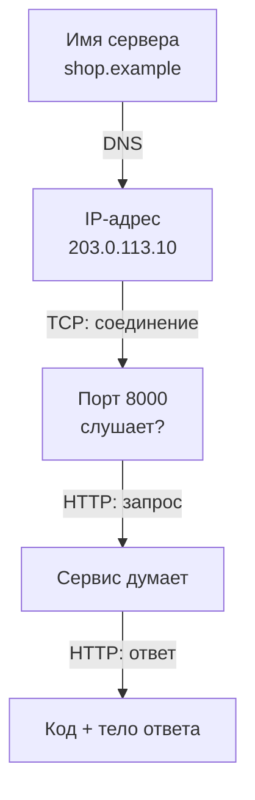
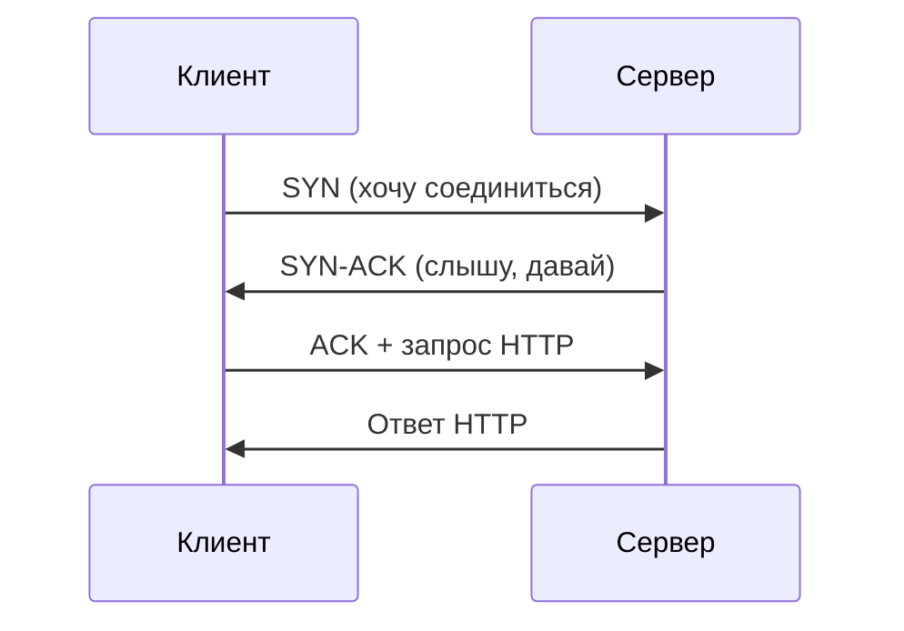
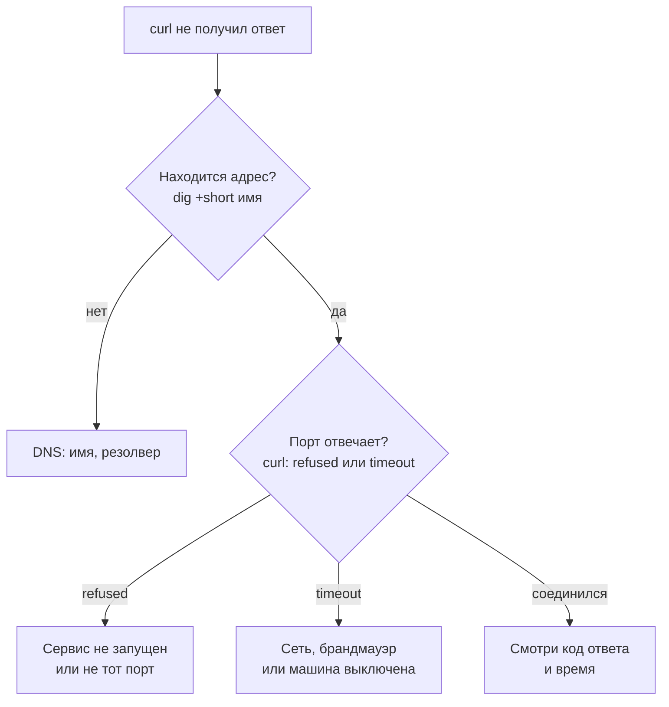

## Зачем это нужно

Когда сервис «не отвечает», причин может быть десяток: не работает сам сервис, закрыт порт, не находится имя, сломана сеть между машинами, сервис отвечает, но с ошибкой. Для пользователя всё это выглядит одинаково: «не открывается». Для инженера это десять разных поломок с десятью разными лечениями. Умение за минуту сказать «сеть недоступна» или «сеть в порядке, сервис вернул 500» экономит часы споров между командами.

Нагрузочному тестировщику это нужно вдвойне. Любой тест измеряет время ответа, а оно складывается из нескольких этапов: найти адрес по имени, установить соединение, дождаться ответа сервера, получить данные. Не умея разложить время на части, ты не сможешь сказать, где оно потерялось.

Шаг проекта: ты научишься проверять локальный сервис из терминала четырьмя командами (`ss`, `dig`, `ping`, `curl`), разберёшь время запроса на части и сохранишь шпаргалку «как отличить проблему сети от проблемы сервиса» в `~/perf-lab/01-linux/network-notes.md`. В уроке 1.5 из этих команд ты соберёшь скрипт проверки стенда.

## Что нужно знать

- Терминал, `sudo apt install`, `man`: [урок 1.1](01-workstation-terminal.md). Пакет `dnsutils` (команда `dig`) и `curl` ты поставил там же.
- Конвейеры `|`, `grep`, `awk`: [урок 1.2](02-text-logs.md). Они нужны, чтобы вырезать нужное из вывода.
- Процесс и PID: [урок 1.3](03-processes-resources.md). `ss` покажет, какой процесс занимает порт.
- Глубже о сети: [DNS](https://distinguished-sre.github.io/devops/02-network/03-dns.html) и [порты и TCP](https://distinguished-sre.github.io/devops/02-network/02-ports-tcp-ssh.html) в курсе DevOps. Для нас достаточно того, что написано здесь.

HTTP (протокол, на котором работают сайты и API: сообщения «запрос» и «ответ» с кодом вроде 200 или 404) подробно разбирается в [уроке 2.1](../02-web/01-client-server-http.md). Сейчас нужно знать только, что `curl` отправляет такой запрос и показывает ответ.

## Картина целиком

Заказ пиццы по телефону: узнать номер по названию (**DNS**), дозвониться (**установка соединения**), назвать заказ и ждать (**время сервера**), получить пиццу (**передача данных**). Сорваться может любой шаг, и по тому, какой, понятно, что чинить: нет номера, никто не берёт трубку или «такой пиццы нет» (ошибка в ответе, например 404).



Путь запроса состоит из четырёх последовательных шагов, и каждый можно проверить отдельной командой. `dig` проверяет первый, `ping` и `ss` второй и третий, `curl` весь путь целиком. Если один шаг сломан, дальше запрос не пойдёт: нельзя соединиться, не узнав адрес, и нельзя получить ответ, не соединившись.

Идея диагностики: идти по цепочке сверху вниз и остановиться на первом сломанном шаге.

## Теория

### Как компьютеры находят друг друга: слои и IP-адрес

**Зачем это существует.** Данные между двумя компьютерами проходят по десяткам кабелей, коммутаторов и маршрутизаторов, принадлежащих разным организациям. Чтобы они понимали друг друга, нужны общие правила, и их разделили на слои: каждый слой решает свою задачу и не знает о других.

**Аналогия.** Почта. Ты пишешь письмо (содержание), кладёшь в конверт и пишешь адрес (адресация), почтальон везёт его через несколько сортировочных центров (маршрут), а в конце письмо вручают по адресу. Ты не знаешь, как оно ехало, и тебе это не нужно. Аналогия ломается в том, что в сети данные режутся на мелкие пакеты, которые могут ехать разными путями и собираются заново на месте.

**Как это устроено.** Для нас важны четыре слоя, сверху вниз:

| Слой | Что решает | Что видно из терминала |
|---|---|---|
| Приложение | Язык, на котором говорят программы: HTTP, DNS | `curl`, `dig` |
| Транспорт | Доставка данных до нужной программы, надёжность | TCP, порт (`ss`) |
| Сеть | Адресация и маршрут между машинами | IP-адрес, `ping` |
| Канал | Передача по кабелю или Wi-Fi | обычно не нужен |

**IP-адрес** это номер компьютера в сети, как адрес дома: четыре числа от 0 до 255 через точки, например `192.168.1.15`. Есть особые адреса:

- `127.0.0.1` (имя `localhost`) это «сама эта машина». Запрос на этот адрес не выходит за пределы компьютера. По нему ты будешь ходить на стенд «Магазин», который запущен на твоей машине.
- `192.168.x.x`, `10.x.x.x` и `172.16-31.x.x` это **частные** адреса: они используются внутри домашних и офисных сетей и в интернете недоступны.
- `0.0.0.0` значит «все адреса этой машины» (так сервис сообщает, что слушает на всех).

Адрес твоей машины покажет `ip -br a` (`-br` короткий вывод, `a` от address).

**Что путают.** IP-адрес и имя сайта: имя это удобная подпись для человека, настоящий адрес числовой. Переход между ними выполняет DNS (дальше). Ещё путают `localhost` и «интернет»: запрос на `localhost` вообще не использует сеть, это общение внутри одной машины.

> **Проверь понимание:** сервис на твоём ноутбуке слушает на `127.0.0.1`. Коллега в соседней комнате пытается открыть его по адресу твоего ноутбука `192.168.1.15`. Получится?

<details markdown="1">
<summary>Ответ</summary>

Нет. `127.0.0.1` это «только эта машина»: сервис принимает соединения изнутри компьютера, а запросы с других машин сети не принимает. Чтобы коллега мог подключиться, сервис должен слушать на `0.0.0.0` (все адреса) или на `192.168.1.15`. Это частая причина «у меня работает, а у коллеги нет».

</details>

### Порт и TCP: как дозвониться до нужной программы

**Зачем это существует.** На одной машине работают десятки программ: веб-сервер, база данных, кэш. Когда на машину приходят данные, нужно понять, какой программе их отдать. Для этого придумали **порт**: число от 1 до 65535, которое работает как номер квартиры в доме: IP-адрес указывает дом, порт указывает квартиру.

**Аналогия.** Офисное здание с одним входом (IP-адрес) и множеством отделов за дверями с номерами (порты). Бухгалтерия за дверью 5432, склад за 6379. Дверь в отдел, которого нет, остаётся закрытой. Аналогия ломается в том, что программа сама «занимает» номер двери, и два отдела не могут занять один номер.

Номера портов стенда «Магазин» ты скоро увидишь: shop слушает 8000, payment 8001, PostgreSQL 5432, Redis 6379. Стандартные: HTTP 80, HTTPS 443, SSH 22, DNS 53.

**Слушающий порт.** Программа, которая ждёт входящих соединений, говорит системе: «Я занимаю порт 8000, присылай мне всё оттуда». Это называется **слушать** (listen) порт. Программа, которая только подключается к другим, порт не занимает.

**TCP** (Transmission Control Protocol) это правила надёжной доставки поверх сети: данные приходят целыми и по порядку, потерянные части отправляются заново. Прежде чем передавать данные, стороны договариваются о соединении коротким обменом из трёх сообщений, который называется **трёхстороннее рукопожатие** (three-way handshake):

1. Клиент шлёт `SYN`: «хочу соединиться»;
2. Сервер отвечает `SYN-ACK`: «слышу, давай»;
3. Клиент шлёт `ACK`: «договорились», и тут же может отправить свои данные.



Смотри на порядок: до того как уйдёт первый байт запроса, проходит одно полное «туда и обратно» между клиентом и сервером. Время этого круга называют **RTT** (round-trip time, время кругового обхода). Если сервер в другом городе и RTT равен 40 мс, одно только рукопожатие стоит 40 мс.

**Разобранный пример: что произойдёт при подключении к порту.**

- Порт слушает программа: рукопожатие проходит, соединение установлено.
- Порт на машине не слушает никто: машина сразу отвечает «здесь никого», и клиент получает ошибку **«Connection refused»** (отказ). Это быстрая и однозначная ошибка: машина жива, сервис на этом порту не работает.
- Машина недоступна или пакеты теряются по дороге: ответа нет вообще, клиент ждёт и через некоторое время сдаётся с ошибкой **таймаута** (timeout). Это медленная и неоднозначная ошибка: причин много (машина выключена, сеть оборвана, пакеты блокирует брандмауэр, то есть фильтр, который пропускает не всё).

Различие «отказ» и «таймаут» это первое, что нужно проверять в диагностике сети.

**Что путают.** `Connection refused` и `timeout`: первый говорит «хост доступен, порт закрыт», второй «не знаю, что там». Ещё путают «порт открыт» и «сервис работает правильно»: рукопожатие проходит всегда, когда программа слушает, даже если она потом отвечает ерунду.

> **Проверь понимание:** у `curl` ответ «Connection refused» за 0,01 секунды. Что можно сказать о машине и о сервисе?

<details markdown="1">
<summary>Ответ</summary>

Машина жива и доступна по сети (иначе ответа не пришло бы), а на этом порту ничего не слушает: сервис не запущен, упал или слушает другой порт. Проблема в сервисе, а не в сети.

</details>

### DNS: как имя превращается в адрес

**Зачем это существует.** Людям удобно запоминать `shop.example.com`, а компьютерам нужен IP-адрес. Без переводчика пришлось бы помнить числа. Таким переводчиком служит **DNS** (Domain Name System): распределённая «телефонная книга» интернета.

**Аналогия.** Справочник телефонов: ты называешь имя, получаешь номер. Ты не помнишь номера, но помнишь имена. Аналогия ломается тем, что справочников много, они спрашивают друг друга по цепочке, и ответы запоминаются на время.

**Как это устроено.** Программа не опрашивает всю сеть, а спрашивает **DNS-резолвер** (resolver): сервер, заданный в настройках сети (домашний роутер, провайдер или публичный вроде `8.8.8.8`). Он сам находит ответ и возвращает его. Чтобы не повторять работу, он **кэширует** ответы (запоминает) на время, которое назвал владелец имени.

Ответ DNS состоит из **записей** (records). Основные:

| Тип | Что хранит | Пример |
|---|---|---|
| `A` | IPv4-адрес для имени | `example.com -> 93.184.215.14` |
| `AAAA` | IPv6-адрес (более новый формат адреса, длиннее) | `2606:2800:21f:cb07:6820:80da:af6b:8b2c` |
| `CNAME` | «это имя - псевдоним другого имени» | `www.example.com -> example.com` |

**TTL** (time to live, «время жизни») это срок в секундах, на который ответ разрешено запомнить. TTL 300 значит, что пять минут резолвер отвечает из кэша, не спрашивая заново. Поэтому замена адреса у сервиса «доходит» до всех не сразу: часть клиентов ещё держит старый ответ.

**Разобранный пример.**

```bash
dig example.com
```

```text
; <<>> DiG 9.18.39-0ubuntu0.24.04.1-Ubuntu <<>> example.com
;; Got answer:
;; ->>HEADER<<- opcode: QUERY, status: NOERROR, id: 41872
;; flags: qr rd ra; QUERY: 1, ANSWER: 1, AUTHORITY: 0, ADDITIONAL: 1

;; QUESTION SECTION:
;example.com.                   IN      A

;; ANSWER SECTION:
example.com.            278     IN      A       93.184.215.14

;; Query time: 23 msec
;; SERVER: 127.0.0.53#53(127.0.0.53) (UDP)
;; WHEN: Sat Oct 03 11:30:12 MSK 2026
;; MSG SIZE  rcvd: 56
```

`dig` (Domain Information Groper) спрашивает DNS и показывает ответ подробно. Адрес `example.com` в твоём выводе будет другим (у сайта их несколько и они меняются): смотри на устройство ответа, а не на цифры. Строки `HEADER` и `flags` читать не нужно, нужны эти:

- `status: NOERROR`: имя найдено. `NXDOMAIN` значит «такого имени нет», `SERVFAIL` значит «сам DNS-сервер не смог ответить».
- `QUESTION SECTION`: что спросили: адрес (`A`) для `example.com`.
- `ANSWER SECTION` главная часть. `example.com.` имя (точка в конце означает «корень»), `278` это **TTL**: этот ответ ещё 278 секунд хранится в кэше, `IN` класс (всегда интернет), `A` тип записи, `93.184.215.14` сам адрес.
- `Query time: 23 msec`: сколько заняло получение ответа. При повторном вызове ответ придёт из кэша за 0-1 мс, а TTL уменьшится.
- `SERVER: 127.0.0.53#53`: кто ответил. Это локальный резолвер Ubuntu (порт 53 на этой машине), он сам обращается дальше.

Короче и удобнее для скриптов:

```bash
dig +short example.com
dig +short example.com @8.8.8.8
dig +noall +answer +stats example.com
```

```text
93.184.215.14
93.184.215.14
example.com.            278     IN      A       93.184.215.14
;; Query time: 23 msec
```

`+short` печатает только ответ. `@8.8.8.8` спрашивает указанный сервер (публичный DNS) в обход системного: так проверяют, виноват ли в проблеме локальный резолвер. `+noall +answer +stats` убирает всё лишнее, оставляет ответ и время запроса. Тип записи указывается словом: `dig +short AAAA example.com`.

**Что путают.**

- «Имя не находится» и «сервер не отвечает» это разные ошибки: первая это DNS (`NXDOMAIN`), вторая сеть или сервис.
- Меняешь адрес сервиса, а клиенты ещё какое-то время ходят на старый: дело в TTL.
- `localhost` и `127.0.0.1` не требуют внешнего DNS: система знает их из файла `/etc/hosts`. Поэтому на локальном стенде DNS в тесте почти не участвует, а в тесте против настоящего сервиса участвует.

> **Проверь понимание:** `dig +short shop.lab` ничего не вывел, а `dig shop.lab` показал `status: NXDOMAIN`. Это проблема сети?

<details markdown="1">
<summary>Ответ</summary>

Нет, это DNS: такого имени в справочнике нет (опечатка, имя не создано или не тот резолвер). Сеть тут ни при чём, и проверять `ping` и порты рано: сначала нужно получить адрес.

</details>

### ping и ss: машина жива, порт слушают

**Зачем это существует.** Чтобы проверить доступность по частям, нужны простые вопросы к сети: «ты там?» и «кто слушает этот порт?».

**ping** отправляет короткий пакет «ты жив?», и машина отвечает «жив». Он показывает, дошёл ли пакет, и сколько времени заняла дорога туда и обратно.

```bash
ping -c 3 example.com
```

```text
PING example.com (93.184.215.14) 56(84) bytes of data.
64 bytes from 93.184.215.14: icmp_seq=1 ttl=54 time=41.2 ms
64 bytes from 93.184.215.14: icmp_seq=2 ttl=54 time=40.8 ms
64 bytes from 93.184.215.14: icmp_seq=3 ttl=54 time=41.5 ms

--- example.com ping statistics ---
3 packets transmitted, 3 received, 0% packet loss, time 2003ms
rtt min/avg/max/mdev = 40.8/41.1/41.5/0.3 ms
```

`-c 3` отправить три пакета (без него `ping` идёт бесконечно, остановка `Ctrl+C`). `time=41.2 ms` это RTT, тот самый круговой обход. `0% packet loss` ни один пакет не потерян. Сервер в среднем отвечает за 41 мс, и каждое новое TCP-соединение будет стоить не меньше этого. Два ограничения: многие серверы нарочно не отвечают на `ping` (брандмауэр), поэтому молчание ничего не доказывает; и `ping` проверяет только «машина жива», но не «сервис работает».

**ss** (socket statistics) показывает, какие порты слушают и какие соединения открыты. Главная форма:

```bash
sudo ss -tlnp
```

`-t` только TCP, `-l` только слушающие (listen), `-n` не переводить числа в названия (показывать `8000`, а не `http-alt`), `-p` показать процесс (поэтому нужен `sudo`: чужие процессы без него не видны).

```text
State   Recv-Q  Send-Q   Local Address:Port    Peer Address:Port  Process
LISTEN  0       4096         127.0.0.1:8000         0.0.0.0:*     users:(("python3",pid=51203,fd=3))
LISTEN  0       4096     127.0.0.53%lo:53           0.0.0.0:*     users:(("systemd-resolve",pid=812,fd=14))
LISTEN  0       128            0.0.0.0:22           0.0.0.0:*     users:(("sshd",pid=950,fd=3))
LISTEN  0       244                  *:5432               *:*     users:(("postgres",pid=1432,fd=6))
```

**Как читать вывод.** Главная колонка `Local Address:Port`: **на каком адресе и порту** слушают. `127.0.0.1:8000` значит только эта машина (снаружи не достучаться, помни предыдущий раздел). `0.0.0.0:22` и `*:5432` значат все адреса (доступно и снаружи, если не мешает брандмауэр). Колонка `Process` показывает программу и её PID: порт 8000 занят `python3` с PID 51203. Если нужного порта в списке нет, его никто не слушает: сервис не запущен. Если порт слушает не та программа, он «занят» чужим (типичная причина ошибки «address already in use» при запуске сервиса). Проверка одного порта: `sudo ss -tlnp | grep :8000`.

**Что путают.** «`ping` отвечает, значит сервис работает»: нет, он говорит только о машине. И наоборот, «порт слушает, значит всё хорошо»: нет, он говорит только о том, что программа запущена, но не о том, что она отвечает корректно. Это проверяет следующий инструмент.

> **Проверь понимание:** `ss -tlnp` показывает `127.0.0.1:8000`, а `curl http://192.168.1.15:8000` с другой машины даёт `Connection refused`. Почему?

<details markdown="1">
<summary>Ответ</summary>

Сервис слушает только на локальном адресе `127.0.0.1`. Запрос с другой машины приходит на адрес `192.168.1.15`, на котором порт 8000 никто не слушает, поэтому машина отвечает отказом. Нужно запустить сервис на `0.0.0.0` или на нужном адресе.

</details>

### curl: весь путь и время по этапам

**Зачем это существует.** `curl` выполняет настоящий HTTP-запрос и показывает всё: код ответа, заголовки, тело и время. Это инструмент, который говорит «сервис на самом деле работает», а не только «порт открыт». Им проверяют здоровье сервиса и разбирают, куда ушло время.

**Как это устроено.** Флаги, которые нужны постоянно:

| Флаг | Что делает |
|---|---|
| `-s` | тихий режим: без полосы прогресса |
| `-S` | вместе с `-s` всё равно показать ошибку (`-sS` очень удобно) |
| `-o /dev/null` | выбросить тело ответа |
| `-i` | показать заголовки ответа вместе с телом |
| `-v` | подробно: что происходит на каждом шаге |
| `-w 'формат'` | напечатать после запроса выбранные значения (код ответа, время) |
| `--max-time 5` | сдаться, если весь запрос длится дольше 5 секунд |
| `--connect-timeout 2` | сдаться, если соединение не установилось за 2 секунды |
| `-f` (`--fail`) | вернуть ненулевой код выхода, если сервис ответил ошибкой 4xx или 5xx |

**`curl -v`: что происходит внутри.**

```bash
curl -v http://127.0.0.1:8000/healthz
```

```text
*   Trying 127.0.0.1:8000...
* Connected to 127.0.0.1 (127.0.0.1) port 8000
> GET /healthz HTTP/1.1
> Host: 127.0.0.1:8000
> User-Agent: curl/8.5.0
> Accept: */*
>
< HTTP/1.1 200 OK
< date: Sat, 03 Oct 2026 11:31:40 GMT
< server: uvicorn
< content-length: 15
< content-type: application/json
< x-request-id: 5c0e1b7a9d3f4e28b6a1c47d90e2f835
<
{"status":"ok"}
```

Так отвечает настоящий «Магазин» (веб-сервер `uvicorn`, заголовок `x-request-id` добавляет сам сервис). Строки со звёздочкой `*` это ход соединения (попытка, соединились), строки с `>` это то, что **отправил** curl (запрос: метод `GET`, путь `/healthz`, заголовок `Host`), строки с `<` это то, что **получил** (код `200 OK`, заголовки). Последняя строка это тело ответа. Если сервис упал, ты увидишь, на какой строке всё остановилось: на `Trying` (не соединился) или после `>` (запрос ушёл, ответа нет).

**`curl -w`: время по этапам.** Это самый полезный приём урока. Флаг `-w` подставляет значения в шаблон. Нужные переменные:

| Переменная | Что содержит |
|---|---|
| `%{http_code}` | код ответа (200, 404, 500...) |
| `%{time_namelookup}` | сколько секунд заняло превращение имени в адрес (DNS) |
| `%{time_connect}` | сколько прошло с начала до установки TCP-соединения |
| `%{time_starttransfer}` | сколько прошло до получения **первого байта ответа** |
| `%{time_total}` | всё время запроса |

Все времена отсчитываются **с начала запроса**, то есть нарастающим итогом, а не по отдельности. Поэтому время этапов получают вычитанием.

```bash
curl -s -o /dev/null -w 'код %{http_code}, dns %{time_namelookup}, connect %{time_connect}, ждали %{time_starttransfer}, всего %{time_total}\n' http://example.com/
```

```text
код 200, dns 0.023104, connect 0.064527, ждали 0.151220, всего 0.152013
```

(`-s -o /dev/null` убирают лишний вывод, `\n` в конце переводит строку.) Читаем: имя найдено за 23 мс; соединение установилось к 64 мс, значит, TCP-рукопожатие заняло 64 - 23 = 41 мс (столько же, сколько RTT у `ping`); первый байт пришёл к 151 мс, значит, сервер «думал» 151 - 64 = 87 мс; ответ дочитан к 152 мс, значит, передача тела заняла 1 мс. Итог: из 152 мс только 87 приходятся на сам сервис, остальное сеть и DNS.

Посмотри на это разложение в виджете и покрути три ползунка: время DNS, время круга (RTT) и время работы сервера.

<div class="viz" data-viz="linux-net-timeline" data-dns="30" data-rtt="40" data-server="80"></div>

На виджете путь запроса по шагам (DNS, три сообщения рукопожатия, запрос, ожидание, ответ) и полоса «куда ушло время». Увеличь RTT, и вырастут и рукопожатие, и вся полоса: чем дальше сервер, тем дороже каждая переписка. Увеличь время сервера, и в полосе вырастет только ожидание, а сеть не изменится.

**Что путают.**

- Метки `time_connect` и `time_starttransfer` кумулятивные: `time_connect` это не «длительность соединения», а момент его завершения от начала запроса.
- `time_starttransfer` называют TTFB (time to first byte, время до первого байта). Он включает DNS, соединение и работу сервера. Чтобы узнать только работу сервиса, вычитай `time_connect`.
- `curl` по умолчанию не считает ответ 500 ошибкой: он честно печатает его, и код выхода равен 0. Чтобы код выхода был ненулевым при 4xx и 5xx, добавь `--fail`. В [уроке 1.5](05-bash-scripts.md) это пригодится.
- Для адресов с `https` добавляется ещё `time_appconnect`: время шифрованного рукопожатия TLS. Для локального стенда (обычный HTTP) оно нулевое.

> **Проверь понимание:** `curl -w` показал `connect 0.050`, `starttransfer 0.610`, `total 0.612`. Где потерялось время: в сети или в сервисе?

<details markdown="1">
<summary>Ответ</summary>

В сервисе. Соединение установилось за 50 мс (сеть в порядке), а первый байт ответа пришёл только к 610 мс: сервис «думал» около 560 мс. Передача данных заняла всего 2 мс. Сеть тут не виновата, нужно смотреть, что делает сервис (логи, база данных, ресурсы машины из [урока 1.3](03-processes-resources.md)).

</details>

### Как отличить сеть от HTTP-ошибки

**Зачем это существует.** Это итог урока: набор признаков, по которым ты быстро определяешь, на каком шаге пути поломка. Без него «не работает» превращается в длинный разговор.

**Как это устроено.** Идёшь по цепочке и на каждом шаге смотришь на ошибку `curl`:

| Что видишь | Где сломалось | Что это значит |
|---|---|---|
| `Could not resolve host` (curl: (6)) | DNS | имя не нашлось. Проверь написание, `dig +short имя`, `dig +short имя @8.8.8.8` |
| `Connection refused` (curl: (7)) быстро | Порт | машина жива, на порту никто не слушает. Проверь `ss -tlnp` на сервере, запущен ли сервис |
| `Timeout was reached` (curl: (28)) при соединении | Сеть | пакеты не доходят: машина выключена, нет маршрута или брандмауэр. Проверь `ping`, сеть |
| `Operation timed out` (28), но в `-v` есть `Connected` | Сервис | соединились, но ответа не дождались: сервис завис или перегружен |
| Код 4xx (404, 401) | Приложение | сеть в порядке. Запрос неправильный (путь, права доступа) |
| Код 5xx (500, 503) | Приложение | сеть в порядке. Сервис получил запрос и сломался или перегружен |
| Код 200, но долго | Время | всё работает, но медленно. Разложи время через `curl -w` |

Ключевое: **если пришёл код ответа, сеть в порядке**. Любой код, даже 500, означает, что запрос дошёл до сервиса и сервис ответил. Поэтому «ошибка 500» это не про сеть, а про приложение: ходить в `ping` бесполезно.



Два ответа «refused» и «timeout» уводят в разные стороны, и различить их можно за секунду. Ветка «соединился» значит, что сеть уже не подозреваем, и дальше работаем с HTTP-ответом.

Ту же логику можно пройти пошагово в виджете:

<div class="viz" data-viz="flow" data-steps='[{"title":"1. Имя находится?","text":"`dig +short имя`. Пусто или NXDOMAIN: проблема DNS, дальше идти рано."},{"title":"2. Хост жив?","text":"`ping -c 3 адрес`. Ответ есть: машина жива. Нет ответа: не доказательство, многие серверы молчат на ping."},{"title":"3. Порт слушают?","text":"`sudo ss -tlnp | grep :порт` на самом сервере или `curl -v` издалека. Refused: сервис не запущен. Timeout: сеть."},{"title":"4. Что отвечает сервис?","text":"`curl -i адрес`. Код 200: хорошо. 4xx: запрос неверный. 5xx: сервис сломался."},{"title":"5. Почему долго?","text":"`curl -w` с таймингами: DNS, соединение, первый байт, всего. Время уходит либо в сеть, либо в сервис."}]'></div>

Пять шагов идут от общего к частному. Каждый шаг отвечает на один вопрос, и после первого «нет» цепочку можно прервать.

**Что путают.** Таймаут принимают за поломку сервиса, хотя он может быть из-за сети или брандмауэра. И наоборот, `Connection refused` принимают за проблему сети, хотя это проблема сервиса. Ещё путают ошибку 502 или 504 (от прокси, промежуточного сервера перед приложением) с ошибкой сети: прокси отвечает, значит, сеть до него работает, а до приложения за ним нет.

> **Проверь понимание:** `curl` получил `HTTP/1.1 503 Service Unavailable`. Нужно ли проверять `ping`?

<details markdown="1">
<summary>Ответ</summary>

Нет. Раз пришёл ответ с кодом, запрос дошёл до сервиса: DNS, сеть и порт работают. 503 говорит, что сервис получил запрос, но не может его обработать (например, у «Магазина» `/readyz` отвечает 503, когда недоступна база данных). Нужно смотреть логи и зависимости сервиса.

</details>

## Практика

Стенд «Магазин» ты поднимешь только в [уроке 2.1](../02-web/01-client-server-http.md). Чтобы потренироваться уже сейчас, запустим «учебный сервис»: простой веб-сервер, встроенный в Python. Порт, процесс, ответы и время на нём работают так же, как на настоящем сервисе.

### 1. Запусти учебный сервис и найди его порт

Открой два терминала (второе окно: [урок 1.1](01-workstation-terminal.md); в Multipass это второй `multipass shell lab`, сервис работает внутри ВМ, поэтому `curl` тоже запускай в ней). В первом:

```bash
mkdir -p ~/perf-lab/01-linux/www
cd ~/perf-lab/01-linux/www
echo '{"status":"ok"}' > healthz
python3 -m http.server 8000 --bind 127.0.0.1
```

`mkdir -p` создаёт каталог, в нём файл `healthz` с таким же ответом, как у «Магазина». `python3 -m http.server 8000` запускает сервер: он раздаёт файлы из текущего каталога на порту 8000 (`--bind 127.0.0.1` значит только для этой машины). Терминал занят сервером и будет печатать строки о запросах: так и задумано.

```text
Serving HTTP on 127.0.0.1 port 8000 (http://127.0.0.1:8000/) ...
```

Во втором терминале:

```bash
sudo ss -tlnp | grep :8000
```

```text
LISTEN 0      5          127.0.0.1:8000       0.0.0.0:*    users:(("python3",pid=51203,fd=3))
```

**Как читать вывод:** порт 8000 слушает `python3` с PID 51203, и только на `127.0.0.1`. Если строки нет, сервер из первого терминала не запустился.

**Типичные ошибки:** `OSError: [Errno 98] Address already in use`: порт занят другой программой. Найди её той же командой `ss` и останови, либо возьми порт 8002.

### 2. Проверь сервис через curl

Во втором терминале:

```bash
curl -v http://127.0.0.1:8000/healthz
curl -s -o /dev/null -w 'код %{http_code}, connect %{time_connect}, ждали %{time_starttransfer}, всего %{time_total}\n' http://127.0.0.1:8000/healthz
curl -s -o /dev/null -w '%{http_code}\n' http://127.0.0.1:8000/net-takogo
```

```text
код 200, connect 0.000211, ждали 0.002874, всего 0.002930
404
```

(Подробный вывод первой команды похож на показанный в теории, но у учебного сервера строка ответа `HTTP/1.0 200 OK`, а заголовки свои: `Server: SimpleHTTP/0.6 Python/3.12.3`, `Content-type: application/octet-stream`.) **Как читать вывод:** `connect` близок к нулю: запрос идёт внутри машины, сети нет. Сервис ответил за 3 мс. Третья команда запросила несуществующий путь и получила `404`: сервис работает, но такой страницы нет. Сеть и порт в порядке, ошибка на уровне приложения. Загляни в окно с сервером: там появились строки вида `127.0.0.1 - - [03/Oct/2026 11:42:01] "GET /healthz HTTP/1.1" 200 -`. Это его журнал запросов, такой же, как логи из [урока 1.2](02-text-logs.md).

**Типичные ошибки:**

- `curl: (7) Failed to connect to 127.0.0.1 port 8000 after 0 ms: Couldn't connect to server`: сервер из первого терминала не запущен или остановлен. Проверь `ss`.
- `curl: (3) URL rejected: Bad hostname`: в адресе опечатка или лишний пробел.

### 3. DNS: спроси справочник

```bash
dig example.com
dig +short example.com
dig +short example.com @8.8.8.8
dig +noall +answer +stats example.com
```

Вывод похож на показанный в теории: адрес, TTL и время запроса. Твои числа будут другими. Смотри на три вещи. Первое: **время запроса** у первого `dig` обычно 20-100 мс, у повторного 0-2 мс (ответ из кэша). Второе: **TTL** при повторных запросах уменьшается (278, 275, 271...): это обратный отсчёт срока жизни кэша. Третье: `dig +short example.com @8.8.8.8` спрашивает не локальный резолвер, а публичный, и обычно возвращает тот же адрес.

Теперь спроси имя, которого не существует:

```bash
dig nonexistent-name-123.example
```

```text
;; ->>HEADER<<- opcode: QUERY, status: NXDOMAIN, id: 9031
```

`NXDOMAIN` («не существует»): DNS сработал правильно и честно сказал «такого имени нет». Это ответ, а не поломка DNS.

**Типичные ошибки:** `dig: command not found`: не поставлен `dnsutils` (`sudo apt install -y dnsutils`, как в [уроке 1.1](01-workstation-terminal.md)). `;; connection timed out; no servers could be reached`: нет интернета или не отвечает резолвер, попробуй `@8.8.8.8`.

### 4. Измерь время по этапам

Один запрос к публичному сайту безопасен: это не нагрузка. Сравни удалённый сервис и локальный:

```bash
curl -s -o /dev/null -w 'dns %{time_namelookup}, connect %{time_connect}, ждали %{time_starttransfer}, всего %{time_total}\n' http://example.com/
curl -s -o /dev/null -w 'dns %{time_namelookup}, connect %{time_connect}, ждали %{time_starttransfer}, всего %{time_total}\n' http://127.0.0.1:8000/healthz
```

```text
dns 0.023104, connect 0.064527, ждали 0.151220, всего 0.152013
dns 0.000052, connect 0.000211, ждали 0.002874, всего 0.002930
```

**Как читать вывод:** посчитай этапы вычитанием. Для удалённого: DNS 23 мс, рукопожатие 64 - 23 = 41 мс, ожидание ответа 151 - 64 = 87 мс, передача 1 мс. Для локального: DNS 0,05 мс, рукопожатие 0,16 мс, ожидание 2,7 мс. **Вывод для нагрузочного теста:** запрос по сети стоит на десятки миллисекунд дороже локального. Поэтому результаты теста на локальный стенд нельзя сравнивать с тестом через интернет: разница уйдёт в сеть, а не в сервис. Запиши свои цифры, они понадобятся ниже. Можешь ввести их в виджет выше и посмотреть, куда ушло твоё время.

### 5. Нарочно сломай по очереди три шага

Три разные ошибки, по одной на шаг цепочки. Выполни и сравни тексты:

```bash
# DNS: имя не существует
curl --max-time 5 http://no-such-host.invalid/
# Порт: ничего не слушает
curl --max-time 5 http://127.0.0.1:8999/
# Сеть: адрес, на который никто не отвечает (диапазон для документации)
curl --connect-timeout 3 http://192.0.2.1:8000/
```

```text
curl: (6) Could not resolve host: no-such-host.invalid
curl: (7) Failed to connect to 127.0.0.1 port 8999 after 0 ms: Couldn't connect to server
curl: (28) Failed to connect to 192.0.2.1 port 8000 after 3001 ms: Timeout was reached
```

**Как читать вывод:** три разные ошибки с тремя разными номерами: (6) DNS, (7) порт закрыт, (28) таймаут. Сравни время: первые две пришли мгновенно, третья ждала три секунды. По комбинации «текст ошибки плюс время» ты различаешь поломки. Адрес `192.0.2.1` зарезервирован для документации и в интернете ни к кому не ведёт: безопасно.

### 6. Запиши шпаргалку

```bash
cd ~/perf-lab/01-linux
cat > network-notes.md <<'TXT'
# Сеть: как отличить, что сломалось

| Что вижу | Где сломалось | Чем проверить |
|---|---|---|
| curl: (6) Could not resolve host | DNS | dig +short имя; dig +short имя @8.8.8.8 |
| curl: (7) Connection refused, быстро | порт не слушают | ss -tlnp на сервере; запущен ли сервис |
| curl: (28) timeout | сеть или брандмауэр | ping, доступность машины |
| Код 4xx | запрос неверный | путь, токен, тело запроса |
| Код 5xx | сервис сломался | логи сервиса, ресурсы машины |
| Код 200, но долго | время | curl -w: dns, connect, starttransfer, total |

Шаблон времени:
curl -s -o /dev/null -w 'dns %{time_namelookup}, connect %{time_connect}, ждали %{time_starttransfer}, всего %{time_total}, код %{http_code}\n' URL

Мои измерения:
- локально: ___ мс
- example.com: ___ мс (из них сеть ___, сервис ___)
TXT
nano network-notes.md
```

Допиши свои числа из упражнения 4. Первый терминал с сервером пока не закрывай.

> Сервис не отвечает, а причина не из «Типичных ошибок»? Сначала пройди три шага из урока (порт, адрес, DNS), потом отправь нейросети вывод `ss -ltnp` и `curl -v` целиком и сверь её версию со своей.
{: .ai}

## Сломай и почини

**Поломка.** Остановим сервис, но представим, что ты этого не знаешь. В первом терминале нажми `Ctrl+C` (сервер остановлен), и сразу запусти его снова, но на **другом** порту:

```bash
cd ~/perf-lab/01-linux/www && python3 -m http.server 8002 --bind 127.0.0.1
```

Во втором терминале проверь по старому адресу:

```bash
curl -sS --max-time 5 http://127.0.0.1:8000/healthz; echo "код выхода: $?"
```

**Задача.** Выясни по шагам, что сломано, не угадывая: DNS, порт или приложение, и найди, на каком порту сервис работает на самом деле.

<details markdown="1">
<summary>Разбор</summary>

1. Проверка вернула `curl: (7) Failed to connect to 127.0.0.1 port 8000 after 0 ms: Couldn't connect to server` и код выхода 7. Ошибка быстрая и называется «refused»: DNS здесь не участвует (адрес числовой), сеть не при чём, на порту 8000 никто не слушает.
2. Проверяем, кто слушает: `sudo ss -tlnp | grep python`. Видим `127.0.0.1:8002` и процесс `python3`. Значит, сервис жив, но слушает не тот порт, на который ходит клиент.
3. Проверяем найденный порт: `curl -s http://127.0.0.1:8002/healthz` и получаем `{"status":"ok"}`. Диагноз: сервис работает, клиент настроен на неверный порт.
4. Исправление: направить клиента на 8002 (или запустить сервис на 8000). Повтори `curl` с верным портом: код 200.

Вывод: `Connection refused` значит «сверь порт», и `ss -tlnp` отвечает на вопрос «на каком порту сервис слушает на самом деле» за секунду. Это одна из самых частых причин «не работает» после переезда или изменения настроек.

</details>

Закончив, останови сервер (`Ctrl+C` в первом терминале) и удали учебный каталог, он больше не нужен:

```bash
rm -r ~/perf-lab/01-linux/www
```

## ИИ в помощь

Нейросеть помогает сузить сетевую проблему по тексту ошибки `curl`, но твоей сети не видит. Общие правила на странице [ИИ-помощник](../ai.md).

**Задача:** понять ошибку `curl` или `ss`.

```text
Я проверяю сервис на 127.0.0.1:8000, Ubuntu 24.04. Команда:
<вставь команду curl>
Вывод:
<вставь вывод целиком>
Объясни, чем Connection refused отличается от таймаута, и составь порядок проверок: слушает ли порт (ss -ltnp), DNS, сам сервис. Для каждой проверки дай команду.
```
{: .wrap}

**Проверь ответ:** выполни `ss -ltnp | grep 8000` и `curl -v`. Типичная ошибка: нейросеть советует `sudo ufw disable` («отключи файрвол») вместо диагностики и предлагает устаревший `netstat` вместо `ss`.

**Задача:** расшифровать тайминги `curl -w`.

```text
Вот команда и вывод curl с форматом времени (DNS, соединение, первый байт, всего):
<вставь вывод>
Объясни каждое значение простыми словами и скажи, на каком этапе потеряно больше всего времени. Какой вывод можно сделать, а какой был бы поспешным?
```
{: .wrap}

**Проверь ответ:** сверь названия переменных `-w` с `man curl` (раздел `--write-out`) и пересчитай разность этапов сам. Типичная ошибка: имена переменных, которых в curl нет, и неверное чтение накопленных значений (`time_connect` считается от начала, а не от конца DNS).

## Словарик урока

| Термин | Простыми словами |
|---|---|
| IP-адрес | Числовой адрес машины в сети, как адрес дома |
| `localhost`, `127.0.0.1` | «Эта же машина»: запрос не покидает компьютер |
| Порт | Номер от 1 до 65535, по которому находят программу на машине, как номер квартиры |
| Слушать порт (listen) | Программа заняла порт и ждёт входящих соединений |
| TCP | Правила надёжной доставки данных: целыми, по порядку, с повтором потерянного |
| Трёхстороннее рукопожатие | Обмен SYN, SYN-ACK, ACK перед передачей данных: стороны договариваются о соединении |
| RTT | Время кругового обхода: сколько идёт сообщение туда и ответ обратно |
| Брандмауэр | Фильтр, который пропускает не все соединения: часть портов закрыта |
| DNS | Справочник, который превращает имя в IP-адрес |
| Резолвер (resolver) | Сервер, который по запросу программы находит адрес по имени |
| Запись `A` | Запись DNS «имя - IPv4-адрес» |
| TTL | Срок в секундах, на который ответ DNS разрешено хранить в кэше |
| `NXDOMAIN` | Ответ DNS «такого имени не существует» |
| `ping` | Проверка «машина жива» и измерение времени круга (RTT) |
| `ss -tlnp` | Какие TCP-порты слушают и какие программы их заняли |
| `curl -v` | Запрос с подробным показом того, что отправлено и получено |
| `curl -w` | Печать выбранных значений после запроса: код, время по этапам |
| TTFB | Время до первого байта ответа (`time_starttransfer`) |
| `Connection refused` | Машина жива, но на порту никто не слушает |
| Таймаут (timeout) | Ответа нет совсем: ждать дальше не стали |

## Вопросы с собеседований

Раздел для повторения: ответь вслух, потом открой ответ. Вопросы с пометкой `[на скорость]` тренируй на время: ответ за 30 секунд.

### 1. [junior] [часто] Чем `Connection refused` отличается от таймаута?

<details markdown="1">
<summary>Ответ</summary>

`Connection refused` приходит быстро: машина жива, доступна по сети, но на этом порту никто не слушает (сервис не запущен или другой порт). Таймаут это молчание: пакеты не доходят или не возвращаются (машина выключена, нет маршрута, брандмауэр сбрасывает пакеты). Первое чинится на сервере, второе нужно искать в сети.

**Что хотят услышать:** быстро или долго, машина жива или неизвестно.

**Красный флаг:** «оба значат, что сервис упал».

</details>

### 2. [junior] [часто] Как проверить, что порт слушает нужная программа?

<details markdown="1">
<summary>Ответ</summary>

На самом сервере `sudo ss -tlnp | grep :8000`: покажет адрес, порт и процесс. Снаружи `curl -v` или `nc -zv хост порт`. Важно смотреть адрес: `127.0.0.1` доступен только изнутри, `0.0.0.0` отовсюду.

**Что хотят услышать:** `ss`, значение флагов, внимание к адресу.

**Красный флаг:** только `ping`.

</details>

### 3. [junior] [часто] Что показывает `curl -w` и зачем он нужен нагрузочному тестировщику?

<details markdown="1">
<summary>Ответ</summary>

Печатает значения запроса: код ответа и времена `time_namelookup` (DNS), `time_connect` (соединение), `time_starttransfer` (первый байт), `time_total`. Позволяет разложить время ответа на DNS, сеть и работу сервиса и понять, куда оно уходит. Времена нарастающие, этапы получают вычитанием.

**Что хотят услышать:** переменные, нарастающий итог, вывод про сеть против сервиса.

**Красный флаг:** «показывает, сколько запрос шёл», и всё.

</details>

### 4. [junior] Что делает DNS и что такое TTL?

<details markdown="1">
<summary>Ответ</summary>

DNS превращает имя в IP-адрес. Ответ состоит из записей (например, `A`: IPv4-адрес), а TTL это срок в секундах, в течение которого резолвер и клиенты могут запоминать ответ. Поэтому изменение адреса распространяется не мгновенно.

**Что хотят услышать:** справочник, кэширование, влияние TTL на смену адреса.

**Красный флаг:** путает DNS с IP.

</details>

### 5. [junior] Что такое трёхстороннее рукопожатие TCP и как оно влияет на время запроса?

<details markdown="1">
<summary>Ответ</summary>

Перед передачей данных стороны обмениваются SYN, SYN-ACK, ACK: договариваются о соединении. Это одно полное «туда-обратно» (один RTT) до первого байта запроса. Каждое новое соединение платит этот RTT, поэтому повторное использование соединений (keep-alive) ускоряет запросы.

**Что хотят услышать:** три сообщения, стоимость в RTT.

**Красный флаг:** «это про шифрование» (путает с TLS).

</details>

### 6. [junior] Пришёл ответ `500`. Нужно ли искать проблему в сети?

<details markdown="1">
<summary>Ответ</summary>

Нет. Раз пришёл код, запрос дошёл до сервиса и сервис ответил: DNS, сеть и порт работают. 500 значит, что сервис сломался при обработке. Дальше логи сервиса, зависимости и ресурсы машины.

**Что хотят услышать:** «любой код ответа значит, что сеть в порядке».

**Красный флаг:** «проверю `ping`».

</details>

### 7. [junior] Почему сервис на `127.0.0.1` недоступен с другой машины?

<details markdown="1">
<summary>Ответ</summary>

`127.0.0.1` это «только эта машина»: сервис слушает только локальный адрес и не принимает внешние соединения. Нужно, чтобы он слушал `0.0.0.0` или адрес сетевого интерфейса, и чтобы брандмауэр пропускал порт.

**Что хотят услышать:** loopback, `0.0.0.0`, брандмауэр.

**Красный флаг:** «сломалась сеть».

</details>

### 8. [middle] Запрос к сервису занимает 800 мс. Как понять, где потерялось время?

<details markdown="1">
<summary>Ответ</summary>

Разложить через `curl -w`: DNS (`time_namelookup`), соединение (`time_connect`), первый байт (`time_starttransfer`), всего. Много на DNS: резолвер или кэширование. Много на соединении: сеть или далёкий сервер. Много между соединением и первым байтом: работа сервиса. Много между первым байтом и концом: большой ответ или медленный канал. Для сравнения запускаю то же с машины рядом с сервисом и смотрю RTT по `ping`.

**Что хотят услышать:** вычитание этапов, вывод про каждый, сравнение с эталоном.

**Красный флаг:** «увеличу таймаут».

</details>

### 9. [middle] `dig` с локальным резолвером даёт ошибку, а `dig @8.8.8.8` работает. Что это значит?

<details markdown="1">
<summary>Ответ</summary>

Имя в порядке, неисправен локальный резолвер или путь до него (настройки, перегрузка, кэш). Можно проверить `resolvectl status`, сменить резолвер, очистить кэш. Сеть и сервис в целом работают.

**Что хотят услышать:** сравнение двух резолверов как приём, вывод про локальный.

**Красный флаг:** «DNS сломан везде».

</details>

### 10. [middle] Как проверить сервис из скрипта, чтобы он честно сообщал об ошибке?

<details markdown="1">
<summary>Ответ</summary>

`curl -sS --max-time 5 --fail URL`: тихий режим с показом ошибок, предел времени и ненулевой код выхода при 4xx и 5xx. Либо `-w '%{http_code}'` и сравнение числа с ожидаемым. Без `--max-time` скрипт может зависнуть навсегда. Проверка кода выхода `$?` решает, ругаться или нет.

**Что хотят услышать:** таймаут, `--fail` или явная проверка кода, код выхода.

**Красный флаг:** `curl` без ограничения времени.

</details>

### 11. [junior] [на скорость] Какой командой посмотреть, какие порты слушают?

<details markdown="1">
<summary>Ответ</summary>

`sudo ss -tlnp`.

**Что хотят услышать:** `ss`, не устаревший `netstat`, хотя и он сгодится.

**Красный флаг:** не знает.

</details>

### 12. [junior] [на скорость] Как вывести только IP-адрес по имени?

<details markdown="1">
<summary>Ответ</summary>

`dig +short имя`.

**Что хотят услышать:** `+short`.

**Красный флаг:** `ping` и выписывание адреса вручную.

</details>

### 13. [junior] [на скорость] Как получить только HTTP-код ответа?

<details markdown="1">
<summary>Ответ</summary>

`curl -s -o /dev/null -w '%{http_code}\n' URL`.

**Что хотят услышать:** `-o /dev/null -w`.

**Красный флаг:** смотрит весь вывод глазами.

</details>

### 14. [junior] [на скорость] Какой стандартный порт у HTTP, HTTPS и PostgreSQL?

<details markdown="1">
<summary>Ответ</summary>

80, 443 и 5432.

**Что хотят услышать:** все три без запинки.

**Красный флаг:** путает.

</details>

## Проверено на версиях

Ubuntu 24.04 и 26.04: `iproute2` (`ss`, `ip`), `bind9-dnsutils` (`dig` 9.18), `curl` 8.5, Python 3.12 (`http.server`). Формулировки ошибок `curl` приведены для 8.x, в старых версиях они короче. Октябрь 2026.

## Итог урока: ты умеешь

- [ ] Объяснить, что такое IP-адрес, порт, TCP-рукопожатие и DNS, и чем `127.0.0.1` отличается от `0.0.0.0`.
- [ ] Найти слушающий порт и занявший его процесс командой `ss -tlnp`.
- [ ] Спросить DNS командами `dig +short`, `dig @8.8.8.8` и прочитать TTL и время ответа.
- [ ] Выполнить запрос `curl -v` и прочитать, что отправлено и получено.
- [ ] Разложить время запроса на DNS, соединение, ожидание и передачу через `curl -w`.
- [ ] Отличить `Connection refused`, таймаут, ошибку DNS и HTTP-ошибку и сказать, где искать.
- [ ] Объяснить, почему любой код ответа означает, что сеть работает.
- [ ] Сохранить шпаргалку диагностики сети в `~/perf-lab/01-linux/network-notes.md`.

Дальше: [урок 1.5. Bash-скрипты](05-bash-scripts.md): соберём эти команды в скрипт, который проверяет стенд одним запуском.
