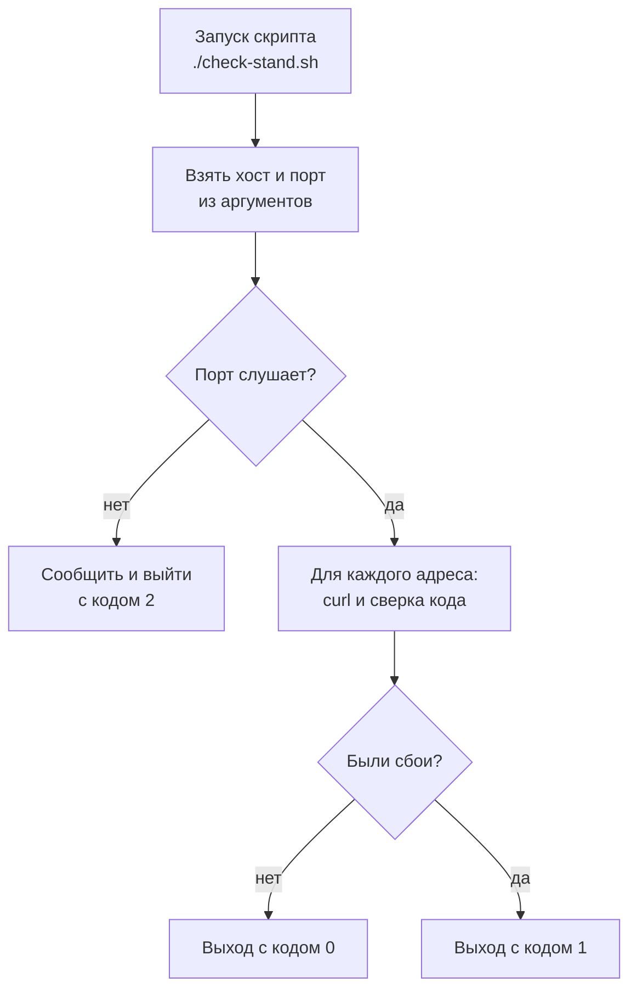
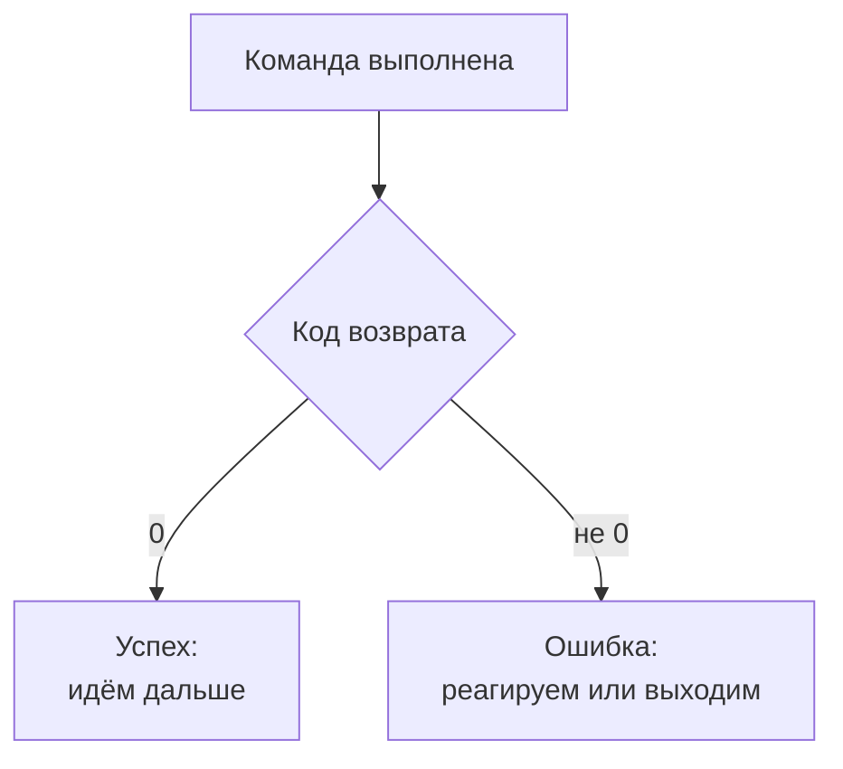

## Зачем это нужно

Я пишу нагрузочные тесты (они гонят на сервис толпу виртуальных покупателей) не первый год и расскажу, как сам набил шишку. Перед первой распродажей я запустил тест на стенде (так называют отдельную копию магазина для проверок) и ушёл на обед. Вернулся к ровным графикам, а вечером выяснилось, что стенд был выключен: тест час стучался в закрытую дверь, и все цифры оказались мусором. С тех пор перед каждым тестом я проверяю, что стенд жив, и делаю это не руками, а скриптом.

Руками это долго, и каждый раз чуть по-разному. **Скрипт** (script) это текстовый файл с командами, которые выполняются одна за другой по одному запуску. Он проверяет одинаково и умеет сказать «всё хорошо» или «плохо» не только тебе, но и другим программам.

Шаг проекта: ты напишешь скрипт `~/perf-lab/scripts/check-stand.sh`, который проверяет стенд «Магазин»: слушает ли порт, отвечают ли основные адреса нужными кодами, не слишком ли медленно. Этот скрипт ты будешь запускать перед каждым нагрузочным тестом до конца курса, а в [теме 6](../06-api-testing/index.md) его запустит автоматическая проверка, которая сама прогоняет скрипты.

## Что нужно знать

- Терминал и редактор `nano`: [урок 1.1](01-workstation-terminal.md). Права доступа к файлу и `chmod` разберём в этом уроке.
- Конвейеры, `awk`, перенаправления `>`: [урок 1.2](02-text-logs.md).
- `curl -w`, `%{http_code}`, `--max-time`, порты: [урок 1.4](04-network-cli.md). Скрипт будет собран из этих команд.
- Глубже: [основы Bash](https://distinguished-sre.github.io/devops/01-linux/06-bash-basics.html) и [скрипты в эксплуатации](https://distinguished-sre.github.io/devops/01-linux/07-bash-in-ops.html) в курсе DevOps. Для нас здесь всё нужное собрано.

## Картина целиком

Возьми памятку дежурного охранника: «обойди здание, проверь, что дверь А закрыта, дверь Б закрыта, свет горит. Если что-то не так, запиши, где именно, и позвони. Если всё в порядке, не звони». Охранник не думает над порядком, он идёт по списку. Скрипт это такая памятка для компьютера: **последовательность** шагов, **условия** («если дверь открыта...»), **повторы** («для каждой двери из списка») и **итог** («позвони или не звони»).

Итог скрипт отдаёт числом: `0` значит «всё хорошо», любое другое число «плохо». На схеме ниже это числа 0, 1 и 2: подробно о них в теории. Хост на схеме это адрес машины, например `127.0.0.1`.



Здесь видны все четыре части памятки. Порт закрыт: скрипт выходит сразу. Порт открыт: скрипт перебирает адреса, а в конце число сообщает итог.

## Теория

### Скрипт: файл, который можно запустить

Команды, набранные в терминале, исчезают вместе с окном. Как сохранить их, чтобы запускать хоть сто раз и всегда одинаково?

Просто записать в обычный текстовый файл, как рецепт на карточку. Но карточка сама не сварит суп: нужно сказать, кто её читает. Поэтому первой строкой пишут **шебанг** (shebang): символы `#!` и путь к программе-исполнителю:

```bash
#!/usr/bin/env bash
echo "Привет из скрипта"
```

`#!/usr/bin/env bash` значит «запусти файл программой `bash`, найдя её в системе». Остальные строки это команды. Всё после `#` это **комментарий**: пояснение для человека, которое Bash пропускает.

Есть ещё одна преграда. У каждого файла есть права: читать, менять и исполнять. Только что созданный файл не получает право исполнять: так система не даёт запустить любой случайный текст как программу. Право добавляет команда `chmod` (от «change mode», «поменять режим»): `chmod +x файл` включает право исполнять (буква `x` от «execute»). Увидеть права можно командой `ls -l`: после `chmod +x` в первой колонке появятся буквы `x`.

```bash
chmod +x hello.sh
./hello.sh
```

Запускают с `./`, что значит «из текущего каталога». Оболочка ищет команды только в каталогах из `PATH` (помнишь, [урок 1.1](01-workstation-terminal.md)), а текущего каталога там нет. Права исполнения можно и не давать: `bash hello.sh` прочитает файл сам.

> **Прикинь сам:** ты написал `check.sh` и запускаешь командой `check.sh`. Получаешь `command not found`. Что не так?
{: .predict}

Текущего каталога в `PATH` нет, нужно `./check.sh`. Если после этого появится `Permission denied`, не хватает права исполнения: `chmod +x check.sh`.

Осторожно: шебанг работает только в самой первой строке.

> **Главное:** скрипт это текстовый файл с шебангом в первой строке и правом исполнения (`chmod +x`), который запускают как `./имя.sh`.
{: .key}

Запускать умеем. Но адрес и порт повторяются: как не править их в десяти местах?

### Переменные и кавычки

Адрес сервера, порт и допустимое время ответа встречаются в скрипте много раз. Если вписать их везде, при смене порта придётся искать десять мест и одно обязательно забудется.

Для этого есть **переменная** (variable): имя, под которым хранится значение. Как подписанная банка на полке: в рецептах пишут «крупа из банки», а что внутри, меняешь в одном месте.

```bash
HOST="127.0.0.1"
PORT=8000
echo "Проверяю $HOST:$PORT"
```

```text
Проверяю 127.0.0.1:8000
```

Значение читают со знаком доллара: `$PORT` (с буквами рядом пишут `${PORT}_log`). Вокруг `=` пробелов нет: `PORT = 8000` Bash прочтёт как команду `PORT` с аргументами.

Дальше важна разница в кавычках. Двойные подставляют значения переменных, одинарные печатают всё буквально:

```bash
NAME="стенд"
echo "Проверяю $NAME"
echo 'Проверяю $NAME'
```

```text
Проверяю стенд
Проверяю $NAME
```

Переменную почти всегда берут в двойные кавычки (`"$URL"`): иначе значение с пробелом развалится на два слова.

> **Проверь понимание:** что напечатает `X=5; echo 'значение $X'; echo "значение $X"`?

<details markdown="1">
<summary>Ответ</summary>

`значение $X` и `значение 5`. Одинарные кавычки не подставляют переменную, двойные подставляют.

</details>

Значение переменной можно получить от другой команды. Запись `$(...)` запускает команду и подставляет её вывод (**подстановка команды**):

```bash
TODAY=$(date +%F)
COUNT=$(wc -l < access.log)
echo "На $TODAY в логе $COUNT строк"
```

```text
На 2026-10-03 в логе 10000 строк
```

`date +%F` печатает дату в виде `2026-10-03`. `wc -l < access.log` считает строки в файле: `<` подаёт файл на вход команде, как `|` подаёт вывод другой команды ([урок 1.2](02-text-logs.md)).

Третий источник значений: сам запуск. Всё, что написано после имени скрипта, попадает в переменные `$1` (первое слово), `$2` (второе) и так далее. Запись `${1:-значение}` значит «возьми `$1`, а если его нет, возьми вот это»:

```bash
#!/usr/bin/env bash
HOST="${1:-127.0.0.1}"
PORT="${2:-8000}"
BASE_URL="http://$HOST:$PORT"
echo "Проверяю $BASE_URL"
```

Запуск `./script.sh` без аргументов печатает `Проверяю http://127.0.0.1:8000`, а `./script.sh example.com 80` печатает `Проверяю http://example.com:80`. Адрес собирается из двух переменных, а остальные команды используют `$BASE_URL`.

> **Главное:** переменная задаётся как `NAME=значение` без пробелов, читается как `"$NAME"`, а значение берут из аргументов, команд или пишут сами.
{: .key}

Адрес собран. Но как узнать, получилось ли у скрипта хоть что-нибудь?

### Код возврата: как скрипт и команды говорят «успех» или «ошибка»

Глазами смотреть на вывод можно, пока ты рядом. А если скрипт запускает другая программа, она не прочтёт «всё вроде хорошо». Ей нужен ответ, который можно проверить автоматически.

Поэтому каждая команда при завершении отдаёт число от 0 до 255: **код возврата** (exit code, exit status). Договорённость такая: **0 значит успех, любое другое число значит ошибку** (какое именно, решает автор программы). Последний код лежит в переменной `$?`:

```bash
ls /tmp
echo "код: $?"
ls /нет-такого-каталога
echo "код: $?"
```

```text
(список файлов)
код: 0
ls: cannot access '/нет-такого-каталога': No such file or directory
код: 2
```

`curl` из [урока 1.4](04-network-cli.md) на закрытом порту завершается с кодом 7: это тот же номер, что в тексте `curl: (7)`. Свой скрипт завершается командой `exit N`: `exit 0` успех, `exit 1` сбой, `exit 2` другая причина (мы возьмём 2 для «порт закрыт»). Без `exit` в конце код равен коду последней выполненной команды.



К любой команде достаточно одного вопроса: «ноль или не ноль». Вот почему кодом возврата одинаково пользуются скрипты, расписание и автоматические проверки.

Две связки как раз работают по этому вопросу. `команда1 && команда2` выполняет вторую, только если первая успешна. `команда1 || команда2` выполняет вторую, только если первая провалилась:

```bash
mkdir -p ~/perf-lab/scripts && echo "каталог готов"
curl -sf http://127.0.0.1:8000/healthz > /dev/null || echo "стенд не отвечает"
```

Адрес `/healthz` у «Магазина» отвечает «я жив» и ничего больше. В первой строке «каталог готов» печатается, только если `mkdir` отработал. Во второй сообщение печатается, только если `curl` вернул не ноль. Флаг `-f` из прошлого урока заставляет `curl` считать ошибкой и ответы 4xx и 5xx.

> **Прикинь сам:** скрипт делает `curl -s http://127.0.0.1:8000/readyz`, сервис отвечает `503`. Какой код возврата у `curl`?
{: .predict}

Ноль. Без `-f` `curl` считает успехом сам факт, что ответ получен, и на 503 не смотрит. Проверка `if curl ...; then echo OK` напечатает «OK» для неработающего сервиса. Нужен `-f` или сравнение `%{http_code}` с ожидаемым кодом.

Осторожно: `$?` меняется после каждой команды, даже после `echo`, поэтому сохраняй значение сразу: `rc=$?`.

> **Главное:** код 0 это успех, любое другое число ошибка, а `curl` без `-f` возвращает 0 даже при ответе 500.
{: .key}

Теперь у скрипта есть «ноль или не ноль». Осталось научить его решать, что с этим делать.

### Условия: if

Если порт закрыт, скрипт должен прекратить работу. Если ответ медленный, отметить это. Для таких решений есть `if`:

```bash
if [ "$code" = "200" ]; then
  echo "OK"
else
  echo "FAIL"
fi
```

`if` смотрит на код возврата команды после него. Команда `[ ... ]` (настоящая команда, у неё есть второе имя `test`) проверяет условие и возвращает `0`, если оно верно. Поэтому внутри скобок пробелы обязательны: `[ "$code" = "200" ]`, а не `["$code"="200"]`. Слово `fi` это `if` задом наперёд, оно закрывает условие. Дополнительная ветка называется `elif`.

Строки и числа сравнивают по-разному. Строки: `=` и `!=`. Числа: `-eq` (равно), `-ne` (не равно), `-gt` (больше), `-lt` (меньше), `-ge` и `-le` (больше или равно, меньше или равно). Условием может быть и обычная команда:

```bash
if curl -sf --max-time 3 http://127.0.0.1:8000/healthz > /dev/null; then
  echo "стенд жив"
else
  echo "стенд не отвечает"
fi
```

Проверим на примере: время ответа 620 мс, порог «медленно» 500, порог «очень медленно» 1000.

```bash
ms=620
if [ "$ms" -gt 1000 ]; then
  echo "очень медленно"
elif [ "$ms" -gt 500 ]; then
  echo "медленно"
else
  echo "нормально"
fi
```

```text
медленно
```

620 не больше 1000, поэтому первая ветка пропущена. 620 больше 500, и срабатывает вторая. Ветки проверяются сверху вниз, срабатывает первая подходящая.

> **Прикинь сам:** что не так в `if [ $ms > 500 ]; then`?
{: .predict}

Внутри `[ ]` знак `>` не сравнивает числа: он перенаправляет вывод в файл с именем «500» (как `>` из [урока 1.2](02-text-logs.md)). Условие почти всегда окажется «верным», и в каталоге появится лишний файл. Правильно: `if [ "$ms" -gt 500 ]; then`.

> **Главное:** `if` проверяет код возврата, числа сравнивают через `-gt`, `-lt` и `-eq`, строки через `=`, а пробелы внутри `[ ]` обязательны.
{: .key}

<details markdown="1">
<summary>Для любопытных: ещё три проверки в скобках</summary>

`[ -z "$x" ]` верно, если строка пуста: так ловят и незаданную переменную, и пустую. `[ -f файл ]` верно, если файл существует, `[ -d каталог ]` то же для каталога.

</details>

Один адрес проверять умеем. Но их пять, а копировать блок пять раз неохота.

### Циклы: for и while

**Цикл** (loop) повторяет блок команд для каждого значения из списка.

```bash
for path in /healthz /readyz /api/categories; do
  echo "Проверяю $path"
done
```

```text
Проверяю /healthz
Проверяю /readyz
Проверяю /api/categories
```

`for имя in список; do ... done`: на каждом шаге переменная `path` получает следующее значение, и тело между `do` и `done` выполняется. Диапазон чисел записывают как `{1..5}`, и такой цикл ты уже писал в [уроке 1.3](03-processes-resources.md): `for i in {1..4}; do yes > /dev/null & done`.

Второй цикл, `while`, повторяется, пока условие верно. Он нужен, когда число повторов неизвестно: например, ждать, пока стенд поднимется. Знак `!` перед командой значит «пока команда не успешна», а `sleep 1` ставит паузу на секунду:

```bash
while ! curl -sf http://127.0.0.1:8000/healthz > /dev/null; do
  echo "жду стенд..."
  sleep 1
done
echo "стенд поднялся"
```

Так скрипт ждёт запуска сервиса. Это понадобится в [уроке 2.1](../02-web/01-client-server-http.md): стенд поднимается десятки секунд, и тест нельзя запускать раньше.

Теперь счётчик неудач: проверим стенд три раза и посчитаем сбои.

```bash
failed=0
for i in 1 2 3; do
  if ! curl -sf --max-time 2 http://127.0.0.1:8000/healthz > /dev/null; then
    failed=$((failed + 1))
  fi
  sleep 1
done
echo "неудач: $failed из 3"
```

Выражение `$((failed + 1))` это арифметика: Bash считает всё внутри двойных скобок. Если стенд жив, выведется `неудач: 0 из 3`. Счётчик в цикле: в конце по нему решают, провалена ли проверка.

> **Прикинь сам:** скрипт ждёт стенд циклом `while ! curl ...; do sleep 1; done`, а стенд так и не поднимается. Чем это кончится?
{: .predict}

Скрипт зависнет навсегда: у цикла нет предела. Исправление: считать попытки и выходить после предела, например `for i in {1..30}; do curl ... && break; sleep 1; done`, а после цикла проверить, получилось ли. Без `sleep` такой цикл вдобавок грузит процессор на 100%, как `yes` из урока 1.3.

> **Главное:** `for` перебирает список, `while` повторяет, пока условие верно, и у любого ожидания должны быть предел попыток и пауза.
{: .key}

Проверка одного адреса уже занимает несколько строк. Пора дать ей имя.

### Функции: один раз написал, много раз вызвал

Если вставить пять раз все команды проверки одного адреса, скрипт раздуется, а любую ошибку придётся чинить в пяти местах. **Функция** (function) это блок команд с именем, который вызывают как обычную команду.

```bash
greet() {
  local name="$1"
  echo "Привет, $name"
}
greet "стенд"
greet "команда"
```

```text
Привет, стенд
Привет, команда
```

Внутри функции аргументы приходят в `$1`, `$2` так же, как у скрипта. Слово `local` делает переменную видимой только внутри функции. Без него переменная общая на весь скрипт, и две проверки начнут затирать значения друг друга. Определять функцию нужно до первого вызова, а скобки `()` пишут только при определении.

> **Проверь понимание:** функция меняет переменную `count` без `local`, и после вызова значение в основной части скрипта тоже изменилось. Это ошибка?

<details markdown="1">
<summary>Ответ</summary>

Зависит от замысла. Без `local` переменная общая, и так это работает (мы используем это для счётчика сбоев `failed`). Но для вспомогательных переменных вроде `code` и `ms` нужен `local`: иначе значения одной проверки случайно просачиваются в другую.

</details>

> **Главное:** функция это блок команд с именем, а `local` не даёт её переменным просочиться в остальной скрипт.
{: .key}

У нас есть все детали. Как они работают вместе, когда запускается скрипт целиком?

### Как Bash выполняет скрипт

Bash читает файл сверху вниз, по одной команде. Если команда не удалась, он по умолчанию идёт дальше, а не останавливается. Скрипт без проверок может дойти до конца и выдать «успех» при сломанной середине. Вот пошаговый ход нашего скрипта:

<div class="viz" data-viz="flow" data-steps='[{"title":"1. Читаем аргументы","text":"`HOST=\"${1:-127.0.0.1}\"` и `PORT=\"${2:-8000}\"`: без аргументов проверяем локальный стенд на порту 8000."},{"title":"2. Проверяем порт","text":"Пробуем открыть соединение с портом. Не вышло: печатаем `FAIL`, выходим с кодом 2 и дальше не идём."},{"title":"3. Функция check_url","text":"Делает `curl` с ограничением по времени, забирает `код время`, переводит секунды в миллисекунды через `awk`."},{"title":"4. Сверяем код","text":"Код не равен ожидаемому: `FAIL` и счётчик сбоев растёт. Равен, но дольше 500 мс: `SLOW`. Иначе `OK`."},{"title":"5. Вызываем по списку","text":"`check_url /healthz 200`, `/readyz`, `/api/categories`, `/api/products?size=5`, и `/api/products/999999` с ожидаемым 404."},{"title":"6. Итог и код выхода","text":"Сбоев нет: `exit 0`. Есть: `exit 1`. Эти числа читают другие программы."}]'></div>

Многие в начало скрипта пишут `set -euo pipefail`: «останавливайся при первой ошибке и ругайся на необъявленные переменные». В рабочих скриптах я бы ставил её сразу: она спасает от тихих сбоев. В учебном `check-stand.sh` мы её не берём. Нам нужны все сбои, а не только первый, поэтому счётчик `failed` и итоговый `exit` пишем руками.

<details markdown="1">
<summary>Для любопытных: что ещё делает строгий режим</summary>

`set -e` останавливает скрипт при первой ошибке, `set -u` ругается на необъявленные переменные, `set -o pipefail` считает ошибкой конвейера сбой любой его команды. Подвох: `grep` без совпадений возвращает 1, и скрипт под `set -e` оборвётся. Цикл `until` повторяет, пока условие не станет верным: это `while !` наоборот.

</details>

Ещё одна привычка: перед первым запуском прогонять скрипт через `shellcheck`. Эта программа читает скрипт и подсказывает типичные ошибки: забытые кавычки, лишние пробелы. Установка: `sudo apt install -y shellcheck`, запуск: `shellcheck скрипт.sh`.

> **Главное:** Bash по умолчанию не останавливается на ошибке, поэтому честный скрипт сам считает сбои и сам говорит итоговым кодом, всё ли хорошо.
{: .key}

Мой тест на выключенном стенде такой скрипт остановил бы строкой `FAIL порт закрыт` и кодом 2. Его мы и соберём в практике.

## Практика

Все скрипты складывай в `~/perf-lab/scripts/`: ты создал этот каталог в [уроке 1.1](01-workstation-terminal.md). Стенд «Магазин» пока не запущен, поэтому в начале будем проверять учебный сервис из прошлого урока: он ответит на те же адреса.

### 1. Первый скрипт: переменные, аргументы, код возврата

```bash
cd ~/perf-lab/scripts
nano hello.sh
```

Впиши и сохрани (`Ctrl+O`, `Enter`, `Ctrl+X`):

```bash
#!/usr/bin/env bash
NAME="${1:-мир}"
echo "Привет, $NAME"
exit 3
```

```bash
chmod +x hello.sh
./hello.sh
./hello.sh стенд
echo "код: $?"
```

```text
Привет, мир
Привет, стенд
код: 3
```

**Как читать вывод:** без аргумента сработало значение по умолчанию («мир»), с аргументом подставилось твоё слово. `$?` показал `3`: тот код, который ты задал в `exit`. Сразу после `./hello.sh стенд` код относится к нему. Если выполнить ещё одну команду и потом проверить `$?`, там будет код уже другой команды.

**Типичные ошибки:** `bash: ./hello.sh: Permission denied`: забыт `chmod +x`. `bash: hello.sh: command not found`: нужно `./hello.sh`. `/usr/bin/env: ‘bash\r’: No such file or directory`: файл сохранён с «виндовыми» переводами строк, пересоздай его в `nano`.

### 2. Подними учебный сервис с нужными адресами

```bash
mkdir -p ~/perf-lab/01-linux/www/api
cd ~/perf-lab/01-linux/www
echo '{"status":"ok"}' > healthz
echo '{"status":"ready"}' > readyz
echo '[]' > api/categories
echo '{}' > api/products
python3 -m http.server 8000 --bind 127.0.0.1
```

Это тот же простой сервер, что в [уроке 1.4](04-network-cli.md), но с файлами, которые имитируют адреса «Магазина» (`/healthz`, `/readyz`, `/api/categories`, `/api/products`). Адрес `/api/products/999999` отсутствует, и сервер ответит на него `404`: так же ответит настоящий «Магазин» на несуществующий товар. Терминал занят сервером, дальше работай во втором.

### 3. Условие и цикл: проверка трёх адресов

```bash
cd ~/perf-lab/scripts
nano mini-check.sh
```

```bash
#!/usr/bin/env bash
BASE_URL="http://127.0.0.1:8000"

for path in /healthz /readyz /api/categories; do
  code=$(curl -s -o /dev/null --max-time 3 -w '%{http_code}' "$BASE_URL$path")
  if [ "$code" = "200" ]; then
    echo "OK   $path"
  else
    echo "FAIL $path (код $code)"
  fi
done
```

```bash
chmod +x mini-check.sh
./mini-check.sh
```

```text
OK   /healthz
OK   /readyz
OK   /api/categories
```

**Как читать вывод:** цикл перебрал три адреса, для каждого `curl` запросил только код (`-s` тихо, `-o /dev/null` без тела, `-w '%{http_code}'` печатает код), а `$(...)` положил его в `code`. Условие сверило строку с `200`. Попробуй изменить в списке `/readyz` на `/nope`: строка изменится на `FAIL /nope (код 404)`.

**Типичные ошибки:**

- `[: missing ']'` или `[: =: unary operator expected`: потерян пробел внутри `[ ]` или переменная без кавычек оказалась пустой. Пиши `[ "$code" = "200" ]`.
- Все строки `FAIL` с кодом `000`: сервис из упражнения 2 не запущен (`curl` не соединился, и код равен нулям).

### 4. Итоговый скрипт: проверка стенда

Теперь соберём всё вместе: порт, функция, счётчик, медленные ответы, код выхода.

```bash
nano ~/perf-lab/scripts/check-stand.sh
```

```bash
#!/usr/bin/env bash
# check-stand.sh: быстрая проверка стенда «Магазин».
# Запуск: ./check-stand.sh [хост] [порт]   (по умолчанию 127.0.0.1 8000)
# Код выхода: 0 всё в порядке, 1 есть сбои, 2 порт закрыт.

HOST="${1:-127.0.0.1}"
PORT="${2:-8000}"
BASE_URL="http://$HOST:$PORT"
MAX_TIME=3      # дольше этого запрос считается зависшим, секунд
SLOW_MS=500     # медленнее этого помечаем SLOW, миллисекунд
failed=0

# Шаг 1. Порт слушают?
if ! (exec 3<>"/dev/tcp/$HOST/$PORT") 2>/dev/null; then
  echo "FAIL порт $PORT на $HOST закрыт: сервис не запущен?"
  exit 2
fi
echo "OK   порт $PORT открыт"

# check_url ПУТЬ ОЖИДАЕМЫЙ_КОД: один запрос, печатает строку результата.
check_url() {
  local path="$1" expected="$2"
  local out code secs ms mark
  out=$(curl -s -o /dev/null --max-time "$MAX_TIME" \
        -w '%{http_code} %{time_total}' "$BASE_URL$path")
  code="${out%% *}"
  secs="${out##* }"
  ms=$(awk -v s="$secs" 'BEGIN { printf "%d", s * 1000 }')

  if [ "$code" != "$expected" ]; then
    mark="FAIL"
    failed=$((failed + 1))
  elif [ "$ms" -gt "$SLOW_MS" ]; then
    mark="SLOW"
  else
    mark="OK  "
  fi
  printf '%s %-24s код %s (ждали %s) за %s мс\n' "$mark" "$path" "$code" "$expected" "$ms"
}

# Шаг 2. Проверяем адреса: путь и ожидаемый код.
check_url /healthz 200
check_url /readyz 200
check_url /api/categories 200
check_url "/api/products?size=5" 200
check_url /api/products/999999 404

# Шаг 3. Итог.
if [ "$failed" -eq 0 ]; then
  echo "Итог: всё в порядке"
  exit 0
fi
echo "Итог: сбоев $failed"
exit 1
```

Разбор незнакомых мест (две первые подстановки сложные: достаточно понять, что они делают, запоминать их не нужно):

- `(exec 3<>"/dev/tcp/$HOST/$PORT")` Bash умеет сам открывать TCP-соединение: специальный «файл» `/dev/tcp/хост/порт` соединяется с портом, и код возврата говорит, получилось ли. `2>/dev/null` прячет сообщение об ошибке. Открывать соединение скобками `( ... )` нужно, чтобы оно закрылось, когда скобки закончатся. Если порт закрыт, команда вернёт ненулевой код, и `if !` сработает.
- `"${out%% *}"` и `"${out##* }"`: из строки вида `200 0.003412` берут первое слово (до первого пробела: `%%`) и последнее (после последнего пробела: `##`). Это способ разрезать строку без `awk`. Если не поймёшь с первого раза, не страшно: скопируй как есть.
- `awk -v s="$secs" 'BEGIN { printf "%d", s * 1000 }'` умножает секунды на 1000 и печатает целое число: Bash сам не считает дробные числа, поэтому арифметику с `0.003412` отдаём `awk`. `-v s=...` передаёт значение в `awk`.
- `printf '%s %-24s ...'` форматированный вывод: `%s` подставляет строку, `%-24s` строка шириной 24 символа, выровненная влево (чтобы колонки были ровными).
- `\` в конце строки значит «команда продолжается на следующей строке».

```bash
chmod +x ~/perf-lab/scripts/check-stand.sh
~/perf-lab/scripts/check-stand.sh; echo "код выхода: $?"
```

```text
OK   порт 8000 открыт
OK   /healthz                 код 200 (ждали 200) за 4 мс
OK   /readyz                  код 200 (ждали 200) за 9 мс
OK   /api/categories          код 200 (ждали 200) за 8 мс
OK   /api/products?size=5     код 200 (ждали 200) за 21 мс
OK   /api/products/999999     код 404 (ждали 404) за 7 мс
Итог: всё в порядке
код выхода: 0
```

**Как читать вывод:** каждая строка это одна проверка: пометка (`OK`, `SLOW` или `FAIL`), адрес, фактический код, ожидаемый код и время. Пятая строка показывает важную идею: ожидаемый код не всегда 200. Запрос несуществующего товара **должен** вернуть 404, и если вдруг вернёт 200, это ошибка. Последняя строка `код выхода: 0` значит «всё хорошо» для любой программы, которая запустит скрипт. Время ответов можно оценить на графике: именно такие числа выдаёт скрипт на реальном стенде при спокойной работе.

<div class="viz" data-viz="chart" data-type="bar" data-title="Время проверок check-stand.sh на спокойном стенде" data-x="/healthz,/readyz,/api/categories,/api/products?size=5,/api/products/999999" data-series='[{"name":"время ответа","values":[4,9,8,21,7]}]' data-unit="мс" data-x-label="адрес" data-y-label="время" data-explain="Все проверки быстрее порога SLOW (500 мс). Самый «тяжёлый» адрес это список товаров с обращением к базе данных. Эти числа условные: твои значения запишутся в первом запуске на настоящем стенде."></div>

Числа те же, что в выводе. Быстрее всех `/healthz`, список товаров (21 мс) дольше. Если столбец вырастет за 500 мс, скрипт пометит `SLOW`.

**Типичные ошибки:**

- `./check-stand.sh: line 12: syntax error near unexpected token 'then'`: забыт `;` перед `then` или пробел внутри `[ ]`. Номер строки в сообщении точный: смотри на неё и на предыдущую.
- `[: : integer expression expected`: в `ms` оказалась пустая строка: `awk` не получил число. Проверь, что `curl` вернул `код время`: запусти `curl -s -o /dev/null -w '%{http_code} %{time_total}' http://127.0.0.1:8000/healthz`.
- Скрипт печатает `FAIL порт 8000 ... закрыт`, хотя сервер запущен: сервис слушает на другом адресе, сверь через `sudo ss -tlnp | grep :8000` ([урок 1.4](04-network-cli.md)).

### 5. Проверка линтером и повторные запуски

```bash
sudo apt install -y shellcheck
shellcheck ~/perf-lab/scripts/check-stand.sh
for i in 1 2 3; do ~/perf-lab/scripts/check-stand.sh | tail -n 1; sleep 1; done
watch -n 2 ~/perf-lab/scripts/check-stand.sh
```

Первая команда установила `shellcheck`, вторая проверила скрипт: пустой вывод значит «замечаний нет». Цикл запускает скрипт три раза с паузой (`tail -n 1` оставляет итоговую строку). `watch -n 2` (команда «смотреть») повторяет скрипт каждые 2 секунды и перерисовывает весь экран: наверху строка с интервалом и временем, ниже вывод скрипта, который обновляется на месте. Выход `Ctrl+C`. Для этого шага нужно два окна: сервер в одном, `watch` в другом (как открыть, написано в [уроке 1.1](01-workstation-terminal.md); в Multipass это второй `multipass shell lab`). Пока `watch` работает, останови сервер в первом терминале и посмотри, как строки превращаются в `FAIL`, потом запусти снова: они снова становятся `OK`. Так ты будешь следить за стендом во время теста.

### 6. Запиши в perf-lab

```bash
cat > ~/perf-lab/01-linux/scripts-notes.md <<'TXT'
# Заметки: скрипты

- check-stand.sh [хост] [порт]: порт, 5 адресов, коды, время. Код выхода 0, 1 или 2.
- Скрипты лежат в ~/perf-lab/scripts/, запуск: ./check-stand.sh
- Перед нагрузочным тестом всегда запускать check-stand.sh
TXT
```

> Скрипт ведёт себя странно, а в «Типичных ошибках» такого нет? Запусти `bash -x ./скрипт.sh` и `shellcheck`, прочитай сам, потом спроси нейросеть. Исправление проверь повторным запуском.
{: .ai}

## Сломай и почини

**Поломка.** Коллега написал упрощённую версию проверки и говорит, что она «работает». Создай её:

```bash
cat > ~/perf-lab/scripts/check-bad.sh <<'TXT'
#!/usr/bin/env bash
if curl -s http://127.0.0.1:8000/api/products/999999 > /dev/null; then
  echo "OK стенд работает"
else
  echo "FAIL"
fi
TXT
chmod +x ~/perf-lab/scripts/check-bad.sh
~/perf-lab/scripts/check-bad.sh
```

Скрипт напечатает `OK стенд работает`, хотя адрес `/api/products/999999` на самом деле возвращает `404`. Потом останови сервер (`Ctrl+C` в первом терминале) и запусти ещё раз.

**Задача.** Найди, почему скрипт врёт в первом случае, и почини его так, чтобы он честно сообщал об ошибке в обоих.

<details markdown="1">
<summary>Разбор</summary>

1. Причина: `curl` без `-f` возвращает код `0` всегда, когда получил **какой-то** ответ, включая 404 и 500. Условие `if curl ...` проверяет только код возврата `curl`, поэтому для 404 оно истинно, и скрипт печатает «OK». Это та самая ловушка из раздела про код возврата.
2. После остановки сервера `curl` не сможет соединиться и вернёт код 7: скрипт напечатает `FAIL`. Значит, скрипт ловит **только** сетевые сбои и пропускает ошибки приложения.
3. Исправление, вариант 1: добавить `-f`: `curl -sf --max-time 3 ...`. Тогда код 404 и 500 тоже дают ненулевой код возврата. Вариант 2 лучше: брать HTTP-код через `-w '%{http_code}'` и сравнивать с ожидаемым, как в `check-stand.sh`. Он различает «404 ожидаем» и «404 неожиданный» и показывает сам код, а не просто «FAIL».
4. Добавь ещё `--max-time`: без него `curl` может ждать бесконечно, и скрипт зависнет вместо того чтобы сообщить о сбое.
5. Проверка: запусти исправленный скрипт при работающем сервере (ожидаемо `FAIL` для 404 с `-f`, если ждёшь 200), потом при остановленном, и сравни коды выхода командой `echo $?`.

Вывод: в скриптах проверка «команда выполнилась» и «сервис здоров» это разные вещи. Скрипт, который проверяет только первое, даёт ложное чувство безопасности, а ложное «всё хорошо» перед нагрузочным тестом хуже честного «не работает».

</details>

Убери за собой: останови сервер (`Ctrl+C`), удали учебные файлы. Скрипт `check-stand.sh` останется, он пригодится дальше.

```bash
rm -r ~/perf-lab/01-linux/www
rm ~/perf-lab/scripts/check-bad.sh ~/perf-lab/scripts/hello.sh ~/perf-lab/scripts/mini-check.sh
ls ~/perf-lab/scripts
```

## ИИ в помощь

Нейросеть удобна, чтобы объяснить чужой скрипт и найти ошибку в своём, но запустить его за тебя не может. Общие правила на странице [ИИ-помощник](../ai.md).

**Задача:** разобрать скрипт построчно.

```text
Я учу Bash (Ubuntu 24.04). Объясни скрипт построчно: что делает каждая строка, каким будет код возврата и что произойдёт, если стенд недоступен:
<вставь скрипт check-stand.sh>
Отдельно поясни set -euo pipefail, $(...) и [[ ]].
```
{: .wrap}

**Проверь ответ:** запусти скрипт при работающем и выключенном стенде и сверь поведение с объяснением. Типичная ошибка: нейросеть смешивает bash и sh (`[[ ]]` в `sh` не работает) и не замечает переменных без кавычек.

**Задача:** найти ошибку в своём скрипте.

```text
Мой скрипт падает. Bash 5, Ubuntu 24.04.
Скрипт:
<вставь скрипт>
Вывод `bash -x ./скрипт.sh` и вывод shellcheck:
<вставь вывод>
Объясни, на какой строке и почему он ломается, и покажи исправление. Укажи, что изменено и зачем.
```
{: .wrap}

**Проверь ответ:** перезапусти скрипт и `shellcheck`, как в практике. Типичная ошибка: «исправление» глушит ошибку (`|| true`) вместо причины или добавляет `rm -rf` с переменной, которая может оказаться пустой.

## Словарик урока

| Термин | Простыми словами |
|---|---|
| Скрипт (script) | Текстовый файл с командами, которые выполняются одна за другой по одному запуску |
| Шебанг (shebang) | Первая строка `#!/usr/bin/env bash`: какой программой запускать файл |
| Комментарий | Строка после `#`: пояснение для человека, Bash её пропускает |
| Переменная | Имя, под которым хранится значение: `PORT=8000`, читается как `$PORT` |
| Аргумент скрипта | Слово после имени скрипта: первое лежит в `$1`, второе в `$2` |
| `${1:-значение}` | «Возьми первый аргумент, а если его нет, возьми значение» |
| Подстановка команды `$(...)` | Запустить команду и подставить её вывод на это место |
| Код возврата (exit code) | Число, которое команда отдаёт при завершении: 0 успех, другое ошибка |
| `$?` | Код возврата последней команды |
| `exit N` | Завершить скрипт с кодом N |
| `&&`, `\|\|` | «Если успешно, то...» и «если провалилось, то...» |
| `if ... then ... fi` | Условие: выполнить блок, если проверка успешна |
| `[ ... ]` | Команда проверки условия: пробелы внутри обязательны |
| `-eq`, `-gt`, `-lt` | Сравнение чисел (равно, больше, меньше); для строк `=` |
| Цикл (loop) | Повтор блока команд: `for` по списку, `while` по условию |
| Функция | Блок команд с именем, который вызывают как команду |
| `local` | Переменная, видимая только внутри функции |
| `shellcheck` | Программа, которая находит типичные ошибки в скриптах |

## Вопросы с собеседований

Раздел для повторения: ответь вслух, потом открой ответ. Вопросы с пометкой `[на скорость]` тренируй на время: ответ за 30 секунд.

### 1. [junior] [часто] Что такое код возврата и как его проверить?

<details markdown="1">
<summary>Ответ</summary>

Число, которое программа отдаёт при завершении: 0 значит успех, любое другое значение ошибку. Проверяют специальной переменной `$?` сразу после команды или условием `if команда; then`. Свой скрипт завершают командой `exit N`.

**Что хотят услышать:** ноль это успех, `$?`, `exit`.

**Красный флаг:** «ноль значит ошибку» (путает с другими языками).

</details>

### 2. [junior] [часто] Чем одинарные кавычки отличаются от двойных в Bash?

<details markdown="1">
<summary>Ответ</summary>

Двойные подставляют значения переменных и команд (`"$HOST"`, `"$(date)"`), одинарные печатают текст буквально. Переменные в аргументах почти всегда берут в двойные кавычки, чтобы значение с пробелами не развалилось на несколько слов.

**Что хотят услышать:** подстановка против буквального текста, защита от пробелов.

**Красный флаг:** считает, что разницы нет.

</details>

### 3. [junior] [часто] Как сделать скрипт исполняемым и запустить?

<details markdown="1">
<summary>Ответ</summary>

Первой строкой шебанг `#!/usr/bin/env bash`, затем `chmod +x script.sh` и запуск `./script.sh`. Либо без права исполнения: `bash script.sh`.

**Что хотят услышать:** шебанг, `chmod +x`, `./`.

**Красный флаг:** `script.sh` без `./` и удивление, что «команда не найдена».

</details>

### 4. [junior] Как в Bash сравнить числа и строки?

<details markdown="1">
<summary>Ответ</summary>

Строки: `[ "$a" = "$b" ]`, `!=`. Числа: `-eq`, `-ne`, `-gt`, `-lt`, `-ge`, `-le`, например `[ "$ms" -gt 500 ]`. Знаки `>` и `<` внутри `[ ]` не сравнивают числа, а перенаправляют вывод в файл. Внутри `[ ]` пробелы обязательны.

**Что хотят услышать:** два набора операторов, ловушка с `>`.

**Красный флаг:** `[ $ms > 500 ]`.

</details>

### 5. [junior] Как передать скрипту параметры и задать значения по умолчанию?

<details markdown="1">
<summary>Ответ</summary>

Через позиционные аргументы `$1`, `$2`. Значение по умолчанию: `HOST="${1:-127.0.0.1}"`: берёт `$1`, а если он пустой, подставляет второе значение.

**Что хотят услышать:** `$1`, `${1:-...}`.

**Красный флаг:** жёстко прописывает адрес в десяти местах.

</details>

### 6. [junior] Что делают `&&` и `||`?

<details markdown="1">
<summary>Ответ</summary>

`a && b` выполняет `b`, только если `a` завершилась успешно (код 0). `a || b` выполняет `b`, только если `a` провалилась. Например, `mkdir d && cd d` или `curl -sf URL || echo "не отвечает"`.

**Что хотят услышать:** зависимость от кода возврата.

**Красный флаг:** путает с логическими операторами других языков в условиях `if`.

</details>

### 7. [junior] Почему `curl` в скрипте может вернуть код 0, хотя сервис ответил ошибкой?

<details markdown="1">
<summary>Ответ</summary>

По умолчанию `curl` считает успехом сам факт получения ответа, даже 404 или 500. Чтобы код выхода отражал ошибки приложения, нужен `-f` (`--fail`) или явное сравнение `%{http_code}` с ожидаемым. Также нужен `--max-time`, чтобы скрипт не зависал.

**Что хотят услышать:** `-f`, или `-w '%{http_code}'`, и таймаут.

**Красный флаг:** `if curl URL` без дополнительных проверок.

</details>

### 8. [middle] Как скрипту подождать, пока сервис поднимется, но не зависнуть навсегда?

<details markdown="1">
<summary>Ответ</summary>

Цикл с ограниченным числом попыток и паузой: `for i in {1..30}; do curl -sf URL > /dev/null && break; sleep 1; done`, после цикла проверить результат ещё раз и выйти с ненулевым кодом, если сервис так и не поднялся. Бесконечный цикл без предела опасен.

**Что хотят услышать:** предел попыток, пауза, проверка итога.

**Красный флаг:** `while true` без выхода и без `sleep`.

</details>

### 9. [middle] Зачем нужна `local` в функциях и что бывает без неё?

<details markdown="1">
<summary>Ответ</summary>

Без `local` переменная внутри функции становится общей на весь скрипт, и функции могут случайно затирать значения друг друга и основного кода. `local` ограничивает переменную функцией. Общими намеренно оставляют только то, что нужно передать наружу, например счётчик сбоев.

**Что хотят услышать:** видимость переменных, пример случайной перезаписи.

**Красный флаг:** все переменные глобальные.

</details>

### 10. [middle] Чем опасен скрипт без проверки ошибок и что делает `set -e`?

<details markdown="1">
<summary>Ответ</summary>

Bash по умолчанию продолжает работу после упавшей команды, и скрипт может завершиться с кодом 0, хотя в середине всё сломалось. `set -e` останавливает скрипт при первой ошибке, `set -u` ругается на необъявленные переменные, `set -o pipefail` считает ошибкой конвейера ошибку любой его команды. Вместе: `set -euo pipefail`. Для проверочных скриптов, которые должны собрать все сбои, вместо этого считают ошибки вручную и возвращают итоговый код.

**Что хотят услышать:** поведение по умолчанию, `set -e`, осознанный выбор между режимами.

**Красный флаг:** «скрипт же запустился, значит работает».

</details>

### 11. [junior] [на скорость] Как посмотреть код возврата последней команды?

<details markdown="1">
<summary>Ответ</summary>

`echo $?`.

**Что хотят услышать:** `$?`, и что он перезаписывается каждой командой.

**Красный флаг:** не знает.

</details>

### 12. [junior] [на скорость] Как записать вывод команды в переменную?

<details markdown="1">
<summary>Ответ</summary>

`VAR=$(команда)`.

**Что хотят услышать:** `$(...)` без пробелов вокруг `=`.

**Красный флаг:** `VAR = $(...)` с пробелами.

</details>

### 13. [junior] [на скорость] Какой код возврата означает успех?

<details markdown="1">
<summary>Ответ</summary>

Ноль.

**Что хотят услышать:** «0, всё остальное ошибка».

**Красный флаг:** «единица».

</details>

### 14. [junior] [на скорость] Чем отличается `./script.sh` от `bash script.sh`?

<details markdown="1">
<summary>Ответ</summary>

`./script.sh` запускает файл как программу: нужны шебанг и право исполнения. `bash script.sh` явно просит Bash прочитать файл, права исполнения не нужны.

**Что хотят услышать:** право исполнения и шебанг.

**Красный флаг:** считает их одним и тем же.

</details>

## Проверено на версиях

Ubuntu 24.04 и 26.04: Bash 5.2, GNU coreutils 9.4, gawk 5.2, curl 8.5, shellcheck 0.9. Скрипт `check-stand.sh` проверен под `shellcheck` без замечаний, ожидаемый вывод получен на учебном сервисе Python 3.12. Октябрь 2026.

## Итог урока: ты умеешь

- [ ] Написать скрипт с шебангом, сделать его исполняемым и запустить.
- [ ] Использовать переменные, кавычки, аргументы со значением по умолчанию и подстановку `$(...)`.
- [ ] Объяснить код возврата, проверить его через `$?` и завершить скрипт с нужным `exit`.
- [ ] Написать `if` с правильными сравнениями строк и чисел, не путая `=` и `-eq`.
- [ ] Написать циклы `for` и `while` с ограничением числа попыток и паузой.
- [ ] Вынести повторяющуюся проверку в функцию с `local`.
- [ ] Знать, почему `curl` без `-f` не ловит ошибки приложения, и как это исправить.
- [ ] Запустить `check-stand.sh` на стенде и по коду выхода понять, всё ли в порядке.

Тема 1 закончена: ты умеешь работать в терминале, читать логи, видеть, что происходит с машиной и сетью, и автоматизировать проверку. Дальше [тема 2. Веб и бэкенд](../02-web/index.md): как устроен запрос к сервису, и в [уроке 2.1](../02-web/01-client-server-http.md) ты поднимешь стенд «Магазин» и запустишь `check-stand.sh` уже на нём.
