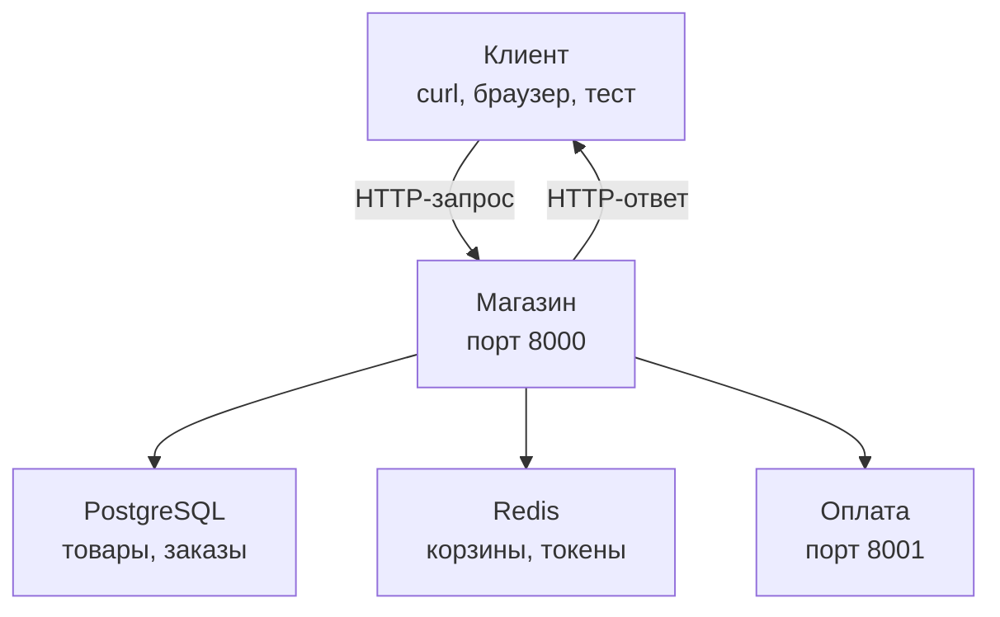
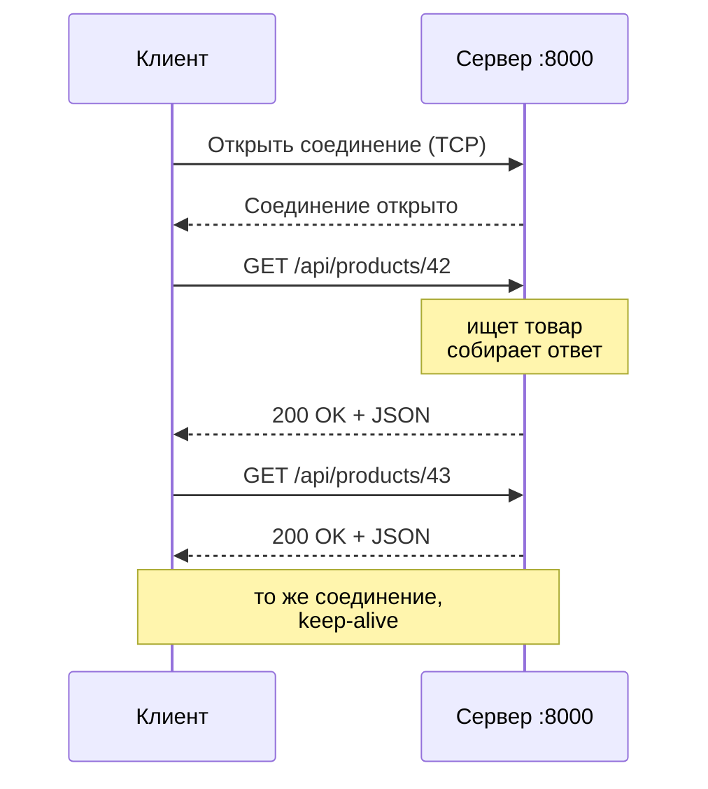
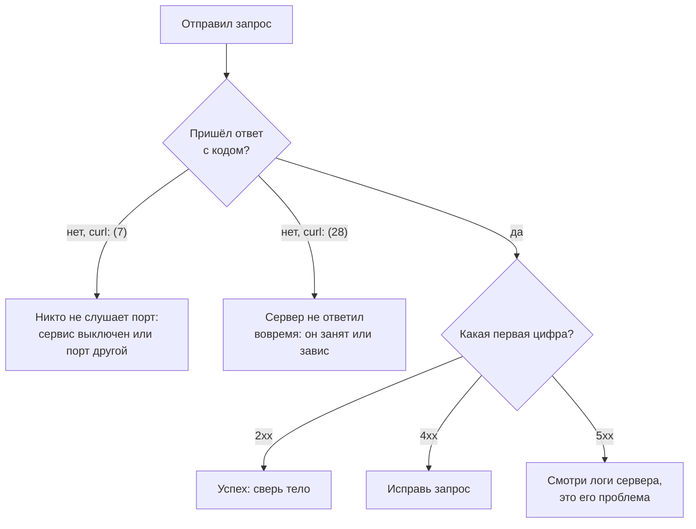

## Зачем это нужно

Я занимаюсь нагрузкой давно и буду рядом весь курс: объяснять то, что сам когда-то учил с нуля. Представь первую неделю на работе в интернет-магазине. До большой распродажи месяц, в прошлом году сайт на ней упал. Приходит жалоба: «сайт долго открывается». Между кликом и страницей на экране есть цепочка обменов. Начнём с первого звена: как одна программа спрашивает, а другая отвечает.

Однажды я принёс команде отчёт теста: «ошибок 3%, почти ничего». Коллега спросил: «А каких?». Я не знал. Все 3% оказались «такого товара нет»: мой скрипт просил номера, которых в магазине не было, а сам магазин работал исправно. Могло быть и наоборот: три процента «магазин сломался», и тогда команда не спала бы ночь. Цифра одна, смысл противоположный. С тех пор я смотрю не сколько ошибок, а какие.

Нагрузочный тест это тысячи одинаковых обращений, и у каждого есть исход. Генератор нагрузки (программа, которая изображает много пользователей) записывает, сколько обращений вернулось с кодом 200, сколько с 500 и сколько длилось каждое. Не зная, что такое запрос, ответ и код, ты не прочтёшь отчёт «ошибок 3%».

Есть и вторая причина. Когда на рабочем сервере что-то ломается, инженер берёт `curl` и руками шлёт такой же запрос, как пользователь. По ответу он за минуту понимает, где искать: магазин молчит, отвечает ошибкой или отвечает верно, но медленно.

Шаг проекта: ты поднимаешь стенд «Магазин» (учебный магазин, который ты тестируешь весь курс), делаешь запросы, записываешь таблицу «запрос → код → что это значит» в `~/perf-lab/02-web/http-codes.md`.

## Что нужно знать

- Терминал, каталоги, `apt`, рабочий каталог `~/perf-lab`: [урок 1.1](../01-linux/01-workstation-terminal.md).
- Что такое порт, `curl` и DNS: [урок 1.4](../01-linux/04-network-cli.md). Здесь мы повторим, что нужно, но подробности там.
- Больше ничего. Docker, веб-серверы и базы объяснять не придётся: в этом уроке ты запустишь стенд по готовому рецепту, а как он устроен, разберём в [теме 5](../05-docker/index.md).

Хочешь то же глубже, с точки зрения администратора сервера: [урок про HTTP в курсе DevOps](https://distinguished-sre.github.io/devops/02-network/04-http.html).

## Картина целиком

Ресторан: ты садишься за стол и говоришь официанту: «Борщ, пожалуйста». Он идёт на кухню и возвращается с борщом или словами «борщ закончился». Разговор всегда начинаешь ты: официант сам ничего не приносит. У заказа есть формат, и у ответа есть понятный исход: принесли, нет такого блюда, на кухне пожар. В интернете устроено так же.

Ты здесь **клиент**: программа, которая спрашивает (браузер, приложение, `curl`, генератор нагрузки). Официант это **сервер**: программа, которая слушает запросы и отвечает. Не обязательно большая машина: на твоём ноутбуке могут работать оба. А **HTTP** (HyperText Transfer Protocol, «протокол передачи гипертекста») это правила обмена: как записать запрос, как записать ответ и что значат числа в ответе.

За «Магазином» на стенде стоят база данных PostgreSQL (хранит товары и заказы), Redis (быстрая память для корзин и токенов входа) и сервис оплаты. Путь запроса выглядит так:



Клиент говорит только с «Магазином»: для него это один адрес и один порт. Что внутри, расскажет [урок 2.3](03-backend-anatomy.md), а сейчас нас интересует стык «клиент и Магазин».

## Теория

### Адрес запроса: из чего состоит URL

Покупатель пишет, что сайт не открывается. Первым делом я спрашиваю: «Какой адрес ты вводил?». Удивительно часто причина в опечатке.

Адрес сайта похож на почтовый (город, улица, дом), только со способом доставки и «вопросами» в конце. Называется он **URL** (Uniform Resource Locator, «единообразный указатель ресурса»). Вот адрес из «Магазина»:

```text
http://localhost:8000/api/products?category_id=3&size=2
└─┬─┘   └────┬────┘└┬─┘└────┬────┘ └────────┬────────┘
схема      хост  порт   путь           параметры
```

Схема (`http`) говорит, по какому протоколу общаться (есть ещё `https`: тот же HTTP, но зашифрованный). Хост (`localhost`) говорит, чей это сервер: имя, которое DNS превращает в IP-адрес ([урок 1.4](../01-linux/04-network-cli.md)), либо сам IP. Имя `localhost` всегда значит «эта же машина», то есть `127.0.0.1`.

Порт (`8000`) это номер «двери» на машине: программ на ней много, и порт показывает, с какой говорить. Не указан: берётся стандартный, 80 для `http` и 443 для `https`. Путь (`/api/products`) отвечает на вопрос «какой ресурс нужен». Параметры (`?category_id=3&size=2`) уточняют: начинаются с `?`, разделяются `&`, каждый записан как `имя=значение`. Здесь мы просим товары категории 3, не больше двух штук.

> **Прикинь сам:** чем адрес `http://localhost:8001/healthz` отличается от `http://localhost:8000/healthz` и что это значит для «Магазина»?
{: .predict}

Хост тот же, порт другой: первый адрес ведёт уже не в магазин, а в сервис оплаты.

Осторожно: параметры не секретны, они видны в адресной строке, логах и истории браузера, поэтому пароли в них не кладут.

> **Главное:** URL это схема, хост, порт, путь и параметры; по ним можно сказать, кого и о чём спрашивают.
{: .key}

Адрес говорит только «куда». А что клиент отправляет по нему?

### Запрос: что клиент отправляет серверу

Сервер не видит клиента: всё, что он знает, это текст. Поэтому у текста стандартная форма, как у бланка заказа в ресторане: любой повар читает его одинаково.

HTTP-запрос состоит из четырёх частей, в таком порядке. Сначала стартовая строка: **метод** (что сделать), путь (над чем) и версия протокола, например `GET /api/products/42 HTTP/1.1`. Дальше **заголовки** (headers): строки вида `Имя: значение` с дополнительными сведениями. Это `Host: localhost:8000` (какому серверу адресовано), `Accept: */*` (какие форматы ответа клиент примет) или `Authorization: Bearer ...` (токен: пропуск, который выдают при входе).

Потом идёт пустая строка: она отделяет заголовки от тела. **Тело** (body) это сами данные, есть оно не у каждого запроса. У «дай товар 42» тела нет, а «зарегистрируй пользователя» передаёт email и пароль: это и есть тело.

Посмотри на живой обмен: выбери сценарий и наведи курсор на строки.

<div class="viz" data-viz="web-http-exchange" data-set="http" data-start="product-ok"></div>

Слева запрос, справа ответ. Первый сценарий это обычный запрос товара: метод `GET`, три заголовка, тела нет. Ответ начинается с кода `200`. Остальные пригодятся у кодов.

Теперь то же у настоящего сервера. Флаг `-v` (verbose, «подробно») заставляет `curl` печатать всё, что уходит и приходит. Строки с `>` отправил ты, с `<` вернул сервер, со `*` это служебные сообщения самого `curl`:

```bash
curl -v http://localhost:8000/healthz
```

```text
*   Trying 127.0.0.1:8000...
* Connected to localhost (127.0.0.1) port 8000
> GET /healthz HTTP/1.1
> Host: localhost:8000
> User-Agent: curl/8.5.0
> Accept: */*
>
< HTTP/1.1 200 OK
< date: Sat, 03 Oct 2026 10:15:02 GMT
< server: uvicorn
< content-length: 15
< content-type: application/json
< x-request-id: 3f9a1c0e7b2d4a58b6c1e90d2f7a4b13
<
{"status":"ok"}
* Connection #0 to host localhost left intact
```

Две строки со `*`: `curl` превратил `localhost` в IP-адрес и «дозвонился» до порта 8000, слов HTTP пока нет. Дальше стартовая строка, три заголовка и одинокая `>`: пустая строка, тела нет, запрос окончен.

Ответ начинается строкой `< HTTP/1.1 200 OK`: версия, **код 200** и слово «OK» для человека (программа смотрит на число). Потом `content-length: 15` (в теле 15 байт), `content-type: application/json` (тело это JSON) и `x-request-id`, номер запроса, который попадёт в лог «Магазина». Дальше пустая строка и тело `{"status":"ok"}`: ровно 15 символов. Последняя строка служебная: соединение осталось открытым для следующих запросов (зачем, расскажу в разделе про соединение).

При чтении вывода сначала ищи статусную строку, это главный результат, потом `content-type` и `content-length`.

> **Прикинь сам:** в запросе `POST /api/orders HTTP/1.1` есть заголовок `Authorization: Bearer abc`. Что здесь действие, а что пропуск?
{: .predict}

Действие записано в стартовой строке: `POST /api/orders` («создать заказ»). Пропуск лежит в заголовке: по токену сервер узнает, чей заказ.

Осторожно: `HTTP/1.1` это версия протокола, а не «Магазина». Регистр заголовков не важен: `Content-Type` и `content-type` одно и то же.

> **Главное:** запрос это текст из стартовой строки, заголовков, пустой строки и необязательного тела.
{: .key}

В стартовой строке стоит слово `GET`. Бывают и другие, и от выбора зависит, безопасно ли действие для данных.

### Методы: что именно сделать

Один адрес `/api/cart/items` нужен для разных дел: посмотреть корзину, добавить товар, убрать. Как сервер поймёт, чего ты хочешь? По глаголу запроса. Он называется метод.

В библиотеке тоже один шкаф и разные действия: взять почитать, сдать книгу, выбросить. У сервера их несколько стандартных, нам нужны три. `GET` читает (`GET /api/products/42`), `POST` создаёт или выполняет действие (`POST /api/orders`), `DELETE` удаляет (`DELETE /api/cart/items/5`). Ещё есть `PUT` («заменить целиком») и `PATCH` («изменить часть»): в «Магазине» они не используются, но в других сервисах ты их встретишь.

У методов два свойства, важных нагрузочнику. Первое: `GET` **безопасен**, он не меняет данные. Сколько ни отправляй, ничего не сломаешь, поэтому нагружать каталог безвредно.

Второе свойство называется **идемпотентность** (idempotency): метод можно повторить много раз, и результат будет тот же, что от одного раза. После `DELETE /api/cart/items/5` позиции нет в корзине, после второго такого же запроса её тоже нет. А `POST /api/orders` не идемпотентен: два запроса создадут два заказа.

Зачем это знать? Запрос иногда теряется, и клиент отправляет его снова (повтор называют ретраем, retry). Повтор `GET` безопасен, повтор `POST` может задвоить заказ. «Магазин» от дублей не защищён: повторная отправка создаёт новый заказ, если в корзине что-то есть.

> **Прикинь сам:** ты нагружаешь `GET /api/products` и `POST /api/orders`. Какой тест опасен для данных на стенде?
{: .predict}

Второй: каждый успешный `POST` создаёт заказ, списывает товар со склада и очищает корзину. Тысячи таких запросов заполнят базу и уменьшат остатки, поэтому стенд для таких тестов должен сбрасываться (`docker compose down -v`).

Осторожно: `POST` не всегда создаёт. `POST /api/login` ничего не создаёт в базе (токен ложится в Redis): это действие «войти».

> **Главное:** `GET` читает и безопасен, `POST` меняет данные и повторять его опасно, `DELETE` меняет, но повтор безвреден.
{: .key}

Спрашивать мы умеем. Что значит ответ?

### Ответ и коды статуса

Генератор сообщает: «20% ответов не успешны». Кто виноват, сервис или тест? Читать для этого слова в теле долго, поэтому исход записан числом.

Ответ устроен как запрос, только первая строка статусная (версия, код, пояснение). **Код статуса** (status code) это число из трёх цифр, ты уже видел «код ответа» в логах ([урок 1.2](../01-linux/02-text-logs.md)). Тело в API «Магазина» (наборе адресов для программ) это JSON, формат данных текстом ([урок 2.2](02-rest-json-auth.md)): `{"status":"ok"}` читается как «поле `status` равно `ok`».

Первая цифра кода это семейство, и она отвечает на вопрос «кто и что». Как в сообщениях доставки: «доставлено» (2xx), «едем по новому адресу» (3xx), «вы неверно указали адрес» (4xx), «авария на складе» (5xx). Коды 1xx служебные, их почти не видно.

Вот почему это главное в отчёте. Растут 4xx: чаще всего сломан твой тест (неверные данные, протухшие токены). Растут 5xx: ломается сервис, и это находка, ради которой нагрузку и затевали.

В «Магазине» успех бывает трёх видов: `200 OK` (прочитал или вошёл), `201 Created` (создано что-то новое) и `204 No Content` (успех без тела, например удалили из корзины). Из ошибок клиента чаще всего `404` и `422`. Флаг `-i` печатает заголовки ответа вместе с телом, это короче, чем `-v`:

```bash
curl -i http://localhost:8000/api/products/999999
```

```text
HTTP/1.1 404 Not Found
date: Sat, 03 Oct 2026 10:16:40 GMT
server: uvicorn
content-length: 30
content-type: application/json
x-request-id: 8a41d6f2c9e04b7d9f10a2b3c4d5e6f7

{"detail":"product not found"}
```

Сервер жив и понял запрос, но товара 999999 нет (причину «Магазин» пишет в `detail`). Виноват клиент.

```bash
curl -i 'http://localhost:8000/api/products?size=500'
```

```text
HTTP/1.1 422 Unprocessable Content
date: Sat, 03 Oct 2026 10:17:11 GMT
server: uvicorn
content-length: 143
content-type: application/json
x-request-id: 51c0b7aa2d3e4f6081928374a5b6c7d8

{"detail":[{"type":"less_than_equal","loc":["query","size"],"msg":"Input should be less than or equal to 100","input":"500","ctx":{"le":100}}]}
```

Путь верный, но параметр `size` (сколько товаров на странице) допускает максимум 100, а ты попросил 500. В `loc` сказано, где ошибка (`query` значит «в параметрах адреса»), в `msg` причина.

Вернись к виджету и нажми сценарии `404 нет товара`, `405 метод`, `422 параметр`, `401 без токена`, `503 нет Redis` и `нет ответа`: в каждом посмотри, кто виноват. Адрес `/api/products/` с лишним слэшем сервер перенаправляет на `/api/products` кодом `307`.

> **Прикинь сам:** генератор сообщил «20% ответов 404». Проблема сервиса или теста?
{: .predict}

Скорее теста: скрипт просит то, чего нет (устаревшие номера, опечатка в пути). Но сравни с одиночным запросом: если он даёт 200, а 404 только под нагрузкой, что-то теряется.

Осторожно: 401 и 403 путают. 401 значит «не знаю, кто ты» (токена нет или он неверный), 403 «знаю, но тебе нельзя». В «Магазине» везде 401. И ловушка: в плохих API бывает «200, а в теле `error: true`». Генератор считает такой ответ успешным, поэтому проверяй и тело ([тема 6](../06-api-testing/index.md)).

<details markdown="1">
<summary>Для любопытных: остальные коды «Магазина»</summary>

Все адреса API в [README стенда](https://github.com/distinguished-sre/load-tester/blob/main/project/shop/README.md).

| Код | Название | Когда в «Магазине» |
|---|---|---|
| 400 | Bad Request | Заказ с пустой корзиной (правило магазина; 422 даёт автоматическая проверка формата) |
| 401 | Unauthorized | Нет токена, он неверный или просрочен; неверный пароль |
| 405 | Method Not Allowed | Метод не подходит адресу (например, `DELETE` на товар) |
| 409 | Conflict | Email уже занят; на складе мало товара |
| 502 | Bad Gateway | Сервис оплаты ответил отказом |
| 503 | Service Unavailable | Магазин не готов: недоступна база или Redis, нет соединения с базой |
| 504 | Gateway Timeout | Оплата не ответила вовремя |

У 404 два смысла: `Not Found` в `detail` значит «адреса нет совсем», `product not found` «адрес верный, объекта нет».

</details>

> **Главное:** первая цифра кода говорит, в чьей стороне искать: 4xx в запросе и тесте, 5xx на сервере.
{: .key}

Мы считали, что ответ пришёл. А если нет? Сначала посмотрим, как запрос добирается.

### Соединение: что происходит до запроса

HTTP описывает только формат сообщений. Доставляет их TCP ([урок 1.4](../01-linux/04-network-cli.md)): он следит, чтобы байты дошли целыми и по порядку. Перед первым запросом клиент и сервер «здороваются» и открывают соединение. Это как телефонный звонок: набрал номер, дождался «алло», и можно говорить несколько фраз подряд, не перезванивая:



Открытие соединения стоит времени, поэтому запросы пускают по нему подряд. Это называется **keep-alive** («держи живым»): та последняя строка в выводе `curl -v`. Тест, который открывает новое соединение на каждый запрос, измеряет не то же, что реальный покупатель в браузере ([урок 8.3](../08-perf-theory/03-test-types.md)).

Осторожно: HTTP говорит, **что** лежит в сообщении, TCP отвечает, **как** оно доедет. Поэтому ошибки двух уровней: «не дозвонились» (кода нет) и «дозвонились, но ответили ошибкой» (код есть).

<details markdown="1">
<summary>Для любопытных: https и заголовок Host</summary>

Для `https` добавляется шифрование (TLS): договариваются о ключах. На стенде его нет.

Заголовок `Host` нужен потому, что на одном IP-адресе и порту живут много сайтов, и по `Host` сервер понимает, какому адресован запрос.

</details>

> **Главное:** HTTP это формат сообщений, TCP доставляет их, а keep-alive избавляет от нового соединения на каждый запрос.
{: .key}

А если соединение не открылось?

### Когда ответа нет вовсе

Иногда не приходит ничего. Это ошибка соединения, а не HTTP, и чинится она в другом месте. Если вместо кода ты видишь сообщение самого `curl`, причин три. `curl: (7) Failed to connect to localhost port 8000 ... Connection refused`: по этому адресу и порту никто не слушает, сервис остановлен или ты ошибся портом. Отказ приходит мгновенно: «здесь никого нет». `curl: (28) Operation timed out`: сервер не ответил за отведённое время. В отличие от (7), он, возможно, жив и просто занят. `curl: (6) Could not resolve host`: не удалось превратить имя в IP-адрес (DNS или опечатка в имени).

Код выхода последней команды лежит в `$?` ([урок 1.5](../01-linux/05-bash-scripts.md)): `0` успех, а у ошибок `curl` он равен их номеру, при отказе будет `7`.

Вместе это дерево решений:



> **Главное:** нет кода значит проблема соединения (`curl: (7)` никто не слушает, `(28)` не дождались), есть код значит смотри на первую цифру.
{: .key}

Осталось связать всё это с работой нагрузочника.

### Что из этого нужно нагрузочнику

Вернёмся к жалобе «сайт долго открывается». Каждый запрос генератора нагрузки это такой же текст, как тот, что ты видел. По каждому он записывает код, время от отправки до конца ответа и размер. Из них строятся главные числа теста: доля ошибок, задержка (сколько ждали) и пропускная способность (сколько ответов в секунду), подробно в [уроке 8.1](../08-perf-theory/01-latency-throughput.md).

Отсюда три привычки. Перед нагрузкой я шлю один запрос руками (`curl -i`) и проверяю код и тело. Успехом считаю только ожидаемое: `200` для чтения, `201` для создания. Ошибки в отчёте делю по семействам: 4xx это вопросы к тесту, 5xx к сервису, отсутствие ответа к соединению. На вопрос «каких?» есть ответ.

> **Главное:** запрос, ответ и код это то, из чего генератор считает ошибки; различай их по семействам кода.
{: .key}

## Практика

### 1. Подготовь рабочий каталог

```bash
mkdir -p ~/perf-lab/02-web
cd ~/perf-lab/02-web
pwd
```

```text
/home/student/perf-lab/02-web
```

В этом каталоге будут лежать твои заметки и скрипты темы 2. Подробности про `mkdir -p` и `cd` в [уроке 1.1](../01-linux/01-workstation-terminal.md).

### 2. Установи Docker Engine

Дальше самый долгий участок урока (шаги 2 и 3 вместе: 15-40 минут, в основном ожидание загрузки). Нужно: 8 ГБ оперативной памяти, 10 ГБ свободного места на диске и доступ в интернет. Если машина слабее, остановись и не запускай сборку: стенд на ней будет тормозить, а числа в следующих темах не сойдутся. Если сейчас не хватает времени, дочитай урок до конца и вернись к шагам 2 и 3 в другой вечер.

Стенд «Магазин» состоит из нескольких программ (магазин, оплата, база PostgreSQL, Redis). Чтобы не ставить их по отдельности, мы запускаем всё через Docker. Что такое Docker и как он работает, мы подробно разберём в [теме 5](../05-docker/index.md), сейчас нужен только рецепт: установи и запусти по шагам. Команды ставят Docker Engine из официального репозитория Docker (его адрес и ключ проверки подлинности пакетов добавляются в систему):

```bash
sudo apt update
sudo apt install -y ca-certificates curl
sudo install -m 0755 -d /etc/apt/keyrings
sudo curl -fsSL https://download.docker.com/linux/ubuntu/gpg -o /etc/apt/keyrings/docker.asc
sudo chmod a+r /etc/apt/keyrings/docker.asc
```

Что делают команды: первая и вторая готовят `apt` (обновляют список пакетов, ставят то, что нужно для безопасного скачивания). `install -d` создаёт каталог для ключей с нужными правами. `curl -fsSL ... -o файл` скачивает ключ: `-f` (fail) не сохранять страницу с ошибкой, `-s` (silent) без индикатора, `-S` показывать ошибки, `-L` идти по перенаправлениям (те самые 3xx), `-o` сохранить в файл. Ключ нужен, чтобы `apt` мог проверить, что пакеты действительно от Docker.

Теперь добавь репозиторий (источник пакетов). Команда `tee` записывает текст в файл, а `sudo` нужен, потому что файл лежит в системном каталоге; `$(...)` подставляет кодовое имя твоей версии Ubuntu (`noble` для 24.04):

```bash
sudo tee /etc/apt/sources.list.d/docker.sources <<EOF
Types: deb
URIs: https://download.docker.com/linux/ubuntu
Suites: $(. /etc/os-release && echo "${UBUNTU_CODENAME:-$VERSION_CODENAME}")
Components: stable
Signed-By: /etc/apt/keyrings/docker.asc
EOF
sudo apt update
sudo apt install -y docker-ce docker-ce-cli containerd.io docker-buildx-plugin docker-compose-plugin
```

И добавь себя в группу `docker`, иначе каждую команду пришлось бы писать с `sudo`:

```bash
sudo usermod -aG docker $USER
```

`usermod -aG docker $USER` добавляет (`-a`) твоего пользователя (`$USER`, переменная окружения с твоим именем) в группу (`-G`) `docker`. Группа даёт право общаться с Docker. **Изменение групп применяется только в новом сеансе**: закрой терминал и открой заново (в WSL2 закрой окно Ubuntu и открой снова), либо выполни `newgrp docker` в текущем окне. Если Ubuntu у тебя в WSL2 и служба Docker не запущена (`Cannot connect to the Docker daemon`), запусти её командой `sudo service docker start`.

Проверь:

```bash
docker --version
docker compose version
docker run --rm hello-world
```

```text
Docker version 29.0.1, build 3f5a7c2
Docker Compose version v2.40.3
Unable to find image 'hello-world:latest' locally
latest: Pulling from library/hello-world
...
Hello from Docker!
This message shows that your installation appears to be working correctly.
```

**Как читать вывод:** номера версий у тебя будут свои, главное, что команды отвечают. `hello-world` это крошечная программа: Docker скачал её, запустил, она напечатала приветствие и завершилась (`--rm` удаляет её после выхода). Если ты видишь «Hello from Docker!», Docker работает.

**Типичные ошибки:**

- `permission denied while trying to connect to the Docker daemon socket at unix:///var/run/docker.sock`: ты ещё не перелогинился после `usermod`. Закрой терминал и открой заново или выполни `newgrp docker`. Проверить, что группа применилась, можно командой `groups`: в списке должно быть слово `docker`.
- `E: The repository 'https://download.docker.com/linux/ubuntu ... Release' does not have a Release file`: для твоей версии Ubuntu пакетов в репозитории Docker пока нет (так бывает у только что вышедших версий). Открой файл `/etc/apt/sources.list.d/docker.sources` и замени имя в строке `Suites:` на `noble`, затем снова `sudo apt update`.
- `Could not get lock /var/lib/dpkg/lock-frontend`: другой установщик ещё работает, подожди пару минут.

### 3. Скачай и запусти стенд

```bash
git clone https://github.com/distinguished-sre/load-tester.git ~/load-tester
cd ~/load-tester/project/shop
cp .env.example .env
docker compose up -d --build --wait
```

Разбор:

- `git clone адрес папка` скачивает копию репозитория курса в `~/load-tester`. Нам нужна папка `project/shop` с описанием стенда. Подробнее про git: [тема 3](../03-git/index.md).
- `cp .env.example .env` копирует файл с настройками стенда. Файл `.env` это набор настроек (порты, пароли, размеры пулов), которые стенд прочитает при запуске. Пока ничего в нём не меняй.
- `docker compose up -d --build --wait`: «подними всё, что описано в `compose.yaml`». `-d` (detach) запустить в фоне и вернуть терминал, `--build` собрать образы магазина и оплаты из исходников, `--wait` дождаться, пока все сервисы сообщат, что они здоровы. Что такое образ, контейнер и `compose`, расскажет [тема 5](../05-docker/index.md).

Первый запуск долгий: Docker скачивает базовые образы и собирает программы, а база при создании заполняется данными (20 категорий, 10 000 товаров, 1000 пользователей, 200 000 заказов). Подожди от 2 до 6 минут, это нормально. Ожидаемый конец вывода:

```text
[+] Running 6/6
 ✔ Network shop_default       Created
 ✔ Volume shop_pgdata         Created
 ✔ Container shop-redis-1     Healthy
 ✔ Container shop-payment-1   Healthy
 ✔ Container shop-postgres-1  Healthy
 ✔ Container shop-shop-1      Healthy
```

**Как читать вывод:** `Healthy` у каждого контейнера (контейнер это запущенный экземпляр сервиса) значит, что встроенная проверка здоровья прошла. Если какой-то остался `Starting` или `Unhealthy`, команда завершится с ошибкой, смотри ниже. Первые две строки (сеть и том для данных) создаются один раз.

Проверь, что стенд отвечает:

```bash
curl -s localhost:8000/readyz
```

```text
{"status":"ready"}
```

`/readyz` («готов ли ты работать») магазин проверяет сам: он обращается к базе и к Redis, и только если оба ответили, возвращает `ready`. Теперь можно впервые запустить на настоящем «Магазине» свой скрипт из [урока 1.5](../01-linux/05-bash-scripts.md): `~/perf-lab/scripts/check-stand.sh`. До этого он проверял учебный сервер из файлов, теперь на каждой из пяти строк должно быть `OK`, а код выхода 0 (`echo $?`). Если в одной из них `SLOW`, это холодный старт, повтори запуск.

Посмотреть все запущенные сервисы:

```bash
docker compose ps
```

```text
NAME               IMAGE            COMMAND                  SERVICE    STATUS                   PORTS
shop-payment-1     shop-payment     "uvicorn main:app ..."   payment    Up 3 minutes (healthy)   127.0.0.1:8001->8001/tcp
shop-postgres-1    postgres:18.6    "docker-entrypoint.s…"   postgres   Up 3 minutes (healthy)   5432/tcp
shop-redis-1       redis:8.10.2     "docker-entrypoint.s…"   redis      Up 3 minutes (healthy)   6379/tcp
shop-shop-1        shop-shop        "./entrypoint.sh"        shop       Up 3 minutes (healthy)   127.0.0.1:8000->8000/tcp
```

**Как читать вывод:** четыре сервиса, у каждого `(healthy)`. В колонке `PORTS` видно, какой порт машины ведёт к какому сервису: `127.0.0.1:8000->8000` значит «порт 8000 твоей машины это порт 8000 внутри сервиса». Ты стучишься на `localhost:8000`, а попадаешь в «Магазин».

**Типичные ошибки:**

- `permission denied ... docker.sock`: см. выше, нужен новый сеанс.
- `Bind for 127.0.0.1:8000 failed: port is already allocated` (или `address already in use`): порт занят другой программой. Найди её: `sudo ss -ltnp 'sport = :8000'`, в последней колонке будет имя процесса. Останови его или освободи порт. Чаще всего это старый запуск стенда: `docker ps` покажет, и тогда `docker compose down` в его каталоге.
- `no space left on device`: закончилось место. Проверь `df -h /` (команда из [урока 1.1](../01-linux/01-workstation-terminal.md)). Освободи минимум 10 ГБ, старые образы можно удалить `docker system prune`, это безопасно для стенда.
- `docker compose up` ждёт и падает по времени, а `shop-postgres-1` остаётся `starting`: база ещё заполняется данными, на медленном диске это до нескольких минут. Подожди, повтори `docker compose up -d --wait`. Прогресс видно в логах: `docker compose logs -f postgres` (выйти: `Ctrl+C`).
- `curl: (7) Failed to connect ... Connection refused` сразу после запуска: сервис ещё стартует. Подожди 10 секунд и повтори.

Остановить стенд: `docker compose down` (данные базы сохранятся). Остановить и стереть всё, включая данные: `docker compose down -v`. Следующий запуск после `down -v` снова будет долгим, потому что база заполняется заново. Команды выполняются из `~/load-tester/project/shop`.

### 4. Прочитай запрос и ответ построчно

Ты уже видел `curl -v` в теории. Повтори сам и найди все части: стартовую строку, заголовки, пустую строку, тело.

```bash
curl -v http://localhost:8000/api/categories 2>&1 | head -n 25
```

Здесь `2>&1` объединяет служебный вывод `curl` (он идёт в «поток ошибок») с обычным, а `| head -n 25` оставляет первые 25 строк. Ожидаемый вывод по структуре такой же, как раньше, но тело длиннее:

```text
> GET /api/categories HTTP/1.1
> Host: localhost:8000
...
< HTTP/1.1 200 OK
< content-type: application/json
...
[{"id":1,"name":"Категория 1"},{"id":2,"name":"Категория 2"}, ...
```

Ответь себе: сколько здесь заголовков запроса? есть ли тело у запроса? какой метод? что вернулось в `content-length`?

### 5. Получи товар и разбери его через `jq`

```bash
curl -s http://localhost:8000/api/products/42
```

```text
{"id":42,"name":"Товар 42","price":1654.0,"category_id":2,"stock":1000000}
```

Одной строкой читать неудобно. Программа `jq` форматирует JSON (подробно в [уроке 2.2](02-rest-json-auth.md)). Здесь `|` («труба») передаёт вывод `curl` на вход `jq`, а `.` значит «покажи всё как есть, красиво»:

```bash
curl -s http://localhost:8000/api/products/42 | jq .
```

```text
{
  "id": 42,
  "name": "Товар 42",
  "price": 1654.0,
  "category_id": 2,
  "stock": 1000000
}
```

**Как читать вывод:** у товара пять полей. `price` цена в условных единицах, `stock` остаток на складе (миллион на старте). `category_id` номер категории, список категорий лежит в `/api/categories`.

Параметры адреса: два товара первой страницы и общее число:

```bash
curl -s 'http://localhost:8000/api/products?size=2' | jq .
```

```text
{
  "items": [
    { "id": 1, "name": "Товар 1", "price": 137.0, "category_id": 1, "stock": 1000000 },
    { "id": 2, "name": "Товар 2", "price": 174.0, "category_id": 2, "stock": 1000000 }
  ],
  "page": 1,
  "size": 2,
  "total": 10000
}
```

(`jq` на самом деле раскладывает каждое поле на отдельную строку, здесь объекты сокращены в одну для компактности.) Кавычки вокруг адреса обязательны: символ `?` и `&` оболочка иначе поймёт по-своему (`&` запускает команду в фоне).

### 6. Собери коллекцию ответов: 200, 404, 405, 422

Чтобы не писать длинные команды, воспользуйся флагами `curl`: `-s` (тихо), `-o /dev/null` (выбросить тело), `-w` (напечатать по шаблону после запроса). Шаблон `%{http_code}` подставляет код ответа:

```bash
for path in /api/products/42 /api/products/999999 /api/product/42 '/api/products?size=500' /api/products/; do
  code=$(curl -s -o /dev/null -w '%{http_code}' "http://localhost:8000$path")
  echo "$code  GET $path"
done
```

```text
200  GET /api/products/42
404  GET /api/products/999999
404  GET /api/product/42
422  GET /api/products?size=500
307  GET /api/products/
```

Разбор: `for ... in ...; do ...; done` повторяет блок для каждого пути из списка (подробно в [уроке 1.5](../01-linux/05-bash-scripts.md)), `$(...)` подставляет результат команды в переменную `code`. Пять строк это пять разных историй: успех, нет объекта, нет адреса, неверный параметр, переадресация.

Метод `DELETE` на товар и маршрут с переадресацией:

```bash
curl -i -X DELETE http://localhost:8000/api/products/42
```

```text
HTTP/1.1 405 Method Not Allowed
date: Sat, 03 Oct 2026 10:20:05 GMT
server: uvicorn
allow: GET
content-length: 31
content-type: application/json
x-request-id: 0b6e4c2d91a84f3aa7d2e5b8c1f09a64

{"detail":"Method Not Allowed"}
```

`-X DELETE` заменяет метод. Заголовок `allow: GET` подсказывает, что для этого адреса разрешён только `GET`.

```bash
curl -i http://localhost:8000/api/products/
curl -iL http://localhost:8000/api/products/ | head -n 12
```

Первая команда покажет `307 Temporary Redirect` и заголовок `location: http://localhost:8000/api/products`, тела нет (`content-length: 0`). Вторая с `-L` (follow, «иди по перенаправлению») сама сходит по новому адресу и покажет оба ответа подряд: сначала 307, затем 200 с каталогом.

### 7. Сними время и размер ответа

Помнишь, что для нагрузочника важны код, время и размер? Получи все три одной командой:

```bash
curl -s -o /dev/null -w 'код=%{http_code} время=%{time_total}с размер=%{size_download}байт\n' http://localhost:8000/api/products/42
```

```text
код=200 время=0.011802с размер=79байт
```

`%{time_total}` это полное время запроса в секундах, `%{size_download}` размер тела. Запусти эту команду пять раз и обрати внимание: первый запрос может быть заметно медленнее остальных (прогрев соединения и кэшей), а числа никогда не одинаковые. Это нормально, одно измерение ничего не доказывает, к этому мы вернёмся в [уроке 8.1](../08-perf-theory/01-latency-throughput.md).

### 8. Запиши таблицу кодов

Создай файл с заметками. Он пригодится как шпаргалка и как первый документ твоего портфолио:

```bash
cat > ~/perf-lab/02-web/http-codes.md <<'EOF'
# Коды ответов «Магазина»: что я видел сам

| Запрос | Код | Кто виноват | Что значит |
|---|---|---|---|
| GET /api/products/42 | 200 | никто | товар найден |
| GET /api/products/999999 | 404 | клиент | нет такого товара |
| GET /api/product/42 | 404 | клиент | нет такого адреса (опечатка) |
| GET /api/products?size=500 | 422 | клиент | параметр вне допустимых границ |
| DELETE /api/products/42 | 405 | клиент | метод не разрешён для адреса |
| GET /api/products/ | 307 | никто | перенаправление на адрес без слэша |
EOF
cat ~/perf-lab/02-web/http-codes.md
```

Строка `<<'EOF'` до слова `EOF` передаёт блок текста как есть. Файл пополняй по ходу темы. Коммитить пока ничего не нужно: git появится в [теме 3](../03-git/index.md).

> Ответ стенда не тот, что в уроке? Сначала сравни код, заголовки и тело сам, потом покажи нейросети полный вывод `curl -i` и спроси, чем он отличается от ожидаемого.
{: .ai}

## Сломай и почини

**Поломка 1.** Остановим Redis (хранилище корзин и токенов) и посмотрим, как это видят разные проверки. Из каталога `~/load-tester/project/shop`:

```bash
docker compose stop redis
curl -s -o /dev/null -w 'healthz: %{http_code}\n' localhost:8000/healthz
curl -s -w '\nreadyz: %{http_code}\n' localhost:8000/readyz
curl -s -o /dev/null -w 'товар: %{http_code}\n' localhost:8000/api/products/42
curl -s -w '\nвход: %{http_code}\n' localhost:8000/api/login -H 'Content-Type: application/json' -d '{"email":"user0001@shop.lab","password":"password"}'
```

**Задача.** Сначала ответь сам: какой код вернёт каждая из четырёх проверок и почему они могут отличаться? Подсказка: вспомни, что значит `healthz` и `readyz` и какие запросы используют Redis. Затем найди причину по ответам и верни стенд к жизни.

<details markdown="1">
<summary>Разбор</summary>

```text
healthz: 200

{"detail":{"unavailable":["redis"]}}
readyz: 503
товар: 200

{"detail":"internal server error"}
вход: 500
```

- `healthz` отвечает 200: он проверяет только то, что сама программа «Магазин» жива, и никуда не ходит. Это проверка «процесс работает».
- `readyz` вернул 503 с телом `{"detail":{"unavailable":["redis"]}}`: он обращается к зависимостям и честно сообщает, что недоступен именно Redis. Так отличают «жив» от «готов принимать трафик». Балансировщик убрал бы такой экземпляр из работы.
- Товар по-прежнему 200: чтение карточки идёт только в PostgreSQL, Redis ему не нужен (кэш карточек выключен по умолчанию).
- Вход вернул 500: при входе «Магазин» сохраняет токен в Redis, не смог и упал. Это 5xx, виноват сервер и его зависимость, а не клиент.

Вывод для нагрузочника: одна упавшая зависимость ломает не все запросы, а определённые. Если под нагрузкой растёт доля 5xx только на `/api/login`, ищи то, что используется только там.

Чини:

```bash
docker compose start redis
curl -s localhost:8000/readyz
```

Должно вернуться `{"status":"ready"}`. Тот же код по-прежнему работает, потому что сам «Магазин» не перезапускался, он переподключился к Redis при первом обращении.

</details>

**Поломка 2.** Теперь остановим сам «Магазин»:

```bash
docker compose stop shop
curl -s -o /dev/null -w 'код: %{http_code}\n' localhost:8000/healthz; echo "curl вышел с кодом $?"
```

**Задача.** Что напечатают две строки и чем этот случай отличается от предыдущего? Верни стенд к жизни и дождись, пока проверка здоровья пройдёт.

<details markdown="1">
<summary>Разбор</summary>

```text
код: 000
curl вышел с кодом 7
```

(`curl -s` скрывает текст ошибки, но код выхода остаётся.) Код `000` значит: HTTP-кода нет, потому что ответа не было. Выход `7`: «Connection refused», по адресу никто не слушает. Это не ошибка HTTP, а отсутствие сервера. В предыдущей поломке сервер отвечал и объяснял проблему кодом 503, здесь он молчит.

Чини и проверяй:

```bash
docker compose start shop
docker compose ps
curl -s localhost:8000/readyz
```

Через 10–20 секунд `shop` станет `healthy`, `readyz` вернёт `ready`. Если что-то пошло совсем не так, `docker compose down && docker compose up -d --wait` пересоздаст стенд, а данные базы сохранятся.

</details>

## ИИ в помощь

Нейросеть хорошо объясняет HTTP-заголовки и коды, а вывод `curl -v` читает быстрее новичка. Общие правила на странице [ИИ-помощник](../ai.md).

**Задача:** прочитать запрос и ответ `curl -v` по строкам.

```text
Я учу HTTP. Вот вывод curl -v к моему локальному стенду «Магазин» (порт 8000):
<вставь вывод curl -v>
Разбери построчно: строка запроса, каждый заголовок запроса и ответа, код. Что значит каждое поле? Что в ответе важно для нагрузочного тестирования?
```
{: .wrap}

**Проверь ответ:** сверь с выводом `curl -i` на стенде и таблицей кодов из урока. Типичная ошибка: путаница 401 и 403 или «ошибка сервера» про код 404: 4xx это ошибки клиента, 5xx сервера.

**Задача:** разобрать JSON ответа через `jq`.

```text
Ответ `GET /api/products/1` стенда:
<вставь JSON>
Напиши команду jq, которая достанет название и цену, и объясни фильтр по частям. Какие поля могут отсутствовать?
```
{: .wrap}

**Проверь ответ:** запусти команду на настоящем ответе стенда. Типичная ошибка: выдуманные имена полей (бери реальные из ответа) и фильтры в синтаксисе другой версии: смотри `jq --help`.

## Словарик урока

| Термин | Простыми словами |
|---|---|
| Клиент (client) | Программа, которая отправляет запросы: браузер, `curl`, генератор нагрузки |
| Сервер (server) | Программа, которая слушает запросы и отвечает на них |
| HTTP | Правила, по которым клиент и сервер записывают запросы и ответы |
| URL | Адрес ресурса: схема, хост, порт, путь, параметры |
| Параметры запроса (query) | Часть адреса после `?`: уточнения вида `имя=значение` |
| Метод (method) | Глагол запроса: `GET` прочитать, `POST` создать или выполнить, `DELETE` удалить |
| Заголовок (header) | Строка `Имя: значение` с описанием сообщения |
| Тело (body) | Данные запроса или ответа, обычно JSON |
| Код статуса (status code) | Число из трёх цифр, исход запроса; первая цифра задаёт семейство |
| 2xx, 3xx, 4xx, 5xx | Успех; иди по другому адресу; ошибка клиента; ошибка сервера |
| Безопасный метод | Метод, который не меняет данные: `GET` |
| Идемпотентность (idempotency) | Повтор запроса даёт тот же результат, что и один запрос |
| TCP | Протокол, который доставляет байты целыми и по порядку, под HTTP |
| Keep-alive | Одно соединение держат открытым для многих запросов |
| `healthz`, `readyz` | Проверки «процесс жив» и «готов принимать запросы вместе с зависимостями» |
| Connection refused | Ошибка соединения: по адресу и порту никто не слушает |

## Вопросы с собеседований

Раздел для повторения: ответь вслух, потом открой ответ. Короткие вопросы тренируй на скорость: ответ за 30 секунд.

### 1. [junior] [часто] Чем отличаются коды 4xx и 5xx?

<details markdown="1">
<summary>Ответ</summary>

4xx это ошибка клиента: запрос неверный (нет прав, нет такого объекта, плохие данные), и повтор без изменений не поможет. 5xx это ошибка сервера: запрос был корректный, но сервер или его зависимость (база, оплата) не справились, повтор позже может сработать. При нагрузочном тесте рост 5xx говорит о проблеме сервиса, рост 4xx чаще о проблеме теста.

**Что хотят услышать:** кто виноват, можно ли повторять, как это использовать при анализе теста.

**Красный флаг:** «4xx это ошибки, 5xx тоже ошибки, разницы нет».

</details>

### 2. [junior] [часто] Из чего состоит HTTP-запрос?

<details markdown="1">
<summary>Ответ</summary>

Из стартовой строки (метод, путь, версия протокола), заголовков (`Имя: значение`), пустой строки и необязательного тела. Метод говорит, что сделать, путь над чем, заголовки передают служебные сведения (хост, формат, токен), тело содержит данные, например JSON для регистрации.

**Что хотят услышать:** все четыре части и пример заголовка.

**Красный флаг:** путает запрос с ответом или считает, что тело есть всегда.

</details>

### 3. [junior] [часто] Чем `GET` отличается от `POST`?

<details markdown="1">
<summary>Ответ</summary>

`GET` читает данные и ничего не меняет, его можно безопасно повторять и кэшировать, данных в теле у него обычно нет. `POST` отправляет данные и выполняет действие: создаёт заказ, регистрирует пользователя; повтор `POST` может повторить действие и создать дубль. Поэтому нагрузку по `POST` генерируют аккуратнее: она меняет данные.

**Что хотят услышать:** безопасность и идемпотентность, пример побочного эффекта.

**Красный флаг:** «`GET` для получения, `POST` для отправки, и всё».

</details>

### 4. [junior] Что означает код 401 и чем он отличается от 403?

<details markdown="1">
<summary>Ответ</summary>

401 значит «не знаю, кто ты»: токена нет, он неверный или просрочен, нужно войти заново. 403 значит «знаю, кто ты, но тебе нельзя»: личность установлена, прав на действие нет. Лечится 401 получением нового токена, 403 выдачей прав или другим пользователем.

**Что хотят услышать:** различие между аутентификацией (кто ты) и авторизацией (что тебе можно).

**Красный флаг:** считает 401 и 403 одним и тем же.

</details>

### 5. [junior] Что такое идемпотентный метод и зачем это знать нагрузочнику?

<details markdown="1">
<summary>Ответ</summary>

Метод, повтор которого даёт тот же результат, что один запрос: `GET`, `PUT`, `DELETE`. `POST` обычно не идемпотентен: два повтора создадут два заказа. Это важно, когда клиент повторяет запрос после таймаута: идемпотентные запросы повторять безопасно, неидемпотентные могут задвоить действие. Нагрузочник должен понимать, какие запросы можно повторять в тесте без искажения данных и какие ретраи опасны.

**Что хотят услышать:** примеры методов, связь с ретраями и дублями.

**Красный флаг:** путает идемпотентность и безопасность (`DELETE` идемпотентен, но не безопасен).

</details>

### 6. [junior] Что такое keep-alive и почему он важен при нагрузочном тесте?

<details markdown="1">
<summary>Ответ</summary>

Это повторное использование одного TCP-соединения для многих запросов. Открытие соединения (а для HTTPS ещё и шифрования) стоит времени и ресурсов. Реальные браузеры и клиенты держат соединения открытыми. Если генератор нагрузки открывает новое соединение на каждый запрос, он нагружает сервер иначе и показывает худшее время, чем увидят пользователи. Поэтому настройку соединений генератора нужно сверять с реальным клиентом.

**Что хотят услышать:** цена открытия соединения и влияние на результаты теста.

**Красный флаг:** «keep-alive это постоянная связь по сети с сервером».

</details>

### 7. [junior] `curl` вернул `Connection refused`, а в другом случае `404`. В чём разница?

<details markdown="1">
<summary>Ответ</summary>

Connection refused значит, что по адресу и порту никто не слушает: сервис остановлен или порт другой, HTTP-ответа нет вообще. 404 это полноценный HTTP-ответ: сервер жив, понял запрос, но такого ресурса нет. Первое чинят на уровне запуска и сети, второе на уровне запроса.

**Что хотят услышать:** два разных уровня: соединение и HTTP.

**Красный флаг:** «в обоих случаях сервис сломан».

</details>

### 8. [junior] Для чего нужны проверки `healthz` и `readyz`?

<details markdown="1">
<summary>Ответ</summary>

`healthz` отвечает, что процесс жив (его перезапускают, если нет). `readyz` отвечает, что сервис готов принимать трафик: зависимости (база, Redis) доступны (если нет, экземпляр временно убирают из балансировки, но не перезапускают). Если смешать, то при падении базы все экземпляры начнут бесконечно перезапускаться, хотя перезапуск не поможет.

**Что хотят услышать:** разные задачи: перезапуск против снятия трафика.

**Красный флаг:** «одна проверка, чтобы было».

</details>

### 9. [middle] В отчёте теста «ошибок 5%». Что ты спросишь и что проверишь?

<details markdown="1">
<summary>Ответ</summary>

Какие это коды: 4xx или 5xx, или обрывы соединения и таймауты. На каких маршрутах они. Когда начались: сразу или после роста нагрузки. 4xx сначала ищу в тесте (протухшие токены, неверные данные). 5xx смотрю в логах и метриках сервера по тем же маршрутам и времени. Таймауты и обрывы сравниваю с лимитами соединений и пулов. Также проверяю, что тест считает ошибкой и учитывается ли тело ответа.

**Что хотят услышать:** разбивка ошибок по классам, маршрутам и времени, привязка к метрикам.

**Красный флаг:** «пять процентов это нормально» без разбора.

</details>

### 10. [middle] Почему ответ 200 с телом `{"error": ...}` опасен для нагрузочных тестов?

<details markdown="1">
<summary>Ответ</summary>

Генератор нагрузки по умолчанию считает успехом любой 2xx, и такие ошибки пройдут незамеченными: на графиках будет 100% успеха, а пользователи получают ошибки. Нужно проверять содержимое ответа (поле, структуру), а не только код. Это особенно важно при перегрузке: сервис или прокси иногда отдают страницу-заглушку с кодом 200.

**Что хотят услышать:** проверка тела (assert, check) в тесте.

**Красный флаг:** «код 200 значит всё хорошо».

</details>

### 11. [middle] Как отличить, что задержку создаёт сеть, а не сервер, используя только `curl`?

<details markdown="1">
<summary>Ответ</summary>

Использовать `-w` с метриками по этапам: `time_connect` (время открытия соединения), `time_starttransfer` (до первого байта ответа), `time_total`. Если большое время до `time_connect`, виновата сеть или недоступность порта. Если соединение открылось быстро, а первый байт приходит долго, значит, сервер думает (или стоит в очереди). Если сервер ответил быстро, а `time_total` значительно больше, то тяжёлое тело или медленная передача.

**Что хотят услышать:** накопительные метрики и их вычитание.

**Красный флаг:** «замерить время ответа и всё».

</details>

### 12. [на скорость] Что означают коды 200, 201, 204?

<details markdown="1">
<summary>Ответ</summary>

200 успех с результатом в теле, 201 создано что-то новое, 204 успех, но тела нет (например, удалили позицию из корзины).

**Что хотят услышать:** три кода и по одной фразе.

**Красный флаг:** все три называет «успех» без различий.

</details>

### 13. [на скорость] Какой метод у запроса «создать заказ» и какой код ждёшь в ответ?

<details markdown="1">
<summary>Ответ</summary>

`POST /api/orders`, ответ 201 Created с телом заказа.

**Что хотят услышать:** метод, путь и код.

**Красный флаг:** `GET` или код 200 без пояснений.

</details>

### 14. [на скорость] Что значит 503 и чем она отличается от 500?

<details markdown="1">
<summary>Ответ</summary>

503 «сервис временно недоступен»: сервер осознанно отказывает, например нет связи с базой или идёт перегрузка. 500 «внутренняя ошибка»: что-то пошло не так в коде, причина неизвестна. Оба из семейства 5xx.

**Что хотят услышать:** оба 5xx; 503 временная и, возможно, ожидаемая, 500 неожиданная.

**Красный флаг:** «это одно и то же».

</details>

## Проверено на версиях

Ubuntu 24.04, Docker Engine 29, Docker Compose 2.40, curl 8.5, стенд «Магазин» из `project/shop` (FastAPI 0.142, Uvicorn 0.54, PostgreSQL 18.6, Redis 8.10). Октябрь 2026.

## Итог урока: ты умеешь

- [ ] Разобрать URL на схему, хост, порт, путь и параметры.
- [ ] Прочитать HTTP-запрос и ответ по частям: стартовая строка, заголовки, тело.
- [ ] Назвать пять методов и объяснить, чем `GET` отличается от `POST`.
- [ ] По первой цифре кода понять, кто виноват, и объяснить 200, 201, 401, 404, 422, 503.
- [ ] Отличить «нет ответа» (`curl: (7)`) от ответа с ошибкой (404, 500).
- [ ] Установить Docker, поднять стенд «Магазин» и проверить его `readyz`.
- [ ] Остановить зависимость и по ответам понять, какие запросы она ломает.

Дальше: [урок 2.2. REST API, JSON и авторизация](02-rest-json-auth.md), где ты войдёшь в «Магазин», получишь токен и оформишь заказ запросами.
