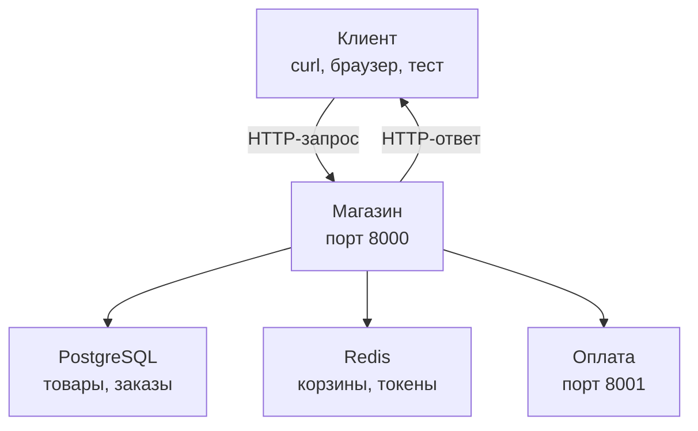
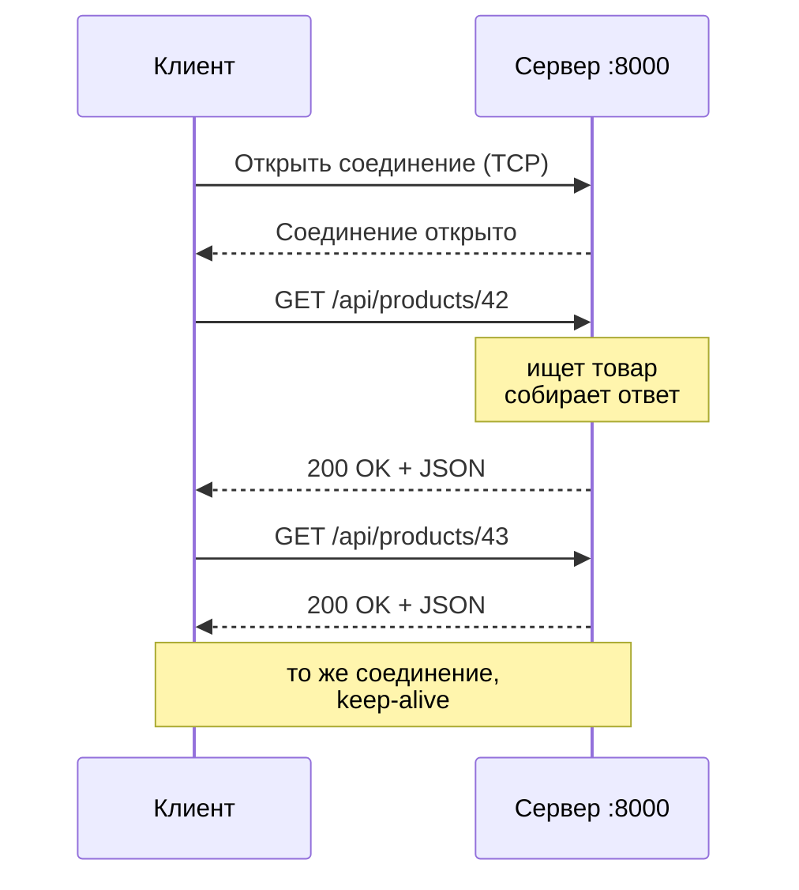
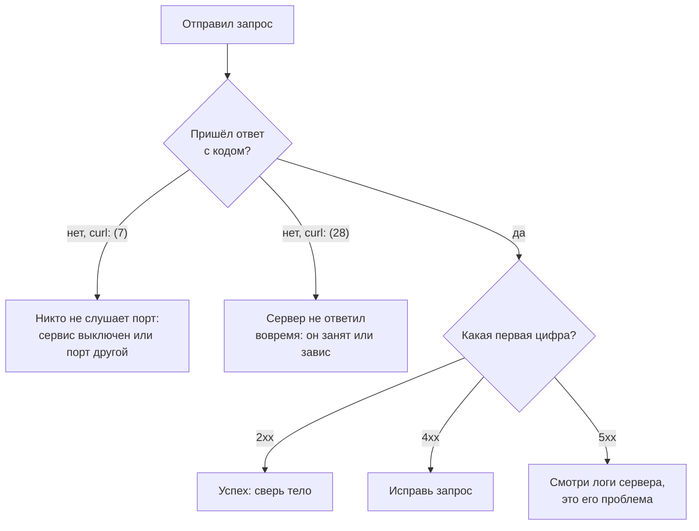

## Зачем это нужно

Нагрузочный тест это тысячи и миллионы одинаковых обращений к сервису, и у каждого есть результат: «получилось» или «не получилось». Генератор нагрузки (программа, которая изображает много пользователей, например Locust или k6) записывает именно это: сколько запросов отправлено, сколько вернулись с кодом 200, сколько с 500, как долго длился каждый. Если ты не понимаешь, что такое запрос, ответ и код ответа, то отчёт «ошибок 3%» для тебя пустые слова: какие ошибки? чьи? что с ними делать?

Ещё одна рабочая причина: когда на проде что-то ломается, первое, что делает инженер, это берёт `curl` и руками отправляет такой же запрос, как пользователь. По ответу он за минуту понимает, где искать: сервис не отвечает совсем, отвечает ошибкой или отвечает правильно, но медленно. Этому ты научишься в этом уроке.

Шаг проекта: ты впервые поднимаешь на своём компьютере учебный стенд «Магазин» (интернет-магазин, который ты будешь тестировать весь курс), делаешь первые запросы к нему, смотришь, что именно уходит по сети и что возвращается, и записываешь таблицу «запрос → код → что это значит» в файл `~/perf-lab/02-web/http-codes.md`.

## Что нужно знать

- Терминал, каталоги, `apt`, рабочий каталог `~/perf-lab`: [урок 1.1](../01-linux/01-workstation-terminal.md).
- Что такое порт, `curl` и DNS: [урок 1.4](../01-linux/04-network-cli.md). Здесь мы повторим, что нужно, но подробности там.
- Больше ничего. Docker, веб-серверы и базы объяснять не придётся: в этом уроке ты запустишь стенд по готовому рецепту, а как он устроен, разберём в [теме 5](../05-docker/index.md).

Хочешь то же глубже, с точки зрения администратора сервера: [урок про HTTP в курсе DevOps](https://distinguished-sre.github.io/devops/02-network/04-http.html).

## Картина целиком

Представь ресторан. Ты (клиент) садишься за стол и говоришь официанту, чего хочешь: «Борщ, пожалуйста». Официант (сервер) идёт на кухню, возвращается и приносит борщ или говорит «борщ закончился». Заметь три вещи. Во-первых, разговор всегда начинаешь ты: официант сам ничего не приносит. Во-вторых, у разговора есть формат: что заказал, как приготовить, на каком столе. В-третьих, у ответа есть исход, понятный сразу: принесли, нет такого блюда, на кухне пожар. Всё это и есть HTTP.

**HTTP** (HyperText Transfer Protocol, «протокол передачи гипертекста») это набор правил, по которым клиент и сервер обмениваются сообщениями в интернете: как записать запрос, как записать ответ, что означают числа в ответе. **Клиент** это программа, которая спрашивает: браузер, мобильное приложение, `curl`, твой генератор нагрузки. **Сервер** это программа, которая слушает входящие запросы и отвечает на них. Важно: «сервер» это программа, а не обязательно большая железная машина. На твоём ноутбуке сейчас может работать и клиент, и сервер.

Так выглядит путь одного запроса к «Магазину» на твоём стенде:



Что здесь видно: клиент говорит только с «Магазином» и ничего не знает о том, что за ним стоят база, Redis и сервис оплаты. Для клиента «Магазин» это один адрес и один порт. Что происходит внутри, разберём в [уроке 2.3](03-backend-anatomy.md). В этом уроке мы смотрим на стык «клиент и Магазин»: что именно отправляется и что возвращается.

## Теория

### Адрес запроса: из чего состоит URL

**Зачем это существует.** Чтобы спросить, нужно знать, кого и о чём. Для этого у каждого ресурса (товара, списка, страницы) есть адрес. Без единого формата адреса каждая программа записывала бы его по-своему, и клиенты не могли бы работать с чужими серверами.

**Аналогия.** Почтовый адрес: город, улица, дом, квартира. Аналогия ломается тем, что у URL есть ещё и способ доставки (по какому протоколу) и вопросы «в конце» (параметры), у письма такого нет.

**Как это устроено.** Адрес называется **URL** (Uniform Resource Locator, «единообразный указатель ресурса»). Возьмём адрес товара из «Магазина» с фильтром:

```text
http://localhost:8000/api/products?category_id=3&size=2
└─┬─┘   └────┬────┘└┬─┘└────┬────┘ └────────┬────────┘
схема      хост  порт   путь           параметры
```

- **Схема** (`http`): по какому протоколу говорить. Бывает ещё `https`, это тот же HTTP, но зашифрованный.
- **Хост** (`localhost`): чей это сервер. Либо имя (`shop.example.com`), которое DNS (система «телефонной книги» интернета) превращает в IP-адрес, либо сразу IP-адрес. Имя `localhost` всегда означает «эта же машина» (IP `127.0.0.1`).
- **Порт** (`8000`): номер «двери» на машине. На одной машине работают десятки программ, и порт говорит, с какой из них ты хочешь разговаривать. Если порт не указан, берётся стандартный: 80 для `http`, 443 для `https`.
- **Путь** (`/api/products`): какой ресурс нужен.
- **Параметры** (`?category_id=3&size=2`): уточнения. Начинаются с `?`, разделяются `&`, каждое записывается как `имя=значение`. Тут мы просим товары категории 3, не больше двух штук.

**Что путают.** Хост и сервер. Адрес `localhost:8000` и `localhost:8001` это один хост и два разных сервера (магазин и оплата). И ещё: параметры не секретны. Они видны в адресной строке, в логах и в истории браузера, поэтому пароли в них не кладут.

> **Проверь понимание:** на каком порту работает сервис оплаты нашего стенда и каким будет адрес его проверки `healthz`?

<details markdown="1">
<summary>Ответ</summary>

Оплата слушает порт 8001, адрес `http://localhost:8001/healthz`. Хост тот же, меняется только порт.

</details>

### Запрос: что клиент отправляет серверу

**Зачем это существует.** Серверу нужно знать три вещи: что сделать, над чем и с какими данными. Запрос это стандартная форма, в которую клиент записывает всё это, чтобы любой сервер мог её прочитать.

**Аналогия.** Бланк заказа в ресторане: что приготовить (действие), для какого стола (адрес), пожелания (заголовки), особые условия в приложении (тело). Бланк одинаковый у всех, поэтому его понимает любой повар.

**Как это устроено.** HTTP-запрос это обычный текст из четырёх частей, в таком порядке:

1. **Стартовая строка**: **метод** (что сделать), **путь** (над чем) и версия протокола. Например `GET /api/products/42 HTTP/1.1`.
2. **Заголовки** (headers): строки `Имя: значение` с дополнительной информацией. Например, `Host: localhost:8000` (какому серверу адресовано), `Accept: */*` (какие форматы ответа клиент примет), `Authorization: Bearer ...` (пропуск).
3. **Пустая строка**: отделяет заголовки от тела.
4. **Тело** (body): сами данные. Есть не у всякого запроса. Запрос «дай товар 42» ничего не передаёт, тела нет. Запрос «зарегистрируй пользователя» передаёт email и пароль, это и есть тело.

Посмотри на живой обмен. Выбери сценарии и наведи курсор на строки запроса и ответа:

<div class="viz" data-viz="web-http-exchange" data-set="http" data-start="product-ok"></div>

Что здесь видно: слева текст запроса, справа ответ, между ними идёт «конверт». Первый сценарий это нормальный запрос товара: стартовая строка с методом `GET`, пара заголовков, пустая строка и без тела. Ответ начинается строкой с кодом `200`, затем заголовки и JSON с товаром. Остальные сценарии мы разберём чуть ниже, когда дойдём до кодов.

**Разобранный пример.** Теперь то же самое, но у настоящего сервера. Флаг `-v` (verbose, «подробно») у `curl` печатает всё, что уходит и приходит. Строки с `>` это то, что отправил ты, с `<` то, что вернул сервер, со `*` служебные сообщения самого `curl`:

```bash
curl -v http://localhost:8000/healthz
```

```text
*   Trying 127.0.0.1:8000...
* Connected to localhost (127.0.0.1) port 8000
> GET /healthz HTTP/1.1
> Host: localhost:8000
> User-Agent: curl/8.5.0
> Accept: */*
>
< HTTP/1.1 200 OK
< date: Sat, 03 Oct 2026 10:15:02 GMT
< server: uvicorn
< content-length: 15
< content-type: application/json
< x-request-id: 3f9a1c0e7b2d4a58b6c1e90d2f7a4b13
<
{"status":"ok"}
* Connection #0 to host localhost left intact
```

Читаем сверху вниз:

- `Trying 127.0.0.1:8000` и `Connected`: `curl` превратил `localhost` в IP-адрес и открыл соединение с портом 8000. Пока не отправлено ни слова HTTP: это только «дозвонились».
- `> GET /healthz HTTP/1.1`: стартовая строка запроса. Метод `GET`, путь `/healthz`, версия `HTTP/1.1`.
- `> Host: localhost:8000`: куда обращаемся. `> User-Agent: curl/8.5.0`: кто спрашивает. `> Accept: */*`: готов принять любой формат.
- `>` без текста: та самая пустая строка. Тела нет, на этом запрос закончен.
- `< HTTP/1.1 200 OK`: статусная строка ответа: версия, **код 200** и слова «OK» для человека. Программа смотрит только на число.
- `< date`, `< server`, `< content-length: 15` (в теле 15 байт), `< content-type: application/json` (тело это JSON), `< x-request-id` (номер запроса, он же попадёт в лог «Магазина»).
- `{"status":"ok"}`: тело ответа, 15 символов, как и обещал `content-length`.
- Последняя строка: `curl` не закрыл соединение, оно осталось открытым для следующих запросов. Это называется keep-alive (пояснение ниже).

**Как читать вывод:** сначала найди статусную строку (`< HTTP/1.1 200 OK`), это главный результат. Потом `content-type` и `content-length`: что и сколько вернулось. Остальные заголовки смотришь по необходимости.

**Что путают.**

- Заголовки и тело. Заголовки описывают сообщение (кто, в каком формате, сколько), тело содержит данные.
- Регистр заголовков. По стандарту `Content-Type` и `content-type` это одно и то же. Поэтому ты видишь заголовки запроса с большой буквы (так пишет `curl`), а ответа с маленькой (так пишет сервер).
- Строку `HTTP/1.1` принимают за версию «Магазина». Это версия протокола.

> **Проверь понимание:** в запросе `POST /api/orders HTTP/1.1` есть заголовок `Authorization: Bearer abc`. Какая это часть запроса и что она сообщает серверу?

<details markdown="1">
<summary>Ответ</summary>

Это заголовок (часть 2). Он сообщает, кто спрашивает: токен (пропуск), по которому сервер определит пользователя. Само действие (создать заказ) записано в стартовой строке методом `POST` и путём `/api/orders`.

</details>

### Ответ: что сервер возвращает

**Зачем это существует.** Клиенту нужен результат и понятный исход: получилось или нет, а если нет, то по чьей вине и можно ли повторить. Для этого ответ тоже имеет стандартную форму.

**Как это устроено.** Ответ состоит из тех же частей, но с другой первой строкой: **статусная строка** (версия, код, пояснение), заголовки, пустая строка, тело. Самое важное тут **код статуса** (status code): число из трёх цифр. Пояснение вроде «OK» или «Not Found» написано для человека, программа его игнорирует.

Тело ответа в API «Магазина» всегда JSON (формат записи данных текстом, подробнее в [уроке 2.2](02-rest-json-auth.md)). Пока достаточно знать, что `{"status":"ok"}` читается так: поле `status` равно `ok`.

**Что путают.** Код ответа и «успех операции». Код 200 говорит, что сервер корректно ответил, а не что ответ тебе нравится. Магазин вернёт 200 и пустой список товаров, если в категории ничего нет. Читай и код, и тело.

### Методы: что именно сделать

**Зачем это существует.** Один и тот же адрес `/api/cart/items` может быть нужен для разных действий: посмотреть, добавить, убрать. Метод это глагол запроса: он говорит, какое действие над ресурсом нужно. Без методов пришлось бы придумывать по адресу на каждое действие.

**Аналогия.** Библиотека: «взять почитать» (прочитать), «сдать новую книгу» (создать), «заменить книгу» (изменить), «выбросить книгу» (удалить). Один шкаф, четыре разных действия.

**Как это устроено.** Пять методов, которые понадобятся:

| Метод | Что значит | Меняет данные на сервере? | Пример в «Магазине» |
|---|---|---|---|
| `GET` | Прочитать | Нет | `GET /api/products/42` |
| `POST` | Создать или выполнить действие | Да | `POST /api/orders` |
| `PUT` | Заменить целиком | Да | в «Магазине» не используется |
| `PATCH` | Изменить часть | Да | в «Магазине» не используется |
| `DELETE` | Удалить | Да | `DELETE /api/cart/items/5` |

Два свойства методов важны именно нагрузочнику.

**Безопасный** метод не меняет данные: это `GET`. Сколько бы раз ты его ни отправил, на сервере ничего не изменится (кроме логов и счётчиков). Поэтому нагрузку на каталог генерировать легко и безвредно.

**Идемпотентный** (idempotent) метод можно повторить много раз, и результат будет тот же, что от одного раза. `DELETE /api/cart/items/5`: после первого раза позиции нет в корзине, после второго тоже нет, ничего не изменилось. `GET` идемпотентен. А вот `POST /api/orders` не идемпотентен: два запроса создадут два заказа. Это важно, когда запрос теряется по дороге и клиент повторяет его (ретрай, retry): повтор `GET` безопасен, повтор `POST` может задвоить заказ. В тестах на заказ ты потом увидишь, что «Магазин» от дублей не защищён: повторная отправка создаёт новый заказ (если в корзине что-то есть).

**Что путают.** «`POST` всегда создаёт». Нет: `POST /api/login` ничего не создаёт в базе (ну, токен в Redis), это действие «войти». `POST` годится для всего, что не укладывается в остальные методы.

> **Проверь понимание:** ты нагружаешь `GET /api/products` и `POST /api/orders`. Какой из тестов опасен для данных на стенде?

<details markdown="1">
<summary>Ответ</summary>

`POST /api/orders`: каждый успешный запрос создаёт заказ, списывает товар со склада и очищает корзину. Тысячи таких запросов заполнят базу заказами и уменьшат остатки. `GET` данные не меняет. Поэтому для тестов с изменением данных нужен стенд, который можно сбросить (`docker compose down -v`), и свои тестовые пользователи.

</details>

### Коды статуса: пять семейств

**Зачем это существует.** Клиенту-программе нужно быстро решить: всё хорошо, повторить, исправить запрос или звать на помощь. Читать слова в теле для этого долго, поэтому исход закодирован числом, и по первой цифре уже можно действовать.

**Аналогия.** Светофор и сообщения доставки: «доставлено», «адрес изменился, едем по новому», «вы указали неверный адрес», «у нас авария на складе». Первая цифра отвечает на вопрос «кто и что».

**Как это устроено.** Первая цифра определяет семейство:

| Семейство | Смысл | Кто виноват | Что делать клиенту | Примеры |
|---|---|---|---|---|
| **1xx** | Информация (редко видна) | Никто | Ничего | 100 Continue |
| **2xx** | Успех | Никто | Использовать результат | 200 OK, 201 Created, 204 No Content |
| **3xx** | Иди по другому адресу | Никто | Пойти по адресу из `location` | 301, 307 |
| **4xx** | Ошибка клиента | Клиент (запрос неверный) | Исправить запрос; повтор без изменений не поможет | 400, 401, 404, 405, 409, 422 |
| **5xx** | Ошибка сервера | Сервер или его соседи | Повторить позже, сообщить владельцу | 500, 502, 503, 504 |

Самые частые коды «Магазина» (полный перечень эндпоинтов в [README стенда](https://github.com/distinguished-sre/load-tester/blob/main/project/shop/README.md)):

| Код | Название | Когда в «Магазине» |
|---|---|---|
| 200 | OK | Успешное чтение, успешный вход |
| 201 | Created | Зарегистрировал пользователя, добавил товар в корзину, создал заказ |
| 204 | No Content | Удалил позицию из корзины: успех, но тела нет |
| 400 | Bad Request | Заказ с пустой корзиной |
| 401 | Unauthorized | Нет токена, он неверный или просрочен; неверный пароль |
| 404 | Not Found | Нет такого товара, заказа или адреса |
| 405 | Method Not Allowed | Метод не подходит адресу (например, `DELETE` на товар) |
| 409 | Conflict | Email уже занят; на складе мало товара |
| 422 | Unprocessable Content | Запрос синтаксически верный, но данные не подходят (количество 0, размер страницы 500) |
| 502 | Bad Gateway | Сервис оплаты ответил отказом |
| 503 | Service Unavailable | Магазин не готов: недоступна база или Redis; нет соединения с базой |
| 504 | Gateway Timeout | Оплата не ответила вовремя |

Обрати внимание на различие 4xx и 5xx: оно важнее всего для нагрузочника. Если под нагрузкой растут 4xx, обычно сломан твой тест (скрипт отправляет неверные данные или протухли токены). Если растут 5xx, ломается сервис, и это находка, ради которой нагрузка и затевалась. Поэтому в отчёте «ошибок 3%» всегда пиши, каких именно.

Вернись к виджету выше и нажми сценарии `404 нет товара`, `405 метод`, `422 параметр`, `401 без токена`, `503 нет Redis` и `нет ответа`. Для каждого посмотри, кто виноват и что пишет сервер в теле. Ответ `307` из списка: адрес `/api/products/` с лишним слэшем сервер перенаправляет на `/api/products`.

Теперь реальные примеры «Магазина» через `curl`. Флаг `-i` печатает заголовки ответа вместе с телом, это короче, чем `-v`:

```bash
curl -i http://localhost:8000/api/products/999999
```

```text
HTTP/1.1 404 Not Found
date: Sat, 03 Oct 2026 10:16:40 GMT
server: uvicorn
content-length: 30
content-type: application/json
x-request-id: 8a41d6f2c9e04b7d9f10a2b3c4d5e6f7

{"detail":"product not found"}
```

Читаем: сервер жив и понял запрос (иначе не было бы ответа вообще), но товара с номером 999999 нет. Причина лежит в теле, в поле `detail`: «Магазин» всегда пишет текст ошибки в это поле. Виноват клиент.

```bash
curl -i 'http://localhost:8000/api/products?size=500'
```

```text
HTTP/1.1 422 Unprocessable Content
date: Sat, 03 Oct 2026 10:17:11 GMT
server: uvicorn
content-length: 143
content-type: application/json
x-request-id: 51c0b7aa2d3e4f6081928374a5b6c7d8

{"detail":[{"type":"less_than_equal","loc":["query","size"],"msg":"Input should be less than or equal to 100","input":"500","ctx":{"le":100}}]}
```

Читаем: путь верный, но параметр `size` (сколько товаров на странице) допускает максимум 100, а ты просил 500. В `loc` указано, где ошибка (`query` значит «в параметрах адреса», затем имя `size`), в `msg` причина. Такое тело удобно: по нему видно, что исправить, не заглядывая в документацию.

**Что путают.**

- 401 и 403. 401 «не знаю, кто ты» (нет или неверный токен), 403 «знаю, но тебе нельзя». В «Магазине» 403 нет, везде 401.
- 400 и 422. Оба означают «запрос плох». В «Магазине» 422 приходит от автоматической проверки формата данных (тип, диапазон), а 400 от бизнес-правила (пустая корзина).
- 404 «нет такого адреса» и 404 «нет такого объекта». Код один, смысл разный, различай по `detail`: `Not Found` (адреса нет совсем) или `product not found` (адрес верный, объекта нет).
- Код 200 с ошибкой в теле. В плохо сделанных API бывает «200, а в теле `error: true`». Для нагрузочного теста это ловушка: генератор считает ответ успешным. «Магазин» так не делает, но на работе проверяй не только код, но и тело (в курсе мы вернёмся к этому в [теме 6](../06-api-testing/index.md)).

> **Проверь понимание:** генератор нагрузки сообщил «20% ответов 404». Это проблема сервиса или теста?

<details markdown="1">
<summary>Ответ</summary>

Скорее теста: 404 это ошибка клиента, значит, скрипт просит то, чего нет (устаревшие номера товаров, опечатка в пути). Сервис при этом исправен. Но проверь: если 404 появилась только под нагрузкой, а раньше при одном запросе была 200, возможно, что-то под нагрузкой теряется (кэш, маршрутизация). Всегда сравнивай с одиночным запросом.

</details>

### Соединение: что происходит до запроса

**Зачем это существует.** HTTP это только формат сообщений. Доставляет их другой протокол, **TCP** (Transmission Control Protocol), он гарантирует, что байты дойдут целыми и по порядку. Прежде чем отправить первый запрос, клиент и сервер «здороваются» и открывают соединение.

**Аналогия.** Телефонный звонок: сначала набираешь номер и ждёшь «алло», потом говоришь. Говорить можно несколько фраз подряд, не перезванивая каждый раз.

**Как это устроено.** Последовательность одного обращения:



Что здесь видно: открытие соединения стоит времени, поэтому его не повторяют на каждый запрос. Если оставить соединение открытым и пускать по нему запросы один за другим, это называется **keep-alive** («держи живым»). Браузеры и `curl` в одном запуске делают так сами. Для нагрузочника это важно: открыть соединение дорого, и тест, который открывает новое соединение на каждый запрос, измеряет не то же самое, что реальный пользователь с браузером (разбор в [уроке 8.3](../08-perf-theory/03-test-types.md)).

Для `https` между открытием соединения и запросом добавляется ещё шифрование (TLS): стороны договариваются о ключах. На нашем стенде шифрования нет, оно нужно при работе по открытым сетям.

Заголовок `Host` с именем сервера нужен потому, что на одном IP-адресе с одним портом могут жить много сайтов. Сервер читает `Host` и понимает, какому сайту адресован запрос. Для нашего «Магазина» это формальность.

**Что путают.** HTTP и TCP. HTTP говорит, **что** лежит в сообщении, TCP отвечает, **как** оно доедет. Поэтому ошибки бывают двух разных уровней: «не дозвонились» (нет TCP-соединения) и «дозвонились, но ответили ошибкой» (есть HTTP-код). Об этом следующий раздел.

### Когда ответа нет вовсе

**Зачем это существует.** Иногда на запрос не приходит вообще ничего: нет кода статуса, нет тела. Это не ошибка HTTP, это ошибка соединения. Различать два случая нужно потому, что чинятся они в разных местах.

**Как это устроено.** Если вместо кода получаешь сообщение самого `curl`, значит, ответа нет. Самые частые причины:

- `curl: (7) Failed to connect to localhost port 8000 ... Connection refused`: по этому адресу и порту никто не слушает. Сервис остановлен или упал, либо ты ошибся портом. Ответ приходит мгновенно: «здесь никого нет».
- `curl: (28) Operation timed out`: до сервера дозваться не получилось или он принял запрос, но не ответил за отведённое время. Ответа нет, но, в отличие от (7), сервер, возможно, жив и просто занят.
- `curl: (6) Could not resolve host`: не удалось превратить имя в IP-адрес (проблема DNS или опечатка в имени).

Код возврата последней команды лежит в переменной `$?`. `0` значит успех, число `7` совпадает с номером ошибки `curl`. Эту переменную мы будем использовать в скриптах [урока 1.5](../01-linux/05-bash-scripts.md).

Диагностика «я не получаю ответа» это короткое дерево решений:



Что здесь видно: первое, что спрашиваешь, это «есть ли вообще код ответа». Если нет, дальше смотришь на текст ошибки `curl`. Если есть, первая цифра сразу говорит, в чьей стороне искать.

> **Проверь понимание:** остановили сервис «Магазин». Какая ошибка будет у `curl`, и есть ли у неё код статуса?

<details markdown="1">
<summary>Ответ</summary>

`curl: (7) Failed to connect to localhost port 8000 ... Connection refused`. Кода статуса нет: HTTP-ответа не было, соединение даже не открылось. `curl` вернёт код выхода 7.

</details>

### Что из этого нужно нагрузочнику

Каждый запрос, который отправляет генератор нагрузки, это такой же текст, как тот, что ты видел. Для каждого генератор записывает три вещи: **код статуса**, **время от отправки до конца ответа** и **размер ответа**. Из них строятся главные числа теста: доля ошибок (сколько ответов 4xx и 5xx), задержка (сколько ждали), пропускная способность (сколько ответов в секунду). Подробно: [урок 8.1](../08-perf-theory/01-latency-throughput.md).

Поэтому три привычки на всю жизнь:

1. Прежде чем нагружать, пошли один запрос руками (`curl -i`) и убедись, что он возвращает ожидаемый код и тело.
2. Нагружай и считай успехом только то, что ожидаешь (например, `200` для чтения и `201` для создания), а не «любой ответ».
3. Разделяй ошибки по семействам: 4xx в отчёте это вопросы к тесту, 5xx это вопросы к сервису, отсутствие ответа это вопросы к соединению и доступности.

## Практика

### 1. Подготовь рабочий каталог

```bash
mkdir -p ~/perf-lab/02-web
cd ~/perf-lab/02-web
pwd
```

```text
/home/student/perf-lab/02-web
```

В этом каталоге будут лежать твои заметки и скрипты темы 2. Подробности про `mkdir -p` и `cd` в [уроке 1.1](../01-linux/01-workstation-terminal.md).

### 2. Установи Docker Engine

Стенд «Магазин» состоит из нескольких программ (магазин, оплата, база PostgreSQL, Redis). Чтобы не ставить их по отдельности, мы запускаем всё через Docker. Что такое Docker и как он работает, мы подробно разберём в [теме 5](../05-docker/index.md), сейчас нужен только рецепт: установи и запусти по шагам. Команды ставят Docker Engine из официального репозитория Docker (его адрес и ключ проверки подлинности пакетов добавляются в систему):

```bash
sudo apt update
sudo apt install -y ca-certificates curl
sudo install -m 0755 -d /etc/apt/keyrings
sudo curl -fsSL https://download.docker.com/linux/ubuntu/gpg -o /etc/apt/keyrings/docker.asc
sudo chmod a+r /etc/apt/keyrings/docker.asc
```

Что делают команды: первая и вторая готовят `apt` (обновляют список пакетов, ставят то, что нужно для безопасного скачивания). `install -d` создаёт каталог для ключей с нужными правами. `curl -fsSL ... -o файл` скачивает ключ: `-f` (fail) не сохранять страницу с ошибкой, `-s` (silent) без индикатора, `-S` показывать ошибки, `-L` идти по перенаправлениям (те самые 3xx), `-o` сохранить в файл. Ключ нужен, чтобы `apt` мог проверить, что пакеты действительно от Docker.

Теперь добавь репозиторий (источник пакетов). Команда `tee` записывает текст в файл, а `sudo` нужен, потому что файл лежит в системном каталоге; `$(...)` подставляет кодовое имя твоей версии Ubuntu (`noble` для 24.04):

```bash
sudo tee /etc/apt/sources.list.d/docker.sources <<EOF
Types: deb
URIs: https://download.docker.com/linux/ubuntu
Suites: $(. /etc/os-release && echo "${UBUNTU_CODENAME:-$VERSION_CODENAME}")
Components: stable
Signed-By: /etc/apt/keyrings/docker.asc
EOF
sudo apt update
sudo apt install -y docker-ce docker-ce-cli containerd.io docker-buildx-plugin docker-compose-plugin
```

И добавь себя в группу `docker`, иначе каждую команду пришлось бы писать с `sudo`:

```bash
sudo usermod -aG docker $USER
```

`usermod -aG docker $USER` добавляет (`-a`) твоего пользователя (`$USER`, переменная окружения с твоим именем) в группу (`-G`) `docker`. Группа даёт право общаться с Docker. **Изменение групп применяется только в новом сеансе**: закрой терминал и открой заново (в WSL2 закрой окно Ubuntu и открой снова), либо выполни `newgrp docker` в текущем окне. Если Ubuntu у тебя в WSL2 и служба Docker не запущена (`Cannot connect to the Docker daemon`), запусти её командой `sudo service docker start`.

Проверь:

```bash
docker --version
docker compose version
docker run --rm hello-world
```

```text
Docker version 29.0.1, build 3f5a7c2
Docker Compose version v2.40.3
Unable to find image 'hello-world:latest' locally
latest: Pulling from library/hello-world
...
Hello from Docker!
This message shows that your installation appears to be working correctly.
```

**Как читать вывод:** номера версий у тебя будут свои, главное, что команды отвечают. `hello-world` это крошечная программа: Docker скачал её, запустил, она напечатала приветствие и завершилась (`--rm` удаляет её после выхода). Если ты видишь «Hello from Docker!», Docker работает.

**Типичные ошибки:**

- `permission denied while trying to connect to the Docker daemon socket at unix:///var/run/docker.sock`: ты ещё не перелогинился после `usermod`. Закрой терминал и открой заново или выполни `newgrp docker`. Проверить, что группа применилась, можно командой `groups`: в списке должно быть слово `docker`.
- `E: The repository 'https://download.docker.com/linux/ubuntu ... Release' does not have a Release file`: для твоей версии Ubuntu пакетов в репозитории Docker пока нет (так бывает у только что вышедших версий). Открой файл `/etc/apt/sources.list.d/docker.sources` и замени имя в строке `Suites:` на `noble`, затем снова `sudo apt update`.
- `Could not get lock /var/lib/dpkg/lock-frontend`: другой установщик ещё работает, подожди пару минут.

### 3. Скачай и запусти стенд

```bash
git clone https://github.com/distinguished-sre/load-tester.git ~/load-tester
cd ~/load-tester/project/shop
cp .env.example .env
docker compose up -d --build --wait
```

Разбор:

- `git clone адрес папка` скачивает копию репозитория курса в `~/load-tester`. Нам нужна папка `project/shop` с описанием стенда. Подробнее про git: [тема 3](../03-git/index.md).
- `cp .env.example .env` копирует файл с настройками стенда. Файл `.env` это набор настроек (порты, пароли, размеры пулов), которые стенд прочитает при запуске. Пока ничего в нём не меняй.
- `docker compose up -d --build --wait`: «подними всё, что описано в `compose.yaml`». `-d` (detach) запустить в фоне и вернуть терминал, `--build` собрать образы магазина и оплаты из исходников, `--wait` дождаться, пока все сервисы сообщат, что они здоровы. Что такое образ, контейнер и `compose`, расскажет [тема 5](../05-docker/index.md).

Первый запуск долгий: Docker скачивает базовые образы и собирает программы, а база при создании заполняется данными (20 категорий, 10 000 товаров, 1000 пользователей, 200 000 заказов). Подожди от 2 до 6 минут, это нормально. Ожидаемый конец вывода:

```text
[+] Running 6/6
 ✔ Network shop_default       Created
 ✔ Volume shop_pgdata         Created
 ✔ Container shop-redis-1     Healthy
 ✔ Container shop-payment-1   Healthy
 ✔ Container shop-postgres-1  Healthy
 ✔ Container shop-shop-1      Healthy
```

**Как читать вывод:** `Healthy` у каждого контейнера (контейнер это запущенный экземпляр сервиса) значит, что встроенная проверка здоровья прошла. Если какой-то остался `Starting` или `Unhealthy`, команда завершится с ошибкой, смотри ниже. Первые две строки (сеть и том для данных) создаются один раз.

Проверь, что стенд отвечает:

```bash
curl -s localhost:8000/readyz
```

```text
{"status":"ready"}
```

`/readyz` («готов ли ты работать») магазин проверяет сам: он обращается к базе и к Redis, и только если оба ответили, возвращает `ready`. Теперь можно впервые запустить на настоящем «Магазине» свой скрипт из [урока 1.5](../01-linux/05-bash-scripts.md): `~/perf-lab/scripts/check-stand.sh`. До этого он проверял учебный сервер из файлов, теперь на каждой из пяти строк должно быть `OK`, а код выхода 0 (`echo $?`). Если в одной из них `SLOW`, это просто холодный старт, повтори запуск.

Посмотреть все запущенные сервисы:

```bash
docker compose ps
```

```text
NAME               IMAGE            COMMAND                  SERVICE    STATUS                   PORTS
shop-payment-1     shop-payment     "uvicorn main:app ..."   payment    Up 3 minutes (healthy)   0.0.0.0:8001->8001/tcp
shop-postgres-1    postgres:18.6    "docker-entrypoint.s…"   postgres   Up 3 minutes (healthy)   0.0.0.0:5432->5432/tcp
shop-redis-1       redis:8.10.2     "docker-entrypoint.s…"   redis      Up 3 minutes (healthy)   0.0.0.0:6379->6379/tcp
shop-shop-1        shop-shop        "./entrypoint.sh"        shop       Up 3 minutes (healthy)   0.0.0.0:8000->8000/tcp
```

**Как читать вывод:** четыре сервиса, у каждого `(healthy)`. В колонке `PORTS` видно, какой порт машины ведёт к какому сервису: `0.0.0.0:8000->8000` значит «порт 8000 твоей машины это порт 8000 внутри сервиса». Ты стучишься на `localhost:8000`, а попадаешь в «Магазин».

**Типичные ошибки:**

- `permission denied ... docker.sock`: см. выше, нужен новый сеанс.
- `Bind for 0.0.0.0:8000 failed: port is already allocated` (или `address already in use`): порт занят другой программой. Найди её: `sudo ss -ltnp 'sport = :8000'`, в последней колонке будет имя процесса. Останови его или освободи порт. Чаще всего это старый запуск стенда: `docker ps` покажет, и тогда `docker compose down` в его каталоге.
- `no space left on device`: закончилось место. Проверь `df -h /` (команда из [урока 1.1](../01-linux/01-workstation-terminal.md)). Освободи минимум 10 ГБ, старые образы можно удалить `docker system prune`, это безопасно для стенда.
- `docker compose up` ждёт и падает по времени, а `shop-postgres-1` остаётся `starting`: база ещё заполняется данными, на медленном диске это до нескольких минут. Подожди, повтори `docker compose up -d --wait`. Прогресс видно в логах: `docker compose logs -f postgres` (выйти: `Ctrl+C`).
- `curl: (7) Failed to connect ... Connection refused` сразу после запуска: сервис ещё стартует. Подожди 10 секунд и повтори.

Остановить стенд: `docker compose down` (данные базы сохранятся). Остановить и стереть всё, включая данные: `docker compose down -v`. Следующий запуск после `down -v` снова будет долгим, потому что база заполняется заново. Команды выполняются из `~/load-tester/project/shop`.

### 4. Прочитай запрос и ответ построчно

Ты уже видел `curl -v` в теории. Повтори сам и найди все части: стартовую строку, заголовки, пустую строку, тело.

```bash
curl -v http://localhost:8000/api/categories 2>&1 | head -n 25
```

Здесь `2>&1` объединяет служебный вывод `curl` (он идёт в «поток ошибок») с обычным, а `| head -n 25` оставляет первые 25 строк. Ожидаемый вывод по структуре такой же, как раньше, но тело длиннее:

```text
> GET /api/categories HTTP/1.1
> Host: localhost:8000
...
< HTTP/1.1 200 OK
< content-type: application/json
...
[{"id":1,"name":"Категория 1"},{"id":2,"name":"Категория 2"}, ...
```

Ответь себе: сколько здесь заголовков запроса? есть ли тело у запроса? какой метод? что вернулось в `content-length`?

### 5. Получи товар и разбери его через `jq`

```bash
curl -s http://localhost:8000/api/products/42
```

```text
{"id":42,"name":"Товар 42","price":1654.0,"category_id":2,"stock":1000000}
```

Одной строкой читать неудобно. Программа `jq` форматирует JSON (подробно в [уроке 2.2](02-rest-json-auth.md)). Здесь `|` («труба») передаёт вывод `curl` на вход `jq`, а `.` значит «покажи всё как есть, красиво»:

```bash
curl -s http://localhost:8000/api/products/42 | jq .
```

```text
{
  "id": 42,
  "name": "Товар 42",
  "price": 1654.0,
  "category_id": 2,
  "stock": 1000000
}
```

**Как читать вывод:** у товара пять полей. `price` цена в условных единицах, `stock` остаток на складе (миллион на старте). `category_id` номер категории, список категорий лежит в `/api/categories`.

Параметры адреса: два товара первой страницы и общее число:

```bash
curl -s 'http://localhost:8000/api/products?size=2' | jq .
```

```text
{
  "items": [
    { "id": 1, "name": "Товар 1", "price": 137.0, "category_id": 1, "stock": 1000000 },
    { "id": 2, "name": "Товар 2", "price": 174.0, "category_id": 2, "stock": 1000000 }
  ],
  "page": 1,
  "size": 2,
  "total": 10000
}
```

(`jq` на самом деле раскладывает каждое поле на отдельную строку, здесь объекты сокращены в одну для компактности.) Кавычки вокруг адреса обязательны: символ `?` и `&` оболочка иначе поймёт по-своему (`&` запускает команду в фоне).

### 6. Собери коллекцию ответов: 200, 404, 405, 422

Чтобы не писать длинные команды, воспользуйся флагами `curl`: `-s` (тихо), `-o /dev/null` (выбросить тело), `-w` (напечатать по шаблону после запроса). Шаблон `%{http_code}` подставляет код ответа:

```bash
for path in /api/products/42 /api/products/999999 /api/product/42 '/api/products?size=500' /api/products/; do
  code=$(curl -s -o /dev/null -w '%{http_code}' "http://localhost:8000$path")
  echo "$code  GET $path"
done
```

```text
200  GET /api/products/42
404  GET /api/products/999999
404  GET /api/product/42
422  GET /api/products?size=500
307  GET /api/products/
```

Разбор: `for ... in ...; do ...; done` повторяет блок для каждого пути из списка (подробно в [уроке 1.5](../01-linux/05-bash-scripts.md)), `$(...)` подставляет результат команды в переменную `code`. Пять строк это пять разных историй: успех, нет объекта, нет адреса, неверный параметр, переадресация.

Метод `DELETE` на товар и маршрут с переадресацией:

```bash
curl -i -X DELETE http://localhost:8000/api/products/42
```

```text
HTTP/1.1 405 Method Not Allowed
date: Sat, 03 Oct 2026 10:20:05 GMT
server: uvicorn
allow: GET
content-length: 31
content-type: application/json
x-request-id: 0b6e4c2d91a84f3aa7d2e5b8c1f09a64

{"detail":"Method Not Allowed"}
```

`-X DELETE` заменяет метод. Заголовок `allow: GET` подсказывает, что для этого адреса разрешён только `GET`.

```bash
curl -i http://localhost:8000/api/products/
curl -iL http://localhost:8000/api/products/ | head -n 12
```

Первая команда покажет `307 Temporary Redirect` и заголовок `location: http://localhost:8000/api/products`, тела нет (`content-length: 0`). Вторая с `-L` (follow, «иди по перенаправлению») сама сходит по новому адресу и покажет оба ответа подряд: сначала 307, затем 200 с каталогом.

### 7. Сними время и размер ответа

Помнишь, что для нагрузочника важны код, время и размер? Получи все три одной командой:

```bash
curl -s -o /dev/null -w 'код=%{http_code} время=%{time_total}с размер=%{size_download}байт\n' http://localhost:8000/api/products/42
```

```text
код=200 время=0.011802с размер=79байт
```

`%{time_total}` это полное время запроса в секундах, `%{size_download}` размер тела. Запусти эту команду пять раз и обрати внимание: первый запрос может быть заметно медленнее остальных (прогрев соединения и кэшей), а числа никогда не одинаковые. Это нормально, одно измерение ничего не доказывает, к этому мы вернёмся в [уроке 8.1](../08-perf-theory/01-latency-throughput.md).

### 8. Запиши таблицу кодов

Создай файл с заметками. Он пригодится как шпаргалка и как первый документ твоего портфолио:

```bash
cat > ~/perf-lab/02-web/http-codes.md <<'EOF'
# Коды ответов «Магазина»: что я видел сам

| Запрос | Код | Кто виноват | Что значит |
|---|---|---|---|
| GET /api/products/42 | 200 | никто | товар найден |
| GET /api/products/999999 | 404 | клиент | нет такого товара |
| GET /api/product/42 | 404 | клиент | нет такого адреса (опечатка) |
| GET /api/products?size=500 | 422 | клиент | параметр вне допустимых границ |
| DELETE /api/products/42 | 405 | клиент | метод не разрешён для адреса |
| GET /api/products/ | 307 | никто | перенаправление на адрес без слэша |
EOF
cat ~/perf-lab/02-web/http-codes.md
```

Строка `<<'EOF'` до слова `EOF` передаёт блок текста как есть. Файл пополняй по ходу темы. Коммитить пока ничего не нужно: git появится в [теме 3](../03-git/index.md).

## Сломай и почини

**Поломка 1.** Остановим Redis (хранилище корзин и токенов) и посмотрим, как это видят разные проверки. Из каталога `~/load-tester/project/shop`:

```bash
docker compose stop redis
curl -s -o /dev/null -w 'healthz: %{http_code}\n' localhost:8000/healthz
curl -s -w '\nreadyz: %{http_code}\n' localhost:8000/readyz
curl -s -o /dev/null -w 'товар: %{http_code}\n' localhost:8000/api/products/42
curl -s -w '\nвход: %{http_code}\n' localhost:8000/api/login -H 'Content-Type: application/json' -d '{"email":"user0001@shop.lab","password":"password"}'
```

**Задача.** Сначала ответь сам: какой код вернёт каждая из четырёх проверок и почему они могут отличаться? Подсказка: вспомни, что значит `healthz` и `readyz` и какие запросы используют Redis. Затем найди причину по ответам и верни стенд к жизни.

<details markdown="1">
<summary>Разбор</summary>

```text
healthz: 200

{"detail":{"unavailable":["redis"]}}
readyz: 503
товар: 200

{"detail":"internal server error"}
вход: 500
```

- `healthz` отвечает 200: он проверяет только то, что сама программа «Магазин» жива, и никуда не ходит. Это проверка «процесс работает».
- `readyz` вернул 503 с телом `{"detail":{"unavailable":["redis"]}}`: он обращается к зависимостям и честно сообщает, что недоступен именно Redis. Так отличают «жив» от «готов принимать трафик». Балансировщик убрал бы такой экземпляр из работы.
- Товар по-прежнему 200: чтение карточки идёт только в PostgreSQL, Redis ему не нужен (кэш карточек выключен по умолчанию).
- Вход вернул 500: при входе «Магазин» сохраняет токен в Redis, не смог и упал. Это 5xx, виноват сервер и его зависимость, а не клиент.

Вывод для нагрузочника: одна упавшая зависимость ломает не все запросы, а определённые. Если под нагрузкой растёт доля 5xx только на `/api/login`, ищи то, что используется только там.

Чини:

```bash
docker compose start redis
curl -s localhost:8000/readyz
```

Должно вернуться `{"status":"ready"}`. Тот же код по-прежнему работает, потому что сам «Магазин» не перезапускался, он переподключился к Redis при первом обращении.

</details>

**Поломка 2.** Теперь остановим сам «Магазин»:

```bash
docker compose stop shop
curl -s -o /dev/null -w 'код: %{http_code}\n' localhost:8000/healthz; echo "curl вышел с кодом $?"
```

**Задача.** Что напечатают две строки и чем этот случай отличается от предыдущего? Верни стенд к жизни и дождись, пока проверка здоровья пройдёт.

<details markdown="1">
<summary>Разбор</summary>

```text
код: 000
curl вышел с кодом 7
```

(`curl -s` скрывает текст ошибки, но код выхода остаётся.) Код `000` значит: HTTP-кода нет, потому что ответа не было. Выход `7`: «Connection refused», по адресу никто не слушает. Это не ошибка HTTP, а отсутствие сервера. В предыдущей поломке сервер отвечал и объяснял проблему кодом 503, здесь он молчит.

Чини и проверяй:

```bash
docker compose start shop
docker compose ps
curl -s localhost:8000/readyz
```

Через 10–20 секунд `shop` станет `healthy`, `readyz` вернёт `ready`. Если что-то пошло совсем не так, `docker compose down && docker compose up -d --wait` пересоздаст стенд, а данные базы сохранятся.

</details>

## Словарик урока

| Термин | Простыми словами |
|---|---|
| Клиент (client) | Программа, которая отправляет запросы: браузер, `curl`, генератор нагрузки |
| Сервер (server) | Программа, которая слушает запросы и отвечает на них |
| HTTP | Правила, по которым клиент и сервер записывают запросы и ответы |
| URL | Адрес ресурса: схема, хост, порт, путь, параметры |
| Параметры запроса (query) | Часть адреса после `?`: уточнения вида `имя=значение` |
| Метод (method) | Глагол запроса: `GET` прочитать, `POST` создать или выполнить, `DELETE` удалить |
| Заголовок (header) | Строка `Имя: значение` с описанием сообщения |
| Тело (body) | Данные запроса или ответа, обычно JSON |
| Код статуса (status code) | Число из трёх цифр, исход запроса; первая цифра задаёт семейство |
| 2xx, 3xx, 4xx, 5xx | Успех; иди по другому адресу; ошибка клиента; ошибка сервера |
| Безопасный метод | Метод, который не меняет данные: `GET` |
| Идемпотентность (idempotency) | Повтор запроса даёт тот же результат, что и один запрос |
| TCP | Протокол, который доставляет байты целыми и по порядку, под HTTP |
| Keep-alive | Одно соединение держат открытым для многих запросов |
| `healthz`, `readyz` | Проверки «процесс жив» и «готов принимать запросы вместе с зависимостями» |
| Connection refused | Ошибка соединения: по адресу и порту никто не слушает |

## Вопросы с собеседований

Раздел для повторения: ответь вслух, потом открой ответ. Короткие вопросы тренируй на скорость: ответ за 30 секунд.

### 1. [junior] [часто] Чем отличаются коды 4xx и 5xx?

<details markdown="1">
<summary>Ответ</summary>

4xx это ошибка клиента: запрос неверный (нет прав, нет такого объекта, плохие данные), и повтор без изменений не поможет. 5xx это ошибка сервера: запрос был корректный, но сервер или его зависимость (база, оплата) не справились, повтор позже может сработать. При нагрузочном тесте рост 5xx говорит о проблеме сервиса, рост 4xx чаще о проблеме теста.

**Что хотят услышать:** кто виноват, можно ли повторять, как это использовать при анализе теста.

**Красный флаг:** «4xx это ошибки, 5xx тоже ошибки, разницы нет».

</details>

### 2. [junior] [часто] Из чего состоит HTTP-запрос?

<details markdown="1">
<summary>Ответ</summary>

Из стартовой строки (метод, путь, версия протокола), заголовков (`Имя: значение`), пустой строки и необязательного тела. Метод говорит, что сделать, путь над чем, заголовки передают служебные сведения (хост, формат, токен), тело содержит данные, например JSON для регистрации.

**Что хотят услышать:** все четыре части и пример заголовка.

**Красный флаг:** путает запрос с ответом или считает, что тело есть всегда.

</details>

### 3. [junior] [часто] Чем `GET` отличается от `POST`?

<details markdown="1">
<summary>Ответ</summary>

`GET` читает данные и ничего не меняет, его можно безопасно повторять и кэшировать, данных в теле у него обычно нет. `POST` отправляет данные и выполняет действие: создаёт заказ, регистрирует пользователя; повтор `POST` может повторить действие и создать дубль. Поэтому нагрузку по `POST` генерируют аккуратнее: она меняет данные.

**Что хотят услышать:** безопасность и идемпотентность, пример побочного эффекта.

**Красный флаг:** «`GET` для получения, `POST` для отправки, и всё».

</details>

### 4. [junior] Что означает код 401 и чем он отличается от 403?

<details markdown="1">
<summary>Ответ</summary>

401 значит «не знаю, кто ты»: токена нет, он неверный или просрочен, нужно войти заново. 403 значит «знаю, кто ты, но тебе нельзя»: личность установлена, прав на действие нет. Лечится 401 получением нового токена, 403 выдачей прав или другим пользователем.

**Что хотят услышать:** различие между аутентификацией (кто ты) и авторизацией (что тебе можно).

**Красный флаг:** считает 401 и 403 одним и тем же.

</details>

### 5. [junior] Что такое идемпотентный метод и зачем это знать нагрузочнику?

<details markdown="1">
<summary>Ответ</summary>

Метод, повтор которого даёт тот же результат, что один запрос: `GET`, `PUT`, `DELETE`. `POST` обычно не идемпотентен: два повтора создадут два заказа. Это важно, когда клиент повторяет запрос после таймаута: идемпотентные запросы повторять безопасно, неидемпотентные могут задвоить действие. Нагрузочник должен понимать, какие запросы можно повторять в тесте без искажения данных и какие ретраи опасны.

**Что хотят услышать:** примеры методов, связь с ретраями и дублями.

**Красный флаг:** путает идемпотентность и безопасность (`DELETE` идемпотентен, но не безопасен).

</details>

### 6. [junior] Что такое keep-alive и почему он важен при нагрузочном тесте?

<details markdown="1">
<summary>Ответ</summary>

Это повторное использование одного TCP-соединения для многих запросов. Открытие соединения (а для HTTPS ещё и шифрования) стоит времени и ресурсов. Реальные браузеры и клиенты держат соединения открытыми. Если генератор нагрузки открывает новое соединение на каждый запрос, он нагружает сервер иначе и показывает худшее время, чем увидят пользователи. Поэтому настройку соединений генератора нужно сверять с реальным клиентом.

**Что хотят услышать:** цена открытия соединения и влияние на результаты теста.

**Красный флаг:** «keep-alive это постоянная связь по сети с сервером».

</details>

### 7. [junior] `curl` вернул `Connection refused`, а в другом случае `404`. В чём разница?

<details markdown="1">
<summary>Ответ</summary>

Connection refused значит, что по адресу и порту никто не слушает: сервис остановлен или порт другой, HTTP-ответа нет вообще. 404 это полноценный HTTP-ответ: сервер жив, понял запрос, но такого ресурса нет. Первое чинят на уровне запуска и сети, второе на уровне запроса.

**Что хотят услышать:** два разных уровня: соединение и HTTP.

**Красный флаг:** «в обоих случаях сервис сломан».

</details>

### 8. [junior] Для чего нужны проверки `healthz` и `readyz`?

<details markdown="1">
<summary>Ответ</summary>

`healthz` отвечает, что процесс жив (его перезапускают, если нет). `readyz` отвечает, что сервис готов принимать трафик: зависимости (база, Redis) доступны (если нет, экземпляр временно убирают из балансировки, но не перезапускают). Если смешать, то при падении базы все экземпляры начнут бесконечно перезапускаться, хотя перезапуск не поможет.

**Что хотят услышать:** разные задачи: перезапуск против снятия трафика.

**Красный флаг:** «одна проверка, чтобы было».

</details>

### 9. [middle] В отчёте теста «ошибок 5%». Что ты спросишь и что проверишь?

<details markdown="1">
<summary>Ответ</summary>

Какие это коды: 4xx или 5xx, или обрывы соединения и таймауты. На каких маршрутах они. Когда начались: сразу или после роста нагрузки. 4xx сначала ищу в тесте (протухшие токены, неверные данные). 5xx смотрю в логах и метриках сервера по тем же маршрутам и времени. Таймауты и обрывы сравниваю с лимитами соединений и пулов. Также проверяю, что тест считает ошибкой и учитывается ли тело ответа.

**Что хотят услышать:** разбивка ошибок по классам, маршрутам и времени, привязка к метрикам.

**Красный флаг:** «пять процентов это нормально» без разбора.

</details>

### 10. [middle] Почему ответ 200 с телом `{"error": ...}` опасен для нагрузочных тестов?

<details markdown="1">
<summary>Ответ</summary>

Генератор нагрузки по умолчанию считает успехом любой 2xx, и такие ошибки пройдут незамеченными: на графиках будет 100% успеха, а пользователи получают ошибки. Нужно проверять содержимое ответа (поле, структуру), а не только код. Это особенно важно при перегрузке: сервис или прокси иногда отдают страницу-заглушку с кодом 200.

**Что хотят услышать:** проверка тела (assert, check) в тесте.

**Красный флаг:** «код 200 значит всё хорошо».

</details>

### 11. [middle] Как отличить, что задержку создаёт сеть, а не сервер, используя только `curl`?

<details markdown="1">
<summary>Ответ</summary>

Использовать `-w` с метриками по этапам: `time_connect` (время открытия соединения), `time_starttransfer` (до первого байта ответа), `time_total`. Если большое время до `time_connect`, виновата сеть или недоступность порта. Если соединение открылось быстро, а первый байт приходит долго, значит, сервер думает (или стоит в очереди). Если сервер ответил быстро, а `time_total` значительно больше, то тяжёлое тело или медленная передача.

**Что хотят услышать:** накопительные метрики и их вычитание.

**Красный флаг:** «замерить время ответа и всё».

</details>

### 12. [на скорость] Что означают коды 200, 201, 204?

<details markdown="1">
<summary>Ответ</summary>

200 успех с результатом в теле, 201 создано что-то новое, 204 успех, но тела нет (например, удалили позицию из корзины).

**Что хотят услышать:** три кода и по одной фразе.

**Красный флаг:** все три называет «успех» без различий.

</details>

### 13. [на скорость] Какой метод у запроса «создать заказ» и какой код ждёшь в ответ?

<details markdown="1">
<summary>Ответ</summary>

`POST /api/orders`, ответ 201 Created с телом заказа.

**Что хотят услышать:** метод, путь и код.

**Красный флаг:** `GET` или код 200 без пояснений.

</details>

### 14. [на скорость] Что значит 503 и чем она отличается от 500?

<details markdown="1">
<summary>Ответ</summary>

503 «сервис временно недоступен»: сервер осознанно отказывает, например нет связи с базой или идёт перегрузка. 500 «внутренняя ошибка»: что-то пошло не так в коде, причина неизвестна. Оба из семейства 5xx.

**Что хотят услышать:** оба 5xx; 503 временная и, возможно, ожидаемая, 500 неожиданная.

**Красный флаг:** «это одно и то же».

</details>

## Проверено на версиях

Ubuntu 24.04, Docker Engine 29, Docker Compose 2.40, curl 8.5, стенд «Магазин» из `project/shop` (FastAPI 0.142, Uvicorn 0.54, PostgreSQL 18.6, Redis 8.10). Октябрь 2026.

## Итог урока: ты умеешь

- [ ] Разобрать URL на схему, хост, порт, путь и параметры.
- [ ] Прочитать HTTP-запрос и ответ по частям: стартовая строка, заголовки, тело.
- [ ] Назвать пять методов и объяснить, чем `GET` отличается от `POST`.
- [ ] По первой цифре кода понять, кто виноват, и объяснить 200, 201, 401, 404, 422, 503.
- [ ] Отличить «нет ответа» (`curl: (7)`) от ответа с ошибкой (404, 500).
- [ ] Установить Docker, поднять стенд «Магазин» и проверить его `readyz`.
- [ ] Остановить зависимость и по ответам понять, какие запросы она ломает.

Дальше: [урок 2.2. REST API, JSON и авторизация](02-rest-json-auth.md), где ты войдёшь в «Магазин», получишь токен и оформишь заказ запросами.
