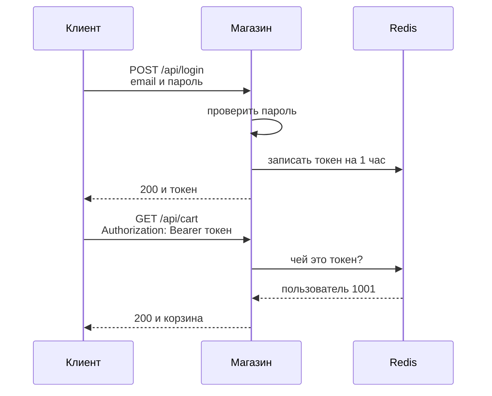
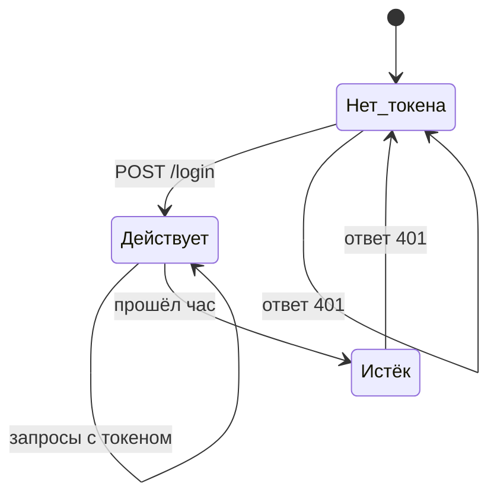
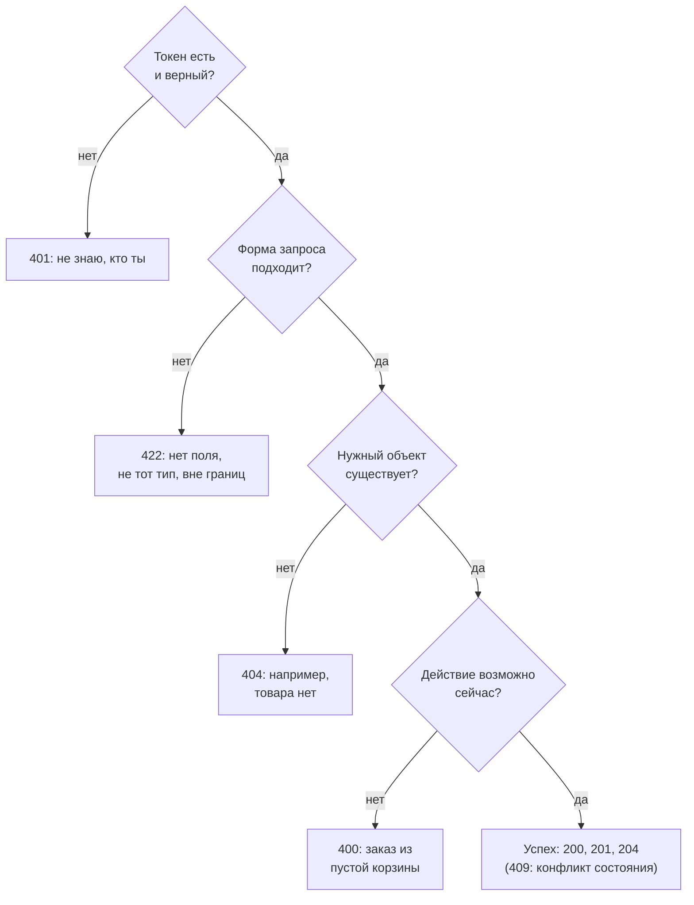

## Зачем это нужно

Я давно занимаюсь нагрузкой и буду рядом на этих уроках: расскажу то, что сам хотел бы услышать в первую неделю.

Допустим, в «Магазине» появилась жалоба: «после входа в личный кабинет всё тормозит». Каталог ты читать уже умеешь ([урок 2.1](01-client-server-http.md)), но жалуются не на него. Покупатель регистрируется, входит, кладёт товар в корзину и оформляет заказ. Нагрузочный тест должен ходить так же: запросами с данными в формате JSON (текст с полями) и с пропуском, токеном (строкой, которую сервер выдаёт после входа).

В первом своём тесте я запустил сотню виртуальных покупателей и увидел красный график: сплошные ошибки. Час я искал, что сломалось в магазине. Сломан был мой тест: он не прикладывал пропуск, и сервер каждому отвечал кодом 401: «не знаю, кто ты». С тех пор любой новый сценарий я сначала прохожу руками, и этому ты научишься здесь.

Вход и заказ к тому же обычно самые тяжёлые операции ([тема 11](../11-bottlenecks/index.md)), и начать надо с умения выполнить эти запросы руками и прочитать ответ.

Шаг проекта: ты зарегистрируешь своего тестового пользователя `student@shop.lab`, войдёшь, положишь товар в корзину и оформишь заказ. Всю цепочку запишешь в скрипт `~/perf-lab/02-web/order-flow.sh`: это прообраз сценария пользователя, который в [теме 9](../09-locust/index.md) ты переложишь на Locust.

## Что нужно знать

- Запрос, ответ, метод, заголовок, код статуса: [урок 2.1](01-client-server-http.md). Здесь мы много раз будем смотреть 200, 201, 401, 404, 422.
- Стенд «Магазин» запущен (`docker compose ps` показывает четыре `healthy`). Если нет, вернись к практике 2.1: `cd ~/load-tester/project/shop && docker compose up -d --wait`.
- `jq` установлен в [уроке 1.1](../01-linux/01-workstation-terminal.md): проверь `jq --version`.
- Переменные оболочки и подстановка `$(...)`: [урок 1.1](../01-linux/01-workstation-terminal.md).

## Картина целиком

Ты приходишь в клуб. На входе охранник проверяет паспорт (логин и пароль), и если всё в порядке, выдаёт браслет. Дальше внутри никто не просит паспорт: бармен смотрит на браслет и обслуживает. Браслет действует до закрытия клуба, потом недействителен. Потерял браслет: снова к охраннику.

Так работает вход в «Магазин». Логин и пароль ты отправляешь один раз и получаешь **токен** (token, «жетон»): длинную случайную строку, которая выполняет роль браслета. Каждый следующий запрос несёт токен в заголовке. Магазин по токену узнаёт, кто ты, и работает с твоей корзиной и твоими заказами.



На схеме видно: пароль участвует только в первом запросе. Токен Магазин хранит в Redis (быстрое хранилище «ключ → значение», подробно в [уроке 2.3](03-backend-anatomy.md)) и при каждом запросе заглядывает туда. Поэтому токен можно «отозвать»: достаточно удалить запись, и он перестаёт действовать.

## Теория

### JSON: как записывают данные в запросах и ответах

Клиент и сервер написаны на разных языках и работают на разных машинах. Как передать корзину с тремя товарами так, чтобы поняли оба? Они договариваются записывать данные как анкету с подписанными полями: «Имя: Иван, возраст: 30». Такая запись называется **JSON** (JavaScript Object Notation, читается «джейсон»). Правила строгие: перепутаешь кавычку, и анкету не примут.

Вот ответ каталога. В нём есть почти всё, что бывает в JSON:

```json
{
  "items": [
    {"id": 1, "name": "Товар 1", "price": 137.0, "category_id": 1, "stock": 1000000},
    {"id": 2, "name": "Товар 2", "price": 174.0, "category_id": 2, "stock": 1000000}
  ],
  "page": 1,
  "size": 2,
  "total": 10000
}
```

Фигурные скобки `{}` это **объект**: набор пар «ключ: значение», как строки анкеты. Квадратные `[]` это **список** значений через запятую. Текст пишут в двойных кавычках, числа без кавычек. Ещё бывают `true`, `false` и `null` («пусто»).

Читаем: `items` это список из двух товаров, а `total` показывает, что всего их 10000.

Когда клиент сам отправляет данные (регистрация, вход), он кладёт JSON в тело запроса и добавляет заголовок `Content-Type: application/json`. По нему сервер понимает, как читать тело. 

Три ошибки ты сделаешь в первые полчаса: одинарные кавычки (`{'email': 'a@b.c'}`), запятая после последнего элемента (`{"a": 1,}`) и ключ без кавычек. Четвёртая ловушка в оболочке: она «съест» двойные кавычки в `curl -d {"a":1}`, поэтому JSON оборачивай в одинарные: `-d '{"a":1}'`.

Осторожно: JSON похож на словарь Python, но в нём `true` и `false` пишутся строчными (в Python `True` и `False`). Подробнее: [урок 4.4](../04-python/04-files-json-csv.md).

> **Прикинь сам:** найди ошибку в `{"email": "a@b.c", "password": 'secret1234'}`.
{: .predict}

Пароль в одинарных кавычках. В JSON строки только в двойных: `"secret1234"`.

> **Главное:** JSON это текст из объектов `{}`, списков `[]`, строк в двойных кавычках, чисел и `true`, `false`, `null`; тело с JSON всегда сопровождает заголовок `Content-Type: application/json`.
{: .key}

Ответ сервера приходит одной длинной строкой. Как достать из неё токен, а не искать глазами?

### jq: достать нужное поле из JSON

В скриптах из ответа на вход нужен токен, из ответа на заказ номер. Программа `jq` (ты встречал её в [уроке 1.2](../01-linux/02-text-logs.md)) читает JSON и применяет к нему «фильтр», то есть описание того, что достать. Сохраним каталог из трёх товаров в файл (`-s` скрывает индикатор `curl`, `>` пишет ответ в файл):

```bash
curl -s 'http://localhost:8000/api/products?size=3' > /tmp/p.json
jq .total /tmp/p.json                          # 10000
jq '.items[0].name' /tmp/p.json                # "Товар 1"
jq -r '.items[0].name' /tmp/p.json             # Товар 1
jq -r '.items[] | select(.price > 150) | .name' /tmp/p.json   # Товар 2 и Товар 3
```

Разбор. Точка `.` значит «текущее значение», `.total` «поле `total`». `.items[0]` берёт первый элемент списка (счёт с нуля), `.items[]` каждый по очереди. Вертикальная черта `|` внутри фильтра передаёт результат слева в выражение справа, как труба в оболочке. `select(.price > 150)` оставляет только товары дороже 150, а `{id, status}` собирает из объекта новый, только с этими полями. Флаг `-r` (raw, «сырой») убирает кавычки вокруг строк, и он нужен, когда результат идёт в переменную.

Фильтр со скобками и чертой оборачивай в одинарные кавычки, иначе оболочка поймёт их по-своему.

> **Прикинь сам:** что напечатает `jq '.items[1].price' /tmp/p.json`?
{: .predict}

Второй товар, потому что счёт с нуля: `174.0`, цена видна в ответе каталога выше.

Осторожно: `jq: error: Cannot index array with string "items"` значит, что на этом месте список, а не объект: из списка достают элемент по номеру или через `[]`. А `parse error: Invalid numeric literal` значит, что пришёл не JSON, почти всегда текст ошибки (`Connection refused`) или HTML. Сначала посмотри, что вернул `curl`.

> **Главное:** `jq` достаёт поле по пути с точки, список разбирают через `[0]` или `[]`, `|` передаёт результат дальше, а `-r` убирает кавычки.
{: .key}

Данные читать умеем. А по каким правилам устроены адреса API?

### REST: адреса как существительные, методы как глаголы

Если адреса у каждого свои (`/getProduct`, `/doOrder`), к каждому API нужна своя инструкция. Негласное соглашение, которое это лечит, называется **REST** (Representational State Transfer): увидев адрес, ты примерно угадываешь, что он делает.

Первая идея: адрес называет **ресурс**, то есть предмет, с которым работает API. Это существительное: `/api/products` (все товары), `/api/products/42` (один товар), `/api/cart`, `/api/orders`. Вторая идея: действие задаёт метод HTTP, глагол ([урок 2.1](01-client-server-http.md)). `GET` читает, `POST` создаёт, `DELETE` удаляет. Поэтому один адрес с разными методами делает разное: `GET /api/orders` покажет заказы, `POST /api/orders` создаст новый.

Третья идея: сервер **не хранит состояние** между запросами (по-английски stateless). Он не помнит, что «этот клиент недавно смотрел каталог»: каждый запрос несёт всё нужное, включая токен. Зато запросы можно развести по разным серверам.

Для нагрузки отсюда следует важное: `GET` ничего не меняет, каталог безопасно нагружать, а `POST /api/orders` меняет склад и базу, и такой тест создаёт данные.

<details markdown="1">
<summary>Для любопытных: все адреса API «Магазина»</summary>

Общий префикс `/api`, `{id}` заменяется числом.

| Метод и адрес | Что делает | Токен | Ответ |
|---|---|---|---|
| `POST /register` | зарегистрироваться | нет | 201 |
| `POST /login` | войти, получить токен | нет | 200 |
| `GET /categories` | список категорий | нет | 200 |
| `GET /products` | каталог (`category_id`, `q`, `page`, `size`) | нет | 200 |
| `GET /products/{id}` | один товар | нет | 200 |
| `GET /cart` | моя корзина | да | 200 |
| `POST /cart/items` | добавить товар в корзину | да | 201 |
| `DELETE /cart/items/{id}` | убрать товар из корзины | да | 204 |
| `POST /orders` | оформить заказ из корзины | да | 201 |
| `GET /orders` | мои последние заказы (до 20) | да | 200 |
| `GET /orders/{id}` | мой заказ по номеру | да | 200 |

</details>

> **Прикинь сам:** как по правилам REST выглядит запрос, который убирает товар 5 из корзины, и какой код ждать?
{: .predict}

Ресурс «позиция корзины» плюс глагол «удалить»: `DELETE /api/cart/items/5` с токеном. Ждём 204: успех без тела.

Осторожно: REST это не «JSON поверх HTTP». REST про ресурсы и методы, а JSON лишь самый частый формат.

> **Главное:** адрес называет ресурс, метод называет действие, сервер между запросами ничего о клиенте не помнит.
{: .key}

Многие адреса требуют токен. Кто и как его проверяет?

### Аутентификация и авторизация

Покупатель вошёл в личный кабинет и видит чужие заказы. Какую проверку сервис пропустил? Их две. «Кто ты?» это **аутентификация** (authentication): проверка, что человек тот, за кого себя выдаёт. «Что тебе можно?» это **авторизация** (authorization): можно ли именно этому пользователю именно это действие. Без первой любой выдал бы себя за другого, без второй вошедший читал бы чужие заказы.

В здании с проходной паспорт отвечает на «кто ты», а пропуск, открывающий только твой этаж, на «куда тебе можно».

В «Магазине» аутентификация это `POST /api/login`: проверка пароля и выдача токена. Авторизация простая: у каждого пользователя свои корзина и заказы, и по токену Магазин берёт данные только этого пользователя. Если попросить чужой заказ, придёт `404 order not found`: Магазин не раскрывает, что такой заказ вообще есть.

С кодами ошибок так. **401** значит «не удалось понять, кто ты»: нет токена, он неверный или просрочен, пароль не подошёл. **403** значит «тебя знаю, но этого тебе нельзя». В «Магазине» 403 не бывает: права у всех одинаковые.

> **Главное:** аутентификация отвечает «кто ты» и кончается ошибкой 401, авторизация отвечает «что можно» и кончается 403 (или 404, если сервис прячет чужое).
{: .key}

Пароль проверяется один раз, а запросов за сессию десятки. Чем Магазин узнаёт тебя дальше?

### Токен и заголовок Authorization

Проверять пароль дорого. Пароль хранят не как есть, а в виде **хэша** (hash): необратимой «стружки» из пароля. Восстановить пароль из неё нельзя, можно только проверить, совпадает ли она. Считается хэш сотни миллисекунд, и это специально: так подбирать пароли медленно. Делать такую проверку на каждый запрос было бы нереально, поэтому пароль проверяют один раз и меняют на токен, который проверяется мгновенно.

Токен в «Магазине» это случайная строка из 64 символов, например `7c1e9f...3ab2`. Магазин пишет в Redis запись «токен → номер пользователя» на час: это время жизни записи (TTL, time to live), 3600 секунд, и поле `expires_in: 3600` сообщает его клиенту.

Клиент прикладывает токен к каждому запросу в заголовке:

```text
Authorization: Bearer 7c1e9f...3ab2
```

Слово **Bearer** («предъявитель») значит «обслужи того, кто предъявил этот токен». Кто знает токен, тот и считается пользователем, поэтому его хранят как пароль: не публикуют и не пишут в отчёты. Вот жизнь токена целиком:



Без токена или с истёкшим Магазин отвечает 401, и клиенту нужно снова пройти `login`.

> **Прикинь сам:** твой тест идёт 2,5 часа, а войти он успел один раз, в самом начале. Когда появятся 401?
{: .predict}

Через час: токен истёк, и каждый следующий запрос получит 401. Скрипт, не умеющий входить заново, соберёт тысячи «ошибок» при исправном сервере ([урок 9.3](../09-locust/03-data-checks.md)).

Осторожно: токен и пароль не одно и то же. Пароль знает только пользователь, а токен несут с каждым запросом.

> **Главное:** пароль меняют на токен один раз, дальше токен идёт в заголовке `Authorization: Bearer <токен>` и живёт час.
{: .key}

Но что будет, если ответ на `POST` потеряется по дороге, а клиент отправит запрос ещё раз?

### Идемпотентность: можно ли повторить запрос

В [уроке 2.1](01-client-server-http.md) мы уже говорили об идемпотентности. Сеть ненадёжна: ответ мог потеряться, и клиент не знает, выполнился запрос или нет. Повторить можно, только если это ничего не испортит.

Кнопка лифта, нажатая пять раз, работает как одна. Кнопка «купить» может дать пять покупок. Метод **идемпотентен**, если повтор оставляет систему в том же состоянии, что и первый запрос. `GET` идемпотентен, потому что только читает. `PUT` и `DELETE` по замыслу тоже: задать значение дважды то же самое, что один раз, и удалить уже удалённое не страшно. А `POST` не идемпотентен: два `POST /api/orders` создадут два заказа.

Для нагрузки это важно дважды: инструмент при ошибке может сам повторить запрос, и повтор `POST` исказит число заказов. А оплата в «Магазине» при сбое повторяется три раза: на настоящем сервисе для неё придумывают ключ идемпотентности, чтобы повтор не списал деньги дважды (урок 11.5).

Осторожно: идемпотентный не значит безопасный. Безопасный метод ничего не меняет (`GET`), а идемпотентный может менять, но повтор ничего нового не даст (`DELETE`).

> **Главное:** повтор идемпотентного запроса безвреден, повтор `POST` может создать вторую покупку, и нагрузочный инструмент не должен повторять такие запросы вслепую.
{: .key}

Осталось научиться читать ответ, когда запрос не удался.

### Код и тело ответа: где искать причину

Причину ищут в двух местах по порядку. Сначала код: 4xx значит ошибку клиента, 5xx сервера. Потом тело: в «Магазине» там всегда JSON с полем `detail`. Для 4xx в нём подсказка, что поправить. Для 5xx там обычно короткое сообщение, а подробности лежат в логах сервера по `request_id` (он есть и в заголовке ответа).

У `detail` две формы. Первая: `{"detail": "текст"}`, так отвечает сам код магазина (`invalid credentials`, `invalid or expired token`, `cart is empty`, `product not found`, `email already registered`). Вторая: `{"detail": [ {...}, ... ]}` для **ошибок проверки данных** (код 422). Это список, потому что ошибок может быть несколько, и каждая описывает, где (`loc`), что не так (`msg`) и какого типа (`type`).

Выбери сценарии в виджете:

<div class="viz" data-viz="web-http-exchange" data-set="auth" data-start="login-ok"></div>

Все неудачи возвращают `detail`. Сравни `bad-login`, `no-token` и `bad-token` (все 401, но текст разный), `cart-422` (проверка данных) и `empty-order` (код 400).

Плохой запрос получает 400, 404 или 422, и тут легко запутаться. Помогает последовательность вопросов:



Сервер проверяет пропуск, потом форму, потом существование объекта, потом состояние. При росте ошибок в тесте смотри на код: 401 и 422 говорят об ошибке теста, 503 и 504 о перегрузке стенда.

> **Проверь понимание:** запрос `POST /api/cart/items` с телом `{"product_id": 5, "qty": 0}` и верным токеном. Какой код вернётся?

<details markdown="1">
<summary>Ответ</summary>

422: `qty` должно быть не меньше 1, это нарушение формы данных. Токен верный, товар существует, но тело не прошло проверку.

</details>

> **Главное:** сначала смотри код (кто виноват), потом `detail` (что поправить); 401 и 422 чаще всего вина теста, 5xx вина сервера.
{: .key}

Вернись к жалобе про кабинет: теперь путь покупателя можно пройти руками и увидеть, из каких запросов он состоит.

## Практика

Все команды из каталога `~/perf-lab/02-web`. Стенд работает на `localhost:8000`.

```bash
cd ~/perf-lab/02-web
curl -s localhost:8000/readyz
```

Должно вернуться `{"status":"ready"}`. Если нет, сначала подними стенд.

### 1. Регистрация

Ты регистрируешь своего тестового пользователя. Новая команда: `curl` с телом. Разбор: `-X POST` задаёт метод, `-H 'Content-Type: application/json'` добавляет заголовок, `-d '...'` (data) передаёт тело, и если есть `-d`, `curl` по умолчанию сам выберет `POST`. `-i` покажет код и заголовки.

```bash
curl -i -X POST localhost:8000/api/register \
  -H 'Content-Type: application/json' \
  -d '{"email":"student@shop.lab","password":"learnload1"}'
```

Обратный слэш `\` в конце строки переносит команду на следующую строку: оболочка воспринимает её как одну.

```text
HTTP/1.1 201 Created
date: Sat, 03 Oct 2026 10:30:01 GMT
server: uvicorn
content-length: 38
content-type: application/json
x-request-id: 6d0a3f1e8c2b4a77a9e5f0d1c2b3a495

{"id":1001,"email":"student@shop.lab"}
```

**Как читать вывод:** 201 значит «создано». В теле номер нового пользователя (1001: тысяча готовых пользователей `user0001`…`user1000` уже есть) и email. Пароля в ответе нет, и это правильно. Регистрация заметно медленнее обычных запросов, потому что считается хэш пароля. Проверь: добавь `-w '%{time_total}\n' -o /dev/null` и увидишь около 0,25 с.

Повтори ту же команду:

```text
HTTP/1.1 409 Conflict
...
{"detail":"email already registered"}
```

409 значит «конфликт»: такой email уже есть. Если ты по какой-то причине зарегистрирован раньше, пропусти шаг и переходи к входу.

**Типичные ошибки:**

- `422` с `"msg":"String should have at least 8 characters"` и `"loc":["body","password"]`: пароль короче 8 символов.
- `422` с `"msg":"Value error, Нужен email"`: email без `@` или точки.
- `422` с `"type":"json_invalid"`: сломан JSON, обычно кавычки. Проверь одинарные кавычки вокруг `-d`.
- `422` с `"type":"missing"` и `"loc":["body","email"]`: опечатка в имени поля (или поля нет в теле).
- `422` с `"type":"model_attributes_type"` и `"loc":["body"]`: забыл заголовок `Content-Type: application/json`, и сервер не стал читать тело как JSON.

### 2. Вход и токен

```bash
curl -s -X POST localhost:8000/api/login \
  -H 'Content-Type: application/json' \
  -d '{"email":"student@shop.lab","password":"learnload1"}'
```

```text
{"token":"7c1e9f0a4b6d28e5c3f71a90d4b8e2c6f5a3091b7d8e4c2a6f0b9d1e3a5c7f48","expires_in":3600}
```

**Как читать вывод:** `token` это твой пропуск (у тебя будет другой), `expires_in` сколько секунд он действует. Теперь сохрани токен в переменную оболочки, чтобы не копировать его руками:

```bash
TOKEN=$(curl -s -X POST localhost:8000/api/login \
  -H 'Content-Type: application/json' \
  -d '{"email":"student@shop.lab","password":"learnload1"}' | jq -r .token)
echo "${TOKEN:0:12}..."
```

Разбор: `$( ... )` запускает команду и подставляет её вывод, `| jq -r .token` вытаскивает поле `token` без кавычек. `${TOKEN:0:12}` показывает только первые 12 символов: полный токен в терминале и в записях лучше не светить.

```text
7c1e9f0a4b6d...
```

Если вывод пустой, значит `jq` ничего не нашёл: проверь, что вход вернул 200, а не 401 (выполни команду без `| jq -r .token` и прочитай ответ).

Проверь ошибки входа:

```bash
curl -s -w '\n%{http_code}\n' -X POST localhost:8000/api/login \
  -H 'Content-Type: application/json' \
  -d '{"email":"student@shop.lab","password":"неверный"}'
```

```text
{"detail":"invalid credentials"}
401
```

`-w '\n%{http_code}\n'` печатает код после тела. Магазин не говорит, что именно неверно, пароль или email. Это сделано намеренно: иначе можно подбирать существующие адреса.

### 3. Кто я: корзина без токена и с токеном

Шаги 2-5 делай в одном окне терминала: переменная `TOKEN` живёт только в нём.

```bash
curl -s -w '\n%{http_code}\n' localhost:8000/api/cart
curl -s -w '\n%{http_code}\n' localhost:8000/api/cart -H 'Authorization: Bearer неверный'
curl -s -w '\n%{http_code}\n' localhost:8000/api/cart -H "Authorization: Bearer $TOKEN"
```

```text
{"detail":"bearer token required"}
401
{"detail":"invalid or expired token"}
401
{"items":[],"total":0}
200
```

**Как читать вывод:** первая и вторая команды обе дают 401, но с разным текстом: в первом случае токена нет вовсе, во втором он есть, но Магазин его не знает. Третья команда: кавычки двойные, потому что внутри нужна подстановка `$TOKEN` (в одинарных кавычках оболочка её не выполнит). Корзина пуста, `total` 0.

**Типичные ошибки:** `bearer token required`, хотя ты передал токен: заголовок написан неверно (`Bearer` и токен должны быть через пробел, в заголовке ровно два слова) или переменная `TOKEN` пуста (новое окно терминала не помнит переменных: выполни вход снова).

### 4. Положи товар в корзину

```bash
curl -s -X POST localhost:8000/api/cart/items \
  -H "Authorization: Bearer $TOKEN" \
  -H 'Content-Type: application/json' \
  -d '{"product_id":5,"qty":2}' | jq .
```

```text
{
  "items": [
    {
      "product_id": 5,
      "name": "Товар 5",
      "price": 285.0,
      "qty": 2
    }
  ],
  "total": 570.0
}
```

**Как читать вывод:** в ответ приходит вся корзина после добавления. Товар 5 стоит 285, их два, итого 570. Если выполнишь команду ещё раз, `qty` вырастет до 4: повторное добавление не создаёт вторую строку, а увеличивает количество (поэтому `POST /cart/items` нельзя назвать идемпотентным, как и говорилось в [2.1](01-client-server-http.md)).

Теперь три ошибки, каждая даёт свой код:

```bash
# 1. количество 0: нарушена форма, 422
curl -s -w '\n%{http_code}\n' -X POST localhost:8000/api/cart/items -H "Authorization: Bearer $TOKEN" \
  -H 'Content-Type: application/json' -d '{"product_id":5,"qty":0}'
# 2. такого товара нет: форма верна, объекта нет, 404
curl -s -w '\n%{http_code}\n' -X POST localhost:8000/api/cart/items -H "Authorization: Bearer $TOKEN" \
  -H 'Content-Type: application/json' -d '{"product_id":999999,"qty":1}'
# 3. DELETE товара 7: его в корзине нет, но ответ всё равно 204 и пустое тело
curl -s -w '%{http_code}\n' -X DELETE localhost:8000/api/cart/items/7 -H "Authorization: Bearer $TOKEN"
```

```text
{"detail":[{"type":"greater_than_equal","loc":["body","qty"],"msg":"Input should be greater than or equal to 1","input":0,"ctx":{"ge":1}}]}
422
{"detail":"product not found"}
404
204
```

**Как читать вывод:** в 422 поле `loc` указывает на `qty` в теле, `ctx` показывает граничное значение. 204 печатается без тела, поэтому в выводе видна только цифра. В корзине лежит только товар 5, а мы удаляли товар 7: сервер всё равно отвечает 204, потому что цель «чтобы товара 7 в корзине не было» достигнута. Удалить то, чего нет, не ошибка (так и должен вести себя идемпотентный DELETE). Корзина при этом не изменилась, товар 5 на месте, и следующий шаг сработает. Строки с `#` это комментарии оболочки: они ничего не делают, но объясняют, что происходит.

### 5. Оформи заказ

```bash
curl -s -X POST localhost:8000/api/orders -H "Authorization: Bearer $TOKEN" | jq .
```

```text
{
  "id": 200001,
  "status": "paid",
  "total": 1140.0,
  "items": [
    {
      "product_id": 5,
      "name": "Товар 5",
      "price": 285.0,
      "qty": 4
    }
  ]
}
```

Если ты добавил товар один раз, как в шаге 4, будет `qty: 2` и `total: 570.0`. В примере ниже команду шага 4 выполняли дважды, поэтому там `qty: 4` и `total: 1140.0`: у тебя цифры будут вдвое меньше. Номер заказа 200001: в базе уже есть 200 000 исторических заказов, твой стал первым новым.

**Как читать вывод:** 201, `status: "paid"` значит, что заказ оплачен (оплату выполнил сервис `payment`, подробности в [уроке 2.3](03-backend-anatomy.md)), `total` сумма, `items` что куплено. По времени заказ заметно медленнее каталога, потому что внутри идёт вызов оплаты, около 50 мс по умолчанию, плюс запись в базу.

Проверь, что корзина очищена, и повторный заказ невозможен:

```bash
curl -s -w '\n%{http_code}\n' -X POST localhost:8000/api/orders -H "Authorization: Bearer $TOKEN"
```

```text
{"detail":"cart is empty"}
400
```

Теперь посмотри свои заказы и чужой заказ:

```bash
curl -s localhost:8000/api/orders -H "Authorization: Bearer $TOKEN" | jq '.[0] | {id, status, total}'
curl -s -w '\n%{http_code}\n' localhost:8000/api/orders/1 -H "Authorization: Bearer $TOKEN"
```

```text
{
  "id": 200001,
  "status": "paid",
  "total": 1140.0
}
{"detail":"order not found"}
404
```

**Как читать вывод:** `GET /api/orders` возвращает список твоих заказов, свежие первыми, `.[0]` это самый новый. Заказ номер 1 существует, но принадлежит другому пользователю, и ты получаешь 404, а не 403: это и есть авторизация в действии.

**Типичные ошибки:**

- `{"detail":"not enough stock"}` с кодом 409: на складе меньше, чем в корзине. На свежем стенде остаток миллион, значит, ты случайно положил огромное `qty`.
- `502` с `payment failed` или `504` с `payment timeout`: сервис оплаты сейчас недоступен или медленный. Проверь `curl -s localhost:8001/healthz`, при необходимости `docker compose restart payment`.

### 6. Собери всё в скрипт

Теперь соберём цепочку в один файл. В скриптах переменные хранят промежуточные результаты, а проверка `set -e` останавливает выполнение при первой ошибке. Подробности про скрипты: [урок 1.5](../01-linux/05-bash-scripts.md).

```bash
cat > ~/perf-lab/02-web/order-flow.sh <<'EOF'
#!/usr/bin/env bash
# Сценарий покупателя: вход, корзина, заказ. Использование: ./order-flow.sh [email] [пароль]
set -euo pipefail
BASE=${BASE:-http://localhost:8000}
EMAIL=${1:-student@shop.lab}
PASSWORD=${2:-learnload1}

TOKEN=$(curl -s -X POST "$BASE/api/login" -H 'Content-Type: application/json' \
  -d "{\"email\":\"$EMAIL\",\"password\":\"$PASSWORD\"}" | jq -r .token)
if [ "$TOKEN" = "null" ] || [ -z "$TOKEN" ]; then
  echo "вход не удался" >&2
  exit 1
fi

AUTH="Authorization: Bearer $TOKEN"
JSON='Content-Type: application/json'

curl -s -X POST "$BASE/api/cart/items" -H "$AUTH" -H "$JSON" -d '{"product_id":10,"qty":1}' > /dev/null
curl -s -o /dev/null -w 'заказ: код %{http_code}, время %{time_total} с\n' \
  -X POST "$BASE/api/orders" -H "$AUTH"
EOF
chmod +x ~/perf-lab/02-web/order-flow.sh
~/perf-lab/02-web/order-flow.sh
```

```text
заказ: код 201, время 0.081342 с
```

Разбор: `set -euo pipefail` останавливает скрипт на ошибке, неизвестной переменной и сбое в середине труб. `${BASE:-...}` берёт значение переменной или запасное, `${1:-...}` аргумент скрипта или запасное. Ответ `jq -r .token` при неверном пароле даёт слово `null`, поэтому скрипт проверяет и его. `chmod +x` делает файл запускаемым. Запускай `./order-flow.sh user0001@shop.lab password`: это один из тысячи готовых пользователей.

Этот скрипт ты потом превратишь в сценарий нагрузочного теста: последовательность «вход, корзина, заказ» и есть путь пользователя ([урок 9.2](../09-locust/02-user-journey.md)). Дважды один скрипт для одного пользователя не страшно: заказ создаст ещё один заказ, а корзина каждый раз пополняется заново.

> Получил ошибку, которой нет в «Типичных ошибках»? Скопируй команду и ответ целиком (токен замени на `<токен>`), спроси, что значит каждое поле. Ответ проверь повторным запросом на стенде.
{: .ai}

## Сломай и почини

**Поломка 1. Токен «умер».** Токен хранится в Redis, а значит, его можно удалить. Сделай это сам, как будто прошёл час:

```bash
docker compose -f ~/load-tester/project/shop/compose.yaml exec redis redis-cli DEL "session:$TOKEN"
curl -s -w '\n%{http_code}\n' localhost:8000/api/cart -H "Authorization: Bearer $TOKEN"
```

**Задача.** Ответь заранее: что вернёт вторая команда и что теперь делать клиенту? Затем почини ситуацию.

<details markdown="1">
<summary>Разбор</summary>

```text
(integer) 1
{"detail":"invalid or expired token"}
401
```

`(integer) 1` значит, что удалена одна запись. Токен остался у тебя в переменной, но Магазин его больше не знает: 401 `invalid or expired token`. Это то же, что происходит через час. Починка: войти заново и получить новый токен (повтори команду с `TOKEN=$(...)` из шага 2). Вывод для нагрузочника: скрипт, который долго работает, обязан обрабатывать 401 повторным входом.

</details>

**Поломка 2. Пустой токен в скрипте.** Выполни:

```bash
TOKEN=""
curl -s -w '\n%{http_code}\n' localhost:8000/api/cart -H "Authorization: Bearer $TOKEN"
```

**Задача.** Какой код и какой текст? Почему это ошибка скрипта, а не сервера?

<details markdown="1">
<summary>Разбор</summary>

```text
{"detail":"bearer token required"}
401
```

Пустая переменная превратилась в заголовок `Authorization: Bearer ` без токена, и сервер видит не два слова, а одно. Виноват скрипт: он не проверил, что вход удался. Поэтому в `order-flow.sh` стоит проверка на пустую строку и `null`. Правило: до первого запроса «с токеном» убедись, что токен действительно получен.

</details>

**Поломка 3. Сломанный JSON.** Отправь вход с одинарными кавычками внутри:

```bash
curl -s -w '\n%{http_code}\n' -X POST localhost:8000/api/login -H 'Content-Type: application/json' \
  -d "{'email':'student@shop.lab','password':'learnload1'}"
```

**Задача.** Найди в ответе, в чём ошибка, и исправь. Подсказка: ответ не 500.

<details markdown="1">
<summary>Разбор</summary>

Ответ имеет код 422 и `"type":"json_invalid"`: сервер не смог прочитать тело как JSON, потому что кавычки одинарные. Исправление: внешние кавычки одинарные, внутренние двойные, как в шаге 2. Код 422, а не 500, потому что ошибка в данных клиента, сервер работает исправно.

</details>

## ИИ в помощь

Нейросеть помогает собирать запросы к API и объяснять ответы 401, 403 и 422. Общие правила на странице [ИИ-помощник](../ai.md).

**Задача:** собрать запрос `curl` для нового метода API.

```text
Мой стенд «Магазин» на http://localhost:8000. Нужно: войти (POST /api/login, email и password в JSON), взять токен и положить товар в корзину (POST /api/cart/items). Напиши команды curl и jq, чтобы токен попал в переменную, и объясни каждый флаг. Токен передавай заголовком Authorization: Bearer.
```
{: .wrap}

**Проверь ответ:** запусти команды на стенде и прочитай корзину (`GET /api/cart`). Типичная ошибка: токен в адресе вместо заголовка, `-d` без `Content-Type: application/json` (получишь 422) и выдуманные поля тела: сверь их с `/docs` стенда.

**Задача:** понять, почему пришёл 401, 403 или 422.

```text
Запрос (токен заменён на <токен>):
<вставь команду>
Ответ сервера целиком:
<вставь ответ>
Объясни код и текст ошибки и предложи, что проверить. Отдельно скажи, чем 401 отличается от 403.
```
{: .wrap}

**Проверь ответ:** подтверди причину по полю `detail` в ответе стенда. Типичная ошибка: совет «отключи проверку токена»: на сервере ты ничего не правишь, ты тестируешь.

Реальный токен, пароль и заголовок `Authorization` в чат не отправляй: замени на `<токен>` и `<пароль>`. Токены учебного стенда безобидны, но привычка нужна для работы.

## Словарик урока

| Термин | Простыми словами |
|---|---|
| JSON | Текстовый формат данных: объекты `{}`, списки `[]`, строки, числа |
| `Content-Type` | Заголовок, говорящий, в каком формате тело (`application/json`) |
| `jq` | Программа, которая достаёт нужные поля из JSON |
| REST | Стиль API: адреса это ресурсы, методы это действия |
| Ресурс (resource) | Предмет, с которым работает API: товар, корзина, заказ |
| Stateless | Сервер не помнит клиента между запросами, всё нужное есть в запросе |
| Аутентификация | Проверка «кто ты» |
| Авторизация | Проверка «что тебе можно» |
| Токен (token) | Случайная строка-пропуск, выдаётся после входа |
| Bearer | Схема заголовка: «обслужи предъявителя токена» |
| Хэш пароля | Необратимый «отпечаток» пароля; позволяет проверить совпадение, не храня пароль |
| TTL, `expires_in` | Время жизни токена в секундах |
| 401 | Неизвестно, кто ты: нет токена, он неверный или просрочен |
| 422 | Форма данных не подходит: нет поля, не тот тип, число вне границ |
| `detail` | Поле JSON с текстом ошибки в ответах «Магазина» |

## Вопросы с собеседований

Раздел для повторения: ответь вслух, потом открой ответ. Короткие вопросы тренируй на скорость: ответ за 30 секунд.

### 1. [junior] [часто] Чем аутентификация отличается от авторизации?

<details markdown="1">
<summary>Ответ</summary>

Аутентификация отвечает на вопрос «кто ты» (проверка логина и пароля, выдача токена), авторизация на вопрос «что тебе можно» (проверка прав на конкретное действие). Первая заканчивается ошибкой 401, вторая 403.

**Что хотят услышать:** два разных вопроса и два разных кода.

**Красный флаг:** считает их синонимами.

</details>

### 2. [junior] [часто] Как токен попадает в запрос и зачем он нужен?

<details markdown="1">
<summary>Ответ</summary>

Клиент входит один раз, получает токен и кладёт его в заголовок `Authorization: Bearer <токен>` каждого следующего запроса. Токен нужен, чтобы не проверять пароль на каждый запрос: это дорогая операция. Сервер находит по токену пользователя и работает с его данными.

**Что хотят услышать:** заголовок, одноразовый вход, срок жизни.

**Красный флаг:** «токен передаётся в адресе запроса» (он попадёт в логи).

</details>

### 3. [junior] [часто] Что такое REST и что из него нужно знать нагрузочнику?

<details markdown="1">
<summary>Ответ</summary>

Стиль API, где адреса называют ресурсы (`/orders`, `/products/42`), а методы HTTP задают действие. Запросы независимы: сервер не хранит состояние между ними, всё нужное передаётся в запросе. Нагрузочнику важно, что `GET` безопасен и его можно повторять, а `POST` и `DELETE` меняют данные, и по тому, какие ресурсы тест трогает, видно, какие данные он создаст.

**Что хотят услышать:** ресурсы, методы, stateless и связь с тестами.

**Красный флаг:** «REST это JSON».

</details>

### 4. [junior] Как отличить 401 от 403 и 404 от 422?

<details markdown="1">
<summary>Ответ</summary>

401: нет или неверный токен, не знаю, кто ты. 403: знаю, но нельзя. 404: форма запроса верная, но нужного объекта нет. 422: форма данных не подходит (нет поля, неверный тип, значение вне границ).

**Что хотят услышать:** по одной фразе на каждый код с примером.

**Красный флаг:** «все 4xx это просто ошибки клиента» без различий.

</details>

### 5. [junior] Что такое `Content-Type: application/json` и что будет без него?

<details markdown="1">
<summary>Ответ</summary>

Заголовок, который сообщает серверу формат тела. Без него сервер может не распознать тело как JSON и вернуть ошибку проверки (в «Магазине» это 422 `model_attributes_type`: «ожидался объект»), хотя тело было правильным.

**Что хотят услышать:** формат тела и пример последствия.

**Красный флаг:** «заголовок необязателен, и сервер сам догадается».

</details>

### 6. [junior] Почему нельзя передавать пароль или токен в адресе запроса?

<details markdown="1">
<summary>Ответ</summary>

Адрес целиком попадает в логи сервера и прокси, в историю браузера и в метрики. Секрет окажется в открытом виде в местах, куда есть доступ у многих. Пароль передают в теле запроса (по HTTPS), токен в заголовке.

**Что хотят услышать:** где остаются адреса и безопасная альтернатива.

**Красный флаг:** «в адресе удобнее».

</details>

### 7. [junior] Что делает `jq -r '.items[0].name'` и чем `-r` отличается от запуска без него?

<details markdown="1">
<summary>Ответ</summary>

Достаёт название первого товара из списка `items`. Без `-r` строка выводится в кавычках как JSON-значение (`"Товар 1"`), с `-r` без кавычек (`Товар 1`). Для подстановки результата в переменную нужен `-r`.

**Что хотят услышать:** индекс с нуля и назначение `-r`.

**Красный флаг:** путает `[0]` и `[]`.

</details>

### 8. [middle] Тест работает два часа, и в середине появляются 401. Что случилось и как исправить?

<details markdown="1">
<summary>Ответ</summary>

Токены живут час (`expires_in: 3600`) и протухли. Исправление: обрабатывать 401 повторным входом и подменой токена, либо перед истечением обновлять токен. В отчёте такие 401 нужно отделять от настоящих ошибок сервиса и считать ошибкой теста.

**Что хотят услышать:** срок жизни токена, повторный вход, различие ошибок теста и сервиса.

**Красный флаг:** «сервис нестабилен, 401 пошли после часа».

</details>

### 9. [middle] Ты нагружаешь вход (`/api/login`). Что надо учесть?

<details markdown="1">
<summary>Ответ</summary>

Вход сознательно дорогой: проверка хэша пароля занимает сотни миллисекунд процессорного времени. Если каждый виртуальный пользователь входит на каждой итерации, вход станет главной нагрузкой на процессор и скроет остальное. Нужно входить один раз и переиспользовать токен (как реальный пользователь), а отдельно нагружать вход, если это нужно. Тестовые пользователи должны быть заранее созданы, иначе регистрация со своим хэшем исказит тест.

**Что хотят услышать:** дороговизна хэширования, переиспользование токена, отдельный сценарий.

**Красный флаг:** «входить на каждой итерации проще всего».

</details>

### 10. [middle] Что значит «сервер без состояния» и чем это полезно при масштабировании?

<details markdown="1">
<summary>Ответ</summary>

Сервер не хранит данные клиента в собственной памяти между запросами, всё нужное приходит в запросе или лежит во внешнем хранилище (база, Redis). Тогда любой экземпляр может обработать любой запрос, и экземпляров можно добавлять и убирать, не теряя сессии. В «Магазине» состояние токенов и корзин вынесено в Redis именно поэтому.

**Что хотят услышать:** независимость запросов, вынос состояния, горизонтальное масштабирование.

**Красный флаг:** «сервер должен помнить пользователей в памяти».

</details>

### 11. [на скорость] Какой код вернёт заказ из пустой корзины и почему не 422?

<details markdown="1">
<summary>Ответ</summary>

400. Форма запроса верная, но действие невозможно из-за текущего состояния (корзина пуста). 422 это про неверные данные в запросе.

**Что хотят услышать:** 400 и различие с 422.

**Красный флаг:** «404» или «500».

</details>

### 12. [на скорость] Какой заголовок несёт токен?

<details markdown="1">
<summary>Ответ</summary>

`Authorization: Bearer <токен>`.

**Что хотят услышать:** имя заголовка и слово Bearer.

**Красный флаг:** «`Token: ...`» или «в адресе».

</details>

### 13. [на скорость] Какая версия JSON-ошибки в 422 и где искать, что не так?

<details markdown="1">
<summary>Ответ</summary>

Поле `detail` содержит список, у каждой записи `loc` (где: `body` или `query`, и имя поля) и `msg` (что не так).

**Что хотят услышать:** `detail`, `loc`, `msg`.

**Красный флаг:** «смотреть в логах сервера», хотя ответ уже всё объясняет.

</details>

## Проверено на версиях

Ubuntu 24.04, curl 8.5, jq 1.7, стенд «Магазин» из `project/shop` (FastAPI 0.142, PostgreSQL 18.6, Redis 8.10). Октябрь 2026.

## Итог урока: ты умеешь

- [ ] Прочитать и написать JSON, найти типичные ошибки записи.
- [ ] Достать нужное поле из ответа через `jq` и сохранить в переменную.
- [ ] Объяснить REST и по адресу с методом понять, что сделает запрос.
- [ ] Различить аутентификацию и авторизацию, объяснить, зачем токен.
- [ ] Зарегистрироваться, войти, положить товар в корзину и оформить заказ запросами `curl`.
- [ ] По коду и тексту `detail` различить 401, 404, 422 и 400.
- [ ] Написать скрипт `order-flow.sh`, выполняющий путь покупателя.

Дальше: [урок 2.3. Из чего состоит бэкенд](03-backend-anatomy.md), где мы заглянем за дверь «Магазина»: приложение, воркеры, база, Redis и пул соединений.
