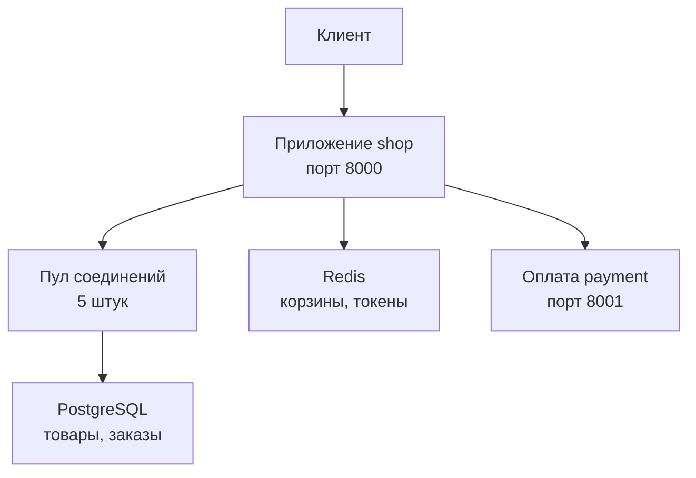
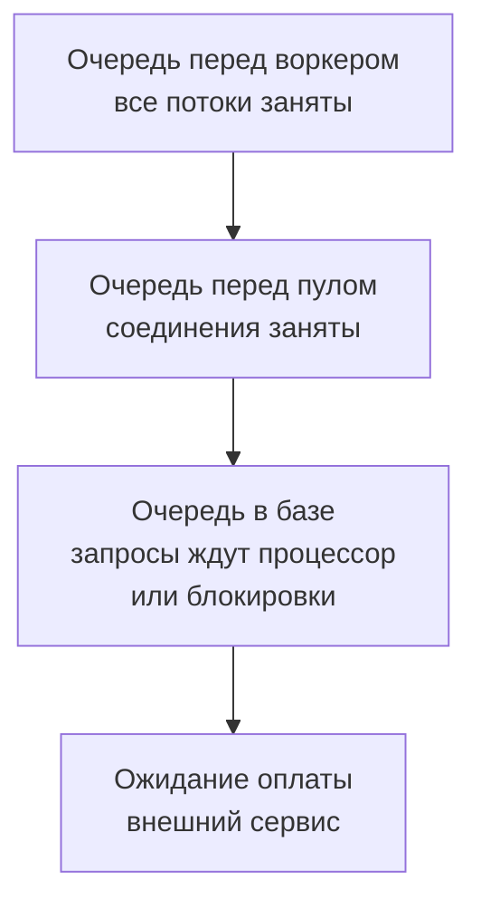

## Зачем это нужно

Я давно работаю с нагрузкой и покажу тебе то, с чего начинал сам: заглянуть за дверь сервиса. За неделю до распродажи коллега написал мне: «Заказы еле ползут, а процессоры скучают. Что не так?» Оказалось, сервис ждал медленного платёжного партнёра и при этом держал занятыми свои каналы к базе. Увидеть такое можно, только зная, из чего состоит **бэкенд** (серверная часть: всё, что работает за запросом, от приложения до внешних сервисов).

Нагрузочное тестирование ищет **узкое место** (слово из [урока 1.3](../01-linux/03-processes-resources.md)): часть системы, которая первой упирается в предел и тормозит остальных. Если бэкенд для тебя чёрный ящик, на графике «задержка выросла» ты гадаешь. Если знаешь части и их порядок, видишь, на какой ступеньке все застряли. Это нужно и для чтения цифр приложения: имя вроде `shop_db_pool_waiting` (число запросов, которые ждут доступа к базе) станет понятным, когда видишь, что за ним стоит.

Шаг проекта: ты пройдёшь за дверь «Магазина» и прочитаешь логи и сырые цифры приложения. Потом специально перегрузишь стенд медленной оплатой и увидишь, как это выглядит в ответах.

## Что нужно знать

- Запрос, ответ, коды 2xx, 4xx, 5xx: [урок 2.1](01-client-server-http.md). Здесь добавятся 502, 503, 504.
- Вход, токен, заказ через `curl`: [урок 2.2](02-rest-json-auth.md).
- Стенд запущен, пользователи `user0001@shop.lab`…`user1000@shop.lab` с паролем `password` и твой `student@shop.lab` существуют.

Больше о контейнерах, из которых состоит стенд, расскажет [тема 5](../05-docker/index.md): сейчас нам важны только роли программ.

## Картина целиком

Представь кухню ресторана. В зале администратор принимает заказы и несёт их повару. У кухни пять плит: больше пяти блюд сразу не приготовить. У стойки стоит холодильник с тем, что нужно достать мгновенно. А рядом работает поставщик, сторонняя фирма, которая подтверждает оплату. Пока она не ответила, администратор с чеком не может отойти от стола, а его плита стоит без дела.

Выходит странно: готовить некому не из-за загрузки, а из-за ожидания. Ожидающих всё больше, хотя плиты почти не греются. Аналогия ломается в одном: на кухне очередь видна глазами, а в сервисе её ищут по метрикам.

На стенде всё так же. Администратор это приложение `shop`. Кухня это **база данных** PostgreSQL, которая хранит всё на диске. Пять плит это **пул соединений**: пять заранее открытых каналов до базы, их выдают по очереди. Холодильник это Redis, быстрое хранилище в памяти. Поставщик это сервис оплаты `payment`.



Приложение получает запрос и обращается к трём соседям: к базе через пул, к Redis напрямую, к оплате по сети, как обычный клиент. Тормозить может само приложение, любой сосед или ожидание перед ним.

## Теория

### Приложение и воркер

Ты отправляешь запрос на `localhost:8000`. Кто-то должен его услышать и разобрать. Кто это и почему он может стать первой пробкой?

В «Магазине» работают две вещи. **Веб-сервер** (у нас Uvicorn) слушает порт и принимает запросы. Логика («проверить токен, найти товар, посчитать корзину») написана на Python с библиотекой FastAPI, и сервер передаёт запросы ей. Администратор из нашей кухни совмещает обе роли.

Всё это живёт в **воркере** (worker): отдельном процессе операционной системы (про процессы [урок 1.3](../01-linux/03-processes-resources.md)). По умолчанию на стенде он один: `WEB_CONCURRENCY=1` в `.env`. Один процесс на Python считает на одном ядре, поэтому тяжёлая работа вроде проверки пароля загружает его целиком, и остальные ждут.

Но ждать приходится не всегда. Запросы внутри воркера обрабатывают несколько **потоков** (порядка 40: отдельные «нити» работы внутри одного процесса), как несколько рук у одного администратора. Пока один запрос ждёт ответа базы, другие работают. Очередь появляется, когда заняты все потоки или ядро.

> **Прикинь сам:** один воркер, проверка пароля одного входа занимает 250 мс процессорного времени. Сколько входов в секунду он выдержит?
{: .predict}

В секунде 1000 мс, делим на 250: четыре входа в секунду. Это потолок одного ядра, реально чуть меньше. Поэтому вход заложен как узкое место ([урок 11.2](../11-bottlenecks/02-cpu.md)): сто покупателей, нажавших «Войти» разом, будут стоять почти полминуты.

Осторожно: воркер не равен серверу. Это один процесс. Машин может быть много, воркеров на каждой тоже: систему растят и так, и так.

> **Главное:** воркер один и ядро одно, поэтому тяжёлое вычисление превращается в очередь для всех.
{: .key}

Сам по себе администратор данных не хранит. Он ходит к соседям, и первый из них база.

### PostgreSQL: надёжное хранилище

Заказы и пользователи должны пережить перезапуск и сбой питания. Где они лежат, пока магазин не работает?

В базе данных. Данные там лежат в **таблицах**, как в электронной таблице: строка это одна запись (товар), колонки это её поля (название, цена). Приложение спрашивает на языке SQL, его разберём в [уроке 2.4](04-sql-basics.md). Две вещи важны для нагрузки. Когда база ответила «готово», данные уже на диске. И она работает **транзакциями** (transaction): заказ это запись заказа плюс списание товара со склада, и если второе не вышло, база откатывает и первое. Либо всё, либо ничего.

Третье свойство неприятное: соединений с базой мало (у нас `max_connections=100`), потому что каждое занимает память и отдельный процесс на стороне базы.

Осторожно: «база медленная, давайте заменим» почти всегда неверно. Базу тормозят наши запросы: нет индекса (указателя для быстрого поиска, [урок 2.4](04-sql-basics.md)), лишние обращения, долгие транзакции ([тема 11](../11-bottlenecks/03-database.md)).

> **Главное:** база надёжно хранит заказы и откатывает недоделанное, но соединений у неё мало.
{: .key}

Часть данных нужна на каждом шагу и не требует такой надёжности. Её держат отдельно.

### Redis и кэш: быстрая память

Корзину читают при каждом клике, токен входа проверяют при каждом запросе. Ходить за этим в базу на диск каждый раз слишком дорого. Где хранить то, что нужно часто, живёт недолго и не страшно потерять?

В оперативной памяти. **Redis** хранит всё как гардероб с номерками: «ключ → значение», отдал номерок и сразу получил вещь, за доли миллисекунды. Токен входа лежит под ключом `session:<токен>` (вход из [урока 2.2](02-rest-json-auth.md)) и живёт час. Корзина лежит под `cart:<id пользователя>`, пока её не очистят. Копия карточки товара лежит под `product:<id>` 60 секунд.

Копию создаёт **кэш** (cache): быстрая копия данных ближе к тому, кто их читает. Первый запрос карточки идёт в базу (около 5 мс) и оставляет копию в Redis. Следующие берут её за 0,5 мс. Ответ из копии называют **попаданием** (hit), поход в базу без копии **промахом** (miss). Минута жизни копии это её TTL ([урок 1.4](../01-linux/04-network-cli.md)): так мы не отдаём совсем старое. Кэш карточек по умолчанию выключен (`CACHE_ENABLED=0` в `.env`), ты включишь его в практике.

Осторожно: Redis быстрее базы, но данные в памяти при сбое могут пропасть. Поэтому заказы в базе, а токены и корзины в Redis. И кэш платит за скорость тем, что копия может отстать от оригинала: он хорош, когда читают часто, а меняют редко.

> **Проверь понимание:** сервис перезапустили вместе с Redis, память пропала. Что потеряно, а что нет?

<details markdown="1">
<summary>Ответ</summary>

Потеряны корзина и токен: пользователю придётся войти снова и собрать корзину заново. Заказы и пользователи сохранились, они в PostgreSQL.

</details>

> **Главное:** Redis держит быстрое и временное, PostgreSQL надёжное и важное.
{: .key}

Вернёмся к базе: соединений мало, а ходят к ней постоянно. Как их делить?

### Соединение с базой и пул

Чтобы обратиться к базе, приложение открывает соединение: идёт по сети, проходит проверку пароля, а база заводит под него процесс. Это десятки миллисекунд. Делать так на каждый запрос расточительно, а по соединению на каждого из тысячи покупателей база не выдержит: у неё лимит 100.

Так же устроен прокат самокатов. У пункта пять самокатов: взял, покатался, вернул, взял следующий. Если все заняты, шестой ждёт. Это и есть **пул соединений** (connection pool): заранее открытые соединения, которые выдают по очереди. Аналогия ломается там, где клиенты катаются подолгу, а запросы к базе короткие.

Пул у каждого воркера свой. Настройки в `.env`:

```text
DB_POOL_MIN=1      # сколько соединений держать открытыми в покое
DB_POOL_MAX=5      # максимум открытых одновременно
DB_POOL_TIMEOUT=5  # сколько секунд ждать свободное соединение
```

Запрос берёт соединение, выполняет дела с базой и возвращает его. Свободных нет: ждёт. Не дождался за пять секунд: приложение отвечает **503** с телом `{"detail":"database pool timeout"}`. Ожидание видно в метрике `shop_db_connection_wait_seconds`, число ждущих в `shop_db_pool_waiting`.

> **Прикинь сам:** пул из 5 соединений, каждый запрос держит соединение 20 мс. Сколько запросов в секунду пройдёт?
{: .predict}

Одно соединение обслуживает 1000 / 20 = 50 запросов в секунду. Пять дают 5 × 50 = 250. Правило словами: предел пула равен размеру пула, делённому на время, которое запрос держит соединение. Это короткая запись того, что мы посчитали, она пригодится в [уроке 8.2](../08-perf-theory/02-queues-littles-law.md).

Теперь смотри, как пул ведёт себя под нагрузкой. В виджете пул из 5 соединений, запрос держит соединение секунду, приходит 8 запросов в секунду. Меняй размер пула и длительность.

<div class="viz" data-viz="pool" data-size="5" data-duration="1000" data-rate="8" data-timeout="5000"></div>

Пока соединения свободны, запросы идут без ожидания. Как только их приходит больше, чем возвращается, растёт очередь, а кто ждёт дольше таймаута, получает ошибку.

Осторожно: размер пула не равен числу пользователей. Пять соединений обслужат сотни людей, если каждый держит соединение 5 мс, и захлебнутся, если каждый держит секунду. Пул не зло, он защищает базу. Но слишком маленький становится горлышком бутылки.

> **Главное:** предел пула равен размеру пула, делённому на время удержания соединения.
{: .key}

Время удержания решает всё. Что в «Магазине» держит соединение дольше всего?

### Внешняя оплата и ожидание внутри транзакции

Настоящие магазины сами деньги не принимают, а обращаются в платёжный сервис другой компании. У нас эту роль играет учебная заглушка `payment` на порту 8001. Она отвечает за 50 мс (с разбросом плюс-минус 20%, как у настоящей сети) и по команде может отвечать медленно или отказом.

Вот как «Магазин» оформляет заказ (`POST /api/orders`). Он берёт корзину из Redis, берёт соединение из пула и открывает транзакцию. Блокирует нужные товары (**блокировка** значит «пока я с этой строкой работаю, остальные ждут», так два покупателя не купят последний экземпляр), записывает заказ, списывает склад. Потом вызывает оплату и ждёт ответа. Прошла: завершает транзакцию, очищает корзину, отвечает 201.

Заметь: пока идёт вызов оплаты, соединение занято и блокировки держатся. В реальном коде сетевой вызов внутри транзакции считается плохой идеей. Здесь это сделано нарочно, как заложенная проблема для темы 11: она показывает, что время удержания определяет предельную пропускную способность.

Вторая заложенная проблема: **повторы** (retry). Если оплата не прошла, «Магазин» повторяет вызов ещё три раза (`PAYMENT_RETRIES=3`) без паузы, и каждая попытка снова держит соединение. Падающая оплата умножает нагрузку вчетверо.

Что увидит клиент? Оплата отказала на всех попытках: **502 Bad Gateway**, тело `{"detail":"payment failed"}`. Попытка не уложилась в `PAYMENT_TIMEOUT` (10 секунд на каждую), и так вышло в последней: **504 Gateway Timeout**, тело `{"detail":"payment timeout"}`. Это ошибки соседа, а не самого «Магазина». Заказ откатывается и не создаётся.

Считаем. Удержание это 10 мс на запросы к базе плюс задержка оплаты. При оплате в 50 мс удержание 60 мс, и 5 / 0,06 даёт около 83 заказов в секунду. При секунде удержание 1010 мс, и предел 5.

<div class="viz" data-viz="chart" data-type="line" data-x="50,100,250,500,1000" data-series='[{"name":"Предел заказов в секунду","values":[83,45,19,10,5]}]' data-x-label="Задержка оплаты, мс" data-y-label="Заказов в секунду" data-unit="заказов/с" data-explain="Чем медленнее оплата, тем дольше занято соединение и тем меньше заказов успевает пройти через пул из 5 соединений. При задержке 1 секунда предел всего 5 заказов в секунду, а чтения каталога при этом не страдают, пока им хватает других соединений."></div>

Наведи курсор на точку графика, чтобы увидеть значение. И заметь, что каталог берёт соединения из того же пула: когда заказы заняли все пять, ждёт и он.

> **Прикинь сам:** оплата отвечает за 2 секунды. Какой предел заказов в секунду и что с каталогом, если заказы идут сплошным потоком?
{: .predict}

Удержание около 2,01 секунды, предел 5 / 2,01 ≈ 2,5 заказа в секунду. Все пять соединений заняты заказами, поэтому каталог тоже ждёт: растёт задержка, потом приходят 503 «database pool timeout». Медленная оплата ломает не только заказы.

Осторожно: на вопрос «кто виноват?» легко ответить «оплата». Она виновата лишь в том, что отвечает долго. А то, что встал весь магазин, это дизайн: соединение с базой не должно ждать сеть.

> **Главное:** соединение, которое ждёт сеть, не работает на других, а повторы без паузы умножают проблему.
{: .key}

Мы видели ожидание на каждой ступеньке. Соберём их вместе.

### Очередь: где тесно

Любой ресурс с ограниченной ёмкостью (воркер, соединения пула, ядро базы) обслуживает запросы по одному или пачками. Приходят быстрее, чем обслуживаются: возникает очередь, и её время добавляется к задержке ответа. Именно очередь превращает «чуть медленнее» в «ничего не работает».

Время ответа складывается из работы и ожидания. В виджете путь одного запроса: подвигай ползунки.

<div class="viz" data-viz="request-path" data-net="5" data-app="4" data-db="10"></div>

У запроса несколько остановок, на каждой своя задержка, и общее время растёт ровно на ту, что выросла: так по разнице видно узкое место. На стенде запрос каталога (приложение и база) и заказ (плюс оплата) отличаются примерно на полсотни миллисекунд плюс запись заказа, и главная часть это оплата.

Очереди стоят на нескольких уровнях подряд:



Нагрузочный тест нужен, чтобы увидеть, какая очередь заполнится первой. Теорию очередей, включая закон Литтла, разберём в [уроке 8.2](../08-perf-theory/02-queues-littles-law.md).

Осторожно: «ошибок нет, значит, всё хорошо» неверно. Очередь сначала проявляется ростом задержки, ошибки приходят позже, когда ожидание перерастёт таймаут. Смотри на задержки и ожидания, а не только на коды ответов.

> **Главное:** очереди растут раньше ошибок, поэтому узкое место ищут по задержкам и ожиданиям.
{: .key}

Откуда брать эти числа? Приложение само о себе рассказывает.

### Метрики: как приложение рассказывает о себе

Чтобы видеть, сколько запросов в работе и сколько ждут пула, приложение ведёт счётчики и показывает их по запросу. Без них узкое место пришлось бы угадывать, как я с вопросом про скучающие процессоры.

«Магазин» отдаёт **метрики** по адресу `/metrics` текстом: строка на значение, имя, в скобках метки (уточнения вроде `method="GET"`), потом число. Видов три. **Счётчик** (counter) только растёт: `http_requests_total` считает все запросы (суффикс `_total` по традиции у счётчиков). **Датчик** (gauge) ходит вверх и вниз: `shop_db_pool_waiting` это сколько запросов ждут соединение прямо сейчас. **Гистограмма** (histogram) раскладывает замеры по корзинам («сколько запросов уложилось в 5 мс, в 10 мс») и даёт строки `_bucket`, `_sum`, `_count`. Из неё считают перцентили (идея из [урока 1.2](../01-linux/02-text-logs.md), подробнее в [уроке 8.1](../08-perf-theory/01-latency-throughput.md)).

> **Прикинь сам:** какой это вид метрики: число запросов, которые ждут соединение прямо сейчас?
{: .predict}

Оно то растёт, то падает, значит это датчик, `shop_db_pool_waiting`. А общее число всех запросов за всё время только растёт: это счётчик.

Список метрик «Магазина» лежит в [README стенда](https://github.com/distinguished-sre/load-tester/blob/main/project/shop/README.md), а зачем их собирать в Prometheus (программу, которая забирает метрики и хранит их историю), расскажет [урок 7.1](../07-observability/01-metrics-prometheus.md). Здесь мы читаем их глазами.

Осторожно: лог и метрику путают. Лог ([урок 1.2](../01-linux/02-text-logs.md)) это запись о каждом событии: «запрос завершился за 4 мс». Метрика это число, накопленное по многим событиям. Логов много и они подробны, метрики компактны и годятся для графиков.

> **Главное:** метрики это приборная панель сервиса: счётчик считает события, датчик показывает «сейчас», гистограмма раскладывает задержки.
{: .key}

К той самой неделе перед распродажей: коллеге я ответил, что надо смотреть `shop_db_pool_waiting` и время ожидания оплаты. Очередь стояла у пула, а виноват был медленный партнёр. Пора пройти за дверь самому.

## Практика

Все команды из `~/load-tester/project/shop`.

### 1. Кто работает

```bash
cd ~/load-tester/project/shop
docker compose ps --format 'table {{.Service}}\t{{.Status}}\t{{.Ports}}'
```

```text
SERVICE    STATUS                    PORTS
payment    Up 20 minutes (healthy)   0.0.0.0:8001->8001/tcp
postgres   Up 20 minutes (healthy)   0.0.0.0:5432->5432/tcp
redis      Up 20 minutes (healthy)   0.0.0.0:6379->6379/tcp
shop       Up 20 minutes (healthy)   0.0.0.0:8000->8000/tcp
```

Разбор: `--format` задаёт, какие колонки показать, `{{.Service}}` подставляет имя сервиса (это синтаксис Docker, а не твоей оболочки). Четыре программы, каждая в своём контейнере и каждая со своим портом.

**Как читать вывод:** здесь ровно те роли, которые мы разбирали в теории: `shop` приложение, `postgres` база, `redis` кэш и хранилище корзин и токенов, `payment` внешняя оплата. Если какой-то сервис не `healthy`, всё, что от него зависит, будет ломаться (мы это видели в уроке 2.1).

### 2. Журнал приложения

```bash
curl -s -o /dev/null localhost:8000/api/products/42
docker compose logs shop --tail 3
```

```text
shop-1  | {"ts": "2026-10-03T10:41:07.512345+00:00", "level": "INFO", "msg": "Запрос завершён", "method": "GET", "route": "/api/products/{id}", "path": "/api/products/42", "status": 200, "duration_ms": 4.21, "request_id": "3f9a1c0e7b2d4a58b6c1e90d2f7a4b13", "trace_id": "0af7651916cd43dd8448eb211c80319c"}
```

Разбор: `docker compose logs shop` печатает вывод сервиса `shop`, `--tail 3` последние три строки. Каждая строка это JSON о завершённом запросе: `route` это шаблон адреса (число 42 заменено на `{id}`, чтобы группировать запросы), `duration_ms` время обработки внутри приложения, `request_id` совпадает с заголовком `x-request-id` ответа: по нему можно найти конкретный запрос в журнале. Попробуй: `curl -si localhost:8000/api/products/42 | grep -i x-request-id`, потом найди этот номер в логе. Поле `trace_id` справа это номер трейса (цепочки шагов запроса внутри сервисов): о нём будет [урок 7.7](../07-observability/07-traces.md), пока его можно пропустить.

Запрос, который закончился ошибкой сервера (5xx), логируется уровнем `ERROR` и с полем `error`: так находят причину по журналу.

### 3. Сырые метрики

```bash
curl -s localhost:8000/metrics | grep -E '^shop_db_pool|^http_requests_in_progress'
```

```text
http_requests_in_progress 0.0
shop_db_pool_size 1.0
shop_db_pool_available 1.0
shop_db_pool_waiting 0.0
```

**Как читать вывод:** `http_requests_in_progress 0.0`: сейчас в обработке нет ни одного запроса. `shop_db_pool_size 1.0`: открыто одно соединение (минимум пула). `shop_db_pool_available 1.0` оно свободно, `shop_db_pool_waiting 0.0` ждущих нет. Числа с `.0` это формат метрик: все значения вещественные. После нагрузки `size` вырастет до 5.

Метрики запросов по маршрутам:

```bash
curl -s localhost:8000/metrics | grep '^http_requests_total' | head -n 5
```

```text
http_requests_total{method="GET",route="/api/products/{id}",status="200"} 1.0
http_requests_total{method="POST",route="/api/login",status="200"} 1.0
http_requests_total{method="POST",route="/api/orders",status="201"} 1.0
```

Метки `method`, `route`, `status` делят счётчик на отдельные ряды: по ним можно отдельно посчитать ошибки 5xx только по заказам. Метрик `/healthz`, `/readyz` и `/metrics` здесь нет, они намеренно исключены, чтобы проверки не засоряли статистику. Метрик кэша `shop_cache_requests_total` пока тоже нет: кэш выключен и ни разу не использовался (счётчик появляется после первого обращения).

### 4. Включи кэш и увидь попадания

Откроем настройки стенда и включим кэш карточек. Это временный эксперимент: в конце мы вернём настройку назад.

```bash
sed -i 's/^CACHE_ENABLED=0/CACHE_ENABLED=1/' .env
grep CACHE_ENABLED .env
docker compose up -d --wait shop
```

Разбор: `sed -i 's/было/стало/' файл` заменяет текст прямо в файле (`^` означает «в начале строки»). `up -d --wait shop` пересоздаёт только сервис `shop` с новыми настройками, остальные не трогает.

```text
CACHE_ENABLED=1
[+] Running 4/4
 ✔ Container shop-redis-1     Healthy
 ✔ Container shop-postgres-1  Healthy
 ✔ Container shop-payment-1   Healthy
 ✔ Container shop-shop-1      Healthy
```

Теперь запроси один и тот же товар дважды и посмотри метрики и Redis:

```bash
curl -s -o /dev/null localhost:8000/api/products/42
curl -s -o /dev/null localhost:8000/api/products/42
curl -s localhost:8000/metrics | grep '^shop_cache_requests_total'
docker compose exec redis redis-cli TTL product:42
```

```text
shop_cache_requests_total{result="miss"} 1.0
shop_cache_requests_total{result="hit"} 1.0
58
```

**Как читать вывод:** первый запрос был промахом (`miss`): в кэше пусто, магазин сходил в базу и положил копию. Второй попал (`hit`) и вернулся из Redis. `TTL` показывает, сколько секунд осталось жить копии (максимум 60): через минуту запись исчезнет, и следующий запрос снова пойдёт в базу.

Верни настройку на место, чтобы не мешать будущим урокам (кэш мы намеренно включим в [уроке 11.5](../11-bottlenecks/05-cache-dependencies.md)):

```bash
sed -i 's/^CACHE_ENABLED=1/CACHE_ENABLED=0/' .env
docker compose up -d --wait shop
```

**Типичные ошибки:** `sed: -e expression #1 ...`: опечатка в кавычках. Проверь `grep CACHE_ENABLED .env`: должно быть `CACHE_ENABLED=0` или `1`. `no such service: shop`: ты не в каталоге `~/load-tester/project/shop`.

### 5. Узнай, как быстро отвечает оплата

У сервиса оплаты есть служебный адрес с настройками, которые можно менять на лету без перезапуска. Пока посмотри их (менять будем в «Сломай и почини»):

```bash
curl -s localhost:8001/admin/config
```

```text
{"delay_ms":50.0,"fail_rate":0.0}
```

`delay_ms` задержка оплаты, `fail_rate` доля отказов от 0 до 1. Тот самый адрес `/admin/config` мы будем использовать в упражнениях по поиску узких мест; на реальном сервисе такого, конечно, нет.

> Не понимаешь, откуда в `/metrics` число? Найди метрику по имени, прочитай строку `# HELP`, потом спроси нейросеть. Ответ проверь, повторив запрос и посмотрев, как значение меняется.
{: .ai}

## Сломай и почини

**Поломка: переполни пул медленной оплатой, которая ещё и отказывает.** Мы сделаем так, чтобы оплата отвечала за 1,5 секунды и всегда отказывала. Тогда каждый заказ держит соединение 4 попытки по 1,5 секунды (6 секунд), а таймаут ожидания пула 5 секунд. Восемь одновременных заказов не поместятся в пять соединений. Заказы при отказе откатываются, значит, данные не пострадают.

Сначала перезапусти магазин, чтобы счётчики метрик обнулились, и подготовь восемь покупателей (каждый кладёт в корзину свой товар):

```bash
docker compose restart shop
until curl -sf localhost:8000/healthz >/dev/null; do sleep 1; done
for i in 1 2 3 4 5 6 7 8; do
  t=$(curl -s -X POST localhost:8000/api/login -H 'Content-Type: application/json' \
      -d "{\"email\":\"user000$i@shop.lab\",\"password\":\"password\"}" | jq -r .token)
  echo "$t" > /tmp/tok$i
  curl -s -o /dev/null -X POST localhost:8000/api/cart/items -H "Authorization: Bearer $t" \
      -H 'Content-Type: application/json' -d "{\"product_id\":$((100+i)),\"qty\":1}"
done
ls /tmp/tok* | wc -l
```

Разбор: `until команда; do ...; done` повторяет, пока команда не вернёт успех (ждём, пока магазин поднимется). Цикл входит под `user0001@shop.lab`…`user0008@shop.lab`, токен сохраняет в файл, кладёт в корзину товары с номерами 101–108. Последняя строка должна вывести `8`.

Теперь ломаем оплату и одновременно запускаем 8 заказов. Символ `&` в конце запускает команду в фоне, `wait` ждёт, пока все закончатся:

```bash
curl -s -X POST localhost:8001/admin/config -H 'Content-Type: application/json' -d '{"delay_ms":1500,"fail_rate":1}'
for i in 1 2 3 4 5 6 7 8; do
  curl -s -o /dev/null -w "покупатель $i: код %{http_code}, время %{time_total} с\n" \
    -X POST localhost:8000/api/orders -H "Authorization: Bearer $(cat /tmp/tok$i)" &
done
wait
```

**Задача.** Прежде чем открывать разбор, спрогнозируй результат. Подсказка для расчёта: заказ держит соединение 4 попытки по 1,5 с, то есть 6 с. Таймаут ожидания пула 5 с. Сколько заказов из восьми получат соединение сразу (пул на 5)? Остальные ждут 5 с и сдаются. Какой код у тех, кто получил соединение, и какой у тех, кто сдался (502 или 503)? Запусти, сравни, а затем найди подтверждение в метриках (`/metrics`) и верни оплату в норму.

<details markdown="1">
<summary>Разбор</summary>

Вывод примерно такой (строки приходят в порядке завершения):

```text
покупатель 6: код 503, время 5.012 с
покупатель 8: код 503, время 5.014 с
покупатель 7: код 503, время 5.015 с
покупатель 2: код 502, время 6.062 с
покупатель 1: код 502, время 6.064 с
покупатель 4: код 502, время 6.064 с
покупатель 3: код 502, время 6.067 с
покупатель 5: код 502, время 6.069 с
```

Пять заказов получили соединения сразу. Каждый вызывал оплату четыре раза подряд (одна попытка и три повтора, по 1,5 с, всего 6 секунд) и получил 502 `payment failed`: оплата всё время отвечала отказом. А три остальных пять секунд стояли в очереди перед пулом: все соединения заняты, а таймаут пула как раз 5 секунд. Они получили 503 `database pool timeout` и даже не дошли до оплаты. Порядок номеров у тебя будет другой, но число и времена близки: 5 ответов 502 примерно через 6 с (от 5 до 7: задержка оплаты каждый раз гуляет на 20%), 3 ответа 503 через 5 с.

Проверь метрики:

```bash
curl -s localhost:8000/metrics | grep -E '^shop_payment_requests_total|^shop_db_connection_wait_seconds_(sum|count)|^shop_db_pool_(size|waiting)|status="50[234]"'
```

```text
http_requests_total{method="POST",route="/api/orders",status="502"} 5.0
http_requests_total{method="POST",route="/api/orders",status="503"} 3.0
shop_payment_requests_total{result="error"} 20.0
shop_db_connection_wait_seconds_count 32.0
shop_db_connection_wait_seconds_sum 15.2
shop_db_pool_size 5.0
shop_db_pool_waiting 0.0
```

Читаем: 32 это число взятых соединений: 8 входов, 16 запросов корзины (проверка товара и чтение корзины берут соединение по отдельности) и 8 заказов. 20 неудачных попыток оплаты это пять заказов по четыре попытки: так повторы без паузы умножают нагрузку на соседа. `shop_db_connection_wait_seconds_sum` около 15 секунд суммарного ожидания (три запроса по 5 секунд). Размер пула вырос до 5 (максимум), а ждущих уже нет, потому что всё закончилось. Конкретные числа у тебя могут слегка отличаться, главное соотношение «20 = 5 × 4» и «около 15 секунд ожидания» (чуть больше из-за мелких ожиданий у остальных).

Починка: верни настройки оплаты к исходным, убери временные файлы и проверь оплату напрямую (это не создаёт заказов):

```bash
curl -s -X POST localhost:8001/admin/config -H 'Content-Type: application/json' -d '{"delay_ms":50,"fail_rate":0}'
rm -f /tmp/tok[1-8]
curl -s -X POST localhost:8001/pay -H 'Content-Type: application/json' -d '{"order_id":1,"amount":10}'
```

```text
{"delay_ms":50.0,"fail_rate":0.0}
{"status":"paid","order_id":1}
```

Первая строка подтверждает новые настройки, вторая показывает, что оплата снова отвечает успехом. Вывод для тестов: медленная и нестабильная зависимость плюс повторы без паузы и соединение, занятое на время вызова, превращают маленькую проблему в остановку всего сервиса. Эту цепочку ты разберёшь по-настоящему в [уроке 11.5](../11-bottlenecks/05-cache-dependencies.md).

</details>

## ИИ в помощь

Нейросеть хорошо объясняет устройство сервиса и метрики, а твой стенд не видит: давай ей реальный вывод. Общие правила на странице [ИИ-помощник](../ai.md).

**Задача:** прочитать сырые метрики `/metrics`.

```text
Это кусок вывода /metrics моего стенда (формат Prometheus):
<вставь 20 строк из curl -s localhost:8000/metrics>
Объясни каждую метрику: тип (counter, gauge, histogram), что она считает, в каких единицах. Какие две из них важнее всего при нагрузке на веб-сервис?
```
{: .wrap}

**Проверь ответ:** найди каждую метрику в своём выводе по имени. Типичная ошибка: выдуманные имена метрик (в стенде они вроде `http_requests_total` и `shop_db_pool_waiting`) и путаница counter с gauge.

**Задача:** понять роль кэша, пула и воркеров на примере стенда.

```text
В моём стенде FastAPI, PostgreSQL и Redis. Объясни простыми словами, зачем нужны пул соединений, кэш в Redis и несколько воркеров. Что станет с задержкой, если пул маленький, а запросов много?
```
{: .wrap}

**Проверь ответ:** проверь на стенде метрики `shop_cache_requests_total` и `shop_db_pool_*` в `/metrics`. Типичная ошибка: общие слова вроде «просто масштабируй» без связи с твоими метриками.

## Словарик урока

| Термин | Простыми словами |
|---|---|
| Бэкенд (backend) | Серверная часть: приложение, база, кэш и всё, что работает за запросом |
| Воркер (worker) | Один процесс, который принимает и обрабатывает запросы |
| Веб-сервер | Программа, которая слушает порт и передаёт запросы коду приложения (у нас Uvicorn) |
| База данных (database) | Программа, которая надёжно хранит данные на диске и быстро ищет нужное |
| Таблица | Набор однотипных записей: строки это записи, колонки это поля |
| Транзакция (transaction) | Группа действий, которая выполняется целиком или откатывается целиком |
| Redis | Быстрое хранилище «ключ → значение» в оперативной памяти |
| Кэш (cache) | Быстрая копия данных, чтобы не ходить за ними в медленное место |
| Попадание, промах (hit, miss) | Данные нашлись в кэше или нет |
| Соединение (connection) | Открытый канал до базы, который стоит времени и ресурсов |
| Пул соединений (connection pool) | Набор заранее открытых соединений, которые выдают по очереди |
| Таймаут (timeout) | Сколько ждать, прежде чем сдаться и вернуть ошибку |
| Повтор (retry) | Повторный вызов после неудачи |
| Очередь (queue) | Запросы, ожидающие, пока освободится ресурс |
| 502, 503, 504 | Плохой ответ соседа; сервис не может сейчас работать; сосед не ответил вовремя |
| Метрика (metric) | Число, которое приложение ведёт о себе: счётчик, датчик, гистограмма |

## Вопросы с собеседований

Раздел для повторения: ответь вслух, потом открой ответ. Короткие вопросы тренируй на скорость: ответ за 30 секунд.

### 1. [junior] [часто] Зачем нужен пул соединений с базой?

<details markdown="1">
<summary>Ответ</summary>

Открытие соединения с базой дорого (сеть, аутентификация, процесс в базе). Пул держит готовые соединения и выдаёт их запросам по очереди, а потом принимает обратно. Это ускоряет запросы и защищает базу: число соединений ограничено, и тысяча одновременных запросов не открывает тысячу соединений.

**Что хотят услышать:** стоимость открытия и защита от перегрузки базы.

**Красный флаг:** «пул ускоряет сам запрос к базе».

</details>

### 2. [junior] [часто] Что такое кэш, и когда он помогает, а когда вредит?

<details markdown="1">
<summary>Ответ</summary>

Быстрая копия данных ближе к тому, кто их читает. Помогает, когда читают часто, а меняют редко: ответ приходит из памяти быстрее и разгружает базу. Вредит, когда данные быстро меняются: копия устаревает, пользователь видит старое. Также нужно решать, когда кэш обновлять (TTL, сброс при изменении).

**Что хотят услышать:** попадания и промахи, устаревание, TTL.

**Красный флаг:** «кэш всегда ускоряет».

</details>

### 3. [junior] [часто] Чем Redis отличается от PostgreSQL?

<details markdown="1">
<summary>Ответ</summary>

PostgreSQL хранит данные на диске, надёжно и транзакционно, умеет сложные запросы, но медленнее. Redis хранит всё в оперативной памяти по принципу «ключ-значение», очень быстрый, но данные при сбое могут пропасть. В «Магазине» заказы и пользователи в PostgreSQL, токены и корзины в Redis.

**Что хотят услышать:** надёжность и скорость как компромисс, пример разделения.

**Красный флаг:** «Redis просто быстрая версия базы».

</details>

### 4. [junior] Что такое воркер и почему он важен для нагрузки?

<details markdown="1">
<summary>Ответ</summary>

Процесс, обрабатывающий запросы. Один воркер Python использует примерно одно ядро для вычислений, значит, при тяжёлых операциях он становится узким местом и запросы ждут в очереди. Увеличение числа воркеров позволяет использовать больше ядер, но каждый воркер имеет свой пул соединений, и суммарно соединений с базой становится больше.

**Что хотят услышать:** связь воркеров с ядрами и с соединениями базы.

**Красный флаг:** «воркер это сервер».

</details>

### 5. [junior] Что значат 502, 503 и 504?

<details markdown="1">
<summary>Ответ</summary>

502: сервис получил плохой ответ от соседа (оплата отказала). 503: сервис не может обработать запрос сейчас (нет соединения с базой, пул не дождался, перегрузка). 504: сосед не ответил за отведённое время. Все три из семейства 5xx, и по ним ищут проблему не у клиента, а на стороне сервиса и его зависимостей.

**Что хотят услышать:** различие и связь с зависимостями.

**Красный флаг:** «все 5xx означают одно и то же».

</details>

### 6. [junior] Что такое транзакция и почему внутри неё нельзя делать долгие сетевые вызовы?

<details markdown="1">
<summary>Ответ</summary>

Транзакция выполняет несколько действий как одно: либо все, либо ни одного. Пока она открыта, соединение с базой занято и блокировки на строках удерживаются. Если внутри ждать сеть (оплату), то соединение и блокировки держатся всё это время: растут очереди за пулом и блокировки, и вся система упирается в самого медленного соседа.

**Что хотят услышать:** удержание соединения и блокировок, пример.

**Красный флаг:** «транзакция только для денег».

</details>

### 7. [junior] Что такое метрика типа counter и gauge?

<details markdown="1">
<summary>Ответ</summary>

Counter только растёт и считает события (всего запросов). Для скорости считают, на сколько он вырос за секунду. Gauge показывает текущее значение, которое растёт и падает (запросов в работе, соединений в пуле). Для задержек используют гистограмму: раскладывает наблюдения по корзинам, из неё считают перцентили.

**Что хотят услышать:** три типа и по примеру.

**Красный флаг:** «счётчик показывает текущее значение».

</details>

### 8. [middle] Пул на 5 соединений, запрос держит соединение 100 мс. Сколько запросов в секунду выдержит система и что случится при 80 в секунду?

<details markdown="1">
<summary>Ответ</summary>

Предел: 5 соединений, каждое обслуживает 10 запросов в секунду, итого 50 запросов в секунду. При 80 в секунду избыток 30 запросов в секунду копится в очереди перед пулом: растёт время ожидания, затем запросы начинают упираться в таймаут пула и получают ошибку 503. Возможные решения: сократить время удержания, увеличить пул (с оглядкой на лимит соединений базы), снизить нагрузку.

**Что хотят услышать:** формула «размер ÷ время удержания», рост очереди, таймаут как проявление.

**Красный флаг:** «просто добавить сервер» без анализа, где очередь.

</details>

### 9. [middle] Задержка заказа выросла, а CPU приложения и базы почти не загружены. Где искать?

<details markdown="1">
<summary>Ответ</summary>

Скорее всего ожидание, а не вычисления: очередь перед пулом соединений, блокировки в базе или медленный внешний сервис. Смотрю метрики пула (ожидающие, свободные), ожидание соединения, длительность вызовов к внешним сервисам, блокировки в базе. Сравниваю время запроса в приложении и время в базе или у соседа: разница показывает, где ждут.

**Что хотят услышать:** различие «занят» и «ждёт», конкретные метрики.

**Красный флаг:** «значит, надо больше процессоров».

</details>

### 10. [middle] Почему повторы (retry) без паузы опасны?

<details markdown="1">
<summary>Ответ</summary>

Когда соседний сервис уже перегружен или падает, повтор без паузы умножает число обращений к нему (три повтора дают четырёхкратную нагрузку) и держит у себя соединения и потоки ещё дольше. Получается шторм, из-за которого проблема усугубляется. Правильно: пауза с нарастанием (backoff), ограничение числа повторов, повторять только идемпотентные операции и ставить общий лимит времени.

**Что хотят услышать:** усиление нагрузки, backoff, идемпотентность.

**Красный флаг:** «повтор всегда повышает надёжность».

</details>

### 11. [на скорость] Что произойдёт, если все соединения пула заняты и приходит ещё запрос?

<details markdown="1">
<summary>Ответ</summary>

Он встанет в очередь и будет ждать освобождения. Если не дождётся за таймаут пула, получит ошибку (у нас 503 «database pool timeout»).

**Что хотят услышать:** ожидание и таймаут.

**Красный флаг:** «откроется дополнительное соединение».

</details>

### 12. [на скорость] Как считается предел пропускной способности пула?

<details markdown="1">
<summary>Ответ</summary>

Размер пула, делённый на время удержания соединения. 5 соединений при удержании 0,05 с дают 100 запросов в секунду.

**Что хотят услышать:** формула и единицы измерения.

**Красный флаг:** не может объяснить, откуда берётся число.

</details>

### 13. [на скорость] Где в нашем стенде лежат токены входа, а где заказы?

<details markdown="1">
<summary>Ответ</summary>

Токены (и корзины) в Redis, заказы в PostgreSQL.

**Что хотят услышать:** оба хранилища и причина (скорость против надёжности).

**Красный флаг:** путает их местами.

</details>

## Проверено на версиях

Ubuntu 24.04, Docker Engine 29, Docker Compose 2.40, стенд «Магазин» из `project/shop` (FastAPI 0.142, Uvicorn 0.54, PostgreSQL 18.6, Redis 8.10). Октябрь 2026.

## Итог урока: ты умеешь

- [ ] Назвать части бэкенда «Магазина» и сказать, что делает каждая.
- [ ] Объяснить, что такое пул соединений, и посчитать его предел по формуле «размер ÷ время удержания».
- [ ] Объяснить, чем кэш отличается от базы, и показать попадание и промах на метриках.
- [ ] По 502, 503, 504 понять, у какого соседа проблема.
- [ ] Прочитать лог запроса и найти его по `request_id`.
- [ ] Прочитать сырой вывод `/metrics`: имя, метки, значение, и отличить счётчик от датчика.
- [ ] Показать, как медленная оплата занимает пул и ломает остальные запросы.

Дальше: [урок 2.4. SQL и PostgreSQL](04-sql-basics.md), где мы заглянем в сам PostgreSQL и узнаем, как он ищет данные и зачем нужен индекс.
