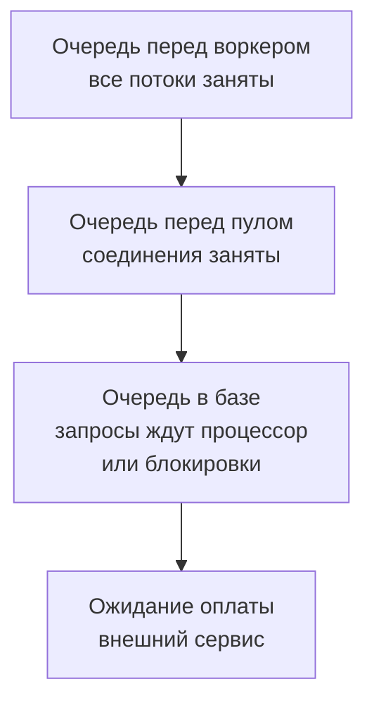

## Зачем это нужно

Нагрузочное тестирование ищет **узкое место**: ту часть системы, которая первой упирается в предел и тормозит всех остальных. Чтобы его найти, нужно знать, из каких частей состоит сервис и что делает каждая. Если для тебя «бэкенд» это чёрный ящик, то на графике «задержка выросла» ты будешь гадать. Если ты знаешь, что запрос проходит через приложение, пул соединений, базу и внешнюю оплату, то видишь, у какой ступеньки очередь.

Эта тема нужна и для чтения метрик: имена вроде `shop_db_pool_waiting` или `shop_cache_requests_total` станут понятными, когда ты знаешь, что за ними стоит.

Шаг проекта: ты пройдёшь за дверь «Магазина»: посмотришь, какие программы работают на стенде, прочитаешь их логи и сырые метрики, а потом специально переполнишь пул соединений медленной оплатой и увидишь, как это выглядит в ответах и в цифрах.

## Что нужно знать

- Запрос, ответ, коды 2xx, 4xx, 5xx: [урок 2.1](01-client-server-http.md). Здесь добавятся 502, 503, 504.
- Вход, токен, заказ через `curl`: [урок 2.2](02-rest-json-auth.md).
- Стенд запущен, пользователи `user0001@shop.lab`…`user1000@shop.lab` с паролем `password` и твой `student@shop.lab` существуют.

Больше о контейнерах, из которых состоит стенд, расскажет [тема 5](../05-docker/index.md): сейчас нам важны только роли программ.

## Картина целиком

Кухня ресторана. Зал и официанты (приложение) принимают заказы. Кухня (база данных) готовит основное блюдо, но у неё всего пять плит: больше пяти блюд одновременно не приготовить. Холодильник у стойки (Redis) хранит то, что нужно достать мгновенно. Поставщик (платёжный сервис) сторонняя организация: пока он не подтвердил оплату, официант с чеком в руках не может отойти от стола. И теперь, если поставщик отвечает медленно, официант стоит у стола и ждёт, а вместе с ним занята и его плита на кухне, хотя готовить уже нечего. Очередь за плитами растёт, хотя кухня как будто не загружена.

Эта же история происходит на нашем стенде. Так устроен «Магазин» изнутри:


На схеме приложение получает запрос и обращается к трём соседям. К базе оно ходит через **пул** (набор заранее открытых соединений), к Redis напрямую, к оплате по HTTP как обычный клиент. Всё, что может тормозить, это либо само приложение, либо один из соседей, либо очередь перед ним.

## Теория

### Приложение и воркер

**Зачем это существует.** Приложение это программа, которая содержит логику «Магазина»: проверить токен, найти товар, посчитать корзину. Но программе нужен кто-то, кто слушает порт, принимает запросы по сети и передаёт их коду. Эту работу делает **веб-сервер**. У нас он называется Uvicorn, а логика написана на Python с помощью библиотеки FastAPI.

**Аналогия.** Администратор в зале ресторана: встречает гостя, выслушивает заказ и отдаёт его подходящему повару. Аналогия ломается тем, что у нас администратор и повар один процесс.

**Как это устроено.** **Воркер** (worker) это отдельный процесс операционной системы, который принимает и обрабатывает запросы. В нашем стенде по умолчанию воркер один (`WEB_CONCURRENCY=1` в `.env`). Один процесс на Python использует одно ядро процессора для вычислений, поэтому тяжёлая работа (например, проверка пароля) его загружает, и остальные запросы ждут. Внутри воркера обработчики запросов выполняются параллельно в нескольких потоках (по умолчанию порядка 40), так что пока один запрос ждёт ответа от базы, другие продолжают работать. Но когда все потоки заняты или процессор занят вычислениями, запросы встают в очередь.

Посмотри, какие процессы живут на стенде. Команды выполняй из `~/load-tester/project/shop` (здесь и дальше).

**Что путают.** «Воркер это сервер». Нет, это один процесс одной программы. Серверов (машин) может быть много, воркеров на каждом тоже. Масштабирование делают и так, и так: больше воркеров на одной машине или больше машин.

> **Проверь понимание:** в приложении один воркер, а проверка пароля одного входа занимает 250 мс процессорного времени. Сколько входов в секунду максимум выдержит такая конфигурация?

<details markdown="1">
<summary>Ответ</summary>

Примерно четыре: 1000 мс делим на 250 мс. Это верхняя граница для одного ядра, и в реальности чуть меньше, потому что на то же ядро приходятся и остальные запросы. Поэтому в заготовках стенда вход назван заложенным узким местом ([урок 11.2](../11-bottlenecks/02-cpu.md)).

</details>

### PostgreSQL: надёжное хранилище

**Зачем это существует.** Заказы, пользователи, товары должны пережить перезапуск и сбой питания. Для этого нужна **база данных** (database): специальная программа, которая хранит данные на диске, умеет быстро искать нужное и не теряет записанное. **PostgreSQL** одна из самых распространённых.

**Как это устроено.** Данные лежат в **таблицах**: как в электронной таблице, где каждая строка это запись (один товар), а колонки это её поля (цена, название). Приложение спрашивает у базы на языке SQL (разберём в [уроке 2.4](04-sql-basics.md)). Важные для нас свойства:

- Запись **надёжна**: после ответа «готово» данные уже на диске.
- Работает **транзакциями** (transaction): группа действий, которая выполняется целиком или не выполняется вовсе. Заказ это пара действий: записать заказ и списать товар со склада. Если второе не получилось, откатывается и первое.
- Число одновременных соединений ограничено (у нас `max_connections=100`), и каждое соединение занимает память и отдельный процесс на стороне базы.

**Что путают.** «База медленная, поэтому её надо заменить». Обычно медленной делают базу запросы: нет индекса, лишние запросы, длинные транзакции. Разбор следующим уроком и в [теме 11](../11-bottlenecks/03-database.md).

### Redis: быстрая память

**Зачем это существует.** Есть данные, которые нужны очень часто, живут недолго и не страшно потерять: корзина покупок, токен входа, кэш карточки товара. Класть их в базу с диском дорого. **Redis** хранит всё в оперативной памяти и работает по принципу «ключ → значение», поэтому отвечает за доли миллисекунды.

**Как это устроено.** В «Магазине» Redis хранит три вида записей. Это можно проверить своими глазами:

```bash
docker compose exec redis redis-cli --scan --pattern '*' | head -n 5
```

```text
session:7c1e9f0a4b6d28e5c3f71a90d4b8e2c6f5a3091b7d8e4c2a6f0b9d1e3a5c7f48
```

Разбор: `docker compose exec redis` выполняет команду внутри контейнера `redis`, `redis-cli` консольный клиент Redis, `--scan --pattern '*'` перечисляет все ключи, `head -n 5` оставляет первые пять. Ключ `session:<токен>` это запись входа из прошлого урока. Если у тебя есть непустая корзина, увидишь ещё `cart:1001`. Кэш карточек товара (`product:42`) по умолчанию выключен: в `.env` `CACHE_ENABLED=0`.

| Что | Ключ | Время жизни | Зачем |
|---|---|---|---|
| Токен входа | `session:<токен>` | 1 час | кто ты |
| Корзина | `cart:<id пользователя>` | пока не очищена | что в корзине |
| Кэш карточки | `product:<id>` | 60 секунд (если включён) | не ходить в базу за популярным товаром |

**Кэш** (cache) это копия данных, лежащая ближе и быстрее оригинала. Прочитал товар из базы за 5 мс, положил копию в Redis, следующие запросы получают её за 0,5 мс. **Попадание** (hit) это ответ из кэша, **промах** (miss) это когда копии нет или она устарела и надо идти в базу. Кэш стоит включать, когда читают часто, а меняют редко. За это приходится платить: копия может устареть, пока оригинал уже поменялся.

**Что путают.** Redis и базу. Redis быстрее, но хранит в памяти, и данные при сбое могут пропасть. Поэтому важные вещи (заказы) живут в базе, а мелкие и временные (корзина, токен) в Redis.

> **Проверь понимание:** пользователь добавил товар в корзину, и сервис перезапустили вместе с Redis (данные в памяти пропали). Что потеряно и что нет?

<details markdown="1">
<summary>Ответ</summary>

Потеряны корзина и токен: пользователю придётся войти снова и собрать корзину заново. Заказы и пользователи сохранились, они в PostgreSQL.

</details>

### Соединение с базой и пул

**Зачем это существует.** Чтобы обратиться к базе, приложение должно открыть соединение: пройти по сети, пройти проверку пароля, база создаёт под него процесс. Это занимает десятки миллисекунд, и делать это на каждый запрос расточительно. Идея **пула соединений** (connection pool): заранее открыть несколько соединений и выдавать их по очереди тем, кому они нужны.

**Аналогия.** Прокат самокатов. У пункта пять самокатов. Приехал, взял самокат, покатался, вернул, следующий взял. Если пятый самокат взят, а подошёл шестой клиент, он ждёт, пока кто-то вернёт. Самокат стоит денег и места, поэтому их не покупают по штуке на каждого прохожего. Аналогия ломается там, что клиенты пункта проката разной длительности катаются, а запросы к базе обычно очень короткие.

**Как это устроено.** Пул у приложения свой, на каждый воркер. Настройки в `.env`:

- `DB_POOL_MIN=1`: сколько соединений держать открытыми в покое;
- `DB_POOL_MAX=5`: максимум одновременно открытых;
- `DB_POOL_TIMEOUT=5`: сколько секунд запрос готов ждать свободное соединение. Не дождался: приложение отвечает **503** с телом `{"detail":"database pool timeout"}`.

Порядок работы для каждого запроса, которому нужна база: взять соединение из пула (если нет свободных, ждать), выполнить запросы, вернуть соединение. Поэтому одновременно в базе работают не более пяти запросов от одного воркера. Остальные ждут в очереди перед пулом. Это ожидание видно в метрике `shop_db_connection_wait_seconds`, а число ждущих в `shop_db_pool_waiting`.

Пул это не зло, а защита: без него тысяча одновременных запросов открыла бы тысячу соединений, и база (у неё `max_connections=100`) бы отвалилась. Но слишком маленький пул делает из него горлышко бутылки.

Пошагово: сначала запросов мало и соединения свободны, потом их приходит больше, чем можно обслужить, и растёт очередь, и, наконец, ожидание достигает таймаута. Посмотри, как это происходит: в виджете пул из 5 соединений, каждый запрос держит соединение 1 секунду, и приходит 8 запросов в секунду. Попробуй менять размер пула и длительность.

<div class="viz" data-viz="pool" data-size="5" data-duration="1000" data-rate="8" data-timeout="5000"></div>

Смотри на виджет: пока соединения свободны, запросы проходят без ожидания. Как только их приходит больше, чем пул успевает возвращать, появляется очередь, а у тех, кто ждёт дольше таймаута, соединение «не дождалось» и запрос завершается ошибкой. Очередь растёт не от «большого числа пользователей», а от соотношения «сколько соединений» и «сколько времени каждое занято».

**Что путают.** Размер пула и «число пользователей». Пять соединений вполне обслужат сотни пользователей, если каждый занимает соединение на пять миллисекунд. Но те же пять соединений захлебнутся, если каждый держит его секунду.

> **Проверь понимание:** пул из 5 соединений, каждый запрос держит соединение 20 мс. Сколько запросов в секунду максимум пройдёт через пул?

<details markdown="1">
<summary>Ответ</summary>

Одно соединение обслуживает 1000 / 20 = 50 запросов в секунду, пять соединений дают 5 × 50 = 250 запросов в секунду. Эта простая формула «размер пула, делённый на время удержания» пригодится ниже и в [уроке 8.2](../08-perf-theory/02-queues-littles-law.md).

</details>

### Внешняя оплата и ожидание внутри транзакции

**Зачем это существует.** Реальные магазины не принимают деньги сами, они обращаются в платёжный сервис другой компании. У нас эту роль играет учебная заглушка `payment` на порту 8001. Она отвечает с задержкой (по умолчанию 50 мс, с разбросом плюс-минус 20%, как у настоящей сети) и может по команде отвечать медленно или отказом.

**Как это устроено.** Как «Магазин» оформляет заказ (`POST /api/orders`):

1. Берёт корзину из Redis.
2. Берёт соединение из пула и **открывает транзакцию**.
3. Читает и блокирует нужные товары (чтобы два покупателя не купили последний экземпляр одновременно), записывает заказ, списывает склад.
4. Вызывает оплату по HTTP и ждёт ответа.
5. Если оплата прошла, завершает транзакцию, очищает корзину и отвечает 201.

В шаге 4 во время вызова оплаты соединение пула занято и блокировки на товарах удерживаются. В реальном коде так делать не принято: сетевой вызов внутри транзакции плохая идея. В «Магазине» это сделано **нарочно**, как заложенная проблема для упражнений темы 11. Здесь она нужна, чтобы ты увидел главное: **время удержания соединения определяет предельную пропускную способность**.

Есть ещё вторая заложенная проблема: **повторы** (retry). Если оплата не прошла (ошибка или таймаут), «Магазин» повторяет вызов ещё три раза (`PAYMENT_RETRIES=3`), **без паузы**. Каждая попытка может занять соединение ещё на время ожидания, так что медленная или падающая оплата умножает нагрузку на пул вчетверо.

Что видит клиент: оплата ответила отказом на все попытки: **502 Bad Gateway** `{"detail":"payment failed"}`. Оплата не успела ответить за `PAYMENT_TIMEOUT` (10 секунд): **504 Gateway Timeout** `{"detail":"payment timeout"}`. 502 и 504 это ошибки соседа, а не самого «Магазина». Заказ при этом откатывается и не создаётся.

Вот как время ожидания зависит от задержки оплаты. Предел заказов в секунду для пула в 5 соединений по формуле «размер, делённый на время удержания» (удержание это 10 мс на запросы к базе плюс задержка оплаты):

<div class="viz" data-viz="chart" data-type="line" data-x="50,100,250,500,1000" data-series='[{"name":"Предел заказов в секунду","values":[83,45,19,10,5]}]' data-x-label="Задержка оплаты, мс" data-y-label="Заказов в секунду" data-unit="заказов/с" data-explain="Чем медленнее оплата, тем дольше занято соединение и тем меньше заказов успевает пройти через пул из 5 соединений. При задержке 1 секунда предел всего 5 заказов в секунду, а чтения каталога при этом не страдают, пока им хватает других соединений."></div>

Виджет показывает: при 50 мс (нормальная оплата) предел около 83 заказов в секунду, при секунде всего 5. Наведи курсор на любую точку графика, чтобы увидеть значение. Ещё важное: даже когда «оплата медленная», медленной становится и вся остальная база для тех же пяти соединений, потому что каталог берёт соединения из того же пула.

**Что путают.** «Оплата медленная, значит, виновата оплата». Оплата виновата только в том, что отвечает долго. А то, что из-за этого встаёт весь магазин, виноват дизайн: соединение с базой не должно ждать сеть.

> **Проверь понимание:** оплата стала отвечать за 2 секунды, пул 5 соединений. Какой теперь предел заказов в секунду, и что будет с каталогом, если заказы идут сплошным потоком?

<details markdown="1">
<summary>Ответ</summary>

Удержание около 2,01 секунды, предел 5 / 2,01 ≈ 2,5 заказа в секунду. Все пять соединений заняты заказами, поэтому запросы каталога тоже ждут свободное соединение: растёт задержка, потом приходят 503 «database pool timeout». Медленная оплата ломает не только заказы.

</details>

### Очередь: где тесно

**Зачем это существует.** Любой ресурс с ограниченной ёмкостью (воркер, соединения пула, процессор базы) обслуживает запросы по одному или пачками. Когда запросы приходят быстрее, чем обслуживаются, образуется очередь, и время ожидания в ней добавляется к задержке ответа. Именно очередь превращает «немного медленнее» в «ничего не работает».

**Как это устроено.** Время ответа складывается из времени ожидания в очередях и времени работы. Вот как выглядит путь одного запроса и из каких частей он состоит (подвигай ползунки):

<div class="viz" data-viz="request-path" data-net="5" data-app="4" data-db="10"></div>

Смотри на схему: у запроса несколько остановок, и на каждой есть своя задержка. Если увеличить одну из них, всё общее время вырастет на эту величину: так по разнице в задержке видно, где узкое место. На своём стенде ты увидишь то же самое в цифрах: время запроса к каталогу (приложение и база) и заказа (плюс оплата) отличаются как раз на сто мс.

Очереди бывают на нескольких уровнях сразу:



Смотри: запрос проходит эти очереди последовательно. Нагрузочный тест нужен, чтобы увидеть, какая из них заполняется первой. Подробную теорию очередей, включая закон Литтла, мы разберём в [уроке 8.2](../08-perf-theory/02-queues-littles-law.md).

**Что путают.** «Нет ошибок, значит, всё хорошо». Очередь сначала проявляется ростом задержки, ошибки приходят позже, когда ожидание превысит таймаут. Смотреть нужно на задержки и очереди, а не только на коды ответов.

### Метрики: как приложение рассказывает о себе

**Зачем это существует.** Чтобы видеть, что происходит внутри (сколько запросов в работе, сколько ждут пула), приложение само ведёт счётчики и показывает их по запросу. Без этого узкое место приходилось бы угадывать по внешним признакам.

**Как это устроено.** «Магазин» отдаёт свои метрики по адресу `/metrics` в текстовом формате: по строке на каждое значение, имя и в фигурных скобках метки, затем число. Метрики бывают нескольких видов:

- **Счётчик** (counter): только растёт, например `http_requests_total` (сколько запросов было всего). Суффикс `_total` по традиции у счётчиков.
- **Датчик** (gauge): число, которое ходит вверх и вниз, например `shop_db_pool_waiting` (сколько запросов ждут соединение прямо сейчас).
- **Гистограмма** (histogram): раскладывает наблюдения по корзинам («сколько запросов уложилось в 5 мс, в 10 мс...»), даёт строки `_bucket`, `_sum` и `_count`. Из неё считают перцентили ([урок 8.1](../08-perf-theory/01-latency-throughput.md)).

Какие метрики есть у «Магазина», перечислено в [README стенда](https://github.com/distinguished-sre/load-tester/blob/main/project/shop/README.md); зачем их собирать в Prometheus, рассказывает [урок 7.1](../07-observability/01-metrics-prometheus.md). Здесь мы только читаем их глазами.

**Что путают.** Лог и метрику. Лог это запись о каждом событии («запрос такой-то завершился за 4 мс»), метрика это счётчик и числа в сумме. Логов много и они подробны, метрики компактны и годятся для графиков.

## Практика

Все команды из `~/load-tester/project/shop`.

### 1. Кто работает

```bash
cd ~/load-tester/project/shop
docker compose ps --format 'table {{.Service}}\t{{.Status}}\t{{.Ports}}'
```

```text
SERVICE    STATUS                    PORTS
payment    Up 20 minutes (healthy)   0.0.0.0:8001->8001/tcp
postgres   Up 20 minutes (healthy)   0.0.0.0:5432->5432/tcp
redis      Up 20 minutes (healthy)   0.0.0.0:6379->6379/tcp
shop       Up 20 minutes (healthy)   0.0.0.0:8000->8000/tcp
```

Разбор: `--format` задаёт, какие колонки показать, `{{.Service}}` подставляет имя сервиса (это синтаксис Docker, а не твоей оболочки). Четыре программы, каждая в своём контейнере и каждая со своим портом.

**Как читать вывод:** здесь ровно те роли, которые мы разбирали в теории: `shop` приложение, `postgres` база, `redis` кэш и хранилище корзин и токенов, `payment` внешняя оплата. Если какой-то сервис не `healthy`, всё, что от него зависит, будет ломаться (мы это видели в уроке 2.1).

### 2. Журнал приложения

```bash
curl -s -o /dev/null localhost:8000/api/products/42
docker compose logs shop --tail 3
```

```text
shop-1  | {"ts": "2026-10-03T10:41:07.512345+00:00", "level": "INFO", "msg": "Запрос завершён", "method": "GET", "route": "/api/products/{id}", "path": "/api/products/42", "status": 200, "duration_ms": 4.21, "request_id": "3f9a1c0e7b2d4a58b6c1e90d2f7a4b13", "trace_id": "0af7651916cd43dd8448eb211c80319c"}
```

Разбор: `docker compose logs shop` печатает вывод сервиса `shop`, `--tail 3` последние три строки. Каждая строка это JSON о завершённом запросе: `route` это шаблон адреса (число 42 заменено на `{id}`, чтобы группировать запросы), `duration_ms` время обработки внутри приложения, `request_id` совпадает с заголовком `x-request-id` ответа: по нему можно найти конкретный запрос в журнале. Попробуй: `curl -si localhost:8000/api/products/42 | grep -i x-request-id`, потом найди этот номер в логе. Поле `trace_id` справа это номер трейса (цепочки шагов запроса внутри сервисов): о нём будет [урок 7.7](../07-observability/07-traces.md), пока его можно пропустить.

Запрос, который закончился ошибкой сервера (5xx), логируется уровнем `ERROR` и с полем `error`: так находят причину по журналу.

### 3. Сырые метрики

```bash
curl -s localhost:8000/metrics | grep -E '^shop_db_pool|^http_requests_in_progress'
```

```text
http_requests_in_progress 0.0
shop_db_pool_size 1.0
shop_db_pool_available 1.0
shop_db_pool_waiting 0.0
```

**Как читать вывод:** `http_requests_in_progress 0.0`: сейчас в обработке нет ни одного запроса. `shop_db_pool_size 1.0`: открыто одно соединение (минимум пула). `shop_db_pool_available 1.0` оно свободно, `shop_db_pool_waiting 0.0` ждущих нет. Числа с `.0` это формат метрик: все значения вещественные. После нагрузки `size` вырастет до 5.

Метрики запросов по маршрутам:

```bash
curl -s localhost:8000/metrics | grep '^http_requests_total' | head -n 5
```

```text
http_requests_total{method="GET",route="/api/products/{id}",status="200"} 1.0
http_requests_total{method="POST",route="/api/login",status="200"} 1.0
http_requests_total{method="POST",route="/api/orders",status="201"} 1.0
```

Метки `method`, `route`, `status` делят счётчик на отдельные ряды: по ним можно отдельно посчитать ошибки 5xx только по заказам. Метрик `/healthz`, `/readyz` и `/metrics` здесь нет, они намеренно исключены, чтобы проверки не засоряли статистику. Метрик кэша `shop_cache_requests_total` пока тоже нет: кэш выключен и ни разу не использовался (счётчик появляется после первого обращения).

### 4. Включи кэш и увидь попадания

Откроем настройки стенда и включим кэш карточек. Это временный эксперимент: в конце мы вернём настройку назад.

```bash
sed -i 's/^CACHE_ENABLED=0/CACHE_ENABLED=1/' .env
grep CACHE_ENABLED .env
docker compose up -d --wait shop
```

Разбор: `sed -i 's/было/стало/' файл` заменяет текст прямо в файле (`^` означает «в начале строки»). `up -d --wait shop` пересоздаёт только сервис `shop` с новыми настройками, остальные не трогает.

```text
CACHE_ENABLED=1
[+] Running 4/4
 ✔ Container shop-redis-1     Healthy
 ✔ Container shop-postgres-1  Healthy
 ✔ Container shop-payment-1   Healthy
 ✔ Container shop-shop-1      Healthy
```

Теперь запроси один и тот же товар дважды и посмотри метрики и Redis:

```bash
curl -s -o /dev/null localhost:8000/api/products/42
curl -s -o /dev/null localhost:8000/api/products/42
curl -s localhost:8000/metrics | grep '^shop_cache_requests_total'
docker compose exec redis redis-cli TTL product:42
```

```text
shop_cache_requests_total{result="miss"} 1.0
shop_cache_requests_total{result="hit"} 1.0
58
```

**Как читать вывод:** первый запрос был промахом (`miss`): в кэше пусто, магазин сходил в базу и положил копию. Второй попал (`hit`) и вернулся из Redis. `TTL` показывает, сколько секунд осталось жить копии (максимум 60): через минуту запись исчезнет, и следующий запрос снова пойдёт в базу.

Верни настройку на место, чтобы не мешать будущим урокам (кэш мы намеренно включим в [уроке 11.5](../11-bottlenecks/05-cache-dependencies.md)):

```bash
sed -i 's/^CACHE_ENABLED=1/CACHE_ENABLED=0/' .env
docker compose up -d --wait shop
```

**Типичные ошибки:** `sed: -e expression #1 ...`: опечатка в кавычках. Проверь `grep CACHE_ENABLED .env`: должно быть `CACHE_ENABLED=0` или `1`. `no such service: shop`: ты не в каталоге `~/load-tester/project/shop`.

### 5. Узнай, как быстро отвечает оплата

У сервиса оплаты есть служебный адрес с настройками, которые можно менять на лету без перезапуска. Пока посмотри их (менять будем в «Сломай и почини»):

```bash
curl -s localhost:8001/admin/config
```

```text
{"delay_ms":50.0,"fail_rate":0.0}
```

`delay_ms` задержка оплаты, `fail_rate` доля отказов от 0 до 1. Тот самый адрес `/admin/config` мы будем использовать в упражнениях по поиску узких мест; на реальном сервисе такого, конечно, нет.

> Не понимаешь, откуда в `/metrics` число? Найди метрику по имени, прочитай строку `# HELP`, потом спроси нейросеть. Ответ проверь, повторив запрос и посмотрев, как значение меняется.
{: .ai}

## Сломай и почини

**Поломка: переполни пул медленной оплатой, которая ещё и отказывает.** Мы сделаем так, чтобы оплата отвечала за 1,5 секунды и всегда отказывала. Тогда каждый заказ держит соединение 4 попытки по 1,5 секунды (6 секунд), а таймаут ожидания пула 5 секунд. Восемь одновременных заказов не поместятся в пять соединений. Заказы при отказе откатываются, значит, данные не пострадают.

Сначала перезапусти магазин, чтобы счётчики метрик обнулились, и подготовь восемь покупателей (каждый кладёт в корзину свой товар):

```bash
docker compose restart shop
until curl -sf localhost:8000/healthz >/dev/null; do sleep 1; done
for i in 1 2 3 4 5 6 7 8; do
  t=$(curl -s -X POST localhost:8000/api/login -H 'Content-Type: application/json' \
      -d "{\"email\":\"user000$i@shop.lab\",\"password\":\"password\"}" | jq -r .token)
  echo "$t" > /tmp/tok$i
  curl -s -o /dev/null -X POST localhost:8000/api/cart/items -H "Authorization: Bearer $t" \
      -H 'Content-Type: application/json' -d "{\"product_id\":$((100+i)),\"qty\":1}"
done
ls /tmp/tok* | wc -l
```

Разбор: `until команда; do ...; done` повторяет, пока команда не вернёт успех (ждём, пока магазин поднимется). Цикл входит под `user0001@shop.lab`…`user0008@shop.lab`, токен сохраняет в файл, кладёт в корзину товары с номерами 101–108. Последняя строка должна вывести `8`.

Теперь ломаем оплату и одновременно запускаем 8 заказов. Символ `&` в конце запускает команду в фоне, `wait` ждёт, пока все закончатся:

```bash
curl -s -X POST localhost:8001/admin/config -H 'Content-Type: application/json' -d '{"delay_ms":1500,"fail_rate":1}'
for i in 1 2 3 4 5 6 7 8; do
  curl -s -o /dev/null -w "покупатель $i: код %{http_code}, время %{time_total} с\n" \
    -X POST localhost:8000/api/orders -H "Authorization: Bearer $(cat /tmp/tok$i)" &
done
wait
```

**Задача.** Прежде чем открывать разбор, спрогнозируй результат. Подсказка для расчёта: заказ держит соединение 4 попытки по 1,5 с, то есть 6 с. Таймаут ожидания пула 5 с. Сколько заказов из восьми получат соединение сразу (пул на 5)? Остальные ждут 5 с и сдаются. Какой код у тех, кто получил соединение, и какой у тех, кто сдался (502 или 503)? Запусти, сравни, а затем найди подтверждение в метриках (`/metrics`) и верни оплату в норму.

<details markdown="1">
<summary>Разбор</summary>

Вывод примерно такой (строки приходят в порядке завершения):

```text
покупатель 6: код 503, время 5.012 с
покупатель 8: код 503, время 5.014 с
покупатель 7: код 503, время 5.015 с
покупатель 2: код 502, время 6.062 с
покупатель 1: код 502, время 6.064 с
покупатель 4: код 502, время 6.064 с
покупатель 3: код 502, время 6.067 с
покупатель 5: код 502, время 6.069 с
```

Пять заказов получили соединения сразу. Каждый вызывал оплату четыре раза подряд (одна попытка и три повтора, по 1,5 с, всего 6 секунд) и получил 502 `payment failed`: оплата всё время отвечала отказом. А три остальных пять секунд стояли в очереди перед пулом: все соединения заняты, а таймаут пула как раз 5 секунд. Они получили 503 `database pool timeout` и даже не дошли до оплаты. Порядок номеров у тебя будет другой, но число и времена близки: 5 ответов 502 примерно через 6 с (от 5 до 7: задержка оплаты каждый раз гуляет на 20%), 3 ответа 503 через 5 с.

Проверь метрики:

```bash
curl -s localhost:8000/metrics | grep -E '^shop_payment_requests_total|^shop_db_connection_wait_seconds_(sum|count)|^shop_db_pool_(size|waiting)|status="50[234]"'
```

```text
http_requests_total{method="POST",route="/api/orders",status="502"} 5.0
http_requests_total{method="POST",route="/api/orders",status="503"} 3.0
shop_payment_requests_total{result="error"} 20.0
shop_db_connection_wait_seconds_count 32.0
shop_db_connection_wait_seconds_sum 15.2
shop_db_pool_size 5.0
shop_db_pool_waiting 0.0
```

Читаем: 32 это число взятых соединений: 8 входов, 16 запросов корзины (проверка товара и чтение корзины берут соединение по отдельности) и 8 заказов. 20 неудачных попыток оплаты это пять заказов по четыре попытки: так повторы без паузы умножают нагрузку на соседа. `shop_db_connection_wait_seconds_sum` около 15 секунд суммарного ожидания (три запроса по 5 секунд). Размер пула вырос до 5 (максимум), а ждущих уже нет, потому что всё закончилось. Конкретные числа у тебя могут слегка отличаться, главное соотношение «20 = 5 × 4» и «около 15 секунд ожидания» (чуть больше из-за мелких ожиданий у остальных).

Починка: верни настройки оплаты к исходным, убери временные файлы и проверь оплату напрямую (это не создаёт заказов):

```bash
curl -s -X POST localhost:8001/admin/config -H 'Content-Type: application/json' -d '{"delay_ms":50,"fail_rate":0}'
rm -f /tmp/tok[1-8]
curl -s -X POST localhost:8001/pay -H 'Content-Type: application/json' -d '{"order_id":1,"amount":10}'
```

```text
{"delay_ms":50.0,"fail_rate":0.0}
{"status":"paid","order_id":1}
```

Первая строка подтверждает новые настройки, вторая показывает, что оплата снова отвечает успехом. Вывод для тестов: медленная и нестабильная зависимость плюс повторы без паузы и соединение, занятое на время вызова, превращают маленькую проблему в остановку всего сервиса. Эту цепочку ты разберёшь по-настоящему в [уроке 11.5](../11-bottlenecks/05-cache-dependencies.md).

</details>

## ИИ в помощь

Нейросеть хорошо объясняет устройство сервиса и метрики, а твой стенд не видит: давай ей реальный вывод. Общие правила на странице [ИИ-помощник](../ai.md).

**Задача:** прочитать сырые метрики `/metrics`.

```text
Это кусок вывода /metrics моего стенда (формат Prometheus):
<вставь 20 строк из curl -s localhost:8000/metrics>
Объясни каждую метрику: тип (counter, gauge, histogram), что она считает, в каких единицах. Какие две из них важнее всего при нагрузке на веб-сервис?
```
{: .wrap}

**Проверь ответ:** найди каждую метрику в своём выводе по имени. Типичная ошибка: выдуманные имена метрик (в стенде они вроде `http_requests_total` и `shop_db_pool_waiting`) и путаница counter с gauge.

**Задача:** понять роль кэша, пула и воркеров на примере стенда.

```text
В моём стенде FastAPI, PostgreSQL и Redis. Объясни простыми словами, зачем нужны пул соединений, кэш в Redis и несколько воркеров. Что станет с задержкой, если пул маленький, а запросов много?
```
{: .wrap}

**Проверь ответ:** проверь на стенде метрики `shop_cache_requests_total` и `shop_db_pool_*` в `/metrics`. Типичная ошибка: общие слова вроде «просто масштабируй» без связи с твоими метриками.

## Словарик урока

| Термин | Простыми словами |
|---|---|
| Бэкенд (backend) | Серверная часть: приложение, база, кэш и всё, что работает за запросом |
| Воркер (worker) | Один процесс, который принимает и обрабатывает запросы |
| Веб-сервер | Программа, которая слушает порт и передаёт запросы коду приложения (у нас Uvicorn) |
| База данных (database) | Программа, которая надёжно хранит данные на диске и быстро ищет нужное |
| Таблица | Набор однотипных записей: строки это записи, колонки это поля |
| Транзакция (transaction) | Группа действий, которая выполняется целиком или откатывается целиком |
| Redis | Быстрое хранилище «ключ → значение» в оперативной памяти |
| Кэш (cache) | Быстрая копия данных, чтобы не ходить за ними в медленное место |
| Попадание, промах (hit, miss) | Данные нашлись в кэше или нет |
| Соединение (connection) | Открытый канал до базы, который стоит времени и ресурсов |
| Пул соединений (connection pool) | Набор заранее открытых соединений, которые выдают по очереди |
| Таймаут (timeout) | Сколько ждать, прежде чем сдаться и вернуть ошибку |
| Повтор (retry) | Повторный вызов после неудачи |
| Очередь (queue) | Запросы, ожидающие, пока освободится ресурс |
| 502, 503, 504 | Плохой ответ соседа; сервис не может сейчас работать; сосед не ответил вовремя |
| Метрика (metric) | Число, которое приложение ведёт о себе: счётчик, датчик, гистограмма |

## Вопросы с собеседований

Раздел для повторения: ответь вслух, потом открой ответ. Короткие вопросы тренируй на скорость: ответ за 30 секунд.

### 1. [junior] [часто] Зачем нужен пул соединений с базой?

<details markdown="1">
<summary>Ответ</summary>

Открытие соединения с базой дорого (сеть, аутентификация, процесс в базе). Пул держит готовые соединения и выдаёт их запросам по очереди, а потом принимает обратно. Это ускоряет запросы и защищает базу: число соединений ограничено, и тысяча одновременных запросов не открывает тысячу соединений.

**Что хотят услышать:** стоимость открытия и защита от перегрузки базы.

**Красный флаг:** «пул ускоряет сам запрос к базе».

</details>

### 2. [junior] [часто] Что такое кэш, и когда он помогает, а когда вредит?

<details markdown="1">
<summary>Ответ</summary>

Быстрая копия данных ближе к тому, кто их читает. Помогает, когда читают часто, а меняют редко: ответ приходит из памяти быстрее и разгружает базу. Вредит, когда данные быстро меняются: копия устаревает, пользователь видит старое. Также нужно решать, когда кэш обновлять (TTL, сброс при изменении).

**Что хотят услышать:** попадания и промахи, устаревание, TTL.

**Красный флаг:** «кэш всегда ускоряет».

</details>

### 3. [junior] [часто] Чем Redis отличается от PostgreSQL?

<details markdown="1">
<summary>Ответ</summary>

PostgreSQL хранит данные на диске, надёжно и транзакционно, умеет сложные запросы, но медленнее. Redis хранит всё в оперативной памяти по принципу «ключ-значение», очень быстрый, но данные при сбое могут пропасть. В «Магазине» заказы и пользователи в PostgreSQL, токены и корзины в Redis.

**Что хотят услышать:** надёжность и скорость как компромисс, пример разделения.

**Красный флаг:** «Redis просто быстрая версия базы».

</details>

### 4. [junior] Что такое воркер и почему он важен для нагрузки?

<details markdown="1">
<summary>Ответ</summary>

Процесс, обрабатывающий запросы. Один воркер Python использует примерно одно ядро для вычислений, значит, при тяжёлых операциях он становится узким местом и запросы ждут в очереди. Увеличение числа воркеров позволяет использовать больше ядер, но каждый воркер имеет свой пул соединений, и суммарно соединений с базой становится больше.

**Что хотят услышать:** связь воркеров с ядрами и с соединениями базы.

**Красный флаг:** «воркер это сервер».

</details>

### 5. [junior] Что значат 502, 503 и 504?

<details markdown="1">
<summary>Ответ</summary>

502: сервис получил плохой ответ от соседа (оплата отказала). 503: сервис не может обработать запрос сейчас (нет соединения с базой, пул не дождался, перегрузка). 504: сосед не ответил за отведённое время. Все три из семейства 5xx, и по ним ищут проблему не у клиента, а на стороне сервиса и его зависимостей.

**Что хотят услышать:** различие и связь с зависимостями.

**Красный флаг:** «все 5xx означают одно и то же».

</details>

### 6. [junior] Что такое транзакция и почему внутри неё нельзя делать долгие сетевые вызовы?

<details markdown="1">
<summary>Ответ</summary>

Транзакция выполняет несколько действий как одно: либо все, либо ни одного. Пока она открыта, соединение с базой занято и блокировки на строках удерживаются. Если внутри ждать сеть (оплату), то соединение и блокировки держатся всё это время: растут очереди за пулом и блокировки, и вся система упирается в самого медленного соседа.

**Что хотят услышать:** удержание соединения и блокировок, пример.

**Красный флаг:** «транзакция только для денег».

</details>

### 7. [junior] Что такое метрика типа counter и gauge?

<details markdown="1">
<summary>Ответ</summary>

Counter только растёт и считает события (всего запросов). Для скорости считают, на сколько он вырос за секунду. Gauge показывает текущее значение, которое растёт и падает (запросов в работе, соединений в пуле). Для задержек используют гистограмму: раскладывает наблюдения по корзинам, из неё считают перцентили.

**Что хотят услышать:** три типа и по примеру.

**Красный флаг:** «счётчик показывает текущее значение».

</details>

### 8. [middle] Пул на 5 соединений, запрос держит соединение 100 мс. Сколько запросов в секунду выдержит система и что случится при 80 в секунду?

<details markdown="1">
<summary>Ответ</summary>

Предел: 5 соединений, каждое обслуживает 10 запросов в секунду, итого 50 запросов в секунду. При 80 в секунду избыток 30 запросов в секунду копится в очереди перед пулом: растёт время ожидания, затем запросы начинают упираться в таймаут пула и получают ошибку 503. Возможные решения: сократить время удержания, увеличить пул (с оглядкой на лимит соединений базы), снизить нагрузку.

**Что хотят услышать:** формула «размер ÷ время удержания», рост очереди, таймаут как проявление.

**Красный флаг:** «просто добавить сервер» без анализа, где очередь.

</details>

### 9. [middle] Задержка заказа выросла, а CPU приложения и базы почти не загружены. Где искать?

<details markdown="1">
<summary>Ответ</summary>

Скорее всего ожидание, а не вычисления: очередь перед пулом соединений, блокировки в базе или медленный внешний сервис. Смотрю метрики пула (ожидающие, свободные), ожидание соединения, длительность вызовов к внешним сервисам, блокировки в базе. Сравниваю время запроса в приложении и время в базе или у соседа: разница показывает, где ждут.

**Что хотят услышать:** различие «занят» и «ждёт», конкретные метрики.

**Красный флаг:** «значит, надо больше процессоров».

</details>

### 10. [middle] Почему повторы (retry) без паузы опасны?

<details markdown="1">
<summary>Ответ</summary>

Когда соседний сервис уже перегружен или падает, повтор без паузы умножает число обращений к нему (три повтора дают четырёхкратную нагрузку) и держит у себя соединения и потоки ещё дольше. Получается шторм, из-за которого проблема усугубляется. Правильно: пауза с нарастанием (backoff), ограничение числа повторов, повторять только идемпотентные операции и ставить общий лимит времени.

**Что хотят услышать:** усиление нагрузки, backoff, идемпотентность.

**Красный флаг:** «повтор всегда повышает надёжность».

</details>

### 11. [на скорость] Что произойдёт, если все соединения пула заняты и приходит ещё запрос?

<details markdown="1">
<summary>Ответ</summary>

Он встанет в очередь и будет ждать освобождения. Если не дождётся за таймаут пула, получит ошибку (у нас 503 «database pool timeout»).

**Что хотят услышать:** ожидание и таймаут.

**Красный флаг:** «откроется дополнительное соединение».

</details>

### 12. [на скорость] Как считается предел пропускной способности пула?

<details markdown="1">
<summary>Ответ</summary>

Размер пула, делённый на время удержания соединения. 5 соединений при удержании 0,05 с дают 100 запросов в секунду.

**Что хотят услышать:** формула и единицы измерения.

**Красный флаг:** не может объяснить, откуда берётся число.

</details>

### 13. [на скорость] Где в нашем стенде лежат токены входа, а где заказы?

<details markdown="1">
<summary>Ответ</summary>

Токены (и корзины) в Redis, заказы в PostgreSQL.

**Что хотят услышать:** оба хранилища и причина (скорость против надёжности).

**Красный флаг:** путает их местами.

</details>

## Проверено на версиях

Ubuntu 24.04, Docker Engine 29, Docker Compose 2.40, стенд «Магазин» из `project/shop` (FastAPI 0.142, Uvicorn 0.54, PostgreSQL 18.6, Redis 8.10). Октябрь 2026.

## Итог урока: ты умеешь

- [ ] Назвать части бэкенда «Магазина» и сказать, что делает каждая.
- [ ] Объяснить, что такое пул соединений, и посчитать его предел по формуле «размер ÷ время удержания».
- [ ] Объяснить, чем кэш отличается от базы, и показать попадание и промах на метриках.
- [ ] По 502, 503, 504 понять, у какого соседа проблема.
- [ ] Прочитать лог запроса и найти его по `request_id`.
- [ ] Прочитать сырой вывод `/metrics`: имя, метки, значение, и отличить счётчик от датчика.
- [ ] Показать, как медленная оплата занимает пул и ломает остальные запросы.

Дальше: [урок 2.4. SQL и PostgreSQL](04-sql-basics.md), где мы заглянем в сам PostgreSQL и узнаем, как он ищет данные и зачем нужен индекс.
