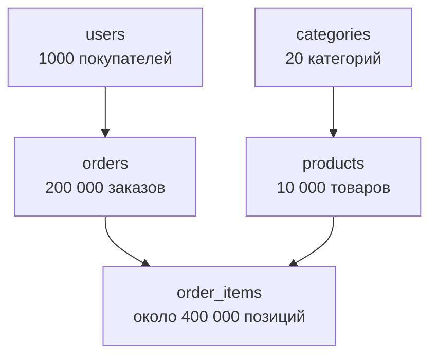
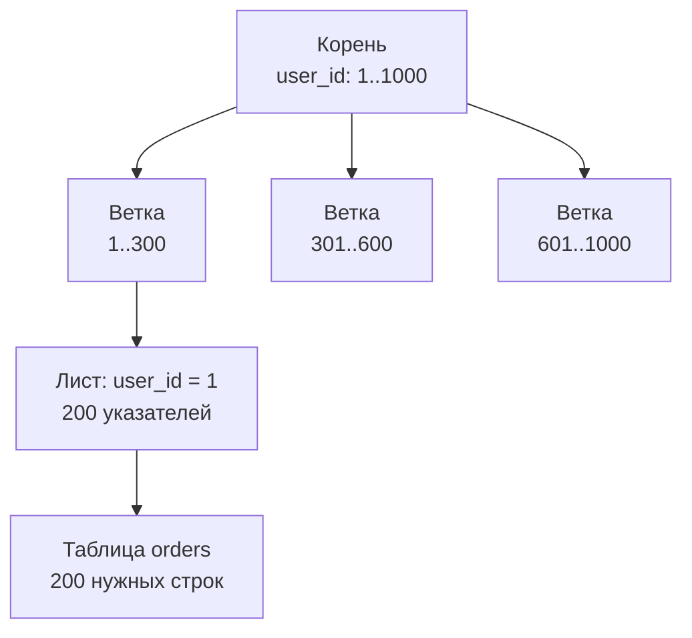

## Зачем это нужно

На нагрузочных тестах база данных виновата чаще всех остальных частей системы. Типичная история: тест на 20 пользователях работает прекрасно, на 200 всё замирает, потому что один запрос к большой таблице читает её целиком. Чтобы такое понять, нужно уметь прочитать сам запрос и ответить на вопрос «как база его выполняет: ищет нужные строки или перебирает все». Этому и посвящён урок.

Второе: чтобы проверять результат теста, нужно заглядывать в базу. Тест создал 5000 заказов, а их точно 5000? Остатки на складе списались? На эти вопросы отвечает SQL-запрос, и тестировщик, который его пишет сам, не зависит от разработчиков.

Шаг проекта: ты подключишься к PostgreSQL стенда «Магазин», прочитаешь устройство таблиц, напишешь запросы по товарам и заказам, а затем увидишь на таблице `orders`, как отсутствие индекса превращает запрос в полный перебор и как индекс ускоряет его в десятки раз. Свои запросы ты соберёшь в файл `~/perf-lab/02-web/queries.sql`.

## Что нужно знать

- Приложение, база, транзакция, пул соединений: [урок 2.3](03-backend-anatomy.md). Здесь мы заглядываем внутрь базы.
- Запросы к API «Магазина» и их данные: [урок 2.2](02-rest-json-auth.md). Заказ, который ты там оформил, будет виден в базе.
- Стенд запущен: `cd ~/load-tester/project/shop && docker compose ps` показывает четыре `healthy`.

Хочешь глубже про PostgreSQL как администратор: [урок курса DevOps про SQL и PostgreSQL](https://distinguished-sre.github.io/devops/04-docker/04-sql-postgres-basics.html).

## Картина целиком

Библиотека, где книги просто свалены на полу в порядке поступления. Нужна книга «про Python»: придётся брать каждую по очереди, смотреть на обложку и откладывать нужные. Займёт целый день. Теперь библиотекарь завёл **каталог**: карточки по алфавиту с номером полки. Достать нужную книгу занимает минуту: открыл каталог на нужной букве, нашёл номер полки, подошёл и взял.

База данных устроена так же. Таблица это те самые книги на полу, а **индекс** это каталог. Без индекса база перебирает все строки подряд, и время растёт вместе с размером таблицы. С индексом она идёт по «каталогу» и открывает только нужные строки: время почти не зависит от размера.

Таблицы «Магазина» и связи между ними:



На схеме стрелка означает «на это ссылаются». Товар ссылается на категорию, заказ на покупателя, а позиция заказа одновременно на заказ и на товар. Заказ, собранный из нескольких товаров, хранится как одна строка в `orders` и несколько строк в `order_items`.

## Теория

### SQL, таблицы и ключи

**Зачем это существует.** С базой нужно разговаривать на языке, который понимают и люди, и программы, и который не зависит от того, как данные хранятся на диске. Такой язык называется **SQL** (Structured Query Language, «язык структурированных запросов»). Ты описываешь, **что** нужно получить, а как это сделать, решает сама база.

**Аналогия.** Заказ в кафе: «две порции борща без сметаны». Ты не объясняешь повару, как резать свёклу. Аналогия ломается тем, что у базы есть тонкости: один и тот же заказ можно приготовить быстро и медленно, и об этом ниже.

**Как это устроено.** Данные лежат в **таблицах**. Таблица это набор строк с одинаковыми колонками. Посмотри на таблицу `products` (товары), вот первые строки:

| id | name | price | category_id | stock |
|---|---|---|---|---|
| 1 | Товар 1 | 137.00 | 1 | 1000000 |
| 2 | Товар 2 | 174.00 | 2 | 1000000 |
| 3 | Товар 3 | 211.00 | 3 | 1000000 |

Каждая **строка** (row) это один товар. Каждая **колонка** (column) это одно свойство, и у неё есть тип: `integer` целое число, `text` текст, `numeric(14,2)` число с двумя знаками после запятой (для денег), `timestamptz` дата и время с часовым поясом.

Два вида ключей связывают таблицы:

- **Первичный ключ** (primary key) это колонка, значение которой однозначно определяет строку. У всех таблиц стенда это `id`. Повторов быть не может, и по ключу строку находят мгновенно: база автоматически строит для него индекс.
- **Внешний ключ** (foreign key) это колонка, которая ссылается на первичный ключ другой таблицы. `products.category_id` указывает на `categories.id`. База следит, чтобы не было товара из несуществующей категории.

**Что путают.** «Таблица это файл Excel». У таблицы строгая структура (типы, ограничения), у неё нет «соседних ячеек» и нумерации строк: порядок строк в таблице ничем не гарантирован, если ты не попросил его явно (`ORDER BY`, ниже).

> **Проверь понимание:** в таблице `orders` есть колонка `user_id`. Что это за ключ и на что он ссылается?

<details markdown="1">
<summary>Ответ</summary>

Внешний ключ. Он ссылается на `users.id`: каждый заказ принадлежит одному покупателю.

</details>

### Чтение данных: SELECT

**Зачем это существует.** Чаще всего базу читают. Запрос на чтение называется `SELECT` («выбери») и собирается из частей, каждая отвечает на свой вопрос. Порядок написания фиксирован.

**Как это устроено.** Основная форма запроса:

```sql
SELECT колонки          -- что показать
FROM таблица            -- откуда
WHERE условие           -- какие строки
ORDER BY колонка        -- в каком порядке
LIMIT число;            -- сколько вернуть
```

Две чёрточки `--` начинают комментарий до конца строки. Точка с запятой завершает запрос.

- `SELECT id, name, price` выбирает колонки. Звёздочка `SELECT *` значит «все колонки»: удобно для знакомства, но в рабочем коде и в тестах лучше перечислять нужные, чтобы не тащить лишнее.
- `WHERE price < 200` оставляет только строки, где условие верно. Условия соединяют `AND` («и») и `OR` («или»), сравнивают `=`, `<>` (не равно), `<`, `>`, `<=`, `>=`. Для текста есть `LIKE`: `name LIKE 'Товар 99%'` ищет названия, начинающиеся с «Товар 99» (знак `%` значит «любые символы»).
- `ORDER BY price DESC` сортирует по цене по убыванию (`ASC` по возрастанию, это по умолчанию).
- `LIMIT 5` отдаёт не больше пяти строк.

Текстовые значения пишут в **одинарных** кавычках: `'Товар 1'`. Двойные кавычки в SQL нужны для имён колонок, поэтому здесь они не подходят.

**Что путают.** Без `ORDER BY` порядок строк случаен. Запрос с `LIMIT 5` без сортировки вернёт «какие-то пять строк», и завтра они могут оказаться другими. Если нужен определённый порядок, всегда пиши `ORDER BY`.

### Подсчёты: COUNT, агрегаты и GROUP BY

**Зачем это существует.** Чаще всего от базы нужны не строки, а числа: сколько заказов, какая средняя цена, сколько всего. Для этого есть **агрегатные функции**, которые сворачивают много строк в одно значение.

**Как это устроено.**

| Функция | Что считает | Пример |
|---|---|---|
| `count(*)` | число строк | `SELECT count(*) FROM orders;` |
| `sum(колонка)` | сумму | `sum(total)` |
| `avg(колонка)` | среднее | `avg(price)` |
| `min`, `max` | наименьшее, наибольшее | `max(price)` |

`GROUP BY` делит строки на группы по значению колонки и считает агрегат отдельно по каждой. «Сколько товаров в каждой категории»:

```sql
SELECT category_id, count(*) FROM products GROUP BY category_id;
```

Правило: в `SELECT` можно указывать либо колонки из `GROUP BY`, либо агрегаты. Колонку, которой нет в группировке, база показать не может, потому что в группе у неё много значений. Тогда ты увидишь ошибку `column "..." must appear in the GROUP BY clause or be used in an aggregate function`.

Для условий над группами служит `HAVING` (как `WHERE`, но после группировки): `HAVING count(*) > 100`. Он понадобится не сразу, но знать о нём полезно.

**Что путают.** `WHERE` и `HAVING`. `WHERE` отбирает строки **до** группировки, `HAVING` отбирает группы **после** неё.

> **Проверь понимание:** как посчитать, сколько заказов у пользователя с номером 7?

<details markdown="1">
<summary>Ответ</summary>

`SELECT count(*) FROM orders WHERE user_id = 7;` Фильтр `WHERE` отбирает заказы этого пользователя, `count(*)` считает отобранные строки.

</details>

### JOIN: соединение таблиц

**Зачем это существует.** Данные разложены по таблицам, чтобы не дублировать: название товара хранится один раз, а в позиции заказа лежит только его номер. Чтобы получить «заказ и названия товаров в нём», нужно таблицы **соединить**.

**Аналогия.** Накладная содержит номера товаров, а справочник номеров показывает названия. Чтобы прочитать накладную человеческим языком, ты для каждой строки смотришь номер в справочнике. `JOIN` делает это автоматически.

**Как это устроено.** Соединение указывает, по какой колонке сопоставлять строки:

```sql
SELECT oi.order_id, p.name, oi.qty, oi.price
FROM order_items oi
JOIN products p ON p.id = oi.product_id
WHERE oi.order_id = 1;
```

Разбор: `order_items oi` даёт таблице короткое имя `oi` (псевдоним, alias), `p` для `products`. `ON p.id = oi.product_id` условие соединения: строка товара подходит к позиции, если номер товара равен `product_id` позиции. Результат: каждая позиция заказа с названием товара рядом.

Основной вид `JOIN` (его же называют `INNER JOIN`) оставляет только те пары, где совпадение нашлось. Есть ещё `LEFT JOIN`: оставляет все строки левой таблицы, даже если справа пары нет (там будет `NULL`). Пока нужен только обычный `JOIN`.

**Что путают.** `JOIN` без условия `ON` не бывает: если его забыть, база соединит каждую строку с каждой (**декартово произведение**), и из двух таблиц по 10 000 строк получится 100 миллионов. Это один из самых быстрых способов «положить» базу.

### Изменение данных: INSERT, UPDATE, DELETE

**Как это устроено.** Три команды меняют данные:

```sql
INSERT INTO notes (title) VALUES ('первая');     -- добавить строку
UPDATE notes SET title = 'другая' WHERE id = 1;  -- изменить строки
DELETE FROM notes WHERE id = 1;                  -- удалить строки
```

В `UPDATE` и `DELETE` условие `WHERE` почти всегда необходимо. Без него изменятся или удалятся **все** строки таблицы. Эту ошибку делают все, поэтому перед опасной командой открывают транзакцию (`BEGIN;`), проверяют результат и либо подтверждают `COMMIT;`, либо отменяют `ROLLBACK;`. В практике ты потренируешься на временной таблице.

Для тестировщика эти команды нужны редко: данные меняет само приложение. Но подготовить тестовые данные или сбросить состояние приходится именно ими.

### Как база ищет строки: полный перебор

**Зачем это существует.** Когда ты пишешь `WHERE user_id = 1`, ты не говоришь, как искать. Решение принимает **планировщик** (planner, оптимизатор): часть базы, которая из нескольких способов выполнить запрос выбирает самый дешёвый, ориентируясь на статистику (сколько в таблице строк, как распределены значения).

**Как это устроено.** Если подходящего индекса нет, остаётся единственный способ: прочитать всю таблицу по порядку и проверять каждую строку. Он называется **последовательное чтение** (sequential scan, в плане запроса `Seq Scan`). Таблица хранится на диске **страницами** по 8 КБ, в каждой страницы десятки или сотни строк, и база читает страницу за страницей.

Сколько это стоит: время почти строго пропорционально размеру таблицы. 200 000 строк это десятки миллисекунд, 20 миллионов уже секунды. Для одного запроса не страшно, но если такой запрос выполняют сотни пользователей одновременно, база читает таблицу сотни раз и упирается в процессор и память.

Связь с нагрузочным тестом: на пустой или маленькой тестовой базе такая проблема остаётся незаметной. Поэтому в «Магазине» сразу заложено 200 000 заказов.

### Индекс: каталог для таблицы

**Зачем это существует.** Чтобы не перебирать таблицу целиком, база строит **индекс** (index): дополнительную структуру, в которой значения колонки лежат отсортированными вместе с указателями на строки в таблице.

**Аналогия.** Алфавитный указатель в конце учебника: ищешь слово, находишь номера страниц и открываешь только их. Аналогия ломается там, что у базы индекс обновляется сам при каждой записи, и за это приходится платить.

**Как это устроено.** Чаще всего индекс это **B-дерево** (B-tree): многоуровневая структура, где корень указывает на ветки, ветки на листья, а листья на строки таблицы. Поиск спускается с корня вниз: на каждом уровне выбирается нужная ветка из сотен. Для 200 000 строк достаточно три-четыре шага, для 200 миллионов тоже три-четыре. Поэтому время поиска растёт медленно.



Смотри на схему: поиск идёт сверху вниз по нескольким ступенькам, после чего открываются только строки, на которые указывают листья. Остальные 199 800 строк таблицы вообще не читаются.

Поиграй с тем, как время поиска зависит от размера таблицы и от того, сколько строк подходит под условие. Подвигай ползунки:

<div class="viz" data-viz="web-index-search" data-rows="200000" data-matches="200"></div>

Смотри на график: полный перебор растёт прямо пропорционально размеру таблицы, индекс почти не растёт. Теперь второй ползунок: если условию соответствует очень много строк (допустим, половина таблицы), индекс теряет смысл, и база сама выберет перебор. Индекс хорош, когда нужна **малая доля** строк.

**Цена индекса.** Индекс не бесплатен:

- он занимает место на диске и в памяти (иногда почти как сама таблица);
- каждый `INSERT`, `UPDATE`, `DELETE` обновляет и индексы, поэтому запись замедляется;
- чем больше индексов, тем дороже запись.

Поэтому индексы создают осознанно, под реальные запросы: по колонкам, которые часто стоят в `WHERE`, `JOIN` и `ORDER BY`.

**Что путают.** «Чем больше индексов, тем быстрее». Нет: лишние индексы замедляют запись и занимают память. И ещё: индекс по колонке не помогает запросам по другой колонке и некоторым выражениям (`LIKE '%слово'` с процентом в начале не использует обычный индекс).

> **Проверь понимание:** таблица заказов получает 5000 новых заказов в секунду. Разработчик предлагает добавить пять индексов на «всякий случай». Что ты ответишь?

<details markdown="1">
<summary>Ответ</summary>

Каждая вставка обновит все пять индексов, запись замедлится, а нагрузка на диск вырастет. Индексы нужны под конкретные запросы чтения, их польза измеряется. Сначала определяем, какие запросы медленные (`EXPLAIN`, метрики), и создаём индекс под них, потом проверяем нагрузкой, что запись не просела.

</details>

### EXPLAIN: прочитать план запроса

**Зачем это существует.** Чтобы узнать, как база выполняет запрос и почему он медленный, нужно её спросить. Команда `EXPLAIN` показывает **план выполнения**: выбранный способ и оценку стоимости. С `ANALYZE` (`EXPLAIN ANALYZE`) запрос ещё и выполняется, и рядом с оценкой видно реальное время.

**Как читать план.** Главное, на что смотреть:

- **Тип чтения** в первой строке: `Seq Scan` (перебор всей таблицы), `Index Scan` или `Bitmap Heap Scan` с `Bitmap Index Scan` (по индексу). Это ответ на вопрос «читает ли запрос всё подряд?».
- `cost=0.00..3871.00`: оценка стоимости в условных единицах (две цифры: до первой строки и до последней). Единицы не секунды, ими сравнивают планы между собой.
- `rows=200`: сколько строк, по оценке и по факту.
- `Rows Removed by Filter`: сколько прочитанных строк отброшено. Большое число рядом с маленьким результатом означает, что база прочитала много лишнего: признак отсутствующего индекса.
- `Buffers: shared hit=...`: сколько страниц памяти прочитано. Чем меньше, тем дешевле.
- **Execution Time**: реальное время выполнения при `ANALYZE`.

Предупреждение: `EXPLAIN ANALYZE` действительно выполняет запрос, включая `INSERT` и `DELETE`. Для изменяющих запросов оборачивай в `BEGIN; ... ROLLBACK;`.

**Что путают.** Стоимость `cost` и секунды. `cost=3871` не значит 3871 мс. И числа времени у тебя будут другие, чем в примерах: зависят от компьютера. Сравнивай «до и после» на своей машине, а не с чужими числами.

### Сколько строк можно получить: LIMIT и постраничный вывод

Запрос без `LIMIT` на большой таблице вернёт всё: 200 000 строк это десятки мегабайт, которые нужно передать и показать. Поэтому API «Магазина» отдаёт товары страницами (`page`, `size`), а внутри это `LIMIT size OFFSET (page-1)*size`. `OFFSET` пропускает указанное число строк. Чем дальше страница, тем больше строк база прочитывает и выбрасывает, поэтому глубокие страницы медленнее первых. Для тестов отсюда следует: в нагрузочных сценариях страницы выбирают разные, а не только первую, иначе тест не покажет разницы.

### NULL: «значения нет»

**Зачем это существует.** Не про каждую запись известно всё. Если у покупателя не указан телефон, в колонке нельзя написать ноль или пустую строку: это значения, а не отсутствие значения. Для этого есть особая отметка `NULL` («неизвестно, значения нет»).

**Аналогия.** Пустая графа в анкете и графа, в которой написано «0», это разные вещи: во втором случае ты ответил, в первом нет. Аналогия ломается там, что в базе с `NULL` не работают обычные сравнения.

**Как это устроено.** Любое сравнение с `NULL` даёт не «да» и не «нет», а «неизвестно», а `WHERE` пропускает только «да». Поэтому `WHERE phone = NULL` не найдёт ни одной строки никогда. Правильно: `WHERE phone IS NULL` и `WHERE phone IS NOT NULL`. Агрегаты `sum`, `avg`, `min`, `max` строки с `NULL` пропускают, а `count(колонка)` считает только непустые значения (в отличие от `count(*)`, который считает строки). В таблицах «Магазина» почти все колонки помечены `not null`, то есть пустых значений быть не может, но в чужих базах `NULL` встретится сразу.

**Что путают.** `NULL` с нулём и с пустой строкой. Это три разных состояния.

### Транзакции: всё или ничего

**Зачем это существует.** Оформление заказа это несколько шагов: создать заказ, записать позиции, списать остаток. Если сервер упал посередине, без защиты останется заказ без позиций или списанный товар без заказа. Нужен способ сказать: «эти шаги либо выполнятся все, либо ни один».

**Аналогия.** Перевод денег между счетами: списание с одного и зачисление на другой нельзя разорвать. Аналогия ломается тем, что в базе в одно время работают сотни таких переводов, и они не должны мешать друг другу.

**Как это устроено.** **Транзакция** (transaction) это группа команд, которая выполняется как одно целое. Её свойства обычно запоминают как четыре буквы ACID:

- **атомарность**: всё или ничего (при ошибке откатывается всё сделанное);
- **согласованность**: после транзакции правила (ключи, ограничения) не нарушены;
- **изолированность**: параллельные транзакции не видят чужих недоделанных изменений;
- **долговечность**: подтверждённое (`COMMIT`) не пропадёт даже при сбое питания.

Во время транзакции база держит блокировки на изменённые строки: другая транзакция, которая хочет изменить те же строки, ждёт. В уроке 2.3 ты видел то же с другой стороны: заказ держит транзакцию и соединение из пула, пока ждёт оплату. Чем дольше транзакция, тем дольше другие стоят в очереди. Поэтому долгие транзакции частая причина «зависаний» под нагрузкой.

**Что путают.** «Транзакция ускоряет работу». Она даёт надёжность, а скорость обычно ухудшает.

> **Проверь понимание:** почему внутри транзакции плохо ждать ответа от внешнего сервиса?

<details markdown="1">
<summary>Ответ</summary>

Пока ждёшь, транзакция открыта: заблокированы строки, занято соединение из пула. Другие запросы встают в очередь, и при медленной оплате пул кончается. Именно так устроен заказ в «Магазине»: это заложенная проблема урока 11.5.

</details>

### Составные индексы и порядок колонок

**Как это устроено.** Индекс можно построить по двум колонкам: `CREATE INDEX ... ON orders (user_id, created_at)`. Он отсортирован сначала по первой колонке, внутри неё по второй, как телефонный справочник: фамилия, потом имя. Такой индекс помогает запросу `WHERE user_id = 1`, и запросу `WHERE user_id = 1 AND created_at > ...`, но почти не помогает запросу только по `created_at`: в справочнике по имени без фамилии не найти. Поэтому порядок колонок важен: сначала та, по которой ищут чаще всего и по равенству.

Ещё один приём: индекс по `user_id` ускоряет и `JOIN` по этой колонке, и `ORDER BY`, если сортировка совпадает с порядком индекса. Но каждый новый индекс это новая цена на запись, как обсуждалось выше.

### Откуда планировщик знает, сколько строк подойдёт

Планировщик не пересчитывает таблицу перед каждым запросом: он опирается на **статистику** (число строк, частоту значений в колонках), которая собирается командой `ANALYZE` и автоматически фоновым процессом. Если статистика устарела (например, ты только что залил миллион строк), план может быть неудачным: база думает, что подходит 10 строк, а их миллион. Поэтому после массовой загрузки данных выполняют `ANALYZE`, и поэтому мы вызвали его в практике после создания индекса. В `EXPLAIN ANALYZE` признак такой беды: ожидаемое `rows=` сильно отличается от фактического `actual ... rows=`.

## Практика

### 1. Подключись к базе

Базе нужен клиент: консольная программа `psql` уже есть внутри контейнера `postgres`, ставить её не нужно. Из каталога `~/load-tester/project/shop`:

```bash
cd ~/load-tester/project/shop
docker compose exec postgres psql -U shop shop
```

Разбор: `docker compose exec postgres` выполняет команду внутри контейнера `postgres`, `psql` консольный клиент PostgreSQL, `-U shop` имя пользователя, последнее слово `shop` имя базы (пользователь и база называются одинаково).

```text
psql (18.6)
Type "help" for help.

shop=#
```

Приглашение `shop=#` значит, что ты внутри базы и всё, что ты вводишь, это SQL (команда должна заканчиваться `;`) или служебные команды `psql`, начинающиеся с обратного слэша. Выйти можно командой `\q`. Если запрос закончился без точки с запятой, приглашение сменится на `shop-#`: psql ждёт продолжения, допиши `;`.

Включи показ времени каждого запроса:

```sql
\timing on
```

```text
Timing is on.
```

### 2. Осмотр таблиц

```sql
\dt
```

```text
            List of tables
 Schema |    Name     | Type  | Owner
--------+-------------+-------+-------
 public | categories  | table | shop
 public | order_items | table | shop
 public | orders      | table | shop
 public | products    | table | shop
 public | users       | table | shop
(5 rows)
```

`\dt` (describe tables) перечисляет таблицы: пять, как на схеме. Теперь устройство одной из них:

```sql
\d orders
```

```text
                                   Table "public.orders"
   Column   |           Type           | Collation | Nullable |           Default
------------+--------------------------+-----------+----------+------------------------------
 id         | integer                  |           | not null | generated by default as identity
 user_id    | integer                  |           | not null |
 status     | text                     |           | not null |
 total      | numeric(18,2)            |           | not null |
 created_at | timestamp with time zone |           | not null | now()
Indexes:
    "orders_pkey" PRIMARY KEY, btree (id)
Foreign-key constraints:
    "orders_user_id_fkey" FOREIGN KEY (user_id) REFERENCES users(id)
Referenced by:
    TABLE "order_items" CONSTRAINT "order_items_order_id_fkey" FOREIGN KEY (order_id) REFERENCES orders(id)
```

**Как читать вывод:** `Column` и `Type` колонки и их типы, `Nullable: not null` значит «значение обязательно». В разделе `Indexes` единственный индекс `orders_pkey`: это индекс первичного ключа `id`. Индекса по `user_id` **нет**: запомни, это пригодится. `Foreign-key constraints` показывает внешний ключ на `users`, `Referenced by` кто ссылается на `orders`.

Посмотри самостоятельно `\d products` и найди индекс `products_category_id_idx`: он ускоряет выбор товаров по категории.

### 3. Первые запросы

```sql
SELECT * FROM categories LIMIT 3;
```

```text
 id |     name
----+--------------
  1 | Категория 1
  2 | Категория 2
  3 | Категория 3
(3 rows)
Time: 0.9 ms
```

Пять первых товаров:

```sql
SELECT id, name, price FROM products WHERE id <= 5 ORDER BY id;
```

```text
 id |  name   | price
----+---------+--------
  1 | Товар 1 | 137.00
  2 | Товар 2 | 174.00
  3 | Товар 3 | 211.00
  4 | Товар 4 | 248.00
  5 | Товар 5 | 285.00
(5 rows)
```

Сравни товар 5 с тем, что ты видел через API в уроке 2.2: цена та же (285). Это те же данные. Теперь дешёвые товары:

```sql
SELECT id, name, price FROM products WHERE price < 200 ORDER BY id LIMIT 5;
```

```text
  id  |   name    | price
------+-----------+--------
    1 | Товар 1   | 137.00
    2 | Товар 2   | 174.00
 1349 | Товар 1349 | 112.00
 1350 | Товар 1350 | 149.00
 1351 | Товар 1351 | 186.00
(5 rows)
```

Условия с `AND` и `LIKE`:

```sql
SELECT count(*) FROM products WHERE name LIKE '%Товар 999%';
SELECT count(*) FROM products WHERE price < 200;
```

```text
 count
-------
    11
(1 row)

 count
-------
    21
(1 row)
```

Одиннадцать названий содержат «Товар 999»: сам «Товар 999» и «Товар 9990»…«Товар 9999». А дешёвых (дешевле 200) товаров всего 21 из 10 000.

**Как читать вывод:** под таблицей всегда пишется `(N rows)`, это число строк в ответе. Со `\timing` ты видишь строку `Time:` с временем выполнения. Числа времени у тебя будут свои, и разные запуски дадут разный результат.

**Типичные ошибки:**

- `ERROR: syntax error at or near "..."`: опечатка, чаще всего пропущена запятая, лишняя запятая перед `FROM` или недописанная кавычка. Ошибка указывает место, где psql заподозрил проблему (иногда ошибка чуть раньше).
- `ERROR: column "name" does not exist`: опечатка в имени колонки или в двойных кавычках. Строки только в одинарных.
- `ERROR: relation "product" does not exist`: опечатка в имени таблицы (она `products`).

### 4. Подсчёты и группировка

```sql
SELECT count(*) FROM products;
SELECT count(*) FROM orders;
SELECT count(*) FROM users;
```

```text
 count
-------
 10000

 count
--------
 200001

 count
-------
  1001
```

В таблицах 10 000 товаров, 200 001 заказ (200 000 исторических и один твой из урока 2.2: если оформлял больше, число будет больше) и 1001 пользователь (1000 готовых плюс твой `student@shop.lab`). Теперь по категориям:

```sql
SELECT category_id, count(*) AS товаров, round(avg(price), 2) AS средняя_цена
FROM products
GROUP BY category_id
ORDER BY средняя_цена DESC
LIMIT 3;
```

```text
 category_id | товаров | средняя_цена
-------------+---------+--------------
          12 |     500 |     24293.18
          20 |     500 |     24289.77
          17 |     500 |     24278.57
(3 rows)
```

Разбор: `AS товаров` даёт колонке понятное имя (псевдоним колонки), `avg(price)` среднюю цену, `round(..., 2)` округляет до копеек. `GROUP BY category_id` делит товары на 20 групп, `ORDER BY` сортирует группы по средней цене по убыванию. В каждой категории ровно 500 товаров: цены в наших данных распределены почти поровну, поэтому средние близки.

Общая статистика цен:

```sql
SELECT min(price), max(price), round(avg(price), 2) FROM products;
```

```text
  min   |   max    |  round
--------+----------+----------
 110.00 | 50000.00 | 24237.68
```

### 5. JOIN: позиции заказа и покупатели

Что в заказе номер 1 (заказ принадлежит пользователю 1):

```sql
SELECT oi.order_id, p.name, oi.qty, oi.price
FROM order_items oi
JOIN products p ON p.id = oi.product_id
WHERE oi.order_id = 1;
```

```text
 order_id |   name   | qty | price
----------+----------+-----+--------
        1 | Товар 9  |   1 | 433.00
        1 | Товар 10 |   1 | 470.00
(2 rows)
```

Сумма позиций 433 + 470 = 903: это столько, сколько записано в `orders.total` для заказа 1. Проверим вторым запросом и заодно потренируем соединение с покупателями:

```sql
SELECT u.email, count(*) AS заказов, sum(o.total) AS на_сумму
FROM orders o
JOIN users u ON u.id = o.user_id
WHERE u.id <= 3
GROUP BY u.email
ORDER BY u.email;
```

```text
        email         | заказов | на_сумму
----------------------+---------+-------------
 user0001@shop.lab    |     200 | 10860835.00
 user0002@shop.lab    |     200 | 11013866.00
 user0003@shop.lab    |     200 | 11117421.00
(3 rows)
```

У каждого из тысячи готовых покупателей по 200 заказов: заказы равномерно разложены по пользователям. Посмотри и свои заказы, соединив с пользователями:

```sql
SELECT o.id, u.email, o.status, o.total
FROM orders o JOIN users u ON u.id = o.user_id
WHERE u.email = 'student@shop.lab'
ORDER BY o.id;
```

```text
   id   |      email       | status | total
--------+------------------+--------+---------
 200001 | student@shop.lab | paid   | 1140.00
```

Это тот самый заказ, который ты оформил через API (сумма у тебя зависит от того, что было в корзине, и должна совпасть с `total` из ответа). Можно проверить и остаток на складе: `SELECT stock FROM products WHERE id = <номер купленного товара>;` покажет миллион минус то, что ты купил.

**Как читать вывод:** `JOIN` объединил две таблицы в одну «временную» с колонками обеих. `GROUP BY u.email` свернул 200 заказов каждого пользователя в одну строку. Вывод в тестах: проверить результат нагрузки можно именно так, например сравнить число созданных заказов с числом успешных ответов 201.

### 6. Изменения на временной таблице

Чтобы не трогать данные магазина, создай **временную таблицу**: она живёт, пока открыт сеанс `psql`, и никому не видна:

```sql
CREATE TEMP TABLE notes (id serial PRIMARY KEY, title text);
INSERT INTO notes (title) VALUES ('первая'), ('вторая'), ('третья');
SELECT * FROM notes;
```

```text
 id | title
----+--------
  1 | первая
  2 | вторая
  3 | третья
(3 rows)
```

Теперь `UPDATE` с условием и без:

```sql
UPDATE notes SET title = 'ИЗМЕНЕНА' WHERE id = 2;
BEGIN;
UPDATE notes SET title = 'ОШИБКА';
SELECT * FROM notes;
ROLLBACK;
SELECT * FROM notes;
```

```text
UPDATE 1
BEGIN
UPDATE 3
 id | title
----+--------
  1 | ОШИБКА
  2 | ОШИБКА
  3 | ОШИБКА
(3 rows)

ROLLBACK
 id |  title
----+----------
  1 | первая
  2 | ИЗМЕНЕНА
  3 | третья
(3 rows)
```

**Как читать вывод:** `UPDATE 1` значит «изменена одна строка», `UPDATE 3` значит «изменены все три»: забытое `WHERE` сразу видно по числу. Поскольку мы в транзакции, `ROLLBACK` вернул всё как было (кроме изменения №1, которое было вне транзакции). Привычка из этого: перед рискованной командой пиши `BEGIN;`, смотри число изменённых строк и только потом `COMMIT;` или `ROLLBACK;`.

### 7. Индекс: до и после на таблице orders

Теперь главный опыт. Запрос «все заказы пользователя 1» это именно то, что делает `GET /api/orders` у каждого покупателя. Посмотри, как база его выполняет. Сначала отключи параллельное чтение, чтобы план был простым (настройка действует только в этом сеансе):

```sql
SET max_parallel_workers_per_gather = 0;
EXPLAIN ANALYZE SELECT * FROM orders WHERE user_id = 1;
```

```text
                                                QUERY PLAN
-----------------------------------------------------------------------------------------------------------
 Seq Scan on orders  (cost=0.00..3871.00 rows=200 width=26) (actual time=0.031..19.812 rows=200.00 loops=1)
   Filter: (user_id = 1)
   Rows Removed by Filter: 199802
   Buffers: shared hit=1371
 Planning Time: 0.112 ms
 Execution Time: 19.874 ms
```

**Как читать вывод:**

- `Seq Scan on orders`: полный перебор таблицы. Первая и главная строка.
- `Filter: (user_id = 1)`: строки проверяются по условию одна за другой.
- `Rows Removed by Filter: 199802`: прочитано больше 200 тысяч строк и отброшено почти все, нужны были только 200 штук. Вот это и есть «база делает лишнюю работу».
- `Buffers: shared hit=1371`: прочитано 1371 страниц таблицы (все из памяти).
- `Execution Time: 19.874 ms`: около 20 мс на один запрос. У тебя число своё, главное порядок.

Двадцать миллисекунд на один запрос кажутся пустяком. Но представь 100 покупателей в секунду, каждому нужны его заказы: 100 × 20 мс = 2 секунды работы процессора на одну секунду времени. Один процессор этого не выдержит, и база упрётся.

Теперь создай индекс **в учебных целях** и повтори запрос:

```sql
CREATE INDEX orders_user_id_idx ON orders (user_id);
ANALYZE orders;
EXPLAIN ANALYZE SELECT * FROM orders WHERE user_id = 1;
```

Разбор: `CREATE INDEX имя ON таблица (колонка)` строит индекс (на 200 000 строк займёт долю секунды). `ANALYZE orders` обновляет статистику таблицы, чтобы планировщик знал про новый индекс.

```text
CREATE INDEX
ANALYZE
                                                           QUERY PLAN
--------------------------------------------------------------------------------------------------------------------------------
 Bitmap Heap Scan on orders  (cost=5.30..648.00 rows=200 width=26) (actual time=0.081..0.912 rows=200.00 loops=1)
   Recheck Cond: (user_id = 1)
   Heap Blocks: exact=200
   Buffers: shared hit=203
   ->  Bitmap Index Scan on orders_user_id_idx  (cost=0.00..5.25 rows=200 width=0) (actual time=0.049..0.049 rows=200.00 loops=1)
         Index Cond: (user_id = 1)
         Index Searches: 1
         Buffers: shared hit=3
 Planning Time: 0.140 ms
 Execution Time: 0.985 ms
```

**Как читать вывод:**

- `Bitmap Index Scan on orders_user_id_idx`: база сначала нашла по индексу, **где лежат** нужные строки (это строка со стрелкой `->`), потом `Bitmap Heap Scan` открыла только эти страницы. У тебя вместо `Bitmap ...` может быть `Index Scan using orders_user_id_idx`: главное слово «Index».
- `Heap Blocks: exact=200`: открыто 200 страниц таблицы вместо 1371.
- `Buffers: shared hit=203`: 203 страницы вместо 1371.
- `Execution Time: 0.985 ms`: около 1 мс вместо 20. Ускорение в 20 раз на одном запросе, а на таблице в 20 миллионов строк оно было бы в тысячи.

Сравни с виджетом выше: он показывал ту же картину. Первичный ключ работает так же: `EXPLAIN ANALYZE SELECT * FROM orders WHERE id = 1000;` покажет `Index Scan using orders_pkey` и около 0,05 мс.

**А теперь обязательное: удали индекс.** Индекс по `orders.user_id` намеренно отсутствует на стенде: это заложенное узкое место для [урока 11.3](../11-bottlenecks/03-database.md), где ты сам найдёшь его по метрикам нагрузочного теста и добавишь. Если оставить его сейчас, то задание там пропадёт.

```sql
DROP INDEX orders_user_id_idx;
SELECT indexname FROM pg_indexes WHERE tablename = 'orders';
```

```text
DROP INDEX
  indexname
-------------
 orders_pkey
(1 row)
```

**Как читать вывод:** в таблице `orders` остался только индекс первичного ключа, как и было. Если в списке есть `orders_user_id_idx`, повтори `DROP INDEX orders_user_id_idx;`.

Выйди из `psql`:

```sql
\q
```

Временная таблица `notes` исчезнет сама.

### 8. Сохрани запросы в файл

Положи основные запросы в файл: они пригодятся в проверках твоих тестов (посчитать заказы после нагрузки, найти самых тяжёлых покупателей):

```bash
cat > ~/perf-lab/02-web/queries.sql <<'EOF'
-- Сколько заказов в базе (сверять с числом ответов 201 в тесте)
SELECT count(*) FROM orders;

-- Заказы по статусам
SELECT status, count(*) FROM orders GROUP BY status;

-- Последние 5 заказов
SELECT id, user_id, total, created_at FROM orders ORDER BY id DESC LIMIT 5;

-- Остаток товара
SELECT id, name, stock FROM products WHERE id = 5;
EOF
docker compose -f ~/load-tester/project/shop/compose.yaml exec -T postgres psql -U shop shop < ~/perf-lab/02-web/queries.sql | head -n 20
```

Разбор: `exec -T` отключает псевдотерминал (нужно, когда ввод идёт из файла через `<`), `< файл` подаёт содержимое файла на ввод `psql`. Так SQL запускают без интерактивного сеанса, в том числе из скриптов. Одиночный запрос можно передать флагом `-c "SELECT count(*) FROM orders"`.

> Запрос возвращает не то? Сначала проверь его на трёх строках, где ты знаешь ответ, затем спроси нейросеть, что делает каждая часть. Перед `UPDATE` и `DELETE` всегда делай `SELECT` с тем же `WHERE`.
{: .ai}

## Сломай и почини

В шаге 7 ты вышел из `psql` командой `\q`. Зайди снова (из каталога `~/load-tester/project/shop`):

```bash
docker compose exec postgres psql -U shop shop
```

Дальше все поломки выполняются внутри `psql`. Выйти можно в конце: `\q`.

**Поломка 1. Ошибка группировки.** Выполни:

```sql
SELECT category_id, name, count(*) FROM products GROUP BY category_id;
```

**Задача.** Прочитай ошибку, объясни, почему база отказывается, и исправь запрос так, чтобы он считал товары по категориям.

<details markdown="1">
<summary>Разбор</summary>

```text
ERROR:  column "products.name" must appear in the GROUP BY clause or be used in an aggregate function
```

В каждой группе (категории) 500 товаров с разными названиями, и база не знает, какое показать. Колонка либо входит в `GROUP BY`, либо над ней стоит агрегат. Исправление: убрать `name` (`SELECT category_id, count(*) FROM products GROUP BY category_id;`) или взять агрегат, например `min(name)`.

</details>

**Поломка 2. Забытое условие в транзакции.** Создай временную таблицу заново (`CREATE TEMP TABLE notes (id serial PRIMARY KEY, title text); INSERT INTO notes (title) VALUES ('а'), ('б'), ('в');`) и выполни:

```sql
BEGIN;
DELETE FROM notes;
```

**Задача.** Что вернёт команда, как понять, что произошло что-то не то, и как всё отменить?

<details markdown="1">
<summary>Разбор</summary>

`DELETE 3`: удалены все три строки, а не одна. Число в ответе важнее всего: если ожидал «1», а получил «3», это ошибка. Пока транзакция не завершена, ничего не потеряно: `ROLLBACK;` вернёт строки (проверь `SELECT * FROM notes;`). Если бы ты не открыл `BEGIN`, удаление стало бы окончательным сразу.

</details>

**Поломка 3. Забытый индекс.** Проверь, что стенд вернулся в исходное состояние:

```sql
SELECT indexname FROM pg_indexes WHERE tablename = 'orders';
```

**Задача.** Что должно быть в ответе и что делать, если там есть `orders_user_id_idx`?

<details markdown="1">
<summary>Разбор</summary>

Только `orders_pkey`. Если есть ещё `orders_user_id_idx`, выполни `DROP INDEX orders_user_id_idx;`. Иначе в уроке 11.3 у тебя не будет проблемы, которую нужно искать. Самый надёжный способ вернуть стенд в исходное состояние целиком: `docker compose down -v` и `docker compose up -d --wait` (данные создадутся заново, но и твои пользователи с заказами пропадут).

</details>

## ИИ в помощь

Нейросеть быстро пишет и объясняет SQL, но схемы твоей базы не знает: давай ей названия таблиц и колонок. Общие правила на странице [ИИ-помощник](../ai.md).

**Задача:** написать запрос с `JOIN` и группировкой.

```text
PostgreSQL 18. Таблицы: orders(id, user_id, total, created_at), users(id, email). Нужно: топ-5 пользователей по числу заказов. Напиши SELECT, объясни JOIN, GROUP BY и ORDER BY по частям. Покажи, как проверить результат на маленьком примере.
```
{: .wrap}

**Проверь ответ:** выполни в `psql` стенда и сверь число строк с отдельным `SELECT count(*)`. Типичная ошибка: имена колонок, которых нет (проверь `\d orders`), и `JOIN` без условия, который даёт миллионы строк.

**Задача:** прочитать план `EXPLAIN ANALYZE`.

```text
PostgreSQL 18. План запроса `SELECT * FROM orders WHERE user_id = 1`:
<вставь вывод EXPLAIN ANALYZE>
Объясни каждую строку: Seq Scan или Index Scan, cost, actual time, rows. Нужен ли индекс и на какой колонке? Какие у индекса минусы?
```
{: .wrap}

**Проверь ответ:** создай индекс на стенде и снова выполни `EXPLAIN ANALYZE`: тип сканирования должен смениться. Типичная ошибка: совет индексировать всё подряд и путаница `cost` (оценка) с `actual time` (измерение).

В чат отправляй структуру таблиц и план запроса, но не реальные данные клиентов.

## Словарик урока

| Термин | Простыми словами |
|---|---|
| SQL | Язык запросов к базе данных: описываешь, что получить |
| Таблица, строка, колонка | Набор записей: строка это запись, колонка это её свойство |
| Первичный ключ (primary key) | Колонка, однозначно определяющая строку (у нас `id`) |
| Внешний ключ (foreign key) | Колонка, ссылающаяся на первичный ключ другой таблицы |
| `SELECT`, `WHERE`, `ORDER BY`, `LIMIT` | Выбрать колонки; отобрать строки; отсортировать; ограничить число |
| Агрегатная функция | `count`, `sum`, `avg`, `min`, `max`: сворачивает много строк в число |
| `GROUP BY` | Делит строки на группы и считает агрегат по каждой |
| `JOIN` | Соединение строк двух таблиц по условию |
| Транзакция, `BEGIN`, `COMMIT`, `ROLLBACK` | Группа действий; начать; подтвердить; отменить |
| Планировщик (planner) | Часть базы, выбирающая способ выполнить запрос |
| Seq Scan | Полный перебор таблицы строка за строкой |
| Индекс (index) | Отсортированный «каталог» значений колонки с указателями на строки |
| B-дерево | Структура индекса: поиск спускается с корня на лист за несколько шагов |
| `EXPLAIN ANALYZE` | Показывает план запроса и реальное время выполнения |
| `psql` | Консольный клиент PostgreSQL |

## Вопросы с собеседований

Раздел для повторения: ответь вслух, потом открой ответ. Короткие вопросы тренируй на скорость: ответ за 30 секунд.

### 1. [junior] [часто] Что такое индекс и зачем он нужен?

<details markdown="1">
<summary>Ответ</summary>

Дополнительная структура (чаще B-дерево), в которой значения колонки отсортированы и указывают на строки таблицы. Она позволяет найти нужные строки, не перебирая всю таблицу: время поиска растёт очень медленно с размером таблицы. Платить приходится местом и замедлением записи, потому что индексы обновляются вместе с данными.

**Что хотят услышать:** ускорение чтения и цена для записи.

**Красный флаг:** «индекс ускоряет всё».

</details>

### 2. [junior] [часто] Чем `WHERE` отличается от `HAVING`?

<details markdown="1">
<summary>Ответ</summary>

`WHERE` отбирает строки до группировки, `HAVING` отбирает группы после `GROUP BY` и может использовать агрегаты. Нельзя написать `WHERE count(*) > 5`: агрегат считается после отбора строк.

**Что хотят услышать:** порядок выполнения и пример.

**Красный флаг:** «одно и то же».

</details>

### 3. [junior] [часто] Что делает `JOIN` и что будет, если забыть условие?

<details markdown="1">
<summary>Ответ</summary>

Соединяет строки двух таблиц по условию (`ON a.id = b.a_id`). Без условия получится декартово произведение: каждая строка с каждой, и два набора по 10 000 строк дадут 100 миллионов. Такой запрос может занять всю память и процессор базы.

**Что хотят услышать:** условие соединения и риск.

**Красный флаг:** не знает про декартово произведение.

</details>

### 4. [junior] Что такое первичный и внешний ключ?

<details markdown="1">
<summary>Ответ</summary>

Первичный ключ однозначно определяет строку таблицы и не повторяется (по нему автоматически создаётся индекс). Внешний ключ ссылается на первичный ключ другой таблицы и не даёт создать запись с несуществующей ссылкой (заказ несуществующего пользователя).

**Что хотят услышать:** уникальность и ссылочная целостность.

**Красный флаг:** считает их синонимами.

</details>

### 5. [junior] Как узнать, использует ли запрос индекс?

<details markdown="1">
<summary>Ответ</summary>

Запустить `EXPLAIN` или `EXPLAIN ANALYZE` и посмотреть тип чтения. `Seq Scan` означает полный перебор, `Index Scan` или `Bitmap Index Scan` означают использование индекса. Смотрят также на `Rows Removed by Filter` и число прочитанных страниц.

**Что хотят услышать:** `EXPLAIN` и названия узлов плана.

**Красный флаг:** «посмотреть, быстро ли работает».

</details>

### 6. [junior] В чём опасность `UPDATE` или `DELETE` без `WHERE` и как себя защитить?

<details markdown="1">
<summary>Ответ</summary>

Изменятся или удалятся все строки таблицы. Защита: выполнять в транзакции (`BEGIN`), смотреть число затронутых строк в ответе (`UPDATE 3`, а ждали 1), и только потом `COMMIT`, иначе `ROLLBACK`. Также сначала выполнить тот же `WHERE` в `SELECT`. На рабочей базе используют права доступа и копии.

**Что хотят услышать:** транзакция, проверка числа строк.

**Красный флаг:** «просто быть внимательным».

</details>

### 7. [junior] Почему без `ORDER BY` нельзя полагаться на порядок строк?

<details markdown="1">
<summary>Ответ</summary>

База не гарантирует порядок строк: он зависит от физического расположения, от плана, от обновлений. Один и тот же запрос завтра может вернуть строки иначе. Нужен порядок: пишем `ORDER BY` (и для постраничного вывода с `LIMIT` это обязательно).

**Что хотят услышать:** порядок не гарантирован, нужен явный `ORDER BY`.

**Красный флаг:** «строки возвращаются в порядке вставки».

</details>

### 8. [middle] Запрос по колонке с индексом всё равно делает Seq Scan. Почему так может быть?

<details markdown="1">
<summary>Ответ</summary>

Причины: условию соответствует большая доля таблицы, и перебор дешевле, чем прыжки по индексу; таблица маленькая; статистика устарела (`ANALYZE`); условие применяется к выражению, а не к самой колонке (`WHERE lower(email) = ...`, `LIKE '%x'`); типы не совпадают. Проверяю `EXPLAIN`, статистику и форму условия.

**Что хотят услышать:** оптимизатор выбирает по стоимости, и несколько конкретных причин.

**Красный флаг:** «значит, индекс сломан».

</details>

### 9. [middle] Ты добавил индекс, и запись в таблицу замедлилась. Почему и что делать?

<details markdown="1">
<summary>Ответ</summary>

Каждая запись теперь обновляет и индекс (а таких индексов может быть несколько), плюс растёт нагрузка на диск и память. Решение: оценить, какие индексы действительно используются запросами (статистика использования индексов), убрать лишние, оставить нужные под реальные запросы, проверить нагрузочным тестом и чтение, и запись.

**Что хотят услышать:** цена индекса, измерение вместо догадок.

**Красный флаг:** «индексы бесплатны».

</details>

### 10. [middle] Нагрузочный тест показал, что запрос «заказы пользователя» тормозит на большой таблице. Как найдёшь и проверишь причину?

<details markdown="1">
<summary>Ответ</summary>

Нахожу запрос (метрики по маршрутам, статистика запросов `pg_stat_statements`), запускаю `EXPLAIN ANALYZE` на данных, похожих на боевые по размеру. Вижу `Seq Scan` и большое `Rows Removed by Filter`: нет индекса по `user_id`. Гипотеза: индекс. Создаю в тестовой среде, повторяю тест с теми же параметрами и сравниваю задержки до и после, а также скорость записи.

**Что хотят услышать:** от метрик к плану, гипотеза, проверка повторным тестом на реалистичных объёмах.

**Красный флаг:** «добавлю индекс и закрою задачу» без проверки.

</details>

### 11. [на скорость] Как посчитать число строк в таблице `orders`?

<details markdown="1">
<summary>Ответ</summary>

`SELECT count(*) FROM orders;`

**Что хотят услышать:** запрос без запинки.

**Красный флаг:** «`SELECT * FROM orders` и посчитать».

</details>

### 12. [на скорость] Что значит `Seq Scan` в плане запроса?

<details markdown="1">
<summary>Ответ</summary>

Полный перебор таблицы строка за строкой: подходящего индекса нет или он невыгоден.

**Что хотят услышать:** «читает всё подряд».

**Красный флаг:** «это быстрое чтение».

</details>

### 13. [на скорость] Какая команда отменяет изменения, сделанные внутри транзакции?

<details markdown="1">
<summary>Ответ</summary>

`ROLLBACK;` Подтверждает изменения `COMMIT;`.

**Что хотят услышать:** обе команды.

**Красный флаг:** путает.

</details>

### 14. [на скорость] Как создать и как удалить индекс по колонке `user_id` таблицы `orders`?

<details markdown="1">
<summary>Ответ</summary>

`CREATE INDEX orders_user_id_idx ON orders (user_id);` и `DROP INDEX orders_user_id_idx;`.

**Что хотят услышать:** оба синтаксиса.

**Красный флаг:** не помнит разницу между `DROP INDEX` и `DROP TABLE`.

</details>

## Проверено на версиях

PostgreSQL 18.6 (образ `postgres:18.6` в стенде), `psql` из того же контейнера, стенд «Магазин» из `project/shop`. Числа времени в примерах `EXPLAIN` типичны для обычного ноутбука и у тебя будут другие. Октябрь 2026.

## Итог урока: ты умеешь

- [ ] Подключиться к PostgreSQL стенда через `psql` и осмотреть таблицы (`\dt`, `\d`).
- [ ] Написать `SELECT` с `WHERE`, `ORDER BY`, `LIMIT`, `count`, `GROUP BY`.
- [ ] Соединить таблицы через `JOIN` и объяснить условие `ON`.
- [ ] Изменять данные безопасно: временная таблица, транзакция, проверка числа строк.
- [ ] Объяснить, что такое индекс, и назвать его цену.
- [ ] Прочитать `EXPLAIN ANALYZE`: отличить `Seq Scan` от поиска по индексу.
- [ ] Создать индекс, измерить ускорение и вернуть стенд в исходное состояние.

Дальше: [тема 3. Git и GitHub](../03-git/index.md), где ты заведёшь свой репозиторий `perf-lab`, и там твои заметки, скрипты и запросы из этой темы станут первым коммитом.
