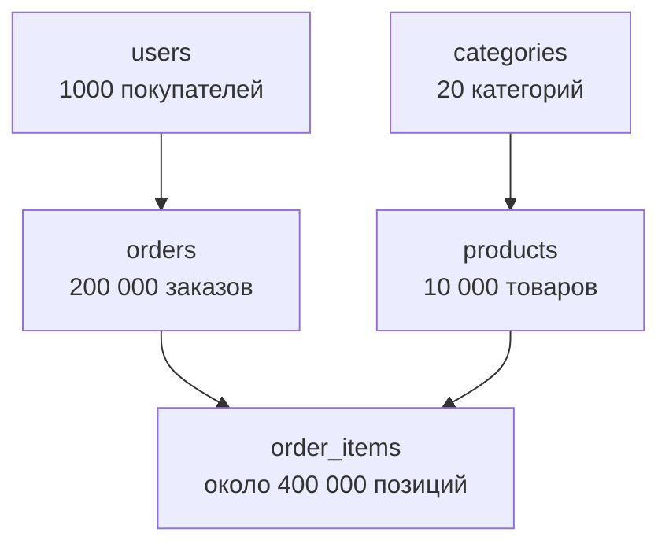
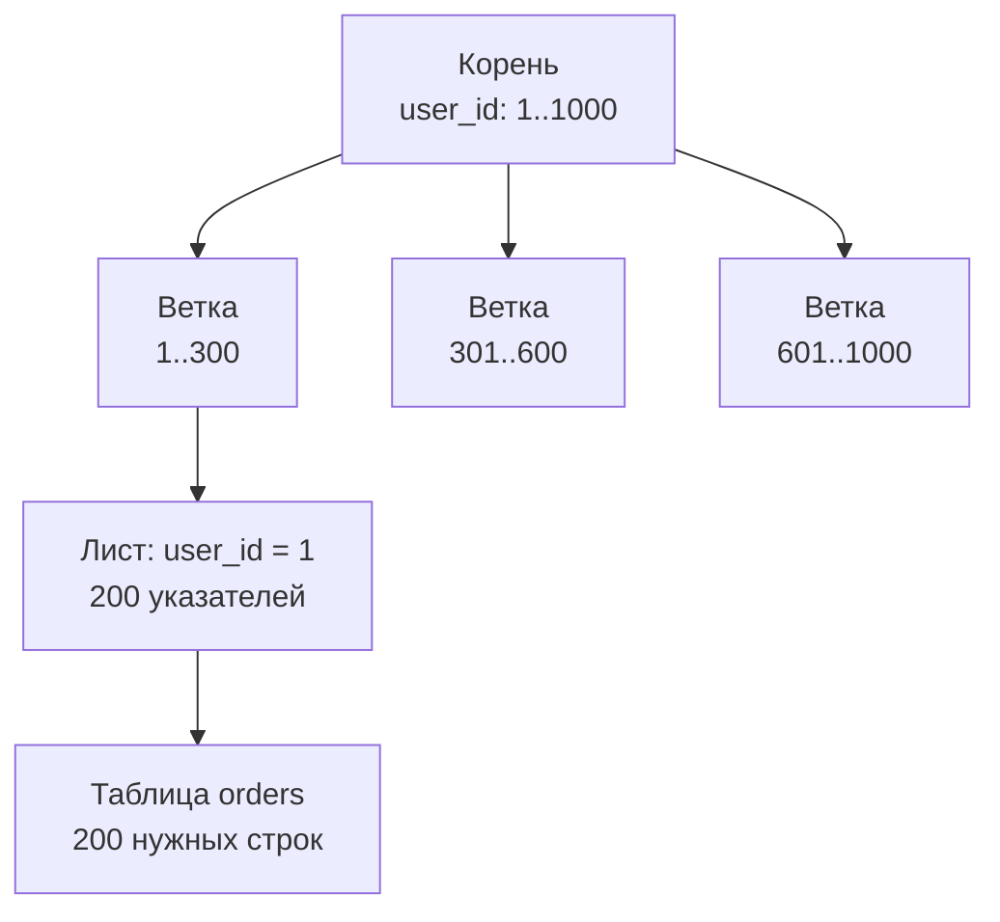
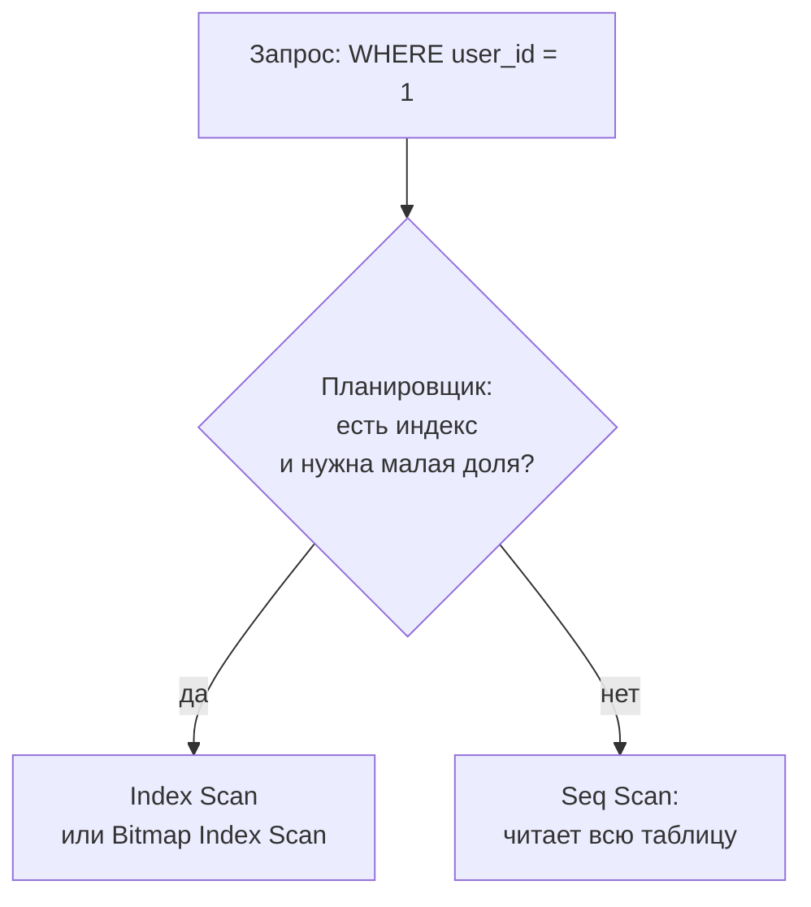

## Зачем это нужно

Я давно гоняю нагрузочные тесты, и у меня есть история, которую узнает каждый, кто этим занимался. Тест на 20 пользователях проходит идеально. На 200 сайт замирает: сервер приложения скучает, а база задыхается. Один запрос читал таблицу целиком, и 200 человек делали это одновременно.

В магазине жалуются: «страница "Мои заказы" открывается долго». В [уроке 2.3](03-backend-anatomy.md) ты видел, что между кликом и страницей стоит база данных. Приложение отправляет ей запрос на языке SQL (так называется язык, на котором с базой разговаривают, мы его сейчас выучим). Нужно понять, как база его выполняет.

Есть и второй повод. Тест создал 5000 заказов, а их точно 5000? Это спрашивают у самой базы, и тестировщик, который пишет такой запрос сам, не ждёт разработчиков.

Шаг проекта: ты подключишься к PostgreSQL стенда «Магазин» и напишешь запросы по товарам и заказам. Потом на таблице `orders` увидишь, как без индекса запрос перебирает все строки, а с ним работает в десятки раз быстрее. Индекс это особый указатель по колонке, о нём скоро. Свои запросы ты соберёшь в файл `~/perf-lab/02-web/queries.sql`.

## Что нужно знать

- Приложение, база, транзакция, пул соединений: [урок 2.3](03-backend-anatomy.md). Здесь мы заглядываем внутрь базы.
- Запросы к API «Магазина» и их данные: [урок 2.2](02-rest-json-auth.md). Заказ, который ты там оформил, будет виден в базе.
- Стенд запущен: `cd ~/load-tester/project/shop && docker compose ps` показывает четыре `healthy`.

Хочешь глубже про PostgreSQL как администратор: [урок курса DevOps про SQL и PostgreSQL](https://distinguished-sre.github.io/devops/04-docker/04-sql-postgres-basics.html).

## Картина целиком

Библиотека, где книги свалены на полу в порядке поступления. Нужна книга «про Python»: берёшь каждую, смотришь обложку, откладываешь нужные. Это целый день. Потом библиотекарь заводит каталог: карточки по алфавиту с номером полки. Теперь минута: открыл нужную букву, нашёл номер полки, подошёл и взял.

База устроена так же. Таблица это книги на полу, а **индекс** это каталог. Без индекса база перебирает все строки подряд, и время растёт вместе с размером таблицы. С индексом она идёт по «каталогу» и открывает только нужные строки.

В «Магазине» пять таблиц, вот как они связаны:



Стрелка значит «на это ссылаются». Товар ссылается на категорию, заказ на покупателя, а позиция заказа сразу на заказ и на товар. Заказ из нескольких товаров хранится как одна строка в `orders` и несколько строк в `order_items`.

## Теория

### SQL, таблицы и ключи

Ты хочешь спросить у базы: «покажи заказы этого покупателя». На каком языке? На **SQL** (Structured Query Language, «язык структурированных запросов»). Ты описываешь, **что** нужно получить, а как, решает сама база. Это как заказ в кафе: «две порции борща без сметаны», повару не объясняют, как резать свёклу. Аналогия ломается в одном: один и тот же заказ база может выполнить быстро или медленно. Об этом вторая половина урока.

Данные лежат в таблицах. Вот первые строки таблицы `products` (товары):

| id | name | price | category_id | stock |
|---|---|---|---|---|
| 1 | Товар 1 | 137.00 | 1 | 1000000 |
| 2 | Товар 2 | 174.00 | 2 | 1000000 |
| 3 | Товар 3 | 211.00 | 3 | 1000000 |

Каждая **строка** (row) это один товар. Каждая **колонка** (column) это его свойство: номер, название, цена. У колонки есть тип: правило, что в неё можно класть. Вот главные: `integer` целое число, `text` текст, `numeric(14,2)` число с двумя знаками после запятой (для денег), `timestamptz` дата и время с часовым поясом.

Как связаны таблицы? У чека есть номер, и по нему кассир находит твою покупку. Колонка, которая так однозначно определяет строку, называется **первичным ключом** (primary key). У всех таблиц стенда это `id`. Повторов нет, и для него база сама строит индекс. А колонка с чужим номером называется **внешним ключом** (foreign key): `products.category_id` хранит номер из `categories.id`, и база не даст завести товар из несуществующей категории.

Осторожно: таблицу часто принимают за файл Excel. Но у неё строгие типы, нет «соседних ячеек» и нет нумерации строк. Порядок строк ничем не гарантирован, пока ты не попросил его явно через `ORDER BY`.

> **Проверь понимание:** в таблице `orders` есть колонка `user_id`. Что это за ключ и на что он ссылается?

<details markdown="1">
<summary>Ответ</summary>

Внешний ключ. Он ссылается на `users.id`: каждый заказ принадлежит одному покупателю.

</details>

> **Главное:** данные лежат в таблицах, а ключи их связывают: первичный определяет строку, внешний ссылается на строку другой таблицы.
{: .key}

Таблицы есть. Как достать из них нужные строки?

### Чтение данных: SELECT

Менеджер просит: «покажи пять самых дешёвых товаров». Запрос на чтение называется `SELECT` («выбери») и собирается из частей, каждая отвечает на свой вопрос:

```sql
SELECT колонки          -- что показать
FROM таблица            -- откуда
WHERE условие           -- какие строки
ORDER BY колонка        -- в каком порядке
LIMIT число;            -- сколько вернуть
```

Две чёрточки `--` начинают комментарий, точка с запятой завершает запрос. Порядок частей фиксирован.

`SELECT id, name, price` выбирает колонки. Звёздочка `SELECT *` значит «все»: для знакомства удобно, а в тестах лучше перечислять нужные. `WHERE price < 200` оставляет строки, где условие верно. Условия соединяют `AND` («и») и `OR` («или»), сравнивают знаками `=`, `<>` (не равно), `<`, `>`, `<=`, `>=`. Для текста есть `LIKE`: `name LIKE 'Товар 99%'` найдёт названия с началом «Товар 99», знак `%` значит «любые символы». Текст берут в **одинарные** кавычки, двойные нужны для имён колонок. `ORDER BY price DESC` сортирует по убыванию цены (`ASC`, по возрастанию, стоит по умолчанию), `LIMIT 5` оставляет пять строк.

> **Прикинь сам:** что вернёт `SELECT id, price FROM products WHERE price < 200 ORDER BY price LIMIT 5`?
{: .predict}

Условие оставит дешёвые товары, сортировка выстроит их от самой низкой цены, `LIMIT` возьмёт первые пять. Первым будет товар за 110: в таблице выше только первые три строки, а самая низкая цена в наших данных 110.

Осторожно: без `ORDER BY` порядок строк случаен. `LIMIT 5` без сортировки вернёт «какие-то пять», а завтра другие.

> **Главное:** `SELECT` собирается из вопросов «что, откуда, какие, в каком порядке, сколько», а порядок без `ORDER BY` никто не обещает.
{: .key}

Но часто нужны не строки, а число.

### Подсчёты: COUNT, агрегаты и GROUP BY

Сколько заказов в базе? Не выводить же 200 000 строк, чтобы считать глазами. Для этого есть **агрегатные функции**: они сворачивают много строк в одно значение. `count(*)` считает строки, `sum(total)` складывает, `avg(price)` берёт среднее, `min` и `max` дают наименьшее и наибольшее. Запрос `SELECT count(*) FROM orders;` вернёт число заказов.

А «сколько товаров в каждой категории»? Почтальон раскладывает письма по ящикам для каждого города, а потом считает письма в каждом ящике. `GROUP BY` делает то же: делит строки на группы по значению колонки и считает агрегат по каждой.

```sql
SELECT category_id, count(*) FROM products GROUP BY category_id;
```

> **Прикинь сам:** в `products` 10 000 товаров и 20 категорий. Сколько строк вернёт этот запрос?
{: .predict}

Одну на группу, то есть 20: номер категории и число товаров в ней.

В `SELECT` с группировкой можно писать колонки из `GROUP BY` или агрегаты. Остальное база показать не может: в группе у колонки много значений, непонятно, какое выбрать. Увидишь ошибку `column "..." must appear in the GROUP BY clause or be used in an aggregate function`.

`WHERE` отбирает строки **до** группировки. Условие над готовыми группами пишут в `HAVING`: `HAVING count(*) > 100` оставит категории, где больше сотни товаров. Тут часто путают: `WHERE count(*) > 100` написать нельзя, группы ещё не посчитаны.

> **Проверь понимание:** как посчитать, сколько заказов у пользователя с номером 7?

<details markdown="1">
<summary>Ответ</summary>

`SELECT count(*) FROM orders WHERE user_id = 7;` Фильтр `WHERE` отбирает заказы этого пользователя, `count(*)` считает отобранные строки.

</details>

> **Главное:** агрегат сворачивает строки в число, `GROUP BY` считает его по группам, `WHERE` работает до группировки, `HAVING` после.
{: .key}

Считать умеем. Но названия товаров лежат в одной таблице, заказы в другой.

### JOIN: соединение таблиц

В `order_items` хранятся только номера товаров: так название лежит в одном месте, а не дублируется в сотнях тысяч строк. Это накладная с кодами и справочник, где коды расшифрованы. Чтобы прочитать накладную, для каждой строки ищешь код в справочнике. `JOIN` делает это сам:

```sql
SELECT oi.order_id, p.name, oi.qty, oi.price
FROM order_items oi
JOIN products p ON p.id = oi.product_id
WHERE oi.order_id = 1;
```

`order_items oi` даёт таблице короткое имя `oi` (псевдоним, alias), `p` стоит за `products`. Условие `ON p.id = oi.product_id` говорит, как сопоставлять: товар подходит к позиции, если его номер равен `product_id` позиции. Итог: у каждой позиции заказа рядом название товара. Обычный `JOIN` (он же `INNER JOIN`) оставляет только пары с совпадением. Есть ещё `LEFT JOIN`, он сохраняет и строки без пары, пока достаточно знать, что он существует.

> **Прикинь сам:** что будет, если соединить две таблицы по 10 000 строк без условия совпадения?
{: .predict}

База сопоставит каждую строку с каждой: 10 000 раз по 10 000 дают 100 миллионов строк. Это **декартово произведение**, и на рабочей базе оно быстро её положит. Просто стереть `ON` не выйдет: PostgreSQL ответит синтаксической ошибкой. Но то же самое получается через `CROSS JOIN` или условие, которое верно всегда, например по ошибке `ON oi.id = oi.id`.

> **Главное:** `JOIN` склеивает строки двух таблиц по условию `ON`, без настоящего условия получается каждая с каждой.
{: .key}

До сих пор мы только читали. А как данные меняются?

### Изменение данных: INSERT, UPDATE, DELETE

Забытое `WHERE` в команде, и у всех строк таблицы одинаковое значение. Три команды меняют данные:

```sql
INSERT INTO notes (title) VALUES ('первая');     -- добавить строку
UPDATE notes SET title = 'другая' WHERE id = 1;  -- изменить строки
DELETE FROM notes WHERE id = 1;                  -- удалить строки
```

Без `WHERE` в `UPDATE` и `DELETE` изменятся или удалятся **все** строки. Поэтому перед опасной командой открывают транзакцию (напомню из 2.3: группа действий как одно целое). `BEGIN;` её начинает, проверка показывает число затронутых строк, потом `COMMIT;` подтверждает или `ROLLBACK;` отменяет. Тестировщику они нужны редко, но данные перед тестом готовят ими.

> **Главное:** сначала `BEGIN`, потом проверь число изменённых строк, и только после этого `COMMIT` или `ROLLBACK`.
{: .key}

Вернёмся к жалобе «Мои заказы» и посмотрим, как база ищет строки.

### Как база ищет строки: полный перебор

В запросе `WHERE user_id = 1` нет слов о том, **как** искать. Это решает **планировщик** (planner): часть базы, которая выбирает самый дешёвый из способов выполнить запрос. Он опирается на статистику (сводку о таблице: сколько в ней строк и как распределены значения).

Если подходящего индекса нет, остаётся один способ: прочитать всю таблицу и проверить каждую строку. Он называется **последовательным чтением** (sequential scan, в плане `Seq Scan`). Таблица хранится на диске страницами по 8 КБ, и база читает страницу за страницей. Время растёт прямо пропорционально размеру таблицы.

> **Прикинь сам:** допустим, один такой запрос занимает у процессора базы 20 мс работы (в практике будет своя цифра). Его выполняют 100 покупателей в секунду. Сколько работы получает база за секунду?
{: .predict}

Сто раз по 20 мс: 2000 мс, то есть 2 секунды работы процессора за 1 секунду времени. Одно ядро процессора так не может: оно делает одну работу за раз, и начнётся очередь. Один покупатель не заметит, сотня положит базу. На маленькой базе это невидимо, поэтому в «Магазине» 200 000 заказов.

> **Главное:** без подходящего индекса база читает всю таблицу, и цена запроса растёт вместе с ней.
{: .key}

Как избежать перебора?

### Индекс: каталог для таблицы

Как найти 200 нужных заказов среди 200 000, не читая остальные 199 800? Как в учебнике: смотришь в алфавитный указатель, находишь номера страниц и открываешь только их. **Индекс** (index) это дополнительная структура: значения колонки лежат в ней отсортированными, рядом указатель на строку таблицы. Аналогия ломается тем, что индекс обновляется при каждой записи, и за это приходится платить.

Чаще всего индекс это **B-дерево** (B-tree): корень указывает на ветки, ветки на листья, листья на строки. Поиск идёт сверху вниз, на каждом уровне выбирается одна ветка. На схеме веток три, в настоящем дереве сотни.



Остальные 199 800 строк не читаются вообще. У каждого из 1000 покупателей по 200 заказов: 1000 раз по 200 и есть 200 000. Сколько уровней нужно? Если с каждой ветки расходятся 200 веток, три уровня охватят 200 × 200 × 200 = 8 миллионов записей. Поэтому время поиска растёт очень медленно. Подвигай ползунки и посмотри, как оно зависит от размера таблицы и числа подходящих строк.

<div class="viz" data-viz="web-index-search" data-rows="200000" data-matches="200"></div>

Перебор растёт прямо пропорционально размеру таблицы, индекс почти не растёт. Второй ползунок показывает обратное: чем больше строк подходит под условие, тем меньше выигрыш. Если подходит заметная доля таблицы, прыгать по указателям дороже, чем прочитать всё подряд, и база выберет перебор. Индекс хорош, когда нужна малая доля строк.

Бесплатных индексов нет. Он занимает место, иногда почти как сама таблица. Каждый `INSERT`, `UPDATE`, `DELETE` обновляет все индексы, поэтому запись замедляется. Значит, индексы создают осознанно: по колонкам, которые часто стоят в `WHERE`, `JOIN` и `ORDER BY`.

Осторожно: «чем больше индексов, тем быстрее» неверно. Лишние индексы замедляют запись.

> **Проверь понимание:** таблица заказов получает 5000 новых заказов в секунду. Разработчик предлагает пять индексов «на всякий случай». Что ты ответишь?

<details markdown="1">
<summary>Ответ</summary>

Каждая вставка обновит все пять индексов, запись замедлится, нагрузка на диск вырастет. Индексы нужны под конкретные запросы чтения, их польза измеряется. Сначала находим медленные запросы (`EXPLAIN`, метрики), создаём индекс под них, потом проверяем нагрузкой, что запись не просела.

</details>

<details markdown="1">
<summary>Для любопытных: индекс по двум колонкам</summary>

`CREATE INDEX ... ON orders (user_id, created_at)` сортирует сначала по первой колонке, внутри неё по второй, как телефонный справочник: фамилия, потом имя. Он помогает запросам `WHERE user_id = 1` и `WHERE user_id = 1 AND created_at > ...`, а по одному `created_at` почти нет: по имени без фамилии не найти. Поэтому первой ставь колонку, по которой ищут чаще и по равенству. Обычный индекс не работает и при `LIKE '%слово'`: неизвестно, с какой буквы искать.

</details>

> **Главное:** индекс это отсортированный указатель на строки: поиск находит нужное за несколько шагов, но каждая запись платит за его обновление.
{: .key}

Есть два способа поиска. Какой из них выбрала база?

### EXPLAIN: прочитать план запроса

Базу можно спросить. `EXPLAIN` показывает **план выполнения**: способ, который выбрал планировщик, и оценку стоимости. С `ANALYZE` (`EXPLAIN ANALYZE`) запрос ещё и выполнится, а рядом появится реальное время.



Выбор виден в первой строке плана: `Seq Scan` это перебор всей таблицы, а `Index Scan` или его разновидность `Bitmap Index Scan` это чтение по индексу. Второй признак: `Rows Removed by Filter` показывает, сколько строк база прочитала и выбросила. Большое число рядом с маленьким результатом означает много лишней работы и обычно отсутствие индекса.

`cost=0.00..3871.00` это стоимость в условных единицах (до первой строки и до последней), не секунды. `rows` показывает, сколько строк ожидалось и сколько вышло. `Buffers` считает прочитанные страницы памяти, `Execution Time` даёт реальное время.

Осторожно: `cost=3871` не равно 3871 мс. И `EXPLAIN ANALYZE` действительно выполняет запрос, даже `INSERT` и `DELETE`: изменяющие оборачивай в `BEGIN; ... ROLLBACK;`.

<details markdown="1">
<summary>Для любопытных: когда планировщик ошибается</summary>

Статистику собирает команда `ANALYZE` и фоновый процесс. Если она устарела (ты только что залил миллион строк), база думает, что подходит 10 строк, а их миллион. Поэтому после массовой загрузки выполняют `ANALYZE`, и поэтому мы вызываем его в практике после создания индекса. Признак беды: ожидаемое `rows=` сильно отличается от фактического `actual ... rows=`. Индекс не используется и если подходит большая доля таблицы, если таблица совсем мала, если условие применено к выражению (`WHERE lower(email) = ...`) или если типы не совпадают.

</details>

> **Главное:** `EXPLAIN ANALYZE` показывает способ и время: смотри на тип чтения и `Rows Removed by Filter`, а `cost` не путай с секундами.
{: .key}

Теперь о том, сколько строк вообще стоит доставать.

### Сколько строк можно получить: LIMIT и постраничный вывод

Страница «Товары» показывает по 20 штук, а не все 10 000. API «Магазина» отдаёт товары страницами (`page`, `size`), а внутри это `LIMIT size OFFSET (page-1)*size`. `OFFSET` пропускает указанное число строк.

> **Прикинь сам:** сколько строк база пропустит, чтобы показать страницу 500 при `size=20`?
{: .predict}

(500 − 1) × 20 = 9980 строк, и только потом возьмёт свои 20. Чем дальше страница, тем больше лишнего чтения. Для тестов отсюда следует: в сценариях выбирай разные страницы, а не только первую.

> **Главное:** `OFFSET` заставляет базу читать и выбрасывать пропущенные строки, поэтому глубокие страницы медленнее.
{: .key}

Осталось два понятия, на которых спотыкаются чаще всего.

### NULL: «значения нет»

Если у покупателя не указан телефон, в колонке нельзя писать ноль или пустую строку: это значения. Для отсутствия есть `NULL` («неизвестно»). Пустая графа в анкете и графа с «0» это разные вещи.

Любое сравнение с `NULL` даёт «неизвестно», а `WHERE` пропускает только «да». Поэтому `WHERE phone = NULL` не найдёт ничего никогда, правильно `WHERE phone IS NULL`. Агрегаты `sum`, `avg`, `min`, `max` строки с `NULL` пропускают, а `count(колонка)` считает только непустые (`count(*)` считает строки). В «Магазине» пустых значений нет, в чужих базах они встретятся сразу.

> **Главное:** `NULL` не равен ни нулю, ни пустой строке, и проверяют его только через `IS NULL`.
{: .key}

Второе: что делать, когда шагов несколько, а сервер может упасть посередине.

### Транзакции: всё или ничего

Оформление заказа: создать заказ, записать позиции, списать остаток. Если сервер упал между вторым и третьим, останется заказ без списания или списанный товар без заказа. Нужен способ сказать: «либо все шаги, либо ни одного». Как перевод денег: списать с одного счёта и зачислить на другой нельзя по отдельности.

**Транзакция** (transaction) это группа команд, которая выполняется как одно целое. Её свойства запоминают как ACID. Атомарность: при ошибке откатывается всё сделанное. Согласованность: после транзакции ключи и правила таблицы (например, «цена не отрицательна») не нарушены. Изолированность: параллельные транзакции не видят чужих недоделанных изменений, например когда двое берут последний товар. Долговечность: подтверждённое через `COMMIT` не пропадёт даже при сбое питания.

У этого есть цена. Пока транзакция идёт, база блокирует изменённые строки (закрывает их для других), и чужая транзакция ждёт. В 2.3 ты видел это с другой стороны: заказ держит транзакцию и соединение из пула, пока ждёт оплату. Чем дольше транзакция, тем длиннее очередь, и поэтому долгие транзакции частая причина «зависаний». Осторожно: транзакция не ускоряет работу, она даёт надёжность.

> **Проверь понимание:** почему внутри транзакции плохо ждать ответа от внешнего сервиса?

<details markdown="1">
<summary>Ответ</summary>

Пока ждёшь, транзакция открыта: заблокированы строки, занято соединение из пула. Другие запросы встают в очередь, и при медленной оплате пул кончается. Именно так устроен заказ в «Магазине»: это заложенная проблема урока 11.5.

</details>

> **Главное:** транзакция делает несколько шагов одним целым, но пока она открыта, строки и соединение заняты.
{: .key}

Вернёмся к жалобе «Мои заказы». Теперь ты знаешь, что запрос ищет заказы по `user_id`, а индекса нет: `Seq Scan` и 200 000 прочитанных строк на каждого покупателя. Дальше проверишь это руками.

## Практика

### 1. Подключись к базе

Базе нужен клиент: консольная программа `psql` уже есть внутри контейнера `postgres`, ставить её не нужно. Из каталога `~/load-tester/project/shop`:

```bash
cd ~/load-tester/project/shop
docker compose exec postgres psql -U shop shop
```

Разбор: `docker compose exec postgres` выполняет команду внутри контейнера `postgres`, `psql` консольный клиент PostgreSQL, `-U shop` имя пользователя, последнее слово `shop` имя базы (пользователь и база называются одинаково).

```text
psql (18.6)
Type "help" for help.

shop=#
```

Приглашение `shop=#` значит, что ты внутри базы и всё, что ты вводишь, это SQL (команда должна заканчиваться `;`) или служебные команды `psql`, начинающиеся с обратного слэша. Выйти можно командой `\q`. Если запрос закончился без точки с запятой, приглашение сменится на `shop-#`: psql ждёт продолжения, допиши `;`.

Включи показ времени каждого запроса:

```sql
\timing on
```

```text
Timing is on.
```

### 2. Осмотр таблиц

```sql
\dt
```

```text
            List of tables
 Schema |    Name     | Type  | Owner
--------+-------------+-------+-------
 public | categories  | table | shop
 public | order_items | table | shop
 public | orders      | table | shop
 public | products    | table | shop
 public | users       | table | shop
(5 rows)
```

`\dt` (describe tables) перечисляет таблицы: пять, как на схеме. Теперь устройство одной из них:

```sql
\d orders
```

```text
                                   Table "public.orders"
   Column   |           Type           | Collation | Nullable |           Default
------------+--------------------------+-----------+----------+------------------------------
 id         | integer                  |           | not null | generated by default as identity
 user_id    | integer                  |           | not null |
 status     | text                     |           | not null |
 total      | numeric(18,2)            |           | not null |
 created_at | timestamp with time zone |           | not null | now()
Indexes:
    "orders_pkey" PRIMARY KEY, btree (id)
Foreign-key constraints:
    "orders_user_id_fkey" FOREIGN KEY (user_id) REFERENCES users(id)
Referenced by:
    TABLE "order_items" CONSTRAINT "order_items_order_id_fkey" FOREIGN KEY (order_id) REFERENCES orders(id)
```

**Как читать вывод:** `Column` и `Type` колонки и их типы, `Nullable: not null` значит «значение обязательно». В разделе `Indexes` единственный индекс `orders_pkey`: это индекс первичного ключа `id`. Индекса по `user_id` **нет**: запомни, это пригодится. `Foreign-key constraints` показывает внешний ключ на `users`, `Referenced by` кто ссылается на `orders`.

Посмотри самостоятельно `\d products` и найди индекс `products_category_id_idx`: он ускоряет выбор товаров по категории.

### 3. Первые запросы

```sql
SELECT * FROM categories LIMIT 3;
```

```text
 id |     name
----+--------------
  1 | Категория 1
  2 | Категория 2
  3 | Категория 3
(3 rows)
Time: 0.9 ms
```

Пять первых товаров:

```sql
SELECT id, name, price FROM products WHERE id <= 5 ORDER BY id;
```

```text
 id |  name   | price
----+---------+--------
  1 | Товар 1 | 137.00
  2 | Товар 2 | 174.00
  3 | Товар 3 | 211.00
  4 | Товар 4 | 248.00
  5 | Товар 5 | 285.00
(5 rows)
```

Сравни товар 5 с тем, что ты видел через API в уроке 2.2: цена та же (285). Это те же данные. Теперь дешёвые товары:

```sql
SELECT id, name, price FROM products WHERE price < 200 ORDER BY id LIMIT 5;
```

```text
  id  |   name    | price
------+-----------+--------
    1 | Товар 1   | 137.00
    2 | Товар 2   | 174.00
 1349 | Товар 1349 | 112.00
 1350 | Товар 1350 | 149.00
 1351 | Товар 1351 | 186.00
(5 rows)
```

Условия с `LIKE` и `<`:

```sql
SELECT count(*) FROM products WHERE name LIKE '%Товар 999%';
SELECT count(*) FROM products WHERE price < 200;
```

```text
 count
-------
    11
(1 row)

 count
-------
    21
(1 row)
```

Одиннадцать названий содержат «Товар 999»: сам «Товар 999» и «Товар 9990»…«Товар 9999». А дешёвых (дешевле 200) товаров всего 21 из 10 000.

**Как читать вывод:** под таблицей всегда пишется `(N rows)`, это число строк в ответе. Со `\timing` ты видишь строку `Time:` с временем выполнения. Числа времени у тебя будут свои, и разные запуски дадут разный результат.

**Типичные ошибки:**

- `ERROR: syntax error at or near "..."`: опечатка, чаще всего пропущена запятая, лишняя запятая перед `FROM` или недописанная кавычка. Ошибка указывает место, где psql заподозрил проблему (иногда ошибка чуть раньше).
- `ERROR: column "name" does not exist`: опечатка в имени колонки или в двойных кавычках. Строки только в одинарных.
- `ERROR: relation "product" does not exist`: опечатка в имени таблицы (она `products`).

### 4. Подсчёты и группировка

```sql
SELECT count(*) FROM products;
SELECT count(*) FROM orders;
SELECT count(*) FROM users;
```

```text
 count
-------
 10000

 count
--------
 200001

 count
-------
  1001
```

В таблицах 10 000 товаров, 200 001 заказ (200 000 исторических и один твой из урока 2.2: если оформлял больше, число будет больше) и 1001 пользователь (1000 готовых плюс твой `student@shop.lab`). Теперь по категориям:

```sql
SELECT category_id, count(*) AS товаров, round(avg(price), 2) AS средняя_цена
FROM products
GROUP BY category_id
ORDER BY средняя_цена DESC
LIMIT 3;
```

```text
 category_id | товаров | средняя_цена
-------------+---------+--------------
          12 |     500 |     24293.18
          20 |     500 |     24289.77
          17 |     500 |     24278.57
(3 rows)
```

Разбор: `AS товаров` даёт колонке понятное имя (псевдоним колонки), `avg(price)` среднюю цену, `round(..., 2)` округляет до копеек. `GROUP BY category_id` делит товары на 20 групп, `ORDER BY` сортирует группы по средней цене по убыванию. В каждой категории ровно 500 товаров: цены в наших данных распределены почти поровну, поэтому средние близки.

Общая статистика цен:

```sql
SELECT min(price), max(price), round(avg(price), 2) FROM products;
```

```text
  min   |   max    |  round
--------+----------+----------
 110.00 | 50000.00 | 24237.68
```

### 5. JOIN: позиции заказа и покупатели

Что в заказе номер 1 (заказ принадлежит пользователю 1):

```sql
SELECT oi.order_id, p.name, oi.qty, oi.price
FROM order_items oi
JOIN products p ON p.id = oi.product_id
WHERE oi.order_id = 1;
```

```text
 order_id |   name   | qty | price
----------+----------+-----+--------
        1 | Товар 9  |   1 | 433.00
        1 | Товар 10 |   1 | 470.00
(2 rows)
```

Сумма позиций 433 + 470 = 903: это столько, сколько записано в `orders.total` для заказа 1. Проверим вторым запросом и заодно потренируем соединение с покупателями:

```sql
SELECT u.email, count(*) AS заказов, sum(o.total) AS на_сумму
FROM orders o
JOIN users u ON u.id = o.user_id
WHERE u.id <= 3
GROUP BY u.email
ORDER BY u.email;
```

```text
        email         | заказов | на_сумму
----------------------+---------+-------------
 user0001@shop.lab    |     200 | 10860835.00
 user0002@shop.lab    |     200 | 11013866.00
 user0003@shop.lab    |     200 | 11117421.00
(3 rows)
```

У каждого из тысячи готовых покупателей по 200 заказов: заказы равномерно разложены по пользователям. Посмотри и свои заказы, соединив с пользователями:

```sql
SELECT o.id, u.email, o.status, o.total
FROM orders o JOIN users u ON u.id = o.user_id
WHERE u.email = 'student@shop.lab'
ORDER BY o.id;
```

```text
   id   |      email       | status | total
--------+------------------+--------+---------
 200001 | student@shop.lab | paid   | 1140.00
```

Это тот самый заказ, который ты оформил через API (сумма у тебя зависит от того, что было в корзине, и должна совпасть с `total` из ответа). Можно проверить и остаток на складе: `SELECT stock FROM products WHERE id = <номер купленного товара>;` покажет миллион минус то, что ты купил.

**Как читать вывод:** `JOIN` объединил две таблицы в одну «временную» с колонками обеих. `GROUP BY u.email` свернул 200 заказов каждого пользователя в одну строку. Вывод в тестах: проверить результат нагрузки можно именно так, например сравнить число созданных заказов с числом успешных ответов 201.

### 6. Изменения на временной таблице

Чтобы не трогать данные магазина, создай **временную таблицу**: она живёт, пока открыт сеанс `psql`, и никому не видна:

```sql
CREATE TEMP TABLE notes (id serial PRIMARY KEY, title text);
INSERT INTO notes (title) VALUES ('первая'), ('вторая'), ('третья');
SELECT * FROM notes;
```

```text
 id | title
----+--------
  1 | первая
  2 | вторая
  3 | третья
(3 rows)
```

Теперь `UPDATE` с условием и без:

```sql
UPDATE notes SET title = 'ИЗМЕНЕНА' WHERE id = 2;
BEGIN;
UPDATE notes SET title = 'ОШИБКА';
SELECT * FROM notes;
ROLLBACK;
SELECT * FROM notes;
```

```text
UPDATE 1
BEGIN
UPDATE 3
 id | title
----+--------
  1 | ОШИБКА
  2 | ОШИБКА
  3 | ОШИБКА
(3 rows)

ROLLBACK
 id |  title
----+----------
  1 | первая
  2 | ИЗМЕНЕНА
  3 | третья
(3 rows)
```

**Как читать вывод:** `UPDATE 1` значит «изменена одна строка», `UPDATE 3` значит «изменены все три»: забытое `WHERE` сразу видно по числу. Поскольку мы в транзакции, `ROLLBACK` вернул всё как было (кроме изменения №1, которое было вне транзакции). Привычка из этого: перед рискованной командой пиши `BEGIN;`, смотри число изменённых строк и только потом `COMMIT;` или `ROLLBACK;`.

### 7. Индекс: до и после на таблице orders

Теперь главный опыт. Запрос «все заказы пользователя 1» это именно то, что делает `GET /api/orders` у каждого покупателя. Посмотри, как база его выполняет. Сначала отключи параллельное чтение, чтобы план был простым (настройка действует только в этом сеансе):

```sql
SET max_parallel_workers_per_gather = 0;
EXPLAIN ANALYZE SELECT * FROM orders WHERE user_id = 1;
```

```text
                                                QUERY PLAN
-----------------------------------------------------------------------------------------------------------
 Seq Scan on orders  (cost=0.00..3871.00 rows=200 width=26) (actual time=0.031..19.812 rows=200.00 loops=1)
   Filter: (user_id = 1)
   Rows Removed by Filter: 199801
   Buffers: shared hit=1371
 Planning Time: 0.112 ms
 Execution Time: 19.874 ms
```

**Как читать вывод:**

- `Seq Scan on orders`: полный перебор таблицы. Первая и главная строка.
- `Filter: (user_id = 1)`: строки проверяются по условию одна за другой.
- `Rows Removed by Filter: 199801`: прочитано больше 200 тысяч строк и отброшено почти все, нужны были только 200 штук. Вот это и есть «база делает лишнюю работу».
- `Buffers: shared hit=1371`: прочитано 1371 страниц таблицы (все из памяти).
- `Execution Time: 19.874 ms`: около 20 мс на один запрос. У тебя число своё, главное порядок.

Двадцать миллисекунд на один запрос кажутся пустяком. Но представь 100 покупателей в секунду, каждому нужны его заказы: 100 × 20 мс = 2 секунды работы процессора на одну секунду времени. Один процессор этого не выдержит, и база упрётся.

Теперь создай индекс **в учебных целях** и повтори запрос:

```sql
CREATE INDEX orders_user_id_idx ON orders (user_id);
ANALYZE orders;
EXPLAIN ANALYZE SELECT * FROM orders WHERE user_id = 1;
```

Разбор: `CREATE INDEX имя ON таблица (колонка)` строит индекс (на 200 000 строк займёт долю секунды). `ANALYZE orders` обновляет статистику таблицы, чтобы планировщик знал про новый индекс.

```text
CREATE INDEX
ANALYZE
                                                           QUERY PLAN
--------------------------------------------------------------------------------------------------------------------------------
 Bitmap Heap Scan on orders  (cost=5.30..648.00 rows=200 width=26) (actual time=0.081..0.912 rows=200.00 loops=1)
   Recheck Cond: (user_id = 1)
   Heap Blocks: exact=200
   Buffers: shared hit=203
   ->  Bitmap Index Scan on orders_user_id_idx  (cost=0.00..5.25 rows=200 width=0) (actual time=0.049..0.049 rows=200.00 loops=1)
         Index Cond: (user_id = 1)
         Index Searches: 1
         Buffers: shared hit=3
 Planning Time: 0.140 ms
 Execution Time: 0.985 ms
```

**Как читать вывод:**

- `Bitmap Index Scan on orders_user_id_idx`: база сначала нашла по индексу, **где лежат** нужные строки (это строка со стрелкой `->`), потом `Bitmap Heap Scan` открыла только эти страницы. У тебя вместо `Bitmap ...` может быть `Index Scan using orders_user_id_idx`: главное слово «Index».
- `Heap Blocks: exact=200`: открыто 200 страниц таблицы вместо 1371.
- `Buffers: shared hit=203`: 203 страницы вместо 1371.
- `Execution Time: 0.985 ms`: около 1 мс вместо 20. Ускорение в 20 раз на одном запросе, а на таблице в 20 миллионов строк оно было бы в тысячи.

Сравни с виджетом выше: он показывал ту же картину. Первичный ключ работает так же: `EXPLAIN ANALYZE SELECT * FROM orders WHERE id = 1000;` покажет `Index Scan using orders_pkey` и около 0,05 мс.

**А теперь обязательное: удали индекс.** Индекс по `orders.user_id` намеренно отсутствует на стенде: это заложенное узкое место для [урока 11.3](../11-bottlenecks/03-database.md), где ты сам найдёшь его по метрикам нагрузочного теста и добавишь. Если оставить его сейчас, то задание там пропадёт.

```sql
DROP INDEX orders_user_id_idx;
SELECT indexname FROM pg_indexes WHERE tablename = 'orders';
```

```text
DROP INDEX
  indexname
-------------
 orders_pkey
(1 row)
```

**Как читать вывод:** в таблице `orders` остался только индекс первичного ключа, как и было. Если в списке есть `orders_user_id_idx`, повтори `DROP INDEX orders_user_id_idx;`.

Выйди из `psql`:

```sql
\q
```

Временная таблица `notes` исчезнет сама.

### 8. Сохрани запросы в файл

Положи основные запросы в файл: они пригодятся в проверках твоих тестов (посчитать заказы после нагрузки, найти самых тяжёлых покупателей):

```bash
cat > ~/perf-lab/02-web/queries.sql <<'EOF'
-- Сколько заказов в базе (сверять с числом ответов 201 в тесте)
SELECT count(*) FROM orders;

-- Заказы по статусам
SELECT status, count(*) FROM orders GROUP BY status;

-- Последние 5 заказов
SELECT id, user_id, total, created_at FROM orders ORDER BY id DESC LIMIT 5;

-- Остаток товара
SELECT id, name, stock FROM products WHERE id = 5;
EOF
docker compose -f ~/load-tester/project/shop/compose.yaml exec -T postgres psql -U shop shop < ~/perf-lab/02-web/queries.sql | head -n 20
```

Разбор: `exec -T` отключает псевдотерминал (нужно, когда ввод идёт из файла через `<`), `< файл` подаёт содержимое файла на ввод `psql`. Так SQL запускают без интерактивного сеанса, в том числе из скриптов. Одиночный запрос можно передать флагом `-c "SELECT count(*) FROM orders"`.

> Запрос возвращает не то? Сначала проверь его на трёх строках, где ты знаешь ответ, затем спроси нейросеть, что делает каждая часть. Перед `UPDATE` и `DELETE` всегда делай `SELECT` с тем же `WHERE`.
{: .ai}

## Сломай и почини

В шаге 7 ты вышел из `psql` командой `\q`. Зайди снова (из каталога `~/load-tester/project/shop`):

```bash
docker compose exec postgres psql -U shop shop
```

Дальше все поломки выполняются внутри `psql`. Выйти можно в конце: `\q`.

**Поломка 1. Ошибка группировки.** Выполни:

```sql
SELECT category_id, name, count(*) FROM products GROUP BY category_id;
```

**Задача.** Прочитай ошибку, объясни, почему база отказывается, и исправь запрос так, чтобы он считал товары по категориям.

<details markdown="1">
<summary>Разбор</summary>

```text
ERROR:  column "products.name" must appear in the GROUP BY clause or be used in an aggregate function
```

В каждой группе (категории) 500 товаров с разными названиями, и база не знает, какое показать. Колонка либо входит в `GROUP BY`, либо над ней стоит агрегат. Исправление: убрать `name` (`SELECT category_id, count(*) FROM products GROUP BY category_id;`) или взять агрегат, например `min(name)`.

</details>

**Поломка 2. Забытое условие в транзакции.** Создай временную таблицу заново (`CREATE TEMP TABLE notes (id serial PRIMARY KEY, title text); INSERT INTO notes (title) VALUES ('а'), ('б'), ('в');`) и выполни:

```sql
BEGIN;
DELETE FROM notes;
```

**Задача.** Что вернёт команда, как понять, что произошло что-то не то, и как всё отменить?

<details markdown="1">
<summary>Разбор</summary>

`DELETE 3`: удалены все три строки, а не одна. Число в ответе важнее всего: если ожидал «1», а получил «3», это ошибка. Пока транзакция не завершена, ничего не потеряно: `ROLLBACK;` вернёт строки (проверь `SELECT * FROM notes;`). Если бы ты не открыл `BEGIN`, удаление стало бы окончательным сразу.

</details>

**Поломка 3. Забытый индекс.** Проверь, что стенд вернулся в исходное состояние:

```sql
SELECT indexname FROM pg_indexes WHERE tablename = 'orders';
```

**Задача.** Что должно быть в ответе и что делать, если там есть `orders_user_id_idx`?

<details markdown="1">
<summary>Разбор</summary>

Только `orders_pkey`. Если есть ещё `orders_user_id_idx`, выполни `DROP INDEX orders_user_id_idx;`. Иначе в уроке 11.3 у тебя не будет проблемы, которую нужно искать. Самый надёжный способ вернуть стенд в исходное состояние целиком: `docker compose down -v` и `docker compose up -d --wait` (данные создадутся заново, но и твои пользователи с заказами пропадут).

</details>

## ИИ в помощь

Нейросеть быстро пишет и объясняет SQL, но схемы твоей базы не знает: давай ей названия таблиц и колонок. Общие правила на странице [ИИ-помощник](../ai.md).

**Задача:** написать запрос с `JOIN` и группировкой.

```text
PostgreSQL 18. Таблицы: orders(id, user_id, total, created_at), users(id, email). Нужно: топ-5 пользователей по числу заказов. Напиши SELECT, объясни JOIN, GROUP BY и ORDER BY по частям. Покажи, как проверить результат на маленьком примере.
```
{: .wrap}

**Проверь ответ:** выполни в `psql` стенда и сверь число строк с отдельным `SELECT count(*)`. Типичная ошибка: имена колонок, которых нет (проверь `\d orders`), и `JOIN` без условия, который даёт миллионы строк.

**Задача:** прочитать план `EXPLAIN ANALYZE`.

```text
PostgreSQL 18. План запроса `SELECT * FROM orders WHERE user_id = 1`:
<вставь вывод EXPLAIN ANALYZE>
Объясни каждую строку: Seq Scan или Index Scan, cost, actual time, rows. Нужен ли индекс и на какой колонке? Какие у индекса минусы?
```
{: .wrap}

**Проверь ответ:** создай индекс на стенде и снова выполни `EXPLAIN ANALYZE`: тип сканирования должен смениться. Типичная ошибка: совет индексировать всё подряд и путаница `cost` (оценка) с `actual time` (измерение).

В чат отправляй структуру таблиц и план запроса, но не реальные данные клиентов.

## Словарик урока

| Термин | Простыми словами |
|---|---|
| SQL | Язык запросов к базе данных: описываешь, что получить |
| Таблица, строка, колонка | Набор записей: строка это запись, колонка это её свойство |
| Первичный ключ (primary key) | Колонка, однозначно определяющая строку (у нас `id`) |
| Внешний ключ (foreign key) | Колонка, ссылающаяся на первичный ключ другой таблицы |
| `SELECT`, `WHERE`, `ORDER BY`, `LIMIT` | Выбрать колонки; отобрать строки; отсортировать; ограничить число |
| Агрегатная функция | `count`, `sum`, `avg`, `min`, `max`: сворачивает много строк в число |
| `GROUP BY` | Делит строки на группы и считает агрегат по каждой |
| `JOIN` | Соединение строк двух таблиц по условию |
| Транзакция, `BEGIN`, `COMMIT`, `ROLLBACK` | Группа действий; начать; подтвердить; отменить |
| Планировщик (planner) | Часть базы, выбирающая способ выполнить запрос |
| Seq Scan | Полный перебор таблицы строка за строкой |
| Индекс (index) | Отсортированный «каталог» значений колонки с указателями на строки |
| B-дерево | Структура индекса: поиск спускается с корня на лист за несколько шагов |
| `EXPLAIN ANALYZE` | Показывает план запроса и реальное время выполнения |
| `psql` | Консольный клиент PostgreSQL |

## Вопросы с собеседований

Раздел для повторения: ответь вслух, потом открой ответ. Короткие вопросы тренируй на скорость: ответ за 30 секунд.



## Проверено на версиях

PostgreSQL 18.6 (образ `postgres:18.6` в стенде), `psql` из того же контейнера, стенд «Магазин» из `project/shop`. Числа времени в примерах `EXPLAIN` типичны для обычного ноутбука и у тебя будут другие. Октябрь 2026.

## Итог урока: ты умеешь

- [ ] Подключиться к PostgreSQL стенда через `psql` и осмотреть таблицы (`\dt`, `\d`).
- [ ] Написать `SELECT` с `WHERE`, `ORDER BY`, `LIMIT`, `count`, `GROUP BY`.
- [ ] Соединить таблицы через `JOIN` и объяснить условие `ON`.
- [ ] Изменять данные безопасно: временная таблица, транзакция, проверка числа строк.
- [ ] Объяснить, что такое индекс, и назвать его цену.
- [ ] Прочитать `EXPLAIN ANALYZE`: отличить `Seq Scan` от поиска по индексу.
- [ ] Создать индекс, измерить ускорение и вернуть стенд в исходное состояние.

Дальше: [тема 3. Git и GitHub](../03-git/index.md), где ты заведёшь свой репозиторий `perf-lab`, и там твои заметки, скрипты и запросы из этой темы станут первым коммитом.
