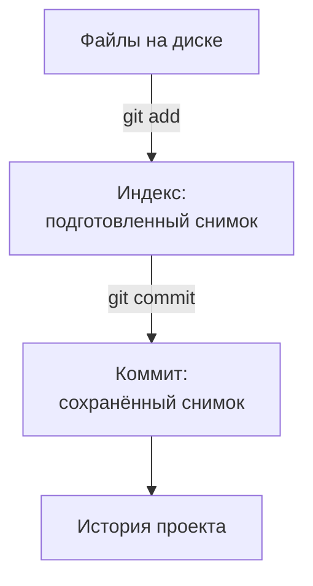
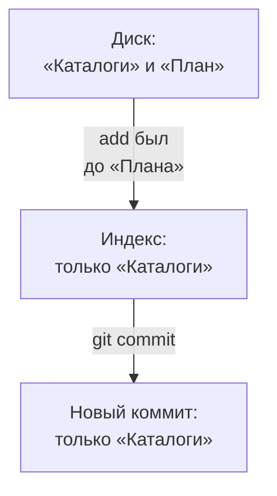
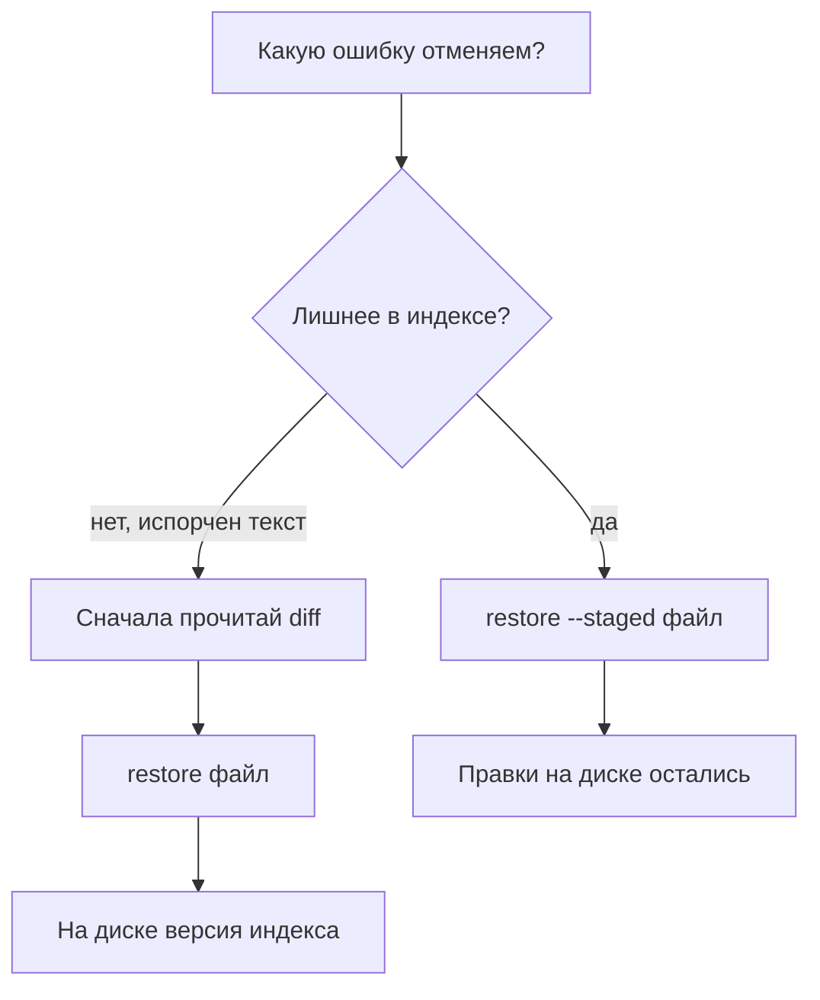

## Зачем это нужно

Я занимаюсь нагрузкой уже много лет и сегодня сижу рядом с тобой в первый рабочий день в команде интернет-магазина. Менеджер сказал: «Тесты храним не на рабочем столе, а в репозитории». Сейчас мы заведём твой `perf-lab`, и ты поймёшь, что это значит.

Сначала байка. У меня в папке когда-то лежали `test.py`, `test-final.py` и `test-final-new.py`. Вечером тест показал заметно лучший результат, и я обрадовался. Утром выяснилось: я переписал сценарий, и он стал слать меньше запросов. Сервис работал как раньше. Какой из трёх файлов я запускал, вспомнить не смог, поэтому честно сравнить прогоны было нельзя.

От такой путаницы спасает **Git**: программа, которая сохраняет выбранные версии файлов и историю их изменения. Она отвечает на вопросы «что поменялось, когда и зачем» и возвращает нужный вариант без копий папок. Для нагрузочника это ещё и честность: в отчёте ты укажешь версию сценария рядом с условиями запуска и паспортом машины, и читатель поймёт, чем меряли.

Шаг проекта: каталог `~/perf-lab`, созданный в [уроке 1.1](../01-linux/01-workstation-terminal.md), станет **репозиторием** (repository): так называют проект вместе с его историей Git. Ты сохранишь паспорт машины и памятку о структуре, научишься сравнивать изменения и отменять учебную ошибку. Всё это пока только на твоём компьютере. Следующий урок добавит вторую копию на `GitHub` (сайт для хранения репозиториев и совместной работы).

## Что нужно знать

Из [урока 1.1](../01-linux/01-workstation-terminal.md) нужны `cd`, `pwd`, `ls`, `cat`, создание файлов через `>` и дописывание через `>>`. Там же установлен Git и созданы `~/perf-lab/{results,reports,scripts}` и `machine.md`. Если каталог или паспорт потерялись, восстанови их по практике 1.1, прежде чем идти дальше.

Из [урока 1.2](../01-linux/02-text-logs.md) пригодится чтение длинного вывода: в программе просмотра `less` выходят клавишей `q`. Интернет для этого урока не нужен. Учебный «Магазин» запускать не требуется: сегодня ты работаешь с файлами своих заметок. Не меняй `~/load-tester`, где лежат материалы курса и стенд.

## Картина целиком

Представь, что ты собираешь посылку. Вещи лежат на столе. Нужные ты кладёшь в коробку и проверяешь. Потом закрываешь коробку и подписываешь. Git работает в три такие же ступени.

Вещи на столе это обычные файлы проекта, которые ты открываешь и правишь. Их называют **рабочим деревом** (working tree). Вещи в коробке это **индекс** (index, ещё его зовут staging area): подготовленное содержимое следующего сохранения.

Закрытая и подписанная посылка это **коммит** (commit): сохранённый снимок файлов с автором и сообщением о причине изменений. Между ступенями две команды. `git add` копирует текущую версию файла в индекс, это и называют staging, «положить в коробку». `git commit` записывает индекс в историю.



На схеме два перехода. Сохранить файл в редакторе не значит подготовить его, а подготовить не значит записать в историю. Аналогия с посылкой ломается в одном: Git копирует содержимое, поэтому после `add` файл остаётся на диске и его можно править дальше.

## Теория

### Репозиторий: файлы рядом с памятью о прошлом

Ты перезаписал заметку, а через час понял, что вчерашний вариант был лучше. В обычной папке он пропал навсегда. Как сделать, чтобы прошлое хранилось рядом с настоящим?

Git кладёт историю в скрытый каталог `.git` внутри проекта, и создаёт его команда `git init`. Скрытым в Linux называют имя с точкой в начале, как в [уроке 1.1](../01-linux/01-workstation-terminal.md). В `.git` лежат история, подготовленное состояние и настройки репозитория. Твои `machine.md` и будущие тесты остаются обычными файлами рядом.

Git ищет `.git` с текущей папки и поднимается вверх. Поэтому команды внутри `~/perf-lab/reports` относятся к репозиторию `~/perf-lab`. А в соседнем `~/load-tester` живёт другая история. Я однажды открыл не тот терминал и сохранил заметки не в тот проект. С тех пор перед действием смотрю `pwd`.

Сразу после `git init` файл `machine.md` лежит на диске, но истории у него нет. Git его видит и ждёт, хочешь ли ты его сохранять. После `add` файл подготовлен, после `commit` он впервые попадает в историю. Git не хранит пустые каталоги: пока `results`, `reports` и `scripts` пусты, в снимок они не попадут. Они появятся вместе с первыми файлами.

> **Прикинь сам:** ты выполнил `git init` и удалил файл, который ни разу не добавлял и не сохранял. Вернёт ли его Git?
{: .predict}

Нет. Инициализация только подготовила место для истории, содержимое файла Git ещё не сохранял. Надёжная контрольная точка появляется после `add` и `commit`.

Осторожно: Git не делает резервную копию диска. До первого коммита сохранённой версии нет, а история на одном ноутбуке пропадёт вместе с ним. Вторая копия появится в [уроке 3.2](02-github.md).

> **Главное:** репозиторий это проект плюс скрытый `.git` с историей, и пока ты ничего не сохранил, истории нет.
{: .key}

Историю нужно чем-то наполнять. Из чего она состоит?

### Коммит: состояние проекта и объяснение изменения

Через месяц ты откроешь файл и спросишь: «Зачем я это правил?». Старой копии файла для ответа мало, нужна ещё и причина.

Представь фотографию рабочего стола с подписью «подготовил методику первого прогона». По подписи понятна причина, по фотографии видно состояние. Коммит работает так же. Аналогия ломается тут: Git хранит не картинку, а содержимое файлов, поэтому умеет сравнивать две версии строка за строкой.

У коммита есть снимок отслеживаемых файлов, то есть тех, что уже попали в подготовку или историю Git. Ещё у него есть автор, время, сообщение и ссылка на предыдущий коммит, **родителя** (parent). Первый коммит родителя не имеет, второй опирается на первый, третий на второй. Так получается цепочка.

У каждого коммита есть **хеш** (hash): идентификатор, вычисленный из содержимого. Его начало, например `8c24a71`, находит запись в этой истории, если сокращение однозначно. Это не номер по порядку: второй коммит не получает «2». Твои хеши будут другими.

В короткой истории встретится строка `8c24a71 Описать структуру лаборатории`: сначала идентификатор, затем сообщение. По ней понятно, какую задачу решали, а сами правки открывают сравнением. Хорошее сообщение отвечает «что изменилось и зачем». «Добавить паспорт машины» полезнее, чем «update».

Осторожно: коммит не доказывает, что тест работает. Git сохранит и сломанный сценарий, проверять результат надо самому. И коммит ничего не отправляет на сайт: сегодня все операции локальные, то есть идут на этой машине без сети.

> **Проверь понимание:** сообщение «всё работает» гарантирует, что сценарий запускали? Что лучше написать?

<details markdown="1">
<summary>Ответ</summary>

Нет: сообщение вводит человек, а Git проверку не запускает. Лучше описать конкретное изменение, например «Добавить инструкцию создания рабочих каталогов».

</details>

> **Главное:** коммит это снимок файлов с автором, временем, сообщением и ссылкой на родителя, а сообщение объясняет причину.
{: .key}

Сообщение мы написали. Но кто решает, какие файлы войдут в снимок? Для этого между диском и историей стоит промежуточная ступень.

### Индекс: что попадёт в следующий снимок

Ты правишь две заметки, а закончил одну. Если бы Git сохранял всё подряд, в историю ушла бы и недописанная. Как сохранить только готовое?

Для этого и нужен индекс. После коммита он совпадает с последним снимком. Правка файла меняет только диск. Команда `git add файл` обновляет версию этого файла в индексе, а `git commit` записывает весь индекс в историю. После коммита файлы с диска не пропадают.

Теперь главная тонкость. `add` запоминает содержимое на момент вызова. Допустим, в `README.md` (памятка о проекте для человека, который впервые открыл папку) ты дописал раздел «Каталоги» и выполнил `add`. Потом дописал раздел «План». Индекс про «План» ничего не знает. Если сделать коммит сейчас, в истории окажутся «Каталоги», а «План» останется только на диске. Повторный `git add README.md` заменит подготовленную версию свежей.



На схеме видно, что два места из трёх отстали от диска.

> **Прикинь сам:** после `add` ты исправил опечатку и сделал `commit`. Какая версия опечатки попадёт в снимок?
{: .predict}

Та, что была на момент `add`, то есть до исправления. Индекс сам не обновляется. Чтобы исправление вошло в снимок, нужен повторный `git add`.

Осторожно: `add` не значит «следи за файлом навсегда». Он подготавливает сегодняшнее содержимое. И сохранение в редакторе не заменяет `add`: редактор и Git решают разные задачи.

> **Главное:** индекс это коробка с версией, которую ты положил в неё последней, и в коммит уходит именно она, а не то, что лежит на диске.
{: .key}

Как увидеть, что где лежит, и не гадать? Для этого у Git есть два вопроса.

### Status и diff: состояние и содержимое различий

Ты уже не уверен: что подготовлено, а что нет? Гадать не нужно. `git status` отвечает, какие файлы изменились, а `git diff` показывает, что внутри них изменилось. **Diff** это сравнение двух состояний, обычно с построчным показом добавлений и удалений.

Длинный `status` делит файлы на три группы. `Untracked files` это новые файлы, которых нет в индексе. `Changes not staged for commit` это правки на диске сверх индекса. `Changes to be committed` это подготовленное сверх последнего коммита. Файл из примера про README попадёт сразу в две последние группы: «Каталоги» подготовлены, «План» нет.

Короткий `git status --short` пишет перед именем две позиции. Левая сравнивает индекс с последним коммитом, правая диск с индексом. Поэтому новый неотслеживаемый файл выглядит как `?? notes.md`. Правка только на диске выглядит как ` M README.md`: слева пробел, значит, подготовленного нет. А наш README с «Каталогами» в индексе и «Планом» на диске покажет `MM`. Здесь `M` значит modified, «изменён», а `A` added, «добавлен».

Два вида `diff` отвечают на разные вопросы. Обычный `git diff` сравнивает диск с индексом, то есть показывает не подготовленное. `git diff --staged` сравнивает индекс с последним коммитом, то есть показывает будущий снимок. Поэтому пустой обычный diff после `add` нормален: между диском и индексом различий нет, но подготовленное ещё не сохранено.

Вот как читать строки. `-Нагрузка: только локально` значит, что старая строка удалена. `+Нагрузка: только свой локальный стенд` значит, что добавлена новая. Знаки показывают действие, а не качество текста. Строки без знаков дают окружение, чтобы ты видел место правки.

Осторожно: обычный diff не показывает содержимое нового неотслеживаемого файла. Прочитай его через `cat`, потом добавь и посмотри `diff --staged`.

> **Проверь понимание:** `git diff` пуст, а status показывает `M  README.md`. Можно ли считать работу уже сохранённой?

<details markdown="1">
<summary>Ответ</summary>

Нет. Различие находится в индексе, его покажет `git diff --staged`. В историю оно попадёт после успешного `git commit`.

</details>

> **Главное:** status говорит, какие файлы где лежат, обычный diff показывает не подготовленное, `diff --staged` показывает будущий снимок.
{: .key}

Теперь о файлах, которым в истории вообще не место.

### .gitignore: что не должно стать частью истории

Через месяц в `results` лягут гигабайты сырых измерений, а в `.env` чей-то токен. Если добавить их в историю, она станет тяжёлой, а секрет увидят все, кто откроет репозиторий. Как сказать Git «это не трогай»?

Для этого есть файл `.gitignore`: текст с шаблонами, под которые подходят новые файлы, пропускаемые при обычном добавлении. Одна строка задаёт один шаблон. Звёздочка `*` заменяет любую последовательность символов, `/` обозначает границу каталога, начальный `/` привязывает правило к корню репозитория (папке с `.git`), строки с `#` служат комментариями. Шаблон проверяет путь, а не размер. Правило `/results/*.csv` исключит и маленький, и большой CSV прямо внутри корневого `results`.

Что исключаем мы? **CSV** (comma-separated values) это текстовая таблица со значениями через запятую. Инструменты нагрузки будут писать в неё много строк измерений. Сырые выгрузки в историю не нужны, а выводы мы сохраним в `reports` небольшими текстовыми отчётами. Ещё есть `.env`: файл настроек, где бывают пароли и токены, строки для подтверждения доступа.

Две оставшиеся папки пока появятся только в будущем. `.venv` это **виртуальное окружение** Python, отдельная папка с библиотеками для проекта. Создадим её в [уроке 4.5](../04-python/05-venv-requests.md), сейчас только исключим. `__pycache__` Python создаёт сам для ускорения запуска. Обе папки получаются заново, хранить их незачем.

Правило `__pycache__/` без начального пути исключит такие каталоги на любом уровне. `/.venv/` исключит окружение только в корне. А `/results/*.csv` оставит возможность сохранить `results/README.md`, если позже понадобится инструкция о выгрузках. Сам `.gitignore` нужно закоммитить: правила понадобятся и на другой машине.

> **Прикинь сам:** исключит ли правило `/results/*.csv` файл `04-python/users.csv`? Будет ли оно искать только файлы больше 100 МБ?
{: .predict}

Нет в обоих случаях. Правило относится к CSV непосредственно в корневом `results`, и работает по пути, а не по размеру. Учебные данные в другой папке остаются доступными для добавления.

Осторожно: игнорирование не прекращает отслеживание файла, который уже попал в индекс или историю. И строка в `.gitignore` не удаляет старый коммит с секретом. Поэтому правила создают до первого массового добавления. Поведение описано в [документации gitignore](https://git-scm.com/docs/gitignore).

> **Главное:** `.gitignore` защищает от случайного добавления новых файлов, но задним числом ничего не прячет, поэтому пиши его до первого `add`.
{: .key}

Ошибки всё равно случаются. Как отменить их, не потеряв полезное?

### Restore: выбрать, какую ошибку отменить

Ты подготовил лишний файл. Или испортил абзац в тексте. Это две разные беды, и лечатся они по-разному. Одна команда на все случаи опасна: она выбросит то, что ты хотел сохранить.

Вернёмся к посылке. Можно вынуть вещь из коробки, оставив её на столе. А можно выбросить вещь со стола. `git restore --staged файл` делает первое: возвращает версию в индексе к последнему коммиту, а текст на диске не трогает. `git restore файл` делает второе: перезаписывает рабочий файл версией из индекса, и правка на диске пропадает.

В выводе Git встретится слово **HEAD**: так называют текущую точку истории, обычно последний коммит ветки. Ветка пока одна, `main`: имя линии работы. Подробнее в следующем уроке.



На схеме у двух путей разные последствия: убрать подготовку сохраняет текст, восстановить рабочий файл заменяет текст. Поэтому перед второй операцией читай различия и убеждайся, что правка лишняя.

Разберём на буквах. В коммите текст «А», после `add` в индексе «Б», после новой правки на диске «В». Обычный restore вернёт на диск «Б», а не «А». Чтобы дойти до «А», сначала сделай `--staged`: индекс станет «А», диск останется «В». Потом обычный restore даст на диске «А».

Есть и короткий путь, когда нужно выбросить все правки файла сразу: `git restore --source=HEAD --staged --worktree файл`. Здесь `--source=HEAD` выбирает коммит, `--staged` индекс, `--worktree` файлы на диске (рабочее дерево). Это действительно выбросит незакоммиченное. В практике мы применим его только к специально испорченной учебной строке.

> **Прикинь сам:** ты по ошибке сделал `add` полезной правки. Как убрать только подготовку?
{: .predict}

`git restore --staged имя-файла`. После этого проверь status и обычный diff: полезная правка осталась на диске и перешла в неподготовленные.

Осторожно: restore не отменяет уже созданный коммит. Перезаписанный несохранённый текст Git может не вернуть. А у нового неотслеживаемого файла сохранённой версии нет вовсе.

> **Главное:** сначала реши, что отменяешь: подготовку (`--staged`, текст остаётся) или текст на диске (обычный restore, правка пропадает).
{: .key}

С инструментами разобрались. Вернёмся к работе: что класть в один коммит?

### Граница коммита: что класть в один снимок

Допустим, ты исправил в паспорте число ядер и добавил в README строку, где искать паспорт. Это одна задача: читатель должен найти точные условия. Значит, и коммит один, с двумя файлами. А случайная опечатка в чужом отчёте к этой задаче не относится, её лучше сохранить отдельно.

Перед коммитом сверяй сообщение с `git diff --staged`. Если сообщение обещает правку паспорта, а в снимке только README, добавь паспорт. Если там случайно лежит секрет, убери его через `restore --staged`: правки на диске останутся.

После коммита обычный `git diff` пустеет, но правка не пропала. Она переехала из «изменений сверх снимка» в сам снимок. Увидеть её можно в `git log` (список коммитов, новые сверху) и в сравнении двух соседних коммитов.

Снимок хранит файлы, а не весь компьютер. Запущенные процессы, данные базы стенда и установленные программы в него не входят. Поэтому через месяц, когда ответ сервиса изменится, одного хеша сценария мало: нужны ещё паспорт машины и инструкция запуска. Они лежат в том же репозитории, и это первое, что я проверяю, когда сравниваю два прогона.

> **Проверь понимание:** сообщение обещает исправления двух файлов, а staged diff показывает один. Стоит ли создать коммит, чтобы проверить второй?

<details markdown="1">
<summary>Ответ</summary>

Нет. Сначала посмотри status и обычный diff второго файла. Если правка там закончена, добавь файл и снова прочитай staged diff. Коммит делают после проверки, а не чтобы найти пропущенный файл.

</details>

> **Главное:** один коммит это одна понятная задача вместе со всеми файлами, без которых результат не повторить.
{: .key}

Осталось подписать коммиты и собрать проверки в привычку.

### Автор и привычка проверять перед сохранением

Git подписывает каждый коммит именем и почтой из настроек `user.name` и `user.email`. Это подпись автора, а не вход на сайт: значения не дают доступ к GitHub и пароль не проверяют. Подойдут любые, например `student@example.com`. Когда история уйдёт на GitHub, в публичном репозитории почту увидят все посетители, поэтому в [уроке 3.2](02-github.md) мы заменим её на скрытый адрес GitHub.

`git config --global` задаёт настройки для твоего пользователя на этой машине. Без `--global`, внутри репозитория, настройка действует только здесь и главнее общей. Если общая тебя устраивает, ничего не меняй. Автора можно задать и только для `perf-lab`: тогда другие проекты не затронуты.

<div class="viz" data-viz="flow" data-title="Перед каждым коммитом" data-steps='[{"title":"Проверь место и файлы","text":"`pwd` и `git status`: ты в своём `perf-lab`, изменения ожидаемые."},{"title":"Прочитай различия","text":"`git diff`: проверь рабочие правки, новые файлы прочитай через `cat`."},{"title":"Подготовь выбранное","text":"`git add` с явными путями: включи одну законченную задачу."},{"title":"Проверь будущий снимок","text":"`git diff --staged`: нет секретов и случайных изменений."},{"title":"Сохрани и убедись","text":"`git commit`, затем `git status` и `git log`: запись действительно появилась."}]'></div>

Смотри на проверку между `add` и `commit`. Она ловит расхождение между подготовленным и ожидаемым, пока история ещё не записана.

Вернёмся к менеджеру из начала. На вопрос «чем вы мерили?» у тебя есть ответ: сценарий и паспорт машины лежат в одном снимке.

> **Главное:** перед каждым коммитом проверь место, различия и будущий снимок, и только потом сохраняй.
{: .key}

Дальше практика: сделаешь всё это руками в своём `perf-lab`.

## Практика

Выполняй шаги по порядку в Ubuntu (на Mac внутри ВМ: `multipass shell lab`), от обычного пользователя, без `sudo`. Вывод ниже по-английски, чтобы ты узнавал сообщения из документации. Если твой Git пишет по-русски, смысл тот же; для одного вызова английский можно получить через `LC_ALL=C git status`. `LC_ALL=C` задаёт язык сообщений для этой команды, не меняя систему навсегда.

### 1. Найди существующую лабораторию и настрой автора

`cd` возвращает в рабочий каталог из 1.1. `pwd` показывает его полный путь, `ls` проверяет паспорт и три папки. `git --version` сообщает версию программы, `--version` означает «покажи версию». Выполни:

```bash
cd ~/perf-lab
pwd
ls
cat machine.md
git --version
```

Пример ориентиров, без повторения самого паспорта:

```text
/home/student/perf-lab
01-linux  02-web  machine.md  reports  results  scripts
git version 2.43.0
```

**Как читать вывод:** путь должен оканчиваться на `/perf-lab`, паспорт машины должен содержать твои условия, Git должен быть версии 2.43 или новее. Между списком файлов и версией у тебя будет содержимое `machine.md`. Дополнительные заметки прошлых уроков нормальны, не удаляй их.

Перед настройкой прочитай текущие значения. `git config --global --get` получает один параметр общей настройки; `user.name` и `user.email` это имена параметров:

```bash
git config --global --get user.name
git config --global --get user.email
```

Если вывода нет, значение не задано. Если там уже стоят подходящие имя и почта, оставь их. Иначе задай свои. `--global` действует для всех репозиториев на этой машине, текст в кавычках передаётся одним значением:

```bash
git config --global user.name "Автор лаборатории"
git config --global user.email "student@example.com"
```

`student@example.com` это учебный адрес: письма на него не придут, и это нормально, сейчас он нужен только как подпись. Свой настоящий адрес подставлять необязательно, первые коммиты просто будут подписаны учебным. Эти две команды при успехе молчат. Повтори `--get`, чтобы проверить, что значения записались.

**Типичные ошибки:** `bash: git: command not found`: Git не установлен в этой Ubuntu. Вернись к установке из 1.1. `cd: /home/student/perf-lab: No such file or directory`: каталога нет, восстанови практику 1.1, а не создавай репозиторий в случайном месте.

### 2. Начни историю в уже существующей папке

`git init` инициализирует репозиторий, `-b main` задаёт имя начальной ветки `main`. Флаг `-b` требует имя следом. Мы выбираем его явно, чтобы результат не зависел от настроек машины:

```bash
git init -b main
git status
```

```text
Initialized empty Git repository in /home/student/perf-lab/.git/
On branch main

No commits yet

Untracked files:
  (use "git add <file>..." to include in what will be committed)
        01-linux/
        02-web/
        machine.md
        results/
        scripts/

nothing added to commit but untracked files present (use "git add" to track)
```

**Как читать вывод:** создана `.git`, выбрана `main`, коммитов пока нет. `machine.md` найден, но ещё не включён в историю. Пустая `reports` не перечислена, а папки с твоей работой из тем 1 и 2 (`01-linux`, `02-web`, `scripts`, `results`) показаны: в них уже есть файлы. Если у тебя список короче или длиннее, это нормально.

Если не хочешь менять общие настройки автора, теперь можно задать их только здесь: `git config user.name "Автор лаборатории"` и `git config user.email "student@example.com"`. Это та же команда без `--global`. Для проверки эффективных значений используй `git config --get user.name` и `git config --get user.email`.

**Типичные ошибки:** `fatal: not in a git directory` при локальном config значит, что ты запустил его до `init` или вышел из проекта. Если вместо `Initialized` видишь `Reinitialized`, смотри рамку «Если ты повторяешь урок» в конце практики.

### 3. Создай правила исключений и README

**README** это файл с объяснением проекта для человека, который впервые открыл папку. Расширение `.md` обозначает Markdown, простой текст с разметкой: `#` задаёт заголовок, `-` пункт списка, обратные кавычки выделяют команды. GitHub позднее покажет этот файл как оформленную страницу.

Следующие команды создают файлы с нуля: `>` перезаписывает существующий файл, так что в чистой папке всё в порядке. Для многострочного текста используем `cat > файл <<'EOF'`. Оболочка берёт следующие строки до отдельной строки `EOF` и передаёт их `cat`, а `>` записывает результат. Кавычки вокруг `'EOF'` запрещают подстановку переменных и команд внутри текста: обратные кавычки сохранятся буквально.

```bash
cat > .gitignore <<'EOF'
# Окружение Python и автоматически создаваемые файлы
/.venv/
__pycache__/
*.pyc
# Сырые выгрузки измерений, включая крупные CSV
/results/*.csv
# Личные настройки и реквизиты доступа
.env
EOF
```

Здесь `*.pyc` исключает служебные файлы Python с таким расширением. `.env` без начального `/` исключает это имя и во вложенных папках. Окружение пока не создаём: оно появится в 4.5.

Создай первую памятку проекта:

````bash
cat > README.md <<'EOF'
# perf-lab

Учебная лаборатория нагрузочного тестирования и мониторинга.

## Каталоги

- `machine.md`: паспорт машины для условий измерений.
- `scripts/`: вспомогательные скрипты.
- `results/`: сырые результаты, CSV не включаются в Git.
- `reports/`: отчёты и выводы.

Пустые рабочие каталоги создаются командой:

```bash
mkdir -p results reports scripts
```
EOF
````

В тексте README есть вложенный блок с `mkdir`: это часть файла, а не команда для запуска сейчас. Копируй всё от `cat` до завершающего `EOF`.

Прочитай оба файла, затем попроси Git проверить пути по правилам. `git check-ignore -v` показывает правило, которое исключает путь; `-v` означает подробный вывод. Пути здесь могут ещё не существовать, поэтому мы ничего не создаём ради проверки:

```bash
cat .gitignore
cat README.md
git check-ignore -v .venv/example __pycache__/example.pyc results/run.csv .env
```

```text
.gitignore:2:/.venv/      .venv/example
.gitignore:3:__pycache__/        __pycache__/example.pyc
.gitignore:6:/results/*.csv     results/run.csv
.gitignore:8:.env       .env
```

**Как читать вывод:** слева имя файла правил, номер строки и сработавший шаблон, справа проверяемый путь. Пробелы или табуляция между колонками могут отображаться иначе. Комментарии тоже считаются строками. Для каждой из четырёх проверок должен найтись ожидаемый шаблон.

**Типичные ошибки:** правило `results.csv` не исключит `results/run.csv`, потому что имя другое. А строка `results/` исключит целиком каталог, включая будущие памятки. Исправь правило до добавления файлов. Если `cat` ждёт ввода, завершающий `EOF` набран с пробелами или не на отдельной строке.

### 4. Подготовь и сохрани первый снимок

Сначала прочитай `machine.md`: в истории будут выбранные тобой данные машины. Не добавляй личные пароли, токены или ненужные внутренние адреса. Поэтому используем явные пути вместо `git add .`: точка означала бы «всё в текущей папке», а там могут лежать файлы с токенами из прошлых занятий.

`git add` получает три пути и подготавливает их содержимое. `git diff --staged` показывает будущий первый снимок: все строки этих файлов будут добавлениями, потому что прошлого коммита ещё нет:

```bash
git add .gitignore README.md machine.md
git status --short
git diff --staged
```

```text
A  .gitignore
A  README.md
A  machine.md
```

**Как читать вывод:** `A` в первой позиции означает подготовленное добавление. Вторая позиция пустая: после add файлы больше не менялись. Далее diff показывает содержимое всех трёх файлов. Если открылся просмотрщик, пролистай его и нажми `q`. Не продолжай, пока не прочитал будущий снимок.

`git commit -m` создаёт запись из индекса; `-m` передаёт сообщение сразу, без открытия редактора. Кавычки объединяют сообщение в один аргумент:

```bash
git commit -m "Добавить паспорт машины и структуру лаборатории"
```

Пример начала ответа:

```text
[main (root-commit) 8c24a71] Добавить паспорт машины и структуру лаборатории
```

**Как читать вывод:** `main` имя линии истории, `root-commit` первый коммит без родителя, `8c24a71` пример сокращённого идентификатора, дальше твоё сообщение. Затем Git напечатает количество файлов, добавленных строк и строки `create mode 100644 ...`. `100644` обозначает обычные файлы без права исполнения. Число строк зависит от паспорта и твоего README.

Повтори `git status`. Если больше ничего не менялось и нет других файлов, итог будет `nothing to commit, working tree clean`, «сохранять нечего, рабочее дерево чистое». **Чистое состояние** означает совпадение отслеживаемых файлов на диске, индекса и последнего коммита. Исключённые файлы могут существовать и в чистом состоянии.

Если status перечисляет файлы из прошлых уроков, смотри рамку «Если ты повторяешь урок» в конце практики.

**Типичные ошибки:** `Author identity unknown` означает, что не настроено имя или почта автора. Настрой их через config и повтори commit, индекс заново готовить не требуется. `nothing to commit` при попытке первого коммита обычно означает отсутствие подготовленных файлов: проверь status, путь и add.

### 5. Сделай осмысленное изменение и прочитай diff

Дополним памятку условием безопасной практики. `printf` печатает строку, `\n` в формате означает перевод строки, `>>` дописывает к файлу. `%s` подставляет следующий текст как строку без его интерпретации:

```bash
printf '\n%s\n' 'Нагрузку даём только на свой локальный стенд.' >> README.md
git status --short
git diff -- README.md
```

`--` отделяет параметры команды от путей файлов. Здесь мы просим сравнить только README, а не весь проект.

```text
 M README.md
```

Пример содержимого различий в конце файла:

```diff
+
+Нагрузку даём только на свой локальный стенд.
```

**Как читать вывод:** `M` во второй позиции означает изменение только на диске. В diff первая пустая добавленная строка даёт отступ, вторая содержит правило. В полном выводе `diff --git` называет файл, `index` показывает идентификаторы содержимого, `--- a/README.md` старую сторону, `+++ b/README.md` новую. Строка `@@ ... @@` показывает диапазоны строк старого и нового вариантов, затем идут строки окружения и правки.

Убедись, что добавлена нужная фраза. Подготовь её, снова прочитай будущий снимок и сохрани:

```bash
git add README.md
git diff --staged -- README.md
git commit -m "Уточнить правило безопасной нагрузки"
git status
```

Пример начала ответа commit:

```text
[main 41a72b3] Уточнить правило безопасной нагрузки
 1 file changed, 2 insertions(+)
```

**Как читать вывод:** один изменённый файл, две добавленные строки, включая пустую. После успешного коммита рабочее дерево снова чистое при отсутствии другой работы.

**Типичные ошибки:** пустой обычный diff после add ожидаем, проверяй `--staged`. Если написал `>` вместо `>>`, README будет заменён одной фразой, а diff покажет много удалений. До add прочитай различия, верни README через `git restore README.md` и повтори правильное дописывание.

### 6. Найди оба коммита и сравни снимки

`git log` показывает историю. `--oneline` сокращает каждую запись до идентификатора и сообщения, `-5` ограничивает вывод пятью последними записями. `git diff HEAD~1 HEAD -- README.md` сравнивает README между предыдущим коммитом и текущим: `HEAD~1` это один шаг назад по первому родителю.

```bash
git log --oneline -5
git diff HEAD~1 HEAD -- README.md
```

```text
41a72b3 (HEAD -> main) Уточнить правило безопасной нагрузки
8c24a71 Добавить паспорт машины и структуру лаборатории
```

**Как читать вывод:** сверху более новая запись. `HEAD -> main` показывает текущую ветку и её последний коммит. В сравнении снова видны две добавленные строки. Их наличие в diff двух коммитов доказывает, что правка записана в историю, даже когда обычный diff пуст.

Теперь без подсказки ответь: какой командой ты увидишь подготовленный снимок, какой текущие правки и какой два сохранённых состояния? Если ответ путается, вернись к разделу про индекс в теории, а не запоминай команды отдельно от их смысла.

**Типичные ошибки:** `fatal: bad revision 'HEAD~1'` означает, что у текущей записи нет предыдущего коммита по этому пути, например ты сделал только один коммит. Проверь log и закончи предыдущий шаг. Не подставляй учебные хеши в свои команды: у тебя другие идентификаторы.

> Git выдал ошибку, которой нет в «Типичных ошибках»? Скопируй команду и весь вывод, спроси нейросеть, что значит каждая строка. Перед советом, который меняет историю или файлы, сделай `git status` и `git log --oneline` и убедись, что работа не потеряется.
{: .ai}

## Сломай и почини

### Поломка 1. Подготовил не ту версию

Мы испортим только одну учебную строку README и не создадим ошибочный коммит. Сначала убедись через status, что README чист. `printf` допишет намеренно неверное утверждение, add подготовит его. Затем ещё одна строка останется только на диске:

```bash
printf '\n%s\n' 'Git commit сразу публикует файлы в интернете.' >> README.md
git add README.md
printf '%s\n' 'Эта строка появилась после add.' >> README.md
git status --short
git diff -- README.md
git diff --staged -- README.md
```

```text
MM README.md
```

**Как читать вывод:** первая `M` это неверное утверждение в индексе, вторая новая строка сверх индекса на диске. Обычный diff показывает вторую строку; staged diff ошибочную фразу и пустую строку перед ней. Ты получил две версии правок одного файла.

**Задача:** сначала убери подготовку, сохранив текст для осмотра, затем выброси только эти учебные изменения и верни README к последнему коммиту. Не трогай другие файлы.

<details markdown="1">
<summary>Разбор и исправление</summary>

Убираем подготовку, как в теории, затем проверяем обычное различие:

```bash
git restore --staged README.md
git status --short
git diff -- README.md
```

Теперь status показывает ` M README.md`: обе строки остались на диске, в индексе сохранённый вариант. Прочитай diff: должны быть только две учебные фразы и пустая строка. Затем восстанови рабочий файл из индекса:

```bash
git restore README.md
git status
git diff -- README.md
```

**Как читать вывод:** status снова чистый, diff пуст. Полезное правило «Нагрузку даём только на свой локальный стенд» осталось, ошибочная фраза и строка после add исчезли. Коммиты в log не изменились.

Можно было использовать `git restore --source=HEAD --staged --worktree README.md`, сразу вернув обе области к последнему коммиту. Раздельные действия помогли увидеть, что первая команда сохраняет рабочий текст, а вторая перезаписывает его.

</details>

**Типичные ошибки:** если начать с обычного restore, пропадёт только строка после add, а ложное утверждение вернётся из индекса на диск. Это не неисправность Git: ты выбрал другой источник. Проверь staged diff и убери подготовку перед окончательным восстановлением.

### Поломка 2. Кажется, что каталог не сохранился

Открой `git status` и найди там пустой `scripts`. Его нет. Кажется, что Git потерял папку, но на диске она по-прежнему существует: это проверяется `ls -ld scripts`. Здесь `-l` даёт подробности, `-d` показывает сам каталог, а не его содержимое.

**Задача:** объясни, почему это нормально и как коллега позже узнает, что эти папки нужны.

<details markdown="1">
<summary>Разбор</summary>

Git сохраняет файлы и их пути, а пустой каталог не имеет содержимого для снимка. В README уже есть `mkdir -p results reports scripts`, поэтому человек может восстановить рабочие папки. Когда появится первый скрипт или отчёт, добавишь его явным путём и каталог будет восстановлен вместе с ним. Создавать случайные пустые файлы ради видимости в Git не требуется.

</details>

### Если ты повторяешь урок или в папке уже что-то лежит

- `Reinitialized existing Git repository` в шаге 2: `.git` уже была. Историю не удаляй, посмотри `git status` и `git log --oneline`. Вместо `No commits yet` ты увидишь свои старые коммиты.
- `.gitignore` или `README.md` уже существуют (проверь через `ls -a`): прочитай их `cat` и допиши недостающие строки в `nano`, а не перезаписывай командой `cat >`.
- Status в шаге 4 показывает файлы прошлых уроков: полезные заметки без токенов добавь явными путями отдельным коммитом, а файлы с токенами и ключами внеси по точным путям в `.gitignore` и закоммить это правило. Ничего не удаляй и не добавляй «всё подряд». После такой уборки коммитов станет больше двух, это нормально.
- Перед уроком 3.2 `git status` должен быть чистым.

### Самостоятельная проверка

Не меняя файлов, сформулируй порядок действий для трёх ситуаций: новая законченная заметка, полезная правка ошибочно подготовлена, случайная правка рабочего файла. Для каждой назови сначала проверку, потом действие и ожидаемый status. Если можешь объяснить результат до запуска команды, урок усвоен. Итог этой практики: два полезных коммита, чистый README, целый паспорт и действующий `.gitignore`.

## ИИ в помощь

Нейросеть хорошо объясняет вывод Git и формулирует сообщения коммитов, но историю твоего репозитория не видит. Общие правила на странице [ИИ-помощник](../ai.md).

**Задача:** разобрать вывод `git status` и `git diff`.

```text
Я учу Git. Вывод git status и git diff в моём репозитории perf-lab:
<вставь вывод>
Объясни каждую строку: что подготовлено, что изменено, что не отслеживается. Какие команды я выполню дальше и что каждая сделает?
```
{: .wrap}

**Проверь ответ:** запускай сначала команды, которые ничего не меняют: `status`, `diff`, `log`. Типичная ошибка: совет `git reset --hard` или `git clean -fd`, которые безвозвратно удаляют твою работу.

**Задача:** написать понятное сообщение коммита.

```text
Вот мой git diff --staged:
<вставь diff>
Предложи три варианта сообщения коммита: короткая строка до 60 символов, при необходимости пояснение. Объясни, чем хорошее сообщение отличается от плохого.
```
{: .wrap}

**Проверь ответ:** сверь сообщение с `git diff --staged`: оно должно описывать именно твои изменения. Типичная ошибка: нейросеть добавляет то, чего ты не делал (тесты, документацию).

## Словарик урока

| Термин | Простыми словами |
|---|---|
| Git | Программа для сохранения выбранных версий файлов и истории |
| Репозиторий (repository) | Проект вместе с его историей Git |
| Рабочее дерево (working tree) | Обычные файлы, которые редактируешь на диске |
| Индекс (index, staging area) | Подготовленное содержимое следующего снимка |
| Staging | Подготовка выбранного содержимого через add |
| Коммит (commit) | Сохранённый снимок с автором, временем и сообщением |
| Родитель (parent) | Предыдущий коммит, на который ссылается новый |
| Хеш (hash) | Вычисленный идентификатор содержимого или коммита |
| HEAD | Текущая точка истории, обычно последний коммит выбранной ветки |
| Diff | Построчное сравнение двух состояний |
| Неотслеживаемый файл (untracked) | Новый файл, ещё не включённый в индекс |
| .gitignore | Правила исключения новых файлов по именам и путям |
| CSV | Текстовая таблица со значениями, разделёнными запятыми |
| Виртуальное окружение | Отдельная папка с библиотеками Python для проекта |
| README, Markdown | Памятка о проекте и простая текстовая разметка для неё |
| Чистое состояние | Рабочие отслеживаемые файлы совпадают с индексом и коммитом |

## Вопросы с собеседований

Раздел для повторения: ответь вслух, потом открой ответ. Вопросы с пометкой `[на скорость]` отвечай за 30 секунд, остальные объясняй с примером.



## Проверено на версиях

Примеры рассчитаны на Ubuntu 24.04/26.04, Bash 5.2+ и Git 2.43+. Вывод дан для английского языка сообщений, идентификаторы и количества строк зависят от твоих файлов. Команды и семантика restore сверены с документацией Git; сетевые действия в этом уроке отсутствуют. Октябрь 2026.

## Итог урока: ты умеешь

- [ ] Инициализировать Git в существующем `~/perf-lab`, сохранив файлы прошлых уроков.
- [ ] Настроить имя и почту автора и объяснить, почему это не вход на GitHub.
- [ ] Различать рабочее дерево, индекс и коммит.
- [ ] Исключить окружение, служебные файлы и сырые CSV через `.gitignore`.
- [ ] Выбрать файлы через add и проверить содержимое через diff --staged.
- [ ] Сохранить два осмысленных коммита, прочитать status и log.
- [ ] Сравнить соседние коммиты и отменить только учебные правки README.

Дальше: [урок 3.2](02-github.md). Ты отправишь сохранённую историю на GitHub и научишься вносить изменения через отдельную ветку.
