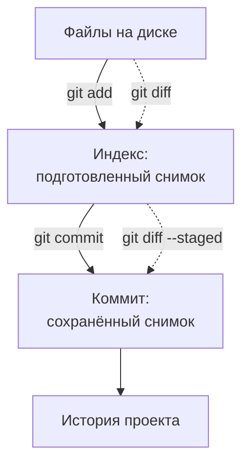
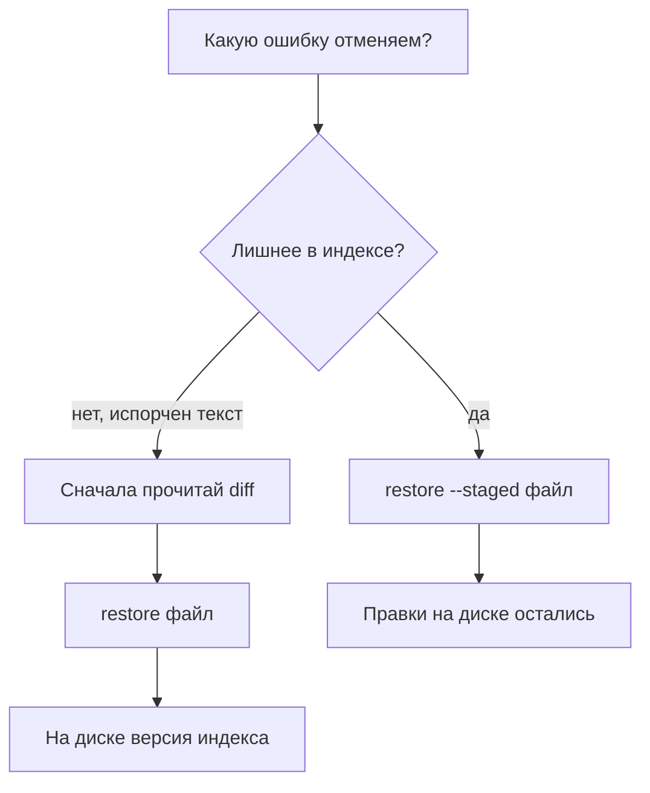

## Зачем это нужно

Вчера твой тест работал, сегодня ты поменял три файла и он перестал запускаться. В папке лежат `test.py`, `test-final.py` и `test-final-new.py`, но никто уже не помнит, какой вариант проверяли. **Git** это программа, которая сохраняет выбранные версии файлов и историю их изменения. Ты можешь узнать, что поменялось, когда и зачем, а затем вернуть нужный вариант. Для этого не нужно каждый раз копировать весь проект в новую папку.

Нагрузочнику история нужна ещё и для честных сравнений. Если между двумя прогонами изменился сценарий, результат мог поменяться из-за теста, а не из-за сервиса. Сохранённая версия сценария даёт точный ответ на вопрос «чем именно мы мерили». В будущем ты будешь указывать её в отчёте рядом с условиями запуска и паспортом машины.

**Репозиторий** (repository) это каталог проекта вместе с его историей Git. В этом уроке он живёт только на твоём компьютере. **Коммит** (commit) это сохранённый снимок выбранных файлов с подписью автора и сообщением о причине изменения. Коммит похож на контрольную точку в игре: можно продолжать работу, зная, какое состояние уже сохранено.

Шаг проекта: каталог `~/perf-lab`, созданный в [уроке 1.1](../01-linux/01-workstation-terminal.md), становится репозиторием. Ты сохраняешь паспорт машины и памятку о структуре проекта, учишься сравнивать изменения и отменять учебную ошибку. Следующий урок добавит вторую копию истории на `GitHub` (сайте для хранения репозиториев и совместной работы).

## Что нужно знать

Из [урока 1.1](../01-linux/01-workstation-terminal.md) нужны `cd`, `pwd`, `ls`, `cat`, создание файлов через `>` и дописывание через `>>`. Там же установлен Git и созданы `~/perf-lab/{results,reports,scripts}` и `machine.md`. Если каталог или паспорт потерялись, восстанови их по практике 1.1, прежде чем идти дальше.

Из [урока 1.2](../01-linux/02-text-logs.md) пригодится чтение длинного вывода: в программе просмотра `less` выходят клавишей `q`. Интернет для этого урока не нужен. Учебный «Магазин» запускать не требуется: сегодня ты работаешь с файлами своих заметок. Не меняй `~/load-tester`, где лежат материалы курса и стенд.

## Картина целиком

Представь, что собираешь посылку. На столе много вещей, но отправить хочешь только часть. Сначала кладёшь выбранное в коробку, проверяешь содержимое и лишь потом закрываешь её и подписываешь. В Git файл на диске соответствует вещи на столе, подготовленная версия соответствует вещи в коробке, а коммит соответствует закрытой посылке.

**Рабочее дерево** (working tree) это обычные файлы проекта, которые ты открываешь и редактируешь. **Индекс** (index, staging area) это подготовленное содержимое следующего коммита. Подготовка называется **staging**, «положить в будущий снимок». Команда `git add` копирует текущую версию выбранного файла в индекс, а `git commit` сохраняет состояние индекса в историю.



Здесь два разных перехода. Сохранить файл в редакторе ещё не значит подготовить его для коммита, а подготовить ещё не значит записать в историю. Аналогия с посылкой ломается в одном: Git копирует содержимое, поэтому после `add` файл остаётся на диске и его можно менять дальше.

## Теория

### Репозиторий: файлы рядом с памятью о прошлом

**Зачем это существует.** Обычная папка знает только сегодняшнее содержимое. Если перезаписать заметку, вчерашний текст сам не вернётся. Git хранит выбранные прошлые состояния отдельно, поэтому текущие файлы и их история могут существовать одновременно. Работа не превращается в набор каталогов `lab-old`, `lab-new`, `lab-new-2`.

**Как устроено.** Команда `git init` создаёт внутри проекта скрытый каталог `.git`. Скрытым в Linux называют имя, начинающееся с точки, как в [уроке 1.1](../01-linux/01-workstation-terminal.md). В `.git` лежат данные истории, подготовленное состояние и настройки этого репозитория. Твои `machine.md` и будущие тесты остаются обычными файлами рядом. Редактировать внутренности `.git` вручную не нужно.

Git ищет этот каталог начиная с текущей папки, затем поднимается к родительской. Поэтому команды работают и внутри `~/perf-lab/reports`: они относятся к репозиторию `~/perf-lab`. А в соседнем `~/load-tester` находится другая история, с другими файлами и автором. Перед действием проверяй `pwd`, особенно если открыто несколько терминалов.

**Разобранный пример.** Сразу после инициализации `machine.md` лежит на диске, но истории у него ещё нет. Git может его увидеть, однако пока не знает, хочешь ли ты сохранять этот файл. После `add` он подготовлен, после `commit` впервые появляется в истории. Само создание `.git` ничего из папки автоматически не сохраняет.

Git не хранит пустые каталоги. Если `results`, `reports` и `scripts` пусты, они не появятся в снимке. Это нормально: когда там возникнут нужные файлы, Git сохранит их вместе с путями. README позднее подскажет, как создать пустые рабочие папки на другой машине.

**Что путают.** Git не является автоматическим резервным копированием всего диска. До первого коммита нет сохранённой версии, а история на единственном ноутбуке может пропасть вместе с диском. Вторая копия появится в [уроке 3.2](02-github.md). Даже тогда несохранённые изменения останутся только здесь.

> **Проверь понимание:** ты выполнил `git init` и удалил файл, который ни разу не добавлял и не сохранял. Обязан ли Git его восстановить?

<details markdown="1">
<summary>Ответ</summary>

Нет. Git ещё не сохранял содержимое файла. Инициализация только подготовила место для истории. Чтобы появилась надёжная контрольная точка, файл нужно добавить и записать коммитом.

</details>

### Коммит: состояние проекта и объяснение изменения

**Зачем это существует.** Набора старых файлов мало. Нужно связать их в одно согласованное состояние: сценарий, настройки и инструкцию, с которыми действительно запускали тест. Коммит хранит такой снимок отслеживаемых файлов, то есть файлов, уже включённых в подготовку или историю Git.

**Аналогия.** Фотография рабочего стола с подписью «подготовил методику первого прогона». По подписи понимаешь причину, по фотографии видишь состояние. Аналогия ограничена: Git хранит содержимое файлов, а не изображение, поэтому может точно сравнить строки двух версий.

**Как устроено.** У коммита есть снимок, автор, время, сообщение и ссылка на предыдущий коммит, который называют **родителем** (parent). Первый коммит родителя не имеет. Следующий опирается на первый, третий на второй: так получается цепочка. Неизменённые данные Git переиспользует, поэтому снимки не означают полную физическую копию папки при каждом сохранении.

У каждого коммита есть **хеш** (hash), идентификатор, вычисленный из его содержимого и служебных данных. Например, начало `8c24a71` позволяет найти запись в пределах этой истории, если сокращение однозначно. Это не номер по порядку: второй коммит не получает «2», а одинаковые сообщения не делают два коммита одинаковыми.

**Разобранный пример.** В короткой истории строка `8c24a71 Описать структуру лаборатории` содержит сначала сокращённый идентификатор, затем сообщение. По ней понятно, какую задачу решали, но конкретные изменения нужно открыть сравнением. Твой идентификатор будет другим: хотя бы время и автор различаются.

Хорошее сообщение отвечает «что изменилось и зачем». «Добавить паспорт машины» полезнее, чем «update». Не записывай одновременно опечатку в отчёте и полностью новый сценарий без связи между ними. Один коммит на одну понятную задачу проще проверить и объяснить. На этом уроке задачи маленькие, поэтому сообщения короткие и по-русски.

**Что путают.** Коммит не доказывает работоспособность: Git сохранит и сломанный тест. Перед сохранением всё равно нужно проверить результат. И коммит не отправляет данные на сайт: сегодня все операции локальные, то есть происходят на этой машине без сети.

> **Проверь понимание:** сообщение коммита «всё работает» гарантирует, что сценарий запускался? Что лучше написать?

<details markdown="1">
<summary>Ответ</summary>

Нет: сообщение вводит человек, Git не запускает проверку автоматически. Лучше описать конкретное изменение, например «Добавить инструкцию создания рабочих каталогов». Проверку результата выполняют отдельно.

</details>

### Индекс: что именно попадёт в следующий снимок

**Зачем это существует.** Ты можешь одновременно работать над двумя заметками, но закончить только одну. Если бы Git сохранял всё сразу, в историю попадала бы незавершённая работа. Индекс позволяет выбрать содержимое следующего снимка, оставив остальное на столе.

**Как устроено.** После коммита индекс соответствует последнему сохранённому снимку. Редактирование файла меняет только рабочее дерево. `git add файл` обновляет версию этого файла в индексе. `git commit` сохраняет весь подготовленный снимок, включая прежние версии остальных отслеживаемых файлов. После коммита изменённые файлы не удаляются с диска.

Важно: `add` запоминает содержимое на момент вызова. Если после него дописать строку, Git не обновит индекс сам. Файл тогда имеет сразу две версии сверх последнего коммита: подготовленную и более свежую рабочую. Повторный `add` заменит подготовленную версию новой. Это объясняет большинство странных ситуаций новичка.

| Момент | Последний коммит | Индекс | Файл на диске |
|---|---|---|---|
| Начало | «версия 1» | «версия 1» | «версия 1» |
| Отредактировал | «версия 1» | «версия 1» | «версия 2» |
| Выполнил add | «версия 1» | «версия 2» | «версия 2» |
| Снова отредактировал | «версия 1» | «версия 2» | «версия 3» |
| Выполнил commit | «версия 2» | «версия 2» | «версия 3» |

Здесь видно, почему одного `add` в начале работы недостаточно. Коммит сохранит вторую версию, а третья останется незаписанной. Наличие файла в индексе не запрещает продолжать его редактирование.

**Разобранный пример.** Ты дописал в `README.md` раздел «Каталоги», подготовил его, затем дописал «План». Если сейчас сохранить коммит, в нём будет раздел «Каталоги», но не «План». Для обоих разделов нужен повторный `git add README.md`. Для одного достаточно текущего индекса, но остаток нельзя забыть.

**Что путают.** `git add` не означает «навсегда следи за всеми следующими правками автоматически». Он подготавливает именно сегодняшнее содержимое. А сохранение в редакторе не заменяет `add`: редактор и Git решают разные задачи.

> **Проверь понимание:** после `add` ты исправил опечатку и сделал `commit`. Какая версия опечатки попадёт в коммит?

<details markdown="1">
<summary>Ответ</summary>

Та, которая была до исправления: индекс не обновлялся. Посмотри обычный `git diff`, затем добавь исправленный файл повторно, если хочешь включить правку в следующий коммит.

</details>

### Status и diff: состояние и содержимое различий

**Зачем это существует.** Перед записью истории нужно ответить на два вопроса: «какие файлы изменились?» и «что именно внутри них изменилось?». `git status` отвечает на первый, `git diff` на второй. **Diff** это сравнение двух состояний, обычно с построчным показом добавлений и удалений.

**Как устроено.** Длинный `status` делит файлы на группы. `Untracked files` означает новые, неотслеживаемые файлы: их ещё нет в индексе. `Changes not staged for commit` означает изменения на диске сверх индекса. `Changes to be committed` означает подготовленные различия относительно последнего коммита. Один файл может быть во второй и третьей группе одновременно.

Короткий `status --short` использует две позиции перед именем. Первая сравнивает индекс с последним коммитом, вторая рабочее дерево с индексом. Буква `M` означает modified, «изменён», `A` added, «добавлен». `??` отдельно обозначает новый неотслеживаемый файл. Пробел в позиции означает отсутствие изменения на соответствующем уровне.

| Вывод | Что значит | Следующий вопрос |
|---|---|---|
| `?? notes.md` | Новый файл вне индекса | Нужно ли его сохранять? |
| `A  README.md` | Новый файл подготовлен | Проверил ли его текст? |
| ` M README.md` | Правка только на диске | Готова ли она для add? |
| `M  README.md` | Правка подготовлена | Что показывает diff --staged? |
| `MM README.md` | Подготовленная и новая правки | Нужно ли обновить индекс? |

Обычный `git diff` сравнивает рабочее дерево с индексом. `git diff --staged` сравнивает индекс с последним коммитом. Поэтому пустой обычный diff после `add` нормален: различий между диском и индексом уже нет, но подготовленное изменение ещё не сохранено.

**Разобранный пример.** Строка с `-Нагрузка: только локально` означает удаление старой строки, `+Нагрузка: только свой локальный стенд` добавление новой. Знаки показывают действие, а не хорошее и плохое качество текста. Строки без этих знаков дают окружение, чтобы ты понял место изменения.

**Что путают.** Обычный diff не показывает содержимое нового неотслеживаемого файла. Прочитай его через `cat`, затем добавь и посмотри `diff --staged`. Также не суди по одному цвету: смысл задают текст и позиции, цвета могут быть отключены.

> **Проверь понимание:** `git diff` пуст, но status показывает `M  README.md`. Можно ли считать работу уже сохранённой?

<details markdown="1">
<summary>Ответ</summary>

Нет. Различие находится в индексе, поэтому его покажет `git diff --staged`. Сохранение в историю произойдёт после успешного `git commit`.

</details>

### .gitignore: что не должно стать частью истории

**Зачем это существует.** В проекте появляются файлы, которые легко получить заново, а ещё крупные результаты и личные реквизиты доступа. Их случайное добавление делает историю тяжёлой или раскрывает данные. `.gitignore` это текстовый файл с правилами для новых файлов, которые Git должен пропускать при обычном добавлении.

**Как устроено.** Одна строка задаёт один шаблон имени. `*` заменяет последовательность символов, `/` обозначает границу каталога, начальный `/` привязывает правило к корню этого репозитория. Строки с `#` служат комментариями. Шаблон не проверяет размер файла: правило `/results/*.csv` исключит и маленький, и большой CSV прямо внутри корневого `results`.

**CSV** (comma-separated values) это текстовая таблица: значения разделены запятыми. Позднее инструменты нагрузки будут писать в неё много строк измерений. Для курса исключаем все такие сырые выгрузки в `results`, а выводы сохраняем в `reports` в небольших текстовых отчётах. Небольшие CSV с тестовыми данными в других каталогах этим правилом не запрещаются.

`.venv` это будущее **виртуальное окружение** Python, отдельная папка с установленными для проекта библиотеками. Создадим её в [уроке 4.5](../04-python/05-venv-requests.md), сейчас только исключим. `__pycache__` это автоматически создаваемый Python каталог служебных копий для ускорения запуска. Их можно получить снова, поэтому сохранять их не нужно. `.env` это файл настроек, в котором могут быть пароли и токены, строки для подтверждения доступа. Для публикации подходит пример настроек без секретов, а не личный `.env`.

**Разобранный пример.** Правило `__pycache__/` без начального пути исключит такие каталоги на разных уровнях. `/.venv/` исключит окружение в корне. `/results/*.csv` оставит возможность сохранить `results/README.md`, если позже понадобится инструкция о выгрузках. Сам `.gitignore` нужно закоммитить: правила нужны и на другой машине.

**Что путают.** Игнорирование не прекращает отслеживание файла, уже попавшего в индекс или историю. И добавление секрета в `.gitignore` не удаляет старый коммит. Поэтому правила создают и проверяют до первого массового добавления. Поведение описано в [документации gitignore](https://git-scm.com/docs/gitignore).

> **Проверь понимание:** правило `/results/*.csv` исключит `04-python/users.csv`? Будет ли оно искать файлы больше 100 МБ?

<details markdown="1">
<summary>Ответ</summary>

Нет в обоих случаях. Правило относится к CSV непосредственно внутри `results` в корне и работает по пути, а не по размеру. Учебные данные в другой папке остаются доступными для добавления.

</details>

### Restore: выбрать, какую ошибку отменить

**Зачем это существует.** Ошибки бывают на разных уровнях. Иногда ты подготовил лишний файл, но хочешь сохранить его правки на диске. Иногда испортил сам текст и хочешь выбросить правку. Одна универсальная команда без понимания уровня была бы опасной.

**Как устроено.** `git restore --staged файл` возвращает версию в индексе к последнему коммиту, не меняя рабочий файл. `git restore файл` перезаписывает рабочий файл содержимым из индекса. **HEAD** это обозначение текущей точки истории, обычно последнего коммита выбранной ветки. Ветка пока у нас одна, `main`: имя линии работы, подробнее в следующем уроке.



На схеме разные последствия: убрать подготовку сохраняет текст, восстановить рабочий файл заменяет текст. Поэтому перед второй операцией нужно прочитать различия и убедиться, что правка действительно лишняя.

**Разобранный пример.** В коммите текст «А», в индексе после add «Б», на диске после новой правки «В». Обычный restore вернёт на диск «Б», а не «А». Если сначала убрать подготовку через `--staged`, индекс станет «А», диск останется «В». Только последующий обычный restore вернёт на диск «А». Эти две операции решают разные задачи.

Для удаления всех правок выбранного файла сверх последнего коммита есть явное указание источника и двух мест назначения: `git restore --source=HEAD --staged --worktree файл`. Здесь `--source=HEAD` выбирает коммит, `--staged` индекс, `--worktree` рабочее дерево. Это действительно выбросит незакоммиченные правки файла. В практике применим отмену только к специально испорченной учебной строке.

**Что путают.** Restore не отменяет уже созданный коммит и не очищает всю историю. Несохранённый текст после перезаписи Git может не восстановить. Новый неотслеживаемый файл вообще не имеет сохранённой версии. Точные источники восстановления указаны в [руководстве git restore](https://git-scm.com/docs/git-restore).

> **Проверь понимание:** ты ошибочно сделал add полезной правки. Как убрать только подготовку?

<details markdown="1">
<summary>Ответ</summary>

`git restore --staged имя-файла`. После этого проверь status и обычный diff: полезная правка должна остаться на диске и перейти в неподготовленные изменения.

</details>

### Снимок и различие: как два файла становятся одной задачей

Представь, что ты уточняешь условия лаборатории. В паспорте исправил число доступных ядер, в README добавил объяснение, где искать этот паспорт. Вместе эти правки решают одну задачу: читатель должен увидеть точные условия и быстро найти их. Раздельное сохранение допустимо, но согласованный снимок проще использовать: выбирая его, получаешь и данные, и правильную памятку.

Однако обе правки сначала существуют только в рабочем дереве. Для подготовки нужно выбрать оба файла. После добавления одного второй не исчезает: он остаётся неподготовленным. Именно поэтому status показывает группы, а не одно состояние «проект изменён». Ты управляешь составом снимка по файлам, даже когда мысленно воспринимаешь изменение как одну задачу.

Посмотри на учебный пример с двумя уже отслеживаемыми файлами. В начале оба изменены относительно сохранённой версии, но ни один ещё не подготовлен. На следующем шаге добавлен только паспорт, затем добавлены оба файла, а в конце создан коммит. Числа здесь иллюстрируют последовательность, это не результат нагрузочного теста:

<div class="viz" data-viz="chart" data-type="bar" data-title="Две правки перед коммитом" data-x="Редактирование,Добавлен паспорт,Добавлены оба,Создан коммит" data-series='[{"name":"Не подготовлено","values":[2,1,0,0],"unit":"файла"},{"name":"Подготовлено","values":[0,1,2,0],"unit":"файла"}]' data-x-label="Учебный шаг" data-y-label="Изменённых файлов" data-explain="В примере два изменённых файла. Add переносит выбранную версию в подготовленный снимок. После commit различий с сохранённым состоянием нет." ></div>

Наведи указатель на второй шаг: один файл подготовлен, один ещё нет. Скрывай серии через легенду, чтобы проследить каждый вид различий отдельно. На последнем шаге нули означают отсутствие текущих правок, а не исчезновение файлов с диска.

Если между добавлением паспорта и коммитом ты снова изменишь паспорт, ситуация станет сложнее: один файл одновременно окажется в двух группах. График показывает только пример без повторного редактирования. В реальной работе число строк status не всегда равно числу разных файлов, а сумма двух групп не всегда равна количеству файлов проекта. Проверяй сами имена и содержание, не только числа.

**Как выбрать границу коммита.** Хорошая граница проходит по законченной мысли. «Исправить условия измерения» связывает паспорт и ссылку на него. «Добавить новый сценарий» может связывать код и инструкцию запуска. Но случайная опечатка в другом отчёте не обязана входить в тот же снимок. Когда рядом незаконченная работа, явно добавь только файлы нужной задачи. Это особенно важно, если в results появляются выгрузки: наличие файла рядом ещё не делает его частью результата, который ты хочешь показать.

**Как проверить полноту.** Перед commit сравни обещанное сообщение с подготовленным diff. Если сообщение обещает исправленный паспорт, а в staged diff только README, содержание не соответствует обещанию. Если diff показывает и паспорт, и случайный секрет, состав слишком широкий. Проверка решает обе проблемы: недостающее добавляешь, лишнюю подготовку отменяешь. Рабочие изменения при отмене подготовки остаются доступны для следующего решения.

**Как читать сохранённый результат.** После commit текущие различия могут исчезнуть, но это не означает, что Git забыл правку. Она переместилась из категории «изменение сверх снимка» в сам снимок. Log показывает новую контрольную точку, сравнение двух соседних коммитов показывает её отличие от предыдущей. Поэтому после сохранения используют не только обычный diff: каждый инструмент отвечает на свой вопрос.

**Чего не делает снимок.** Состояние файлов не хранит запущенные процессы, содержимое базы учебного стенда и программы, установленные в Ubuntu. Если позже в тесте изменился ответ сервиса, один хеш сценария не объяснит все условия. Поэтому паспорт машины и инструкция запуска дополняют историю. Git позволяет точно назвать сохранённые файлы, а воспроизведение опыта требует ещё указать, как ими пользовались. Сейчас достаточно привыкнуть отделять файлы проекта от остального состояния компьютера.

**Почему не стоит экономить на сообщении.** Через месяц автор сам становится читателем своей истории. Подпись «правка» заставит открыть каждое различие, а «Уточнить условия машины» сразу сузит поиск. Объяснение не должно быть длиннее самой задачи: важно назвать действие и его смысл. Даже в одиночной лаборатории это экономит время при поиске причины изменения результатов.

> **Проверь понимание:** в сообщении обещаны исправления двух файлов, но staged diff показывает только один. Нужно ли сначала создать коммит, чтобы проверить второй?

<details markdown="1">
<summary>Ответ</summary>

Нет. Сначала посмотри status и обычный diff второго файла. Если нужная правка там есть и закончена, добавь его, затем снова прочитай staged diff. Коммит создаётся после проверки согласованного содержимого, а не для диагностики пропущенного файла.

</details>

### Автор и привычка проверять перед сохранением

Git подписывает каждый коммит именем и почтой из настроек `user.name` и `user.email`. Это авторство, а не вход на сайт. Значения не дают доступ к GitHub и не проверяют пароль. Позднее они могут стать видны посетителям публичной истории, поэтому почту выбирай осознанно. GitHub предлагает адрес для скрытия личной почты, его настроим в следующем уроке.

`git config --global` задаёт настройки для твоего пользователя на этой машине. Без `--global`, внутри репозитория, настройка действует только здесь и имеет приоритет над общей. Если общей настройки уже достаточно, повторно менять её не требуется. Для курса можно настроить автора только в `perf-lab`, не затрагивая другие проекты.

<div class="viz" data-viz="flow" data-title="Перед каждым коммитом" data-steps='[{"title":"Проверь место и файлы","text":"`pwd` и `git status`: ты в своём `perf-lab`, изменения ожидаемые."},{"title":"Прочитай различия","text":"`git diff`: проверь рабочие правки, новые файлы прочитай через `cat`."},{"title":"Подготовь выбранное","text":"`git add` с явными путями: включи одну законченную задачу."},{"title":"Проверь будущий снимок","text":"`git diff --staged`: нет секретов и случайных изменений."},{"title":"Сохрани и убедись","text":"`git commit`, затем `git status` и `git log`: запись действительно появилась."}]'></div>

Смотри на проверку между add и commit. Она позволяет заметить, что подготовленная версия отличается от ожидаемой, пока история ещё не записана. Эта последовательность пригодится во всех следующих темах.

## Практика

Выполняй шаги по порядку в Ubuntu, обычным пользователем, без `sudo`. Команды Git не нужно запускать от администратора. Вывод ниже по-английски, чтобы узнавать сообщения из документации. Если твой Git пишет по-русски, смысл тот же; для одного вызова английский можно получить через `LC_ALL=C git status`. `LC_ALL=C` задаёт язык сообщений для этой команды, не меняя систему навсегда.

### 1. Найди существующую лабораторию и настрой автора

`cd` возвращает в рабочий каталог из 1.1. `pwd` показывает его полный путь, `ls` проверяет паспорт и три папки. `git --version` сообщает версию программы, `--version` означает «покажи версию». Выполни:

```bash
cd ~/perf-lab
pwd
ls
cat machine.md
git --version
```

Пример ориентиров, без повторения самого паспорта:

```text
/home/student/perf-lab
machine.md  reports  results  scripts
git version 2.43.0
```

**Как читать вывод:** путь должен оканчиваться на `/perf-lab`, паспорт машины должен содержать твои условия, Git должен быть версии 2.43 или новее. Между списком файлов и версией у тебя будет содержимое `machine.md`. Дополнительные заметки прошлых уроков нормальны, не удаляй их.

Перед настройкой прочитай текущие значения. `git config --global --get` получает один параметр общей настройки; `user.name` и `user.email` это имена параметров:

```bash
git config --global --get user.name
git config --global --get user.email
```

Если вывода нет, параметр может быть не задан. Если значения правильные, оставь их. Если пусты, задай имя автора и выбранную тобой почту. `--global` действует для всех твоих репозиториев на этой машине, текст в кавычках передаётся одним значением:

```bash
git config --global user.name "Автор лаборатории"
git config --global user.email "student@example.com"
```

`student@example.com` это пример адреса, не аккаунт для использования. Подставь собственный адрес или позже адрес GitHub для скрытия почты. Можно начать с учебного адреса, но первые коммиты сохранят именно его. Эти две команды при успехе молчат. Повтори `--get`, чтобы убедиться, что записались выбранные значения.

**Типичные ошибки:** `bash: git: command not found` означает, что Git не установлен в этой Ubuntu или отсутствует в пути поиска программ. Вернись к установке из 1.1. `cd: /home/student/perf-lab: No such file or directory` означает отсутствие каталога: восстанови практику 1.1, а не создавай репозиторий в случайном месте.

### 2. Начни историю в уже существующей папке

`git init` инициализирует репозиторий, `-b main` задаёт имя начальной ветки `main`. Флаг `-b` требует имя следом. Мы выбираем его явно, чтобы результат не зависел от настроек машины:

```bash
git init -b main
git status
```

```text
Initialized empty Git repository in /home/student/perf-lab/.git/
On branch main

No commits yet

Untracked files:
  (use "git add <file>..." to include in what will be committed)
        machine.md

nothing added to commit but untracked files present (use "git add" to track)
```

**Как читать вывод:** создана `.git`, выбрана `main`, коммитов пока нет. `machine.md` найден, но ещё не включён в историю. Пустые `reports`, `results`, `scripts` не перечислены. Если в них есть файлы из прошлых занятий, Git дополнительно покажет эти папки.

Если не хочешь менять общие настройки автора, теперь можно задать их только здесь: `git config user.name "Автор лаборатории"` и `git config user.email "student@example.com"`. Это та же команда без `--global`. Для проверки эффективных значений используй `git config --get user.name` и `git config --get user.email`.

**Типичные ошибки:** `Reinitialized existing Git repository` значит, что `.git` уже существовала. Проверь status и log, не удаляй историю. Если это повтор урока, не рассчитывай увидеть `No commits yet`. Ошибка `fatal: not in a git directory` при локальном config означает, что ты запустил его до init или вышел из проекта.

### 3. Создай правила исключений и README

**README** это файл с объяснением проекта для человека, который впервые открыл папку. Расширение `.md` обозначает Markdown, простой текст с разметкой: `#` задаёт заголовок, `-` пункт списка, обратные кавычки выделяют команды. GitHub позднее покажет этот файл как оформленную страницу.

Сначала проверь `ls -a`: `-a` показывает и скрытые файлы. Если `.gitignore` или `README.md` уже существуют, прочитай их через `cat` и добавь недостающие пункты в редакторе. Следующие команды создают содержимое с нуля: `>` перезаписывает существующий файл.

Для многострочного текста используем `cat > файл <<'EOF'`. Оболочка берёт следующие строки до отдельной строки `EOF` и передаёт их `cat`, а `>` записывает результат. Кавычки вокруг `'EOF'` запрещают подстановку переменных и команд внутри текста: обратные кавычки сохранятся буквально.

```bash
cat > .gitignore <<'EOF'
# Окружение Python и автоматически создаваемые файлы
/.venv/
__pycache__/
*.pyc
# Сырые выгрузки измерений, включая крупные CSV
/results/*.csv
# Личные настройки и реквизиты доступа
.env
EOF
```

Здесь `*.pyc` исключает служебные файлы Python с таким расширением. `.env` без начального `/` исключает это имя и во вложенных папках. Окружение пока не создаём: оно появится в 4.5.

Создай первую памятку проекта:

````bash
cat > README.md <<'EOF'
# perf-lab

Учебная лаборатория нагрузочного тестирования и мониторинга.

## Каталоги

- `machine.md`: паспорт машины для условий измерений.
- `scripts/`: вспомогательные скрипты.
- `results/`: сырые результаты, CSV не включаются в Git.
- `reports/`: отчёты и выводы.

Пустые рабочие каталоги создаются командой:

```bash
mkdir -p results reports scripts
```
EOF
````

Внешний блок примера содержит внутреннее ограждение README. Если копируешь из страницы, возьми всю команду от `cat` до завершающего `EOF`; блок с `mkdir` является текстом файла, а не отдельным действием сейчас.

Прочитай оба файла, затем попроси Git проверить пути по правилам. `git check-ignore -v` показывает правило, которое исключает путь; `-v` означает подробный вывод. Пути здесь могут ещё не существовать, поэтому мы ничего не создаём ради проверки:

```bash
cat .gitignore
cat README.md
git check-ignore -v .venv/example __pycache__/example.pyc results/run.csv .env
```

```text
.gitignore:2:/.venv/      .venv/example
.gitignore:3:__pycache__/        __pycache__/example.pyc
.gitignore:6:/results/*.csv     results/run.csv
.gitignore:8:.env       .env
```

**Как читать вывод:** слева имя файла правил, номер строки и сработавший шаблон, справа проверяемый путь. Пробелы или табуляция между колонками могут отображаться иначе. Комментарии тоже считаются строками. Для каждой из четырёх проверок должен найтись ожидаемый шаблон.

**Типичные ошибки:** правило `results.csv` не исключит `results/run.csv`, потому что имя другое. А строка `results/` исключит целиком каталог, включая будущие памятки. Исправь правило до добавления файлов. Если `cat` ждёт ввода, завершающий `EOF` набран с пробелами или не на отдельной строке.

### 4. Подготовь и сохрани первый снимок

Сначала прочитай `machine.md`: в истории будут выбранные тобой данные машины. Не добавляй личные пароли, токены или ненужные внутренние адреса. Из прошлых занятий могут остаться файлы ответов API с токенами: их не включаем автоматически. Поэтому используем явные пути вместо `git add .`, где точка означала бы все подходящие изменения текущей папки.

`git add` получает три пути и подготавливает их содержимое. `git diff --staged` показывает будущий первый снимок: все строки этих файлов будут добавлениями, потому что прошлого коммита ещё нет:

```bash
git add .gitignore README.md machine.md
git status --short
git diff --staged
```

```text
A  .gitignore
A  README.md
A  machine.md
```

**Как читать вывод:** `A` в первой позиции означает подготовленное добавление. Вторая позиция пустая: после add файлы больше не менялись. Далее diff показывает содержимое всех трёх файлов. Если открылся просмотрщик, пролистай его и нажми `q`. Не продолжай, пока не прочитал будущий снимок.

`git commit -m` создаёт запись из индекса; `-m` передаёт сообщение сразу, без открытия редактора. Кавычки объединяют сообщение в один аргумент:

```bash
git commit -m "Добавить паспорт машины и структуру лаборатории"
```

Пример начала ответа:

```text
[main (root-commit) 8c24a71] Добавить паспорт машины и структуру лаборатории
```

**Как читать вывод:** `main` имя линии истории, `root-commit` первый коммит без родителя, `8c24a71` пример сокращённого идентификатора, дальше твоё сообщение. Затем Git напечатает количество файлов, добавленных строк и строки `create mode 100644 ...`. `100644` обозначает обычные файлы без права исполнения. Число строк зависит от паспорта и твоего README.

Повтори `git status`. Если больше ничего не менялось и нет других файлов, итог будет `nothing to commit, working tree clean`, «сохранять нечего, рабочее дерево чистое». **Чистое состояние** означает совпадение отслеживаемых файлов на диске, индекса и последнего коммита. Исключённые файлы могут существовать и в чистом состоянии.

Если status перечисляет материалы прошлых уроков, разбери их отдельно. Полезные заметки без личных реквизитов прочитай и сохрани дополнительным коммитом, добавляя явные пути. Для локальных файлов с токенами добавь точные пути в `.gitignore` и сохрани изменение правил. Файлы не удаляй и не добавляй все подряд. После такой уборки коммитов может быть больше двух: примеры log показывают минимальный вариант. Перед уроком 3.2 закончи полезные правки и проверь чистое состояние.

**Типичные ошибки:** `Author identity unknown` означает, что не настроено имя или почта автора. Настрой их через config и повтори commit, индекс заново готовить не требуется. `nothing to commit` при попытке первого коммита обычно означает отсутствие подготовленных файлов: проверь status, путь и add.

### 5. Сделай осмысленное изменение и прочитай diff

Дополним памятку условием безопасной практики. `printf` печатает строку, `\n` в формате означает перевод строки, `>>` дописывает к файлу. `%s` подставляет следующий текст как строку без его интерпретации:

```bash
printf '\n%s\n' 'Нагрузку даём только на свой локальный стенд.' >> README.md
git status --short
git diff -- README.md
```

`--` отделяет параметры команды от путей файлов. Здесь мы просим сравнить только README, а не весь проект.

```text
 M README.md
```

Пример содержимого различий в конце файла:

```diff
+
+Нагрузку даём только на свой локальный стенд.
```

**Как читать вывод:** `M` во второй позиции означает изменение только на диске. В diff первая пустая добавленная строка даёт отступ, вторая содержит правило. В полном выводе `diff --git` называет файл, `index` показывает идентификаторы содержимого, `--- a/README.md` старую сторону, `+++ b/README.md` новую. Строка `@@ ... @@` показывает диапазоны строк старого и нового вариантов, затем идут строки окружения и правки.

Убедись, что добавлена ровно нужная фраза. Подготовь её, снова прочитай будущий снимок и сохрани:

```bash
git add README.md
git diff --staged -- README.md
git commit -m "Уточнить правило безопасной нагрузки"
git status
```

Пример начала ответа commit:

```text
[main 41a72b3] Уточнить правило безопасной нагрузки
 1 file changed, 2 insertions(+)
```

**Как читать вывод:** один изменённый файл, две добавленные строки, включая пустую. После успешного коммита рабочее дерево снова чистое при отсутствии другой работы.

**Типичные ошибки:** пустой обычный diff после add ожидаем, проверяй `--staged`. Если написал `>` вместо `>>`, README будет заменён одной фразой, а diff покажет много удалений. До add прочитай различия, верни README через `git restore README.md` и повтори правильное дописывание.

### 6. Найди оба коммита и сравни снимки

`git log` показывает историю. `--oneline` сокращает каждую запись до идентификатора и сообщения, `-5` ограничивает вывод пятью последними записями. `git diff HEAD~1 HEAD -- README.md` сравнивает README между предыдущим коммитом и текущим: `HEAD~1` это один шаг назад по первому родителю.

```bash
git log --oneline -5
git diff HEAD~1 HEAD -- README.md
```

```text
41a72b3 (HEAD -> main) Уточнить правило безопасной нагрузки
8c24a71 Добавить паспорт машины и структуру лаборатории
```

**Как читать вывод:** сверху более новая запись. `HEAD -> main` показывает текущую ветку и её последний коммит. В сравнении снова видны две добавленные строки. Их наличие в diff двух коммитов доказывает, что правка записана в историю, даже когда обычный diff пуст.

Теперь без подсказки ответь: какой командой ты увидишь подготовленный снимок, какой текущие правки и какой два сохранённых состояния? Если ответ путается, вернись к таблице индекса, а не запоминай команды отдельно от их смысла.

**Типичные ошибки:** `fatal: bad revision 'HEAD~1'` означает, что у текущей записи нет предыдущего коммита по этому пути, например ты сделал только один коммит. Проверь log и закончи предыдущий шаг. Не подставляй учебные хеши в свои команды: у тебя другие идентификаторы.

## Сломай и почини

### Поломка 1. Подготовил не ту версию

Мы испортим только одну учебную строку README и не создадим ошибочный коммит. Сначала убедись через status, что README чист. `printf` допишет намеренно неверное утверждение, add подготовит его. Затем ещё одна строка останется только на диске:

```bash
printf '\n%s\n' 'Git commit сразу публикует файлы в интернете.' >> README.md
git add README.md
printf '%s\n' 'Эта строка появилась после add.' >> README.md
git status --short
git diff -- README.md
git diff --staged -- README.md
```

```text
MM README.md
```

**Как читать вывод:** первая `M` это неверное утверждение в индексе, вторая новая строка сверх индекса на диске. Обычный diff показывает вторую строку; staged diff ошибочную фразу и пустую строку перед ней. Ты получил две версии правок одного файла.

**Задача:** сначала убери подготовку, сохранив текст для осмотра, затем выброси только эти учебные изменения и верни README к последнему коммиту. Не трогай другие файлы.

<details markdown="1">
<summary>Разбор и исправление</summary>

Убираем подготовку, как в теории, затем проверяем обычное различие:

```bash
git restore --staged README.md
git status --short
git diff -- README.md
```

Теперь status показывает ` M README.md`: обе строки остались на диске, в индексе сохранённый вариант. Прочитай diff: должны быть только две учебные фразы и пустая строка. Затем восстанови рабочий файл из индекса:

```bash
git restore README.md
git status
git diff -- README.md
```

**Как читать вывод:** status снова чистый, diff пуст. Полезное правило «Нагрузку даём только на свой локальный стенд» осталось, ошибочная фраза и строка после add исчезли. Коммиты в log не изменились.

Можно было использовать `git restore --source=HEAD --staged --worktree README.md`, сразу вернув обе области к последнему коммиту. Раздельные действия помогли увидеть, что первая команда сохраняет рабочий текст, а вторая перезаписывает его.

</details>

**Типичные ошибки:** если начать с обычного restore, пропадёт только строка после add, а ложное утверждение вернётся из индекса на диск. Это не неисправность Git: ты выбрал другой источник. Проверь staged diff и убери подготовку перед окончательным восстановлением.

### Поломка 2. Кажется, что каталог не сохранился

Открой `git status` и найди там пустой `scripts`. Его нет. Кажется, что Git потерял папку, но на диске она по-прежнему существует: это проверяется `ls -ld scripts`. Здесь `-l` даёт подробности, `-d` показывает сам каталог, а не его содержимое.

**Задача:** объясни, почему это нормально и как коллега позже узнает, что эти папки нужны.

<details markdown="1">
<summary>Разбор</summary>

Git сохраняет файлы и их пути, а пустой каталог не имеет содержимого для снимка. В README уже есть `mkdir -p results reports scripts`, поэтому человек может восстановить рабочие папки. Когда появится первый скрипт или отчёт, добавишь его явным путём и каталог будет восстановлен вместе с ним. Создавать случайные пустые файлы ради видимости в Git не требуется.

</details>

### Самостоятельная проверка

Не меняя файлов, сформулируй порядок действий для трёх ситуаций: новая законченная заметка, полезная правка ошибочно подготовлена, случайная правка рабочего файла. Для каждой назови сначала проверку, потом действие и ожидаемый status. Если ты способен объяснить результат до запуска команды, урок выполнен. Итог этой практики: два полезных коммита, чистый README, целый паспорт и действующий `.gitignore`.

## Словарик урока

| Термин | Простыми словами |
|---|---|
| Git | Программа для сохранения выбранных версий файлов и истории |
| Репозиторий (repository) | Проект вместе с его историей Git |
| Рабочее дерево (working tree) | Обычные файлы, которые редактируешь на диске |
| Индекс (index, staging area) | Подготовленное содержимое следующего снимка |
| Staging | Подготовка выбранного содержимого через add |
| Коммит (commit) | Сохранённый снимок с автором, временем и сообщением |
| Родитель (parent) | Предыдущий коммит, на который ссылается новый |
| Хеш (hash) | Вычисленный идентификатор содержимого или коммита |
| HEAD | Текущая точка истории, обычно последний коммит выбранной ветки |
| Diff | Построчное сравнение двух состояний |
| Неотслеживаемый файл (untracked) | Новый файл, ещё не включённый в индекс |
| .gitignore | Правила исключения новых файлов по именам и путям |
| CSV | Текстовая таблица со значениями, разделёнными запятыми |
| Виртуальное окружение | Отдельная папка с библиотеками Python для проекта |
| README, Markdown | Памятка о проекте и простая текстовая разметка для неё |
| Чистое состояние | Рабочие отслеживаемые файлы совпадают с индексом и коммитом |

## Вопросы с собеседований

Раздел для повторения: ответь вслух, потом открой ответ. Вопросы с пометкой `[на скорость]` отвечай за 30 секунд, остальные объясняй с примером.

### 1. [junior] [часто] Для чего тестировщику Git?

<details markdown="1">
<summary>Ответ</summary>

Чтобы хранить проверенные состояния сценариев и отчётов, сравнивать изменения и понимать, какой версией запускали тест. Например, если поменяли число запросов в сценарии, история поможет отделить эффект этой правки от изменения сервиса. Одних копий `final-2` для этого недостаточно: в них легко потерять причину и связь файлов.

**Что хотят услышать:** история, воспроизводимость, конкретная польза для тестов.

**Красный флаг:** «Git нужен только программистам».

</details>

### 2. [junior] [часто] Чем add отличается от commit?

<details markdown="1">
<summary>Ответ</summary>

Add подготавливает текущую версию выбранного файла в индексе. Commit сохраняет подготовленное состояние в историю с сообщением. Изменения после add автоматически в индекс не попадут, понадобится повторный add. Ни одна из этих команд сама не отправляет проект в интернет.

**Что хотят услышать:** два разных шага и фиксация содержимого на момент add.

**Красный флаг:** «add сохраняет коммит, commit загружает его на сайт».

</details>

### 3. [junior] [часто] Что такое коммит?

<details markdown="1">
<summary>Ответ</summary>

Это снимок отслеживаемых файлов проекта с автором, временем, сообщением и ссылкой на предыдущее состояние. Коммит имеет идентификатор и позволяет точно указать, с какой версией работали. Первый коммит не имеет родителя. Работоспособность файлов Git сам не проверяет.

**Что хотят услышать:** снимок проекта и место в истории, а не просто сообщение.

**Красный флаг:** «коммит это название изменённого файла».

</details>

### 4. [junior] [на скорость] Какая команда показывает текущее состояние?

<details markdown="1">
<summary>Ответ</summary>

`git status`, кратко `git status --short`. Она показывает, что подготовлено, что изменено только на диске и какие новые файлы ещё не отслеживаются. Содержимое конкретной правки нужно смотреть отдельно.

**Что хотят услышать:** команда и различие между списком файлов и содержимым правок.

**Красный флаг:** отвечает log и показывает только старые коммиты.

</details>

### 5. [junior] [на скорость] Как посмотреть подготовленные изменения?

<details markdown="1">
<summary>Ответ</summary>

`git diff --staged`. Обычный `git diff` сравнивает диск с индексом, поэтому после add может быть пустым, хотя следующий коммит ещё не создан.

**Что хотят услышать:** точный флаг и две пары сравнения.

**Красный флаг:** «если diff пустой, всё уже сохранено».

</details>

### 6. [junior] [на скорость] Где хранится история локального репозитория?

<details markdown="1">
<summary>Ответ</summary>

В служебном каталоге `.git` внутри проекта. Его создаёт init. Удалять или редактировать его вручную нельзя: обычные файлы могут остаться, а их история исчезнет.

**Что хотят услышать:** `.git` и отличие истории от рабочих файлов.

**Красный флаг:** «история лежит только на GitHub».

</details>

### 7. [junior] [на скорость] Что делает restore --staged?

<details markdown="1">
<summary>Ответ</summary>

Возвращает выбранный файл в индексе к последнему коммиту, оставляя рабочий текст на диске. Это отмена подготовки, а не удаление полезной правки.

**Что хотят услышать:** меняется индекс, рабочее дерево сохраняется.

**Красный флаг:** путает с обычным restore, который перезаписывает файл.

</details>

### 8. [junior] Почему .gitignore не скрыл уже сохранённый файл?

<details markdown="1">
<summary>Ответ</summary>

Правила игнорирования действуют на новые неотслеживаемые файлы. Уже включённый в историю файл продолжает отслеживаться. Кроме того, шаблоны проверяют путь, а не размер. Секреты нужно исключать до добавления: правило не стирает прежние коммиты.

**Что хотят услышать:** различие новых и отслеживаемых файлов, ограничение правил.

**Красный флаг:** «после добавления в ignore секрет исчезает из всей истории».

</details>

### 9. [middle] После add файл снова изменили. Что сохранит commit и как это проверить?

<details markdown="1">
<summary>Ответ</summary>

Сохранит подготовленную версию на момент add. Status может показать `MM`, обычный diff покажет более свежую правку, staged diff подготовленную. Если свежая правка должна попасть в снимок, повторно добавлю файл и проверю staged diff перед коммитом.

**Что хотят услышать:** объяснение через три состояния и осознанное обновление индекса.

**Красный флаг:** «commit всегда берёт последний текст с диска».

</details>

### 10. [middle] Нужно выбросить учебную правку. Почему сначала читаешь diff?

<details markdown="1">
<summary>Ответ</summary>

Restore может перезаписать незакоммиченный текст. Сначала убеждаюсь, что выбран правильный файл и в различии только ненужная работа. Затем выбираю уровень: убрать подготовку или восстановить сам файл. Команда для одного пути безопаснее необдуманного восстановления всей папки.

**Что хотят услышать:** проверка содержимого, выбор источника и области восстановления.

**Красный флаг:** запускает удаление всех правок, не выяснив, какие из них нужны.

</details>

## Проверено на версиях

Примеры рассчитаны на Ubuntu 24.04/26.04, Bash 5.2+ и Git 2.43+. Вывод дан для английского языка сообщений, идентификаторы и количества строк зависят от твоих файлов. Команды и семантика restore сверены с документацией Git; сетевые действия в этом уроке отсутствуют. Октябрь 2026.

## Итог урока: ты умеешь

- [ ] Инициализировать Git в существующем `~/perf-lab`, сохранив файлы прошлых уроков.
- [ ] Настроить имя и почту автора и объяснить, почему это не вход на GitHub.
- [ ] Различать рабочее дерево, индекс и коммит.
- [ ] Исключить окружение, служебные файлы и сырые CSV через `.gitignore`.
- [ ] Выбрать файлы через add и проверить содержимое через diff --staged.
- [ ] Сохранить два осмысленных коммита, прочитать status и log.
- [ ] Сравнить соседние коммиты и отменить только учебные правки README.

Дальше: [урок 3.2](02-github.md). Ты отправишь сохранённую историю на GitHub и научишься вносить изменения через отдельную ветку.
