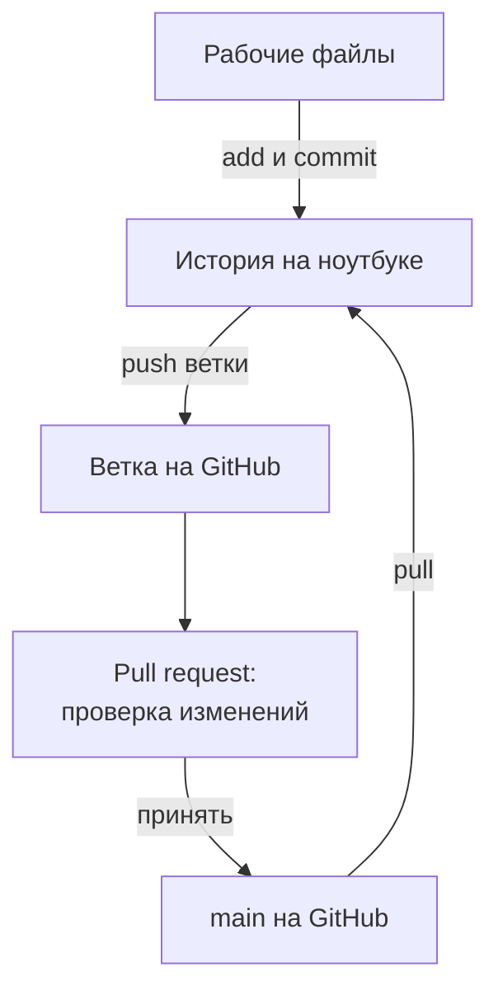
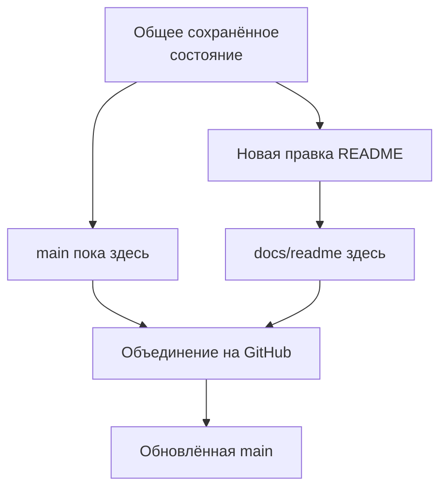
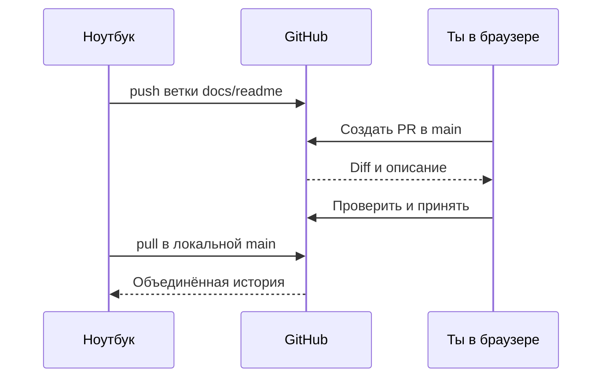

## Зачем это нужно

История тестов на ноутбуке уже помогает найти вчерашнюю версию, но коллега её не видит. Если ноутбук потеряется, единственная копия истории потеряется вместе с ним. **GitHub** это сайт, где можно хранить репозитории Git, читать файлы в браузере и обсуждать изменения перед включением в общую работу. **Удалённый репозиторий** (remote repository) это другая копия истории, доступная по сети, в нашем случае на GitHub.

Для портфолио мало написать «умею тестировать API». Убедительнее дать ссылку на проект с понятной инструкцией, историей изменений и собственными выводами. Пока у тебя есть паспорт машины и памятка, дальше здесь появятся сценарии и отчёты. **README**, памятка о проекте из [урока 3.1](01-git-basics.md), станет первой страницей, которую увидит читатель.

**Ветка** (branch) это именованная линия работы: можно развивать изменение отдельно от основной версии. **Pull request**, сокращённо **PR**, это предложение включить изменения одной ветки в другую с обсуждением и проверкой. В PR видно, что предлагается изменить и зачем, и можно обсудить это до объединения.

Шаг проекта: создаёшь свой аккаунт и репозиторий `perf-lab`, настраиваешь доступ, отправляешь историю урока 3.1, затем дополняешь README через отдельную ветку и PR в собственном репозитории. После принятия изменения получаешь его обратно на компьютер. Материалы курса в `~/load-tester` остаются отдельным проектом.

## Что нужно знать

Выполни [урок 3.1](01-git-basics.md): в `~/perf-lab` должны быть `.git`, `.gitignore`, `README.md`, `machine.md` и два коммита в ветке `main`. Ты уже умеешь пользоваться status, add, commit, log и diff. Если README остался испорчен после задания, сначала восстанови его по разбору 3.1.

Нужны терминал и пути из [1.1](../01-linux/01-workstation-terminal.md), сеть из [1.4](../01-linux/04-network-cli.md), интернет, браузер и почтовый ящик (на него придёт письмо подтверждения GitHub). Стенд запускать не требуется.

## Картина целиком

Ты уже ведёшь историю на ноутбуке. Теперь её копию нужно положить на сайт, а новые правки сначала показывать там отдельно и принимать в основную версию после проверки.

Git на твоей машине хранит историю. GitHub хранит вторую копию и страницу обсуждения. **Push** отправляет коммиты в удалённый репозиторий. **Pull** получает изменения и включает их в текущую локальную ветку. Обе команды работают только с коммитами: подготовка и коммит из 3.1 остаются нужными.



Смотри на обратный путь: принятие PR на сайте не меняет файлы на ноутбуке, их нужно получить командой `pull`. GitHub хранит всю историю, а не только сегодняшнюю версию.

## Теория

### Git и GitHub: программа и сайт

**Зачем это существует.** Git даёт историю на отдельном компьютере, а совместной работе нужно общее место. Без него пришлось бы пересылать папки в сообщениях и отдельно объяснять, какая версия главная. GitHub связывает историю с доступом, обсуждениями и страницей проекта, но локальные команды Git остаются теми же.

**Как устроено.** У каждого репозитория GitHub есть владелец и имя. Адрес `github.com/твой-логин/perf-lab` означает репозиторий `perf-lab` в твоём аккаунте. **Логин** (username) это уникальное имя аккаунта для адресов и входа. Это не имя автора `user.name`: подпись коммита может быть другой.

Репозиторий можно сделать **публичным** (public), доступным для чтения всем, или **приватным** (private), доступным владельцу и приглашённым людям. Для портфолио удобен публичный вариант, если в истории только то, что ты готов показать. Читать смогут все, а менять твой `main` только ты.

**Разобранный пример.** На странице ты видишь README, список файлов, кнопку выбора ветки и коммиты. Отправка нового коммита обновляет страницу. Если отредактировать файл только на ноутбуке, сайт ничего не узнает: копии сами не синхронизируются, обмен запускаешь ты.

**Что путают.** Регистрация на GitHub не создаёт историю: она у тебя уже есть после 3.1. Мы создаём пустое место для её второй копии. Поэтому не просим сайт создать свой README: у него будет отдельный первый коммит, и две истории придётся склеивать.

> **Проверь понимание:** пропал интернет. Какие действия доступны: редактировать, add, commit, push, читать локальный log?

<details markdown="1">
<summary>Ответ</summary>

Редактирование, add, commit и локальный log доступны. Push требует соединения с удалённым репозиторием. Можно продолжить работу и отправить готовые коммиты позже.

</details>

### Почта автора и видимость истории

В 3.1 ты подписал коммиты учебным адресом. Для публичного репозитория лучше подставить скрытый адрес GitHub: в настройках аккаунта, `Settings` → `Emails`, включи `Keep my email addresses private`. GitHub покажет адрес вида `...@users.noreply.github.com`: скопируй его целиком, не собирай по памяти. Затем `git config user.email` с этим адресом задаст его для новых коммитов (команда знакома из 3.1).

Смена config не переписывает автора старых коммитов: два коммита из 3.1 останутся с учебной почтой. Для учебного репозитория это безвредно, учебный адрес не раскрывает ничего личного. Полный `git log -2` покажет поле `Author` (`-2` ограничивает вывод двумя записями). Если старая подпись тебя не устраивает, сделай репозиторий приватным, а историю не переписывай.

### SSH: доказать, что подключается твой компьютер

**Зачем это существует.** Сайт должен отличить тебя от постороннего, который тоже знает адрес репозитория. Пароль от браузера не нужно писать в команду Git. Для этого настроим **SSH** (Secure Shell), защищённый способ сетевого подключения, который умеет подтверждать доступ с помощью пары ключей.

**SSH-ключ** состоит из двух связанных частей. **Закрытый ключ** (private key) хранится только на твоём компьютере и доказывает владение парой. **Открытый ключ** (public key) можно передать GitHub: он позволяет проверить доказательство, но не создать его вместо тебя. Это как замок и единственный ключ от него, с одной разницей: замок (открытый ключ) можно спокойно раздавать.

**Как устроено.** Ты создаёшь пару на своей Ubuntu, добавляешь открытую часть к аккаунту, затем SSH использует закрытую часть при подключении. GitHub сопоставляет её с аккаунтом и проверяет, разрешено ли ему записывать в выбранный репозиторий. Закрытый ключ нельзя копировать в `perf-lab` или вставлять на сайт: он живёт в `~/.ssh`.

**Разобранный пример.** `~/.ssh/id_ed25519` это закрытая часть, `~/.ssh/id_ed25519.pub` открытая. Суффикс `.pub` помогает их различать. **Ed25519** это современный тип ключа, мы выбираем его командой `ssh-keygen -t ed25519`. Его устройство знать не нужно. Комментарий с почтой в открытом ключе нужен только для узнавания, доступа он не даёт.

**Парольная фраза** (passphrase) шифрует закрытый ключ на диске. Она отличается от пароля аккаунта GitHub. Если кто-то скопирует файл, ему понадобится ещё и эта фраза. **SSH-agent** это программа, которая держит разблокированный ключ в памяти сессии, чтобы не вводить фразу при каждой отправке. После перезапуска может понадобиться добавить ключ в агент заново.

**Что путают.** Настройка `git config user.email` подписывает коммит, но не разрешает push. Добавление ключа разрешает подключение, но не меняет автора старых коммитов. Если используют несколько аккаунтов, проверять нужно оба результата: выбранную подпись и то, какой аккаунт приветствует SSH.

> **Проверь понимание:** какой из двух файлов можно вставить в настройки GitHub? Куда нельзя складывать второй?

<details markdown="1">
<summary>Ответ</summary>

На сайт добавляют содержимое `.pub`. Файл без `.pub` закрытый: не кладут в репозиторий, не публикуют в сообщениях и не передают другим людям. Он остаётся в `~/.ssh` на этой машине.

</details>

### Агент и текущая оболочка

Чтобы не вводить фразу на каждом push, запусти агент. `ssh-agent -s` печатает команды настройки окружения для Bash и запускает программу в фоне. `$(...)` подставляет напечатанный текст, `eval` выполняет его в текущей оболочке. `eval` опасен для чужих строк, но здесь выполняется вывод твоей же программы.

`ssh-add` добавляет закрытый ключ в память агента и просит фразу, которую ты только что придумал. Он не отправляет этот файл на сайт.

### Проверка сервера: почему возникает вопрос о доверии

SSH проверяет не только тебя. Компьютеру тоже нужно убедиться, что он подключился к ожидаемому серверу. Иначе посторонний узел мог бы притвориться GitHub. При первой встрече у SSH ещё нет сохранённого ключа этого сервера, поэтому он показывает **отпечаток** (fingerprint), короткий идентификатор серверного ключа, и спрашивает разрешение запомнить его.

Отпечаток сервера отличается от отпечатка твоего пользовательского ключа. Первый проверяет, куда ты пришёл, второй относится к тому, кто пришёл. Сравнивать серверный отпечаток нужно с официальной страницей GitHub, открытой в браузере. После подтверждения SSH записывает сервер в `~/.ssh/known_hosts`, список уже известных узлов. Следующее подключение обычно не задаёт тот же вопрос.

**Разобранный пример.** Успешная проверка пишет `Hi ...!` с твоим логином и сообщает, что интерактивная оболочка не предоставляется. Это нормально: GitHub разрешает операции с Git, но не выдаёт терминал своего сервера. Команда проверки может вернуть код завершения `1`, хотя вход подтверждён. Смотри на приветствие и имя аккаунта, как описано в [документации проверки SSH](https://docs.github.com/en/authentication/connecting-to-github-with-ssh/testing-your-ssh-connection).

Если после прежних успешных подключений появляется `REMOTE HOST IDENTIFICATION HAS CHANGED`, не удаляй запись вслепую. Причина может быть в изменении сервера или в подключении не туда. Сначала сверь отпечаток с официальными сведениями. Эта ошибка про доверие к серверу, а `Permission denied (publickey)` про твой ключ: стадии разные.

> **Проверь понимание:** SSH спросил про неизвестный сервер. Почему нельзя автоматически ответить yes?

<details markdown="1">
<summary>Ответ</summary>

До сверки неизвестно, соответствует ли ключ ожидаемому GitHub. Нужно сравнить показанный отпечаток с официальным. Подтверждение сохранит доверие к этому серверному ключу для дальнейших подключений.

</details>

### Remote: адрес второй копии, а не ещё одна папка

**Зачем это существует.** Git нужно знать, с каким репозиторием обмениваться. **Remote** это сохранённое имя и адрес удалённого репозитория в локальных настройках. Обычно первую такую запись называют `origin`. Это просто удобное соглашение, а не «главный» сервер.

**Как устроено.** Мы добавим `origin` с адресом `git@github.com:твой-логин/perf-lab.git`. Здесь `git` имя служебного пользователя SSH на GitHub, одинаковое для разных аккаунтов. `github.com` сервер, часть после двоеточия путь к репозиторию. GitHub узнает твой аккаунт по ключу, а не по замене `git` на твой логин перед `@`.

**Разобранный пример.** `git remote -v` показывает адрес дважды: для получения `(fetch)` и отправки `(push)`. **Fetch** означает получение сведений и коммитов из удалённой истории без включения их в рабочую ветку. Когда оба адреса совпадают, проект получает и отправляет данные в одно место. Если адрес с `https://`, это другой способ подключения: SSH-ключ не используется для него автоматически.

Добавить remote ещё не значит отправить историю. Команда записывает адрес локально и обычно молчит. Даже неверный адрес может записаться успешно: проверка наличия проекта произойдёт при сетевой операции. Поэтому мы отдельно проверяем адрес, вход по SSH и первый push.

**Что путают.** `origin` это не каталог на диске. Клонирование создаёт новую локальную копию проекта, а `remote add` привязывает адрес к уже существующему. У тебя история уже есть, поэтому клонировать пустой репозиторий не нужно.

> **Проверь понимание:** remote успешно добавлен. Доказывает ли это, что репозиторий на сайте существует и все файлы уже отправлены?

<details markdown="1">
<summary>Ответ</summary>

Нет. Записан только адрес. Существование проекта, права и доступность проверяются при обмене, а файлы появляются на сайте после успешного push сохранённых коммитов.

</details>

### Push и pull: два направления синхронизации

**Зачем это существует.** У ноутбука и GitHub отдельные истории. Каждая сторона может знать о коммитах, которых ещё нет у другой. Push отправляет локальные коммиты и обновляет выбранную удалённую ветку. Pull получает удалённые изменения, затем включает их в текущую локальную ветку.

**Как устроено.** При первом `push -u origin main` параметр `-u` связывает локальную `main` с `origin/main`. Эту связь называют **upstream**, выбранной удалённой веткой для обычной синхронизации. После настройки обычно достаточно `git push` без повторения адреса. `origin/main` на твоём компьютере это локальная отметка последнего известного состояния удалённой main, а не запрос к сайту каждую секунду.

Поэтому status может говорить «всё актуально», пока на сайте уже появился новый коммит: если ты ещё не обменивался, локальная отметка старая. Для получения актуального состояния нужна сетевая операция. Чистое рабочее дерево и отсутствие неотправленных коммитов тоже разные признаки. Можно сделать commit, получить чистые файлы и всё ещё иметь историю «впереди origin/main».

**Разобранный пример.** В учебной истории два коммита. До первого push GitHub не знает ни одного. После push обе копии знают эти два. Затем ты создаёшь третий коммит локально: сайт пока знает два. После второй отправки обе стороны знают три. Это схема обмена, а не замер скорости сети:

<div class="viz" data-viz="chart" data-type="line" data-title="Когда коммиты видны на сайте" data-x="До push,Первый push,Новый commit,Второй push" data-series='[{"name":"На ноутбуке","values":[2,2,3,3],"unit":"коммита"},{"name":"На GitHub","values":[0,2,2,3],"unit":"коммита"}]' data-x-label="Учебный шаг" data-y-label="Записей истории" data-explain="Учебный пример: новый коммит сначала существует только на ноутбуке. После успешного push GitHub получает его." ></div>

Наведи указатель на третий шаг: там две линии расходятся. Это момент, когда текст уже сохранён в Git, но читатель сайта всё ещё видит предыдущую версию. Легенда позволяет посмотреть каждую копию отдельно.

Получать будем командой `git pull --ff-only`. **Fast-forward** значит, что локальную ветку можно передвинуть вперёд по уже существующей цепочке коммитов. `--ff-only` разрешает только такой вариант и останавливается, если истории разошлись: Git не склеит их за тебя без спроса. Режим описан в [документации git pull](https://git-scm.com/docs/git-pull/2.43.0).

**Что путают.** Pull не отправляет твои коммиты, push не получает чужие в рабочие файлы, а ни одна команда не публикует незакоммиченный текст. После объединения PR на сайте нужна отдельная операция получения. Если push отклонили, не обходи отказ принудительной отправкой (`--force`): сначала выясни, чего не хватает в твоей истории.

> **Проверь понимание:** после commit status чистый. Достаточно ли этого, чтобы README на GitHub обновился?

<details markdown="1">
<summary>Ответ</summary>

Нет: нужен успешный push нужной ветки. Чистота описывает файлы относительно локального снимка. Состояние сайта проверяй после отправки в браузере.

</details>

### Ветка: отдельная линия без отдельной папки

**Зачем это существует.** В основной версии хочется видеть законченную работу, а новое описание или сценарий сначала проверить отдельно. Ветка позволяет копить черновые коммиты, не двигая `main`, и не нужно копировать проект в `perf-lab-draft`.

**Как устроено.** Ветка это имя, указывающее на коммит. Новая ветка сначала указывает туда же, куда текущая. Затем новые коммиты двигают только выбранную ветку. При переключении Git меняет отслеживаемые файлы в рабочей папке согласно выбранной версии. Путь `~/perf-lab` остаётся прежним. HEAD из 3.1 показывает, какая ветка сейчас выбрана.



Это схема линий работы, а не вывод log. Пока изменение не принято, `main` остаётся прежней, а после объединения обе линии связаны общей историей.

**Разобранный пример.** `git switch -c docs/readme` создаёт ветку и переключается на неё; `-c` означает create, «создать». `docs/readme` это обычное имя задачи, слэш папку не создаёт. Добавленный там коммит README не изменит main. Когда переключишься на main, новый раздел исчезнет из рабочего файла, но останется в коммите другой ветки.

**Что путают.** Ветка не изолирует незакоммиченный текст как отдельный контейнер. Правки могут перейти с тобой на другую ветку, если переключение допустимо, либо Git остановится, защищая их от перезаписи. Поэтому в практике переключаемся с чистым состоянием, а законченную правку сначала сохраняем.

> **Проверь понимание:** после switch на main новый раздел пропал. Как отличить потерю работы от нормального переключения?

<details markdown="1">
<summary>Ответ</summary>

Проверь текущую ветку, log и вернись на ветку, где создан коммит. Если работа закоммичена в `docs/readme`, её снимок там сохранился. Main пока содержит прежний README.

</details>

### Pull request: предложение, проверка, объединение

**Зачем это существует.** Отправленная ветка ничего не объясняет. PR собирает описание задачи, список коммитов, diff и обсуждение в одном месте. **Ревью** (review) это проверка предложенной правки человеком: что изменилось, правильно ли и можно ли это понять.

**Как устроено.** В PR выбирают **base**, целевую ветку, куда включают изменение, и **compare**, исходную ветку с предложенными коммитами. У нас base `main`, compare `docs/readme`, обе в собственном репозитории. Отправка ветки только делает сравнение доступным; PR создаётся отдельно в браузере. Его открытие тоже не меняет main.

После проверки владелец выполняет **merge**, объединение истории веток. В практике выберем на GitHub вариант создания merge-коммита: отдельной записи с двумя родителями, связывающей main и ветку предложения. Так твой коммит сохранится как отдельный этап. У кнопки есть и другие варианты, но здесь их не выбирай, чтобы история совпала с примерами.



PR создаётся и принимается в браузере, ноутбук обновляется последним. Ты можешь быть и автором, и владельцем: учебный PR в своём проекте тренирует рабочий процесс без чужого разрешения.

**Разобранный пример.** В названии «Описать текущее состояние портфолио» понятно действие. В описании «Добавлены достигнутый результат и план; проверил diff и отображение README; меняется только документация» понятны причина и проверка. После merge PR получает статус `Merged`, «объединён»; `Closed`, «закрыт» без merge значит, что правка не принята.

**Что путают.** PR это не `pull`: он ничего не скачивает и не отправляет сам. Ревью это чтение изменений человеком, тесты оно само не запускает (автоматические проверки появятся в теме 12). Пока для README проверяем текст, ссылки и отображение и не пишем, что прогнали ещё не написанные тесты.

> **Проверь понимание:** ветка отправлена, PR открыт. Где должен появиться новый раздел README до merge?

<details markdown="1">
<summary>Ответ</summary>

В ветке `docs/readme`, в diff PR и в твоём рабочем файле при выборе этой ветки. В main на сайте и на ноутбуке пока прежний текст. Main изменится после merge, локальная main после получения.

</details>

### README как вход в портфолио

Хороший README за минуту объясняет цель проекта, куда смотреть за результатом и как повторить работу. Он ведёт к файлам, а не заменяет их: список названий инструментов без твоих файлов ничего не доказывает.

Сейчас результат небольшой: подготовлено рабочее место и настроена история. Так и напиши, а планы помечай как планы. По ходу курса добавляй ссылки на созданные файлы, команды запуска и выводы. Не обещай тесты, которых нет, и не копируй в README весь курс: детали живут в папках тем.

Условия измерений указываются в `machine.md`, выводы в `reports`, сырые CSV остаются локально по правилам 3.1. Так позже можно показывать компактный результат без огромных выгрузок. Если отчёт ссылается на ещё не опубликованный файл, исправь ссылку или явно укажи, где получить данные. Портфолио должно открываться у человека, у которого нет твоего домашнего каталога.

### Порядок проверок: от локального к сетевому

Если что-то не работает, иди по уровням: версия SSH и файлы ключей (`ssh -V`, `ls -la ~/.ssh`, без сети), потом вход (`ssh -T git@github.com`, нужна сеть), потом адрес (`git remote -v`, он ничего не проверяет по сети), и только успешный `git push` доказывает, что история дошла по этому адресу. Так ты найдёшь, на каком уровне ломается, и не будешь переделывать то, что работает. Сами команды разобраны в практике.

### Привычка для следующих тем

Начинай новую задачу с чистой main и её обновления. Создай отдельную ветку с понятным именем, работай там, сохрани проверенные файлы и отправь ветку. После PR получи новую main. В уже связанную ветку дальше достаточно `git push`.

<div class="viz" data-viz="flow" data-title="Рабочий цикл после темы 3" data-steps='[{"title":"Обнови основную версию","text":"Чистая `main`, затем `git pull --ff-only`."},{"title":"Создай ветку задачи","text":"`git switch -c` с новым именем от обновлённой main."},{"title":"Проверь и сохрани","text":"Практика, diff, add, diff --staged и commit."},{"title":"Отправь предложение","text":"Первый push с `-u`, затем PR в своём репозитории."},{"title":"Прими и получи результат","text":"Проверь PR, объедини, переключись на main и выполни pull."}]'></div>

Обновление в начале цикла даёт свежую основу, а в конце приносит принятое изменение. Коммит и push будут завершать практику следующих уроков в твоём perf-lab.

## Практика

Все команды Git выполняй в `~/perf-lab`. Ключи создавай в Ubuntu, где лежит проект (на Mac это ВМ Multipass), даже если браузер открыт в Windows или macOS: ключ из другой системы этой Ubuntu недоступен. Сайт GitHub открывай в браузере на своём компьютере, команды выполняй в терминале Ubuntu. В примерах `YOUR-LOGIN` означает твой логин: замени его в адресах до запуска. Угловые скобки вокруг него не нужны.

### 1. Создай аккаунт и выбери почту автора

Открой `https://github.com` в браузере, выбери регистрацию `Sign up`, укажи почту, пароль и свободный логин, выполни предложенные проверки и подтверди почту по письму. Если аккаунт уже есть, войди в него. Проверь логин в меню профиля: адрес проекта будет содержать его, а не отображаемое имя.

Включи в аккаунте скрытие почты (теория выше) и скопируй адрес `noreply`. Подставь его ниже: настройка действует только в perf-lab и заменяет учебный адрес из 3.1 для новых коммитов:

```bash
cd ~/perf-lab
git config user.email "АДРЕС-ИЗ-НАСТРОЕК-GITHUB"
git config --get user.email
git status
git log --oneline -5
```

**Как читать вывод:** первая команда config молчит, `--get` печатает выбранную почту, status показывает `main`, log оба коммита 3.1. Замени текст-заглушку в команде своим адресом до запуска.

Автора двух старых коммитов проверь через `git log -2`: там останется учебный адрес, это нормально.

**Типичные ошибки:** отсутствие письма может быть связано с папкой спама или опечаткой адреса. Подтверди почту до продолжения. Не вводи пароль аккаунта в user.email: это поле подписи, не поле входа.

### 2. Проверь SSH и создай пару ключей

Проверь версию SSH и существующие ключи командами из теории:

```bash
ssh -V
ls -la ~/.ssh
```

Пример строки версии:

```text
OpenSSH_9.6p1 Ubuntu-3ubuntu13, OpenSSL 3.0.13 30 Jan 2024
```

**Как читать вывод:** важно, что OpenSSH есть, версия у тебя может быть другой. Если `.ssh` ещё нет, сообщение `No such file or directory` ожидаемо: каталог появится при создании ключа. Если уже есть `id_ed25519` и `.pub`, не перезаписывай их: можно использовать существующую пару, если это твой ключ и ты знаешь его фразу.

Если `ssh: command not found`, нужен пакет Ubuntu `openssh-client`. Установи его так же, как в 1.1: `sudo apt install openssh-client`, и повтори проверку.

Создай новую пару через ssh-keygen, подставив выбранную почту в комментарий:

```bash
ssh-keygen -t ed25519 -C "student@example.com"
```

Пример начала диалога:

```text
Generating public/private ed25519 key pair.
Enter file in which to save the key (/home/student/.ssh/id_ed25519):
Enter passphrase (empty for no passphrase):
Enter same passphrase again:
```

**Как читать вывод:** на вопрос о пути нажми Enter только если такого ключа ещё нет. Далее придумай парольную фразу и повтори её; символы при вводе не показываются. В конце программа напишет пути двух файлов, отпечаток твоего ключа и рисунок `randomart`, визуальное представление отпечатка. Рисунок вводить никуда не нужно.

На `Overwrite (y/n)?` ответь `n`: не перезаписывай существующий ключ. При другом имени заменяй `id_ed25519` во всех следующих командах. См. [инструкцию создания ключа](https://docs.github.com/en/authentication/connecting-to-github-with-ssh/generating-a-new-ssh-key-and-adding-it-to-the-ssh-agent).

### 3. Разблокируй ключ для сессии и добавь открытую часть на сайт

Запусти описанный в теории SSH-agent через eval и добавь ключ командой ssh-add:

```bash
eval "$(ssh-agent -s)"
ssh-add ~/.ssh/id_ed25519
```

При запросе введи фразу своего ключа.

```text
Agent pid 1842
Enter passphrase for /home/student/.ssh/id_ed25519:
Identity added: /home/student/.ssh/id_ed25519 (student@example.com)
```

**Как читать вывод:** `pid` это номер работающей программы, у тебя он другой. `Identity added` подтверждает, что ключ доступен агенту в этой сессии. Если агент уже настроен окружением и ssh-add работает, отдельный запуск не нужен. После открытия нового терминала проверь `ssh-add -l`: `-l` перечисляет отпечатки загруженных ключей.

Теперь `cat` покажет только открытую часть:

```bash
cat ~/.ssh/id_ed25519.pub
```

Вывод начинается с `ssh-ed25519`, затем идёт длинная строка ключа и комментарий с почтой. Скопируй всю одну строку, без приглашения терминала. На GitHub открой профиль → `Settings` → `SSH and GPG keys` → `New SSH key`. Название `Title` сделай понятным, например «Учебная Ubuntu». Тип ключа `Authentication Key`, в `Key` вставь строку `.pub` и нажми `Add SSH key`. Подтверди вход, если сайт попросит. Шаги описаны в [инструкции добавления ключа](https://docs.github.com/en/authentication/connecting-to-github-with-ssh/adding-a-new-ssh-key-to-your-github-account).

**Типичные ошибки:** `Could not open a connection to your authentication agent` означает, что текущая оболочка не знает агент: выполни запуск через eval в этом же терминале. `Bad passphrase, try again` означает неправильную фразу ключа, а не пароль GitHub. `Key is invalid` на сайте часто означает неполное копирование строки или вставку закрытого ключа: проверь суффикс `.pub`.

### 4. Проверь сервер и свой аккаунт

Проверь доступ через ssh -T, как разобрано в теории:

```bash
ssh -T git@github.com
```

При первом подключении появляется вопрос. Ниже начало типичного сообщения без зависящего от сети IP-адреса:

```text
The authenticity of host 'github.com (...)' can't be established.
ED25519 key fingerprint is SHA256:+DiY3wvvV6TuJJhbpZisF/zLDA0zPMSvHdkr4UvCOqU.
Are you sure you want to continue connecting (yes/no/[fingerprint])?
```

**Как читать вывод:** сервер пока неизвестен этой Ubuntu. Сравни показанный отпечаток с актуальной [официальной страницей серверных SSH-ключей GitHub](https://docs.github.com/en/authentication/keeping-your-account-and-data-secure/githubs-ssh-key-fingerprints). Если предложен другой тип ключа, сравни строку именно для него. Только при совпадении введи `yes` и Enter.

После этого возможны сообщение о добавлении в known_hosts и просьба о фразе, если ключ не в агенте. Признак успешного входа:

```text
Hi YOUR-LOGIN! You've successfully authenticated, but GitHub does not provide shell access.
```

**Как читать вывод:** на месте `YOUR-LOGIN` должен быть твой аккаунт. Отсутствие shell access означает отсутствие обычного терминала сервера, а не запрет на Git. Не запускай эту проверку в цепочке с `&&`, ожидая нулевого кода: успешная проверка GitHub возвращает `1`.

**Типичные ошибки:** `Permission denied (publickey)` означает, что сервер не принял предложенный ключ. Проверь `ssh-add -l`, наличие `.pub` в настройках нужного аккаунта и имя файла при ssh-add. `Could not resolve hostname github.com` относится к поиску адреса сервера: проверь интернет и имя. `Connection timed out` может означать сетевую блокировку подключения, переустановка Git не исправит её.

### 5. Создай пустой perf-lab и свяжи его с локальным проектом

В GitHub выбери создание репозитория `New repository`. В поле `Owner` должен быть твой аккаунт, в `Repository name` введи `perf-lab`. Описание: «Учебные сценарии и отчёты по нагрузочному тестированию». Выбери public для открытого портфолио или private, если не готов публиковать имеющуюся историю.

Не включай создание README, `.gitignore` и лицензии на сайте: первые два уже есть локально, а независимый начальный коммит нам не нужен. Нажми `Create repository`. На странице пустого проекта выбери SSH и скопируй адрес. Он должен оканчиваться на `YOUR-LOGIN/perf-lab.git`.

Вернись в терминал и запиши адрес через remote add, затем проверь remote -v:

```bash
cd ~/perf-lab
git remote add origin git@github.com:YOUR-LOGIN/perf-lab.git
git remote -v
```

```text
origin  git@github.com:YOUR-LOGIN/perf-lab.git (fetch)
origin  git@github.com:YOUR-LOGIN/perf-lab.git (push)
```

**Как читать вывод:** адрес должен содержать твой реальный логин. Пометки fetch и push обозначают направления обмена. Команда add молчит, а remote -v пока не проверяет существование репозитория по сети.

**Типичные ошибки:** `error: remote origin already exists.` означает повторную настройку. Прочитай remote -v. Если адрес правильный, ничего не меняй. Если ошибочный, `git remote set-url origin правильный-SSH-адрес` заменит его; `set-url` меняет адрес существующей записи. Не добавляй второй remote с другим именем ради обхода опечатки.

### 6. Отправь историю и проверь витрину

Проверь status и log, затем впервые отправь main с настройкой upstream:

```bash
git status
git log --oneline -5
git push -u origin main
```

Пример заключительных строк успешной отправки:

```text
To github.com:YOUR-LOGIN/perf-lab.git
 * [new branch]      main -> main
branch 'main' set up to track 'origin/main'.
```

**Как читать вывод:** перед этими строками Git обычно печатает подсчёт, упаковку и передачу объектов, их числа зависят от файлов. `new branch` означает первое создание main на сервере. Последняя строка подтверждает upstream. Открой страницу репозитория и проверь файлы, оба коммита, README и отсутствие `.env`, ключей и окружения.

Пустые папки не появятся, как объяснялось в 3.1. Если README другой, проверь ветку и наличие коммита с правкой.

**Типичные ошибки:** `ERROR: Repository not found.` означает неверный адрес, отсутствие проекта или отсутствие прав. Сравни remote -v со страницей проекта и проверь аккаунт SSH. `src refspec main does not match any` означает, что нет такой локальной ветки с коммитом: проверь status и log, закончи 3.1. Отказ `fetch first` при первом push часто означает, что на сайте всё же создан отдельный README; не применяй force. Для этого урока создай новый пустой репозиторий с другим свободным именем, замени адрес через set-url и повтори отправку. Уже созданную историю оставь целой.

### 7. Создай ветку и улучши README

С чистым README проверь текущую ветку и создай docs/readme от main:

```bash
git status
git branch --show-current
git switch -c docs/readme
```

```text
main
Switched to a new branch 'docs/readme'
```

**Как читать вывод:** первая короткая строка относится к branch, вторая к switch. В обычном status перед ними должно быть чистое состояние. Рабочая папка и файлы не изменились: ветки пока указывают на один коммит.

Допиши в существующий README достигнутый результат и честный план. Конструкция `cat >> ... <<'EOF'` уже знакома из 3.1, только `>>` сохраняет прежний текст и дописывает новый. Вложенная Markdown-ссылка здесь относится к файлу проекта, а не к странице курса:

```bash
cat >> README.md <<'EOF'

## Что уже сделано

- Подготовлено рабочее место Ubuntu.
- Условия машины записаны в паспорте машины (`machine.md`).
- Настроены история Git и удалённый репозиторий GitHub.

## План

Добавить собственные сценарии для учебного «Магазина», команды запуска
и отчёты с условиями измерения и выводами. Готовых сценариев пока нет.
EOF
```

Прочитай diff, подготовь только README, проверь снимок и создай коммит, как в 3.1:

```bash
git diff -- README.md
git add README.md
git diff --staged -- README.md
git commit -m "Описать текущее состояние портфолио"
git status
```

Пример начала ответа:

```text
[docs/readme 73d95a2] Описать текущее состояние портфолио
```

**Как читать вывод:** имя `docs/readme` подтверждает, что коммит создан в новой линии, а не в main. Статистика ниже зависит от твоего текста. Status должен показать эту ветку и чистое состояние. Вывод main на сайте пока прежний.

Проверь механизм: `git switch main` вернёт прежний README, `cat README.md` покажет отсутствие новых разделов. Затем `git switch docs/readme` и повторное cat покажут их снова. Это обычное переключение сохранённых состояний, не потеря файла. Закончи этот шаг в `docs/readme`.

**Типичные ошибки:** `fatal: a branch named 'docs/readme' already exists` означает повторный запуск с `-c`: используй `git switch docs/readme`, сначала проверив, что там твоя работа. `Your local changes ... would be overwritten by checkout` означает незакоммиченные правки, которые мешают переключению. Проверь diff и сохрани полезное коммитом в правильной ветке, не выбрасывай его автоматически.

### 8. Отправь ветку и открой PR в своём репозитории

Для новой ветки тоже настраиваем upstream. Эта отправка создаст удалённую `docs/readme`, не меняя удалённую main:

```bash
git push -u origin docs/readme
```

Пример заключения:

```text
To github.com:YOUR-LOGIN/perf-lab.git
 * [new branch]      docs/readme -> docs/readme
branch 'docs/readme' set up to track 'origin/docs/readme'.
```

**Как читать вывод:** новое имя ветки есть на сервере, обычный push из этой ветки теперь знает назначение. GitHub может также напечатать ссылку для создания PR. Если обновить главную страницу проекта, обычно появляется `Compare & pull request`. Если баннера нет, открой `Pull requests` → `New pull request`.

Выбери base `main`, compare `docs/readme`. Проверь владельца обеих сторон: это твой аккаунт, не репозиторий автора курса. Заголовок «Описать текущее состояние портфолио». В описании напиши:

```text
Добавлены выполненные шаги и план развития лаборатории.
Проверил diff: изменён только README, личных реквизитов нет.
После объединения проверю отображение README и ссылку на machine.md.
```

**Как читать вывод:** это текст для читателя PR: что изменилось, что уже проверено и какая проверка предстоит. Он не утверждает, что ты запустил будущие нагрузочные тесты.

Нажми `Create pull request`. Открой вкладку `Files changed`: там должен быть только README и ожидаемые добавления. Во вкладке `Commits` проверь сообщение твоей правки. Направление сравнения и создание предложения соответствуют [инструкции создания PR](https://docs.github.com/en/pull-requests/how-tos/create-pull-requests/creating-a-pull-request).

**Типичные ошибки:** `There isn't anything to compare` появляется, если обе стороны одинаковы или выбран не тот compare. Проверь коммит в локальной ветке, успешный push и имена веток. Не создавай произвольную новую правку, пока не нашёл, на каком шаге потерялось ожидаемое изменение.

### 9. Проверь, объедини и получи main на ноутбук

Как владелец проверь цель PR, точность README и ссылку на паспорт. Опечатку исправь локально в `docs/readme`, повтори add, commit и push. Этот же PR обновится автоматически.

В меню кнопки объединения выбери `Create a merge commit`, затем `Merge pull request` и `Confirm merge`. После этого должно появиться `Merged`. На странице проекта выбери main и проверь новые разделы README. Кнопку удаления ветки пока не нажимай: оставим ветку для чтения учебной истории.

С чистым состоянием выбери main и получи изменения через pull --ff-only:

```bash
git status
git switch main
git pull --ff-only origin main
git status
git log --oneline --graph --all -6
cat README.md
```

После pull прочитай граф истории и README.

Пример части ответа pull:

```text
Updating 41a72b3..b637a84
Fast-forward
 README.md | 11 +++++++++++
 1 file changed, 11 insertions(+)
```

**Как читать вывод:** локальная main передвинулась от старого идентификатора к merge-коммиту; добавления README пришли с сайта. Число строк здесь соответствует приведённому дополнению, при своём тексте оно другое. Перед этим могут выводиться строки получения объектов и обновления `origin/main`. Затем status должен показать актуальность относительно origin/main и чистые файлы.

При одном коммите в ветке и merge-коммите граф выглядит так:

```text
*   b637a84 (HEAD -> main, origin/main) Merge pull request #1 from YOUR-LOGIN/docs/readme
|\
| * 73d95a2 (origin/docs/readme, docs/readme) Описать текущее состояние портфолио
|/
* 41a72b3 Уточнить правило безопасной нагрузки
* 8c24a71 Добавить паспорт машины и структуру лаборатории
```

**Как читать вывод:** верхняя запись соединяет две линии, у неё два родителя. Ниже сохранён твой отдельный коммит README. Main и origin/main теперь рядом с одним идентификатором. Если merge выполнен другим способом или ты сделал дополнительную правку, граф отличается, проверь смысл связей, а не буквальное совпадение.

**Типичные ошибки:** `fatal: Not possible to fast-forward, aborting.` означает, что локальная main получила собственные коммиты и разошлась с удалённой. Операция остановилась, не удаляя их. Не меняй стратегию вслепую: прочитай status и граф, сохрани сведения об обеих линиях и разбери объединение отдельно. В заданной последовательности прямых локальных коммитов в main после отправки не было, поэтому этого отказа быть не должно.

После получения проверь, что выбран main, рабочие файлы чисты и README совпадает с сайтом. Этот цикл станет завершением практики следующих тем.

## Сломай и почини

### Поломка. Сайт ещё не видит только что отредактированный README

Начни с чистой обновлённой main. Создай отдельную учебную ветку, как в практике, но не делай add и commit. Знакомый `printf` допишет строку в README:

```bash
git switch -c docs/git-check
printf '\n%s\n' 'Учебная проверка: эта строка пока только на диске.' >> README.md
git push -u origin docs/git-check
```

Push может успешно создать ветку на сайте, но строка там не появится. **Задача:** найди причину по status, diff и log. Объясни, почему успех сетевой операции не доказывает публикацию рабочего текста. Не создавай PR ради этой ошибки.

<details markdown="1">
<summary>Разбор и исправление</summary>

Проверь состояние:

```bash
git status --short
git diff -- README.md
git log --oneline -3
```

```text
 M README.md
```

**Как читать вывод:** изменение осталось во второй позиции, только на диске. Diff показывает учебную строку, а log не содержит нового коммита. Push передал имеющуюся историю, в которой этой строки нет. Настройка upstream не делает автоматических коммитов.

Если бы строка была полезной, понадобились бы add, проверка staged diff, commit и повторный push, затем PR. Но она нужна только для поломки, поэтому прочитай различие и восстанови только README из индекса, как в 3.1:

```bash
git restore README.md
git status
git switch main
```

**Как читать вывод:** файл снова чист, затем выбран main. Учебная строка исчезла с диска, история не переписана. На GitHub осталась отдельная ветка `docs/git-check` без новых коммитов: она ничего не меняет в main. Владелец может удалить её через страницу `Branches`, если больше не нужна; ветку `main` не удаляй.

</details>

**Типичные ошибки:** повторный push до создания коммита напишет `Everything up-to-date`, «всё уже актуально». Это относится к коммитам, а не к несохранённому тексту. Не пытайся исправить это повторной регистрацией, новым ключом или принудительной отправкой: сначала проверь уровень, на котором находится изменение.

### Самостоятельная диагностика

Для сообщений `Permission denied (publickey)`, `Repository not found` и `Everything up-to-date` назови разные проверки: ключ и аккаунт, адрес и права проекта, наличие коммита. Повторяй только неисправный этап.

## Словарик урока

| Термин | Простыми словами |
|---|---|
| GitHub | Сайт для репозиториев и обсуждения изменений |
| Удалённый репозиторий (remote repository) | Другая копия истории, доступная по сети |
| Логин (username) | Уникальное имя аккаунта в адресах и при входе |
| Public, private | Видимость проекта всем или ограниченному кругу |
| SSH | Защищённый способ подключения и подтверждения доступа |
| Закрытый ключ (private key) | Секретная часть пары, остающаяся на компьютере |
| Открытый ключ (public key) | Часть пары, которую добавляют к аккаунту GitHub |
| Ed25519 | Выбранный тип SSH-ключа |
| Парольная фраза (passphrase) | Защита закрытого ключа на диске |
| SSH-agent | Программа, хранящая разблокированный ключ для сессии |
| Отпечаток (fingerprint) | Короткий идентификатор ключа для проверки |
| Remote, origin | Запись адреса второй копии и её обычное имя |
| Fetch | Получение удалённой истории без включения в рабочую ветку |
| Push | Отправка сохранённых коммитов в удалённую ветку |
| Pull | Получение и включение изменений в текущую локальную ветку |
| Upstream | Удалённая ветка, с которой связана локальная для обмена |
| Fast-forward | Передвижение ветки вперёд по уже существующей истории |
| Ветка (branch) | Имя отдельной линии работы, указывающее на коммит |
| Pull request, PR | Предложение включить изменения ветки с проверкой и обсуждением |
| Base, compare | Целевая и исходная ветки в сравнении PR |
| Ревью (review) | Проверка предложенного изменения человеком |
| Merge | Объединение истории веток |

## Вопросы с собеседований

Раздел для повторения: ответь вслух, потом открой ответ. Вопросы `[на скорость]` отвечай за 30 секунд, остальные с примером из своего perf-lab.

### 1. [junior] [часто] Чем Git отличается от GitHub?

<details markdown="1">
<summary>Ответ</summary>

Git хранит историю и работает локально, в том числе без интернета. GitHub хранит удалённую копию и даёт страницы проекта, PR и обсуждения. Коммит можно сделать без GitHub, а опубликованная ветка появляется после успешного обмена по сети.

**Что хотят услышать:** программа и сайт, локальная история и сетевые действия.

**Красный флаг:** «Git работает только через аккаунт GitHub».

</details>

### 2. [junior] [часто] Чем commit, push и pull различаются?

<details markdown="1">
<summary>Ответ</summary>

Commit сохраняет подготовленный снимок на машине. Push отправляет коммиты в удалённую ветку. Pull получает удалённые изменения и включает их в текущую локальную ветку. Незакоммиченный текст push не передаёт, а pull не публикует мои коммиты.

**Что хотят услышать:** три действия, место сохранения и направление передачи.

**Красный флаг:** «push сохраняет всё из папки».

</details>

### 3. [junior] [часто] Зачем нужен pull request?

<details markdown="1">
<summary>Ответ</summary>

Чтобы предложить изменение одной ветки для другой, объяснить причину и проверить diff до объединения. PR содержит обсуждение и коммиты. Само открытие не изменяет main: после проверки нужен merge. В собственном учебном репозитории автор может быть и владельцем.

**Что хотят услышать:** предложение, проверка, отдельное объединение.

**Красный флаг:** «PR автоматически скачивает файлы на мой ноутбук».

</details>

### 4. [junior] [на скорость] Что такое origin?

<details markdown="1">
<summary>Ответ</summary>

Обычное имя записи remote с адресом удалённого репозитория. Посмотреть адрес можно через `git remote -v`. Добавление записи само по себе ничего не отправляет.

**Что хотят услышать:** имя локальной настройки и команда проверки.

**Красный флаг:** «origin это папка с исходными файлами».

</details>

### 5. [junior] [на скорость] Какой SSH-ключ добавляют в GitHub?

<details markdown="1">
<summary>Ответ</summary>

Открытый, содержимое файла с `.pub`. Закрытый остаётся на машине вне репозитория. GitHub проверяет доказательство владения парой, а не получает секретную часть.

**Что хотят услышать:** различие двух файлов и место хранения закрытого ключа.

**Красный флаг:** отправляет на сайт файл без `.pub`.

</details>

### 6. [junior] [на скорость] Как создать ветку и сразу выбрать её?

<details markdown="1">
<summary>Ответ</summary>

`git switch -c имя-ветки`. Команда создаёт линию от текущего коммита и переключает на неё. Перед действием проверяю чистоту рабочего состояния и правильность исходной ветки.

**Что хотят услышать:** команда, точка старта, проверка состояния.

**Красный флаг:** думает, что ветка создаёт вторую рабочую папку.

</details>

### 7. [junior] [на скорость] После merge на сайте как обновить локальную main?

<details markdown="1">
<summary>Ответ</summary>

С чистым рабочим деревом `git switch main`, затем `git pull --ff-only origin main`. После получения проверю status, log и файлы. Принятие PR не изменяет ноутбук автоматически.

**Что хотят услышать:** нужная ветка, получение и проверка.

**Красный флаг:** повторяет push, ожидая получить изменение с сайта.

</details>

### 8. [junior] Почему GitHub не показывает пустые рабочие папки?

<details markdown="1">
<summary>Ответ</summary>

Git сохраняет файлы и их пути, а не пустые каталоги. README объясняет, как создать results, reports и scripts. Когда появится нужный файл и его коммит отправят, соответствующий каталог появится на сайте.

**Что хотят услышать:** свойство Git, а не ошибка доступа или push.

**Красный флаг:** повторно отправляет ветку в надежде переслать пустую папку.

</details>

### 9. [middle] Status говорит «актуально», но на сайте новый коммит. Почему?

<details markdown="1">
<summary>Ответ</summary>

Status сравнивает локальную ветку с последним известным локальным состоянием origin/main. Без сетевого обмена эта отметка может устареть. Получу удалённую историю, в нашей практике через pull --ff-only, затем проверю снова. Чистое дерево отдельно описывает состояние файлов, а не актуальность сайта.

**Что хотят услышать:** локальная отметка удалённой ветки и необходимость обмена.

**Красный флаг:** «status всегда опрашивает GitHub».

</details>

### 10. [middle] Что делать, если pull --ff-only отказался объединять историю?

<details markdown="1">
<summary>Ответ</summary>

Остановиться и посмотреть status и граф истории: скорее всего, локальная и удалённая ветки имеют разные новые коммиты. Команда сохранила их, остановившись вместо неожиданного объединения. Не применять force и не удалять работу; сначала понять обе линии и выбрать способ объединения отдельно от простого учебного цикла.

**Что хотят услышать:** причина ограничения, диагностика и сохранение данных.

**Красный флаг:** переписывает удалённую историю, не прочитав коммиты.

</details>

## Проверено на версиях

Команды рассчитаны на Ubuntu 24.04/26.04, Bash 5.2+, Git 2.43+ и OpenSSH 9.6+. Сетевой доступ и личный аккаунт ты проверяешь в практике через SSH и собственный push. Названия разделов GitHub сверены с официальной документацией на октябрь 2026; интерфейс сайта может менять расположение кнопок. Идентификаторы, номер PR и служебная статистика будут твоими.

## Итог урока: ты умеешь

- [ ] Создать аккаунт и выбрать видимость собственного perf-lab.
- [ ] Различать подпись автора, доступ по SSH и доверие серверному ключу.
- [ ] Создать пару Ed25519, добавить открытую часть и проверить аккаунт через ssh -T.
- [ ] Настроить origin, отправить main и проверить файлы на сайте.
- [ ] Создать ветку, сохранить правку README и отправить её отдельно от main.
- [ ] Открыть PR в собственном репозитории, проверить diff и принять изменение.
- [ ] Получить объединённую main на ноутбук и прочитать граф истории.
- [ ] Описать реальный результат в README и завершать новую работу коммитом и push.

Дальше: [урок 4.1. Первая программа: интерпретатор, переменные, типы](../04-python/01-first-program.md). Первые программы появятся в твоём perf-lab, а сохранение и публикация станут обычным завершением практики.
