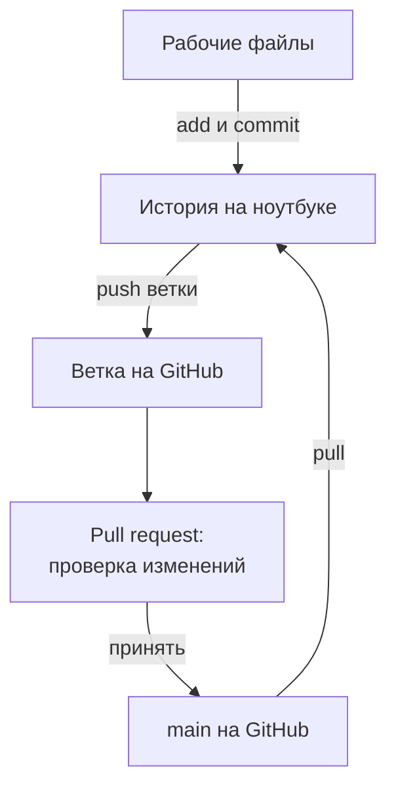
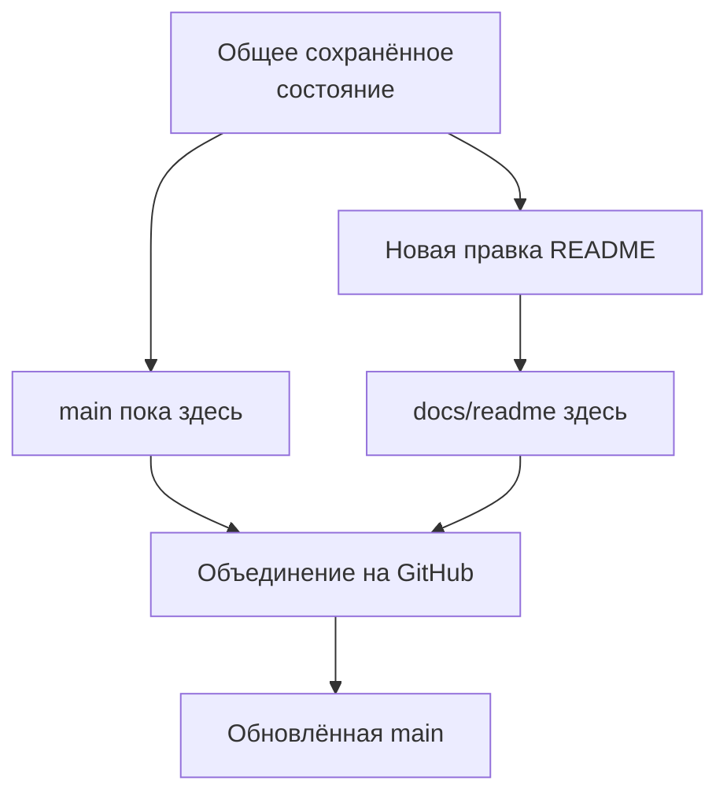
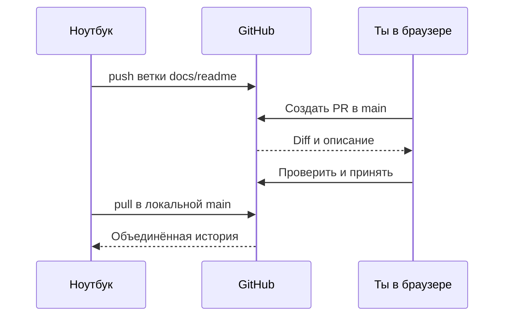

## Зачем это нужно

Я не первый год пишу нагрузочные тесты, и у меня есть правило: тесты не живут на рабочем столе. Однажды я неделю собирал тесты для проверки магазина, а потом пролил чай на ноутбук. История изменений лежала только на нём. Коллеге, которого я просил «глянь мои тесты», показать было нечего. Неделя работы превратилась в пересказ по памяти.

Ты сейчас в такой же точке. История коммитов из [урока 3.1](01-git-basics.md) лежит на одном ноутбуке: коллега её не видит, а при поломке она пропадёт вместе с ним. Поэтому нужна вторая копия на сайте **GitHub**: он хранит репозитории Git в сети, показывает их в браузере и помогает обсуждать правки.

Работодателю мало слов «умею тестировать API». Убедительнее ссылка на твой проект: так выглядит портфолио, подборка твоих работ, которую можно открыть и проверить. Первой страницей там станет README, памятка из 3.1.

Шаг проекта: ты создаёшь аккаунт и репозиторий `perf-lab`, настраиваешь доступ, отправляешь туда историю урока 3.1, дополняешь README и получаешь результат обратно на компьютер. Материалы курса в `~/load-tester` остаются отдельным проектом.

## Что нужно знать

Выполни [урок 3.1](01-git-basics.md): в `~/perf-lab` должны быть `.git`, `.gitignore`, `README.md`, `machine.md` и два коммита в ветке `main`. Ты уже умеешь пользоваться status, add, commit, log и diff. Если README остался испорчен после задания, сначала восстанови его по разбору 3.1.

Нужны терминал и пути из [1.1](../01-linux/01-workstation-terminal.md), сеть из [1.4](../01-linux/04-network-cli.md), интернет, браузер и почтовый ящик (на него придёт письмо подтверждения GitHub). Стенд запускать не требуется.

## Картина целиком

Представь, что ты пишешь статью для журнала. Черновик лежит в твоей тетради: это история на ноутбуке. Чистовую копию ты отвозишь в редакцию: это GitHub. Отвезти копию называется **push** («толкнуть»): команда отправляет коммиты на GitHub. Забрать обратно называется **pull** («потянуть»): команда получает изменения с GitHub и добавляет их в текущую ветку. Обе команды двигают только коммиты, поэтому `add` и `commit` по-прежнему нужны.

Новый кусок статьи редактору не отдают прямо в номер, а кладут отдельной стопкой. Такая стопка в Git называется **веткой** (branch): это имя отдельной линии работы. Номер, который читают все, это основная ветка `main`. Редактор читает стопку и решает, подшивать ли её. Это называется **pull request**, сокращённо **PR** («просьба забрать»): предложение включить изменения одной ветки в другую, с обсуждением.



Смотри на обратный путь: принятие PR на сайте не меняет файлы на ноутбуке. Аналогия тут ломается: редакция сама не привезёт тебе готовый номер, его забираешь ты командой `pull`.

## Теория

### Git и GitHub: программа и сайт

Ты сделал коммит, а коллега его не видит, хотя репозиторий у тебя настоящий. Почему?

Потому что Git живёт на твоём компьютере и ничего не знает о других. Копии сами не синхронизируются. GitHub даёт общее место: вторую копию истории, страницу проекта, права доступа и обсуждения. Эта копия называется **удалённым репозиторием** (remote repository): та же история, но доступная по сети.

Адрес `github.com/твой-логин/perf-lab` читается слева направо: сайт, владелец, репозиторий. **Логин** (username) это имя аккаунта в адресах. Оно не равно `user.name` из 3.1: подпись коммита может быть другой. Репозиторий бывает **публичным** (public), его читают все, и **приватным** (private), его видят владелец и приглашённые. Для портфолио подойдёт публичный, если в истории только то, что не стыдно показать. Менять твой `main` всё равно можешь только ты.

Осторожно: регистрация не создаёт историю, она у тебя уже есть. Если попросить сайт создать свой README, получится второй первый коммит, и две истории придётся склеивать. Поэтому репозиторий заводим пустым.

> **Прикинь сам:** пропал интернет. Что ты ещё можешь: править файл, `add`, `commit`, `push`, смотреть `log`?
{: .predict}

Всё, кроме `push`: ему нужна связь с сайтом. Готовые коммиты отправишь позже.

> **Главное:** Git хранит историю у тебя, GitHub хранит её копию, и обмен идёт только по твоей команде.
{: .key}

Но под чьим именем копия попадёт на сайт? Это решает почта в подписи.

### Какую почту увидят в истории

В публичном репозитории подпись каждого коммита читает любой. Поэтому на сайте открой `Settings` → `Emails` и включи `Keep my email addresses private`. GitHub покажет адрес вида `...@users.noreply.github.com`: скопируй его целиком. Команда `git config user.email` (знакома из 3.1) с этим адресом задаст подпись новых коммитов.

Два старых коммита останутся с прежней почтой: поле `Author` в `git log -2` (число 2 ограничивает вывод двумя записями) это покажет. Посмотри туда до публикации. Если там настоящий адрес, который ты не хочешь показывать, создай репозиторий приватным (`Private`): его увидишь только ты. Историю не переписывай.

> **Главное:** `user.email` лишь подписывает коммиты и никакого доступа не даёт.
{: .key}

Доступ даёт другое: ключ.

### SSH: доказать, что подключается твой компьютер

Адрес репозитория знает любой, кто видел ссылку. Как сайт отличит тебя от постороннего? Пароль аккаунта в командах Git лучше не светить.

Подумай про замок и ключ. Замок висит на двери GitHub, ключ от него только у тебя. Замок не страшно показывать всем. По такой схеме работает **SSH** (Secure Shell): защищённое подключение по сети, которое подтверждает доступ парой ключей. Аналогия ломается в одном: ключ ты не отдаёшь, а лишь показываешь, что он у тебя есть.

**Закрытый ключ** (private key) живёт на твоём компьютере. **Открытый ключ** (public key) ты добавляешь на GitHub: по нему сайт проверяет твой ответ, но подделать его не может. Пару создаёт `ssh-keygen -t ed25519`; **Ed25519** это современный тип ключа, устройство знать не нужно. На диске в `~/.ssh` появятся `id_ed25519` (закрытый) и `id_ed25519.pub` (открытый).

Закрытый ключ на диске защищает **парольная фраза** (passphrase). Это не пароль GitHub, а отдельная фраза, которую придумываешь ты.

> **Прикинь сам:** вместо `id_ed25519.pub` ты вставил на сайт содержимое `id_ed25519`. Что будет?
{: .predict}

Сайт, скорее всего, ответит `Key is invalid`. Но если секрет ещё и ушёл в чат или письмо, считай ключ раскрытым: им теперь может воспользоваться чужой человек. Если ключ уже добавлен на сайт, удали его в `Settings` → `SSH and GPG keys`, иначе он продолжит открывать доступ. Потом создай новую пару.

> **Главное:** на сайт идёт только файл с `.pub`; закрытый ключ остаётся в `~/.ssh`.
{: .key}

Вводить фразу перед каждой отправкой утомительно. Для этого есть помощник.

### Агент: запомнить разблокированный ключ

**SSH-agent** это программа, которая держит разблокированный ключ в памяти, чтобы фразу вводить один раз. Запускают его так: `ssh-agent -s` стартует агент в фоне и печатает команды, которые сообщают терминалу, где агент (настройки окружения: переменные из 1.1). `$(...)` подставляет напечатанный текст (знакомо по 1.5), а `eval` («выполни») запускает его как команды в этом же терминале. Потом `ssh-add` кладёт ключ в память агента и просит фразу. На сайт он ничего не отправляет. Агент работает в фоне и после закрытия окна, но новый терминал о нём не знает, поэтому там команды придётся повторить. Остановить агент можно в том же терминале командой `ssh-agent -k`.

> **Главное:** агент хранит разблокированный ключ в памяти, чтобы не вводить фразу при каждом push.
{: .key}

Ключ готов. Но как ты поймёшь, что подключился к настоящему GitHub?

### Проверка сервера: зачем SSH спрашивает о доверии

SSH проверяет не только тебя, но и сервер, иначе посторонний мог бы притвориться GitHub. При первом подключении SSH не знает ключа этого сервера, поэтому показывает **отпечаток** (fingerprint), короткий идентификатор серверного ключа, и просит разрешения его запомнить.

Сравни отпечаток с официальной страницей GitHub в браузере и только после совпадения ответь `yes`. SSH запишет сервер в `~/.ssh/known_hosts`, список знакомых узлов, и больше не спросит. Не путай этот отпечаток с отпечатком твоего ключа из `ssh-keygen`: первый про то, куда ты пришёл, второй про то, кто пришёл.

Проверяет вход команда `ssh -T git@github.com`. Успех выглядит как `Hi ...!` с твоим логином и пометка, что оболочка не предоставляется. Это нормально: GitHub принимает команды Git, но терминал не выдаёт. Код завершения при этом равен `1`, хотя вход подтверждён. Смотри на приветствие и логин, как в [документации проверки SSH](https://docs.github.com/en/authentication/connecting-to-github-with-ssh/testing-your-ssh-connection).

Осторожно: две ошибки про разное. `REMOTE HOST IDENTIFICATION HAS CHANGED` значит, что сервер выглядит иначе, чем раньше: запись не удаляй вслепую, сначала сверь отпечаток. `Permission denied (publickey)` значит, что сервер не принял твой ключ.

> **Проверь понимание:** SSH спросил про неизвестный сервер. Почему нельзя ответить `yes` не глядя?

<details markdown="1">
<summary>Ответ</summary>

До сверки неизвестно, тот ли это GitHub. Ответ `yes` сохранит доверие к показанному ключу навсегда, в том числе к подделке.

</details>

> **Главное:** SSH проверяет обе стороны: сервер по отпечатку и тебя по ключу.
{: .key}

Обе проверки пройдены. Теперь Git нужно сказать, куда слать историю.

### Remote: адрес второй копии, а не ещё одна папка

Ты создал на сайте пустой репозиторий. Откуда локальный Git узнает, что он твой?

Из записи в настройках: **remote** это сохранённые имя и адрес удалённого репозитория. Первую запись по соглашению называют `origin`: это просто имя. Мы добавим `origin` с адресом `git@github.com:твой-логин/perf-lab.git`. Здесь `git` служебное имя пользователя на GitHub, `github.com` сервер, а после двоеточия путь к репозиторию. Аккаунт GitHub узнаёт по ключу, поэтому свой логин перед `@` не нужен.

`git remote -v` показывает адрес дважды: для получения `(fetch)` и для отправки `(push)`. **Fetch** значит получить коммиты без включения их в рабочую ветку.

Осторожно: `git remote add` молчит и ничего не проверяет, даже опечатку в адресе. Существует ли проект и пустят ли тебя, выяснится только при сетевой операции.

> **Главное:** `origin` это запись об адресе; обмен случается только при `push`, `pull` и `fetch`.
{: .key}

Адрес записан. Теперь отправим историю.

### Push и pull: два направления синхронизации

У ноутбука и GitHub отдельные истории, и каждая может знать о коммитах, которых нет у другой. Возьмём учебный пример. У тебя два коммита, на сайте ноль. После первого `push` обе копии знают два. Ты делаешь третий коммит: у ноутбука три, у сайта по-прежнему два. После второго `push` обе стороны знают три.

<div class="viz" data-viz="chart" data-type="line" data-title="Когда коммиты видны на сайте" data-x="До push,Первый push,Новый commit,Второй push" data-series='[{"name":"На ноутбуке","values":[2,2,3,3],"unit":"коммита"},{"name":"На GitHub","values":[0,2,2,3],"unit":"коммита"}]' data-x-label="Учебный шаг" data-y-label="Записей истории" data-explain="Учебный пример: новый коммит сначала существует только на ноутбуке. После успешного push GitHub получает его." ></div>

На третьем шаге линии расходятся: коммит уже в Git, но читатель сайта видит прежнюю версию.

Первая отправка выглядит как `git push -u origin main`. Ключ `-u` связывает локальную `main` с `origin/main`: эта связь называется **upstream**, и после неё хватает `git push` без адреса. А `origin/main` на твоём компьютере это отметка о том, что было на сайте при последнем обмене. Сама она не обновляется.

> **Прикинь сам:** ты сделал коммит, а `push` ещё нет. Что напишет `git status` и виден ли новый README на сайте?
{: .predict}

Нет. Status напишет `Your branch is ahead of 'origin/main' by 1 commit`: «на один коммит впереди». Нужен `push`, а результат проверяй в браузере. Обратный случай: на сайте появился чужой коммит, а status пишет «актуально». Отметка `origin/main` обновляется только при обмене (`fetch`, `pull`, `push`), поэтому свежего коммита status не видит.

Получать изменения мы будем командой `git pull --ff-only`. **Fast-forward** значит, что ветку можно передвинуть вперёд по готовой цепочке коммитов. Ключ `--ff-only` разрешает только такой вариант и останавливается, если истории разошлись: Git не склеит их без твоего ведома ([документация git pull](https://git-scm.com/docs/git-pull/2.43.0)).

Осторожно: `pull` не отправляет твои коммиты, `push` не приносит чужие, а несохранённый текст не публикует ни та, ни другая. Если `push` отклонили, не обходи отказ ключом `--force`: сначала выясни, чего не хватает в твоей истории.

> **Главное:** `push` отправляет сохранённые коммиты на сайт, `pull` приносит их с сайта.
{: .key}

Теперь научимся отделять новую работу от основной версии.

### Ветка: отдельная линия без отдельной папки

В `main` хочется видеть законченную работу, а новый тест сначала проверить. Копировать проект в `perf-lab-draft` не нужно: для этого есть ветка.

Ветка это имя, указывающее на коммит. Новая ветка сначала смотрит туда же, куда текущая. Потом новые коммиты двигают только её, а `main` остаётся на месте. При переключении Git меняет файлы в папке, путь `~/perf-lab` прежний. Какая ветка выбрана сейчас, показывает `HEAD` из 3.1.



Пока изменение не принято, `main` прежняя.

Команда `git switch -c docs/readme` создаёт ветку и переключается на неё (`-c` от create, «создать»). `docs/readme` обычное имя задачи, слэш папку не создаёт. Вернёшься на `main`: новый раздел исчезнет из файла, но останется в коммите другой ветки.

Осторожно: ветка не прячет несохранённый текст. Правки уйдут с тобой на другую ветку, либо Git остановится, защищая их. Поэтому переключайся с чистым состоянием, а законченную правку сначала сохраняй коммитом.

> **Главное:** ветка это имя на коммите; новые коммиты двигают её одну, а `main` стоит на месте.
{: .key}

Ветку можно отправить на сайт, но сама по себе она читателю ничего не объясняет.

### Pull request: предложение, проверка, объединение

Отправленная ветка молчит: зачем она, что изменено, кто проверил? Pull request собирает в одном месте описание, коммиты, `diff` и обсуждение. Проверка человеком называется **ревью** (review): что изменилось, правильно ли и понятно ли.

В PR выбирают **base**, ветку, куда включают изменение, и **compare**, ветку с предложенными коммитами. У нас base `main`, compare `docs/readme`, обе в твоём репозитории. PR создаётся отдельно в браузере, и открытие `main` не меняет. Меняет её **merge**, объединение веток, которое делает владелец после проверки. В практике выберем вариант с merge-коммитом: записью с двумя родителями, связывающей `main` и ветку. Остальные варианты у кнопки не трогай, чтобы история совпала с примерами.



PR создаётся и принимается в браузере, ноутбук обновляется последним.

После merge у PR статус `Merged`, «объединён». Статус `Closed` без merge значит, что правку не приняли.

> **Прикинь сам:** ветка отправлена, PR открыт, merge не нажат. Где уже есть новый раздел README?
{: .predict}

В ветке `docs/readme` и в `diff` PR. В `main` на сайте и на ноутбуке прежний текст: он изменится после merge, а локальная `main` после `pull`.

Осторожно: PR это не `pull`, он ничего не скачивает. И ревью не запускает тесты: автоматические проверки появятся в теме 12. Пока проверяем текст, ссылки и отображение README.

> **Главное:** PR это предложение с обсуждением; `main` меняет только merge, а ноутбук только `pull`.
{: .key}

С механикой всё. Что увидит человек, которому ты пришлёшь ссылку?

### README как вход в портфолио

Хороший README за минуту отвечает: о чём проект, где результат, как повторить. Сейчас результат небольшой: подготовлено рабочее место и настроена история. Так и напиши, а планы помечай как планы. Не обещай тесты, которых нет. Как измеряли, будет в `machine.md`, выводы в `reports`, сырые CSV остаются локально по правилам 3.1.

> **Главное:** README честно описывает то, что уже есть, и ведёт к файлам проекта.
{: .key}

Осталось собрать всё в порядок.

### Порядок проверок и привычка для следующих тем

Если что-то не работает, иди от локального к сетевому. Сначала версия SSH и файлы ключей: `ssh -V` и `ls -la ~/.ssh`, сеть не нужна. Потом вход: `ssh -T git@github.com`. Потом адрес: `git remote -v`, он по сети ничего не проверяет. И только успешный `git push` доказывает, что история дошла. Так ты найдёшь, где ломается.

Рабочий цикл после этой темы такой.

<div class="viz" data-viz="flow" data-title="Рабочий цикл после темы 3" data-steps='[{"title":"Обнови основную версию","text":"Чистая `main`, затем `git pull --ff-only`."},{"title":"Создай ветку задачи","text":"`git switch -c` с новым именем от обновлённой main."},{"title":"Проверь и сохрани","text":"Практика, diff, add, diff --staged и commit."},{"title":"Отправь предложение","text":"Первый push с `-u`, затем PR в своём репозитории."},{"title":"Прими и получи результат","text":"Проверь PR, объедини, переключись на main и выполни pull."}]'></div>

Обновление в начале даёт свежую основу, а в конце приносит принятое изменение. Вспомни чай на ноутбуке: теперь у тебя вторая копия, и ссылку не стыдно отправить коллеге. Коммит и `push` будут завершать практику следующих уроков в твоём `perf-lab`.

> **Главное:** сначала проверяй локальное, потом сетевое, и повторяй только сломавшийся шаг.
{: .key}

## Практика

Все команды Git выполняй в `~/perf-lab`. Ключи создавай в Ubuntu, где лежит проект (на Mac это ВМ Multipass), даже если браузер открыт в Windows или macOS: ключ из другой системы этой Ubuntu недоступен. Сайт GitHub открывай в браузере на своём компьютере, команды выполняй в терминале Ubuntu. В примерах `YOUR-LOGIN` означает твой логин: замени его в адресах до запуска. Угловые скобки вокруг него не нужны.

### 1. Создай аккаунт и выбери почту автора

Открой `https://github.com` в браузере, выбери регистрацию `Sign up`, укажи почту, пароль и свободный логин, выполни предложенные проверки и подтверди почту по письму. Если аккаунт уже есть, войди в него. Проверь логин в меню профиля: адрес проекта будет содержать его, а не отображаемое имя.

Включи в аккаунте скрытие почты (теория выше) и скопируй адрес `noreply`. Подставь его ниже: настройка действует только в perf-lab и заменяет учебный адрес из 3.1 для новых коммитов:

```bash
cd ~/perf-lab
git config user.email "АДРЕС-ИЗ-НАСТРОЕК-GITHUB"
git config --get user.email
git status
git log --oneline -5
```

**Как читать вывод:** первая команда config молчит, `--get` печатает выбранную почту, status показывает `main`, log оба коммита 3.1. Замени текст-заглушку в команде своим адресом до запуска.

Автора двух старых коммитов проверь через `git log -2`: там останется учебный адрес, это нормально.

**Типичные ошибки:** отсутствие письма может быть связано с папкой спама или опечаткой адреса. Подтверди почту до продолжения. Не вводи пароль аккаунта в user.email: это поле подписи, не поле входа.

### 2. Проверь SSH и создай пару ключей

Проверь версию SSH и существующие ключи командами из теории:

```bash
ssh -V
ls -la ~/.ssh
```

Пример строки версии:

```text
OpenSSH_9.6p1 Ubuntu-3ubuntu13, OpenSSL 3.0.13 30 Jan 2024
```

**Как читать вывод:** важно, что OpenSSH есть, версия у тебя может быть другой. Если `.ssh` ещё нет, сообщение `No such file or directory` ожидаемо: каталог появится при создании ключа. Если уже есть `id_ed25519` и `.pub`, не перезаписывай их: можно использовать существующую пару, если это твой ключ и ты знаешь его фразу.

Если `ssh: command not found`, нужен пакет Ubuntu `openssh-client`. Установи его так же, как в 1.1: `sudo apt install openssh-client`, и повтори проверку.

Создай новую пару через ssh-keygen, подставив выбранную почту в комментарий:

```bash
ssh-keygen -t ed25519 -C "student@example.com"
```

Пример начала диалога:

```text
Generating public/private ed25519 key pair.
Enter file in which to save the key (/home/student/.ssh/id_ed25519):
Enter passphrase (empty for no passphrase):
Enter same passphrase again:
```

**Как читать вывод:** на вопрос о пути нажми Enter только если такого ключа ещё нет. Далее придумай парольную фразу и повтори её; символы при вводе не показываются. В конце программа напишет пути двух файлов, отпечаток твоего ключа и рисунок `randomart`, визуальное представление отпечатка. Рисунок вводить никуда не нужно.

На `Overwrite (y/n)?` ответь `n`: не перезаписывай существующий ключ. При другом имени заменяй `id_ed25519` во всех следующих командах. См. [инструкцию создания ключа](https://docs.github.com/en/authentication/connecting-to-github-with-ssh/generating-a-new-ssh-key-and-adding-it-to-the-ssh-agent).

### 3. Разблокируй ключ для сессии и добавь открытую часть на сайт

Запусти описанный в теории SSH-agent через eval и добавь ключ командой ssh-add:

```bash
eval "$(ssh-agent -s)"
ssh-add ~/.ssh/id_ed25519
```

При запросе введи фразу своего ключа.

```text
Agent pid 1842
Enter passphrase for /home/student/.ssh/id_ed25519:
Identity added: /home/student/.ssh/id_ed25519 (student@example.com)
```

**Как читать вывод:** `pid` это номер работающей программы, у тебя он другой. `Identity added` подтверждает, что ключ доступен агенту в этой сессии. Если агент уже настроен окружением и ssh-add работает, отдельный запуск не нужен. После открытия нового терминала проверь `ssh-add -l`: `-l` перечисляет отпечатки загруженных ключей.

Теперь `cat` покажет только открытую часть:

```bash
cat ~/.ssh/id_ed25519.pub
```

Вывод начинается с `ssh-ed25519`, затем идёт длинная строка ключа и комментарий с почтой. Скопируй всю одну строку, без приглашения терминала. На GitHub открой профиль → `Settings` → `SSH and GPG keys` → `New SSH key`. Название `Title` сделай понятным, например «Учебная Ubuntu». Тип ключа `Authentication Key`, в `Key` вставь строку `.pub` и нажми `Add SSH key`. Подтверди вход, если сайт попросит. Шаги описаны в [инструкции добавления ключа](https://docs.github.com/en/authentication/connecting-to-github-with-ssh/adding-a-new-ssh-key-to-your-github-account).

**Типичные ошибки:** `Could not open a connection to your authentication agent` означает, что текущая оболочка не знает агент: выполни запуск через eval в этом же терминале. `Bad passphrase, try again` означает неправильную фразу ключа, а не пароль GitHub. `Key is invalid` на сайте часто означает неполное копирование строки или вставку закрытого ключа: проверь суффикс `.pub`.

### 4. Проверь сервер и свой аккаунт

Проверь доступ через ssh -T, как разобрано в теории:

```bash
ssh -T git@github.com
```

При первом подключении появляется вопрос. Ниже начало типичного сообщения без зависящего от сети IP-адреса:

```text
The authenticity of host 'github.com (...)' can't be established.
ED25519 key fingerprint is SHA256:+DiY3wvvV6TuJJhbpZisF/zLDA0zPMSvHdkr4UvCOqU.
Are you sure you want to continue connecting (yes/no/[fingerprint])?
```

**Как читать вывод:** сервер пока неизвестен этой Ubuntu. Сравни показанный отпечаток с актуальной [официальной страницей серверных SSH-ключей GitHub](https://docs.github.com/en/authentication/keeping-your-account-and-data-secure/githubs-ssh-key-fingerprints). Если предложен другой тип ключа, сравни строку именно для него. Только при совпадении введи `yes` и Enter.

После этого возможны сообщение о добавлении в known_hosts и просьба о фразе, если ключ не в агенте. Признак успешного входа:

```text
Hi YOUR-LOGIN! You've successfully authenticated, but GitHub does not provide shell access.
```

**Как читать вывод:** на месте `YOUR-LOGIN` должен быть твой аккаунт. Отсутствие shell access означает отсутствие обычного терминала сервера, а не запрет на Git. Не запускай эту проверку в цепочке с `&&`, ожидая нулевого кода: успешная проверка GitHub возвращает `1`.

**Типичные ошибки:** `Permission denied (publickey)` означает, что сервер не принял предложенный ключ. Проверь `ssh-add -l`, наличие `.pub` в настройках нужного аккаунта и имя файла при ssh-add. `Could not resolve hostname github.com` относится к поиску адреса сервера: проверь интернет и имя. `Connection timed out` может означать сетевую блокировку подключения, переустановка Git не исправит её.

### 5. Создай пустой perf-lab и свяжи его с локальным проектом

В GitHub выбери создание репозитория `New repository`. В поле `Owner` должен быть твой аккаунт, в `Repository name` введи `perf-lab`. Описание: «Учебные сценарии и отчёты по нагрузочному тестированию». Выбери public для открытого портфолио или private, если не готов публиковать имеющуюся историю.

Не включай создание README, `.gitignore` и лицензии на сайте: первые два уже есть локально, а независимый начальный коммит нам не нужен. Нажми `Create repository`. На странице пустого проекта выбери SSH и скопируй адрес. Он должен оканчиваться на `YOUR-LOGIN/perf-lab.git`.

Вернись в терминал и запиши адрес через remote add, затем проверь remote -v:

```bash
cd ~/perf-lab
git remote add origin git@github.com:YOUR-LOGIN/perf-lab.git
git remote -v
```

```text
origin  git@github.com:YOUR-LOGIN/perf-lab.git (fetch)
origin  git@github.com:YOUR-LOGIN/perf-lab.git (push)
```

**Как читать вывод:** адрес должен содержать твой реальный логин. Пометки fetch и push обозначают направления обмена. Команда add молчит, а remote -v пока не проверяет существование репозитория по сети.

**Типичные ошибки:** `error: remote origin already exists.` означает повторную настройку. Прочитай remote -v. Если адрес правильный, ничего не меняй. Если ошибочный, `git remote set-url origin правильный-SSH-адрес` заменит его; `set-url` меняет адрес существующей записи. Не добавляй второй remote с другим именем ради обхода опечатки.

### 6. Отправь историю и проверь витрину

Проверь status и log, затем впервые отправь main с настройкой upstream:

```bash
git status
git log --oneline -5
git push -u origin main
```

Пример заключительных строк успешной отправки:

```text
To github.com:YOUR-LOGIN/perf-lab.git
 * [new branch]      main -> main
branch 'main' set up to track 'origin/main'.
```

**Как читать вывод:** перед этими строками Git обычно печатает подсчёт, упаковку и передачу объектов, их числа зависят от файлов. `new branch` означает первое создание main на сервере. Последняя строка подтверждает upstream. Открой страницу репозитория и проверь файлы, оба коммита, README и отсутствие `.env`, ключей и окружения.

Пустые папки не появятся, как объяснялось в 3.1. Если README другой, проверь ветку и наличие коммита с правкой.

**Типичные ошибки:** `ERROR: Repository not found.` означает неверный адрес, отсутствие проекта или отсутствие прав. Сравни remote -v со страницей проекта и проверь аккаунт SSH. `src refspec main does not match any` означает, что нет такой локальной ветки с коммитом: проверь status и log, закончи 3.1. Отказ `fetch first` при первом push часто означает, что на сайте всё же создан отдельный README; не применяй force. Для этого урока создай новый пустой репозиторий с другим свободным именем, замени адрес через set-url и повтори отправку. Уже созданную историю оставь целой.

### 7. Создай ветку и улучши README

С чистым README проверь текущую ветку и создай docs/readme от main:

```bash
git status
git branch --show-current
git switch -c docs/readme
```

```text
main
Switched to a new branch 'docs/readme'
```

**Как читать вывод:** первая короткая строка относится к branch, вторая к switch. В обычном status перед ними должно быть чистое состояние. Рабочая папка и файлы не изменились: ветки пока указывают на один коммит.

Допиши в существующий README достигнутый результат и честный план. Конструкция `cat >> ... <<'EOF'` уже знакома из 3.1, только `>>` сохраняет прежний текст и дописывает новый. Вложенная Markdown-ссылка здесь относится к файлу проекта, а не к странице курса:

```bash
cat >> README.md <<'EOF'

## Что уже сделано

- Подготовлено рабочее место Ubuntu.
- Условия машины записаны в паспорте машины (`machine.md`).
- Настроены история Git и удалённый репозиторий GitHub.

## План

Добавить собственные сценарии для учебного «Магазина», команды запуска
и отчёты с условиями измерения и выводами. Готовых сценариев пока нет.
EOF
```

Прочитай diff, подготовь только README, проверь снимок и создай коммит, как в 3.1:

```bash
git diff -- README.md
git add README.md
git diff --staged -- README.md
git commit -m "Описать текущее состояние портфолио"
git status
```

Пример начала ответа:

```text
[docs/readme 73d95a2] Описать текущее состояние портфолио
```

**Как читать вывод:** имя `docs/readme` подтверждает, что коммит создан в новой линии, а не в main. Статистика ниже зависит от твоего текста. Status должен показать эту ветку и чистое состояние. Вывод main на сайте пока прежний.

Проверь механизм: `git switch main` вернёт прежний README, `cat README.md` покажет отсутствие новых разделов. Затем `git switch docs/readme` и повторное cat покажут их снова. Это обычное переключение сохранённых состояний, не потеря файла. Закончи этот шаг в `docs/readme`.

**Типичные ошибки:** `fatal: a branch named 'docs/readme' already exists` означает повторный запуск с `-c`: используй `git switch docs/readme`, сначала проверив, что там твоя работа. `Your local changes ... would be overwritten by checkout` означает незакоммиченные правки, которые мешают переключению. Проверь diff и сохрани полезное коммитом в правильной ветке, не выбрасывай его автоматически.

### 8. Отправь ветку и открой PR в своём репозитории

Для новой ветки тоже настраиваем upstream. Эта отправка создаст удалённую `docs/readme`, не меняя удалённую main:

```bash
git push -u origin docs/readme
```

Пример заключения:

```text
To github.com:YOUR-LOGIN/perf-lab.git
 * [new branch]      docs/readme -> docs/readme
branch 'docs/readme' set up to track 'origin/docs/readme'.
```

**Как читать вывод:** новое имя ветки есть на сервере, обычный push из этой ветки теперь знает назначение. GitHub может также напечатать ссылку для создания PR. Если обновить главную страницу проекта, обычно появляется `Compare & pull request`. Если баннера нет, открой `Pull requests` → `New pull request`.

Выбери base `main`, compare `docs/readme`. Проверь владельца обеих сторон: это твой аккаунт, не репозиторий автора курса. Заголовок «Описать текущее состояние портфолио». В описании напиши:

```text
Добавлены выполненные шаги и план развития лаборатории.
Проверил diff: изменён только README, личных реквизитов нет.
После объединения проверю отображение README и ссылку на machine.md.
```

**Как читать вывод:** это текст для читателя PR: что изменилось, что уже проверено и какая проверка предстоит. Он не утверждает, что ты запустил будущие нагрузочные тесты.

Нажми `Create pull request`. Открой вкладку `Files changed`: там должен быть только README и ожидаемые добавления. Во вкладке `Commits` проверь сообщение твоей правки. Направление сравнения и создание предложения соответствуют [инструкции создания PR](https://docs.github.com/en/pull-requests/how-tos/create-pull-requests/creating-a-pull-request).

**Типичные ошибки:** `There isn't anything to compare` появляется, если обе стороны одинаковы или выбран не тот compare. Проверь коммит в локальной ветке, успешный push и имена веток. Не создавай произвольную новую правку, пока не нашёл, на каком шаге потерялось ожидаемое изменение.

### 9. Проверь, объедини и получи main на ноутбук

Как владелец проверь цель PR, точность README и ссылку на паспорт. Опечатку исправь локально в `docs/readme`, повтори add, commit и push. Этот же PR обновится автоматически.

В меню кнопки объединения выбери `Create a merge commit`, затем `Merge pull request` и `Confirm merge`. После этого должно появиться `Merged`. На странице проекта выбери main и проверь новые разделы README. Кнопку удаления ветки пока не нажимай: оставим ветку для чтения учебной истории.

С чистым состоянием выбери main и получи изменения через pull --ff-only:

```bash
git status
git switch main
git pull --ff-only origin main
git status
git log --oneline --graph --all -6
cat README.md
```

После pull прочитай граф истории и README.

Пример части ответа pull:

```text
Updating 41a72b3..b637a84
Fast-forward
 README.md | 11 +++++++++++
 1 file changed, 11 insertions(+)
```

**Как читать вывод:** локальная main передвинулась от старого идентификатора к merge-коммиту; добавления README пришли с сайта. Число строк здесь соответствует приведённому дополнению, при своём тексте оно другое. Перед этим могут выводиться строки получения объектов и обновления `origin/main`. Затем status должен показать актуальность относительно origin/main и чистые файлы.

При одном коммите в ветке и merge-коммите граф выглядит так:

```text
*   b637a84 (HEAD -> main, origin/main) Merge pull request #1 from YOUR-LOGIN/docs/readme
|\
| * 73d95a2 (origin/docs/readme, docs/readme) Описать текущее состояние портфолио
|/
* 41a72b3 Уточнить правило безопасной нагрузки
* 8c24a71 Добавить паспорт машины и структуру лаборатории
```

**Как читать вывод:** верхняя запись соединяет две линии, у неё два родителя. Ниже сохранён твой отдельный коммит README. Main и origin/main теперь рядом с одним идентификатором. Если merge выполнен другим способом или ты сделал дополнительную правку, граф отличается, проверь смысл связей, а не буквальное совпадение.

**Типичные ошибки:** `fatal: Not possible to fast-forward, aborting.` означает, что локальная main получила собственные коммиты и разошлась с удалённой. Операция остановилась, не удаляя их. Не меняй стратегию вслепую: прочитай status и граф, сохрани сведения об обеих линиях и разбери объединение отдельно. В заданной последовательности прямых локальных коммитов в main после отправки не было, поэтому этого отказа быть не должно.

После получения проверь, что выбран main, рабочие файлы чисты и README совпадает с сайтом. Этот цикл станет завершением практики следующих тем.

> Сервер отвечает ошибкой доступа, а в «Типичных ошибках» её нет? Скопируй команду и вывод (ключи и токены не отправляй), спроси нейросеть, что значит каждая строка. Ответ проверь командами `ssh -T git@github.com` и `git remote -v`.
{: .ai}

## Сломай и почини

### Поломка. Сайт ещё не видит только что отредактированный README

Начни с чистой обновлённой main. Создай отдельную учебную ветку, как в практике, но не делай add и commit. Знакомый `printf` допишет строку в README:

```bash
git switch -c docs/git-check
printf '\n%s\n' 'Учебная проверка: эта строка пока только на диске.' >> README.md
git push -u origin docs/git-check
```

Push может успешно создать ветку на сайте, но строка там не появится. **Задача:** найди причину по status, diff и log. Объясни, почему успех сетевой операции не доказывает публикацию рабочего текста. Не создавай PR ради этой ошибки.

<details markdown="1">
<summary>Разбор и исправление</summary>

Проверь состояние:

```bash
git status --short
git diff -- README.md
git log --oneline -3
```

```text
 M README.md
```

**Как читать вывод:** изменение осталось во второй позиции, только на диске. Diff показывает учебную строку, а log не содержит нового коммита. Push передал имеющуюся историю, в которой этой строки нет. Настройка upstream не делает автоматических коммитов.

Если бы строка была полезной, понадобились бы add, проверка staged diff, commit и повторный push, затем PR. Но она нужна только для поломки, поэтому прочитай различие и восстанови только README из индекса, как в 3.1:

```bash
git restore README.md
git status
git switch main
```

**Как читать вывод:** файл снова чист, затем выбран main. Учебная строка исчезла с диска, история не переписана. На GitHub осталась отдельная ветка `docs/git-check` без новых коммитов: она ничего не меняет в main. Владелец может удалить её через страницу `Branches`, если больше не нужна; ветку `main` не удаляй.

</details>

**Типичные ошибки:** повторный push до создания коммита напишет `Everything up-to-date`, «всё уже актуально». Это относится к коммитам, а не к несохранённому тексту. Не пытайся исправить это повторной регистрацией, новым ключом или принудительной отправкой: сначала проверь уровень, на котором находится изменение.

### Самостоятельная диагностика

Для сообщений `Permission denied (publickey)`, `Repository not found` и `Everything up-to-date` назови разные проверки: ключ и аккаунт, адрес и права проекта, наличие коммита. Повторяй только неисправный этап.

## ИИ в помощь

Нейросеть помогает с SSH-ключами, ветками и pull request, но доступ к твоему аккаунту ей не нужен. Общие правила на странице [ИИ-помощник](../ai.md).

**Задача:** понять ошибку `git push` или `ssh`.

```text
Я отправляю репозиторий perf-lab на GitHub по SSH, Ubuntu 24.04. Команда:
<вставь команду>
Вывод целиком:
<вставь вывод>
Объясни, что значит каждая строка, и предложи проверки от простых: ssh -T git@github.com, ssh-add -l, git remote -v.
```
{: .wrap}

**Проверь ответ:** выполни предложенные проверки и сравни с «Типичными ошибками» урока. Типичная ошибка: совет «создай новый ключ» или `git push --force`, который переписывает историю на сервере.

**Задача:** подготовить описание pull request.

```text
Вот список моих коммитов (git log --oneline main..<моя-ветка>):
<вставь вывод>
Составь описание pull request: что изменено и зачем, как проверить. Коротко, без выдуманных деталей.
```
{: .wrap}

**Проверь ответ:** прочитай описание целиком и вычеркни всё, чего ты не делал: нейросеть любит добавлять «тесты пройдены» и «документация обновлена».

Закрытый ключ (`~/.ssh/id_ed25519`) и токены доступа GitHub никогда не отправляй в чат. Открытый ключ (`.pub`) показывать можно, но лучше замаскировать.

## Словарик урока

| Термин | Простыми словами |
|---|---|
| GitHub | Сайт для репозиториев и обсуждения изменений |
| Удалённый репозиторий (remote repository) | Другая копия истории, доступная по сети |
| Логин (username) | Уникальное имя аккаунта в адресах и при входе |
| Public, private | Видимость проекта всем или ограниченному кругу |
| SSH | Защищённый способ подключения и подтверждения доступа |
| Закрытый ключ (private key) | Секретная часть пары, остающаяся на компьютере |
| Открытый ключ (public key) | Часть пары, которую добавляют к аккаунту GitHub |
| Ed25519 | Выбранный тип SSH-ключа |
| Парольная фраза (passphrase) | Защита закрытого ключа на диске |
| SSH-agent | Программа, хранящая разблокированный ключ для сессии |
| Отпечаток (fingerprint) | Короткий идентификатор ключа для проверки |
| Remote, origin | Запись адреса второй копии и её обычное имя |
| Fetch | Получение удалённой истории без включения в рабочую ветку |
| Push | Отправка сохранённых коммитов в удалённую ветку |
| Pull | Получение и включение изменений в текущую локальную ветку |
| Upstream | Удалённая ветка, с которой связана локальная для обмена |
| Fast-forward | Передвижение ветки вперёд по уже существующей истории |
| Ветка (branch) | Имя отдельной линии работы, указывающее на коммит |
| Pull request, PR | Предложение включить изменения ветки с проверкой и обсуждением |
| Base, compare | Целевая и исходная ветки в сравнении PR |
| Ревью (review) | Проверка предложенного изменения человеком |
| Merge | Объединение истории веток |

## Вопросы с собеседований

Раздел для повторения: ответь вслух, потом открой ответ. Вопросы `[на скорость]` отвечай за 30 секунд, остальные с примером из своего perf-lab.



## Проверено на версиях

Команды рассчитаны на Ubuntu 24.04/26.04, Bash 5.2+, Git 2.43+ и OpenSSH 9.6+. Сетевой доступ и личный аккаунт ты проверяешь в практике через SSH и собственный push. Названия разделов GitHub сверены с официальной документацией на октябрь 2026; интерфейс сайта может менять расположение кнопок. Идентификаторы, номер PR и служебная статистика будут твоими.

## Итог урока: ты умеешь

- [ ] Создать аккаунт и выбрать видимость собственного perf-lab.
- [ ] Различать подпись автора, доступ по SSH и доверие серверному ключу.
- [ ] Создать пару Ed25519, добавить открытую часть и проверить аккаунт через ssh -T.
- [ ] Настроить origin, отправить main и проверить файлы на сайте.
- [ ] Создать ветку, сохранить правку README и отправить её отдельно от main.
- [ ] Открыть PR в собственном репозитории, проверить diff и принять изменение.
- [ ] Получить объединённую main на ноутбук и прочитать граф истории.
- [ ] Описать реальный результат в README и завершать новую работу коммитом и push.

Дальше: [урок 4.1. Первая программа: интерпретатор, переменные, типы](../04-python/01-first-program.md). Первые программы появятся в твоём perf-lab, а сохранение и публикация станут обычным завершением практики.
