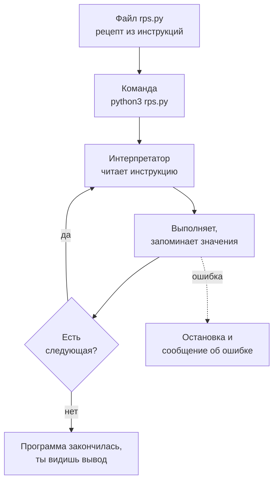
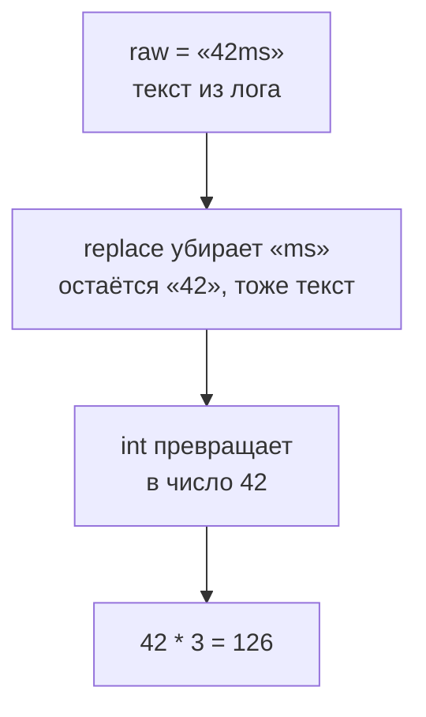

## Зачем это нужно

Я работаю с нагрузкой много лет и дальше буду сидеть рядом: подсказывать, где ты споткнёшься, и рассказывать, как делал бы сам. Начну с истории.

Перед одной распродажей мне поручили проверить карточки товаров: открыть каждую и убедиться, что на ней есть цена. Первые сорок я смотрел внимательно, к восьмидесятой листал почти не глядя. Карточку без цены я пролистал, а нашёл её покупатель. Вечером я написал **скрипт**: небольшую программу, то есть текстовый файл с инструкциями, которые компьютер выполняет по порядку. Он проверил все карточки за минуты и не устал. С тех пор у меня правило: если проверку приходится повторять руками больше десятка раз, её отдают программе.

В «Магазине» такой работы много: тысячи запросов, время каждого, доля запросов с ошибкой. В нагрузке её почти всегда пишут на **Python**: это язык программирования, на котором записывают инструкции для компьютера. На нём написан Locust, инструмент нагрузки ([тема 9](../09-locust/index.md)), на нём проверяют API ([тема 6](../06-api-testing/index.md)). Python читается почти как английский и не требует сборки: написал файл, запустил, увидел результат. Для скрипта «на сегодня» это идеально.

Запросов к «Магазину» из кода в этом уроке ещё нет, они начнутся в [уроке 4.5](05-venv-requests.md). Зато ты запустишь Python двумя способами, научишься запоминать значения под именами, отличать число от текста и читать сообщения об ошибках. Их будет много, и это нормально: ошибка в Python не поломка, а подсказка, куда смотреть.

Шаг проекта: в `~/perf-lab/04-python/` появятся три первых скрипта: `hello.py`, `vars.py` и `rps.py`. Последний считает RPS (requests per second, запросов в секунду) и долю ошибок по числам из отчёта о прогоне. Все три ты закоммитишь в `perf-lab`.

## Что нужно знать

- Терминал, `cd`, `ls`, `nano` и понятие пути: [урок 1.1](../01-linux/01-workstation-terminal.md). Если команда `python3` не находится, вернись к разделу про `PATH` там же.
- Что такое прогон нагрузки и из каких чисел он состоит (время ответа, запросы в секунду, ошибки): [урок 8.1](../08-perf-theory/01-latency-throughput.md). Читать его целиком сейчас не нужно: в этом уроке ты возьмёшь оттуда только три числа.
- Git и репозиторий `~/perf-lab` из [темы 3](../03-git/index.md): в конце урока ты закоммитишь скрипты.

Программировать уметь не нужно: урок начинает с нуля.

## Картина целиком

Ты отдаёшь повару рецепт. Повар не обсуждает, что такое «взбить»: он выполняет инструкции из рецепта одну за другой, сверху вниз. Если в рецепте «добавь соль» дважды, соли будет вдвое больше. Если слово с ошибкой, повар остановится и скажет, какая инструкция непонятна.

Программа на Python устроена так же. Рецепт это сама **программа**, текстовый файл с инструкциями. Повар это **интерпретатор** (interpreter): программа `python3`, которая читает твой файл и выполняет инструкции по порядку. По ходу дела он запоминает значения под именами, как банки с наклейками на полке: это **переменные**. А то, что программа печатает в терминал, называется **выводом** (output): готовое блюдо на тарелке.



Выполнение это цикл «прочитал инструкцию, сделал, перешёл к следующей». Остановить его может только конец файла или ошибка, и в сообщении об ошибке всегда указано место в файле, где интерпретатор споткнулся.

## Подготовка рабочего места

Нужен Python 3.12 или новее и редактор. На Ubuntu 24.04 из [урока 1.1](../01-linux/01-workstation-terminal.md) Python уже стоит как `python3` (на 26.04 версия новее, всё из урока работает так же). Проверь:

```bash
python3 --version
```

```text
Python 3.12.3
```

Если вместо версии `command not found`, поставь: `sudo apt install -y python3`. Команды `python` без тройки на Ubuntu может не быть, поэтому везде в курсе пишем `python3`.

**Редактор.** Скрипты пишут в редакторе кода. Подойдёт любой: `nano` (уже знаком из терминала, для первых уроков хватает) или **VS Code** (Visual Studio Code), бесплатный редактор с подсветкой кода и подсказками. Если ставишь VS Code, добавь в него расширение «Python» от Microsoft: оно подсвечивает ошибки до запуска. Открыть каталог в нём можно из терминала командой `code .` (точка значит «текущий каталог»). Если работаешь в WSL2, открывай каталог так же из WSL-терминала.

Один совет, который сэкономит час: **сохраняй файл перед запуском**. В VS Code это `Ctrl+S`, в `nano` `Ctrl+O`, затем `Enter`. Самая частая загадка новичка «я же исправил, а ошибка та же» означает, что исправление осталось в окне редактора и на диск не попало.

## Теория

### Интерпретатор: два способа запустить Python

Ты написал скрипт, но компьютер его не поймёт: он знает только цепочки нулей и единиц. Кто-то должен переводить.

Этим занимается интерпретатор. Он как синхронный переводчик на переговорах: слушает фразу, сразу переводит и идёт дальше. Аналогия ломается в одном: живой переводчик поймёт фразу и с ошибкой, а интерпретатор не прощает ничего, лишняя запятая, и он остановится.

Запустить его можно двумя способами. Первый: набрать `python3` без аргументов. Появится приглашение `>>>`: печатаешь строку, жмёшь `Enter`, Python сразу показывает результат. Такой режим называется REPL (read, evaluate, print, loop: «прочитал, выполнил, напечатал, повторил»). Это записная книжка, ничего не сохраняется. Выход: `exit()` или `Ctrl+D`. Второй способ: записать строки в файл `.py` и запустить `python3 файл.py`. Python выполнит файл сверху вниз и закроется. Так работают все скрипты курса.

```bash
python3
```

```text
Python 3.12.3 (main, Aug 14 2025, 17:47:21) [GCC 13.3.0] on linux
Type "help", "copyright", "credits" or "license" for more information.
>>> 120 + 80
200
>>> print("Привет")
Привет
>>> exit()
```

В REPL результат вычисления показывается сам: на `120 + 80` Python напечатал `200`. А `print("Привет")` вывел текст без кавычек.

> **Прикинь сам:** `2 + 2` в REPL дало `4`. Ту же строку записали в файл `calc.py` и запустили `python3 calc.py`. Что увидишь?
{: .predict}

Ничего: Python посчитает 4 и выбросит результат. Автоматическая печать есть только в REPL, в файле нужно `print(2 + 2)`.

Осторожно: не путай `>>>` с приглашением терминала `student@laptop:~$`. Набрал `ls` в REPL, получишь ошибку `NameError` («имя неизвестно»): `ls` это команда оболочки, а не Python.

> **Главное:** интерпретатор выполняет твои строки: в REPL по одной, из файла все подряд, а результат из файла нужно печатать самому через `print`.
{: .key}

Раз печатать самому, посмотрим, как это делается.

### print и строки: как программа что-то сообщает

Программа без вывода это чёрный ящик: может отлично работать, а ты не узнаешь. Скрипту нагрузки нужно сообщить: «1800 запросов, 27 ошибок». Для этого есть `print`.

`print(что-то)` печатает значение и переводит строку. Несколько значений через запятую `print` разделит пробелами. Текст в программе называется **строкой** (string): символы в кавычках, одинарных или двойных, лишь бы открывающая и закрывающая совпадали. Кириллица работает без настроек. Строки можно склеивать знаком `+` и повторять знаком `*`: `"-" * 20` даст линию из двадцати дефисов.

Чаще всего нужно вставить в текст посчитанное значение. Для этого есть **f-строка** (f-string): перед кавычкой ставишь `f`, а в фигурных скобках пишешь, что подставить. После двоеточия задают формат: `:.1f` значит «дробное число с одним знаком после точки», `:,` значит «с разделителем тысяч». В примере первая строка записывает число 1800 под именем `requests`: что это такое, будет в следующем разделе, пока считай `requests` подписью к числу.

```python
requests = 1800
print("Запросов:", requests)
print(f"Запросов: {requests}")
print(f"С разделителем: {requests * 1000:,}")
print("-" * 20)
```

```text
Запросов: 1800
Запросов: 1800
С разделителем: 1,800,000
--------------------
```

Первые две строки одинаковые, а `:,` в третьей расставил запятые между тысячами.

> **Прикинь сам:** что напечатает `print("a" + "b", "c" * 3)`?
{: .predict}

Склейка даст `ab`, повтор даст `ccc`, `print` поставит между ними пробел: `ab ccc`.

Осторожно: забыл `f` перед кавычкой, и скобки напечатаются как есть: `Запросов: {requests}`. А `"Он сказал "привет""` не сработает: Python решит, что строка кончилась на второй кавычке. Возьми разные: `'Он сказал "привет"'`.

> **Главное:** `print` выводит значения для человека, строка это текст в кавычках, а f-строка вставляет в текст значения и форматирует числа.
{: .key}

Что за имя `requests`?

### Переменные: имя для значения

В отчёте число 1800 встречается в пяти местах. Завтра запросов окажется 2400. Править пять мест и ни разу не промахнуться трудно.

Выход: записать значение один раз, дать имя и дальше ссылаться по имени. Такое имя называется **переменной** (variable). Это банка с наклейкой «Соль»: берёшь по наклейке, не вспоминая, что внутри. Аналогия ломается в одном: на одно значение можно повесить две наклейки, это пригодится в [уроке 4.2](02-conditions-loops.md).

Переменная создаётся знаком `=`:

```python
latency_ms = 120
```

Здесь `=` не «равно», а команда «присвоить»: вычисли справа и запомни под именем слева. Строка `total = total + 10` читается так: взять текущее `total`, прибавить 10, назвать результат `total`. Так считают суммы и счётчики.

С именами такие правила: латинские буквы, цифры и подчёркивание, с цифры не начинать. Регистр важен (`Latency` и `latency` разные имена), слова разделяют подчёркиванием (`error_rate`), служебные слова Python (`if`, `for`) брать нельзя. И совет: пиши в имени единицы, `latency_ms`, `duration_s`. Так секунды не перепутаются с миллисекундами, а это самая частая ошибка нагрузочника.

Посмотри, как программа выполняется по шагам. Слева код, подсвечена только что выполненная строка. Справа «память»: уже созданные переменные с подписью типа (`int` целое, `float` дробное, подробнее в разделе дальше) и то, что программа напечатала.

<div class="viz" data-viz="py-trace" data-title="Как Python выполняет rps.py" data-speed="1800" data-code='["requests = 1800","duration_s = 60","errors = 27","rps = requests / duration_s","error_rate = errors / requests * 100","print(f\"RPS: {rps:.1f}\")","print(f\"Ошибок: {error_rate:.1f}%\")"]' data-steps='[{"l":1,"v":{"requests":"1800"},"n":"Создаём переменную `requests` и кладём в неё число 1800."},{"l":2,"v":{"requests":"1800","duration_s":"60"},"n":"Ещё одна переменная: длительность прогона в секундах."},{"l":3,"v":{"requests":"1800","duration_s":"60","errors":"27"},"n":"Третья переменная: сколько запросов закончились ошибкой."},{"l":4,"v":{"requests":"1800","duration_s":"60","errors":"27","rps":"30.0"},"n":"Справа считается `1800 / 60`, получается `30.0` (обычное деление всегда даёт дробное число). Результат запоминается под именем `rps`."},{"l":5,"v":{"requests":"1800","duration_s":"60","errors":"27","rps":"30.0","error_rate":"1.5"},"n":"Доля ошибок: `27 / 1800 * 100` равно 1,5. Переменная появилась, потому что все три нужных числа уже созданы выше."},{"l":6,"v":{"requests":"1800","duration_s":"60","errors":"27","rps":"30.0","error_rate":"1.5"},"o":"RPS: 30.0","n":"`print` печатает строку. В фигурных скобках f-строки подставлено значение `rps`, формат `:.1f` оставил один знак после точки."},{"l":7,"v":{"requests":"1800","duration_s":"60","errors":"27","rps":"30.0","error_rate":"1.5"},"o":"Ошибок: 1.5%","n":"Вторая печать: значение `error_rate` и знак процента. Программа дошла до конца файла."}]' data-try="пройди все шаги и посмотри, как в правой колонке по одной появляются переменные. Нажми «◀ Назад» и убедись, что значения возвращаются."></div>

Вычисление `rps = ...` нельзя поставить выше строк с `requests` и `duration_s`: Python идёт сверху вниз и этих имён ещё не знает. 1800 запросов за 60 секунд дали `30.0`: обычное деление `/` всегда возвращает дробное число.

> **Прикинь сам:** что будет в `total` после `total = 100`, затем `total = total + 50`, затем `total = total * 2`?
{: .predict}

Каждая строка берёт текущее значение: 100, потом 150, потом 300.

Осторожно: переменная не помнит формулу. Это не Excel: `rps = requests / duration_s` считается один раз, и `rps` не изменится, пока строку не выполнят снова.

> **Главное:** `=` вычисляет правую часть и запоминает под именем слева, а единицы в имени (`latency_ms`) защищают от путаницы.
{: .key}

В переменные мы клали и числа, и текст. А отличаются они сильно.

### Типы данных: число это не текст

Что получится, если сложить `"120"` и `"80"`: двести или «12080»? Зависит от того, числа это или текст. Поэтому у каждого значения есть **тип** (type): он определяет, что с ним можно делать. Как ящики в мастерской: молотком забьёшь гвоздь, но не рецепт.

В работе хватает трёх типов. `int` целое число: счётчики и коды ответа (`200`). `float` дробное: время в секундах и проценты (`0.35`, `30.0`). `str` строка: любой текст, адрес, имя. Реже нужны `bool` (`True` и `False`) и `None` («значения нет», тип `NoneType`). Тип любого значения покажет **функция** (function) `type()`: именованная команда, в скобках то, с чем работать (это называют аргументом). Ты видел `print(...)`, свои функции напишешь в [уроке 4.3](03-functions-errors.md).

```python
print(type(200), type(0.35), type("200"), type(True), type(None))
```

```text
<class 'int'> <class 'float'> <class 'str'> <class 'bool'> <class 'NoneType'>
```

Главный факт: `200` и `"200"` разные значения. Код ответа из лога придёт строкой, и сравнивать его с числом `200` бесполезно, пока не превратишь строку в число.

С числами считай знаками `+`, `-`, `*`, порядок как в школе, сомневаешься, ставь скобки. Деление хитрее. Прогон длился 1850 секунд, а в отчёт нужны минуты и секунды. Знак `//` отбрасывает дробь: `1850 // 60` даёт 30 минут. Знак `%` даёт остаток: `1850 % 60` это 50 секунд. Обычный `/` всегда даёт `float`. Знак `**` возводит в степень: `2 ** 10` это 1024. Сравнивают знаками `==` (равно), `!=`, `<`, `>`, `<=`, `>=`, и результат это `bool`: `status == 200` даст `True`, если код равен 200.

Тип меняют функции с именами типов: `int("200")` даёт число 200, `float("0.35")` даёт 0.35, `str(200)` даёт `"200"`. Если превратить нельзя (`int("abc")`), будет `ValueError`.

Время ответа пришло из лога текстом `"42ms"`, а считать нужно число.



```python
raw = "42ms"
number = raw.replace("ms", "")
latency_ms = int(number)
print(latency_ms * 3)
print(type(raw), type(number), type(latency_ms))
```

```text
126
<class 'str'> <class 'str'> <class 'int'>
```

`raw.replace("ms", "")` заменяет `ms` на пустое место (так работают методы строк, о них следующий раздел). Остаётся `"42"`, всё ещё строка. Только `int(number)` делает число.

> **Проверь понимание:** `status = "200"`, а в проверке `status == 200`. Что получится и как исправить?

<details markdown="1">
<summary>Ответ</summary>

Получится `False`: строка не равна числу, хотя `print` показывает их одинаково. Исправь: `int(status) == 200`.

</details>

Осторожно: текст с числом не складывают, `"Всего: " + 126` даёт `TypeError`: нужно `str(126)` или f-строка. Секунды в миллисекунды переводят сознательно: 0,35 с это 350 мс. Дроби неточны: `0.1 + 0.2` даёт `0.30000000000000004`, потому что компьютер хранит дроби приближённо. Поэтому их округляют (`round(x, 2)` округляет до двух знаков, формат `:.2f` тоже) и не сравнивают через `==`. А `True`, `False` и `None` пишутся с заглавной.

> **Главное:** у каждого значения есть тип, `200` и `"200"` разные вещи, а данные из логов приходят строками и перед счётом превращаются в числа.
{: .key}

Строки из лога ещё нужно чистить: в них лишние пробелы, а нужное сидит внутри.

### Методы строк: работа с текстом

Строка из лога: `"  GET /api/products 200 42ms \n"`. По краям лишнее, а нужно проверить, что адрес начинается с `/api/`. Резать руками не придётся: у строки есть готовые действия.

Такое действие называется **методом** (method): функция, принадлежащая значению, через точку, `значение.метод(аргументы)`. `.strip()` убирает пробелы и переводы строк по краям, `.upper()` и `.lower()` меняют регистр, `.replace(старое, новое)` заменяет текст, `.startswith(x)` и `.endswith(x)` отвечают `True` или `False`. Ещё `len(строка)` даёт длину, а `x in строка` отвечает, есть ли `x` внутри. `\n` внутри кавычек это перевод строки, невидимый знак конца строки. Метод не меняет исходную строку, а возвращает новую: строки неизменяемы.

```python
line = "  GET /api/products 200 42ms \n"
line = line.strip()
print(line)
print(len(line))
print(line.startswith("GET"), "/api/" in line, "500" in line)
```

```text
GET /api/products 200 42ms
26
True True False
```

`strip` убрал лишнее, длина 26 (до него было 30). Присваивание `line = line.strip()` нужно, иначе новая строка потеряется. Три проверки: `GET` в начале (да), `/api/` внутри (да), `500` внутри (нет, код был 200).

> **Прикинь сам:** `name = "Товар 15"`. Что даст `name.upper()` и чему равно `name` после этого?
{: .predict}

Метод вернёт `"ТОВАР 15"`, а `name` останется прежним. Чтобы запомнить, пиши `name = name.upper()`.

Осторожно: `"500" in line` ищет символы где угодно. Строка `"GET /api/products/500 200 42ms"` тоже даст `True`, хотя ошибки не было. По полям строку режут на части, это в [уроке 4.2](02-conditions-loops.md).

> **Главное:** метод строки возвращает новую строку, старая не меняется, поэтому результат присваивают.
{: .key}

Мы пишем уже достаточно, чтобы ошибаться. Научимся читать, что говорит Python.

### Ошибки и как их читать

Ты будешь ошибаться каждый день, а профессионал за 30 секунд понимает, что ему говорят. Я в первую неделю тоже пугался красного текста, пока не понял, что это подсказка.

Когда Python не может выполнить строку, он останавливает программу и печатает **трассировку** (traceback, «след»). Читай её снизу вверх. Последняя строка: тип ошибки и сообщение, например `NameError: name 'totl' is not defined`. Над ней проблемная строка кода, иногда со значками `^^^^` на подозрительном месте. Ещё выше файл и номер строки (`File "...", line 4`). Строк «File ...» может быть несколько, если одни функции вызывали другие ([урок 4.3](03-functions-errors.md)): важен конец цепочки, он снизу.

<div class="viz" data-viz="flow" data-title="Как читать сообщение об ошибке" data-steps='[{"title":"Найди последнюю строку","text":"Там тип ошибки и сообщение: `NameError`, `TypeError`, `SyntaxError`."},{"title":"Прочитай сообщение целиком","text":"Python часто подсказывает: `Did you mean: ...?` или называет оба типа, которые не сочетаются."},{"title":"Открой указанную строку","text":"Номер в строке `File ..., line N`. Настоящая причина бывает строкой выше, например забытая закрывающая скобка."},{"title":"Сверь имя, тип и скобки","text":"Опечатка в имени? Текст вместо числа? Не закрыта скобка или кавычка? Это 90% случаев на первой неделе."},{"title":"Исправь одно и запусти снова","text":"Меняй по одной вещи за раз. Сохрани файл перед запуском."}]'></div>

Четыре ошибки встретятся чаще всего. `SyntaxError`: текст нарушает правила языка, например не закрыта скобка. Перед запуском Python быстро просматривает файл целиком, поэтому при такой ошибке в строке 10 даже `print` в строке 1 ничего не напечатает. `NameError`: имя неизвестно (опечатка или переменная ещё не создана). `TypeError`: операция не подходит к типам (`"120" + 3`). `ValueError`: тип подходит, а значение нет (`int("abc")`).

Файл `demo.py`:

```python
latency_ms = "120"
count = 3
total = latency_ms * count
print(totl)
```

```text
Traceback (most recent call last):
  File "/home/student/perf-lab/04-python/demo.py", line 4, in <module>
    print(totl)
          ^^^^
NameError: name 'totl' is not defined. Did you mean: 'total'?
```

Снизу вверх: `NameError`, имя `totl` не определено, Python подсказывает `total`. Выше код со стрелками `^^^^`, ещё выше файл и строка 4 (`in <module>` значит «на верхнем уровне файла, не внутри функции»). Исправление: заменить `totl` на `total`.

А строка 3 ошибки не дала: `"120" * 3` это `"120120120"`. Python выполнил то, что написано, хотя ты хотел 360. Опаснее всего ошибка, о которой Python молчит: программа работает и считает не то. Проверяй результат здравым смыслом.

Осторожно: красный текст не значит «всё сломано». И место, где Python заметил ошибку, не всегда место причины: не закрыл скобку в строке 4, а он пожалуется на строку 5.

> **Главное:** читай трассировку снизу вверх, начиная с типа ошибки, а опаснее всего ошибки, о которых Python молчит.
{: .key}

Осталось два мелких правила.

### Комментарии и отступы

**Комментарий** (comment) это всё от значка `#` до конца строки, Python его пропускает. Пиши в нём, почему так сделано: `# в логе время в мс, не в секундах`.

**Отступ** (indentation) это пробелы в начале строки. В Python он часть языка: показывает, какие строки входят в один блок. Пока блоков нет, строка с пробела даст `IndentationError: unexpected indent`. Блоки появятся в [уроке 4.2](02-conditions-loops.md): там 4 пробела на уровень, редактор ставит их клавишей `Tab`.

> **Главное:** комментарий объясняет «почему», а отступ в Python часть языка, поэтому пока начинай строки с левого края.
{: .key}

Вернёмся к распродаже: к концу урока `rps.py` посчитает скорость и долю ошибок, а цикл для всех карточек будет в следующем уроке.

## Практика

Сначала создадим место для скриптов, потом напишем три программы.

### 1. Проверь Python и поиграй в REPL

```bash
python3 --version
python3
```

Команда `python3 --version` напечатала версию и вернулась в терминал. Вторая запускает REPL. Набери по строке, после каждой нажимая `Enter`:

```python
1800 / 60
2 ** 10
"Магазин" + " готов"
type(30.0)
exit()
```

```text
Python 3.12.3 (main, Aug 14 2025, 17:47:21) [GCC 13.3.0] on linux
Type "help", "copyright", "credits" or "license" for more information.
>>> 1800 / 60
30.0
>>> 2 ** 10
1024
>>> "Магазин" + " готов"
'Магазин готов'
>>> type(30.0)
<class 'float'>
>>> exit()
```

**Как читать вывод:** в REPL каждая строка сразу показывает результат. Текст показан в **одинарных кавычках** (`'Магазин готов'`): так REPL отличает строку от числа. `print` кавычек не покажет.

**Типичные ошибки:** `NameError: name 'ls' is not defined`: ты набрал команду оболочки внутри REPL, выйди через `exit()`. `SyntaxError` при вставке многострочного текста: в REPL вставляй по одной строке.

### 2. Первый скрипт

```bash
mkdir -p ~/perf-lab/04-python
cd ~/perf-lab/04-python
nano hello.py
```

`mkdir -p` создаёт каталог (и не ругается, если он уже есть), `cd` переходит в него, `nano hello.py` открывает редактор с новым файлом. Впиши:

```python
# Первая программа: проверяем, что Python работает
print("Привет, Магазин!")
```

Сохрани (`Ctrl+O`, `Enter`), выйди (`Ctrl+X`) и запусти:

```bash
python3 hello.py
```

```text
Привет, Магазин!
```

**Как читать вывод:** строка с `#` ничего не напечатала: это комментарий. Напечатана одна строка, которую ты написал.

**Типичные ошибки:** `python3: can't open file '/home/student/perf-lab/04-python/hello.py': [Errno 2] No such file or directory`: файл не сохранён или ты в другом каталоге. Проверь `pwd` и `ls`.

### 3. Переменные и типы

```bash
nano vars.py
```

```python
shop = "Магазин"
port = 8000
latency_ms = 120.5
is_ready = True
note = None

print(shop, port, latency_ms, is_ready, note)
print(type(shop), type(port), type(latency_ms), type(is_ready), type(note))

# строка из лога и число из неё
raw = "42ms"
number = int(raw.replace("ms", ""))
print(number * 3)
```

Запусти `python3 vars.py`:

```text
Магазин 8000 120.5 True None
<class 'str'> <class 'int'> <class 'float'> <class 'bool'> <class 'NoneType'>
126
```

**Как читать вывод:** первая строка это значения как для человека (без кавычек), вторая типы тех же значений в том же порядке. Последняя строка, 126, это 42 * 3: число получилось, потому что `int` превратил строку `"42"` в число.

### 4. Скрипт `rps.py`: RPS и доля ошибок

Три числа из отчёта о прогоне: за 60 секунд отправлено 1800 запросов, 27 завершились ошибкой. Посчитаем скорость и долю ошибок.

```bash
nano rps.py
```

```python
# Числа из отчёта о прогоне
requests = 1800
duration_s = 60
errors = 27

rps = requests / duration_s
error_rate = errors / requests * 100

print(f"Запросов: {requests}")
print(f"RPS: {rps:.1f}")
print(f"Ошибок: {error_rate:.1f}%")
```

```bash
python3 rps.py
```

```text
Запросов: 1800
RPS: 30.0
Ошибок: 1.5%
```

**Как читать вывод:** 1800 / 60 = 30 запросов в секунду. Доля ошибок 27 / 1800 = 0,015, умножили на 100, получили 1,5 процента (в цель вроде «ошибок меньше 1%» этот прогон не уложился). `:.1f` оставил один знак после точки.

Теперь поменяй `errors = 27` на `errors = 9` и запусти ещё раз: последняя строка станет `Ошибок: 0.5%`. Ради этого и нужны переменные: одно число поменял, и весь отчёт пересчитался.

### 5. Закоммить скрипты

```bash
cd ~/perf-lab
git add 04-python
git commit -m "4.1: первые скрипты Python"
git push
```

`git add 04-python` отметил новый каталог, `git commit -m` сохранил снимок с подписью, `git push` отправил его на GitHub (подробно в [теме 3](../03-git/index.md)).

**Типичные ошибки:** `nothing added to commit`: файлы не сохранены или ты не в `~/perf-lab`. Проверь `git status`.

> Python выдал ошибку, которой нет в «Типичных ошибках»? Прочитай последнюю строку трассировки сам, потом покажи нейросети код и всю трассировку и спроси, что значит каждая строка.
{: .ai}

## Сломай и почини

**Поломка.** Создай файл `broken.py` из четырёх строк. Первая ошибка в нём видна сразу, вторая спрятана за ней.

```python
latency_ms = "120"
count = 3
total = latency_ms + count
print("Всего:" total)
```

**Задача.** Запусти `python3 broken.py` и прочитай сообщение снизу вверх. Исправь, запусти снова: появится вторая ошибка, исправь и её. Потом подумай, какое число ты хотел получить в `total`: 123 или 360? Сложить миллисекунды с количеством запросов не имеет смысла. Реши, что имел в виду автор, и сделай так, чтобы программа печатала именно это.

<details markdown="1">
<summary>Разбор</summary>

**Первая ошибка** появится ещё до выполнения:

```text
  File "/home/student/perf-lab/04-python/broken.py", line 4
    print("Всего:" total)
          ^^^^^^^^^^^^^^
SyntaxError: invalid syntax. Perhaps you forgot a comma?
```

Это `SyntaxError`: Python показал строку 4 и подсказал, что не хватает запятой между `"Всего:"` и `total`. Строки 1-3 даже не начали выполняться: синтаксис проверяется до запуска. Исправление: `print("Всего:", total)`.

**Вторая ошибка** после исправления:

```text
Traceback (most recent call last):
  File "/home/student/perf-lab/04-python/broken.py", line 3, in <module>
    total = latency_ms + count
            ~~~~~~~~~~~^~~~~~
TypeError: can only concatenate str (not "int") to str
```

Теперь программа стартовала и упала на строке 3. `latency_ms` это строка `"120"` (в кавычках), `count` число 3, и Python не знает, как складывать текст и число. Сообщение дословно: к строке можно приписать только строку, а справа оказался `int`. Если нужна сумма, превращаем строку в число: `total = int(latency_ms) + count`, и программа напечатает `Всего: 123`. Если на самом деле нужно общее время трёх запросов по 120 мс, то правильно `total = int(latency_ms) * count`, то есть 360. Лучше всего убрать кавычки у `120` в первой строке: значение должно было быть числом с самого начала.

Что запомнить: две ошибки показали два разных места, куда смотреть. Синтаксическая ошибка находится до запуска и называет строку, ошибка типа появляется на конкретной строке во время работы. А вопрос «123 или 360» не про Python: в нагрузочных скриптах такие бессмысленные вычисления нередко не вызывают ошибок и тихо портят отчёт, поэтому после написания всегда прикидывай, правдоподобен ли результат.

</details>

## ИИ в помощь

Нейросеть хорошо объясняет трассировку ошибки Python и работает как терпеливый репетитор по синтаксису. Общие правила на странице [ИИ-помощник](../ai.md).

**Задача:** прочитать трассировку ошибки.

```text
Я учу Python 3.12. Мой скрипт rps.py:
<вставь код>
Ошибка:
<вставь трассировку целиком>
Объясни каждую строку трассировки: что за ошибка и в какой строке. Исправление покажи отдельно, а сначала дай подсказку, чтобы я попробовал сам.
```
{: .wrap}

**Проверь ответ:** исправь и запусти: результат должен совпасть с ручным счётом (1800 запросов за 60 секунд это 30 RPS). Типичная ошибка: «исправление» гасит ошибку, а не причину, или код в синтаксисе Python 2.

**Задача:** понять, что делает код.

```text
Объясни этот код простыми словами для новичка, строку за строкой, и скажи, какие значения примут переменные:
<вставь код>
Затем задай мне два вопроса на проверку, что я понял.
```
{: .wrap}

**Проверь ответ:** запусти код и сверь значения через `print`. Типичная ошибка: нейросеть пересказывает, как код должен работать, а не как он работает на самом деле.

## Словарик урока

| Термин | Простыми словами |
|---|---|
| Программа (program) | Текстовый файл с инструкциями, которые выполняет компьютер |
| Интерпретатор (interpreter), `python3` | Программа, которая читает твой файл по строкам и выполняет |
| REPL | Режим `python3` без файла: набрал строку, сразу увидел результат |
| Скрипт (script) | Небольшая программа в одном файле, которую запускают командой |
| Переменная (variable) | Имя, под которым запомнено значение |
| Присваивание (assignment) | Строка `имя = значение`: вычислить справа и запомнить под именем слева |
| Тип (type) | Вид значения: `int`, `float`, `str`, `bool`, `None`; определяет, что с ним можно делать |
| Строка (string, `str`) | Текст в кавычках |
| f-строка (f-string) | Строка с буквой `f` перед кавычкой, где `{имя}` заменяется значением |
| Функция (function) | Именованная команда: `print(...)`, `len(...)`, `type(...)` |
| Метод (method) | Действие значения, записывается через точку: `строка.strip()` |
| Приведение типов | Превращение значения в другой тип: `int("42")`, `str(42)` |
| Трассировка (traceback) | Сообщение об ошибке: где остановилась программа и почему; читать снизу вверх |
| `SyntaxError`, `NameError`, `TypeError`, `ValueError` | Нарушены правила языка / неизвестное имя / операция не подходит типам / значение не годится |
| Комментарий (comment) | Строка после `#`, которую Python пропускает |
| RPS (requests per second) | Число запросов в секунду |

## Вопросы с собеседований

Раздел для повторения: ответь вслух, потом открой ответ. Последние четыре помечены `[на скорость]`: отвечай за 30 секунд.



## Проверено на версиях

Python 3.12.3 (Ubuntu 24.04) и новее (Ubuntu 26.04), VS Code с расширением Python. Сообщения об ошибках приведены в формате Python 3.12 и новее (стрелки `^^^^`, подсказка `Did you mean`). Октябрь 2026.

## Итог урока: ты умеешь

- [ ] Запустить Python интерактивно (REPL) и файлом, выйти из REPL.
- [ ] Написать скрипт в редакторе, сохранить его в `~/perf-lab/04-python/` и запустить.
- [ ] Создать переменные с понятными именами и единицами и объяснить, как работает присваивание.
- [ ] Назвать базовые типы, проверить тип через `type()` и превратить строку в число и обратно.
- [ ] Посчитать RPS и долю ошибок, вывести результат f-строкой с нужным числом знаков.
- [ ] Очистить и проверить строку методами `strip`, `replace`, `startswith`, оператором `in`.
- [ ] Прочитать трассировку снизу вверх и отличить `SyntaxError`, `NameError`, `TypeError`, `ValueError`.
- [ ] Закоммитить скрипты в `perf-lab`.
- [ ] Спросить нейросеть с полным контекстом (код и вся трассировка) и проверить ответ запуском.

Дальше: [урок 4.2. Условия, циклы, списки и словари](02-conditions-loops.md): ты научишься обрабатывать сразу много значений, например список из тысяч времён ответа.
