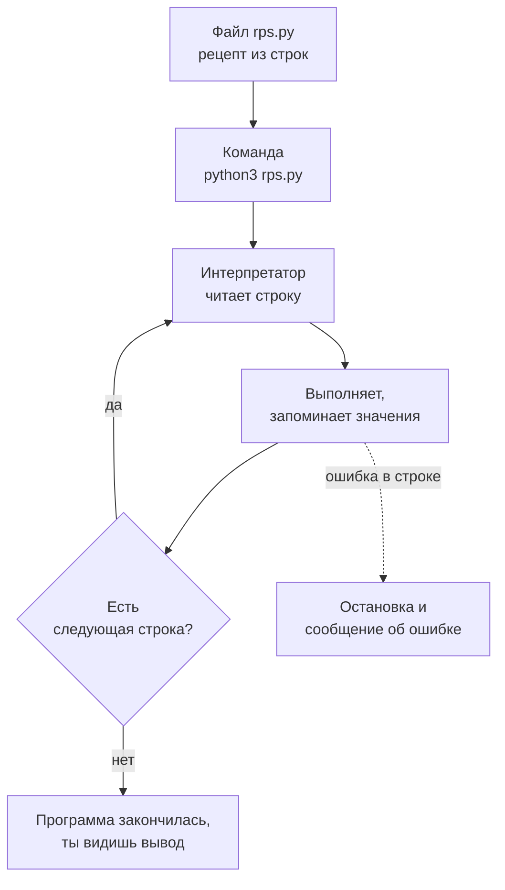

## Зачем это нужно

Нагрузочный тест это не «нажать кнопку и посмотреть». Чтобы проверить «Магазин», нужно отправить тысячи запросов, записать время каждого, посчитать среднее и хвост, сравнить с вчерашним прогоном и положить число в отчёт. Руками это делать нельзя: на сотую повторную проверку человек ошибается, а на тысячную засыпает. Эту работу отдают программе, а в нагрузочном тестировании почти всегда это **Python**: на нём написан Locust (инструмент нагрузки, [тема 9](../09-locust/index.md)), на нём пишут автотесты API (pytest, [тема 6](../06-api-testing/index.md)) и скрипты, которые разбирают логи и результаты.

Python выбирают за то, что он читается почти как английский текст и не требует сборки: написал файл, запустил, увидел результат. Для тестировщика это идеально, потому что скрипт нужен «на сегодня» и меняется по десять раз в день.

Этот урок самый первый в теме, поэтому запросов к «Магазину» из кода в нём ещё нет (они начнутся в [уроке 4.5](05-venv-requests.md)). Зато есть то, без чего ничего не заработает: ты запустишь Python двумя способами, заведёшь первые переменные, поймёшь, чем число отличается от текста, и научишься читать сообщения об ошибках, которых в первую неделю будет много. И это нормально: ошибка в Python не поломка, а подсказка, куда смотреть.

Шаг проекта: в `~/perf-lab/04-python/` появятся три первых скрипта: `hello.py`, `vars.py` и `rps.py` (считает запросы в секунду и долю ошибок по числам из отчёта о прогоне). Их ты закоммитишь в свой репозиторий `perf-lab`.

## Что нужно знать

- Терминал, `cd`, `ls`, `nano` и понятие пути: [урок 1.1](../01-linux/01-workstation-terminal.md). Если команда `python3` не находится, вернись к разделу про `PATH` там же.
- Что такое прогон нагрузки и из каких чисел он состоит (время ответа, запросы в секунду, ошибки): [урок 8.1](../08-perf-theory/01-latency-throughput.md). Читать его целиком сейчас не нужно: в этом уроке ты возьмёшь оттуда только три числа.
- Git и репозиторий `~/perf-lab` из [темы 3](../03-git/index.md): в конце урока ты закоммитишь скрипты.

Программировать уметь не нужно: урок начинает с нуля.

## Картина целиком

Ты отдаёшь повару рецепт. Повар не обсуждает, что такое «взбить»: он читает рецепт строку за строкой сверху вниз и делает то, что написано. Если в рецепте «добавь соль» дважды, соли будет вдвое больше. Если слово написано с ошибкой, повар остановится и скажет, какая строка непонятна.

Программа на Python устроена так же:

- **Программа** (program) это текстовый файл со строками-инструкциями. Рецепт.
- **Интерпретатор** (interpreter) это программа `python3`, которая читает твой файл строку за строкой и выполняет. Повар.
- **Переменная** (variable) это имя, под которым программа запомнила значение. Подписанная баночка на полке.
- **Вывод** (output) это то, что программа напечатала в терминал. Готовое блюдо на тарелке.



Смотри на схему: выполнение это цикл «прочитал строку, сделал, перешёл к следующей». Остановить его может только конец файла или ошибка, и в ошибке всегда указан номер строки, на которой интерпретатор споткнулся. Эта картина понадобится всю тему.

## Подготовка рабочего места

Нужен Python 3.12 или новее и редактор. На Ubuntu 24.04 из [урока 1.1](../01-linux/01-workstation-terminal.md) Python уже стоит как `python3` (на 26.04 версия новее, всё из урока работает так же). Проверь:

```bash
python3 --version
```

```text
Python 3.12.3
```

Если вместо версии `command not found`, поставь: `sudo apt install -y python3`. Команды `python` без тройки на Ubuntu может не быть, поэтому везде в курсе пишем `python3`.

**Редактор.** Скрипты пишут в редакторе кода. Подойдёт любой: `nano` (уже знаком из терминала, для первых уроков хватает) или **VS Code** (Visual Studio Code), бесплатный редактор с подсветкой кода и подсказками. Если ставишь VS Code, добавь в него расширение «Python» от Microsoft: оно подсвечивает ошибки до запуска. Открыть каталог в нём можно из терминала командой `code .` (точка значит «текущий каталог»). Если работаешь в WSL2, открывай каталог так же из WSL-терминала.

Один совет, который сэкономит час: **сохраняй файл перед запуском**. В VS Code это `Ctrl+S`, в `nano` `Ctrl+O`, затем `Enter`. Самая частая загадка новичка «я же исправил, а ошибка та же» означает, что исправление осталось в окне редактора и на диск не попало.

## Теория

### Интерпретатор: два способа запустить Python

**Зачем это существует.** Компьютер понимает только машинные команды, длинные последовательности нулей и единиц. Писать их руками нельзя, поэтому есть языки вроде Python: ты пишешь на понятном человеку языке, а программа-переводчик превращает написанное в действия. Без переводчика у тебя был бы листок с рецептом и никакой кухни.

**Аналогия.** Синхронный переводчик на переговорах: слушает фразу, сразу переводит, идёт дальше. Он не ждёт, пока ты дочитаешь доклад. Аналогия ломается в том, что живой переводчик поймёт фразу и с ошибкой, а интерпретатор Python не прощает ничего: лишняя запятая, и он остановится.

**Как это устроено.** Интерпретатор запускается двумя способами.

1. **Интерактивно** (REPL: read, evaluate, print, loop, «прочитал, выполнил, напечатал, повторил»). Запускаешь `python3` без аргументов и получаешь приглашение `>>>`. Печатаешь строку, нажимаешь `Enter`, и Python сразу показывает результат. Это записная книжка: хороша, чтобы проверить мысль за пять секунд, но ничего не сохраняет.
2. **Файлом.** Пишешь строки в файл с расширением `.py` и запускаешь `python3 файл.py`. Python выполняет файл с первой строки до последней и закрывается. Именно так будут работать все скрипты курса.

Выйти из REPL можно командой `exit()` или сочетанием `Ctrl+D`.

**Разобранный пример.** Сессия в REPL:

```bash
python3
```

```text
Python 3.12.3 (main, Aug 14 2025, 17:47:21) [GCC 13.3.0] on linux
Type "help", "copyright", "credits" or "license" for more information.
>>> 120 + 80
200
>>> print("Привет")
Привет
>>> exit()
```

Читаем: первые две строки это справка о версии, нужна она один раз. `>>>` приглашение: интерпретатор ждёт строку. На `120 + 80` Python сам напечатал `200`: в REPL значение выражения показывается автоматически. А `print("Привет")` напечатал текст без кавычек: `print` выводит значение «для человека». Из файла результат выражения сам не печатается, поэтому в файлах нужен именно `print`: это первое отличие REPL от скрипта.

**Что путают.** Приглашение `>>>` и приглашение терминала `student@laptop:~$`. Если ты в REPL и печатаешь `ls`, получишь `NameError`: это команда оболочки, а не Python. И наоборот: `print("привет")` в обычном терминале даст ошибку оболочки. Всегда смотри, где ты.

> **Проверь понимание:** в REPL ты набрал `2 + 2` и увидел `4`. Ту же строку `2 + 2` записал в файл `calc.py` и запустил `python3 calc.py`. Что увидишь и почему?

<details markdown="1">
<summary>Ответ</summary>

Ничего: программа выполнит строку, посчитает 4 и выбросит результат. Автоматическая печать значения выражения есть только в REPL. В файле нужно писать `print(2 + 2)`.

</details>

### print и строки: как программа что-то сообщает

**Зачем это существует.** Программа без вывода это чёрный ящик: она может работать, но ты об этом не узнаешь. Скрипту нагрузки нужно сообщить: «отправил 1800 запросов, 27 ошибок, p95 равно 300 мс». Для этого есть `print`.

**Как это устроено.** `print(что-то)` печатает значение и переводит строку. В скобках можно перечислить несколько значений через запятую: `print` сам поставит между ними пробелы. Текст в программе называется **строкой** (string): последовательность символов в кавычках. Кавычки могут быть одинарными или двойными, главное, чтобы открывающая и закрывающая совпадали: `"GET /api/products"` и `'GET /api/products'` одно и то же. Кириллица работает без дополнительных настроек.

Внутри строки есть служебные сочетания: `\n` означает перевод строки, `\t` табуляцию. Строки можно склеивать знаком `+` и повторять знаком `*`: `"-" * 20` даёт линию из двадцати дефисов, удобную для оформления отчётов.

Чаще всего нужно вставить значение переменной в текст. Для этого есть **f-строка** (f-string): перед открывающей кавычкой ставишь `f`, а в фигурных скобках пишешь, что подставить. После двоеточия внутри скобок задают формат: `:.1f` значит «дробное число с одним знаком после точки», `:,` «с разделителем тысяч».

**Разобранный пример.**

```python
requests = 1800
print("Запросов:", requests)
print(f"Запросов: {requests}")
print(f"С разделителем: {requests * 1000:,}")
print("-" * 20)
```

```text
Запросов: 1800
Запросов: 1800
С разделителем: 1,800,000
--------------------
```

Читаем: первые две строки дали одинаковый вывод разными способами: запятая в `print` и f-строка. В третьей f-строке внутри скобок не только имя, а целое вычисление (`requests * 1000`), и формат `:,` поставил запятые между тысячами. Четвёртая печатает линию из 20 дефисов.

**Что путают.** Забывают букву `f` перед кавычкой: тогда фигурные скобки напечатаются как есть, `Запросов: {requests}`. Ещё путают кавычки внутри строки: `"Он сказал "привет""` не работает, Python решит, что строка кончилась на второй кавычке. Берут разные: `'Он сказал "привет"'`.

> **Проверь понимание:** что напечатает `print("a" + "b", "c" * 3)`?

<details markdown="1">
<summary>Ответ</summary>

`ab ccc`. Сначала вычисляются `"a" + "b"` (склейка, получилось `ab`) и `"c" * 3` (повтор, получилось `ccc`), а затем `print` ставит между ними пробел.

</details>

### Переменные: имя для значения

**Зачем это существует.** Число 1800 в программе нужно использовать несколько раз: считать запросы в секунду, процент ошибок, подписать отчёт. Если написать `1800` в пяти местах и завтра запросов окажется 2400, придётся найти и поправить все пять и не промахнуться. Переменная позволяет записать значение один раз, дать ему имя и ссылаться по имени. Плюс имя объясняет смысл: `requests = 1800` читается, а `1800` в середине формулы нет.

**Аналогия.** Банка на полке с наклейкой «Соль». Ты не помнишь, какие кристаллы внутри, ты берёшь банку по наклейке. Пересыпал содержимое, наклейка осталась. Аналогия ломается в одном: на самом деле имя прикрепляется к значению, а не наоборот, и у одного значения может быть две наклейки. Для чисел и строк это незаметно, а в [уроке 4.2](02-conditions-loops.md) с изменяемыми списками станет важным.

**Как это устроено.** Создание переменной записывается знаком `=`:

```python
latency_ms = 120
```

Знак `=` здесь **не** «равно», а команда «присвоить»: вычисли справа, запомни под именем слева. Справа может быть вычисление, и в нём могут участвовать другие переменные. Присваивать новое значение можно сколько угодно раз, старое забывается. Строка `total = total + 10` читается так: взять текущее `total`, прибавить 10, результат снова назвать `total`. Это ключевая конструкция для подсчётов: так считают суммы и счётчики запросов.

Правила имён:

- только латинские буквы, цифры и подчёркивание, начинать с буквы или `_`, не с цифры;
- регистр важен: `Latency` и `latency` разные имена;
- пробелов нет, слова разделяют подчёркиванием: `error_rate`, `duration_s` (стиль snake_case, «змеиный»);
- нельзя называть именем служебного слова Python (`if`, `for`, `class`, `None` и другие);
- имя должно объяснять смысл, а единицы измерения полезно писать в имени: `latency_ms`, `duration_s`. Единицы в имени спасают от самой частой ошибки нагрузочника, когда секунды перепутаны с миллисекундами.

Теперь посмотри, как программа выполняется по шагам. Слева код, подсвеченная строка это то, что Python только что сделал. Справа «память»: переменные, которые на этот момент существуют, и их типы (о типах дальше), а под ними то, что программа напечатала.

<div class="viz" data-viz="py-trace" data-title="Как Python выполняет rps.py" data-speed="1800" data-code='["requests = 1800","duration_s = 60","errors = 27","rps = requests / duration_s","error_rate = errors / requests * 100","print(f\"RPS: {rps:.1f}\")","print(f\"Ошибок: {error_rate:.1f}%\")"]' data-steps='[{"l":1,"v":{"requests":"1800"},"n":"Создаём переменную `requests` и кладём в неё целое число 1800: тип `int`."},{"l":2,"v":{"requests":"1800","duration_s":"60"},"n":"Ещё одна переменная: длительность прогона в секундах."},{"l":3,"v":{"requests":"1800","duration_s":"60","errors":"27"},"n":"Третья переменная: сколько запросов закончились ошибкой."},{"l":4,"v":{"requests":"1800","duration_s":"60","errors":"27","rps":"30.0"},"n":"Справа считается `1800 / 60`, получается `30.0` (обычное деление всегда даёт `float`). Результат запоминается под именем `rps`."},{"l":5,"v":{"requests":"1800","duration_s":"60","errors":"27","rps":"30.0","error_rate":"1.5"},"n":"Доля ошибок: `27 / 1800 * 100` равно 1,5. Переменная появилась, потому что все три нужных числа уже созданы выше."},{"l":6,"v":{"requests":"1800","duration_s":"60","errors":"27","rps":"30.0","error_rate":"1.5"},"o":"RPS: 30.0","n":"`print` печатает строку. В фигурных скобках f-строки подставлено значение `rps`, формат `:.1f` оставил один знак после точки."},{"l":7,"v":{"requests":"1800","duration_s":"60","errors":"27","rps":"30.0","error_rate":"1.5"},"o":"Ошибок: 1.5%","n":"Вторая печать: значение `error_rate` и знак процента. Программа дошла до конца файла."}]' data-try="пройди все шаги и посмотри, как в правой колонке по одной появляются переменные. Нажми «◀ Назад» и убедись, что значения возвращаются."></div>

Смотри на виджет: каждая строка с `=` добавляет в правую колонку новую переменную, а вычисления берут уже созданные. Значение `rps` получено из двух предыдущих, поэтому строку `rps = ...` нельзя поставить выше строк с `requests` и `duration_s`: Python идёт строго сверху вниз и ещё не знает этих имён.

**Разобранный пример.** Результат прогона записали в три переменные и посчитали по ним скорость:

```python
requests = 1800
duration_s = 60
rps = requests / duration_s
print(rps)
```

```text
30.0
```

Читаем: за 60 секунд отправлено 1800 запросов, значит, 1800 / 60 = 30 запросов в секунду (RPS, requests per second). Результат `30.0`, а не `30`: у этого есть причина, она в следующем разделе.

**Что путают.**

- `=` с «равно». Проверка на равенство пишется двумя знаками, `==`, об этом ниже.
- Используют переменную до создания: `print(total)` выше строки `total = 0` даёт `NameError`.
- Думают, что переменная «помнит» формулу. Это не таблица Excel: `rps = requests / duration_s` вычислит число один раз, и если потом изменить `requests`, `rps` останется прежним, пока строку не выполнят снова.

> **Проверь понимание:** что будет в `total` после `total = 100`, затем `total = total + 50`, затем `total = total * 2`?

<details markdown="1">
<summary>Ответ</summary>

300. Сначала 100, потом 100 + 50 = 150, потом 150 * 2 = 300. Каждая следующая строка берёт текущее значение, а не исходное.

</details>

### Типы данных: число это не текст

**Зачем это существует.** Компьютеру важно, **что** лежит в переменной: число, на котором можно считать, или текст, который можно только склеивать. Без этого различия `"120" + "80"` было бы то ли 200, то ли «12080». В Python у каждого значения есть **тип** (type), который определяет, что с ним можно делать.

**Аналогия.** Ящики в мастерской: в одном гвозди, в другом рецепты. Молотком можно забить гвоздь, но не рецепт. Аналогия ломается там, где Python сам превращает одно в другое: целое число при делении становится дробным.

**Как это устроено.** Пять типов нужны каждый день:

| Тип | Название | Пример | Что хранит |
|---|---|---|---|
| `int` | целое число | `200`, `1800`, `-5` | счётчики, коды ответа, количество |
| `float` | дробное число | `0.35`, `120.5`, `30.0` | время в секундах, проценты |
| `str` | строка | `"GET"`, `"/api/cart"` | любой текст, URL, имя |
| `bool` | логическое | `True`, `False` | «да или нет» |
| `NoneType` | «ничего» | `None` | значение отсутствует |

Тип любого значения показывает функция `type()`. **Функция** (function) это именованная команда: пишешь имя, в скобках то, с чем работать (аргумент), и получаешь результат. Ты уже встречал `print(...)`. Свои функции ты напишешь в [уроке 4.3](03-functions-errors.md).

```python
print(type(200), type(0.35), type("200"), type(True), type(None))
```

```text
<class 'int'> <class 'float'> <class 'str'> <class 'bool'> <class 'NoneType'>
```

Главный факт здесь: `200` и `"200"` разные значения. Первое число, второе текст из трёх символов. Код ответа, прочитанный из лога, придёт строкой `"200"`, и сравнивать его с числом `200` бесполезно, пока не превратишь строку в число.

**Арифметика.** Числа считаются привычными знаками, есть несколько особенных:

| Знак | Что делает | Пример | Результат |
|---|---|---|---|
| `+` `-` `*` | сложение, вычитание, умножение | `120 + 80` | `200` |
| `/` | обычное деление, **всегда** `float` | `1800 / 60` | `30.0` |
| `//` | целочисленное деление, отбрасывает дробь | `1850 // 60` | `30` |
| `%` | остаток от деления | `1850 % 60` | `50` |
| `**` | степень | `2 ** 10` | `1024` |

Порядок действий как в школе: сначала `**`, потом `*` и `/`, потом `+` и `-`; скобки меняют порядок. Сомневаешься, ставь скобки: они ничего не стоят и читаются лучше. Целое число при `/` превращается в `float`: поэтому `1800 / 60` дало `30.0`, а не `30`. Если нужно целое, есть `//` или функция `int()`.

**Сравнения** дают `bool`: `==` (равно), `!=` (не равно), `<`, `>`, `<=`, `>=`. Например `status == 200` даст `True`, если `status` равен 200. Именно так в тестах проверяют ответ сервера.

**Превращение типов** выполняют функции с именами типов: `int("200")` даёт число 200, `float("0.35")` даёт 0.35, `str(200)` даёт `"200"`, `bool(0)` даёт `False`. Если строку превратить нельзя, Python остановится: `int("abc")` это ошибка `ValueError`.

**Разобранный пример.** Время ответа пришло из лога текстом `"42ms"`, а посчитать нужно число:

```python
raw = "42ms"
number = raw.replace("ms", "")
latency_ms = int(number)
print(latency_ms * 3)
print(type(raw), type(number), type(latency_ms))
```

```text
126
<class 'str'> <class 'str'> <class 'int'>
```

Читаем по строкам: `raw.replace("ms", "")` это метод строки (о методах ниже): заменить `ms` на пустое, остаётся `"42"`, всё ещё строка (`type(number)` это показывает). Только `int(number)` превращает её в число 42, и теперь его можно умножать. Последняя строка вывода подтверждает: два раза текст, один раз число.

**Что путают.**

- Складывают текст с числом: `"Всего: " + 126` даёт `TypeError`. Нужно `"Всего: " + str(126)` или f-строка.
- Дроби и точность: `0.1 + 0.2` в Python равно `0.30000000000000004`. Это не баг Python: так устроены дробные числа во всех языках (компьютер хранит их в двоичной записи, и 0,1 в ней точно не записывается). Для отчётов результат округляют: `round(0.1 + 0.2, 2)` даёт `0.3`, а в f-строках используют `:.2f`. Дроби через `==` не сравнивают.
- Секунды и миллисекунды. 0,35 с это 350 мс. Умножение на 1000 при переводе секунд в миллисекунды (и деление при обратном переводе) нужно делать сознательно, иначе в отчёте вместо «350 мс» окажется «0,35 мс».
- `True`, `False` и `None` пишутся с заглавной буквы. `true` Python не знает.

> **Проверь понимание:** `status = "200"`, а в проверке написано `status == 200`. Что получится и как исправить?

<details markdown="1">
<summary>Ответ</summary>

Получится `False`: строка `"200"` и число `200` не равны, хотя `print` показывает их одинаково (кавычек не видно). Исправить: превратить в число, `int(status) == 200`, или сравнить со строкой, `status == "200"`. Лучше превращать сразу при чтении данных.

</details>

### Методы строк: работа с текстом

**Зачем это существует.** Лог, адрес запроса и ответ сервера это тексты. Из них нужно вытаскивать нужное: проверить, что адрес начинается с `/api/`, убрать лишние пробелы, привести к нижнему регистру. Для этого у строки есть набор готовых действий.

**Как это устроено.** **Метод** (method) это функция, которая «принадлежит» значению: пишется через точку после значения, `значение.метод(аргументы)`. Метод не меняет исходную строку, а возвращает новую: строки в Python неизменяемы. Самые нужные:

| Метод | Что делает | Пример | Результат |
|---|---|---|---|
| `.strip()` | убирает пробелы и переводы строк по краям | `"  GET \n".strip()` | `"GET"` |
| `.upper()` / `.lower()` | заглавные / строчные буквы | `"get".upper()` | `"GET"` |
| `.replace(старое, новое)` | заменяет все вхождения | `"42ms".replace("ms", "")` | `"42"` |
| `.startswith(x)` / `.endswith(x)` | начинается / заканчивается на x (даёт `bool`) | `"/api/cart".startswith("/api/")` | `True` |

Отдельно функция `len(строка)` даёт длину, а проверка `x in строка` отвечает «встречается ли x внутри» и тоже даёт `bool`.

**Разобранный пример.** Строка из лога стенда: метод, путь, код и время:

```python
line = "  GET /api/products 200 42ms \n"
line = line.strip()
print(line)
print(len(line))
print(line.startswith("GET"), "/api/" in line, "500" in line)
```

```text
GET /api/products 200 42ms
26
True True False
```

Читаем: `strip` убрал пробелы и перевод строки по краям, поэтому длина 26 (до `strip` было 30 символов). Присваивание `line = line.strip()` нужно: сам метод строку не меняет, он возвращает новую, и мы запомнили её под старым именем. Три проверки подряд: начинается с `GET` (да), содержит `/api/` (да), содержит `500` (нет, код был 200).

**Что путают.** Пишут `line.strip()` без присваивания и удивляются, что строка не изменилась. И ещё: `"500" in line` ищет эти три символа где угодно, в том числе в пути или во времени: `"GET /api/products/500 200 42ms"` тоже даст `True`, хотя ошибки не было. Для разбора лога по полям строку нужно разрезать на части, это в [уроке 4.2](02-conditions-loops.md).

> **Проверь понимание:** `name = "Товар 15"`. Что даст `name.upper()` и чему равно `name` после этого?

<details markdown="1">
<summary>Ответ</summary>

Метод вернёт `"ТОВАР 15"`, но `name` останется `"Товар 15"`: строки неизменяемы, метод создаёт новую. Чтобы запомнить результат, нужно присвоить: `name = name.upper()`.

</details>

### Ошибки и как их читать

**Зачем это существует.** Ты будешь ошибаться каждый день, и профессионал отличается не тем, что не ошибается, а тем, что за 30 секунд понимает, что ему говорят. Интерпретатор печатает сообщение об ошибке, и в нём почти всегда есть ответ.

**Как это устроено.** Когда Python не может выполнить строку, он останавливает программу и печатает **трассировку** (traceback, «след»). Читай её **снизу вверх**:

1. **Последняя строка**: тип ошибки и сообщение. Это суть: `NameError: name 'totl' is not defined`.
2. **Строка над ней**: сама проблемная строка кода, иногда со значками `^^^^`, которые показывают, где именно.
3. **Выше**: в каком файле и на какой строке (`File "...", line 4`).

Если одни функции вызывали другие (о функциях в [уроке 4.3](03-functions-errors.md)), строк «File ...» будет несколько: это цепочка вызовов, и важный её конец снизу.

<div class="viz" data-viz="flow" data-title="Как читать сообщение об ошибке" data-steps='[{"title":"Найди последнюю строку","text":"Там тип ошибки и сообщение: `NameError`, `TypeError`, `SyntaxError`."},{"title":"Прочитай сообщение целиком","text":"Python часто подсказывает: `Did you mean: ...?` или называет оба типа, которые не сочетаются."},{"title":"Открой указанную строку","text":"Номер в строке `File ..., line N`. Настоящая причина бывает строкой выше, например забытая закрывающая скобка."},{"title":"Сверь имя, тип и скобки","text":"Опечатка в имени? Текст вместо числа? Не закрыта скобка или кавычка? Это 90% случаев на первой неделе."},{"title":"Исправь одно и запусти снова","text":"Меняй по одной вещи за раз. Сохрани файл перед запуском."}]'></div>

Порядок чтения противоположен тому, как сообщение напечатано: начинаешь с конца. Последний шаг тоже важен: исправил две вещи сразу и не понял, какая помогла, значит, в следующий раз повторишь обе.

Четыре ошибки, которые встретятся чаще всего:

| Ошибка | Когда возникает | Пример |
|---|---|---|
| `SyntaxError` | текст программы не по правилам языка; Python замечает это **до запуска**, ни одна строка не выполнится | `print("a" x)`, незакрытая скобка |
| `NameError` | имя неизвестно: опечатка или переменная ещё не создана | `print(totl)` |
| `TypeError` | операция не подходит к типам | `"120" + 3` |
| `ValueError` | тип подходит, а значение нет | `int("abc")` |

У `SyntaxError` есть тонкость: Python проверяет файл целиком до выполнения. Поэтому при синтаксической ошибке в строке 10 даже `print` в строке 1 ничего не напечатает.

**Разобранный пример.** Файл `demo.py`:

```python
latency_ms = "120"
count = 3
total = latency_ms * count
print(totl)
```

```text
Traceback (most recent call last):
  File "/home/student/perf-lab/04-python/demo.py", line 4, in <module>
    print(totl)
          ^^^^
NameError: name 'totl' is not defined. Did you mean: 'total'?
```

Читаем снизу вверх: `NameError`, имя `totl` не определено, и Python подсказывает `total`. Строка выше показывает код и стрелками `^^^^` подчёркнутое имя. Ещё выше файл и строка 4; `in <module>` значит «на верхнем уровне файла, не внутри функции». Исправление: заменить `totl` на `total`.

Строка 3 умножила текст на число и ошибки не дала, `"120" * 3` это `"120120120"`. Python выполнил то, что написано, хотя ты, скорее всего, хотел 360. Самая коварная ошибка та, о которой Python молчит: программа работает и считает не то. Поэтому результаты в нагрузочном тесте всегда проверяют здравым смыслом: ждёшь 360 мс, а получил «120120120»?

**Что путают.** Думают, что красный текст значит «всё сломано». Это обычная рабочая реплика. Ещё путают место обнаружения и место причины: если не закрыть скобку в строке 4, Python пожалуется на строку 5, потому что понял проблему только там.

> **Проверь понимание:** в трассировке последняя строка `ValueError: invalid literal for int() with base 10: 'abc'`. Что произошло и где искать причину?

<details markdown="1">
<summary>Ответ</summary>

Python попытался превратить строку `'abc'` в целое число через `int()`, а в ней не цифры. Тип операции подходит (`int` умеет работать со строками), но значение не годится. Причину ищи там, откуда пришла строка: из лога, файла или ответа сервера пришло не число.

</details>

### Комментарии и отступы

**Комментарий** (comment) это строка, которую Python пропускает: всё от значка `#` до конца строки. Комментарий объясняет, **почему** сделано так, а не что делает очевидная строка: `# в логе время в мс, не в секундах`.

**Отступ** (indentation) это пробелы в начале строки. В Python отступ часть языка: он показывает, какие строки входят в один блок. Пока в твоих программах блоков нет, отступов нет, и строка, начатая с пробела, даст `IndentationError: unexpected indent`. В [уроке 4.2](02-conditions-loops.md) блоки появятся, и стандарт такой: 4 пробела на уровень. Редактор вставляет их клавишей `Tab`.

## Практика

Сначала создадим место для скриптов, потом напишем три программы.

### 1. Проверь Python и поиграй в REPL

```bash
python3 --version
python3
```

Команда `python3 --version` напечатала версию и вернулась в терминал. Вторая запускает REPL. Набери по строке, после каждой нажимая `Enter`:

```python
1800 / 60
2 ** 10
"Магазин" + " готов"
type(30.0)
exit()
```

```text
Python 3.12.3 (main, Aug 14 2025, 17:47:21) [GCC 13.3.0] on linux
Type "help", "copyright", "credits" or "license" for more information.
>>> 1800 / 60
30.0
>>> 2 ** 10
1024
>>> "Магазин" + " готов"
'Магазин готов'
>>> type(30.0)
<class 'float'>
>>> exit()
```

**Как читать вывод:** в REPL каждая строка сразу показывает результат. Текст показан в **одинарных кавычках** (`'Магазин готов'`): так REPL отличает строку от числа. `print` кавычек не покажет.

**Типичные ошибки:** `NameError: name 'ls' is not defined`: ты набрал команду оболочки внутри REPL, выйди через `exit()`. `SyntaxError` при вставке многострочного текста: в REPL вставляй по одной строке.

### 2. Первый скрипт

```bash
mkdir -p ~/perf-lab/04-python
cd ~/perf-lab/04-python
nano hello.py
```

`mkdir -p` создаёт каталог (и не ругается, если он уже есть), `cd` переходит в него, `nano hello.py` открывает редактор с новым файлом. Впиши:

```python
# Первая программа: проверяем, что Python работает
print("Привет, Магазин!")
```

Сохрани (`Ctrl+O`, `Enter`), выйди (`Ctrl+X`) и запусти:

```bash
python3 hello.py
```

```text
Привет, Магазин!
```

**Как читать вывод:** строка с `#` ничего не напечатала: это комментарий. Напечатана одна строка, которую ты написал.

**Типичные ошибки:** `python3: can't open file '/home/student/perf-lab/04-python/hello.py': [Errno 2] No such file or directory`: файл не сохранён или ты в другом каталоге. Проверь `pwd` и `ls`.

### 3. Переменные и типы

```bash
nano vars.py
```

```python
shop = "Магазин"
port = 8000
latency_ms = 120.5
is_ready = True
note = None

print(shop, port, latency_ms, is_ready, note)
print(type(shop), type(port), type(latency_ms), type(is_ready), type(note))

# строка из лога и число из неё
raw = "42ms"
number = int(raw.replace("ms", ""))
print(number * 3)
```

Запусти `python3 vars.py`:

```text
Магазин 8000 120.5 True None
<class 'str'> <class 'int'> <class 'float'> <class 'bool'> <class 'NoneType'>
126
```

**Как читать вывод:** первая строка это значения как для человека (без кавычек), вторая типы тех же значений в том же порядке. Последняя строка, 126, это 42 * 3: число получилось, потому что `int` превратил строку `"42"` в число.

### 4. Скрипт `rps.py`: RPS и доля ошибок

Три числа из отчёта о прогоне: за 60 секунд отправлено 1800 запросов, 27 завершились ошибкой. Посчитаем скорость и долю ошибок.

```bash
nano rps.py
```

```python
# Числа из отчёта о прогоне
requests = 1800
duration_s = 60
errors = 27

rps = requests / duration_s
error_rate = errors / requests * 100

print(f"Запросов: {requests}")
print(f"RPS: {rps:.1f}")
print(f"Ошибок: {error_rate:.1f}%")
```

```bash
python3 rps.py
```

```text
Запросов: 1800
RPS: 30.0
Ошибок: 1.5%
```

**Как читать вывод:** 1800 / 60 = 30 запросов в секунду. Доля ошибок 27 / 1800 = 0,015, умножили на 100, получили 1,5 процента (в цель вроде «ошибок меньше 1%» этот прогон не уложился). `:.1f` оставил один знак после точки.

Теперь поменяй `errors = 27` на `errors = 9` и запусти ещё раз: последняя строка станет `Ошибок: 0.5%`. Ради этого и нужны переменные: одно число поменял, и весь отчёт пересчитался.

### 5. Закоммить скрипты

```bash
cd ~/perf-lab
git add 04-python
git commit -m "4.1: первые скрипты Python"
git push
```

`git add 04-python` отметил новый каталог, `git commit -m` сохранил снимок с подписью, `git push` отправил его на GitHub (подробно в [теме 3](../03-git/index.md)).

**Типичные ошибки:** `nothing added to commit`: файлы не сохранены или ты не в `~/perf-lab`. Проверь `git status`.

## Сломай и почини

**Поломка.** Создай файл `broken.py` из четырёх строк. Первая ошибка в нём видна сразу, вторая спрятана за ней.

```python
latency_ms = "120"
count = 3
total = latency_ms + count
print("Всего:" total)
```

**Задача.** Запусти `python3 broken.py` и прочитай сообщение снизу вверх. Исправь, запусти снова: появится вторая ошибка, исправь и её. Потом подумай, какое число ты хотел получить в `total`: 123 или 360? Сложить миллисекунды с количеством запросов не имеет смысла. Реши, что имел в виду автор, и сделай так, чтобы программа печатала именно это.

<details markdown="1">
<summary>Разбор</summary>

**Первая ошибка** появится ещё до выполнения:

```text
  File "/home/student/perf-lab/04-python/broken.py", line 4
    print("Всего:" total)
          ^^^^^^^^^^^^^^
SyntaxError: invalid syntax. Perhaps you forgot a comma?
```

Это `SyntaxError`: Python показал строку 4 и подсказал, что не хватает запятой между `"Всего:"` и `total`. Строки 1-3 даже не начали выполняться: синтаксис проверяется до запуска. Исправление: `print("Всего:", total)`.

**Вторая ошибка** после исправления:

```text
Traceback (most recent call last):
  File "/home/student/perf-lab/04-python/broken.py", line 3, in <module>
    total = latency_ms + count
            ~~~~~~~~~~~^~~~~~
TypeError: can only concatenate str (not "int") to str
```

Теперь программа стартовала и упала на строке 3. `latency_ms` это строка `"120"` (в кавычках), `count` число 3, и Python не знает, как складывать текст и число. Сообщение дословно: к строке можно приписать только строку, а справа оказался `int`. Если нужна сумма, превращаем строку в число: `total = int(latency_ms) + count`, и программа напечатает `Всего: 123`. Если на самом деле нужно общее время трёх запросов по 120 мс, то правильно `total = int(latency_ms) * count`, то есть 360. Лучше всего убрать кавычки у `120` в первой строке: значение должно было быть числом с самого начала.

Что запомнить: две ошибки показали два разных места, куда смотреть. Синтаксическая ошибка находится до запуска и называет строку, ошибка типа появляется на конкретной строке во время работы. А вопрос «123 или 360» не про Python: в нагрузочных скриптах такие бессмысленные вычисления нередко не вызывают ошибок и тихо портят отчёт, поэтому после написания всегда прикидывай, правдоподобен ли результат.

</details>

## Словарик урока

| Термин | Простыми словами |
|---|---|
| Программа (program) | Текстовый файл с инструкциями, которые выполняет компьютер |
| Интерпретатор (interpreter), `python3` | Программа, которая читает твой файл по строкам и выполняет |
| REPL | Режим `python3` без файла: набрал строку, сразу увидел результат |
| Скрипт (script) | Небольшая программа в одном файле, которую запускают командой |
| Переменная (variable) | Имя, под которым запомнено значение |
| Присваивание (assignment) | Строка `имя = значение`: вычислить справа и запомнить под именем слева |
| Тип (type) | Вид значения: `int`, `float`, `str`, `bool`, `None`; определяет, что с ним можно делать |
| Строка (string, `str`) | Текст в кавычках |
| f-строка (f-string) | Строка с буквой `f` перед кавычкой, где `{имя}` заменяется значением |
| Функция (function) | Именованная команда: `print(...)`, `len(...)`, `type(...)` |
| Метод (method) | Действие значения, записывается через точку: `строка.strip()` |
| Приведение типов | Превращение значения в другой тип: `int("42")`, `str(42)` |
| Трассировка (traceback) | Сообщение об ошибке: где остановилась программа и почему; читать снизу вверх |
| `SyntaxError`, `NameError`, `TypeError`, `ValueError` | Нарушены правила языка / неизвестное имя / операция не подходит типам / значение не годится |
| Комментарий (comment) | Строка после `#`, которую Python пропускает |
| RPS (requests per second) | Число запросов в секунду |

## Вопросы с собеседований

Раздел для повторения: ответь вслух, потом открой ответ. Последние четыре помечены `[на скорость]`: отвечай за 30 секунд.

### 1. [junior] [часто] Чем интерпретатор отличается от программы на Python?

<details markdown="1">
<summary>Ответ</summary>

Программа на Python это текстовый файл с инструкциями. Интерпретатор (`python3`) это отдельная программа, которая читает этот файл и выполняет инструкции строка за строкой. Файл сам ничего не делает: его нужно отдать интерпретатору, `python3 script.py`. Поэтому скрипт работает на любой машине, где установлен Python подходящей версии.

**Что хотят услышать:** две разные сущности: текст и исполнитель, и как их связывают.

**Красный флаг:** «Python это программа, которая запускается сама».

</details>

### 2. [junior] [часто] Какие базовые типы данных в Python ты знаешь и чем `"200"` отличается от `200`?

<details markdown="1">
<summary>Ответ</summary>

`int` целые, `float` дробные, `str` строки, `bool` (`True` и `False`), `None` для «значения нет». `"200"` это строка из трёх символов, `200` число. Они не равны: `"200" == 200` даёт `False`, а `"200" + 1` падает с `TypeError`. На практике это важно, потому что данные из файлов, логов и ответов сервера часто приходят строками, и перед сравнением или вычислениями их превращают в числа через `int()` или `float()`.

**Что хотят услышать:** список типов и пример, где различие создаёт ошибку.

**Красный флаг:** «разницы нет, просто с кавычками».

</details>

### 3. [junior] [часто] Что такое переменная и как работает присваивание?

<details markdown="1">
<summary>Ответ</summary>

Переменная это имя, привязанное к значению. Строка `x = 5` вычисляет правую часть и привязывает к ней имя `x`. Присваивание выполняется справа налево: в `total = total + 1` сначала вычисляется `total + 1` по старому значению, а потом новое значение получает имя `total`. Значение запоминается один раз и не пересчитывается само при изменении других переменных.

**Что хотят услышать:** справа налево, `=` не равенство, переменная не формула.

**Красный флаг:** путает `=` и `==`.

</details>

### 4. [junior] Как читать трассировку ошибки?

<details markdown="1">
<summary>Ответ</summary>

Снизу вверх. Последняя строка: тип ошибки и сообщение (`NameError`, `TypeError`...). Над ней код проблемной строки со стрелками на подозрительное место. Ещё выше файл и номер строки. Потом проверяю очевидное: опечатку в имени, тип данных, скобки и кавычки. Причина может быть строкой выше указанной (например, незакрытая скобка).

**Что хотят услышать:** порядок «снизу вверх», что последняя строка главная.

**Красный флаг:** «копирую всю ошибку в поисковик, не читая».

</details>

### 5. [junior] Чем `/` отличается от `//` и `%`?

<details markdown="1">
<summary>Ответ</summary>

`/` обычное деление и всегда возвращает `float`: `7 / 2` даёт `3.5`, `6 / 2` даёт `3.0`. `//` целочисленное деление, отбрасывает дробную часть: `7 // 2` равно `3`. `%` остаток: `7 % 2` равно `1`. Пример из работы: 1850 секунд это `1850 // 60 = 30` минут и `1850 % 60 = 50` секунд.

**Что хотят услышать:** все три и то, что `/` даёт `float`.

**Красный флаг:** считает, что `/` даёт целое.

</details>

### 6. [junior] Почему `0.1 + 0.2 != 0.3` и как с этим жить в отчётах?

<details markdown="1">
<summary>Ответ</summary>

Дробные числа хранятся в двоичном виде, и 0,1 не имеет точного двоичного представления, поэтому `0.1 + 0.2` даёт `0.30000000000000004`. Это свойство `float` во всех языках. В отчётах результат округляют (`round(x, 2)` или формат `:.2f`), а равенство дробных чисел через `==` не проверяют: сравнивают с допуском или округляют обе части.

**Что хотят услышать:** причина в двоичном представлении, округление при выводе.

**Красный флаг:** «баг Python».

</details>

### 7. [junior] Чем REPL удобен и когда лучше писать файл?

<details markdown="1">
<summary>Ответ</summary>

REPL это быстрая проверка мысли: набрал строку, сразу увидел результат, например как работает метод строки или что вернёт арифметика. Но ничего не сохраняется. Файл нужен для всего, что хочется повторить, поправить, запустить завтра, отдать коллеге или закоммитить. В REPL результат выражения печатается сам, в файле нужен `print`.

**Что хотят услышать:** оба сценария и отличие в автоматической печати.

**Красный флаг:** пишет в REPL всю работу и теряет её.

</details>

### 8. [middle] Почему программа может «работать» и всё равно давать неправильный результат? Приведи пример из нагрузочных тестов.

<details markdown="1">
<summary>Ответ</summary>

Python останавливается только на нарушении правил языка. Логические ошибки (не те единицы, не та формула, не тот тип) он не видит. Примеры: время в секундах принято за миллисекунды, и отчёт показывает «0,35 мс» вместо «350 мс»; `"120" * 3` вместо `120 * 3` даёт `"120120120"` без ошибки; запросы поделены не на время, а на что-то другое. Защита: единицы в именах переменных (`latency_ms`), проверка результата на правдоподобие и прогон на маленьком известном примере, где ответ можно посчитать в уме.

**Что хотят услышать:** конкретный пример и приём проверки на известных данных.

**Красный флаг:** «если нет ошибки, то всё правильно».

</details>

### 9. [middle] Строки неизменяемы. Что это значит на практике?

<details markdown="1">
<summary>Ответ</summary>

Методы строк не меняют исходную строку, а возвращают новую. `line.strip()` без присваивания ничего не запоминает: исходная `line` осталась с пробелами. Правильно `line = line.strip()`. Неизменяемость делает строки безопасными: если передать строку в другую часть программы, её там нельзя испортить.

**Что хотят услышать:** метод возвращает новую строку, результат нужно присвоить.

**Красный флаг:** ожидает, что `s.upper()` изменит `s`.

</details>

### 10. [middle] В имени переменной ты пишешь единицы измерения (`duration_s`, `latency_ms`). Зачем?

<details markdown="1">
<summary>Ответ</summary>

Python не знает про единицы: число 0.35 одинаково и в секундах, и в миллисекундах. Ошибки в единицах не вызывают сообщений и искажают результат в тысячу раз. Если единица записана в имени, при чтении кода сразу видно, что нельзя сложить `duration_s` и `latency_ms` и где нужно умножить на 1000. Это дешёвая защита от тихой ошибки.

**Что хотят услышать:** «ошибка без сообщения», «разница в 1000 раз», привычка именовать.

**Красный флаг:** считает, что имена не важны, достаточно `a`, `b`.

</details>

### 11. [на скорость] Как запустить файл `test.py` и как выйти из REPL?

<details markdown="1">
<summary>Ответ</summary>

`python3 test.py`. Из REPL выходят `exit()` или `Ctrl+D`.

**Что хотят услышать:** без запинки, `python3` с тройкой.

**Красный флаг:** не знает, как выйти.

</details>

### 12. [на скорость] Что напечатает `print(type(7 / 7))` и почему?

<details markdown="1">
<summary>Ответ</summary>

`<class 'float'>`: обычное деление `/` всегда возвращает дробное число, даже если результат целый (`1.0`).

**Что хотят услышать:** `float` и причина.

**Красный флаг:** отвечает `int`.

</details>

### 13. [на скорость] Как превратить строку `"350"` в число и число 350 в строку?

<details markdown="1">
<summary>Ответ</summary>

`int("350")` и `str(350)`. Для дробного `float("0.35")`.

**Что хотят услышать:** функции приведения по именам типов.

**Красный флаг:** пытается складывать со строкой без приведения.

</details>

### 14. [на скорость] Какая ошибка и почему: `print("Время: " + 250)`?

<details markdown="1">
<summary>Ответ</summary>

`TypeError: can only concatenate str (not "int") to str`: нельзя склеивать строку с числом. Исправление: `print("Время:", 250)` или f-строка `f"Время: {250}"`.

**Что хотят услышать:** `TypeError`, исправление через `str()` или f-строку.

**Красный флаг:** называет `SyntaxError`.

</details>

## Проверено на версиях

Python 3.12.3 (Ubuntu 24.04) и новее (Ubuntu 26.04), VS Code с расширением Python. Сообщения об ошибках приведены в формате Python 3.12 и новее (стрелки `^^^^`, подсказка `Did you mean`). Октябрь 2026.

## Итог урока: ты умеешь

- [ ] Запустить Python интерактивно (REPL) и файлом, выйти из REPL.
- [ ] Написать скрипт в редакторе, сохранить его в `~/perf-lab/04-python/` и запустить.
- [ ] Создать переменные с понятными именами и единицами и объяснить, как работает присваивание.
- [ ] Назвать базовые типы, проверить тип через `type()` и превратить строку в число и обратно.
- [ ] Посчитать RPS и долю ошибок, вывести результат f-строкой с нужным числом знаков.
- [ ] Очистить и проверить строку методами `strip`, `replace`, `startswith`, оператором `in`.
- [ ] Прочитать трассировку снизу вверх и отличить `SyntaxError`, `NameError`, `TypeError`, `ValueError`.
- [ ] Закоммитить скрипты в `perf-lab`.

Дальше: [урок 4.2. Условия, циклы, списки и словари](02-conditions-loops.md): ты научишься обрабатывать сразу много значений, например список из тысяч времён ответа.
