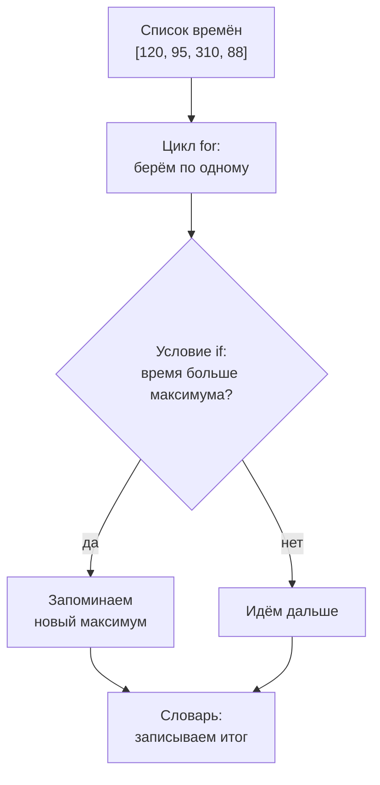

## Зачем это нужно

После нагрузочного теста у тебя не одно число, а тысячи: время каждого запроса, код каждого ответа, строка лога на каждое обращение. Посчитать среднее, найти самый медленный запрос, понять, сколько было ошибок и каких, руками нельзя. Для этого программе нужны четыре умения, и все четыре в этом уроке:

- **решать**: если код ответа 500, это ошибка, иначе нет (условия);
- **повторять**: сделать одно и то же для каждого из тысячи запросов (циклы);
- **хранить много значений**: все времена ответов в одном месте (списки);
- **хранить значения с названиями**: «200 встретился 1700 раз, 500 встретился 27 раз» (словари).

С этим набором ты посчитаешь среднее, максимум, p95 и разберёшь лог настоящего стенда. Именно такие подсчёты стоят внутри Locust и k6: они делают то же самое, только быстрее.

Шаг проекта: в `~/perf-lab/04-python/` появятся `groups.py` (сколько ответов каждой группы), `logparse.py` (разбор строк лога) и `stats.py` (среднее, максимум, p50, p95, p99 по списку времён). Всё закоммитишь в `perf-lab`.

## Что нужно знать

- Переменные, типы `int`, `float`, `str`, `bool`, `print` и f-строки, запуск скриптов, чтение трассировки ошибок: [урок 4.1](01-first-program.md). Особенно важны сравнения (`==`, `<`, `>`), которые дают `True` или `False`, и методы строк (`strip`, `replace`).
- Что такое среднее, p95 и хвост времени ответа: [урок 8.1](../08-perf-theory/01-latency-throughput.md). Там же формула «ближайшего ранга», по которой ты в этом уроке посчитаешь p95 своим кодом. Если 8.1 ещё не пройден, ничего страшного: формула повторена здесь.
- Каталог `~/perf-lab` и коммиты в нём: [тема 3](../03-git/index.md).

## Картина целиком

У кассира в магазине перед ним очередь и простой порядок действий: **взять** следующего покупателя, **посмотреть**, есть ли у него бонусная карта (если есть, скидка, если нет, полная цена), **пробить** покупки, **записать** результат в журнал смены и перейти к следующему, пока очередь не кончится. Все четыре слова из жизни кассира есть в Python:

- очередь покупателей это **список** (list): значения друг за другом, с номерами мест;
- журнал смены с записями «название, число» это **словарь** (dict);
- «если есть карта, то скидка» это **условие** (if);
- «для каждого покупателя из очереди» это **цикл** (for).



Смотри на схему: список подаёт значения в цикл, внутри цикла работает условие, а результат оседает в переменных или словаре. Почти любая обработка результатов теста выглядит так: пройти по данным, для каждого элемента что-то проверить, накопить итог.

## Теория

### Условия: if, elif, else

**Зачем это существует.** Без условий программа делала бы всегда одно и то же. Но результаты тестов разные: ответ 200 нормальный, 404 означает неверный адрес, 500 значит, что сломался сервер, и это три разные истории в отчёте. Программа должна уметь выбирать.

**Аналогия.** Светофор: если зелёный, едем; иначе, если жёлтый, тормозим; иначе стоим. Проверяются условия по очереди сверху вниз, срабатывает первое подходящее. Аналогия ломается тем, что у светофора три цвета известны заранее, а в программе условий можно написать сколько угодно.

**Как это устроено.** Условие записывается так:

```python
code = 404

if code < 400:
    print("успех")
elif code < 500:
    print("ошибка клиента")
else:
    print("ошибка сервера")
```

Разберём по частям.

- `if код < 400:` после слова `if` стоит **условие**, то есть выражение, которое даёт `True` или `False` (сравнение из урока 4.1). **Двоеточие в конце обязательно.**
- Строки под `if` сдвинуты вправо на 4 пробела. Это **блок** (block): набор строк, которые выполняются вместе. Отступ в Python не украшение, а часть языка: он говорит, какие строки принадлежат условию. Вернулся к левому краю, значит блок закончился.
- `elif` («иначе если») проверяется только если все условия выше не сработали. Таких веток можно написать много.
- `else` («иначе») срабатывает, когда не сработало ничего. Ветка `else` необязательна, `elif` тоже.

Из всех веток выполняется **не больше одной**: первая, условие которой оказалось истинным. Поэтому порядок условий важен: код 404 удовлетворяет и `< 500`, но до этого проверки дошло бы только если `< 400` не сработало.

Условия можно комбинировать тремя словами:

| Слово | Смысл | Пример | Когда `True` |
|---|---|---|---|
| `and` | «и»: верны оба | `code >= 200 and code < 300` | код в диапазоне 200-299 |
| `or` | «или»: верно хотя бы одно | `code == 502 or code == 503` | любой из двух |
| `not` | «не»: переворачивает | `not is_ready` | когда `is_ready` равно `False` |

Диапазон можно записать короче: `200 <= code < 300` читается как в математике. Есть и проверка принадлежности: `code in (502, 503, 504)` это «код входит в перечень».

**Разобранный пример.** Разделим ответы на группы и сразу посчитаем, сколько в каждой. Файл `groups.py`:

```python
codes = [200, 200, 201, 404, 200, 500, 409, 200, 503, 200]

ok = 0
client_errors = 0
server_errors = 0

for code in codes:
    if code < 400:
        ok += 1
    elif code < 500:
        client_errors += 1
    else:
        server_errors += 1

print("Успешных:", ok)
print("Ошибок клиента (4xx):", client_errors)
print("Ошибок сервера (5xx):", server_errors)

if server_errors > 0:
    print("ВНИМАНИЕ: сервер отвечал ошибками")
else:
    print("Серверных ошибок нет")
```

```text
Успешных: 6
Ошибок клиента (4xx): 2
Ошибок сервера (5xx): 2
ВНИМАНИЕ: сервер отвечал ошибками
```

Читаем: три счётчика стартуют с нуля. Цикл `for` (о нём чуть ниже) берёт по одному коду, и условие кладёт его в нужную группу. Запись `ok += 1` это короткая форма `ok = ok + 1` (так же работают `-=`, `*=`). Коды 200, 200, 201, 200, 200, 200 дают 6 успешных; 404 и 409 дают 2 ошибки клиента (запрос был неверный, и это не вина сервера); 500 и 503 дают 2 ошибки сервера (вот это уже повод бить тревогу). Последнее условие стоит уже вне цикла (у него нет отступа) и выполнится один раз.

**Что путают.**

- Пропущенное двоеточие после `if` (`SyntaxError: expected ':'`) и неправильный отступ (`IndentationError: expected an indented block`).
- `=` вместо `==` в условии: `if code = 200:` это `SyntaxError`, Python защищает от этой путаницы.
- Порядок веток: если сначала поставить `elif code < 500`, а выше не отсечь успешные, код 200 попадёт в «ошибку клиента».
- Сравнивают строку с числом (`"200" == 200` это `False`), как в 4.1.

> **Проверь понимание:** что напечатает программа при `code = 301`, если в ней ветки `if code < 300`, `elif code < 400`, `else`?

<details markdown="1">
<summary>Ответ</summary>

Сработает вторая ветка, `elif code < 400`: 301 не меньше 300 (первое условие `False`), но меньше 400. Из всех веток выполняется не больше одной, `else` пропускается.

</details>

### Списки: много значений в одном месте

**Зачем это существует.** Тысяча времён ответа не может жить в тысяче переменных `t1`, `t2`... Нужна одна «коробка», в которую можно положить много значений и обращаться к ним по номеру.

**Аналогия.** Список дел с пронумерованными пунктами. Можно спросить «что в пункте три?», добавить пункт в конец, вычеркнуть пункт. Аналогия ломается на нумерации: в Python пункты нумеруются **с нуля**, не с единицы.

**Как это устроено.** **Список** (list) создаётся квадратными скобками, значения через запятую:

```python
times = [120, 95, 310, 88, 150]
```

Позиция значения называется **индексом** (index). Первый элемент имеет индекс 0, второй 1, последний (при 5 элементах) 4. Значение берётся записью `times[0]`. Отрицательный индекс считает с конца: `times[-1]` это последний элемент, `times[-2]` предпоследний. Почему с нуля: индекс это «сколько шагов отступить от начала», а у первого элемента отступ нулевой; к этому привыкают за вечер. Если указать индекс, которого нет (`times[5]` при пяти элементах), будет ошибка `IndexError: list index out of range`.

**Срез** (slice) берёт кусок списка: `times[1:3]` даёт элементы с индексами 1 и 2, то есть правая граница **не входит**. `times[:2]` это «первые два», `times[-2:]` «последние два». Срез возвращает новый список и никогда не даёт `IndexError`: если границы выходят за список, берётся сколько есть.

Попробуй сам: двигай ползунки и смотри, какие ячейки выбираются.

<div class="viz" data-viz="py-index" data-mode="list" data-name="times" data-items='[120,95,310,88,150]' data-index="0" data-start="1" data-stop="3"></div>

Сверху индексы с нуля, снизу отрицательные. Индекс `5` и `-6` выходят за границы и показывают `IndexError`. А срез с любыми границами ошибки не даёт.

Главные действия со списками:

| Что нужно | Запись | Пример результата |
|---|---|---|
| Длина | `len(times)` | `5` |
| Добавить в конец | `times.append(200)` | список стал длиннее на один |
| Сумма, минимум, максимум | `sum(times)`, `min(times)`, `max(times)` | `763`, `88`, `310` |
| Отсортированная копия | `sorted(times)` | `[88, 95, 120, 150, 310]` |
| Есть ли значение | `310 in times` | `True` |
| Пустой список | `times = []` | для накопления |

Разница: `sorted(times)` создаёт новый отсортированный список, а `times` остаётся как был. Метод `times.append(200)`, наоборот, **меняет сам список** и ничего не возвращает: в отличие от строк (4.1), списки изменяемы. Записывать `times = times.append(200)` нельзя: `append` вернёт `None`, и список потеряется.

**Разобранный пример.** Среднее по списку руками:

```python
times = [120, 95, 310, 88, 150]
mean = sum(times) / len(times)
print(mean)
print(sorted(times))
print(times[0], times[-1])
```

```text
152.6
[88, 95, 120, 150, 310]
120 150
```

Читаем: сумма 763, элементов 5, среднее 763 / 5 = 152,6 (`/` даёт дробное). `sorted` расставил по возрастанию, исходный список не тронут, поэтому следующая строка вывела `120` (первый элемент) и `150` (последний). Среднее 152,6 не равно ни одному из измерений, а выброс 310 тянет его вверх. Об этом подробнее в 8.1.

**Что путают.**

- Индексы с единицы: `times[5]` в списке из пяти элементов не существует, последний `times[4]` или `times[-1]`.
- Правая граница среза не входит: `times[1:3]` это два элемента, не три.
- `a = b` для списков не копирует список. Обе переменные указывают на один и тот же список, и `append` через одну видно через другую (это то самое «две наклейки на одной банке» из 4.1). Копию делают так: `b = list(a)` или `b = a[:]`.
- Результат `append` присваивают переменной и получают `None`.

> **Проверь понимание:** `times = [120, 95, 310, 88, 150]`. Что даст `times[1:3]` и `times[-2:]`?

<details markdown="1">
<summary>Ответ</summary>

`times[1:3]` это `[95, 310]`: элементы с индексами 1 и 2, правая граница (3) не входит. `times[-2:]` это `[88, 150]`: последние два элемента.

</details>

### Цикл for: сделать одно и то же для каждого

**Зачем это существует.** Если нужно обработать тысячу значений, писать тысячу строк нельзя, да и количество значений заранее неизвестно. Цикл говорит: «для каждого элемента повтори этот блок».

**Аналогия.** Кассир берёт покупателей из очереди по одному, пока очередь не опустеет. Аналогия ломается тем, что у кассира есть выбор «сегодня закончить пораньше», а цикл `for` не остановится, пока не обойдёт всё (кроме случая `break`, о нём дальше).

**Как это устроено.** Запись:

```python
for t in times:
    print(t)
```

`for t in times:` значит «для каждого значения из `times`: положи его в переменную `t` и выполни блок». Имя `t` выбираешь ты. Блок (строки с отступом) выполняется один раз на каждый элемент. Цикл заканчивается сам, когда элементы кончились, и программа идёт дальше, к строке без отступа.

Вспомогательные средства:

- `range(n)` даёт числа от 0 до n-1: `for i in range(3)` выполнит блок для 0, 1, 2. Используется, когда нужно «повторить N раз». `range(2, 5)` даёт 2, 3, 4 (конец не входит, как в срезе).
- `enumerate(times)` отдаёт пары «номер и значение»: `for i, t in enumerate(times):` даёт `i` равное 0, 1, 2, ... и `t` равное соответствующему времени. Нужен, когда важен номер.
- `break` прерывает цикл досрочно, `continue` пропускает остаток текущего шага и переходит к следующему элементу.

Типовой приём называется **накопитель** (accumulator): перед циклом создаём переменную с начальным значением (`total = 0`), а внутри цикла обновляем (`total = total + t`). Так считают суммы, счётчики и максимумы.

**Разобранный пример.** Найдём сумму, максимум и среднее для четырёх времён. Нажми «Шаг ▶» и следи, как меняются `total`, `longest` и `t`. Каждая строка цикла выполняется четыре раза, и это видно по подсветке.

<div class="viz" data-viz="py-trace" data-title="Цикл for с накопителем и условием" data-speed="1800" data-code='["times = [120, 95, 310, 88]","total = 0","longest = 0","for t in times:","    total = total + t","    if t > longest:","        longest = t","mean = total / len(times)","print(f\"среднее {mean}, максимум {longest}\")"]' data-steps='[{"l":1,"v":{"times":"[120, 95, 310, 88]"},"n":"Список из четырёх времён ответа в миллисекундах."},{"l":2,"v":{"times":"[120, 95, 310, 88]","total":"0"},"n":"Накопитель суммы создаётся ДО цикла и стартует с нуля."},{"l":3,"v":{"times":"[120, 95, 310, 88]","total":"0","longest":"0"},"n":"Накопитель максимума: пока самое большое значение равно нулю."},{"l":4,"v":{"times":"[120, 95, 310, 88]","total":"0","longest":"0","t":"120"},"n":"Начало круга: переменная `t` получает следующий элемент списка. Когда элементы кончатся, цикл завершится."},{"l":5,"v":{"times":"[120, 95, 310, 88]","total":"120","longest":"0","t":"120"},"n":"К сумме прибавляется текущее время. Эта строка выполняется на каждом круге."},{"l":6,"v":{"times":"[120, 95, 310, 88]","total":"120","longest":"0","t":"120"},"n":"Условие: текущее время больше найденного максимума?"},{"l":7,"v":{"times":"[120, 95, 310, 88]","total":"120","longest":"120","t":"120"},"n":"Условие сработало: запоминаем новый максимум. На других кругах эта строка пропускается."},{"l":4,"v":{"times":"[120, 95, 310, 88]","total":"120","longest":"120","t":"95"},"n":"Начало круга: переменная `t` получает следующий элемент списка. Когда элементы кончатся, цикл завершится."},{"l":5,"v":{"times":"[120, 95, 310, 88]","total":"215","longest":"120","t":"95"},"n":"К сумме прибавляется текущее время. Эта строка выполняется на каждом круге."},{"l":6,"v":{"times":"[120, 95, 310, 88]","total":"215","longest":"120","t":"95"},"n":"Условие: текущее время больше найденного максимума?"},{"l":4,"v":{"times":"[120, 95, 310, 88]","total":"215","longest":"120","t":"310"},"n":"Начало круга: переменная `t` получает следующий элемент списка. Когда элементы кончатся, цикл завершится."},{"l":5,"v":{"times":"[120, 95, 310, 88]","total":"525","longest":"120","t":"310"},"n":"К сумме прибавляется текущее время. Эта строка выполняется на каждом круге."},{"l":6,"v":{"times":"[120, 95, 310, 88]","total":"525","longest":"120","t":"310"},"n":"Условие: текущее время больше найденного максимума?"},{"l":7,"v":{"times":"[120, 95, 310, 88]","total":"525","longest":"310","t":"310"},"n":"Условие сработало: запоминаем новый максимум. На других кругах эта строка пропускается."},{"l":4,"v":{"times":"[120, 95, 310, 88]","total":"525","longest":"310","t":"88"},"n":"Начало круга: переменная `t` получает следующий элемент списка. Когда элементы кончатся, цикл завершится."},{"l":5,"v":{"times":"[120, 95, 310, 88]","total":"613","longest":"310","t":"88"},"n":"К сумме прибавляется текущее время. Эта строка выполняется на каждом круге."},{"l":6,"v":{"times":"[120, 95, 310, 88]","total":"613","longest":"310","t":"88"},"n":"Условие: текущее время больше найденного максимума?"},{"l":4,"v":{"times":"[120, 95, 310, 88]","total":"613","longest":"310","t":"88"},"n":"Начало круга: переменная `t` получает следующий элемент списка. Когда элементы кончатся, цикл завершится."},{"l":8,"v":{"times":"[120, 95, 310, 88]","total":"613","longest":"310","t":"88","mean":"153.25"},"n":"Цикл закончился (строка без отступа). Среднее: сумма делим на число элементов."},{"l":9,"v":{"times":"[120, 95, 310, 88]","total":"613","longest":"310","t":"88","mean":"153.25"},"o":"среднее 153.25, максимум 310","n":"Печатаем итог: среднее 153,25 и максимум 310."}]' data-try="смотри на longest: он меняется только на первом и третьем круге. Вернись назад ползунком и найди эти шаги."></div>

На каждом круге `t` получает следующее значение списка, `total` растёт, а `longest` меняется только на тех кругах, где условие `t > longest` истинно (первый круг и третий, когда пришло 310). После цикла строки без отступа выполняются один раз.

Расшифровка: общая сумма 613, делим на 4 элемента, среднее 153,25; максимум 310. Видишь, что без условия внутри цикла максимум не найти, а без накопителя перед циклом нечем накапливать: так и сочетаются все умения урока.

**Что путают.**

- Забыли двоеточие или отступ в цикле: `SyntaxError` или `IndentationError`.
- Накопитель создали **внутри** цикла: `total = 0` на каждом круге обнуляет сумму, и в конце `total` равен последнему элементу.
- Изменяют список, по которому идут циклом (удаляют элементы на ходу): результат сбивает с толку. Для таких задач строят новый список.
- `range(5)` даёт числа 0-4, пятёрки в нём нет.

> **Проверь понимание:** сколько раз выполнится тело цикла `for i in range(3):` и какие значения получит `i`?

<details markdown="1">
<summary>Ответ</summary>

Три раза, значения `0`, `1`, `2`. `range(3)` начинает с нуля, а конец (3) не включает.

</details>

### Цикл while: повторять, пока условие верно

**Зачем это существует.** Иногда заранее неизвестно, сколько повторов понадобится: «ждать, пока стенд ответит», «читать, пока не кончится файл». Тогда вместо перебора готового набора нужно повторять, пока выполняется условие.

**Как это устроено.** Запись `while условие:` и блок с отступом. Перед каждым кругом условие проверяется; если оно `True`, блок выполняется ещё раз, если `False`, цикл завершается:

```python
attempt = 0
while attempt < 3:
    attempt += 1
    print("попытка", attempt)
print("готово")
```

```text
попытка 1
попытка 2
попытка 3
готово
```

Читаем: до первого круга `attempt` равен 0, условие `0 < 3` истинно, блок прибавляет единицу и печатает 1. После третьего круга `attempt` равен 3, условие `3 < 3` ложно, и цикл заканчивается.

Опасность `while`: если в блоке условие никогда не станет ложным, цикл **бесконечный** и программа зависнет. Остановить её можно сочетанием `Ctrl+C` в терминале. Поэтому внутри `while` всегда должно что-то меняться (счётчик растёт, данные кончаются) или стоять `break`. В этой теме `for` пригодится в 95% случаев, а `while` для попыток и ожидания.

**Что путают.** Забывают изменить переменную из условия (`attempt += 1`), и получают бесконечный цикл; `while True:` без `break` по той же причине.

> **Проверь понимание:** что произойдёт, если в примере выше убрать строку `attempt += 1`?

<details markdown="1">
<summary>Ответ</summary>

`attempt` навсегда останется 0, условие `0 < 3` всегда истинно, цикл бесконечный: терминал будет заполняться словами «попытка 0». Остановить: `Ctrl+C`.

</details>

### Словари: значения с названиями

**Зачем это существует.** Список хранит значения по номерам, а номер не говорит, что внутри. Ответ сервера на запрос товара состоит из названия, цены, остатка: удобно спросить «цена», а не «что в позиции 2». И счётчики по кодам ответа («200 встретился 1700 раз, 500 встретился 27 раз») это тоже пары «название и число».

**Аналогия.** Телефонная книга: ищешь по имени, а не по номеру страницы. Каждой записи соответствует ключ (имя) и значение (телефон). Аналогия ломается на порядке: в книге записи по алфавиту, а словарь Python помнит порядок добавления, и обращаться по месту нельзя, только по ключу.

**Как это устроено.** **Словарь** (dict, dictionary) пишется в фигурных скобках, пары «ключ: значение» через запятую:

```python
product = {"id": 17, "name": "Товар 17", "price": 729.0, "stock": 1000000}
```

Значение берётся по ключу в квадратных скобках: `product["price"]` даёт `729.0`. Ключи в одном словаре уникальны. Чаще всего ключами служат строки и числа (например код ответа 200). Значением может быть что угодно, включая список или другой словарь.

Действия со словарями:

| Что нужно | Запись | Что делает |
|---|---|---|
| Прочитать | `product["price"]` | значение, а если ключа нет, ошибка `KeyError` |
| Прочитать безопасно | `product.get("discount", 0)` | значение или запасное (здесь 0), без ошибки |
| Записать или изменить | `product["stock"] = 5` | добавляет пару или заменяет значение |
| Есть ли ключ | `"price" in product` | `True` или `False` |
| Все ключи / значения / пары | `.keys()`, `.values()`, `.items()` | для цикла |

Покажи на словаре, что будет с запросом отсутствующего ключа:

<div class="viz" data-viz="py-index" data-mode="dict" data-name="product" data-items='{"id":17,"name":"Товар 17","price":729.0,"stock":1000000}' data-missing="discount"></div>

Обращение `product["discount"]` останавливает программу ошибкой `KeyError`, а `product.get("discount", 0)` спокойно возвращает запасное значение. В тестах ответа сервера всегда спрашивай через `.get`, если поле может отсутствовать.

**Счётчик по кодам ответа** это главный рабочий приём. Для каждого кода нужно «прибавить единицу к его счётчику, а если кода ещё не было, начать с нуля». Это решает `.get`:

```python
codes = {}
for code in [200, 404, 200]:
    codes[code] = codes.get(code, 0) + 1
print(codes)
```

```text
{200: 2, 404: 1}
```

Пройдём по шагам, нажимая «Шаг ▶»:

<div class="viz" data-viz="py-trace" data-title="Словарь-счётчик кодов ответа" data-speed="1800" data-code='["codes = {}","for code in [200, 404, 200]:","    codes[code] = codes.get(code, 0) + 1","print(codes)"]' data-steps='[{"l":1,"v":{"codes":"{}"},"n":"Пустой словарь: пока ни одного кода."},{"l":2,"v":{"codes":"{}","code":"200"},"n":"Берём следующий код ответа из списка."},{"l":3,"v":{"codes":"{200: 1}","code":"200"},"n":"`get` берёт текущий счётчик кода (или 0, если кода ещё не было), прибавляем 1 и записываем обратно."},{"l":2,"v":{"codes":"{200: 1}","code":"404"},"n":"Берём следующий код ответа из списка."},{"l":3,"v":{"codes":"{200: 1, 404: 1}","code":"404"},"n":"`get` берёт текущий счётчик кода (или 0, если кода ещё не было), прибавляем 1 и записываем обратно."},{"l":2,"v":{"codes":"{200: 1, 404: 1}","code":"200"},"n":"Берём следующий код ответа из списка."},{"l":3,"v":{"codes":"{200: 2, 404: 1}","code":"200"},"n":"`get` берёт текущий счётчик кода (или 0, если кода ещё не было), прибавляем 1 и записываем обратно."},{"l":2,"v":{"codes":"{200: 2, 404: 1}","code":"200"},"n":"Берём следующий код ответа из списка."},{"l":4,"v":{"codes":"{200: 2, 404: 1}","code":"200"},"o":"{200: 2, 404: 1}","n":"Цикл закончился, печатаем словарь: 200 встретился два раза, 404 один раз."}]' data-try="найди шаг, где в словаре появляется ключ 404, и шаг, где счётчик 200 растёт с 1 до 2."></div>

При коде 200 первый раз `get` не находит ключ, возвращает 0, и записывается `{200: 1}`. Второй раз находит 1 и записывает 2. Ключ 404 появляется ровно тогда, когда встретился впервые.

Чтобы пройти по словарю: `for code, n in codes.items():` даёт на каждом круге пару «ключ и значение». Обычный `for code in codes:` даёт только ключи.

**Разобранный пример.** Из словаря `codes = {200: 1700, 404: 12, 500: 27}` посчитаем общее число ответов и долю ошибок:

```python
codes = {200: 1700, 404: 12, 500: 27}
total = 0
errors = 0
for code, n in codes.items():
    total += n
    if code >= 400:
        errors += n
print(total, errors)
print(f"Ошибок: {errors / total * 100:.1f}%")
```

```text
1739 39
Ошибок: 2.2%
```

Читаем: на первом круге `code` равен 200, `n` равен 1700; ошибкой это не считается. На втором и третьем к `errors` добавляются 12 и 27. Всего 1739 ответов, из них 39 с кодом 400 и выше, это 39 / 1739 = 2,2%. Видишь связь с 4.1: те же переменные, f-строка и формат.

**Что путают.**

- `KeyError` на обращении к отсутствующему ключу, вместо `.get`.
- Ключ `"200"` (строка) и ключ `200` (число) это два разных ключа. В JSON ключи всегда строки (это важно в [уроке 4.4](04-files-json-csv.md)).
- Словарь не упорядочивают по месту: `codes[0]` ищет **ключ** 0, а не первую пару.
- Изменяют словарь в цикле по нему же: Python остановит с `RuntimeError`.

> **Проверь понимание:** `stock = {"apple": 5}`. Что вернёт `stock.get("pear", 0)` и что вернёт `stock["pear"]`?

<details markdown="1">
<summary>Ответ</summary>

Первое вернёт `0`: ключа нет, берётся запасное значение. Второе упадёт с `KeyError: 'pear'`.

</details>

### Кортежи и множества: коротко

Два типа встретятся в чужом коде, и их нужно узнавать.

**Кортеж** (tuple) это список, который нельзя изменить после создания. Пишется в круглых скобках: `size = (1280, 720)`. Индексируется так же, как список: `size[0]`. Используется для фиксированных наборов: пары «ключ и значение» в `.items()` это кортежи, а список кодов, при которых нужно ударить тревогу, удобно записать `ALERT_CODES = (500, 502, 503)`.

**Множество** (set) это набор уникальных значений без порядка. Пишется в фигурных скобках без двоеточий: `{200, 404, 200}` даст `{200, 404}`: повтор исчез. Удобно, чтобы узнать, какие разные значения вообще встречались: `set(codes)` из списка кодов даст набор различных. Проверка `x in множество` работает очень быстро. Пустое множество пишется `set()`, потому что `{}` это пустой словарь.

### Разбор строки лога: split

В [4.1](01-first-program.md) мы чистили строку и вырезали кусочки, а как разрезать строку на поля? Метод `split()` делит текст по пробелам и возвращает **список** слов:

```python
line = "GET /api/products 200 42ms"
parts = line.split()
print(parts)
print(parts[2], parts[3])
```

```text
['GET', '/api/products', '200', '42ms']
200 42ms
```

Читаем: четыре слова, нумерация с нуля: метод это `parts[0]`, путь `parts[1]`, код `parts[2]`, время `parts[3]`. Все элементы текстовые, поэтому `'200'` в кавычках: превратить его в число нужно через `int()`. А у `'42ms'` ещё нужно убрать суффикс `ms` (`replace`). Если нужно резать по другому символу, он указывается в скобках: `"a,b,c".split(",")` даёт `['a', 'b', 'c']`.

Целиком разбор лога (цикл, `split`, словарь-счётчик, условие) ты напишешь в практике: файл `logparse.py`. Основа та же: на каждой строке `split()`, потом `int()` для кода и времени, потом счётчик в словаре.

### Процентиль руками: p95 без библиотек

**Зачем это существует.** Среднее скрывает хвост, и в отчёте про нагрузку нужен p95 (в [8.1](../08-perf-theory/01-latency-throughput.md) подробно, почему). У Python нет встроенной функции p95, но с тем, что ты знаешь, считается за четыре строки.

**Как это устроено.** Метод «ближайшего ранга» из 8.1: отсортировать, посчитать ранг `⌈p / 100 × n⌉` (скобки ⌈ ⌉ в математике значат «округлить вверх до целого»: ⌈18,2⌉ = 19), взять элемент на месте `ранг` (места считаются с единицы, поэтому индекс на единицу меньше).

Округление вверх можно сделать без дополнительных модулей. Целочисленное деление `//` отбрасывает дробь, то есть округляет вниз: `1900 // 100` даёт 19, `1951 // 100` тоже 19. Чтобы получить округление вверх, перед делением на 100 прибавляют 99. Остаток от деления на 100 бывает от 0 до 99. Если остатка нет, прибавка 99 не добирается до следующей сотни и результат не меняется: `(1900 + 99) // 100 = 19`. Если остаток хотя бы 1, прибавка 99 переваливает через сотню, и результат растёт на единицу: `(1901 + 99) // 100 = 20`. Прибавка 100 не подошла бы: она подняла бы на единицу и точное `1900`. Итого `(p * n + 99) // 100` это «поделить на 100 с округлением вверх». Проверка на 20 элементах и p = 95: `95 * 20 = 1900`, `1900 + 99 = 1999`, `1999 // 100 = 19`. Ранг 19, индекс 18. Сходится с формулой `⌈0,95 × 20⌉ = 19` из 8.1. В [уроке 4.3](03-functions-errors.md) то же самое сделает готовая функция `math.ceil`.

**Разобранный пример.** Основа `stats.py` (полный файл в практике). Берём те же 20 значений, что в 8.1:

```python
times = [12, 13, 13, 14, 14, 15, 15, 15, 16, 16, 17, 17, 18, 19, 20, 22, 25, 31, 48, 410]
count = len(times)
ordered = sorted(times)
p95 = ordered[(95 * count + 99) // 100 - 1]
print(p95)
```

```text
48
```


Читаем: `sorted` расставил значения по возрастанию, `(95 * 20 + 99) // 100` дало ранг 19, минус 1 даёт индекс 18, и там стоит 48. Это то же число, что в разборе 8.1. Остальные перцентили считаются той же строкой с другим первым числом: полный `stats.py` ты запустишь в практике.

А теперь посмотри, как выглядит та же картина «среднее против хвоста» на 100 запросах, где часть тормозит:

<div class="viz" data-viz="percentiles" data-slow="5" data-slow-ms="1500"></div>

Смотри на виджет: при 5% медленных запросов среднее лежит далеко от p50, а p95 и p99 показывают хвост. Твой `stats.py` считает те же числа по твоим данным. В [уроке 4.3](03-functions-errors.md) этот код превратится в функцию `percentile(values, p)`, которую можно будет применять к любому списку.

**Что путают.** Индекс на единицу меньше ранга: `ordered[rank - 1]`. Считают перцентиль по несортированному списку. Делят целочисленно там, где нужна дробь (`//` вместо `/`). И главное: считают p95 на пяти измерениях и верят цифре: для p95 нужны сотни значений, для p99 тысячи.

> **Проверь понимание:** сколько будет `(95 * 10 + 99) // 100` и какой это ранг для p95 при десяти измерениях?

<details markdown="1">
<summary>Ответ</summary>

`95 * 10 = 950`, `950 + 99 = 1049`, `1049 // 100 = 10`. Ранг 10, то есть p95 на десяти измерениях это самое большое значение (индекс 9). Для малой выборки p95 совпадает с максимумом: значит, он ничего нового не говорит.

</details>

## Практика

Все файлы создавай в `~/perf-lab/04-python/`. Для каждого: `nano имя.py`, вставь код, сохрани, затем `python3 имя.py`.

```bash
cd ~/perf-lab/04-python
```

### 1. Группы ответов: `groups.py`

Открой файл и вставь код (он тот же, что в разборе выше):

```bash
nano groups.py
```

```python
codes = [200, 200, 201, 404, 200, 500, 409, 200, 503, 200]

ok = 0
client_errors = 0
server_errors = 0

for code in codes:
    if code < 400:
        ok += 1
    elif code < 500:
        client_errors += 1
    else:
        server_errors += 1

print("Успешных:", ok)
print("Ошибок клиента (4xx):", client_errors)
print("Ошибок сервера (5xx):", server_errors)

if server_errors > 0:
    print("ВНИМАНИЕ: сервер отвечал ошибками")
else:
    print("Серверных ошибок нет")
```

Запусти и сверь вывод:

```bash
python3 groups.py
```

```text
Успешных: 6
Ошибок клиента (4xx): 2
Ошибок сервера (5xx): 2
ВНИМАНИЕ: сервер отвечал ошибками
```

Теперь поменяй в списке `500` и `503` на `200` и запусти ещё раз: последняя строка станет «Серверных ошибок нет».

**Как читать вывод:** первые три строки это счётчики, последняя результат условия после цикла. Если сумма трёх чисел не равна длине списка (10), в условиях есть дыра: подсчитай сам.

### 2. Разбор лога: `logparse.py`

Строки лога стенда: метод, путь, код ответа, время. Для каждой строки режем её на слова, превращаем код и время в числа, считаем коды в словаре и отбираем медленные запросы.

```bash
nano logparse.py
```

```python
# Строки лога: метод, путь, код ответа, время
lines = [
    "GET /api/products 200 42ms",
    "GET /api/products/17 200 18ms",
    "POST /api/cart/items 201 35ms",
    "GET /api/products/99999 404 9ms",
    "POST /api/orders 201 230ms",
    "GET /api/products 200 51ms",
    "POST /api/orders 500 1204ms",
    "GET /api/cart 200 14ms",
    "POST /api/orders 409 27ms",
    "GET /api/products 200 47ms",
]

codes = {}          # код ответа -> сколько раз встретился
times = []          # время каждого запроса, мс
slow = []           # строки медленнее 200 мс

for line in lines:
    parts = line.split()
    method = parts[0]
    path = parts[1]
    code = int(parts[2])
    ms = int(parts[3].replace("ms", ""))

    times.append(ms)
    codes[code] = codes.get(code, 0) + 1
    if ms > 200:
        slow.append(f"{method} {path} {ms} мс")

errors = 0
for code, n in codes.items():
    if code >= 400:
        errors = errors + n

print("Коды ответа:", codes)
print(f"Ошибок (код 400 и выше): {errors} из {len(lines)}")
print("Медленные запросы:")
for item in slow:
    print("  ", item)
```

```bash
python3 logparse.py
```

```text
Коды ответа: {200: 5, 201: 2, 404: 1, 500: 1, 409: 1}
Ошибок (код 400 и выше): 3 из 10
Медленные запросы:
   POST /api/orders 230 мс
   POST /api/orders 1204 мс
```

**Как читать вывод:** словарь показывает, сколько ответов каждого кода (5 раз 200, 2 раза 201 и так далее), порядок ключей по первому появлению. Три ошибки из десяти: 404, 500, 409. Медленных (больше 200 мс) два, и оба относятся к оформлению заказа `POST /api/orders`: это ровно то место, которое болит в нагрузочных тестах магазина.

Измени порог в условии: `ms > 200` на `ms > 40`, и посмотри, как вырастет список медленных запросов.

**Типичные ошибки:**

- `IndexError: list index out of range` на строке `parts[3]`: в списке `lines` затесалась строка с меньшим числом слов (пустая строка, строка без времени). `split()` пустой строки даёт пустой список. Реальный лог всегда содержит странности, и в [уроке 4.3](03-functions-errors.md) ты научишься их обрабатывать.
- `ValueError: invalid literal for int() with base 10: '42ms'`: забыл `.replace("ms", "")`.
- `TypeError: unsupported operand type(s) for +: 'int' and 'str'`: пытаешься складывать число со строкой из лога, не превратив её через `int()`.

### 3. Статистика: `stats.py`

Среднее, минимум, максимум и три перцентиля по двадцати значениям из 8.1.

```bash
nano stats.py
```

```python
# Время ответа 20 запросов, мс
times = [12, 13, 13, 14, 14, 15, 15, 15, 16, 16, 17, 17, 18, 19, 20, 22, 25, 31, 48, 410]

count = len(times)
total = 0
for t in times:
    total = total + t
mean = total / count

ordered = sorted(times)
p50 = ordered[(50 * count + 99) // 100 - 1]
p95 = ordered[(95 * count + 99) // 100 - 1]
p99 = ordered[(99 * count + 99) // 100 - 1]

print(f"Запросов: {count}")
print(f"Среднее:  {mean:.1f} мс")
print(f"Минимум:  {min(times)} мс")
print(f"p50:      {p50} мс")
print(f"p95:      {p95} мс")
print(f"p99:      {p99} мс")
print(f"Максимум: {max(times)} мс")
```

```bash
python3 stats.py
```

```text
Запросов: 20
Среднее:  38.5 мс
Минимум:  12 мс
p50:      16 мс
p95:      48 мс
p99:      410 мс
Максимум: 410 мс
```

Сверь с 8.1: p50 16 мс, p95 48 мс, p99 410 мс (на двадцати измерениях совпал с максимумом). Для p50 ранг `(50 * 20 + 99) // 100 = 10`, индекс 9, значение 16. Затем добавь в список значение `500` (теперь их 21) и запусти снова. Среднее станет `60.5`, p50 `17`, p95 `410`, p99 `500`. Проверь ожидаемое вручную: ранг p95 теперь `(95 * 21 + 99) // 100 = 20`, элемент на индексе 19 отсортированного списка (длина 21) это 410. А p99: `(99 * 21 + 99) // 100 = 21`, индекс 20, это 500. Один дополнительный выброс заметно меняет хвост.

**Как читать вывод:** сравни среднее и p50. Если среднее заметно больше медианы, в данных есть длинный хвост. Это тот самый случай, ради которого мы считаем перцентили.

### 4. Коммит

```bash
cd ~/perf-lab
git add 04-python
git commit -m "4.2: условия, циклы, списки, словари, статистика"
git push
```

## Сломай и почини

**Поломка.** Файл `broken2.py`:

```python
times = [120, 95, 310]
print(times[3])

codes = {200: 5}
print(codes[404])

n = 0
while n < 3:
    print("круг", n)
```

**Задача.** Запусти его и пройди все три проблемы по очереди. Первую ошибку Python покажет и остановится. Исправляй по одной и запускай снова, пока не доберёшься до третьей, и тогда остановишь программу `Ctrl+C`. Для каждой проблемы запиши в одну фразу, что произошло, и исправь так, чтобы программа дошла до конца.

<details markdown="1">
<summary>Разбор</summary>

**1. IndexError.**

```text
Traceback (most recent call last):
  File "/home/student/perf-lab/04-python/broken2.py", line 2, in <module>
    print(times[3])
          ~~~~~^^^
IndexError: list index out of range
```

В списке три элемента с индексами 0, 1, 2, индекса 3 нет. Исправление: `times[2]` или `times[-1]` для последнего. Если нужно безопасно, сначала проверь `if len(times) > 3:`.

**2. KeyError.**

```text
Traceback (most recent call last):
  File "/home/student/perf-lab/04-python/broken2.py", line 5, in <module>
    print(codes[404])
          ~~~~~^^^^^
KeyError: 404
```

Ключа 404 в словаре нет: никто не получил такой ответ. Сообщение называет сам отсутствующий ключ. Исправление: `codes.get(404, 0)`, тогда выведется 0.

**3. Бесконечный цикл.** После исправления двух ошибок терминал заполняется строками `круг 0`, `круг 0`, `круг 0` без конца: переменная `n` нигде не меняется, условие `n < 3` вечно истинно. Остановка: `Ctrl+C`. Python при этом выведет `KeyboardInterrupt`: это не ошибка в программе, а сигнал, что ты прервал её сам. Исправление: добавить в цикл строку `n += 1`.

Что запомнить: две ошибки останавливают программу и называют место, а третья молча крутится. Если скрипт «завис», это почти всегда цикл, где не меняется то, что в условии. Привычка: перед запуском `while` проверь, что внутри что-то приближает его конец.

</details>

## Словарик урока

| Термин | Простыми словами |
|---|---|
| Условие (condition) | Выражение, которое даёт `True` или `False` и по которому программа выбирает ветку |
| `if` / `elif` / `else` | «если» / «иначе если» / «иначе»: выполняется первая подходящая ветка |
| Блок (block) | Строки с одинаковым отступом (4 пробела), которые выполняются вместе |
| Список (list) | Упорядоченный набор значений с номерами, изменяемый: `[120, 95, 310]` |
| Индекс (index) | Номер элемента списка, начинается с 0; `-1` это последний |
| Срез (slice) | Кусок списка `times[1:3]`; правая граница не входит |
| Цикл `for` | Повторяет блок для каждого элемента набора |
| Цикл `while` | Повторяет блок, пока условие истинно; без изменения условия бесконечен |
| Накопитель (accumulator) | Переменная, которую обновляют в цикле: сумма, счётчик, максимум |
| Словарь (dict) | Набор пар «ключ: значение», обращение по ключу: `product["price"]` |
| Ключ (key) | Название, по которому ищут значение в словаре |
| `.get(ключ, запасное)` | Безопасное чтение из словаря: без ошибки, если ключа нет |
| Кортеж (tuple) | Неизменяемый список в круглых скобках |
| Множество (set) | Набор уникальных значений без порядка |
| `split()` | Метод строки: режет текст на список слов |
| Перцентиль (percentile) | Значение, не больше которого заданная доля измерений; p95 это 95% |

## Вопросы с собеседований

Раздел для повторения: ответь вслух, потом открой ответ. Последние четыре помечены `[на скорость]`.

### 1. [junior] [часто] Чем список отличается от словаря и когда что использовать?

<details markdown="1">
<summary>Ответ</summary>

Список хранит упорядоченные значения, доступ по номеру (индексу): подходит для ряда однотипных значений, например времён ответа. Словарь хранит пары «ключ: значение», доступ по ключу: подходит для данных с названиями полей (ответ сервера, счётчики по кодам). Список изменяемый и упорядоченный, ключи словаря уникальны.

**Что хотят услышать:** доступ по номеру против доступа по ключу и пример для каждого.

**Красный флаг:** «словарь это такой список».

</details>

### 2. [junior] [часто] С какого числа начинается индекс списка и что такое отрицательный индекс?

<details markdown="1">
<summary>Ответ</summary>

С нуля: первый элемент `a[0]`. Отрицательный индекс считает с конца: `a[-1]` последний элемент, `a[-2]` предпоследний. Индекс за пределами списка даёт `IndexError`.

**Что хотят услышать:** ноль, `-1` и `IndexError`.

**Красный флаг:** считает, что первый элемент имеет индекс 1.

</details>

### 3. [junior] [часто] Как посчитать среднее и найти максимум в списке времён?

<details markdown="1">
<summary>Ответ</summary>

Встроенными функциями: `sum(times) / len(times)` и `max(times)`. Если нужно понимать механизм, то циклом: накопитель `total = 0`, внутри `total += t`, максимум через условие `if t > longest: longest = t`. Деление на `len`, а не на жёстко заданное число.

**Что хотят услышать:** оба способа и накопитель.

**Красный флаг:** создаёт накопитель внутри цикла.

</details>

### 4. [junior] Что такое срез и что делает `a[1:3]`?

<details markdown="1">
<summary>Ответ</summary>

Срез это новый список из куска исходного. `a[1:3]` берёт элементы с индексами 1 и 2: левая граница входит, правая нет. `a[:2]` первые два, `a[-2:]` последние два. Срез не даёт `IndexError` при выходе за границы.

**Что хотят услышать:** правая граница не входит, срез возвращает новый список.

**Красный флаг:** считает, что `a[1:3]` берёт три элемента.

</details>

### 5. [junior] Чем `for` отличается от `while`?

<details markdown="1">
<summary>Ответ</summary>

`for` обходит готовый набор (список, словарь, `range`) и сам заканчивается, когда элементы кончились. `while` повторяется, пока условие истинно, и заканчивается только когда оно станет ложным или сработает `break`. `while` рискует стать бесконечным.

**Что хотят услышать:** «перебор набора» против «повторять по условию» и риск бесконечности.

**Красный флаг:** «`while` лучше, он универсальный».

</details>

### 6. [junior] В чём разница между `d["key"]` и `d.get("key")`?

<details markdown="1">
<summary>Ответ</summary>

Квадратные скобки при отсутствии ключа бросают `KeyError`. `get` возвращает `None` или запасное значение, которое можно передать вторым аргументом (`d.get("key", 0)`). `get` удобен для необязательных полей и для счётчиков.

**Что хотят услышать:** `KeyError` и запасное значение.

**Красный флаг:** не знает про `get`.

</details>

### 7. [middle] Как посчитать, сколько раз встретился каждый код ответа?

<details markdown="1">
<summary>Ответ</summary>

Словарём-счётчиком: `counts = {}`, в цикле `counts[code] = counts.get(code, 0) + 1`. `get` возвращает 0 для нового кода, и запись создаёт ключ. Есть готовый `collections.Counter`, но механизм через словарь стоит знать.

**Что хотят услышать:** `get` с нулём как запасное значение.

**Красный флаг:** проверяет все возможные коды отдельными `if`.

</details>

### 8. [middle] Почему после `b = a` изменение `b` меняет и `a` (для списков)?

<details markdown="1">
<summary>Ответ</summary>

Присваивание не копирует список, оно привязывает второе имя к тому же списку. Изменение через любое имя видно через другое. Для независимой копии: `b = list(a)`, `b = a[:]` или `b = a.copy()`. Для чисел и строк этого не заметно, потому что они неизменяемы.

**Что хотят услышать:** «одно значение, два имени» и способы копирования.

**Красный флаг:** уверен, что `=` всегда копирует.

</details>

### 9. [middle] Как вручную посчитать p95 и почему на малой выборке он бесполезен?

<details markdown="1">
<summary>Ответ</summary>

Отсортировать значения, посчитать ранг `⌈0,95 × n⌉`, взять элемент с этим рангом (индекс на единицу меньше). На 10 измерениях ранг равен 10, то есть p95 это максимум и не несёт новой информации. Для p95 нужны сотни измерений, для p99 тысячи.

**Что хотят услышать:** сортировка, ранг с округлением вверх, смещение индекса и размер выборки.

**Красный флаг:** считает перцентиль по несортированным данным.

</details>

### 10. [middle] Зачем в циклах нужны `break` и `continue`?

<details markdown="1">
<summary>Ответ</summary>

`break` полностью выходит из цикла (например нашли первую ошибку, дальше смотреть незачем, или наступил нужный момент ожидания). `continue` пропускает остаток текущего круга и идёт к следующему элементу (например пропустить пустую строку лога).

**Что хотят услышать:** различие «выйти совсем» и «пропустить один круг».

**Красный флаг:** путает их местами.

</details>

### 11. [на скорость] Что даёт `list(range(3))`?

<details markdown="1">
<summary>Ответ</summary>

`[0, 1, 2]`: начинается с нуля, конец не входит.

**Что хотят услышать:** без запинки.

**Красный флаг:** отвечает `[1, 2, 3]`.

</details>

### 12. [на скорость] Как остановить зависшую программу в терминале?

<details markdown="1">
<summary>Ответ</summary>

`Ctrl+C`. Python выведет `KeyboardInterrupt`.

**Что хотят услышать:** сочетание и название исключения.

**Красный флаг:** закрывает окно терминала.

</details>

### 13. [на скорость] Какая ошибка при `[1, 2, 3][3]` и какая при `{"a": 1}["b"]`?

<details markdown="1">
<summary>Ответ</summary>

Первая `IndexError: list index out of range`, вторая `KeyError: 'b'`.

**Что хотят услышать:** оба имени и отличие «индекс» и «ключ».

**Красный флаг:** называет обе `IndexError`.

</details>

### 14. [на скорость] Какое будет значение `x` после `x = 5; x += 2; x *= 3`?

<details markdown="1">
<summary>Ответ</summary>

21: сначала 5 + 2 = 7, потом 7 * 3 = 21.

**Что хотят услышать:** `+=` это «прибавить к текущему».

**Красный флаг:** отвечает 15.

</details>

## Проверено на версиях

Python 3.12.3 (Ubuntu 24.04) и новее. Формат сообщений об ошибках (стрелки `^^^`, тильды `~~~`) такой, как у Python 3.12 и новее. Октябрь 2026.

## Итог урока: ты умеешь

- [ ] Написать условие `if/elif/else`, комбинировать условия через `and`, `or`, `not`.
- [ ] Создать список, взять элемент по индексу (в том числе отрицательному) и срез.
- [ ] Посчитать сумму, максимум, среднее и отсортировать список.
- [ ] Обойти список циклом `for`, использовать накопитель, `range` и `enumerate`.
- [ ] Написать `while` и остановить бесконечный цикл через `Ctrl+C`.
- [ ] Создать словарь, читать значения безопасно через `.get`, считать частоты кодов ответа.
- [ ] Разрезать строку лога через `split()` и превратить поля в числа.
- [ ] Посчитать p50, p95, p99 вручную по методу ближайшего ранга.
- [ ] Прочитать ошибки `IndexError` и `KeyError`.

Дальше: [урок 4.3. Функции, модули и исключения](03-functions-errors.md): ты упакуешь подсчёты в переиспользуемые функции и научишься переживать «грязные» данные в логе.
