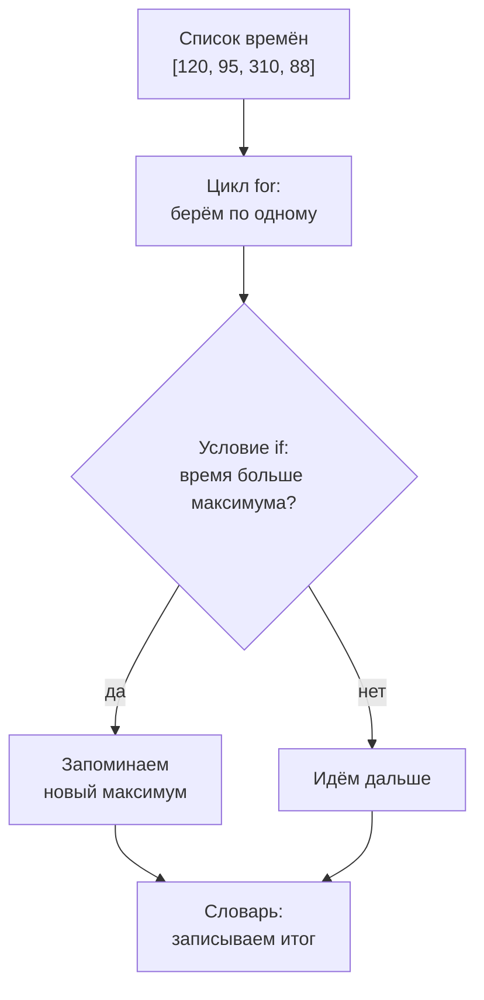

## Зачем это нужно

Я занимаюсь нагрузкой давно и помню свой первый скрипт. Перед распродажей мне дали лог магазина на несколько тысяч строк и попросили: «Глянь, много ли ошибок». Я листал его глазами двадцать минут и понял, что половину пропустил. Тогда коллега написал десять строк кода, и ответ появился за секунду. Такие десять строк ты научишься писать сам.

После нагрузочного теста у тебя не одно число, а тысячи: код и время ответа на каждый запрос. Чтобы их разобрать, программе нужны четыре умения. Первое: решать («если код 500, это ошибка, иначе нет»). Второе: повторять одно и то же для каждой из тысячи строк. Третье: держать тысячи времён в одном месте. Четвёртое: хранить значения с подписями («200 встретился 1700 раз, 500 встретился 27 раз»). В Python на это есть условия, циклы, списки и словари: их мы разберём по очереди. Такие же подсчёты работают внутри инструментов нагрузки из тем 9 и 10, только быстрее.

Шаг проекта: в `~/perf-lab/04-python/` появятся `groups.py` (сколько ответов каждой группы), `logparse.py` (разбор строк лога) и `stats.py` (среднее, максимум, p50, p95, p99 по списку времён). Всё закоммитишь в `perf-lab`.

## Что нужно знать

- Переменные, типы `int`, `float`, `str`, `bool`, `print` и f-строки, запуск скриптов, чтение трассировки ошибок: [урок 4.1](01-first-program.md). Особенно важны сравнения (`==`, `<`, `>`), которые дают `True` или `False`, и методы строк (`strip`, `replace`).
- Что такое среднее, p95 и хвост времени ответа: [урок 8.1](../08-perf-theory/01-latency-throughput.md). Там же формула «ближайшего ранга», по которой ты в этом уроке посчитаешь p95 своим кодом. Если 8.1 ещё не пройден, ничего страшного: формула повторена здесь.
- Каталог `~/perf-lab` и коммиты в нём: [тема 3](../03-git/index.md).


## Картина целиком

Представь кассира. Перед ним очередь покупателей: это **список** (list), значения друг за другом с номерами мест. Он берёт следующего покупателя: это **цикл** (for), «для каждого из очереди». Смотрит, есть ли бонусная карта: если есть, скидка, если нет, полная цена. Это **условие** (if). Итоги смены он записывает в журнал вида «название и число»: это **словарь** (dict).



На схеме список подаёт значения в цикл, внутри цикла работает условие, а итог оседает в переменных или в словаре. Почти любая обработка результатов теста устроена так: пройти по данным, проверить каждый элемент, накопить итог. Начнём с условия.

## Теория

### Условия: if, elif, else

Код 200 в отчёте значит одно, 404 другое, 500 третье, и это три разные истории. Как научить программу различать их самой?

Вспомни светофор: если зелёный, едем, иначе если жёлтый, тормозим, иначе стоим. Проверки идут сверху вниз, срабатывает первая подходящая. В программе так же работает **условие** (if, «если»):

```python
code = 404

if code < 400:
    print("успех")
elif code < 500:
    print("ошибка клиента")
else:
    print("ошибка сервера")
```

После `if` стоит выражение, которое даёт `True` или `False`: сравнение из урока 4.1. В конце строки обязательно двоеточие. Строки под ним сдвинуты на 4 пробела. Это **блок** (block): набор строк, которые выполняются вместе. В Python отступ не украшение, а часть языка: он сам говорит, какие строки принадлежат условию.

Ветка `elif` («иначе если») проверяется, только если выше ничего не сработало, а `else` («иначе») ловит всё остальное. Выполнится не больше одной ветки: первая с истинным условием. Для 404 первое условие ложно (404 не меньше 400), второе истинно, и печатается «ошибка клиента». Поэтому порядок важен: поставь `code < 500` первым, и успешный 200 попадёт в ошибки клиента.

Условия склеивают словами `and` («и», оба верны), `or` («или», верно хотя бы одно) и `not` (переворачивает). Например, `code >= 200 and code < 300` истинно для кодов 200-299, а `code == 502 or code == 503` для любого из двух. Диапазон можно записать и как в математике: `200 <= code < 300`.

> **Прикинь сам:** что напечатает программа при `code = 301`, если в ней ветки `if code < 300`, `elif code < 400` и `else`?
{: .predict}

Первое условие ложно (301 не меньше 300), второе истинно (301 меньше 400). Сработает вторая ветка, а `else` пропустится.

Осторожно: пропущенное двоеточие даёт `SyntaxError: expected ':'`, неверный отступ даёт `IndentationError: expected an indented block`. Одиночное `=` вместо `==` тоже `SyntaxError`. А `"200" == 200` ложно: строка и число не равны, как в 4.1.

> **Главное:** условие выбирает не больше одной ветки, проверяя их сверху вниз, поэтому порядок веток важен.
{: .key}

Условие проверяет один ответ, а их тысяча. Где их хранить?

### Списки: много значений в одном месте

Тысяча времён ответа не поместится в тысячу переменных `t1`, `t2`, `t3`... Нужна одна коробка.

Вспомни список дел на холодильнике: пункты по порядку, можно спросить «что в третьем?» и дописать в конец. В Python это **список** (list), только пункты там считают с нуля, и тут аналогия ломается. Список пишут в квадратных скобках:

```python
times = [120, 95, 310, 88, 150]
```

Номер элемента называется **индексом** (index). Индекс показывает, на сколько шагов отступить от начала, а у первого элемента отступ нулевой. Поэтому первый имеет индекс 0, второй 1, последний (из пяти) 4. Берут его так: `times[0]`. Отрицательный индекс считает с конца: `times[-1]` последний, `times[-2]` предпоследний. Если индекса нет (`times[5]`), будет ошибка `IndexError: list index out of range`.

**Срез** (slice) берёт кусок списка: `times[1:3]` даёт элементы с индексами 1 и 2, правая граница не входит. `times[:2]` это первые два, `times[-2:]` последние два. Срез возвращает новый список и никогда не падает: если границы шире списка, берётся сколько есть. Двигай ползунки: видно, какие ячейки выбираются.

<div class="viz" data-viz="py-index" data-mode="list" data-name="times" data-items='[120,95,310,88,150]' data-index="0" data-start="1" data-stop="3"></div>

Индексы `5` и `-6` выходят за границы и показывают `IndexError`, а срез с любыми границами ошибки не даёт.

> **Прикинь сам:** `times = [120, 95, 310, 88, 150]`. Что дадут `times[1:3]` и `times[-2:]`?
{: .predict}

`times[1:3]` это `[95, 310]`: индексы 1 и 2, а 3 не входит. `times[-2:]` это `[88, 150]`, последние два.

Со списком работают встроенные функции: `len(times)` даёт длину (5), `sum`, `min` и `max` дают сумму, минимум и максимум (763, 88 и 310), а `310 in times` проверяет, есть ли значение. `sorted(times)` возвращает новый отсортированный список, а исходный остаётся как был. `times.append(200)` добавляет значение в конец и меняет сам список: в отличие от строк (4.1), списки изменяемы. Среднее по списку руками:

```python
times = [120, 95, 310, 88, 150]
mean = sum(times) / len(times)
print(mean)
print(sorted(times))
print(times[0], times[-1])
```

```text
152.6
[88, 95, 120, 150, 310]
120 150
```

Сумма 763, элементов 5, среднее 763 / 5 = 152,6. `sorted` список не тронул, поэтому следующая строка печатает `120` (первый) и `150` (последний). Среднее не равно ни одному измерению: выброс 310 тянет его вверх ([8.1](../08-perf-theory/01-latency-throughput.md)).

Осторожно: `b = a` не копирует список. Обе переменные смотрят на один и тот же («две наклейки на одной банке» из 4.1), копию делают так: `b = list(a)`, `b = a[:]` или `b = a.copy()`. И не пиши `times = times.append(200)`: `append` возвращает `None`, и список потеряется.

> **Главное:** список хранит значения по номерам с нуля, срез не включает правую границу, а `append` меняет сам список.
{: .key}

Как обработать каждый элемент, не написав тысячу строк?

### Цикл for: сделать одно и то же для каждого

Кассир берёт покупателей по одному, пока очередь не опустеет. Так же работает цикл `for`: он повторяет блок для каждого элемента и сам заканчивается, когда они кончились.

```python
for t in times:
    print(t)
```

`for t in times:` значит: «возьми следующее значение из `times`, положи в переменную `t`, выполни блок». Имя `t` выбираешь ты. Когда элементы кончились, программа идёт к строке без отступа.

У цикла три помощника. `range(n)` даёт числа от 0 до n-1: `for i in range(3)` выполнит блок для 0, 1, 2. `enumerate(times)` отдаёт пары «номер и значение»: в `for i, t in enumerate(times):` переменная `i` равна 0, 1, 2... `break` прерывает цикл досрочно, `continue` пропускает остаток круга и идёт к следующему элементу.

> **Прикинь сам:** сколько раз выполнится тело цикла `for i in range(3):` и какие значения получит `i`?
{: .predict}

Три раза, значения 0, 1, 2: `range(3)` начинает с нуля, конец не включает.

Главный приём цикла называется **накопитель** (accumulator). Переменную заводят до цикла (`total = 0`) и обновляют внутри (`total = total + t`). Так считают суммы, счётчики и максимумы. Нажми «Шаг ▶» и следи, как меняются `total`, `longest` и `t`.

<div class="viz" data-viz="py-trace" data-title="Цикл for с накопителем и условием" data-speed="1800" data-code='["times = [120, 95, 310, 88]","total = 0","longest = 0","for t in times:","    total = total + t","    if t > longest:","        longest = t","mean = total / len(times)","print(f\"среднее {mean}, максимум {longest}\")"]' data-steps='[{"l":1,"v":{"times":"[120, 95, 310, 88]"},"n":"Список из четырёх времён ответа в миллисекундах."},{"l":2,"v":{"times":"[120, 95, 310, 88]","total":"0"},"n":"Накопитель суммы создаётся ДО цикла и стартует с нуля."},{"l":3,"v":{"times":"[120, 95, 310, 88]","total":"0","longest":"0"},"n":"Накопитель максимума: пока самое большое значение равно нулю."},{"l":4,"v":{"times":"[120, 95, 310, 88]","total":"0","longest":"0","t":"120"},"n":"Начало круга: переменная `t` получает следующий элемент списка. Когда элементы кончатся, цикл завершится."},{"l":5,"v":{"times":"[120, 95, 310, 88]","total":"120","longest":"0","t":"120"},"n":"К сумме прибавляется текущее время. Эта строка выполняется на каждом круге."},{"l":6,"v":{"times":"[120, 95, 310, 88]","total":"120","longest":"0","t":"120"},"n":"Условие: текущее время больше найденного максимума?"},{"l":7,"v":{"times":"[120, 95, 310, 88]","total":"120","longest":"120","t":"120"},"n":"Условие сработало: запоминаем новый максимум. На других кругах эта строка пропускается."},{"l":4,"v":{"times":"[120, 95, 310, 88]","total":"120","longest":"120","t":"95"},"n":"Начало круга: переменная `t` получает следующий элемент списка. Когда элементы кончатся, цикл завершится."},{"l":5,"v":{"times":"[120, 95, 310, 88]","total":"215","longest":"120","t":"95"},"n":"К сумме прибавляется текущее время. Эта строка выполняется на каждом круге."},{"l":6,"v":{"times":"[120, 95, 310, 88]","total":"215","longest":"120","t":"95"},"n":"Условие: текущее время больше найденного максимума?"},{"l":4,"v":{"times":"[120, 95, 310, 88]","total":"215","longest":"120","t":"310"},"n":"Начало круга: переменная `t` получает следующий элемент списка. Когда элементы кончатся, цикл завершится."},{"l":5,"v":{"times":"[120, 95, 310, 88]","total":"525","longest":"120","t":"310"},"n":"К сумме прибавляется текущее время. Эта строка выполняется на каждом круге."},{"l":6,"v":{"times":"[120, 95, 310, 88]","total":"525","longest":"120","t":"310"},"n":"Условие: текущее время больше найденного максимума?"},{"l":7,"v":{"times":"[120, 95, 310, 88]","total":"525","longest":"310","t":"310"},"n":"Условие сработало: запоминаем новый максимум. На других кругах эта строка пропускается."},{"l":4,"v":{"times":"[120, 95, 310, 88]","total":"525","longest":"310","t":"88"},"n":"Начало круга: переменная `t` получает следующий элемент списка. Когда элементы кончатся, цикл завершится."},{"l":5,"v":{"times":"[120, 95, 310, 88]","total":"613","longest":"310","t":"88"},"n":"К сумме прибавляется текущее время. Эта строка выполняется на каждом круге."},{"l":6,"v":{"times":"[120, 95, 310, 88]","total":"613","longest":"310","t":"88"},"n":"Условие: текущее время больше найденного максимума?"},{"l":4,"v":{"times":"[120, 95, 310, 88]","total":"613","longest":"310","t":"88"},"n":"Начало круга: переменная `t` получает следующий элемент списка. Когда элементы кончатся, цикл завершится."},{"l":8,"v":{"times":"[120, 95, 310, 88]","total":"613","longest":"310","t":"88","mean":"153.25"},"n":"Цикл закончился (строка без отступа). Среднее: сумма делим на число элементов."},{"l":9,"v":{"times":"[120, 95, 310, 88]","total":"613","longest":"310","t":"88","mean":"153.25"},"o":"среднее 153.25, максимум 310","n":"Печатаем итог: среднее 153,25 и максимум 310."}]' data-try="смотри на longest: он меняется только на первом и третьем круге. Вернись назад ползунком и найди эти шаги."></div>

`longest` меняется только там, где условие `t > longest` истинно: на первом круге (120 больше нуля) и на третьем (пришло 310). Сумма 613, делим на 4 элемента, среднее 153,25, максимум 310.

Теперь вернёмся к кодам ответа магазина. Разделим десять ответов на три группы и сразу посчитаем, сколько в каждой (файл `groups.py`):

```python
codes = [200, 200, 201, 404, 200, 500, 409, 200, 503, 200]

ok = 0
client_errors = 0
server_errors = 0

for code in codes:
    if code < 400:
        ok += 1
    elif code < 500:
        client_errors += 1
    else:
        server_errors += 1

print("Успешных:", ok)
print("Ошибок клиента (4xx):", client_errors)
print("Ошибок сервера (5xx):", server_errors)

if server_errors > 0:
    print("ВНИМАНИЕ: сервер отвечал ошибками")
else:
    print("Серверных ошибок нет")
```

```text
Успешных: 6
Ошибок клиента (4xx): 2
Ошибок сервера (5xx): 2
ВНИМАНИЕ: сервер отвечал ошибками
```

Запись `ok += 1` короче `ok = ok + 1` (так же работают `-=` и `*=`). Коды 200, 200, 201, 200, 200, 200 дают 6 успешных. Коды 404 и 409 дают 2 ошибки клиента: запрос неверный, не вина сервера. Коды 500 и 503 дают 2 ошибки сервера: вот это повод бить тревогу. Последнее условие без отступа выполнится один раз, уже после цикла. Сумма 6 + 2 + 2 равна десяти ответам: так проверяют, что в условиях нет дыр.

Осторожно: накопитель, созданный внутри цикла (`total = 0` на каждом круге), обнуляется, и в конце `total` равен последнему элементу. И не меняй список, по которому идёшь циклом: лучше построй новый.

> **Главное:** `for` проходит по готовому набору, накопитель заводят до цикла, а условие внутри цикла отбирает нужное.
{: .key}

`for` перебирает то, что уже есть. А если заранее неизвестно, сколько раз повторять?

### Цикл while: повторять, пока условие верно

Иногда ты ждёшь, пока стенд ответит, и не знаешь, сколько попыток понадобится. Для такого есть цикл `while`: перед каждым кругом он проверяет условие. Истинно, и блок идёт снова, ложно, и цикл кончается.

```python
attempt = 0
while attempt < 3:
    attempt += 1
    print("попытка", attempt)
print("готово")
```

```text
попытка 1
попытка 2
попытка 3
готово
```

До первого круга `attempt` равен 0, условие `0 < 3` истинно: прибавляем единицу и печатаем 1. После третьего круга `attempt` равен 3, условие `3 < 3` ложно, и цикл кончается.

Опасность: если в блоке ничего не меняет условие, цикл бесконечный и программа зависнет. Остановить её можно сочетанием `Ctrl+C`. Поэтому внутри `while` всегда должно что-то приближать конец или стоять `break`. Я беру `for` почти всегда, а `while` для попыток и ожидания.

> **Главное:** `while` повторяет блок, пока условие истинно, и без изменения условия не кончится.
{: .key}

Списки хранят значения по номерам, а номер не говорит, что внутри. Нужна коробка, где у каждого значения есть название.

### Словари: значения с названиями

Сколько ответов с кодом 200 и сколько с кодом 500? Номер места тут ничего не значит, важно название. Так в телефонной книге ищут человека по имени, а не по номеру страницы. В Python это **словарь** (dict): пары «ключ: значение», где ключ это название. Обращаются только по ключу, не по месту, а порядок ключей совпадает с порядком добавления.

```python
product = {"id": 17, "name": "Товар 17", "price": 729.0, "stock": 1000000}
```

Значение берут по ключу в квадратных скобках: `product["price"]` даёт `729.0`. Ключи уникальны, чаще всего это строки или числа (например, код ответа 200). Записать или изменить значение: `product["stock"] = 5`. Проверить ключ: `"price" in product`.

А если ключа нет? Посмотри на словаре товара.

<div class="viz" data-viz="py-index" data-mode="dict" data-name="product" data-items='{"id":17,"name":"Товар 17","price":729.0,"stock":1000000}' data-missing="discount"></div>

Обращение `product["discount"]` останавливает программу ошибкой `KeyError`, а `product.get("discount", 0)` спокойно вернёт запасное значение. Если поле может отсутствовать, спрашивай через `.get`.

Главный рабочий приём урока это счётчик кодов ответа. Для каждого кода надо «прибавить единицу к его счётчику, а если кода ещё не было, начать с нуля». Это как раз решает `.get`:

```python
codes = {}
for code in [200, 404, 200]:
    codes[code] = codes.get(code, 0) + 1
print(codes)
```

```text
{200: 2, 404: 1}
```

Пройди по шагам, нажимая «Шаг ▶».

<div class="viz" data-viz="py-trace" data-title="Словарь-счётчик кодов ответа" data-speed="1800" data-code='["codes = {}","for code in [200, 404, 200]:","    codes[code] = codes.get(code, 0) + 1","print(codes)"]' data-steps='[{"l":1,"v":{"codes":"{}"},"n":"Пустой словарь: пока ни одного кода."},{"l":2,"v":{"codes":"{}","code":"200"},"n":"Берём следующий код ответа из списка."},{"l":3,"v":{"codes":"{200: 1}","code":"200"},"n":"`get` берёт текущий счётчик кода (или 0, если кода ещё не было), прибавляем 1 и записываем обратно."},{"l":2,"v":{"codes":"{200: 1}","code":"404"},"n":"Берём следующий код ответа из списка."},{"l":3,"v":{"codes":"{200: 1, 404: 1}","code":"404"},"n":"`get` берёт текущий счётчик кода (или 0, если кода ещё не было), прибавляем 1 и записываем обратно."},{"l":2,"v":{"codes":"{200: 1, 404: 1}","code":"200"},"n":"Берём следующий код ответа из списка."},{"l":3,"v":{"codes":"{200: 2, 404: 1}","code":"200"},"n":"`get` берёт текущий счётчик кода (или 0, если кода ещё не было), прибавляем 1 и записываем обратно."},{"l":2,"v":{"codes":"{200: 2, 404: 1}","code":"200"},"n":"Берём следующий код ответа из списка."},{"l":4,"v":{"codes":"{200: 2, 404: 1}","code":"200"},"o":"{200: 2, 404: 1}","n":"Цикл закончился, печатаем словарь: 200 встретился два раза, 404 один раз."}]' data-try="найди шаг, где в словаре появляется ключ 404, и шаг, где счётчик 200 растёт с 1 до 2."></div>

Первый раз `get` не находит ключ 200, возвращает 0, и записывается `{200: 1}`. Второй раз находит 1 и записывает 2.

Чтобы пройти по словарю, пиши `for code, n in codes.items():`: на каждом круге будет пара «ключ и значение». Обычный `for code in codes:` даст только ключи. Посчитаем долю ошибок по словарю `{200: 1700, 404: 12, 500: 27}`:

```python
codes = {200: 1700, 404: 12, 500: 27}
total = 0
errors = 0
for code, n in codes.items():
    total += n
    if code >= 400:
        errors += n
print(total, errors)
print(f"Ошибок: {errors / total * 100:.1f}%")
```

```text
1739 39
Ошибок: 2.2%
```

Первый круг (`code` 200, `n` 1700) не ошибка, второй и третий добавляют к `errors` 12 и 27. Всего 1700 + 12 + 27 = 1739 ответов, из них 39 с кодом 400 и выше. Доля ошибок 39 / 1739 = 0,022, то есть 2,2%.

> **Прикинь сам:** `stock = {"apple": 5}`. Что вернёт `stock.get("pear", 0)` и что вернёт `stock["pear"]`?
{: .predict}

Первое вернёт `0`: ключа нет, берётся запасное значение. Второе упадёт с `KeyError: 'pear'`.

Осторожно: ключ `"200"` (строка) и ключ `200` (число) это два разных ключа. В JSON ключи всегда строки ([урок 4.4](04-files-json-csv.md)). Ещё `codes[0]` ищет ключ 0, а не первую пару. А менять словарь в цикле по нему же нельзя: будет `RuntimeError`.

> **Главное:** словарь ищет значение по ключу, `.get` читает без ошибки, а счётчик кодов строится как `codes[code] = codes.get(code, 0) + 1`.
{: .key}

<details markdown="1">
<summary>Для любопытных: кортежи и множества</summary>

Эти два типа ты встретишь в чужом коде. **Кортеж** (tuple) это список, который нельзя изменить: `size = (1280, 720)`, берётся по индексу (`size[0]`). 

**Множество** (set) это набор уникальных значений без порядка. Оно пишется в фигурных скобках без двоеточий: `{200, 404, 200}` даст `{200, 404}`, повтор исчез. Так узнают, какие разные коды встречались. Пустое множество пишется `set()`, потому что `{}` это пустой словарь.

</details>

Все инструменты в сборе. Осталось получить данные из настоящего лога.

### Разбор строки лога: split

Реальный лог это не список чисел, а строки вроде «GET /api/products 200 42ms». Как достать из такой строки код и время? Метод `split()` режет текст по пробелам и возвращает список слов (методы строк ты видел в [4.1](01-first-program.md)):

```python
line = "GET /api/products 200 42ms"
parts = line.split()
print(parts)
print(parts[2], parts[3])
```

```text
['GET', '/api/products', '200', '42ms']
200 42ms
```

Четыре слова, нумерация с нуля: метод `parts[0]`, путь `parts[1]`, код `parts[2]`, время `parts[3]`. Все они текстовые (`'200'` в кавычках), поэтому код превращаем в число через `int()`, а у `'42ms'` сначала убираем `ms` методом `replace`. Другой разделитель указывают в скобках: `"a,b,c".split(",")`. Весь разбор лога (цикл, `split`, счётчик в словаре, условие) ты соберёшь в практике, в файле `logparse.py`.

> **Главное:** `split()` превращает строку в список слов, а `int()` делает из слова число.
{: .key}

Остался подсчёт, ради которого всё затевалось: p95.

### Процентиль руками: p95 без библиотек

Среднее прячет хвост, поэтому в отчёте про нагрузку просят p95: значение, не больше которого 95% измерений (подробно в [8.1](../08-perf-theory/01-latency-throughput.md)). Готовой функции для него в Python нет, но с тем, что ты уже знаешь, хватит четырёх строк.

Берём метод «ближайшего ранга» из 8.1: сортируем значения, считаем ранг (место в ряду, места считаются с единицы) и берём элемент на этом месте. Для p95 на 20 измерениях ранг равен 0,95 × 20 = 19, а индекс на единицу меньше: 18. Дробный ранг округляют вверх (в математике это скобки ⌈ ⌉): из 18,2 выходит 19.

Округлить вверх можно без модулей. Целочисленное деление `//` отбрасывает дробь, то есть округляет вниз: `1951 // 100` даёт 19. Если перед делением прибавить 99, точное число не изменится, а любое неточное перевалит через сотню: `(1900 + 99) // 100 = 19`, но `(1901 + 99) // 100 = 20`. Выходит правило «ранг равен `(p * n + 99) // 100`». Для p = 95 и n = 20: 95 × 20 = 1900, плюс 99 это 1999, а `1999 // 100` даёт 19. В [уроке 4.3](03-functions-errors.md) то же сделает готовая `math.ceil`.

Применим к тем же 20 значениям, что в 8.1. Это основа `stats.py`:

```python
times = [12, 13, 13, 14, 14, 15, 15, 15, 16, 16, 17, 17, 18, 19, 20, 22, 25, 31, 48, 410]
count = len(times)
ordered = sorted(times)
p95 = ordered[(95 * count + 99) // 100 - 1]
print(p95)
```

```text
48
```

Ранг 19, индекс 18, и там стоит 48: то же число, что в 8.1. Теперь посмотри на 100 запросах, где часть тормозит:

<div class="viz" data-viz="percentiles" data-slow="5" data-slow-ms="1500"></div>

При 5% медленных запросов среднее далеко от p50, а p95 и p99 показывают хвост.  В [4.3](03-functions-errors.md) этот код станет функцией `percentile(values, p)`.

Осторожно: индекс на единицу меньше ранга (`ordered[rank - 1]`), а считать надо по отсортированному списку. И не верь p95 на пяти измерениях: нужны сотни значений, для p99 тысячи.

> **Проверь понимание:** сколько будет `(95 * 10 + 99) // 100` и какой это ранг для p95 при десяти измерениях?

<details markdown="1">
<summary>Ответ</summary>

`95 * 10 = 950`, `950 + 99 = 1049`, `1049 // 100 = 10`. Ранг 10, то есть p95 на десяти измерениях это самое большое значение (индекс 9). Для малой выборки p95 совпадает с максимумом: значит, он ничего нового не говорит.

</details>

> **Главное:** p95 это элемент отсортированного списка с рангом `(95 * n + 99) // 100`, а индекс на единицу меньше ранга.
{: .key}

Вернись к распродаже: теперь на тысячах строк лога ты ответишь, много ли ошибок и каков хвост. Цикл пройдёт по строкам, словарь сосчитает коды, сортировка даст p95.

## Практика

Все файлы создавай в `~/perf-lab/04-python/`. Для каждого: `nano имя.py`, вставь код, сохрани, затем `python3 имя.py`.

```bash
cd ~/perf-lab/04-python
```

### 1. Группы ответов: `groups.py`

Открой файл и вставь код (он тот же, что в разборе выше):

```bash
nano groups.py
```

```python
codes = [200, 200, 201, 404, 200, 500, 409, 200, 503, 200]

ok = 0
client_errors = 0
server_errors = 0

for code in codes:
    if code < 400:
        ok += 1
    elif code < 500:
        client_errors += 1
    else:
        server_errors += 1

print("Успешных:", ok)
print("Ошибок клиента (4xx):", client_errors)
print("Ошибок сервера (5xx):", server_errors)

if server_errors > 0:
    print("ВНИМАНИЕ: сервер отвечал ошибками")
else:
    print("Серверных ошибок нет")
```

Запусти и сверь вывод:

```bash
python3 groups.py
```

```text
Успешных: 6
Ошибок клиента (4xx): 2
Ошибок сервера (5xx): 2
ВНИМАНИЕ: сервер отвечал ошибками
```

Теперь поменяй в списке `500` и `503` на `200` и запусти ещё раз: последняя строка станет «Серверных ошибок нет».

**Как читать вывод:** первые три строки это счётчики, последняя результат условия после цикла. Если сумма трёх чисел не равна длине списка (10), в условиях есть дыра: подсчитай сам.

### 2. Разбор лога: `logparse.py`

Строки лога стенда: метод, путь, код ответа, время. Для каждой строки режем её на слова, превращаем код и время в числа, считаем коды в словаре и отбираем медленные запросы.

```bash
nano logparse.py
```

```python
# Строки лога: метод, путь, код ответа, время
lines = [
    "GET /api/products 200 42ms",
    "GET /api/products/17 200 18ms",
    "POST /api/cart/items 201 35ms",
    "GET /api/products/99999 404 9ms",
    "POST /api/orders 201 230ms",
    "GET /api/products 200 51ms",
    "POST /api/orders 500 1204ms",
    "GET /api/cart 200 14ms",
    "POST /api/orders 409 27ms",
    "GET /api/products 200 47ms",
]

codes = {}          # код ответа -> сколько раз встретился
times = []          # время каждого запроса, мс
slow = []           # строки медленнее 200 мс

for line in lines:
    parts = line.split()
    method = parts[0]
    path = parts[1]
    code = int(parts[2])
    ms = int(parts[3].replace("ms", ""))

    times.append(ms)
    codes[code] = codes.get(code, 0) + 1
    if ms > 200:
        slow.append(f"{method} {path} {ms} мс")

errors = 0
for code, n in codes.items():
    if code >= 400:
        errors = errors + n

print("Коды ответа:", codes)
print(f"Ошибок (код 400 и выше): {errors} из {len(lines)}")
print("Медленные запросы:")
for item in slow:
    print("  ", item)
```

```bash
python3 logparse.py
```

```text
Коды ответа: {200: 5, 201: 2, 404: 1, 500: 1, 409: 1}
Ошибок (код 400 и выше): 3 из 10
Медленные запросы:
   POST /api/orders 230 мс
   POST /api/orders 1204 мс
```

**Как читать вывод:** словарь показывает, сколько ответов каждого кода (5 раз 200, 2 раза 201 и так далее), порядок ключей по первому появлению. Три ошибки из десяти: 404, 500, 409. Медленных (больше 200 мс) два, и оба относятся к оформлению заказа `POST /api/orders`: это ровно то место, которое болит в нагрузочных тестах магазина.

Измени порог в условии: `ms > 200` на `ms > 40`, и посмотри, как вырастет список медленных запросов.

**Типичные ошибки:**

- `IndexError: list index out of range` на строке `parts[3]`: в списке `lines` затесалась строка с меньшим числом слов (пустая строка, строка без времени). `split()` пустой строки даёт пустой список. Реальный лог всегда содержит странности, и в [уроке 4.3](03-functions-errors.md) ты научишься их обрабатывать.
- `ValueError: invalid literal for int() with base 10: '42ms'`: забыл `.replace("ms", "")`.
- `TypeError: unsupported operand type(s) for +: 'int' and 'str'`: пытаешься складывать число со строкой из лога, не превратив её через `int()`.

### 3. Статистика: `stats.py`

Среднее, минимум, максимум и три перцентиля по двадцати значениям из 8.1.

```bash
nano stats.py
```

```python
# Время ответа 20 запросов, мс
times = [12, 13, 13, 14, 14, 15, 15, 15, 16, 16, 17, 17, 18, 19, 20, 22, 25, 31, 48, 410]

count = len(times)
total = 0
for t in times:
    total = total + t
mean = total / count

ordered = sorted(times)
p50 = ordered[(50 * count + 99) // 100 - 1]
p95 = ordered[(95 * count + 99) // 100 - 1]
p99 = ordered[(99 * count + 99) // 100 - 1]

print(f"Запросов: {count}")
print(f"Среднее:  {mean:.1f} мс")
print(f"Минимум:  {min(times)} мс")
print(f"p50:      {p50} мс")
print(f"p95:      {p95} мс")
print(f"p99:      {p99} мс")
print(f"Максимум: {max(times)} мс")
```

```bash
python3 stats.py
```

```text
Запросов: 20
Среднее:  38.5 мс
Минимум:  12 мс
p50:      16 мс
p95:      48 мс
p99:      410 мс
Максимум: 410 мс
```

Сверь с 8.1: p50 16 мс, p95 48 мс, p99 410 мс (на двадцати измерениях совпал с максимумом). Для p50 ранг `(50 * 20 + 99) // 100 = 10`, индекс 9, значение 16. Затем добавь в список значение `500` (теперь их 21) и запусти снова. Среднее станет `60.5`, p50 `17`, p95 `410`, p99 `500`. Проверь ожидаемое вручную: ранг p95 теперь `(95 * 21 + 99) // 100 = 20`, элемент на индексе 19 отсортированного списка (длина 21) это 410. А p99: `(99 * 21 + 99) // 100 = 21`, индекс 20, это 500. Один дополнительный выброс заметно меняет хвост.

**Как читать вывод:** сравни среднее и p50. Если среднее заметно больше медианы, в данных есть длинный хвост. Это тот самый случай, ради которого мы считаем перцентили.

### 4. Коммит

```bash
cd ~/perf-lab
git add 04-python
git commit -m "4.2: условия, циклы, списки, словари, статистика"
git push
```

> Скрипт завис или даёт странный итог? Добавь `print` внутрь цикла и посмотри значения сам, потом спроси нейросеть. Её объяснение проверь тем же `print`.
{: .ai}

## Сломай и почини

**Поломка.** Файл `broken2.py`:

```python
times = [120, 95, 310]
print(times[3])

codes = {200: 5}
print(codes[404])

n = 0
while n < 3:
    print("круг", n)
```

**Задача.** Запусти его и пройди все три проблемы по очереди. Первую ошибку Python покажет и остановится. Исправляй по одной и запускай снова, пока не доберёшься до третьей, и тогда остановишь программу `Ctrl+C`. Для каждой проблемы запиши в одну фразу, что произошло, и исправь так, чтобы программа дошла до конца.

<details markdown="1">
<summary>Разбор</summary>

**1. IndexError.**

```text
Traceback (most recent call last):
  File "/home/student/perf-lab/04-python/broken2.py", line 2, in <module>
    print(times[3])
          ~~~~~^^^
IndexError: list index out of range
```

В списке три элемента с индексами 0, 1, 2, индекса 3 нет. Исправление: `times[2]` или `times[-1]` для последнего. Если нужно безопасно, сначала проверь `if len(times) > 3:`.

**2. KeyError.**

```text
Traceback (most recent call last):
  File "/home/student/perf-lab/04-python/broken2.py", line 5, in <module>
    print(codes[404])
          ~~~~~^^^^^
KeyError: 404
```

Ключа 404 в словаре нет: никто не получил такой ответ. Сообщение называет сам отсутствующий ключ. Исправление: `codes.get(404, 0)`, тогда выведется 0.

**3. Бесконечный цикл.** После исправления двух ошибок терминал заполняется строками `круг 0`, `круг 0`, `круг 0` без конца: переменная `n` нигде не меняется, условие `n < 3` вечно истинно. Остановка: `Ctrl+C`. Python при этом выведет `KeyboardInterrupt`: это не ошибка в программе, а сигнал, что ты прервал её сам. Исправление: добавить в цикл строку `n += 1`.

Что запомнить: две ошибки останавливают программу и называют место, а третья молча крутится. Если скрипт «завис», это почти всегда цикл, где не меняется то, что в условии. Привычка: перед запуском `while` проверь, что внутри что-то приближает его конец.

</details>

## ИИ в помощь

Нейросеть удобна, чтобы объяснить цикл и словарь на твоём коде и найти ошибку, но запускать код придётся тебе. Общие правила на странице [ИИ-помощник](../ai.md).

**Задача:** проверить логику разбора лога.

```text
Python 3.12. Мой скрипт logparse.py считает коды ответа в словаре и отбирает медленные запросы:
<вставь код>
Входные строки:
<вставь список строк>
Пройди по коду шаг за шагом и покажи значения переменных после каждой итерации. Где может быть ошибка при пустой строке или нестандартном формате?
```
{: .wrap}

**Проверь ответ:** добавь `print` в тех же местах и сверь значения с её разбором. Типичная ошибка: нейросеть «исполняет» код в уме и называет результат, которого код не даёт: считай за ней.

**Задача:** упростить цикл или понять `dict`.

```text
Вот мой цикл подсчёта кодов ответа:
<вставь код>
Покажи, как сделать то же через dict.get и через collections.Counter. Чем они отличаются, когда какой выбрать? Объясни на моём примере.
```
{: .wrap}

**Проверь ответ:** запусти оба варианта на одних данных: результаты должны совпасть. Типичная ошибка: «заодно» меняется логика (например, граница `>=` вместо `>`).

## Словарик урока

| Термин | Простыми словами |
|---|---|
| Условие (condition) | Выражение, которое даёт `True` или `False` и по которому программа выбирает ветку |
| `if` / `elif` / `else` | «если» / «иначе если» / «иначе»: выполняется первая подходящая ветка |
| Блок (block) | Строки с одинаковым отступом (4 пробела), которые выполняются вместе |
| Список (list) | Упорядоченный набор значений с номерами, изменяемый: `[120, 95, 310]` |
| Индекс (index) | Номер элемента списка, начинается с 0; `-1` это последний |
| Срез (slice) | Кусок списка `times[1:3]`; правая граница не входит |
| Цикл `for` | Повторяет блок для каждого элемента набора |
| Цикл `while` | Повторяет блок, пока условие истинно; без изменения условия бесконечен |
| Накопитель (accumulator) | Переменная, которую обновляют в цикле: сумма, счётчик, максимум |
| Словарь (dict) | Набор пар «ключ: значение», обращение по ключу: `product["price"]` |
| Ключ (key) | Название, по которому ищут значение в словаре |
| `.get(ключ, запасное)` | Безопасное чтение из словаря: без ошибки, если ключа нет |
| Кортеж (tuple) | Неизменяемый список в круглых скобках |
| Множество (set) | Набор уникальных значений без порядка |
| `split()` | Метод строки: режет текст на список слов |
| Перцентиль (percentile) | Значение, не больше которого заданная доля измерений; p95 это 95% |

## Вопросы с собеседований

Раздел для повторения: ответь вслух, потом открой ответ. Последние четыре помечены `[на скорость]`.



## Проверено на версиях

Python 3.12.3 (Ubuntu 24.04) и новее. Формат сообщений об ошибках (стрелки `^^^`, тильды `~~~`) такой, как у Python 3.12 и новее. Октябрь 2026.

## Итог урока: ты умеешь

- [ ] Написать условие `if/elif/else`, комбинировать условия через `and`, `or`, `not`.
- [ ] Создать список, взять элемент по индексу (в том числе отрицательному) и срез.
- [ ] Посчитать сумму, максимум, среднее и отсортировать список.
- [ ] Обойти список циклом `for`, использовать накопитель, `range` и `enumerate`.
- [ ] Написать `while` и остановить бесконечный цикл через `Ctrl+C`.
- [ ] Создать словарь, читать значения безопасно через `.get`, считать частоты кодов ответа.
- [ ] Разрезать строку лога через `split()` и превратить поля в числа.
- [ ] Посчитать p50, p95, p99 вручную по методу ближайшего ранга.
- [ ] Прочитать ошибки `IndexError` и `KeyError`.

Дальше: [урок 4.3. Функции, модули и исключения](03-functions-errors.md): ты упакуешь подсчёты в переиспользуемые функции и научишься переживать «грязные» данные в логе.
