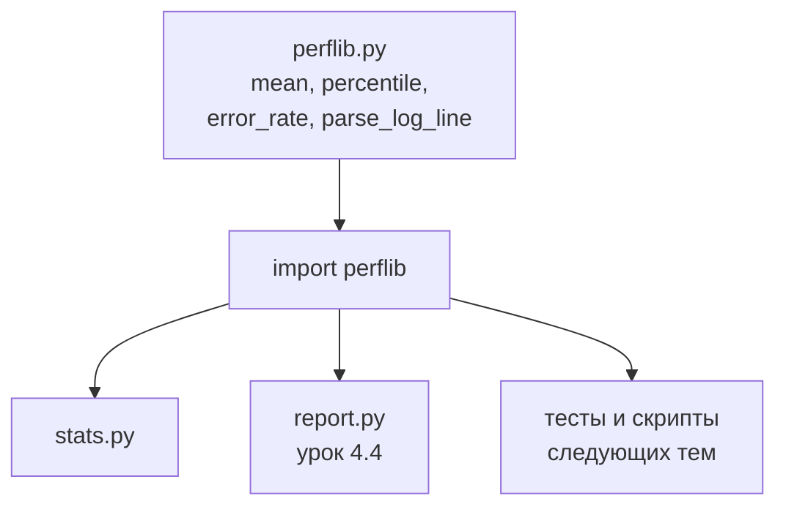
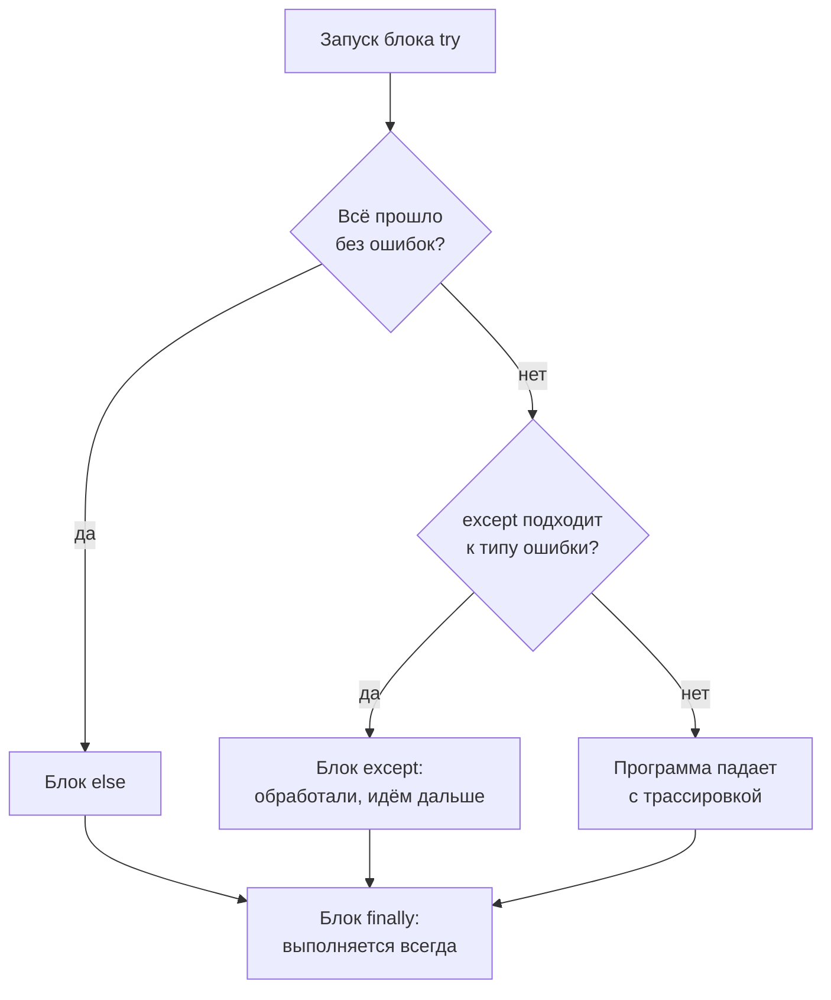

## Зачем это нужно

Я твой наставник: коллега, который сидит рядом и подсказывает, пока ты осваиваешься в команде магазина. До распродажи несколько недель, тестов будет много, и результат каждого надо прочитать: среднее, p95, долю ошибок. К концу [урока 4.2](02-conditions-loops.md) у тебя есть `stats.py`, который считает всё это для одного списка. Завтра то же понадобится для другого теста, послезавтра для третьего.

Расскажу, чем это обычно кончается. Коллега копирует формулу p95 из скрипта в скрипт. Через месяц в десяти файлах десять слегка разных версий: где-то округляют вверх, где-то вниз. Два отчёта по одному прогону показывают разные числа, и руководитель спрашивает, какому верить. Потом находится ошибка (баг) в одной копии, и чинить приходится все десять, если их вообще удаётся найти. Я сам однажды потерял на этом полдня.

Выход: писать формулу один раз. В этом помогают три вещи. **Функция** ([4.1](01-first-program.md)) это код с именем, который вызывают откуда угодно. **Модуль** это файл `.py` с набором функций, его подключают одной строкой. **Исключение** это способ, которым программа сообщает «что-то пошло не так», а ты отвечаешь «знаю, что с этим делать».

Третье для тестировщика важнее всего. Реальные данные грязные: в логе пустая строка, в ответе нет нужного поля, файл не нашёлся. Скрипт, который падает на первой странности и теряет результат трёхчасового прогона, никому не нужен. Скрипт, который пропустил одну плохую строку, сказал, сколько таких было, и досчитал остальное, это рабочий инструмент.

Шаг проекта: в `~/perf-lab/04-python/` появится модуль `perflib.py` с функциями `mean`, `percentile`, `error_rate` и `parse_log_line`. На него опираются уроки 4.4 и дальше: отчёты, тесты, скрипты нагрузки. Модуль и два скрипта, которые его используют, ты закоммитишь в `perf-lab`.

## Что нужно знать

- Переменные, типы, f-строки, трассировка ошибок: [урок 4.1](01-first-program.md). Ошибки `TypeError`, `ValueError` и `NameError` ты там уже видел, теперь научишься их перехватывать.
- Списки, циклы, словари, условия, подсчёт p95 руками: [урок 4.2](02-conditions-loops.md). Функции, которые ты напишешь, это упакованные версии кода оттуда.
- Метод ближайшего ранга для перцентиля: [урок 8.1](../08-perf-theory/01-latency-throughput.md). Функция `percentile` считает его так же, как `measure.py` из 8.1.

## Картина целиком

На кухне у повара есть заготовки: бульон, соус, тесто. Их варят один раз и берут в десяти блюдах. Заготовка принимает продукты, отдаёт готовый результат и стоит на полке. Блюду не важно, как сварен бульон, достаточно названия. А если в какой-то день пришла плохая партия мяса, повар не выбрасывает весь ужин: откладывает испорченное, записывает в журнал и готовит дальше из остального. Заготовки это функции, полка это модуль, а плохая партия это ошибка, которую можно обработать.



Функции пишутся в одном месте, а подключаются в любом числе скриптов. Исправил формулу в `perflib.py`, и все скрипты получили исправление сразу.

## Теория

### Функции: код с именем

Пять строк, которые считают среднее, нужны в десяти скриптах. Что делать? Копировать можно, но тогда ошибку чинят десять раз, а за неделю копии расходятся. Выход: дать блоку кода имя и вместо пяти строк писать `mean(times)`. Это и есть функция.

Представь карточку с рецептом соуса: на неё ссылаются из любого блюда, не пересказывая рецепт. Только карточка просто описывает, а функция ещё и отдаёт готовый результат. Определяют её словом `def`:

```python
def mean(values):
    total = sum(values)
    return total / len(values)
```

В первой строке `mean` это имя, а в скобках стоят **параметры** (parameters): имена, под которыми внутри функции доступны переданные данные. Двоеточие обязательно, дальше идёт блок с отступом в 4 пробела. Слово `return` отдаёт результат туда, откуда функцию вызвали, и сразу завершает её: строки после него не выполнятся. А сам `def` ничего не запускает, он только запоминает функцию под именем.

Запускает вызов: `mean([120, 95, 310, 88])`. То, что ты передал в скобках, называется **аргументами** (arguments), и они подставляются в параметры по порядку. Результат кладут в переменную: `result = mean(times)`. Нажимай «Шаг ▶» и следи за правой колонкой.

<div class="viz" data-viz="py-trace" data-title="Вызов функции по шагам" data-speed="1800" data-code='["def mean(values):","    total = sum(values)","    return total / len(values)","","times = [120, 95, 310, 88]","result = mean(times)","print(f\"среднее {result}\")"]' data-steps='[{"l":1,"v":{},"n":"`def` только запоминает функцию `mean`. Тело внутри пока не выполняется."},{"l":5,"v":{"times":"[120, 95, 310, 88]"},"n":"Список времён создан на верхнем уровне файла."},{"l":6,"v":{"times":"[120, 95, 310, 88]"},"n":"Строка вызова `mean(times)`: Python переходит внутрь функции, список передаётся в параметр `values`."},{"l":2,"v":{"values":"[120, 95, 310, 88]"},"f":"mean(values)","n":"Мы внутри функции: `values` это тот же список, переданный при вызове. Строка `total = ...` ещё не выполнена."},{"l":3,"v":{"values":"[120, 95, 310, 88]","total":"613"},"f":"mean(values)","n":"Теперь `total` = 613: локальная переменная, снаружи её не видно. `return` отдаёт результат 613 / 4 = 153.25 и завершает функцию."},{"l":6,"v":{"times":"[120, 95, 310, 88]","result":"153.25"},"n":"Возврат из функции: результат 153.25 записан в `result`, локальные `values` и `total` исчезли."},{"l":7,"v":{"times":"[120, 95, 310, 88]","result":"153.25"},"o":"среднее 153.25","n":"Печатаем результат. Переменных `values` и `total` уже нет: они жили только внутри функции."}]' data-try="смотри на колонку переменных: при входе в функцию там меняется набор имён, при выходе возвращается прежний."></div>

Вот что видно: `def` лишь запоминает функцию. Затем строка вызова переносит управление внутрь `mean`, где появляются свои `values` и `total`. После `return` Python возвращается на строку вызова, переменные функции исчезают, а 153.25 попадает в `result`.

Параметру можно задать запасное значение: `def percentile(values, p=95):`. Тогда `percentile(times)` посчитает p95, а `percentile(times, 99)` p99. Аргументы можно называть прямо в вызове, `percentile(values=times, p=50)`: так сразу видно, что значит `50`. Первая строка в тройных кавычках внутри функции называется **docstring**: это описание, которое показывают подсказки редактора. Пиши в одну строку, что функция принимает и что возвращает.

Теперь функция, которая войдёт в наш проект:

```python
def percentile(values, p):
    """Перцентиль p (0-100) методом ближайшего ранга."""
    ordered = sorted(values)
    rank = math.ceil(p / 100 * len(ordered))
    return ordered[max(rank, 1) - 1]
```

Разберём на 20 значениях и p = 95. Сначала `sorted` расставляет их по возрастанию, как в 4.2. Потом `p / 100 * len(ordered)` даёт 0,95 · 20 = 19,0, и `math.ceil` округляет вверх до ранга 19. Номера в списке считаются с нуля, поэтому берём элемент с индексом на единицу меньше: `ordered[18]`. А `max(rank, 1)` страхует от p = 0: ранг 0 дал бы индекс `-1`, то есть последний элемент вместо первого. Строка `import math` стоит в начале файла, как она работает, я объясню в разделе про модули. В 4.2 тот же ранг считали через `(p * n + 99) // 100`, потому что модулей ещё не было. Результат у обеих формул один: на знакомых 20 значениях ответ 48.

> **Прикинь сам:** функция `def double(x): print(x * 2)` вызвана как `y = double(5)`. Что напечатается и чему равно `y`?
{: .predict}

Напечатается `10`, а `y` будет `None`: в функции нет `return`, она только показывает значение человеку, а без `return` Python отдаёт `None` («ничего»). Ровно так выглядит самая частая ошибка новичка: функция посчитала сумму, а `return` забыли, и вместо суммы пришёл `None`. Выражение `mean(times) * 2` тоже не сработает, если `mean` только печатает. Ещё не путай слова: параметр это имя в определении (`values`), аргумент это значение при вызове (`times`).

> **Главное:** `def` описывает функцию, вызов её запускает, а `return` отдаёт результат программе (`print` показывает его только человеку).
{: .key}

Мы научились упаковывать код. Но в виджете `total` исчезла после возврата. Куда она делась?

### Локальные переменные: что остаётся внутри

Если бы все переменные были общими, две функции с одинаковым именем `total` портили бы друг другу работу. Поэтому у каждой функции свой «рабочий стол»: бумаги с него не видно с соседнего.

Переменные, созданные внутри функции, и её параметры называются **локальными** (local): они появляются при вызове и пропадают при возврате. Переменные верхнего уровня файла называются **глобальными** (global): читать их из функции можно, а присваивать им нельзя без слова `global`. Лучше без него: данные передают через параметры и забирают через `return`. Посмотри на пример:

```python
def count_errors(codes):
    errors = 0
    for code in codes:
        if code >= 400:
            errors += 1
    return errors

print(count_errors([200, 500, 404]))
print(errors)
```

```text
2
Traceback (most recent call last):
  File "/home/student/perf-lab/04-python/scope.py", line 9, in <module>
    print(errors)
          ^^^^^^
NameError: name 'errors' is not defined
```

Функция вернула 2, а переменная `errors` жила только внутри неё, и снаружи `NameError` это подтверждает.

> **Прикинь сам:** в функции есть `total = 0`, а в программе выше уже стоит `total = 500`. Изменится ли внешний `total` после вызова?
{: .predict}

Нет. Внутри функции `total` это новая локальная переменная, она с внешней никак не связана, и снаружи останется 500. Осторожно: когда имя внутри и снаружи одно и то же (`times` там и там), легко запутаться, какая переменная сейчас в работе. Внутри функции всегда побеждает локальная.

> **Главное:** переменная, созданная в функции, живёт только пока функция работает, и снаружи её не видно.
{: .key}

Одна функция в одном файле удобна. А как дать её десяти скриптам?

### Модули и import: свой код в отдельном файле

Ты написал `percentile` в `stats.py`, а завтра она нужна в `report.py`. Копировать мы не хотим, поэтому выносим функции в отдельный файл. Любой файл `.py` с функциями называется **модулем** (module), и `perflib.py` это модуль `perflib`. Подключают его **импортом** (import):

```python
import perflib
print(perflib.mean([1, 2, 3]))
```

Или так, чтобы вызывать функции без префикса:

```python
from perflib import mean, percentile
print(mean([1, 2, 3]))
```

Первая форма честнее: по `perflib.mean` сразу видно, откуда функция. Вторая короче, зато через месяц придётся вспоминать, откуда взялась `mean`. Запись `from perflib import *` не используй: потом непонятно, откуда что взялось.

Где Python ищет модуль? Сначала в папке запущенного скрипта, потом в стандартной библиотеке и среди установленных пакетов. Поэтому `perflib.py` кладут рядом со скриптом, а если файла нет, получишь `ModuleNotFoundError: No module named 'perflib'`.

Есть ещё одна деталь. Когда файл запускают напрямую (`python3 perflib.py`), Python записывает в служебную переменную `__name__` значение `"__main__"`, а при импорте записывает имя модуля. Поэтому в конце модуля можно оставить самопроверку, которая сработает только при прямом запуске:

```python
if __name__ == "__main__":
    print("mean =", mean([1, 2, 3]))
```

Запустил файл, увидел, что функции живы. А при `import perflib` из другого скрипта лишний вывод не появится. Вот как выглядит такая самопроверка нашего модуля после `python3 perflib.py`:

```text
mean = 38.5
p95 = 48
error_rate = 50.0
{'method': 'GET', 'path': '/api/products', 'code': 200, 'ms': 42}
```

На двадцати известных значениях среднее 38,5, а p95 равен 48 (как в 8.1). Из четырёх кодов `[200, 200, 500, 404]` две ошибки, то есть 50%. Последняя строка это разобранная строка лога в виде словаря. Если после правки модуля эти четыре строки изменились, сломалась какая-то функция.

Часть модулей писать не надо: они идут вместе с Python, это **стандартная библиотека** (standard library). Пригодятся пять: `math` (округление), `statistics` (готовые формулы: `statistics.mean([1, 2, 3, 10])` даёт 4), `random` (тестовые данные), `time` (измерения) и `sys` (параметры запуска). Про `json`, `csv` и `pathlib` будет [урок 4.4](04-files-json-csv.md). Три приёма из этого набора нужны в практике: замер, аргумент и повторяемость.

Первый: замер времени. `time.perf_counter()` возвращает секунды, но сам по себе бессмыслен: важна разность двух вызовов. Так меряют запрос: `started = time.perf_counter()`, действие, `elapsed = time.perf_counter() - started`. Обычные часы `time.time()` для этого не годятся: их могут перевести назад, и разность выйдет неверной. Паузу делает `time.sleep(0.2)`: программа замирает на 0,2 секунды.

Второй: параметры запуска. `sys.argv` это список слов командной строки, где `sys.argv[0]` имя скрипта, а `sys.argv[1]` первый аргумент. Запуск `python3 timing.py 4` даст `["timing.py", "4"]`. Всё в `argv` текст, поэтому число делают через `int()`.

Третий: повторяемые «случайные» данные. После `random.seed(1)` последовательность одна и та же при каждом запуске. Для тестов это важно: прогон можно воспроизвести. Пример понадобится в уроке 4.4.

Осторожно: если назвать свой файл так же, как модуль стандартной библиотеки (`random.py`, `json.py`, `statistics.py`), Python найдёт твой файл раньше и всё остальное сломается.

> **Проверь понимание:** ты назвал файл `random.py` и написал в нём `import random; print(random.randint(1, 6))`. Что произойдёт?

<details markdown="1">
<summary>Ответ</summary>

Файл импортирует сам себя вместо стандартного модуля, потому что каталог скрипта проверяется первым. Будет ошибка вроде `AttributeError: partially initialized module 'random' has no attribute 'randint' (most likely due to a circular import)`. Переименуй файл и удали папку `__pycache__` рядом (там Python хранит копии подключённых модулей). «Circular import» здесь значит «файл подключил сам себя».

</details>

> **Главное:** модуль это обычный файл `.py`, его подключают через `import`, а свои файлы называют не так, как стандартные.
{: .key}

С модулями понятно. Остался вопрос из начала: что делать с грязной строкой в логе?

### Исключения: try и except

Скрипт обрабатывает три часа лога и на миллионной строке встречает пустую. Если ничего не предусмотрено, он падает и теряет всё. Так выглядит ошибка: в Python она это сигнал, который летит вверх по цепочке вызовов (функция вызвала функцию, та ещё одну), пока кто-нибудь его не поймает или программа не остановится.

Это как сигнализация в магазине: сигнал идёт охраннику. Если он знает, что делать, ситуация закрыта. Если никто не отреагировал, воет сирена на всю улицу (программа падает с трассировкой). Аналогия ломается в одном месте: охранник не обязан реагировать на каждый сигнал, и тебе тоже не надо ловить всё подряд.

Ловят так:

```python
try:
    ms = int(text)
except ValueError:
    ms = 0
```

В `try` пишут то, что может упасть. `except ТипОшибки:` перехватывает ошибку именно этого типа. Тип (`ValueError`, `KeyError`, `ZeroDivisionError`) стоит в последней строке трассировки, его же ты пишешь после `except`. Типов можно перечислить несколько, `except (ValueError, KeyError):`, а саму ошибку сохранить: `except ValueError as err:`, и тогда `err` содержит текст, который можно записать в лог. Блок `else:` выполнится, если ошибки не было, а `finally:` выполнится всегда, и в нём делают уборку: закрывают файлы. Если тип не совпал ни с одним `except`, ошибка летит дальше, и программа падает.



Ошибка не обязана останавливать программу: если подходящий `except` есть, управление переходит в него, и скрипт живёт дальше. Даже на пути «не поймали» `finally` успеет выполниться, и только потом программа упадёт.

> **Прикинь сам:** в `try` случилась ошибка `ValueError`. Что напечатает код, если стоят `except ValueError: print("A")`, `else: print("B")` и `finally: print("C")`?
{: .predict}

Сначала `A`, потом `C`. Блок `else` работает только когда ошибки не было, а `finally` всегда. Осторожно: после `except` программа идёт дальше. Если ошибка критична, остановись сам через `raise` или `sys.exit(1)`.

> **Главное:** `try` пробует, `except` ловит ошибку нужного типа, `finally` выполняется в любом случае.
{: .key}

Ловить мы умеем. Но кто и когда эти ошибки создаёт?

### raise: сообщить, а не спрятать

Функция `parse_log_line` получает строку лога и видит, что в ней три поля вместо четырёх. Что ей делать? Молча вернуть ерунду нельзя. Решать, пропустить строку или остановить прогон, должен вызывающий код. Поэтому функция не прячет проблему, а сообщает о ней словом `raise`:

```python
if len(parts) != 4:
    raise ValueError(f"ожидалось 4 поля, а в строке {len(parts)}: {line!r}")
```

`raise ValueError("текст")` создаёт ошибку вручную: «разобрать не могу, решай сам». Если `try` стоит снаружи, в коде, который вызвал функцию, ошибка долетит туда. Запись `{line!r}` выводит значение в кавычках, чтобы пустую строку было видно (`''`), а не пустое место.

Теперь скрипт `use_lib.py` с грязным логом:

```python
from perflib import mean, percentile, error_rate, parse_log_line

lines = [
    "GET /api/products 200 42ms",
    "POST /api/orders 201 230ms",
    "",
    "POST /api/orders 500 1204ms",
    "GET /api/cart 200 oops",
    "GET /api/products 200 47ms",
]

times = []
codes = []
bad = 0
for line in lines:
    try:
        row = parse_log_line(line)
    except ValueError as err:
        bad += 1
        print("пропущена:", err)
        continue
    times.append(row["ms"])
    codes.append(row["code"])

print(f"Разобрано: {len(times)}, пропущено: {bad}")
print(f"Среднее: {mean(times):.1f} мс, p95: {percentile(times, 95)} мс")
print(f"Ошибок: {error_rate(codes):.1f}%")
```

```text
пропущена: ожидалось 4 поля, а в строке 0: ''
пропущена: время должно заканчиваться на ms: 'oops'
Разобрано: 4, пропущено: 2
Среднее: 380.8 мс, p95: 1204 мс
Ошибок: 25.0%
```

Пустая строка не прошла проверку числа полей, строка с `oops` вместо времени не прошла проверку окончания, и обе поймал `except ValueError`. `continue` пропускает остаток круга, чтобы испорченная строка не попала в списки. Остались четыре времени: 42, 230, 1204 и 47. Складываем: 42 + 230 + 1204 + 47 = 1523, делим на 4 и получаем 380,75, то есть 380,8 при округлении до десятых. Из четырёх кодов `200, 201, 500, 200` ошибочный один, это 25%. Скрипт посчитал всё, что смог, и сказал, сколько строк пропустил.

Ловить надо тот тип, которого ждёшь: `except ValueError`. Голый `except:` или `except Exception:` поймает всё подряд, включая настоящие баги и опечатки, и спрячет их. А связка `except ...: pass` («поймал и промолчал») ещё хуже: скрипт работает, цифры неверные, причины никто не видит. Если ошибку поймал, хотя бы напечатай её и посчитай. В «Сломай и почини» увидишь, как `except: pass` превращает плохую строку в ошибку совсем в другом месте.

Три ошибки встретишь чаще всего. Строка лога без числа? `ValueError` значит «значение не подходит» (`int("abc")`, плохая строка лога): строку пропускают и записывают причину. Сервер вернул ответ без нужного поля? Это `KeyError`, «нет ключа в словаре»: берут `.get` или сообщают, что формат изменился. Пустой список попал в `mean`? Это `ZeroDivisionError`, деление на ноль: возвращают 0 или пишут «нет данных». `FileNotFoundError` («нет файла») будет в [уроке 4.4](04-files-json-csv.md).

Есть и общее правило: не лови то, чего не умеешь исправить. Если ошибка значит «стенд не запущен», отчёт с выдуманными цифрами никому не поможет. Остановиться с понятным сообщением лучше, чем продолжить и соврать. Ещё один совет: клади в `try` одну опасную строку, а не весь скрипт, иначе непонятно, где упало. И не путай слова: `raise` создаёт ошибку, `return` отдаёт значение.

> **Главное:** функция, которая не может сделать работу, говорит об этом через `raise`, а вызывающий код ловит конкретный тип и не молчит.
{: .key}

Вернёмся к распродаже: теперь любой тест, даже с грязными данными, считается одной и той же проверенной формулой, а сломанные строки не теряются, а считаются.

## Практика

Все файлы в `~/perf-lab/04-python/`. Для каждого: `nano имя.py`, вставь код, сохрани, запусти.

```bash
cd ~/perf-lab/04-python
```

### 1. Свой модуль `perflib.py`

```bash
nano perflib.py
```

```python
"""Мои функции для разбора результатов нагрузочных тестов."""
import math


def mean(values):
    """Среднее арифметическое списка чисел."""
    return sum(values) / len(values)


def percentile(values, p):
    """Перцентиль p (0-100) методом ближайшего ранга."""
    ordered = sorted(values)
    rank = math.ceil(p / 100 * len(ordered))
    return ordered[max(rank, 1) - 1]


def error_rate(codes):
    """Доля ответов с кодом 400 и выше, в процентах."""
    if not codes:
        return 0.0
    errors = 0
    for code in codes:
        if code >= 400:
            errors += 1
    return errors / len(codes) * 100


def parse_log_line(line):
    """Строка 'GET /api/products 200 42ms' -> словарь с полями.

    Если строка неправильная, бросает ValueError с понятным текстом.
    """
    parts = line.split()
    if len(parts) != 4:
        raise ValueError(f"ожидалось 4 поля, а в строке {len(parts)}: {line!r}")
    method, path, code, ms = parts
    if not ms.endswith("ms"):
        raise ValueError(f"время должно заканчиваться на ms: {ms!r}")
    return {
        "method": method,
        "path": path,
        "code": int(code),
        "ms": int(ms.replace("ms", "")),
    }


if __name__ == "__main__":
    # самопроверка: запускается только командой python3 perflib.py
    sample = [12, 13, 13, 14, 14, 15, 15, 15, 16, 16, 17, 17, 18, 19, 20, 22, 25, 31, 48, 410]
    print("mean =", round(mean(sample), 1))
    print("p95 =", percentile(sample, 95))
    print("error_rate =", error_rate([200, 200, 500, 404]))
    print(parse_log_line("GET /api/products 200 42ms"))
```

```bash
python3 perflib.py
```

```text
mean = 38.5
p95 = 48
error_rate = 50.0
{'method': 'GET', 'path': '/api/products', 'code': 200, 'ms': 42}
```

**Как читать вывод:** четыре строки самопроверки. Если `mean` не 38.5 или `p95` не 48, ищи ошибку в соответствующей функции. Три новых места: `if not codes:` защищает от пустого списка (иначе при `len(codes) == 0` случилось бы деление на ноль, `not` для пустого списка даёт `True`); `method, path, code, ms = parts` раскладывает четыре элемента списка по четырём переменным за раз (это называется распаковкой); `{...}` на последнем `return` создаёт словарь.

**Типичные ошибки:** `IndentationError: unindent does not match any outer indentation level`: отступ в одной из строк не кратен четырём или смешаны пробелы и табуляция; выровняй. `NameError: name 'math' is not defined`: забыта строка `import math` в начале.

### 2. Скрипт, который использует модуль: `use_lib.py`

Файл должен лежать рядом с `perflib.py`. Открой его и вставь код (он тот же, что в разборе выше):

```bash
nano use_lib.py
```

```python
from perflib import mean, percentile, error_rate, parse_log_line

lines = [
    "GET /api/products 200 42ms",
    "POST /api/orders 201 230ms",
    "",
    "POST /api/orders 500 1204ms",
    "GET /api/cart 200 oops",
    "GET /api/products 200 47ms",
]

times = []
codes = []
bad = 0
for line in lines:
    try:
        row = parse_log_line(line)
    except ValueError as err:
        bad += 1
        print("пропущена:", err)
        continue
    times.append(row["ms"])
    codes.append(row["code"])

print(f"Разобрано: {len(times)}, пропущено: {bad}")
print(f"Среднее: {mean(times):.1f} мс, p95: {percentile(times, 95)} мс")
print(f"Ошибок: {error_rate(codes):.1f}%")
```
Запусти:

```bash
python3 use_lib.py
```

Вывод тот же, что в разборе: два предупреждения о пропущенных строках, `Разобрано: 4, пропущено: 2`, среднее 380,8, p95 1204 и 25% ошибок.

**Как читать вывод:** сначала предупреждения (где и что пропустили), потом итоги. Проверь вручную: четыре времени 42, 230, 1204, 47. Если твои цифры другие, сравни входной список.

**Типичные ошибки:** `ModuleNotFoundError: No module named 'perflib'`: ты в другом каталоге или файл называется иначе (`pwd`, `ls`). `ImportError: cannot import name 'mean' from 'perflib'`: опечатка в имени функции или она не сохранена.

### 3. Время и аргументы командной строки: `timing.py`

```bash
nano timing.py
```

```python
import sys
import time

# сколько запросов «отправить»: из командной строки или 3 по умолчанию
count = 3
if len(sys.argv) > 1:
    count = int(sys.argv[1])

started = time.perf_counter()
for i in range(count):
    time.sleep(0.2)          # изображаем запрос, который занимает 0,2 с
    print("запрос", i + 1)
elapsed = time.perf_counter() - started

print(f"Запросов: {count}, время: {elapsed:.2f} с")
print(f"Скорость: {count / elapsed:.1f} запросов в секунду")
```

```bash
python3 timing.py 4
```

```text
запрос 1
запрос 2
запрос 3
запрос 4
Запросов: 4, время: 0.81 с
Скорость: 4.9 запросов в секунду
```

**Как читать вывод:** четыре «запроса» по 0,2 с занимают около 0,8 с (чуть больше: `sleep` и `print` добавляют доли секунды), и из этого считается скорость. Твои числа будут немного другие: ≈0,80-0,82 с и ≈4,9-5,0 запросов в секунду. Запусти без аргумента (`python3 timing.py`): сработает значение по умолчанию, 3 запроса. Запусти `python3 timing.py abc` и прочитай ошибку: `ValueError: invalid literal for int() with base 10: 'abc'`. Подумай, где здесь нужен `try/except`.

**Типичные ошибки:** `IndexError: list index out of range` на `sys.argv[1]`: проверка `len(sys.argv) > 1` потеряна. `TypeError: can only concatenate str (not "float") to str`: попытка склеить текст с числом, нужна f-строка.

### 4. Коммит

```bash
cd ~/perf-lab
git add 04-python
git commit -m "4.3: модуль perflib, функции, исключения"
git push
```

> Функция возвращает не то? Вызови её на простых данных, где ответ известен, и сравни. Только потом спроси нейросеть, что не так. Исправление проверь теми же примерами.
{: .ai}

## Сломай и почини

**Поломка.** Два независимых файла. Первый сохрани как `broken3.py`, второй как `broken3b.py`.

```python
def total_ms(values):
    total = 0
    for v in values:
        total += v

avg = total_ms([120, 95, 310]) / 3
print(avg)
```

```python
def to_ms(text):
    try:
        return int(text.replace("ms", ""))
    except:
        pass

times = [to_ms("42ms"), to_ms("abc"), to_ms("17ms")]
print(sum(times))
```

**Задача.** Запусти каждую часть, прочитай ошибку, найди причину и исправь так, чтобы оба скрипта дали правильный результат. Для второй части ответь: где на самом деле произошла проблема, на строке с ошибкой или раньше? И как сделать так, чтобы плохое значение не терялось молча?

<details markdown="1">
<summary>Разбор</summary>

**Часть 1.**

```text
Traceback (most recent call last):
  File "/home/student/perf-lab/04-python/broken3.py", line 6, in <module>
    avg = total_ms([120, 95, 310]) / 3
          ~~~~~~~~~~~~~~~~~~~~~~~~~^~~~
TypeError: unsupported operand type(s) for /: 'NoneType' and 'int'
```

Сообщение читаем: делим что-то типа `NoneType` на число. Откуда `None`? Функция `total_ms` посчитала сумму, но в ней нет `return`, поэтому вызов отдал `None`. Исправление: добавить в конец функции `return total`. После этого `avg` равно 175.0 (сумма 525, на 3).

**Часть 2.**

```text
Traceback (most recent call last):
  File "/home/student/perf-lab/04-python/broken3b.py", line 8, in <module>
    print(sum(times))
          ^^^^^^^^^^
TypeError: unsupported operand type(s) for +: 'int' and 'NoneType'
```

Ошибка на строке 8, а причина в строках 4-5: `except: pass` молча проглотил `ValueError` от `int("abc")`, и функция вернула `None` вместо числа. `sum` споткнулась уже потом, когда в списке оказался `None`. Именно так «поймал и промолчал» превращает понятную проблему («`abc` не число») в непонятную и далёкую. Исправление: ловить конкретную ошибку и сообщать о ней, а не молчать:

```python
def to_ms(text):
    try:
        return int(text.replace("ms", ""))
    except ValueError:
        print("не смог разобрать время:", repr(text))
        return None

times = [to_ms("42ms"), to_ms("abc"), to_ms("17ms")]
good = []
for t in times:
    if t is not None:
        good.append(t)
print(sum(good))
```

Фильтр в цикле выбрасывает `None`. Результат: сообщение о плохом значении `'abc'` и сумма 59. Правила: ловим конкретный тип, ошибку не прячем, а записываем или считаем, а ошибка на одной строке бывает следствием молчания на другой.

</details>

## ИИ в помощь

Нейросеть помогает дописывать функции и разбирать исключения, но качество проверяется только запуском на твоих данных. Общие правила на странице [ИИ-помощник](../ai.md).

**Задача:** написать функцию с проверкой входа.

```text
Python 3.12. Нужна функция percentile(values, p) для списка времён ответа: метод ближайшего ранга, p от 0 до 100. Должна бросать ValueError на пустом списке и неверном p. Напиши функцию с пояснениями и три примера вызова с ожидаемым результатом. Объясни, почему формула именно такая.
```
{: .wrap}

**Проверь ответ:** посчитай один пример вручную (для 20 значений p95 это 19-е по порядку) и сверь с функцией. Типичная ошибка: неверная формула перцентиля (среднее двух соседей вместо ближайшего ранга) и список, который не отсортирован по возрастанию.

**Задача:** разобрать `try/except`.

```text
Мой код:
<вставь код>
Он перехватывает слишком много. Объясни, какие исключения здесь реально возможны, как перехватывать конкретные типы и почему `except: pass` плохо. Покажи исправленный вариант.
```
{: .wrap}

**Проверь ответ:** запусти с правильным и неправильным входом: сообщение об ошибке должно быть понятным. Типичная ошибка: `except Exception: pass`, который молча прячет проблему.

## Словарик урока

| Термин | Простыми словами |
|---|---|
| Функция (function) | Блок кода с именем: вызываешь по имени и получаешь результат |
| `def` | Слово, которым объявляют функцию; само тело при этом не выполняется |
| Параметр (parameter) | Имя входных данных в определении функции |
| Аргумент (argument) | Значение, которое передаёшь функции при вызове |
| `return` | Отдаёт результат из функции и завершает её; без `return` будет `None` |
| Значение по умолчанию | Параметр с запасным значением: `def f(x, p=95)` |
| Docstring | Описание функции в тройных кавычках первой строкой |
| Локальная переменная | Переменная внутри функции; снаружи её не видно |
| Модуль (module) | Файл `.py` с функциями, который подключают в других файлах |
| `import` | Подключение модуля: `import perflib` или `from perflib import mean` |
| `__name__ == "__main__"` | Условие «файл запущен напрямую, а не подключён» |
| Стандартная библиотека | Модули, которые идут с Python: `math`, `time`, `random`, `sys` |
| `sys.argv` | Список слов командной строки (текстовых) |
| Исключение (exception) | Сигнал об ошибке, который идёт вверх по цепочке вызовов, пока его не поймают |
| `try` / `except` | Пробуем действие / ловим ошибку определённого типа |
| `raise` | Создать ошибку вручную |
| `finally` | Блок, который выполняется всегда, с ошибкой или без |

## Вопросы с собеседований

Раздел для повторения: ответь вслух, потом открой ответ. Последние четыре помечены `[на скорость]`.



## Проверено на версиях

Python 3.12.3 (Ubuntu 24.04) и новее. Тексты ошибок приведены в формате Python 3.12 и новее. Октябрь 2026.

## Итог урока: ты умеешь

- [ ] Написать функцию с параметрами, `return` и значением по умолчанию, вызвать её по порядку и по имени.
- [ ] Объяснить, чем `print` отличается от `return`, и что вернёт функция без `return`.
- [ ] Объяснить локальные переменные и почему переменная из функции снаружи не видна.
- [ ] Вынести функции в свой модуль, подключить его через `import` и `from ... import`.
- [ ] Использовать `if __name__ == "__main__":` для самопроверки модуля.
- [ ] Применить `math`, `time.perf_counter`, `random.seed`, `sys.argv`.
- [ ] Поймать конкретную ошибку через `try/except`, не прячась за голым `except`.
- [ ] Бросить ошибку через `raise ValueError(...)` с понятным текстом.
- [ ] Не называть свои файлы именами стандартных модулей.

Дальше: [урок 4.4. Файлы, JSON и CSV: данные для тестов](04-files-json-csv.md): ты начнёшь читать результаты прогона из файлов и писать отчёты с помощью `perflib.py`.
