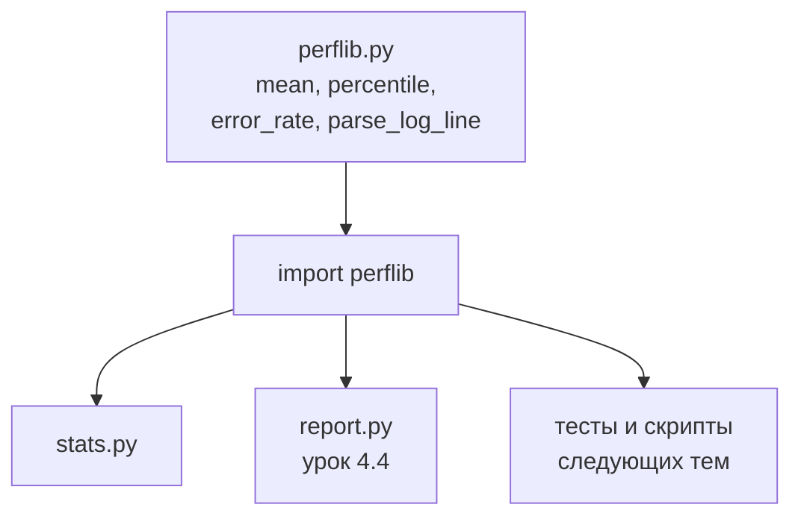
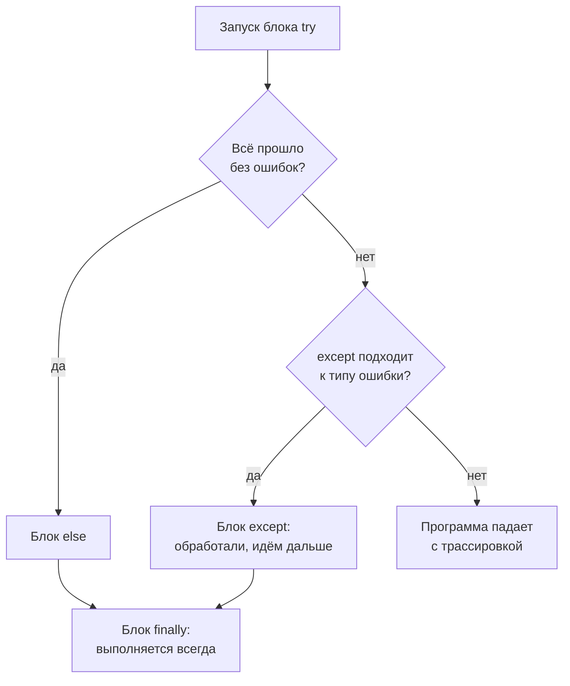

## Зачем это нужно

К концу [урока 4.2](02-conditions-loops.md) у тебя есть `stats.py`, который считает среднее и p95 для одного списка. Завтра понадобится то же для результатов другого теста. Послезавтра для третьего. Скопировать код в каждый скрипт можно, но через месяц в десяти файлах будет десять слегка разных версий формулы, и никто не поймёт, какая правильная. Когда окажется, что в одной версии был баг, исправлять придётся везде.

Для этого в языке есть три инструмента:

- **функция** (function): код с именем, который пишется один раз и вызывается из любого места;
- **модуль** (module): файл `.py` с набором функций, который подключается в других скриптах одной строкой;
- **исключение** (exception): способ программе сказать «что-то пошло не так» и способ тебе ответить «знаю, что делать».

Последнее особенно важно для тестировщика. Реальные данные грязные: в логе встретится пустая строка, в ответе сервера не окажется нужного поля, файл не найдётся. Скрипт, который падает на первой такой странности и теряет результаты трёх часов прогона, никому не нужен. Скрипт, который пропустил одну плохую строку, посчитал, сколько их было, и закончил работу, это нормальный рабочий инструмент.

Шаг проекта: в `~/perf-lab/04-python/` появится модуль `perflib.py` с функциями `mean`, `percentile`, `error_rate` и `parse_log_line`. На него будут опираться уроки 4.4 и дальше (отчёты, тесты, скрипты нагрузки). Модуль и два скрипта, которые его используют, ты закоммитишь в `perf-lab`.

## Что нужно знать

- Переменные, типы, f-строки, трассировка ошибок: [урок 4.1](01-first-program.md). Ошибки `TypeError`, `ValueError` и `NameError` ты там уже видел, теперь научишься их перехватывать.
- Списки, циклы, словари, условия, подсчёт p95 руками: [урок 4.2](02-conditions-loops.md). Функции, которые ты напишешь, это упакованные версии кода оттуда.
- Метод ближайшего ранга для перцентиля: [урок 8.1](../08-perf-theory/01-latency-throughput.md). Функция `percentile` считает его так же, как `measure.py` из 8.1.

## Картина целиком

На кухне ресторана у повара есть **заготовки**: бульон, соус, тесто. Их готовят один раз и используют в десяти блюдах. Заготовка принимает на вход продукты (параметры), выдаёт результат (возврат) и хранится на полке (в модуле). Блюду не важно, как сварен бульон, достаточно знать название и что внутри. А если в какой-то день пришла плохая партия мяса, повар не выбрасывает весь ужин: он откладывает испорченное, записывает в журнал и продолжает готовить из остального. Это исключения.



На схеме видно: функции пишутся в одном месте, а подключаются в любом количестве скриптов. Исправил формулу в `perflib.py`, и все скрипты получили исправление. Второй рисунок покажет, что происходит, когда в этой цепочке случается ошибка:



Смотри на схему: ошибка не обязательно останавливает программу. Если для неё есть подходящий `except`, управление переходит туда, и скрипт живёт дальше. Блок `finally` (если он есть) выполняется в любом случае, и поэтому в нём делают уборку: закрывают файлы и соединения.

## Теория

### Функции: def, параметры, return

**Зачем это существует.** Если одни и те же пять строк нужны в десяти местах, их копируют десять раз, и это плохо по трём причинам: ошибку надо чинить десять раз; при чтении кода непонятно, что делают эти пять строк; через неделю копии разойдутся. Функция даёт блоку кода **имя**, после чего вместо пяти строк пишется `mean(times)`.

**Аналогия.** Рецепт соуса на карточке: названием «Соус бешамель» можно пользоваться в любом блюде, не пересказывая рецепт. Аналогия ломается там, где у карточки нет «вернуть результат»: у функции он есть, и это делает её пригодной для подсчётов.

**Как это устроено.** Функция определяется словом `def`:

```python
def mean(values):
    total = sum(values)
    return total / len(values)
```

- `def mean(values):` объявляет функцию с именем `mean`. В скобках **параметры** (parameters): имена, под которыми внутри функции будут доступны переданные данные. Двоеточие в конце обязательно, дальше блок с отступом 4 пробела.
- `return значение` отдаёт результат туда, откуда функцию вызвали, и **тут же завершает функцию**: строки после `return` не выполнятся.
- Сам по себе `def` ничего не выполняет, он только **запоминает** функцию под именем. Код внутри работает только при вызове.

Вызов: `mean([120, 95, 310, 88])`. То, что передано в скобках при вызове, называется **аргументами** (arguments); при вызове они подставляются в параметры по порядку. Результат можно сохранить в переменную: `result = mean(times)`.

Посмотри, как Python входит в функцию и выходит из неё. Нажимай «Шаг ▶» и следи за правой колонкой: когда программа внутри функции, в ней видны только переменные функции.

<div class="viz" data-viz="py-trace" data-title="Вызов функции по шагам" data-speed="1800" data-code='["def mean(values):","    total = sum(values)","    return total / len(values)","","times = [120, 95, 310, 88]","result = mean(times)","print(f\"среднее {result}\")"]' data-steps='[{"l":1,"v":{},"n":"`def` только запоминает функцию `mean`. Тело внутри пока не выполняется."},{"l":5,"v":{"times":"[120, 95, 310, 88]"},"n":"Список времён создан на верхнем уровне файла."},{"l":6,"v":{"times":"[120, 95, 310, 88]"},"n":"Строка вызова `mean(times)`: Python переходит внутрь функции, список передаётся в параметр `values`."},{"l":2,"v":{"values":"[120, 95, 310, 88]","total":"613"},"f":"mean(values)","n":"Мы внутри функции: `values` это тот же список, переданный при вызове. `total` локальная переменная, снаружи её не видно."},{"l":3,"v":{"values":"[120, 95, 310, 88]","total":"613"},"f":"mean(values)","n":"`return` отдаёт результат 613 / 4 = 153.25 и завершает функцию."},{"l":6,"v":{"times":"[120, 95, 310, 88]","result":"153.25"},"n":"Возврат из функции: результат 153.25 записан в `result`, локальные `values` и `total` исчезли."},{"l":7,"v":{"times":"[120, 95, 310, 88]","result":"153.25"},"o":"среднее 153.25","n":"Печатаем результат. Переменных `values` и `total` уже нет: они жили только внутри функции."}]' data-try="смотри на колонку переменных: при входе в функцию там меняется набор имён, при выходе возвращается прежний."></div>

Смотри на виджет: `def` не выполняется, Python только запоминает функцию (первая подсветка). Затем идёт строка вызова, управление прыгает внутрь `mean`, и там появляются свои переменные `values` и `total`. После `return` Python возвращается на строку вызова, переменные функции исчезают, а результат 153.25 попадает в `result`.

**Параметры по умолчанию и именованные аргументы.** Параметру можно задать значение на случай, если его не передали: `def percentile(values, p=95):`. Тогда `percentile(times)` посчитает p95, а `percentile(times, 99)` p99. Аргументы можно передавать по имени: `percentile(values=times, p=50)`. Это читается лучше, когда параметров много: сразу видно, что значит `50`.

**Функция без `return`.** Если `return` нет, функция возвращает `None`. Это источник частой ошибки: ты написал функцию, которая считает сумму, но забыл `return`, и вместо суммы получаешь `None`. Разница важна: `print` показывает значение человеку, а `return` отдаёт его программе. Функцию с `print` внутри нельзя использовать в вычислениях: `mean(times) * 2` не сработает, если `mean` только печатает.

**Документация функции.** Первая строка внутри функции в тройных кавычках называется **docstring**: она описывает, что делает функция. Python и редакторы показывают её в подсказке. Пиши коротко: что принимает и что возвращает.

**Разобранный пример.** Функции для нашего проекта:

```python
def percentile(values, p):
    """Перцентиль p (0-100) методом ближайшего ранга."""
    ordered = sorted(values)
    rank = math.ceil(p / 100 * len(ordered))
    return ordered[max(rank, 1) - 1]
```

Читаем по строкам: `sorted` расставляет значения по возрастанию, как в 4.2. `math.ceil` округляет вверх (модуль `math` подключается ниже). В 4.2 тот же ранг считали через `(p * n + 99) // 100`, потому что модулей ещё не было; `math.ceil` делает то же самое, результат одинаков, а читается проще. Так что `p / 100 * len(ordered)` для p = 95 и 20 значений даёт 19.0 и ранг 19. `max(rank, 1)` страхует от p = 0: тогда ранг получился бы 0, индекс `-1` взял бы последний элемент, а не первый. Индекс на единицу меньше ранга. Вызов `percentile(sample, 95)` на уже знакомых 20 значениях вернёт 48: тот же ответ, что считал `stats.py` в 4.2, но теперь одной строкой.

**Что путают.**

- Забывают `return` и получают `None`. Или ставят `return` слишком рано, и остаток функции не выполняется.
- Путают параметры и аргументы: параметр это имя в определении (`values`), аргумент это значение при вызове (`times`).
- Вызывают функцию без скобок: `mean` без `(...)` это не вызов, а сама функция как значение; Python ошибки не даст, а результата не будет.
- Меняют переданный список внутри функции и не ожидают, что он изменится снаружи (списки изменяемы, вспомни «две наклейки» из 4.2). Лучше возвращать новый список.

> **Проверь понимание:** функция `def double(x): print(x * 2)` вызвана как `y = double(5)`. Что напечатается и чему равно `y`?

<details markdown="1">
<summary>Ответ</summary>

Напечатается `10`, а `y` будет равно `None`: у функции нет `return`, она только печатает. Чтобы использовать результат в расчётах, нужно заменить `print(x * 2)` на `return x * 2`.

</details>

### Области видимости: где живут переменные

**Зачем это существует.** Если бы все переменные были общими, две функции, использующие имя `total`, мешали бы друг другу. Поэтому переменные, созданные внутри функции, видны только внутри неё.

**Как это устроено.** Переменные, созданные в функции (и параметры), называются **локальными** (local): они возникают при вызове и пропадают при возврате. Переменные верхнего уровня файла называются **глобальными** (global): их можно читать изнутри функций, но присваивать им из функции нельзя без специального слова `global`, и лучше этим не пользоваться: передавай данные через параметры и забирай через `return`.

```python
def count_errors(codes):
    errors = 0
    for code in codes:
        if code >= 400:
            errors += 1
    return errors

print(count_errors([200, 500, 404]))
print(errors)
```

```text
2
Traceback (most recent call last):
  File "/home/student/perf-lab/04-python/scope.py", line 9, in <module>
    print(errors)
          ^^^^^^
NameError: name 'errors' is not defined
```

Читаем: функция вернула 2. Но переменная `errors` жила только внутри неё, снаружи имени нет, и `NameError` это подтверждает. Это не поломка, а защита: что происходит внутри функции, остаётся внутри.

**Что путают.** Ожидают, что переменная из функции будет видна снаружи. И наоборот, случайно называют локальную переменную так же, как глобальную (`times` внутри и снаружи) и не понимают, какая из них сейчас используется: внутри функции побеждает локальная.

> **Проверь понимание:** функция задаёт `total = 0`, а в программе выше тоже есть `total = 500`. Изменится ли внешний `total` после вызова функции?

<details markdown="1">
<summary>Ответ</summary>

Нет. Внутри функции `total` это новая локальная переменная, она не затрагивает внешнюю. Внешний `total` останется 500.

</details>

### Модули и import: свой код в отдельном файле

**Зачем это существует.** Функции, которые нужны во многих скриптах, неудобно держать в каждом. Их выносят в отдельный файл, и любой скрипт подключает его одной строкой.

**Как это устроено.** **Модуль** (module) это обычный файл `.py`. Файл `perflib.py` это модуль `perflib`. Подключение называется **импортом** (import):

```python
import perflib
print(perflib.mean([1, 2, 3]))
```

или так, чтобы вызывать функции без префикса:

```python
from perflib import mean, percentile
print(mean([1, 2, 3]))
```

Первая форма удобна, когда имён много и хочется видеть, откуда функция (`perflib.mean`); вторая короче. Есть и переименование: `import statistics as st`. Звёздочку `from perflib import *` не используй: непонятно, откуда что взялось.

Где Python ищет модуль: сначала **в каталоге запущенного скрипта**, потом в стандартной библиотеке и установленных пакетах. Поэтому `perflib.py` должен лежать рядом со скриптом (или скрипт запускается из этого каталога). Если файла нет, будет `ModuleNotFoundError: No module named 'perflib'`.

**Условие `if __name__ == "__main__":`.** Когда файл запускают напрямую (`python3 perflib.py`), Python записывает в специальную переменную `__name__` значение `"__main__"`. Когда файл импортируют, значение другое (имя модуля). Это позволяет в конце модуля оставить блок, который сработает **только при прямом запуске**, и не сработает при импорте:

```python
if __name__ == "__main__":
    print("mean =", mean([1, 2, 3]))
```

Так в модуле оставляют самопроверку: запустил файл, увидел, что функции работают. А при `import perflib` из другого скрипта лишний вывод не появится.

**Стандартная библиотека** (standard library) это набор готовых модулей, которые идут вместе с Python и ставить ничего не нужно. Для тестировщика самые полезные:

| Модуль | Что даёт | Пример |
|---|---|---|
| `math` | математика | `math.ceil(19.8)` даёт `20` |
| `statistics` | среднее, медиана | `statistics.mean([1, 2, 3, 10])` даёт `4`, `statistics.median(...)` даёт `2.5` |
| `random` | случайные числа | `random.randint(1, 6)`, `random.choice(список)`, `random.seed(1)` |
| `time` | время | `time.perf_counter()`, `time.sleep(0.2)` |
| `sys` | параметры запуска | `sys.argv`, `sys.exit(1)` |
| `json`, `csv`, `pathlib` | данные и файлы | [урок 4.4](04-files-json-csv.md) |

Разберём два модуля, которых не хватало раньше.

- `time.perf_counter()` возвращает секунды (дробное число) с неопределённой начальной точки: сам по себе он бессмыслен, а **разность двух значений** даёт точную длительность. Так измеряют время запроса: `started = time.perf_counter()`, действие, `elapsed = time.perf_counter() - started`. Обычные часы (`time.time()`) могут перевести назад, поэтому для измерений берут именно `perf_counter`. `time.sleep(0.2)` приостанавливает программу на 0,2 секунды.
- `sys.argv` это список слов командной строки: `sys.argv[0]` имя скрипта, `sys.argv[1]` первый аргумент. Запуск `python3 timing.py 4` даст `["timing.py", "4"]`. Всё в `argv` текстовое: число нужно превратить через `int()`.
- `random.seed(число)` делает «случайные» числа повторяемыми: при одном и том же seed последовательность одна и та же. Для тестовых данных это важно: прогон можно воспроизвести. Пример понадобится в уроке 4.4.

**Разобранный пример.** Все функции модуля уже можно проверить: в `perflib.py` стоит самопроверка. Запуск `python3 perflib.py` даст:

```text
mean = 38.5
p95 = 48
error_rate = 50.0
{'method': 'GET', 'path': '/api/products', 'code': 200, 'ms': 42}
```

Читаем: на двадцати известных значениях среднее 38,5, p95 равен 48 (как в 8.1), из четырёх кодов `[200, 200, 500, 404]` две ошибки, то есть 50%, а строка лога разобрана в словарь с числами. Если после правки модуля эти четыре строки изменились, значит, сломалась функция.

**Что путают.**

- Называют свой файл так же, как модуль стандартной библиотеки: `statistics.py`, `random.py`, `json.py`. Python найдёт **твой** файл раньше стандартного, и все остальные скрипты внезапно ломаются (`AttributeError: partially initialized module...`, `cannot import name`). Свои файлы называй иначе: `perflib.py`, `stats_demo.py`.
- Запускают скрипт из другого каталога, где модуля нет: `ModuleNotFoundError`.
- Забывают про `if __name__ == "__main__":` и получают при импорте посторонний вывод.

> **Проверь понимание:** ты назвал файл `random.py` и в нём написал `import random; print(random.randint(1, 6))`. Что произойдёт?

<details markdown="1">
<summary>Ответ</summary>

Файл импортирует сам себя вместо стандартного модуля, потому что каталог скрипта проверяется первым. Будет ошибка вроде `AttributeError: partially initialized module 'random' has no attribute 'randint' (most likely due to a circular import)`. Нужно переименовать файл (и удалить каталог `__pycache__`, который остался рядом).

</details>

### Исключения: try, except, raise

**Зачем это существует.** Ошибки в Python это объекты-сигналы, которые «летят» вверх по цепочке вызовов, пока кто-нибудь их не поймает или не остановит программу. Ловить их нужно там, где ты знаешь, что делать: пропустить строку, повторить попытку, записать причину.

**Аналогия.** Сигнализация в магазине: если сработала, сообщение идёт охраннику; если охранник знает, что делать (вызвать наряд), ситуация обработана; если никто не отреагировал, звучит сирена на всю улицу (программа падает с трассировкой). Аналогия ломается на том, что охранник не должен реагировать на любой сигнал: не на каждую тревогу надо открывать огонь.

**Как это устроено.**

```python
try:
    ms = int(text)
except ValueError:
    ms = 0
```

- В блоке `try` пишут опасное действие: то, что может упасть.
- `except ТипОшибки:` перехватывает ошибку **этого типа**. Тип (`ValueError`, `KeyError`, `ZeroDivisionError`) называется в последней строке трассировки, и его же ты пишешь в `except`. Можно перечислить несколько типов в скобках: `except (ValueError, KeyError):`. Можно сохранить саму ошибку: `except ValueError as err:`, и тогда `err` содержит текст сообщения, его можно записать в лог.
- `else:` (необязательно) выполняется, если ошибки **не было**.
- `finally:` (необязательно) выполняется **всегда**: и после ошибки, и без неё. Здесь делают уборку.
- Если тип ошибки не совпал ни с одним `except`, исключение летит дальше, и программа падает с трассировкой.

**Как исключения прыгают по цепочке вызовов.** Если ошибка случилась внутри функции, а `try` стоит снаружи (в коде, который вызвал функцию), её поймают там. Поэтому в `perflib.py` функция `parse_log_line` сама не прячет проблему, а **сообщает** о ней словом `raise`:

```python
if len(parts) != 4:
    raise ValueError(f"ожидалось 4 поля, а в строке {len(parts)}: {line!r}")
```

`raise ValueError("текст")` создаёт ошибку вручную. Здесь функция говорит: «я не могу разобрать такую строку, решай сам, что с ней делать». Вызывающий код решает: пропустить, остановиться, посчитать. Запись `{line!r}` в f-строке выводит значение с кавычками, чтобы пустую строку было видно (`''`), а не пустое место.

**Разобранный пример.** Скрипт `use_lib.py` разбирает лог с грязными строками:

```python
from perflib import mean, percentile, error_rate, parse_log_line

lines = [
    "GET /api/products 200 42ms",
    "POST /api/orders 201 230ms",
    "",
    "POST /api/orders 500 1204ms",
    "GET /api/cart 200 oops",
    "GET /api/products 200 47ms",
]

times = []
codes = []
bad = 0
for line in lines:
    try:
        row = parse_log_line(line)
    except ValueError as err:
        bad += 1
        print("пропущена:", err)
        continue
    times.append(row["ms"])
    codes.append(row["code"])

print(f"Разобрано: {len(times)}, пропущено: {bad}")
print(f"Среднее: {mean(times):.1f} мс, p95: {percentile(times, 95)} мс")
print(f"Ошибок: {error_rate(codes):.1f}%")
```

```text
пропущена: ожидалось 4 поля, а в строке 0: ''
пропущена: время должно заканчиваться на ms: 'oops'
Разобрано: 4, пропущено: 2
Среднее: 380.8 мс, p95: 1204 мс
Ошибок: 25.0%
```

Читаем: пустая строка не прошла проверку числа полей, строка с `oops` вместо времени не прошла проверку суффикса, обе перехвачены `except ValueError`. `continue` пропускает остаток круга, чтобы испорченная строка не попала в списки. Остальные четыре разобраны: времена 42, 230, 1204, 47, их среднее (42 + 230 + 1204 + 47) / 4 = 380,75, то есть 380,8 при округлении до десятых; из четырёх кодов `200, 201, 500, 200` один ошибочный, то есть 25%. Главное: скрипт посчитал всё, что смог, и **сказал**, сколько строк пропустил.

**Какие ошибки ловить.** Ловить нужно конкретный тип, которого ждёшь: `except ValueError`. Две антипривычки:

- голый `except:` или `except Exception:` без разбора ловит всё подряд, включая настоящие баги и опечатки, и скрывает их;
- `except ...: pass` («поймал и промолчал») прячет проблему: скрипт работает, цифры неверные, а причины никто не видит. Если ошибку поймал, как минимум запиши или напечатай её и посчитай.

Это не теория. В разделе «Сломай и почини» ты увидишь, как `except: pass` превращает плохую строку в ошибку в совсем другом месте.

**Что путают.**

- Ловят слишком широко (`except Exception`) и прячут настоящие ошибки.
- Кладут в `try` весь скрипт вместо одной опасной строки: тогда непонятно, где именно упало.
- Забывают, что после `except` программа продолжается: если ошибка критична, нужно остановиться через `raise` или `sys.exit(1)`.
- Путают `raise` (создать ошибку) и `return` (вернуть значение).

> **Проверь понимание:** что напечатает код, если в `try` случилась ошибка `ValueError`, а блоки такие: `except ValueError: print("A")`, `else: print("B")`, `finally: print("C")`?

<details markdown="1">
<summary>Ответ</summary>

`A`, потом `C`. `else` выполняется только когда ошибки не было, `finally` выполняется всегда.

</details>

### Какие исключения встретятся чаще всего

В работе тестировщика чаще всего ловят такие:

| Исключение | Когда | Типичный `except` |
|---|---|---|
| `ValueError` | значение не подходит (`int("abc")`, плохая строка лога) | пропустить строку, записать причину |
| `KeyError` | нет ключа в словаре (в ответе сервера нет поля) | взять `.get` или сообщить об изменении формата |
| `ZeroDivisionError` | деление на ноль (в `mean` для пустого списка) | вернуть 0 или сообщить «нет данных» |
| `FileNotFoundError` | нет файла ([урок 4.4](04-files-json-csv.md)) | понятное сообщение «путь неверный» |

Хорошее правило: **не ловить то, чего не умеешь исправить.** Если ошибка значит «стенд не запущен», в отчёте с неправдоподобными цифрами пользы нет. Остановиться с понятным сообщением лучше, чем продолжить и соврать.

## Практика

Все файлы в `~/perf-lab/04-python/`. Для каждого: `nano имя.py`, вставь код, сохрани, запусти.

```bash
cd ~/perf-lab/04-python
```

### 1. Свой модуль `perflib.py`

```bash
nano perflib.py
```

```python
"""Мои функции для разбора результатов нагрузочных тестов."""
import math


def mean(values):
    """Среднее арифметическое списка чисел."""
    return sum(values) / len(values)


def percentile(values, p):
    """Перцентиль p (0-100) методом ближайшего ранга."""
    ordered = sorted(values)
    rank = math.ceil(p / 100 * len(ordered))
    return ordered[max(rank, 1) - 1]


def error_rate(codes):
    """Доля ответов с кодом 400 и выше, в процентах."""
    if not codes:
        return 0.0
    errors = 0
    for code in codes:
        if code >= 400:
            errors += 1
    return errors / len(codes) * 100


def parse_log_line(line):
    """Строка 'GET /api/products 200 42ms' -> словарь с полями.

    Если строка неправильная, бросает ValueError с понятным текстом.
    """
    parts = line.split()
    if len(parts) != 4:
        raise ValueError(f"ожидалось 4 поля, а в строке {len(parts)}: {line!r}")
    method, path, code, ms = parts
    if not ms.endswith("ms"):
        raise ValueError(f"время должно заканчиваться на ms: {ms!r}")
    return {
        "method": method,
        "path": path,
        "code": int(code),
        "ms": int(ms.replace("ms", "")),
    }


if __name__ == "__main__":
    # самопроверка: запускается только командой python3 perflib.py
    sample = [12, 13, 13, 14, 14, 15, 15, 15, 16, 16, 17, 17, 18, 19, 20, 22, 25, 31, 48, 410]
    print("mean =", round(mean(sample), 1))
    print("p95 =", percentile(sample, 95))
    print("error_rate =", error_rate([200, 200, 500, 404]))
    print(parse_log_line("GET /api/products 200 42ms"))
```

```bash
python3 perflib.py
```

```text
mean = 38.5
p95 = 48
error_rate = 50.0
{'method': 'GET', 'path': '/api/products', 'code': 200, 'ms': 42}
```

**Как читать вывод:** четыре строки самопроверки. Если `mean` не 38.5 или `p95` не 48, ищи ошибку в соответствующей функции. Три новых места: `if not codes:` защищает от пустого списка (иначе при `len(codes) == 0` случилось бы деление на ноль, `not` для пустого списка даёт `True`); `method, path, code, ms = parts` раскладывает четыре элемента списка по четырём переменным за раз (это называется распаковкой); `{...}` на последнем `return` создаёт словарь.

**Типичные ошибки:** `IndentationError: unindent does not match any outer indentation level`: отступ в одной из строк не кратен четырём или смешаны пробелы и табуляция; выровняй. `NameError: name 'math' is not defined`: забыта строка `import math` в начале.

### 2. Скрипт, который использует модуль: `use_lib.py`

Файл должен лежать рядом с `perflib.py`. Открой его и вставь код (он тот же, что в разборе выше):

```bash
nano use_lib.py
```

```python
from perflib import mean, percentile, error_rate, parse_log_line

lines = [
    "GET /api/products 200 42ms",
    "POST /api/orders 201 230ms",
    "",
    "POST /api/orders 500 1204ms",
    "GET /api/cart 200 oops",
    "GET /api/products 200 47ms",
]

times = []
codes = []
bad = 0
for line in lines:
    try:
        row = parse_log_line(line)
    except ValueError as err:
        bad += 1
        print("пропущена:", err)
        continue
    times.append(row["ms"])
    codes.append(row["code"])

print(f"Разобрано: {len(times)}, пропущено: {bad}")
print(f"Среднее: {mean(times):.1f} мс, p95: {percentile(times, 95)} мс")
print(f"Ошибок: {error_rate(codes):.1f}%")
```
Запусти:

```bash
python3 use_lib.py
```

Вывод тот же, что в разборе: два предупреждения о пропущенных строках, `Разобрано: 4, пропущено: 2`, среднее 380,8, p95 1204 и 25% ошибок.

**Как читать вывод:** сначала предупреждения (где и что пропустили), потом итоги. Проверь вручную: четыре времени 42, 230, 1204, 47. Если твои цифры другие, сравни входной список.

**Типичные ошибки:** `ModuleNotFoundError: No module named 'perflib'`: ты в другом каталоге или файл называется иначе (`pwd`, `ls`). `ImportError: cannot import name 'mean' from 'perflib'`: опечатка в имени функции или она не сохранена.

### 3. Время и аргументы командной строки: `timing.py`

```bash
nano timing.py
```

```python
import sys
import time

# сколько запросов «отправить»: из командной строки или 3 по умолчанию
count = 3
if len(sys.argv) > 1:
    count = int(sys.argv[1])

started = time.perf_counter()
for i in range(count):
    time.sleep(0.2)          # изображаем запрос, который занимает 0,2 с
    print("запрос", i + 1)
elapsed = time.perf_counter() - started

print(f"Запросов: {count}, время: {elapsed:.2f} с")
print(f"Скорость: {count / elapsed:.1f} запросов в секунду")
```

```bash
python3 timing.py 4
```

```text
запрос 1
запрос 2
запрос 3
запрос 4
Запросов: 4, время: 0.81 с
Скорость: 4.9 запросов в секунду
```

**Как читать вывод:** четыре «запроса» по 0,2 с занимают около 0,8 с (чуть больше: `sleep` и `print` добавляют доли секунды), и из этого считается скорость. Твои числа будут немного другие: ≈0,80-0,82 с и ≈4,9-5,0 запросов в секунду. Запусти без аргумента (`python3 timing.py`): сработает значение по умолчанию, 3 запроса. Запусти `python3 timing.py abc` и прочитай ошибку: `ValueError: invalid literal for int() with base 10: 'abc'`. Подумай, где здесь нужен `try/except`.

**Типичные ошибки:** `IndexError: list index out of range` на `sys.argv[1]`: проверка `len(sys.argv) > 1` потеряна. `TypeError: can only concatenate str (not "float") to str`: попытка склеить текст с числом, нужна f-строка.

### 4. Коммит

```bash
cd ~/perf-lab
git add 04-python
git commit -m "4.3: модуль perflib, функции, исключения"
git push
```

## Сломай и почини

**Поломка.** Два независимых файла. Первый сохрани как `broken3.py`, второй как `broken3b.py`.

```python
def total_ms(values):
    total = 0
    for v in values:
        total += v

avg = total_ms([120, 95, 310]) / 3
print(avg)
```

```python
def to_ms(text):
    try:
        return int(text.replace("ms", ""))
    except:
        pass

times = [to_ms("42ms"), to_ms("abc"), to_ms("17ms")]
print(sum(times))
```

**Задача.** Запусти каждую часть, прочитай ошибку, найди причину и исправь так, чтобы оба скрипта дали правильный результат. Для второй части ответь: где на самом деле произошла проблема, на строке с ошибкой или раньше? И как сделать так, чтобы плохое значение не терялось молча?

<details markdown="1">
<summary>Разбор</summary>

**Часть 1.**

```text
Traceback (most recent call last):
  File "/home/student/perf-lab/04-python/broken3.py", line 6, in <module>
    avg = total_ms([120, 95, 310]) / 3
          ~~~~~~~~~~~~~~~~~~~~~~~~~^~~~
TypeError: unsupported operand type(s) for /: 'NoneType' and 'int'
```

Сообщение читаем: делим что-то типа `NoneType` на число. Откуда `None`? Функция `total_ms` посчитала сумму, но в ней нет `return`, поэтому вызов отдал `None`. Исправление: добавить в конец функции `return total`. После этого `avg` равно 175.0 (сумма 525, на 3).

**Часть 2.**

```text
Traceback (most recent call last):
  File "/home/student/perf-lab/04-python/broken3b.py", line 8, in <module>
    print(sum(times))
          ^^^^^^^^^^
TypeError: unsupported operand type(s) for +: 'int' and 'NoneType'
```

Ошибка на строке 8, а причина в строках 4-5: `except: pass` молча проглотил `ValueError` от `int("abc")`, и функция вернула `None` вместо числа. `sum` споткнулась уже потом, когда в списке оказался `None`. Именно так «поймал и промолчал» превращает понятную проблему («`abc` не число») в непонятную и далёкую. Исправление: ловить конкретную ошибку и сообщать о ней, а не молчать:

```python
def to_ms(text):
    try:
        return int(text.replace("ms", ""))
    except ValueError:
        print("не смог разобрать время:", repr(text))
        return None

times = [to_ms("42ms"), to_ms("abc"), to_ms("17ms")]
good = []
for t in times:
    if t is not None:
        good.append(t)
print(sum(good))
```

Фильтр в цикле выбрасывает `None`. Результат: сообщение о плохом значении `'abc'` и сумма 59. Правила: ловим конкретный тип, ошибку не прячем, а записываем или считаем, а ошибка на одной строке бывает следствием молчания на другой.

</details>

## Словарик урока

| Термин | Простыми словами |
|---|---|
| Функция (function) | Блок кода с именем: вызываешь по имени и получаешь результат |
| `def` | Слово, которым объявляют функцию; само тело при этом не выполняется |
| Параметр (parameter) | Имя входных данных в определении функции |
| Аргумент (argument) | Значение, которое передаёшь функции при вызове |
| `return` | Отдаёт результат из функции и завершает её; без `return` будет `None` |
| Значение по умолчанию | Параметр с запасным значением: `def f(x, p=95)` |
| Docstring | Описание функции в тройных кавычках первой строкой |
| Локальная переменная | Переменная внутри функции; снаружи её не видно |
| Модуль (module) | Файл `.py` с функциями, который подключают в других файлах |
| `import` | Подключение модуля: `import perflib` или `from perflib import mean` |
| `__name__ == "__main__"` | Условие «файл запущен напрямую, а не подключён» |
| Стандартная библиотека | Модули, которые идут с Python: `math`, `time`, `random`, `sys` |
| `sys.argv` | Список слов командной строки (текстовых) |
| Исключение (exception) | Сигнал об ошибке, который идёт вверх по цепочке вызовов, пока его не поймают |
| `try` / `except` | Пробуем действие / ловим ошибку определённого типа |
| `raise` | Создать ошибку вручную |
| `finally` | Блок, который выполняется всегда, с ошибкой или без |

## Вопросы с собеседований

Раздел для повторения: ответь вслух, потом открой ответ. Последние четыре помечены `[на скорость]`.

### 1. [junior] [часто] Чем параметр отличается от аргумента?

<details markdown="1">
<summary>Ответ</summary>

Параметр это имя переменной в определении функции (`def mean(values)`, параметр `values`). Аргумент это конкретное значение, которое передают при вызове (`mean(times)`, аргумент `times`). Внутри функции аргумент доступен под именем параметра.

**Что хотят услышать:** различие «определение и вызов» с примером.

**Красный флаг:** считает слова полностью взаимозаменяемыми и не может объяснить разницу.

</details>

### 2. [junior] [часто] Что делает `return` и что будет, если его нет?

<details markdown="1">
<summary>Ответ</summary>

`return` отдаёт значение туда, откуда вызвали функцию, и сразу завершает её. Если `return` нет (или он без значения), функция возвращает `None`. Типичная ошибка: функция только печатает результат через `print`, а ожидали, что можно использовать его в расчёте.

**Что хотят услышать:** `None` и разницу между `print` и `return`.

**Красный флаг:** путает вывод на экран с возвратом значения.

</details>

### 3. [junior] [часто] Как работает `try/except` и зачем нужен конкретный тип ошибки?

<details markdown="1">
<summary>Ответ</summary>

Код в `try` выполняется, и если возникло исключение, управление переходит в подходящий `except`, а программа не падает. Конкретный тип (`except ValueError`) ловит только ожидаемую проблему. Голый `except:` или `except Exception` ловит всё подряд и прячет настоящие баги, например опечатку в имени.

**Что хотят услышать:** ловить конкретное, не молчать, записывать или считать.

**Красный флаг:** «ставлю `try/except: pass`, чтобы не падало».

</details>

### 4. [junior] Что такое модуль и как подключить функцию из своего файла?

<details markdown="1">
<summary>Ответ</summary>

Модуль это файл `.py`. Файл `perflib.py` подключается через `import perflib` (вызов `perflib.mean(...)`) или `from perflib import mean`. Python ищет файл сначала в каталоге запущенного скрипта, затем в стандартной библиотеке и установленных пакетах.

**Что хотят услышать:** обе формы импорта и где ищется модуль.

**Красный флаг:** копирует функции из файла в файл вместо импорта.

</details>

### 5. [junior] Зачем нужна строка `if __name__ == "__main__":`?

<details markdown="1">
<summary>Ответ</summary>

Она отделяет код, который должен работать только при прямом запуске файла, от кода, который выполняется при импорте. Без неё при `import` модуль выполнил бы свои `print` и самопроверки. С ней в модуле оставляют самопроверку или точку входа.

**Что хотят услышать:** «при импорте не выполняется», пример.

**Красный флаг:** считает, что это обязательная магия для запуска.

</details>

### 6. [junior] Какие модули стандартной библиотеки ты используешь и для чего?

<details markdown="1">
<summary>Ответ</summary>

`math` (округление, `ceil`), `statistics` (среднее, медиана), `random` (тестовые данные, `seed` для повторяемости), `time` (`perf_counter` для измерения, `sleep` для пауз), `sys` (`argv`, `exit`), позже `json`, `csv`, `pathlib` для данных и файлов.

**Что хотят услышать:** 4-5 модулей с назначением.

**Красный флаг:** называет только сторонние пакеты и не знает стандартные.

</details>

### 7. [middle] Почему `time.perf_counter()`, а не `time.time()`, для измерения длительности?

<details markdown="1">
<summary>Ответ</summary>

`perf_counter` это монотонные часы высокой точности: они только идут вперёд и не зависят от перевода системного времени (синхронизация по сети, переход на летнее время). `time.time()` показывает настенное время, которое может скакнуть назад или вперёд, и тогда разность получится неверной. Измеряют разностью двух вызовов.

**Что хотят услышать:** «монотонные», «разность двух значений».

**Красный флаг:** считает по `time.time()` и не учитывает возможные скачки.

</details>

### 8. [middle] Почему опасен `except: pass`?

<details markdown="1">
<summary>Ответ</summary>

Он прячет причину проблемы: программа не падает, но данные испорчены, а симптом проявляется позже и в другом месте (например `None` в списке чисел, который ломает `sum`). Ещё голый `except` ловит и `KeyboardInterrupt` (остановку по `Ctrl+C`), поэтому программу трудно остановить. Правильно ловить конкретный тип, записывать или считать пропуски и продолжать осознанно.

**Что хотят услышать:** «скрывает причину» и пример отложенного симптома.

**Красный флаг:** использует `except: pass` как стандартный приём.

</details>

### 9. [middle] Когда функция должна бросить исключение, а когда вернуть `None` или код ошибки?

<details markdown="1">
<summary>Ответ</summary>

Если функция не может выполнить задачу и вызывающий код должен узнать об этом, лучше бросить исключение с понятным текстом: его нельзя случайно проигнорировать. `None` легко проскочит и вызовет ошибку далеко от причины. `None` уместен, когда «нет результата» это нормальный исход (например, поиск без находки), и вызывающий проверяет его явно.

**Что хотят услышать:** «исключение нельзя молча пропустить», критерий нормальный исход или нарушение.

**Красный флаг:** возвращает `-1` или `0` как «ошибку» и не документирует.

</details>

### 10. [middle] Как сделать так, чтобы «случайные» тестовые данные были воспроизводимыми?

<details markdown="1">
<summary>Ответ</summary>

Зафиксировать семя генератора: `random.seed(42)` перед генерацией. Тогда при каждом запуске последовательность одна и та же, и результаты прогона можно сравнить или воспроизвести баг. Без `seed` каждый запуск даёт новые данные, и сравнивать нельзя.

**Что хотят услышать:** `seed` и зачем это в тестах.

**Красный флаг:** считает случайность в тестах всегда желательной.

</details>

### 11. [на скорость] Что вернёт функция без `return`?

<details markdown="1">
<summary>Ответ</summary>

`None`.

**Что хотят услышать:** без запинки.

**Красный флаг:** отвечает `0` или пустую строку.

</details>

### 12. [на скорость] Как получить первый аргумент командной строки?

<details markdown="1">
<summary>Ответ</summary>

`sys.argv[1]` (после `import sys`). Он текстовый, число получают через `int()`. `sys.argv[0]` это имя скрипта.

**Что хотят услышать:** индекс 1 и что это строка.

**Красный флаг:** `sys.argv[0]`.

</details>

### 13. [на скорость] Что делает `finally`?

<details markdown="1">
<summary>Ответ</summary>

Выполняется всегда: и после успешного `try`, и после перехваченной ошибки, и даже если ошибку не поймали. Используется для уборки: закрыть файл, соединение.

**Что хотят услышать:** «всегда».

**Красный флаг:** считает, что `finally` только при ошибке.

</details>

### 14. [на скорость] Что будет, если назвать свой файл `random.py`?

<details markdown="1">
<summary>Ответ</summary>

Python импортирует его вместо стандартного модуля `random`, и всё, что использует `random`, сломается (`AttributeError`/`ImportError`). Свои файлы называют иначе.

**Что хотят услышать:** тень стандартного модуля.

**Красный флаг:** не видит проблемы.

</details>

## Проверено на версиях

Python 3.12.3 (Ubuntu 24.04) и новее. Тексты ошибок приведены в формате Python 3.12 и новее. Октябрь 2026.

## Итог урока: ты умеешь

- [ ] Написать функцию с параметрами, `return` и значением по умолчанию, вызвать её по порядку и по имени.
- [ ] Объяснить, чем `print` отличается от `return`, и что вернёт функция без `return`.
- [ ] Объяснить локальные переменные и почему переменная из функции снаружи не видна.
- [ ] Вынести функции в свой модуль, подключить его через `import` и `from ... import`.
- [ ] Использовать `if __name__ == "__main__":` для самопроверки модуля.
- [ ] Применить `math`, `time.perf_counter`, `random.seed`, `sys.argv`.
- [ ] Поймать конкретную ошибку через `try/except`, не прячась за голым `except`.
- [ ] Бросить ошибку через `raise ValueError(...)` с понятным текстом.
- [ ] Не называть свои файлы именами стандартных модулей.

Дальше: [урок 4.4. Файлы, JSON и CSV: данные для тестов](04-files-json-csv.md): ты начнёшь читать результаты прогона из файлов и писать отчёты с помощью `perflib.py`.
