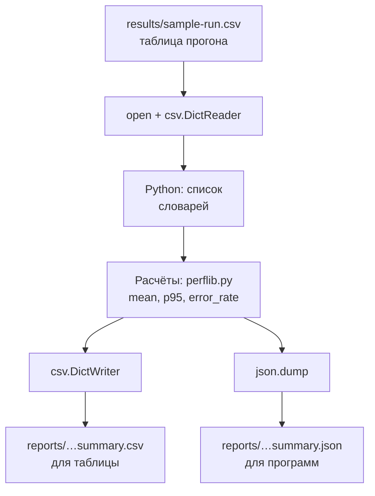

## Зачем это нужно

До сих пор твои данные жили прямо в программе: список из двадцати времён, десять строк лога внутри `logparse.py`. В настоящей работе данные приходят **снаружи**: Locust (программа, которая создаёт нагрузку на сервис; её ты освоишь в теме 9) после прогона, то есть одного запуска теста, сохраняет таблицу результатов, сервер отдаёт ответ в формате JSON, лог лежит файлом на диске. Скрипту нужно уметь три вещи: прочитать файл, понять его формат и записать результат обратно, чтобы его мог открыть человек (в таблице) или другая программа.

Для тестировщика самые частые форматы это три:

- **текстовый файл**: лог, список адресов, заметка;
- **CSV** (comma-separated values, «значения через запятую»): таблица, которую открывают Excel, LibreOffice и любые скрипты. В CSV Locust и k6 (второй инструмент нагрузки, тема 10) сохраняют результаты прогона;
- **JSON** (JavaScript Object Notation): формат, в котором веб-сервисы, включая наш «Магазин», отвечают на запросы, и в котором хранят настройки и тестовые данные.

Шаг проекта: ты сохранишь ответ стенда в файл и разберёшь его, получишь учебный файл результатов прогона `results/sample-run.csv`, напишешь `report.py`, который читает этот файл и пишет сводку по эндпоинтам (среднее время, p95 и доля ошибок: что это за числа, объяснит тема 8, пока достаточно знать, что p95 это время, которого хватило 95 запросам из 100) в `reports/` в двух форматах, и закоммитишь всё в `perf-lab`. Сводки такого вида ты будешь делать после каждого настоящего прогона.

## Что нужно знать

- Функции, модули, исключения и твой `perflib.py` (`mean`, `percentile`, `error_rate`): [урок 4.3](03-functions-errors.md). `report.py` подключает его.
- Циклы, словари, списки и словарь-счётчик: [урок 4.2](02-conditions-loops.md).
- Стенд «Магазин» запущен и отвечает на `http://localhost:8000` ([урок 2.1](../02-web/01-client-server-http.md)). Для проверки: `curl -s localhost:8000/healthz` должен вернуть `{"status":"ok"}`. Если стенда нет, в практике ниже есть запасной вариант с готовым файлом.
- Каталоги `~/perf-lab/results` и `~/perf-lab/reports` созданы в [уроке 1.1](../01-linux/01-workstation-terminal.md).
- Путь, абсолютный и относительный, и `curl`: уроки 1.1 и 2.1. Утилита `jq` (она ставилась в 1.1) пригодится для просмотра JSON.

## Картина целиком

Возьми склад, куда приезжают грузы в разных упаковках. Часть коробок обычные (текст), часть в контейнерах с отделениями и ярлыками (JSON: вложенные «коробки в коробках»), часть это таблицы с одинаковыми строками (CSV). Кладовщик делает три действия: **открыть** упаковку, **достать** содержимое, **закрыть** (чтобы не осталось открытых контейнеров). Для файлов в Python эти три действия делает оператор `with open(...)`.



Что здесь видно: файл читается в знакомые тебе списки и словари, дальше идут расчёты, которые ты уже умеешь, и результат записывается в двух форматах: CSV человеку (открыть в таблице), JSON другой программе. Весь урок это стрелки в этой схеме.

## Теория

### Файлы: open и with

**Зачем это существует.** Данные в переменных исчезают, когда программа завершилась. Чтобы результат пережил программу, его пишут в файл, а чтобы использовать чужие данные, их читают из файла.

**Аналогия.** Книга в библиотеке: чтобы прочитать, её берёшь (открываешь), читаешь, потом **возвращаешь**. Если не вернуть, другой читатель не получит, а библиотека будет считать, что книга у тебя. Аналогия ломается тем, что у файла читателей может быть много одновременно, а вот писать в него одновременно двоим нельзя.

**Как это устроено.** Функция `open(путь, режим)` открывает файл и возвращает **файловый объект**, через который идёт чтение и запись. Файл нужно закрыть: иначе данные могут не дойти до диска, а операционная система ограничивает число открытых файлов. Чтобы не забыть, используют конструкцию `with`:

```python
with open("access.log", encoding="utf-8") as f:
    text = f.read()
```

`with ... as f:` открывает файл, даёт ему имя `f` на время блока (отступ) и **закрывает автоматически** при выходе из блока, даже если внутри случилась ошибка. Это то самое `finally` из урока 4.3, но уже встроенное.

Режимы открытия (второй аргумент):

| Режим | Что делает | Если файла нет | Если файл есть |
|---|---|---|---|
| `"r"` (по умолчанию) | читать | ошибка `FileNotFoundError` | читаем |
| `"w"` | писать | создаёт | **стирает** содержимое |
| `"a"` | дописывать в конец | создаёт | добавляет после имеющегося |

Режим `"w"` опасен: он стирает файл **в момент открытия**, ещё до записи. Если по ошибке открыл «w» файл, из которого хотел читать, данных больше нет. Спроси себя: читаю или пишу?

Параметр `encoding="utf-8"`: **кодировка** (encoding) определяет, как буквы превращаются в байты на диске. UTF-8 это стандарт, в котором работают кириллица и любые знаки. Без явного указания Python на некоторых системах берёт кодировку по умолчанию, и русский текст превращается в `????` или падает с `UnicodeDecodeError`. Всегда пиши `encoding="utf-8"`.

Как читать:

| Действие | Запись | Что получим |
|---|---|---|
| Весь файл одной строкой | `f.read()` | строка (для больших файлов память!) |
| Все строки списком | `f.readlines()` | список строк с `\n` на концах |
| По одной строке | `for line in f:` | строки по очереди, память не растёт |

Для больших файлов (логи на гигабайты) единственный правильный способ это последний: `for line in f:`, в каждый момент в памяти одна строка. Каждая строка заканчивается символом перевода строки `\n`, и его убирают через `.strip()` (знакомо из 4.1).

Запись: `f.write("текст\n")` пишет строку (перевод строки `\n` добавляешь сам), `print("текст", file=f)` пишет как обычный `print`, с переводом строки.

**Пути.** Путь к файлу бывает **относительным** (от каталога, откуда запущен скрипт: `results/data.csv`) и **абсолютным** (`/home/student/perf-lab/results/data.csv`). Относительный путь ломается, если запустить скрипт из другого каталога: Python ищет файл не там. Надёжный способ даёт модуль `pathlib`:

```python
from pathlib import Path

lab = Path.home() / "perf-lab"
results = lab / "results" / "sample-run.csv"
print(results)
print(results.exists())
```

```text
/home/student/perf-lab/results/sample-run.csv
True
```

Читаем: `Path.home()` это домашний каталог (`/home/student`), а оператор `/` склеивает части пути (не делит!). Метод `.exists()` отвечает, есть ли файл по этому пути. Такой путь работает из любого каталога. У объекта пути есть полезные свойства: `.name` (имя файла), `.suffix` (расширение `.csv`), `.parent` (каталог выше) и метод `.mkdir(exist_ok=True)` (создать каталог, если его нет).

**Что путают.**

- Открывают «w» файл, из которого хотели читать: данные стёрты.
- Забывают `encoding="utf-8"`, и русский текст ломается.
- Запускают скрипт из другого каталога и получают `FileNotFoundError` для относительного пути. Чинится `Path.home() / ...` или `Path(__file__).parent / ...`.
- Читают гигабайтный лог через `read()` и забивают память.
- Забывают `strip()` и получают лишний `\n` в данных.

> **Проверь понимание:** в файле `notes.txt` было 100 строк. Скрипт выполнил `with open("notes.txt", "w") as f: pass`. Сколько строк в файле теперь?

<details markdown="1">
<summary>Ответ</summary>

Ноль. Режим `"w"` стирает файл при открытии, даже если ничего не пишешь. Для дописывания в конец нужен режим `"a"`.

</details>

### JSON: формат ответов сервера

**Зачем это существует.** Двум программам нужно обмениваться данными со вложенной структурой: сервер отдаёт товар с названием, ценой, категорией и остатком, а клиент должен всё это разобрать. Нужен общий формат, одинаковый для любых языков. Такой формат это JSON: текст, который читает и человек, и любая программа.

**Аналогия.** Анкета с полями и вложенными таблицами: поле «Фамилия», поле «Адреса» с несколькими строками. Аналогия ломается тем, что JSON не помнит типов Python (там нет кортежей и множеств, только набор простых типов).

**Как это устроено.** JSON выглядит почти как знакомые тебе словарь и список Python:

```json
{"id": 17, "name": "Товар 17", "price": 729.0, "tags": ["новинка", "акция"], "discount": null, "in_stock": true}
```

Правила JSON:

- объект `{ ... }` это пары «ключ: значение», **ключи всегда в двойных кавычках**;
- массив `[ ... ]` это список значений;
- значения: строка (в **двойных** кавычках), число, `true`, `false`, `null`.

Соответствие типов (запомни таблицу):

| JSON | Python |
|---|---|
| объект `{...}` | `dict` |
| массив `[...]` | `list` |
| строка `"..."` | `str` |
| число `42`, `3.5` | `int`, `float` |
| `true` / `false` | `True` / `False` |
| `null` | `None` |

Для работы есть модуль `json` из стандартной библиотеки, и его четыре функции:

| Функция | Что делает |
|---|---|
| `json.loads(текст)` | строка JSON -> объект Python (**s** это string) |
| `json.load(файл)` | то же, но читает из открытого файла |
| `json.dumps(объект)` | объект Python -> строка JSON |
| `json.dump(объект, файл)` | то же, но пишет в открытый файл |

Запомнить просто: буква `s` в конце значит «строка» (string), без буквы работа с файлом.

Параметры записи: `indent=2` делает отступы (читать глазами удобнее), `ensure_ascii=False` оставляет кириллицу читаемой. Без него русские буквы превратятся в `\u0422\u043e\u0432...` (так записаны коды букв): формально верно, а читать невозможно.

Посмотри, как строка JSON превращается в словарь Python и как мы потом достаём из него поле. Нажми «Шаг ▶»:

<div class="viz" data-viz="py-trace" data-title="JSON-строка превращается в словарь" data-speed="1800" data-code='["import json","line = &#39;{\"method\": \"POST\", \"route\": \"/api/orders\", \"status\": 500, \"duration_ms\": 1204.5}&#39;","record = json.loads(line)","status = record[\"status\"]","if status >= 500:","    print(\"ошибка сервера на\", record[\"route\"])"]' data-steps='[{"l":1,"v":{},"n":"Подключаем модуль `json` из стандартной библиотеки."},{"l":2,"v":{"line":"&#39;{\"method\": \"POST\", \"route\": \"/api/orders\", \"status\": 500, \"duration_ms\": 1204.5}&#39;"},"n":"`line` это просто текст: одна длинная строка в кавычках. Достать из неё поле нельзя."},{"l":3,"v":{"line":"&#39;{\"method\": \"POST\", \"route\": \"/api/orders\", \"status\": 500, \"duration_ms\": 1204.5}&#39;","record":"{&#39;method&#39;: &#39;POST&#39;, &#39;route&#39;: &#39;/api/orders&#39;, &#39;status&#39;: 500, &#39;duration_ms&#39;: 1204.5}"},"n":"`json.loads` разбирает текст: `record` теперь словарь, а число 500 осталось числом."},{"l":4,"v":{"line":"&#39;{\"method\": \"POST\", \"route\": \"/api/orders\", \"status\": 500, \"duration_ms\": 1204.5}&#39;","record":"{&#39;method&#39;: &#39;POST&#39;, &#39;route&#39;: &#39;/api/orders&#39;, &#39;status&#39;: 500, &#39;duration_ms&#39;: 1204.5}","status":"500"},"n":"Берём из словаря значение по ключу: 500."},{"l":5,"v":{"line":"&#39;{\"method\": \"POST\", \"route\": \"/api/orders\", \"status\": 500, \"duration_ms\": 1204.5}&#39;","record":"{&#39;method&#39;: &#39;POST&#39;, &#39;route&#39;: &#39;/api/orders&#39;, &#39;status&#39;: 500, &#39;duration_ms&#39;: 1204.5}","status":"500"},"n":"500 >= 500, условие истинно, заходим в блок."},{"l":6,"v":{"line":"&#39;{\"method\": \"POST\", \"route\": \"/api/orders\", \"status\": 500, \"duration_ms\": 1204.5}&#39;","record":"{&#39;method&#39;: &#39;POST&#39;, &#39;route&#39;: &#39;/api/orders&#39;, &#39;status&#39;: 500, &#39;duration_ms&#39;: 1204.5}","status":"500"},"o":"ошибка сервера на /api/orders","n":"Печатаем маршрут, взятый из словаря."}]' data-try="сравни значения line и record: снаружи похожи, но у record можно брать поля по ключу."></div>

Что здесь видно: `line` это просто текст (в кавычках, одна длинная строка), а `record` уже словарь, и из него можно взять значение по ключу (`record["status"]`). Условие работает с числом 500, потому что JSON сохранил число числом, а не текстом.

**Вложенность.** Значение может быть объектом или массивом, и тогда пути записываются цепочкой: `data["items"][0]["price"]` значит «в словаре возьми `items`, там первый элемент списка, у него `price`». Это и есть ответ каталога стенда:

```json
{"items": [{"id": 1, "name": "Товар 1", "price": 137.0, "category_id": 1, "stock": 1000000}], "page": 1, "size": 5, "total": 10000}
```

Читаем: на верхнем уровне словарь с ключами `items` (список товаров), `page`, `size`, `total` (сколько всего товаров в магазине: 10 000, а в ответе только страница размером `size`). Каждый товар сам словарь с `id`, `name`, `price`, `category_id` и `stock`.

**Разобранный пример.** Нужные поля из нескольких мест:

```python
import json

text = '{"items": [{"id": 1, "name": "Товар 1", "price": 137.0}, {"id": 2, "name": "Товар 2", "price": 174.0}], "total": 10000}'
data = json.loads(text)

print(data["total"])
print(data["items"][1]["name"])
print(len(data["items"]))
print(json.dumps(data["items"][0], ensure_ascii=False))
```

```text
10000
Товар 2
2
{"id": 1, "name": "Товар 1", "price": 137.0}
```

Читаем: `data["total"]` это число 10000. `data["items"]` список из двух товаров, индекс `[1]` берёт второй (счёт с нуля, 4.2), у него `["name"]`. Последняя строка превращает первый товар обратно в JSON-текст.

**Ключи в JSON всегда строки.** Словарь `{200: 5}` после `json.dumps` и обратного `json.loads` превратится в `{"200": 5}`: числовой ключ стал строкой. Это следствие формата и частый сюрприз: после загрузки сравнивай коды ответа как строки или превращай через `int()`.

**Что путают.**

- Одинарные кавычки в JSON: `{'a': 1}` это не JSON, а словарь Python. Настоящий JSON принимает только двойные.
- Забытая или лишняя запятая, комментарии: JSON их не допускает. Парсер скажет `JSONDecodeError: Expecting property name enclosed in double quotes: line 2 column 1 (char 9)` и укажет место.
- `loads` и `load`: передают имя файла в `load`, а нужен открытый файл, или текст в `load` вместо `loads`. Запомни: `s` для строки.
- Числа с точкой: `137.0` в JSON это число, а не текст, оно станет `float` в Python.
- Ожидают, что поле есть всегда: `data["discount"]` падает с `KeyError`, если поля нет. Для необязательных используй `data.get("discount")` (4.2).

> **Проверь понимание:** как получить цену второго товара из `data = {"items": [{"price": 10}, {"price": 20}]}`?

<details markdown="1">
<summary>Ответ</summary>

`data["items"][1]["price"]`, то есть 20. Сначала ключ `items` (список), потом индекс 1 (второй элемент, счёт с нуля), потом ключ `price`.

</details>

### Построчный JSON (JSON Lines): так пишутся логи

Логи «Магазина» пишутся в особом виде: **один JSON-объект на строку**, без общей обёртки. Это называется JSON Lines (построчный JSON). Такой файл удобно дописывать (новая запись это новая строка) и читать построчно, не загружая всё в память. Типичная запись лога стенда:

```json
{"ts":"2026-10-05T12:00:02.900+00:00","level":"ERROR","msg":"Запрос завершён","method":"POST","route":"/api/orders","path":"/api/orders","status":500,"duration_ms":1204.5,"request_id":"d4e6","error":"payment timeout"}
```

В записи есть метод и маршрут, код ответа, время в миллисекундах, идентификатор запроса `request_id`, а у ошибок сервера ещё поле `error` с причиной. Разбирается каждая строка отдельным `json.loads`, а весь файл целиком в `json.load` не подходит: это не один JSON, а много. Именно поэтому цикл `for line in f:` и `json.loads(line)` внутри.

### CSV: таблицы результатов

**Зачем это существует.** Результаты прогона это таблица: много строк с одинаковыми колонками (время, адрес, код, длительность). Такой формат понимают и Excel, и скрипты, и инструменты нагрузки. CSV это самое простое представление таблицы в тексте.

**Как это устроено.** Первая строка это **заголовок** (названия колонок), дальше строки данных, значения разделены запятыми:

```text
timestamp,endpoint,status,duration_ms
2026-10-05T12:00:00,/api/products,200,18
2026-10-05T12:00:01,/api/products,200,35
```

Для чтения и записи есть модуль `csv`. Главные инструменты: `csv.DictReader` (читает файл так, что каждая строка превращается в **словарь**: ключи это названия колонок) и `csv.DictWriter` (записывает словари).

```python
import csv

with open("sample-run.csv", newline="", encoding="utf-8") as f:
    for row in csv.DictReader(f):
        print(row["endpoint"], row["duration_ms"])
```

Читаем: `DictReader(f)` оборачивает открытый файл, цикл получает по одной строке данных в виде словаря `{"timestamp": "...", "endpoint": "...", "status": "200", "duration_ms": "18"}`. **Все значения в CSV это строки**: даже `18` приходит как `"18"`, и числом его нужно делать через `int()` или `float()`.

Аргумент `newline=""` обязателен при работе с CSV: он отключает Python-овскую обработку переводов строк, иначе в файлах, записанных на Windows, появятся пустые строки между данными. Просто всегда пиши его с модулем `csv`.

Запись:

```python
rows = [{"endpoint": "/api/cart", "count": 23}, {"endpoint": "/api/orders", "count": 15}]
with open("out.csv", "w", newline="", encoding="utf-8") as f:
    writer = csv.DictWriter(f, fieldnames=["endpoint", "count"])
    writer.writeheader()
    writer.writerows(rows)
```

`fieldnames` задаёт порядок колонок, `writeheader()` пишет первую строку, `writerows(список_словарей)` пишет все строки сразу. В файле получится:

```text
endpoint,count
/api/cart,23
/api/orders,15
```

**Разобранный пример.** Посчитаем, сколько запросов к каждому эндпоинту, прямо из CSV:

```python
import csv

counts = {}
with open("sample-run.csv", newline="", encoding="utf-8") as f:
    for row in csv.DictReader(f):
        endpoint = row["endpoint"]
        counts[endpoint] = counts.get(endpoint, 0) + 1
print(counts)
```

```text
{'/api/products': 186, '/api/products/{id}': 76, '/api/cart': 23, '/api/orders': 15}
```

Читаем: всё то же, что в 4.2: цикл, `get` с нулём, словарь-счётчик. Новое только то, откуда приходят строки: из файла через `DictReader`. Всего 300 запросов, большая часть к каталогу, как и в настоящем магазине.

**Что путают.**

- Забывают превратить значения в числа: `"18" > "100"` даёт `True` (строки сравниваются по символам: `"1"` равно `"1"`, а `"8"` больше `"0"`). Сортировка «по времени» тогда ставит 9 мс после 100 мс. Всегда `int(row["duration_ms"])`.
- Забывают `newline=""`.
- Запятая внутри значения («Яблоки, красные»): CSV такие значения берёт в кавычки сам, поэтому ручной `split(",")` ломается, а модуль `csv` нет. Не режь CSV руками.
- Заголовок читают как данные, когда используют `csv.reader` вместо `DictReader`.
- В разных странах разделитель `;` вместо запятой (русский Excel). `csv.DictReader(f, delimiter=";")`.

> **Проверь понимание:** строка CSV: `2026-10-05T12:00:00,/api/products,200,18`. Чем будет `row["status"]` после `DictReader` и как сравнить его с числом 200?

<details markdown="1">
<summary>Ответ</summary>

Строкой `"200"`. Чтобы сравнивать с числом, нужно `int(row["status"]) == 200`. CSV хранит всё как текст.

</details>

### Ошибки при работе с файлами

Три ситуации возникают постоянно, и теперь ты знаешь, как их ловить:

| Ошибка | Когда | Что делать |
|---|---|---|
| `FileNotFoundError` | нет файла по пути | сообщить, какой путь искали, и остановиться |
| `json.JSONDecodeError` (подтип `ValueError`) | файл не JSON или оборван | сообщить номер строки/символа и остановиться или пропустить |
| `KeyError` | в данных нет нужной колонки или поля | сообщить, какого поля не хватает |

Правило из 4.3 действует и здесь: ловить конкретное, говорить причину человеческим языком. В `report.py` ниже это `except FileNotFoundError`.

## Практика

Скрипты лежат в `~/perf-lab/04-python/`, данные в `~/perf-lab/results/`, отчёты в `~/perf-lab/reports/`. Модуль `perflib.py` из 4.3 лежит рядом со скриптами.

### 1. Сохрани ответ стенда и посмотри на него

Убедись, что стенд поднят (`curl -s localhost:8000/healthz`). Сохрани первую страницу каталога из пяти товаров в файл:

```bash
cd ~/perf-lab/04-python
curl -s "http://localhost:8000/api/products?page=1&size=5" -o products.json
cat products.json
```

Разбор команды: `curl -s` это тихий режим (без полосы прогресса), адрес в кавычках, потому что `&` без кавычек означает для оболочки «запусти в фоне»; `-o products.json` записывает ответ в файл, а не на экран. Ответ стенда это JSON одной строкой, поэтому посмотреть его удобнее через `jq`:

```bash
jq . products.json | head -20
```

```text
{
  "items": [
    {
      "id": 1,
      "name": "Товар 1",
      "price": 137,
      "category_id": 1,
      "stock": 1000000
    },
    {
      "id": 2,
      "name": "Товар 2",
      "price": 174,
      "category_id": 2,
      "stock": 1000000
    },
```

**Как читать вывод:** `jq .` расставил отступы, видна структура: словарь с `items` (список словарей-товаров), а дальше в конце `page`, `size`, `total`. (Целые цены `137` jq выводит без `.0`, а в самом файле их записал сервер как `137.0`.) Если стенда нет, создай файл вручную: `nano products.json` и вставь строку из раздела про вложенность JSON с пятью товарами.

**Типичные ошибки:** `curl: (7) Failed to connect to localhost port 8000`: стенд не запущен (поднимается в 2.1: `cd ~/load-tester/project/shop && docker compose up -d --wait`). Пустой файл: адрес без кавычек.

### 2. Прочитай JSON из Python: `read_products.py`

```bash
nano read_products.py
```

```python
import json
from pathlib import Path

path = Path.home() / "perf-lab" / "04-python" / "products.json"
with open(path, encoding="utf-8") as f:
    data = json.load(f)

print("Всего товаров в магазине:", data["total"])
print("Получено на странице:", len(data["items"]))
for item in data["items"]:
    print(f'{item["id"]:>3}  {item["name"]:<10}{item["price"]:>8.2f}  категория {item["category_id"]}')

total = sum(item["price"] for item in data["items"])
print(f"Сумма цен: {total:.2f}")
```

```bash
python3 read_products.py
```

```text
Всего товаров в магазине: 10000
Получено на странице: 5
  1  Товар 1     137.00  категория 1
  2  Товар 2     174.00  категория 2
  3  Товар 3     211.00  категория 3
  4  Товар 4     248.00  категория 4
  5  Товар 5     285.00  категория 5
Сумма цен: 1055.00
```

**Как читать вывод:** две первые строки это поля верхнего уровня (`total` общий, `len(items)` текущая страница). Дальше цикл по списку товаров: `{...:>3}` выравнивает по правому краю на три символа, `{...:<10}` по левому на десять, `:>8.2f` это число с двумя знаками в поле шириной 8 (ширина нужна, чтобы колонки были ровными). Выражение внутри `sum(...)` это сокращённый цикл по товарам, его суть: «возьми цену каждого товара и сложи». Цены на стенде сгенерированы по формуле, поэтому у тебя числа такие же.

**Типичные ошибки:** `json.decoder.JSONDecodeError: Expecting value: line 1 column 1 (char 0)`: файл пустой (curl не достучался). `FileNotFoundError`: файл `products.json` создан не в `04-python`. `KeyError: 'total'`: сохранён не ответ каталога.

### 3. Логи как JSON Lines: `read_log.py`

Создай маленький файл лога (формат записи тот же, что пишет стенд; это пять примерных строк, чтобы результат был предсказуем):

```bash
cat > shop.log <<'EOF'
{"ts":"2026-10-05T12:00:01.120+00:00","level":"INFO","msg":"Запрос завершён","method":"GET","route":"/api/products","path":"/api/products","status":200,"duration_ms":14.2,"request_id":"a1f3"}
{"ts":"2026-10-05T12:00:01.480+00:00","level":"INFO","msg":"Запрос завершён","method":"POST","route":"/api/login","path":"/api/login","status":200,"duration_ms":212.7,"request_id":"b2c4"}
{"ts":"2026-10-05T12:00:02.050+00:00","level":"INFO","msg":"Запрос завершён","method":"GET","route":"/api/products/{id}","path":"/api/products/99999","status":404,"duration_ms":6.9,"request_id":"c3d5"}
{"ts":"2026-10-05T12:00:02.900+00:00","level":"ERROR","msg":"Запрос завершён","method":"POST","route":"/api/orders","path":"/api/orders","status":500,"duration_ms":1204.5,"request_id":"d4e6","error":"payment timeout"}
{"ts":"2026-10-05T12:00:03.310+00:00","level":"INFO","msg":"Запрос завершён","method":"GET","route":"/api/products","path":"/api/products","status":200,"duration_ms":16.8,"request_id":"e5f7"}
EOF
```

Разбор: `cat > shop.log <<'EOF'` записывает всё до слова `EOF` в файл (так называемый heredoc: «вот здесь документ»). Кавычки вокруг `EOF` нужны, чтобы оболочка не пыталась подставлять в текст переменные. Теперь скрипт:

```bash
nano read_log.py
```

```python
import json
from pathlib import Path

path = Path.home() / "perf-lab" / "04-python" / "shop.log"

statuses = {}
slowest = None
with open(path, encoding="utf-8") as f:
    for number, line in enumerate(f, start=1):
        line = line.strip()
        if not line:
            continue
        try:
            record = json.loads(line)
        except json.JSONDecodeError as err:
            print(f"строка {number}: не JSON ({err.msg})")
            continue
        status = record["status"]
        statuses[status] = statuses.get(status, 0) + 1
        if slowest is None or record["duration_ms"] > slowest["duration_ms"]:
            slowest = record

print("Коды ответа:", statuses)
print(f"Самый медленный: {slowest['method']} {slowest['route']} {slowest['duration_ms']} мс")
print("Причина:", slowest.get("error", "ошибки нет"))
```

```bash
python3 read_log.py
```

```text
Коды ответа: {200: 3, 404: 1, 500: 1}
Самый медленный: POST /api/orders 1204.5 мс
Причина: payment timeout
```

**Как читать вывод:** по пяти строкам: три ответа 200, один 404 и один 500. Самая длинная запись это неудавшийся заказ: 1,2 секунды и причина `payment timeout` (оплата не ответила). `enumerate(f, start=1)` нумерует строки с единицы, чтобы в сообщении об ошибке был настоящий номер строки. Пустые строки пропускаются, битые строки не ломают скрипт: он сообщает номер и идёт дальше. Проверь: добавь в конец `shop.log` строку `не json` (`echo 'не json' >> shop.log`) и запусти ещё раз: увидишь `строка 6: не JSON (Expecting value)`. Коды ответа остались прежними: плохая строка пропущена.

Здесь `slowest is None or ...` работает так: на первой строке `slowest` ещё `None`, условие истинно сразу, а сравнение справа не вычисляется (иначе было бы обращение к `None["duration_ms"]` и `TypeError`).

**Типичные ошибки:** `KeyError: 'status'`: запись без поля (другой формат лога). `AttributeError: 'NoneType' object has no attribute...`: файл пустой, `slowest` так и остался `None`.

### 4. Учебный файл результатов: `make_sample.py`

Настоящие результаты ты получишь в темах 9 и 10, когда запустишь Locust и k6. Сейчас нужен файл прогона для тренировки. Скрипт сгенерирует его: 300 запросов в четыре эндпоинта, у «заказов» время больше и ошибок больше (как на настоящем стенде).

```bash
nano make_sample.py
```

```python
"""Делает учебный файл результатов прогона: ~/perf-lab/results/sample-run.csv"""
import csv
import random
from pathlib import Path

random.seed(7)          # одни и те же «случайные» данные при каждом запуске

# эндпоинт: (доля запросов, типичное время в мс, доля ошибок, код ошибки)
ENDPOINTS = {
    "/api/products": (0.60, 40, 0.01, 500),
    "/api/products/{id}": (0.25, 18, 0.02, 404),
    "/api/cart": (0.10, 25, 0.00, 500),
    "/api/orders": (0.05, 260, 0.08, 500),
}

names = list(ENDPOINTS)
weights = [ENDPOINTS[name][0] for name in names]

rows = []
for second in range(300):                   # 300 запросов, по одному в секунду
    endpoint = random.choices(names, weights)[0]
    _, typical_ms, error_share, error_code = ENDPOINTS[endpoint]
    duration = int(random.lognormvariate(0, 0.45) * typical_ms)
    status = 200
    if random.random() < error_share:
        status = error_code
        duration = duration * 3
    rows.append({
        "timestamp": f"2026-10-05T12:{second // 60:02d}:{second % 60:02d}",
        "endpoint": endpoint,
        "status": status,
        "duration_ms": duration,
    })

path = Path.home() / "perf-lab" / "results" / "sample-run.csv"
with open(path, "w", newline="", encoding="utf-8") as f:
    writer = csv.DictWriter(f, fieldnames=["timestamp", "endpoint", "status", "duration_ms"])
    writer.writeheader()
    writer.writerows(rows)

print(f"Записано {len(rows)} строк в {path}")
```

```bash
python3 make_sample.py
head -4 ~/perf-lab/results/sample-run.csv
wc -l ~/perf-lab/results/sample-run.csv
```

```text
Записано 300 строк в /home/student/perf-lab/results/sample-run.csv
timestamp,endpoint,status,duration_ms
2026-10-05T12:00:00,/api/products,200,18
2026-10-05T12:00:01,/api/products,200,35
2026-10-05T12:00:02,/api/products,200,37
301 /home/student/perf-lab/results/sample-run.csv
```

**Как читать вывод:** `head -4` показывает заголовок и три строки, `wc -l` считает строки (301: заголовок плюс 300 данных). `random.seed(7)` делает данные одинаковыми при каждом запуске (4.3), поэтому ниже у тебя должны получиться те же числа. Если версия Python другая, числа могут слегка отличаться: алгоритм случайных чисел иногда меняется между версиями, это не ошибка. Новых понятий в скрипте немного: `random.choices(имена, веса)[0]` выбирает эндпоинт с заданными долями, `lognormvariate` даёт «похожее на настоящее» время (почти все быстрые, редкие медленные: хвост), `f"{second // 60:02d}"` это число с нулём впереди («05»). Остальное знакомо.

**Типичные ошибки:** `FileNotFoundError: ... results/sample-run.csv`: нет каталога `~/perf-lab/results` (`mkdir -p ~/perf-lab/results`). Пустые строки между строками данных: забыл `newline=""`.

### 5. Отчёт: `report.py`

Скрипт читает результаты, считает для каждого эндпоинта число запросов, среднее, p95 и долю ошибок (функциями из твоего `perflib.py`) и пишет сводку в CSV и JSON.

```bash
nano report.py
```

```python
"""Читает результаты прогона (CSV) и пишет сводку по эндпоинтам (CSV и JSON)."""
import csv
import json
import sys
from pathlib import Path

from perflib import mean, percentile, error_rate

LAB = Path.home() / "perf-lab"
source = LAB / "results" / "sample-run.csv"
if len(sys.argv) > 1:
    source = Path(sys.argv[1])

# 1. читаем: для каждого эндпоинта копим времена и коды
times = {}
codes = {}
try:
    with open(source, newline="", encoding="utf-8") as f:
        for row in csv.DictReader(f):
            endpoint = row["endpoint"]
            times.setdefault(endpoint, []).append(int(row["duration_ms"]))
            codes.setdefault(endpoint, []).append(int(row["status"]))
except FileNotFoundError:
    print(f"Нет файла {source}. Сначала запусти make_sample.py")
    sys.exit(1)

# 2. считаем сводку
summary = []
for endpoint in sorted(times):
    summary.append({
        "endpoint": endpoint,
        "count": len(times[endpoint]),
        "mean_ms": round(mean(times[endpoint]), 1),
        "p95_ms": percentile(times[endpoint], 95),
        "error_pct": round(error_rate(codes[endpoint]), 1),
    })

# 3. пишем отчёт в двух форматах
(LAB / "reports").mkdir(exist_ok=True)

csv_path = LAB / "reports" / "sample-run-summary.csv"
with open(csv_path, "w", newline="", encoding="utf-8") as f:
    writer = csv.DictWriter(f, fieldnames=list(summary[0]))
    writer.writeheader()
    writer.writerows(summary)

json_path = LAB / "reports" / "sample-run-summary.json"
with open(json_path, "w", encoding="utf-8") as f:
    json.dump({"source": source.name, "endpoints": summary}, f, indent=2, ensure_ascii=False)

# 4. и коротко на экран
print(f"{'эндпоинт':<20}{'запросов':>9}{'среднее':>9}{'p95':>7}{'ошибок':>8}")
for item in summary:
    print(f"{item['endpoint']:<20}{item['count']:>9}{item['mean_ms']:>9}"
          f"{item['p95_ms']:>7}{item['error_pct']:>7}%")
print(f"Отчёты: {csv_path.name}, {json_path.name}")
```

```bash
python3 report.py
```

```text
эндпоинт             запросов  среднее    p95  ошибок
/api/cart                  23     24.2     45    0.0%
/api/orders                15    319.7    978    6.7%
/api/products             186     43.6     87    0.5%
/api/products/{id}         76     19.5     39    0.0%
Отчёты: sample-run-summary.csv, sample-run-summary.json
```

**Как читать вывод:** по строке на эндпоинт. «Запросов» это число строк в CSV для этого адреса, «среднее» и «p95» в миллисекундах, «ошибок» в процентах. Смотри первым на `/api/orders`: самый медленный (p95 978 мс против 45 у корзины) и единственный с заметной долей ошибок.

**Разбор незнакомых мест в `report.py`.**

- `times.setdefault(endpoint, []).append(...)`: метод словаря `setdefault(ключ, значение)` возвращает значение по ключу, а если ключа нет, сначала кладёт туда второй аргумент (здесь пустой список). Для нового эндпоинта создаётся пустой список, для известного берётся существующий, и в любом случае в него добавляется число. Без `setdefault` пришлось бы писать `if endpoint not in times:` перед каждым добавлением.
- `csv.DictReader(f)` читает первую строку как названия колонок и отдаёт каждую следующую строку словарём, поэтому работает `row["endpoint"]`. Значения приходят строками, и `int(...)` превращает их в числа.
- `sorted(times)` перебирает ключи словаря по алфавиту: отчёт получается в одном и том же порядке при каждом запуске.
- `list(summary[0])` берёт первый словарь сводки и делает список его ключей: `["endpoint", "count", "mean_ms", "p95_ms", "error_pct"]`. Это названия колонок для `DictWriter`, и они совпадают с ключами всех остальных словарей.
- `f"{'эндпоинт':<20}{'запросов':>9}"`: внутри f-строки в двойных кавычках текст-подпись взят в одинарные, чтобы кавычки не закрыли строку раньше времени. `<20` выравнивает по левому краю в поле шириной 20 символов, `>9` по правому в поле шириной 9. Так колонки встают ровно.
- `{item['endpoint']:<20}`: тот же приём, только вместо подписи значение из словаря. Одинарные кавычки внутри `[...]` нужны по той же причине.

Посмотри на файлы-отчёты:

```bash
cat ~/perf-lab/reports/sample-run-summary.csv
head -12 ~/perf-lab/reports/sample-run-summary.json
```

```text
endpoint,count,mean_ms,p95_ms,error_pct
/api/cart,23,24.2,45,0.0
/api/orders,15,319.7,978,6.7
/api/products,186,43.6,87,0.5
/api/products/{id},76,19.5,39,0.0
{
  "source": "sample-run.csv",
  "endpoints": [
    {
      "endpoint": "/api/cart",
      "count": 23,
      "mean_ms": 24.2,
      "p95_ms": 45,
      "error_pct": 0.0
    },
    {
      "endpoint": "/api/orders",
```

**Как читать вывод:** в таблице на экране самый заметный `/api/orders`: среднее 319,7 мс и p95 978 мс, на порядок больше других, и это единственный эндпоинт с заметной долей ошибок (1 из 15, 6,7%). Каталог (`/api/products`) отвечает в среднем за 43,6 мс, p95 87 мс. Хвост виден по разрыву между средним и p95: у заказов p95 в три раза выше среднего. Подсказка о выборке: у заказов всего 15 запросов, поэтому их p95 это почти максимум (4.2) и верить ему нельзя, а вот каталогу с 186 запросами верить можно. Те же числа в виде столбцов:

<div class="viz" data-viz="chart" data-type="bar" data-title="Среднее и p95 по эндпоинтам (sample-run.csv)" data-x="/api/cart,/api/orders,/api/products,/api/products/{id}" data-series='[{"name":"среднее","values":[24.2,319.7,43.6,19.5]},{"name":"p95","values":[45,978,87,39]}]' data-unit="мс" data-x-label="эндпоинт" data-y-label="время ответа" data-explain="Заказы выделяются на порядок: среднее около 320 мс, p95 почти 1 с. У остальных эндпоинтов p95 примерно вдвое выше среднего. Но у заказов всего 15 запросов в выборке, поэтому их p95 ненадёжен."></div>

На графике сразу видно то, что в таблице легко пропустить: один эндпоинт хуже остальных на порядок, и именно с него надо начинать разбор.

Файл `.csv` теперь открывается в таблице (LibreOffice или Excel), а `.json` его прочтёт любая другая программа, например скрипт, который сравнивает два прогона.

**Типичные ошибки:**

- `ModuleNotFoundError: No module named 'perflib'`: `perflib.py` лежит не рядом с `report.py`.
- `Нет файла ...`: сначала не запущен `make_sample.py`; скрипт сам сообщил причину и остановился, благодаря `except FileNotFoundError`.
- `ValueError: invalid literal for int() with base 10: 'duration_ms'`: в данные попал заголовок, например, из-за файла, где заголовок повторяется посередине.

### 6. Коммит

```bash
cd ~/perf-lab
git add 04-python reports
git commit -m "4.4: файлы, JSON, CSV, report.py"
git push
```

`results/sample-run.csv` в коммит не идёт, и это правильно: правило `/results/*.csv` из [урока 3.1](../03-git/01-git-basics.md) оставляет сырые выгрузки только у тебя, а при необходимости файл воспроизводится одной командой `make_sample.py`. Итоговые сводки в `reports/` в git сохраняются.

## Сломай и почини

**Поломка.** В файле `shop.log` дозапиши строку с «лишней» запятой и поменяй в `read_products.py` строку открытия на `open(path, "w", encoding="utf-8")`:

```bash
echo '{"status": 200, "duration_ms": 10.0,}' >> ~/perf-lab/04-python/shop.log
```

Запусти `python3 read_log.py` и `python3 read_products.py`, найди и объясни обе проблемы.

**Задача.** Что покажет каждый скрипт? Что случилось с `products.json` после запуска второго? Как восстановить данные и как избежать этого в будущем?

<details markdown="1">
<summary>Разбор</summary>

**1. `read_log.py`.** Скрипт не упадёт: плохая строка перехвачена `except json.JSONDecodeError`:

```text
строка 6: не JSON (Expecting property name enclosed in double quotes)
Коды ответа: {200: 3, 404: 1, 500: 1}
Самый медленный: POST /api/orders 1204.5 мс
Причина: payment timeout
```

Лишняя запятая перед закрывающей скобкой запрещена в JSON (в Python-словаре её можно, а в JSON нет). Парсер называет причину, а скрипт пропустил строку и продолжил. Это поведение из 4.3: ловим конкретную ошибку, сообщаем и считаем остальное.

**2. `read_products.py` с режимом `"w"`.** Строка `open(path, "w", ...)` стёрла `products.json` до того, как скрипт попытался его прочитать. Результат:

```text
Traceback (most recent call last):
  File "/home/student/perf-lab/04-python/read_products.py", line 6, in <module>
    data = json.load(f)
           ^^^^^^^^^^^^
  File "/usr/lib/python3.12/json/__init__.py", line 293, in load
    return loads(fp.read(),
                 ^^^^^^^^^
io.UnsupportedOperation: not readable
```

Файл открыт только на запись, и читать из него нельзя, а к этому моменту он уже пуст: `products.json` теперь 0 байт. Восстановить можно повторным `curl` (шаг 1 практики) или из git (`git checkout -- 04-python/products.json`, если ты успел его закоммитить). Профилактика: режим `"r"` (он по умолчанию, так что при чтении режим вообще не пишут), коммитить файлы данных до экспериментов, а результаты прогонов писать в новые файлы с датой, а не поверх старых.

Что запомнить: плохая запись в данных и стёртый файл это два разных вида проблем. Первая лечится обработкой ошибок, вторая только аккуратностью: перед `"w"` спроси себя, нужен ли этот файл.

</details>

## Словарик урока

| Термин | Простыми словами |
|---|---|
| Файловый объект | То, что возвращает `open`: через него читают и пишут файл |
| `with open(...) as f` | Открыть файл и закрыть его автоматически при выходе из блока |
| Режим (`"r"`, `"w"`, `"a"`) | Читать / писать (стирает!) / дописывать в конец |
| Кодировка (encoding) | Правило превращения букв в байты; всегда `utf-8` |
| Путь (path): абсолютный и относительный | Полный адрес от корня / адрес от текущего каталога |
| `pathlib.Path` | Объект пути: `Path.home() / "perf-lab"`, `.exists()`, `.name`, `.mkdir()` |
| JSON | Текстовый формат вложенных данных: объекты, массивы, строки, числа, `true`, `false`, `null` |
| `json.load` / `loads` | Прочитать JSON из файла / из строки в объект Python |
| `json.dump` / `dumps` | Записать объект Python как JSON в файл / в строку |
| JSON Lines | Файл, где на каждой строке свой JSON-объект: формат логов |
| CSV | Таблица в тексте: заголовок и строки через запятую |
| `csv.DictReader` / `DictWriter` | Читает строки CSV как словари / записывает словари как строки |
| `newline=""` | Обязательный параметр `open` для CSV, иначе пустые строки |
| Заголовок (header) | Первая строка CSV с названиями колонок |
| `FileNotFoundError` | Файл по этому пути не найден |
| `JSONDecodeError` | Текст не является корректным JSON (запятая, кавычки, обрыв) |

## Вопросы с собеседований

Раздел для повторения: ответь вслух, потом открой ответ. Последние четыре помечены `[на скорость]`.

### 1. [junior] [часто] Зачем нужна конструкция `with open(...)` и чем она лучше простого `open` и `close`?

<details markdown="1">
<summary>Ответ</summary>

`with` гарантирует закрытие файла при выходе из блока, даже если внутри случилась ошибка. С голым `open` и `close` при ошибке до `close` файл останется открытым: данные могут не записаться, а число открытых файлов ограничено системой.

**Что хотят услышать:** «закрывает автоматически, даже при исключении».

**Красный флаг:** «`with` это просто другой способ записи, разницы нет».

</details>

### 2. [junior] [часто] Чем режимы `"r"`, `"w"` и `"a"` отличаются?

<details markdown="1">
<summary>Ответ</summary>

`"r"` читает (по умолчанию, ошибка, если файла нет), `"w"` пишет и **стирает** существующее содержимое в момент открытия, `"a"` дописывает в конец и сохраняет старое. Самая частая потеря данных: открыли `"w"` файл, из которого хотели читать.

**Что хотят услышать:** предупреждение про `"w"`.

**Красный флаг:** не знает, что `"w"` стирает.

</details>

### 3. [junior] [часто] Как получить значение из вложенного JSON, например цену первого товара из ответа каталога?

<details markdown="1">
<summary>Ответ</summary>

Разобрать JSON в словарь (`data = json.loads(text)` или `json.load(f)`) и идти по цепочке ключей и индексов: `data["items"][0]["price"]`. Для необязательных полей использовать `.get`, чтобы не получить `KeyError`.

**Что хотят услышать:** цепочка ключей и индексов с нуля.

**Красный флаг:** ищет цену регулярным выражением по тексту JSON.

</details>

### 4. [junior] В чём разница между `json.load` и `json.loads`?

<details markdown="1">
<summary>Ответ</summary>

`loads` разбирает JSON из **строки** (s от string), `load` читает из открытого файла. Аналогично `dumps` возвращает строку, а `dump` пишет в файл.

**Что хотят услышать:** буква `s` значит строка.

**Красный флаг:** передаёт имя файла в `load`.

</details>

### 5. [junior] Как прочитать CSV так, чтобы получать значения по названию колонки?

<details markdown="1">
<summary>Ответ</summary>

`csv.DictReader(f)` с файлом, открытым с `newline=""` и `encoding="utf-8"`. Каждая строка становится словарём, ключи это названия из заголовка. Все значения строки: числа превращать через `int()` или `float()`.

**Что хотят услышать:** `DictReader`, `newline=""` и что всё приходит строками.

**Красный флаг:** режет CSV через `split(",")`.

</details>

### 6. [junior] Какие типы JSON соответствуют каким типам Python?

<details markdown="1">
<summary>Ответ</summary>

Объект это `dict`, массив `list`, строка `str`, число `int` или `float`, `true`/`false` это `True`/`False`, `null` это `None`. Ключи объекта всегда строки.

**Что хотят услышать:** `null` -> `None` и про ключи-строки.

**Красный флаг:** считает, что `true` в Python тоже пишется с маленькой буквы.

</details>

### 7. [middle] Как читать очень большой лог (гигабайты), не загружая его в память?

<details markdown="1">
<summary>Ответ</summary>

Итерировать по файловому объекту: `for line in f:`. Файл читается построчно, в памяти одна строка. `f.read()` и `f.readlines()` грузят всё сразу. Для логов в формате JSON Lines внутри цикла делают `json.loads(line)` и копят только итоги (счётчики), а не все записи.

**Что хотят услышать:** построчное чтение и накопление итогов, а не данных.

**Красный флаг:** `read()` на гигабайтном файле.

</details>

### 8. [middle] Почему путь `results/data.csv` может «работать у меня и не работать в cron»? Как сделать надёжнее?

<details markdown="1">
<summary>Ответ</summary>

Относительный путь считается от **текущего каталога процесса**, а не от места скрипта. Из другого каталога (или планировщика) файл не найдётся. Надёжнее абсолютный путь: `Path.home() / "perf-lab" / "results" / "data.csv"` или `Path(__file__).parent / "data.csv"` (от каталога скрипта), либо путь передают аргументом командной строки.

**Что хотят услышать:** «от текущего каталога» и два способа сделать абсолютным.

**Красный флаг:** считает, что относительный путь всегда ведёт от файла скрипта.

</details>

### 9. [middle] Что случится с числовым ключом словаря при `json.dumps` и обратном `json.loads`?

<details markdown="1">
<summary>Ответ</summary>

Ключ `200` превратится в строку `"200"`: в JSON ключи всегда строки. После загрузки `d[200]` даст `KeyError`, нужно `d["200"]` или превращение ключей в числа. Это важно при сохранении счётчиков кодов ответа.

**Что хотят услышать:** «ключи JSON всегда строки» и последствие.

**Красный флаг:** не замечает потерю типа.

</details>

### 10. [middle] Зачем в `csv.DictWriter` нужен `fieldnames` и что делает `writeheader()`?

<details markdown="1">
<summary>Ответ</summary>

`fieldnames` задаёт набор и порядок колонок (в словарях порядок не гарантирует схему файла); `writeheader()` пишет первую строку с названиями колонок. Без заголовка файл неясно как читать, а следующий `DictReader` не найдёт колонки по названиям.

**Что хотят услышать:** порядок колонок и заголовок для обратного чтения.

**Красный флаг:** «заголовок необязателен».

</details>

### 11. [на скорость] Какая кодировка нужна для кириллицы и как её указать при открытии файла?

<details markdown="1">
<summary>Ответ</summary>

UTF-8: `open(path, encoding="utf-8")`.

**Что хотят услышать:** без запинки.

**Красный флаг:** «не нужна, Python сам разберётся».

</details>

### 12. [на скорость] Чем будет значение `row["status"]` при чтении CSV: числом или строкой?

<details markdown="1">
<summary>Ответ</summary>

Строкой: CSV хранит всё как текст, число получают через `int()`.

**Что хотят услышать:** «строкой».

**Красный флаг:** считает, что `csv` сам превращает в числа.

</details>

## Проверено на версиях

Python 3.12.3 (Ubuntu 24.04) и новее, модули `json`, `csv`, `pathlib` из стандартной библиотеки, `jq` из установки в уроке 1.1. Формат ответа каталога сверен с кодом стенда (`/api/products`). Октябрь 2026.

## Итог урока: ты умеешь

- [ ] Открыть файл через `with open(...)`, выбрать режим `r`, `w` или `a` и указать `encoding="utf-8"`.
- [ ] Прочитать большой файл построчно и убрать `\n` через `strip()`.
- [ ] Собрать надёжный путь через `pathlib.Path.home() / ...`.
- [ ] Сохранить ответ стенда через `curl -o` и посмотреть его через `jq`.
- [ ] Разобрать JSON через `json.load`/`loads` и достать вложенные поля.
- [ ] Записать данные в JSON через `json.dump` с `indent=2` и `ensure_ascii=False`.
- [ ] Прочитать результаты прогона из CSV через `DictReader` и превратить значения в числа.
- [ ] Записать таблицу в CSV через `DictWriter` с `newline=""`.
- [ ] Построчно разобрать лог в формате JSON Lines, пропуская плохие строки.
- [ ] Написать отчёт со сводкой по эндпоинтам, используя свой `perflib.py`.

Дальше: [урок 4.5. Виртуальное окружение, pip и HTTP-запросы из кода](05-venv-requests.md): ты установишь `requests` в виртуальное окружение и отправишь первый запрос стенду из Python, вместо `curl` и ручного сохранения файлов.
