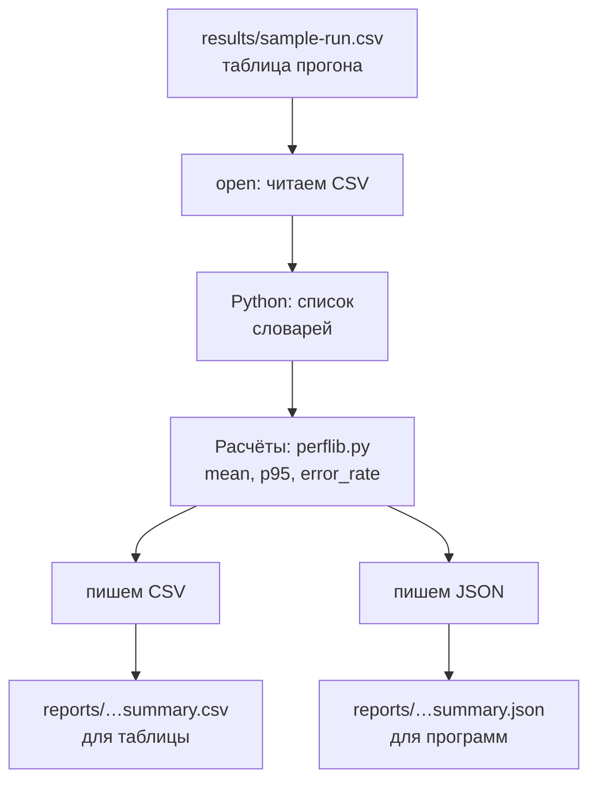
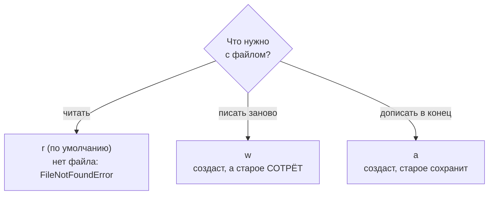

## Зачем это нужно

Я занимаюсь нагрузкой много лет, и эта тема из тех, что экономят вечера. До распродажи ты прогнал тест, и у тебя таблица на 300 строк, по строке на каждый запрос к магазину. Менеджер просит: «По каждому адресу скажи, сколько было запросов, насколько медленных и сколько ошибок». Руками это час работы и пара ошибок. Скрипт сделает то же за секунду и повторит после любого прогона.

Для этого скрипту нужны три умения: прочитать файл, понять его формат и записать результат так, чтобы его открыл человек или другая программа. Форматов три. Обычный текст: лог, список адресов. CSV (comma-separated values, «значения через запятую»): таблица, которую понимают Excel и любые скрипты. В CSV сохраняют результаты Locust (программа, создающая нагрузку, тема 9) и k6 (второй такой инструмент, тема 10). И JSON (JavaScript Object Notation): в нём отвечают веб-сервисы, включая наш «Магазин».

Шаг проекта: ты сохранишь ответ стенда в файл и разберёшь его. Потом получишь учебный файл `results/sample-run.csv` и напишешь `report.py`. Он прочитает файл и запишет в `reports/` сводку по адресам в двух форматах: среднее время, p95 и доля ошибок. Про p95 помнишь из [урока 4.2](02-conditions-loops.md): время, которого хватило 95 запросам из 100. Всё уйдёт коммитом в `perf-lab`.

## Что нужно знать

- Функции, модули, исключения и твой `perflib.py` (`mean`, `percentile`, `error_rate`): [урок 4.3](03-functions-errors.md). `report.py` подключает его.
- Циклы, словари, списки и словарь-счётчик: [урок 4.2](02-conditions-loops.md).
- Стенд «Магазин» запущен и отвечает на `http://localhost:8000` ([урок 2.1](../02-web/01-client-server-http.md)). Для проверки: `curl -s localhost:8000/healthz` должен вернуть `{"status":"ok"}`. Если стенда нет, в практике ниже есть запасной вариант с готовым файлом.
- Каталоги `~/perf-lab/results` и `~/perf-lab/reports` созданы в [уроке 1.1](../01-linux/01-workstation-terminal.md).
- Путь, абсолютный и относительный, и `curl`: уроки 1.1 и 2.1. Утилита `jq` (она ставилась в 1.1) пригодится для просмотра JSON.


## Картина целиком

Представь склад, куда приезжают грузы в разной упаковке. Обычные коробки: это текст. Контейнеры с отделениями и ярлыками, коробки в коробках: это JSON. Таблицы с одинаковыми строками: это CSV. Кладовщик каждый раз делает три действия: открывает упаковку, достаёт содержимое и закрывает, чтобы не осталось открытых контейнеров. Для файлов в Python те же три действия выполняет `with open(...)`.



Файл читается в знакомые списки и словари, потом идут расчёты из прошлых уроков. Результат пишется в двух видах: CSV для человека и JSON для программы.

## Теория

### Файлы: открыть, прочитать, закрыть

Скрипт закончил работу, и всё, что лежало в его переменных, исчезло. Как сохранить результат теста до завтра? Записать в файл. А чужие данные скрипт читает из файла.

С файлом как с книгой в библиотеке: берёшь, читаешь, возвращаешь. Только читать файл могут многие сразу, а писать в него вдвоём нельзя.

Функция `open(путь, режим)` открывает файл и возвращает **файловый объект** (file object): через него идёт чтение и запись. Файл надо закрывать, иначе данные могут не дойти до диска. Чтобы не забывать, пишут `with`:

```python
with open("access.log", encoding="utf-8") as f:
    text = f.read()
```

`with ... as f:` открывает файл, связывает файл с именем `f` и закрывает сам при выходе, даже после ошибки. Это то самое `finally` из [урока 4.3](03-functions-errors.md), только встроенное.

Второй аргумент `open`, режим, отвечает на вопрос «что я собираюсь делать?».



Режим `"w"` стирает файл в момент открытия, ещё до первой записи. У меня так было. За ночь собралась большая выгрузка, и утром я решил на неё посмотреть. Открыл файл в скрипте и по привычке поставил `"w"`: только что писал отчёт. Скрипт отработал без единой ошибки, а выгрузка стала пустой, и собирать её пришлось заново. С тех пор перед каждым `open` я спрашиваю себя: читаю или пишу?

> **Прикинь сам:** в файле `notes.txt` было 100 строк. Скрипт выполнил `with open("notes.txt", "w") as f: pass` (то есть открыл файл и ничего не записал). Сколько строк в файле теперь?
{: .predict}

Ноль. Режим `"w"` очистил файл при открытии, даже если внутри блока ничего не пишут. Дописать в конец и сохранить старое умеет `"a"`.

Теперь про русские буквы. **Кодировка** (encoding) это правило, по которому буквы превращаются в байты на диске, а UTF-8 это стандарт, где работает кириллица. Без явного указания Python на некоторых системах возьмёт другую кодировку, и русский текст превратится в `????` или упадёт с `UnicodeDecodeError`. Поэтому я всегда пишу `encoding="utf-8"`.

Читают файл тремя способами. `f.read()` отдаёт весь файл одной строкой, `f.readlines()` список строк (на конце каждой `\n`, перевод строки), а цикл `for line in f:` строки по очереди. Для лога на гигабайты подходит только цикл: в памяти одна строка, а первые два способа грузят файл целиком. Лишний `\n` убирает `.strip()` из [урока 4.1](01-first-program.md). Писать можно через `f.write("текст\n")` или `print("текст", file=f)`.

> **Главное:** `with open(...)` сам закрывает файл, а режим говорит, что ты собираешься делать: `"r"` читать, `"w"` писать с нуля и стирать, `"a"` дописывать.
{: .key}

Файл мы открывать умеем. Но скрипт должен знать, где он лежит, и тут есть ловушка.

### Путь: чтобы скрипт находил файл из любого каталога

Скрипт у тебя работает, а коллега запустил его из другого каталога и получил `FileNotFoundError`. Файл на месте. Что не так?

Путь к файлу бывает двух видов. Относительный (из [урока 1.1](../01-linux/01-workstation-terminal.md)) отсчитывается от каталога, откуда запущен скрипт: `results/data.csv`. Абсолютный начинается от корня: `/home/student/perf-lab/results/data.csv`. Относительный путь ломается, если запустить скрипт из другого места: Python ищет не там. Надёжный способ даёт модуль `pathlib`:

```python
from pathlib import Path

lab = Path.home() / "perf-lab"
results = lab / "results" / "sample-run.csv"
print(results)
print(results.exists())
```

```text
/home/student/perf-lab/results/sample-run.csv
True
```

`Path.home()` это домашний каталог (`/home/student`). Оператор `/` здесь склеивает части пути, а не делит. Метод `.exists()` отвечает, есть ли файл. Такой путь работает из любого каталога, и я пишу пути только так.

<details markdown="1">
<summary>Для любопытных: что ещё умеет Path</summary>

У объекта пути есть полезные свойства: `.name` (имя файла), `.suffix` (расширение, например `.csv`), `.parent` (каталог выше) и метод `.mkdir(exist_ok=True)` (создать каталог, если его ещё нет). Если путь нужно считать от места самого скрипта, а не от домашнего каталога, пиши `Path(__file__).parent / "data.csv"`: `__file__` хранит путь к запущенному файлу.

</details>

> **Главное:** собирай путь через `Path.home() / "каталог" / "файл"`, и скрипт найдёт файл из любого каталога.
{: .key}

Место файла найдено. Теперь о содержимом, и начнём с формата, в котором отвечает магазин.

### JSON: формат ответов сервера

Сервер отдаёт товар: название, цена, категория, остаток. Клиент может быть написан на любом языке, и ему нужен общий формат. Это JSON: обычный текст, который читает и человек, и любая программа. Он похож на анкету с полями и вложенными таблицами, только типов в нём меньше, чем в Python: нет кортежей и множеств. Выглядит он почти как знакомые словарь и список:

```json
{"id": 17, "name": "Товар 17", "price": 729.0, "tags": ["новинка", "акция"], "discount": null, "in_stock": true}
```

Правил немного. Объект в фигурных скобках это пары «ключ: значение», ключи всегда в двойных кавычках. Массив в квадратных скобках это список. Значение: строка (тоже в двойных кавычках), число, `true`, `false` или `null` («пусто»). В Python они становятся `dict`, `list`, `str`, `int` или `float`, `True`, `False` и `None`.

Читает и пишет JSON модуль `json` из стандартной библиотеки. Тут запомни одну букву. `json.loads(текст)` превращает строку JSON в объект Python, а `json.dumps(объект)` делает обратное. Та же пара без буквы `s`, то есть `json.load(файл)` и `json.dump(объект, файл)`, работает с открытым файлом. Буква `s` значит string, «строка».

Посмотри, как строка JSON превращается в словарь и как мы достаём из него поле. Нажми «Шаг ▶»:

<div class="viz" data-viz="py-trace" data-title="JSON-строка превращается в словарь" data-speed="1800" data-code='["import json","line = &#39;{\"method\": \"POST\", \"route\": \"/api/orders\", \"status\": 500, \"duration_ms\": 1204.5}&#39;","record = json.loads(line)","status = record[\"status\"]","if status >= 500:","    print(\"ошибка сервера на\", record[\"route\"])"]' data-steps='[{"l":1,"v":{},"n":"Подключаем модуль `json` из стандартной библиотеки."},{"l":2,"v":{"line":"&#39;{\"method\": \"POST\", \"route\": \"/api/orders\", \"status\": 500, \"duration_ms\": 1204.5}&#39;"},"n":"`line` это просто текст: одна длинная строка в кавычках. Достать из неё поле нельзя."},{"l":3,"v":{"line":"&#39;{\"method\": \"POST\", \"route\": \"/api/orders\", \"status\": 500, \"duration_ms\": 1204.5}&#39;","record":"{&#39;method&#39;: &#39;POST&#39;, &#39;route&#39;: &#39;/api/orders&#39;, &#39;status&#39;: 500, &#39;duration_ms&#39;: 1204.5}"},"n":"`json.loads` разбирает текст: `record` теперь словарь, а число 500 осталось числом."},{"l":4,"v":{"line":"&#39;{\"method\": \"POST\", \"route\": \"/api/orders\", \"status\": 500, \"duration_ms\": 1204.5}&#39;","record":"{&#39;method&#39;: &#39;POST&#39;, &#39;route&#39;: &#39;/api/orders&#39;, &#39;status&#39;: 500, &#39;duration_ms&#39;: 1204.5}","status":"500"},"n":"Берём из словаря значение по ключу: 500."},{"l":5,"v":{"line":"&#39;{\"method\": \"POST\", \"route\": \"/api/orders\", \"status\": 500, \"duration_ms\": 1204.5}&#39;","record":"{&#39;method&#39;: &#39;POST&#39;, &#39;route&#39;: &#39;/api/orders&#39;, &#39;status&#39;: 500, &#39;duration_ms&#39;: 1204.5}","status":"500"},"n":"500 >= 500, условие истинно, заходим в блок."},{"l":6,"v":{"line":"&#39;{\"method\": \"POST\", \"route\": \"/api/orders\", \"status\": 500, \"duration_ms\": 1204.5}&#39;","record":"{&#39;method&#39;: &#39;POST&#39;, &#39;route&#39;: &#39;/api/orders&#39;, &#39;status&#39;: 500, &#39;duration_ms&#39;: 1204.5}","status":"500"},"o":"ошибка сервера на /api/orders","n":"Печатаем маршрут, взятый из словаря."}]' data-try="сравни значения line и record: снаружи похожи, но у record можно брать поля по ключу."></div>

`line` это просто текст, а `record` уже словарь: из него берут значение по ключу. Условие сработало, потому что число осталось числом. При записи `indent=2` расставляет отступы, а `ensure_ascii=False` оставляет кириллицу читаемой: без него буквы превратятся в коды вроде `\u0422\u043e`.

Значение в JSON само бывает объектом или массивом. Вот ответ каталога стенда (для краткости один товар вместо пяти):

```json
{"items": [{"id": 1, "name": "Товар 1", "price": 137.0, "category_id": 1, "stock": 1000000}], "page": 1, "size": 5, "total": 10000}
```

Наверху словарь с ключами `items` (список товаров), `page`, `size` и `total`. Всего в магазине 10 000 товаров (`total`), а в ответе одна страница размером `size`. Каждый товар сам словарь: `id`, `name`, `price`, `category_id`, `stock`. Запись `data["items"][0]["price"]` читается так: в словаре возьми `items`, в списке первый элемент, у него `price`. Проверим:

```python
import json

text = '{"items": [{"id": 1, "name": "Товар 1", "price": 137.0}, {"id": 2, "name": "Товар 2", "price": 174.0}], "total": 10000}'
data = json.loads(text)

print(data["total"])
print(data["items"][1]["name"])
print(len(data["items"]))
print(json.dumps(data["items"][0], ensure_ascii=False))
```

```text
10000
Товар 2
2
{"id": 1, "name": "Товар 1", "price": 137.0}
```

Индекс `[1]` берёт второй товар (счёт с нуля, как в [уроке 4.2](02-conditions-loops.md)), а последняя строка превращает первый товар обратно в текст JSON.

> **Прикинь сам:** как получить цену второго товара из `data = {"items": [{"price": 10}, {"price": 20}]}`?
{: .predict}

`data["items"][1]["price"]`, то есть 20: ключ `items`, индекс 1, ключ `price`.

Осторожно: ключи в JSON всегда строки. Словарь `{200: 5}` после `json.dumps` и обратного `json.loads` станет `{"200": 5}`, и `d[200]` упадёт с `KeyError`. Одинарные кавычки (`{'a': 1}`) и лишняя запятая тоже запрещены. Парсер скажет `JSONDecodeError: Expecting property name enclosed in double quotes` и укажет строку и символ. Если поля может не быть, бери `data.get("discount")` вместо `data["discount"]` (из урока 4.2).

> **Главное:** JSON читается в обычные словари и списки, а к вложенному значению идёшь цепочкой ключей и индексов. `loads` разбирает строку, `load` читает файл.
{: .key}

Один ответ мы разбирать умеем. Но логи магазина это миллион записей. Как их хранят?

### Построчный JSON (JSON Lines): так пишутся логи

Если сложить миллион записей в один большой JSON, читать придётся целиком, а новую запись можно дописать только внутри скобок. Поэтому логи «Магазина» пишут иначе: **один JSON-объект на строку**, без общей обёртки. Это JSON Lines (построчный JSON). Запись добавляется в конец, читать можно по строке, не грузя всё в память. Типичная запись лога стенда:

```json
{"ts":"2026-10-05T12:00:02.900+00:00","level":"ERROR","msg":"Запрос завершён","method":"POST","route":"/api/orders","path":"/api/orders","status":500,"duration_ms":1204.5,"request_id":"d4e6","error":"payment timeout"}
```

В записи метод и маршрут, код ответа, время в миллисекундах и `request_id` (идентификатор запроса). У ошибок есть поле `error` с причиной: здесь оплата не ответила вовремя. Каждую строку разбирают отдельным `json.loads`, а весь файл через `json.load` упадёт: это не один JSON, а много. Поэтому в скриптах для логов цикл `for line in f:` и `json.loads(line)` внутри.

> **Главное:** в логе JSON Lines каждая строка отдельный JSON, и читают такой файл построчно через `json.loads(line)`.
{: .key}

Остался формат результатов Locust и k6: таблица.

### CSV: таблицы результатов

Результат прогона это строки с одними колонками: время, адрес, код, длительность. Самая простая запись такой таблицы в тексте называется CSV. Первая строка это **заголовок** (header) с названиями колонок, дальше данные через запятую:

```text
timestamp,endpoint,status,duration_ms
2026-10-05T12:00:00,/api/products,200,18
2026-10-05T12:00:01,/api/products,200,35
```

Для чтения и записи есть модуль `csv`. `csv.DictReader` читает файл так, что каждая строка превращается в словарь, где ключи это названия колонок. `csv.DictWriter` записывает словари обратно в таблицу.

```python
import csv

with open("sample-run.csv", newline="", encoding="utf-8") as f:
    for row in csv.DictReader(f):
        print(row["endpoint"], row["duration_ms"])
```

`DictReader(f)` оборачивает открытый файл, и цикл получает по строке данных в виде словаря `{"timestamp": "...", "endpoint": "...", "status": "200", "duration_ms": "18"}`. Заметь кавычки вокруг `"200"` и `"18"`: все значения в CSV приходят строками, числом их делают через `int()` или `float()`. Аргумент `newline=""` с `csv` пиши всегда: без него в файлах с Windows появятся пустые строки.

> **Прикинь сам:** что вернёт сравнение `"18" > "100"`, если обе части строки?
{: .predict}

`True`. Строки сравниваются по символам слева направо: первые равны, во вторых `"8"` больше `"0"`. Поэтому без `int(row["duration_ms"])` сортировка «по времени» поставит 9 мс после 100 мс, а `row["status"] == 200` всегда даст `False`.

Запись выглядит так:

```python
rows = [{"endpoint": "/api/cart", "count": 23}, {"endpoint": "/api/orders", "count": 15}]
with open("out.csv", "w", newline="", encoding="utf-8") as f:
    writer = csv.DictWriter(f, fieldnames=["endpoint", "count"])
    writer.writeheader()
    writer.writerows(rows)
```

`fieldnames` задаёт порядок колонок, `writeheader()` пишет первую строку, `writerows(список_словарей)` все остальные. В файле получится:

```text
endpoint,count
/api/cart,23
/api/orders,15
```

Вернёмся к менеджеру: сколько запросов пришло на каждый адрес? Считаем прямо из CSV:

```python
import csv

counts = {}
with open("sample-run.csv", newline="", encoding="utf-8") as f:
    for row in csv.DictReader(f):
        endpoint = row["endpoint"]
        counts[endpoint] = counts.get(endpoint, 0) + 1
print(counts)
```

```text
{'/api/products': 186, '/api/products/{id}': 76, '/api/cart': 23, '/api/orders': 15}
```

Цикл, `get` с нулём и счётчик ты писал в 4.2, новое только `DictReader`. Из 300 запросов большая часть идёт к каталогу: так и в настоящем магазине.

<details markdown="1">
<summary>Для любопытных: запятые и точки с запятой</summary>

Запятая внутри значения («Яблоки, красные») берётся в кавычки самим CSV, поэтому режь такие файлы модулем `csv`, а не через `split(",")`. С `csv.reader` вместо `DictReader` заголовок придёт как строка данных. Русский Excel ставит разделителем `;`: пиши `csv.DictReader(f, delimiter=";")`.

</details>

> **Главное:** CSV это таблица в тексте, `DictReader` и `DictWriter` переводят её в словари и обратно, а все значения при чтении приходят строками.
{: .key}

Осталось понять, что делать, когда файл не такой, как мы ждали.

### Когда файл не такой, как ждали

Три ситуации возникают постоянно. Нет файла по пути: `FileNotFoundError`, скрипт называет путь и останавливается. Файл не JSON или оборван: `json.JSONDecodeError` (подтип `ValueError`) назовёт строку и символ, и скрипт остановится или пропустит строку. Нет нужной колонки или поля: `KeyError`, и сообщение скажет, чего не хватает. Правило из 4.3 то же: ловить конкретную ошибку и объяснять причину по-человечески. В `report.py` ты увидишь `except FileNotFoundError`. А менеджер получит сводку не через час, а через секунду.

> **Главное:** при работе с файлами ловят конкретные ошибки (`FileNotFoundError`, `JSONDecodeError`, `KeyError`) и пишут понятную причину.
{: .key}

## Практика

Скрипты лежат в `~/perf-lab/04-python/`, данные в `~/perf-lab/results/`, отчёты в `~/perf-lab/reports/`. Модуль `perflib.py` из 4.3 лежит рядом со скриптами.

### 1. Сохрани ответ стенда и посмотри на него

Убедись, что стенд поднят (`curl -s localhost:8000/healthz`). Сохрани первую страницу каталога из пяти товаров в файл:

```bash
cd ~/perf-lab/04-python
curl -s "http://localhost:8000/api/products?page=1&size=5" -o products.json
cat products.json
```

Разбор команды: `curl -s` это тихий режим (без полосы прогресса), адрес в кавычках, потому что `&` без кавычек означает для оболочки «запусти в фоне»; `-o products.json` записывает ответ в файл, а не на экран. Ответ стенда это JSON одной строкой, поэтому посмотреть его удобнее через `jq`:

```bash
jq . products.json | head -20
```

```text
{
  "items": [
    {
      "id": 1,
      "name": "Товар 1",
      "price": 137,
      "category_id": 1,
      "stock": 1000000
    },
    {
      "id": 2,
      "name": "Товар 2",
      "price": 174,
      "category_id": 2,
      "stock": 1000000
    },
```

**Как читать вывод:** `jq .` расставил отступы, видна структура: словарь с `items` (список словарей-товаров), а дальше в конце `page`, `size`, `total`. (Целые цены `137` jq выводит без `.0`, а в самом файле их записал сервер как `137.0`.) Если стенда нет, создай файл вручную: `nano products.json` и вставь такую строку:

```json
{"items": [{"id": 1, "name": "Товар 1", "price": 137.0, "category_id": 1, "stock": 1000000}, {"id": 2, "name": "Товар 2", "price": 174.0, "category_id": 2, "stock": 1000000}, {"id": 3, "name": "Товар 3", "price": 211.0, "category_id": 3, "stock": 1000000}, {"id": 4, "name": "Товар 4", "price": 248.0, "category_id": 4, "stock": 1000000}, {"id": 5, "name": "Товар 5", "price": 285.0, "category_id": 5, "stock": 1000000}], "page": 1, "size": 5, "total": 10000}
```

**Типичные ошибки:** `curl: (7) Failed to connect to localhost port 8000`: стенд не запущен (поднимается в 2.1: `cd ~/load-tester/project/shop && docker compose up -d --wait`). Пустой файл: адрес без кавычек.

### 2. Прочитай JSON из Python: `read_products.py`

```bash
nano read_products.py
```

```python
import json
from pathlib import Path

path = Path.home() / "perf-lab" / "04-python" / "products.json"
with open(path, encoding="utf-8") as f:
    data = json.load(f)

print("Всего товаров в магазине:", data["total"])
print("Получено на странице:", len(data["items"]))
for item in data["items"]:
    print(f'{item["id"]:>3}  {item["name"]:<10}{item["price"]:>8.2f}  категория {item["category_id"]}')

total = sum(item["price"] for item in data["items"])
print(f"Сумма цен: {total:.2f}")
```

```bash
python3 read_products.py
```

```text
Всего товаров в магазине: 10000
Получено на странице: 5
  1  Товар 1     137.00  категория 1
  2  Товар 2     174.00  категория 2
  3  Товар 3     211.00  категория 3
  4  Товар 4     248.00  категория 4
  5  Товар 5     285.00  категория 5
Сумма цен: 1055.00
```

**Как читать вывод:** две первые строки это поля верхнего уровня (`total` общий, `len(items)` текущая страница). Дальше цикл по списку товаров: `{...:>3}` выравнивает по правому краю на три символа, `{...:<10}` по левому на десять, `:>8.2f` это число с двумя знаками в поле шириной 8 (ширина нужна, чтобы колонки были ровными). Выражение внутри `sum(...)` это сокращённый цикл по товарам, его суть: «возьми цену каждого товара и сложи». Цены на стенде сгенерированы по формуле, поэтому у тебя числа такие же.

**Типичные ошибки:** `json.decoder.JSONDecodeError: Expecting value: line 1 column 1 (char 0)`: файл пустой (curl не достучался). `FileNotFoundError`: файл `products.json` создан не в `04-python`. `KeyError: 'total'`: сохранён не ответ каталога.

### 3. Логи как JSON Lines: `read_log.py`

Создай маленький файл лога (формат записи тот же, что пишет стенд; это пять примерных строк, чтобы результат был предсказуем):

```bash
cat > shop.log <<'EOF'
{"ts":"2026-10-05T12:00:01.120+00:00","level":"INFO","msg":"Запрос завершён","method":"GET","route":"/api/products","path":"/api/products","status":200,"duration_ms":14.2,"request_id":"a1f3"}
{"ts":"2026-10-05T12:00:01.480+00:00","level":"INFO","msg":"Запрос завершён","method":"POST","route":"/api/login","path":"/api/login","status":200,"duration_ms":212.7,"request_id":"b2c4"}
{"ts":"2026-10-05T12:00:02.050+00:00","level":"INFO","msg":"Запрос завершён","method":"GET","route":"/api/products/{id}","path":"/api/products/99999","status":404,"duration_ms":6.9,"request_id":"c3d5"}
{"ts":"2026-10-05T12:00:02.900+00:00","level":"ERROR","msg":"Запрос завершён","method":"POST","route":"/api/orders","path":"/api/orders","status":500,"duration_ms":1204.5,"request_id":"d4e6","error":"payment timeout"}
{"ts":"2026-10-05T12:00:03.310+00:00","level":"INFO","msg":"Запрос завершён","method":"GET","route":"/api/products","path":"/api/products","status":200,"duration_ms":16.8,"request_id":"e5f7"}
EOF
```

Разбор: `cat > shop.log <<'EOF'` записывает всё до слова `EOF` в файл (так называемый heredoc: «вот здесь документ»). Кавычки вокруг `EOF` нужны, чтобы оболочка не пыталась подставлять в текст переменные. Теперь скрипт:

```bash
nano read_log.py
```

```python
import json
from pathlib import Path

path = Path.home() / "perf-lab" / "04-python" / "shop.log"

statuses = {}
slowest = None
with open(path, encoding="utf-8") as f:
    for number, line in enumerate(f, start=1):
        line = line.strip()
        if not line:
            continue
        try:
            record = json.loads(line)
        except json.JSONDecodeError as err:
            print(f"строка {number}: не JSON ({err.msg})")
            continue
        status = record["status"]
        statuses[status] = statuses.get(status, 0) + 1
        if slowest is None or record["duration_ms"] > slowest["duration_ms"]:
            slowest = record

print("Коды ответа:", statuses)
print(f"Самый медленный: {slowest['method']} {slowest['route']} {slowest['duration_ms']} мс")
print("Причина:", slowest.get("error", "ошибки нет"))
```

```bash
python3 read_log.py
```

```text
Коды ответа: {200: 3, 404: 1, 500: 1}
Самый медленный: POST /api/orders 1204.5 мс
Причина: payment timeout
```

**Как читать вывод:** по пяти строкам: три ответа 200, один 404 и один 500. Самая длинная запись это неудавшийся заказ: 1,2 секунды и причина `payment timeout` (оплата не ответила). `enumerate(f, start=1)` нумерует строки с единицы, чтобы в сообщении об ошибке был настоящий номер строки. Пустые строки пропускаются, битые строки не ломают скрипт: он сообщает номер и идёт дальше. Проверь: добавь в конец `shop.log` строку `не json` (`echo 'не json' >> shop.log`) и запусти ещё раз: увидишь `строка 6: не JSON (Expecting value)`. Коды ответа остались прежними: плохая строка пропущена.

Здесь `slowest is None or ...` работает так: на первой строке `slowest` ещё `None`, условие истинно сразу, а сравнение справа не вычисляется (иначе было бы обращение к `None["duration_ms"]` и `TypeError`).

**Типичные ошибки:** `KeyError: 'status'`: запись без поля (другой формат лога). `AttributeError: 'NoneType' object has no attribute...`: файл пустой, `slowest` так и остался `None`.

### 4. Учебный файл результатов: `make_sample.py`

Настоящие результаты ты получишь в темах 9 и 10, когда запустишь Locust и k6. Сейчас нужен файл прогона для тренировки. Скрипт сгенерирует его: 300 запросов в четыре эндпоинта, у «заказов» время больше и ошибок больше (как на настоящем стенде).

```bash
nano make_sample.py
```

```python
"""Делает учебный файл результатов прогона: ~/perf-lab/results/sample-run.csv"""
import csv
import random
from pathlib import Path

random.seed(7)          # одни и те же «случайные» данные при каждом запуске

# эндпоинт: (доля запросов, типичное время в мс, доля ошибок, код ошибки)
ENDPOINTS = {
    "/api/products": (0.60, 40, 0.01, 500),
    "/api/products/{id}": (0.25, 18, 0.02, 404),
    "/api/cart": (0.10, 25, 0.00, 500),
    "/api/orders": (0.05, 260, 0.08, 500),
}

names = list(ENDPOINTS)
weights = [ENDPOINTS[name][0] for name in names]

rows = []
for second in range(300):                   # 300 запросов, по одному в секунду
    endpoint = random.choices(names, weights)[0]
    _, typical_ms, error_share, error_code = ENDPOINTS[endpoint]
    duration = int(random.lognormvariate(0, 0.45) * typical_ms)
    status = 200
    if random.random() < error_share:
        status = error_code
        duration = duration * 3
    rows.append({
        "timestamp": f"2026-10-05T12:{second // 60:02d}:{second % 60:02d}",
        "endpoint": endpoint,
        "status": status,
        "duration_ms": duration,
    })

path = Path.home() / "perf-lab" / "results" / "sample-run.csv"
with open(path, "w", newline="", encoding="utf-8") as f:
    writer = csv.DictWriter(f, fieldnames=["timestamp", "endpoint", "status", "duration_ms"])
    writer.writeheader()
    writer.writerows(rows)

print(f"Записано {len(rows)} строк в {path}")
```

```bash
python3 make_sample.py
head -4 ~/perf-lab/results/sample-run.csv
wc -l ~/perf-lab/results/sample-run.csv
```

```text
Записано 300 строк в /home/student/perf-lab/results/sample-run.csv
timestamp,endpoint,status,duration_ms
2026-10-05T12:00:00,/api/products,200,18
2026-10-05T12:00:01,/api/products,200,35
2026-10-05T12:00:02,/api/products,200,37
301 /home/student/perf-lab/results/sample-run.csv
```

**Как читать вывод:** `head -4` показывает заголовок и три строки, `wc -l` считает строки (301: заголовок плюс 300 данных). `random.seed(7)` делает данные одинаковыми при каждом запуске (4.3), поэтому ниже у тебя должны получиться те же числа. Если версия Python другая, числа могут слегка отличаться: алгоритм случайных чисел иногда меняется между версиями, это не ошибка. Новых понятий в скрипте немного: `random.choices(имена, веса)[0]` выбирает эндпоинт с заданными долями, `lognormvariate` даёт «похожее на настоящее» время (почти все быстрые, редкие медленные: хвост), `f"{second // 60:02d}"` это число с нулём впереди («05»). Остальное знакомо.

**Типичные ошибки:** `FileNotFoundError: ... results/sample-run.csv`: нет каталога `~/perf-lab/results` (`mkdir -p ~/perf-lab/results`). Пустые строки между строками данных: забыл `newline=""`.

### 5. Отчёт: `report.py`

Скрипт читает результаты, считает для каждого эндпоинта число запросов, среднее, p95 и долю ошибок (функциями из твоего `perflib.py`) и пишет сводку в CSV и JSON.

```bash
nano report.py
```

```python
"""Читает результаты прогона (CSV) и пишет сводку по эндпоинтам (CSV и JSON)."""
import csv
import json
import sys
from pathlib import Path

from perflib import mean, percentile, error_rate

LAB = Path.home() / "perf-lab"
source = LAB / "results" / "sample-run.csv"
if len(sys.argv) > 1:
    source = Path(sys.argv[1])

# 1. читаем: для каждого эндпоинта копим времена и коды
times = {}
codes = {}
try:
    with open(source, newline="", encoding="utf-8") as f:
        for row in csv.DictReader(f):
            endpoint = row["endpoint"]
            times.setdefault(endpoint, []).append(int(row["duration_ms"]))
            codes.setdefault(endpoint, []).append(int(row["status"]))
except FileNotFoundError:
    print(f"Нет файла {source}. Сначала запусти make_sample.py")
    sys.exit(1)

# 2. считаем сводку
summary = []
for endpoint in sorted(times):
    summary.append({
        "endpoint": endpoint,
        "count": len(times[endpoint]),
        "mean_ms": round(mean(times[endpoint]), 1),
        "p95_ms": percentile(times[endpoint], 95),
        "error_pct": round(error_rate(codes[endpoint]), 1),
    })

# 3. пишем отчёт в двух форматах
(LAB / "reports").mkdir(exist_ok=True)

csv_path = LAB / "reports" / "sample-run-summary.csv"
with open(csv_path, "w", newline="", encoding="utf-8") as f:
    writer = csv.DictWriter(f, fieldnames=list(summary[0]))
    writer.writeheader()
    writer.writerows(summary)

json_path = LAB / "reports" / "sample-run-summary.json"
with open(json_path, "w", encoding="utf-8") as f:
    json.dump({"source": source.name, "endpoints": summary}, f, indent=2, ensure_ascii=False)

# 4. и коротко на экран
print(f"{'эндпоинт':<20}{'запросов':>9}{'среднее':>9}{'p95':>7}{'ошибок':>8}")
for item in summary:
    print(f"{item['endpoint']:<20}{item['count']:>9}{item['mean_ms']:>9}"
          f"{item['p95_ms']:>7}{item['error_pct']:>7}%")
print(f"Отчёты: {csv_path.name}, {json_path.name}")
```

```bash
python3 report.py
```

```text
эндпоинт             запросов  среднее    p95  ошибок
/api/cart                  23     24.2     45    0.0%
/api/orders                15    319.7    978    6.7%
/api/products             186     43.6     87    0.5%
/api/products/{id}         76     19.5     39    0.0%
Отчёты: sample-run-summary.csv, sample-run-summary.json
```

**Как читать вывод:** по строке на эндпоинт. «Запросов» это число строк в CSV для этого адреса, «среднее» и «p95» в миллисекундах, «ошибок» в процентах. Смотри первым на `/api/orders`: самый медленный (p95 978 мс против 45 у корзины) и единственный с заметной долей ошибок.

**Разбор незнакомых мест в `report.py`.**

- `times.setdefault(endpoint, []).append(...)`: метод словаря `setdefault(ключ, значение)` возвращает значение по ключу, а если ключа нет, сначала кладёт туда второй аргумент (здесь пустой список). Для нового эндпоинта создаётся пустой список, для известного берётся существующий, и в любом случае в него добавляется число. Без `setdefault` пришлось бы писать `if endpoint not in times:` перед каждым добавлением.
- `csv.DictReader(f)` читает первую строку как названия колонок и отдаёт каждую следующую строку словарём, поэтому работает `row["endpoint"]`. Значения приходят строками, и `int(...)` превращает их в числа.
- `sorted(times)` перебирает ключи словаря по алфавиту: отчёт получается в одном и том же порядке при каждом запуске.
- `list(summary[0])` берёт первый словарь сводки и делает список его ключей: `["endpoint", "count", "mean_ms", "p95_ms", "error_pct"]`. Это названия колонок для `DictWriter`, и они совпадают с ключами всех остальных словарей.
- `f"{'эндпоинт':<20}{'запросов':>9}"`: внутри f-строки в двойных кавычках текст-подпись взят в одинарные, чтобы кавычки не закрыли строку раньше времени. `<20` выравнивает по левому краю в поле шириной 20 символов, `>9` по правому в поле шириной 9. Так колонки встают ровно.
- `{item['endpoint']:<20}`: тот же приём, только вместо подписи значение из словаря. Одинарные кавычки внутри `[...]` нужны по той же причине.

Посмотри на файлы-отчёты:

```bash
cat ~/perf-lab/reports/sample-run-summary.csv
head -12 ~/perf-lab/reports/sample-run-summary.json
```

```text
endpoint,count,mean_ms,p95_ms,error_pct
/api/cart,23,24.2,45,0.0
/api/orders,15,319.7,978,6.7
/api/products,186,43.6,87,0.5
/api/products/{id},76,19.5,39,0.0
{
  "source": "sample-run.csv",
  "endpoints": [
    {
      "endpoint": "/api/cart",
      "count": 23,
      "mean_ms": 24.2,
      "p95_ms": 45,
      "error_pct": 0.0
    },
    {
      "endpoint": "/api/orders",
```

**Как читать вывод:** в таблице на экране самый заметный `/api/orders`: среднее 319,7 мс и p95 978 мс, в 7-16 раз больше других, и это единственный эндпоинт с заметной долей ошибок (1 из 15, 6,7%). Каталог (`/api/products`) отвечает в среднем за 43,6 мс, p95 87 мс. Хвост виден по разрыву между средним и p95: у заказов p95 в три раза выше среднего. Подсказка о выборке: у заказов всего 15 запросов, поэтому их p95 это почти максимум (4.2) и верить ему нельзя, а вот каталогу с 186 запросами верить можно. Те же числа в виде столбцов:

<div class="viz" data-viz="chart" data-type="bar" data-title="Среднее и p95 по эндпоинтам (sample-run.csv)" data-x="/api/cart,/api/orders,/api/products,/api/products/{id}" data-series='[{"name":"среднее","values":[24.2,319.7,43.6,19.5]},{"name":"p95","values":[45,978,87,39]}]' data-unit="мс" data-x-label="эндпоинт" data-y-label="время ответа" data-explain="Заказы выделяются в разы: среднее около 320 мс, p95 почти 1 с. У остальных эндпоинтов p95 примерно вдвое выше среднего. Но у заказов всего 15 запросов в выборке, поэтому их p95 ненадёжен."></div>

На графике сразу видно то, что в таблице легко пропустить: один эндпоинт хуже остальных в разы, и именно с него надо начинать разбор.

Файл `.csv` теперь открывается в таблице (LibreOffice или Excel), а `.json` его прочтёт любая другая программа, например скрипт, который сравнивает два прогона.

**Типичные ошибки:**

- `ModuleNotFoundError: No module named 'perflib'`: `perflib.py` лежит не рядом с `report.py`.
- `Нет файла ...`: сначала не запущен `make_sample.py`; скрипт сам сообщил причину и остановился, благодаря `except FileNotFoundError`.
- `ValueError: invalid literal for int() with base 10: 'duration_ms'`: в данные попал заголовок, например, из-за файла, где заголовок повторяется посередине.

### 6. Коммит

```bash
cd ~/perf-lab
git add 04-python reports
git commit -m "4.4: файлы, JSON, CSV, report.py"
git push
```

`results/sample-run.csv` в коммит не идёт, и это правильно: правило `/results/*.csv` из [урока 3.1](../03-git/01-git-basics.md) оставляет сырые выгрузки только у тебя, а при необходимости файл воспроизводится одной командой `make_sample.py`. Итоговые сводки в `reports/` в git сохраняются.

> Данные читаются не так, как ты ждёшь? Напечатай `type(...)` и `repr(...)` первой записи: так видно, строка это или число. Потом спроси нейросеть и сверь ответ на небольшом файле.
{: .ai}

## Сломай и почини

**Поломка.** В файле `shop.log` дозапиши строку с «лишней» запятой и поменяй в `read_products.py` строку открытия на `open(path, "w", encoding="utf-8")`:

```bash
echo '{"status": 200, "duration_ms": 10.0,}' >> ~/perf-lab/04-python/shop.log
```

Запусти `python3 read_log.py` и `python3 read_products.py`, найди и объясни обе проблемы.

**Задача.** Что покажет каждый скрипт? Что случилось с `products.json` после запуска второго? Как восстановить данные и как избежать этого в будущем?

<details markdown="1">
<summary>Разбор</summary>

**1. `read_log.py`.** Скрипт не упадёт: плохая строка перехвачена `except json.JSONDecodeError`:

```text
строка 6: не JSON (Expecting property name enclosed in double quotes)
Коды ответа: {200: 3, 404: 1, 500: 1}
Самый медленный: POST /api/orders 1204.5 мс
Причина: payment timeout
```

Лишняя запятая перед закрывающей скобкой запрещена в JSON (в Python-словаре её можно, а в JSON нет). Парсер называет причину, а скрипт пропустил строку и продолжил. Это поведение из 4.3: ловим конкретную ошибку, сообщаем и считаем остальное.

**2. `read_products.py` с режимом `"w"`.** Строка `open(path, "w", ...)` стёрла `products.json` до того, как скрипт попытался его прочитать. Результат:

```text
Traceback (most recent call last):
  File "/home/student/perf-lab/04-python/read_products.py", line 6, in <module>
    data = json.load(f)
           ^^^^^^^^^^^^
  File "/usr/lib/python3.12/json/__init__.py", line 293, in load
    return loads(fp.read(),
                 ^^^^^^^^^
io.UnsupportedOperation: not readable
```

Файл открыт только на запись, и читать из него нельзя, а к этому моменту он уже пуст: `products.json` теперь 0 байт. Восстановить можно повторным `curl` (шаг 1 практики) или из git (`git checkout -- 04-python/products.json`, если ты успел его закоммитить). Профилактика: режим `"r"` (он по умолчанию, так что при чтении режим вообще не пишут), коммитить файлы данных до экспериментов, а результаты прогонов писать в новые файлы с датой, а не поверх старых.

Что запомнить: плохая запись в данных и стёртый файл это два разных вида проблем. Первая лечится обработкой ошибок, вторая только аккуратностью: перед `"w"` спроси себя, нужен ли этот файл.

</details>

## ИИ в помощь

Нейросеть быстро пишет код для чтения файлов, но формат твоих данных знаешь только ты: давай ей реальный пример строки. Общие правила на странице [ИИ-помощник](../ai.md).

**Задача:** прочитать CSV и вложенный JSON.

```text
Python 3.12. Первые строки моего results.csv:
<вставь 3 строки>
И кусок ответа API `/api/products`:
<вставь кусок JSON>
Напиши код: прочитать CSV через csv.DictReader, посчитать среднюю задержку и долю ошибок, достать цену из вложенного JSON. Объясни with open, режимы r, w, a и разницу json.load и json.loads.
```
{: .wrap}

**Проверь ответ:** запусти код на своих файлах и проверь итог вручную по 3-5 строкам. Типичная ошибка: значения из CSV остаются строками (нужен `float(...)`), и режим `"w"` стирает файл, который хотелось дописать.

**Задача:** прочитать лог в формате JSON Lines.

```text
Каждая строка файла это отдельный JSON:
<вставь 2 строки>
Напиши код, который читает файл построчно, пропускает битые строки с сообщением и считает записи со status >= 500. Объясни, почему json.load на таком файле даст ошибку.
```
{: .wrap}

**Проверь ответ:** подсунь в файл одну битую строку и убедись, что код её пропустил, а не упал. Типичная ошибка: весь файл читается в память, или применяется `json.load` вместо построчного `json.loads`.

Если в файле реальные данные клиентов или токены, в чат отправляй пару выдуманных строк того же формата.

## Словарик урока

| Термин | Простыми словами |
|---|---|
| Файловый объект | То, что возвращает `open`: через него читают и пишут файл |
| `with open(...) as f` | Открыть файл и закрыть его автоматически при выходе из блока |
| Режим (`"r"`, `"w"`, `"a"`) | Читать / писать (стирает!) / дописывать в конец |
| Кодировка (encoding) | Правило превращения букв в байты; всегда `utf-8` |
| Путь (path): абсолютный и относительный | Полный адрес от корня / адрес от текущего каталога |
| `pathlib.Path` | Объект пути: `Path.home() / "perf-lab"`, `.exists()`, `.name`, `.mkdir()` |
| JSON | Текстовый формат вложенных данных: объекты, массивы, строки, числа, `true`, `false`, `null` |
| `json.load` / `loads` | Прочитать JSON из файла / из строки в объект Python |
| `json.dump` / `dumps` | Записать объект Python как JSON в файл / в строку |
| JSON Lines | Файл, где на каждой строке свой JSON-объект: формат логов |
| CSV | Таблица в тексте: заголовок и строки через запятую |
| `csv.DictReader` / `DictWriter` | Читает строки CSV как словари / записывает словари как строки |
| `newline=""` | Обязательный параметр `open` для CSV, иначе пустые строки |
| Заголовок (header) | Первая строка CSV с названиями колонок |
| `FileNotFoundError` | Файл по этому пути не найден |
| `JSONDecodeError` | Текст не является корректным JSON (запятая, кавычки, обрыв) |

## Вопросы с собеседований

Раздел для повторения: ответь вслух, потом открой ответ. Последние два помечены `[на скорость]`.



## Проверено на версиях

Python 3.12.3 (Ubuntu 24.04) и новее, модули `json`, `csv`, `pathlib` из стандартной библиотеки, `jq` из установки в уроке 1.1. Формат ответа каталога сверен с кодом стенда (`/api/products`). Октябрь 2026.

## Итог урока: ты умеешь

- [ ] Открыть файл через `with open(...)`, выбрать режим `r`, `w` или `a` и указать `encoding="utf-8"`.
- [ ] Прочитать большой файл построчно и убрать `\n` через `strip()`.
- [ ] Собрать надёжный путь через `pathlib.Path.home() / ...`.
- [ ] Сохранить ответ стенда через `curl -o` и посмотреть его через `jq`.
- [ ] Разобрать JSON через `json.load`/`loads` и достать вложенные поля.
- [ ] Записать данные в JSON через `json.dump` с `indent=2` и `ensure_ascii=False`.
- [ ] Прочитать результаты прогона из CSV через `DictReader` и превратить значения в числа.
- [ ] Записать таблицу в CSV через `DictWriter` с `newline=""`.
- [ ] Построчно разобрать лог в формате JSON Lines, пропуская плохие строки.
- [ ] Написать отчёт со сводкой по эндпоинтам, используя свой `perflib.py`.

Дальше: [урок 4.5. Виртуальное окружение, pip и HTTP-запросы из кода](05-venv-requests.md): ты установишь `requests` в виртуальное окружение и отправишь первый запрос стенду из Python, вместо `curl` и ручного сохранения файлов.
