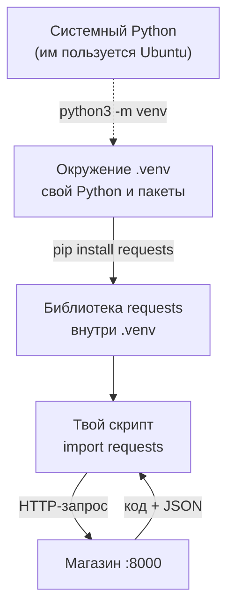
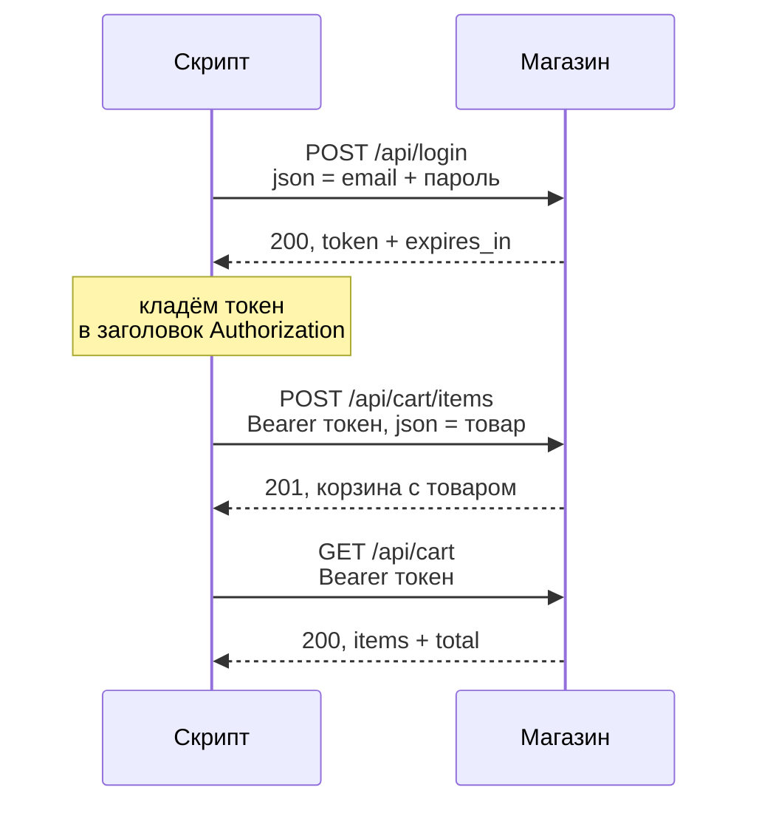
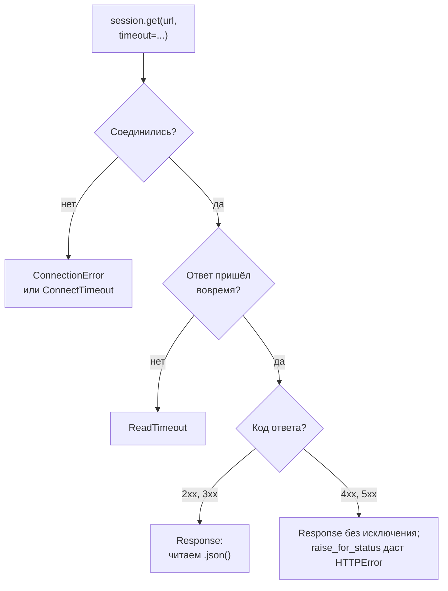
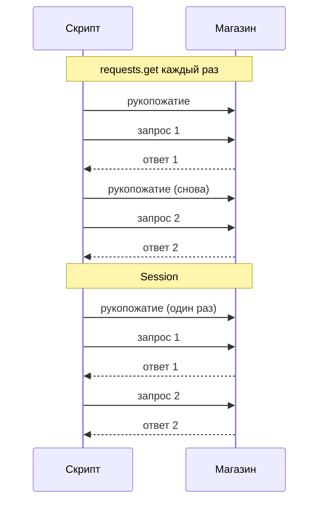

## Зачем это нужно

Я твой наставник на этом курсе: давно работаю с нагрузкой и сижу рядом, пока ты учишься. Начну с ситуации первой недели. Менеджер магазина просит: «Проверь, что страницы трёхсот товаров открываются». Руками это час кликов и скуки, а завтра попросят снова.

Поэтому нагрузочный тестировщик «разговаривает» с сервисом из кода: программа отправляет **HTTP-запрос** (письмо серверу, [урок 2.1](../02-web/01-client-server-http.md)) и читает ответ. В Python для этого есть готовая библиотека `requests`.

Чужую библиотеку нельзя просто «взять»: её надо поставить так, чтобы не сломать систему. Для этого есть отдельный ящик для проекта (виртуальное окружение) и программа установки `pip`. Половина вопросов новичков звучит как «ничего не запускается, `ModuleNotFoundError`».

Третья тема: что делать, когда сервер ответил ошибкой, ответил через минуту или не ответил совсем. Под нагрузкой так бывает постоянно. Скрипт, не готовый к этому, в самый важный момент молча зависнет.

Шаг проекта: ты создаёшь окружение `~/perf-lab/.venv` и список библиотек `requirements.txt`. Потом пишешь в `~/perf-lab/04-python/` три скрипта (первый запрос, «вошёл и положил в корзину», опыт с ошибками) и измеряешь выигрыш от `Session`. Скрипт `measure.py` из [урока 8.1](../08-perf-theory/01-latency-throughput.md) построен на этих приёмах, и после урока ты прочтёшь его целиком.

## Что нужно знать

- Терминал, `PATH`, установка пакетов через `apt`, каталог `~/perf-lab`: [урок 1.1](../01-linux/01-workstation-terminal.md). Если команда пишет `command not found`, причина обычно в `PATH`.
- HTTP: запрос, ответ, коды, заголовки, JSON и токен в заголовке `Authorization`: [урок 2.1](../02-web/01-client-server-http.md) и [урок 2.2](../02-web/02-rest-json-auth.md). Что такое `curl`, ты помнишь из [урока 1.4](../01-linux/04-network-cli.md).
- Python: переменные и словари ([4.1](01-first-program.md), [4.2](02-conditions-loops.md)), функции и `try`/`except` ([4.3](03-functions-errors.md)), JSON как «словарь в виде текста» ([4.4](04-files-json-csv.md)).
- Git: коммит и push в свой репозиторий `perf-lab` ([урок 3.1](../03-git/01-git-basics.md) и [урок 3.2](../03-git/02-github.md)).
- Стенд «Магазин» запущен: `curl -s localhost:8000/readyz` отвечает `{"status":"ready"}` ([урок 2.1](../02-web/01-client-server-http.md)). Если нет, зайди в `~/load-tester/project/shop` и выполни `docker compose up -d --wait`.

## Картина целиком

У каждой работы свой ящик с инструментами: в ящике для часов тонкие отвёртки, в ящике для велосипеда ключи. **Виртуальное окружение** это ящик для одного проекта со своими библиотеками. **pip** это программа, которая скачивает библиотеку и кладёт в ящик. **requests** это библиотека, через которую скрипт шлёт запросы «Магазину». Ящик не жалко выбросить: его собирают заново за десять секунд по списку `requirements.txt`.



Что здесь видно: пунктирная стрелка это «сделали отдельное окружение», системный Python она не трогает. Дальше всё внутри него: pip кладёт `requests`, скрипт её подключает и шлёт запрос, а ответ возвращается тому же скрипту.

Без любого звена скрипт ломается по-своему. Без окружения библиотеки смешаются с системными (Ubuntu 24.04 вообще не даст их ставить). Без проверки кода ответа скрипт «успешно» работает с ошибкой. Без таймаута, то есть ограничения ожидания, он ждёт бесконечно.

## Теория

### Виртуальное окружение: свой ящик для проекта

Ты поставил библиотеку, скрипт заработал. Через неделю ставишь вторую, и ломается то, чего ты вообще не запускал. Откуда?

У Ubuntu есть собственный Python, и на нём держатся системные программы. Библиотека другой версии может их сломать. К тому же двум твоим проектам могут быть нужны разные версии одной библиотеки, а общий Python удержит только одну. Поэтому с 2023 года Ubuntu отказывается ставить пакеты в системный Python через `pip` (правило PEP 668). Каждому проекту дают свой ящик.

Ящик называется **виртуальным окружением** (virtual environment, коротко **venv**). Это обычный каталог. Создаёт его команда `python3 -m venv .venv`: `-m venv` значит «запусти встроенный модуль `venv`», а `.venv` это имя каталога (точка прячет его от `ls`). Внутри появляется всё нужное:

```text
.venv/
├── bin/
│   ├── activate        скрипт включения окружения
│   ├── python          ссылка на системный python3
│   └── pip             установщик пакетов именно для этого окружения
├── lib/python3.12/site-packages/   сюда pip складывает библиотеки
└── pyvenv.cfg          какой Python использован, версия
```

Чтобы «включить» окружение, выполняют `source .venv/bin/activate`. Команда `source` запускает файл в текущем окне терминала, поэтому `activate` может изменить `PATH` (список каталогов, где оболочка ищет программы, [урок 1.1](../01-linux/01-workstation-terminal.md)). Он ставит в начало списка `.venv/bin`, и `python` с `pip` находятся там первыми. Слева в приглашении появляется `(.venv)`. Выключает окружение `deactivate`. Новое окно терминала снова без окружения: включение живёт только в том окне, где ты его сделал.

Проверим, какой Python запускается до и после:

```bash
which python3
source ~/perf-lab/.venv/bin/activate
which python
```

```text
/usr/bin/python3
/home/student/perf-lab/.venv/bin/python
```

До включения `python3` это системная программа из `/usr/bin`. После включения `python` указывает внутрь `.venv`, и библиотеки, которые ты поставишь, окажутся в `.venv/lib/.../site-packages`, а не в системе.

> **Прикинь сам:** вчера скрипт работал. Ты открыл новое окно терминала, запустил `python3 first_request.py` и получил `ModuleNotFoundError: No module named 'requests'`. Что случилось?
{: .predict}

Окружение в новом окне не включено, и системный Python про `requests` ничего не знает. Выполни `source ~/perf-lab/.venv/bin/activate` и проверь, что слева появилось `(.venv)`. Эту ошибку ты увидишь в «Сломай и почини», я сам первое время ловил её каждую неделю.

Осторожно: окружение это не виртуальная машина, а каталог с библиотеками и подменой `PATH`. Копировать его на другой компьютер или в git нельзя: внутри зашиты абсолютные пути. Его пересоздают по списку.

> **Главное:** окружение это отдельный каталог с библиотеками одного проекта, а `source .venv/bin/activate` подменяет `PATH` только в текущем окне.
{: .key}

Окружение пустое. Как положить в него `requests` и не забыть, что именно положил?

### pip и requirements.txt: как поставить библиотеку и вспомнить, что поставил

Писать HTTP-клиент самому слишком долго, он уже написан. Готовые библиотеки Python лежат на общем складе **PyPI** (Python Package Index, pypi.org). Достаёт их оттуда программа **pip**.

Команда `pip install requests` скачивает `requests` и её **зависимости**: библиотеки, без которых она не работает (`urllib3`, `idna`, `certifi`, `charset-normalizer`). Всё это ложится в окружение, которое сейчас включено. Команда `pip list` показывает, что стоит. `pip freeze` показывает то же в формате `имя==версия`, по строке на библиотеку.

Вот что получается:

```bash
pip install requests
pip freeze
```

```text
certifi==2026.7.22
charset-normalizer==3.5.2
idna==3.20
requests==2.34.2
urllib3==2.6.3
```

Ты просил одну библиотеку, а в списке пять: остальные четыре её зависимости, pip поставил их сам. Версии у тебя могут быть новее.

Через месяц ты не вспомнишь, какие версии стояли, а коллега захочет запустить твои скрипты. Поэтому список сохраняют в файл: `pip freeze > requirements.txt`. Знак `>` отправляет вывод команды в файл ([урок 1.2](../01-linux/02-text-logs.md)). Запись `==2.34.2` значит «ровно эта версия»: через год ты получишь ту же библиотеку, и скрипт не сломается из-за обновления. А чтобы git не сохранял сам `.venv`, в `.gitignore` ([урок 3.1](../03-git/01-git-basics.md)) уже стоит строка `/.venv/`.

> **Прикинь сам:** коллега клонировал твой `perf-lab`, а окружения в репозитории нет. Какие три действия ему нужны?
{: .predict}

Создать окружение (`python3 -m venv .venv`), включить его (`source .venv/bin/activate`) и поставить всё по списку (`pip install -r requirements.txt`; `-r` значит «read», прочитай из файла). В git лежит только список, окружение собирается заново.

Осторожно: `requirements.txt` говорит, что поставить, а `.gitignore` говорит git, что не сохранять. В репозиторий идут оба файла, а `.venv/` нет. И не пиши `sudo pip install`: это снова системный Python, от которого окружение тебя защищает.

> **Главное:** `pip install` ставит библиотеку с её зависимостями в текущее окружение, а `requirements.txt` с `==` записывает, что именно стоит, чтобы собрать то же самое заново.
{: .key}

Библиотека на месте. Пора отправить первый запрос и посмотреть, что вернётся.

### Запрос и ответ: requests.get

В [уроке 2.1](../02-web/01-client-server-http.md) ты слал запросы командой `curl`, но разбирать ответ в bash неудобно: нужны `jq`, `grep`, `awk`. Что, если ответ сразу придёт разложенным по полкам?

Так и работает `requests`. Представь заказное письмо с уведомлением: на конверте штамп (код ответа), в графе «служебные отметки» заголовки, внутри само письмо. Вызов `requests.get(адрес, params=..., timeout=...)` возвращает **объект ответа** (`Response`), у которого всё это лежит по отдельным полям. Код ответа это `.status_code` (200, 404, 503). Тело как обычная строка это `.text`. А `.json()` сразу разбирает тело из JSON в словарь или список, с которыми ты работал в [уроке 4.4](04-files-json-csv.md). Ещё пригодятся `.headers` (заголовки, как словарь), `.url` (итоговый адрес) и `.elapsed` (сколько прошло до получения ответа).

Параметры строки запроса (то, что в адресе стоит после `?`) передают словарём `params`. Библиотека сама склеит `?page=2&size=5` и закодирует русские буквы, так надёжнее, чем клеить адрес руками. Возьмём первые три товара каталога «Магазина»:

```python
import requests

BASE = "http://localhost:8000"

response = requests.get(f"{BASE}/api/products", params={"page": 1, "size": 3}, timeout=10)
print(response.url)
print(response.status_code)
print(response.json())
```

```text
http://localhost:8000/api/products?page=1&size=3
200
{'items': [{'id': 1, 'name': 'Товар 1', 'price': 137.0, 'category_id': 1, 'stock': 1000000}, {'id': 2, 'name': 'Товар 2', 'price': 174.0, 'category_id': 2, 'stock': 1000000}, {'id': 3, 'name': 'Товар 3', 'price': 211.0, 'category_id': 3, 'stock': 1000000}], 'page': 1, 'size': 3, 'total': 10000}
```

В `response.url` видно, что `params` превратились в `?page=1&size=3`. Код 200. `.json()` вернул обычный словарь: в нём список `items` (каждый товар это словарь), номер и размер страницы и `total`, всего товаров 10 000. Значит, `data["items"][0]["name"]` даст `'Товар 1'`: ты идёшь по словарям и спискам теми же индексами, что в [уроке 4.2](02-conditions-loops.md).

<div class="viz" data-viz="request-path" data-net="1" data-app="4" data-db="6" data-title="Что происходит между requests.get и ответом"></div>

Что здесь видно: запрос едет к магазину, магазин спрашивает базу, ответ идёт обратно. Всё время между «отправил» и «получил» и есть `response.elapsed`. На стенде сеть почти бесплатна, поэтому время уходит на работу «Магазина» и базы.

Осторожно: `.text` это строка, и написать в ней `["items"]` нельзя, нужен `.json()`. А `print(response)` покажет только `<Response [200]>`: это сам объект, а не тело.

> **Главное:** `requests.get` возвращает объект ответа, в котором код лежит в `.status_code`, а данные в `.json()`, и параметры адреса передают словарём `params`.
{: .key}

Каталог открыт всем. А корзина у каждого покупателя своя, и просто так её не покажут.

### POST, JSON-тело, токен и заголовки

Как «Магазин» узнаёт, чья это корзина? Ты входишь один раз: отправляешь логин и пароль и получаешь **токен**, длинную строку-пропуск. Дальше показываешь его в каждом запросе. Это как пропуск в бизнес-центре: паспорт ты предъявляешь на проходной один раз, а потом прикладываешь карточку к турникетам.

Вспомни [урок 2.2](../02-web/02-rest-json-auth.md): токен едет в заголовке `Authorization: Bearer <токен>`. `Bearer` по-английски «предъявитель»: кто предъявил токен, тот и вошёл. Отправка данных на сервер называется POST. В `requests` JSON-тело передают аргументом `json=`: ты даёшь словарь, а библиотека превращает его в текст и сама ставит заголовок `Content-Type: application/json`. Заголовки передают словарём `headers=`.

Весь путь из трёх шагов выглядит так:



Логин делают один раз, потом токен прикладывают к каждому запросу. «Магазин» по токену находит в Redis, чей это пропуск, и показывает именно твою корзину. Токен живёт 3600 секунд, час: ответ логина содержит `expires_in`. Через час «Магазин» ответит `401`, и войти придётся заново.

А теперь то же по строкам кода. Нажимай «Шаг ▶» и смотри правую колонку: токен «переезжает» из ответа в заголовок.

<div class="viz" data-viz="py-trace" data-title="Откуда токен берётся и куда едет" data-code='["session = requests.Session()", "body = {\"email\": \"user0007@shop.lab\", \"password\": \"password\"}", "response = session.post(url, json=body, timeout=30)", "token = response.json()[\"token\"]", "session.headers[\"Authorization\"] = f\"Bearer {token}\"", "cart = session.get(cart_url, timeout=10)", "print(cart.status_code)"]' data-steps='[{"l": 1, "v": {"session": "<Session>"}, "n": "Создали сессию: пока в ней нет ни токена, ни открытых соединений."}, {"l": 2, "v": {"session": "<Session>", "body": "{&#39;email&#39;: &#39;user0007@shop.lab&#39;, &#39;password&#39;: &#39;password&#39;}"}, "n": "Тело запроса это обычный словарь."}, {"l": 3, "v": {"session": "<Session>", "body": "{...}", "response": "<Response [200]>"}, "n": "Отправили POST. json= превратил словарь в JSON-текст."}, {"l": 4, "v": {"session": "<Session>", "body": "{...}", "response": "<Response [200]>", "token": "&#39;340fc0d3...&#39;"}, "n": "Токен достали из ответа: .json() дал словарь, [\"token\"] значение."}, {"l": 5, "v": {"session": "<Session + Authorization>", "token": "&#39;340fc0d3...&#39;"}, "n": "Токен лёг в общие заголовки сессии."}, {"l": 6, "v": {"session": "<Session + Authorization>", "cart": "<Response [200]>"}, "n": "Заголовок уехал сам, нам его повторять не нужно."}, {"l": 7, "v": {"cart": "<Response [200]>"}, "o": "200", "n": "Корзина открылась: сервер узнал нас по токену."}]'></div>

На шаге с `token` в переменных появляется строка, взятая из ответа. Следующая строка кладёт её в `session.headers`, и с этого места токен уходит в каждом запросе объекта `session`. Пока считай `Session` «сеансом связи с магазином», подробно про неё ниже.

Теперь та же логика функцией. Почти так же 9-я тема сделает из неё сценарий нагрузки:

```python
def login(session, number):
    """Входит под userNNNN@shop.lab и кладёт токен в заголовки сессии."""
    body = {"email": f"user{number:04d}@shop.lab", "password": "password"}
    response = session.post(f"{BASE}/api/login", json=body, timeout=30)
    response.raise_for_status()
    token = response.json()["token"]
    session.headers["Authorization"] = f"Bearer {token}"
    return token
```

Выражение `{number:04d}` это форматирование числа в f-строке: `d` значит целое, `04` значит «дополни нулями слева до четырёх знаков». Из 7 получается `0007` и адрес `user0007@shop.lab`, один из тысячи тестовых пользователей. Строку с `raise_for_status()` разберём в следующем разделе. Таймаут здесь 30 секунд, потому что вход намеренно медленный: пароль проверяет алгоритм bcrypt, около четверти секунды ([урок 8.1](../08-perf-theory/01-latency-throughput.md)).

> **Прикинь сам:** ты отправил `requests.post(url, data={"email": "...", "password": "password"}, timeout=10)` на `/api/login` и получил 422. Что поправить?
{: .predict}

Заменить `data=` на `json=`. Аргумент `data=` шлёт поля как веб-форму, а «Магазин» ждёт JSON-тело. Код 422 значит «запрос понятен, но данные не того вида». 

Осторожно: токен это пароль на час, целиком в логи его не печатают. И ещё одна ловушка: корзина хранится на сервере. Запустишь сценарий дважды, и товар окажется в ней дважды, «Магазин» складывает количества. Это не ошибка скрипта, а свойство сервиса: повторный тест начинается не с чистого листа.

> **Главное:** войти нужно один раз, получить токен и класть его в заголовок `Authorization: Bearer`, а JSON-тело в `requests` отправляют через `json=`, не через `data=`.
{: .key}

Вход получился. А что, если сервер вместо корзины ответит ошибкой?

### Коды ответа и ошибки: что бросает requests, а что нет

Расскажу про свой первый такой скрипт. Он проверял страницы товаров, и я запустил его вечером и ушёл домой. Утром терминал молчал: ни ошибки, ни результата. Ночью тестовый сервер перезапускали, соединение повисло, а ждать скрипт был готов сколько угодно. Он простоял восемь часов, и вся моя «автоматизация» оказалась хуже ручных кликов. С тех пор я ставлю ограничение ожидания в каждом запросе.

Когда скрипт ходит по сети, может случиться три разные вещи. Сервер ответил успехом. Сервер ответил, но сказал «нет». Ответа не было вовсе. Это как звонок в справочную: ответили по делу, ответили «такого номера нет» или не взяли трубку. Каждый случай лечится по-своему.

Главный сюрприз новичка: **`requests` не считает код 404 или 500 ошибкой программы.** Сервер ответил, значит, для библиотеки всё получилось, и ты получишь обычный `Response` с `status_code`, равным 404. Исключения не будет, скрипт пойдёт дальше и упадёт в другом месте, например на `KeyError`. Коды ты помнишь из [урока 2.1](../02-web/01-client-server-http.md): 4xx это ошибка в твоём запросе (401 нет токена, 404 нет объекта), 5xx это ошибка сервера (503 перегружен).

Чтобы ошибка не проскочила молча, после запроса вызывают `response.raise_for_status()`. Если код 400 или больше, он бросает исключение `requests.HTTPError`, и скрипт падает сразу и громко. Про исключения и `try`/`except` см. [урок 4.3](03-functions-errors.md).

А если ответа нет совсем, `requests` бросает исключение сам. `ConnectionError` значит «не удалось соединиться»: сервис не запущен, порт неверный или сеть оборвалась. `Timeout` значит «дождались слишком долго». У него два вида: `ConnectTimeout` (не смогли соединиться вовремя) и `ReadTimeout` (соединились, но ответа нет). Все они наследуются от общего `requests.RequestException`, поэтому одним `except` можно поймать любую сетевую беду.



Что здесь видно: исключения случаются только в верхних ветках, когда ответа не было. Нижняя правая ветка самая коварная: ответ есть, ошибка есть, а исключения нет, пока ты сам не спросишь.

Теперь о таймауте. Аргумент `timeout=` задаёт, сколько секунд скрипт согласен ждать. По умолчанию его нет, и `requests` ждёт вечно, ровно как мой скрипт в байке. Под нагрузкой сервер как раз и «подвисает»: запросы встают в очередь, как в [уроке 8.1](../08-perf-theory/01-latency-throughput.md). На быстрые запросы ставь 10 секунд, на вход и заказ 30-60. В `measure.py` из 8.1 везде 30: под перегрузкой медленный ответ должен стать замером, а не обрывом.

<details markdown="1">
<summary>Для любопытных: что именно считает таймаут</summary>

Запись `timeout=10` не значит «весь запрос уложится в 10 секунд». Она значит «не ждать больше 10 секунд тишины» при соединении и при каждом ожидании очередной порции ответа. Можно задать два числа: `timeout=(3, 30)` значит 3 секунды на соединение и 30 на ответ.

</details>

Проверим все четыре ситуации на стенде:

```python
import requests

BASE = "http://localhost:8000"

# 1. Сервер ответил ошибкой: исключения НЕТ, смотрим на код сами.
response = requests.get(f"{BASE}/api/products/99999999", timeout=10)
print("1.", response.status_code, response.json())

# 2. То же, но raise_for_status() превращает ошибку в исключение.
try:
    response.raise_for_status()
except requests.HTTPError as error:
    print("2.", error)

# 3. Сервер отвечает дольше, чем мы готовы ждать: сработает timeout.
# Вход проверяет пароль медленным хешированием bcrypt (около четверти секунды), а ждать мы согласны 0,05 с.
body = {"email": "user0001@shop.lab", "password": "password"}
try:
    requests.post(f"{BASE}/api/login", json=body, timeout=0.05)
except requests.Timeout as error:
    print("3.", type(error).__name__, "-", error)

# 4. Сервер недоступен.
try:
    requests.get("http://localhost:9999/", timeout=3)
except requests.ConnectionError as error:
    print("4.", type(error).__name__, "-", str(error)[:70], "...")
```

```text
1. 404 {'detail': 'product not found'}
2. 404 Client Error: Not Found for url: http://localhost:8000/api/products/99999999
3. ReadTimeout - HTTPConnectionPool(host='localhost', port=8000): Read timed out. (read timeout=0.05)
4. ConnectionError - HTTPConnectionPool(host='localhost', port=9999): Max retries exceeded  ...
```

В случае 1 ответ получен, `print` спокойно показал код 404 и тело `{'detail': 'product not found'}`, и никакой ошибки Python нет. В случае 2 тот же ответ превратился в `HTTPError` с понятным текстом. В случае 3 соединение открылось, но вход занимает около 250 мс, а мы согласны ждать 50: получаем `ReadTimeout`. В случае 4 на порту 9999 никто не слушает, поэтому `ConnectionError`. Фраза `Max retries exceeded` в конце не про тысячи попыток, это обычный текст библиотеки для «не получилось».

> **Прикинь сам:** `response = requests.get(url, timeout=5)`, затем `print(response.json()["items"])`. Сервер вернул 503 и тело `{"detail": "database pool timeout"}`. Что произойдёт?
{: .predict}

Исключения от `requests` не будет: ответ получен. Метод `.json()` вернёт словарь `{"detail": ...}`, а `["items"]` упадёт с `KeyError: 'items'`, и по этой ошибке причину не угадать. Нужно вызвать `response.raise_for_status()` сразу после запроса: тогда скрипт упадёт с понятным `503 Server Error`.

Осторожно: пустой `except:` прячет проблему. Ловят `requests.RequestException` и считают такие случаи ошибками, иначе незамеченные таймауты дадут красивые, но лживые графики. И таймаут не лечит медленный сервис, он только не даёт скрипту зависнуть.

> **Главное:** `requests` бросает исключение только если ответа не было, а ошибку в ответе (4xx, 5xx) показывает только `raise_for_status()`, и `timeout=` нужен в каждом запросе.
{: .key}

С ошибками разобрались. Вернёмся к трёмстам запросам из начала урока: можно ли делать их быстрее?

### Session: не открывать соединение заново

Каждый HTTP-запрос едет внутри TCP-соединения ([урок 1.4](../01-linux/04-network-cli.md)). Перед первым запросом клиент и сервер обмениваются тремя служебными пакетами: «привет», «привет», «договорились». Это называется установкой соединения (handshake, рукопожатие). Если для каждого запроса открывать и закрывать соединение заново, на каждый уходит лишнее время. В нагрузочном тесте с десятками тысяч запросов часть времени ты меряешь уже не сервис, а собственный скрипт.

Представь справочную: позвонил, получил ответ, положил трубку, набрал снова, дождался гудков, получил второй ответ. А можно не класть трубку, пока есть вопросы. Аналогия ломается тем, что сервер держит такую «линию» занятой и может закрыть её, если ты долго молчишь.

Вызов `requests.get(...)` каждый раз создаёт временный набор настроек, открывает соединение, делает запрос и закрывает всё. А `requests.Session()` создаёт долгоживущий объект. Он хранит набор открытых соединений (их называют пулом соединений) и использует их повторно: этот режим называется **keep-alive**, «не закрывай линию». Он запоминает общие заголовки `session.headers`: положи токен один раз, и он едет в каждом запросе. Ещё он хранит cookies, маленькие записки, которые сервер просит вернуть со следующим запросом («Магазин» ими не пользуется). Закрывать сессию нужно, и удобнее через `with`, как `with open(...)` для файла в [уроке 4.4](04-files-json-csv.md).



Что здесь видно: при двух запросах через `requests.get` рукопожатие выполняется дважды, через `Session` один раз. Чем больше запросов, тем больше разница: при 300 запросах это 299 лишних рукопожатий.

Посмотри на модель двух способов.

<div class="viz" data-viz="py-session-compare" data-requests="8" data-connect="15" data-work="25"></div>

Верхняя полоса это запросы по одному с новым соединением (жёлтые куски это рукопожатия), нижняя это одна `Session` с единственным жёлтым куском.

Теперь опыт на стенде: 300 запросов карточки товара, сначала по одному, потом через `Session`.

```python
import time

import requests

URL = "http://localhost:8000/api/products/42"
COUNT = 300


def without_session():
    for _ in range(COUNT):
        requests.get(URL, timeout=10)


def with_session():
    with requests.Session() as session:
        for _ in range(COUNT):
            session.get(URL, timeout=10)


for name, run in (("requests.get", without_session), ("Session", with_session)):
    start = time.perf_counter()
    run()
    seconds = time.perf_counter() - start
    print(f"{name:13} {COUNT} запросов за {seconds:.2f} с, в среднем {seconds / COUNT * 1000:.1f} мс")
```

```text
requests.get  300 запросов за 2.08 с, в среднем 6.9 мс
Session       300 запросов за 1.57 с, в среднем 5.2 мс
```

Оба варианта просят у сервера одно и то же, но второй быстрее примерно на 1,7 мс на запрос, то есть на четверть. Это время ушло на открытие и закрытие соединения. Твои числа будут другими, но `Session` должна оказаться быстрее. Если не так, повтори замер. В коде `name:13` выравнивает имя по ширине 13 символов. А `for name, run in (...)` обходит пары «имя, функция»: функцию можно хранить в переменной и вызвать позже, как `run()`.

Осторожно: `Session` убирает лишнюю работу клиента, а сервер быстрее не отвечает. Токен в `session.headers` едет во всех запросах сессии. Одну сессию лучше не делить между потоками: в `measure.py` у каждого пользователя своя ([урок 8.1](../08-perf-theory/01-latency-throughput.md)).

> **Главное:** `Session` переиспользует открытое соединение и общие заголовки, поэтому серия запросов к одному серверу идёт быстрее, а токен кладут в неё один раз.
{: .key}

Осталось выбрать секундомер, которым все эти запросы мерить.

### Как мерить время запроса

Первый вариант: `response.elapsed.total_seconds()`, время до получения заголовков ответа. Но у запроса, закончившегося таймаутом или обрывом, нет `Response`, и его время пропадёт. Второй: свой секундомер из `time.perf_counter()` до запроса и после. Эти часы идут равномерно и не прыгают при подстройке времени по интернету (в отличие от `time.time()`). Смысл имеет только разность двух вызовов.

Поэтому в `measure.py` секундомер запускается до блока `try`: время таймаута тоже попадает в результат, и ошибки не «ускоряют» статистику. Запомни приём: `start = time.perf_counter()`, затем запрос в `try`, затем `time.perf_counter() - start`.

Осторожно: `elapsed` и цифры из `curl -w` почти совпадают, но не идентичны, у них разные точки отсчёта. В одной серии бери один способ.

Вернёмся к менеджеру из начала урока. Теперь «проверь триста товаров» это цикл: `Session`, `get` с `timeout=`, `raise_for_status()`. Каждая ошибка попадёт в отчёт, а не пропадёт молча.

> **Главное:** меряй секундомером `perf_counter` вокруг всего вызова, включая `try`, чтобы время неудачных запросов тоже вошло в результат.
{: .key}

## Практика

### 1. Создай окружение и поставь requests

Убедись, что стенд запущен, и подготовь каталоги:

```bash
curl -s localhost:8000/readyz
cd ~/perf-lab
mkdir -p 04-python
python3 --version
python3 -m venv .venv
source .venv/bin/activate
which python
pip install requests
```

```text
{"status":"ready"}
Python 3.12.3
/home/student/perf-lab/.venv/bin/python
Collecting requests
  ...
Successfully installed certifi-2026.7.22 charset-normalizer-3.5.2 idna-3.20 requests-2.34.2 urllib3-2.6.3
```

**Как читать вывод:** первая строка подтверждает, что стенд жив (иначе подними его, см. «Что нужно знать»). Версия Python должна быть 3.12 или новее. Путь к `python` должен вести в `.venv`, это главная проверка, что окружение включено. Последняя строка перечисляет всё, что поставил pip: `requests` и четыре зависимости. Остальные строки (скачивание) у тебя могут выглядеть иначе.

**Типичные ошибки:**

- `The virtual environment was not created successfully because ensurepip is not available`: не установлен пакет `python3-venv`. Поставь: `sudo apt install -y python3-venv` и повтори создание (в [уроке 1.1](../01-linux/01-workstation-terminal.md) ты его ставил).
- `error: externally-managed-environment` при `pip install`: окружение не включено, а pip пытается писать в систему. Выполни `source ~/perf-lab/.venv/bin/activate` и повтори.
- Нет `(.venv)` в приглашении, хотя `source` выполнился: проверь, что ты в том же окне и не вводил `deactivate`.

Теперь зафиксируй зависимости и проверь, что окружение закрыто от git:

```bash
cd ~/perf-lab
pip freeze > requirements.txt
cat requirements.txt
grep -n 'venv\|pycache' .gitignore
git status --short
```

```text
certifi==2026.7.22
charset-normalizer==3.5.2
idna==3.20
requests==2.34.2
urllib3==2.6.3
2:/.venv/
3:__pycache__/
?? requirements.txt
```

**Как читать вывод:** в git-статусе `??` значит «новый файл, который git ещё не знает». Каталога `.venv/` в списке **нет**, потому что правило для него ты записал в `.gitignore` ещё в [уроке 3.1](../03-git/01-git-basics.md). Если бы он появился, git пытался бы сохранить десятки мегабайт чужого кода. Если `grep` ничего не вывел (например, ты пропустил 3.1 или стёр файл), дозапиши правила: `printf '/.venv/\n__pycache__/\n' >> .gitignore` (`>>` дописывает в конец, а не затирает). Каталог `__pycache__/` туда Python складывает свои временные файлы.

### 2. Первый запрос

Создай `~/perf-lab/04-python/first_request.py`:

```python
"""Первый запрос из кода: каталог «Магазина»."""
import requests

BASE = "http://localhost:8000"

response = requests.get(f"{BASE}/api/products", params={"page": 1, "size": 3}, timeout=10)

print("адрес:", response.url)
print("код ответа:", response.status_code)
print("тип содержимого:", response.headers["Content-Type"])

data = response.json()
print("всего товаров:", data["total"])
for item in data["items"]:
    print(item["id"], item["name"], item["price"])
print(f"заняло: {response.elapsed.total_seconds() * 1000:.0f} мс")
```

Запусти (окружение включено):

```bash
cd ~/perf-lab/04-python
python first_request.py
```

```text
адрес: http://localhost:8000/api/products?page=1&size=3
код ответа: 200
тип содержимого: application/json
всего товаров: 10000
1 Товар 1 137.0
2 Товар 2 174.0
3 Товар 3 211.0
заняло: 6 мс
```

**Как читать вывод:** `Content-Type: application/json` значит, что тело ответа это JSON, и `.json()` его разберёт. Цикл `for item in data["items"]` проходит по списку товаров, а каждый `item` это словарь, из которого берутся три поля. Последняя строка: время ответа (у тебя будет своё, обычно от 3 до 20 мс; `:.0f` округляет до целого).

**Типичные ошибки:**

- `ModuleNotFoundError: No module named 'requests'`: окружение не включено (смотри «Сломай и почини»).
- `requests.exceptions.ConnectionError ... Connection refused`: стенд не запущен. Проверь `curl -s localhost:8000/readyz` и подними его.

Измени `size` на 10 и `page` на 3, и посмотри, что поменялось в адресе и в списке.

### 3. Сценарий «вошёл и положил в корзину»

Создай `~/perf-lab/04-python/shop_flow.py`:

```python
"""Сценарий покупателя: вход, корзина, проверка корзины."""
import requests

BASE = "http://localhost:8000"


def login(session, number):
    """Входит под userNNNN@shop.lab и кладёт токен в заголовки сессии."""
    body = {"email": f"user{number:04d}@shop.lab", "password": "password"}
    response = session.post(f"{BASE}/api/login", json=body, timeout=30)
    response.raise_for_status()          # 4xx и 5xx превращаем в исключение
    token = response.json()["token"]
    session.headers["Authorization"] = f"Bearer {token}"
    return token


def add_to_cart(session, product_id, qty=1):
    response = session.post(f"{BASE}/api/cart/items",
                            json={"product_id": product_id, "qty": qty}, timeout=10)
    response.raise_for_status()
    return response.json()


def main():
    with requests.Session() as session:
        token = login(session, 7)
        print("токен получен:", token[:8] + "...")
        add_to_cart(session, 1, 2)
        add_to_cart(session, 42)
        cart = session.get(f"{BASE}/api/cart", timeout=10).json()
        for item in cart["items"]:
            print(f"товар {item['product_id']}: {item['qty']} шт. по {item['price']}")
        print("итого:", cart["total"])


if __name__ == "__main__":
    main()
```

Разбор нового: `if __name__ == "__main__":` значит «выполни `main()`, только если файл запущен как программа, а не импортирован из другого файла». Ты увидишь это в уроках 4.6 и 4.7: файл можно будет подключить, и он не начнёт сам ходить в «Магазин». `token[:8]` это срез первых восьми символов (урок 4.2): целый токен в экран выводить незачем. `qty=1` это значение аргумента по умолчанию ([урок 4.3](03-functions-errors.md)).

```bash
python shop_flow.py
```

```text
токен получен: 340fc0d3...
товар 1: 2 шт. по 137.0
товар 42: 1 шт. по 1654.0
итого: 1928.0
```

**Как читать вывод:** токен у тебя будет другой (он случайный, 64 символа). Первая корзина считается так: 2 × 137 + 1 × 1654 = 1928. Запусти скрипт второй раз: количества удвоятся (4 и 2), а итого станет 3856.0. Корзина хранится на сервере и копится от запуска к запуску, как предупреждалось выше.

**Типичные ошибки:**

- `requests.exceptions.HTTPError: 401 Client Error: Unauthorized for url: .../api/cart/items`: токен не попал в заголовок. Проверь строку `session.headers["Authorization"] = ...`.
- `HTTPError: 422 ... for url: .../api/login`: ты передал `data=` вместо `json=`.
- `HTTPError: 404 ... /api/cart/items`: такого `product_id` в каталоге нет (допустимы от 1 до 10000).

### 4. Опыт с ошибками

Создай `~/perf-lab/04-python/errors_demo.py` с кодом из раздела «Коды ответа и ошибки: что бросает requests, а что нет» выше (четыре случая) и запусти:

```bash
python errors_demo.py
```

Ты должен увидеть те же четыре строки. Поэкспериментируй: измени таймаут в случае 3 с `0.05` на `5`, и вместо `ReadTimeout` вход пройдёт, а `print` не вызовется. Это показывает, что таймаут срабатывает **только когда сервер медлит дольше** разрешённого. Потом останови стенд (`cd ~/load-tester/project/shop && docker compose stop shop`) и запусти `first_request.py`: получишь `ConnectionError`. Верни стенд: `docker compose start shop`, и подожди, пока `curl -s localhost:8000/readyz` снова ответит.

### 5. Сравни requests.get и Session

Создай `~/perf-lab/04-python/session_timing.py` с кодом из раздела про `Session` выше и запусти его дважды:

```bash
python session_timing.py
python session_timing.py
```

```text
requests.get  300 запросов за 2.08 с, в среднем 6.9 мс
Session       300 запросов за 1.57 с, в среднем 5.2 мс
requests.get  300 запросов за 2.01 с, в среднем 6.7 мс
Session       300 запросов за 1.55 с, в среднем 5.2 мс
```

**Как читать вывод:** сравнивай строки внутри одного запуска. Второй запуск почти повторил первый: так проверяют, что разница не случайная. Для надёжности запуск повторяют несколько раз и берут типичное, это пригодится в [уроке 8.1](../08-perf-theory/01-latency-throughput.md).

### 6. Закоммить результат

```bash
cd ~/perf-lab
git add requirements.txt 04-python
git commit -m "4.5: venv, requests, первые скрипты к Магазину"
git push
```

```text
[main 7d3e2a1] 4.5: venv, requests, первые скрипты к Магазину
 5 files changed, 117 insertions(+)
 create mode 100644 04-python/first_request.py
 ...
```

**Как читать вывод:** в сообщении коммита видно число изменённых файлов. Если `git push` просит логин, вернись к [уроку 3.2](../03-git/02-github.md). Зайди на страницу репозитория на GitHub и убедись, что `.venv` там нет, а `requirements.txt` есть.

> `requests` вернул не то, что ты ждал? Напечатай `response.status_code` и `response.text` и посмотри сам. Потом спроси нейросеть и проверь её ответ тем же запросом через `curl`.
{: .ai}

## Сломай и почини

**Поломка 1: окружение выключено.** Открой **новое** окно терминала (не включая окружение) и выполни:

```bash
cd ~/perf-lab/04-python
python3 first_request.py
pip install requests
```

```text
Traceback (most recent call last):
  File "/home/student/perf-lab/04-python/first_request.py", line 2, in <module>
    import requests
ModuleNotFoundError: No module named 'requests'
error: externally-managed-environment

× This environment is externally managed
╰─> To install Python packages system-wide, try apt install
    python3-xyz, where xyz is the package you are trying to
    install.
    ...
hint: See PEP 668 for the detailed specification.
```

**Задача.** Объясни обе ошибки и почини, не используя `sudo` и не добавляя флаг `--break-system-packages`.

<details markdown="1">
<summary>Разбор</summary>

Первая ошибка: системный Python не знает про `requests`, потому что библиотека лежит в `.venv`. Вторая: `pip` вне окружения хочет писать в системный Python, и Ubuntu это запрещает (PEP 668), чтобы ты не сломал системные программы. Обе ошибки имеют одну причину: в этом окне окружение не включено.

Исправление: `source ~/perf-lab/.venv/bin/activate`. Проверь, что слева появилось `(.venv)`, а `which python` показывает путь внутри `.venv`. Если нужно запустить скрипт без включения окружения (например, из планировщика), можно указать интерпретатор полным путём: `~/perf-lab/.venv/bin/python first_request.py`.

</details>

**Поломка 2: ответ с ошибкой, которую никто не заметил.** Создай `~/perf-lab/04-python/broken.py`:

```python
import requests

response = requests.get("http://localhost:8000/api/cart", timeout=10)
for item in response.json()["items"]:
    print(item["name"])
```

```text
Traceback (most recent call last):
  File "broken.py", line 4, in <module>
    for item in response.json()["items"]:
KeyError: 'items'
```

**Задача.** Найди настоящую причину, не угадывая. Подсказка: перед чтением тела выведи код и тело ответа.

<details markdown="1">
<summary>Разбор</summary>

Добавь перед циклом `print(response.status_code, response.text)`:

```text
401 {"detail":"bearer token required"}
```

Корзина закрыта для тех, кто не вошёл. Запрос без токена получил 401, тело оказалось словарём `{"detail": ...}` без ключа `items`, поэтому `KeyError`. `requests` исключения не бросил, потому что ответ получен.

Исправление в два шага: войти (`login(session, 7)` из `shop_flow.py`) и запросить корзину через `session`. А чтобы такие ошибки сразу показывали правду, вставь после запроса `response.raise_for_status()`: тогда скрипт упадёт с `401 Client Error: Unauthorized`, и причина будет видна в первой строке ошибки. Удали `broken.py` после опыта.

</details>

## ИИ в помощь

Нейросеть помогает с `requests` и виртуальными окружениями, но версии пакетов помнит с запозданием. Общие правила на странице [ИИ-помощник](../ai.md).

**Задача:** написать сценарий «вошёл и положил в корзину».

```text
Python 3.12, библиотека requests. Стенд http://localhost:8000. Нужно: войти (POST /api/login, JSON email и password), взять токен, через requests.Session положить товар в корзину (POST /api/cart/items) и прочитать корзину. Добавь timeout, проверку статуса и понятные сообщения об ошибках. Объясни, зачем Session.
```
{: .wrap}

**Проверь ответ:** запусти на стенде и сверь поля с `/docs` стенда. Типичная ошибка: `requests` сам не бросает исключение на 404 и 500 (нужен `raise_for_status()`), нет `timeout`, выдуманные поля тела.

**Задача:** разобраться с окружением и ошибкой установки.

```text
Ubuntu 24.04, Python 3.12. Ошибка при pip install:
<вставь вывод>
Объясни, что значит каждая строка, зачем виртуальное окружение (venv) и как убедиться, что я в нём. Дай команды проверки (which python, pip list).
```
{: .wrap}

**Проверь ответ:** проверь `which python` после активации: путь должен вести в `.venv`. Типичная ошибка: совет `sudo pip install` или `--break-system-packages`: так ломают системный Python.

Пароль и токен из кода в чат не отправляй: замени на `<пароль>` и `<токен>`. Настоящие секреты в код не пишут.

## Словарик урока

| Термин | Простыми словами |
|---|---|
| Виртуальное окружение (venv) | Каталог со своими библиотеками Python для одного проекта; не затрагивает систему |
| Активация | `source .venv/bin/activate`: подмена `PATH` в этом окне, чтобы `python` и `pip` брались из окружения |
| pip, PyPI | Программа для установки библиотек; общий склад библиотек Python |
| Зависимость | Библиотека, без которой работает другая библиотека |
| `requirements.txt` | Список `имя==версия` для повторной установки окружения |
| `.gitignore` | Список того, что git не должен сохранять (например, `.venv/`) |
| `requests` | Библиотека для HTTP-запросов из Python |
| `Response` | Объект ответа: `.status_code`, `.headers`, `.text`, `.json()` |
| `json=` и `data=` | Тело запроса как JSON и как поля веб-формы; для API нужен `json=` |
| `Authorization: Bearer` | Заголовок с токеном: «я вошёл, вот мой пропуск» |
| `raise_for_status()` | Превращает ответ 4xx или 5xx в исключение `HTTPError` |
| `timeout=` | Сколько секунд ждать тишины; без него запрос может висеть вечно |
| `ConnectionError`, `Timeout` | Исключения «не удалось соединиться» и «не дождались ответа» |
| `Session` | Долгоживущий объект: переиспользует соединения и хранит общие заголовки |
| Keep-alive | Режим, когда соединение остаётся открытым между запросами |
| `time.perf_counter()` | Точные равномерные часы для замеров; значимы только разности |

## Вопросы с собеседований

Раздел для повторения: ответь вслух, потом открой ответ. Вопросы с пометкой `[на скорость]` тренируй на время: ответ за 30 секунд.

### 1. [junior] [часто] Зачем нужно виртуальное окружение Python?

<details markdown="1">
<summary>Ответ</summary>

Чтобы у каждого проекта были свои библиотеки нужных версий и они не конфликтовали ни друг с другом, ни с системным Python, на котором держатся программы ОС. Окружение это каталог, который создаётся `python3 -m venv .venv` и включается `source .venv/bin/activate`. Зависимости фиксируют в `requirements.txt`, а сам каталог в git не кладут.

**Что хотят услышать:** изоляция версий, не ломаем системный Python, список зависимостей вместо копирования окружения.

**Красный флаг:** «ставлю всё через `sudo pip`».

</details>

### 2. [junior] [часто] Что делает `requests.get(url)` и что мы получаем в ответ?

<details markdown="1">
<summary>Ответ</summary>

Отправляет HTTP-запрос GET по адресу и возвращает объект `Response`: у него `.status_code` (код), `.headers`, `.text` (тело строкой), `.json()` (тело, разобранное из JSON в словарь или список), `.elapsed` и другое. Параметры строки запроса передают словарём `params=`, а ограничение ожидания через `timeout=`.

**Что хотят услышать:** объект ответа и его основные поля, `params`, `timeout`.

**Красный флаг:** считает, что `get` возвращает сразу JSON.

</details>

### 3. [junior] [часто] Бросит ли `requests` исключение, если сервер вернул 404 или 500?

<details markdown="1">
<summary>Ответ</summary>

Нет. Ответ получен, значит, для библиотеки запрос удался, и ты получишь `Response` с `status_code` 404 или 500. Чтобы превратить 4xx/5xx в исключение, вызывают `response.raise_for_status()` (оно бросит `requests.HTTPError`) или сравнивают код сами. Исключения бросаются только когда ответа не было: `ConnectionError`, `Timeout`.

**Что хотят услышать:** разница между «ответ с ошибкой» и «нет ответа», `raise_for_status()`.

**Красный флаг:** «в `try/except` поймаю 404».

</details>

### 4. [junior] Что будет, если не указать `timeout` в `requests.get`?

<details markdown="1">
<summary>Ответ</summary>

По умолчанию таймаута нет, и скрипт может ждать ответа бесконечно, если сервер принял соединение и «завис». В нагрузочном скрипте это значит замерший генератор и отчёт, которого никогда не будет. Поэтому `timeout=` ставят всегда: например, 10 секунд на обычный запрос и 30-60 на тяжёлый (в `measure.py` из 8.1 везде 30: под перегрузкой медленный ответ должен стать замером, а не обрывом). Таймаут это пауза ожидания, а не лимит на весь запрос.

**Что хотят услышать:** ждёт вечно, ставим всегда, примерные значения.

**Красный флаг:** «таймаут не нужен, сервер быстрый».

</details>

### 5. [middle] Чем `requests.Session` отличается от обычных вызовов `requests.get` и когда её использовать?

<details markdown="1">
<summary>Ответ</summary>

Session переиспользует открытые соединения (keep-alive) и хранит общие заголовки и cookies. Обычный `requests.get` каждый раз открывает и закрывает соединение. Для серии запросов к одному серверу, а тем более для генератора нагрузки, Session нужна: меньше накладных расходов на клиенте, и токен достаточно положить в `session.headers` один раз. Сервер она не ускоряет. Одну Session лучше не делить между потоками.

**Что хотят услышать:** пул соединений, общие заголовки, не про скорость сервера, один поток: одна сессия.

**Красный флаг:** «Session нужна, чтобы сервер отвечал быстрее».

</details>

### 6. [junior] Как передать токен в запросе к API?

<details markdown="1">
<summary>Ответ</summary>

В заголовке `Authorization: Bearer <токен>`. В `requests` это `headers={"Authorization": f"Bearer {token}"}` в одном вызове или `session.headers["Authorization"] = ...` один раз для всей сессии. Токен получают отдельным запросом входа (`POST /api/login`) и не печатают в логи целиком.

**Что хотят услышать:** имя заголовка, слово Bearer, где взять токен.

**Красный флаг:** передаёт токен в адресе запроса или в теле.

</details>

### 7. [middle] В чём разница между `json=` и `data=` в `requests.post`?

<details markdown="1">
<summary>Ответ</summary>

`json=` превращает словарь в JSON-текст и ставит `Content-Type: application/json`: нужно для JSON-API, к которым относится и «Магазин». `data=` отправляет поля как веб-форму (`email=...&password=...`), и JSON-API в ответ скажет 422 или 400. Путаница между ними частая причина «странного» отказа от API.

**Что хотят услышать:** формат тела и заголовок, признак ошибки (422).

**Красный флаг:** считает их взаимозаменяемыми.

</details>

### 8. [middle] Как правильно обрабатывать ошибки сети в скрипте с `requests`?

<details markdown="1">
<summary>Ответ</summary>

Ловить `requests.RequestException` (или конкретные `ConnectionError`, `Timeout`) вокруг запроса и считать такие случаи ошибками: записать, посчитать в статистике, при необходимости повторить с паузой. Пустой `except:` и «проглатывание» ошибок прячут проблему. Код ответа проверять отдельно: `raise_for_status()` или сравнение с ожидаемым.

**Что хотят услышать:** базовый класс исключений, учёт ошибок в статистике, отдельная проверка кода.

**Красный флаг:** `except: pass`.

</details>

### 9. [middle] Почему в замере времени запроса в нагрузочном скрипте секундомер включают до `try`?

<details markdown="1">
<summary>Ответ</summary>

Чтобы время неудачных запросов тоже попало в замер. Если замерять только успешные, таймауты и обрывы «исчезнут» из статистики, и перегруженный сервис будет выглядеть лучше, чем есть. Для секундомера берут `time.perf_counter()`: он идёт равномерно и не зависит от подстройки системных часов.

**Что хотят услышать:** учёт ошибок и таймаутов, `perf_counter`, а не `time.time()`.

**Красный флаг:** замеряет только успешные ответы.

</details>

### 10. [junior] Как воспроизвести окружение проекта на другом компьютере?

<details markdown="1">
<summary>Ответ</summary>

Склонировать репозиторий, создать окружение `python3 -m venv .venv`, включить `source .venv/bin/activate` и выполнить `pip install -r requirements.txt`. Файл с версиями получен командой `pip freeze > requirements.txt` и лежит в git, а `.venv/` добавлен в `.gitignore`.

**Что хотят услышать:** окружение пересоздаётся по списку, а не копируется.

**Красный флаг:** копирует каталог `.venv` на флешке.

</details>

### 11. [на скорость] Какая команда включает виртуальное окружение?

<details markdown="1">
<summary>Ответ</summary>

`source .venv/bin/activate` (путь зависит от того, где окружение лежит). Признак успеха: слева в приглашении `(.venv)`. Выключает `deactivate`.

**Что хотят услышать:** точная команда и признак.

**Красный флаг:** путает с созданием окружения.

</details>

### 12. [на скорость] Что делает `response.raise_for_status()`?

<details markdown="1">
<summary>Ответ</summary>

Если код ответа 400 или больше, бросает `requests.HTTPError`, иначе ничего не делает. Нужен, чтобы ошибка сервера не прошла молча.

**Что хотят услышать:** условие (4xx и 5xx) и тип исключения.

**Красный флаг:** считает, что он сам проверяет JSON.

</details>

## Проверено на версиях

Ubuntu 24.04 и 26.04, Python 3.12.3, `requests` 2.34.2, стенд «Магазин» из `project/shop`. Октябрь 2026. Номера версий зависимостей в `requirements.txt` у тебя могут быть новее.

## Итог урока: ты умеешь

- [ ] Создать виртуальное окружение, включить его и убедиться, что `python` берётся из `.venv`.
- [ ] Поставить библиотеку через `pip`, зафиксировать версии в `requirements.txt` и пересоздать окружение по нему.
- [ ] Не пустить `.venv` в git через `.gitignore`.
- [ ] Отправить GET с параметрами и POST с JSON и прочитать код, заголовки и JSON-тело ответа.
- [ ] Войти в «Магазин» и положить токен в заголовок `Authorization`.
- [ ] Объяснить, что `requests` не бросает исключение на 404 и 500, и проверять код через `raise_for_status()`.
- [ ] Поставить `timeout=` и отличить `ConnectionError` от `Timeout`.
- [ ] Объяснить, чем `Session` лучше повторных `requests.get`, и измерить разницу.

Дальше: [урок 4.6. Классы и объекты: зачем они Locust](06-classes.md), где пользователь «Магазина» из этого урока станет классом с состоянием и методами.
