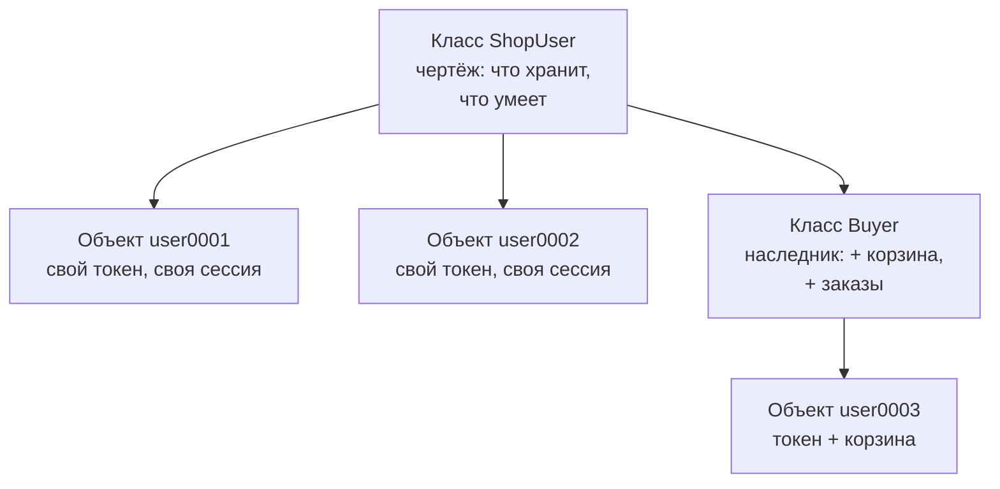
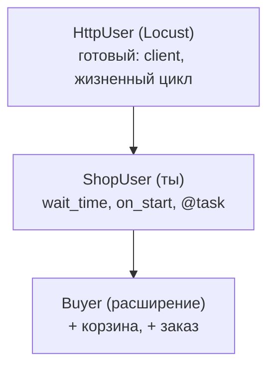

## Зачем это нужно

Нагрузочный тест имитирует **толпу**: сто, тысячу, десять тысяч покупателей одновременно. Каждый из них ведёт себя по-своему: у одного уже лежит товар в корзине, у другого просрочился токен, третий только что открыл сайт. У каждого свои данные (токен, корзина, счётчик ошибок) и общее поведение (открыть каталог, положить в корзину, оформить заказ). Описывать такого пользователя набором отдельных переменных и функций неудобно: на десять тысяч человек придётся вести десять тысяч токенов и десять тысяч корзин, и не перепутать, чей токен чей.

Для этого в Python есть **классы**: чертёж, по которому создают сколько угодно **объектов**, и у каждого объекта свои данные и общие для всех действия. Инструменты нагрузочного тестирования построены на этом. Файл сценария для Locust (тема 9) это описание класса «виртуальный пользователь» с методами-действиями. Ты не сможешь прочитать ни один `locustfile.py`, пока не поймёшь четыре вещи: что такое класс, что такое `self`, как работает наследование и что означает строка `@task` над методом. Именно им посвящён урок.

Шаг проекта: ты пишешь `~/perf-lab/04-python/shop_users.py`, в котором посетитель магазина и покупатель описаны классами, а «мини-раннер» сам выбирает действия по весам, как это делает Locust. Locust в этом уроке **не нужен**: ты понимаешь механизм изнутри, а в [уроке 9.1](../09-locust/01-first-locustfile.md) увидишь, что это то же самое.

## Что нужно знать

- Функции, аргументы со значением по умолчанию, `try`/`except`, `return`: [урок 4.3](03-functions-errors.md).
- Словари, списки, цикл `for`, f-строки: [урок 4.1](01-first-program.md) и [урок 4.2](02-conditions-loops.md).
- `requests`, `Session`, вход и токен, `raise_for_status()`: [урок 4.5](05-venv-requests.md). Код этого урока прямо продолжает `shop_flow.py` оттуда.
- Окружение `~/perf-lab/.venv` включено (`(.venv)` слева в приглашении), стенд «Магазин» запущен ([урок 2.1](../02-web/01-client-server-http.md)).

## Картина целиком

Представь выпуск открыток. Есть один **шаблон** (макет): место для имени, место для адреса. И есть сколько угодно открыток по этому шаблону: на каждой своё имя, свой адрес. Макет один, открытки разные. **Класс** это макет, **объект** это конкретная открытка. Аналогия ломается тем, что у класса есть ещё и «умения»: открытка по макету сама себя подписать не может, а объект Python может выполнять действия (методы).



Что здесь видно: из одного класса получаются независимые объекты. Класс-наследник `Buyer` берёт всё у родителя и добавляет своё, и объекты по нему тоже независимы. Locust устроен так же: класс описывает **одного** пользователя, а Locust по этому классу создаёт столько объектов, сколько ты попросишь.

Что в итоге пригодится для чтения locustfile:

- **Атрибуты** (данные объекта): `self.token`, `self.session`.
- **Методы** (действия объекта): `catalog()`, `checkout()`.
- **Наследование**: ваш класс «берёт» всё нужное у готового (`HttpUser`).
- **Декоратор** `@task(6)`: пометка над методом «это действие, выбирай его чаще».

## Теория

### Класс и объект

**Зачем это существует.** Без классов данные и действия живут врозь. Токен хранится в одной переменной, корзина в другой, функция `add_to_cart(token, product_id)` получает токен аргументом, и так в каждой функции. Для одного пользователя терпимо. Для сотни нужно вести сто пар переменных и всё время следить, что функции получили данные именно того пользователя. Класс связывает данные и действия в одну **сущность**.

**Аналогия.** Чертёж и деталь: чертёж один, деталей сколько угодно, и у каждой свой серийный номер. Аналогия ломается тем, что «деталь» в Python можно изменить после создания, и чертёж при этом не меняется.

**Как это устроено.** Класс объявляют ключевым словом `class`, имя пишут с заглавной буквы в стиле `ShopUser` (по правилам Python). Внутри класса объявляют функции, они называются **методами**. Объект создаёт вызов, похожий на вызов функции: `ShopUser(1)`. Результат кладут в переменную: `user = ShopUser(1)`. Метод вызывают через точку: `user.run(10)`.

Самое непривычное слово в классах это **`self`**. Каждый метод получает первым аргументом объект, у которого его вызвали. По традиции этот аргумент называют `self` («сам»). Когда ты пишешь `user.run(10)`, Python незаметно превращает это в `ShopUser.run(user, 10)`: объект `user` попадает в `self`, а 10 в `rounds`. Поэтому внутри метода `self.token` это токен **того самого** объекта, у которого вызван метод. Именно так один код обслуживает тысячу пользователей и ни разу не путает их данные.

Особый метод **`__init__`** (два подчёркивания в начале и в конце) запускается сам в момент создания объекта и **заводит его начальные данные**. Названия с двойным подчёркиванием читают как «дандер»: `__init__` это «дандер инит». Данные объекта называют **атрибутами**, и их создают присваиванием `self.имя = значение`.

**Разобранный пример.** Посмотри, как выполняется крошечный класс. Нажимай «Шаг ▶»: в правой колонке видно, как рождаются объекты и как метод меняет данные того, у кого его вызвали.

<div class="viz" data-viz="py-trace" data-title="Один класс, два объекта" data-speed="2200" data-code='["class Visitor:", "    def __init__(self, name):", "        self.name = name", "        self.pages = 0", "    def open_page(self):", "        self.pages += 1", "a = Visitor(\"Аня\")", "b = Visitor(\"Борис\")", "a.open_page()", "a.open_page()", "b.open_page()", "print(a.pages, b.pages)"]' data-steps='[{"l": 1, "v": {"Visitor": "<класс>"}, "n": "Python запомнил чертёж: класс Visitor. Объектов пока нет."}, {"l": 7, "v": {"Visitor": "<класс>", "a": "<Visitor name=Аня pages=0>"}, "f": "Visitor.__init__", "n": "Вызов Visitor(...) создал новый объект и запустил __init__: у объекта появились свои name и pages."}, {"l": 8, "v": {"Visitor": "<класс>", "a": "<Visitor Аня, 0>", "b": "<Visitor Борис, 0>"}, "f": "Visitor.__init__", "n": "Второй вызов создал второй, независимый объект по тому же чертежу."}, {"l": 9, "v": {"a": "<Visitor Аня, 1>", "b": "<Visitor Борис, 0>"}, "f": "Visitor.open_page", "n": "a.open_page(): в self попал объект a, поэтому изменился счётчик только у Ани."}, {"l": 10, "v": {"a": "<Visitor Аня, 2>", "b": "<Visitor Борис, 0>"}, "f": "Visitor.open_page", "n": "Ещё раз у Ани: теперь pages равно 2."}, {"l": 11, "v": {"a": "<Visitor Аня, 2>", "b": "<Visitor Борис, 1>"}, "f": "Visitor.open_page", "n": "Тот же метод, но self теперь объект b: счётчик Бориса вырос, Анин не тронут."}, {"l": 12, "v": {"a": "<Visitor Аня, 2>", "b": "<Visitor Борис, 1>"}, "o": "2 1", "n": "Один код метода, два состояния: так и живут тысячи виртуальных пользователей."}]'></div>

Что здесь видно: на шаге создания объекта запускается `__init__`, и у объекта появляются свои `name` и `pages`. Затем один и тот же метод `open_page` по очереди меняет то счётчик Ани, то счётчик Бориса, потому что в `self` попадает разный объект. Код метода один, состояний два.

А вот так выглядит тот же приём на языке нагрузки:

```python
class Counter:
    """Считает, сколько запросов сделал один виртуальный пользователь."""

    def __init__(self, name):
        self.name = name        # атрибут: у каждого объекта свой
        self.requests = 0

    def hit(self):
        self.requests += 1


first = Counter("user0001")
second = Counter("user0002")
first.hit()
first.hit()
second.hit()
print(first.name, first.requests, second.name, second.requests)
```

```text
user0001 2 user0002 1
```

Читаем: `Counter("user0001")` создаёт объект и вызывает `__init__` со `self` равным новому объекту, `name` равным `"user0001"`. Два вызова `first.hit()` увеличили счётчик только у `first`. Объекты не знают друг о друге.

**Что путают.**

- **Класс и объект.** `ShopUser` это чертёж, `ShopUser(1)` это объект. Нельзя написать `ShopUser.run(10)` и ждать, что оно сработает: не хватает объекта (`self`).
- **Забытый `self`.** В объявлении метода `self` обязателен первым параметром: `def hit(self):`. А при вызове его **не передают**: `first.hit()`. Если забыть его в объявлении, Python скажет `TypeError: hit() takes 0 positional arguments but 1 was given` («получил один аргумент, хотя ждал ноль»): тот самый невидимый `self`.
- **Присваивание без `self`.** Строка `requests = 0` внутри `__init__` создаёт обычную локальную переменную, она исчезнет при выходе из метода. Нужно `self.requests = 0`.

> **Проверь понимание:** что напечатает `print(first.requests + second.requests)` в примере выше, если после трёх вызовов `hit` выполнить ещё `second.hit()`?

<details markdown="1">
<summary>Ответ</summary>

Четыре. У `first` было 2, у `second` стало 1 + 1 = 2. Объекты считают независимо, в сумме 2 + 2 = 4.

</details>

### Объект пользователя «Магазина»

**Зачем это существует.** Пользователь «Магазина» из [урока 4.5](05-venv-requests.md) состоит из трёх вещей: адреса почты, сессии `requests.Session` (в ней токен) и накопленной статистики. Если собрать их в один объект, любой метод получает всё нужное через `self`, а функции больше не принимают на вход `session` и `number`.

**Как это устроено.** Метод `__repr__` (от «representation», представление) тоже особый: он говорит Python, как напечатать объект. Без него `print(user)` выдаст бесполезное `<__main__.ShopUser object at 0x7f3a...>`. Все атрибуты задаются в `__init__`: так по одному взгляду на начало класса видно, что объект хранит.

```python
class ShopUser:
    """Посетитель: входит в магазин и листает каталог."""

    def __init__(self, number):
        self.email = f"user{number:04d}@shop.lab"
        self.session = requests.Session()
        self.timings = []          # пары (имя задачи, секунды)
        self.errors = 0

    def __repr__(self):
        return f"{type(self).__name__}({self.email}, задач={len(self.timings)}, ошибок={self.errors})"

    def on_start(self):
        body = {"email": self.email, "password": "password"}
        response = self.session.post(f"{BASE}/api/login", json=body, timeout=30)
        response.raise_for_status()
        self.session.headers["Authorization"] = "Bearer " + response.json()["token"]
```

Разбор: `type(self).__name__` это имя класса объекта строкой (`ShopUser` или, у наследника, `Buyer`). Метод `on_start` («при старте») делает то же, что `login` в уроке 4.5, но вместо передачи `session` и `number` берёт всё из `self`. Название `on_start` выбрано не случайно: Locust вызывает метод с таким именем у каждого пользователя в момент его появления. Ты увидишь это в [уроке 9.1](../09-locust/01-first-locustfile.md).

**Что путают.** Атрибуты, созданные в `__init__`, принадлежат **объекту**. Список `self.timings = []` у каждого пользователя свой. Если вместо этого написать `timings = []` прямо в теле класса (вне методов), список станет общим для всех, и пользователи начнут «читать» чужую историю. Это один из самых частых источников странных чисел в отчётах (подробнее ниже).

> **Проверь понимание:** зачем `__init__` создаёт `requests.Session()` для каждого пользователя отдельно, а не один раз на всех?

<details markdown="1">
<summary>Ответ</summary>

Сессия хранит токен конкретного пользователя в `session.headers`. Общая сессия на всех означала бы, что последний вошедший перезаписал бы токен остальным, и все «покупали» бы от его имени. Ещё `Session` небезопасно делить между потоками ([урок 4.5](05-venv-requests.md)).

</details>

### Атрибуты объекта и атрибуты класса

**Зачем это существует.** Часть настроек общая для всех пользователей: «ждать между действиями от 1 до 3 секунд», «адрес стенда». Хранить их в каждом объекте расточительно, и менять придётся в тысяче мест. Для таких настроек Python даёт **атрибуты класса**: переменные, объявленные прямо в теле класса, без `self`.

**Как это устроено.** Если Python не находит атрибут у объекта, он ищет его в классе. Поэтому `user.base_url` сработает, даже если `base_url` объявлен только в классе. Это удобно для настроек. Но если присвоить `user.base_url = "..."`, у **этого объекта** появится собственный атрибут, а класс и остальные объекты не изменятся.

```python
class ShopUser:
    base_url = "http://localhost:8000"     # атрибут класса: один на всех
    wait_seconds = (1, 3)                  # в Locust это wait_time = between(1, 3)

    def __init__(self, number):
        self.email = f"user{number:04d}@shop.lab"     # атрибут объекта: у каждого свой
```

Locust использует ровно этот приём: в классе пользователя задают `wait_time` и `host` (общие настройки), а токен и корзина хранятся в самом объекте. Правило для выбора: **если значение у всех одинаковое и не меняется, это атрибут класса; если у каждого своё или меняется, это атрибут объекта**.

**Что путают.** Изменяемые значения (список, словарь) в атрибуте класса. `class User: history = []`: `history` один на весь класс, и `user_a.history.append(1)` виден в `user_b.history`. Если нужен «свой список у каждого», создавай его в `__init__`.

> **Проверь понимание:** в классе объявлено `total_requests = 0`, а в методе `hit` написано `self.total_requests += 1`. Один пользователь сделал 3 запроса, другой 5. Какие значения будут у каждого, и что изменится в `ShopUser.total_requests`?

<details markdown="1">
<summary>Ответ</summary>

Запись `self.total_requests += 1` читает значение из класса (0), прибавляет единицу и **записывает в сам объект** новый атрибут. Поэтому у одного пользователя будет 3, у другого 5, а `ShopUser.total_requests` так и останется 0. Чтобы вести общий счёт, нужно писать `ShopUser.total_requests += 1`.

</details>

### Наследование: «такой же, но ещё и…»

**Зачем это существует.** Покупателю нужно всё, что умеет посетитель (войти, листать каталог), плюс корзина и заказы. Копировать код посетителя в новый класс значит иметь два места для исправления каждой ошибки. **Наследование** решает это: новый класс (**наследник**, дочерний) объявляет «я такой же, как `ShopUser`» и получает все атрибуты и методы родителя автоматически.

**Аналогия.** Рецепт «пирог с яблоками» наследует рецепт «пирог»: тесто и духовка те же, добавляется начинка. Аналогия ломается тем, что наследник может не только добавлять, но и **переопределять**: заменять метод родителя своим.

**Как это устроено.** Родителя указывают в скобках: `class Buyer(ShopUser):`. Python при вызове метода ищет его сначала в классе наследника, потом в родителе. Если метод есть у обоих, побеждает наследник (это называется **переопределением**). Чтобы в переопределённом методе всё же вызвать родительский, пишут `super()`: «обратись к родителю». Самое частое применение: `super().__init__(number)` в `__init__` наследника, чтобы родитель завёл свои атрибуты, а наследник добавил свои.

```python
class Buyer(ShopUser):
    """Покупатель: умеет всё, что ShopUser, и ещё кладёт в корзину и оформляет заказ."""

    def __init__(self, number):
        super().__init__(number)     # родитель заводит email, session, timings, errors
        self.orders = 0              # свой атрибут наследника

    def put_in_cart(self):
        item = {"product_id": random.randint(1, 10000), "qty": 1}
        self.session.post(f"{BASE}/api/cart/items", json=item, timeout=30).raise_for_status()
```

Разбор: после `Buyer(3)` у объекта есть и `email`, и `session` (от родителя), и `orders` (своё). Метод `on_start` (вход) наследнику писать не нужно: он берётся у `ShopUser` как есть. У `put_in_cart` декоратора нет: это обычный **вспомогательный** метод, который вызывают другие методы (задачами он не является, см. ниже).



Что здесь видно: в Locust ты сам не пишешь ни клиент, ни запуск пользователей: они уже есть в родителе `HttpUser`, ты наследуешь его и добавляешь описание поведения. Наш `ShopUser` из этого урока это то же самое, только родителя мы написали сами.

**Что путают.**

- **Забыл `super().__init__`.** Тогда у наследника нет `email` и `session`, и при первом обращении будет `AttributeError: 'Buyer' object has no attribute 'session'`.
- **Наследование ради повторного использования кода.** Оно уместно, когда наследник «является» родителем (покупатель является посетителем). Если «есть» (у пользователя есть сессия), это не наследование, а обычный атрибут: `self.session`.
- **Наследование как наказание: глубокие цепочки из пяти классов.** В нагрузочных скриптах хватает одного уровня.

> **Проверь понимание:** у `ShopUser` есть метод `catalog`, а у `Buyer` нет. Что будет при вызове `Buyer(3).catalog()`?

<details markdown="1">
<summary>Ответ</summary>

Сработает: Python не найдёт `catalog` у `Buyer`, поднимется к родителю `ShopUser` и вызовет метод оттуда. В `self` будет объект `Buyer`, поэтому метод использует его сессию и его токен.

</details>

### Декоратор: пометка над функцией

**Зачем это существует.** В Locust над методами стоит `@task` или `@task(6)`. Нужно понять, что это такое, иначе запись выглядит магией. Задача у декоратора простая: **дать функции дополнительные свойства или обернуть её**, не меняя её код.

**Аналогия.** Наклейка «хрупкое» на коробке: содержимое то же, но с наклейкой с коробкой обращаются иначе. Другой пример: чехол для телефона, который меняет, как телефон держат, но не меняет, как он звонит. Аналогия ломается тем, что «наклейка» в Python может не только пометить, но и подменить саму функцию.

**Как это устроено.** Функции в Python это обычные значения: их можно передавать другим функциям и возвращать из функций (ты видел `for name, run in ...` в [уроке 4.5](05-venv-requests.md)). **Декоратор** это функция, которая принимает функцию и возвращает функцию. Запись

```python
@timed
def catalog(self):
    ...
```

это короткая запись для `catalog = timed(catalog)`: после определения имя `catalog` указывает на то, что вернул `timed`. Два вида декораторов нужны нам.

**Первый вид: оборачивает.** `@timed` измеряет время работы метода:

```python
import functools
import time


def timed(method):
    """Декоратор: измеряет, сколько работал метод, и записывает в self.timings."""
    @functools.wraps(method)
    def wrapper(self, *args, **kwargs):
        start = time.perf_counter()
        try:
            return method(self, *args, **kwargs)
        finally:
            self.timings.append((method.__name__, time.perf_counter() - start))
    return wrapper
```

Разбор. `wrapper` («обёртка») это новая функция, которая делает три вещи: включает секундомер ([урок 4.5](05-venv-requests.md)), вызывает настоящий метод и записывает время в список. `*args, **kwargs` означают «принять любые аргументы и передать их дальше без изменений»: так обёртка подходит к методу с любой сигнатурой. `finally` выполняется всегда, и при успехе, и при исключении: поэтому время ошибки тоже записывается (то самое правило «таймауты в статистику» из урока 4.5). `functools.wraps` сохраняет у обёртки имя и документацию настоящего метода, иначе все методы получили бы имя `wrapper`, и по `method.__name__` их нельзя было бы различить.

**Второй вид: помечает, с аргументом.** `@task(6)` принимает **вес**, а `@task` без скобок в Locust означает вес 1. Здесь устройство чуть сложнее, потому что скобки с аргументом вызывают функцию сначала:

```python
def task(weight=1):
    """Декоратор с аргументом: помечает метод как задачу и запоминает её вес."""
    def mark(method):
        method.weight = weight       # вешаем «наклейку» на сам метод
        return method                # метод не меняется, только получает атрибут
    return mark
```

Читаем по шагам. `@task(6)` сначала вызывает `task(6)`, и это возвращает функцию `mark`. Потом `mark` применяется к методу, как обычный декоратор: метод получает атрибут `weight = 6` и возвращается. Функции в Python тоже объекты, на них можно вешать атрибуты. Так «наклейка» становится видна тому, кто будет искать задачи.

**Разобранный пример.** Как раннер находит помеченные методы. Он просматривает всё, что есть у объекта, и берёт то, у чего есть атрибут `weight`:

```python
def tasks(self):
    """Все методы, помеченные @task."""
    found = []
    for name in dir(self):                    # dir(объект) даёт имена всех атрибутов, в том числе унаследованных
        method = getattr(self, name)          # getattr по строке-имени достаёт атрибут
        if callable(method) and hasattr(method, "weight"):
            found.append(method)
    return found
```

Разбор: `dir(self)` возвращает список имён: и свои методы, и унаследованные. `getattr(self, name)` достаёт то, на что указывает имя (это та же запись `self.имя`, но имя берётся из переменной). `callable(...)` проверяет, что это вызываемая вещь (функция или метод), а `hasattr(..., "weight")` проверяет, что на ней висит наклейка. У `Buyer` `dir` выдаст и `catalog` с `product` (от родителя), и `add_to_cart` с `checkout` (свои), все четыре найдутся без единой строки настроек. Так и Locust собирает задачи: перебирает атрибуты и берёт помеченные.

**Что путают.**

- `@task` и `@task()`. В нашем варианте обязательно со скобками (`@task()` или `@task(1)`): функция ожидает вызова. В самом Locust работают оба варианта.
- Порядок декораторов: применяются снизу вверх. У нас `@task(6)` стоит над `@timed`: сначала метод заворачивается в таймер, потом готовая обёртка получает метку веса. `functools.wraps` заодно копирует и метки, поэтому обратный порядок тоже сработал бы, но привычка «`@task` самым верхним» защищает от сюрпризов с другими декораторами.
- Декоратор не запускает функцию. Он срабатывает один раз, **при определении класса**, а не при каждом вызове метода (при вызове работает только `wrapper`).

> **Проверь понимание:** метод помечен `@task(6)`, а другой `@task(3)`. Что значит «6» и «3» для того, как часто они будут выполняться?

<details markdown="1">
<summary>Ответ</summary>

Это **относительные веса**, а не количества. Из девяти выбранных задач в среднем шесть будут первой и три второй, то есть первая выбирается вдвое чаще. Если добавить задачи с весами 2 и 1, суммарный вес станет 12, и доля первой упадёт до 6/12 = 50%.

</details>

### Выбор задач по весам: мини-раннер

**Зачем это существует.** Реальный покупатель не делает всё подряд по кругу: каталог он листает много, а оплачивает редко. Профиль нагрузки должен отражать эту разницу, поэтому у действий есть веса. Эту идею и реализует `random.choices(варианты, weights)`: **выбор случайного элемента с учётом весов**.

**Как это устроено.** `random.choices(tasks, weights)` возвращает **список** из одного элемента (по умолчанию `k=1`), поэтому берут `[0]`. Выбор случайный: за 20 попыток доли будут отличаться от весов, за 20 000 почти совпадут (это закон больших чисел, он же причина, по которой короткие тесты шумят).

Теперь можно собрать главный метод `run`:

```python
def run(self, rounds):
    self.on_start()
    tasks = self.tasks()
    weights = [t.weight for t in tasks]
    for _ in range(rounds):
        chosen = random.choices(tasks, weights)[0]
        try:
            chosen()
        except requests.RequestException:
            self.errors += 1
    self.session.close()
```

Разбор: сначала вход (`on_start`), потом `rounds` раз выбираем задачу по весам и выполняем. Ошибки сети и ответы 4xx/5xx (после `raise_for_status()`) ловим как `requests.RequestException` ([урок 4.5](05-venv-requests.md)) и считаем, а не роняем весь прогон. Имя `_` в `for _ in range(...)` по соглашению значит «значение мне не нужно». В Locust этот цикл (выбери задачу, выполни, подожди `wait_time`) написан внутри библиотеки.

Поиграй с весами и пользователями: переставь вес и посмотри, как разойдётся фактическая доля. Если ждать лень, нажми «Пуск».

<div class="viz" data-viz="py-task-weights" data-users="3" data-weights='{"catalog":6,"product":3,"cart":2,"order":1}'></div>

Что здесь видно: у каждого пользователя-объекта своя корзина и свои счётчики, а выбор действий подчиняется общим весам. Сначала столбцы прыгают, потом доли устанавливаются рядом со штрихами весов. Обрати внимание на строки «заказ при пустой корзине»: у одного пользователя корзина пуста, и «Магазин» вернёт ему 400, а у соседа заказ проходит. Это не ошибка нагрузки, а следствие того, что **у каждого пользователя своё состояние**.

**Что путают.** Вес и вероятность. Вес не обязан давать в сумме 100: Python сам нормирует. Задача с весом 0 не будет выбрана никогда.

> **Проверь понимание:** у пользователя 4 задачи с весами 6, 3, 2, 1. Какова доля заказов (вес 1) в долгой перспективе?

<details markdown="1">
<summary>Ответ</summary>

1 / (6 + 3 + 2 + 1) = 1/12, примерно 8,3%. А 20 попыток дадут в среднем чуть меньше двух заказов, но легко и ноль, и четыре: выборка мала.

</details>

## Практика

### 1. Объекты и `self`

Создай файл `~/perf-lab/04-python/classes_intro.py`:

```python
"""Классы без сети: чертёж и два объекта."""


class Counter:
    """Считает, сколько запросов сделал один виртуальный пользователь."""

    def __init__(self, name):
        self.name = name
        self.requests = 0

    def hit(self):
        self.requests += 1

    def __repr__(self):
        return f"Counter({self.name}, запросов={self.requests})"


first = Counter("user0001")
second = Counter("user0002")
first.hit()
first.hit()
second.hit()
print(first)
print(second)
print(first is second)
```

```bash
cd ~/perf-lab/04-python
python classes_intro.py
```

```text
Counter(user0001, запросов=2)
Counter(user0002, запросов=1)
False
```

**Как читать вывод:** первые две строки это результат `__repr__`, их формат задан тобой. Третья строка проверяет, что `first` и `second` это **разные** объекты (`is` сравнивает не значения, а тождество). Убери метод `__repr__` и запусти заново: увидишь `<__main__.Counter object at 0x...>`: так выглядит объект без описания.

**Типичные ошибки:**

- `TypeError: Counter.hit() takes 0 positional arguments but 1 was given`: в `def hit():` забыл `self`.
- `AttributeError: 'Counter' object has no attribute 'requests'`: в `__init__` написал `requests = 0` без `self.`.

### 2. Пользователь «Магазина» с задачами и весами

Создай `~/perf-lab/04-python/shop_users.py` целиком (стенд запущен, окружение включено):

```python
"""Пользователь «Магазина» как класс. Так устроен и Locust (урок 9.1)."""
import functools
import random
import time

import requests

BASE = "http://localhost:8000"


def task(weight=1):
    """Декоратор с аргументом: помечает метод как задачу и запоминает её вес."""
    def mark(method):
        method.weight = weight
        return method
    return mark


def timed(method):
    """Декоратор: измеряет, сколько работал метод, и записывает в self.timings."""
    @functools.wraps(method)
    def wrapper(self, *args, **kwargs):
        start = time.perf_counter()
        try:
            return method(self, *args, **kwargs)
        finally:
            self.timings.append((method.__name__, time.perf_counter() - start))
    return wrapper


class ShopUser:
    """Посетитель: входит в магазин и листает каталог."""

    def __init__(self, number):
        self.email = f"user{number:04d}@shop.lab"
        self.session = requests.Session()
        self.timings = []          # пары (имя задачи, секунды)
        self.errors = 0

    def __repr__(self):
        return f"{type(self).__name__}({self.email}, задач={len(self.timings)}, ошибок={self.errors})"

    def on_start(self):
        body = {"email": self.email, "password": "password"}
        response = self.session.post(f"{BASE}/api/login", json=body, timeout=30)
        response.raise_for_status()
        self.session.headers["Authorization"] = "Bearer " + response.json()["token"]

    def tasks(self):
        """Все методы, помеченные @task."""
        found = []
        for name in dir(self):
            method = getattr(self, name)
            if callable(method) and hasattr(method, "weight"):
                found.append(method)
        return found

    def run(self, rounds):
        self.on_start()
        tasks = self.tasks()
        weights = [t.weight for t in tasks]
        for _ in range(rounds):
            chosen = random.choices(tasks, weights)[0]
            try:
                chosen()
            except requests.RequestException:
                self.errors += 1
        self.session.close()

    @task(6)
    @timed
    def catalog(self):
        page = random.randint(1, 10)
        self.session.get(f"{BASE}/api/products", params={"page": page}, timeout=30).raise_for_status()

    @task(3)
    @timed
    def product(self):
        product_id = random.randint(1, 10000)
        self.session.get(f"{BASE}/api/products/{product_id}", timeout=30).raise_for_status()


class Buyer(ShopUser):
    """Покупатель: умеет всё, что ShopUser, и ещё кладёт в корзину и оформляет заказ."""

    def __init__(self, number):
        super().__init__(number)
        self.orders = 0

    def put_in_cart(self):
        item = {"product_id": random.randint(1, 10000), "qty": 1}
        self.session.post(f"{BASE}/api/cart/items", json=item, timeout=30).raise_for_status()

    @task(2)
    @timed
    def add_to_cart(self):
        self.put_in_cart()

    @task(1)
    @timed
    def checkout(self):
        self.put_in_cart()          # заказ из пустой корзины магазин отклонит кодом 400
        self.session.post(f"{BASE}/api/orders", timeout=60).raise_for_status()
        self.orders += 1


if __name__ == "__main__":
    people = [ShopUser(1), ShopUser(2), Buyer(3)]
    for person in people:
        person.run(20)
        print(person)
    buyer = people[2]
    print("заказов у покупателя:", buyer.orders)
    for name in ("catalog", "product", "add_to_cart", "checkout"):
        seconds = [s for n, s in buyer.timings if n == name]
        if seconds:
            print(f"  {name:12} {len(seconds):2} раз, среднее {sum(seconds) / len(seconds) * 1000:.0f} мс")
```

Новое в `__main__`: `[s for n, s in buyer.timings if n == name]` это **списковое включение** (list comprehension): короткая запись цикла, собирающая список из тех пар, где имя совпало; `s` берётся из пары `(n, s)`. Обычным циклом то же самое выглядело бы как пять строк.

```bash
python shop_users.py
```

```text
ShopUser(user0001@shop.lab, задач=20, ошибок=0)
ShopUser(user0002@shop.lab, задач=20, ошибок=0)
Buyer(user0003@shop.lab, задач=20, ошибок=0)
заказов у покупателя: 2
  catalog       9 раз, среднее 6 мс
  product       8 раз, среднее 4 мс
  add_to_cart   1 раз, среднее 5 мс
  checkout      2 раз, среднее 72 мс
```

**Как читать вывод:** числа у тебя будут другие, выбор случайный: запусти повторно и увидишь иные доли. Первые две строки это посетители: они умеют только `catalog` и `product`, поэтому у них 20 задач из этих двух. У `Buyer` задач четыре. В строке `checkout` время заметно больше, чем у остальных: заказ внутри «Магазина» ждёт заглушку оплаты (около 50 мс, [урок 8.1](../08-perf-theory/01-latency-throughput.md)). Вход (`on_start`) в статистику не попал: он не помечен `@timed`.

**Типичные ошибки:**

- `requests.exceptions.HTTPError: 401 ... /api/login`: нет пользователя с таким номером (допустимы 1-1000) или пароль не `password`.
- `AttributeError: 'ShopUser' object has no attribute 'orders'`: ты вызвал `checkout` у посетителя. Этот метод есть только у `Buyer`.
- `requests.exceptions.ConnectionError`: стенд не запущен.

### 3. Эксперименты

Попробуй три изменения по одному и подумай, что изменится в выводе, до запуска:

1. Поставь `@task(0)` на `product`: задача исчезнет из выбора (в статистике нет строки `product`).
2. Добавь в `ShopUser` задачу `@task(2) @timed def health(self): self.session.get(f"{BASE}/healthz", timeout=5).raise_for_status()` и посмотри, что она появилась и у `Buyer` без единой правки: это наследование.
3. Измени `person.run(20)` на `person.run(200)`: доли на длинной дистанции приблизятся к весам 6:3 (и 6:3:2:1 у покупателя). Это тот же шум коротких тестов из [урока 8.1](../08-perf-theory/01-latency-throughput.md).

### 4. Locust глазами «пользователя класса»

Сравни свой `ShopUser` с файлом `~/load-tester/project/shop/examples/locust/locustfile.py`: запускать его не нужно, мы поставим Locust в [теме 9](../09-locust/01-first-locustfile.md). Найди глазами:

```bash
sed -n 1,40p ~/load-tester/project/shop/examples/locust/locustfile.py
```

Отметь для себя: `class ShopUser(HttpUser)` это наследование, `wait_time = between(1, 3)` это атрибут класса, `on_start` вызывается на старте пользователя, `@task(6)` и `@task(3)` над методами `catalog` и `product` это знакомые веса. `self.client.get(...)` это замена твоему `self.session.get(...)`: у `HttpUser` уже есть готовая сессия.

### 5. Закоммить результат

```bash
cd ~/perf-lab
git add 04-python/classes_intro.py 04-python/shop_users.py
git commit -m "4.6: классы, наследование, декораторы, мини-раннер по весам"
git push
```

**Как читать вывод:** `git status` после коммита должен быть чистым. Если `git push` отклонён, вернись к [уроку 3.2](../03-git/02-github.md).

## Сломай и почини

**Поломка 1: общий список на всех.** В `classes_intro.py` замени класс на такой:

```python
class Counter:
    history = []                      # атрибут КЛАССА

    def __init__(self, name):
        self.name = name

    def hit(self, path):
        self.history.append(path)


first = Counter("user0001")
second = Counter("user0002")
first.hit("/api/products")
second.hit("/api/cart")
print(first.history)
print(second.history)
```

```text
['/api/products', '/api/cart']
['/api/products', '/api/cart']
```

**Задача.** Каждый пользователь сходил по одному адресу, а в истории каждого два. Почему и как исправить?

<details markdown="1">
<summary>Разбор</summary>

Список `history` создан один раз в теле класса и принадлежит **классу**. Обращение `self.history` не находит атрибута у объекта и берёт общий список из класса, так что `append` добавляет в одну и ту же коллекцию. Исправление: создавать список в `__init__`: `self.history = []`. Теперь у каждого объекта свой список, и вывод будет `['/api/products']` и `['/api/cart']`. Проверка простая: если у «независимых» пользователей одинаковые данные, ищи изменяемый атрибут класса.

</details>

**Поломка 2: забыли `super().__init__`.** В `Buyer` удали строку `super().__init__(number)`, оставив `self.orders = 0`, и запусти:

```text
AttributeError: 'Buyer' object has no attribute 'email'
```

**Задача.** Найди причину, не гадая: по какой строке трассировки видно, что именно упало и где?

<details markdown="1">
<summary>Разбор</summary>

Последняя строка называет атрибут (`email`) и тип объекта (`Buyer`). Выше в трассировке видна строка, где к нему обратились: в `__repr__` или в `on_start`. Причина: наследник переопределил `__init__`, и родительский `__init__`, который создаёт `email`, `session` и `timings`, больше не вызывается. Исправление: первой строкой в `Buyer.__init__` вернуть `super().__init__(number)`. Правило: переопределил `__init__` в наследнике, всегда начинай с `super().__init__(...)`.

</details>

**Поломка 3: задача, которая не выбирается.** Убери скобки у декоратора над `checkout`: вместо `@task(1)` напиши `@task`, оставив `@timed` под ним. Запусти программу: ошибок нет, но `checkout` в статистике вообще не появился, и заказов у покупателя ноль.

**Задача.** Объясни, почему Python промолчал и куда делась задача.

<details markdown="1">
<summary>Разбор</summary>

Наш `task` ждёт вес и возвращает декоратор. Запись `@task` без скобок значит `checkout = task(checkout)`: метод попал в параметр `weight`, а на выходе получилась функция `mark`, не имеющая атрибута `weight`. Теперь имя `checkout` указывает на `mark`, и раннер, который ищет `hasattr(method, "weight")`, молча пропускает её. Исключения нет, потому что с точки зрения Python всё корректно. Поэтому в тесте нагрузки полезно сразу печатать список найденных задач с весами: пропавшая задача видна в первой же строке. Исправление: `@task(1)`. (В самом Locust `@task` без скобок разрешён, потому что там декоратор написан так, чтобы понимать оба варианта.)

</details>

## Словарик урока

| Термин | Простыми словами |
|---|---|
| Класс (class) | Чертёж: описывает, какие данные хранит объект и что он умеет |
| Объект (экземпляр) | Конкретная «деталь» по чертежу: у каждого свои данные |
| Атрибут | Значение внутри объекта: `self.token`, `self.errors` |
| Метод | Функция внутри класса, действие объекта |
| `self` | Сам объект, у которого вызвали метод; первый параметр любого метода |
| `__init__` | Метод, который запускается при создании объекта и заводит начальные данные |
| `__repr__` | Метод, который определяет, как объект печатается |
| Атрибут класса | Значение, объявленное в теле класса; общее для всех объектов |
| Наследование | Новый класс получает атрибуты и методы родителя |
| `super()` | Обращение к родительскому классу из наследника |
| Переопределение | Метод наследника заменяет одноимённый метод родителя |
| Декоратор | Функция, которая принимает функцию и возвращает функцию; записывается `@имя` |
| `@task(6)` | Пометка «это действие пользователя, выбирай его с весом 6» |
| Вес (weight) | Относительная частота выбора действия |
| `functools.wraps` | Сохраняет имя и описание исходной функции у обёртки |
| `*args, **kwargs` | «Принять любые аргументы и передать дальше» |

## Вопросы с собеседований

Раздел для повторения: ответь вслух, потом открой ответ. Вопросы с пометкой `[на скорость]` тренируй на время: ответ за 30 секунд.

### 1. [junior] [часто] Чем класс отличается от объекта?

<details markdown="1">
<summary>Ответ</summary>

Класс это чертёж: описание того, какие данные хранит объект и какие у него есть методы. Объект (экземпляр) это конкретное создание по этому чертежу: `user = ShopUser(1)`. Из одного класса можно создать сколько угодно объектов, у каждого свои значения атрибутов, а методы общие.

**Что хотят услышать:** чертёж против экземпляра, независимое состояние объектов.

**Красный флаг:** путает класс с функцией.

</details>

### 2. [junior] [часто] Что такое `self` и зачем он нужен?

<details markdown="1">
<summary>Ответ</summary>

`self` это сам объект, у которого вызван метод. Python передаёт его первым аргументом автоматически: `user.run(10)` превращается в `ShopUser.run(user, 10)`. Через `self` метод читает и меняет данные именно этого объекта: `self.token`, `self.errors`.

**Что хотят услышать:** `self` как ссылка на текущий объект, что при вызове его не передают вручную.

**Красный флаг:** считает `self` ключевым словом языка.

</details>

### 3. [junior] [часто] Что делает `__init__`?

<details markdown="1">
<summary>Ответ</summary>

Запускается при создании объекта и задаёт его начальные атрибуты: `self.email = ...`, `self.session = requests.Session()`. Это не конструктор в узком смысле (объект создаётся до него), а инициализатор. Все атрибуты объекта лучше заводить здесь, чтобы по началу класса было видно, что он хранит.

**Что хотят услышать:** вызывается автоматически, заводит данные объекта.

**Красный флаг:** вызывает `__init__` вручную.

</details>

### 4. [middle] Чем атрибут класса отличается от атрибута объекта? В чём опасность изменяемого атрибута класса?

<details markdown="1">
<summary>Ответ</summary>

Атрибут объекта создаётся через `self.имя = ...` и принадлежит конкретному объекту. Атрибут класса объявлен в теле класса и общий: объекты видят его, если у себя такого не нашли. Изменяемые значения (список, словарь) в атрибуте класса общие на всех, и `append` от одного пользователя виден остальным. Для нагрузочных скриптов это значит, что «независимые» виртуальные пользователи делят данные, и числа в отчёте искажаются.

**Что хотят услышать:** общий список как типичная ловушка и исправление через `__init__`.

**Красный флаг:** не видит разницы.

</details>

### 5. [junior] Что такое наследование и зачем оно нужно?

<details markdown="1">
<summary>Ответ</summary>

Класс-наследник получает атрибуты и методы родителя и может добавлять свои или заменять существующие. Так избегают копирования кода: `Buyer(ShopUser)` умеет всё, что посетитель, плюс корзину и заказы. В Locust свой класс наследуют от `HttpUser`, чтобы получить готовый HTTP-клиент и жизненный цикл пользователя.

**Что хотят услышать:** повторное использование и расширение, пример с `HttpUser`.

**Красный флаг:** наследует «для порядка», когда достаточно атрибута.

</details>

### 6. [middle] Зачем нужен `super().__init__()`?

<details markdown="1">
<summary>Ответ</summary>

Если наследник определяет свой `__init__`, родительский автоматически уже не вызывается. Вызов `super().__init__(...)` запускает родительскую инициализацию: она заводит атрибуты родителя. Без него при первом обращении будет `AttributeError`: «no attribute ...».

**Что хотят услышать:** переопределение отключает родительский метод, и `super()` его возвращает.

**Красный флаг:** копирует тело родительского `__init__` в наследника.

</details>

### 7. [middle] Что такое декоратор и как работает `@task(6)`?

<details markdown="1">
<summary>Ответ</summary>

Декоратор это функция, которая принимает функцию и возвращает функцию (чаще всего обёртку или ту же функцию с пометкой). `@name` над определением значит `f = name(f)`. `@task(6)` сначала вызывает `task(6)`, получает декоратор и применяет его к методу: в данном случае метод помечается весом 6, и Locust по этой метке находит задачи и выбирает их с учётом весов.

**Что хотят услышать:** функция принимает и возвращает функцию, разница между `@d` и `@d(arg)`.

**Красный флаг:** считает, что декоратор запускается при каждом вызове метода.

</details>

### 8. [middle] Зачем в обёртке `functools.wraps`?

<details markdown="1">
<summary>Ответ</summary>

Обёртка подменяет исходную функцию, и без `wraps` у неё будет имя `wrapper` и пустая документация: ломаются отладка и всё, что ищет метод по имени (например, статистика по задачам). `wraps` копирует имя, строку документации и прочие метаданные исходной функции.

**Что хотят услышать:** сохраняет `__name__` и `__doc__`.

**Красный флаг:** никогда не слышал.

</details>

### 9. [middle] В нагрузочном тесте у пользователя три задачи с весами 6, 3 и 1. Как часто выполняется каждая и почему первые минуты теста могут выглядеть иначе?

<details markdown="1">
<summary>Ответ</summary>

В долгой перспективе 60%, 30% и 10% (вес делится на сумму весов). Выбор случайный, поэтому на малом числе действий доли шумят: на 20 выборках первая задача может быть и 45%, и 75%. Ещё в начале каждый пользователь делает вход, и это тяжёлая операция, которая не входит в профиль задач.

**Что хотят услышать:** относительные веса, шум коротких выборок, учёт «разгона».

**Красный флаг:** считает веса процентами, которые должны сойтись ровно.

</details>

### 10. [на скорость] Как создать объект класса `ShopUser`, и что стоит слева от точки при вызове метода?

<details markdown="1">
<summary>Ответ</summary>

`user = ShopUser(1)`: вызов с именем класса и аргументами для `__init__`. Метод вызывают как `user.run(10)`: слева объект, он попадёт в `self`.

**Что хотят услышать:** вызов класса как функции, объект слева от точки.

**Красный флаг:** пишет `new ShopUser(...)` по привычке из других языков.

</details>

### 11. [на скорость] Что значит запись `class Buyer(ShopUser):`?

<details markdown="1">
<summary>Ответ</summary>

`Buyer` наследует `ShopUser`: получает все его атрибуты и методы и может добавлять или переопределять свои.

**Что хотят услышать:** родитель в скобках.

**Красный флаг:** считает, что в скобках аргументы.

</details>

### 12. [на скорость] Что напечатает `print(user)` для объекта без `__repr__`?

<details markdown="1">
<summary>Ответ</summary>

Что-то вроде `<__main__.ShopUser object at 0x7f3a...>`: имя класса и адрес в памяти. Чтобы вывод был полезным, определяют `__repr__`.

**Что хотят услышать:** упоминание `__repr__`.

**Красный флаг:** ждёт, что Python сам покажет атрибуты.

</details>

## Проверено на версиях

Python 3.12 (Ubuntu 24.04 и 26.04), `requests` 2.34.2, стенд «Магазин» из `project/shop`. Октябрь 2026. Locust в этом уроке не запускается: версия 2.46 ставится в теме 9.

## Итог урока: ты умеешь

- [ ] Написать класс с `__init__`, атрибутами и методами и создать из него несколько независимых объектов.
- [ ] Объяснить, что такое `self` и почему при вызове его не передают.
- [ ] Отличать атрибут объекта от атрибута класса и не хранить изменяемое значение в атрибуте класса.
- [ ] Сделать наследника, вызвать `super().__init__` и переопределить метод.
- [ ] Прочитать декоратор `@task(6)` и написать свой декоратор, в том числе с аргументом и с `functools.wraps`.
- [ ] Собрать мини-раннер, выбирающий задачи по весам, и объяснить шум коротких выборок.
- [ ] Найти в `locustfile.py` классы, наследование, атрибуты и декораторы, которые ты уже знаешь.

Дальше: [урок 4.7. pytest: первые тесты](07-pytest.md), где проверки превращаются в тесты, которые запускаются одной командой.
