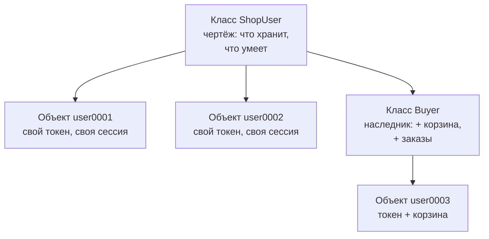
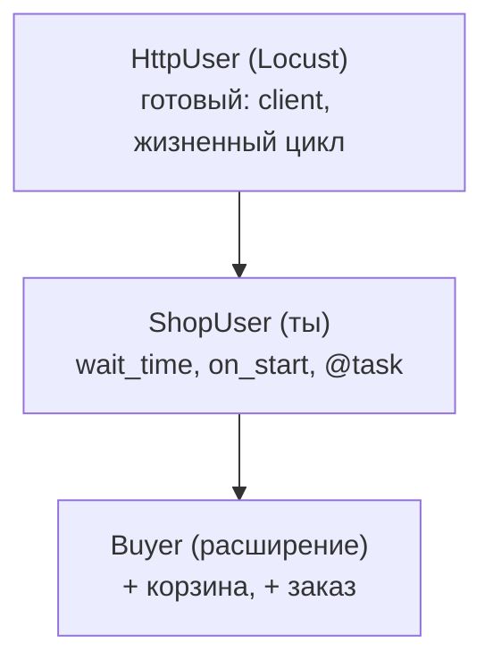

## Зачем это нужно

Я занимаюсь нагрузкой много лет и сейчас сижу рядом с тобой, как опытный коллега. Начну с истории про мой первый скрипт.

Он изображал сто покупателей. Токен после входа (пропуск, который выдаёт магазин) лежал у меня в одной переменной, корзина в другой. Я запустил тест и увидел странное: у всех «покупателей» одна и та же корзина, а магазин считает, что к нему ходит один очень шустрый человек. Каждый следующий вошедший перезаписывал токен предыдущего. Тест измерил не магазин, а путаницу в моём коде.

Теперь твоя ситуация. До распродажи недели, и ты уже умеешь за один скрипт обойти страницы магазина как один человек. Но распродажу переживает толпа, и у каждого в толпе своё: токен, корзина, счётчик ошибок. Вести это отдельными переменными значит рано или поздно перепутать, чей токен чей.

В Python для этого есть **классы**: чертёж, по которому создают сколько угодно **объектов**. У каждого объекта свои данные, а действия общие для всех. На этом построены инструменты нагрузки. Файл сценария для Locust (инструмента нагрузки, его ставим в теме 9) это описание одного покупателя и того, что он делает. Прочитать такой файл можно, когда понятно, что такое класс, как он хранит данные, как один класс перенимает всё у другого и что значит пометка над действием. Каждому из этих вопросов посвящён свой раздел.

Шаг проекта: ты пишешь `~/perf-lab/04-python/shop_users.py`, где посетитель и покупатель описаны классами, а «мини-раннер» сам выбирает действия по весам, как делает Locust. Сам Locust здесь **не нужен**: ты увидишь механизм изнутри, а в [уроке 9.1](../09-locust/01-first-locustfile.md) узнаешь в нём знакомое.

## Что нужно знать

- Функции, аргументы со значением по умолчанию, `try`/`except`, `return`: [урок 4.3](03-functions-errors.md).
- Словари, списки, цикл `for`, f-строки: [урок 4.1](01-first-program.md) и [урок 4.2](02-conditions-loops.md).
- `requests`, `Session`, вход и токен, `raise_for_status()`: [урок 4.5](05-venv-requests.md). Код этого урока прямо продолжает `shop_flow.py` оттуда.
- Окружение `~/perf-lab/.venv` включено (`(.venv)` слева в приглашении), стенд «Магазин» запущен ([урок 2.1](../02-web/01-client-server-http.md)).

## Картина целиком

Возьми партию открыток. Есть один макет: место для имени и место для адреса. А открыток по нему сколько угодно, и на каждой своё имя и свой адрес. **Класс** это макет, **объект** это конкретная открытка. Открытка сама себя не подпишет, а объект Python умеет выполнять действия (их называют методами): тут сходство кончается.



Из одного класса получаются независимые объекты. Класс `Buyer` берёт всё у родителя `ShopUser` и добавляет своё, а его объекты тоже независимы. Locust устроен так же: класс описывает **одного** пользователя, а Locust создаёт столько объектов, сколько ты попросишь. Что именно хранит такой объект и что он умеет, мы разберём по одному понятию на каждый раздел теории.

## Теория

### Класс и объект

Тебе нужно сто покупателей, у каждого свой токен. Заводить `token1`, `token2` и так до `token100`? Давай посмотрим, как это решают чертежом.

На складе у каждого паллета своя этикетка: номер и содержимое. А правила работы с паллетом одни на всех: как поднять, куда поставить. Этикеток много, правил одно комплект. В Python так же. **Класс** (`class`) это описание: какие данные хранит каждый экземпляр и какие действия умеет. **Объект** это конкретный экземпляр с собственными данными. Паллет сам ничего не делает, а объект Python действия выполняет, и это главное отличие.

Класс объявляют словом `class`, имя пишут с заглавной: `ShopUser`. Функции внутри класса называют **методами**. Объект создают вызовом, похожим на вызов функции: `user = ShopUser(1)`. Метод вызывают через точку: `user.run(10)`.

Самое непривычное слово здесь `self` («сам»). Каждый метод получает первым параметром тот объект, у которого его вызвали. Запись `user.run(10)` Python незаметно превращает в `ShopUser.run(user, 10)`: объект `user` попадает в `self`, а число 10 в следующий параметр. Поэтому `self.token` внутри метода это токен **того самого** объекта. Один код обслуживает тысячу пользователей и не путает их данные.

Особый метод `__init__` (два подчёркивания с обеих сторон, читают «дандер инит») запускается сам в момент создания объекта и заводит его начальные данные. Данные объекта называют **атрибутами**: их создают записью `self.имя = значение`.

Нажимай «Шаг ▶»: справа видно, как рождаются два объекта и как один метод меняет данные того, у кого его вызвали.

<div class="viz" data-viz="py-trace" data-title="Один класс, два объекта" data-speed="2200" data-code='["class Visitor:", "    def __init__(self, name):", "        self.name = name", "        self.pages = 0", "    def open_page(self):", "        self.pages += 1", "a = Visitor(\"Аня\")", "b = Visitor(\"Борис\")", "a.open_page()", "a.open_page()", "b.open_page()", "print(a.pages, b.pages)"]' data-steps='[{"l": 1, "v": {"Visitor": "<класс>"}, "n": "Python запомнил чертёж: класс Visitor. Объектов пока нет."}, {"l": 7, "v": {"Visitor": "<класс>", "a": "<Visitor name=Аня pages=0>"}, "f": "Visitor.__init__", "n": "Вызов Visitor(...) создал новый объект и запустил __init__: у объекта появились свои name и pages."}, {"l": 8, "v": {"Visitor": "<класс>", "a": "<Visitor Аня, 0>", "b": "<Visitor Борис, 0>"}, "f": "Visitor.__init__", "n": "Второй вызов создал второй, независимый объект по тому же чертежу."}, {"l": 9, "v": {"a": "<Visitor Аня, 1>", "b": "<Visitor Борис, 0>"}, "f": "Visitor.open_page", "n": "a.open_page(): в self попал объект a, поэтому изменился счётчик только у Ани."}, {"l": 10, "v": {"a": "<Visitor Аня, 2>", "b": "<Visitor Борис, 0>"}, "f": "Visitor.open_page", "n": "Ещё раз у Ани: теперь pages равно 2."}, {"l": 11, "v": {"a": "<Visitor Аня, 2>", "b": "<Visitor Борис, 1>"}, "f": "Visitor.open_page", "n": "Тот же метод, но self теперь объект b: счётчик Бориса вырос, Анин не тронут."}, {"l": 12, "v": {"a": "<Visitor Аня, 2>", "b": "<Visitor Борис, 1>"}, "o": "2 1", "n": "Один код метода, два состояния: так и живут тысячи виртуальных пользователей."}]'></div>

На шаге создания запускается `__init__`, и у объекта появляются свои `name` и `pages`. Потом один и тот же `open_page` по очереди меняет то счётчик Ани, то счётчик Бориса, потому что в `self` попадает разный объект. Код метода один, состояний два.

Осторожно, тут путаются в трёх местах. Нельзя написать `ShopUser.run(10)` и ждать результата: без объекта нет `self`. В объявлении метода `self` обязателен (`def hit(self):`), а при вызове его не передают (`first.hit()`). Если забыть его в объявлении, Python скажет `TypeError: ShopUser.hit() takes 0 positional arguments but 1 was given`: «ждал ноль, получил один», и этот один и есть невидимый `self`. А запись `requests = 0` внутри `__init__` без `self.` создаёт обычную переменную, и она исчезнет при выходе из метода.

> **Проверь понимание:** в примере выше после всех вызовов выполнили ещё `b.open_page()`. Сколько страниц будет в сумме у `a` и `b`?

<details markdown="1">
<summary>Ответ</summary>

Четыре. У Ани 2, у Бориса 1 + 1 = 2. Объекты считают независимо, в сумме 2 + 2 = 4.

</details>

<details markdown="1">
<summary>Для любопытных: инициализатор, а не конструктор</summary>

Строго говоря, объект создаётся до `__init__`, а `__init__` только заполняет его данными. Поэтому его называют инициализатором. На собеседовании это уточнение ценят, в работе его почти не замечают.

</details>

> **Главное:** класс это чертёж, объект это экземпляр с собственными данными, а `self` это сам объект, у которого вызвали метод.
{: .key}

Мы поняли общий принцип. Теперь соберём по нему настоящего пользователя «Магазина».

### Объект пользователя «Магазина»

В [уроке 4.5](05-venv-requests.md) пользователь состоял из почты, сессии `requests.Session` (в ней лежит токен) и накопленной статистики. Всё это можно собрать в один объект, и тогда функциям больше не нужно передавать `session` и `number` в каждом вызове: они берут всё из `self`.

Метод `__repr__` (от «representation», представление) говорит Python, как печатать объект. Без него `print(user)` выдаст бесполезное `<__main__.ShopUser object at 0x7f3a...>`. Все атрибуты заводят в `__init__`: по началу класса сразу видно, что объект хранит.

```python
class ShopUser:
    """Посетитель: входит в магазин и листает каталог."""

    def __init__(self, number):
        self.email = f"user{number:04d}@shop.lab"
        self.session = requests.Session()
        self.timings = []          # пары (имя задачи, секунды)
        self.errors = 0

    def __repr__(self):
        return f"{type(self).__name__}({self.email}, задач={len(self.timings)}, ошибок={self.errors})"

    def on_start(self):
        body = {"email": self.email, "password": "password"}
        response = self.session.post(f"{BASE}/api/login", json=body, timeout=30)
        response.raise_for_status()
        self.session.headers["Authorization"] = "Bearer " + response.json()["token"]
```

`type(self).__name__` это имя класса объекта строкой: `ShopUser`, а у наследника `Buyer`. Метод `on_start` («при старте») делает то же, что `login` в уроке 4.5, только данные берёт из `self`. Имя выбрано не случайно: Locust вызывает метод с таким названием у каждого пользователя в момент его появления.

> **Прикинь сам:** зачем `__init__` создаёт `requests.Session()` для каждого пользователя отдельно, а не один раз на всех?
{: .predict}

Сессия хранит токен конкретного человека в `session.headers`. Общая сессия значила бы, что последний вошедший перезаписал токен остальным, и все «покупали» бы от его имени. Это моя история из начала урока. К тому же `Session` небезопасно делить между потоками (потоки это параллельные цепочки действий, в которых работают сразу несколько пользователей; [урок 4.5](05-venv-requests.md)).

> **Главное:** всё, что принадлежит конкретному пользователю (почта, сессия, замеры, ошибки), заводится в `__init__` через `self`, и тогда у каждого объекта это своё.
{: .key}

Но не всё у пользователей разное. Например, пауза между действиями у всех одинаковая.

### Атрибуты объекта и атрибуты класса

Пауза между действиями «от 1 до 3 секунд» и адрес стенда одинаковы для всех. Хранить их в каждом из тысячи объектов расточительно, а менять придётся в тысяче мест. На складе такие правила вешают на стену один раз, а не клеят на каждый паллет.

В Python «стена» это **атрибут класса**: переменная, объявленная прямо в теле класса, без `self`. Если Python не находит атрибут у объекта, он ищет его в классе. Поэтому `user.base_url` работает, хотя `base_url` объявлен только в классе. А вот присваивание `user.base_url = "..."` создаст собственный атрибут **у этого объекта**: класс и остальные объекты не изменятся.

```python
class ShopUser:
    base_url = "http://localhost:8000"     # атрибут класса: один на всех
    wait_seconds = (1, 3)                  # в Locust это wait_time = between(1, 3)

    def __init__(self, number):
        self.email = f"user{number:04d}@shop.lab"     # атрибут объекта: у каждого свой
```

Locust использует ровно этот приём: общие настройки (`wait_time`, `host`) стоят в классе пользователя, а токен и корзина лежат в объекте. Выбирай так: значение одинаковое у всех и не меняется, значит атрибут класса. У каждого своё или меняется, значит атрибут объекта.

Осторожно с изменяемыми значениями. Если написать `history = []` прямо в классе, список будет один на всех: `append` от одного пользователя виден остальным. Пользователи начнут «читать» чужую историю, а в отчётах появятся странные числа. Нужен свой список у каждого, создавай его в `__init__`. Этот случай мы сломаем и починим ниже.

> **Прикинь сам:** в классе объявлено `total_requests = 0`, а метод `hit` делает `self.total_requests += 1`. Один пользователь сделал 3 запроса, другой 5. Что будет у каждого и что останется в `ShopUser.total_requests`?
{: .predict}

Запись `self.total_requests += 1` читает значение из класса (0), прибавляет единицу и **записывает в сам объект** новый атрибут. Поэтому у одного будет 3, у другого 5, а `ShopUser.total_requests` так и останется 0. Общий счёт ведут записью `ShopUser.total_requests += 1`.

> **Главное:** одинаковое и неизменное для всех живёт в классе, своё у каждого живёт в объекте, а изменяемое общее (список, словарь) в классе заводить нельзя.
{: .key}

Посетитель у нас готов. Покупателю нужно всё то же самое, и ещё корзина.

### Наследование: «такой же, но ещё и…»

Покупатель умеет всё, что посетитель: входить и листать каталог. И ещё кладёт товар в корзину и оформляет заказ. Копировать код посетителя значит иметь два места для исправления каждой ошибки.

Рецепт «пирог с яблоками» наследует рецепт «пирог»: тесто и духовка те же, добавлена начинка. Так же работает **наследование**: новый класс (**наследник**) объявляет «я такой же, как `ShopUser`» и получает его атрибуты и методы. В пироге начинку не заменишь, а наследник может не только добавлять, но и **переопределять**, то есть заменять метод родителя своим.

Родителя пишут в скобках: `class Buyer(ShopUser):`. Вызывая метод, Python ищет его сначала в наследнике, потом в родителе. Если метод есть у обоих, побеждает наследник. Чтобы из переопределённого метода всё же вызвать родительский, пишут `super()` («обратись к родителю»). Чаще всего это `super().__init__(number)`: родитель заводит свои атрибуты, наследник добавляет свои.

```python
class Buyer(ShopUser):
    """Покупатель: умеет всё, что ShopUser, и ещё кладёт в корзину и оформляет заказ."""

    def __init__(self, number):
        super().__init__(number)     # родитель заводит email, session, timings, errors
        self.orders = 0              # свой атрибут наследника

    def put_in_cart(self):
        item = {"product_id": random.randint(1, 10000), "qty": 1}
        self.session.post(f"{BASE}/api/cart/items", json=item, timeout=30).raise_for_status()
```

После `Buyer(3)` у объекта есть `email` и `session` (от родителя) и `orders` (своё). Метод входа `on_start` писать заново не нужно: он берётся у `ShopUser`. У `put_in_cart` нет декоратора (пометки над методом, о ней в следующем разделе): это вспомогательный метод, его вызывают другие методы.



В Locust ты не пишешь ни HTTP-клиент, ни запуск пользователей: они уже есть в родителе `HttpUser`. Ты наследуешь его и добавляешь поведение. Наш `ShopUser` это то же самое, только родителя мы написали сами.

Осторожно, ошибок тут две. Если забыть `super().__init__`, у наследника не будет `email` и `session`, и первое обращение даст `AttributeError: 'Buyer' object has no attribute 'session'`. А наследовать стоит, когда наследник по смыслу тот же родитель (покупатель это посетитель). Если «есть» (у пользователя есть сессия), это обычный атрибут `self.session`. Хватает одного уровня: цепочки из пяти классов в скриптах нагрузки не нужны.

> **Проверь понимание:** у `ShopUser` есть метод `catalog`, а у `Buyer` нет. Что будет при вызове `Buyer(3).catalog()`?

<details markdown="1">
<summary>Ответ</summary>

Сработает: Python не найдёт `catalog` у `Buyer`, поднимется к родителю и вызовет метод оттуда. В `self` будет объект `Buyer`, поэтому метод возьмёт его сессию и его токен.

</details>

> **Главное:** наследник получает всё от родителя, добавляет своё и может заменить родительский метод; `super()` возвращает родительскую версию.
{: .key}

Осталась строка, которая в Locust стоит над каждым действием: `@task(6)`.

### Декоратор: пометка над функцией

Над методами в Locust написано `@task` или `@task(6)`, и первое время это выглядит магией. Я тоже так думал. На деле это наклейка «хрупкое» на коробке: содержимое то же, но обращаются с ней иначе. Бывает наклейка двух видов: одна просто помечает, другая заворачивает коробку в упаковку. Правда, в Python наклейка умеет и больше: она может подменить саму функцию.

Нужен один факт: функции в Python это обычные значения. Их передают другим функциям и возвращают из функций, как ты уже делал в [уроке 4.5](05-venv-requests.md). **Декоратор** это функция, которая принимает функцию и возвращает функцию. Запись `@timed` над `def catalog(self):` это короткая форма строки `catalog = timed(catalog)`. После определения имя `catalog` указывает на то, что вернул `timed`.

Первый вид: оборачивает. `@timed` измеряет, сколько работал метод:

```python
import functools
import time


def timed(method):
    """Декоратор: измеряет, сколько работал метод, и записывает в self.timings."""
    @functools.wraps(method)
    def wrapper(self, *args, **kwargs):
        start = time.perf_counter()
        try:
            return method(self, *args, **kwargs)
        finally:
            self.timings.append((method.__name__, time.perf_counter() - start))
    return wrapper
```

`wrapper` («обёртка») делает три вещи: включает секундомер ([урок 4.5](05-venv-requests.md)), вызывает настоящий метод и записывает время. Запись `*args, **kwargs` значит «принять любые аргументы и передать дальше как есть»: обёртка подходит к методу с любым набором параметров. Блок `finally` выполняется всегда, и при успехе, и при ошибке, поэтому время неудачного запроса тоже попадает в список (правило «таймауты в статистику» из урока 4.5). А `functools.wraps` оставляет обёртке имя и описание настоящего метода: без него все методы получили бы имя `wrapper`, и по `method.__name__` их нельзя было бы различить.

Второй вид: помечает, и с аргументом. `@task(6)` принимает **вес**, а `@task` без скобок в Locust означает вес 1. Скобки с аргументом сначала вызывают функцию, поэтому устройство чуть сложнее:

```python
def task(weight=1):
    """Декоратор с аргументом: помечает метод как задачу и запоминает её вес."""
    def mark(method):
        method.weight = weight       # вешаем «наклейку» на сам метод
        return method                # метод не меняется, только получает атрибут
    return mark
```

Читаем по шагам. `@task(6)` сначала вызывает `task(6)`, и это возвращает функцию `mark`. Потом `mark` применяется к методу как обычный декоратор: метод получает атрибут `weight = 6` и возвращается. Функции тоже объекты, на них можно вешать атрибуты. Так наклейка становится видна тому, кто ищет задачи.

А как раннер их находит? Раннер, то есть цикл, который выбирает и запускает действия пользователя, перебирает всё, что есть у объекта, и берёт то, на чём висит `weight`:

```python
def tasks(self):
    """Все методы, помеченные @task."""
    found = []
    for name in dir(self):                    # dir(объект) даёт имена всех атрибутов, в том числе унаследованных
        method = getattr(self, name)          # getattr по строке-имени достаёт атрибут
        if callable(method) and hasattr(method, "weight"):
            found.append(method)
    return found
```

`dir(self)` возвращает имена всего: и своих методов, и унаследованных. `getattr(self, name)` достаёт то, на что указывает имя (это запись `self.имя`, только имя лежит в переменной). `callable(...)` проверяет, что вещь можно вызвать, как функцию, а `hasattr(..., "weight")` проверяет, что на ней висит наклейка. Для `Buyer` найдутся четыре помеченных метода: `catalog` и `product` от родителя, `add_to_cart` и `checkout`, которые мы допишем в практике. А `put_in_cart` метки не имеет, и раннер его не тронет. Настроек для этого не нужно. Так и Locust собирает задачи.

Осторожно, три тонкости. Наш `task` ждёт вызова, поэтому пиши `@task()` или `@task(1)`, а в самом Locust работают оба варианта. Декоратор срабатывает один раз, **при определении класса**, а не при каждом вызове метода (при вызове работает только `wrapper`). И порядок: декораторы применяются снизу вверх.

<details markdown="1">
<summary>Для любопытных: почему @task стоит над @timed</summary>

У нас `@task(6)` стоит над `@timed`: сначала метод заворачивается в таймер, потом готовая обёртка получает метку веса. `functools.wraps` заодно копирует и метки, поэтому обратный порядок тоже сработал бы. Но привычка ставить `@task` самым верхним защищает от сюрпризов с другими декораторами.

</details>

> **Проверь понимание:** как записать `@timed` над методом `catalog` без значка `@`?

<details markdown="1">
<summary>Ответ</summary>

После определения метода написать `catalog = timed(catalog)`. Именно это Python и делает за тебя.

</details>

> **Главное:** декоратор это функция, которая принимает функцию и возвращает функцию; `@task(6)` вешает на метод вес, а раннер по этой метке находит задачи.
{: .key}

Метки есть. Осталось понять, как раннер ими пользуется, чтобы покупатели вели себя как настоящие.

### Выбор задач по весам: мини-раннер

Настоящий покупатель не делает все действия по кругу: каталог листает много, а платит редко. Набор и частота действий (профиль нагрузки) должны отражать эту разницу, поэтому у действий есть веса. Выбор с учётом весов делает `random.choices(варианты, weights)`: он возвращает **список** из одного элемента (по умолчанию `k=1`), поэтому берут `[0]`.

Выбор случайный: за 20 попыток доли заметно отличаются от весов, за 20 000 почти совпадают. Это закон больших чисел, он же причина, по которой короткие тесты шумят. Теперь можно собрать главный метод `run`:

```python
def run(self, rounds):
    self.on_start()
    tasks = self.tasks()
    weights = [t.weight for t in tasks]
    for _ in range(rounds):
        chosen = random.choices(tasks, weights)[0]
        try:
            chosen()
        except requests.RequestException:
            self.errors += 1
    self.session.close()
```

Сначала вход (`on_start`), потом `rounds` раз выбираем задачу по весам и выполняем. Ошибки сети и ответы 4xx/5xx (после `raise_for_status()`) ловим как `requests.RequestException` ([урок 4.5](05-venv-requests.md)) и считаем, а не роняем весь прогон. Имя `_` в `for _ in range(...)` по соглашению значит «значение не нужно». В Locust этот цикл (выбери задачу, выполни, подожди `wait_time`) написан внутри библиотеки.

Поиграй с весами и пользователями. Если подвигать любой ползунок, показ начнётся заново с набранными действиями.

<div class="viz" data-viz="py-task-weights" data-users="3" data-weights='{"catalog":6,"product":3,"cart":2,"order":1}'></div>

Сначала столбцы прыгают, потом доли устанавливаются рядом со штрихами весов. Смотри на строки «заказ при пустой корзине»: это модель, у одного пользователя корзина пуста, и «Магазин» вернул бы ему 400, а у соседа заказ проходит. В нашем коде `checkout` сам кладёт товар, но суть та же: **у каждого пользователя своё состояние**.

Осторожно: вес не вероятность. Он не обязан давать в сумме 100, Python сам приводит его к долям. Задача с весом 0 не выберется никогда.

> **Прикинь сам:** у пользователя 4 задачи с весами 6, 3, 2, 1. Какая доля заказов (вес 1) в долгой перспективе?
{: .predict}

Сумма весов 6 + 3 + 2 + 1 = 12, заказу достаётся одна двенадцатая: около 8,3%. На 20 попытках это в среднем меньше двух заказов, но легко выйдет и ноль, и четыре: выборка мала. Вес 6 против веса 3 значит «вдвое чаще». Доля же зависит от суммы: добавь задачи, и доля первой упадёт.

> **Главное:** вес это относительная частота: доля задачи равна её весу, делённому на сумму весов, а на коротких тестах выбор шумит.
{: .key}

Теперь можно вернуться к распродаже: класс описывает одного покупателя, веса задают его привычки, а толпу из тысячи таких покупателей соберёт Locust. Дальше на практике ты сделаешь всё это руками.

## Практика

### 1. Объекты и `self`

Создай файл `~/perf-lab/04-python/classes_intro.py`:

```python
"""Классы без сети: чертёж и два объекта."""


class Counter:
    """Считает, сколько запросов сделал один виртуальный пользователь."""

    def __init__(self, name):
        self.name = name
        self.requests = 0

    def hit(self):
        self.requests += 1

    def __repr__(self):
        return f"Counter({self.name}, запросов={self.requests})"


first = Counter("user0001")
second = Counter("user0002")
first.hit()
first.hit()
second.hit()
print(first)
print(second)
print(first is second)
```

```bash
cd ~/perf-lab/04-python
python classes_intro.py
```

```text
Counter(user0001, запросов=2)
Counter(user0002, запросов=1)
False
```

**Как читать вывод:** первые две строки это результат `__repr__`, их формат задан тобой. Третья строка проверяет, что `first` и `second` это **разные** объекты (`is` сравнивает не значения, а тождество). Убери метод `__repr__` и запусти заново: увидишь `<__main__.Counter object at 0x...>`: так выглядит объект без описания.

**Типичные ошибки:**

- `TypeError: Counter.hit() takes 0 positional arguments but 1 was given`: в `def hit():` забыл `self`.
- `AttributeError: 'Counter' object has no attribute 'requests'`: в `__init__` написал `requests = 0` без `self.`.

### 2. Пользователь «Магазина» с задачами и весами

Создай `~/perf-lab/04-python/shop_users.py` целиком (стенд запущен, окружение включено):

```python
"""Пользователь «Магазина» как класс. Так устроен и Locust (урок 9.1)."""
import functools
import random
import time

import requests

BASE = "http://localhost:8000"


def task(weight=1):
    """Декоратор с аргументом: помечает метод как задачу и запоминает её вес."""
    def mark(method):
        method.weight = weight
        return method
    return mark


def timed(method):
    """Декоратор: измеряет, сколько работал метод, и записывает в self.timings."""
    @functools.wraps(method)
    def wrapper(self, *args, **kwargs):
        start = time.perf_counter()
        try:
            return method(self, *args, **kwargs)
        finally:
            self.timings.append((method.__name__, time.perf_counter() - start))
    return wrapper


class ShopUser:
    """Посетитель: входит в магазин и листает каталог."""

    def __init__(self, number):
        self.email = f"user{number:04d}@shop.lab"
        self.session = requests.Session()
        self.timings = []          # пары (имя задачи, секунды)
        self.errors = 0

    def __repr__(self):
        return f"{type(self).__name__}({self.email}, задач={len(self.timings)}, ошибок={self.errors})"

    def on_start(self):
        body = {"email": self.email, "password": "password"}
        response = self.session.post(f"{BASE}/api/login", json=body, timeout=30)
        response.raise_for_status()
        self.session.headers["Authorization"] = "Bearer " + response.json()["token"]

    def tasks(self):
        """Все методы, помеченные @task."""
        found = []
        for name in dir(self):
            method = getattr(self, name)
            if callable(method) and hasattr(method, "weight"):
                found.append(method)
        return found

    def run(self, rounds):
        self.on_start()
        tasks = self.tasks()
        weights = [t.weight for t in tasks]
        for _ in range(rounds):
            chosen = random.choices(tasks, weights)[0]
            try:
                chosen()
            except requests.RequestException:
                self.errors += 1
        self.session.close()

    @task(6)
    @timed
    def catalog(self):
        page = random.randint(1, 10)
        self.session.get(f"{BASE}/api/products", params={"page": page}, timeout=30).raise_for_status()

    @task(3)
    @timed
    def product(self):
        product_id = random.randint(1, 10000)
        self.session.get(f"{BASE}/api/products/{product_id}", timeout=30).raise_for_status()


class Buyer(ShopUser):
    """Покупатель: умеет всё, что ShopUser, и ещё кладёт в корзину и оформляет заказ."""

    def __init__(self, number):
        super().__init__(number)
        self.orders = 0

    def put_in_cart(self):
        item = {"product_id": random.randint(1, 10000), "qty": 1}
        self.session.post(f"{BASE}/api/cart/items", json=item, timeout=30).raise_for_status()

    @task(2)
    @timed
    def add_to_cart(self):
        self.put_in_cart()

    @task(1)
    @timed
    def checkout(self):
        self.put_in_cart()          # без товара в корзине магазин отклонил бы заказ кодом 400
        self.session.post(f"{BASE}/api/orders", timeout=60).raise_for_status()
        self.orders += 1


if __name__ == "__main__":
    people = [ShopUser(1), ShopUser(2), Buyer(3)]
    for person in people:
        person.run(20)
        print(person)
    buyer = people[2]
    print("заказов у покупателя:", buyer.orders)
    for name in ("catalog", "product", "add_to_cart", "checkout"):
        seconds = [s for n, s in buyer.timings if n == name]
        if seconds:
            print(f"  {name:12} {len(seconds):2} раз, среднее {sum(seconds) / len(seconds) * 1000:.0f} мс")
```

Новое в `__main__`: `[s for n, s in buyer.timings if n == name]` это **списковое включение** (list comprehension): короткая запись цикла, собирающая список из тех пар, где имя совпало; `s` берётся из пары `(n, s)`. Обычным циклом то же самое выглядело бы как пять строк.

```bash
python shop_users.py
```

```text
ShopUser(user0001@shop.lab, задач=20, ошибок=0)
ShopUser(user0002@shop.lab, задач=20, ошибок=0)
Buyer(user0003@shop.lab, задач=20, ошибок=0)
заказов у покупателя: 2
  catalog       9 раз, среднее 6 мс
  product       8 раз, среднее 4 мс
  add_to_cart   1 раз, среднее 5 мс
  checkout      2 раз, среднее 72 мс
```

**Как читать вывод:** числа у тебя будут другие, выбор случайный: запусти повторно и увидишь иные доли. Первые две строки это посетители: они умеют только `catalog` и `product`, поэтому у них 20 задач из этих двух. У `Buyer` задач четыре. В строке `checkout` время заметно больше, чем у остальных: заказ внутри «Магазина» ждёт заглушку оплаты (около 50 мс, [урок 8.1](../08-perf-theory/01-latency-throughput.md)). Вход (`on_start`) в статистику не попал: он не помечен `@timed`.

**Типичные ошибки:**

- `requests.exceptions.HTTPError: 401 ... /api/login`: нет пользователя с таким номером (допустимы 1-1000) или пароль не `password`.
- `AttributeError: 'ShopUser' object has no attribute 'checkout'`: ты вызвал `checkout` у посетителя. Этот метод есть только у `Buyer`.
- `requests.exceptions.ConnectionError`: стенд не запущен.

### 3. Эксперименты

Попробуй три изменения по одному и подумай, что изменится в выводе, до запуска:

1. Поставь `@task(0)` на `product`: задача исчезнет из выбора (в статистике нет строки `product`).
2. Добавь в класс `ShopUser` ещё одну задачу, три строки с тем же отступом, что у соседних методов:

   ```python
       @task(2)
       @timed
       def health(self):
           self.session.get(f"{BASE}/healthz", timeout=5).raise_for_status()
   ```

   Здесь `@task(2)` задаёт вес, `@timed` оборачивает вызов замером времени, `raise_for_status()` бросает исключение, если код ответа 400 и выше. Задача появится и у `Buyer` без единой правки: это наследование.
3. Измени `person.run(20)` на `person.run(200)`: доли на длинной дистанции приблизятся к весам 6:3 (и 6:3:2:1 у покупателя). Это тот же шум коротких тестов из [урока 8.1](../08-perf-theory/01-latency-throughput.md).

### 4. Locust глазами «пользователя класса»

Сравни свой `ShopUser` с файлом `~/load-tester/project/shop/examples/locust/locustfile.py`: запускать его не нужно, мы поставим Locust в [теме 9](../09-locust/01-first-locustfile.md). Найди глазами:

```bash
sed -n 1,40p ~/load-tester/project/shop/examples/locust/locustfile.py
```

Отметь для себя: `class ShopUser(HttpUser)` это наследование, `wait_time = between(1, 3)` это атрибут класса, `on_start` вызывается на старте пользователя, `@task(6)` и `@task(3)` над методами `catalog` и `product` это знакомые веса. `self.client.get(...)` это замена твоему `self.session.get(...)`: у `HttpUser` уже есть готовая сессия.

### 5. Закоммить результат

```bash
cd ~/perf-lab
git add 04-python/classes_intro.py 04-python/shop_users.py
git commit -m "4.6: классы, наследование, декораторы, мини-раннер по весам"
git push
```

**Как читать вывод:** `git status` после коммита должен быть чистым. Если `git push` отклонён, вернись к [уроку 3.2](../03-git/02-github.md).

> Метод не вызывается или падает с `TypeError` про число аргументов? Проверь `self` и скобки вокруг декоратора сам, потом спроси нейросеть. Ответ проверь запуском.
{: .ai}

## Сломай и почини

**Поломка 1: общий список на всех.** В `classes_intro.py` замени класс на такой:

```python
class Counter:
    history = []                      # атрибут КЛАССА

    def __init__(self, name):
        self.name = name

    def hit(self, path):
        self.history.append(path)


first = Counter("user0001")
second = Counter("user0002")
first.hit("/api/products")
second.hit("/api/cart")
print(first.history)
print(second.history)
```

```text
['/api/products', '/api/cart']
['/api/products', '/api/cart']
```

**Задача.** Каждый пользователь сходил по одному адресу, а в истории каждого два. Почему и как исправить?

<details markdown="1">
<summary>Разбор</summary>

Список `history` создан один раз в теле класса и принадлежит **классу**. Обращение `self.history` не находит атрибута у объекта и берёт общий список из класса, так что `append` добавляет в одну и ту же коллекцию. Исправление: создавать список в `__init__`: `self.history = []`. Теперь у каждого объекта свой список, и вывод будет `['/api/products']` и `['/api/cart']`. Проверка простая: если у «независимых» пользователей одинаковые данные, ищи изменяемый атрибут класса.

</details>

**Поломка 2: забыли `super().__init__`.** В `Buyer` удали строку `super().__init__(number)`, оставив `self.orders = 0`, и запусти:

```text
AttributeError: 'Buyer' object has no attribute 'email'
```

**Задача.** Найди причину, не гадая: по какой строке трассировки видно, что именно упало и где?

<details markdown="1">
<summary>Разбор</summary>

Последняя строка называет атрибут (`email`) и тип объекта (`Buyer`). Выше в трассировке видна строка, где к нему обратились: в `__repr__` или в `on_start`. Причина: наследник переопределил `__init__`, и родительский `__init__`, который создаёт `email`, `session` и `timings`, больше не вызывается. Исправление: первой строкой в `Buyer.__init__` вернуть `super().__init__(number)`. Правило: переопределил `__init__` в наследнике, всегда начинай с `super().__init__(...)`.

</details>

**Поломка 3: задача, которая не выбирается.** Убери скобки у декоратора над `checkout`: вместо `@task(1)` напиши `@task`, оставив `@timed` под ним. Запусти программу: ошибок нет, но `checkout` в статистике вообще не появился, и заказов у покупателя ноль.

**Задача.** Объясни, почему Python промолчал и куда делась задача.

<details markdown="1">
<summary>Разбор</summary>

Наш `task` ждёт вес и возвращает декоратор. Запись `@task` без скобок значит `checkout = task(checkout)`: метод попал в параметр `weight`, а на выходе получилась функция `mark`, не имеющая атрибута `weight`. Теперь имя `checkout` указывает на `mark`, и раннер, который ищет `hasattr(method, "weight")`, молча пропускает её. Исключения нет, потому что с точки зрения Python всё корректно. Поэтому в тесте нагрузки полезно сразу печатать список найденных задач с весами: пропавшая задача видна в первой же строке. Исправление: `@task(1)`. (В самом Locust `@task` без скобок разрешён, потому что там декоратор написан так, чтобы понимать оба варианта.)

</details>

## ИИ в помощь

Нейросеть хорошо объясняет классы на аналогиях и на твоём коде, но Locust-код порой пишет по устаревшим примерам. Общие правила на странице [ИИ-помощник](../ai.md).

**Задача:** понять класс, `self` и наследование на своём коде.

```text
Python 3.12. Объясни мой код для новичка: что такое класс и объект, что делают self и __init__, как работает наследование и super().__init__():
<вставь код ShopUser и Buyer>
Покажи, какие значения будут у атрибутов после создания Buyer(). Дай аналогию из жизни и скажи, где она ломается.
```
{: .wrap}

**Проверь ответ:** создай объект и напечатай атрибуты: сверь с её описанием. Типичная ошибка: путает атрибут класса и атрибут объекта и забывает `self` в параметрах метода.

**Задача:** понять декоратор `@task(6)`.

```text
Мой код имитирует Locust: декоратор task(weight) помечает методы весами. Объясни по шагам, что происходит при записи @task(6) над методом и чем это отличается от @task без скобок:
<вставь код>
```
{: .wrap}

**Проверь ответ:** запусти и посмотри доли вызовов на дистанции в 200 запусков. Типичная ошибка: примеры по устаревшему API Locust (`HttpLocust`, старый `TaskSet`): в курсе Locust 2.x и `HttpUser`.

## Словарик урока

| Термин | Простыми словами |
|---|---|
| Класс (class) | Чертёж: описывает, какие данные хранит объект и что он умеет |
| Объект (экземпляр) | Конкретная «деталь» по чертежу: у каждого свои данные |
| Атрибут | Значение внутри объекта: `self.token`, `self.errors` |
| Метод | Функция внутри класса, действие объекта |
| `self` | Сам объект, у которого вызвали метод; первый параметр любого метода |
| `__init__` | Метод, который запускается при создании объекта и заводит начальные данные |
| `__repr__` | Метод, который определяет, как объект печатается |
| Атрибут класса | Значение, объявленное в теле класса; общее для всех объектов |
| Наследование | Новый класс получает атрибуты и методы родителя |
| `super()` | Обращение к родительскому классу из наследника |
| Переопределение | Метод наследника заменяет одноимённый метод родителя |
| Декоратор | Функция, которая принимает функцию и возвращает функцию; записывается `@имя` |
| `@task(6)` | Пометка «это действие пользователя, выбирай его с весом 6» |
| Вес (weight) | Относительная частота выбора действия |
| `functools.wraps` | Сохраняет имя и описание исходной функции у обёртки |
| `*args, **kwargs` | «Принять любые аргументы и передать дальше» |

## Вопросы с собеседований

Раздел для повторения: ответь вслух, потом открой ответ. Вопросы с пометкой `[на скорость]` тренируй на время: ответ за 30 секунд.



## Проверено на версиях

Python 3.12 (Ubuntu 24.04 и 26.04), `requests` 2.34.2, стенд «Магазин» из `project/shop`. Октябрь 2026. Locust в этом уроке не запускается: версия 2.46 ставится в теме 9.

## Итог урока: ты умеешь

- [ ] Написать класс с `__init__`, атрибутами и методами и создать из него несколько независимых объектов.
- [ ] Объяснить, что такое `self` и почему при вызове его не передают.
- [ ] Отличать атрибут объекта от атрибута класса и не хранить изменяемое значение в атрибуте класса.
- [ ] Сделать наследника, вызвать `super().__init__` и переопределить метод.
- [ ] Прочитать декоратор `@task(6)` и написать свой декоратор, в том числе с аргументом и с `functools.wraps`.
- [ ] Собрать мини-раннер, выбирающий задачи по весам, и объяснить шум коротких выборок.
- [ ] Найти в `locustfile.py` классы, наследование, атрибуты и декораторы, которые ты уже знаешь.

Дальше: [урок 4.7. pytest: первые тесты](07-pytest.md), где проверки превращаются в тесты, которые запускаются одной командой.
