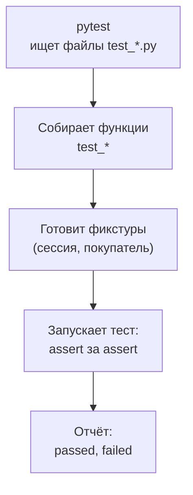
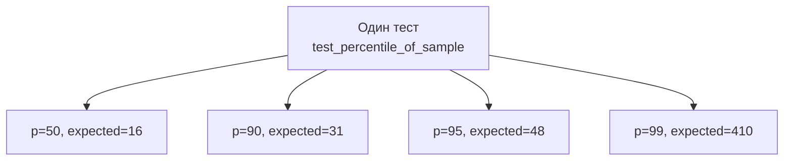

## Зачем это нужно

До распродажи месяц, и ты каждый день правишь скрипт с замерами. После каждой правки хочется спросить: «Ничего не сломалось?» Я с такими вопросами давно и скажу по опыту: проверка «запустил, глянул на экран» работает один раз. На двадцатый раз ты пропустишь ошибку.

**Автоматический тест** - маленькая программа, которая сама делает проверку и отвечает «прошёл» или «упал». Тесты запускает **pytest**: библиотека, то есть набор готового кода, как `requests` в [уроке 4.5](05-venv-requests.md). Саму проверку в нём пишут словом `assert` («утверждаю»).

Со мной был случай. Я «слегка поправил» функцию, которая считает перцентиль p95: число, не больше которого 95 замеров из 100 ([урок 4.2](02-conditions-loops.md)). Неделю я отправлял команде отчёты с неверными цифрами и заметил это случайно. С автоматическим тестом я узнал бы об ошибке через секунду.

Тестировщику нагрузки тесты нужны для двух дел. Первое: проверять свои инструменты, как в моей истории. Второе: перед нагрузкой убедиться, что «Магазин» отвечает как надо: вход работает, корзина без токена даёт 401, несуществующий товар даёт 404. Нагрузка на сломанный сервис бессмысленна: ты измеришь, как быстро он отвечает ошибками.

Шаг проекта: ты ставишь pytest в окружение `~/perf-lab/.venv`, пишешь модуль `shoptools.py` (перцентиль и доля ошибок), тесты к нему и первые тесты API «Магазина», коммитишь всё в `perf-lab`. Эти файлы работают в связке с `measure.py` из [урока 8.1](../08-perf-theory/01-latency-throughput.md), а полноценные автотесты API ты разовьёшь в [уроке 6.2](../06-api-testing/02-api-autotests.md).

## Что нужно знать

- Функции, `return`, исключения и `try`/`except`: [урок 4.3](03-functions-errors.md).
- Списки и словари, JSON-ответы API: [урок 4.1](01-first-program.md), [урок 4.4](04-files-json-csv.md).
- `requests`, `Session`, коды ответов, токен: [урок 4.5](05-venv-requests.md). Тесты API из этого урока используют те же приёмы.
- Окружение `~/perf-lab/.venv` включено, стенд «Магазин» запущен ([урок 2.1](../02-web/01-client-server-http.md)).
- Перцентили (p50, p95, p99): [урок 8.1](../08-perf-theory/01-latency-throughput.md). Если ты ещё не там, достаточно знать формулу из этого урока: перцентиль это значение, не больше которого `p%` измерений.
- Классы нужны только для понимания декораторов (`@pytest.fixture`, `@pytest.mark.parametrize`): [урок 4.6](06-classes.md).

## Картина целиком

Возьми контролёра на фабрике. У него есть список проверок: «размер такой-то», «цвет такой-то». Он идёт по списку, ставит галочки и в конце докладывает: «из 18 проверок 17 прошли, одна провалена, вот какая и почему». Одна проверка из списка - это **тест**, контролёр - это **pytest**, доклад - **отчёт**. Аналогия ломается в одном месте: на фабрике изделие уже готово, а в Python для проверки изделие часто нужно сначала подготовить. Такая подготовка (и уборка после неё) называется **фикстурой**: например, «новый покупатель, который уже вошёл в магазин».



Что здесь видно: тесты не надо перечислять, pytest находит их по именам. Тебе остаётся написать сами проверки.

## Теория

### assert: проверка одной строкой

Как сказать программе «вот что должно быть верно» и заставить её закричать, если это не так? Для этого в Python есть слово `assert`. Если выражение после него истинно, программа идёт дальше. Если ложно, возникает исключение `AssertionError` (про исключения [урок 4.3](03-functions-errors.md)), и pytest отмечает тест как упавший.

Это галочка в чек-листе: условие либо выполнено, либо нет. Аналогия ломается тем, что на первой невыполненной галочке тест **останавливается**: остальные `assert` в нём уже не сработают.

Записывается просто: `assert выражение`. Особенность pytest в том, что при падении он показывает значения всех частей выражения, и писать сообщения вроде «ожидали 200, получили 201» не нужно.

```python
def test_status_is_ok():
    status = 201
    assert status == 200
```

```text
>       assert status == 200
E       assert 201 == 200
```

Стрелка `>` указывает на проверку, которая не сошлась. Строка с `E` (от «Error») показывает значения: слева то, что получили (201), справа то, что ждали (200). Для вызова функции в левой части pytest добавит строку `where`: откуда взялось значение.

Осторожно: `assert (False, "ошибка")` в скобках **всегда проходит**, потому что непустой кортеж считается истинным. Своё сообщение пишут без скобок: `assert x == 5, "ожидали 5"`.

> **Главное:** `assert` говорит «это должно быть верно», а pytest при падении сам показывает, что получили и что ждали.
{: .key}

Один `assert` мы написали. А как pytest узнаёт, какие функции вообще надо запускать?

### Как pytest находит и запускает тесты

Перечислять тесты вручную скучно, поэтому pytest ищет их по именам. Ты запускаешь `pytest` в каталоге, и он обходит все вложенные папки и берёт файлы `test_*.py` (подойдёт и `*_test.py`). В них он ищет функции с именем `test_...` (и методы классов `Test...`) и выполняет каждую отдельно. Падение одного теста остальные не останавливает.

Тест **проходит**, если функция закончилась без исключения, и **падает**, если возникло исключение (чаще всего `AssertionError`). `return` и `print` для результата не нужны.

Вот самый маленький тест. В файле `shoptools.py` лежит функция `percentile(values, p)`, полный код будет в практике:

```python
from shoptools import percentile


def test_percentile_median_of_odd_list():
    assert percentile([30, 10, 20], 50) == 20
```

Строка `from shoptools import percentile` подключает функцию из соседнего файла, как `import` в [уроке 4.3](03-functions-errors.md). Список `[30, 10, 20]` нарочно перемешан. После сортировки получится `[10, 20, 30]`, середина - это 20. Функция без сортировки вернула бы 10, и тест упал бы. Хороший тест проверяет не «функция запускается», а **конкретный результат, который ты знаешь заранее**.

> **Прикинь сам:** ты написал функцию `check_error_rate()` в файле `test_tools.py`, внутри `assert`. Запустил `pytest`. Что будет?
{: .predict}

Файл pytest найдёт, а функцию пропустит: её имя не начинается с `test_`. Итог: `no tests ran` («ни один тест не запущен»). Переименуй в `test_error_rate`, и всё заработает.

Осторожно: функция без `assert` всегда зелёная и бесполезна. Поэтому сначала увидь тест **красным**: сломай проверку на секунду.

> **Главное:** pytest сам находит файлы `test_*.py` и функции `test_*`, а тест проходит, если внутри не возникло исключение.
{: .key}

Запускать умеем. Что именно проверять в функциях, чтобы ловить настоящие ошибки?

### Тестируем функции: обычные, крайние и ошибочные случаи

Вернёмся к моей истории. Ошибка в `percentile` сдвинула p95 на одну позицию, и все отчёты поплыли. Мелкие функции - сердце твоих отчётов, а тесты на них пишутся быстрее всего. Я проверяю три вида случаев.

Первый - обычный: данные, ответ на которых ты знаешь заранее (например, выборка из [урока 8.1](../08-perf-theory/01-latency-throughput.md)). Второй - крайний: пустой список, один элемент, p0 или p100. Ошибки живут именно на краях, а не посередине. Третий - ошибочный: данные, на которых функция **обязана** сломаться.

Для третьего нужен `pytest.raises`. Блок `with` ([урок 4.4](04-files-json-csv.md)) значит «внутри обязана случиться ошибка `ValueError`» (про неё [урок 4.3](03-functions-errors.md)).

```python
import pytest

from shoptools import percentile


def test_percentile_of_empty_list_fails():
    with pytest.raises(ValueError):
        percentile([], 95)
```

Если ошибки не случилось, тест упадёт с сообщением `DID NOT RAISE`. Текст ошибки тоже можно проверить: `pytest.raises(ValueError, match="хотя бы одно")`. Зачем так строго? Пустая выборка в нагрузочном скрипте означает «ни один запрос не прошёл», а не «задержка нулевая». Тихий ноль выглядел бы как отличный результат. Функция должна сказать о проблеме громко.

Ещё одна проверка: функция не должна портить свои аргументы. Наш перцентиль сортирует копию (`sorted(values)`). Сортировка самого списка (`values.sort()`) незаметно поменяла бы порядок замеров у вызывающего. Тест страхует от этого:

```python
def test_percentile_does_not_change_input():
    data = [3, 1, 2]
    percentile(data, 50)
    assert data == [3, 1, 2]
```

> **Прикинь сам:** функция `error_rate(codes)` считает долю кодов 400 и выше, а `0` считается обрывом соединения. Какие тесты ты бы написал?
{: .predict}

Обычный: `[200, 200, 200, 500]` даёт `0.25`, одна ошибка из четырёх. С обрывом: `[200, 404, 0, 201]` даёт `0.5`, потому что и 404, и 0 считаются ошибками. Крайний: `[200, 201, 204]` даёт `0`. Ошибочный: пустой список `[]` должен вызывать `ValueError`, а не деление на ноль.

> **Главное:** для каждой функции проверяй обычный, крайний и ошибочный случаи, а ошибку проверяй через `pytest.raises`.
{: .key}

Для перцентиля нас интересуют сразу четыре значения: p50, p90, p95 и p99. Неужели писать четыре почти одинаковых теста?

### Параметризация: один тест, много данных

Нет, четыре копии писать не надо. Как у контролёра: действия те же, различаются изделия. Ты описываешь **таблицу** «входные данные - ожидаемый результат» и один тест, который пробегает по ней. Это называется **параметризацией**.

Над тестом ставят декоратор `@pytest.mark.parametrize` (напоминание из [урока 4.6](06-classes.md): декоратор принимает функцию и возвращает функцию, здесь он «размножает» тест). Первый аргумент - строка с именами параметров через запятую. Второй - список наборов значений. pytest запускает тест **отдельно для каждого набора**, и в отчёте это отдельные строки.

```python
import pytest

from shoptools import percentile

# Те же 20 измерений, что в уроке 8.1 (мс).
SAMPLE = [12, 13, 13, 14, 14, 15, 15, 15, 16, 16, 17, 17, 18, 19, 20, 22, 25, 31, 48, 410]


@pytest.mark.parametrize("p, expected", [(50, 16), (90, 31), (95, 48), (99, 410)])
def test_percentile_of_sample(p, expected):
    assert percentile(SAMPLE, p) == expected
```

Имена в `"p, expected"` совпадают с аргументами теста, наборов четыре. Проверим ожидания вручную. Для p95 умножаем долю на число замеров: 0,95 × 20 = 19. Берём девятнадцатое по счёту значение в отсортированном списке: это 48. Для p99: 0,99 × 20 = 19,8, округляем вверх до 20 (в коде `math.ceil`), двадцатое значение - 410. Это метод ближайшего ранга, как в уроке 8.1.



Что здесь видно: из одной функции получилось четыре независимых теста. В отчёте с ключом `-v` («verbose», подробно) у каждого своя строка с набором в скобках: `test_percentile_of_sample[95-48] PASSED`. Если что-то упадёт, сразу видно, на каких данных.

> **Прикинь сам:** сколько тестов запустит pytest для `@pytest.mark.parametrize("product_id", [1, 42, 10000])`?
{: .predict}

Три, по одному на значение. В отчёте они будут называться `test_product_exists[1]`, `test_product_exists[42]` и `test_product_exists[10000]`.

Осторожно: цикл `for` внутри одного теста останавливается на первом падении, и непонятно, на каком наборе оно случилось. А ожидание, посчитанное той же функцией, всегда зелёное и бесполезное: считай его вручную, как мы сделали выше.

> **Главное:** параметризация превращает таблицу данных в отдельные тесты, и по отчёту видно, какой набор упал.
{: .key}

С чистыми функциями разобрались. А для тестов API нужен залогиненный покупатель. Откуда его брать?

### Фикстуры: подготовка и уборка

Тесту API нужно то, что не относится к проверке: адрес стенда, открытая сессия, залогиненный покупатель с токеном. Вход, написанный в каждом тесте, повторится десять раз. А общий покупатель на всех заставит тесты мешать друг другу: один положит товар в корзину, другой увидит чужую корзину.

Помогает **фикстура** (fixture, «приспособление»): функция, которая готовит нужное тесту и, если надо, убирает за ним. Как в операционной: хирургу готовят инструменты и стерилизуют после, а он думает об операции. Аналогия ломается тем, что в Python подготовка занимает миллисекунды.

Фикстура - обычная функция с декоратором `@pytest.fixture`. Чтобы тест её получил, достаточно **назвать её среди аргументов теста**: pytest сам подставит результат. Если в фикстуре есть `yield` («отдай»), код до него - подготовка, значение уходит тесту, а код после него - уборка. Она выполнится, даже если тест упал.

Ещё фикстура решает, как часто готовиться, и за это отвечает `scope`. По умолчанию подготовка идёт для каждого теста, а `scope="session"` значит один раз на весь запуск: так делают для адреса стенда и общей `Session`.

Нажми «Шаг ▶» и проследи за подготовкой и уборкой:

<div class="viz" data-viz="py-trace" data-title="Жизнь фикстуры: до теста, тест, после теста" data-speed="2200" data-code='["@pytest.fixture", "def buyer(shop, base_url):", "    session = login_new_buyer()", "    yield session", "    session.close()", "def test_add_to_cart(buyer):", "    r = buyer.post(cart_url, json=item)", "    assert r.status_code == 201", "def test_cart_is_empty(buyer):", "    assert buyer.get(cart_url).json()[\"total\"] == 0"]' data-steps='[{"l": 6, "v": {}, "n": "pytest берёт первый тест и смотрит на его параметры. Параметр buyer совпадает с именем фикстуры."}, {"l": 3, "v": {"session": "<Session + токен>"}, "f": "buyer (подготовка)", "n": "До теста выполняется код фикстуры до yield: регистрация нового покупателя и вход."}, {"l": 4, "v": {"session": "<Session + токен>"}, "f": "buyer", "n": "yield отдаёт сессию тесту и ставит фикстуру на паузу."}, {"l": 7, "v": {"buyer": "<Session + токен>", "r": "<Response [201]>"}, "f": "test_add_to_cart", "n": "Тест получил готового покупателя и сделал запрос."}, {"l": 8, "v": {"buyer": "<Session + токен>", "r": "<Response [201]>"}, "o": "PASSED", "f": "test_add_to_cart", "n": "assert прошёл: тест зелёный."}, {"l": 5, "v": {"session": "<закрыта>"}, "f": "buyer (уборка)", "n": "После теста фикстура продолжается за yield: уборка, сессия закрыта."}, {"l": 3, "v": {"session": "<новая Session + токен>"}, "f": "buyer (подготовка)", "n": "Для второго теста фикстура запускается заново: новый покупатель, пустая корзина."}, {"l": 10, "v": {"buyer": "<новая Session + токен>"}, "o": "PASSED", "f": "test_cart_is_empty", "n": "Тесты не влияют друг на друга: у второго корзина пуста."}]'></div>

Что здесь видно: подготовка идёт до теста, `yield` передаёт сессию тесту, уборка выполняется после. Второй тест получает нового покупателя и пустую корзину.

Общие фикстуры живут в файле `conftest.py` рядом с тестами. pytest читает его сам, импортировать не нужно. Вот он для «Магазина»:

```python
import os
import uuid

import pytest
import requests


@pytest.fixture(scope="session")
def base_url():
    """Адрес стенда; можно переопределить переменной окружения BASE_URL."""
    return os.getenv("BASE_URL", "http://localhost:8000")


@pytest.fixture(scope="session")
def shop():
    """Одна Session на весь запуск: соединение переиспользуется."""
    with requests.Session() as session:
        yield session


@pytest.fixture
def buyer(shop, base_url):
    """Свежий покупатель: регистрируется, входит и отдаёт Session с токеном."""
    credentials = {"email": f"pytest-{uuid.uuid4().hex[:12]}@shop.lab", "password": "password"}
    assert shop.post(f"{base_url}/api/register", json=credentials, timeout=30).status_code == 201
    response = shop.post(f"{base_url}/api/login", json=credentials, timeout=30)
    assert response.status_code == 200
    with requests.Session() as session:
        session.headers["Authorization"] = "Bearer " + response.json()["token"]
        yield session
```

`base_url` читает переменную окружения ([урок 1.1](../01-linux/01-workstation-terminal.md)) и без неё берёт адрес по умолчанию. Так те же тесты можно направить на другой стенд: `BASE_URL=http://localhost:8000 pytest`. `shop` - общая `Session` на весь запуск, `yield` внутри `with` закроет её в конце. `buyer` для каждого теста заводит нового пользователя. `uuid.uuid4().hex[:12]` - случайная строка из 12 символов, поэтому почта каждый раз новая, например `pytest-3f9a1c2b7d10@shop.lab`. Фикстура получает `shop` и `base_url`, назвав их в параметрах. Токен кладётся в заголовки отдельной сессии, как в [уроке 4.5](05-venv-requests.md). Метки тестов (`smoke`, `slow`) и уборку на реальном API разберёт [урок 6.2](../06-api-testing/02-api-autotests.md): сейчас они не нужны.

> **Прикинь сам:** зачем `buyer` регистрирует нового пользователя на каждый тест, а не берёт `user0001`?
{: .predict}

У `user0001` корзина общая для всех тестов и всех запусков: товар, добавленный одним тестом, останется для следующего. Новый пользователь даёт пустую корзину и независимые тесты.

Осторожно: фикстуру не вызывают как функцию (`buyer()`), pytest подставляет её сам. А `scope="session"` даёт один общий объект, поэтому всё, что тест меняет (корзину, пользователя), готовь с областью по умолчанию. Если упадёт `assert` внутри фикстуры, pytest сообщит об **ошибке** подготовки, а не о падении теста: чем они различаются, скажу дальше.

> **Главное:** фикстура готовит и убирает, тест получает её по имени аргумента, а область `scope` решает, как часто её готовить.
{: .key}

Тесты написаны, один упал. Как прочитать отчёт и не утонуть в красном тексте?

### Как читать отчёт о падении

Упавший тест - не «плохо», а сообщение, ради которого тесты и пишут. Новичок читает отчёт с первой строки и тонет в вызовах чужих библиотек. Я читаю его по трём местам.

Внизу итоговая строка, например `1 failed, 17 passed in 0.31s`. Над ней блок `short test summary info`, по строке на каждый упавший тест. Выше блок `FAILURES`: у каждого упавшего теста там заголовок с именем, код со строкой-стрелкой `>`, строки `E` (что ждали и что получили) и файл с номером строки.

Статусов пять. Тест может пройти (**passed**) или упасть (**failed**): не сошёлся `assert` либо возникло исключение в теле. Если упала фикстура до начала теста, это **error**. Ещё есть **skipped** (пропущен нарочно, например на чужой системе) и **xfailed** (упал, как и ожидалось: известный дефект). Главное различие: failed говорит «тест упал», error говорит «до теста не добрались».

Переключай сценарии и наводи курсор на подсвеченные строки:

<div class="viz" data-viz="py-report" data-title="Как читать отчёт pytest о падении" data-scenarios='[{"name": "201 вместо 200", "intro": "Тест ждёт 200, а сервер ответил 201 (создано). Смотри, откуда читать отчёт.", "lines": [{"t": "=================================== FAILURES ==================================="}, {"t": "______________________________ test_add_to_cart _______________________________", "n": "Заголовок блока: имя упавшего теста. Начинай читать отсюда."}, {"t": "buyer = <requests.sessions.Session object at 0x7f1c2a3b4d90>"}, {"t": "base_url = http://localhost:8000"}, {"t": ""}, {"t": "    def test_add_to_cart(buyer, base_url):"}, {"t": "        response = buyer.post(f\"{base_url}/api/cart/items\", json={\"product_id\": 1, \"qty\": 2}, timeout=10)"}, {"t": ">       assert response.status_code == 200", "n": "Стрелка > показывает строку теста, на которой всё остановилось."}, {"t": "E       assert 201 == 200", "n": "Первая строка E: что получили и что ждали. Слева факт (201), справа ожидание (200)."}, {"t": "E        +  where 201 = <Response [201]>.status_code", "n": "where: откуда взялось левое число. Сервер вернул Response с кодом 201."}, {"t": ""}, {"t": "test_shop_api.py:43: AssertionError", "n": "Файл и номер строки, где упала проверка."}, {"t": "=========================== short test summary info ============================"}, {"t": "FAILED test_shop_api.py::test_add_to_cart - assert 201 == 200", "n": "Сводка в конце: путь для повторного запуска одного теста."}, {"t": "========================= 1 failed, 17 passed in 0.31s =========================", "n": "Итоговая строка: сколько упало и сколько прошло."}], "summary": "Ошибка в ожидании, а не в сервисе: 201 это правильный ответ на создание. Исправить нужно тест: ждать 201."}, {"name": "48 вместо 410", "intro": "Параметризованный тест: одна функция, четыре набора данных. Упал один набор.", "lines": [{"t": "=================================== FAILURES ==================================="}, {"t": "___________________ test_percentile_of_sample[95-410] ____________________", "n": "В квадратных скобках номер набора данных: p=95, expected=410. Сразу видно, какой именно упал."}, {"t": ""}, {"t": "p = 95, expected = 410"}, {"t": ""}, {"t": "    @pytest.mark.parametrize(\"p, expected\", [(50, 16), (90, 31), (95, 410), (99, 410)])"}, {"t": "    def test_percentile_of_sample(p, expected):"}, {"t": ">       assert percentile(SAMPLE, p) == expected", "n": "Стрелка: проверка, которая не сошлась."}, {"t": "E       assert 48 == 410", "n": "Функция вернула 48, а в тесте записано 410. Либо ошибка в функции, либо в ожидании."}, {"t": "E        +  where 48 = percentile([12, 13, 13, 14, 14, 15, ...], 95)", "n": "where показывает вызов с аргументами: pytest сократил длинный список многоточием."}, {"t": ""}, {"t": "test_shoptools.py:14: AssertionError"}, {"t": "=========================== short test summary info ============================"}, {"t": "FAILED test_shoptools.py::test_percentile_of_sample[95-410] - assert 48 == 410"}, {"t": "========================= 1 failed, 17 passed in 0.03s =========================", "n": "Остальные три набора p=50, 90, 99 прошли: упал один."}], "summary": "В уроке 8.1 p95 этой выборки равен 48, значит, ошибся тест: ожидание перепутано с p99. Исправь число в тесте, а не функцию."}, {"name": "Стенд выключен", "intro": "Тест не дошёл до проверки: сервер не отвечает. Отчёт длинный, но читать его надо снизу.", "lines": [{"t": "=================================== FAILURES ==================================="}, {"t": "_________________________________ test_readyz __________________________________", "n": "Упал тест test_readyz."}, {"t": "..."}, {"t": "../.venv/lib/python3.12/site-packages/requests/sessions.py:589: in get", "n": "Десятки строк внутри библиотеки requests: это путь вызова, чужой код. Пропускай."}, {"t": "../.venv/lib/python3.12/site-packages/requests/adapters.py:700: in send"}, {"t": "E   requests.exceptions.ConnectionError: HTTPConnectionPool(host=localhost, port=8000): Max retries exceeded with url: /readyz (Caused by NewConnectionError: Connection refused)", "n": "Главное внизу: ConnectionError, порт 8000, Connection refused. Никто не слушает порт: стенд не запущен."}, {"t": "=========================== short test summary info ============================"}, {"t": "FAILED test_shop_api.py::test_readyz - requests.exceptions.ConnectionError: ...", "n": "В сводке одна строка с тем же выводом."}, {"t": "============================== 1 failed in 0.07s ==============================", "n": "С ключом -x остановились на первом падении, поэтому тест всего один."}], "summary": "Тест не виноват: проверь curl localhost:8000/readyz и подними стенд. Для длинных отчётов запускай pytest --tb=short -x."}]'></div>

Что здесь видно: в первых двух сценариях отчёт короткий, и все ответы лежат в строках со стрелкой и `E`. В третьем отчёт длинный: исключение случилось внутри библиотеки `requests`, и pytest показал весь путь вызова. Ответ всё равно внизу: тип исключения и текст.

Отчёт помогают сократить три ключа. `--tb=short` оставляет одну строку на файл, `-x` останавливается на первом упавшем тесте, `-q` убирает лишнее.

> **Прикинь сам:** тест `test_product_missing` показал `E assert 200 == 404`. Сервис ответил 404 или 200?
{: .predict}

Слева то, что получили, справа то, что ждали. Сервис вернул 200: товар с таким номером существует. Тест ждал 404, значит, надо проверить, какой `id` в нём записан. Допустимы номера 1–10000, нужен заведомо несуществующий, например 99999999.

Осторожно: упавший тест не значит «тест плохой». Сломаться мог сервис, ожидание, данные или сам тест, и надо решить, кто прав. Не подгоняй тест под результат, пока не проверил, правилен ли он. Тест ждал 410 для p95, а получил 48: по расчёту выше прав результат, ошибся тест.

> **Главное:** читай отчёт по трём местам (строка `>`, строки `E`, итог), а перед правкой реши, кто неправ: сервис, ожидание или тест.
{: .key}

Тот самый перцентиль, из-за которого я неделю присылал неверные отчёты, теперь страхуют четыре строки с ожидаемыми числами. Пора повторить это руками.

## Практика

### 1. Поставь pytest и зафиксируй версию

```bash
cd ~/perf-lab
source .venv/bin/activate
pip install pytest
pip freeze > requirements.txt
printf '.pytest_cache/\n' >> .gitignore
pytest --version
```

```text
pytest 9.1.1
```

**Как читать вывод:** версия 9.x подойдёт; у тебя может быть новее. `pip freeze > requirements.txt` перезаписал список зависимостей: теперь в нём `pytest` и всё, что ему нужно (`iniconfig`, `packaging`, `pluggy`, `pygments`), плюс `requests` из прошлого урока. Строка в `.gitignore` исключает папку `.pytest_cache`, куда pytest складывает служебные файлы. Если окружение не включено, будет ошибка `externally-managed-environment`, как в [уроке 4.5](05-venv-requests.md).

### 2. Модуль с функциями

Создай `~/perf-lab/04-python/shoptools.py`. Это отдельный модуль со своими функциями: не подставляй сюда `perflib.py` из урока 4.3. Там `error_rate` возвращает проценты и на пустом списке отдаёт `0.0`, а здесь `error_rate` возвращает долю (0,25 вместо 25) и на пустом списке бросает `ValueError`. Тесты ниже написаны под эту версию, поэтому бери её целиком:

```python
"""Мелкие функции для обработки результатов нагрузки."""
import math


def percentile(values, p):
    """Перцентиль методом ближайшего ранга: значение, не больше которого p% выборки."""
    if not values:
        raise ValueError("нужно хотя бы одно измерение")
    ordered = sorted(values)
    rank = math.ceil(p / 100 * len(ordered))
    return ordered[max(rank, 1) - 1]


def error_rate(codes):
    """Доля неудачных ответов: код 400 и выше, а 0 означает обрыв соединения."""
    if not codes:
        raise ValueError("нужен хотя бы один код ответа")
    bad = sum(1 for code in codes if code == 0 or code >= 400)
    return bad / len(codes)
```

Разбор: `sorted(values)` возвращает **новый** отсортированный список и не трогает исходный. `math.ceil` округляет вверх: для 20 измерений и p95 получим `ceil(19.0) = 19`. `max(rank, 1) - 1` превращает номер по счёту (с единицы) в индекс (с нуля) и защищает от нулевого ранга при `p=0`. `sum(1 for code in codes if ...)` считает, сколько кодов подходят под условие (это генераторное выражение: как списковое включение, только без создания списка). Логика та же, что в [уроке 8.1](../08-perf-theory/01-latency-throughput.md): ошибка это код 0 (обрыв) или 400 и выше.

### 3. Первые тесты на функции

Создай `~/perf-lab/04-python/test_shoptools.py`:

```python
import pytest

from shoptools import error_rate, percentile

# Те же 20 измерений, что в уроке 8.1.
SAMPLE = [12, 13, 13, 14, 14, 15, 15, 15, 16, 16, 17, 17, 18, 19, 20, 22, 25, 31, 48, 410]


def test_percentile_median_of_odd_list():
    assert percentile([30, 10, 20], 50) == 20


@pytest.mark.parametrize("p, expected", [(50, 16), (90, 31), (95, 48), (99, 410)])
def test_percentile_of_sample(p, expected):
    assert percentile(SAMPLE, p) == expected


def test_percentile_does_not_change_input():
    data = [3, 1, 2]
    percentile(data, 50)
    assert data == [3, 1, 2]


def test_percentile_of_empty_list_fails():
    with pytest.raises(ValueError):
        percentile([], 95)


def test_error_rate():
    assert error_rate([200, 200, 200, 500]) == 0.25
    assert error_rate([200, 404, 0, 201]) == 0.5


def test_error_rate_without_errors():
    assert error_rate([200, 201, 204]) == 0
```

```bash
cd ~/perf-lab/04-python
pytest -v test_shoptools.py
```

```text
============================= test session starts ==============================
platform linux -- Python 3.12.3, pytest-9.1.1, pluggy-1.6.0 -- /home/student/perf-lab/.venv/bin/python
cachedir: .pytest_cache
rootdir: /home/student/perf-lab/04-python
collecting ... collected 9 items

test_shoptools.py::test_percentile_median_of_odd_list PASSED             [ 11%]
test_shoptools.py::test_percentile_of_sample[50-16] PASSED               [ 22%]
test_shoptools.py::test_percentile_of_sample[90-31] PASSED               [ 33%]
test_shoptools.py::test_percentile_of_sample[95-48] PASSED               [ 44%]
test_shoptools.py::test_percentile_of_sample[99-410] PASSED              [ 55%]
test_shoptools.py::test_percentile_does_not_change_input PASSED          [ 66%]
test_shoptools.py::test_percentile_of_empty_list_fails PASSED            [ 77%]
test_shoptools.py::test_error_rate PASSED                                [ 88%]
test_shoptools.py::test_error_rate_without_errors PASSED                 [100%]

============================== 9 passed in 0.01s ===============================
```

**Как читать вывод:** `collected 9 items` значит «нашёл девять тестов» (параметризованный тест дал четыре). Каждая строка это один тест, `PASSED` значит «прошёл», а в скобках процент выполнения. В квадратных скобках после имени (`[95-48]`) идентификатор набора: значения параметров по порядку. Последняя строка это итог: `9 passed`. Если у тебя иное число, проверь, что файл сохранён и имена функций начинаются с `test_`.

**Типичные ошибки:**

- `ModuleNotFoundError: No module named 'shoptools'`: ты запустил `pytest` не из каталога `~/perf-lab/04-python`, или файл называется иначе.
- `no tests ran`: имя файла или функции не начинается с `test_`.
- `ModuleNotFoundError: No module named 'pytest'`: окружение не включено (`which pytest` должен показывать путь внутри `.venv`).

### 4. Тесты API «Магазина»

Создай рядом `conftest.py` (код из теории выше) и `test_shop_api.py`:

```python
import pytest


def test_readyz(shop, base_url):
    response = shop.get(f"{base_url}/readyz", timeout=10)
    assert response.status_code == 200
    assert response.json() == {"status": "ready"}


def test_catalog_page_size(shop, base_url):
    response = shop.get(f"{base_url}/api/products", params={"page": 2, "size": 5}, timeout=10)
    assert response.status_code == 200
    body = response.json()
    assert body["page"] == 2
    assert len(body["items"]) == 5
    assert body["total"] == 10000


@pytest.mark.parametrize("product_id", [1, 42, 10000])
def test_product_exists(shop, base_url, product_id):
    response = shop.get(f"{base_url}/api/products/{product_id}", timeout=10)
    assert response.status_code == 200
    assert response.json()["id"] == product_id


def test_product_missing(shop, base_url):
    response = shop.get(f"{base_url}/api/products/99999999", timeout=10)
    assert response.status_code == 404
    assert response.json() == {"detail": "product not found"}


def test_login_wrong_password(shop, base_url):
    body = {"email": "user0001@shop.lab", "password": "wrong"}
    assert shop.post(f"{base_url}/api/login", json=body, timeout=30).status_code == 401


def test_cart_needs_token(shop, base_url):
    assert shop.get(f"{base_url}/api/cart", timeout=10).status_code == 401


def test_add_to_cart(buyer, base_url):
    response = buyer.post(f"{base_url}/api/cart/items", json={"product_id": 1, "qty": 2}, timeout=10)
    assert response.status_code == 201
    item = response.json()["items"][0]
    assert item["product_id"] == 1
    assert item["qty"] == 2
```

Что проверяет каждый тест: `test_readyz` сервис готов; `test_catalog_page_size` номер и размер страницы и общее число товаров; `test_product_exists` три товара из разных частей каталога; `test_product_missing` несуществующий товар даёт 404 и сообщение; `test_login_wrong_password` и `test_cart_needs_token` защита (401); `test_add_to_cart` корзина покупателя. Это набор «дымовых» проверок: не детальных, а ровно столько, чтобы убедиться, что нагружать есть что.

Запусти все тесты каталога:

```bash
pytest -v
```

```text
============================= test session starts ==============================
platform linux -- Python 3.12.3, pytest-9.1.1, pluggy-1.6.0 -- /home/student/perf-lab/.venv/bin/python
cachedir: .pytest_cache
rootdir: /home/student/perf-lab/04-python
collecting ... collected 18 items

test_shop_api.py::test_readyz PASSED                                     [  5%]
test_shop_api.py::test_catalog_page_size PASSED                          [ 11%]
test_shop_api.py::test_product_exists[1] PASSED                          [ 16%]
test_shop_api.py::test_product_exists[42] PASSED                         [ 22%]
test_shop_api.py::test_product_exists[10000] PASSED                      [ 27%]
test_shop_api.py::test_product_missing PASSED                            [ 33%]
test_shop_api.py::test_login_wrong_password PASSED                       [ 38%]
test_shop_api.py::test_cart_needs_token PASSED                           [ 44%]
test_shop_api.py::test_add_to_cart PASSED                                [ 50%]
test_shoptools.py::test_percentile_median_of_odd_list PASSED             [ 55%]
test_shoptools.py::test_percentile_of_sample[50-16] PASSED               [ 61%]
test_shoptools.py::test_percentile_of_sample[90-31] PASSED               [ 66%]
test_shoptools.py::test_percentile_of_sample[95-48] PASSED               [ 72%]
test_shoptools.py::test_percentile_of_sample[99-410] PASSED              [ 77%]
test_shoptools.py::test_percentile_does_not_change_input PASSED          [ 83%]
test_shoptools.py::test_percentile_of_empty_list_fails PASSED            [ 88%]
test_shoptools.py::test_error_rate PASSED                                [ 94%]
test_shoptools.py::test_error_rate_without_errors PASSED                 [100%]

============================== 18 passed in 0.62s ===============================
```

**Как читать вывод:** 18 тестов, файлы идут по алфавиту. Два теста (`test_login_wrong_password`, `test_add_to_cart`) заметно медленнее остальных: они проходят через вход с bcrypt (около четверти секунды). Время итога у тебя будет иным (обычно 1–2 секунды). Если упал `test_product_missing`, проверь, что стенд не перезапускали с другим набором данных.

Теперь потренируйся управлять запуском:

```bash
pytest -q
pytest -k percentile -v
pytest test_shop_api.py::test_readyz -v
pytest -x --tb=short
```

Разбор ключей: `-q` короткий вывод (точки вместо строк: каждая точка это прошедший тест). `-k percentile` запускает только тесты, в имени которых есть слово «percentile» (`-k` от «keyword», ключевое слово). Путь с `::` запускает один конкретный тест: это ровно то, что pytest печатает в строке сводки `FAILED ...`, поэтому её можно копировать. `-x --tb=short` останавливается на первом падении и печатает короткий отчёт.

**Типичные ошибки:**

- `ConnectionError ... Connection refused` во всех API-тестах: стенд не запущен. Тесты функций при этом проходят: они не ходят в сеть.
- `fixture 'buyer' not found`: файл называется не `conftest.py` или лежит не рядом с тестами.
- `assert 422 == 201` в фикстуре `buyer`: пароль короче 8 символов. «Магазин» требует не меньше восьми.

### 5. Сломай тест намеренно

Убедись, что тест действительно ловит ошибку. Измени в `shoptools.py` строку `rank = math.ceil(p / 100 * len(ordered))` на `rank = int(p / 100 * len(ordered))` (округление вниз вместо вверх) и запусти:

```bash
pytest test_shoptools.py -q
```

```text
F...F....                                                                [100%]
=================================== FAILURES ===================================
____________________ test_percentile_median_of_odd_list ____________________
...
E       assert 10 == 20
...
___________________ test_percentile_of_sample[99-410] ___________________
...
E       assert 48 == 410
=========================== short test summary info ============================
FAILED test_shoptools.py::test_percentile_median_of_odd_list - assert 10 == 20
FAILED test_shoptools.py::test_percentile_of_sample[99-410] - assert 48 == 410
2 failed, 7 passed in 0.03s
```

**Как читать вывод:** упали два теста из девяти, остальные семь зелёные. Первая `F` это тест с тремя числами: `int(0,5 × 3)` даёт 1 вместо 2, индекс сдвигается на единицу, и вместо 20 функция возвращает 10. Вторая `F` это p99: `int(0,99 × 20) = int(19,8) = 19` вместо 20, и вернулось 48, а не 410. Тесты p50, p90 и p95 остались зелёными: там `0,5 × 20`, `0,9 × 20` и `0,95 × 20` дают целые 10, 18 и 19, и округление вверх или вниз ничего не меняет. Тест не обязан ловить всё сразу: он ловит то, что ты в него заложил.

Верни `ceil`, запусти ещё раз: все зелёные. Привычка: убедись, что тест хоть раз был красным по нужной причине, иначе неизвестно, проверяет ли он что-либо.

### 6. Закоммить результат

```bash
cd ~/perf-lab
git add .gitignore requirements.txt 04-python/shoptools.py 04-python/test_shoptools.py 04-python/conftest.py 04-python/test_shop_api.py
git commit -m "4.7: pytest, тесты функций и первые тесты API Магазина"
git push
```

**Как читать вывод:** git сообщит число изменённых файлов. Проверь `git status`: рабочее дерево чистое, и папки `.pytest_cache` в списке нет.

> Тест упал, и ты не понимаешь почему? Прочитай строки `assert` и `E` в отчёте сам, потом покажи нейросети весь отчёт. Её версию проверь повторным запуском одного теста.
{: .ai}

## Сломай и почини

**Поломка 1: тест падает из-за неверного ожидания.** В `test_shop_api.py` замени в `test_add_to_cart` проверку `assert response.status_code == 201` на `== 200` и запусти `pytest -x --tb=short`:

```text
>       assert response.status_code == 200
E       assert 201 == 200
E        +  where 201 = <Response [201]>.status_code

test_shop_api.py:43: AssertionError
FAILED test_shop_api.py::test_add_to_cart - assert 201 == 200
```

**Задача.** Определи, что сломано: сервис или тест. Что сделать?

<details markdown="1">
<summary>Разбор</summary>

Левая часть (`201`) это ответ сервиса, правая (`200`) то, что ждал тест. Но создание ресурса в REST-API по [уроку 2.2](../02-web/02-rest-json-auth.md) это 201, значит, сервис прав, а ожидание ошибочно. Верни `== 201`. Общий приём: перед тем как «чинить» падение, определи, кто прав: сервис, спецификация или тест.

</details>

**Поломка 2: падает «чужой» тест.** Верни `201`, останови стенд (`cd ~/load-tester/project/shop && docker compose stop shop`) и запусти `pytest -x --tb=short`. Потом верни стенд (`docker compose start shop`, подожди, пока ответит `readyz`).

```text
E   requests.exceptions.ConnectionError: HTTPConnectionPool(host='localhost', port=8000): Max retries exceeded with url: /readyz (Caused by NewConnectionError(... Connection refused))
FAILED test_shop_api.py::test_readyz - requests.exceptions.ConnectionError: ...
```

**Задача.** Почему тест не показал сообщение вида «assert ... == ...»? Куда смотреть в таком отчёте?

<details markdown="1">
<summary>Разбор</summary>

До `assert` дело не дошло: исключение случилось в самом вызове `shop.get(...)`, и pytest показал его так, как есть. Строка `E` называет тип (`ConnectionError`), адрес и порт (`localhost:8000`) и причину (`Connection refused`: на порту никто не слушает). Это не ошибка теста, а недоступность стенда. Проверь `curl -s localhost:8000/readyz` и подними стенд. На Ubuntu в тексте будет `[Errno 111]`, на macOS `[Errno 61]`: это один и тот же отказ в соединении.

</details>

**Поломка 3: ошибка в ожидании параметризованного теста.** Измени в `test_shoptools.py` ожидание `(95, 48)` на `(95, 410)` и запусти `pytest -q`. Упадёт один набор: `test_percentile_of_sample[95-410]`, `assert 48 == 410`. Выбери решение: поправить функцию или тест.

<details markdown="1">
<summary>Разбор</summary>

Для 20 измерений p95 по методу ближайшего ранга это значение с рангом `ceil(0,95 × 20) = 19`, то есть 48 (двадцатое значение 410 это p99). Значит, функция верна, а ожидание ошибочно: верни `(95, 48)`. А вот если бы ты изменил формулу в функции и тест остался зелёным, это был бы сигнал, что **тестов недостаточно**: надо добавить случай, который эту разницу ловит.

</details>

## ИИ в помощь

Нейросеть быстро набрасывает тесты, но смысл проверки должен понимать ты: тест, который ничего не проверяет, хуже его отсутствия. Общие правила на странице [ИИ-помощник](../ai.md).

**Задача:** набросать тесты для функции.

```text
pytest 9, Python 3.12. Функция:
<вставь функцию percentile>
Напиши тесты: обычный случай, граничные значения (пустой список, один элемент, p=0 и p=100) и проверку исключения через pytest.raises. Используй parametrize. Объясни, что проверяет каждый тест.
```
{: .wrap}

**Проверь ответ:** запусти `pytest -v` и намеренно сломай функцию: тесты обязаны упасть. Типичная ошибка: тест повторяет ту же формулу, что и функция, и всегда проходит, а ожидаемые числа не посчитаны вручную.

**Задача:** прочитать отчёт о падении теста.

```text
pytest показал:
<вставь вывод падения целиком>
Объясни каждую часть отчёта (какая строка, что ожидалось и что получено). Это failed или error? Что исправлять: тест или код?
```
{: .wrap}

**Проверь ответ:** воспроизведи падение одним тестом: `pytest test_x.py::test_имя -v`. Типичная ошибка: «исправить» тест под неверный результат вместо того, чтобы исправить код.

## Словарик урока

| Термин | Простыми словами |
|---|---|
| Тест (test) | Функция `test_...`, которая проверяет одно утверждение и либо проходит, либо падает |
| pytest | Библиотека, которая находит тесты по именам, запускает их и печатает отчёт |
| `assert` | Утверждение: если ложно, возникает `AssertionError`, тест падает |
| `AssertionError` | Исключение, которое вызывает ложный `assert` |
| `pytest.raises` | Проверка, что код внутри блока вызывает указанное исключение |
| Фикстура (fixture) | Функция, которая готовит (и убирает) то, что нужно тесту; подставляется по имени аргумента |
| `yield` в фикстуре | Отдаёт значение тесту; код после него это уборка |
| `scope` | Как часто готовить фикстуру: для каждого теста или один раз на запуск (`session`) |
| `conftest.py` | Файл с общими фикстурами; pytest находит его сам |
| Параметризация | Один тест, запущенный на нескольких наборах данных |
| passed, failed, error | Прошёл; не сошлась проверка; упала подготовка до теста |
| Строка `>` и строки `E` | В отчёте: проверка, которая не сошлась; ожидали и получили |
| `-x`, `-q`, `-k`, `--tb=short` | Остановиться на первом падении; короткий вывод; фильтр по имени; сокращённый путь ошибки |
| Дымовой тест (smoke) | Короткая проверка «живо ли и работает ли главное» |

## Вопросы с собеседований

Раздел для повторения: ответь вслух, потом открой ответ. Вопросы с пометкой `[на скорость]` тренируй на время: ответ за 30 секунд.



## Проверено на версиях

Ubuntu 24.04 и 26.04, Python 3.12.3, pytest 9.1, `requests` 2.34.2, стенд «Магазин» из `project/shop`. Октябрь 2026. Номера версий в твоём `requirements.txt` могут быть новее.

## Итог урока: ты умеешь

- [ ] Поставить pytest в окружение и зафиксировать версию в `requirements.txt`.
- [ ] Написать тест-функцию с `assert` и понимать, по каким правилам pytest её находит.
- [ ] Проверять функции на типичных, граничных и ошибочных данных, в том числе через `pytest.raises`.
- [ ] Использовать `@pytest.mark.parametrize` для нескольких наборов данных.
- [ ] Написать фикстуру с подготовкой и уборкой и вынести общие в `conftest.py`.
- [ ] Написать первые тесты API «Магазина» через `requests`.
- [ ] Прочитать отчёт о падении: строка со стрелкой, строки `E`, итог; отличить failed от error.
- [ ] Запускать нужные тесты ключами `-k`, `-x`, `-q`, `--tb=short` и путём с `::`.
- [ ] Попросить нейросеть набросать тесты и проверить их: сломанный код должен их ронять.

Дальше: [тема 5. Docker и контейнеры](../05-docker/index.md). Тесты API разовьются в [уроке 6.2](../06-api-testing/02-api-autotests.md), а `shoptools.py` пригодится для обработки результатов нагрузки.
