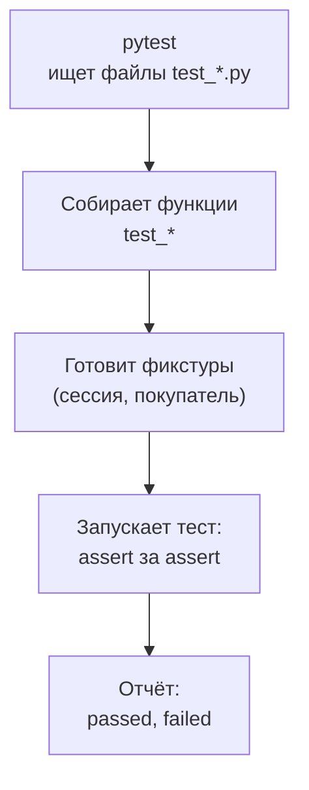
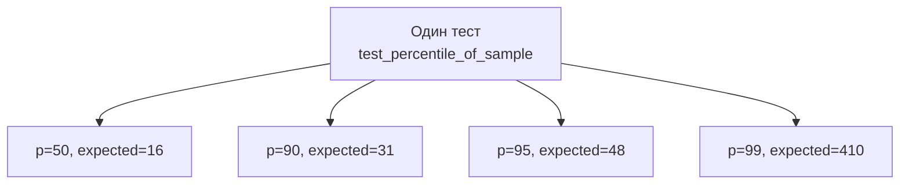

## Зачем это нужно

Каждый раз, когда ты меняешь скрипт или сервис, хочется знать: **ничего не сломалось?** Проверять вручную («запущу, посмотрю на экран») можно один раз. На десятый раз ты устанешь, а на двадцатый пропустишь ошибку. **Автоматический тест** это маленькая программа, которая сама делает проверку и отвечает «прошло» или «упало». Запустил одной командой, через секунду знаешь итог.

Для тестировщика нагрузки у тестов три применения. Первое: проверять **собственные инструменты**. Если функция считает перцентиль неверно, все твои отчёты врут, и никто этого не заметит. Второе: проверять **сервис**: перед тем как нагружать «Магазин», убедиться, что он вообще отвечает так, как ты думаешь (вход работает, корзина требует токен, несуществующий товар даёт 404). Нагрузка на сломанный сервис бессмысленна. Третье: тесты делают проверку воспроизводимой: коллеге достаточно написать `pytest`, и он увидит то же, что видишь ты.

Для запуска и описания тестов в Python есть библиотека **pytest**. Это самый популярный инструмент: тесты пишутся обычными функциями, а проверки обычным словом `assert`.

Шаг проекта: ты ставишь pytest в окружение `~/perf-lab/.venv`, пишешь модуль `shoptools.py` с функциями для обработки результатов (перцентиль и доля ошибок), тесты к нему и первые тесты API «Магазина», коммитишь всё в `perf-lab`. Эти файлы потом работают в связке с `measure.py` из [урока 8.1](../08-perf-theory/01-latency-throughput.md), а полноценные API-автотесты ты разовьёшь в [уроке 6.2](../06-api-testing/02-api-autotests.md).

## Что нужно знать

- Функции, `return`, исключения и `try`/`except`: [урок 4.3](03-functions-errors.md).
- Списки и словари, JSON-ответы API: [урок 4.1](01-first-program.md), [урок 4.4](04-files-json-csv.md).
- `requests`, `Session`, коды ответов, токен: [урок 4.5](05-venv-requests.md). Тесты API из этого урока используют те же приёмы.
- Окружение `~/perf-lab/.venv` включено, стенд «Магазин» запущен ([урок 2.1](../02-web/01-client-server-http.md)).
- Перцентили (p50, p95, p99): [урок 8.1](../08-perf-theory/01-latency-throughput.md). Если ты ещё не там, достаточно знать формулу из этого урока: перцентиль это значение, не больше которого `p%` измерений.
- Классы нужны только для понимания декораторов (`@pytest.fixture`, `@pytest.mark.parametrize`): [урок 4.6](06-classes.md).

## Картина целиком

Представь контролёра на фабрике. На конвейере идут изделия, и у контролёра есть список проверок: «размер такой-то», «цвет такой-то». Он проходит по списку, ставит галочки и в конце говорит: «из 18 проверок 17 прошли, одна провалена, вот какая и почему». Тест это одна проверка из списка, **pytest** это контролёр, а **отчёт** это его доклад. Аналогия ломается тем, что контролёр на фабрике смотрит на уже готовые изделия, а в Python ты ещё и **готовишь** изделие для каждой проверки (это называется фикстурой).



Что здесь видно: pytest сам находит тесты по именам (не нужно перечислять их вручную), готовит всё необходимое, запускает каждый и собирает итог. Ты пишешь только сами проверки.

Четыре понятия урока:

- **тест** это функция с именем `test_...`, внутри которой стоят `assert`;
- **фикстура** это подготовка (и уборка) для теста, например «залогиненный покупатель»;
- **параметризация** это один тест, запущенный на нескольких наборах данных;
- **отчёт о падении** это текст, из которого по правилам читается причина.

## Теория

### assert: проверка одной строкой

**Зачем это существует.** Тесту нужно сказать «вот что должно быть верно». Для этого в Python есть слово **`assert`** («утверждаю»). Если выражение после него истинно, программа идёт дальше. Если ложно, возникает `AssertionError`, и pytest отмечает тест как упавший.

**Аналогия.** Галочка в чек-листе: ты пишешь условие, и оно либо выполнено, либо нет. Аналогия ломается тем, что тест на первой же невыполненной галочке **останавливается**: остальные `assert` внутри этого теста не выполнятся.

**Как это устроено.** Записывается просто: `assert выражение`. Внутри любое условие (сравнение, `in`, `is`, вызов функции). Что делает pytest особенного: он **«перехватывает» `assert`** и при падении показывает значения всех частей выражения, а не просто «ложь». Благодаря этому не нужно писать отдельные сообщения вроде «ожидалось 200, получено 201»: pytest сам напишет их.

```python
def test_status_is_ok():
    status = 201
    assert status == 200
```

```text
>       assert status == 200
E       assert 201 == 200
```

Читаем: стрелка `>` указывает на проверку, которая не сошлась. Строка с `E` (от «Error») показывает значения: слева то, что получили (201), справа то, что ждали (200). Если сравниваются не просто числа, а, например, вызов функции или поле ответа, pytest добавляет строку с `where`: откуда взялось значение.

**Что путают.**

- `assert x` и `assert x == 5`: первое проверяет, что `x` «истинно» (непустое, не ноль), второе сравнивает.
- `assert (условие, "сообщение")` в скобках. Запись `assert (False, "ошибка")` **всегда истинна**, потому что непустой кортеж истинен. Сообщение пишут через запятую без скобок: `assert x == 5, "ожидали 5"`. Но в pytest своё сообщение обычно не нужно.
- Сравнение дробных чисел: `0.1 + 0.2 == 0.3` ложно из-за хранения дробей в двоичном виде. Для таких случаев есть `pytest.approx(0.3)`: он сравнивает «примерно».

> **Проверь понимание:** `assert response.status_code == 200 or response.status_code == 201`. Допустим, сервер вернёт 404. Что покажет pytest?

<details markdown="1">
<summary>Ответ</summary>

Тест упадёт, и в отчёте будет значение `response.status_code`, то есть 404, а также обе части условия. Такая проверка допустима, но обычно лучше знать точный ожидаемый код: создание это 201, а получение 200. Нестрогие проверки пропускают лишнее.

</details>

### Тест как функция: как pytest находит и запускает

**Зачем это существует.** Чтобы тестов было много и их не надо было перечислять, pytest ищет их по **соглашению об именах**. Это его главное удобство перед ручным запуском.

**Как это устроено.** Ты запускаешь `pytest` в каталоге. Он:

1. рекурсивно ищет файлы с именами `test_*.py` (или `*_test.py`);
2. в них берёт функции, чьё имя начинается с `test_`;
3. выполняет каждую отдельно, и падение одной не останавливает остальные (кроме случая, когда ты попросишь остановиться ключом `-x`);
4. печатает итог.

Тест **проходит**, если функция завершилась без исключения, и **падает**, если внутри возникло исключение (чаще всего `AssertionError`). Ни `return`, ни `print` для результата не нужны.

Файл `conftest.py` pytest тоже находит сам: это место для общих фикстур (о них ниже). Импортировать его не нужно.

**Разобранный пример.** Самый маленький тест на функцию. Допустим, в файле `shoptools.py` лежит функция `percentile(values, p)`, которая возвращает перцентиль выборки (полный код в практике). Тест на неё:

```python
from shoptools import percentile


def test_percentile_median_of_odd_list():
    assert percentile([30, 10, 20], 50) == 20
```

Разбор: `from shoptools import percentile` подключает функцию из соседнего файла (в [уроке 4.5](05-venv-requests.md) ты уже делал `import requests`). Имя теста длинное, но читается как предложение: по нему в отчёте понятно, что сломалось, без открытия файла. Список `[30, 10, 20]` специально неупорядочен: после сортировки получится `[10, 20, 30]`, и середина это 20. Если бы функция не сортировала, она вернула бы 10 или 30, и тест упал бы. Хороший тест проверяет не «функция запускается», а **конкретный результат, который ты знаешь заранее**.

**Что путают.**

- **Имена.** Файл `shoptools_test.py` подойдёт, а `mytests.py` или функцию `check_percentile` pytest не найдёт, и тест тихо не запустится (в отчёте будет «no tests ran»).
- **Тест, который ничего не проверяет.** Функция без `assert` всегда зелёная. Если тест не падает ни при каких обстоятельствах, он бесполезен.
- **Тест проходит, потому что его не запустили.** Привычка: сначала увидеть тест **упавшим** (сломать проверку на секунду), потом зелёным.

> **Проверь понимание:** ты написал функцию `check_error_rate()` в файле `test_tools.py` с `assert` внутри и запустил `pytest`. Что произойдёт?

<details markdown="1">
<summary>Ответ</summary>

Файл найдётся (имя начинается с `test_`), но функцию pytest пропустит: её имя не начинается с `test_`. Итог `no tests ran` («ни один тест не запущен»). Переименуй в `test_error_rate`.

</details>

### Тестируем функции: ожидаемые значения и исключения

**Зачем это существует.** Мелкие функции вроде `percentile` и `error_rate` это сердце твоих отчётов. Ошибка в них на единицу сдвинет p95, и ты будешь писать начальству неверные числа. Тесты на такие функции пишутся быстрее всего и ловят самые неприятные ошибки.

**Как это устроено.** Для каждой функции проверяют три вида случаев:

- **типичный**: обычные данные, ответ которых ты знаешь (например, выборка из [урока 8.1](../08-perf-theory/01-latency-throughput.md));
- **граничный**: пустой список, один элемент, значение на границе (p100 или p0);
- **ошибочный**: данные, на которых функция **должна** сломаться.

Для последнего нужен `pytest.raises`: он проверяет, что внутри блока `with` возникает исключение указанного типа. Если исключения нет, тест падает.

```python
import pytest

from shoptools import percentile


def test_percentile_of_empty_list_fails():
    with pytest.raises(ValueError):
        percentile([], 95)
```

Разбор: конструкция `with pytest.raises(ValueError):` значит «в этом блоке обязана случиться ошибка `ValueError`» (про `with` ты знаешь из [урока 4.4](04-files-json-csv.md), а про `ValueError` из [урока 4.3](03-functions-errors.md)). Если `percentile([], 95)` отработает без ошибки, pytest скажет `DID NOT RAISE`, а если упадёт с другим исключением, тест тоже упадёт. Почему это нужно: пустая выборка в нагрузочном скрипте означает «ни один запрос не прошёл», а не «задержка нулевая». Функция должна сказать об этом громко.

Ещё одна важная проверка: функция **не должна портить аргументы**. В файле `shoptools.py` перцентиль сортирует копию (`sorted(values)`). Если бы он сортировал сам список (`values.sort()`), то у вызывающего порядок измерений незаметно поменялся бы. Тест страхует от этого:

```python
def test_percentile_does_not_change_input():
    data = [3, 1, 2]
    percentile(data, 50)
    assert data == [3, 1, 2]
```

**Что путают.** Тестируют функцию на тех же данных, на которых её писали, и никогда на граничных. А ошибки живут как раз на границах: пустой список, одно значение, повторяющиеся числа.

> **Проверь понимание:** какие тесты ты бы добавил для функции `error_rate(codes)`, которая считает долю кодов 400 и выше (а `0` считается обрывом)?

<details markdown="1">
<summary>Ответ</summary>

Типичный: `[200, 200, 200, 500]` даёт `0.25`. Смешанный с обрывом: `[200, 404, 0, 201]` даёт `0.5` (404 и 0 это ошибки). Граничный: список без ошибок `[200, 201, 204]` даёт `0`. И ошибочный: пустой список `[]` должен вызывать `ValueError`, а не деление на ноль.

</details>

### Параметризация: один тест, много данных

**Зачем это существует.** В примере из урока 8.1 у выборки четыре интересных перцентиля: p50, p90, p95, p99. Можно написать четыре почти одинаковых теста, копируя код, а можно описать **таблицу** «входные данные, ожидаемый результат» и один тест, который пробегает по ней. Это называется **параметризацией**.

**Аналогия.** Один контролёр и список изделий: действия те же, различаются только изделия.

**Как это устроено.** Над тестом ставится декоратор `@pytest.mark.parametrize` ([урок 4.6](06-classes.md): декоратор принимает функцию и возвращает функцию, здесь он «размножает» тест). Первый аргумент это строка с **именами параметров** через запятую, второй это **список наборов** (кортежей). pytest запускает тест **отдельно для каждого набора**, и в отчёте каждый набор это отдельная строка.

```python
import pytest

from shoptools import percentile

# Те же 20 измерений, что в уроке 8.1 (мс).
SAMPLE = [12, 13, 13, 14, 14, 15, 15, 15, 16, 16, 17, 17, 18, 19, 20, 22, 25, 31, 48, 410]


@pytest.mark.parametrize("p, expected", [(50, 16), (90, 31), (95, 48), (99, 410)])
def test_percentile_of_sample(p, expected):
    assert percentile(SAMPLE, p) == expected
```

Разбор: строка `"p, expected"` называет параметры, они совпадают с именами аргументов функции теста. В списке четыре пары, значит, тест запустится четыре раза. Значения проверь по формуле: 20 измерений, p95 это ранг `ceil(0,95 × 20) = 19`, девятнадцатое по счёту значение это 48. Для p99: `ceil(0,99 × 20) = 20`, двадцатое это 410. Это метод ближайшего ранга, и те же числа ты получил в уроке 8.1.

В отчёте с ключом `-v` каждый набор получит собственную строку с идентификатором в квадратных скобках: `test_percentile_of_sample[95-48] PASSED`. По идентификатору сразу видно, на каком наборе данных что-то упало.



Что здесь видно: из одной функции получается четыре независимых теста. Один упавший набор не мешает остальным, и в отчёте виден конкретный.

**Что путают.**

- Много данных в одном тесте через цикл `for`. Первое же падение останавливает цикл, остальные случаи не проверены, а в отчёте непонятно, на каком наборе упало. Параметризация лучше.
- Имена в строке и в функции не совпадают: pytest выдаст ошибку, что в функции нет такого аргумента.
- Ожидаемые значения, **посчитанные той же функцией**. Тест `assert percentile(x, 95) == percentile(x, 95)` всегда зелёный и бесполезен. Ожидание считай вручную или бери из независимого источника.

> **Проверь понимание:** сколько тестов запустит pytest для `@pytest.mark.parametrize("product_id", [1, 42, 10000])`?

<details markdown="1">
<summary>Ответ</summary>

Три: по одному на каждое значение. В отчёте они будут называться `test_product_exists[1]`, `test_product_exists[42]` и `test_product_exists[10000]`.

</details>

### Фикстуры: подготовка и уборка

**Зачем это существует.** Тесту API нужно то, что не относится к самой проверке: адрес стенда, открытая сессия, а часто и **залогиненный покупатель** с токеном. Если писать вход в каждом тесте, он повторится десять раз. А если у всех тестов один и тот же покупатель, они начнут влиять друг на друга: один положит товар в корзину, и другой увидит чужую корзину вместо пустой. **Фикстура** (fixture, «приспособление») это функция, которая **готовит** то, что нужно тесту, и (по желанию) убирает за ним.

**Аналогия.** Операционная: перед каждой операцией хирургу готовят инструменты, а после неё стерилизуют. Хирург (тест) думает об операции, а не о подготовке. Аналогия ломается тем, что инструменты в Python можно подготовить заново для каждого теста за миллисекунды.

**Как это устроено.** Фикстура это обычная функция с декоратором `@pytest.fixture`. Чтобы тест её использовал, достаточно **назвать её имя среди аргументов теста**: pytest сам подставит результат. Что здесь важно:

- Если в фикстуре есть `yield` («отдай»), код **до** него это подготовка, значение после `yield` получает тест, а код **после** него это уборка, которая выполнится после теста, даже если тот упал.
- Фикстура может использовать другие фикстуры (аргументами), и pytest строит цепочку.
- **Область действия** (`scope`) определяет, как часто готовить: по умолчанию заново для каждого теста; `scope="session"` значит один раз на весь запуск (подходит для адреса стенда и общей `Session`).

Файл `conftest.py` рядом с тестами хранит общие фикстуры: pytest читает его сам, импортировать его не надо.

Нажми «Шаг ▶» и проследи, когда выполняются подготовка и уборка:

<div class="viz" data-viz="py-trace" data-title="Жизнь фикстуры: до теста, тест, после теста" data-speed="2200" data-code='["@pytest.fixture", "def buyer(shop, base_url):", "    session = login_new_buyer()", "    yield session", "    session.close()", "def test_add_to_cart(buyer):", "    r = buyer.post(cart_url, json=item)", "    assert r.status_code == 201", "def test_cart_is_empty(buyer):", "    assert buyer.get(cart_url).json()[\"total\"] == 0"]' data-steps='[{"l": 6, "v": {}, "n": "pytest берёт первый тест и смотрит на его параметры. Параметр buyer совпадает с именем фикстуры."}, {"l": 3, "v": {"session": "<Session + токен>"}, "f": "buyer (подготовка)", "n": "До теста выполняется код фикстуры до yield: регистрация нового покупателя и вход."}, {"l": 4, "v": {"session": "<Session + токен>"}, "f": "buyer", "n": "yield отдаёт сессию тесту и ставит фикстуру на паузу."}, {"l": 7, "v": {"buyer": "<Session + токен>", "r": "<Response [201]>"}, "f": "test_add_to_cart", "n": "Тест получил готового покупателя и сделал запрос."}, {"l": 8, "v": {"buyer": "<Session + токен>", "r": "<Response [201]>"}, "o": "PASSED", "f": "test_add_to_cart", "n": "assert прошёл: тест зелёный."}, {"l": 5, "v": {"session": "<закрыта>"}, "f": "buyer (уборка)", "n": "После теста фикстура продолжается за yield: уборка, сессия закрыта."}, {"l": 3, "v": {"session": "<новая Session + токен>"}, "f": "buyer (подготовка)", "n": "Для второго теста фикстура запускается заново: новый покупатель, пустая корзина."}, {"l": 10, "v": {"buyer": "<новая Session + токен>"}, "o": "PASSED", "f": "test_cart_is_empty", "n": "Тесты не влияют друг на друга: у второго корзина пуста."}]'></div>

Что здесь видно: подготовка (регистрация, вход) идёт до теста, `yield` передаёт сессию тесту, а уборка выполняется после. Для второго теста фикстура запускается заново, поэтому у него новый покупатель и пустая корзина. Так тесты остаются независимыми.

**Разобранный пример.** Файл `conftest.py` для тестов «Магазина»:

```python
import os
import uuid

import pytest
import requests


@pytest.fixture(scope="session")
def base_url():
    """Адрес стенда; можно переопределить переменной окружения BASE_URL."""
    return os.getenv("BASE_URL", "http://localhost:8000")


@pytest.fixture(scope="session")
def shop():
    """Одна Session на весь запуск: соединение переиспользуется."""
    with requests.Session() as session:
        yield session


@pytest.fixture
def buyer(shop, base_url):
    """Свежий покупатель: регистрируется, входит и отдаёт Session с токеном."""
    credentials = {"email": f"pytest-{uuid.uuid4().hex[:12]}@shop.lab", "password": "password"}
    assert shop.post(f"{base_url}/api/register", json=credentials, timeout=30).status_code == 201
    response = shop.post(f"{base_url}/api/login", json=credentials, timeout=30)
    assert response.status_code == 200
    with requests.Session() as session:
        session.headers["Authorization"] = "Bearer " + response.json()["token"]
        yield session
```

Разбор по частям. `base_url`: `os.getenv("BASE_URL", "...")` читает переменную окружения ([урок 1.1](../01-linux/01-workstation-terminal.md)) и, если её нет, берёт адрес по умолчанию. Это позволяет без правки кода направить те же тесты на другой стенд: `BASE_URL=http://localhost:8000 pytest`. `shop`: одна общая `Session` на весь запуск (область `session`), `yield` внутри `with` гарантирует закрытие в конце. `buyer`: для **каждого** теста создаёт нового пользователя. `uuid.uuid4().hex[:12]` это случайная строка из 12 символов (uuid это «универсальный уникальный идентификатор»), поэтому адрес почты каждый раз новый: `pytest-3f9a1c2b7d10@shop.lab`. Регистрация нужна затем, чтобы не использовать заранее заготовленных `user0001...` из нагрузочных сценариев и не портить им корзины. Фикстура `buyer` использует другие фикстуры (`shop`, `base_url`), просто перечислив их в параметрах. Токен кладётся в заголовки отдельной сессии, как в [уроке 4.5](05-venv-requests.md).

**Что путают.**

- Вызывают фикстуру как функцию: `buyer()`. Нельзя, pytest сам подставляет значение по имени параметра.
- Ждут, что `scope="session"` даст «чистый» объект на каждый тест: нет, объект общий. Для всего, что тест меняет (корзина, пользователь), используй область по умолчанию.
- Кладут в фикстуру `assert` как в `buyer` выше. Это допустимо для самопроверки подготовки, но если регистрация падает, pytest сообщит об **ошибке** (error) подготовки, а не о падении (failed) теста: это важное различие, о нём ниже.

> **Проверь понимание:** зачем `buyer` регистрирует нового пользователя на каждый тест, а не использует `user0001`?

<details markdown="1">
<summary>Ответ</summary>

У `user0001` корзина общая для всех запусков и всех тестов: товар, добавленный одним тестом, останется для следующего (и для следующего запуска тестов). Новый пользователь на каждый тест означает пустую корзину и независимость тестов. Побочный эффект: в базе копятся тестовые пользователи, но для учебного стенда это нормально.

</details>

### Как читать отчёт о падении

**Зачем это существует.** Тест, который упал, это не «плохо», а **сообщение**: ради него тесты и пишут. Но сообщение надо уметь прочитать, особенно длинное. Ошибка новичка: читать отчёт с первой строки и тонуть в вызовах из чужих библиотек. Правильно читать по месту.

**Как это устроено.** Итоговая строка в конце, например `1 failed, 17 passed in 0.31s`: сколько тестов упало и сколько прошло. Над ней блок `short test summary info` с одной строкой на каждый упавший тест (путь для повторного запуска). Выше блок `FAILURES`, где у каждого упавшего теста:

1. **заголовок** с именем теста (у параметризованных с идентификатором набора);
2. **код** теста, и строка со стрелкой `>`: именно она не сошлась;
3. **строки `E`**: что ожидали и что получили; `where` поясняет, откуда взялось значение;
4. файл и номер строки в последней строке блока.

Статусы бывают разные: **passed** (прошёл), **failed** (упал `assert` или исключение в самом тесте), **error** (упала фикстура до начала теста), **skipped** (пропущен), **xfailed** (упал, как и ожидалось). Важное различие: failed говорит «проверка не сошлась», error говорит «до проверки не добрались».

Потренируйся на трёх реальных видах отчётов: переключай сценарии, наводи курсор на подсвеченные строки.

<div class="viz" data-viz="py-report" data-title="Как читать отчёт pytest о падении" data-scenarios='[{"name": "201 вместо 200", "intro": "Тест ждёт 200, а сервер ответил 201 (создано). Смотри, откуда читать отчёт.", "lines": [{"t": "=================================== FAILURES ==================================="}, {"t": "______________________________ test_add_to_cart _______________________________", "n": "Заголовок блока: имя упавшего теста. Начинай читать отсюда."}, {"t": "buyer = <requests.sessions.Session object at 0x7f1c2a3b4d90>"}, {"t": "base_url = http://localhost:8000"}, {"t": ""}, {"t": "    def test_add_to_cart(buyer, base_url):"}, {"t": "        response = buyer.post(f\"{base_url}/api/cart/items\", json={\"product_id\": 1, \"qty\": 2}, timeout=10)"}, {"t": ">       assert response.status_code == 200", "n": "Стрелка > показывает строку теста, на которой всё остановилось."}, {"t": "E       assert 201 == 200", "n": "Первая строка E: что получили и что ждали. Слева факт (201), справа ожидание (200)."}, {"t": "E        +  where 201 = <Response [201]>.status_code", "n": "where: откуда взялось левое число. Сервер вернул Response с кодом 201."}, {"t": ""}, {"t": "test_shop_api.py:43: AssertionError", "n": "Файл и номер строки, где упала проверка."}, {"t": "=========================== short test summary info ============================"}, {"t": "FAILED test_shop_api.py::test_add_to_cart - assert 201 == 200", "n": "Сводка в конце: путь для повторного запуска одного теста."}, {"t": "========================= 1 failed, 17 passed in 0.31s =========================", "n": "Итоговая строка: сколько упало и сколько прошло."}], "summary": "Ошибка в ожидании, а не в сервисе: 201 это правильный ответ на создание. Исправить нужно тест: ждать 201."}, {"name": "48 вместо 410", "intro": "Параметризованный тест: одна функция, четыре набора данных. Упал один набор.", "lines": [{"t": "=================================== FAILURES ==================================="}, {"t": "___________________ test_percentile_of_sample[95-410] ____________________", "n": "В квадратных скобках номер набора данных: p=95, expected=410. Сразу видно, какой именно упал."}, {"t": ""}, {"t": "p = 95, expected = 410"}, {"t": ""}, {"t": "    @pytest.mark.parametrize(\"p, expected\", [(50, 16), (90, 31), (95, 410), (99, 410)])"}, {"t": "    def test_percentile_of_sample(p, expected):"}, {"t": ">       assert percentile(SAMPLE, p) == expected", "n": "Стрелка: проверка, которая не сошлась."}, {"t": "E       assert 48 == 410", "n": "Функция вернула 48, а в тесте записано 410. Либо ошибка в функции, либо в ожидании."}, {"t": "E        +  where 48 = percentile([12, 13, 13, 14, 14, 15, ...], 95)", "n": "where показывает вызов с аргументами: pytest сократил длинный список многоточием."}, {"t": ""}, {"t": "test_shoptools.py:14: AssertionError"}, {"t": "=========================== short test summary info ============================"}, {"t": "FAILED test_shoptools.py::test_percentile_of_sample[95-410] - assert 48 == 410"}, {"t": "========================= 1 failed, 17 passed in 0.03s =========================", "n": "Остальные три набора p=50, 90, 99 прошли: упал один."}], "summary": "В уроке 8.1 p95 этой выборки равен 48, значит, ошибся тест: ожидание перепутано с p99. Исправь число в тесте, а не функцию."}, {"name": "Стенд выключен", "intro": "Тест не дошёл до проверки: сервер не отвечает. Отчёт длинный, но читать его надо снизу.", "lines": [{"t": "=================================== FAILURES ==================================="}, {"t": "_________________________________ test_readyz __________________________________", "n": "Упал тест test_readyz."}, {"t": "..."}, {"t": "../.venv/lib/python3.12/site-packages/requests/sessions.py:589: in get", "n": "Десятки строк внутри библиотеки requests: это путь вызова, чужой код. Пропускай."}, {"t": "../.venv/lib/python3.12/site-packages/requests/adapters.py:700: in send"}, {"t": "E   requests.exceptions.ConnectionError: HTTPConnectionPool(host=localhost, port=8000): Max retries exceeded with url: /readyz (Caused by NewConnectionError: Connection refused)", "n": "Главное внизу: ConnectionError, порт 8000, Connection refused. Никто не слушает порт: стенд не запущен."}, {"t": "=========================== short test summary info ============================"}, {"t": "FAILED test_shop_api.py::test_readyz - requests.exceptions.ConnectionError: ...", "n": "В сводке одна строка с тем же выводом."}, {"t": "============================== 1 failed in 0.07s ==============================", "n": "С ключом -x остановились на первом падении, поэтому тест всего один."}], "summary": "Тест не виноват: проверь curl localhost:8000/readyz и подними стенд. Для длинных отчётов запускай pytest --tb=short -x."}]'></div>

Что здесь видно: в первых двух сценариях отчёт короткий, и все ответы лежат в строках со стрелкой и `E`. В третьем отчёт длинный, потому что исключение произошло **внутри библиотеки** `requests`, и pytest показал весь путь вызова. Но ответ всё равно внизу: тип исключения и текст. Правило для длинных отчётов: смотри на последнюю строку блока и на `E`, а промежуточные файлы пропускай.

Три способа сделать отчёт короче и удобнее:

- `--tb=short` («traceback short») сокращает путь вызова до одной строки на файл;
- `-x` («exit first») останавливается на первом упавшем тесте, чтобы не получать десяток одинаковых отчётов;
- `-q` («quiet») убирает лишнее в выводе, остаются точки и итог.

**Что путают.**

- Читают отчёт сверху вниз, увязают в строках внутри библиотеки и ищут причину не там. Ответ всегда в трёх местах: строка со стрелкой, строки `E`, последняя строка блока.
- Считают падение теста ошибкой теста. Тест правильно сообщил о проблеме. Сломаться может сервис, ожидание, данные или сам тест, и это надо решить: «а правильно ли записано ожидание?».
- Лечат падение, поправив тест под фактический результат, не проверив, правилен ли этот результат. Если тест ждал 410, а получил 48, надо сначала понять, кто прав. В нашем случае по расчёту выше p95 равен 48, значит, ошибся тест.

> **Проверь понимание:** в отчёте `E assert 200 == 404`, тест называется `test_product_missing`. Что произошло: сервис ответил 404 или 200?

<details markdown="1">
<summary>Ответ</summary>

Слева значение, которое получили, справа то, что ждали. Сервис вернул 200 (значит, товар с таким номером существует), а тест ждал 404. Нужно проверить, какой `id` использован: возможно, он есть в каталоге (допустимы номера 1–10000), и надо взять заведомо несуществующий, например 99999999.

</details>

## Практика

### 1. Поставь pytest и зафиксируй версию

```bash
cd ~/perf-lab
source .venv/bin/activate
pip install pytest
pip freeze > requirements.txt
printf '.pytest_cache/\n' >> .gitignore
pytest --version
```

```text
pytest 9.1.0
```

**Как читать вывод:** версия 9.x подойдёт; у тебя может быть новее. `pip freeze > requirements.txt` перезаписал список зависимостей: теперь в нём `pytest` и всё, что ему нужно (`iniconfig`, `packaging`, `pluggy`, `pygments`), плюс `requests` из прошлого урока. Строка в `.gitignore` исключает папку `.pytest_cache`, куда pytest складывает служебные файлы. Если окружение не включено, будет ошибка `externally-managed-environment`, как в [уроке 4.5](05-venv-requests.md).

### 2. Модуль с функциями

Создай `~/perf-lab/04-python/shoptools.py`. Если у тебя из уроков 4.3 и 4.4 уже есть свои функции подсчёта, подставь их в тесты ниже. Если нет, возьми эту версию:

```python
"""Мелкие функции для обработки результатов нагрузки."""
import math


def percentile(values, p):
    """Перцентиль методом ближайшего ранга: значение, не больше которого p% выборки."""
    if not values:
        raise ValueError("нужно хотя бы одно измерение")
    ordered = sorted(values)
    rank = math.ceil(p / 100 * len(ordered))
    return ordered[max(rank, 1) - 1]


def error_rate(codes):
    """Доля неудачных ответов: код 400 и выше, а 0 означает обрыв соединения."""
    if not codes:
        raise ValueError("нужен хотя бы один код ответа")
    bad = sum(1 for code in codes if code == 0 or code >= 400)
    return bad / len(codes)
```

Разбор: `sorted(values)` возвращает **новый** отсортированный список и не трогает исходный. `math.ceil` округляет вверх: для 20 измерений и p95 получим `ceil(19.0) = 19`. `max(rank, 1) - 1` превращает номер по счёту (с единицы) в индекс (с нуля) и защищает от нулевого ранга при `p=0`. `sum(1 for code in codes if ...)` считает, сколько кодов подходят под условие (это генераторное выражение: как списковое включение, только без создания списка). Логика та же, что в [уроке 8.1](../08-perf-theory/01-latency-throughput.md): ошибка это код 0 (обрыв) или 400 и выше.

### 3. Первые тесты на функции

Создай `~/perf-lab/04-python/test_shoptools.py`:

```python
import pytest

from shoptools import error_rate, percentile

# Те же 20 измерений, что в уроке 8.1.
SAMPLE = [12, 13, 13, 14, 14, 15, 15, 15, 16, 16, 17, 17, 18, 19, 20, 22, 25, 31, 48, 410]


def test_percentile_median_of_odd_list():
    assert percentile([30, 10, 20], 50) == 20


@pytest.mark.parametrize("p, expected", [(50, 16), (90, 31), (95, 48), (99, 410)])
def test_percentile_of_sample(p, expected):
    assert percentile(SAMPLE, p) == expected


def test_percentile_does_not_change_input():
    data = [3, 1, 2]
    percentile(data, 50)
    assert data == [3, 1, 2]


def test_percentile_of_empty_list_fails():
    with pytest.raises(ValueError):
        percentile([], 95)


def test_error_rate():
    assert error_rate([200, 200, 200, 500]) == 0.25
    assert error_rate([200, 404, 0, 201]) == 0.5


def test_error_rate_without_errors():
    assert error_rate([200, 201, 204]) == 0
```

```bash
cd ~/perf-lab/04-python
pytest -v test_shoptools.py
```

```text
============================= test session starts ==============================
platform linux -- Python 3.12.3, pytest-9.1.0, pluggy-1.6.0 -- /home/student/perf-lab/.venv/bin/python
cachedir: .pytest_cache
rootdir: /home/student/perf-lab/04-python
collecting ... collected 9 items

test_shoptools.py::test_percentile_median_of_odd_list PASSED             [ 11%]
test_shoptools.py::test_percentile_of_sample[50-16] PASSED               [ 22%]
test_shoptools.py::test_percentile_of_sample[90-31] PASSED               [ 33%]
test_shoptools.py::test_percentile_of_sample[95-48] PASSED               [ 44%]
test_shoptools.py::test_percentile_of_sample[99-410] PASSED              [ 55%]
test_shoptools.py::test_percentile_does_not_change_input PASSED          [ 66%]
test_shoptools.py::test_percentile_of_empty_list_fails PASSED            [ 77%]
test_shoptools.py::test_error_rate PASSED                                [ 88%]
test_shoptools.py::test_error_rate_without_errors PASSED                 [100%]

============================== 9 passed in 0.01s ===============================
```

**Как читать вывод:** `collected 9 items` значит «нашёл девять тестов» (параметризованный тест дал четыре). Каждая строка это один тест, `PASSED` значит «прошёл», а в скобках процент выполнения. В квадратных скобках после имени (`[95-48]`) идентификатор набора: значения параметров по порядку. Последняя строка это итог: `9 passed`. Если у тебя иное число, проверь, что файл сохранён и имена функций начинаются с `test_`.

**Типичные ошибки:**

- `ModuleNotFoundError: No module named 'shoptools'`: ты запустил `pytest` не из каталога `~/perf-lab/04-python`, или файл называется иначе.
- `no tests ran`: имя файла или функции не начинается с `test_`.
- `ModuleNotFoundError: No module named 'pytest'`: окружение не включено (`which pytest` должен показывать путь внутри `.venv`).

### 4. Тесты API «Магазина»

Создай рядом `conftest.py` (код из теории выше) и `test_shop_api.py`:

```python
import pytest


def test_readyz(shop, base_url):
    response = shop.get(f"{base_url}/readyz", timeout=10)
    assert response.status_code == 200
    assert response.json() == {"status": "ready"}


def test_catalog_page_size(shop, base_url):
    response = shop.get(f"{base_url}/api/products", params={"page": 2, "size": 5}, timeout=10)
    assert response.status_code == 200
    body = response.json()
    assert body["page"] == 2
    assert len(body["items"]) == 5
    assert body["total"] == 10000


@pytest.mark.parametrize("product_id", [1, 42, 10000])
def test_product_exists(shop, base_url, product_id):
    response = shop.get(f"{base_url}/api/products/{product_id}", timeout=10)
    assert response.status_code == 200
    assert response.json()["id"] == product_id


def test_product_missing(shop, base_url):
    response = shop.get(f"{base_url}/api/products/99999999", timeout=10)
    assert response.status_code == 404
    assert response.json() == {"detail": "product not found"}


def test_login_wrong_password(shop, base_url):
    body = {"email": "user0001@shop.lab", "password": "wrong"}
    assert shop.post(f"{base_url}/api/login", json=body, timeout=30).status_code == 401


def test_cart_needs_token(shop, base_url):
    assert shop.get(f"{base_url}/api/cart", timeout=10).status_code == 401


def test_add_to_cart(buyer, base_url):
    response = buyer.post(f"{base_url}/api/cart/items", json={"product_id": 1, "qty": 2}, timeout=10)
    assert response.status_code == 201
    item = response.json()["items"][0]
    assert item["product_id"] == 1
    assert item["qty"] == 2
```

Что проверяет каждый тест: `test_readyz` сервис готов; `test_catalog_page_size` номер и размер страницы и общее число товаров; `test_product_exists` три товара из разных частей каталога; `test_product_missing` несуществующий товар даёт 404 и сообщение; `test_login_wrong_password` и `test_cart_needs_token` защита (401); `test_add_to_cart` корзина покупателя. Это набор «дымовых» проверок: не детальных, а ровно столько, чтобы убедиться, что нагружать есть что.

Запусти все тесты каталога:

```bash
pytest -v
```

```text
============================= test session starts ==============================
platform linux -- Python 3.12.3, pytest-9.1.0, pluggy-1.6.0 -- /home/student/perf-lab/.venv/bin/python
cachedir: .pytest_cache
rootdir: /home/student/perf-lab/04-python
collecting ... collected 18 items

test_shop_api.py::test_readyz PASSED                                     [  5%]
test_shop_api.py::test_catalog_page_size PASSED                          [ 11%]
test_shop_api.py::test_product_exists[1] PASSED                          [ 16%]
test_shop_api.py::test_product_exists[42] PASSED                         [ 22%]
test_shop_api.py::test_product_exists[10000] PASSED                      [ 27%]
test_shop_api.py::test_product_missing PASSED                            [ 33%]
test_shop_api.py::test_login_wrong_password PASSED                       [ 38%]
test_shop_api.py::test_cart_needs_token PASSED                           [ 44%]
test_shop_api.py::test_add_to_cart PASSED                                [ 50%]
test_shoptools.py::test_percentile_median_of_odd_list PASSED             [ 55%]
test_shoptools.py::test_percentile_of_sample[50-16] PASSED               [ 61%]
test_shoptools.py::test_percentile_of_sample[90-31] PASSED               [ 66%]
test_shoptools.py::test_percentile_of_sample[95-48] PASSED               [ 72%]
test_shoptools.py::test_percentile_of_sample[99-410] PASSED              [ 77%]
test_shoptools.py::test_percentile_does_not_change_input PASSED          [ 83%]
test_shoptools.py::test_percentile_of_empty_list_fails PASSED            [ 88%]
test_shoptools.py::test_error_rate PASSED                                [ 94%]
test_shoptools.py::test_error_rate_without_errors PASSED                 [100%]

============================== 18 passed in 0.62s ===============================
```

**Как читать вывод:** 18 тестов, файлы идут по алфавиту. Два теста (`test_login_wrong_password`, `test_add_to_cart`) заметно медленнее остальных: они проходят через вход с bcrypt (около четверти секунды). Время итога у тебя будет иным (обычно 1–2 секунды). Если упал `test_product_missing`, проверь, что стенд не перезапускали с другим набором данных.

Теперь потренируйся управлять запуском:

```bash
pytest -q
pytest -k percentile -v
pytest test_shop_api.py::test_readyz -v
pytest -x --tb=short
```

Разбор ключей: `-q` короткий вывод (точки вместо строк: каждая точка это прошедший тест). `-k percentile` запускает только тесты, в имени которых есть слово «percentile» (`-k` от «keyword», ключевое слово). Путь с `::` запускает один конкретный тест: это ровно то, что pytest печатает в строке сводки `FAILED ...`, поэтому её можно копировать. `-x --tb=short` останавливается на первом падении и печатает короткий отчёт.

**Типичные ошибки:**

- `ConnectionError ... Connection refused` во всех API-тестах: стенд не запущен. Тесты функций при этом проходят: они не ходят в сеть.
- `fixture 'buyer' not found`: файл называется не `conftest.py` или лежит не рядом с тестами.
- `assert 422 == 201` в фикстуре `buyer`: пароль короче 8 символов. «Магазин» требует не меньше восьми.

### 5. Сломай тест намеренно

Убедись, что тест действительно ловит ошибку. Измени в `shoptools.py` строку `rank = math.ceil(p / 100 * len(ordered))` на `rank = int(p / 100 * len(ordered))` (округление вниз вместо вверх) и запусти:

```bash
pytest test_shoptools.py -q
```

```text
.FF..F....                                                               [ 55%]
=================================== FAILURES ===================================
___________________ test_percentile_of_sample[95-48] ___________________
...
E       assert 31 == 48
```

Часть тестов упала, значит, они чувствительны к ошибке (на твоём экране набор упавших строк и значений может отличаться: смотри на `E`). Верни `ceil`, запусти ещё раз: все зелёные. Привычка: убедись, что тест хоть раз был красным по нужной причине, иначе неизвестно, проверяет ли он что-либо.

### 6. Закоммить результат

```bash
cd ~/perf-lab
git add .gitignore requirements.txt 04-python/shoptools.py 04-python/test_shoptools.py 04-python/conftest.py 04-python/test_shop_api.py
git commit -m "4.7: pytest, тесты функций и первые тесты API Магазина"
git push
```

**Как читать вывод:** git сообщит число изменённых файлов. Проверь `git status`: рабочее дерево чистое, и папки `.pytest_cache` в списке нет.

## Сломай и почини

**Поломка 1: тест падает из-за неверного ожидания.** В `test_shop_api.py` замени в `test_add_to_cart` проверку `assert response.status_code == 201` на `== 200` и запусти `pytest -x --tb=short`:

```text
>       assert response.status_code == 200
E       assert 201 == 200
E        +  where 201 = <Response [201]>.status_code

test_shop_api.py:43: AssertionError
FAILED test_shop_api.py::test_add_to_cart - assert 201 == 200
```

**Задача.** Определи, что сломано: сервис или тест. Что сделать?

<details markdown="1">
<summary>Разбор</summary>

Левая часть (`201`) это ответ сервиса, правая (`200`) то, что ждал тест. Но создание ресурса в REST-API по [уроку 2.2](../02-web/02-rest-json-auth.md) это 201, значит, сервис прав, а ожидание ошибочно. Верни `== 201`. Общий приём: перед тем как «чинить» падение, определи, кто прав: сервис, спецификация или тест.

</details>

**Поломка 2: падает «чужой» тест.** Верни `201`, останови стенд (`cd ~/load-tester/project/shop && docker compose stop shop`) и запусти `pytest -x --tb=short`. Потом верни стенд (`docker compose start shop`, подожди, пока ответит `readyz`).

```text
E   requests.exceptions.ConnectionError: HTTPConnectionPool(host='localhost', port=8000): Max retries exceeded with url: /readyz (Caused by NewConnectionError(... Connection refused))
FAILED test_shop_api.py::test_readyz - requests.exceptions.ConnectionError: ...
```

**Задача.** Почему тест не показал сообщение вида «assert ... == ...»? Куда смотреть в таком отчёте?

<details markdown="1">
<summary>Разбор</summary>

До `assert` дело не дошло: исключение случилось в самом вызове `shop.get(...)`, и pytest показал его так, как есть. Строка `E` называет тип (`ConnectionError`), адрес и порт (`localhost:8000`) и причину (`Connection refused`: на порту никто не слушает). Это не ошибка теста, а недоступность стенда. Проверь `curl -s localhost:8000/readyz` и подними стенд. На Ubuntu в тексте будет `[Errno 111]`, на macOS `[Errno 61]`: это один и тот же отказ в соединении.

</details>

**Поломка 3: ошибка в ожидании параметризованного теста.** Измени в `test_shoptools.py` ожидание `(95, 48)` на `(95, 410)` и запусти `pytest -q`. Упадёт один набор: `test_percentile_of_sample[95-410]`, `assert 48 == 410`. Выбери решение: поправить функцию или тест.

<details markdown="1">
<summary>Разбор</summary>

Для 20 измерений p95 по методу ближайшего ранга это значение с рангом `ceil(0,95 × 20) = 19`, то есть 48 (двадцатое значение 410 это p99). Значит, функция верна, а ожидание ошибочно: верни `(95, 48)`. А вот если бы ты изменил формулу в функции и тест остался зелёным, это был бы сигнал, что **тестов недостаточно**: надо добавить случай, который эту разницу ловит.

</details>

## Словарик урока

| Термин | Простыми словами |
|---|---|
| Тест (test) | Функция `test_...`, которая проверяет одно утверждение и либо проходит, либо падает |
| pytest | Библиотека, которая находит тесты по именам, запускает их и печатает отчёт |
| `assert` | Утверждение: если ложно, возникает `AssertionError`, тест падает |
| `AssertionError` | Исключение, которое вызывает ложный `assert` |
| `pytest.raises` | Проверка, что код внутри блока вызывает указанное исключение |
| Фикстура (fixture) | Функция, которая готовит (и убирает) то, что нужно тесту; подставляется по имени аргумента |
| `yield` в фикстуре | Отдаёт значение тесту; код после него это уборка |
| `scope` | Как часто готовить фикстуру: для каждого теста или один раз на запуск (`session`) |
| `conftest.py` | Файл с общими фикстурами; pytest находит его сам |
| Параметризация | Один тест, запущенный на нескольких наборах данных |
| passed, failed, error | Прошёл; не сошлась проверка; упала подготовка до теста |
| Строка `>` и строки `E` | В отчёте: проверка, которая не сошлась; ожидали и получили |
| `-x`, `-q`, `-k`, `--tb=short` | Остановиться на первом падении; короткий вывод; фильтр по имени; сокращённый путь ошибки |
| Дымовой тест (smoke) | Короткая проверка «живо ли и работает ли главное» |

## Вопросы с собеседований

Раздел для повторения: ответь вслух, потом открой ответ. Вопросы с пометкой `[на скорость]` тренируй на время: ответ за 30 секунд.

### 1. [junior] [часто] Как pytest находит тесты?

<details markdown="1">
<summary>Ответ</summary>

По соглашению об именах: файлы `test_*.py` или `*_test.py` и в них функции `test_*` (и методы `Test*` классов). Запуск `pytest` без аргументов обходит текущий каталог рекурсивно. Файл `conftest.py` pytest подхватывает сам для общих фикстур.

**Что хотят услышать:** имена файлов и функций, рекурсивный обход, `conftest.py`.

**Красный флаг:** считает, что тесты надо перечислять вручную.

</details>

### 2. [junior] [часто] Чем тест, который упал (failed), отличается от теста с ошибкой (error)?

<details markdown="1">
<summary>Ответ</summary>

Failed значит, что тест дошёл до проверки и она не сошлась (`AssertionError`) либо исключение возникло в теле теста. Error значит, что упала подготовка: исключение в фикстуре до начала теста. По первому смотрят, что не так в сервисе или в ожиданиях, по второму что не так с подготовкой, а сам тест вообще не выполнялся.

**Что хотят услышать:** разница по месту падения, пример с фикстурой.

**Красный флаг:** считает их одним и тем же.

</details>

### 3. [junior] [часто] Что такое фикстура и зачем она нужна?

<details markdown="1">
<summary>Ответ</summary>

Функция с `@pytest.fixture`, которая готовит данные или объекты для теста (сессию, залогиненного пользователя, адрес стенда) и по желанию убирает за ним (код после `yield`). Тест получает её результат, просто назвав фикстуру аргументом. Это убирает повторяющийся код и делает тесты независимыми: каждому свой чистый покупатель.

**Что хотят услышать:** подготовка и уборка, подстановка по имени, область `scope`.

**Красный флаг:** вызывает фикстуру руками как обычную функцию.

</details>

### 4. [middle] Как проверить, что функция правильно бросает исключение?

<details markdown="1">
<summary>Ответ</summary>

Через `with pytest.raises(ValueError):` и вызов внутри блока. Тест проходит, если исключение указанного типа возникло. Если не возникло, будет `DID NOT RAISE`. Можно дополнительно проверить текст: `pytest.raises(ValueError, match="хотя бы одно")`.

**Что хотят услышать:** `pytest.raises` и проверка типа (и при желании текста).

**Красный флаг:** оборачивает в `try/except` и пишет `pass`.

</details>

### 5. [middle] Что такое параметризация и когда она лучше цикла `for` внутри теста?

<details markdown="1">
<summary>Ответ</summary>

`@pytest.mark.parametrize` запускает один тест на нескольких наборах данных, и каждый набор это отдельный тест в отчёте. Цикл `for` внутри теста останавливается на первом падении и не показывает, на каком наборе упало. Параметризация даёт независимые случаи, понятные идентификаторы и повторный запуск одного набора.

**Что хотят услышать:** отдельные тесты, понятный отчёт, пример.

**Красный флаг:** копирует тест четыре раза с разными числами.

</details>

### 6. [junior] Как прочитать отчёт о падении теста?

<details markdown="1">
<summary>Ответ</summary>

Сначала итоговая строка (сколько упало), затем блок упавшего теста: строка со стрелкой `>` это проверка, которая не сошлась; строки `E` показывают, что получили и что ожидали, `where` откуда взялось значение; последняя строка блока это файл и номер строки. Для длинных отчётов смотреть на последнюю строку и на `E`, внутренние файлы библиотек пропускать. Помогают `--tb=short` и `-x`.

**Что хотят услышать:** стрелка, `E`, итог, ключи для сокращения.

**Красный флаг:** читает все сто строк и теряется.

</details>

### 7. [middle] Тест упал. Что вы сделаете в первую очередь?

<details markdown="1">
<summary>Ответ</summary>

Прочитаю отчёт и определю, кто неправ: сервис, ожидание в тесте, данные или окружение (стенд не запущен). Воспроизведу отдельным запуском (`pytest путь::имя -x`). Поправлю то, что действительно сломано, а не «подгоню» ожидание под фактический результат без проверки.

**Что хотят услышать:** анализ причины, повторный запуск одного теста, осторожность с правкой ожиданий.

**Красный флаг:** «просто поменяю ожидаемое значение на то, что пришло».

</details>

### 8. [middle] Почему тесты должны быть независимы друг от друга?

<details markdown="1">
<summary>Ответ</summary>

Порядок запуска может меняться, тесты запускают по одному (`-k`), часть может быть пропущена или запущена параллельно. Если тест зависит от результатов предыдущего (например, от товара в корзине), он падает «случайно», и причину ищут не там. Независимость достигается фикстурами: каждому тесту своё чистое окружение.

**Что хотят услышать:** фикстура на каждый тест, нет общего состояния.

**Красный флаг:** тесты, которые работают только в определённом порядке.

</details>

### 9. [middle] Зачем в тесте функции перцентиля проверять, что исходный список не изменился?

<details markdown="1">
<summary>Ответ</summary>

Функция, которая сортирует переданный список на месте, незаметно ломает данные вызывающего: порядок измерений по времени теряется, и следующая функция, считающая что-то по порядку, даёт неверные числа. Тест на неизменность аргумента ловит такую «побочную» ошибку, которую по результату самой функции не заметить.

**Что хотят услышать:** побочные эффекты, пример с `sorted` и `sort`.

**Красный флаг:** считает, что достаточно проверить возвращаемое значение.

</details>

### 10. [на скорость] Как запустить один конкретный тест?

<details markdown="1">
<summary>Ответ</summary>

`pytest файл.py::имя_теста`, например `pytest test_shop_api.py::test_readyz -v`. Либо фильтр по имени: `pytest -k readyz`.

**Что хотят услышать:** путь с `::` или `-k`.

**Красный флаг:** запускает всё и ищет глазами.

</details>

### 11. [на скорость] Что делают ключи `-x` и `-q`?

<details markdown="1">
<summary>Ответ</summary>

`-x` останавливает запуск на первом упавшем тесте. `-q` делает вывод коротким: точки вместо имён и итоговая строка.

**Что хотят услышать:** оба назначения.

**Красный флаг:** путает `-x` с «пропустить».

</details>

### 12. [на скорость] Что значит строка `E assert 201 == 200`?

<details markdown="1">
<summary>Ответ</summary>

Проверка `assert получили == ожидали` не сошлась: слева получено 201, справа ожидалось 200.

**Что хотят услышать:** слева факт, справа ожидание.

**Красный флаг:** не знает, что `E` значит «Error».

</details>

## Проверено на версиях

Ubuntu 24.04 и 26.04, Python 3.12.3, pytest 9.1, `requests` 2.34.2, стенд «Магазин» из `project/shop`. Октябрь 2026. Номера версий в твоём `requirements.txt` могут быть новее.

## Итог урока: ты умеешь

- [ ] Поставить pytest в окружение и зафиксировать версию в `requirements.txt`.
- [ ] Написать тест-функцию с `assert` и понимать, по каким правилам pytest её находит.
- [ ] Проверять функции на типичных, граничных и ошибочных данных, в том числе через `pytest.raises`.
- [ ] Использовать `@pytest.mark.parametrize` для нескольких наборов данных.
- [ ] Написать фикстуру с подготовкой и уборкой и вынести общие в `conftest.py`.
- [ ] Написать первые тесты API «Магазина» через `requests`.
- [ ] Прочитать отчёт о падении: строка со стрелкой, строки `E`, итог; отличить failed от error.
- [ ] Запускать нужные тесты ключами `-k`, `-x`, `-q`, `--tb=short` и путём с `::`.

Дальше: [тема 5. Docker и контейнеры](../05-docker/index.md). Тесты API разовьются в [уроке 6.2](../06-api-testing/02-api-autotests.md), а `shoptools.py` пригодится для обработки результатов нагрузки.
