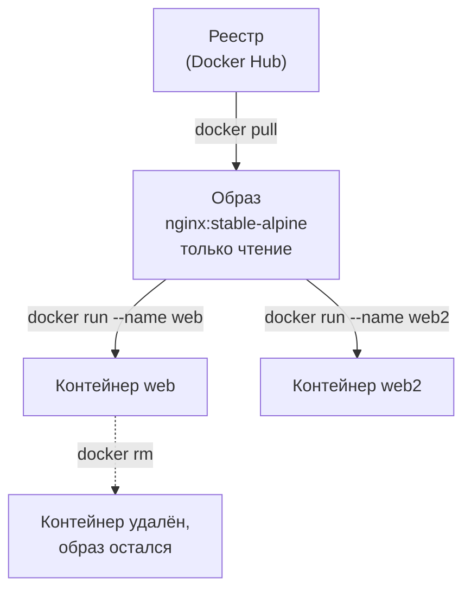
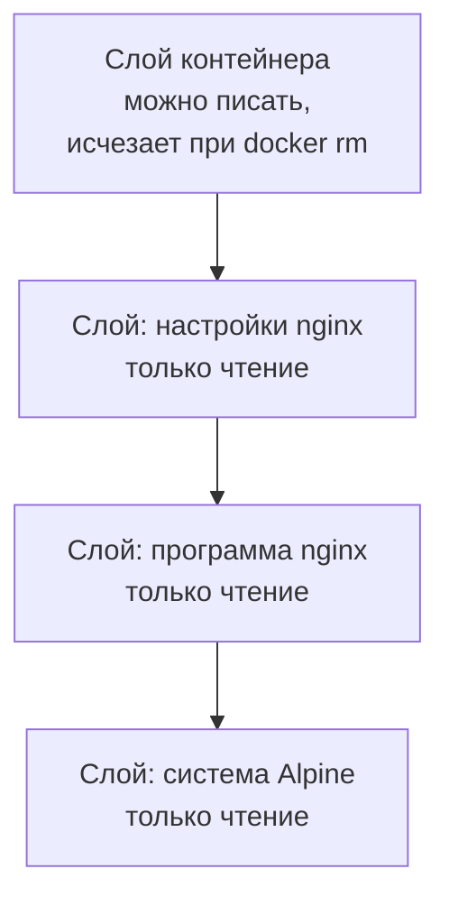
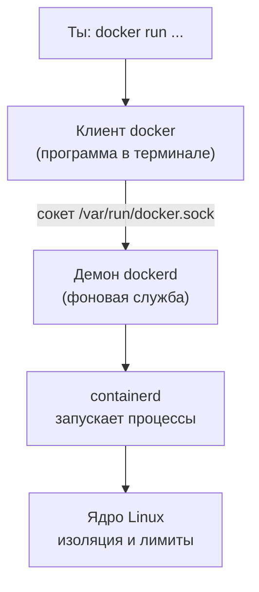
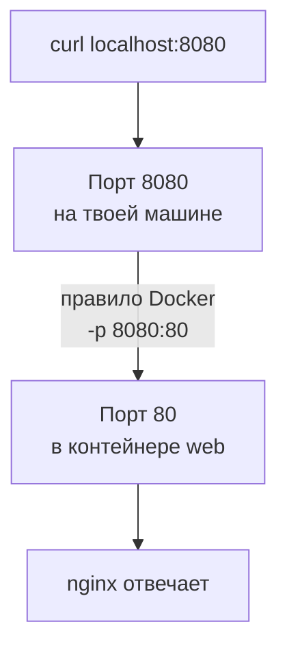

## Зачем это нужно

Я работаю с нагрузкой много лет, и сейчас представь, что я сижу рядом с тобой в твой первый рабочий день. Ты пришёл в команду интернет-магазина. До большой распродажи несколько недель, в прошлом году сайт на ней упал. Тимлид просит: «Заведи свою копию магазина, на которой можно ломать что угодно, не трогая настоящий».

Копия состоит из четырёх программ: сам магазин на Python 3.14, заглушка оплаты, база PostgreSQL 18 и Redis 8. Ставить их «по-старому» значит подобрать Python с полутора десятками библиотек, настроить PostgreSQL и загрузить 200 000 заказов.

Однажды я неделю искал, почему мой тест показывает цифры вдвое лучше, чем у коллеги. Код был одинаковый, а версии базы данных разные: мы сравнивали два разных стенда. С тех пор я не верю цифрам, пока не уверен, что стенд одинаковый.

Эту проблему решает **Docker**: каждую программу упаковывают со всем нужным в готовый «ящик» (его называют **контейнером**). Он одинаково запускается везде, где есть Docker. Для тебя это три выгоды. Стенд поднимается и стирается одной командой. Версии записаны в файле. Контейнеру можно выдать ровно столько процессора и памяти, сколько нужно тесту ([урок 5.4](04-limits-stats.md)).

Шаг проекта: в [уроке 2.1](../02-web/01-client-server-http.md) ты поднимал стенд по рецепту: `docker compose up -d --build --wait` (Compose запускает несколько контейнеров по одному файлу, это [урок 5.3](03-compose-shop.md)). Тогда команды были «магическими». Здесь ты разберёшь их на простых контейнерах (nginx и PostgreSQL): состояние, логи, порты, данные. В уроке 5.3 всё это окажется внутри `compose.yaml` «Магазина».

## Что нужно знать

- Терминал, команды и права: [урок 1.1](../01-linux/01-workstation-terminal.md). Процессы и `ps`: [урок 1.3](../01-linux/03-processes-resources.md).
- Порт, `localhost` и `curl`: [урок 1.4](../01-linux/04-network-cli.md).
- Стенд «Магазин», поднятый в [уроке 2.1](../02-web/01-client-server-http.md). Docker уже установлен, заново ставить не нужно. Если стенд сейчас работает, пусть работает: в этом уроке мы используем другие порты (8080, 8081) и не мешаем ему.
- Хочешь глубже про устройство контейнеров и Docker с нуля: [урок DevOps «Контейнеры и Docker»](https://distinguished-sre.github.io/devops/05-docker/01-containers.html). Для этого курса достаточно того, что написано здесь.

## Картина целиком

Порту не важно, что внутри грузового контейнера: мебель или бананы. Стандартный ящик ставят на любой корабль и любой грузовик, и груз доезжает в том же виде. Программные контейнеры работают так же.

Готовую упаковку программы называют **образом** (image): в нём файлы программы, библиотеки и настройки, всё для запуска. Образ только читается и не меняется, как установочный диск. Когда образ запускают, получается **контейнер** (container): живая копия в своей изолированной «комнате». Из одного образа выходит много контейнеров, как много кексов из одной формы.

Образы лежат на «складе» в интернете, его называют **реестром** (registry). Самый известный зовётся Docker Hub. Команда `docker pull` берёт образ со склада, а `docker run` запускает из него контейнер.



Что здесь видно: образ один, контейнеров из него сколько угодно, а удаление контейнера образ не трогает. Скачать образ можно один раз и запускать потом сколько хочешь.

## Теория

### Контейнер и виртуальная машина

В [уроке 2.1](../02-web/01-client-server-http.md) стенд из четырёх программ поднялся одной командой. Но сам контейнер стартует за секунды: почему?

Раньше программу ставили прямо на сервер. Две программы требовали разные версии одной библиотеки и ссорились, а «у меня работает» значило «на сервере не знаю». Первое решение называется **виртуальная машина** (VM): целый «компьютер внутри компьютера» со своей операционной системой. Надёжно, но тяжело: гигабайты и запуск минутами.

Виртуальная машина похожа на отдельный дом для каждого жильца. Контейнер похож на квартиру в общем доме: у каждого свои комнаты и замок, а фундамент и трубы общие. Но стены между квартирами тоньше, ведь **ядро** (главная часть операционной системы, [урок 1.1](../01-linux/01-workstation-terminal.md)) одно на всех.

Контейнер это обычный процесс Linux, которому ядро показывает урезанный мир. Первый, **namespaces** («пространства имён»), даёт ему свой список процессов (он сам себе номер 1), свой сетевой адрес и файловую систему из образа. Второй, **cgroups** (control groups), ограничивает процессор, память и диск: в «Магазине» у `shop` лимит одно ядро и 512 МБ ([урок 5.4](04-limits-stats.md)).

Второй операционной системы нет, внутри работает то же ядро. Поэтому контейнер стартует за доли секунды, весит десятки мегабайт, а десять почти не тяжелее одного. В практике ты найдёшь процесс nginx из контейнера на **своей** машине через `ps`: внутри у него номер 1, на хосте другой.

> **Прикинь сам:** контейнер с PostgreSQL занимает 40 МБ памяти, а виртуальная машина с той же базой около 1 ГБ. Куда делись остальные 960 МБ?
{: .predict}

В виртуальную машину входит целая операционная система с ядром и службами, и они занимают память независимо от базы. В контейнере ядро общее с хостом, внутри лежат только процесс PostgreSQL и его библиотеки.

Осторожно: контейнер Linux не запустит программу для Windows, ядро-то общее. На Windows и macOS программа Docker Desktop прячет внутри виртуальную машину с Linux, и цифры нагрузки там иные ([урок 5.4](04-limits-stats.md)). В курсе мы на Ubuntu (прямо или через WSL2).

> **Главное:** контейнер это обычный процесс на общем ядре со своей «комнатой» (namespaces) и потолком ресурсов (cgroups): быстрый и лёгкий, но изолирован слабее VM.
{: .key}

Контейнер лёгкий. А из чего собран образ, по которому он запускается?

### Образ и слои

Десять образов на основе Python, и в каждом свои 120 МБ одного и того же?

Образ строят из **слоёв** (layers): каждый слой это набор изменений файлов поверх предыдущего. Как стопка плёнок на проекторе: нижняя рисует фон, следующая надпись, а ты видишь сумму. Одинаковые слои хранятся и скачиваются один раз.

Слои образа **только для чтения**, у каждого есть имя-отпечаток, хэш (строка вида `sha256:3a2f...`). Когда ты запускаешь контейнер, Docker кладёт поверх стопки тонкий **слой контейнера**, и только в него программа может писать. Контейнер удаляют, и верхний слой исчезает вместе с ним.



Что здесь видно: три нижних слоя общие для всех контейнеров из образа, верхний у каждого свой.

Слои реального образа показывает `docker history nginx:stable-alpine` (читай снизу вверх): внизу минимальная система Alpine Linux (8 МБ), выше nginx (9 МБ), выше строки настроек без размера. В [уроке 5.2](02-dockerfile.md) увидишь, как такая стопка получается из `Dockerfile` «Магазина».

Образы называют `имя:тег`. **Тег** (tag) это метка версии: `postgres:18.6` значит «PostgreSQL версии 18.6». Не указал тег? Docker подставит `latest`. Это не «самая свежая версия», а просто имя: через месяц под ним будет другая версия, и результаты теста нельзя будет сравнить. Поэтому в `compose.yaml` «Магазина» версии записаны жёстко: `postgres:18.6`, `redis:8.10.2`, `python:3.14.8-slim`.

> **Прикинь сам:** в контейнере из образа `nginx:stable-alpine` ты создал файл `/tmp/a.txt`. Увидит ли его другой контейнер из того же образа?
{: .predict}

Нет. Файл записан в верхний слой первого контейнера, а у нового будет свой пустой верхний слой.

Осторожно: образ и контейнер путают. Образ не «запущен», он лежит и не меняется. Контейнер не «скачан», он создан из образа.

> **Главное:** образ это стопка слоёв только для чтения, контейнер добавляет сверху свой слой для записи, а тег фиксирует версию.
{: .key}

Образ нужно откуда-то взять. Откуда, если ты не говорил Docker адрес?

### Реестр, имена образов и `docker pull`

Ты пишешь `docker run postgres:18.6` и не указываешь, где образ лежит. Docker всё равно находит: он идёт в реестр, на сервер, где образы хранятся под именами и версиями.

Полное имя состоит из адреса реестра, пути и тега: `ghcr.io/google/cadvisor:v0.60.6`. Адрес опущен? Подразумевается Docker Hub (`docker.io`). Опущен и владелец? Подразумевается `library/` (официальные образы). Поэтому `postgres:18.6` из `compose.yaml` «Магазина» на деле `docker.io/library/postgres:18.6`, а `prom/prometheus:v3.15.0` это образ организации `prom` с того же Docker Hub. Адрес `ghcr.io` указан явно, потому что cadvisor лежит на другом реестре (GitHub Container Registry).

Тег можно переназначить, а **digest** (хэш вида `postgres@sha256:...`) нельзя: это точный адрес одной сборки.

```bash
docker pull nginx:stable-alpine
```

```text
stable-alpine: Pulling from library/nginx
c3b1d1c9b4a2: Pull complete
8f4c0e5a7d3b: Pull complete
5d2b4a6c9e1f: Pull complete
Digest: sha256:9f8e...c41d
Status: Downloaded newer image for nginx:stable-alpine
docker.io/library/nginx:stable-alpine
```

Каждая строка `Pull complete` это один скачанный слой, `Digest` отпечаток всего образа. При повторе будет `Already exists`: докачивать нечего.

Осторожно: чужие образы с неизвестных источников не запускай, у них права обычной программы.

> **Главное:** имя образа это адрес склада, владелец, название и тег. Что опущено, Docker подставляет сам: Docker Hub и `library/`.
{: .key}

Образ скачан. Кто его запускает, когда ты вводишь `docker run`?

### Клиент, демон и группа `docker`

Ты вводишь `docker ps` без `sudo`, и всё работает. Странно: запуск контейнера это работа с ядром, а она требует прав администратора.

Команда `docker` сама ничего не запускает. Это клиент, который отправляет просьбу фоновой службе, **демону** (`dockerd`), и у демона нужные права есть. Просьба идёт через **сокет** (специальный файл `/var/run/docker.sock`, через который программы на одной машине говорят друг с другом).



Что здесь видно: между тобой и ядром три звена (`containerd` это служба, которая запускает процессы по просьбе демона). Без демона или доступа к сокету любая команда падает.

Доступ к сокету есть у `root` и у **группы** `docker` (группа это список пользователей, которым система выдала общее право). В [уроке 2.1](../02-web/01-client-server-http.md) ты добавил себя в неё командой `sudo usermod -aG docker $USER` (`-aG` значит «добавить в группу»). Группа вступает в силу в **новой сессии**: открой терминал заново. Следствие важное: право запускать контейнеры равно правам администратора, ведь контейнер можно запустить так, что он подключит весь твой диск. На общем сервере в группу берут только доверенных людей.

> **Прикинь сам:** `docker ps` выдаёт `permission denied while trying to connect to the Docker daemon socket`. Работает ли демон?
{: .predict}

Скорее всего да: клиент дошёл до сокета, но прав на него нет. Будь демон выключен, текст был бы другим: `Cannot connect to the Docker daemon ... Is the docker daemon running?`. Лечение: группа `docker` и новая сессия.

Осторожно: `docker` управляет отдельными контейнерами, а `docker compose` запускает группу по описанию в файле.

> **Главное:** `docker` это клиент, работу делает демон через сокет. Право на сокет даёт группа `docker`, и оно равно правам администратора.
{: .key}

Доступ есть. Теперь посмотрим, как контейнер живёт: когда работает, когда спит и когда исчезает.

### Жизненный цикл контейнера

Ты остановил контейнер, а место на диске всё равно занято. Остановить и удалить не одно и то же, и на этом новички спотыкаются первыми.

Контейнер похож на рабочего: «работает» (running), «на перерыве» (exited: место и инструменты на месте), «уволен» (removed: место убрано, вещи пропали). Он живёт, пока работает его **главный процесс**, тот, что запущен командой старта и имеет номер 1. Закончился процесс, закончился и контейнер. Поэтому `docker run ubuntu` сразу завершается: оболочка запустилась, не получила ввода и вышла.

`docker run` скачивает образ (если его нет), создаёт контейнер и запускает. `docker ps` показывает работающие контейнеры, с `-a` ещё и остановленные. `docker logs web` выводит всё, что процесс написал на экран (`-f` следит за новыми строками). `docker exec web команда` запускает ещё один процесс **внутри** контейнера, а `-it` даёт интерактивный терминал.

`docker kill` сразу шлёт SIGKILL, без просьбы. Остановка `docker stop` идёт в два шага. `docker stop web` вежливо просит процесс завершиться (сигнал SIGTERM, сигналы в [уроке 1.3](../01-linux/03-processes-resources.md)), а не вышел за 10 секунд, так убивает (SIGKILL). `docker start web` запускает остановленный контейнер снова с тем же верхним слоем, `docker restart` делает stop и start подряд. Только `docker rm web` удаляет контейнер вместе со слоем (`-f` останавливает и удаляет).

**Код выхода** (exit code) показывает, как закончился процесс: `0` нормально, `1` и выше ошибка. Код `143` значит «прервал сигнал SIGTERM», `137` «убил SIGKILL»: к номеру сигнала (15 и 9) прибавлено 128. Код 137 встретится в [уроке 5.4](04-limits-stats.md): так убивает нехватка памяти.

В виджете ниже на примере контейнера `web` видно, где что живёт.

<div class="viz" data-viz="dk-lifecycle" data-image="nginx:stable-alpine" data-name="web" data-volume="1"></div>

Что здесь видно: файл в `/tmp` лежит в слое контейнера, переживает `docker stop` и `docker start`, но исчезает на `docker rm`. Файл в `/data` лежит в томе, и `docker rm` его не трогает.

Так выглядит `docker ps -a` после экспериментов:

```text
CONTAINER ID   IMAGE                 COMMAND                  CREATED          STATUS                      PORTS                                     NAMES
3f9a1c7e2b40   nginx:stable-alpine   "/docker-entrypoint.…"   5 minutes ago    Up 5 minutes                0.0.0.0:8080->80/tcp, [::]:8080->80/tcp   web
b6d0a4e91c77   postgres:18.6         "docker-entrypoint.s…"   2 hours ago      Exited (0) 2 hours ago                                                pgtest
e0a3f5b27d19   hello-world           "/hello"                 3 days ago       Exited (0) 3 days ago                                                 sharp_morse
```

В `STATUS` `Up` работает, `Exited (0)` завершился нормально. Без `--name` Docker придумывает имя вроде `sharp_morse`.

> **Прикинь сам:** ты сделал `docker stop web`, потом `docker run --name web nginx:stable-alpine` и получил ошибку про имя. Почему?
{: .predict}

Остановленный контейнер всё ещё существует и занимает имя `web`. Запусти его снова (`docker start web`) или удали (`docker rm web`) и создай новый.

Осторожно: остановленные контейнеры копятся, смотри `docker ps -a`. А `docker logs` показывает только вывод на экран, поэтому «Магазин» пишет логи в stdout (JSON-строками), а не в файл.

> **Главное:** контейнер живёт, пока работает главный процесс. `stop` останавливает, `rm` удаляет вместе со слоем для записи, код выхода говорит, как всё закончилось.
{: .key}

Контейнер работает, но снаружи его не видно. Как в него попасть?

### Порты: как попасть в контейнер снаружи

Ты запустил nginx, открыл `localhost`, а там пусто. Сервис работает, браузер стучится не туда.

У контейнера своя изолированная сеть: свой адрес (обычно вида `172.17.0.2`) и свои порты. Порт 80 внутри контейнера и порт 80 твоей машины это разные порты. Нужно **опубликовать порт** (publish): сказать Docker «всё, что придёт на порт X моей машины, передай на порт Y контейнера». Как в многоквартирном доме: у дома один адрес, а вахтёр знает «к 8080? это квартира web, комната 80».

Для этого флаг `-p хост:контейнер`: **первое число порт на твоей машине, второе порт внутри контейнера**. Запомни порядок «снаружи:внутри». В `compose.yaml` «Магазина» стоит `ports: ["8000:8000"]`.



Что здесь видно: правило Docker стоит между двумя портами. Нет флага `-p`, нет и правила, и порт 80 снаружи недоступен.

По умолчанию порт доступен всем в твоей сети (в `docker ps` это `0.0.0.0:8080`). Чтобы закрыть его от других, пиши `-p 127.0.0.1:8080:80`: хорошая привычка в кафе и коворкинге. Порты контейнера покажет `docker port web`.

> **Прикинь сам:** контейнер запущен с `-p 9000:8000`. По какому адресу открыть его сервис в браузере на твоей машине?
{: .predict}

`http://localhost:9000`. Первое число, 9000, это порт хоста, а порт 8000 внутренний, снаружи недоступен.

Осторожно: `EXPOSE` в Dockerfile ([урок 5.2](02-dockerfile.md)) порт не публикует, это лишь запись в образе «программа слушает 8000», как комментарий. Публикует только `-p` (или `ports:` в Compose). И если программа слушает только `127.0.0.1` (свою «локалку» внутри контейнера), опубликованный порт не сработает: слушать нужно `0.0.0.0`. Поэтому в `entrypoint.sh` «Магазина» стоит `--host 0.0.0.0`.

> **Главное:** `-p СНАРУЖИ:ВНУТРИ` соединяет порт твоей машины с портом контейнера. Без этого флага снаружи в контейнер не попасть.
{: .key}

Войти научились. А если в контейнере данные, которые жалко потерять вместе с ним?

### Тома: данные, которые переживают контейнер

Всё, что программа пишет в слой контейнера, пропадает при `docker rm`. Для nginx это не страшно, для базы с заказами катастрофа.

Данные нужно хранить **вне** контейнера, как на флешке: компьютер выбросил, а данные остались. Подключают флагом `-v источник:путь_в_контейнере`, двумя способами.

Первый: **именованный том** (named volume), например `-v pgtest-data:/var/lib/postgresql`. Источник это просто имя, Docker сам создаёт каталог на диске **хоста** (твоей машины) и управляет им. Второй: **подключённая папка** (bind mount), например `-v /home/student/site:/usr/share/nginx/html:ro`. Источник это абсолютный путь к папке на твоей машине, и вы с контейнером видите **одни и те же файлы**. Суффикс `:ro` (read-only) запрещает контейнеру их менять. Различие: слева имя или путь с `/`. Под данные PostgreSQL 18 внутри лежит подкаталог `/var/lib/postgresql/18/docker`, поэтому том монтируют на уровень выше. Список томов покажет `docker volume ls`, удалит `docker volume rm имя` (только если его не использует ни один контейнер).

В `compose.yaml` «Магазина» есть оба вида. Именованный `pgdata:/var/lib/postgresql` хранит данные PostgreSQL между перезапусками. Подключённая папка `./db/init:/docker-entrypoint-initdb.d:ro` отдаёт базе SQL-файлы, которые создают таблицы и 200 000 заказов.

```text
Запуск A: docker run -d --name pgA -e POSTGRES_PASSWORD=test postgres:18.6
          создал таблицу -> docker rm -f pgA -> таблицы нет, данные стёрты
Запуск B: docker run -d --name pgB -e POSTGRES_PASSWORD=test -v pgtest-data:/var/lib/postgresql postgres:18.6
          создал таблицу -> docker rm -f pgB -> новый pgB с тем же томом: таблица на месте
```

В запуске A всё записано в слой контейнера, которого после `rm` нет. В запуске B данные попали в том, и он остался.

> **Прикинь сам:** ты запустил базу без `-v`, загрузил данные, сделал `docker stop` и `docker start`. Данные на месте? А если вместо `stop` был `rm`?
{: .predict}

После `stop` и `start` на месте: слой контейнера цел. После `rm` нет, потому что тома не было. Базе том нужен всегда.

Осторожно: `docker compose down` не удаляет тома, а `docker compose down -v` удаляет ([урок 5.3](03-compose-shop.md)). Файлы, созданные контейнером в подключённой папке, могут принадлежать другому пользователю (например, `root`), и права придётся менять.

> **Главное:** что должно пережить контейнер, лежит в томе (базы) или в подключённой папке (конфиги и файлы). Остальное исчезнет вместе со слоем контейнера.
{: .key}

Осталось понять, как один образ работает у разных людей с разными паролями.

### Переменные окружения: настройка контейнера при запуске

Образ базы один на всех, а пароли разные.

Поэтому настройки передают при запуске **переменными окружения** (environment variables: именованные значения, которые получает любая программа, `PATH` из [урока 1.1](../01-linux/01-workstation-terminal.md) это тоже она). Флаг `-e ИМЯ=значение` кладёт переменную в контейнер. Образ PostgreSQL при первом старте читает `POSTGRES_PASSWORD`, `POSTGRES_USER` и `POSTGRES_DB` и по ним создаёт пользователя и базу. «Магазин» так же читает `DATABASE_URL`, `DB_POOL_MAX`, `BCRYPT_ROUNDS` и другие, это в [уроке 5.3](03-compose-shop.md).

> **Прикинь сам:** в томе уже лежит база. Ты запускаешь новый контейнер с тем же томом и другим `POSTGRES_PASSWORD`. Какой пароль будет у базы?
{: .predict}

Старый. Переменные читаются при первом запуске образа базы, а раз том уже содержит базу, `POSTGRES_PASSWORD` игнорируется.

> **Главное:** `-e` настраивает программу при запуске без пересборки образа. Пароль базы применяется один раз, при создании.
{: .key}

Вернёмся к тимлиду. Для копии магазина у тебя теперь есть всё: образы, порты, тома, переменные. В практике отработаешь каждый приём, а в уроке 5.3 один файл сведёт их воедино.

## Практика

Все файлы урока складывай в `~/perf-lab/05-docker/`. Нагрузку на чужие сайты не создаём; здесь её нет вовсе. Начнём с каталога:

```bash
mkdir -p ~/perf-lab/05-docker && cd ~/perf-lab/05-docker
```

### 1. Проверь, что Docker жив

```bash
docker version --format 'клиент {{.Client.Version}}, сервер {{.Server.Version}}'
```

Здесь `docker version` печатает версии клиента и демона, а `--format` задаёт шаблон вывода: в двойных скобках имя поля. Если выведены оба номера, клиент достучался до демона.

```text
клиент 29.0.2, сервер 29.0.2
```

Теперь традиционный первый запуск:

```bash
docker run --rm hello-world
```

Разбор: `run` создаёт и запускает контейнер из образа `hello-world`; `--rm` (remove) удалит контейнер сразу после завершения, чтобы не копились остановленные.

```text
Unable to find image 'hello-world:latest' locally
latest: Pulling from library/hello-world
17eec7bbc9d7: Pull complete
Digest: sha256:...
Status: Downloaded newer image for hello-world:latest

Hello from Docker!
This message shows that your installation appears to be working correctly.
...
```

**Как читать вывод:** первая строка говорит, что образа нет локально, и Docker скачал его с Docker Hub (`Pulling`, `Pull complete`). Затем сам контейнер напечатал приветствие и завершился. Повтори команду: строк про скачивание не будет, потому что образ уже на диске.

**Типичные ошибки:**

- `permission denied while trying to connect to the Docker daemon socket at unix:///var/run/docker.sock` значит, что твой пользователь не в группе `docker` или сессия старая. Проверь `groups` (там должно быть слово `docker`), закрой терминал и открой заново. Если группы нет: `sudo usermod -aG docker $USER`, затем новая сессия.
- `Cannot connect to the Docker daemon at unix:///var/run/docker.sock. Is the docker daemon running?` значит, что демон не запущен. Проверь `systemctl status docker` и при необходимости `sudo systemctl start docker`.

### 2. Запусти nginx и открой его в браузере

```bash
docker run -d --name web -p 8080:80 nginx:stable-alpine
```

Разбор каждой части: `-d` (detach) запустить в фоне и вернуть терминал, иначе nginx займёт его; `--name web` своё имя; `-p 8080:80` порт 8080 хоста направить на порт 80 контейнера; `nginx:stable-alpine` образ (nginx на минимальной системе Alpine).

```text
3f9a1c7e2b40d8e1a65f0b9c4d27e3a18f6b5c9d0e2a47b13c8d5f6e9a0b1c2d
```

Команда напечатала длинный идентификатор нового контейнера. Теперь проверь:

```bash
docker ps
curl -s localhost:8080 | head -4
```

```text
CONTAINER ID   IMAGE                 COMMAND                  CREATED         STATUS         PORTS                                     NAMES
3f9a1c7e2b40   nginx:stable-alpine   "/docker-entrypoint.…"   9 seconds ago   Up 8 seconds   0.0.0.0:8080->80/tcp, [::]:8080->80/tcp   web
<!DOCTYPE html>
<html>
<head>
<title>Welcome to nginx!</title>
```

**Как читать вывод:** в `docker ps` смотри на `STATUS` (`Up`: работает) и `PORTS` (`0.0.0.0:8080->80/tcp` читается слева направо: «с порта 8080 хоста на порт 80 контейнера»). `curl` получил страницу приветствия, значит, цепочка «хост, порт, контейнер, nginx» работает. Открой `http://localhost:8080` и в браузере: увидишь то же самое.

### 3. Прочитай логи и загляни внутрь

```bash
docker logs web
```

```text
/docker-entrypoint.sh: /docker-entrypoint.d/ is not empty, will attempt to perform configuration
/docker-entrypoint.sh: Looking for shell scripts in /docker-entrypoint.d/
/docker-entrypoint.sh: Launching /docker-entrypoint.d/10-listen-on-ipv6-by-default.sh
...
/docker-entrypoint.sh: Configuration complete; ready for start up
172.17.0.1 - - [03/Oct/2026:10:15:32 +0000] "GET / HTTP/1.1" 200 615 "-" "curl/8.5.0" "-"
172.17.0.1 - - [03/Oct/2026:10:15:41 +0000] "GET / HTTP/1.1" 200 615 "Mozilla/5.0 ..." "-"
```

**Как читать вывод:** сначала скрипт запуска образа готовит настройки, потом идут строки журнала запросов nginx: адрес клиента (`172.17.0.1`: это твоя машина глазами контейнера), время, запрос, код ответа `200`, размер ответа `615` байт и программа клиента (`curl`, браузер). Это тот самый «лог доступа», который в [теме 7](../07-observability/index.md) будет читать Loki.

Следить за новыми строками: `docker logs -f web`, а в соседнем терминале выполняй `curl localhost:8080`; выход `Ctrl+C` (контейнер при этом продолжает работать, прерывается только чтение). Теперь войди внутрь:

```bash
docker exec -it web sh
```

Разбор: `exec` запускает команду в работающем контейнере; `-i` держит ввод открытым, `-t` даёт терминал; `sh` это оболочка (в Alpine нет `bash`). Приглашение изменится: ты внутри.

```text
/ # hostname
3f9a1c7e2b40
/ # ls /usr/share/nginx/html
50x.html    index.html
/ # ps
PID   USER     TIME  COMMAND
    1 root      0:00 nginx: master process nginx -g daemon off;
   29 nginx     0:00 nginx: worker process
   30 nginx     0:00 nginx: worker process
   31 nginx     0:00 nginx: worker process
   32 nginx     0:00 nginx: worker process
   45 root      0:00 sh
   52 root      0:00 ps
/ # exit
```

**Как читать вывод:** имя машины внутри контейнера равно его короткому ID. Главный процесс nginx имеет **PID 1** (так и должно быть, это его «личная» нумерация), рядом четыре рабочих процесса. Каталог `/usr/share/nginx/html` это то, что отдаётся по адресу `/`. Теперь на **хосте** (после `exit` ты снова на своей машине):

```bash
ps -eo pid,user,args | grep "[n]ginx: master"
```

```text
 48213 root     nginx: master process nginx -g daemon off;
```

Квадратные скобки в `[n]ginx` хитрость: так `grep` не находит сам себя. Это тот же процесс, но с номером 48213, а не 1. Контейнер это обычный процесс твоей машины в «комнате» с отдельной нумерацией.

### 4. Подключи свою папку

Создай свою страницу и подключи папку вместо стандартной:

```bash
mkdir -p ~/perf-lab/05-docker/site
echo '<h1>Привет из контейнера</h1>' > ~/perf-lab/05-docker/site/index.html
docker run -d --name web2 -p 8081:80 \
  -v ~/perf-lab/05-docker/site:/usr/share/nginx/html:ro nginx:stable-alpine
curl -s localhost:8081
```

Разбор: `\` в конце строки продолжает команду на следующей; `-v папка:путь:ro` подключает папку только для чтения. Тильда `~` раскрывается оболочкой до абсолютного пути ещё до запуска Docker, а ему нужен именно абсолютный.

```text
<h1>Привет из контейнера</h1>
```

Теперь измени файл без перезапуска контейнера:

```bash
echo '<h1>Страница изменена</h1>' > ~/perf-lab/05-docker/site/index.html
curl -s localhost:8081
docker exec web2 touch /usr/share/nginx/html/x.html
```

```text
<h1>Страница изменена</h1>
touch: /usr/share/nginx/html/x.html: Read-only file system
```

**Как читать вывод:** контейнер увидел новое содержимое сразу: он смотрит в ту же папку, что и ты. А попытка контейнера записать файл не удалась из-за `:ro`.

**Типичная ошибка:** если вместо абсолютного пути написать относительный (`-v site:/usr/share/nginx/html`), Docker решит, что `site` это **имя тома**, создаст новый том и подключит его: ты увидишь стандартную страницу nginx, а правки в папке `site` на неё не влияют. Правило: путь на хосте начинается с `/` или `~`.

### 5. База данных и том

```bash
docker run -d --name pgtest -e POSTGRES_PASSWORD=test \
  -v pgtest-data:/var/lib/postgresql postgres:18.6
sleep 8
docker logs pgtest 2>&1 | tail -3
```

Разбор: `-e POSTGRES_PASSWORD=test` обязательный пароль администратора; `-v pgtest-data:/var/lib/postgresql` именованный том (имя без слэша: Docker создаст его сам). `sleep 8` даёт базе время на первичную инициализацию (без паузы следующие команды застанут её неготовой); `2>&1` и `| tail -3` склеивают потоки и оставляют три последние строки (конвейеры, [урок 1.2](../01-linux/02-text-logs.md)).

```text
2026-10-03 10:21:44.512 UTC [1] LOG:  database system is ready to accept connections
```

(строк перед этой будет несколько, на экране увидишь три последние, главная это «ready to accept connections»). Создай таблицу и данные:

```bash
docker exec pgtest psql -U postgres -c "CREATE TABLE notes (id int, txt text);"
docker exec pgtest psql -U postgres -c "INSERT INTO notes VALUES (1, 'данные в томе');"
docker exec pgtest psql -U postgres -c "SELECT * FROM notes;"
```

```text
CREATE TABLE
INSERT 0 1
 id |      txt
----+---------------
  1 | данные в томе
(1 row)
```

`psql` это консольный клиент PostgreSQL (язык запросов SQL подробно в [уроке 2.4](../02-web/04-sql-basics.md)), `-U postgres` пользователь. Теперь **удали контейнер** целиком и запусти новый с тем же томом:

```bash
docker rm -f pgtest
docker run -d --name pgtest -e POSTGRES_PASSWORD=test \
  -v pgtest-data:/var/lib/postgresql postgres:18.6
sleep 5
docker exec pgtest psql -U postgres -c "SELECT * FROM notes;"
```

```text
 id |      txt
----+---------------
  1 | данные в томе
(1 row)
```

**Как читать вывод:** контейнера, в котором ты создавал таблицу, больше нет, а данные остались. Они в томе. Посмотри на сам том:

```bash
docker volume ls
docker volume inspect pgtest-data --format '{{.Mountpoint}}'
```

```text
DRIVER    VOLUME NAME
local     pgtest-data
/var/lib/docker/volumes/pgtest-data/_data
```

В `Mountpoint` лежит путь на диске хоста, где физически хранятся файлы (читать их без `sudo` не получится, и руками менять не нужно).

**Типичные ошибки:** без `-e POSTGRES_PASSWORD` контейнер сразу завершится. Причина в `docker logs`: `Error: Database is uninitialized and superuser password is not specified.` Решение: добавить `-e POSTGRES_PASSWORD=...`. А если запустить базу на хостовом порту 5432 при работающем стенде (`-p 5432:5432`), получишь конфликт порта: ниже, в разделе про ошибки.

> Команда `docker run` упала с ошибкой, которой нет в «Типичных ошибках»? Скопируй команду и весь вывод, спроси нейросеть, что значит каждая строка ошибки. Ответ проверь по `docker logs ИМЯ` и `docker ps -a`: причину должны подтвердить они, а не догадка.
{: .ai}

### 6. Убери за собой

```bash
docker rm -f web web2 pgtest
docker volume rm pgtest-data
docker ps -a
```

```text
web
web2
pgtest
pgtest-data
CONTAINER ID   IMAGE     COMMAND   CREATED   STATUS    PORTS     NAMES
```

(`docker ps -a` может ещё показать контейнеры стенда, если он поднят: не удаляй их, они твои с урока 2.1.) Остановленные контейнеры и забытые тома незаметно занимают место на диске. Быстрая уборка: `docker container prune` удаляет все остановленные контейнеры, `docker image prune` образы без тегов. Не запускай `docker system prune -a --volumes`, пока не понял, что он сотрёт: **все** неиспользуемые образы и тома, включая данные стенда.

### 7. Запиши шпаргалку и сделай коммит

Положи в `~/perf-lab/05-docker/notes.md` команды, которые хочешь помнить, например:

```bash
cat > ~/perf-lab/05-docker/notes.md <<'EOF'
# Docker: шпаргалка

- запустить в фоне: docker run -d --name ИМЯ -p ХОСТ:КОНТЕЙНЕР образ:тег
- состояние: docker ps / docker ps -a
- логи: docker logs -f ИМЯ
- внутрь: docker exec -it ИМЯ sh
- остановить и удалить: docker stop ИМЯ && docker rm ИМЯ
- данные: -v имя:/путь (том) или -v /абсолютный/путь:/путь:ro (папка)
- порядок в -p: СНАРУЖИ:ВНУТРИ
EOF
cd ~/perf-lab
git add 05-docker
git commit -m "Docker: шпаргалка и страница для nginx (урок 5.1)"
git push
```

Команда `git push` отправляет коммит на GitHub (как в [уроке 3.2](../03-git/02-github.md)). Если `git push` просит ввести имя и пароль, значит, ты не настроил вход: вернись к уроку 3.2.

## Типичные ошибки при запуске контейнеров

| Текст ошибки | Причина | Что делать |
|---|---|---|
| `Bind for 0.0.0.0:8080 failed: port is already allocated` (в новых версиях `failed to bind host port ... address already in use`) | порт хоста уже занят другим контейнером или программой | `docker ps` покажет, кто держит порт; выбери другой (`-p 8082:80`) или останови занявшего (`sudo ss -ltnp \| grep 8080`, [урок 1.4](../01-linux/04-network-cli.md)) |
| `Conflict. The container name "/web" is already in use by container "3f9a..."` | контейнер с таким именем есть (даже остановленный) | `docker rm web` или другое имя |
| `pull access denied for ngnix, repository does not exist or may require 'docker login'` | опечатка в имени образа | проверь написание: `nginx` |
| `manifest for nginx:1.99 not found: manifest unknown` | нет такого тега | найди тег на странице образа на Docker Hub |
| контейнер сразу `Exited (1)` | процесс упал при старте | `docker logs ИМЯ`, причина всегда там |
| `Error response from daemon: No such container: web` | нет контейнера с таким именем | `docker ps -a`, проверь имя |

## Сломай и почини

**Поломка.** Запусти nginx без публикации порта и попробуй достучаться:

```bash
docker run -d --name web3 nginx:stable-alpine
curl -s -m 3 localhost:8082 ; echo "код curl: $?"
```

```text
код curl: 7
```

Код 7 у `curl` означает «не удалось подключиться». Ни `-p`, ни `8082` в команде запуска нет. Задача: докажи, что nginx внутри **работает**, найди причину, исправь. Порядок: что покажет `docker ps`, `docker logs`, и как проверить сервис изнутри.

> Сначала пройди алгоритм: `docker ps`, `docker logs`, проверка изнутри через `exec`. Только потом спроси нейросеть и сверь свою гипотезу с её ответом, а не наоборот.
{: .ai}

<details markdown="1">
<summary>Разбор</summary>

`docker ps` покажет `STATUS Up`, а в колонке `PORTS` будет просто `80/tcp` без стрелки `->`: порт 80 открыт только внутри контейнера, снаружи правила нет. `docker logs web3` чист от ошибок, nginx запущен. Проверь изнутри:

```bash
docker exec web3 wget -qO- http://localhost | head -4
```

Страница приветствия возвращается: сервис исправен, проблема только в пробросе порта. Порты **нельзя** добавить к уже созданному контейнеру, его нужно пересоздать:

```bash
docker rm -f web3
docker run -d --name web3 -p 8082:80 nginx:stable-alpine
curl -s -m 3 localhost:8082 | head -2
```

Общий вывод для диагностики: сначала выяснить, жив ли сервис (логи, `exec` изнутри), потом проверить путь до него (`PORTS` в `docker ps`). Не меняй программу, пока не исключил проброс порта. Не забудь убрать: `docker rm -f web3`.

</details>

## ИИ в помощь

Нейросеть хорошо объясняет незнакомые флаги `docker` и разбирает текст ошибки по строкам. Общие правила собраны на странице [ИИ-помощник](../ai.md), здесь они применены к контейнерам.

**Задача:** разобрать длинную команду `docker run`, в которой не понятны флаги.

```text
Я учусь Docker (Docker 29, Ubuntu 24.04). Вот команда:
docker run -d --name db -e POSTGRES_PASSWORD=<пароль-заглушка> -v pgdata:/var/lib/postgresql -p 5433:5432 postgres:18
Объясни простыми словами каждый флаг и каждую часть после двоеточия
в -v и -p. Что произойдёт с данными после docker rm db?
Не меняй команду, только объясни.
```
{: .wrap}

**Проверь ответ:** сверь каждый флаг с `docker run --help` и с тем, что ты видел в практике (порядок «снаружи:внутри» в `-p`, том переживает `docker rm`). Типичная ошибка нейросетей: путают порядок в `-p` или выдумывают флаг, которого нет в `--help`.

**Задача:** понять, почему контейнер сразу завершился.

```text
Контейнер сразу выходит, docker ps его не показывает. Команда:
<вставь команду docker run>
Вывод docker ps -a:
<вставь строку про контейнер>
Вывод docker logs <имя>:
<вставь логи целиком>
Объясни, что значит каждая строка логов, и назови три самые вероятные причины
по убыванию. Для каждой скажи, какой командой её проверить.
```
{: .wrap}

**Проверь ответ:** причину подтверди кодом выхода в `docker ps -a` (`Exited (1)`, `Exited (137)`) и логами. Нейросеть любит предлагать `--privileged` и `docker system prune` как «лекарство от всего»: не запускай их, пока не понял, что они делают.

В `-e` и `.env` бывают пароли: перед отправкой замени значения на `<пароль>`, реальные в чат не вставляй.

## Словарик урока

| Термин | Простыми словами |
|---|---|
| Docker | Программа для запуска приложений в изолированных «ящиках» (контейнерах) |
| Образ (image) | Готовая упаковка программы со всем нужным, только для чтения |
| Контейнер (container) | Запущенная копия образа: обычный процесс в своей изолированной комнате |
| Слой (layer) | Один набор изменений файлов в образе; слои складываются стопкой |
| Слой контейнера | Верхний слой для записи; исчезает при `docker rm` |
| Реестр (registry), Docker Hub | Склад образов в интернете |
| Тег (tag) | Метка версии образа после двоеточия: `postgres:18.6` |
| `latest` | Тег по умолчанию, не гарантирует «самую свежую версию» |
| Digest | Неизменяемый отпечаток образа вида `sha256:...` |
| Демон (`dockerd`) | Фоновая служба, которая запускает контейнеры по просьбам клиента `docker` |
| namespaces и cgroups | Механизмы ядра: изоляция окружения и лимиты ресурсов |
| Публикация порта (`-p`) | Правило «порт на хосте направить на порт контейнера» |
| Том (volume) | Хранилище вне контейнера, которое переживает его удаление |
| Подключённая папка (bind mount) | Папка с твоей машины, видимая внутри контейнера |
| Переменная окружения (`-e`) | Настройка, переданная программе при запуске |
| PID 1 | Главный процесс контейнера; закончится он, закончится и контейнер |
| Код выхода (exit code) | Число, с которым завершился процесс: `0` успех, `137` убит |

## Вопросы с собеседований

Раздел для повторения: ответь вслух, потом открой ответ. Вопросы с пометкой `[на скорость]` нужно уметь отвечать за 30 секунд.



## Проверено на версиях

Ubuntu 24.04 LTS, Docker Engine 29.x с плагинами Compose и Buildx, образы `nginx:stable-alpine`, `postgres:18.6`, `hello-world`. Октябрь 2026. Точные номера слоёв, хэши и время в твоём выводе будут другими: смотри на структуру вывода, а не на цифры.

## Итог урока: ты умеешь

- [ ] Объяснить разницу между образом, контейнером и реестром и между контейнером и виртуальной машиной.
- [ ] Прочитать имя образа `реестр/владелец/имя:тег` и объяснить, почему тег фиксируют.
- [ ] Запустить контейнер (`docker run -d --name ... -p ...`), посмотреть его в `docker ps`, прочитать `docker logs`, зайти `docker exec`.
- [ ] Отличать `stop` от `rm` и знать, что при каждом из них происходит с данными.
- [ ] Опубликовать порт и прочитать колонку `PORTS` и порядок «снаружи:внутри».
- [ ] Сохранить данные в именованном томе и показать, что они переживают `docker rm`.
- [ ] Подключить папку хоста и отличить её от тома.
- [ ] Расшифровать типичные ошибки: `permission denied`, `port is already allocated`, `name is already in use`.

Дальше: [урок 5.2. Dockerfile: как собирается образ «Магазина»](02-dockerfile.md), где ты узнаешь, как появляется образ, который запускал в 2.1.
