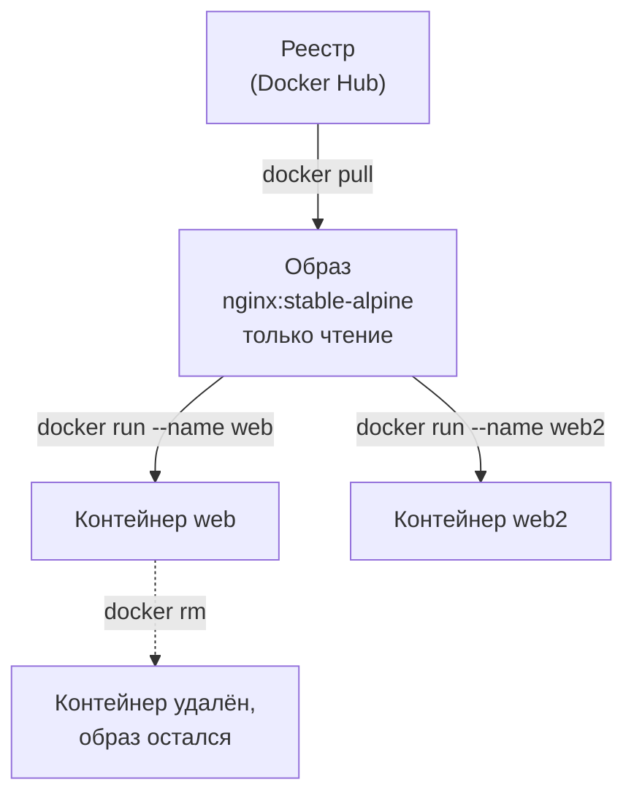
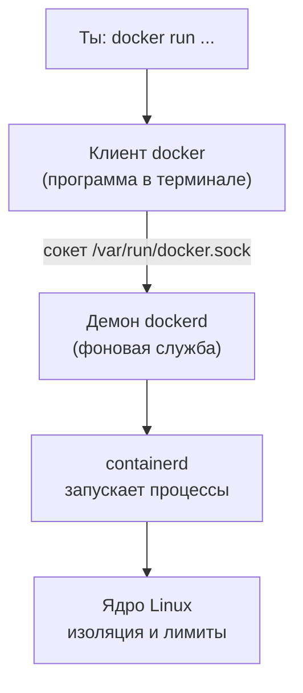
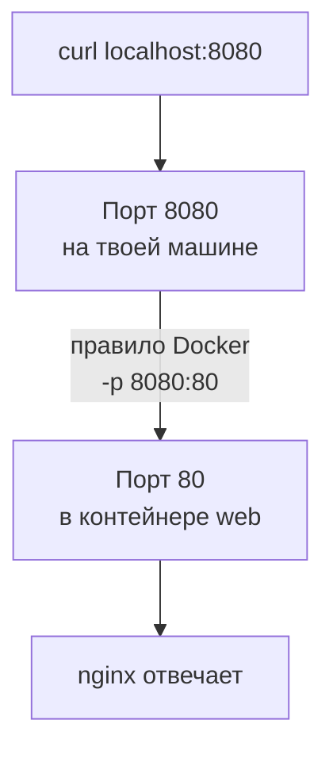

## Зачем это нужно

Учебный «Магазин» состоит из четырёх программ: сам магазин на Python 3.14, заглушка оплаты, база PostgreSQL 18 и Redis 8. Чтобы запустить их «по-старому», пришлось бы поставить на твой Ubuntu нужную версию Python, подобрать к ней девять библиотек, настроить PostgreSQL (с расширением, которое считает самые тяжёлые запросы), загрузить 200 000 заказов, поставить Redis и всё это согласовать между собой. У коллеги на другой версии системы всё пошло бы иначе, а результаты нагрузочных тестов нельзя сравнивать, если стенды разные.

**Docker** решает эту проблему: каждую программу упаковывают вместе со всем, что ей нужно, в один готовый «ящик», который одинаково запускается на любой машине с Docker. Для нагрузочного тестировщика это ещё и три практических плюса. Стенд поднимается одной командой и так же стирается. Версии программ записаны в файле, а не в голове. И контейнеру можно выдать ровно столько процессора и памяти, сколько нужно по условиям теста (это тема [урока 5.4](04-limits-stats.md)).

Шаг проекта: в [уроке 2.1](../02-web/01-client-server-http.md) ты уже поднимал стенд по рецепту: поставил Docker, склонировал репозиторий и выполнил `docker compose up -d --build --wait` (Compose это запуск нескольких контейнеров по одному файлу, разберём в [уроке 5.3](03-compose-shop.md)). Тогда команды были «магическими». В теме 5 мы разбираем их по частям. В этом уроке ты запускаешь простые контейнеры (веб-сервер nginx и базу PostgreSQL), учишься читать их состояние и логи, пробрасывать порты и сохранять данные. Всё, что ты здесь отработаешь, в уроке 5.3 окажется внутри `compose.yaml` «Магазина».

## Что нужно знать

- Терминал, команды и права: [урок 1.1](../01-linux/01-workstation-terminal.md). Процессы и `ps`: [урок 1.3](../01-linux/03-processes-resources.md).
- Порт, `localhost` и `curl`: [урок 1.4](../01-linux/04-network-cli.md).
- Стенд «Магазин», поднятый в [уроке 2.1](../02-web/01-client-server-http.md). Docker уже установлен, заново ставить не нужно. Если стенд сейчас работает, пусть работает: в этом уроке мы используем другие порты (8080, 8081) и не мешаем ему.
- Хочешь глубже про устройство контейнеров и Docker с нуля: [урок DevOps «Контейнеры и Docker»](https://distinguished-sre.github.io/devops/05-docker/01-containers.html). Для этого курса достаточно того, что написано здесь.

## Картина целиком

Представь грузовой контейнер в порту. Порту не важно, что внутри: мебель или бананы. Контейнер стандартной формы можно поставить на любой корабль, на любой грузовик и в любом порту. Содержимое упаковали один раз, и оно доезжает в том же виде.

Программный контейнер работает так же. Здесь три понятия, которые путают чаще всего:

- **Образ** (image) это готовая упаковка: файлы программы, библиотеки, настройки, всё, что нужно для запуска. Образ только читается и не меняется. Как установочный диск или рецепт с уже нарезанными заготовками.
- **Контейнер** (container) это запущенная копия образа: живой процесс в своей изолированной «комнате». Из одного образа можно запустить много контейнеров, как из одной формы испечь много кексов.
- **Реестр** (registry) это склад образов в интернете. Самый известный называется Docker Hub. Команда `docker pull` скачивает образ со склада, а `docker run` запускает из него контейнер.



Что здесь видно: образ один, контейнеров из него сколько угодно, удаление контейнера не удаляет образ. Скачать образ можно один раз, а запускать много раз.

Ты командуешь не напрямую ядром, а через цепочку:



Что здесь видно: команда `docker` сама ничего не запускает, она отправляет просьбу фоновой службе (демону). Если демон не запущен или у тебя нет доступа к его сокету, любая команда падает с одной и той же ошибкой, и это первая ошибка новичка (она разобрана ниже).

## Теория

### Зачем нужны контейнеры, и чем они отличаются от виртуальной машины

**Зачем это существует.** Раньше программу ставили прямо на сервер. Две программы требовали разные версии одной библиотеки и ссорились. «У меня на ноутбуке работает» значило «на сервере не знаю». Решение первой волны: **виртуальная машина** (VM), целый «компьютер внутри компьютера» со своей операционной системой. Надёжно, но тяжело: гигабайты на каждую, запуск минутами.

**Аналогия.** Виртуальная машина это отдельный дом на каждого жильца: свой фундамент, свои стены, своя крыша. Контейнер это квартира в одном доме: у каждого свои комнаты и замок на двери, но фундамент, крыша и трубы общие. Квартира строится быстро и занимает мало места. Аналогия ломается там, где дело доходит до безопасности: стены между квартирами тоньше, чем между домами, потому что общее ядро (**ядро** это главная часть операционной системы, о нём [урок 1.1](../01-linux/01-workstation-terminal.md)) одно на всех.

**Как это устроено.** Контейнер это **обычный процесс Linux**, которому ядро дало три вещи:

1. **Своё окружение.** Механизм ядра **namespaces** (пространства имён) показывает процессу «свой» мир: свой список процессов (он сам себе номер 1), свою сетевую карточку и адрес, свою файловую систему из образа, своё имя машины.
2. **Лимиты.** Механизм **cgroups** (control groups) ограничивает, сколько процессор, память и диск может занять группа процессов. В «Магазине» у `shop` лимит одно ядро и 512 МБ (разберём в [уроке 5.4](04-limits-stats.md)).
3. **Файлы из образа.** Процесс видит не весь диск, а только то, что лежит в образе, плюс то, что ты явно подключил.

Никакой второй операционной системы нет: внутри контейнера работает то же ядро, что и у тебя. Поэтому контейнер стартует за доли секунды, а десять контейнеров почти не тяжелее одного.

| | Виртуальная машина | Контейнер |
|---|---|---|
| Что внутри | своя ОС с ядром | только программа и её библиотеки |
| Размер | гигабайты | десятки и сотни мегабайт |
| Запуск | десятки секунд, минуты | доли секунды |
| Изоляция | сильная (своё ядро) | слабее (общее ядро) |
| Типичное применение | «целый сервер» | одна программа |

**Разобранный пример.** Покажем, что контейнер правда обычный процесс. Ниже в практике ты запустишь nginx в контейнере, а потом на **своей** машине (не внутри контейнера) выполнишь `ps` и увидишь процесс nginx в общем списке. Внутри контейнера этот же процесс имеет номер 1, на хосте у него другой номер, потому что namespaces подменяют нумерацию. Один процесс, два имени: это и есть изоляция без второй ОС.

**Что путают.** Docker и виртуальные машины считают взаимозаменяемыми. Но контейнер Linux не запустит программу для Windows: ядро-то общее. А на Windows и macOS Docker Desktop прячет внутри небольшую виртуальную машину с Linux, и контейнеры работают в ней. В курсе мы работаем на Ubuntu (прямо или через WSL2), поэтому такой прослойки нет. Если у тебя Docker Desktop, всё в уроке работает, но лимиты и цифры нагрузки будут иными (причины в [уроке 5.4](04-limits-stats.md)).

> **Проверь понимание:** контейнер с PostgreSQL занимает 40 МБ памяти, а виртуальная машина с той же базой около 1 ГБ. Объясни разницу, не используя слова «Docker оптимизирует».

<details markdown="1">
<summary>Ответ</summary>

В виртуальную машину входит целая операционная система с ядром, драйверами и системными службами, и они занимают память независимо от базы. В контейнере ядро общее с хостом, а внутри лежат только процесс PostgreSQL и его библиотеки. Контейнер не «сжимает» программу, он просто не тащит с собой лишнюю ОС.

</details>

### Образ и слои

**Зачем это существует.** Если каждый образ хранить целиком, то десять образов на основе Python занимали бы десять раз по 120 МБ одного и того же. Образ строят из **слоёв** (layers): каждый слой это набор изменений файлов поверх предыдущего. Одинаковые слои хранятся и скачиваются один раз.

**Аналогия.** Стопка прозрачных плёнок на проекторе. Нижняя плёнка рисует фон, следующая добавляет надпись, третья ещё что-то. Сверху смотришь на сумму всех. Если заменить одну плёнку, остальные остаются на месте. Аналогия ломается, когда слой удаляет файл: на плёнке не «стереть» нарисованное нижним слоем, поэтому файл помечается скрытым, а место на диске остаётся занятым.

**Как это устроено.** Слои образа **только для чтения** и у каждого есть имя-отпечаток, хэш (длинная строка вида `sha256:3a2f...`: короткий «паспорт» содержимого). Когда ты запускаешь контейнер, Docker кладёт поверх стопки образа ещё один тонкий слой, **слой контейнера**, в который программа может писать. Всё, что она «изменила» в файлах образа, на самом деле записано в этот верхний слой. Когда контейнер удаляют, верхний слой исчезает вместе с ним.

Сами образы называют по схеме `имя:тег`. **Тег** (tag) это метка версии: `postgres:18.6` значит «PostgreSQL версии 18.6». Если тег не указан, Docker подставит `latest`, что формально значит «последний», а на деле «какой автор образа в этот день так пометил». Для воспроизводимых тестов `latest` не годится: через месяц под этим же именем будет другая версия, и результаты нельзя будет сравнить. Поэтому в `compose.yaml` «Магазина» все версии записаны жёстко: `postgres:18.6`, `redis:8.10.2`, `python:3.14.8-slim`.

**Разобранный пример.** Посмотрим слои образа командой `docker history`. Её вывод (у тебя числа будут близки, но не обязаны совпадать):

```text
IMAGE          CREATED       CREATED BY                                      SIZE      COMMENT
a1b2c3d4e5f6   2 weeks ago   CMD ["nginx" "-g" "daemon off;"]                0B        buildkit.dockerfile.v0
<missing>      2 weeks ago   STOPSIGNAL SIGQUIT                              0B        buildkit.dockerfile.v0
<missing>      2 weeks ago   EXPOSE map[80/tcp:{}]                           0B        buildkit.dockerfile.v0
<missing>      2 weeks ago   ENTRYPOINT ["/docker-entrypoint.sh"]            0B        buildkit.dockerfile.v0
<missing>      2 weeks ago   COPY 30-tune-worker-processes.sh /docker-ent…   4.6kB     buildkit.dockerfile.v0
<missing>      2 weeks ago   RUN /bin/sh -c set -x && apk add --no-cache …   9.4MB     buildkit.dockerfile.v0
<missing>      6 weeks ago   ADD alpine-minirootfs.tar.gz / # buildkit       8.4MB     buildkit.dockerfile.v0
```

Читать снизу вверх: так образ строился. Самый нижний слой это крошечная система Alpine Linux (8 МБ), выше установка nginx (9 МБ), выше несколько файлов настроек и последняя строка с командой запуска по умолчанию. Колонка `SIZE` показывает, сколько данных добавил слой: у строк с настройками там `0B`, потому что они не добавляют файлов, а только записывают, что делать при старте. Всего образ весит порядка 20 МБ. В [уроке 5.2](02-dockerfile.md) ты увидишь, как такая стопка получается из `Dockerfile` «Магазина», и поймёшь, почему порядок строк в нём влияет на скорость сборки.

**Что путают.** Образ и контейнер. Образ можно «запустить много раз», он не меняется и не «работает». Контейнер можно остановить, и тогда он остаётся на диске, но не работает. Образ не «запущен», а контейнер не «скачан».

> **Проверь понимание:** в контейнере из образа `nginx:stable-alpine` ты создал файл `/tmp/a.txt`. Увидит ли его другой контейнер из того же образа?

<details markdown="1">
<summary>Ответ</summary>

Нет. Файл записан в верхний слой первого контейнера, а образ и слои остальных контейнеров не затронуты. Новый контейнер получит свой пустой верхний слой.

</details>

### Реестр, имена образов и `docker pull`

**Зачем это существует.** Образ нужно откуда-то взять, а не собирать на каждой машине. Реестр это сервер, где образы лежат под именами и версиями, а люди и компании их выкладывают и скачивают.

**Как это устроено.** Полное имя образа состоит из адреса реестра, пути и тега: `ghcr.io/google/cadvisor:v0.60.6`. Если адрес реестра опущен, подразумевается Docker Hub (`docker.io`), а если опущен и владелец, то `library/` (так называются официальные образы). Три примера из `compose.yaml` «Магазина»:

| Как написано | Что это на самом деле |
|---|---|
| `postgres:18.6` | `docker.io/library/postgres:18.6`, официальный образ с Docker Hub |
| `prom/prometheus:v3.15.0` | `docker.io/prom/prometheus:v3.15.0`, образ организации `prom` |
| `ghcr.io/google/cadvisor:v0.60.6` | образ с другого реестра (GitHub Container Registry) |

Тег можно переназначить: автор может сегодня пометить новой сборкой тот же `18.6`, например после исправления в системных библиотеках. Неизменяемый адрес образа это **digest**, хэш вида `postgres@sha256:...`. В учебном стенде хватает точного тега, а в продакшене безопасность строят на digest. Когда ты выполняешь `docker pull` повторно, Docker сверяет digest с реестром и скачивает только изменившиеся слои.

**Разобранный пример.** Скачивание образа:

```bash
docker pull nginx:stable-alpine
```

```text
stable-alpine: Pulling from library/nginx
c3b1d1c9b4a2: Pull complete
8f4c0e5a7d3b: Pull complete
5d2b4a6c9e1f: Pull complete
Digest: sha256:9f8e...c41d
Status: Downloaded newer image for nginx:stable-alpine
docker.io/library/nginx:stable-alpine
```

Каждая строка `Pull complete` это один скачанный слой (слева его короткий хэш). Строка `Digest` это отпечаток всего образа: по нему можно убедиться, что у двух людей одинаковый образ. Если ты повторишь команду, вместо `Pull complete` слои будут помечены `Already exists`, а в конце появится `Status: Image is up to date`.

**Что путают.** Тег `latest` с «самой свежей версией» (это просто имя), и «официальный образ» с «проверенным на безопасность лично тобой». Образы из интернета запускают с теми же правами, что и любую программу: чужие образы с неизвестных источников не запускай.

> **Проверь понимание:** что скачает Docker по имени `redis:8.10.2`, а что по имени `ghcr.io/google/cadvisor:v0.60.6`, и с какого реестра?

<details markdown="1">
<summary>Ответ</summary>

Первое: `docker.io/library/redis:8.10.2`, официальный образ с Docker Hub (адрес и владелец опущены). Второе: образ `google/cadvisor` версии `v0.60.6` с реестра `ghcr.io`, потому что адрес указан явно.

</details>

### Клиент, демон и группа `docker`

**Зачем это существует.** Запуск контейнера это работа с ядром, а она требует прав администратора. Чтобы обычный пользователь мог управлять контейнерами, на машине работает фоновая служба с такими правами, **демон** (`dockerd`), а команда `docker` это лишь клиент, который шлёт ему запросы через файл-сокет `/var/run/docker.sock`.

**Как это устроено.** Доступ к сокету есть у `root` и у группы `docker`. В [уроке 2.1](../02-web/01-client-server-http.md) ты добавил себя в эту группу командой вида `sudo usermod -aG docker $USER`: флаг `-aG` значит «добавить (append) в группу (Group)», и теперь `docker` работает без `sudo`. Изменение группы вступает в силу только в **новой сессии**: нужно закрыть терминал и открыть заново (или выполнить `newgrp docker`).

Важное следствие: возможность запускать контейнеры равна полным правам администратора на машине (контейнер можно запустить так, чтобы он подключил весь твой диск). Поэтому на учебной машине это нормально, а на общем сервере в группу `docker` добавляют только доверенных людей.

В 2.1 ты также поставил **Docker Compose** (плагин `docker-compose-plugin`, команда `docker compose`) и **Buildx** (расширение для сборки образов, `docker-buildx-plugin`). Compose разберём в [уроке 5.3](03-compose-shop.md), сборку в [5.2](02-dockerfile.md). И пакет `containerd.io`: это низкоуровневая служба, которая непосредственно запускает процессы по просьбе демона.

**Что путают.** `docker` и `docker compose`: первая команда управляет отдельными контейнерами, вторая запускает группу контейнеров по описанию в файле. Скоро ты станешь использовать вторую почти всегда, но понимать нужно обе.

> **Проверь понимание:** `docker ps` выдаёт `permission denied while trying to connect to the Docker daemon socket`. Работает ли демон?

<details markdown="1">
<summary>Ответ</summary>

Скорее всего да: ошибка говорит, что клиент дошёл до сокета, но у твоего пользователя нет прав на него. Если бы демона не было, текст был бы другим: `Cannot connect to the Docker daemon ... Is the docker daemon running?`. Лечение: добавить пользователя в группу `docker` и открыть новую сессию.

</details>

### Жизненный цикл контейнера

**Зачем это существует.** Контейнер не вечен и не всегда запущен. Чтобы управлять стендом, нужно знать, в каких состояниях он бывает и какая команда его переводит из одного в другое. Особенно важно, что остановка и удаление это **разные** вещи.

**Аналогия.** Рабочий в смене. «Работает» (running), «ушёл на перерыв» (exited: рабочее место и инструменты на месте), «уволен» (removed: рабочее место убрали, личные вещи на столе пропали).

**Как это устроено.** Контейнер живёт, пока работает его **главный процесс** (тот, что запущен командой старта и всегда имеет номер 1 внутри контейнера). Закончился процесс, закончился и контейнер: он переходит в состояние `exited`. Поэтому `docker run ubuntu` (в образе нет ничего, что работало бы постоянно) сразу завершается: запустилась оболочка, не получила ввода и вышла.

| Команда | Что делает |
|---|---|
| `docker run` | скачивает образ (если его нет), создаёт контейнер и запускает его; в сумме `pull` + `create` + `start` |
| `docker ps` | показывает **работающие** контейнеры; с `-a` ещё и остановленные |
| `docker logs web` | показывает всё, что процесс написал в stdout и stderr (`-f` следит за новыми строками, `--tail 20` последние 20) |
| `docker exec web команда` | запускает ещё один процесс **внутри** работающего контейнера (`-it` даёт интерактивный терминал) |
| `docker stop web` | вежливо просит процесс завершиться (сигнал SIGTERM), через 10 секунд, если не вышел, убивает (SIGKILL) |
| `docker start web` | запускает остановленный контейнер снова, с теми же настройками и тем же верхним слоем |
| `docker restart web` | stop и start подряд |
| `docker rm web` | удаляет остановленный контейнер вместе с верхним слоем; `-f` останавливает и удаляет |

Код выхода (exit code) показывает, как закончился процесс: `0` нормально, `1` и выше ошибка, `143` остановили вежливо (SIGTERM, 128+15), `137` убили (SIGKILL, 128+9). Код 137 мы встретим в [уроке 5.4](04-limits-stats.md): так выглядит убийство контейнера из-за нехватки памяти.

В виджете ниже на примере контейнера `web` видно, где что живёт. Нажимай кнопки в любом порядке; обрати внимание на два блока справа от контейнера: слой контейнера и том.

<div class="viz" data-viz="dk-lifecycle" data-image="nginx:stable-alpine" data-name="web" data-volume="1"></div>

Что здесь видно: файл, записанный в `/tmp`, живёт в слое контейнера. Он переживает `docker stop` и `docker start`, но исчезает на `docker rm`. Файл в `/data` лежит в томе, и его `docker rm` не трогает, поэтому новый контейнер с тем же томом его видит. Про тома подробнее в этом же уроке ниже.

**Разобранный пример.** Команда `docker ps -a` после нескольких экспериментов:

```text
CONTAINER ID   IMAGE                 COMMAND                  CREATED          STATUS                      PORTS                                     NAMES
3f9a1c7e2b40   nginx:stable-alpine   "/docker-entrypoint.…"   5 minutes ago    Up 5 minutes                0.0.0.0:8080->80/tcp, [::]:8080->80/tcp   web
b6d0a4e91c77   postgres:18.6         "docker-entrypoint.s…"   2 hours ago      Exited (0) 2 hours ago                                                pgtest
e0a3f5b27d19   hello-world           "/hello"                 3 days ago       Exited (0) 3 days ago                                                 sharp_morse
```

Колонка `STATUS` главная: `Up 5 minutes` работает пять минут, `Exited (0) 2 hours ago` завершился нормально два часа назад. Колонка `NAMES`: если имя не дать флагом `--name`, Docker придумает случайное (`sharp_morse`). Случайные имена неудобны, поэтому свои контейнеры называют сами. Колонка `PORTS` показывает опубликованные порты, о них в следующем разделе.

**Что путают.** `docker stop` и `docker rm`: остановить не значит удалить, и остановленные контейнеры копятся на диске. Периодически смотри `docker ps -a`. И путают `docker logs` с логами внутри контейнера: Docker показывает только то, что процесс вывел на экран. Поэтому «Магазин» пишет свои логи в stdout (JSON-строками), а не в файл: так их видно в `docker logs`.

> **Проверь понимание:** контейнер `web` остановлен командой `docker stop web`. Ты запустил `docker run --name web nginx:stable-alpine` и получил ошибку про имя. Почему и что делать?

<details markdown="1">
<summary>Ответ</summary>

Остановленный контейнер всё ещё существует и занимает имя `web`. Можно либо запустить его снова (`docker start web`), либо удалить (`docker rm web`) и создать новый (`docker run ...`). Если нужен чистый запуск, удаляй.

</details>

### Порты: как попасть в контейнер снаружи

**Зачем это существует.** У контейнера своя изолированная сеть: свой адрес (обычно вида `172.17.0.2`) и свои порты. Из твоего браузера или `curl` по адресу `localhost` его не видно: порт 80 внутри контейнера и порт 80 твоей машины это разные порты. Чтобы получить доступ, нужно явно **опубликовать порт** (publish): сказать Docker «всё, что придёт на порт X моей машины, передай на порт Y контейнера».

**Аналогия.** Квартира в многоквартирном доме. У дома один адрес (порт хоста), а в квартире свои номера розеток. Вахтёр на входе знает: «пришли к 8080, это квартира web, комната 80» и проводит посетителя.

**Как это устроено.** Флаг `-p хост:контейнер`: **первое число порт на твоей машине, второе порт внутри контейнера**. Запомни порядок: «снаружи:внутри». В `compose.yaml` «Магазина» стоит `ports: ["8000:8000"]`: снаружи 8000, внутри 8000. Но ничто не мешает написать `-p 8080:80`: снаружи 8080, внутри 80.



Что здесь видно: правило Docker стоит между двумя портами. Если флага `-p` нет, правила нет, и порт 80 контейнера снаружи недоступен совсем. Если ты запустил `-p 8080:80`, то сам процесс в контейнере по-прежнему слушает 80 и «не знает» о 8080.

По умолчанию порт публикуется на всех сетевых интерфейсах: к нему могут обратиться и с других машин в твоей сети (в выводе `ps` это `0.0.0.0:8080`). Чтобы закрыть доступ снаружи, пишут `-p 127.0.0.1:8080:80`: тогда порт доступен только с твоей машины. Для учебного стенда это хорошая привычка в публичных сетях (кафе, коворкинг).

Не путай с `EXPOSE` в Dockerfile (увидишь в [уроке 5.2](02-dockerfile.md)): `EXPOSE 8000` лишь записывает в образ «эта программа слушает 8000», как комментарий. Публикует порт только `-p` (или `ports:` в Compose).

**Разобранный пример.** Порты контейнера можно спросить напрямую:

```bash
docker port web
```

```text
80/tcp -> 0.0.0.0:8080
80/tcp -> [::]:8080
```

Две строки, потому что порт опубликован и для IPv4 (`0.0.0.0`: все адреса), и для IPv6 (`[::]`). Слева порт в контейнере, справа адрес и порт на хосте.

**Что путают.** Порядок чисел в `-p` и то, что внутри контейнера надо обращаться по **внутреннему** порту. Если программа в контейнере слушает только `127.0.0.1` (своя «локалка» контейнера), то опубликованный порт всё равно не сработает: слушать нужно `0.0.0.0`. Поэтому в `entrypoint.sh` «Магазина» стоит `--host 0.0.0.0`.

> **Проверь понимание:** контейнер запущен с `-p 9000:8000`. По какому адресу ты откроешь его сервис в браузере на своей машине?

<details markdown="1">
<summary>Ответ</summary>

`http://localhost:9000`. Первое число, 9000, это порт хоста. Порт 8000 это внутренний порт программы в контейнере, снаружи он недоступен.

</details>

### Тома: данные, которые переживают контейнер

**Зачем это существует.** Всё, что программа пишет в слой контейнера, пропадает при `docker rm`. Для nginx это не страшно. Для базы данных катастрофа: стёрты все заказы. Нужно хранить данные **вне** контейнера, там, куда контейнер лишь «подключается».

**Аналогия.** Флешка в разъёме. Компьютер (контейнер) можно выключить, выбросить и купить новый, а данные на флешке остались. Подключил флешку к новому компьютеру и всё на месте.

**Как это устроено.** Два вида подключения, оба через флаг `-v источник:путь_в_контейнере`:

- **Именованный том** (named volume): `-v pgtest-data:/var/lib/postgresql`. Источник это просто имя. Docker сам создаёт каталог на диске хоста (обычно в `/var/lib/docker/volumes/`) и управляет им. Это стандартный способ хранить данные баз.
- **Подключённая папка** (bind mount): `-v /home/student/site:/usr/share/nginx/html:ro`. Источник это путь к папке на твоей машине (обязательно абсолютный). Контейнер и ты видите **одни и те же файлы**: правишь у себя, в контейнере изменение видно сразу. Удобно для конфигов и разработки. Суффикс `:ro` (read-only) запрещает контейнеру менять эти файлы.

Список томов и подробности: `docker volume ls`, `docker volume inspect имя`. Удаляется том отдельной командой `docker volume rm имя`, и сделать это можно, только когда ни один контейнер его не использует.

В `compose.yaml` «Магазина» есть оба вида. Именованный `pgdata:/var/lib/postgresql` хранит данные PostgreSQL между перезапусками. Подключённая папка `./db/init:/docker-entrypoint-initdb.d:ro` отдаёт базе SQL-файлы, которые создают таблицы и 200 000 заказов. Комментарий в файле поясняет, что PostgreSQL 18 хранит данные в подкаталоге `/var/lib/postgresql/18/docker`, поэтому том монтируется на один уровень выше.

**Разобранный пример.** Нужны данные? Нужен том. Сравнение двух запусков базы:

```text
Запуск A: docker run -d --name pgA -e POSTGRES_PASSWORD=test postgres:18.6
          создал таблицу -> docker rm -f pgA -> таблицы нет, данные стёрты
Запуск B: docker run -d --name pgB -e POSTGRES_PASSWORD=test -v pgtest-data:/var/lib/postgresql postgres:18.6
          создал таблицу -> docker rm -f pgB -> новый pgB с тем же томом: таблица на месте
```

В запуске A всё записано в слой контейнера, которого после `rm` нет. В запуске B данные попали в том, он остался.

**Что путают.** Именованный том и подключённую папку (это разные механизмы, хоть и один флаг; различие в том, что слева: имя или путь с `/`). И то, что `docker compose down` не удаляет тома, а `docker compose down -v` удаляет, о чём речь в [уроке 5.3](03-compose-shop.md). Ещё путают права: файлы, созданные контейнером в подключённой папке, могут принадлежать другому пользователю (например, `root` или `systemd-network`), и тебе придётся менять права.

> **Проверь понимание:** ты запустил базу без `-v`, загрузил в неё данные для теста, остановил контейнер (`docker stop`) и запустил снова (`docker start`). Данные на месте? А если вместо `stop` был `rm`?

<details markdown="1">
<summary>Ответ</summary>

После `stop`/`start` данные на месте: слой контейнера цел, контейнер не удалялся. После `rm` данные исчезнут, потому что тома не было и всё лежало в слое контейнера. Для баз данных том нужен всегда.

</details>

### Переменные окружения: настройка контейнера при запуске

**Зачем это существует.** Один и тот же образ должен работать у разных людей с разными настройками: пароль, адрес базы, режим работы. Пересобирать образ под каждый пароль нельзя. Поэтому настройки передают при запуске в виде **переменных окружения** (environment variables: именованные значения, которые получает любая запущенная программа, `PATH` из [урока 1.1](../01-linux/01-workstation-terminal.md) это тоже она).

**Как это устроено.** Флаг `-e ИМЯ=значение` передаёт переменную в контейнер. Образ PostgreSQL при самом первом старте читает `POSTGRES_PASSWORD`, `POSTGRES_USER` и `POSTGRES_DB` и по ним создаёт пользователя и базу. «Магазин» читает адреса и ручки (`DATABASE_URL`, `DB_POOL_MAX`, `BCRYPT_ROUNDS`...) таким же образом, это вынесено в [урок 5.3](03-compose-shop.md).

**Что путают.** Переменные читаются **при первом запуске** образа базы. Если том уже содержит базу, `POSTGRES_PASSWORD` игнорируется, и пароль не меняется. Это тоже частая ловушка.

## Практика

Все файлы урока складывай в `~/perf-lab/05-docker/`. Нагрузку на чужие сайты не создаём; здесь её нет вовсе. Начнём с каталога:

```bash
mkdir -p ~/perf-lab/05-docker && cd ~/perf-lab/05-docker
```

### 1. Проверь, что Docker жив

```bash
docker version --format 'клиент {{.Client.Version}}, сервер {{.Server.Version}}'
```

Здесь `docker version` печатает версии клиента и демона, а `--format` задаёт шаблон вывода: в двойных скобках имя поля. Если выведены оба номера, клиент достучался до демона.

```text
клиент 29.0.2, сервер 29.0.2
```

Теперь традиционный первый запуск:

```bash
docker run --rm hello-world
```

Разбор: `run` создаёт и запускает контейнер из образа `hello-world`; `--rm` (remove) удалит контейнер сразу после завершения, чтобы не копились остановленные.

```text
Unable to find image 'hello-world:latest' locally
latest: Pulling from library/hello-world
17eec7bbc9d7: Pull complete
Digest: sha256:...
Status: Downloaded newer image for hello-world:latest

Hello from Docker!
This message shows that your installation appears to be working correctly.
...
```

**Как читать вывод:** первая строка говорит, что образа нет локально, и Docker скачал его с Docker Hub (`Pulling`, `Pull complete`). Затем сам контейнер напечатал приветствие и завершился. Повтори команду: строк про скачивание не будет, потому что образ уже на диске.

**Типичные ошибки:**

- `permission denied while trying to connect to the Docker daemon socket at unix:///var/run/docker.sock` значит, что твой пользователь не в группе `docker` или сессия старая. Проверь `groups` (там должно быть слово `docker`), закрой терминал и открой заново. Если группы нет: `sudo usermod -aG docker $USER`, затем новая сессия.
- `Cannot connect to the Docker daemon at unix:///var/run/docker.sock. Is the docker daemon running?` значит, что демон не запущен. Проверь `systemctl status docker` и при необходимости `sudo systemctl start docker`.

### 2. Запусти nginx и открой его в браузере

```bash
docker run -d --name web -p 8080:80 nginx:stable-alpine
```

Разбор каждой части: `-d` (detach) запустить в фоне и вернуть терминал, иначе nginx займёт его; `--name web` своё имя; `-p 8080:80` порт 8080 хоста направить на порт 80 контейнера; `nginx:stable-alpine` образ (nginx на минимальной системе Alpine).

```text
3f9a1c7e2b40d8e1a65f0b9c4d27e3a18f6b5c9d0e2a47b13c8d5f6e9a0b1c2d
```

Команда напечатала длинный идентификатор нового контейнера. Теперь проверь:

```bash
docker ps
curl -s localhost:8080 | head -4
```

```text
CONTAINER ID   IMAGE                 COMMAND                  CREATED         STATUS         PORTS                                     NAMES
3f9a1c7e2b40   nginx:stable-alpine   "/docker-entrypoint.…"   9 seconds ago   Up 8 seconds   0.0.0.0:8080->80/tcp, [::]:8080->80/tcp   web
<!DOCTYPE html>
<html>
<head>
<title>Welcome to nginx!</title>
```

**Как читать вывод:** в `docker ps` смотри на `STATUS` (`Up`: работает) и `PORTS` (`0.0.0.0:8080->80/tcp` читается слева направо: «с порта 8080 хоста на порт 80 контейнера»). `curl` получил страницу приветствия, значит, цепочка «хост, порт, контейнер, nginx» работает. Открой `http://localhost:8080` и в браузере: увидишь то же самое.

### 3. Прочитай логи и загляни внутрь

```bash
docker logs web
```

```text
/docker-entrypoint.sh: /docker-entrypoint.d/ is not empty, will attempt to perform configuration
/docker-entrypoint.sh: Looking for shell scripts in /docker-entrypoint.d/
/docker-entrypoint.sh: Launching /docker-entrypoint.d/10-listen-on-ipv6-by-default.sh
...
/docker-entrypoint.sh: Configuration complete; ready for start up
172.17.0.1 - - [03/Oct/2026:10:15:32 +0000] "GET / HTTP/1.1" 200 615 "-" "curl/8.5.0" "-"
172.17.0.1 - - [03/Oct/2026:10:15:41 +0000] "GET / HTTP/1.1" 200 615 "Mozilla/5.0 ..." "-"
```

**Как читать вывод:** сначала скрипт запуска образа готовит настройки, потом идут строки журнала запросов nginx: адрес клиента (`172.17.0.1`: это твоя машина глазами контейнера), время, запрос, код ответа `200`, размер ответа `615` байт и программа клиента (`curl`, браузер). Это тот самый «лог доступа», который в [теме 7](../07-observability/index.md) будет читать Loki.

Следить за новыми строками: `docker logs -f web`, а в соседнем терминале выполняй `curl localhost:8080`; выход `Ctrl+C` (контейнер при этом продолжает работать, прерывается только чтение). Теперь войди внутрь:

```bash
docker exec -it web sh
```

Разбор: `exec` запускает команду в работающем контейнере; `-i` держит ввод открытым, `-t` даёт терминал; `sh` это оболочка (в Alpine нет `bash`). Приглашение изменится: ты внутри.

```text
/ # hostname
3f9a1c7e2b40
/ # ls /usr/share/nginx/html
50x.html    index.html
/ # ps
PID   USER     TIME  COMMAND
    1 root      0:00 nginx: master process nginx -g daemon off;
   29 nginx     0:00 nginx: worker process
   30 nginx     0:00 nginx: worker process
   31 nginx     0:00 nginx: worker process
   32 nginx     0:00 nginx: worker process
   45 root      0:00 sh
   52 root      0:00 ps
/ # exit
```

**Как читать вывод:** имя машины внутри контейнера равно его короткому ID. Главный процесс nginx имеет **PID 1** (так и должно быть, это его «личная» нумерация), рядом четыре рабочих процесса. Каталог `/usr/share/nginx/html` это то, что отдаётся по адресу `/`. Теперь на **хосте** (после `exit` ты снова на своей машине):

```bash
ps -eo pid,user,args | grep "[n]ginx: master"
```

```text
 48213 root     nginx: master process nginx -g daemon off;
```

Квадратные скобки в `[n]ginx` хитрость: так `grep` не находит сам себя. Это тот же процесс, но с номером 48213, а не 1. Контейнер это обычный процесс твоей машины в «комнате» с отдельной нумерацией.

### 4. Подключи свою папку

Создай свою страницу и подключи папку вместо стандартной:

```bash
mkdir -p ~/perf-lab/05-docker/site
echo '<h1>Привет из контейнера</h1>' > ~/perf-lab/05-docker/site/index.html
docker run -d --name web2 -p 8081:80 \
  -v ~/perf-lab/05-docker/site:/usr/share/nginx/html:ro nginx:stable-alpine
curl -s localhost:8081
```

Разбор: `\` в конце строки продолжает команду на следующей; `-v папка:путь:ro` подключает папку только для чтения. Тильда `~` раскрывается оболочкой до абсолютного пути ещё до запуска Docker, а ему нужен именно абсолютный.

```text
<h1>Привет из контейнера</h1>
```

Теперь измени файл без перезапуска контейнера:

```bash
echo '<h1>Страница изменена</h1>' > ~/perf-lab/05-docker/site/index.html
curl -s localhost:8081
docker exec web2 touch /usr/share/nginx/html/x.html
```

```text
<h1>Страница изменена</h1>
touch: /usr/share/nginx/html/x.html: Read-only file system
```

**Как читать вывод:** контейнер увидел новое содержимое сразу: он смотрит в ту же папку, что и ты. А попытка контейнера записать файл не удалась из-за `:ro`.

**Типичная ошибка:** если вместо абсолютного пути написать относительный (`-v site:/usr/share/nginx/html`), Docker решит, что `site` это **имя тома**, создаст пустой том и подключит его: страница будет пустой (`403 Forbidden`). Правило: путь на хосте начинается с `/` или `~`.

### 5. База данных и том

```bash
docker run -d --name pgtest -e POSTGRES_PASSWORD=test \
  -v pgtest-data:/var/lib/postgresql postgres:18.6
docker logs pgtest 2>&1 | tail -3
```

Разбор: `-e POSTGRES_PASSWORD=test` обязательный пароль администратора; `-v pgtest-data:/var/lib/postgresql` именованный том (имя без слэша: Docker создаст его сам). `2>&1` и `| tail -3` склеивают потоки и оставляют три последние строки (конвейеры, [урок 1.2](../01-linux/02-text-logs.md)).

```text
2026-10-03 10:21:44.512 UTC [1] LOG:  database system is ready to accept connections
```

(строк перед этой будет несколько, на экране увидишь три последние, главная это «ready to accept connections»). Создай таблицу и данные:

```bash
docker exec pgtest psql -U postgres -c "CREATE TABLE notes (id int, txt text);"
docker exec pgtest psql -U postgres -c "INSERT INTO notes VALUES (1, 'данные в томе');"
docker exec pgtest psql -U postgres -c "SELECT * FROM notes;"
```

```text
CREATE TABLE
INSERT 0 1
 id |      txt
----+---------------
  1 | данные в томе
(1 row)
```

`psql` это консольный клиент PostgreSQL (язык запросов SQL подробно в [уроке 2.4](../02-web/04-sql-basics.md)), `-U postgres` пользователь. Теперь **удали контейнер** целиком и запусти новый с тем же томом:

```bash
docker rm -f pgtest
docker run -d --name pgtest -e POSTGRES_PASSWORD=test \
  -v pgtest-data:/var/lib/postgresql postgres:18.6
sleep 5
docker exec pgtest psql -U postgres -c "SELECT * FROM notes;"
```

```text
 id |      txt
----+---------------
  1 | данные в томе
(1 row)
```

**Как читать вывод:** контейнера, в котором ты создавал таблицу, больше нет, а данные остались. Они в томе. Посмотри на сам том:

```bash
docker volume ls
docker volume inspect pgtest-data --format '{{.Mountpoint}}'
```

```text
DRIVER    VOLUME NAME
local     pgtest-data
/var/lib/docker/volumes/pgtest-data/_data
```

В `Mountpoint` лежит путь на диске хоста, где физически хранятся файлы (читать их без `sudo` не получится, и руками менять не нужно).

**Типичные ошибки:** без `-e POSTGRES_PASSWORD` контейнер сразу завершится. Причина в `docker logs`: `Error: Database is uninitialized and superuser password is not specified.` Решение: добавить `-e POSTGRES_PASSWORD=...`. А если запустить базу на хостовом порту 5432 при работающем стенде (`-p 5432:5432`), получишь конфликт порта: ниже, в разделе про ошибки.

### 6. Убери за собой

```bash
docker rm -f web web2 pgtest
docker volume rm pgtest-data
docker ps -a
```

```text
web
web2
pgtest
pgtest-data
CONTAINER ID   IMAGE     COMMAND   CREATED   STATUS    PORTS     NAMES
```

(`docker ps -a` может ещё показать контейнеры стенда, если он поднят: не удаляй их, они твои с урока 2.1.) Остановленные контейнеры и забытые тома незаметно занимают место на диске. Быстрая уборка: `docker container prune` удаляет все остановленные контейнеры, `docker image prune` образы без тегов. Не запускай `docker system prune -a --volumes`, пока не понял, что он сотрёт: **все** неиспользуемые образы и тома, включая данные стенда.

### 7. Запиши шпаргалку и сделай коммит

Положи в `~/perf-lab/05-docker/notes.md` команды, которые хочешь помнить, например:

```bash
cat > ~/perf-lab/05-docker/notes.md <<'EOF'
# Docker: шпаргалка

- запустить в фоне: docker run -d --name ИМЯ -p ХОСТ:КОНТЕЙНЕР образ:тег
- состояние: docker ps / docker ps -a
- логи: docker logs -f ИМЯ
- внутрь: docker exec -it ИМЯ sh
- остановить и удалить: docker stop ИМЯ && docker rm ИМЯ
- данные: -v имя:/путь (том) или -v /абсолютный/путь:/путь:ro (папка)
- порядок в -p: СНАРУЖИ:ВНУТРИ
EOF
cd ~/perf-lab
git add 05-docker
git commit -m "Docker: шпаргалка и страница для nginx (урок 5.1)"
git push
```

Команда `git push` отправляет коммит на GitHub (как в [уроке 3.2](../03-git/02-github.md)). Если `git push` просит ввести имя и пароль, значит, ты не настроил вход: вернись к уроку 3.2.

## Типичные ошибки при запуске контейнеров

| Текст ошибки | Причина | Что делать |
|---|---|---|
| `Bind for 0.0.0.0:8080 failed: port is already allocated` (в новых версиях `failed to bind host port ... address already in use`) | порт хоста уже занят другим контейнером или программой | `docker ps` покажет, кто держит порт; выбери другой (`-p 8082:80`) или останови занявшего (`sudo ss -ltnp \| grep 8080`, [урок 1.4](../01-linux/04-network-cli.md)) |
| `Conflict. The container name "/web" is already in use by container "3f9a..."` | контейнер с таким именем есть (даже остановленный) | `docker rm web` или другое имя |
| `pull access denied for ngnix, repository does not exist or may require 'docker login'` | опечатка в имени образа | проверь написание: `nginx` |
| `manifest for nginx:1.99 not found: manifest unknown` | нет такого тега | найди тег на странице образа на Docker Hub |
| контейнер сразу `Exited (1)` | процесс упал при старте | `docker logs ИМЯ`, причина всегда там |
| `Error response from daemon: No such container: web` | нет контейнера с таким именем | `docker ps -a`, проверь имя |

## Сломай и почини

**Поломка.** Запусти nginx без публикации порта и попробуй достучаться:

```bash
docker run -d --name web3 nginx:stable-alpine
curl -s -m 3 localhost:8082 ; echo "код curl: $?"
```

```text
код curl: 7
```

Код 7 у `curl` означает «не удалось подключиться». Ни `-p`, ни `8082` в команде запуска нет. Задача: докажи, что nginx внутри **работает**, найди причину, исправь. Порядок: что покажет `docker ps`, `docker logs`, и как проверить сервис изнутри.

<details markdown="1">
<summary>Разбор</summary>

`docker ps` покажет `STATUS Up`, а в колонке `PORTS` будет просто `80/tcp` без стрелки `->`: порт 80 открыт только внутри контейнера, снаружи правила нет. `docker logs web3` чист от ошибок, nginx запущен. Проверь изнутри:

```bash
docker exec web3 wget -qO- http://localhost | head -4
```

Страница приветствия возвращается: сервис исправен, проблема только в пробросе порта. Порты **нельзя** добавить к уже созданному контейнеру, его нужно пересоздать:

```bash
docker rm -f web3
docker run -d --name web3 -p 8082:80 nginx:stable-alpine
curl -s -m 3 localhost:8082 | head -2
```

Общий вывод для диагностики: сначала выяснить, жив ли сервис (логи, `exec` изнутри), потом проверить путь до него (`PORTS` в `docker ps`). Не меняй программу, пока не исключил проброс порта. Не забудь убрать: `docker rm -f web3`.

</details>

## Словарик урока

| Термин | Простыми словами |
|---|---|
| Docker | Программа для запуска приложений в изолированных «ящиках» (контейнерах) |
| Образ (image) | Готовая упаковка программы со всем нужным, только для чтения |
| Контейнер (container) | Запущенная копия образа: обычный процесс в своей изолированной комнате |
| Слой (layer) | Один набор изменений файлов в образе; слои складываются стопкой |
| Слой контейнера | Верхний слой для записи; исчезает при `docker rm` |
| Реестр (registry), Docker Hub | Склад образов в интернете |
| Тег (tag) | Метка версии образа после двоеточия: `postgres:18.6` |
| `latest` | Тег по умолчанию, не гарантирует «самую свежую версию» |
| Digest | Неизменяемый отпечаток образа вида `sha256:...` |
| Демон (`dockerd`) | Фоновая служба, которая запускает контейнеры по просьбам клиента `docker` |
| namespaces и cgroups | Механизмы ядра: изоляция окружения и лимиты ресурсов |
| Публикация порта (`-p`) | Правило «порт на хосте направить на порт контейнера» |
| Том (volume) | Хранилище вне контейнера, которое переживает его удаление |
| Подключённая папка (bind mount) | Папка с твоей машины, видимая внутри контейнера |
| Переменная окружения (`-e`) | Настройка, переданная программе при запуске |
| PID 1 | Главный процесс контейнера; закончится он, закончится и контейнер |
| Код выхода (exit code) | Число, с которым завершился процесс: `0` успех, `137` убит |

## Вопросы с собеседований

Раздел для повторения: ответь вслух, потом открой ответ. Вопросы с пометкой `[на скорость]` нужно уметь отвечать за 30 секунд.

### 1. [junior] [часто] Чем образ отличается от контейнера?

<details markdown="1">
<summary>Ответ</summary>

Образ это неизменяемая упаковка программы с зависимостями, собранная из слоёв. Контейнер это запущенный экземпляр образа: процесс с изолированным окружением и тонким слоем для записи сверху. Из одного образа запускают много контейнеров. Удаление контейнера образ не затрагивает.

**Что хотят услышать:** «образ только для чтения», «контейнер это процесс», аналогия класса и объекта или рецепта и блюда.

**Красный флаг:** «образ это запущенный контейнер» или «контейнер это маленькая виртуальная машина с отдельной ОС».

</details>

### 2. [junior] [часто] Чем контейнер отличается от виртуальной машины?

<details markdown="1">
<summary>Ответ</summary>

У виртуальной машины своя операционная система с ядром, поэтому она тяжёлая и стартует долго, но изолирована сильнее. Контейнеры используют общее ядро хоста и изолируются механизмами ядра (namespaces и cgroups): стартуют за доли секунды, занимают мало места. Цена: контейнер зависит от ядра хоста, и изоляция слабее.

**Что хотят услышать:** общее ядро, быстрый старт и малый размер, названы namespaces/cgroups.

**Красный флаг:** «контейнер это та же виртуалка, только быстрее» без объяснения причин.

</details>

### 3. [junior] [часто] Что происходит с данными контейнера при `docker rm`, и как их сохранить?

<details markdown="1">
<summary>Ответ</summary>

Всё, что записано в слой контейнера, удаляется вместе с ним. Чтобы данные пережили контейнер, их хранят в томе (`-v имя:/путь`) или в подключённой папке хоста. При `docker stop` ничего не теряется: слой остаётся, пока контейнер не удалён.

**Что хотят услышать:** разница `stop` и `rm`, тома для баз данных.

**Красный флаг:** «данные сохраняются, потому что образ неизменяемый» (образ тут ни при чём).

</details>

### 4. [junior] Как открыть доступ к сервису в контейнере с хоста?

<details markdown="1">
<summary>Ответ</summary>

Опубликовать порт: `docker run -p 8080:80 ...`, где первое число порт на хосте, второе порт в контейнере. Тогда сервис доступен на `localhost:8080`. Проверить результат можно через `docker ps` (колонка `PORTS`) или `docker port ИМЯ`. Добавить порт к уже существующему контейнеру нельзя, его пересоздают.

**Что хотят услышать:** порядок «хост:контейнер», отличие от `EXPOSE`.

**Красный флаг:** путает порядок чисел или думает, что `EXPOSE` открывает порт.

</details>

### 5. [junior] Контейнер стартовал и сразу остановился. Что делаешь?

<details markdown="1">
<summary>Ответ</summary>

`docker ps -a` покажет статус и код выхода, `docker logs ИМЯ` покажет, что процесс написал перед завершением. Частые причины: программа упала из-за ошибки конфигурации (нет обязательной переменной окружения, как `POSTGRES_PASSWORD`), или в образе нет долгоживущего процесса и он честно завершил работу (`exited 0`).

**Что хотят услышать:** сначала логи и код выхода, потом гипотезы.

**Красный флаг:** «пересоберу образ» без чтения логов.

</details>

### 6. [junior] Зачем фиксировать тег образа, а не писать `latest`?

<details markdown="1">
<summary>Ответ</summary>

`latest` это просто имя тега, под ним со временем оказываются разные версии. Тест, запущенный сегодня и через месяц, мог бы идти на разных версиях базы или приложения, и сравнивать результаты стало бы нельзя. Точная версия (`postgres:18.6`) делает стенд воспроизводимым.

**Что хотят услышать:** воспроизводимость, сравнимость результатов, предсказуемость обновлений.

**Красный флаг:** «`latest` самая свежая, значит, лучшая».

</details>

### 7. [junior] Чем `docker stop` отличается от `docker kill`?

<details markdown="1">
<summary>Ответ</summary>

`docker stop` посылает процессу SIGTERM («заверши работу»), даёт 10 секунд на аккуратное завершение (закрыть соединения, сбросить данные) и только потом шлёт SIGKILL. `docker kill` сразу шлёт SIGKILL (по умолчанию), процесс не успевает ничего закрыть. Код выхода после `kill` обычно 137, после аккуратного `stop` у процессов, которые умеют завершаться, `0`, а у не обработавших SIGTERM `143`.

**Что хотят услышать:** SIGTERM против SIGKILL, таймаут 10 с, смысл кодов.

**Красный флаг:** «stop и kill одно и то же».

</details>

### 8. [junior] Как посмотреть, что делается внутри работающего контейнера?

<details markdown="1">
<summary>Ответ</summary>

Логи: `docker logs -f ИМЯ`. Зайти внутрь: `docker exec -it ИМЯ sh` (или `bash`, если он есть в образе). Выполнить одну команду: `docker exec ИМЯ ls /app`. Нагрузку по ресурсам смотрят через `docker stats` (будет в уроке 5.4). Правки внутри контейнера временные: после пересоздания пропадут, поэтому исправлять нужно образ или конфиг.

**Что хотят услышать:** `logs`, `exec`, понимание, что правки через `exec` не постоянны.

**Красный флаг:** «подключаюсь по SSH в контейнер».

</details>

### 9. [middle] Чем именованный том отличается от подключённой папки? Когда что выбирать?

<details markdown="1">
<summary>Ответ</summary>

Именованный том создаёт и обслуживает Docker (по умолчанию в `/var/lib/docker/volumes`), его используют для данных, которыми управляет контейнер: базы, очереди. Подключённая папка это конкретный путь на хосте, видимый и тебе, и контейнеру: подходит для конфигурации, исходников, обмена файлами. Различие в синтаксисе: слева от двоеточия имя или абсолютный путь. У подключённых папок бывают проблемы с владельцем файлов и правами.

**Что хотят услышать:** кто управляет хранилищем, типичные применения, проблемы с правами.

**Красный флаг:** считает, что это одно и то же.

</details>

### 10. [middle] Почему «в контейнере работает» не гарантирует «работает на стенде так же, как в проде»?

<details markdown="1">
<summary>Ответ</summary>

Образ одинаков, но окружение вокруг разное: ядро и железо хоста, лимиты ресурсов, сетевые задержки, объём и содержимое данных, соседние нагрузки на той же машине, настройки хранилища. Контейнер упаковывает программу, но не повторяет условия. Поэтому в отчёте о нагрузочном тесте записывают паспорт стенда и не переносят абсолютные числа в прод (подробнее в уроке 5.4).

**Что хотят услышать:** упаковка не равна окружению, называет хотя бы два отличия.

**Красный флаг:** «в Docker всё всегда одинаково».

</details>

### 11. [middle] Пользователь в группе `docker` может запускать контейнеры без `sudo`. Это безопасно?

<details markdown="1">
<summary>Ответ</summary>

Нет, на общих серверах это эквивалент прав `root`: через контейнер можно подключить любую папку хоста (даже `/`) с правами записи и изменить что угодно. Поэтому в группу `docker` добавляют только доверенных людей. На личной учебной машине риск приемлем.

**Что хотят услышать:** группа `docker` ≈ root, осознанность риска.

**Красный флаг:** «это обычная группа, как любая другая».

</details>

### 12. [на скорость] Что означает `-p 8080:80`?

<details markdown="1">
<summary>Ответ</summary>

Порт 8080 на хосте направляется на порт 80 в контейнере. Первое число снаружи, второе внутри. Сервис будет на `localhost:8080`.

</details>

### 13. [на скорость] Остановленный контейнер удалён или нет?

<details markdown="1">
<summary>Ответ</summary>

Не удалён. Он виден в `docker ps -a`, его слой с данными цел, его можно снова запустить `docker start`. Удаляет только `docker rm`.

</details>

### 14. [на скорость] Что значит код выхода 137?

<details markdown="1">
<summary>Ответ</summary>

128 + 9: процесс убит сигналом SIGKILL. Чаще всего это `docker kill`, `docker stop` по таймауту или нехватка памяти (OOM-kill). Подробности `docker inspect` покажет в поле `OOMKilled`.

</details>

## Проверено на версиях

Ubuntu 24.04 LTS, Docker Engine 29.x с плагинами Compose и Buildx, образы `nginx:stable-alpine`, `postgres:18.6`, `hello-world`. Октябрь 2026. Точные номера слоёв, хэши и время в твоём выводе будут другими: смотри на структуру вывода, а не на цифры.

## Итог урока: ты умеешь

- [ ] Объяснить разницу между образом, контейнером и реестром и между контейнером и виртуальной машиной.
- [ ] Прочитать имя образа `реестр/владелец/имя:тег` и объяснить, почему тег фиксируют.
- [ ] Запустить контейнер (`docker run -d --name ... -p ...`), посмотреть его в `docker ps`, прочитать `docker logs`, зайти `docker exec`.
- [ ] Отличать `stop` от `rm` и знать, что при каждом из них происходит с данными.
- [ ] Опубликовать порт и прочитать колонку `PORTS` и порядок «снаружи:внутри».
- [ ] Сохранить данные в именованном томе и показать, что они переживают `docker rm`.
- [ ] Подключить папку хоста и отличить её от тома.
- [ ] Расшифровать типичные ошибки: `permission denied`, `port is already allocated`, `name is already in use`.

Дальше: [урок 5.2. Dockerfile: как собирается образ «Магазина»](02-dockerfile.md), где ты узнаешь, как появляется образ, который запускал в 2.1.
