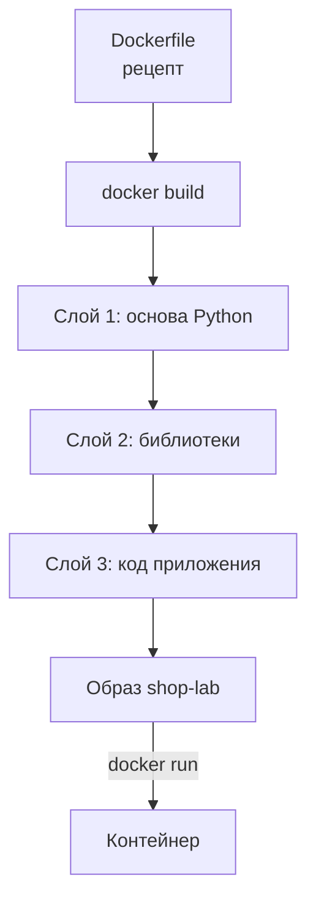
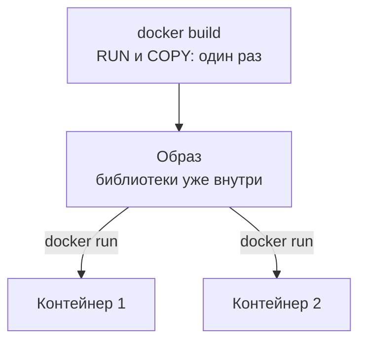
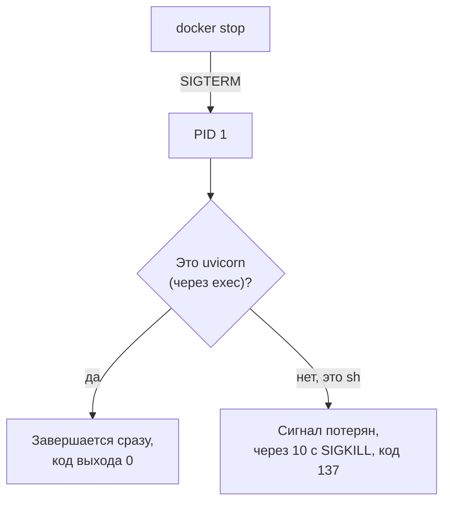

## Зачем это нужно

В команде магазина решили: тебе нужна своя копия «Магазина», на которой можно ломать что угодно. В [уроке 5.1](01-containers.md) ты запускал готовые образы: nginx, PostgreSQL. Но образа «Магазина» на Docker Hub нет: он **собирается на твоей машине** при первом `docker compose up --build` (Compose разберём в [уроке 5.3](03-compose-shop.md)). Флаг `--build` велит собрать образ из исходников. Помнишь, в 2.1 стенд поднимался несколько минут? Это шла сборка.

Я работаю с нагрузкой давно и сижу рядом, как коллега за соседним столом. Расскажу, почему сам научился читать рецепт сборки образа. Однажды я поправил код, пересобрал образ, прогнал тест и порадовался: задержка упала вдвое. Потом выяснилось, что контейнер запущен из старого образа. Весь час я мерил старый код и уже сочинял отчёт о победе. Хорошо, что заметил вовремя. С тех пор сначала проверяю, из чего собран образ.

Этот рецепт называется `Dockerfile`, и для тебя он рабочий инструмент. Не понимая, как образ собирается, ты будешь либо ждать лишние минуты, либо тестировать **старый** код, думая, что он новый. К тому же рецепт документирует сервис: версию Python, библиотеки, команду запуска. На вопрос «на какой версии проверяли» ответ лежит там. Он же отвечает на фразу «а у меня работало»: рецепт один, образ у всех одинаковый.

Шаг проекта: ты разберёшь `project/shop/shop/Dockerfile` и `entrypoint.sh` по строкам, соберёшь образ командой `docker build` и нарочно сломаешь кэш сборки. Файлы для экспериментов лежат в `~/perf-lab/05-docker/`: чужой клон репозитория мы не портим.

## Что нужно знать

- Образ, контейнер, слои, теги: [урок 5.1](01-containers.md). Ты там смотрел `docker history`, теперь увидишь, откуда берутся слои.
- Файлы, переменные окружения и `PATH`: [урок 1.1](../01-linux/01-workstation-terminal.md), права на выполнение (`chmod +x`) и скрипты оболочки `#!/bin/sh`: [урок 1.5](../01-linux/05-bash-scripts.md).
- Стенд «Магазин» и его устройство в общих чертах: [урок 2.3](../02-web/03-backend-anatomy.md).
- Python, `pip` и `requirements.txt` по-настоящему ты проходишь в [теме 4](../04-python/05-venv-requests.md). Здесь достаточно знать: `pip install` скачивает библиотеки, а `requirements.txt` это их список.
- Глубже про написание Dockerfile и многоэтапную сборку: [урок DevOps «Dockerfile»](https://distinguished-sre.github.io/devops/05-docker/02-dockerfile.html). Для курса хватит того, что ниже.

## Картина целиком

Dockerfile похож на рецепт блюда с заготовками. В рецепте сказано: «возьми готовую основу (Python), поставь на неё библиотеки, положи код и запускай вот так». Повар (команда `docker build`) идёт по шагам сверху вниз и после каждого делает снимок (слой). Если завтра ты поменяешь только последний шаг, повар не станет готовить всё заново: достанет снимок после предпоследнего шага и сделает только последний. Это и есть кэш.



Здесь видно: каждая строка даёт слой, а итог это образ, из которого запускают контейнеры. Главная мысль урока: порядок строк определяет скорость сборки. Редкое (библиотеки) ставят выше, частое (код) ниже.

## Теория

### Dockerfile: рецепт вместо готовой детали

«У меня на машине работало» стоит командам больше времени, чем любая другая фраза. Если образ собирали руками (зашли в контейнер, поставили, сохранили), то через месяц никто не вспомнит, что именно поставили. Повторить такую сборку нельзя, проверить тоже.

Поэтому образ собирают по **текстовому рецепту**, который лежит в git рядом с кодом. Это Dockerfile: чертёж, по которому деталь (образ) можно в любой момент сделать заново и получить такую же. Аналогия ломается на строке «возьми болт из ящика»: если в ящике другой болт, деталь выйдет другой. Поэтому версии в Dockerfile «Магазина» зафиксированы жёстко.

Dockerfile это обычный текстовый файл без расширения. Каждая строка начинается с **инструкции** (заглавное слово), дальше идут аргументы. Сборка идёт сверху вниз. `RUN` и `COPY` меняют файлы и создают слой с содержимым. `ENV`, `EXPOSE`, `ENTRYPOINT`, `WORKDIR` только дописывают настройки. Весь Dockerfile «Магазина» умещается в десять строк:

```dockerfile
FROM python:3.14.8-slim
WORKDIR /app
COPY requirements.txt .
RUN pip install --no-cache-dir -r requirements.txt
COPY app ./app
COPY entrypoint.sh .
RUN chmod +x entrypoint.sh
ENV PYTHONUNBUFFERED=1 PROMETHEUS_MULTIPROC_DIR=/tmp/shop-metrics
EXPOSE 8000
ENTRYPOINT ["./entrypoint.sh"]
```

Если образ прислали файлом («собрано как-то, не помню как»), не видно, что и в каком порядке ставили: повторить и проверить нельзя. Dockerfile в git снимает эти проблемы, и его правки видны в истории.

Осторожно: Dockerfile путают с `compose.yaml`. Первый описывает, как собрать **один образ**, второй, как запустить **несколько контейнеров вместе** ([урок 5.3](03-compose-shop.md)).

> **Главное:** Dockerfile это воспроизводимый и читаемый рецепт образа, который живёт в git рядом с кодом.
{: .key}

Пройдём по строкам в порядке сборки, с первой.

### `FROM`: основа образа

Ставить систему и Python с нуля в каждом образе бессмысленно, как печь хлеб от посева пшеницы: берут готовый образ и строят поверх. Первая инструкция Dockerfile всегда `FROM`, она задаёт **базовый образ**, нижний слой стопки.

`FROM python:3.14.8-slim` читается так: «возьми образ `python` с тегом `3.14.8-slim`». `3.14.8` это версия Python, а `slim` вариант образа: только Python и минимум системы, около 130 МБ. Полный `python:3.14.8` с компиляторами весит около 1 ГБ, а `alpine` около 50 МБ, но часть библиотек на нём ведёт себя иначе. «Магазин» берёт `slim`: он достаточно мал и совместим с готовыми бинарными библиотеками (`psycopg[binary]`, `bcrypt`). Цена: в `slim` нет `curl`, поэтому проверку здоровья в `compose.yaml` делают через Python (в 5.3 увидишь).

> **Прикинь сам:** зачем в `FROM` указывать `3.14.8-slim`, а не просто `python`?
{: .predict}

Без тега Docker возьмёт `latest` ([урок 5.1](01-containers.md)), и через несколько месяцев там окажется другой Python. Образ поведёт себя иначе, чем при прошлых замерах, и результаты тестов не получится сравнивать. Точная версия делает сборку воспроизводимой.

Осторожно: версия Python в Dockerfile и Python на твоей машине **не связаны**. В контейнере работает 3.14.8, а у тебя на Ubuntu может быть 3.12, и это нормально: в этом смысл контейнера.

<details markdown="1">
<summary>Для любопытных: многоэтапная сборка</summary>

Если компилятор нужен только для сборки, в одном Dockerfile пишут несколько `FROM` (multi-stage build). Первый этап собирает на тяжёлом образе, второй копирует готовый результат на лёгкий (`COPY --from=build ...`). В итоговый образ попадают слои только последнего этапа. «Магазину» это не нужно: его библиотеки приходят скомпилированными.

</details>

> **Главное:** `FROM` выбирает основу, и точный тег (`3.14.8-slim`) делает сборку повторяемой.
{: .key}

Основа есть. Теперь нужны код и библиотеки.

### `WORKDIR`, `COPY`, `RUN`: папка, файлы и команды

Для этого три инструкции. `WORKDIR /app` создаёт папку `/app` и делает её текущей для всех следующих строк и для запуска. Это как `mkdir /app && cd /app` ([урок 1.1](../01-linux/01-workstation-terminal.md)), только навсегда.

`COPY откуда куда` копирует файлы с твоей машины внутрь образа. Берёт он их не из папки, где ты стоишь в терминале, а из **контекста сборки**: папки, которую ты указал последним аргументом `docker build` (у нас `project/shop/shop/`). `COPY requirements.txt .` кладёт файл в `/app`, `COPY app ./app` кладёт код в `/app/app`.

`RUN команда` выполняет команду **во время сборки**, и результат попадает в слой. `RUN pip install --no-cache-dir -r requirements.txt` ставит библиотеки по списку (`-r` значит «читай список из файла»). Флаг `--no-cache-dir` не даёт pip хранить скачанные архивы: они раздули бы слой. `RUN chmod +x entrypoint.sh` даёт скрипту право на исполнение (флаг `x`, [урок 1.1](../01-linux/01-workstation-terminal.md)): в репозитории он хранится без него, поэтому право закрепляют явно.

Важны два момента времени. `RUN` и `COPY` отрабатывают при сборке один раз, и результат запечатывается в образ. Запуск контейнера идёт потом и сколько угодно раз.



Схема показывает: тяжёлую работу делает сборка, а контейнеры берут готовое.

> **Прикинь сам:** `RUN pip install` выполнился при сборке, потом ты запустил из образа три контейнера. Сколько раз pip скачивал библиотеки?
{: .predict}

Один раз, при сборке. Библиотеки запечатаны в слое образа, контейнеры их просто используют. Поэтому контейнер стартует быстро: если бы библиотеки ставились при запуске, каждый старт занимал бы минуту.

> **Главное:** `COPY` берёт файлы из контекста сборки, а `RUN` выполняется один раз при сборке и запечатывает результат в образ.
{: .key}

Осталось понять, откуда у pip берутся библиотеки и что значит `==` в списке.

### Откуда берутся библиотеки: pip, PyPI и закреплённые версии

Веб-запросы, хэши паролей и базу никто не пишет с нуля: берут чужой код, оформленный как **библиотека**. Для Python их хранит общий каталог **PyPI** (Python Package Index, pypi.org), а программа **pip** ([урок 4.5](../04-python/05-venv-requests.md)) скачивает оттуда нужное. PyPI это склад запчастей, pip курьер, а `requirements.txt` заказ-наряд. «Болт» без размера привезёт любой болт, а «болт M8 длиной 30 мм» будет одинаковым каждый раз. Аналогия ломается на гайках: к болту приедут детали, которых в заказе не было.

Заказ-наряд «Магазина» (первые восемь строк):

```text
fastapi==0.142.2
uvicorn[standard]==0.54.0
psycopg[binary,pool]==3.3.6
psycopg-pool==3.3.3
redis==8.1.0
prometheus-client==0.26.0
bcrypt==5.0.0
httpx==0.28.1
# ещё 7 строк opentelemetry-*: трейсы, урок 7.7
```

`==` значит «ровно эта версия». Без номера pip взял бы самую свежую, а она со временем меняется. Гайки тоже есть: `fastapi` приведёт за собой `starlette` и `pydantic`, их версии pip подберёт сам.

Для нагрузочного тестировщика важны две строки. `bcrypt` считает хэши паролей и нагружает процессор: поэтому логин в «Магазине» тяжёлый. `psycopg` с `pool` ходит в PostgreSQL через пул соединений ([урок 2.3](../02-web/03-backend-anatomy.md)), которым мы займёмся в [теме 11](../11-bottlenecks/index.md).

Без `==` через полгода пересборка без кэша даст другие версии, возможно, с другой производительностью. Поэтому версии записаны жёстко.

Осторожно: `pip` на твоей машине и в образе ставят в **разные** места: поставил себе, в контейнере не появилось.

> **Главное:** закреплённые версии (`==`) в `requirements.txt` дают одинаковый образ сегодня и через полгода.
{: .key}

Версии закреплены, но pip при каждой сборке качает всё. Хочется, чтобы это случалось один раз.

### Кэш слоёв: почему порядок строк важен

Первая сборка «Магазина» идёт около минуты с четвертью, почти всё время работает pip. Ты поправил одну строку кода: неужели ждать заново? Нет: Docker запоминает результат каждого шага и использует снова, если шаг не изменился (слово `CACHED` в выводе).

Это конвейер с контрольными точками: поменял пятую станцию, начинать с первой не надо. Аналогия ломается на правиле «всё ниже»: поменял станцию 3, и все станции после неё работают заново.

Перед каждым шагом Docker сверяет: та же ли инструкция и, для `COPY`, те же ли файлы (по хэшу, как в [уроке 3.1](../03-git/01-git-basics.md)). Если всё совпало, шаг получает метку `CACHED` и пропускается. Как только один шаг изменился, **все шаги ниже него выполняются заново**: старые снимки к ним не подходят. Вот почему Dockerfile «Магазина» устроен именно так. `COPY requirements.txt .` и `RUN pip install` стоят **до** копирования кода: список библиотек меняется редко, и самый дорогой шаг остаётся в кэше. `COPY app ./app` стоит **после**: код правят каждый день, но пересобираются только он и дешёвые шаги под ним.

В виджете сравни два порядка. В «плохом» код копируется до установки библиотек (`COPY . .` одной строкой), поэтому любая правка заставляет pip качать всё заново.

<div class="viz" data-viz="dk-layers" data-change="app" data-order="good"></div>

Видно, какие слои Docker выполнил заново: при правке кода в хорошем порядке два-три за пару секунд, в плохом снова работает pip.

Вот цифры для «Магазина». Первая сборка: 1 мин 15 с. Повторная без изменений: 1 с, все слои `CACHED`. Правка `app/main.py`: 3 с, pip остаётся в кэше. Правка `requirements.txt`: около 45 с. Числа примерные, но соотношение (секунды против минуты) у тебя будет таким же.

> **Прикинь сам:** ты поменял одну букву в комментарии в `app/main.py` и пересобрал образ. Какие шаги выполнятся заново и почему pip среди них нет?
{: .predict}

Заново пойдут `COPY app ./app` (файл изменился, хэш другой) и все шаги ниже: `COPY entrypoint.sh` и `RUN chmod`. Всё выше (`FROM`, `WORKDIR`, `COPY requirements.txt`, `RUN pip install`) не менялось и берётся из кэша: `requirements.txt` тот же, а установка стоит до копирования кода.

Осторожно: кэш видит только Dockerfile и файлы контекста. `RUN pip install` с незакреплёнными версиями не пересоберётся, пока не изменилась строка, и останется на старой версии, хотя на PyPI вышла новая. Собрать без кэша принудительно можно так: `docker build --no-cache`.

> **Главное:** Docker пропускает шаг, если он не менялся, но всё ниже изменённого шага пересобирается, поэтому редкое ставят выше, частое ниже.
{: .key}

Библиотеки на месте, код лежит. Остались настройки запуска: что и как стартует при `docker run`.

### `ENV`, `EXPOSE`, `ENTRYPOINT`: настройки запуска

Последние три инструкции не меняют файлы, они дописывают в образ «паспорт».

`ENV PYTHONUNBUFFERED=1 PROMETHEUS_MULTIPROC_DIR=/tmp/shop-metrics` задаёт переменные окружения ([урок 1.1](../01-linux/01-workstation-terminal.md)). `PYTHONUNBUFFERED=1` отключает буферизацию вывода Python: без неё строки логов появлялись бы в `docker logs` с опозданием и пропадали при падении. `PROMETHEUS_MULTIPROC_DIR` это каталог, где рабочие процессы сервера обмениваются счётчиками метрик: каждый считает своё, а `/metrics` должен отдать сумму. Переменные из `compose.yaml` или `-e` **перекрывают** значения из `ENV`.

`EXPOSE 8000` записывает «программа слушает порт 8000». Это **документация**, а не открытие порта: наружу его публикуют `-p` или `ports:` ([урок 5.1](01-containers.md)).

`ENTRYPOINT ["./entrypoint.sh"]` задаёт, **какая программа запускается** при старте контейнера. Список в квадратных скобках (exec-форма) запускает её напрямую, без промежуточной оболочки. Рядом существует `CMD`: аргументы по умолчанию, которые можно заменить при запуске (в «Магазине» его нет). Отсюда разница с `RUN`: `RUN` работает при сборке, `ENTRYPOINT` и `CMD` при каждом запуске.

Сам скрипт `entrypoint.sh` (в последней строке `uvicorn` это сервер «Магазина»):

```sh
#!/bin/sh
set -eu
export PROMETHEUS_MULTIPROC_DIR="${PROMETHEUS_MULTIPROC_DIR:-/tmp/shop-metrics}"
mkdir -p "$PROMETHEUS_MULTIPROC_DIR"
find "$PROMETHEUS_MULTIPROC_DIR" -type f -name '*.db' -delete
exec uvicorn app.main:app --host 0.0.0.0 --port 8000 --workers "${WEB_CONCURRENCY:-1}" --no-access-log
```

Строка `#!/bin/sh` называет оболочку для файла ([урок 1.5](../01-linux/05-bash-scripts.md)). `set -eu` останавливает скрипт на первой ошибке и на обращении к несуществующей переменной. Запись `${ПЕРЕМЕННАЯ:-значение}` подставляет запасное значение, если переменная не задана. `find ... -delete` стирает файлы метрик прошлого запуска, иначе счётчики показывали бы старые цифры. В последней строке `--host 0.0.0.0` значит «слушай на всех адресах контейнера» ([урок 5.1](01-containers.md)). А `--workers` берёт число процессов из `WEB_CONCURRENCY`, по умолчанию один: эту ручку покрутим в [теме 11](../11-bottlenecks/index.md).

Теперь слово, из-за которого я однажды терял десять секунд на каждом перезапуске стенда: `exec`. Вспомни из [урока 5.1](01-containers.md): у первого процесса контейнера номер (PID) 1, и Docker шлёт команды ему. Вспомни и [сигналы](../01-linux/03-processes-resources.md): SIGTERM значит «закончи дела и завершайся», SIGKILL значит «убиваем сразу». Без `exec` оболочка осталась бы PID 1 и получила бы SIGTERM от `docker stop`, но не передала бы его uvicorn. Через 10 секунд Docker убил бы контейнер силой (код выхода 137). `exec` **заменяет** оболочку uvicorn'ом: тот становится PID 1, получает сигнал сам и завершается чисто с кодом 0.



Одно слово `exec` решает: доля секунды или десять.

> **Прикинь сам:** ты убрал `exec` из последней строки `entrypoint.sh` и пересобрал образ. Что изменится при `docker stop` и как это заметить?
{: .predict}

SIGTERM придёт оболочке `sh`, она не передаст его uvicorn. Через 10 секунд контейнер будет убит: `docker stop` продлится около десяти секунд, а статус станет `Exited (137)`. Заметить можно по времени (`time docker stop ...`) и по коду выхода в `docker ps -a`.

> **Главное:** `ENTRYPOINT` запускает сервер при старте, а `exec` делает сервер процессом 1, чтобы он получал сигнал остановки.
{: .key}

Образ почти готов. Осталось узнать, что именно уезжает в сборку вместе с `COPY`.

### Контекст сборки и `.dockerignore`

`docker build` не берёт файлы по одному: он отправляет демону Docker (`dockerd`, [урок 5.1](01-containers.md)) всю папку, которую ты указал, и `COPY` может брать файлы только оттуда. Значит, если в папке лежат тяжёлые или секретные вещи (`.git`, `.env`, виртуальное окружение), они попадут в контекст и могут оказаться в образе.

Спасает файл `.dockerignore` со списком исключений: `.git`, `.venv`, `__pycache__`, `.env`. В `project/shop/shop/` его нет: код маленький. На рабочих проектах он есть почти всегда. Размер контекста виден в выводе `docker build`: `transferring context: 12.34kB` это норма, а `1.2GB` значит, что забыли исключить виртуальное окружение. Если сборка «зависла» на этой строке, смотри размер папки.

Осторожно: `.dockerignore` и `.gitignore` ([урок 3.1](../03-git/01-git-basics.md)) похожи, но читают разные программы. И не копируй `.env` с паролями в образ: слой хранит их навсегда, переменные передают при запуске.

> **Главное:** в сборку уезжает вся папка контекста, лишнее исключают через `.dockerignore`, а секреты в образ не кладут.
{: .key}

Образ собран. Остаётся дать ему имя, чтобы не перепутать.

### Теги при сборке

Через час после пары сборок легко забыть, какой образ свежий, и вернуться к истории из начала урока: мерить старый код. Поэтому образу дают имя и тег флагом `-t`: `docker build -t shop-lab:exp .`. Одному образу можно навесить несколько тегов (`docker tag shop-lab:exp shop-lab:v1`): это метки на один набор слоёв, места они не занимают. Compose, увидев `build: ./shop`, называет образ `shop-shop` (проект `shop`, сервис `shop`). Перед нагрузочным прогоном записывай в отчёт коммит, из которого собран образ (`git rev-parse --short HEAD`), и ставь его в тег.

> **Главное:** тег это метка на образе, и коммит в нём защищает от замеров старого кода.
{: .key}

Теперь собери образ сам: практика.

## Практика

Ты не будешь править файлы в клоне `~/load-tester`: он должен остаться чистым, иначе `git pull` потом начнёт ругаться на конфликты. Скопируй каталог сервиса в свой репозиторий и работай с копией.

### 1. Подготовь копию для экспериментов

```bash
mkdir -p ~/perf-lab/05-docker
cp -r ~/load-tester/project/shop/shop ~/perf-lab/05-docker/shop-build
cd ~/perf-lab/05-docker/shop-build
ls -la
```

Разбор: `cp -r` копирует папку вместе со всем содержимым (`-r` recursive); конечный каталог `shop-build` будет создан. `ls -la` показывает файлы с правами.

```text
total 24
drwxr-xr-x 3 student student 4096 Oct  3 11:02 .
drwxr-xr-x 3 student student 4096 Oct  3 11:02 ..
-rw-r--r-- 1 student student  284 Oct  3 11:02 Dockerfile
drwxr-xr-x 3 student student 4096 Oct  3 11:02 app
-rw-r--r-- 1 student student  424 Oct  3 11:02 entrypoint.sh
-rw-r--r-- 1 student student  158 Oct  3 11:02 requirements.txt
```

**Как читать вывод:** четыре элемента контекста сборки: рецепт `Dockerfile`, папка кода `app`, скрипт запуска и список библиотек. У `entrypoint.sh` права `-rw-r--r--`: буквы `x` (исполнение) нет, в репозитории файл хранится без неё. Поэтому в Dockerfile есть строка `RUN chmod +x entrypoint.sh`: без неё запуск образа упал бы с `permission denied`. Размеры могут слегка отличаться.

### 2. Первая сборка

```bash
docker build -t shop-lab:exp .
```

Разбор: `docker build` собирает образ; `-t shop-lab:exp` даёт ему имя `shop-lab` и тег `exp`; точка в конце это **контекст сборки**: текущая папка. Не забудь точку: без неё будет ошибка `requires exactly 1 argument`.

```text
[+] Building 74.3s (12/12) FINISHED                              docker:default
 => [internal] load build definition from Dockerfile                       0.0s
 => => transferring dockerfile: 284B                                       0.0s
 => [internal] load metadata for docker.io/library/python:3.14.8-slim      1.2s
 => [internal] load .dockerignore                                          0.0s
 => => transferring context: 2B                                            0.0s
 => [1/7] FROM docker.io/library/python:3.14.8-slim@sha256:7d1c...        18.4s
 => => resolve docker.io/library/python:3.14.8-slim@sha256:7d1c...         0.0s
 => [internal] load build context                                          0.0s
 => => transferring context: 22.37kB                                       0.0s
 => [2/7] WORKDIR /app                                                     0.3s
 => [3/7] COPY requirements.txt .                                          0.0s
 => [4/7] RUN pip install --no-cache-dir -r requirements.txt              46.8s
 => [5/7] COPY app ./app                                                   0.0s
 => [6/7] COPY entrypoint.sh .                                             0.0s
 => [7/7] RUN chmod +x entrypoint.sh                                       0.0s
 => exporting to image                                                     3.6s
 => => exporting layers                                                    3.5s
 => => naming to docker.io/library/shop-lab:exp                            0.0s
```

(Шагов семь: `FROM`, `WORKDIR`, два `COPY`, `RUN pip`, ещё `COPY` и `RUN chmod`. Строки `ENV`, `EXPOSE` и `ENTRYPOINT` в нумерацию не входят, они только дописывают настройки.)

**Как читать вывод:** каждая строка `=> [N/M]` это шаг рецепта, число справа время в секундах. Самое долгое: `FROM` (первый раз скачивается основа, 18 с) и `RUN pip install` (47 с: скачивание библиотек). Строки `[internal] ...` служебные: Docker читает Dockerfile, метаданные базового образа и контекст. `transferring context: 22.37kB` размер контекста: маленький, значит, лишнего нет. В конце `naming to ... shop-lab:exp`: образ получил имя.

Проверь результат:

```bash
docker image ls shop-lab
```

```text
REPOSITORY   TAG   IMAGE ID       CREATED          SIZE
shop-lab     exp   5e8c1a2d93b7   40 seconds ago   262MB
```

Размер 262 МБ: основа (131 МБ) плюс библиотеки (около 130 МБ) и несколько килобайт кода.

**Типичные ошибки:**

- `ERROR: failed to solve: failed to read dockerfile: open Dockerfile: no such file or directory`: ты не в той папке. `pwd` и `ls`: в текущем каталоге должен лежать `Dockerfile`.
- `docker buildx build requires exactly 1 argument`: забыта точка (контекст) в конце команды.
- `ERROR: Could not find a version that satisfies the requirement ...` во время pip: нет интернета или опечатка в `requirements.txt`. Проверь `curl -I https://pypi.org`.
- `failed to fetch anonymous token ... dial tcp: lookup registry-1.docker.io: no such host`: Docker не достучался до реестра, проверь сеть и DNS ([урок 1.4](../01-linux/04-network-cli.md)).

> Сборка упала на шаге, которого нет в «Типичных ошибках»? Скопируй строку `=> ERROR` и весь вывод шага, спроси нейросеть, что значит каждая строка. Ответ проверь, воспроизведя шаг руками через `docker run --rm --entrypoint sh <образ> -c "..."`.
{: .ai}

### 3. Посмотри слои

```bash
docker history shop-lab:exp
```

```text
IMAGE          CREATED          CREATED BY                                      SIZE      COMMENT
5e8c1a2d93b7   2 minutes ago    ENTRYPOINT ["./entrypoint.sh"]                  0B        buildkit.dockerfile.v0
<missing>      2 minutes ago    EXPOSE map[8000/tcp:{}]                         0B        buildkit.dockerfile.v0
<missing>      2 minutes ago    ENV PYTHONUNBUFFERED=1 PROMETHEUS_MULTIPROC…    0B        buildkit.dockerfile.v0
<missing>      2 minutes ago    RUN /bin/sh -c chmod +x entrypoint.sh # buil…   424B      buildkit.dockerfile.v0
<missing>      2 minutes ago    COPY entrypoint.sh . # buildkit                 424B      buildkit.dockerfile.v0
<missing>      2 minutes ago    COPY app ./app # buildkit                       21.5kB    buildkit.dockerfile.v0
<missing>      2 minutes ago    RUN /bin/sh -c pip install --no-cache-dir -…   128MB     buildkit.dockerfile.v0
<missing>      2 minutes ago    COPY requirements.txt . # buildkit              158B      buildkit.dockerfile.v0
<missing>      2 minutes ago    WORKDIR /app                                    0B        buildkit.dockerfile.v0
<missing>      3 weeks ago      CMD ["python3"]                                 0B        buildkit.dockerfile.v0
...
```

**Как читать вывод:** читай **снизу вверх**, как шла сборка. Нижние строки (их скрыто многоточием) принадлежат базовому образу Python. Выше идут наши инструкции, по одной на строку Dockerfile. Колонка `SIZE`: тяжёлый слой только один, `pip install`, 128 МБ. Копирование кода `COPY app` весит 21 килобайт. Строки `0B` у `ENV`, `EXPOSE`, `ENTRYPOINT` и `WORKDIR`: файлов они не добавляют. Именно поэтому правка кода не стоит ничего, а правка библиотек стоит дорого. Размеры слоёв можно сопоставить с тем, что рассказывал виджет.

### 4. Кэш в действии

Повтори сборку без изменений и засеки время:

```bash
time docker build -t shop-lab:exp .
```

```text
[+] Building 1.1s (12/12) FINISHED                               docker:default
 => [internal] load build definition from Dockerfile                       0.0s
 => [internal] load metadata for docker.io/library/python:3.14.8-slim      0.9s
 => [1/7] FROM docker.io/library/python:3.14.8-slim@sha256:7d1c...         0.0s
 => CACHED [2/7] WORKDIR /app                                              0.0s
 => CACHED [3/7] COPY requirements.txt .                                   0.0s
 => CACHED [4/7] RUN pip install --no-cache-dir -r requirements.txt        0.0s
 => CACHED [5/7] COPY app ./app                                            0.0s
 => CACHED [6/7] COPY entrypoint.sh .                                      0.0s
 => CACHED [7/7] RUN chmod +x entrypoint.sh                                0.0s
 => exporting to image                                                     0.0s

real    0m1.3s
```

Слово **`CACHED`** означает, что шаг пропущен. Вся сборка заняла секунду. Теперь поменяй код:

```bash
echo '# правка для эксперимента' >> app/main.py
time docker build -t shop-lab:exp .
```

```text
 => CACHED [2/7] WORKDIR /app                                              0.0s
 => CACHED [3/7] COPY requirements.txt .                                   0.0s
 => CACHED [4/7] RUN pip install --no-cache-dir -r requirements.txt        0.0s
 => [5/7] COPY app ./app                                                   0.0s
 => [6/7] COPY entrypoint.sh .                                             0.0s
 => [7/7] RUN chmod +x entrypoint.sh                                       0.0s
 => exporting to image                                                     0.4s

real    0m2.1s
```

**Как читать вывод:** шаги выше кода остались `CACHED`, включая дорогой `pip`; пересобрались `COPY app` (файл изменился) и всё после. Две секунды против почти полутора минут. Теперь поменяй список библиотек (добавь безобидный комментарий):

```bash
echo '# правка для эксперимента' >> requirements.txt
time docker build -t shop-lab:exp .
```

В выводе `[3/7] COPY requirements.txt .` перестанет быть `CACHED`, и `RUN pip install` пойдёт заново (около 40-50 секунд), хотя набор библиотек не изменился: Docker сравнивает **файл**, а не его смысл. Так и устроена цена: изменил файл, пересобрал всё ниже.

### 5. Собери «плохой» вариант и сравни

Создай рядом второй Dockerfile, где код копируется до установки:

```bash
cat > Dockerfile.bad <<'EOF'
FROM python:3.14.8-slim
WORKDIR /app
COPY . .
RUN pip install --no-cache-dir -r requirements.txt
RUN chmod +x entrypoint.sh
ENV PYTHONUNBUFFERED=1 PROMETHEUS_MULTIPROC_DIR=/tmp/shop-metrics
EXPOSE 8000
ENTRYPOINT ["./entrypoint.sh"]
EOF
docker build -f Dockerfile.bad -t shop-lab:bad .
```

Разбор: `cat > файл <<'EOF' ... EOF` записывает несколько строк в файл (конструкция называется heredoc, [урок 1.5](../01-linux/05-bash-scripts.md)); `-f` указывает другой Dockerfile вместо стандартного. Первая сборка займёт столько же, сколько хорошая. Теперь измени код и пересобери:

```bash
echo '# ещё правка' >> app/main.py
time docker build -f Dockerfile.bad -t shop-lab:bad .
```

В выводе строка `COPY . .` пересобралась, а за ней и `RUN pip install`: снова около 45 секунд на скачивание библиотек из-за одной строки комментария. Вывод по цифрам: хороший порядок 2 секунды, плохой 47. Именно поэтому в Dockerfile сначала копируют **только** список зависимостей.

### 6. Проверь, что внутри образа

```bash
docker run --rm --entrypoint python shop-lab:exp -c "import fastapi; print(fastapi.__version__)"
```

Разбор: `--rm` удалит контейнер после выхода; `--entrypoint python` **заменяет** `ENTRYPOINT` из образа на `python`, иначе запустился бы сервер; всё, что после имени образа, это аргументы: `-c "..."` значит «выполни этот код». Контейнер напечатает версию библиотеки и сразу завершится.

```text
0.142.2
```

**Как читать вывод:** версия совпадает с записью в `requirements.txt` (`fastapi==0.142.2`): образ собран так, как написано в рецепте. Тот же приём (`--entrypoint`) пригодится всегда, когда нужно заглянуть в образ и не запускать его по-настоящему. Посмотри ещё `docker run --rm --entrypoint sh shop-lab:exp -c "ls -la /app"`: увидишь `app`, `entrypoint.sh` и `requirements.txt` в `/app`, именно туда их положили `WORKDIR` и `COPY`.

### 7. Теги

```bash
docker tag shop-lab:exp shop-lab:v1
docker image ls shop-lab
```

```text
REPOSITORY   TAG   IMAGE ID       CREATED          SIZE
shop-lab     v1    5e8c1a2d93b7   3 minutes ago    262MB
shop-lab     exp   5e8c1a2d93b7   3 minutes ago    262MB
shop-lab     bad   a77d90c3e1b4   2 minutes ago    262MB
```

**Как читать вывод:** у `exp` и `v1` **одинаковый IMAGE ID**: это два имени одного образа, на диске он один. Размеры колонки `SIZE` показывают «виртуальный» размер каждого образа, но общие слои хранятся один раз. Теперь убери за собой:

```bash
docker image rm shop-lab:v1 shop-lab:exp shop-lab:bad
```

Образ, из которого запущен хотя бы один контейнер, удалить не получится: Docker скажет `conflict: unable to delete ... image is being used by stopped container`. Сначала `docker rm` контейнер.

### 8. Сохрани результат

Положи рядом заметку и сделай коммит. Сам `shop-build` в репозиторий класть не нужно: это копия кода из репозитория стенда, поэтому в коммит идёт только то, что написал ты.

```bash
cd ~/perf-lab/05-docker
cat > notes-dockerfile.md <<'EOF'
# Dockerfile «Магазина»: что запомнить

- Порядок строк: редко меняющееся выше, часто меняющееся ниже.
- requirements.txt копируется ДО кода: pip остаётся в кэше.
- exec в entrypoint.sh: uvicorn становится PID 1 и получает SIGTERM.
- Замеры (мои): первая сборка ___ с, без изменений ___ с, правка кода ___ с, правка requirements ___ с.
EOF
cp shop-build/Dockerfile.bad Dockerfile.bad
cd ~/perf-lab
echo "05-docker/shop-build/" >> .gitignore
git add .gitignore 05-docker
git commit -m "Dockerfile: заметки и пример плохого порядка слоёв (урок 5.2)"
git push
```

Впиши свои реальные замеры времени в заметку вместо подчёркиваний перед коммитом. Строка с `.gitignore` исключает копию кода из репозитория.

## Типичные ошибки при сборке

| Текст ошибки | Причина | Что делать |
|---|---|---|
| `failed to read dockerfile: open Dockerfile: no such file or directory` | ты не в папке с `Dockerfile` | `cd` в нужную папку или `-f путь/к/Dockerfile` |
| `"docker buildx build" requires exactly 1 argument` | не указан контекст (точка) | добавь `.` в конце |
| `COPY failed: file not found in build context` или `"/entrypoint.sh": not found` | файла нет в папке контекста или он указан неверно | проверь `ls` в папке контекста и написание в `COPY` |
| `exec ./entrypoint.sh: no such file or directory` при **запуске** образа | в скрипте символы конца строки Windows (CRLF) или нет оболочки из `#!` | `file entrypoint.sh` покажет `CRLF`; `sed -i.bak 's/\r$//' entrypoint.sh && rm entrypoint.sh.bak`, пересобрать |
| `exec ./entrypoint.sh: permission denied` | у скрипта нет права на выполнение | `chmod +x entrypoint.sh`, поэтому в Dockerfile стоит `RUN chmod +x` |
| образ собрался, а в контейнере старый код | собирал не тот каталог, или запустил старый образ/контейнер | `docker image ls`: время создания; пересобери и **пересоздай** контейнер |
| `ERROR: No matching distribution found for ...` | опечатка или версии нет на PyPI | проверь строку в `requirements.txt` |

## Сломай и почини

**Поломка 1.** В копии `shop-build` убери из `entrypoint.sh` слово `exec` (последняя строка станет просто `uvicorn app.main:app ...`), пересобери и запусти контейнер, потом останови:

```bash
sed -i.bak 's/^exec //' entrypoint.sh && rm entrypoint.sh.bak
docker build -t shop-lab:noexec .
docker run -d --name noexec -e DATABASE_URL=postgresql://x:x@127.0.0.1:1/x shop-lab:noexec
sleep 3
time docker stop noexec
docker inspect noexec --format '{{.State.ExitCode}}'
```

(Базы нет, и сервис не запустится полностью, но процесс-оболочка будет жить: для эксперимента этого достаточно.) Что покажет `time`, какой будет код выхода и почему?

> Сначала ответь сам по алгоритму урока: смотри вывод `docker build` и список слоёв `docker history`. Потом спроси нейросеть и сравни её объяснение со своей гипотезой.
{: .ai}

<details markdown="1">
<summary>Разбор</summary>

`docker stop` займёт около 10 секунд (`real 0m10.2s`), а код выхода будет `137`. Причина: теперь PID 1 это оболочка `sh`, она не передаёт SIGTERM дочернему uvicorn; Docker ждёт положенные 10 секунд и шлёт SIGKILL. Вернув `exec` (пересобрав образ), увидишь остановку за долю секунды и код `0` или `143`.

Вывод для диагностики: когда остановка контейнера «зависает» на десять секунд, смотри, кто PID 1 внутри (`docker exec ИМЯ cat /proc/1/cmdline`: если там `/bin/sh`, а не `uvicorn`, остановка будет медленной). Если это оболочка, а не сервис, ищи `exec` или передавай сигналы явно. Убери за собой: `docker rm -f noexec; docker image rm shop-lab:noexec`.

</details>

**Поломка 2.** Верни `exec`, а в `Dockerfile` поменяй местами строки: `COPY app ./app` поставь перед `COPY requirements.txt .`. Измени код, пересобери и ответь: сколько шагов пересоберётся и почему слой `pip` тоже оказался среди них?

<details markdown="1">
<summary>Разбор</summary>

Пересоберётся и `COPY app`, и все шаги после него, включая `pip install`. Порядок «код перед зависимостями» заставил `pip` стоять **ниже** изменившегося слоя, а всё ниже изменённого пересобирается. Исправление: вернуть `COPY requirements.txt` и `pip install` выше, чем `COPY app`.

</details>

## ИИ в помощь

Нейросеть быстро набрасывает черновик Dockerfile и объясняет, почему кэш сборки не сработал. Общие правила на странице [ИИ-помощник](../ai.md).

**Задача:** разобрать чужой Dockerfile, прежде чем собирать его.

```text
Я учусь Docker. Вот Dockerfile (Python 3.12, FastAPI-сервис):
<вставь Dockerfile целиком>
Разбери построчно: что делает каждая инструкция, в какой слой она
попадает и что инвалидирует кэш. Покажи, какие две строки стоит
поменять местами, чтобы правка кода не пересобирала pip install.
Объясни причину, потом покажи исправленный файл.
```
{: .wrap}

**Проверь ответ:** внеси изменение в своей копии `shop-build` и сравни число пересобранных шагов (`CACHED` против реальных) с обещанием нейросети. Типичная ошибка: она ставит `COPY . .` перед установкой зависимостей или советует `latest` вместо закреплённой версии образа.

**Задача:** понять, почему образ получился тяжёлым.

```text
Образ весит <размер> МБ, хотя приложение маленькое. Вывод docker history:
<вставь вывод docker history --no-trunc или обычный>
Укажи, какие слои самые тяжёлые и почему. Предложи 2-3 способа
уменьшить образ (базовый образ, --no-cache-dir, порядок инструкций)
и скажи, чем каждый рискует.
```
{: .wrap}

**Проверь ответ:** примени одно предложение за раз и пересобери, сверяя размер в `docker images`. Нейросети советуют `alpine` как универсальное решение, но библиотеки с C-расширениями на нём могут не собраться: проверяй сборкой, а не верой.

Если в Dockerfile или `docker history` попали пароли и токены (`ARG`, `ENV`), замени их на `<секрет>`: слои хранят их навсегда.

## Словарик урока

| Термин | Простыми словами |
|---|---|
| Dockerfile | Текстовый рецепт, по которому собирается образ |
| Инструкция | Строка-команда Dockerfile: `FROM`, `COPY`, `RUN` и другие |
| Базовый образ | Образ, на котором строится твой: первая строка `FROM` |
| `slim`, `alpine` | Облегчённые варианты базовых образов |
| `FROM` | Задаёт основу образа |
| `WORKDIR` | Рабочая папка внутри образа |
| `COPY` | Копирует файлы с твоей машины в образ при сборке |
| `RUN` | Выполняет команду при сборке и сохраняет результат в слой |
| `ENV` | Переменные окружения, зашитые в образ как значения по умолчанию |
| `EXPOSE` | Запись «программа слушает этот порт», сам порт не открывает |
| `ENTRYPOINT` / `CMD` | Что запускается при старте контейнера |
| Контекст сборки | Папка, которую `docker build` отправляет демону; из неё берёт файлы `COPY` |
| `.dockerignore` | Список файлов, которые не попадут в контекст сборки |
| Кэш слоёв (`CACHED`) | Повторное использование результата шага, если ничего не изменилось |
| Инвалидация кэша | Изменение шага заставляет заново выполнять и все шаги ниже |
| `requirements.txt` | Список библиотек Python с версиями |
| `exec` в скрипте | Заменяет оболочку программой, чтобы сигналы достигали её |
| SIGTERM / SIGKILL | Сигнал «заверши работу» и сигнал «убить немедленно» |
| BuildKit | Современный сборщик образов в Docker, выводит шаги `[N/M]` и кэш |

## Вопросы с собеседований

Раздел для повторения: ответь вслух, потом открой ответ. Вопросы `[на скорость]` нужно уметь отвечать за 30 секунд.

### 1. [junior] [часто] Что такое Dockerfile и что делает `docker build`?

<details markdown="1">
<summary>Ответ</summary>

Dockerfile это текстовый рецепт сборки образа: набор инструкций (`FROM`, `COPY`, `RUN`, `ENTRYPOINT` и других). `docker build` выполняет их сверху вниз, после каждой сохраняет слой и в итоге собирает образ, из которого запускаются контейнеры.

**Что хотят услышать:** рецепт, инструкции, слои, образ как результат; хранится в git рядом с кодом.

**Красный флаг:** «Dockerfile это конфигурация запуска нескольких контейнеров» (путает с Compose).

</details>

### 2. [junior] [часто] Чем `RUN` отличается от `CMD` и `ENTRYPOINT`?

<details markdown="1">
<summary>Ответ</summary>

`RUN` выполняется при **сборке** образа, результат запечатывается в слое. `CMD` и `ENTRYPOINT` задают, что запускать при **старте контейнера**. `ENTRYPOINT` это основная программа, `CMD` аргументы по умолчанию, которые легко заменить при `docker run`.

**Что хотят услышать:** разница «сборка против запуска».

**Красный флаг:** «`RUN` запускает приложение».

</details>

### 3. [junior] [часто] Как работает кэш слоёв и почему важен порядок инструкций?

<details markdown="1">
<summary>Ответ</summary>

Docker пропускает шаг (`CACHED`), если инструкция и входные файлы не изменились. Но изменение одного шага заставляет пересобрать все шаги ниже. Поэтому редко меняющееся (список зависимостей, установка) ставят выше, а часто меняющееся (код) ниже: например, `COPY requirements.txt` и `pip install` до `COPY app`.

**Что хотят услышать:** «всё ниже изменённого слоя пересобирается», пример с зависимостями.

**Красный флаг:** не знает, что кэш бывает и как его сбросить (`--no-cache`).

</details>

### 4. [junior] Зачем в образе «Магазина» используется `python:3.14.8-slim`, а не `python:latest`?

<details markdown="1">
<summary>Ответ</summary>

Точная версия делает сборку воспроизводимой: результаты замеров можно сравнивать, потому что Python не меняется под ногами. `slim` значительно меньше полного образа (около 130 МБ против 1 ГБ), при этом достаточен для работы сервиса с бинарными колёсами библиотек.

**Что хотят услышать:** воспроизводимость, размер, осознанный выбор варианта образа.

**Красный флаг:** «`latest` лучше, потому что всегда свежий».

</details>

### 5. [junior] Что делает `EXPOSE 8000`? Откроет ли он порт?

<details markdown="1">
<summary>Ответ</summary>

Нет. `EXPOSE` лишь документирует, что программа слушает порт 8000. Опубликовать порт на хосте можно только флагом `-p` при `docker run` или `ports:` в Compose.

**Что хотят услышать:** «документация, а не открытие порта».

**Красный флаг:** «`EXPOSE` открывает порт наружу».

</details>

### 6. [middle] Зачем в `entrypoint.sh` стоит `exec` перед `uvicorn`?

<details markdown="1">
<summary>Ответ</summary>

Без `exec` процессом 1 остаётся оболочка, а сервер её дочерний процесс. Сигнал SIGTERM от `docker stop` получает PID 1, и оболочка его не пересылает: сервер не завершается аккуратно, через 10 секунд Docker убивает контейнер (код 137), могут оборваться запросы и не закрыться соединения. `exec` заменяет оболочку сервером, он становится PID 1 и корректно реагирует на остановку.

**Что хотят услышать:** PID 1, сигналы, `docker stop`, код 137.

**Красный флаг:** считает, что `exec` «ускоряет запуск».

</details>

### 7. [middle] Как уменьшить размер образа и время сборки?

<details markdown="1">
<summary>Ответ</summary>

Брать облегчённую основу (`slim`, `alpine`), ставить зависимости с `--no-cache-dir`, держать `.dockerignore`, не копировать лишнее, правильно упорядочивать слои ради кэша, а на сложных проектах использовать многоэтапную сборку (собрать на тяжёлом образе, перенести результат в лёгкий).

**Что хотят услышать:** несколько приёмов и понимание, что размер и скорость это разные цели.

**Красный флаг:** «удалю файлы отдельным `RUN rm`» (удаление в верхнем слое не уменьшает размер нижнего).

</details>

### 8. [middle] Почему нельзя копировать `.env` с секретами в образ?

<details markdown="1">
<summary>Ответ</summary>

Всё, что попало в слой, остаётся в образе навсегда и видно любому, кто получит образ (`docker history`, распаковка слоёв). Удаление файла в следующем слое не помогает: нижний слой по-прежнему содержит секрет. Секреты и настройки передают при запуске (переменные окружения, `env_file`, секреты оркестратора), а в образ добавляют `.dockerignore`.

**Что хотят услышать:** слои неизменяемы, секрет остаётся в истории, настройки при запуске.

**Красный флаг:** «я удалил файл следующей строкой, значит, его нет».

</details>

### 9. [middle] Образ собран, а в контейнере работает старый код. Что проверишь?

<details markdown="1">
<summary>Ответ</summary>

Время создания образа (`docker image ls`), что контейнер **пересоздан** из нового образа (а не просто перезапущен: `docker compose up -d --build` пересоздаёт его), что собирается именно тот каталог и тот Dockerfile, а также не мешает ли кэш (`--no-cache` для проверки).

**Что хотят услышать:** контейнер привязан к образу на момент создания, надо пересоздавать.

**Красный флаг:** «просто перезапущу контейнер».

</details>

### 10. [на скорость] Что означает `CACHED` в выводе сборки?

<details markdown="1">
<summary>Ответ</summary>

Шаг не выполнялся заново: инструкция и входные файлы не изменились, Docker взял готовый слой из кэша.

</details>

### 11. [на скорость] Почему `COPY requirements.txt` стоит раньше `COPY app`?

<details markdown="1">
<summary>Ответ</summary>

Зависимости меняются редко, код часто. Если слой с `pip install` стоит выше кода, то при правке кода он остаётся в кэше, и сборка занимает секунды вместо минуты.

</details>

### 12. [на скорость] Чем `docker build -t shop:1 .` отличается от `docker build shop:1`?

<details markdown="1">
<summary>Ответ</summary>

В первом `-t` задаёт имя и тег, а точка указывает контекст сборки. Во втором не хватает флага `-t` и контекста: Docker воспримет `shop:1` как путь к контексту и выдаст ошибку.

</details>

## Проверено на версиях

Ubuntu 24.04 LTS, Docker Engine 29.x с BuildKit и Buildx, базовый образ `python:3.14.8-slim`, библиотеки из `requirements.txt` (FastAPI 0.142.2, Uvicorn 0.54.0, psycopg 3.3.6). Октябрь 2026. Время сборки и размеры слоёв у тебя будут другими: зависят от интернета и диска.

## Итог урока: ты умеешь

- [ ] Объяснить, что такое Dockerfile, инструкция, слой, и чем сборка отличается от запуска.
- [ ] Прочитать Dockerfile «Магазина» строка за строкой и сказать, зачем нужна каждая.
- [ ] Объяснить, зачем в `entrypoint.sh` стоит `exec` и что бывает без него (код 137).
- [ ] Собрать образ `docker build -t имя:тег .` и прочитать вывод шагов, метки `CACHED` и время.
- [ ] Объяснить кэш слоёв и доказать на опыте, что порядок `COPY requirements.txt` и `COPY app` влияет на время сборки.
- [ ] Посмотреть слои `docker history` и проверить версию библиотеки внутри образа через `--entrypoint`.
- [ ] Поставить тег на образ и объяснить, почему два тега не удваивают размер.
- [ ] Расшифровать ошибки: `no such file or directory`, `requires exactly 1 argument`, `permission denied` при запуске скрипта.

Дальше: [урок 5.3. Docker Compose: поднимаем «Магазин» с базой и кэшем](03-compose-shop.md), где образы, которые ты теперь умеешь собирать, объединяются в целый стенд.
