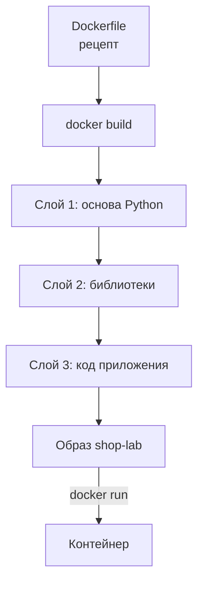
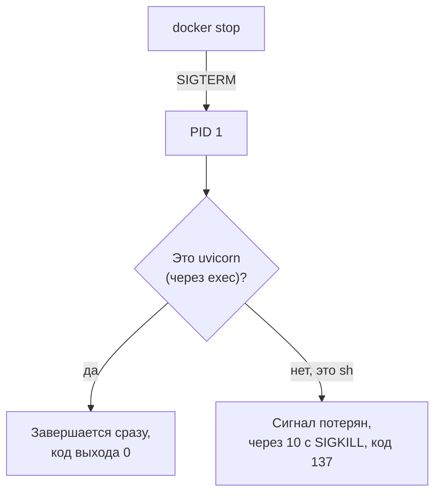

## Зачем это нужно

В [уроке 5.1](01-containers.md) ты запускал готовые образы с Docker Hub: nginx, PostgreSQL. Но образа «Магазина» там нет: его никто не выкладывал, он **собирается на твоей машине** при первом `docker compose up --build` (Compose разберём в [уроке 5.3](03-compose-shop.md); пока считай, что флаг `--build` велит собрать образ из исходников). Помнишь, в 2.1 стенд поднимался несколько минут? Именно тогда Docker скачивал Python, ставил библиотеки и упаковывал код.

Для нагрузочного тестировщика это не академический вопрос. Ты будешь менять настройки стенда и пересобирать образ десятки раз, и если не понимаешь кэш сборки, то будешь либо ждать лишние минуты, либо, что хуже, тестировать **старый** код, думая, что он новый. Файл `Dockerfile` ещё и документирует, из чего состоит сервис: версия Python, библиотеки, команда запуска. Когда в отчёте о тесте нужно сказать «на какой версии проверяли», ответ лежит здесь.

Шаг проекта: ты разберёшь `project/shop/shop/Dockerfile` и `entrypoint.sh` строку за строкой, соберёшь свой образ вручную командой `docker build`, посмотришь, как работает кэш, и сломаешь его нарочно. Файлы для экспериментов лежат в `~/perf-lab/05-docker/`: чужой клон репозитория мы не портим.

## Что нужно знать

- Образ, контейнер, слои, теги: [урок 5.1](01-containers.md). Ты там смотрел `docker history`, теперь увидишь, откуда берутся слои.
- Файлы, права на выполнение (`chmod +x`), переменные окружения и `PATH`: [урок 1.1](../01-linux/01-workstation-terminal.md), скрипты оболочки `#!/bin/sh`: [урок 1.5](../01-linux/05-bash-scripts.md).
- Стенд «Магазин» и его устройство в общих чертах: [урок 2.3](../02-web/03-backend-anatomy.md).
- Python, `pip` и `requirements.txt` по-настоящему ты проходишь в [теме 4](../04-python/05-venv-requests.md). Здесь достаточно знать: `pip install` скачивает библиотеки, а `requirements.txt` это их список.
- Глубже про написание Dockerfile и многоэтапную сборку: [урок DevOps «Dockerfile»](https://distinguished-sre.github.io/devops/05-docker/02-dockerfile.html). Для курса хватит того, что ниже.

## Картина целиком

Dockerfile это **рецепт блюда с заготовками**. В рецепте сказано: «возьми готовую основу (Python), поставь на неё библиотеки, положи туда код, и вот так это запускать». Повар (команда `docker build`) выполняет шаги сверху вниз, и после каждого шага делает **снимок** (слой). Если завтра ты поменяешь только последний шаг, повар не будет готовить заново всё: он достанет снимок после предпоследнего шага и сделает только последний. Это и есть кэш.



Что здесь видно: каждая строка рецепта даёт слой, слои идут в порядке строк, а итог это образ, из которого уже запускают контейнеры. Главная мысль урока: **порядок строк определяет скорость сборки**. То, что меняется редко (библиотеки), ставят выше; то, что меняется часто (код), ниже.

## Теория

### Что такое Dockerfile и чем он отличается от образа

**Зачем это существует.** Если собирать образ руками (запустил контейнер, зашёл внутрь, установил, сохранил), то через месяц никто не вспомнит, что именно ты установил. Нельзя ни повторить, ни проверить. Нужен **текстовый рецепт**, который можно хранить в git и читать как документ.

**Аналогия.** Dockerfile это чертёж, а образ готовая деталь. Из чертежа деталь можно сделать заново в любой момент и получить ту же самую. Аналогия ломается на сетевых зависимостях: если в чертеже написано «возьми болт из ящика» и содержимое ящика поменялось, деталь выйдет другой. Поэтому в Dockerfile «Магазина» версии зафиксированы жёстко.

**Как это устроено.** Dockerfile это простой текстовый файл без расширения. Каждая строка начинается с **инструкции** (заглавное слово), дальше идут её аргументы. Строки, которые начинаются с `#`, комментарии. Сборка идёт сверху вниз. Инструкции, которые меняют файлы (`RUN`, `COPY`), создают слой с содержимым. Инструкции, которые только записывают настройки (`ENV`, `EXPOSE`, `ENTRYPOINT`, `WORKDIR`), создают «пустые» слои размером 0 байт: в них нет файлов, только запись в описании образа.

**Разобранный пример.** Весь Dockerfile «Магазина» умещается в десять строк. Вот он целиком, и ниже мы пройдём по каждой:

```dockerfile
FROM python:3.14.8-slim
WORKDIR /app
COPY requirements.txt .
RUN pip install --no-cache-dir -r requirements.txt
COPY app ./app
COPY entrypoint.sh .
RUN chmod +x entrypoint.sh
ENV PYTHONUNBUFFERED=1 PROMETHEUS_MULTIPROC_DIR=/tmp/shop-metrics
EXPOSE 8000
ENTRYPOINT ["./entrypoint.sh"]
```

**Что путают.** Dockerfile и `compose.yaml`: первый описывает **как собрать один образ**, второй **как запустить несколько контейнеров вместе** (о нём [урок 5.3](03-compose-shop.md)). Это два разных файла с разной ролью.

> **Проверь понимание:** коллега прислал тебе образ в виде файла и говорит «собрано как-то, не помню как». Почему это хуже, чем Dockerfile в репозитории?

<details markdown="1">
<summary>Ответ</summary>

По готовому образу не видно, что и в каком порядке делали: нельзя повторить сборку, проверить версии и безопасность, внести аккуратное изменение. Dockerfile это воспроизводимый и читаемый рецепт, он хранится в git вместе с кодом и его правки видны в истории.

</details>

### `FROM`: основа образа

**Зачем это существует.** Ставить операционную систему и Python с нуля в каждом образе бессмысленно. Берут готовый образ с нужной основой и строят поверх. Первая инструкция Dockerfile всегда `FROM`: она задаёт **базовый образ**, то есть нижний слой стопки.

**Как это устроено.** `FROM python:3.14.8-slim` значит «возьми образ `python` с тегом `3.14.8-slim`». Тег читается по частям: `3.14.8` версия Python, а `slim` вариант образа. Бывают три основных:

| Вариант тега | Что внутри | Размер | Когда |
|---|---|---|---|
| `python:3.14.8` | Debian с компиляторами и кучей утилит | около 1 ГБ | когда нужно собирать нативные библиотеки |
| `python:3.14.8-slim` | Debian урезанный: только Python и минимум системы | около 120 МБ | типичный выбор для сервисов |
| `python:3.14.8-alpine` | минимальная Alpine Linux | около 50 МБ | компактно, но часть библиотек ведёт себя иначе |

«Магазин» использует `slim`: он достаточно мал и при этом совместим с готовыми бинарными библиотеками (`psycopg[binary]`, `bcrypt`). У `slim` нет `curl` и многих других привычных утилит, поэтому в `compose.yaml` проверку здоровья делают через Python (`urllib`), а не через `curl` (увидишь в 5.3).

**Разобранный пример.** Что даёт `FROM` в сборке: в начале вывода `docker build` появится строка про загрузку базового образа. Если он уже скачан в прошлый раз, Docker возьмёт его с диска. Размер базового образа можно узнать так:

```bash
docker image ls python:3.14.8-slim
```

```text
REPOSITORY   TAG           IMAGE ID       CREATED       SIZE
python       3.14.8-slim   9c2e7b1f4a63   3 weeks ago   131MB
```

**Что путают.** Тег `slim` и «без безопасности»: slim только меньше. А Python-версию в Dockerfile путают с версией у тебя на машине: они **не связаны**. Внутри контейнера работает Python 3.14.8, а у тебя на Ubuntu может быть 3.12, и это нормально, в этом смысл контейнера.

> **Проверь понимание:** зачем в `FROM` указывать `3.14.8-slim`, а не просто `python`?

<details markdown="1">
<summary>Ответ</summary>

Без тега Docker возьмёт `latest`, и через несколько месяцев там окажется другая версия Python. Образ «Магазина» будет вести себя иначе, чем при прошлых замерах, и результаты тестов нельзя будет сравнивать. Точная версия делает сборку воспроизводимой, а `slim` экономит размер.

</details>

### `WORKDIR`, `COPY`, `RUN`: рабочая папка, файлы и команды

**Зачем это существует.** Теперь нужно положить в образ код и выполнить установку. Для этого три инструкции.

**Как это устроено.**

- `WORKDIR /app` задаёт **рабочий каталог**: создаёт папку `/app` и делает её текущей для всех следующих строк и для запуска. Это как `mkdir /app && cd /app` ([урок 1.1](../01-linux/01-workstation-terminal.md)), только навсегда.
- `COPY откуда куда` копирует файлы **из папки сборки на твоей машине** (контекст сборки) внутрь образа. `COPY requirements.txt .` кладёт файл в текущий каталог образа, то есть в `/app`. `COPY app ./app` копирует папку с кодом `app` в `/app/app`. Путь «откуда» всегда относителен контексту сборки, в нашем случае каталогу `project/shop/shop/`.
- `RUN команда` выполняет команду **во время сборки** внутри образа, результат попадает в слой. `RUN pip install --no-cache-dir -r requirements.txt` ставит библиотеки по списку. Флаг `--no-cache-dir` говорит pip не хранить скачанные архивы: в образе они не нужны и только раздували бы слой.
- `RUN chmod +x entrypoint.sh` делает скрипт запуска исполняемым (флаг `x`, [урок 1.1](../01-linux/01-workstation-terminal.md)). Права на файл могли потеряться при копировании, поэтому их закрепляют явно.

Важно различать **два момента времени**: сборка (`RUN`, `COPY` выполняются один раз, результат запечатывается в образ) и запуск (`ENTRYPOINT`, `CMD` выполняются при каждом старте контейнера). Если поставить библиотеки при запуске, каждый старт занимал бы минуту.

Содержимое `requirements.txt` «Магазина» это список закреплённых версий:

```text
fastapi==0.142.2
uvicorn[standard]==0.54.0
psycopg[binary,pool]==3.3.6
psycopg-pool==3.3.3
redis==8.1.0
prometheus-client==0.26.0
bcrypt==5.0.0
httpx==0.28.1
```

`==` значит «ровно эта версия». Читать список просто: `fastapi` это веб-фреймворк, на котором написан «Магазин», `uvicorn` сервер, который принимает запросы, `psycopg` драйвер PostgreSQL (`pool` это пул соединений, о нём [тема 11](../11-bottlenecks/index.md)), `redis` клиент Redis, `prometheus-client` отдаёт метрики на `/metrics`, `bcrypt` считает хэши паролей (нагружает процессор: поэтому логин в «Магазине» тяжёлый), `httpx` ходит к заглушке оплаты. В квадратных скобках у `uvicorn[standard]` дополнительные возможности: быстрые версии внутренних частей.

**Разобранный пример.** Вывод `pip` во время сборки (сокращённо):

```text
Collecting fastapi==0.142.2 (from -r requirements.txt (line 1))
  Downloading fastapi-0.142.2-py3-none-any.whl (118 kB)
Collecting uvicorn==0.54.0 (from uvicorn[standard]==0.54.0->-r requirements.txt (line 2))
...
Installing collected packages: ... fastapi, uvicorn, psycopg, redis, bcrypt, httpx
Successfully installed ... fastapi-0.142.2 ... uvicorn-0.54.0 ...
WARNING: Running pip as the 'root' user can result in broken permissions ...
```

Строки `Collecting` и `Downloading` это скачивание библиотек (нужен интернет, и поэтому этот шаг самый долгий). `Successfully installed` итог. Предупреждение про `root`: внутри образа всё работает от `root`, и для учебного стенда это приемлемо, а в продакшене процесс обычно запускают от обычного пользователя; на сборке это предупреждение безвредно.

**Что путают.** `RUN` и `CMD`: первая выполняется при сборке, вторая при запуске. А ещё путают, **откуда** `COPY` берёт файлы: не из папки, где ты сейчас в терминале, а из контекста сборки, который ты указал последним аргументом `docker build`. В `COPY ../что-то` выйти за пределы контекста нельзя.

> **Проверь понимание:** `RUN pip install` в Dockerfile выполнился. Ты запустил три контейнера из этого образа. Сколько раз pip скачивал библиотеки?

<details markdown="1">
<summary>Ответ</summary>

Один раз, при сборке. Результат (установленные библиотеки) запечатан в слое образа, а контейнеры его просто используют. Поэтому запуск контейнера быстрый.

</details>

### Откуда берутся библиотеки: pip, PyPI и закреплённые версии

**Зачем это существует.** Писать всё с нуля никто не хочет: чтобы принимать веб-запросы, считать хэши паролей и ходить в базу, берут готовые **библиотеки** (чужой код, оформленный для повторного использования). Для Python их хранит общий каталог **PyPI** (Python Package Index, pypi.org), а программа **pip** скачивает оттуда нужное.

**Аналогия.** PyPI это склад запчастей, pip курьер, `requirements.txt` заказ-наряд. Заказ-наряд «болт» без размера привезёт какой-нибудь болт, а «болт M8 длиной 30 мм» одинаковый каждый раз. Аналогия ломается на «зависимостях зависимостей»: к болту могут приехать гайки, которых в заказе не было.

**Как это устроено.** Строка `fastapi==0.142.2` просит конкретную версию. Если написать `fastapi` без номера, pip возьмёт самую свежую, и она со временем меняется. Библиотеки тянут за собой свои: `fastapi` приведёт `starlette` и `pydantic`, эти **транзитивные** зависимости pip подберёт сам, их версии не закреплены нашим файлом, но совместимы с закреплёнными. Для учебного стенда этого хватает, а в серьёзных проектах закрепляют и их.

**Разобранный пример.** Сборка, в которой номер версии не закреплён, воспроизводит сегодняшнее состояние PyPI: через полгода при пересборке без кэша ты получишь другие версии и, возможно, другую производительность. Поэтому версии «Магазина» записаны жёстко, и «Проверено на версиях» в каждом уроке курса указывает актуальные номера.

**Что путают.** `pip` на твоей машине и `pip` внутри образа: это два разных набора библиотек, они не пересекаются. Установил что-то себе, в контейнере этого не появилось.

### Кэш слоёв: почему порядок строк важен

**Зачем это существует.** Сборка с нуля занимает минуты: pip качает библиотеки. Если ты поправил одну строку кода, ждать эти минуты заново было бы невыносимо. Docker запоминает результат каждого шага и использует его снова, если шаг не изменился.

**Аналогия.** Конвейер с контрольными точками. Если после третьей станции деталь прошла проверку, и ты поменял только настройки пятой, начинать с первой не нужно: берут деталь, снятую с третьей, и продолжают. Аналогия ломается на правиле «всё ниже»: если ты поменял станцию номер 3, то все станции после неё обязаны переделаться, даже если сами не менялись.

**Как это устроено.** Перед каждым шагом Docker сверяет: та же ли инструкция, и для `COPY` те же ли файлы (по их хэшу). Если всё совпадает, шаг помечается `CACHED` и пропускается. Как только один шаг изменился, **все шаги ниже него выполняются заново**: у них другой «родитель», и старые снимки к ним не подходят. Вот почему Dockerfile «Магазина» устроен именно так:

1. `COPY requirements.txt .` и `RUN pip install` идут **до** копирования кода: список библиотек меняется редко, и самый дорогой шаг (скачивание) остаётся в кэше.
2. `COPY app ./app` идёт **после**: код меняют каждый день, но пересобирается только этот и следующие, дешёвые шаги.

В виджете ниже сравни два порядка. В «хорошем» (как у «Магазина») правка кода пересобирает только нижние слои. В «плохом» код копируется до установки библиотек (`COPY . .` одной строкой), поэтому любая правка файла заставляет pip качать всё заново. Переключай тип изменения и порядок и смотри, какие слои загорятся «пересобрано».

<div class="viz" data-viz="dk-layers" data-change="app" data-order="good"></div>

Что здесь видно: помечены те слои, которые Docker был вынужден выполнить заново. При правке кода в хорошем порядке перестраиваются два-три слоя за пару секунд, в плохом заново отрабатывает pip (около полминуты). При правке списка библиотек перестраивается всё начиная с `COPY requirements.txt`: так и должно быть, ведь библиотеки поменялись.

**Разобранный пример.** Время сборки в трёх сценариях для «Магазина»:

| Сценарий | Что пересобрано | Время |
|---|---|---|
| Первая сборка (нет кэша) | всё, включая скачивание основы и библиотек | 1 мин 15 с |
| Повторная сборка без изменений | ничего, все слои `CACHED` | 1 с |
| Изменил `app/main.py` | `COPY app`, `COPY entrypoint.sh`, `chmod` (pip в кэше) | 3 с |
| Изменил `requirements.txt` | `COPY requirements.txt`, `pip install`, и всё ниже | 40 с |

Числа примерные: они зависят от скорости твоего интернета и диска, но соотношение (секунды против минуты) такое же.

**Что путают.** Кэш считают «ускорением» и забывают о его побочном эффекте: Docker может не заметить изменения, которых не видит. Например, `RUN pip install` с незакреплёнными версиями (`fastapi` без `==`) не пересоберётся, пока не изменилась строка, и будет сидеть на старой версии, хотя на PyPI вышла новая. Закреплённые версии и кэш вместе дают воспроизводимость. Если нужно принудительно собрать без кэша: `docker build --no-cache`.

> **Проверь понимание:** ты поменял одну букву в комментарии в `app/main.py` и пересобрал образ. Какие шаги выполнятся заново и почему pip среди них нет?

<details markdown="1">
<summary>Ответ</summary>

Заново выполнятся `COPY app ./app` (файлы изменились, хэш другой) и все шаги ниже: `COPY entrypoint.sh`, `RUN chmod`. Шаги выше (`FROM`, `WORKDIR`, `COPY requirements.txt`, `RUN pip install`) не менялись и берутся из кэша, потому что `requirements.txt` тот же и порядок такой, что установка библиотек стоит до копирования кода.

</details>

### `ENV`, `EXPOSE`, `ENTRYPOINT`: настройки запуска

**Зачем это существует.** Образ должен знать, **как себя запускать** и какие значения брать по умолчанию. Эти инструкции не меняют файлы, они дописывают в образ «паспорт».

**Как это устроено.**

- `ENV PYTHONUNBUFFERED=1 PROMETHEUS_MULTIPROC_DIR=/tmp/shop-metrics` задаёт переменные окружения для всех запущенных процессов. `PYTHONUNBUFFERED=1` отключает буферизацию вывода Python: без неё строки логов могли бы копиться в памяти и появляться в `docker logs` с опозданием, а при падении пропадать. `PROMETHEUS_MULTIPROC_DIR` это каталог, в котором рабочие процессы сервера обмениваются счётчиками метрик (когда воркеров несколько, каждый считает своё, а `/metrics` должен отдать сумму).
- `EXPOSE 8000` записывает в образ «эта программа слушает порт 8000». Это **документация**, а не открытие порта: опубликовать порт наружу делает `-p` или `ports:` в Compose (вспомни [урок 5.1](01-containers.md)).
- `ENTRYPOINT ["./entrypoint.sh"]` задаёт, **какая программа запускается** при старте контейнера. Форма со списком в квадратных скобках (exec-форма) запускает программу напрямую, без промежуточной оболочки, и это важно для остановки контейнера (см. ниже). Рядом существует `CMD`: это аргументы по умолчанию, которые можно заменить при запуске. В «Магазине» `CMD` нет, а `ENTRYPOINT` один.

**Разобранный пример.** Скрипт `entrypoint.sh` по строкам:

```sh
#!/bin/sh
set -eu
export PROMETHEUS_MULTIPROC_DIR="${PROMETHEUS_MULTIPROC_DIR:-/tmp/shop-metrics}"
mkdir -p "$PROMETHEUS_MULTIPROC_DIR"
find "$PROMETHEUS_MULTIPROC_DIR" -type f -name '*.db' -delete
exec uvicorn app.main:app --host 0.0.0.0 --port 8000 --workers "${WEB_CONCURRENCY:-1}" --no-access-log
```

- `#!/bin/sh` первая строка говорит системе, какой оболочкой исполнять файл ([урок 1.5](../01-linux/05-bash-scripts.md)).
- `set -eu` включает строгий режим: `-e` останавливает скрипт при первой ошибке, `-u` считает обращение к несуществующей переменной ошибкой. Скрипт не продолжит работу «в полусломанном» состоянии.
- `export ...:-/tmp/shop-metrics`: берёт значение переменной, а если она не задана, использует запасное после `:-`. Тот же приём `${ПЕРЕМЕННАЯ:-значение}` ты увидишь в `compose.yaml`.
- `mkdir -p` создаёт каталог метрик, `find ... -delete` стирает файлы метрик прошлого запуска, чтобы новый стенд не считал старые цифры. Без этой очистки после перезапуска счётчики показывали бы значения из прошлой жизни.
- Последняя строка запускает сервер. `--host 0.0.0.0` значит «слушай на всех адресах контейнера» (иначе опубликованный порт не сработает: [урок 5.1](01-containers.md)). `--workers "${WEB_CONCURRENCY:-1}"` берёт число рабочих процессов из переменной, по умолчанию 1: эту ручку мы покрутим в [теме 11](../11-bottlenecks/index.md). `--no-access-log` отключает стандартный журнал запросов uvicorn, потому что «Магазин» пишет свои JSON-логи.

Особое слово в последней строке: **`exec`**. Без него оболочка запустила бы uvicorn как дочерний процесс и сама осталась бы с номером 1. Когда `docker stop` отправляет сигнал SIGTERM процессу 1, оболочка его не передаст, uvicorn не узнает о просьбе завершиться, и через 10 секунд Docker убьёт контейнер силой (код 137). `exec` **заменяет** оболочку uvicorn'ом: он становится процессом 1 и получает сигнал сам, закрывает соединения и завершается чисто (код 0).



Что здесь видно: одно слово `exec` определяет, закончится ли контейнер за долю секунды или будет висеть десять. Это не мелочь: каждый перезапуск стенда в тестах стал бы на десять секунд дольше.

**Что путают.** `ENV` (значения по умолчанию, зашитые в образ) и переменные из `compose.yaml` или `-e` (они **перекрывают** значения из `ENV` при запуске). И `EXPOSE` с публикацией порта, о чём сказано выше.

> **Проверь понимание:** ты убрал слово `exec` из последней строки `entrypoint.sh` и пересобрал образ. Что изменится при `docker stop`, и как это заметить?

<details markdown="1">
<summary>Ответ</summary>

Сигнал SIGTERM придёт к оболочке `sh`, которая не передаст его uvicorn. Контейнер не остановится вежливо и через 10 секунд будет убит: `docker stop` будет длиться около 10 секунд, а статус станет `Exited (137)`. Заметить можно по времени команды (`time docker stop ...`) и по коду выхода в `docker ps -a`.

</details>

### Контекст сборки и `.dockerignore`

**Зачем это существует.** Команда `docker build` отправляет демону всю папку, которую ты указал (**контекст сборки**), и только из неё `COPY` может брать файлы. Если в папке лежат тяжёлые или секретные файлы (`.git`, `.env`, виртуальное окружение), они попадут в контекст и могут оказаться в образе.

**Как это устроено.** В папке контекста можно положить файл `.dockerignore` со списком имён, которые нужно исключить: `.git`, `.venv`, `__pycache__`, `.env`. В репозитории учебного стенда в `project/shop/shop/` этого файла нет: код маленький и в нём нет ничего лишнего. Но на рабочих проектах такой файл есть почти всегда. Первая строка вывода `docker build` показывает размер контекста: `transferring context: 12.34kB` (мало) против `transferring context: 1.2GB` (кто-то забыл исключить виртуальное окружение).

**Что путают.** `.dockerignore` и `.gitignore`: файлы похожи, но работают для разных программ. Не копируй `.env` с паролями в образ: переменные передают при запуске, а не зашивают при сборке.

> **Проверь понимание:** сборка стала долго «зависать» на строке `transferring context`. Что проверить?

<details markdown="1">
<summary>Ответ</summary>

Размер папки контекста: в неё могли попасть тяжёлые каталоги (`.git`, окружение, выгрузки логов). Решение: убрать их из папки или перечислить в `.dockerignore`.

</details>

### Многоэтапная сборка: как делают образ меньше

**Зачем это существует.** Некоторым программам для сборки нужны тяжёлые инструменты: компилятор, заголовочные файлы, менеджеры пакетов. А для работы они не нужны. Если оставить их в образе, он раздуется до гигабайта, и каждый скачивающий платит за ненужное временем и местом. Решение: **многоэтапная сборка** (multi-stage build).

**Как это устроено.** В одном Dockerfile бывает несколько `FROM`. Первый этап («сборочная») берёт тяжёлый образ, компилирует, ставит. Второй этап берёт лёгкий образ и копирует из первого только готовый результат (`COPY --from=build /app/result /app/`). Всё, что осталось на первом этапе, в итоговый образ не попадает.

**Разобранный пример.** Схема, не из «Магазина» (ему это не нужно, библиотеки приходят в готовом виде, `psycopg[binary]` и `bcrypt` уже скомпилированы):

```dockerfile
FROM python:3.14.8 AS build
RUN pip wheel --wheel-dir /wheels -r requirements.txt
FROM python:3.14.8-slim
COPY --from=build /wheels /wheels
RUN pip install --no-index --find-links /wheels -r requirements.txt
```

Первый этап собирает «колёса» (готовые к установке архивы библиотек) на тяжёлом образе, второй ставит их на лёгкий. Так же устроены образы Go и Java, где компилятор нужен только при сборке. Для нас важно уметь узнать это, когда встретишь в чужом Dockerfile несколько строк `FROM`.

**Что путают.** Этапы со слоями: у каждого этапа свои слои, но в итоговый образ попадают только слои **последнего** этапа и то, что ты явно скопировал.

### Теги при сборке

**Как это устроено.** Когда ты собираешь образ, ты даёшь ему имя и тег флагом `-t`: `docker build -t shop-lab:exp .`. Одному образу можно навесить несколько тегов (`docker tag shop-lab:exp shop-lab:v1`): это просто разные метки на тот же набор слоёв, место на диске они не занимают. Compose, когда видит `build: ./shop`, сам собирает образ и называет его `shop-shop` (проект `shop`, сервис `shop`): так ты и увидишь его в `docker image ls`.

Практический вывод для тестов: **метка версии образа и версии кода должны совпадать**. Хорошая привычка: перед нагрузочным прогоном записывать в отчёт, из какого коммита собран образ (`git rev-parse --short HEAD`), а в `-t` писать тег с этим же коммитом.

## Практика

Ты не будешь править файлы в клоне `~/load-tester`: он должен остаться чистым, иначе `git pull` потом начнёт ругаться на конфликты. Скопируй каталог сервиса в свой репозиторий и работай с копией.

### 1. Подготовь копию для экспериментов

```bash
mkdir -p ~/perf-lab/05-docker
cp -r ~/load-tester/project/shop/shop ~/perf-lab/05-docker/shop-build
cd ~/perf-lab/05-docker/shop-build
ls -la
```

Разбор: `cp -r` копирует папку вместе со всем содержимым (`-r` recursive); конечный каталог `shop-build` будет создан. `ls -la` показывает файлы с правами.

```text
total 24
drwxr-xr-x 3 student student 4096 Oct  3 11:02 .
drwxr-xr-x 3 student student 4096 Oct  3 11:02 ..
-rw-r--r-- 1 student student  284 Oct  3 11:02 Dockerfile
drwxr-xr-x 3 student student 4096 Oct  3 11:02 app
-rw-r--r-- 1 student student  424 Oct  3 11:02 entrypoint.sh
-rw-r--r-- 1 student student  158 Oct  3 11:02 requirements.txt
```

**Как читать вывод:** четыре элемента контекста сборки: рецепт `Dockerfile`, папка кода `app`, скрипт запуска и список библиотек. У `entrypoint.sh` права `-rw-r--r--`: буквы `x` (исполнение) нет, в репозитории файл хранится без неё. Поэтому в Dockerfile есть строка `RUN chmod +x entrypoint.sh`: без неё запуск образа упал бы с `permission denied`. Размеры могут слегка отличаться.

### 2. Первая сборка

```bash
docker build -t shop-lab:exp .
```

Разбор: `docker build` собирает образ; `-t shop-lab:exp` даёт ему имя `shop-lab` и тег `exp`; точка в конце это **контекст сборки**: текущая папка. Не забудь точку: без неё будет ошибка `requires exactly 1 argument`.

```text
[+] Building 74.3s (12/12) FINISHED                              docker:default
 => [internal] load build definition from Dockerfile                       0.0s
 => => transferring dockerfile: 284B                                       0.0s
 => [internal] load metadata for docker.io/library/python:3.14.8-slim      1.2s
 => [internal] load .dockerignore                                          0.0s
 => => transferring context: 2B                                            0.0s
 => [1/7] FROM docker.io/library/python:3.14.8-slim@sha256:7d1c...        18.4s
 => => resolve docker.io/library/python:3.14.8-slim@sha256:7d1c...         0.0s
 => [internal] load build context                                          0.0s
 => => transferring context: 22.37kB                                       0.0s
 => [2/7] WORKDIR /app                                                     0.3s
 => [3/7] COPY requirements.txt .                                          0.0s
 => [4/7] RUN pip install --no-cache-dir -r requirements.txt              46.8s
 => [5/7] COPY app ./app                                                   0.0s
 => [6/7] COPY entrypoint.sh .                                             0.0s
 => [7/7] RUN chmod +x entrypoint.sh                                       0.0s
 => exporting to image                                                     3.6s
 => => exporting layers                                                    3.5s
 => => naming to docker.io/library/shop-lab:exp                            0.0s
```

(Шагов семь: `FROM`, `WORKDIR`, два `COPY`, `RUN pip`, ещё `COPY` и `RUN chmod`. Строки `ENV`, `EXPOSE` и `ENTRYPOINT` в нумерацию не входят, они только дописывают настройки.)

**Как читать вывод:** каждая строка `=> [N/M]` это шаг рецепта, число справа время в секундах. Самое долгое: `FROM` (первый раз скачивается основа, 18 с) и `RUN pip install` (47 с: скачивание библиотек). Строки `[internal] ...` служебные: Docker читает Dockerfile, метаданные базового образа и контекст. `transferring context: 22.37kB` размер контекста: маленький, значит, лишнего нет. В конце `naming to ... shop-lab:exp`: образ получил имя.

Проверь результат:

```bash
docker image ls shop-lab
```

```text
REPOSITORY   TAG   IMAGE ID       CREATED          SIZE
shop-lab     exp   5e8c1a2d93b7   40 seconds ago   262MB
```

Размер 262 МБ: основа (131 МБ) плюс библиотеки (около 130 МБ) и несколько килобайт кода.

**Типичные ошибки:**

- `ERROR: failed to solve: failed to read dockerfile: open Dockerfile: no such file or directory`: ты не в той папке. `pwd` и `ls`: в текущем каталоге должен лежать `Dockerfile`.
- `docker buildx build requires exactly 1 argument`: забыта точка (контекст) в конце команды.
- `ERROR: Could not find a version that satisfies the requirement ...` во время pip: нет интернета или опечатка в `requirements.txt`. Проверь `curl -I https://pypi.org`.
- `failed to fetch anonymous token ... dial tcp: lookup registry-1.docker.io: no such host`: Docker не достучался до реестра, проверь сеть и DNS ([урок 1.4](../01-linux/04-network-cli.md)).

### 3. Посмотри слои

```bash
docker history shop-lab:exp
```

```text
IMAGE          CREATED          CREATED BY                                      SIZE      COMMENT
5e8c1a2d93b7   2 minutes ago    ENTRYPOINT ["./entrypoint.sh"]                  0B        buildkit.dockerfile.v0
<missing>      2 minutes ago    EXPOSE map[8000/tcp:{}]                         0B        buildkit.dockerfile.v0
<missing>      2 minutes ago    ENV PYTHONUNBUFFERED=1 PROMETHEUS_MULTIPROC…    0B        buildkit.dockerfile.v0
<missing>      2 minutes ago    RUN /bin/sh -c chmod +x entrypoint.sh # buil…   424B      buildkit.dockerfile.v0
<missing>      2 minutes ago    COPY entrypoint.sh . # buildkit                 424B      buildkit.dockerfile.v0
<missing>      2 minutes ago    COPY app ./app # buildkit                       21.5kB    buildkit.dockerfile.v0
<missing>      2 minutes ago    RUN /bin/sh -c pip install --no-cache-dir -…   128MB     buildkit.dockerfile.v0
<missing>      2 minutes ago    COPY requirements.txt . # buildkit              158B      buildkit.dockerfile.v0
<missing>      2 minutes ago    WORKDIR /app                                    0B        buildkit.dockerfile.v0
<missing>      3 weeks ago      CMD ["python3"]                                 0B        buildkit.dockerfile.v0
...
```

**Как читать вывод:** читай **снизу вверх**, как шла сборка. Нижние строки (их скрыто многоточием) принадлежат базовому образу Python. Выше идут наши инструкции, по одной на строку Dockerfile. Колонка `SIZE`: тяжёлый слой только один, `pip install`, 128 МБ. Копирование кода `COPY app` весит 21 килобайт. Именно поэтому правка кода не стоит ничего, а правка библиотек стоит дорого. Размеры слоёв можно сопоставить с тем, что рассказывал виджет.

### 4. Кэш в действии

Повтори сборку без изменений и засеки время:

```bash
time docker build -t shop-lab:exp .
```

```text
[+] Building 1.1s (12/12) FINISHED                               docker:default
 => [internal] load build definition from Dockerfile                       0.0s
 => [internal] load metadata for docker.io/library/python:3.14.8-slim      0.9s
 => [1/7] FROM docker.io/library/python:3.14.8-slim@sha256:7d1c...         0.0s
 => CACHED [2/7] WORKDIR /app                                              0.0s
 => CACHED [3/7] COPY requirements.txt .                                   0.0s
 => CACHED [4/7] RUN pip install --no-cache-dir -r requirements.txt        0.0s
 => CACHED [5/7] COPY app ./app                                            0.0s
 => CACHED [6/7] COPY entrypoint.sh .                                      0.0s
 => CACHED [7/7] RUN chmod +x entrypoint.sh                                0.0s
 => exporting to image                                                     0.0s

real    0m1.3s
```

Слово **`CACHED`** означает, что шаг пропущен. Вся сборка заняла секунду. Теперь поменяй код:

```bash
echo '# правка для эксперимента' >> app/main.py
time docker build -t shop-lab:exp .
```

```text
 => CACHED [2/7] WORKDIR /app                                              0.0s
 => CACHED [3/7] COPY requirements.txt .                                   0.0s
 => CACHED [4/7] RUN pip install --no-cache-dir -r requirements.txt        0.0s
 => [5/7] COPY app ./app                                                   0.0s
 => [6/7] COPY entrypoint.sh .                                             0.0s
 => [7/7] RUN chmod +x entrypoint.sh                                       0.0s
 => exporting to image                                                     0.4s

real    0m2.1s
```

**Как читать вывод:** шаги выше кода остались `CACHED`, включая дорогой `pip`; пересобрались `COPY app` (файл изменился) и всё после. Две секунды против почти полутора минут. Теперь поменяй список библиотек (добавь безобидный комментарий):

```bash
echo '# правка для эксперимента' >> requirements.txt
time docker build -t shop-lab:exp .
```

В выводе `[3/7] COPY requirements.txt .` перестанет быть `CACHED`, и `RUN pip install` пойдёт заново (около 40-50 секунд), хотя набор библиотек не изменился: Docker сравнивает **файл**, а не его смысл. Так и устроена цена: изменил файл, пересобрал всё ниже.

### 5. Собери «плохой» вариант и сравни

Создай рядом второй Dockerfile, где код копируется до установки:

```bash
cat > Dockerfile.bad <<'EOF'
FROM python:3.14.8-slim
WORKDIR /app
COPY . .
RUN pip install --no-cache-dir -r requirements.txt
RUN chmod +x entrypoint.sh
ENV PYTHONUNBUFFERED=1 PROMETHEUS_MULTIPROC_DIR=/tmp/shop-metrics
EXPOSE 8000
ENTRYPOINT ["./entrypoint.sh"]
EOF
docker build -f Dockerfile.bad -t shop-lab:bad .
```

Разбор: `cat > файл <<'EOF' ... EOF` записывает несколько строк в файл (конструкция называется heredoc, [урок 1.5](../01-linux/05-bash-scripts.md)); `-f` указывает другой Dockerfile вместо стандартного. Первая сборка займёт столько же, сколько хорошая. Теперь измени код и пересобери:

```bash
echo '# ещё правка' >> app/main.py
time docker build -f Dockerfile.bad -t shop-lab:bad .
```

В выводе строка `COPY . .` пересобралась, а за ней и `RUN pip install`: снова около 45 секунд на скачивание библиотек из-за одной строки комментария. Вывод по цифрам: хороший порядок 2 секунды, плохой 47. Именно поэтому в Dockerfile сначала копируют **только** список зависимостей.

### 6. Проверь, что внутри образа

```bash
docker run --rm --entrypoint python shop-lab:exp -c "import fastapi; print(fastapi.__version__)"
```

Разбор: `--rm` удалит контейнер после выхода; `--entrypoint python` **заменяет** `ENTRYPOINT` из образа на `python`, иначе запустился бы сервер; всё, что после имени образа, это аргументы: `-c "..."` значит «выполни этот код». Контейнер напечатает версию библиотеки и сразу завершится.

```text
0.142.2
```

**Как читать вывод:** версия совпадает с записью в `requirements.txt` (`fastapi==0.142.2`): образ собран так, как написано в рецепте. Тот же приём (`--entrypoint`) пригодится всегда, когда нужно заглянуть в образ и не запускать его по-настоящему. Посмотри ещё `docker run --rm --entrypoint sh shop-lab:exp -c "ls -la /app"`: увидишь `app`, `entrypoint.sh` и `requirements.txt` в `/app`, именно туда их положили `WORKDIR` и `COPY`.

### 7. Теги

```bash
docker tag shop-lab:exp shop-lab:v1
docker image ls shop-lab
```

```text
REPOSITORY   TAG   IMAGE ID       CREATED          SIZE
shop-lab     v1    5e8c1a2d93b7   3 minutes ago    262MB
shop-lab     exp   5e8c1a2d93b7   3 minutes ago    262MB
shop-lab     bad   a77d90c3e1b4   2 minutes ago    262MB
```

**Как читать вывод:** у `exp` и `v1` **одинаковый IMAGE ID**: это два имени одного образа, на диске он один. Размеры колонки `SIZE` показывают «виртуальный» размер каждого образа, но общие слои хранятся один раз. Теперь убери за собой:

```bash
docker image rm shop-lab:v1 shop-lab:exp shop-lab:bad
```

Образ, из которого запущен хотя бы один контейнер, удалить не получится: Docker скажет `conflict: unable to delete ... image is being used by stopped container`. Сначала `docker rm` контейнер.

### 8. Сохрани результат

Положи рядом заметку и сделай коммит. Сам `shop-build` в репозиторий класть не нужно: это копия кода из репозитория стенда, поэтому в коммит идёт только то, что написал ты.

```bash
cd ~/perf-lab/05-docker
cat > notes-dockerfile.md <<'EOF'
# Dockerfile «Магазина»: что запомнить

- Порядок строк: редко меняющееся выше, часто меняющееся ниже.
- requirements.txt копируется ДО кода: pip остаётся в кэше.
- exec в entrypoint.sh: uvicorn становится PID 1 и получает SIGTERM.
- Замеры (мои): первая сборка ___ с, без изменений ___ с, правка кода ___ с, правка requirements ___ с.
EOF
cp shop-build/Dockerfile.bad Dockerfile.bad
cd ~/perf-lab
echo "05-docker/shop-build/" >> .gitignore
git add .gitignore 05-docker
git commit -m "Dockerfile: заметки и пример плохого порядка слоёв (урок 5.2)"
git push
```

Впиши свои реальные замеры времени в заметку вместо подчёркиваний перед коммитом. Строка с `.gitignore` исключает копию кода из репозитория.

## Типичные ошибки при сборке

| Текст ошибки | Причина | Что делать |
|---|---|---|
| `failed to read dockerfile: open Dockerfile: no such file or directory` | ты не в папке с `Dockerfile` | `cd` в нужную папку или `-f путь/к/Dockerfile` |
| `"docker buildx build" requires exactly 1 argument` | не указан контекст (точка) | добавь `.` в конце |
| `COPY failed: file not found in build context` или `"/entrypoint.sh": not found` | файла нет в папке контекста или он указан неверно | проверь `ls` в папке контекста и написание в `COPY` |
| `exec ./entrypoint.sh: no such file or directory` при **запуске** образа | в скрипте символы конца строки Windows (CRLF) или нет оболочки из `#!` | `file entrypoint.sh` покажет `CRLF`; `sed -i 's/\r$//' entrypoint.sh`, пересобрать |
| `exec ./entrypoint.sh: permission denied` | у скрипта нет права на выполнение | `chmod +x entrypoint.sh`, поэтому в Dockerfile стоит `RUN chmod +x` |
| образ собрался, а в контейнере старый код | собирал не тот каталог, или запустил старый образ/контейнер | `docker image ls`: время создания; пересобери и **пересоздай** контейнер |
| `ERROR: No matching distribution found for ...` | опечатка или версии нет на PyPI | проверь строку в `requirements.txt` |

## Сломай и почини

**Поломка 1.** В копии `shop-build` убери из `entrypoint.sh` слово `exec` (последняя строка станет просто `uvicorn app.main:app ...`), пересобери и запусти контейнер, потом останови:

```bash
sed -i 's/^exec //' entrypoint.sh
docker build -t shop-lab:noexec .
docker run -d --name noexec -e DATABASE_URL=postgresql://x:x@127.0.0.1:1/x shop-lab:noexec
sleep 3
time docker stop noexec
docker inspect noexec --format '{{.State.ExitCode}}'
```

(Базы нет, и сервис не запустится полностью, но процесс-оболочка будет жить: для эксперимента этого достаточно.) Что покажет `time`, какой будет код выхода и почему?

<details markdown="1">
<summary>Разбор</summary>

`docker stop` займёт около 10 секунд (`real 0m10.2s`), а код выхода будет `137`. Причина: теперь PID 1 это оболочка `sh`, она не передаёт SIGTERM дочернему uvicorn; Docker ждёт положенные 10 секунд и шлёт SIGKILL. Вернув `exec` (пересобрав образ), увидишь остановку за долю секунды и код `0` или `143`.

Вывод для диагностики: когда остановка контейнера «зависает» на десять секунд, смотри, кто PID 1 внутри (`docker exec ИМЯ ps`). Если это оболочка, а не сервис, ищи `exec` или передавай сигналы явно. Убери за собой: `docker rm -f noexec; docker image rm shop-lab:noexec`.

</details>

**Поломка 2.** Верни `exec`, а в `Dockerfile` поменяй местами строки: `COPY app ./app` поставь перед `COPY requirements.txt .`. Измени код, пересобери и ответь: сколько шагов пересоберётся и почему слой `pip` тоже оказался среди них?

<details markdown="1">
<summary>Разбор</summary>

Пересоберётся и `COPY app`, и все шаги после него, включая `pip install`. Порядок «код перед зависимостями» заставил `pip` стоять **ниже** изменившегося слоя, а всё ниже изменённого пересобирается. Исправление: вернуть `COPY requirements.txt` и `pip install` выше, чем `COPY app`.

</details>

## Словарик урока

| Термин | Простыми словами |
|---|---|
| Dockerfile | Текстовый рецепт, по которому собирается образ |
| Инструкция | Строка-команда Dockerfile: `FROM`, `COPY`, `RUN` и другие |
| Базовый образ | Образ, на котором строится твой: первая строка `FROM` |
| `slim`, `alpine` | Облегчённые варианты базовых образов |
| `FROM` | Задаёт основу образа |
| `WORKDIR` | Рабочая папка внутри образа |
| `COPY` | Копирует файлы с твоей машины в образ при сборке |
| `RUN` | Выполняет команду при сборке и сохраняет результат в слой |
| `ENV` | Переменные окружения, зашитые в образ как значения по умолчанию |
| `EXPOSE` | Запись «программа слушает этот порт», сам порт не открывает |
| `ENTRYPOINT` / `CMD` | Что запускается при старте контейнера |
| Контекст сборки | Папка, которую `docker build` отправляет демону; из неё берёт файлы `COPY` |
| `.dockerignore` | Список файлов, которые не попадут в контекст сборки |
| Кэш слоёв (`CACHED`) | Повторное использование результата шага, если ничего не изменилось |
| Инвалидация кэша | Изменение шага заставляет заново выполнять и все шаги ниже |
| `requirements.txt` | Список библиотек Python с версиями |
| `exec` в скрипте | Заменяет оболочку программой, чтобы сигналы достигали её |
| SIGTERM / SIGKILL | Сигнал «заверши работу» и сигнал «убить немедленно» |
| BuildKit | Современный сборщик образов в Docker, выводит шаги `[N/M]` и кэш |

## Вопросы с собеседований

Раздел для повторения: ответь вслух, потом открой ответ. Вопросы `[на скорость]` нужно уметь отвечать за 30 секунд.

### 1. [junior] [часто] Что такое Dockerfile и что делает `docker build`?

<details markdown="1">
<summary>Ответ</summary>

Dockerfile это текстовый рецепт сборки образа: набор инструкций (`FROM`, `COPY`, `RUN`, `ENTRYPOINT` и других). `docker build` выполняет их сверху вниз, после каждой сохраняет слой и в итоге собирает образ, из которого запускаются контейнеры.

**Что хотят услышать:** рецепт, инструкции, слои, образ как результат; хранится в git рядом с кодом.

**Красный флаг:** «Dockerfile это конфигурация запуска нескольких контейнеров» (путает с Compose).

</details>

### 2. [junior] [часто] Чем `RUN` отличается от `CMD` и `ENTRYPOINT`?

<details markdown="1">
<summary>Ответ</summary>

`RUN` выполняется при **сборке** образа, результат запечатывается в слое. `CMD` и `ENTRYPOINT` задают, что запускать при **старте контейнера**. `ENTRYPOINT` это основная программа, `CMD` аргументы по умолчанию, которые легко заменить при `docker run`.

**Что хотят услышать:** разница «сборка против запуска».

**Красный флаг:** «`RUN` запускает приложение».

</details>

### 3. [junior] [часто] Как работает кэш слоёв и почему важен порядок инструкций?

<details markdown="1">
<summary>Ответ</summary>

Docker пропускает шаг (`CACHED`), если инструкция и входные файлы не изменились. Но изменение одного шага заставляет пересобрать все шаги ниже. Поэтому редко меняющееся (список зависимостей, установка) ставят выше, а часто меняющееся (код) ниже: например, `COPY requirements.txt` и `pip install` до `COPY app`.

**Что хотят услышать:** «всё ниже изменённого слоя пересобирается», пример с зависимостями.

**Красный флаг:** не знает, что кэш бывает и как его сбросить (`--no-cache`).

</details>

### 4. [junior] Зачем в образе «Магазина» используется `python:3.14.8-slim`, а не `python:latest`?

<details markdown="1">
<summary>Ответ</summary>

Точная версия делает сборку воспроизводимой: результаты замеров можно сравнивать, потому что Python не меняется под ногами. `slim` значительно меньше полного образа (около 130 МБ против 1 ГБ), при этом достаточен для работы сервиса с бинарными колёсами библиотек.

**Что хотят услышать:** воспроизводимость, размер, осознанный выбор варианта образа.

**Красный флаг:** «`latest` лучше, потому что всегда свежий».

</details>

### 5. [junior] Что делает `EXPOSE 8000`? Откроет ли он порт?

<details markdown="1">
<summary>Ответ</summary>

Нет. `EXPOSE` лишь документирует, что программа слушает порт 8000. Опубликовать порт на хосте можно только флагом `-p` при `docker run` или `ports:` в Compose.

**Что хотят услышать:** «документация, а не открытие порта».

**Красный флаг:** «`EXPOSE` открывает порт наружу».

</details>

### 6. [middle] Зачем в `entrypoint.sh` стоит `exec` перед `uvicorn`?

<details markdown="1">
<summary>Ответ</summary>

Без `exec` процессом 1 остаётся оболочка, а сервер её дочерний процесс. Сигнал SIGTERM от `docker stop` получает PID 1, и оболочка его не пересылает: сервер не завершается аккуратно, через 10 секунд Docker убивает контейнер (код 137), могут оборваться запросы и не закрыться соединения. `exec` заменяет оболочку сервером, он становится PID 1 и корректно реагирует на остановку.

**Что хотят услышать:** PID 1, сигналы, `docker stop`, код 137.

**Красный флаг:** считает, что `exec` «ускоряет запуск».

</details>

### 7. [middle] Как уменьшить размер образа и время сборки?

<details markdown="1">
<summary>Ответ</summary>

Брать облегчённую основу (`slim`, `alpine`), ставить зависимости с `--no-cache-dir`, держать `.dockerignore`, не копировать лишнее, правильно упорядочивать слои ради кэша, а на сложных проектах использовать многоэтапную сборку (собрать на тяжёлом образе, перенести результат в лёгкий).

**Что хотят услышать:** несколько приёмов и понимание, что размер и скорость это разные цели.

**Красный флаг:** «удалю файлы отдельным `RUN rm`» (удаление в верхнем слое не уменьшает размер нижнего).

</details>

### 8. [middle] Почему нельзя копировать `.env` с секретами в образ?

<details markdown="1">
<summary>Ответ</summary>

Всё, что попало в слой, остаётся в образе навсегда и видно любому, кто получит образ (`docker history`, распаковка слоёв). Удаление файла в следующем слое не помогает: нижний слой по-прежнему содержит секрет. Секреты и настройки передают при запуске (переменные окружения, `env_file`, секреты оркестратора), а в образ добавляют `.dockerignore`.

**Что хотят услышать:** слои неизменяемы, секрет остаётся в истории, настройки при запуске.

**Красный флаг:** «я удалил файл следующей строкой, значит, его нет».

</details>

### 9. [middle] Образ собран, а в контейнере работает старый код. Что проверишь?

<details markdown="1">
<summary>Ответ</summary>

Время создания образа (`docker image ls`), что контейнер **пересоздан** из нового образа (а не просто перезапущен: `docker compose up -d --build` пересоздаёт его), что собирается именно тот каталог и тот Dockerfile, а также не мешает ли кэш (`--no-cache` для проверки).

**Что хотят услышать:** контейнер привязан к образу на момент создания, надо пересоздавать.

**Красный флаг:** «просто перезапущу контейнер».

</details>

### 10. [на скорость] Что означает `CACHED` в выводе сборки?

<details markdown="1">
<summary>Ответ</summary>

Шаг не выполнялся заново: инструкция и входные файлы не изменились, Docker взял готовый слой из кэша.

</details>

### 11. [на скорость] Почему `COPY requirements.txt` стоит раньше `COPY app`?

<details markdown="1">
<summary>Ответ</summary>

Зависимости меняются редко, код часто. Если слой с `pip install` стоит выше кода, то при правке кода он остаётся в кэше, и сборка занимает секунды вместо минуты.

</details>

### 12. [на скорость] Чем `docker build -t shop:1 .` отличается от `docker build shop:1`?

<details markdown="1">
<summary>Ответ</summary>

В первом `-t` задаёт имя и тег, а точка указывает контекст сборки. Во втором не хватает флага `-t` и контекста: Docker воспримет `shop:1` как путь к контексту и выдаст ошибку.

</details>

## Проверено на версиях

Ubuntu 24.04 LTS, Docker Engine 29.x с BuildKit и Buildx, базовый образ `python:3.14.8-slim`, библиотеки из `requirements.txt` (FastAPI 0.142.2, Uvicorn 0.54.0, psycopg 3.3.6). Октябрь 2026. Время сборки и размеры слоёв у тебя будут другими: зависят от интернета и диска.

## Итог урока: ты умеешь

- [ ] Объяснить, что такое Dockerfile, инструкция, слой, и чем сборка отличается от запуска.
- [ ] Прочитать Dockerfile «Магазина» строка за строкой и сказать, зачем нужна каждая.
- [ ] Объяснить, зачем в `entrypoint.sh` стоит `exec` и что бывает без него (код 137).
- [ ] Собрать образ `docker build -t имя:тег .` и прочитать вывод шагов, метки `CACHED` и время.
- [ ] Объяснить кэш слоёв и доказать на опыте, что порядок `COPY requirements.txt` и `COPY app` влияет на время сборки.
- [ ] Посмотреть слои `docker history` и проверить версию библиотеки внутри образа через `--entrypoint`.
- [ ] Поставить тег на образ и объяснить, почему два тега не удваивают размер.
- [ ] Расшифровать ошибки: `no such file or directory`, `requires exactly 1 argument`, `permission denied` при запуске скрипта.

Дальше: [урок 5.3. Docker Compose: поднимаем «Магазин» с базой и кэшем](03-compose-shop.md), где образы, которые ты теперь умеешь собирать, объединяются в целый стенд.
