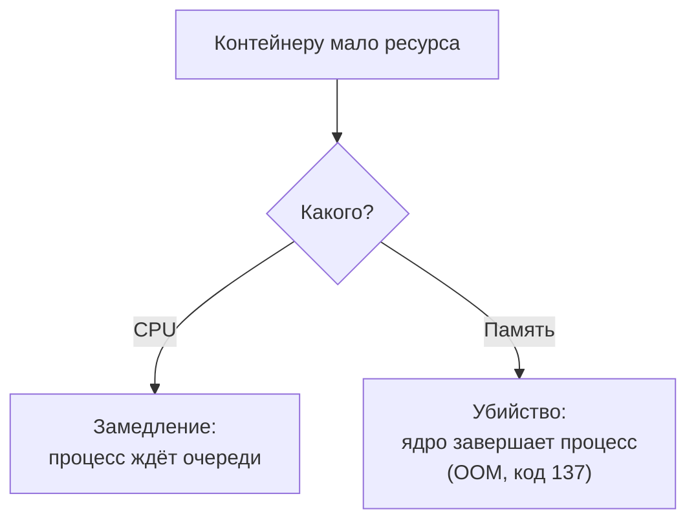

## Зачем это нужно

Нагрузочный тест отвечает на вопрос «сколько выдержит система». Но ответ всегда звучит с оговоркой: «**на этом железе и с этими лимитами**». Если ты не знаешь, сколько процессора и памяти получил контейнер, число «выдержал 150 запросов в секунду» ничего не значит: на другой машине оно будет другим.

В `compose.yaml` «Магазина» есть две строки, которые ты видел в [уроке 5.3](03-compose-shop.md) и пока не объяснял: `cpus: "1.0"` и `mem_limit: 512m`. Они ограничивают магазин одним ядром процессора и 512 МБ памяти. Эти строки делают поведение стенда предсказуемым: «Магазин» упрётся в предел за секунды нагрузки, а не когда у твоего ноутбука закончатся ресурсы. Но они же делают его **непохожим на продакшен**, и честный отчёт о тесте обязан об этом сказать.

Шаг проекта: ты научишься смотреть, сколько ресурсов съедает каждый контейнер (`docker stats`), поймаешь убийство контейнера из-за нехватки памяти (код выхода 137) и его автоперезапуск, своими руками увидишь, как лимит процессора ограничивает пропускную способность, и сформулируешь, какие выводы из теста на ноутбуке можно переносить на «боевую» систему, а какие нельзя. Это основа [темы 8](../08-perf-theory/01-latency-throughput.md) и особенно [темы 11](../11-bottlenecks/index.md).

## Что нужно знать

- Процессор, память, загрузка и `top`: [урок 1.3](../01-linux/03-processes-resources.md). Если не помнишь, что такое `%CPU` и RSS, вернись туда.
- Контейнеры, `docker stop`, код выхода: [урок 5.1](01-containers.md). `compose.yaml` и `.env`: [урок 5.3](03-compose-shop.md).
- Паспорт машины (сколько ядер, сколько памяти), который ты записывал в [уроке 1.1](../01-linux/01-workstation-terminal.md).
- Глубже про cgroups и лимиты: [урок DevOps «Ресурсы контейнеров»](https://distinguished-sre.github.io/devops/05-docker/04-resources.html). В этом курсе нам нужна практическая часть, и она ниже.

## Картина целиком

Представь общую квартиру на четверых. У всех общие кухня и ванная (процессор и память). Если один жилец занял плиту на весь вечер, остальные голодные. Решение: **расписание** (каждому по часу) и **ограничение** (никто не берёт больше одной конфорки). Лимиты контейнеров это как раз ограничение: ядро Linux следит, чтобы контейнер не забрал больше, чем ему выдали.

С процессором и памятью это работает по-разному, и это главное, что нужно понять:



Что здесь видно: нехватка процессора **замедляет** (ты увидишь это как рост задержки), нехватка памяти **убивает**. Это две разные поломки с разными симптомами, и диагностировать их нужно по-разному.

## Теория

### Ресурсы контейнера: что вообще ограничивается

**Зачем это существует.** Контейнеры делят ядро, процессор, память и диск хоста. Без ограничений одна прожорливая программа (утечка памяти, бесконечный цикл) способна остановить всё остальное на машине, включая соседние контейнеры и твой собственный терминал. Лимит защищает **соседей** от виновника.

**Аналогия.** Предохранитель в щитке. Он не делает лампочку ярче и не чинит проводку, он отключает опасный контур, чтобы не сгорел весь дом. Аналогия ломается тем, что у процессора лимит не «выбивает пробки», а мягко прижимает потребителя.

**Как это устроено.** Ограничения создаёт ядро Linux через механизм **cgroups** (control groups: «контрольные группы», о нём упоминали в [уроке 5.1](01-containers.md)). Для каждого контейнера Docker создаёт группу и записывает в неё лимиты, ядро следит за их соблюдением. Главные лимиты:

| Ресурс | Ключ в `compose.yaml` | Флаг `docker run` | Что бывает при превышении |
|---|---|---|---|
| Процессор | `cpus: "1.0"` | `--cpus 1.0` | замедление (троттлинг) |
| Память | `mem_limit: 512m` | `--memory 512m` | убийство процесса (OOM) |
| Диск, сеть | не заданы в «Магазине» | `--device-write-bps` и другие | зависит от настройки |

У «Магазина» заданы два лимита: `shop` получает 1 ядро и 512 МБ, `postgres` 1 ядро и 1 ГБ. У `redis` и `payment` лимитов нет.

**Что путают.** Лимит и **резервирование**. Лимит это потолок, а не гарантия: контейнер с `cpus: 1.0` не получает «своё» ядро, он может получить меньше, если машина занята другими. А ещё путают «ограничение контейнера» с «ресурсами машины»: если `cpus: 4`, а у ноутбука 2 ядра, лимит ничего не значит, потолок физический.

> **Проверь понимание:** у ноутбука 8 ядер. Контейнеру задано `cpus: "2"`. Может ли он использовать 3 ядра, если остальные свободны?

<details markdown="1">
<summary>Ответ</summary>

Нет. Лимит это потолок: даже при свободных ядрах контейнер получит не больше двух ядер процессорного времени. Остальные простаивают, и именно так лимит делает тест воспроизводимым: результат не зависит от того, сколько свободных ядер оказалось на машине сегодня.

</details>

### CPU: квоты, троттлинг и что такое «1 ядро»

**Зачем это существует.** Процессор нельзя «отрезать» по частям, как память: ядро либо выполняет твой код в данный момент, либо нет. Чтобы ограничить «1.0 ядра», ядро Linux использует **квоты времени**.

**Как это устроено.** Время делится на окна по 100 миллисекунд. Лимит `cpus: "1.0"` значит: в каждом окне контейнеру положено 100 мс процессорного времени, то есть ровно одно ядро на всё окно. `cpus: "0.5"` это 50 мс на окно, `cpus: "2"` это 200 мс (процессы работают на двух ядрах одновременно). Если процессы контейнера израсходовали квоту раньше конца окна, ядро **приостанавливает** их до начала следующего окна. Это называется **троттлинг** (throttling, «притормаживание»).

Для приложения это выглядит так: запрос, который мог бы выполниться за 5 мс, иногда попадает в паузу и «зависает» на десятки миллисекунд. Средняя загрузка не меняется, а **хвост задержек** растёт: p99 страдает первым (о процентилях [урок 8.1](../08-perf-theory/01-latency-throughput.md)).

Куда смотреть: файл `/sys/fs/cgroup/cpu.stat` внутри контейнера показывает счётчики троттлинга. Два главных поля: `nr_throttled` (сколько окон контейнер был приостановлен) и `throttled_usec` (суммарное время пауз в микросекундах). Если эти числа растут во время теста, процессор стал бутылочным горлышком.

**Разобранный пример.** Магазин с лимитом 1 ядро. Один запрос на `/api/login` тратит около 250 мс процессорного времени на проверку пароля (алгоритм bcrypt при `BCRYPT_ROUNDS=12` специально медленный). Значит, одно ядро за секунду выполнит примерно четыре входа. Ты можешь давать сколько угодно покупателей в секунду: пропускная способность упирается в процессор и не растёт.

```text
cpus 0.5  ->  ~2 входов/с
cpus 1.0  ->  ~4 входа/с
cpus 2.0  ->  ~8 входов/с   (если воркеров достаточно)
```

Расчёт прост: `1 / 0.25 с = 4`, затем умножаем на число ядер. График ниже показывает ту же зависимость.

<div class="viz" data-viz="chart" data-type="line" data-x="0.5,1,1.5,2,3,4" data-series='[{"name":"Входы (login), в секунду","values":[2,4,6,8,12,16],"unit":"вх/с"}]' data-x-label="Лимит CPU, ядер" data-y-label="Пропускная способность" data-unit="вх/с" data-explain="Каждый вход считает bcrypt и занимает ядро примерно на четверть секунды. Удвоил лимит процессора, получил вдвое больше входов (пока хватает воркеров и памяти)."></div>

Что здесь видно: зависимость почти прямая. Для задач, которые «жрут» процессор, лимит ядер напрямую задаёт потолок. Для лёгких запросов (список категорий из кэша) потолок на порядок выше, и упрётся он уже в другое место. Реальные цифры у тебя будут чуть иными, а подробности (почему при `WEB_CONCURRENCY=1` вход ещё и упирается в число процессов) ты разберёшь в [уроке 11.2](../11-bottlenecks/index.md).

**Что путают.** «Загрузка процессора 100%» с «процессор перегружен». Для контейнера с `cpus: 1.0` 100% это **норма при полной нагрузке**: он использует весь свой лимит. А вот 100% при падающей пропускной способности это уже потолок. И путают `cpus` (доля времени) с «номером ядра»: Docker не закрепляет контейнер за конкретным ядром, это делает отдельный флаг `--cpuset-cpus`.

> **Проверь понимание:** `docker stats` показывает у `shop-shop-1` `CPU %` 100%, а у `shop-postgres-1` 8%. О чём это говорит, если растёт задержка ответов?

<details markdown="1">
<summary>Ответ</summary>

Магазин упёрся в свой лимит процессора (одно ядро занято полностью), а база почти простаивает. Узкое место здесь в самом приложении (CPU), а не в базе данных. Чтобы убедиться, можно проверить `nr_throttled` в `cpu.stat`: если растёт, подтверждение получено.

</details>

### Память: лимит, RSS, OOM и код 137

**Зачем это существует.** Память иначе, чем процессор: если процессору можно сказать «подожди», то память либо есть, либо нет. Нельзя «притормозить» нехватку памяти. Когда процесс просит больше, чем осталось, ядро вынуждено выбирать: убить кого-то или падать всей системой.

**Как это устроено.** Лимит `mem_limit: 512m` это потолок на **всю группу** контейнера: сумма памяти всех его процессов (куча приложения, буферы, кэш файлов в памяти). Пока контейнер не дошёл до потолка, ядро не вмешивается. Когда процесс пытается занять больше, ядро пытается освободить, что можно (например, сбросить кэш файлов), а если освободить нечего, включает **OOM killer** (Out Of Memory killer, «убийца при нехватке памяти»): выбирает процесс в группе и завершает его сигналом **SIGKILL**.

Процесс при этом не успевает ничего сохранить и не может «поймать» сигнал. Docker видит завершение главного процесса и помечает контейнер: код выхода 137, а в подробностях `OOMKilled: true`. Что произойдёт дальше, решает **политика перезапуска** (`restart` в `compose.yaml`). У сервисов стенда стоит `restart: unless-stopped`: Docker сразу запускает контейнер заново, и в `docker compose ps` ты увидишь не `Exited (137)`, а `Up 3 seconds` (или `Restarting`, если контейнер падает снова и снова). Статус `Exited (137)` остаётся только у контейнера без политики или остановленного руками. Число **137** это 128 плюс номер сигнала 9 (SIGKILL): так оболочки Linux кодируют «убит сигналом». Запомни: 137 это «убили», и нужно выяснить, кто и почему. Причин две: нехватка памяти (OOM) и принудительная остановка (`docker kill`, `docker stop` по таймауту, как в [уроке 5.2](02-dockerfile.md)).

Как отличить: пока контейнер лежит убитым, `docker inspect` покажет поле `OOMKilled`. Но при автоперезапуске Docker **сбрасывает** его на `false` в момент нового старта, поэтому ловить убийство «по постфактум-полю» ненадёжно. Надёжнее три следа, которые остаются: счётчик перезапусков `RestartCount`, событие `oom` в `docker events` и метрика cAdvisor `container_oom_events_total` (урок [7.4](../07-observability/04-exporters.md)).

```bash
docker inspect shop-shop-1 --format 'перезапусков={{.RestartCount}} OOM={{.State.OOMKilled}}'
```

```text
перезапусков=1 OOM=false
```

`перезапусков=1` значит, что Docker уже один раз поднимал контейнер после падения. Само по себе число не говорит, **почему** он падал: смотри `docker events` (событие `oom` отличает нехватку памяти от `docker kill`) или метрику в Prometheus. Если контейнер сейчас лежит или ещё не успел подняться, `OOM=true` при коде 137 значит память, `OOM=false` при 137 значит, что убил кто-то другой.

**Аналогия.** Лифт с табличкой «не более 400 кг». Пока в нём 399, всё работает. Как только вошёл ещё один человек, лифт не «едет медленнее», он блокируется. С памятью хуже: вместо блокировки лифта из него **выкидывают** кого-то. Аналогия ломается там, что убивают не обязательно «последнего вошедшего», а процесс, который ядро сочтёт самым подходящим.

**Разобранный пример.** Утечка памяти в «Магазине» (`LEAK_ENABLED=1`): каждый запрос навсегда оставляет в памяти 10 килобайт. При 200 запросах в секунду это около 2 МБ в секунду, 120 МБ в минуту. Базовое потребление магазина около 100-140 МБ. До лимита 512 МБ остаётся примерно 380 МБ, их хватит на ~190 секунд. Через три минуты нагрузки контейнер будет убит, ровно как по расчёту, и Docker сразу поднимет его снова. Виджет ниже моделирует это: нагрузка, лимиты, утечка, перезапуск. Включи утечку и смотри на график памяти: линия растёт до красной черты лимита, и появляется метка «OOM, код 137».

<div class="viz" data-viz="dk-limits" data-rps="200" data-cpus="1" data-mem="512" data-leak="1" data-restart="1"></div>

Что здесь видно: два графика, процессор слева и память справа, с красными линиями лимитов. Без утечки память держится ровно и зависит только от нагрузки. С утечкой растёт линейно, и момент убийства определяется арифметикой: (лимит минус базовая память) разделить на скорость роста. Переключатель «перезапуск» включён, как в стенде (`restart: unless-stopped`): контейнер поднимается через несколько секунд и цикл повторяется. Так выглядит «пилообразный» график памяти и периодические провалы пропускной способности. Понижение лимита памяти приближает момент убийства, повышение откладывает, но не отменяет: утечка рано или поздно побеждает любой лимит.

**Что путают.** Рост использования памяти и **утечку**. Приложение (особенно на Python и с кэшем) заполняет память постепенно, потом выходит на плато: это нормально. Утечка это рост **без плато**, и в тесте её ловят длительным прогоном (soak-тест, [урок 8.3](../08-perf-theory/03-test-types.md)) по графику памяти. Ещё путают лимит памяти контейнера и RAM машины: убить может и контейнер за превышение **своего** лимита (OOM контейнера), и всю систему за нехватку RAM (глобальный OOM).

> **Проверь понимание:** контейнер завершился с кодом 137. Ты хочешь понять, это нехватка памяти или кто-то остановил его вручную. Какая команда даст ответ?

<details markdown="1">
<summary>Ответ</summary>

`docker inspect ИМЯ --format '{{.State.OOMKilled}}'` (в проекте Compose имя вида `shop-shop-1`). `true` означает, что контейнер убит за превышение лимита памяти. `false` значит, что убил другой сигнал: `docker kill`, остановка с таймаутом или внешний процесс. Но у стенда стоит `restart: unless-stopped`, а при автоперезапуске Docker сбрасывает `OOMKilled` на новом старте: тогда ищи события `oom` в `docker events`, число `RestartCount` и логи хоста (`dmesg | grep -i oom`).

</details>

### `docker stats`: что смотреть и как читать

**Зачем это существует.** Нужен способ увидеть, сколько ресурсов реально съедает каждый контейнер **сейчас**, чтобы связать нагрузку с потреблением. Лимит ты задал, а потребление надо измерять.

**Как это устроено.** `docker stats` печатает таблицу с живыми значениями, обновляя её раз в секунду; `docker stats --no-stream` печатает один снимок и выходит (удобно для скриптов и отчётов).

| Колонка | Что значит |
|---|---|
| `NAME`, `CONTAINER ID` | какой контейнер |
| `CPU %` | доля **одного ядра**, которую контейнер использует сейчас: 100% это одно ядро полностью, у контейнера с `cpus: 2` максимум 200% |
| `MEM USAGE / LIMIT` | сколько памяти занято и каков потолок: `212MiB / 512MiB` |
| `MEM %` | занятая доля лимита; если лимита нет, доля от всей RAM машины |
| `NET I/O` | сколько байт принято и отправлено по сети с запуска |
| `BLOCK I/O` | сколько байт прочитано с диска и записано |
| `PIDS` | число процессов и потоков внутри |

Единицы: `MiB` и `GiB` двоичные (1 МиБ = 1 048 576 байт), это не мегабайты в обычном смысле, а на 5% больше. Для оценки на глаз разницей можно пренебречь, но в отчёте указывай, как написано.

**Разобранный пример.** Снимок стенда под нагрузкой около 100 запросов в секунду:

```text
NAME               CPU %     MEM USAGE / LIMIT    MEM %     NET I/O           BLOCK I/O        PIDS
shop-shop-1        87.40%    148.3MiB / 512MiB    28.96%    41.2MB / 38.7MB   0B / 0B          12
shop-postgres-1    23.10%    412.8MiB / 1GiB      40.31%    28.9MB / 33.1MB   2.1MB / 118MB    21
shop-redis-1       3.20%     9.6MiB / 15.54GiB    0.06%     2.4MB / 1.7MB     0B / 4.1kB       6
shop-payment-1     1.80%     38.5MiB / 15.54GiB   0.24%     6.3MB / 5.8MB     0B / 0B          4
```

**Как читать вывод:**

- Первым делом смотри на `CPU %` того, у кого лимит: магазин на 87% своего ядра: почти упёрся. Следующий шаг нагрузки уже даст рост задержек.
- `MEM USAGE / LIMIT` у магазина 148 МиБ из 512: запас большой. У PostgreSQL 413 МиБ из 1 ГиБ: он любит память под свой кэш, это нормально, и растёт он обычно до плато.
- У `redis` и `payment` лимита нет, поэтому после слэша стоит вся оперативная память машины (здесь 15.54 ГиБ). Процент у них микроскопический, но это не значит, что запас огромен: он общий на всех.
- `BLOCK I/O` у базы: прочитано 2 МБ, записано 118 МБ: она пишет данные (журнал, таблицы).
- `PIDS` растёт, если приложение плодит процессы или потоки.

Что важно про `CPU %`: значение мгновенное и скачет. Для отчёта нужны **серия замеров** и график, а не один снимок. Такие графики строит мониторинг, который ты поднимешь в теме 7: там будет cAdvisor, он читает те же счётчики cgroups, что и `docker stats`.

**Что путают.** Значение `MEM USAGE` в `docker stats` с «памятью приложения»: в него Docker (в новых версиях) не включает дисковый кэш файлов, но может включать кэш самого ядра для сети; при расхождениях с `top` внутри контейнера оба верны, просто измеряют разное. И не сравнивай `CPU %` разных машин: 100% на ноутбуке и на сервере это разные «ядра».

> **Проверь понимание:** `docker stats` показывает у контейнера `CPU % 198%`. Он нарушил свой лимит `cpus: "1.0"`?

<details markdown="1">
<summary>Ответ</summary>

Скорее всего нет. 198% может быть у контейнера с лимитом `cpus: 2` (максимум 200%). Если лимит действительно 1.0, значение выше 100% (с небольшими всплесками из-за окон 100 мс) означало бы, что лимит не применён. Проверь `docker inspect ИМЯ --format '{{.HostConfig.NanoCpus}}'`: для `cpus: 1.0` там `1000000000`.

</details>

### Свап: почему «памяти хватило» может обманывать

**Зачем это существует.** Когда оперативной памяти не хватает, Linux умеет «выгружать» редко используемые страницы на диск, в **своп** (swap, область диска, которую система использует как продолжение RAM). Программа продолжает жить, но диск в тысячи раз медленнее памяти.

**Как это устроено.** У контейнера есть лимит памяти плюс (по умолчанию) разрешение использовать своп того же размера. Поэтому контейнер с лимитом 512 МБ может «дожить» и после 512 МБ, но работать будет мучительно медленно: задержки вырастут в десятки раз, а в графике CPU видно странное: процессор простаивает, а запросы стоят в очереди. Именно поэтому для честных тестов лимит и своп ограничивают вместе (`--memory 200m --memory-swap 200m`, как в практике): память кончилась, значит, контейнер сразу убит, и ты видишь причину, а не размазанную деградацию.

**Разобранный пример.** Два сценария одной нехватки памяти:

| Сценарий | Что видно в тесте | Как диагностировать |
|---|---|---|
| Своп разрешён | p95 растёт в 20 раз, ошибок нет, CPU низкий | растёт `SWAP` в `docker stats` (если включён), `vmstat` показывает обмен с диском |
| Своп запрещён | контейнер убит и перезапущен, код 137, событие `oom` | `docker events`, `RestartCount`, пропажа ответов на время рестарта |

**Что путают.** «Нет OOM, значит, память в порядке». Нет убийства, но может быть своп, и тогда тест измеряет скорость диска, а не приложения. На сервере в боевой среде своп часто выключают совсем именно по этой причине.

### Почему стенд на ноутбуке не равен продакшену

**Зачем это существует.** Самая опасная ошибка начинающего тестировщика: провести тест на ноутбуке и сказать «система выдерживает 150 запросов в секунду». Это число относится к **ноутбуку с лимитами** и ни к чему больше. Чтобы не вводить в заблуждение, нужно знать, чем стенд отличается от настоящей системы, и уметь это отразить в выводах.

**Как это устроено.** Основные отличия, которые меняют результаты:

| Что | Стенд на ноутбуке | Продакшен |
|---|---|---|
| Железо | 2-16 ядер, общий диск, всё занято вашими программами | выделенные серверы, быстрые диски, ровная загрузка |
| Генератор нагрузки | работает **на той же машине** и отбирает CPU у стенда | отдельные машины, не влияют на систему |
| Сеть | `localhost`: задержка почти 0, потерь нет | реальные задержки и потери, балансировщики, TLS |
| Данные | 10 000 товаров, 200 000 заказов | миллионы строк, другие распределения, «горячие» данные |
| Масштаб | одна копия каждого сервиса | десятки копий, репликация, шардирование |
| Лимиты | искусственные, чтобы упереться | свои, с запасом на пики |
| Соседи | браузер, мессенджеры, обновления | другие системы той же компании |
| Кэши | холодные после старта | прогретые |
| Реальный трафик | синтетический, равномерный | неровный, с пиками и «капризными» клиентами |

Ключевой пункт для тебя: **генератор нагрузки на той же машине**. Locust или k6, которыми ты будешь стрелять по магазину, потребляют процессор. На ноутбуке с 4 ядрами у них конфликт: генератор забирает ядро, у магазина его меньше, часть «медленных ответов» вызвана не магазином, а нехваткой процессора на машине. Всегда смотри загрузку процессора **самого ноутбука** во время теста: если она около 100%, результатам нельзя доверять.

**Что из выводов на стенде можно переносить, а что нет:**

1. **Переносить можно:** качественные выводы. «Без индекса запрос читает 200 000 строк и тормозит», «пул из пяти соединений создаёт очередь», «рост задержки идёт по хоккейной клюшке», «утечка памяти растёт линейно». Форма кривых и причина узких мест при правильной постановке опыта похожи.
2. **Переносить нельзя:** абсолютные числа. «150 RPS» или «p95 = 300 мс» на ноутбуке это не прогноз для продакшена. Максимум это сравнение **до и после** исправления на одном и том же стенде: «после индекса p95 упал с 900 до 120 мс (в 7,5 раза)». Относительное улучшение переносится лучше абсолютного числа, хотя и не гарантированно.
3. **Каждый вывод сопровождай паспортом:** сколько ядер и памяти у машины, какие лимиты у контейнеров, где работал генератор, версия образов и коммита, какие значения `.env`. Без этого результат нельзя ни повторить, ни проверить.

**Разобранный пример.** Две формулировки вывода одного и того же теста:

```text
Плохо:   "Магазин выдерживает 150 запросов в секунду."

Хорошо:  "На стенде (ноутбук 4 ядра/16 ГБ, shop: 1 CPU и 512 МБ, WEB_CONCURRENCY=1,
          генератор Locust на той же машине, загрузка ноутбука при тесте до 70%)
          p95 остаётся ниже 300 мс до 120 RPS, дальше растёт; на 150 RPS p95 = 1,4 с.
          Упирается в CPU контейнера shop (docker stats: 100%, троттлинг растёт).
          Это не прогноз для продакшена: для него нужен прогон на среде с теми же
          лимитами и данными, как в бою."
```

Вторая формулировка длиннее, зато каждое слово в ней проверяемо, и читатель понимает границы вывода.

**Что путают.** «Я ограничил контейнер, поэтому тест воспроизводим»: лимиты контейнера не делают воспроизводимой саму машину (соседей, температуру, кэш диска). Нужны повторные прогоны (хотя бы три) и сравнение разброса: если три прогона дали 140, 148 и 95 RPS, виноват шум, и один из них нужно перепроверить. И путают «стенд плохой» с «стенд не нужен»: для поиска причин и проверки исправлений стенд отлично подходит, просто нельзя выдавать его числа за прогноз.

> **Проверь понимание:** ты провёл тест на ноутбуке и получил предел 120 RPS. Руководитель спрашивает, сколько серверов нужно в продакшене на 6000 RPS. Что ты ответишь?

<details markdown="1">
<summary>Ответ</summary>

Что делить 6000 на 120 нельзя: стенд ограничен одним ядром, генератор делит с ним машину, данных мало, сеть локальная. Из теста можно сказать только качественное («упирается в CPU приложения, масштабируется добавлением воркеров») и предложить провести замер на среде, близкой к боевой, или прогнозировать по метрикам продакшена. Число серверов без такого замера было бы выдуманным.

</details>

## Практика

Стенд из [урока 5.3](03-compose-shop.md) должен быть поднят и здоров (`docker compose ps` показывает `healthy` у четырёх сервисов). Если нет, подними его: `~/perf-lab/05-docker/stand-start.sh`. Нагрузку создаём **только на свой локальный стенд**.

```bash
cd ~/load-tester/project/shop
mkdir -p ~/perf-lab/05-docker
```

### 1. Что у стенда с лимитами

```bash
docker inspect shop-shop-1 shop-postgres-1 shop-redis-1 \
  --format '{{.Name}}: cpu={{.HostConfig.NanoCpus}} mem={{.HostConfig.Memory}}'
```

Разбор: `docker inspect` печатает всё о контейнере (в формате JSON), `--format` берёт из него нужные поля шаблоном. `NanoCpus` лимит процессора в миллиардных долях ядра, `Memory` лимит памяти в байтах (0 значит «без лимита»).

```text
/shop-shop-1: cpu=1000000000 mem=536870912
/shop-postgres-1: cpu=1000000000 mem=1073741824
/shop-redis-1: cpu=0 mem=0
```

**Как читать вывод:** `1000000000` нано-ядер это ровно 1.0 ядра; `536870912` байт это 512 МиБ (512 × 1 048 576); `1073741824` это 1 ГиБ. У Redis нули: лимитов нет. Это те самые две строки из `compose.yaml`, доказанные на живом контейнере.

### 2. Первый снимок `docker stats`

```bash
docker stats --no-stream
```

```text
CONTAINER ID   NAME              CPU %     MEM USAGE / LIMIT    MEM %     NET I/O         BLOCK I/O        PIDS
a1c2e3f4b5d6   shop-shop-1       0.55%     96.2MiB / 512MiB     18.79%    1.1MB / 0.9MB   0B / 0B          7
b2d3f4a5c6e7   shop-postgres-1   0.12%     318.5MiB / 1GiB      31.10%    2.4MB / 2.0MB   9.8MB / 126MB    19
c3e4a5b6d7f8   shop-redis-1      0.68%     8.9MiB / 15.54GiB    0.06%     1.0MB / 0.8MB   0B / 4.1kB       6
d4f5b6c7e8a9   shop-payment-1    0.20%     36.4MiB / 15.54GiB   0.23%     0.4MB / 0.3MB   0B / 0B          4
```

**Как читать вывод:** в простое всё тихо: CPU близко к нулю (проверки здоровья раз в 5 секунд), магазин занимает около 96 МиБ. Это твой **базовый уровень**: запиши его, чтобы под нагрузкой сравнивать «до» и «после».

### 3. Нагрузка и наблюдение

Напишем простой скрипт, который шлёт параллельные запросы на `/api/products`. Это учебная нагрузка по своему стенду, без специальных инструментов (настоящие инструменты Locust и k6 в темах 9 и 10).

```bash
cat > ~/perf-lab/05-docker/load.sh <<'EOF'
#!/bin/sh
# Использование: ./load.sh [секунды] [параллельных]
# Шлёт запросы на локальный стенд, пока не истечёт время.
set -eu
DURATION="${1:-30}"
PARALLEL="${2:-8}"
END=$(( $(date +%s) + DURATION ))
COUNT=$(mktemp)
worker() {
  while [ "$(date +%s)" -lt "$END" ]; do
    curl -sf -m 5 -o /dev/null "localhost:8000/api/products?page=1&size=20" && echo x >> "$COUNT"
  done
}
i=0
while [ "$i" -lt "$PARALLEL" ]; do worker & i=$((i+1)); done
wait
N=$(wc -l < "$COUNT")
rm -f "$COUNT"
echo "готово: ${DURATION} с, ${PARALLEL} потоков, ответов ${N}, $((N / DURATION)) в секунду"
EOF
chmod +x ~/perf-lab/05-docker/load.sh
```

Разбор скрипта: `${1:-30}` первый аргумент или 30; `END` момент окончания; функция `worker` в цикле шлёт `curl` (`-s` тихо, `-f` считает ответ с кодом 400 и выше ошибкой, `-m 5` бросает запрос, если ответа нет 5 секунд, иначе зависший сервис подвесит и скрипт, `-o /dev/null` выбрасывает тело) и после каждого удачного ответа дописывает во временный файл `$COUNT` (его создаёт `mktemp`) строку `x`; в конце `wc -l` считает строки, то есть ответы; `worker &` запускает её в фоне; `wait` ждёт все фоновые потоки. Скрипт простой: у него нет контроля скорости, он гонит запросы как можно быстрее, поэтому его «число ответов в секунду» зависит от машины.

Запусти нагрузку в первом терминале, а во втором следи:

```bash
# терминал 1
~/perf-lab/05-docker/load.sh 40 8
# терминал 2
docker stats shop-shop-1 shop-postgres-1
```

Когда скрипт закончит, он напечатает итог (твои числа будут другими):

```text
готово: 40 с, 8 потоков, ответов 4160, 104 в секунду
```

```text
NAME              CPU %     MEM USAGE / LIMIT    MEM %     NET I/O           BLOCK I/O        PIDS
shop-shop-1       99.60%    131.4MiB / 512MiB    25.66%    6.4MB / 52.1MB    0B / 0B          15
shop-postgres-1   42.30%    331.9MiB / 1GiB      32.41%    19.8MB / 31.2MB   9.8MB / 128MB    21
```

**Как читать вывод:** магазин на 99.6% своего ядра: он упёрся в лимит `cpus: 1.0`. База загружена вдвое меньше (42%): она не бутылочное горлышко. Память почти не выросла (96 до 131 МиБ): запросы короткие. Выход из `docker stats` по `Ctrl+C`. Видно, что и сам `load.sh` с `curl`-ами съедает процессор ноутбука: проверь `top` или `htop` ([урок 1.3](../01-linux/03-processes-resources.md)) и запиши, сколько процентов процессора заняла вся машина.

Теперь посмотри троттлинг:

```bash
docker compose exec shop cat /sys/fs/cgroup/cpu.stat
```

```text
usage_usec 38720114
user_usec 31204880
system_usec 7515234
nr_periods 412
nr_throttled 288
throttled_usec 14402118
nr_bursts 0
burst_usec 0
```

**Как читать вывод:** `nr_periods` число 100-миллисекундных окон, `nr_throttled` в скольких из них контейнер упёрся в лимит и был приостановлен: 288 из 412, то есть 70% окон. `throttled_usec` около 14,4 секунды суммарных пауз. Это прямое подтверждение «процессор был узким местом». Если выполнить команду до нагрузки, `nr_throttled` будет около нуля. (На cgroup v1 путь другой: `/sys/fs/cgroup/cpu/cpu.stat`; на Ubuntu 24.04 по умолчанию v2.)

### 4. Измени лимит CPU и сравни

Чтобы не править `compose.yaml` в клоне, меняем лимит на живом контейнере:

```bash
docker update --cpus 0.5 shop-shop-1
~/perf-lab/05-docker/load.sh 20 8
docker stats --no-stream shop-shop-1
```

Разбор: `docker update` меняет лимиты уже запущенного контейнера (после пересоздания вернутся значения из `compose.yaml`).

```text
shop-shop-1   49.90%   ...
```

**Как читать вывод:** на лимите 0.5 контейнер упирается примерно в 50%: потолок упал вдвое, и пропускная способность за те же 20 секунд тоже вдвое. Верни как было: `docker update --cpus 1 shop-shop-1`. Итоговая строка `load.sh` даёт число, а не догадку: при лимите 1 ядро было около 104 ответов в секунду, при 0.5 станет примерно вдвое меньше.

### 5. Поймай OOM-kill

Сделаем утечку и малый лимит памяти. Включи утечку в `.env` и пересоздай магазин:

```bash
cd ~/load-tester/project/shop
sed -i.bak 's/^LEAK_ENABLED=.*/LEAK_ENABLED=1/' .env && rm .env.bak
docker compose up -d --wait
docker update --memory 200m --memory-swap 200m shop-shop-1
```

Разбор: `LEAK_ENABLED=1` включает намеренную утечку (по 10 КБ на запрос, см. список в [уроке 5.3](03-compose-shop.md)). `docker update --memory 200m --memory-swap 200m` понижает лимит памяти до 200 МБ; второй флаг (`--memory-swap`, сумма «память плюс своп») ставится равным первому, чтобы контейнер не уходил в своп и не размывал картину. Запусти нагрузку и следи за памятью:

```bash
# терминал 1
~/perf-lab/05-docker/load.sh 120 8
# терминал 2
watch -n 2 "docker stats --no-stream shop-shop-1"
```

Память магазина вырастет примерно так:

```text
t=  0 с   MEM USAGE 103MiB / 200MiB
t= 30 с   MEM USAGE 131MiB / 200MiB
t= 60 с   MEM USAGE 160MiB / 200MiB
t= 85 с   MEM USAGE 189MiB / 200MiB
t= 95 с   контейнер убит и перезапущен: MEM USAGE снова около 100MiB
```

Магазин перестанет отвечать: `curl` в `load.sh` получает отказ соединения, пока Docker перезапускает контейнер и он проходит проверку здоровья (обычно десятки секунд, засеки, сколько у тебя). Потом ответы вернутся, а память снова пойдёт вверх: утечка и лимит никуда не делись. Проверь, что случилось:

```bash
docker compose ps shop
docker inspect shop-shop-1 --format 'перезапусков={{.RestartCount}} OOM={{.State.OOMKilled}}'
docker events --since 5m --until 1s --filter container=shop-shop-1 --filter event=oom --filter event=die
docker compose logs --tail 3 shop
```

Разбор: `docker events` печатает журнал событий Docker; `--since 5m --until 1s` берёт последние пять минут и сразу завершается (без `--until` команда ждала бы новых событий); `--filter` оставляет только события `oom` и `die` нашего контейнера.

```text
NAME          IMAGE       COMMAND            SERVICE   CREATED          STATUS                           PORTS
shop-shop-1   shop-shop   "./entrypoint.sh"  shop      4 minutes ago    Up 12 seconds (health: starting)

перезапусков=1 OOM=false
2026-10-03T12:41:07.114Z container oom 3f9a0c1d2b44 (image=shop-shop, name=shop-shop-1)
2026-10-03T12:41:07.131Z container die 3f9a0c1d2b44 (exitCode=137, image=shop-shop, name=shop-shop-1)
shop-shop-1  | {"ts": "...", "level": "INFO", "msg": "Запрос завершён", ...}
```

**Как читать вывод:** `Up 12 seconds` при возрасте контейнера в минуты: он перезапущен недавно, это и есть след падения. `перезапусков=1`: Docker поднимал его один раз. `OOM=false` не значит, что OOM не было: поле сбросилось при новом старте. Главное доказательство в `docker events`: событие `oom` и сразу `die` с `exitCode=137`. В логах приложения **нет** записи об ошибке: процесс убили сигналом SIGKILL, он не успел ничего написать. Это важное правило диагностики: **«молчаливый» перезапуск контейнера с кодом 137 почти всегда OOM**, причину нужно искать не в логах приложения, а в `docker events`, `RestartCount` и графике памяти. Политика `restart: unless-stopped` вернула сервис в строй, но утечку не вылечила: подожди ещё полторы минуты, и счётчик станет 2. Если бы политики не было, контейнер остался бы в `Exited (137)`, и убийство было бы видно сразу.

Расчёт: утечка 10 КБ на запрос, при 8 потоках `curl`-ов магазин на одном ядре отвечает примерно на 100 запросов в секунду, это около 1 МБ/с роста. От 103 до 200 МиБ примерно 97 МиБ, 97 / 1 ≈ 95 с, как в таблице. У тебя скорость нагрузки другая, поэтому время до убийства будет другим: считай по своему `docker stats`.

Теперь верни стенд в нормальное состояние:

```bash
sed -i.bak 's/^LEAK_ENABLED=.*/LEAK_ENABLED=0/' .env && rm .env.bak
docker compose up -d --wait
docker stats --no-stream shop-shop-1
```

Пересоздание сбрасывает и лимит 200 МБ (возвращается значение из `compose.yaml`: 512 МБ), и утечку.

> Не понимаешь строку `docker stats` или `cpu.stat`? Вставь вывод целиком, укажи лимиты контейнера и спроси нейросеть, что значит каждое поле. Ответ проверь вычислением: `nr_throttled` делённое на `nr_periods`, а лимиты сверь с `docker inspect`.
{: .ai}

### 6. Паспорт стенда для отчётов

Запиши свои данные так, как их надо будет приложить к каждому отчёту о тесте:

```bash
cat > ~/perf-lab/05-docker/stand-passport.md <<'EOF'
# Паспорт стенда

- Машина: ЯДЕР __, RAM __ ГБ, диск SSD/HDD (из паспорта урока 1.1)
- Docker: версия из `docker version`
- Лимиты: shop 1 CPU / 512 МБ, postgres 1 CPU / 1 ГБ, redis и payment без лимитов
- Настройки .env: значения WEB_CONCURRENCY, DB_POOL_MAX и других (diff с .env.example)
- Где работает генератор нагрузки: на этой же машине (да/нет)
- Загрузка машины во время теста: __% (top)
- Базовое потребление в простое: shop __ МиБ, postgres __ МиБ
- Что НЕ воспроизводит продакшен: локальная сеть, мало данных, один экземпляр каждого сервиса
EOF
docker compose -f ~/load-tester/project/shop/compose.yaml config --services > /dev/null && echo ok
```

Заполни пропуски реальными числами из своих замеров. Закоммить:

```bash
cd ~/perf-lab
git add 05-docker
git commit -m "Ресурсы: load.sh и паспорт стенда (урок 5.4)"
git push
```

## Типичные ошибки

| Симптом или текст | Причина | Что делать |
|---|---|---|
| `Error response from daemon: Minimum memory limit allowed is 6MB` | задан лимит меньше допустимого | поставь не меньше 6 МБ; для магазина осмысленно от 128 МБ |
| `Memory limit should be smaller than already set memoryswap limit, update the memoryswap at the same time` | при `docker update --memory` не задан `--memory-swap` | добавь `--memory-swap` с тем же значением |
| контейнер перезапускается (`Up 5 seconds`, растёт `RestartCount`), в логах приложения тишина | OOM-kill: убит ядром без возможности записать лог, `restart: unless-stopped` поднял его снова | `docker events` (событие `oom`), `docker inspect ... RestartCount`; график памяти; подними лимит или чини утечку |
| контейнер `Exited (137)` и не поднимается | у контейнера нет политики `restart` или его остановили руками | `docker inspect ... OOMKilled`; `docker compose up -d` |
| `docker stats` показывает `--` или нули | контейнер остановлен или только создан | `docker ps`; запусти контейнер |
| у контейнера `MEM USAGE / LIMIT` с огромным лимитом (15.54GiB) | лимит не задан, показана RAM машины | это ожидаемо для `redis` и `payment`; задай `mem_limit` в `compose.yaml`, если нужно |
| `docker update --cpus` «не работает» после `docker compose up` | пересоздание вернуло значения из `compose.yaml` | `docker update` временный: постоянное меняй в файле |
| результаты теста скачут от прогона к прогону на 30% | на машине идёт другая работа, генератор отбирает CPU, тепловой троттлинг ноутбука | закрой лишнее, смотри `top`, повтори минимум три раза, запиши разброс |
| на Docker Desktop (macOS, Windows) `cpu.stat` или лимиты показывают странное | всё работает внутри виртуальной машины Docker, её ресурсы ограничены настройками приложения | задай ресурсы VM в настройках Docker Desktop; цифры нагрузки несопоставимы с Linux |
| `docker compose up`: `services.shop Additional property cpuz is not allowed` | опечатка в ключе | `docker compose config -q` |

## Сломай и почини

**Поломка.** Задай слишком маленький лимит памяти и включи нагрузку **без** утечки:

```bash
cd ~/load-tester/project/shop
docker update --memory 80m --memory-swap 80m shop-shop-1
~/perf-lab/05-docker/load.sh 20 8
docker compose ps -a shop
```

Предполагаемый результат: магазин, который в простое занимает около 96 МиБ, не помещается в 80. Определи, что случилось, без подсказки: что показывает `docker compose ps`, какой код выхода, был ли это OOM, чем он отличается от утечки по графику памяти? Исправь.

> Сначала определи сам, был ли это OOM: `docker events`, `RestartCount`, код выхода 137. Потом спроси нейросеть и сравни её вывод со своим.
{: .ai}

<details markdown="1">
<summary>Разбор</summary>

Скорее всего контейнер убивается сразу или почти сразу: ему не хватало памяти даже на старт и работу при нулевой утечке. Из-за `restart: unless-stopped` Docker поднимает его снова, и в `docker compose ps` статус прыгает между `Restarting (137)` и `Up 2 seconds`, а `RestartCount` растёт каждые несколько секунд (Docker увеличивает паузу между попытками: 0,1 с, 0,2 с, 0,4 с и так далее). Отличие от утечки видно по графику: при утечке память растёт во времени линейно и убийство наступает **через время**, пропорциональное нагрузке. Здесь оно наступает **сразу**, потому что лимит ниже обычного потребления. Диагностика:

```bash
docker inspect shop-shop-1 --format '{{.RestartCount}} {{.State.OOMKilled}} {{.State.ExitCode}}'
docker events --since 2m --until 1s --filter container=shop-shop-1 --filter event=oom
docker stats --no-stream
```

Исправление: вернуть лимит из `compose.yaml` (`docker compose up -d --wait` пересоздаст контейнер с 512 МБ) и никогда не задавать лимит ниже обычного потребления. Общее правило подбора лимита памяти: взять пиковое потребление под максимальной нагрузкой на длительном тесте и добавить запас (обычно 20-50%).

</details>

## ИИ в помощь

Нейросеть помогает расшифровать цифры `docker stats` и подсказывает, что искать, но данные твоей машины она не знает. Общие правила на странице [ИИ-помощник](../ai.md).

**Задача:** расшифровать вывод `docker stats` под нагрузкой.

```text
Стенд «Магазин» в Docker, лимит shop: 1 ядро и 512 МиБ. Во время нагрузки
~100 запросов в секунду вывод docker stats --no-stream такой:
<вставь вывод>
Объясни каждую колонку. Какой сервис упёрся в потолок, как это понять
по CPU % и по MEM USAGE / LIMIT? Что сравнить ещё, чтобы подтвердить вывод?
```
{: .wrap}

**Проверь ответ:** сверь с лимитами из `docker inspect` и с `cpu.stat` (`nr_throttled`). Типичная ошибка: нейросеть не помнит, что `CPU %` в `docker stats` считается от одного ядра и может быть больше 100% при нескольких ядрах, и делает неверный вывод про насыщение.

**Задача:** отличить OOM-kill от других падений.

```text
Контейнер shop перезапускается, в логах приложения тишина.
docker inspect: RestartCount=<число>, OOMKilled=<значение>, ExitCode=<код>.
docker events: <вставь события oom и die>
Объясни, что это за код выхода и как отличить нехватку памяти от
утечки по графику памяти. Что смотреть первым?
```
{: .wrap}

**Проверь ответ:** сопоставь с уроком (код 137, событие `oom` в `docker events`). Нейросеть может приписать падение «багу приложения» и предложить поднять лимит наугад: лимит подбирай по пику памяти на длительном тесте, а не по совету.

## Словарик урока

| Термин | Простыми словами |
|---|---|
| cgroups | Механизм ядра Linux, который ограничивает и считает ресурсы группы процессов |
| Лимит (`cpus`, `mem_limit`) | Потолок ресурса для контейнера |
| Квота CPU | Сколько процессорного времени контейнер получает в каждом окне 100 мс |
| Троттлинг (throttling) | Принудительная приостановка процессов, которые израсходовали квоту CPU |
| `nr_throttled` | Счётчик окон, в которых контейнер был приостановлен |
| RSS | Память, реально занятая процессом в оперативной памяти |
| OOM (out of memory) | Нехватка памяти |
| OOM killer | Часть ядра, которая завершает процесс при нехватке памяти |
| SIGKILL | Сигнал «немедленно завершиться», процесс не может его перехватить |
| Код выхода 137 | 128 + 9: процесс убит сигналом SIGKILL |
| `OOMKilled` | Поле в `docker inspect`: контейнер убит из-за памяти (сбрасывается при автоперезапуске) |
| `docker stats` | Живая таблица потребления CPU, памяти, сети и диска контейнерами |
| Утечка памяти | Постоянный рост потребления памяти без плато |
| Soak-тест | Длительный тест на стабильность, ловит утечки |
| Свап (swap) | Область диска, которую система использует как «вторую» память, когда RAM не хватает |
| Политика `restart` | Правило автоматического перезапуска упавшего контейнера |
| Паспорт стенда | Записанные параметры машины, лимитов и настроек, нужные для воспроизведения теста |

## Вопросы с собеседований

Раздел для повторения: ответь вслух, потом открой ответ. Вопросы `[на скорость]` нужно уметь отвечать за 30 секунд.

### 1. [junior] [часто] Что происходит с контейнером, который превысил лимит памяти?

<details markdown="1">
<summary>Ответ</summary>

Ядро включает OOM killer и завершает процесс сигналом SIGKILL. Код выхода 137, в `docker inspect` поле `OOMKilled: true`, в `docker events` событие `oom`. Приложение не успевает записать лог или сохранить данные. Дальше всё решает политика перезапуска: с `restart: unless-stopped` контейнер поднимется снова (растёт `RestartCount`), без политики останется в `Exited (137)`.

**Что хотят услышать:** OOM-kill, код 137, `OOMKilled`, мгновенная смерть без логов, роль политики перезапуска.

**Красный флаг:** «контейнер замедляется» (это про CPU, не про память).

</details>

### 2. [junior] [часто] Что происходит, когда контейнер упирается в лимит CPU?

<details markdown="1">
<summary>Ответ</summary>

Его не убивают, а притормаживают (троттлинг): когда квота времени в текущем 100-миллисекундном окне исчерпана, процессы ждут следующего окна. Растёт задержка и особенно хвост (p95, p99), а пропускная способность перестаёт расти. Признак: `nr_throttled` в `cpu.stat` увеличивается.

**Что хотят услышать:** замедление, а не убийство; связь с ростом задержек.

**Красный флаг:** путает поведение CPU и памяти.

</details>

### 3. [junior] [часто] Как посмотреть потребление ресурсов контейнерами?

<details markdown="1">
<summary>Ответ</summary>

`docker stats` (живая таблица) или `docker stats --no-stream` (один снимок): CPU, память с лимитом, сеть, диск, число процессов. Для истории и графиков нужен мониторинг (cAdvisor с Prometheus).

**Что хотят услышать:** `docker stats`, умение прочитать колонки, упоминание мониторинга для истории.

**Красный флаг:** «зайду в контейнер и запущу `top`» как единственный способ.

</details>

### 4. [junior] Что значит `cpus: "1.0"` в Compose?

<details markdown="1">
<summary>Ответ</summary>

Контейнеру разрешено использовать не больше одного ядра процессорного времени (100 мс на каждое окно в 100 мс). Это потолок, а не гарантия, и не привязка к конкретному ядру.

**Что хотят услышать:** потолок процессорного времени, не «одно физическое ядро».

**Красный флаг:** «контейнер получит своё ядро».

</details>

### 5. [junior] Контейнер упал с кодом 137. Что проверишь первым?

<details markdown="1">
<summary>Ответ</summary>

Сначала `docker events` и `RestartCount` (при автоперезапуске `OOMKilled` сбрасывается на новом старте), потом `docker inspect ИМЯ --format '{{.State.OOMKilled}}'`: если `true`, это нехватка памяти. Дальше график памяти (утечка или просто мал лимит), потребление в простое, логи хоста (`dmesg | grep -i oom`). Если `false`, ищем, кто отправил SIGKILL: `docker kill`, остановка по таймауту.

**Что хотят услышать:** различие OOM и ручной остановки, дальнейшие шаги.

**Красный флаг:** «пересоздам контейнер, и пройдёт».

</details>

### 6. [middle] Как отличить утечку памяти от того, что лимит просто мал?

<details markdown="1">
<summary>Ответ</summary>

По форме графика памяти. При утечке память растёт линейно без плато, и убийство наступает через время, зависящее от нагрузки. При слишком малом лимите контейнер упирается сразу или как только нагрузка вышла на обычный уровень, а память выходит на плато выше лимита. Проверка: длительный тест (soak) на достаточно высоком лимите и график памяти во времени.

**Что хотят услышать:** формы графиков, soak-тест.

**Красный флаг:** «если контейнер убит, значит, утечка».

</details>

### 7. [middle] Почему результаты нагрузочного теста на ноутбуке нельзя переносить на продакшен?

<details markdown="1">
<summary>Ответ</summary>

Железо, лимиты, объём данных, сеть, кэши и число копий сервисов другие. Генератор нагрузки часто делит машину со стендом. Переносят качественные выводы (где узкое место, форма кривой, эффект исправления «до и после»), но не абсолютные числа. Любой результат нужно сопровождать паспортом стенда.

**Что хотят услышать:** названы несколько отличий, различие качественного и количественного, паспорт.

**Красный флаг:** «умножу на число серверов».

</details>

### 8. [middle] Загрузка процессора контейнера 100%. Это плохо?

<details markdown="1">
<summary>Ответ</summary>

Зависит от контекста. Для контейнера с `cpus: 1` 100% это его потолок: если растут задержки и пропускная способность перестала расти, процессор действительно узкое место (подтверждение: растущий `nr_throttled`). Если нагрузка небольшая, а процессор 100%, возможно, есть цикл или лишняя работа. Смотрим на `CPU %` вместе с задержкой и RPS, а не отдельно.

**Что хотят услышать:** оценка в связке с нагрузкой и метриками отклика.

**Красный флаг:** «100% всегда плохо».

</details>

### 9. [middle] Что происходит, если не задать лимит памяти контейнеру с утечкой?

<details markdown="1">
<summary>Ответ</summary>

Контейнер растёт, пока не займёт всю память хоста. Тогда срабатывает глобальный OOM killer системы, который может убить любой процесс на машине (включая базу данных или соседние контейнеры), а машина до этого начнёт свопить и сильно замедлится. Лимит на контейнер локализует проблему: гибнет только виновник.

**Что хотят услышать:** лимит защищает соседей, локализация сбоя.

**Красный флаг:** «без лимита лучше, контейнер ничем не ограничен».

</details>

### 10. [на скорость] Что означает код выхода 137?

<details markdown="1">
<summary>Ответ</summary>

128 + 9, процесс убит сигналом SIGKILL. Чаще всего OOM-kill; проверка: `docker events` и `RestartCount`, `docker inspect` (`OOMKilled`, пока контейнер не перезапущен).

</details>

### 11. [на скорость] Как временно изменить лимит работающего контейнера?

<details markdown="1">
<summary>Ответ</summary>

`docker update --cpus 0.5 --memory 300m --memory-swap 300m ИМЯ`. Изменение пропадает при пересоздании контейнера: постоянное хранится в `compose.yaml`.

</details>

### 12. [на скорость] Что такое `nr_throttled` и где его смотреть?

<details markdown="1">
<summary>Ответ</summary>

Счётчик окон, в которых контейнер был приостановлен из-за исчерпания квоты CPU. Файл `/sys/fs/cgroup/cpu.stat` внутри контейнера (cgroup v2).

</details>

### 13. [на скорость] Какие четыре вещи нужно приложить к результату теста на стенде?

<details markdown="1">
<summary>Ответ</summary>

Железо машины (ядра, память), лимиты контейнеров, значения настроек стенда (`.env`) и версию образов/кода; плюс где работал генератор нагрузки и загрузку машины во время теста.

</details>

## Проверено на версиях

Ubuntu 24.04 LTS (cgroup v2), Docker Engine 29.x, Compose v2+, стенд `project/shop` (лимиты `shop` 1 CPU/512 МБ, `postgres` 1 CPU/1 ГБ). Октябрь 2026. Числа в выводах (проценты CPU, мегабайты, время до OOM) ориентировочные: у тебя они будут другими, важны форма картины и порядок величин.

## Итог урока: ты умеешь

- [ ] Объяснить, что такое лимиты контейнера и как они реализованы (cgroups, квота CPU, лимит памяти).
- [ ] Прочитать `cpus` и `mem_limit` в `compose.yaml` и проверить их на живом контейнере через `docker inspect`.
- [ ] Прочитать таблицу `docker stats` и сказать, кто упёрся в лимит.
- [ ] Показать троттлинг по `cpu.stat` и объяснить его эффект на задержки.
- [ ] Поймать OOM-kill (`docker events`, `RestartCount`), отличить его от ручной остановки и объяснить, почему в логах приложения тишина.

- [ ] Отличить утечку памяти от слишком малого лимита по графику.
- [ ] Перечислить отличия стенда от продакшена и сформулировать вывод о тесте так, чтобы его нельзя было принять за прогноз.
- [ ] Оформить паспорт стенда и приложить его к результату теста.

Тема 5 пройдена: у тебя есть рабочий стенд, ты понимаешь, из чего он собран, и знаешь границы его применимости. Дальше: [урок 6.1](../06-api-testing/index.md) и [тема 7](../07-observability/01-metrics-prometheus.md), где ты подключишь мониторинг и увидишь эти же цифры на графиках.
