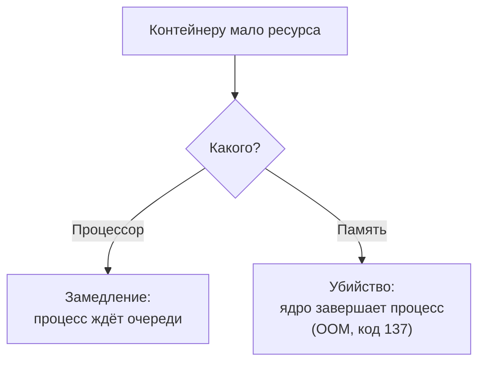

## Зачем это нужно

Я занимаюсь нагрузкой много лет и сижу сейчас рядом с тобой как опытный коллега. Начну с истории, которую видел в разных командах.

Перед распродажей один тестировщик прогнал нагрузку на своём ноутбуке и написал в общий чат: «Магазин держит 150 запросов в секунду». Менеджер обрадовался и рассчитал по этой цифре, сколько серверов брать. В день распродажи магазин лёг при куда меньшей нагрузке. Оказалось, что на ноутбуке тест шёл с одним ядром процессора, с локальной сетью и с маленькой базой. А на боевых серверах всё было иначе. Тестировщик не наврал, он просто не написал, **на чём** получил число.

Нагрузочный тест всегда отвечает с оговоркой: «на этом железе и с этими лимитами». В `compose.yaml` «Магазина» есть две строки из [урока 5.3](03-compose-shop.md): `cpus: "1.0"` и `mem_limit: 512m`. Они ограничивают магазин одним ядром и 512 МБ памяти. Благодаря им стенд упирается в потолок за секунды нагрузки, а не когда у твоего ноутбука кончатся силы. Но из-за них же он **непохож на продакшен** (боевую систему с настоящими покупателями), и честный отчёт обязан об этом сказать.

Шаг проекта: ты научишься смотреть, что съедает каждый контейнер: для этого есть команда `docker stats`. Потом поймаешь убийство контейнера из-за памяти: Docker помечает его кодом выхода 137, и об этом ниже. Увидишь, как лимит процессора режет пропускную способность (сколько запросов в секунду система успевает обработать). Наконец, сформулируешь, какие выводы со стенда можно переносить на боевую систему. На этом стоят [тема 8](../08-perf-theory/01-latency-throughput.md) и особенно [тема 11](../11-bottlenecks/index.md).

## Что нужно знать

- Процессор, память, загрузка и `top`: [урок 1.3](../01-linux/03-processes-resources.md). Если не помнишь, что такое `%CPU` и RSS, вернись туда.
- Контейнеры, `docker stop`, код выхода: [урок 5.1](01-containers.md). `compose.yaml` и `.env`: [урок 5.3](03-compose-shop.md).
- Паспорт машины (сколько ядер, сколько памяти), который ты записывал в [уроке 1.1](../01-linux/01-workstation-terminal.md).
- Глубже про cgroups и лимиты: [урок DevOps «Ресурсы контейнеров»](https://distinguished-sre.github.io/devops/05-docker/04-resources.html). В этом курсе нам нужна практическая часть, и она ниже.

## Картина целиком

Общая квартира на четверых: одна кухня, одна ванная, один холодильник. Если один жилец занял плиту на весь вечер, остальные сидят голодные. Выход простой: правила. Никто не берёт больше одной конфорки и не занимает больше одной полки. Лимиты контейнеров работают так же: ядро Linux следит, чтобы контейнер не забрал больше, чем ему выдали.

Самое важное в теме: процессор и память наказывают по-разному.



Нехватка процессора **замедляет**: ты увидишь рост задержки. Нехватка памяти **убивает**. Это две разные поломки с разными симптомами, и искать их нужно по-разному.

## Теория

### Зачем контейнеру паёк

Контейнер с бесконечным циклом или утечкой может остановить всю машину: соседи встанут, и твой терминал вместе с ними. Без лимита утечка съест всю память хоста, и тогда ядро убьёт любой процесс подряд, хоть базу данных. Лимит защищает соседей от виновника. Он как предохранитель в щитке: не чинит проводку, а отключает опасный контур, чтобы не сгорел весь дом.

Ограничения создаёт ядро Linux через механизм **cgroups** (control groups, «контрольные группы», мы встречали их в [уроке 5.1](01-containers.md)). Docker заводит такую группу на каждый контейнер, записывает в неё лимиты, и ядро следит за их соблюдением. В «Магазине» их два: `shop` получает 1 ядро и 512 МБ, `postgres` 1 ядро и 1 ГБ. У `redis` и `payment` лимитов нет. В `docker run` те же вещи задаются флагами `--cpus 1.0` и `--memory 512m`.

> **Прикинь сам:** у ноутбука 8 ядер, контейнеру задано `cpus: "2"`. Остальные ядра свободны. Сколько ядер он использует, если очень захочет?
{: .predict}

Два. Лимит это потолок, а не гарантия и не «своё» ядро. Даже при свободной машине контейнер получит не больше двух ядер времени. Именно поэтому результат теста не зависит от того, сколько ядер оказалось свободно сегодня. И обратное: если задать `cpus: 4` на ноутбуке с двумя ядрами, лимит ничего не значит, потолок тут физический.

> **Главное:** лимит это потолок, которым ядро защищает соседей; он не обещает, что контейнер его получит.
{: .key}

Начнём с процессора: что значит «одно ядро» и как ядро это проверяет.

### Процессор: квота времени и троттлинг

Память можно отмерить килограммами, а процессор нет: ядро либо выполняет твой код прямо сейчас, либо ждёт. Поэтому «1,0 ядра» ядро Linux считает временем. Оно режет время на окна по 100 миллисекунд. При `cpus: "1.0"` контейнеру положено 100 мс работы в каждом окне, то есть ядро занято на него целиком. `cpus: "0.5"` даёт 50 мс, `cpus: "2"` даёт 200 мс (два ядра сразу).

Что будет, если контейнер выбрал квоту к середине окна? Ядро ставит его процессы на паузу до начала следующего. Это называется **троттлинг** (throttling, «притормаживание»). Запрос, который мог выполниться за 5 мс, попадает в паузу и висит десятки миллисекунд. Средняя загрузка остаётся прежней, а страдает «хвост»: p95, то есть время, в которое укладываются 95 запросов из 100 ([урок 1.2](../01-linux/02-text-logs.md)). Хвост задержек растёт первым.

Следы троттлинга лежат в файле `/sys/fs/cgroup/cpu.stat` внутри контейнера. Нам нужны два поля: `nr_throttled` (в скольких окнах контейнер притормозили) и `throttled_usec` (сколько микросекунд он провёл на паузе). Если во время теста они растут, процессор стал узким местом.

Теперь пример из «Магазина». Один вход (`/api/login`) требует около 250 мс чистой работы процессора (порядок величины на стенде): пароль проверяется алгоритмом bcrypt, который сделан намеренно медленным (в стенде `BCRYPT_ROUNDS=12`). Одно ядро за секунду успеет `1 / 0,25 = 4` входа. Хоть сто покупателей в секунду, больше четырёх система не выдаст: остальные встанут в очередь, и их задержка будет расти. Обычный запрос, например список товаров, легче в десятки раз: на нём ядро отвечает на сотню запросов в секунду. Удвой лимит до двух ядер, и будет 8 входов.

> **Прикинь сам:** лимит урезали до `cpus: "0.5"`. Сколько входов в секунду выдержит магазин?
{: .predict}

Полядра это 50 мс работы в окне, то есть половина секунды в секунду. Один вход занимает 250 мс, значит, их поместится два. Ровно столько и показывает график ниже: на отметке 0,5 ядра стоит 2.

<div class="viz" data-viz="chart" data-type="line" data-x="0.5,1,1.5,2,3,4" data-series='[{"name":"Входы (login), в секунду","values":[2,4,6,8,12,16],"unit":"вх/с"}]' data-x-label="Лимит CPU, ядер" data-y-label="Пропускная способность" data-unit="вх/с" data-explain="Каждый вход считает bcrypt и занимает ядро примерно на четверть секунды. Удвоил лимит процессора, получил вдвое больше входов (пока хватает воркеров и памяти)."></div>

Линия почти прямая: у задач, которые едят процессор, лимит ядер напрямую задаёт потолок. Лёгкие запросы вроде списка категорий из кэша упрутся уже в другое место. Реальные числа у тебя будут другими. Почему при `WEB_CONCURRENCY=1` (магазин работает одним рабочим процессом) вход упирается ещё и в число процессов, разберёшь в [уроке 11.2](../11-bottlenecks/index.md).

Осторожно: «100% процессора» не значит «процессор перегружен». Для контейнера с `cpus: 1.0` сотня это норма: он честно использует свой лимит. Тревога, когда при 100% пропускная способность не растёт, а задержка растёт.

> **Проверь понимание:** `docker stats` показывает у `shop-shop-1` `CPU %` 100%, у `shop-postgres-1` 8%, и задержка растёт. Что это значит?

<details markdown="1">
<summary>Ответ</summary>

Магазин упёрся в свой лимит процессора (одно ядро занято целиком), а база почти простаивает. Узкое место в самом приложении, не в базе. Подтвердит растущий `nr_throttled` в `cpu.stat`.

</details>

> **Главное:** лимит процессора нарезает время на окна по 100 мс; кто выбрал квоту, тот ждёт; признак беды это растущий `nr_throttled` вместе с ростом задержки.
{: .key}

С памятью всё жёстче: ждать там нечем.

### Память: потолок, OOM и код 137

Если процессору можно сказать «подожди», то память либо есть, либо нет. Нельзя притормозить нехватку. Это как лифт с табличкой «не более 400 кг», только лишнего пассажира не пустят, а тут кого-то **выкидывают**.

`mem_limit: 512m` это потолок на всю группу контейнера: данные приложения, буферы, всё. Её меряют как RSS: память, которую процесс реально держит в оперативной памяти ([урок 1.3](../01-linux/03-processes-resources.md)). Пока потолок не достигнут, ядро молчит. Когда процесс просит больше, ядро сначала освобождает что можно, а если нечего, включает **OOM killer** (Out Of Memory killer, «убийца при нехватке памяти», [урок 1.3](../01-linux/03-processes-resources.md)). Он завершает процесс сигналом **SIGKILL**, который процесс не может ни обработать, ни отложить ([урок 5.2](02-dockerfile.md)). Процесс не успевает ни сохраниться, ни записать лог. Поэтому в логах приложения **тишина**: об убийстве не знает даже сам убитый.

Docker замечает смерть главного процесса и ставит код выхода **137**. Это 128 плюс номер сигнала 9 (SIGKILL): так оболочки кодируют «убит сигналом». Запомни: 137 значит «убили», и надо выяснить, кто. Причин две: нехватка памяти или принудительная остановка (`docker kill`, или `docker stop`, когда контейнер не ответил вовремя).

Что случится дальше, решает политика перезапуска `restart`. У сервисов стенда `restart: unless-stopped`: Docker тут же поднимет контейнер заново, и в `docker compose ps` ты увидишь `Up 3 seconds` вместо `Exited (137)`. Статус `Exited (137)` остаётся у контейнера без политики или остановленного руками.

Как отличить память от ручной остановки? Пока контейнер лежит, помогает поле `OOMKilled` в `docker inspect`. Но при автоперезапуске Docker сбрасывает его в `false`. Поэтому полагайся на три следа, которые остаются. Первый: счётчик перезапусков `RestartCount`. Второй: событие `oom` в `docker events` (журнал событий Docker). Третий: метрика `container_oom_events_total` из cAdvisor, программы, которая читает те же счётчики cgroups для мониторинга (поставишь её в [уроке 7.4](../07-observability/04-exporters.md)).

```bash
docker inspect shop-shop-1 --format 'перезапусков={{.RestartCount}} OOM={{.State.OOMKilled}}'
```

```text
перезапусков=1 OOM=false
```

`перезапусков=1` значит, что Docker один раз поднимал контейнер после падения. Почему, покажет `docker events`. Если контейнер сейчас лежит, то `OOM=true` при коде 137 это память, а `OOM=false` значит, что убил кто-то другой.

> **Проверь понимание:** контейнер завершился с кодом 137. Какая команда подскажет, память это или ручная остановка?

<details markdown="1">
<summary>Ответ</summary>

`docker inspect ИМЯ --format '{{.State.OOMKilled}}'` (в проекте Compose имя вида `shop-shop-1`). `true` значит нехватку памяти, `false` значит другой SIGKILL: `docker kill`, остановка по таймауту, внешний процесс. Но при `restart: unless-stopped` поле сбрасывается, и тогда ищи событие `oom` в `docker events`, число `RestartCount` и журнал ядра хоста (`dmesg | grep -i oom`).

</details>

Теперь посчитаем, когда убьют магазин с утечкой памяти. Утечка включается переменной `LEAK_ENABLED=1`: каждый запрос навсегда оставляет в памяти 10 килобайт. На одном ядре магазин отвечает примерно на 100 запросов в секунду. Это 100 × 10 КБ = около 1 МБ в секунду, или 60 МБ в минуту. В покое магазин занимает около 100 МБ, под нагрузкой около 130, до потолка в 512 МБ остаётся примерно 380 МБ. Делим: 380 / 1 = 380 секунд. Через шесть минут нагрузки контейнер умрёт, и Docker сразу поднимет его снова.

> **Прикинь сам:** лимит поднимают с 512 до 1024 МБ. Утечка исчезнет?
{: .predict}

Нет. Контейнер проживёт дольше, но в итоге всё равно умрёт: утечка рано или поздно побеждает любой лимит. Проверь это в виджете: включи утечку, смотри на график памяти (линия растёт до красной черты лимита, появляется метка «OOM, код 137») и подвигай лимит.

<div class="viz" data-viz="dk-limits" data-rps="100" data-cpus="1" data-mem="512" data-leak="1" data-restart="1"></div>

Слева процессор, справа память, красные линии это лимиты. Без утечки память стоит ровно и зависит только от нагрузки. С утечкой она растёт линейно. Переключатель «перезапуск» включён, как в стенде, и цикл повторяется. Получается пилообразная память и периодические провалы пропускной способности.

Осторожно: рост памяти и утечка это разное. Приложение с кэшем заполняет память постепенно и выходит на плато: это нормально. Утечка это рост **без плато**. Ловят её длинным прогоном на часы (soak-тест: ровная нагрузка несколько часов, [урок 8.3](../08-perf-theory/03-test-types.md)) по графику памяти.

> **Главное:** нехватка памяти убивает без предупреждения и без лога: ищи код 137, `RestartCount` и событие `oom`, а не ошибку в логах приложения.
{: .key}

Лимит мы задали, убийство разобрали. Осталось научиться смотреть, сколько контейнер ест прямо сейчас.

### `docker stats`: живая таблица потребления

Лимит ты выставил, а потреблять контейнер будет столько, сколько ему нужно, и это надо измерять. `docker stats` печатает таблицу и обновляет её раз в секунду; `docker stats --no-stream` делает один снимок и выходит, это удобно для скриптов и отчётов. Вот снимок стенда под нагрузкой около 90 запросов в секунду (колонки сети и диска пока опустим):

```text
NAME               CPU %     MEM USAGE / LIMIT    MEM %     PIDS
shop-shop-1        87.40%    148.3MiB / 512MiB    28.96%    12
shop-postgres-1    23.10%    412.8MiB / 1GiB      40.31%    21
shop-redis-1       3.20%     9.6MiB / 15.54GiB    0.06%     6
```

Читай так. Сначала смотри `CPU %` у того, у кого есть лимит. Это доля **одного ядра**: 100% значит ядро занято целиком, а у контейнера с `cpus: 2` потолок 200%. Магазин на 87% почти упёрся, следующий шаг нагрузки даст рост задержек. Потом `MEM USAGE / LIMIT`: у магазина 148 МиБ из 512, запас большой. PostgreSQL занял 413 МиБ из 1 ГиБ, он любит память под свой кэш и растёт обычно до плато. У Redis лимита нет, поэтому после слэша стоит вся оперативная память машины (15,54 ГиБ). Запас общий на всех.

> **Прикинь сам:** магазин сейчас на 87%, а нагрузку собираются поднять на четверть. Что будет?
{: .predict}

Нагрузка вырастет в 1,25 раза: 87 × 1,25 = 109%. Больше 100% при лимите в одно ядро невозможно. Магазин упрётся в потолок и начнёт копить очередь: задержка вырастет, а запросов в секунду не прибавится.

> **Проверь понимание:** `docker stats` показывает у контейнера `CPU % 198%`. Он нарушил лимит `cpus: "1.0"`?

<details markdown="1">
<summary>Ответ</summary>

Скорее всего нет: 198% может быть у контейнера с `cpus: 2`, где потолок 200%. Если лимит правда 1.0, значит, он не применён. Проверь `docker inspect ИМЯ --format '{{.HostConfig.NanoCpus}}'`: для `cpus: 1.0` там `1000000000`.

</details>

Осторожно: `CPU %` это мгновенное значение, оно скачет. Для отчёта нужна серия замеров и график, а не один снимок; такие графики строит мониторинг из темы 7. И не сравнивай `CPU %` разных машин: 100% на ноутбуке и на сервере это разные «ядра». `MiB` и `GiB` двоичные: 1 МиБ это 1 048 576 байт, на 5% больше мегабайта. В отчёте пиши как есть.

<details markdown="1">
<summary>Для любопытных: остальные колонки таблицы</summary>

`NET I/O` показывает, сколько байт принято и отправлено по сети с запуска. `BLOCK I/O` показывает, сколько прочитано с диска и записано (у базы под нагрузкой заметно пишет журнал и таблицы). `PIDS` это число процессов и потоков внутри. `MEM USAGE` не включает дисковый кэш файлов, поэтому с `top` внутри контейнера цифры могут расходиться, и оба верны.

</details>

> **Главное:** `docker stats` показывает потребление сейчас: смотри `CPU %` и `MEM USAGE / LIMIT` у контейнеров с лимитом, помня, что 100% это одно ядро.
{: .key}

Есть ещё один способ, которым память может обмануть: она вроде есть, а работает всё медленно.

### Свап: когда «памяти хватило» обманывает

Когда оперативной памяти мало, Linux может выгрузить редко нужные данные на диск, в **своп** (swap, область диска как продолжение памяти; [урок 1.3](../01-linux/03-processes-resources.md)). Программа живёт, но диск в тысячи раз медленнее памяти. По умолчанию контейнеру разрешён своп того же размера, что и лимит. Поэтому контейнер с 512 МБ может «дожить» после 512, но работать мучительно. Задержки вырастут в десятки раз, а процессор будет простаивать, потому что все ждут диск.

Тест в таком состоянии измеряет скорость диска, а не приложения. Поэтому для честных замеров лимит и своп ограничивают вместе: `--memory 200m --memory-swap 200m`, как в практике. Память кончилась: контейнер убит, причина видна, и нет размазанной деградации. На боевых серверах своп часто выключают совсем по этой же причине.

> **Главное:** без запрета свопа нехватка памяти выглядит как «всё очень медленно, ошибок нет», а не как убийство.
{: .key}

Теперь вернёмся к истории из начала.

### Почему стенд на ноутбуке не равен продакшену

Что же не написал тестировщик в чате? Три вещи, и самая коварная первая. Генератор нагрузки (программа, которая шлёт запросы, например Locust или k6) работает на **той же машине**, что и магазин, и отбирает у него процессор. На ноутбуке с четырьмя ядрами генератор занимает одно, магазину остаётся меньше, и часть «медленных ответов» вызвана не магазином, а тесной машиной. Поэтому во время теста всегда смотри загрузку **самого ноутбука**: если она около 100%, числам нельзя верить.

Вторая вещь: сеть и данные. На ноутбуке всё общается через `localhost` почти без задержки и потерь. В базе 10 000 товаров и 200 000 заказов, а в бою миллионы строк и реальная сеть. Третья: лимиты на стенде **искусственные**, их поставили, чтобы упереться быстро, а в бою у них запас на пики. Остальные отличия мельче (они в блоке ниже), но направление то же.

<details markdown="1">
<summary>Для любопытных: полный список отличий стенда от продакшена</summary>

Железо: общий диск и чужие программы против выделенных серверов. Сеть: в бою задержки, потери, балансировщики. Масштаб: одна копия сервиса против десятков. Кэши: на стенде холодные, в бою прогретые. Трафик: на стенде равномерный, в бою с пиками.

</details>

Что же тогда можно говорить по тесту? Различай качественное и количественное.

**Переносить можно** качественные выводы: «без индекса запрос читает 200 000 строк и тормозит», «пул из пяти соединений создаёт очередь», «утечка памяти растёт линейно». Форма кривых и причины узких мест при правильном опыте похожи. **Нельзя** переносить абсолютные числа: «150 запросов в секунду» или «p95 = 300 мс» на ноутбуке не прогноз для продакшена. Максимум это сравнение «до и после» на одном стенде: «после индекса p95 упал с 900 до 120 мс (в 7,5 раза)».

Любой вывод сопровождай паспортом: сколько ядер и памяти у машины, какие лимиты у контейнеров, где работал генератор, версия образов и коммита, значения `.env`. Без паспорта результат нельзя ни повторить, ни проверить. Сравни две формулировки одного теста:

```text
Плохо:   "Магазин выдерживает 150 запросов в секунду."

Хорошо:  "На стенде (ноутбук 4 ядра/16 ГБ, shop: 1 CPU и 512 МБ, WEB_CONCURRENCY=1,
          генератор Locust на той же машине, загрузка ноутбука при тесте до 70%)
          p95 остаётся ниже 300 мс до 120 RPS, дальше растёт; на 150 RPS p95 = 1,4 с.
          Упирается в CPU контейнера shop (docker stats: 100%, троттлинг растёт).
          Это не прогноз для продакшена: для него нужен прогон на среде с теми же
          лимитами и данными, как в бою."
```

Вторая длиннее, зато каждое слово проверяемо.

Осторожно: «я ограничил контейнер, значит, тест воспроизводим». Лимиты не делают воспроизводимой саму машину: соседние программы, нагрев ноутбука. Делай минимум три прогона и сравнивай: если вышло 140, 148 и 95 RPS, виноват шум, и последний нужно перепроверить. Но стенд нужен: для поиска причин и проверки исправлений он отличен.

> **Проверь понимание:** на ноутбуке предел получился 120 RPS. Руководитель спрашивает, сколько серверов нужно на 6000 RPS. Что ответишь?

<details markdown="1">
<summary>Ответ</summary>

Делить 6000 на 120 нельзя: стенд ограничен одним ядром, генератор делит с ним машину, данных мало, сеть локальная. Из теста можно сказать только качественное: «упирается в CPU приложения, растёт добавлением воркеров». И предложить замер на среде, близкой к боевой, или прогноз по метрикам продакшена. Число серверов без такого замера было бы выдуманным.

</details>

> **Главное:** со стенда переносят причины и форму кривых, а не абсолютные числа; к каждому результату прикладывай паспорт стенда.
{: .key}

Теперь на практике увидишь всё это на живом стенде.

## Практика

Стенд из [урока 5.3](03-compose-shop.md) должен быть поднят и здоров (`docker compose ps` показывает `healthy` у четырёх сервисов). Если нет, подними его: `~/perf-lab/05-docker/stand-start.sh`. Нагрузку создаём **только на свой локальный стенд**.

```bash
cd ~/load-tester/project/shop
mkdir -p ~/perf-lab/05-docker
```

### 1. Что у стенда с лимитами

```bash
docker inspect shop-shop-1 shop-postgres-1 shop-redis-1 \
  --format '{{.Name}}: cpu={{.HostConfig.NanoCpus}} mem={{.HostConfig.Memory}}'
```

Разбор: `docker inspect` печатает всё о контейнере (в формате JSON), `--format` берёт из него нужные поля шаблоном. `NanoCpus` лимит процессора в миллиардных долях ядра, `Memory` лимит памяти в байтах (0 значит «без лимита»).

```text
/shop-shop-1: cpu=1000000000 mem=536870912
/shop-postgres-1: cpu=1000000000 mem=1073741824
/shop-redis-1: cpu=0 mem=0
```

**Как читать вывод:** `1000000000` нано-ядер это ровно 1.0 ядра; `536870912` байт это 512 МиБ (512 × 1 048 576); `1073741824` это 1 ГиБ. У Redis нули: лимитов нет. Это те самые две строки из `compose.yaml`, доказанные на живом контейнере.

### 2. Первый снимок `docker stats`

```bash
docker stats --no-stream
```

```text
CONTAINER ID   NAME              CPU %     MEM USAGE / LIMIT    MEM %     NET I/O         BLOCK I/O        PIDS
a1c2e3f4b5d6   shop-shop-1       0.55%     96.2MiB / 512MiB     18.79%    1.1MB / 0.9MB   0B / 0B          7
b2d3f4a5c6e7   shop-postgres-1   0.12%     318.5MiB / 1GiB      31.10%    2.4MB / 2.0MB   9.8MB / 126MB    19
c3e4a5b6d7f8   shop-redis-1      0.68%     8.9MiB / 15.54GiB    0.06%     1.0MB / 0.8MB   0B / 4.1kB       6
d4f5b6c7e8a9   shop-payment-1    0.20%     36.4MiB / 15.54GiB   0.23%     0.4MB / 0.3MB   0B / 0B          4
```

**Как читать вывод:** в простое всё тихо: CPU близко к нулю (проверки здоровья раз в 5 секунд), магазин занимает около 96 МиБ. Это твой **базовый уровень**: запиши его, чтобы под нагрузкой сравнивать «до» и «после».

### 3. Нагрузка и наблюдение

Напишем простой скрипт, который шлёт параллельные запросы на `/api/products`. Это учебная нагрузка по своему стенду, без специальных инструментов (настоящие инструменты Locust и k6 в темах 9 и 10).

```bash
cat > ~/perf-lab/05-docker/load.sh <<'EOF'
#!/bin/sh
# Использование: ./load.sh [секунды] [параллельных]
# Шлёт запросы на локальный стенд, пока не истечёт время.
set -eu
DURATION="${1:-30}"
PARALLEL="${2:-8}"
END=$(( $(date +%s) + DURATION ))
COUNT=$(mktemp)
worker() {
  while [ "$(date +%s)" -lt "$END" ]; do
    curl -sf -m 5 -o /dev/null "localhost:8000/api/products?page=1&size=20" && echo x >> "$COUNT"
  done
}
i=0
while [ "$i" -lt "$PARALLEL" ]; do worker & i=$((i+1)); done
wait
N=$(wc -l < "$COUNT")
rm -f "$COUNT"
echo "готово: ${DURATION} с, ${PARALLEL} потоков, ответов ${N}, $((N / DURATION)) в секунду"
EOF
chmod +x ~/perf-lab/05-docker/load.sh
```

Разбор скрипта: `${1:-30}` первый аргумент или 30; `END` момент окончания; функция `worker` в цикле шлёт `curl` (`-s` тихо, `-f` считает ответ с кодом 400 и выше ошибкой, `-m 5` бросает запрос, если ответа нет 5 секунд, иначе зависший сервис подвесит и скрипт, `-o /dev/null` выбрасывает тело) и после каждого удачного ответа дописывает во временный файл `$COUNT` (его создаёт `mktemp`) строку `x`; в конце `wc -l` считает строки, то есть ответы; `worker &` запускает её в фоне; `wait` ждёт все фоновые потоки. Скрипт простой: у него нет контроля скорости, он гонит запросы как можно быстрее, поэтому его «число ответов в секунду» зависит от машины.

Запусти нагрузку в первом терминале, а во втором следи:

```bash
# терминал 1
~/perf-lab/05-docker/load.sh 40 8
# терминал 2
docker stats shop-shop-1 shop-postgres-1
```

Когда скрипт закончит, он напечатает итог (твои числа будут другими):

```text
готово: 40 с, 8 потоков, ответов 4160, 104 в секунду
```

```text
NAME              CPU %     MEM USAGE / LIMIT    MEM %     NET I/O           BLOCK I/O        PIDS
shop-shop-1       99.60%    131.4MiB / 512MiB    25.66%    6.4MB / 52.1MB    0B / 0B          15
shop-postgres-1   42.30%    331.9MiB / 1GiB      32.41%    19.8MB / 31.2MB   9.8MB / 128MB    21
```

**Как читать вывод:** магазин на 99.6% своего ядра: он упёрся в лимит `cpus: 1.0`. База загружена вдвое меньше (42%): она не бутылочное горлышко. Память почти не выросла (96 до 131 МиБ): запросы короткие. Выход из `docker stats` по `Ctrl+C`. Видно, что и сам `load.sh` с `curl`-ами съедает процессор ноутбука: проверь `top` или `htop` ([урок 1.3](../01-linux/03-processes-resources.md)) и запиши, сколько процентов процессора заняла вся машина.

Теперь посмотри троттлинг:

```bash
docker compose exec shop cat /sys/fs/cgroup/cpu.stat
```

```text
usage_usec 38720114
user_usec 31204880
system_usec 7515234
nr_periods 412
nr_throttled 288
throttled_usec 14402118
nr_bursts 0
burst_usec 0
```

**Как читать вывод:** `nr_periods` число 100-миллисекундных окон, `nr_throttled` в скольких из них контейнер упёрся в лимит и был приостановлен: 288 из 412, то есть 70% окон. `throttled_usec` около 14,4 секунды суммарных пауз. Это прямое подтверждение «процессор был узким местом». Если выполнить команду до нагрузки, `nr_throttled` будет около нуля. (На cgroup v1 путь другой: `/sys/fs/cgroup/cpu/cpu.stat`; на Ubuntu 24.04 по умолчанию v2.)

### 4. Измени лимит CPU и сравни

Чтобы не править `compose.yaml` в клоне, меняем лимит на живом контейнере:

```bash
docker update --cpus 0.5 shop-shop-1
~/perf-lab/05-docker/load.sh 20 8
docker stats --no-stream shop-shop-1
```

Разбор: `docker update` меняет лимиты уже запущенного контейнера (после пересоздания вернутся значения из `compose.yaml`).

```text
shop-shop-1   49.90%   ...
```

**Как читать вывод:** на лимите 0.5 контейнер упирается примерно в 50%: потолок упал вдвое, и пропускная способность за те же 20 секунд тоже вдвое. Верни как было: `docker update --cpus 1 shop-shop-1`. Итоговая строка `load.sh` даёт число, а не догадку: при лимите 1 ядро было около 104 ответов в секунду, при 0.5 станет примерно вдвое меньше.

### 5. Поймай OOM-kill

Сделаем утечку и малый лимит памяти. Включи утечку в `.env` и пересоздай магазин:

```bash
cd ~/load-tester/project/shop
sed -i.bak 's/^LEAK_ENABLED=.*/LEAK_ENABLED=1/' .env && rm .env.bak
docker compose up -d --wait
docker update --memory 200m --memory-swap 200m shop-shop-1
```

Разбор: `LEAK_ENABLED=1` включает намеренную утечку (по 10 КБ на запрос, см. список в [уроке 5.3](03-compose-shop.md)). `docker update --memory 200m --memory-swap 200m` понижает лимит памяти до 200 МБ; второй флаг (`--memory-swap`, сумма «память плюс своп») ставится равным первому, чтобы контейнер не уходил в своп и не размывал картину. Запусти нагрузку и следи за памятью:

```bash
# терминал 1
~/perf-lab/05-docker/load.sh 120 8
# терминал 2
watch -n 2 "docker stats --no-stream shop-shop-1"
```

Память магазина вырастет примерно так:

```text
t=  0 с   MEM USAGE 103MiB / 200MiB
t= 30 с   MEM USAGE 131MiB / 200MiB
t= 60 с   MEM USAGE 160MiB / 200MiB
t= 85 с   MEM USAGE 189MiB / 200MiB
t= 95 с   контейнер убит и перезапущен: MEM USAGE снова около 100MiB
```

Магазин перестанет отвечать: `curl` в `load.sh` получает отказ соединения, пока Docker перезапускает контейнер и он проходит проверку здоровья (обычно десятки секунд, засеки, сколько у тебя). Потом ответы вернутся, а память снова пойдёт вверх: утечка и лимит никуда не делись. Проверь, что случилось:

```bash
docker compose ps shop
docker inspect shop-shop-1 --format 'перезапусков={{.RestartCount}} OOM={{.State.OOMKilled}}'
docker events --since 5m --until 1s --filter container=shop-shop-1 --filter event=oom --filter event=die
docker compose logs --tail 3 shop
```

Разбор: `docker events` печатает журнал событий Docker; `--since 5m --until 1s` берёт последние пять минут и сразу завершается (без `--until` команда ждала бы новых событий); `--filter` оставляет только события `oom` и `die` нашего контейнера.

```text
NAME          IMAGE       COMMAND            SERVICE   CREATED          STATUS                           PORTS
shop-shop-1   shop-shop   "./entrypoint.sh"  shop      4 minutes ago    Up 12 seconds (health: starting)

перезапусков=1 OOM=false
2026-10-03T12:41:07.114Z container oom 3f9a0c1d2b44 (image=shop-shop, name=shop-shop-1)
2026-10-03T12:41:07.131Z container die 3f9a0c1d2b44 (exitCode=137, image=shop-shop, name=shop-shop-1)
shop-shop-1  | {"ts": "...", "level": "INFO", "msg": "Запрос завершён", ...}
```

**Как читать вывод:** `Up 12 seconds` при возрасте контейнера в минуты: он перезапущен недавно, это и есть след падения. `перезапусков=1`: Docker поднимал его один раз. `OOM=false` не значит, что OOM не было: поле сбросилось при новом старте. Главное доказательство в `docker events`: событие `oom` и сразу `die` с `exitCode=137`. В логах приложения **нет** записи об ошибке: процесс убили сигналом SIGKILL, он не успел ничего написать. Это важное правило диагностики: **«молчаливый» перезапуск контейнера с кодом 137 почти всегда OOM**, причину нужно искать не в логах приложения, а в `docker events`, `RestartCount` и графике памяти. Политика `restart: unless-stopped` вернула сервис в строй, но утечку не вылечила: подожди ещё полторы минуты, и счётчик станет 2. Если бы политики не было, контейнер остался бы в `Exited (137)`, и убийство было бы видно сразу.

Расчёт: утечка 10 КБ на запрос, при 8 потоках `curl`-ов магазин на одном ядре отвечает примерно на 100 запросов в секунду, это около 1 МБ/с роста. От 103 до 200 МиБ примерно 97 МиБ, 97 / 1 ≈ 95 с, как в таблице. У тебя скорость нагрузки другая, поэтому время до убийства будет другим: считай по своему `docker stats`.

Теперь верни стенд в нормальное состояние:

```bash
sed -i.bak 's/^LEAK_ENABLED=.*/LEAK_ENABLED=0/' .env && rm .env.bak
docker compose up -d --wait
docker stats --no-stream shop-shop-1
```

Пересоздание сбрасывает и лимит 200 МБ (возвращается значение из `compose.yaml`: 512 МБ), и утечку.

> Не понимаешь строку `docker stats` или `cpu.stat`? Вставь вывод целиком, укажи лимиты контейнера и спроси нейросеть, что значит каждое поле. Ответ проверь вычислением: `nr_throttled` делённое на `nr_periods`, а лимиты сверь с `docker inspect`.
{: .ai}

### 6. Паспорт стенда для отчётов

Запиши свои данные так, как их надо будет приложить к каждому отчёту о тесте:

```bash
cat > ~/perf-lab/05-docker/stand-passport.md <<'EOF'
# Паспорт стенда

- Машина: ЯДЕР __, RAM __ ГБ, диск SSD/HDD (из паспорта урока 1.1)
- Docker: версия из `docker version`
- Лимиты: shop 1 CPU / 512 МБ, postgres 1 CPU / 1 ГБ, redis и payment без лимитов
- Настройки .env: значения WEB_CONCURRENCY, DB_POOL_MAX и других (diff с .env.example)
- Где работает генератор нагрузки: на этой же машине (да/нет)
- Загрузка машины во время теста: __% (top)
- Базовое потребление в простое: shop __ МиБ, postgres __ МиБ
- Что НЕ воспроизводит продакшен: локальная сеть, мало данных, один экземпляр каждого сервиса
EOF
docker compose -f ~/load-tester/project/shop/compose.yaml config --services > /dev/null && echo ok
```

Заполни пропуски реальными числами из своих замеров. Закоммить:

```bash
cd ~/perf-lab
git add 05-docker
git commit -m "Ресурсы: load.sh и паспорт стенда (урок 5.4)"
git push
```

## Типичные ошибки

| Симптом или текст | Причина | Что делать |
|---|---|---|
| `Error response from daemon: Minimum memory limit allowed is 6MB` | задан лимит меньше допустимого | поставь не меньше 6 МБ; для магазина осмысленно от 128 МБ |
| `Memory limit should be smaller than already set memoryswap limit, update the memoryswap at the same time` | при `docker update --memory` не задан `--memory-swap` | добавь `--memory-swap` с тем же значением |
| контейнер перезапускается (`Up 5 seconds`, растёт `RestartCount`), в логах приложения тишина | OOM-kill: убит ядром без возможности записать лог, `restart: unless-stopped` поднял его снова | `docker events` (событие `oom`), `docker inspect ... RestartCount`; график памяти; подними лимит или чини утечку |
| контейнер `Exited (137)` и не поднимается | у контейнера нет политики `restart` или его остановили руками | `docker inspect ... OOMKilled`; `docker compose up -d` |
| `docker stats` показывает `--` или нули | контейнер остановлен или только создан | `docker ps`; запусти контейнер |
| у контейнера `MEM USAGE / LIMIT` с огромным лимитом (15.54GiB) | лимит не задан, показана RAM машины | это ожидаемо для `redis` и `payment`; задай `mem_limit` в `compose.yaml`, если нужно |
| `docker update --cpus` «не работает» после `docker compose up` | пересоздание вернуло значения из `compose.yaml` | `docker update` временный: постоянное меняй в файле |
| результаты теста скачут от прогона к прогону на 30% | на машине идёт другая работа, генератор отбирает CPU, тепловой троттлинг ноутбука | закрой лишнее, смотри `top`, повтори минимум три раза, запиши разброс |
| на Docker Desktop (macOS, Windows) `cpu.stat` или лимиты показывают странное | всё работает внутри виртуальной машины Docker, её ресурсы ограничены настройками приложения | задай ресурсы VM в настройках Docker Desktop; цифры нагрузки несопоставимы с Linux |
| `docker compose up`: `services.shop Additional property cpuz is not allowed` | опечатка в ключе | `docker compose config -q` |

## Сломай и почини

**Поломка.** Задай слишком маленький лимит памяти и включи нагрузку **без** утечки:

```bash
cd ~/load-tester/project/shop
docker update --memory 80m --memory-swap 80m shop-shop-1
~/perf-lab/05-docker/load.sh 20 8
docker compose ps -a shop
```

Предполагаемый результат: магазин, который в простое занимает около 96 МиБ, не помещается в 80. Определи, что случилось, без подсказки: что показывает `docker compose ps`, какой код выхода, был ли это OOM, чем он отличается от утечки по графику памяти? Исправь.

> Сначала определи сам, был ли это OOM: `docker events`, `RestartCount`, код выхода 137. Потом спроси нейросеть и сравни её вывод со своим.
{: .ai}

<details markdown="1">
<summary>Разбор</summary>

Скорее всего контейнер убивается сразу или почти сразу: ему не хватало памяти даже на старт и работу при нулевой утечке. Из-за `restart: unless-stopped` Docker поднимает его снова, и в `docker compose ps` статус прыгает между `Restarting (137)` и `Up 2 seconds`, а `RestartCount` растёт каждые несколько секунд (Docker увеличивает паузу между попытками: 0,1 с, 0,2 с, 0,4 с и так далее). Отличие от утечки видно по графику: при утечке память растёт во времени линейно и убийство наступает **через время**, пропорциональное нагрузке. Здесь оно наступает **сразу**, потому что лимит ниже обычного потребления. Диагностика:

```bash
docker inspect shop-shop-1 --format '{{.RestartCount}} {{.State.OOMKilled}} {{.State.ExitCode}}'
docker events --since 2m --until 1s --filter container=shop-shop-1 --filter event=oom
docker stats --no-stream
```

Исправление: вернуть лимит из `compose.yaml` (`docker compose up -d --wait` пересоздаст контейнер с 512 МБ) и никогда не задавать лимит ниже обычного потребления. Общее правило подбора лимита памяти: взять пиковое потребление под максимальной нагрузкой на длительном тесте и добавить запас (обычно 20-50%).

</details>

## ИИ в помощь

Нейросеть помогает расшифровать цифры `docker stats` и подсказывает, что искать, но данные твоей машины она не знает. Общие правила на странице [ИИ-помощник](../ai.md).

**Задача:** расшифровать вывод `docker stats` под нагрузкой.

```text
Стенд «Магазин» в Docker, лимит shop: 1 ядро и 512 МиБ. Во время нагрузки
~100 запросов в секунду вывод docker stats --no-stream такой:
<вставь вывод>
Объясни каждую колонку. Какой сервис упёрся в потолок, как это понять
по CPU % и по MEM USAGE / LIMIT? Что сравнить ещё, чтобы подтвердить вывод?
```
{: .wrap}

**Проверь ответ:** сверь с лимитами из `docker inspect` и с `cpu.stat` (`nr_throttled`). Типичная ошибка: нейросеть не помнит, что `CPU %` в `docker stats` считается от одного ядра и может быть больше 100% при нескольких ядрах, и делает неверный вывод про насыщение.

**Задача:** отличить OOM-kill от других падений.

```text
Контейнер shop перезапускается, в логах приложения тишина.
docker inspect: RestartCount=<число>, OOMKilled=<значение>, ExitCode=<код>.
docker events: <вставь события oom и die>
Объясни, что это за код выхода и как отличить нехватку памяти от
утечки по графику памяти. Что смотреть первым?
```
{: .wrap}

**Проверь ответ:** сопоставь с уроком (код 137, событие `oom` в `docker events`). Нейросеть может приписать падение «багу приложения» и предложить поднять лимит наугад: лимит подбирай по пику памяти на длительном тесте, а не по совету.

## Словарик урока

| Термин | Простыми словами |
|---|---|
| cgroups | Механизм ядра Linux, который ограничивает и считает ресурсы группы процессов |
| Лимит (`cpus`, `mem_limit`) | Потолок ресурса для контейнера |
| Квота CPU | Сколько процессорного времени контейнер получает в каждом окне 100 мс |
| Троттлинг (throttling) | Принудительная приостановка процессов, которые израсходовали квоту CPU |
| `nr_throttled` | Счётчик окон, в которых контейнер был приостановлен |
| RSS | Память, реально занятая процессом в оперативной памяти |
| OOM (out of memory) | Нехватка памяти |
| OOM killer | Часть ядра, которая завершает процесс при нехватке памяти |
| SIGKILL | Сигнал «немедленно завершиться», процесс не может его перехватить |
| Код выхода 137 | 128 + 9: процесс убит сигналом SIGKILL |
| `OOMKilled` | Поле в `docker inspect`: контейнер убит из-за памяти (сбрасывается при автоперезапуске) |
| `docker stats` | Живая таблица потребления CPU, памяти, сети и диска контейнерами |
| Утечка памяти | Постоянный рост потребления памяти без плато |
| Soak-тест | Длительный тест на стабильность, ловит утечки |
| Свап (swap) | Область диска, которую система использует как «вторую» память, когда RAM не хватает |
| Политика `restart` | Правило автоматического перезапуска упавшего контейнера |
| Паспорт стенда | Записанные параметры машины, лимитов и настроек, нужные для воспроизведения теста |

## Вопросы с собеседований

Раздел для повторения: ответь вслух, потом открой ответ. Вопросы `[на скорость]` нужно уметь отвечать за 30 секунд.



## Проверено на версиях

Ubuntu 24.04 LTS (cgroup v2), Docker Engine 29.x, Compose v2+, стенд `project/shop` (лимиты `shop` 1 CPU/512 МБ, `postgres` 1 CPU/1 ГБ). Октябрь 2026. Числа в выводах (проценты CPU, мегабайты, время до OOM) ориентировочные: у тебя они будут другими, важны форма картины и порядок величин.

## Итог урока: ты умеешь

- [ ] Объяснить, что такое лимиты контейнера и как они реализованы (cgroups, квота CPU, лимит памяти).
- [ ] Прочитать `cpus` и `mem_limit` в `compose.yaml` и проверить их на живом контейнере через `docker inspect`.
- [ ] Прочитать таблицу `docker stats` и сказать, кто упёрся в лимит.
- [ ] Показать троттлинг по `cpu.stat` и объяснить его эффект на задержки.
- [ ] Поймать OOM-kill (`docker events`, `RestartCount`), отличить его от ручной остановки и объяснить, почему в логах приложения тишина.

- [ ] Отличить утечку памяти от слишком малого лимита по графику.
- [ ] Перечислить отличия стенда от продакшена и сформулировать вывод о тесте так, чтобы его нельзя было принять за прогноз.
- [ ] Оформить паспорт стенда и приложить его к результату теста.

Тема 5 пройдена: у тебя есть рабочий стенд, ты понимаешь, из чего он собран, и знаешь границы его применимости. Дальше: [урок 6.1](../06-api-testing/index.md) и [тема 7](../07-observability/01-metrics-prometheus.md), где ты подключишь мониторинг и увидишь эти же цифры на графиках.
