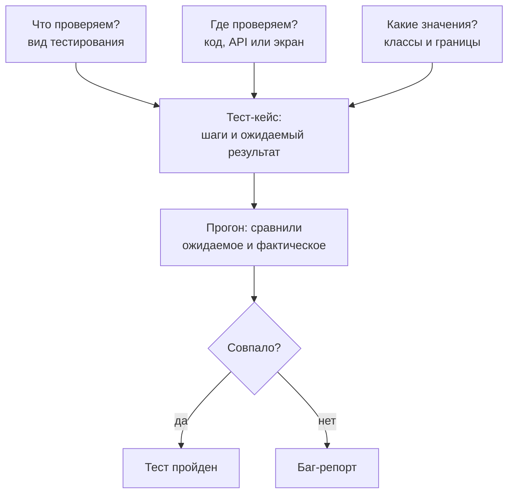
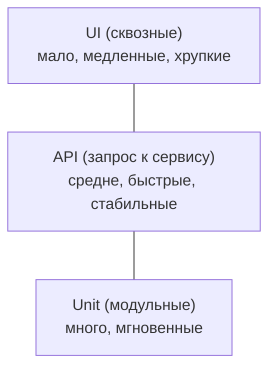
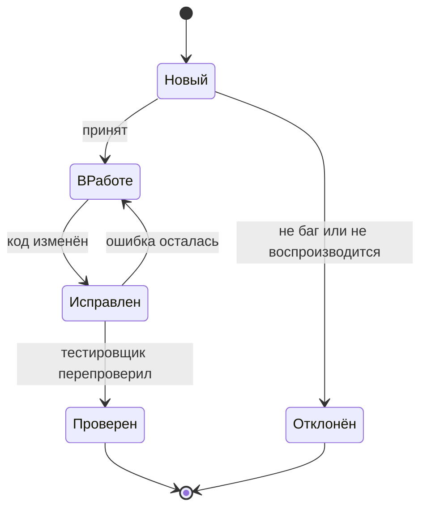

## Зачем это нужно

Я занимаюсь нагрузкой много лет и начну с байки, которую знает каждый новичок. Свой первый нагрузочный сценарий я запустил на тестовый магазин.

Через минуту p95 (время, быстрее которого отвечают 95 запросов из 100) вырос в пять раз, а каждый третий запрос упал с ошибкой. Я показал график разработчику, а он спросил: «А при одном пользователе заказ оформляется?» Заказ не оформлялся. Это была обычная ошибка в программе, а я полдня искал «узкое место».

Перед распродажей у тебя та же задача: прежде чем нагружать «Магазин», убедиться, что корзина и заказ вообще работают. Для этого нужны два умения: проверить, что сервис отвечает правильно, и описать ошибку так, чтобы её воспроизвели без тебя.

Тестирование (testing) это проверка программы: сравнение того, что она делает, с тем, что от неё ожидали. Не путай с отладкой (debugging): тест находит ошибку, а отладка ищет её место в коде. Тестировщик не «нажимает кнопки», а выбирает проверки, которые стоят времени: все значения не проверить, у параметра `page` их миллиарды. Значит, нужно мало проверок, но самых полезных, записанных так, чтобы их повторил другой человек или программа.

Шаг проекта: в репозитории `~/perf-lab` появится каталог `06-api-tests/` с двумя файлами. `test-cases.md`: шесть тест-кейсов (записанных проверок) для API «Магазина» по правилам этого урока: классы эквивалентности и граничные значения. `bugs/BUG-001-search-wildcard.md`: твой первый баг-репорт про реальное поведение стенда. В следующем уроке эти же проверки станут кодом.

## Что нужно знать

- Запрос, ответ и коды статуса (200, 401, 404, 422): [урок 2.1](../02-web/01-client-server-http.md).
- REST, JSON и токен авторизации: [урок 2.2](../02-web/02-rest-json-auth.md). Нужно, чтобы читать ответы API и понимать, что такое Bearer-токен.
- `curl` и вывод кода ответа через `-w`: [урок 1.4](../01-linux/04-network-cli.md).
- Стенд «Магазин» поднят: [урок 5.3](../05-docker/03-compose-shop.md). Проверка: `curl -s localhost:8000/readyz` отвечает `{"status":"ready"}`.
- Репозиторий `~/perf-lab` и команды `git add`, `git commit`, `git push`: [урок 3.2](../03-git/02-github.md).

## Картина целиком

Ты принимаешь работу у бригады, которая сделала в квартире свет. Включать каждую лампочку по сто раз не нужно, достаточно списка. Горит ли свет в каждой комнате? Не выбивает ли автомат, когда включены чайник и духовка? Список можно записать, чтобы вторая бригада проверила то же самое.

С программами то же самое. Три вопроса «что, где и с какими значениями проверяем» складываются в тест-кейс, то есть в записанную проверку. После прогона исход один из двух: ожидание совпало или нет.



Что здесь видно: три вопроса сходятся в один тест-кейс, а несовпадение даёт баг-репорт.

Нагрузочное тестирование, ради которого мы здесь, отвечает на первый вопрос: «сколько и как быстро», а не «правильно ли». Но стоит оно на остальных: нагружать сервис, который неверно отвечает даже одному пользователю, бессмысленно.

## Теория

### Зачем тестировать и чего тест не обещает

Все тесты зелёные, а у покупателя пропал заказ. Как так? Чтобы ответить, надо понять, что тест умеет и чего не обещает.

Программы пишут люди, а люди ошибаются. Без проверки ошибка доезжает до покупателя, и компания теряет деньги и доверие. Чем позже её нашли, тем дороже: в требованиях это правка предложения, у клиентов это срочный выпуск и откат. Но у теста есть три ограничения, запомни их сразу.

Первое: тест показывает ошибки, но не доказывает, что их нет. Сто зелёных тестов значат «в этих ста местах ошибок нет». Корректор находит опечатки в книге, но не докажет, что других нет.

Второе: проверить всё нельзя, поэтому проверки приходится выбирать, и ниже два способа это делать. Третье: тесты стареют. Набор, который полгода не правили, защищает вчерашний продукт.

Возьмём `GET /api/products`: он вернул 200 при `page=1`, `2` и `3`. Работает ли пагинация (разбивка списка на страницы)? Мы проверили три значения из миллиардов и ни одного «на краю»: последняя страница, страница за последней, `page=0`. Ломается чаще всего там.

Осторожно: «зелёные тесты» не значат «нет багов». Зелёный прогон говорит лишь, что выполнились записанные ожидания.

> **Главное:** тест находит ошибки, но не доказывает их отсутствие, поэтому проверки выбирают с умом и обновляют вместе с кодом.
{: .key}

Чтобы выбирать с умом, надо знать, какие вопросы вообще можно задать программе.

### Виды тестирования

Слово «проверить» ничего не говорит: стенд поднялся, сервис считает верно, выдерживает сто покупателей, не показывает чужие заказы? Это разные вопросы. Названия видов нужны, чтобы коротко договориться, какой задан.

Сначала два больших вопроса. Функциональное тестирование (functional) отвечает «делает ли программа то, что должна»: верный результат, верный код ответа. Нефункциональное (non-functional) отвечает «насколько хорошо она это делает»: быстро ли, надёжно ли, безопасно ли. Нагрузочное тестирование относится сюда.

Остальные виды различаются моментом и целью прогона. Дымовая проверка (smoke) занимает секунды и отвечает «стенд живой, главный путь проходит». Если она красная, остальное запускать незачем. Регрессионная (regression) это повторный прогон старых проверок после каждого изменения кода: она ловит случай, когда починили одно, а сломалось другое. Исследовательская (exploratory) это поиск странностей человеком без списка: «а что будет, если...».

Возьмём адрес API (его называют эндпоинтом) `POST /api/orders`. Дымовая: положить товар, оформить, получить 201. Функциональная: пустая корзина даёт 400, нехватка товара на складе даёт 409 (конфликт с текущим состоянием). Безопасность: чужой заказ даёт 404. Нагрузочная: 50 покупателей оформляют заказы одновременно (тема 9). Регрессия повторяет все эти проверки после каждого изменения кода.

> **Проверь понимание:** `GET /api/cart` вернул 500, а нагрузочный тест показал «средняя задержка 3 мс, отлично». Какой вид проверки пропущен?

<details markdown="1">
<summary>Ответ</summary>

Функциональный. Ошибка 500 («сервер сломался») приходит быстро как раз потому, что сервис сразу падает, не делая работу. Нагрузочный сценарий обязан проверять код и тело ответа.

</details>

> **Главное:** функциональное отвечает «правильно ли», нефункциональное «насколько хорошо», а остальные виды различаются моментом и целью.
{: .key}

Теперь вопрос «где проверять»: в коде, через API или кликами в браузере.

### Уровни тестирования и пирамида тестов

Одну ошибку можно поймать проверкой функции в коде, запросом к API или кликом в браузере. Чем выше уровень, тем ближе к покупателю, но тем медленнее и капризнее тест. Надо решить, где что проверять, иначе набор станет либо медленным, либо слепым.

Уровней три. Первый: unit-тест (модульный) проверяет одну маленькую часть кода, например функцию, которая считает итог корзины. Он не ходит ни в сеть, ни в базу и работает за миллисекунды. Пишут его обычно разработчики.

Второй уровень: API-тест. Он шлёт настоящий HTTP-запрос работающему приложению и сверяет ответ. Здесь участвуют приложение, база и кэш вместе, а тест занимает десятки миллисекунд. Это основной уровень курса.

Третий: UI-тест (сквозной, по-английски end-to-end: проходит весь путь от экрана до базы). Он управляет браузером: открывает страницу, кликает, смотрит на экран. Такой тест идёт секунды и хрупок: поменяли цвет кнопки, и тест упал.

Эти уровни складывают в пирамиду тестов (test pyramid): внизу много быстрых unit-тестов, в середине поменьше API-тестов, наверху совсем мало UI-тестов. Форма отражает цену: чем выше уровень, тем меньше тестов мы можем себе позволить.



Что здесь видно: сверху вниз растут число тестов и скорость, а реалистичность падает. API-уровень лежит в золотой середине.

Поиграй с пирамидой: ползунки задают число тестов на каждом уровне. Числа условные, порядок как в жизни.

<div class="viz" data-viz="api-test-pyramid" data-unit="200" data-api="60" data-ui="8"></div>

Что здесь видно: почти всё время набора занимают UI-тесты, хотя их всего восемь. Нажми «Рожок»: перевёрнутая форма превращает прогон в полчаса, а красный набор всё чаще оказывается ложной тревогой.

Пример: заказ создаётся с неверной суммой, забыли умножить цену на количество. Unit-тест функции подсчёта поймает это за 2 мс. Но если функция верна, а в базе берётся не та цена, он промолчит.

API-тест кладёт в корзину товар 5 (цена 285) в количестве 2, оформляет заказ и проверяет `total == 570`. Он увидит ошибку на любом участке цепочки «запрос, расчёт, база, ответ». UI-тест потратит на то же 15 секунд и может упасть из-за анимации. Дешевле всего проверка живёт на API-уровне. У «Магазина» UI нет вообще, только API.

> **Прикинь сам:** UI-тест «оформить заказ» падает раз в десять запусков, потому что кнопка не успела прорисоваться. Какой тест лучше написать вместо него?
{: .predict}

API-тест на `POST /api/orders`: те же правила магазина, но без браузера и вёрстки. Один сквозной UI-тест можно оставить для самого важного пути, но не для каждой проверки.

> **Главное:** чем выше уровень теста, тем он реалистичнее, но медленнее и хрупче, поэтому основной упор делают на быстрые API-тесты.
{: .key}

Мы выбрали, что и где проверять. Теперь запишем проверку так, чтобы её повторил кто угодно.

### Тест-кейс и чек-лист: как записать проверку

Проверка в голове не повторяется: завтра ты забудешь, как проверял, а коллега не поймёт. Запись превращает «я посмотрел» в «любой повторит и получит то же самое» и заставляет заранее решить, что считать правильным.

Это похоже на рецепт: «возьми два яйца, взбей, жарь две минуты, получится омлет». Есть продукты, шаги и результат, а без «получится омлет» непонятно, удалось ли блюдо. Рецепт допускает вариации, а у тест-кейса результат должен быть точным.

Тест-кейс (test case) это описание одной проверки. У него есть идентификатор и название (`TC-API-007`, «Заказ с пустой корзиной отклоняется»).

Дальше предусловия (preconditions): что должно быть готово до начала. Шаги (steps) говорят, что сделать, и достаточно точно, чтобы не гадать. Тестовые данные это конкретные значения вроде `user0001@shop.lab` или `size=101`. Ожидаемый результат (expected result) говорит, что должно произойти: «код 400, тело `{"detail":"cart is empty"}`». Фактический результат и статус («пройден» или «упал») заполняют при прогоне.

Рядом живёт чек-лист (checklist): короткий список «что проверить» без шагов. Я пишу чек-лист для себя и для исследования, а тест-кейс для всего, что должен повторить кто угодно и что потом станет автотестом.

Хороший тест-кейс проверяет одну вещь: при трёх ожидаемых результатах непонятно, какой сломался. Он независим: не требует, чтобы до него прошёл другой кейс, иначе один упавший уронит всех следующих. Он однозначен: «страница загружается быстро» не годится, «`GET /api/products` отвечает 200 за 500 мс» годится. И он повторяем: не зависит от случая вроде «товара, который случайно оказался в наличии».

Вот кейс для заказа с пустой корзиной на настоящем поведении «Магазина» (в коде `if not quantities: raise HTTPException(400, "cart is empty")`):

| Поле | Значение |
|---|---|
| ID, название | TC-API-007, Заказ с пустой корзиной отклоняется |
| Предусловия | Стенд работает; в корзине пользователя нет товаров (создан новый) |
| Шаги | 1. Зарегистрировать нового пользователя и войти, получить токен. 2. `POST /api/orders` с заголовком `Authorization: Bearer <токен>`, без тела |
| Данные | Новый email вида `tc007-<случайное>@shop.lab`, пароль `password` |
| Ожидаемый результат | Код `400`, тело `{"detail":"cart is empty"}` |
| Фактический | (заполняется при прогоне) |

Пользователь новый, потому что у `user0001` корзина может оказаться непустой после чужих проверок, и тест будет зависеть от соседей.

> **Прикинь сам:** в тест-кейсе написано «ожидаемый результат: заказ создаётся корректно». Что не так и как поправить?
{: .predict}

Слово «корректно» нельзя проверить: двое поймут его по-разному. Нужно: «код 201, `status` равен `paid`, `total` равен сумме `price × qty` по позициям, корзина после заказа пуста». Ожидаемый результат должен легко превращаться в `assert`.

> **Главное:** тест-кейс это записанная проверка с точным ожидаемым результатом, которую любой повторит с тем же итогом.
{: .key}

Теперь вопрос, какие значения вписывать в «данные», если вариантов миллиарды.

### Классы эквивалентности: выбираем мало, но разных

Все значения параметра не проверить, но многие программа обрабатывает одинаково. Если `size=5` и `size=17` идут по одной ветке кода, проверять оба бессмысленно.

Представь турникет в метро. Для него два класса людей: «с билетом» и «без». Проверять Ивана, Марию и Петра по отдельности не нужно: прошёл один с билетом, пройдут и остальные. Группу значений, которые программа обрабатывает одинаково, называют классом эквивалентности (equivalence class). Из каждого класса берут одного представителя. 

Делается это так. Читаешь правило параметра в коде или документации и делишь значения на допустимые (программа принимает) и недопустимые (отклоняет с понятной ошибкой). Недопустимые часто дробятся на «слишком мало», «слишком много» и «не число». Из каждого класса берёшь одно значение, и минимальный набор готов.

В коде приложения у параметра `size` в `GET /api/products` написано `size: int = Query(20, ge=1, le=100)`. Читаем: целое число от 1 до 100 включительно, по умолчанию 20. Классов четыре:

| Класс | Значения | Ожидаем | Представитель |
|---|---|---|---|
| Допустимые | от 1 до 100 | 200, в ответе `size` равен заданному | 20 |
| Слишком мало | 0 и меньше | 422 | -5 |
| Слишком много | 101 и больше | 422 | 500 |
| Не число | «abc», пустое | 422 | `abc` |

Четыре проверки вместо сотни ловят почти те же ошибки.

У `page` правило проще: `page: int = Query(1, ge=1)`. Классы: от 1 и больше (200), меньше 1 (422), не число (422). Верхнего предела у `page` в коде нет (для разумных значений), и это важная деталь. Страница за концом списка (скажем, `page=999999`) не ошибка, а ответ `200` с пустым списком `items`. Это поведение стоит зафиксировать тестом: кто-нибудь однажды «починит» его на 404, и клиенты сломаются.

> **Главное:** значения делят на классы по поведению программы и проверяют по одному представителю от каждого класса.
{: .key}

Но у классов есть слабое место: ошибки любят сидеть на стыках между ними.

### Граничные значения: тесты на стыках

Программисты чаще всего ошибаются «на единицу»: пишут `<` вместо `<=` или начинают считать с нуля вместо единицы. Такие ошибки сидят ровно на границе между классами, а не в середине. Поэтому на каждой границе берут значения по обе стороны, вплотную.

Арка на въезде во двор: «не выше 2,2 м». Водитель фургона проверяет не 1 м и не 5 м, а 2,2 и 2,21 м: вопрос решается там.

Для границы между «допустимо» и «недопустимо» берут последнее допустимое значение и первое недопустимое. Для `size` это 0 и 1 снизу, 100 и 101 сверху. Минимальный набор «классы плюс границы» для `size`: 0, 1, 20, 100, 101 и `abc`.

<div class="viz" data-viz="api-test-boundary" data-param="size" data-value="101"></div>

Что здесь видно: зелёный участок шкалы от 1 до 100 принимается, красные по бокам отклоняются. Ромбики это граничные значения, кружки по одному представителю класса. Двигай ползунок: код ответа меняется ровно на границах. Теперь то же для `page`, у него одна граница.

<div class="viz" data-viz="api-test-boundary" data-param="page" data-value="1"></div>

Допустим, разработчик написал `size < 100` вместо `size <= 100`. Тогда `size=50` работает, `size=500` отклоняется (тест на «слишком много» зелёный), а `size=100` ошибочно отклоняется. Поймает это только граничный `size=100`: «ждали 200, получили 422».

> **Прикинь сам:** правило для `size` от 1 до 100. Какие значения проверить на границах и что ожидать?
{: .predict}

Снизу 0 (ожидаем 422) и 1 (ожидаем 200), сверху 100 (200) и 101 (422). Четыре проверки, и если `<` с `<=` перепутаны, хотя бы одна упадёт.

Граница бывает и не числовой. Пароль при регистрации: не короче 8 символов и не длиннее 72 байт.

Байт, а не символов: байт это единица размера данных, латинская буква занимает один байт, русская два. Поэтому 36 русских букв (72 байта) принимаются, а 37 (74 байта) нет, хотя «символов меньше 72». Тест на латинице этого не заметит.

> **Главное:** ошибки живут на границах классов, поэтому проверяют последнее допустимое и первое недопустимое значение.
{: .key}

Пока мы смотрели на то, что должно приниматься. Но половина проблем в том, как сервис отклоняет неправильное.

### Позитивные и негативные проверки

Новичок проверяет, что всё работает «как задумано». Но сервис, который без токена или с несуществующим товаром отвечает 500 (а то и 200), это бомба: её рано или поздно найдёт пользователь или злоумышленник.

Проверки, где ввод корректен и должен приниматься, называют позитивными, а где некорректен и должен отклоняться, негативными. Нужны оба вида.

У каждого эндпоинта (адреса API) есть «золотой набор». Позитив: корректный запрос, ждём 2xx и верное тело. Нет авторизации: токена нет или он неверный, ждём 401. Нет такого: просим несуществующий объект, ждём 404. Неверные данные: нарушаем схему, ждём 422. Конфликт с состоянием, например повторная регистрация того же email, даёт 409. Нарушение бизнес-правила, скажем пустая корзина, даёт 400 или 409.

Правило негативных тестов: проверяй не только код, но и то, что состояние не изменилось. После неудачного заказа корзина остаётся как была, а товар не списывается.

Разберём `POST /api/cart/items`. Из кода известно: тело `{"product_id": int >= 1, "qty": int >= 1}`, нужен токен, товар должен существовать.

| Проверка | Запрос | Ожидаем |
|---|---|---|
| Позитив | `product_id=1, qty=2`, токен | 201, в `items` товар с `qty` 2 |
| Нет токена | то же, без заголовка | 401, `bearer token required` |
| Неверный токен | `Bearer abc` | 401, `invalid or expired token` |
| Нет товара | `product_id=99999999` | 404, `product not found` |
| Нулевое количество | `qty=0` | 422 |
| Отрицательное количество | `qty=-1` | 422 |
| Не число | `qty="два"` | 422 |

Семь проверок, шесть из них негативные: для API это нормально. Код 422 приходит, когда запрос не соответствует схеме (не тот тип, число вне диапазона). Код 400 приходит из правил магазина («корзина пуста»): запрос составлен верно, но сейчас его не выполнить.

> **Главное:** на каждый эндпоинт полезно проверять позитив и негативы (401, 404, 422, конфликт, бизнес-правило), а у негативов ещё и то, что состояние осталось целым.
{: .key}

Допустим, одна из проверок упала. Как сообщить об этом, чтобы ошибку починили?

### Баг-репорт: как сообщить об ошибке

Найти ошибку лишь полдела. Если разработчик не воспроизведёт её, он закроет задачу словами «у меня работает» и будет прав. Хороший баг-репорт (bug report) даёт увидеть ошибку своими глазами и сокращает путь до исправления с недель до часов.

Представь заявку мастеру. «Не работает кран» бесполезно. «На кухне течёт кран холодной воды, каплет из-под ручки, началось после замены прокладки» это то, с чем можно ехать. Разница лишь в том, что мастер видит кран, а разработчик не видит твоё окружение, поэтому ему нужны версия и данные.

Заголовок: одна строка о том, что и где сломано.

Окружение: версия, стенд, дата. Шаги воспроизведения (steps to reproduce): пронумерованные, с точными запросами. Ожидаемый и фактический результат: что должно было случиться (и почему ты так думаешь) и что случилось дословно, с кодом и телом ответа. Вложения: вывод `curl`, фрагмент лога, `request_id`. Каждый ответ «Магазина» содержит заголовок `X-Request-ID`, по нему разработчик найдёт запись в логах.

Ещё две оценки. Важность (severity) говорит, насколько ошибка вредит, а приоритет (priority) говорит, насколько срочно её чинить. Опечатка на главной странице малоопасна, но видна всем: низкая важность, высокий приоритет. Сбой при оплате раз в год опасен, но чинить можно по плану: высокая важность, средний приоритет.

Вот путь, который проходит баг после создания:



Что здесь видно: твоя работа не кончается созданием репорта, ты же перепроверяешь исправление. Если ошибка осталась, баг возвращается в работу.

Теперь реальное поведение стенда.

В поиске `GET /api/products?q=...` приложение вставляет твой текст в условие `name ILIKE %s` с подстановкой `%{q}%`. `ILIKE` в SQL ищет подстроку без учёта регистра, а знаки `%` и `_` в нём особые: «любая последовательность» и «любой один символ». Приложение не обезвреживает их (не ставит перед ними «экран», чтобы они стали обычными символами), поэтому поиск по подчёркиванию находит весь каталог. Репорт:

```text
BUG-001. Поиск по «_» (и «%») возвращает весь каталог вместо пустого списка

Окружение: стенд «Магазин» из project/shop, docker compose, версия на 03.10.2026,
           каталог из 10 000 товаров с именами «Товар 1» ... «Товар 10000».
Важность: низкая (данные не искажаются, но выдача вводит в заблуждение).
Приоритет: низкий.

Шаги:
1. Убедиться, что обычный поиск работает:
   curl -s 'localhost:8000/api/products?q=Товар%205' | jq '.total'
   (поиск по полному названию работает)
2. Выполнить поиск по подчёркиванию:
   curl -s 'localhost:8000/api/products?q=_&size=1'

Ожидаемый результат: ни в одном названии нет символа «_», поэтому
{"items":[],"page":1,"size":1,"total":0}.
Фактический результат: 200, "total": 10000, то есть найдены все товары.
То же для q=%25 (символ «%»).

Причина (предположение): в запрос подставляется «%_%», а «_» в ILIKE
означает «любой символ». Пользовательский ввод нужно экранировать.
Вложения: заголовок ответа X-Request-ID: <значение из curl -i>.
```

Читаем: шаг 1 доказывает, что обычный поиск работает, шаг 2 воспроизводит ошибку. Причина помечена как предположение: знать место ошибки в коде тестировщик не обязан, но подсказка экономит время. Оценок вроде «ужасный баг» в заголовке нет.

Осторожно: баг и особенность (feature, by design) путают. Если программа делает то, что задумано, но неудобно, это не баг, а предложение по улучшению. Чтобы решить, нужен эталон: требования, документация, здравый смысл. Нет эталона: пиши в репорте вопрос «ожидается ли такое поведение?».

> **Прикинь сам:** в репорте написано «Корзина иногда не очищается после заказа. Ожидаемый: всё работает. Фактический: не работает». Назови три проблемы.
{: .predict}

Нет шагов («иногда» не условие: когда именно?). Ожидаемый и фактический результаты ничего не говорят: нужны коды, тела ответов, что осталось в корзине. Нет окружения и вложений (`request_id`, лог). Такой репорт вернут с пометкой «не воспроизводится».

Репорт удобнее писать в таком порядке:

<div class="viz" data-viz="flow" data-title="Как написать баг-репорт" data-steps='[{"title":"Воспроизведи ошибку дважды","text":"Если получилось один раз, это ещё не баг: возможно, виновато окружение."},{"title":"Сократи до минимума","text":"Убери лишние шаги: чем короче путь, тем проще разработчику."},{"title":"Запиши точные запросы","text":"Копируй команды `curl` и ответы, а не пересказывай словами."},{"title":"Сформулируй ожидание","text":"Что должно было произойти и на чём основано (требование, документация, соседний случай)."},{"title":"Заголовок и важность","text":"Одна строка с признаком и местом; важность и приоритет по последствиям."},{"title":"Перепроверь после исправления","text":"Пройди те же шаги на новой версии и закрой баг сам."}]'></div>

Что здесь видно: большая часть работы идёт до написания, в шагах «воспроизведи» и «сократи». Они отличают репорт, который чинят, от репорта, который закрывают.

> **Главное:** по хорошему баг-репорту ошибку воспроизведут без автора: точные шаги, ожидаемое и фактическое отдельно, окружение и вложения.
{: .key}

Вспомним байку из начала. Теперь перед нагрузкой я прогоняю короткий набор таких кейсов на одном пользователе. Если он красный, я иду к разработчику с баг-репортом, а не с графиком p95.

## Практика

Стенд поднят. Все команды из каталога `~/perf-lab`, тем же терминалом, в котором работает стенд.

### 1. Проверь стенд и создай каталог

```bash
curl -s localhost:8000/readyz
mkdir -p ~/perf-lab/06-api-tests/bugs
cd ~/perf-lab/06-api-tests
```

`mkdir -p` создаёт каталог вместе с недостающими родительскими, `bugs` сразу внутри. Ожидаемый вывод первой команды:

```text
{"status":"ready"}
```

**Как читать вывод:** `ready` значит, что приложение видит и PostgreSQL, и Redis. Если вместо этого `{"detail":{"unavailable":["redis"]}}`, зависимость не поднялась: `docker compose ps` в `~/load-tester/project/shop` покажет, какая.

**Типичные ошибки:** `curl: (7) Failed to connect to localhost port 8000` означает, что стенд не запущен: `cd ~/load-tester/project/shop && docker compose up -d --wait`.

### 2. Изучи границы руками

Команда печатает только код ответа. Разбор: `-s` убирает индикатор прогресса, `-o /dev/null` выбрасывает тело, `-w '%{http_code}\n'` печатает код после запроса. Кавычки вокруг адреса обязательны: в оболочке `&` без кавычек запускает команду в фоне. Цикл `for` перебирает значения, `$s` подставляет очередное:

```bash
for s in 0 1 100 101 abc; do
  printf 'size=%s -> ' "$s"
  curl -s -o /dev/null -w '%{http_code}\n' "localhost:8000/api/products?size=$s"
done
```

```text
size=0 -> 422
size=1 -> 200
size=100 -> 200
size=101 -> 422
size=abc -> 422
```

Повтори для `page`: значения `0 1 2 999999 abc`.

```bash
for p in 0 1 2 999999 abc; do
  printf 'page=%s -> ' "$p"
  curl -s -o /dev/null -w '%{http_code}\n' "localhost:8000/api/products?page=$p"
done
```

```text
page=0 -> 422
page=1 -> 200
page=2 -> 200
page=999999 -> 200
page=abc -> 422
```

**Как читать вывод:** первая строка каждой пары это граница (0 и 1, 100 и 101), код меняется ровно между ними. Странная строка: `page=999999` даёт 200. Посмотри тело:

```bash
curl -s 'localhost:8000/api/products?page=999999&size=5'
```

```text
{"items":[],"page":999999,"size":5,"total":10000}
```

Список пуст, но поле `total` по-прежнему 10 000: сервис честно говорит «товаров 10 000, а на этой странице нет ничего». Это штатное поведение, и его нужно зафиксировать тест-кейсом.

Теперь посмотри, как выглядит тело ошибки 422, чтобы потом сверять его в тестах:

```bash
curl -s 'localhost:8000/api/products?size=101' | jq
```

```text
{
  "detail": [
    {
      "type": "less_than_equal",
      "loc": ["query", "size"],
      "msg": "Input should be less than or equal to 100",
      "input": "101",
      "ctx": { "le": 100 }
    }
  ]
}
```

(`jq` расставил отступы, в сыром ответе всё в одну строку.) **Как читать вывод:** `loc` говорит, где ошибка (`query` значит параметр адреса, `size` его имя), `msg` причину, `ctx` правило. Для тестов полезнее всего `loc`: можно проверить, что ругается именно на `size`, а не на что-то ещё.

### 3. Составь тест-кейсы

Создай файл `test-cases.md` и запиши пять кейсов (шестой добавишь после следующего шага) по образцу из раздела про тест-кейс. Рекомендуемый набор:

1. **TC-API-001**: `size=100` принимается (граница, 200, в ответе `size` равен 100, `items` не длиннее 100).
2. **TC-API-002**: `size=101` отклоняется (граница, 422, `loc` содержит `size`).
3. **TC-API-003**: `page=999999` возвращает пустой список (200, `items` пуст, `total` 10000).
4. **TC-API-004**: `/api/cart` без токена (401, `bearer token required`).
5. **TC-API-005**: заказ с пустой корзиной (400, `cart is empty`), по образцу `TC-API-007` из урока.

Формат любой: таблицей, как в уроке, или списком. Главное: у каждого кейса есть предусловия, точные шаги, данные и однозначный ожидаемый результат. Проверь каждый кейс руками, по своим же шагам, и впиши фактический результат. Для кейса 5 понадобится новый пользователь:

```bash
EMAIL="tc005-$RANDOM@shop.lab"
curl -s -w '\n' -X POST localhost:8000/api/register -H 'Content-Type: application/json' \
  -d "{\"email\":\"$EMAIL\",\"password\":\"password\"}"
TOKEN=$(curl -s -X POST localhost:8000/api/login -H 'Content-Type: application/json' \
  -d "{\"email\":\"$EMAIL\",\"password\":\"password\"}" | jq -r .token)
curl -s -i -X POST localhost:8000/api/orders -H "Authorization: Bearer $TOKEN" | head -1
```

Разбор: `$RANDOM` это встроенная переменная оболочки со случайным числом, она делает email уникальным. Флаг `-w '\n'` добавляет перевод строки после ответа, иначе он склеится со следующим выводом. Флаг `-d` передаёт тело запроса, заголовок `Content-Type: application/json` говорит серверу, что тело это JSON. `jq -r .token` достаёт поле `token` из ответа без кавычек. `$(...)` подставляет вывод команды в переменную. Последняя команда печатает первую строку ответа (`-i` включает заголовки, `head -1` оставляет одну строку).

```text
{"id":1002,"email":"tc005-18342@shop.lab"}
HTTP/1.1 400 Bad Request
```

**Как читать вывод:** первая строка это ответ регистрации: пользователь создан (номер у тебя будет свой), вторая это статус заказа с пустой корзиной. Код `400` совпадает с ожиданием, кейс пройден.

**Типичные ошибки:** `{"detail":"email already registered"}` значит, что `$EMAIL` уже существует (маловероятно с `$RANDOM`, но возможно при повторе): выполни присваивание заново. Если `jq` вернул `null`, а не токен, логин не прошёл: посмотри тело ответа логина без `jq`.

### 4. Проверь границу, которая не там, где кажется

Правило пароля при регистрации: не короче 8 символов и не длиннее 72 байт. Проверь четыре латинские длины (один символ это один байт) и две русские. Разбор: `python3 -c "print('a'*72)"` печатает строку из 72 букв, `$(...)` подставляет её в переменную, `$RANDOM` делает email уникальным, чтобы повторный запуск не упёрся в 409.

```bash
for n in 7 8 72 73; do
  pw=$(python3 -c "print('a'*$n)")
  printf 'латиница, длина %s -> ' "$n"
  curl -s -o /dev/null -w '%{http_code}\n' -X POST localhost:8000/api/register \
    -H 'Content-Type: application/json' -d "{\"email\":\"b$n-$RANDOM@shop.lab\",\"password\":\"$pw\"}"
done
for n in 36 37; do
  pw=$(python3 -c "print('я'*$n)")
  printf 'кириллица, длина %s -> ' "$n"
  curl -s -o /dev/null -w '%{http_code}\n' -X POST localhost:8000/api/register \
    -H 'Content-Type: application/json' -d "{\"email\":\"r$n-$RANDOM@shop.lab\",\"password\":\"$pw\"}"
done
```

```text
латиница, длина 7 -> 422
латиница, длина 8 -> 201
латиница, длина 72 -> 201
латиница, длина 73 -> 422
кириллица, длина 36 -> 201
кириллица, длина 37 -> 422
```

**Как читать вывод:** у латиницы границы стоят там, где написано в правиле: 7 и 8 снизу, 72 и 73 сверху. У кириллицы верхняя граница уже на 36 и 37 символах, потому что каждая буква занимает 2 байта. Запиши это как отдельный тест-кейс TC-API-006: «пароль в 36 русских букв принимается, в 37 отклоняется». Побочный эффект: в базе остались тестовые пользователи, они никому не мешают.

**Типичные ошибки:** все ответы `422`, в том числе на длину 8: проверь, что кавычки в `-d` не потерялись (в JSON обязательны двойные). Если вместо кириллицы пришли «вопросики», терминал не в UTF-8: `echo $LANG` должен показывать `...UTF-8`.

> Не уверен, что найденное поведение вообще баг? Сначала сам сверься с описанием API и с тем, что говорит `/readyz`, потом покажи нейросети запрос и ответ и спроси, чем это может быть. Проверь вывод повторным запросом `curl` на стенде: нейросеть не видит твой стенд и может описать поведение, которого у «Магазина» нет.
{: .ai}

### 5. Воспроизведи и опиши баг

Проверь находку из урока сам, по шагам из репорта:

```bash
curl -s 'localhost:8000/api/products?q=Товар%205&size=1' | jq .total
curl -s 'localhost:8000/api/products?q=_&size=1' | jq .total
curl -s 'localhost:8000/api/products?q=%25&size=1' | jq .total
```

```text
1111
10000
10000
```

Первая команда ищет подстроку «Товар 5» (curl отправит кириллицу как есть, сервер её поймёт, а `%20` это пробел) и печатает, сколько товаров нашлось. Нашлось 1111 товаров: номера, которые начинаются с цифры 5 (5, 50 до 59, 500 до 599, 5000 до 5999). Вторая и третья показывают суть ошибки: `_` и `%` дают весь каталог.

Теперь оформи `bugs/BUG-001-search-wildcard.md` по шаблону из раздела про баг-репорт, подставив свои реальные данные: дату, значение `X-Request-ID` из `curl -i`. После этого найди **второе** странное поведение сам и оформи BUG-002. Подсказка: корзина принимает `qty`, большее, чем остаток на складе (у каждого товара в базе 1 000 000 штук). Добавь 1 000 001 штук и затем оформи заказ (`$TOKEN` взят в шаге 3: если открыл новый терминал, выполни команды с `TOKEN=` из шага 3 снова):

```bash
curl -s -X POST localhost:8000/api/cart/items -H "Authorization: Bearer $TOKEN" \
  -H 'Content-Type: application/json' -d '{"product_id":1,"qty":1000001}' | jq .total
curl -s -X POST localhost:8000/api/orders -H "Authorization: Bearer $TOKEN"
curl -s -X DELETE localhost:8000/api/cart/items/1 -H "Authorization: Bearer $TOKEN" -o /dev/null -w '%{http_code}\n'
```

```text
137000137
{"detail":"not enough stock"}
204
```

**Как читать вывод:** корзина приняла миллион и один товар по 137 и посчитала итог `137000137`, а заказ отклонён кодом 409 только потом. Вопрос тебе: баг это или задуманное поведение? Решай по правилам из урока: что в этом случае ожидает покупатель, и что бы ты написал в поле «ожидаемый результат». Если решишь, что баг, оформи его; если нет, запиши в репорт-файле вопрос «ожидается ли такое поведение?» и аргумент. Третья команда убирает товар из корзины, чтобы не мешать следующим урокам (`204` значит «удалено, тела нет»).

### 6. Составь чек-лист на регистрацию

Задание без команд. Для `POST /api/register` выпиши в `test-cases.md` чек-лист из восьми-десяти пунктов («что проверить») и рядом ожидаемый код. Опирайся на правила, которые ты уже знаешь: email похож на адрес (`имя@домен.зона`, не длиннее 254 символов), пароль 8-72 байта, повтор того же email это конфликт. Для каждого пункта скажи себе, к какому классу эквивалентности или к какой границе он относится.

<details markdown="1">
<summary>Пример ответа</summary>

| Что проверяем | Ожидаем | Откуда пункт |
|---|---|---|
| Новый email и пароль из 8 символов | 201, в теле `id` и `email` | допустимый класс, нижняя граница пароля |
| Пароль из 7 символов | 422 | граница пароля |
| Пароль из 72 байт | 201 | верхняя граница |
| Пароль из 73 байт | 422 | верхняя граница |
| 36 и 37 русских букв | 201 и 422 | граница в байтах |
| Email без `@` (`invalid`) | 422 | недопустимый класс |
| Email в верхнем регистре `USER@SHOP.LAB` у нового адреса | 201, в теле `email` строчными | приложение приводит адрес к нижнему регистру |
| Повтор уже занятого email | 409 | конфликт с состоянием |
| Пустое тело запроса | 422 | не хватает полей |

Чек-лист коротким списком хорош для быстрой проверки. Каждый пункт, который должен выполняться регулярно, позже превращается в полноценный тест-кейс или сразу в автотест.

</details>

### 7. Закоммить и отправь

```bash
cd ~/perf-lab
git add 06-api-tests
git commit -m "6.1: тест-кейсы и первый баг-репорт"
git push
```

**Типичные ошибки:** `fatal: not a git repository` значит, что ты не в `~/perf-lab`; `git push` просит логин: настройка доступа описана в [уроке 3.2](../03-git/02-github.md).

## Сломай и почини

**Поломка.** Не продукт, а окружение. Останови Redis, в котором «Магазин» хранит токены и корзины, и прогони свои кейсы:

```bash
cd ~/load-tester/project/shop && docker compose stop redis
curl -s localhost:8000/readyz
curl -s -o /dev/null -w '%{http_code}\n' 'localhost:8000/api/products?size=5'
curl -s -X POST localhost:8000/api/login -H 'Content-Type: application/json' \
  -d '{"email":"user0001@shop.lab","password":"password"}'
```

**Задача.** Определи, что из увиденного **баг продукта**, а что **неполадка окружения**. Для каждого из трёх ответов реши: стоит ли заводить баг-репорт и почему. Подсказка: сначала `/readyz`. Если проверка готовности сама говорит, что зависимость недоступна, тест, упавший из-за этого, красный по вине стенда, а не программы.

<details markdown="1">
<summary>Решение</summary>

`/readyz` вернёт `503` и `{"detail":{"unavailable":["redis"]}}`: сервис честно сообщает, что без Redis он не готов. Это правильное поведение, а не баг. Каталог (`/api/products`) продолжит работать (200): он не использует Redis, пока выключен кэш. Вход вернёт `500` и `{"detail":"internal server error"}`: токен сохраняется в Redis, а его нет. Здесь стоит подумать: баг ли это? Возможно, правильнее отвечать 503 с понятным текстом. Разумно завести не баг, а **предложение** об улучшении, приложив шаги. Главный урок: **сначала убедись, что окружение здорово** (дымовой тест `/readyz`), и только потом заводи баг-репорт на «упавший» тест. Почини: `docker compose start redis`, дождись `readyz` и войди заново: старые токены могли исчезнуть.

</details>

## ИИ в помощь

Нейросеть хорошо подсказывает пропущенные граничные значения и помогает оформить баг-репорт, но не знает, как именно ведёт себя твой стенд. Общие правила: [ИИ-помощник](../ai.md).

**Задача:** придумать тест-кейсы для `GET /api/products?size=N`, не пропустив границы.

```text
Я учусь тестировать API. Эндпоинт GET /api/products принимает параметры page и size.
Известно: size от 1 до 100, page от 1. Составь таблицу тест-кейсов с граничными
значениями и классами эквивалентности: значение, ожидаемый HTTP-код, зачем этот кейс.
Объясни, чем граничное значение отличается от класса эквивалентности.
```
{: .wrap}

**Проверь ответ:** каждый кейс выполни `curl` из практики и сравни реальный код с ожидаемым. Типичная ошибка нейросетей: уверенно называть коды, которых нет в API (например, `400` вместо `422` для `size=0`), и придумывать ограничения, которых в контракте нет. Расхождение между таблицей и стендом не всегда баг: сначала сверься с описанием API.

**Задача:** оформить найденный баг для разработчика.

```text
Помоги оформить баг-репорт. Что я делал: <вставь команду curl>. Что получил:
<вставь код и тело ответа>. Что ожидал: <твоё ожидание и откуда оно взято>.
Дай структуру: заголовок, шаги воспроизведения, фактический и ожидаемый результат,
серьёзность. Не придумывай подробностей, которых я не дал, и скажи, чего не хватает.
```
{: .wrap}

**Проверь ответ:** пройди по шагам репорта сам: воспроизводится ли баг. Нейросеть любит добавить «окружение» и «версии», которых ты не называл. Вычеркни всё, что не проверил.

В чат не отправляй токены и реальные логины: заменяй их на `<токен>` и `user@example.com`.

## Словарик урока

| Термин | Простыми словами |
|---|---|
| Тестирование (testing) | Проверка программы: сравнение того, что она делает, с тем, что ожидали |
| Отладка (debugging) | Поиск места ошибки в коде и её исправление, работа разработчика |
| Функциональное тестирование | Проверка «делает ли программа то, что должна» |
| Нефункциональное тестирование | Проверка «насколько хорошо»: скорость, надёжность, безопасность |
| Нагрузочное тестирование | Нефункциональная проверка поведения при большом числе запросов |
| Дымовое тестирование (smoke) | Самая короткая проверка «стенд вообще живой» |
| Регрессионное тестирование | Повторный прогон старых проверок после изменений |
| Исследовательское тестирование | Поиск странностей человеком без заготовленного списка |
| Unit-тест | Проверка одной функции без сети и базы |
| API-тест | Настоящий HTTP-запрос к работающему сервису и проверка ответа |
| UI-тест (сквозной, end-to-end) | Управление браузером и проверка того, что на экране |
| Пирамида тестов | Много быстрых unit-тестов, меньше API, совсем мало UI |
| Тест-кейс (test case) | Описанная проверка: предусловия, шаги, данные, ожидаемый результат |
| Чек-лист (checklist) | Короткий список «что проверить» без подробных шагов |
| Ожидаемый и фактический результат | Что должно случиться и что случилось на самом деле |
| Класс эквивалентности | Группа значений, которые программа обрабатывает одинаково |
| Граничные значения | Значения по обе стороны границы между классами: там чаще ошибки |
| Позитивный и негативный тест | Проверка принятия корректного ввода и отклонения некорректного |
| Баг-репорт (bug report) | Описание ошибки, достаточное, чтобы её воспроизвели без автора |
| Важность и приоритет (severity, priority) | Насколько ошибка вредит и насколько срочно её чинить |

## Вопросы с собеседований

Раздел для повторения: ответь вслух, потом открой ответ. Короткие вопросы тренируй на скорость: ответ за 30 секунд.



## Проверено на версиях

Ubuntu 24.04, `curl` 8.5, `jq` 1.7, стенд «Магазин» из `project/shop` (FastAPI 0.142, Pydantic 2, PostgreSQL 18.6, Redis 8.10). Октябрь 2026.

## Итог урока: ты умеешь

- [ ] Объяснить, чем функциональное, нефункциональное и нагрузочное тестирование отвечают на разные вопросы.
- [ ] Назвать уровни тестов и объяснить форму пирамиды.
- [ ] Записать тест-кейс с предусловиями, шагами, данными и проверяемым ожидаемым результатом.
- [ ] Выбрать данные по классам эквивалентности и граничным значениям на примере `size` и `page`.
- [ ] Составить набор позитивных и негативных проверок для эндпоинта.
- [ ] Написать баг-репорт, по которому ошибку воспроизведут без тебя, и отличить баг продукта от неполадки окружения.

Дальше: [урок 6.2. Автотесты API: pytest и requests против «Магазина»](02-api-autotests.md), где твои кейсы станут кодом.
