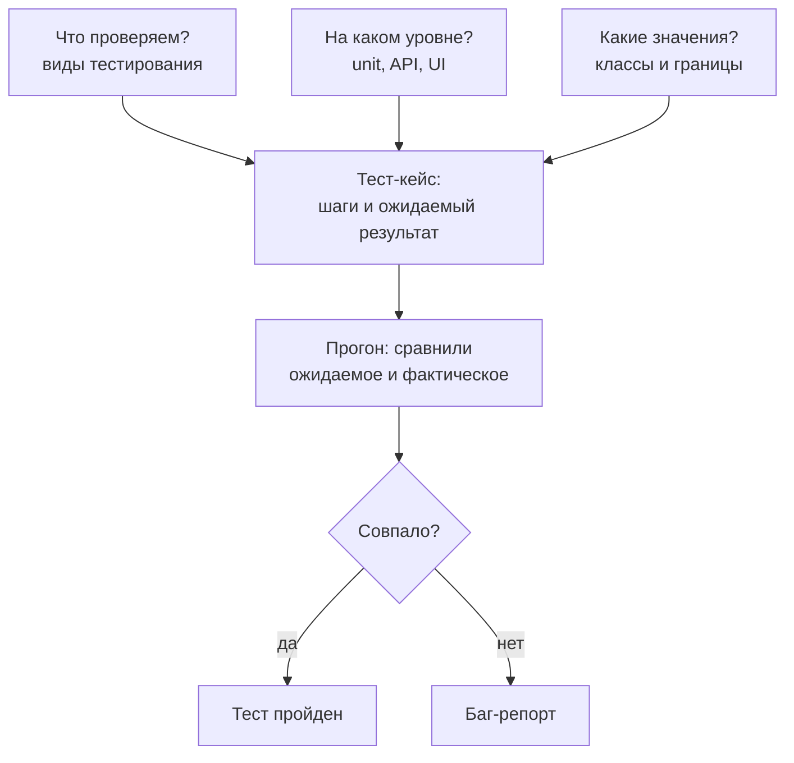
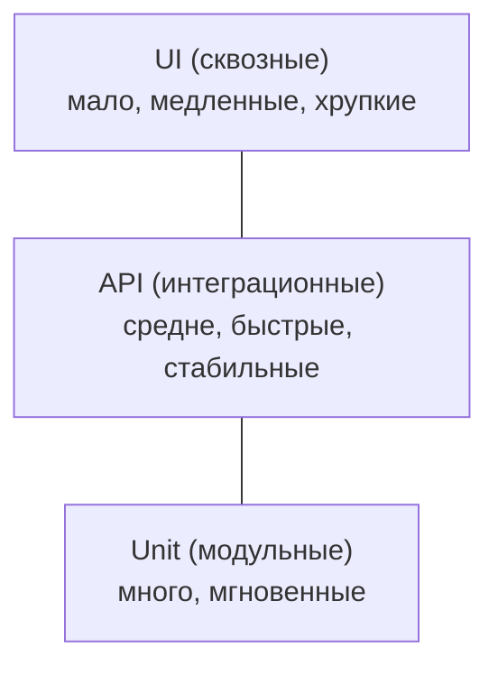
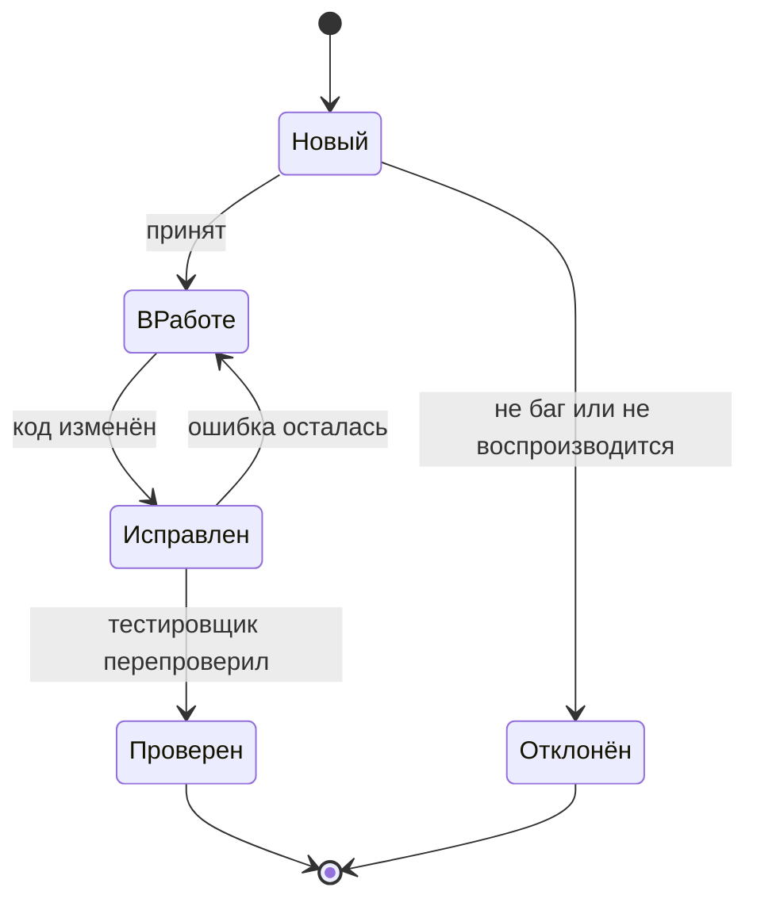

## Зачем это нужно

Допустим, ты написал нагрузочный сценарий и запустил его на «Магазин». Через минуту p95 вырос в пять раз, а каждый третий запрос заканчивается ошибкой. Ты показываешь график разработчику, и он спрашивает: «А при одном пользователе это работает?» Если при одном пользователе заказ тоже не оформляется, то это не проблема нагрузки, а обычная ошибка в программе, и нагрузочный тест тут ни при чём. Чтобы отличать одно от другого, нужно уметь проверить, что сервис вообще работает правильно, и описать найденную ошибку так, чтобы её смогли воспроизвести без тебя.

Тестирование (testing) это проверка программы: сравнение того, что она делает, с тем, что от неё ожидали. Тестировщик не «нажимает кнопки», а **выбирает, какие проверки стоят времени**. Проверить все возможные значения невозможно: у параметра `page` их миллиарды. Поэтому главные навыки этого урока: выбрать мало проверок, но самых полезных, записать их так, чтобы их мог повторить другой человек (или программа), и сообщить об ошибке точно.

Шаг проекта: в репозитории `~/perf-lab` появится каталог `06-api-tests/` с двумя файлами. `test-cases.md`: шесть тест-кейсов для API «Магазина», составленных по правилам классов эквивалентности и граничных значений. `bugs/BUG-001-search-wildcard.md`: твой первый баг-репорт про реальное поведение стенда. В следующем уроке эти же проверки станут кодом.

## Что нужно знать

- Запрос, ответ и коды статуса (200, 401, 404, 422): [урок 2.1](../02-web/01-client-server-http.md).
- REST, JSON и токен авторизации: [урок 2.2](../02-web/02-rest-json-auth.md). Нужно, чтобы читать ответы API и понимать, что такое Bearer-токен.
- `curl` и вывод кода ответа через `-w`: [урок 1.4](../01-linux/04-network-cli.md).
- Стенд «Магазин» поднят: [урок 5.3](../05-docker/03-compose-shop.md). Проверка: `curl -s localhost:8000/readyz` отвечает `{"status":"ready"}`.
- Репозиторий `~/perf-lab` и команды `git add`, `git commit`, `git push`: [урок 3.2](../03-git/02-github.md).

## Картина целиком

Ты принимаешь работу у ремонтной бригады, которая сделала в квартире свет. Ты не станешь включать каждую лампочку по сто раз. Ты пройдёшь по списку: включается ли свет в каждой комнате (основная работа), что будет, если выключатель нажать быстро два раза подряд (необычное действие), не бьёт ли током при мокрых руках (безопасность), не выбивает ли автомат, когда включены чайник и духовка (нагрузка). Каждая проверка отвечает на свой вопрос, и список можно записать, чтобы вторая бригада проверила то же самое.

Тестирование ПО устроено так же, и все его понятия делятся на три вопроса:



Что здесь видно: три вопроса (что, где, с чем) складываются в тест-кейс, а прогон даёт один из двух исходов. Если результат не совпал с ожиданием, появляется баг-репорт, и у каждого из этих кусков есть правила, которые мы разберём по очереди.

Нагрузочное тестирование, ради которого мы здесь, это один из видов в первом вопросе. Оно отвечает на «сколько и как быстро», а не на «правильно ли». Но оно стоит на плечах остальных: нагружать сервис, который отвечает неправильно даже одному пользователю, бессмысленно.

## Теория

### Зачем тестировать и чего тест не обещает

**Зачем это существует.** Люди ошибаются, а программы пишут люди. Без проверки ошибка доезжает до пользователя: покупатель теряет заказ, компания теряет деньги и доверие. Чем позже найдена ошибка, тем дороже её исправление: на этапе чтения требований это правка предложения, на этапе работы у клиентов это срочный выпуск, откат, разбор и извинения.

**Как это устроено.** Принципов три:

1. **Тест показывает наличие ошибок, но не их отсутствие.** Сто зелёных тестов значат «в этих ста местах ошибок нет», а не «ошибок нет». Корректор находит опечатки в книге, но не может доказать, что их нет: он лишь не нашёл. С программой проще только в одном: её проверяет программа, много раз и за секунды.
2. **Исчерпывающая проверка невозможна.** Параметр `page` принимает любое целое число, проверить их все нельзя. Выбираем проверки так, чтобы ловить больше ошибок меньшим числом: как именно, разберём в разделах про классы эквивалентности и границы.
3. **Тесты стареют.** Набор, который не менялся полгода, проверяет полугодовой давности представление о продукте: новые функции остаются без проверок, а старые проверки защищают то, чего уже нет. Тесты правят вместе с кодом.

**Разобранный пример.** Страница `GET /api/products?page=1` вернула 200 в трёх проверках: `page=1`, `page=2`, `page=3`. Значит ли это, что пагинация работает? Нет: проверено три значения из миллиардов, и ни одного на границе (последняя страница, страница за последней, `page=0`). Именно такие места чаще всего ломаются, и урок учит их выбирать.

**Что путают.** «Зелёные тесты» и «нет багов». Зелёный прогон говорит лишь, что ожидания, записанные в тестах, выполнились.

### Виды тестирования

**Зачем это существует.** Слово «проверить» ничего не говорит о том, что именно проверяем: что сервис вообще поднялся, что он считает правильно, что он выдерживает сто покупателей или что он не показывает чужие заказы. Это разные вопросы с разной ценой ответа. Названия видов нужны, чтобы коротко договориться, какой из вопросов задан, и не подменить один другим.

**Как это устроено.** Виды делятся на две группы по тому, о чём вопрос:

- **Функциональное** (functional) отвечает «делает ли программа то, что должна»: правильный результат, верный код ответа.
- **Нефункциональное** (non-functional) отвечает «насколько хорошо она это делает»: скорость, надёжность, безопасность. Нагрузочное тестирование, ради которого ты в курсе, относится сюда.

Внутри этих групп вид зависит ещё и от момента и цели прогона:

- **Дымовое** (smoke) это самая короткая проверка «стенд вообще живой и главный путь проходит». Берёт секунды. Если она красная, остальное запускать нет смысла.
- **Регрессионное** (regression) это повторный прогон старых проверок после каждого изменения кода: ловит случай, когда починили одно, а сломалось другое. Регрессия строится из тех же тестов, не из новых идей.
- **Исследовательское** (exploratory) это поиск странностей человеком без готового списка: «а что будет, если...». Находит то, что никто не догадался записать.

**Разобранный пример.** Возьмём `POST /api/orders`. Дымовая проверка: положить товар, оформить, получить 201. Функциональная: пустая корзина даёт 400, товара не хватает на складе даёт 409. Безопасность: чужой заказ по `GET /api/orders/{id}` даёт 404. Нагрузочная: 50 покупателей оформляют заказы одновременно (тема 9). Регрессия это не новая проверка, а повторный прогон всего этого после каждого изменения кода.

**Что путают.** Смешивают нагрузочное и функциональное: «сервис быстрый, значит, работает». Быстрый ответ может быть быстрой ошибкой.

> **Проверь понимание:** сервис вернул 500 на `GET /api/cart`, а нагрузочный тест показал «средняя задержка 3 мс, отлично». Какой вид проверки пропущен?

<details markdown="1">
<summary>Ответ</summary>

Функциональный: никто не проверил, что ответ правильный. 500 приходит быстро именно потому, что сервис сразу падает, не делая работу. Скорость ошибки ничего не говорит о качестве. Нагрузочный сценарий обязан проверять код и содержимое ответа.

</details>

### Уровни тестирования и пирамида тестов

**Зачем это существует.** Одну и ту же ошибку можно поймать на разной глубине: функцией в коде, запросом к API или кликом в браузере. Чем выше уровень, тем ближе к тому, что видит пользователь, но тем медленнее и капризнее тест. Нужно решить, **где что проверять**, иначе набор станет либо медленным, либо слепым.

**Как это устроено.** Три основных уровня:

1. **Unit-тест** (модульный, unit test) проверяет одну маленькую часть кода: функцию, класс. Без сети, без базы, запускается за миллисекунды. Пример для «Магазина»: функция, которая считает итог корзины, на трёх числах. Пишут его обычно разработчики.
2. **API-тест** (интеграционный, на уровне сервиса) шлёт настоящий HTTP-запрос работающему приложению и сверяет ответ. Здесь участвуют приложение, база и кэш вместе. Это основной уровень этого курса: быстро (десятки миллисекунд), стабильно, видит всю бизнес-логику.
3. **UI-тест** (end-to-end, сквозной) управляет браузером: открывает страницу, кликает, проверяет, что на экране. Видит всё, как пользователь, но медленный (секунды на тест) и хрупкий: поменяли цвет кнопки или id элемента, тест упал, хотя «ничего не сломалось».

Эти уровни складывают в фигуру, которую назвали **пирамидой тестов** (test pyramid): внизу много быстрых unit-тестов, в середине поменьше API-тестов, наверху совсем мало UI-тестов. Форма отражает цену: чем выше, тем меньше тестов мы можем позволить.



Что здесь видно: сверху вниз растут число тестов и скорость, а реалистичность падает. API-уровень лежит в «золотой середине»: он уже проверяет настоящее поведение сервиса, но не зависит от вёрстки.

Поиграй с пирамидой: ползунки задают, сколько тестов на каждом уровне. Числа условные, но порядок как в жизни.

<div class="viz" data-viz="api-test-pyramid" data-unit="200" data-api="60" data-ui="8"></div>

Что здесь видно: «часы прогона» бегут слева направо по рядам снизу вверх. В пирамиде почти всё время набора занимают UI-тесты, хотя их всего восемь. Нажми «Рожок» и сравни: перевёрнутая форма превращает прогон в полчаса, и красный набор всё чаще оказывается ложной тревогой.

**Разобранный пример.** Ошибка: заказ создаётся с общей суммой, посчитанной неверно (забыли умножить цену на количество). Где её поймать?

- Unit-тест функции подсчёта: за 2 мс, укажет точную строку кода. Но если функция верна, а в запросе к базе берётся не та цена, unit-тест промолчит.
- API-тест: положить товар 5 (цена 285) в количестве 2, оформить, проверить `total == 570`. Займёт десятки миллисекунд, увидит ошибку на любом участке цепочки «запрос → расчёт → база → ответ».
- UI-тест: открыть сайт, залогиниться, найти товар, нажать «в корзину», оформить, сравнить сумму на экране. Займёт 15 секунд и может упасть из-за анимации, не из-за суммы.

Ту же проверку дешевле всего сделать на API-уровне, и в нашем курсе у «Магазина» нет UI вообще: у стенда только API, как у большинства сервисов, которые нагружают.

> **Проверь понимание:** UI-тест «оформить заказ» падает раз в десять запусков из-за того, что кнопка не успела прорисоваться. Какой тест лучше написать вместо него и почему?

<details markdown="1">
<summary>Ответ</summary>

API-тест на `POST /api/orders`: он проверяет ту же бизнес-логику без браузера, не зависит от вёрстки и скорости прорисовки, идёт десятки миллисекунд. Один сквозной UI-тест можно оставить для самого важного пути, но не для каждой проверки.

</details>

### Тест-кейс и чек-лист: как записать проверку

**Зачем это существует.** Проверка, которая живёт в голове, нерепродуцируема: завтра ты забудешь, как именно проверял, а коллега не поймёт. Запись превращает «я посмотрел» в «любой может повторить и получить тот же результат». Кроме того, запись заставляет заранее решить, что считать правильным.

**Аналогия.** Рецепт: «возьми два яйца, взбей, жарь две минуты, получится омлет». В рецепте есть исходные продукты, шаги и результат. Без «получится омлет» непонятно, удалось ли блюдо. Аналогия ломается тем, что у рецепта допустима вариация, а у тест-кейса ожидаемый результат должен быть точным.

**Как это устроено.** **Тест-кейс** (test case) это описание одной проверки. В нём:

- **Идентификатор и название**: `TC-API-007`, «Заказ с пустой корзиной отклоняется». Название говорит, что проверяем.
- **Предусловия** (preconditions): что должно быть готово до начала. «Стенд работает, пользователь вошёл, его корзина пуста».
- **Шаги** (steps): что сделать, по пунктам, достаточно точно, чтобы не гадать.
- **Тестовые данные**: конкретные значения. «Пользователь `user0001@shop.lab`», «`size=101`».
- **Ожидаемый результат** (expected result): что должно произойти. «Код 400, тело `{"detail":"cart is empty"}`».
- **Фактический результат** (actual result) и **статус**: что получилось на самом деле и «пройден» или «упал». Заполняются при прогоне.

Рядом живёт **чек-лист** (checklist) это короткий список «что проверить» без подробных шагов: «вход верный пароль, вход неверный пароль, вход без пароля». Чек-лист быстрее писать и читать, подробный тест-кейс точнее. Правило: **чек-лист для опытного и для исследовательской проверки, тест-кейс для того, что должно выполняться одинаково кем угодно и что потом станет автотестом.**

Хороший тест-кейс обладает четырьмя свойствами:

1. **Проверяет одну вещь.** Если в нём три ожидаемых результата, при падении непонятно, какой сломался. Исключение: один результат можно описать несколькими полями ответа.
2. **Независим.** Не требует, чтобы до него выполнился другой кейс. Иначе один упавший тест уронит каждый следующий за собой.
3. **Однозначен.** Два человека получают один результат. «Страница загружается быстро» не годится, «`GET /api/products` отвечает 200 за 500 мс» годится.
4. **Повторяем.** Не зависит от случая: в `test-cases.md` нет «товара, который случайно оказался в наличии».

**Разобранный пример.** Кейс для заказа с пустой корзиной, на настоящем поведении «Магазина» (в коде `if not quantities: raise HTTPException(400, "cart is empty")`):

| Поле | Значение |
|---|---|
| ID, название | TC-API-007, Заказ с пустой корзиной отклоняется |
| Предусловия | Стенд работает; пользователь не имеет товаров в корзине (создан новый) |
| Шаги | 1. Зарегистрировать нового пользователя и войти, получить токен. 2. `POST /api/orders` с заголовком `Authorization: Bearer <токен>`, без тела |
| Данные | Новый email вида `tc007-<случайное>@shop.lab`, пароль `password` |
| Ожидаемый результат | Код `400`, тело `{"detail":"cart is empty"}` |
| Фактический | (заполняется при прогоне) |

Почему «новый» пользователь: у `user0001` корзина может оказаться непустой после чужих проверок, и тест станет зависеть от соседей. Новый пользователь решает это раз и навсегда.

> **Проверь понимание:** в тест-кейсе написано «ожидаемый результат: заказ создаётся корректно». Что здесь не так и как поправить?

<details markdown="1">
<summary>Ответ</summary>

Слово «корректно» нельзя проверить: два человека поймут его по-разному. Нужно: «код 201, `status` равен `paid`, `total` равен сумме `price × qty` по позициям, корзина после заказа пуста». Ожидаемый результат должен быть таким, чтобы его можно было превратить в `assert`.

</details>

### Классы эквивалентности: выбираем мало, но разных

**Зачем это существует.** Ты не можешь проверить все значения параметра, но можешь заметить, что многие из них программа обрабатывает одинаково. Если для `size=5` и `size=17` код идёт по одной и той же ветке, проверять оба бессмысленно: найдёшь то же самое дважды. Класс эквивалентности (equivalence class) это группа входных значений, на которых программа должна вести себя одинаково. Берём **одного представителя** из каждой группы, и этого достаточно.

**Аналогия.** Проходной турникет в метро. Для него есть всего два класса людей: «с действующим билетом» и «без». Не нужно проверять, пропустит ли он Ивана, Марию и Петра по отдельности: если один человек с билетом прошёл, пройдут и остальные. Аналогия ломается на «странных» людях: если турникет по ошибке не пускает всех с фамилией на букву «Ы», это придётся искать отдельно, и этим занимаются другие методы.

**Как это устроено.** Берёшь параметр, читаешь правило (в коде или в документации) и делишь все значения на классы:

1. **Допустимые** (валидные) значения. Программа должна их принять и работать.
2. **Недопустимые** (невалидные) значения. Программа должна отклонить их с понятной ошибкой.

Классов может быть больше двух: недопустимые часто делятся на «слишком мало», «слишком много», «не число». Затем из **каждого класса** берётся одно значение, и получается минимальный набор.

**Разобранный пример.** Параметр `size` у `GET /api/products`. В коде приложения: `size: int = Query(20, ge=1, le=100)`. Читаем: целое число, от 1 до 100 включительно, по умолчанию 20. Классы:

| Класс | Значения | Ожидаем | Представитель |
|---|---|---|---|
| Допустимые | от 1 до 100 | 200, в ответе `size` равен заданному | 20 |
| Слишком мало | 0 и меньше | 422 | -5 |
| Слишком много | 101 и больше | 422 | 500 |
| Не число | «abc», пустое | 422 | `abc` |

Параметр `page` проще: `page: int = Query(1, ge=1)`. Классы: от 1 и больше (200), меньше 1 (422), не число (422). Верхнего предела у `page` в коде нет, и это важная деталь: страница за концом списка (скажем, `page=999999`) **не** ошибка, ответ `200` с пустым списком `items`. Это поведение стоит зафиксировать тестом, потому что кто-нибудь однажды «починит» его на 404, и клиенты сломаются.

Минимальный набор для `size` из четырёх проверок (по одной на класс) дешевле сотни и ловит почти те же ошибки. Но у классов есть слабое место: **ошибки любят сидеть на стыках**. Для этого следующий метод.

**Что путают.** Класс эквивалентности и «положительный/отрицательный» тест. Положительный (позитивный) тест проверяет, что корректный ввод принимается; отрицательный (негативный) проверяет, что некорректный отклоняется. Классы эквивалентности включают и те, и другие: допустимые классы дают позитивные тесты, недопустимые дают негативные. Хороший набор содержит и те, и другие: сервис, который принимает всё, так же плох, как тот, что отклоняет всё.

> **Проверь понимание:** у поля `qty` в корзине правило `Field(ge=1)`. Назови классы и по представителю от каждого.

<details markdown="1">
<summary>Ответ</summary>

Допустимые: целые от 1 и больше, представитель 2 (ожидаем 201). Слишком мало: 0 и отрицательные, представитель -3 (422). Не число: например `"two"` (422). Заметь: верхней границы у `qty` в схеме запроса нет. Что будет с огромным количеством, придётся выяснять отдельно: это уже вопрос к приложению, а не к схеме.

</details>

### Граничные значения: тесты на стыках

**Зачем это существует.** Статистика ошибок говорит, что программисты чаще всего ошибаются «на единицу»: написали `<` вместо `<=`, начали считать с нуля, а не с единицы. Такие ошибки сидят ровно на **границе** между классами, а не в середине. Поэтому на каждой границе берут значения **по обе стороны** от неё, вплотную.

**Аналогия.** Высота арки на въезде во двор: «не выше 2,2 м». Водитель, который хочет проверить, пролезет ли фургон, ищет не значение «1 м» и не «5 м», а именно 2,2 м и 2,21 м. Там решается вопрос, а не в середине допустимого и не очень далеко за запретом. Аналогия ломается в том, что у программ границ может быть несколько, и неочевидных.

**Как это устроено.** Для границы между «допустимо» и «недопустимо» берут три значения: **ровно на границе**, **на единицу меньше** и **на единицу больше**. Чаще всего хватает двух: последнее допустимое и первое недопустимое. Так для `size` получаем четыре точки: 0 и 1 на нижней границе, 100 и 101 на верхней. Минимальный набор «классы + границы» для `size`: 0, 1, 20, 100, 101 и `abc`.

<div class="viz" data-viz="api-test-boundary" data-param="size" data-value="101"></div>

Что здесь видно: шкала значений `size` раскрашена по классам, зелёный участок от 1 до 100 принимается, красные по бокам отклоняются. Ромбики это граничные значения, кружки по одному представителю класса. Двигай ползунок и смотри, как код ответа меняется ровно на границах.

Теперь то же самое для `page`: здесь у шкалы всего одна граница.

<div class="viz" data-viz="api-test-boundary" data-param="page" data-value="1"></div>

**Разобранный пример.** Как граница может ошибиться. Представь, что разработчик написал проверку `size < 100` вместо `size <= 100`. Тогда `size=50` работает, `size=500` отклоняется (тест на представителя класса «слишком много» зелёный), а `size=100` ошибочно отклоняется. Ни один тест из середины классов этого не поймает. Только граничный `size=100` скажет: «ожидали 200, получили 422». Это и есть выгода: пять-шесть проверок ловят то, что сотня «случайных» пропустит.

Граница бывает не только числовой. В «Магазине» есть интересная: пароль. В коде: пароль не короче 8 символов при регистрации и не длиннее **72 байт** (это ограничение алгоритма bcrypt, о котором предупреждает комментарий в коде). Байт, а не символов: русская буква в кодировке UTF-8 занимает 2 байта. Поэтому 36 русских букв (72 байта) принимаются, а 37 (74 байта) нет, хотя «символов меньше 72». Граница оказалась не там, где кажется. Тест, который проверяет 72 и 73 латинских символа, этого не заметил бы, а тест с кириллицей заметит.

> **Проверь понимание:** правило для `size`: от 1 до 100. Какие значения нужно проверить на границах и что ожидается для каждого?

<details markdown="1">
<summary>Ответ</summary>

Нижняя граница: 0 (ожидаем 422) и 1 (ожидаем 200). Верхняя граница: 100 (ожидаем 200) и 101 (ожидаем 422). Четыре проверки. Если в схеме перепутаны `<` и `<=`, хотя бы одна из них упадёт.

</details>

### Позитивные и негативные проверки

**Зачем это существует.** Новичок обычно проверяет, что всё работает «как задумано». Но половина реальных проблем в том, как сервис ведёт себя при **неправильном** использовании: без токена, с неверным паролем, с несуществующим товаром. Сервис, который в таких случаях возвращает 500 или, хуже, 200, это бомба: пользователь, злоумышленник или ошибка клиента рано или поздно его поймают.

**Как это устроено.** В API-тестах у каждого эндпоинта есть «золотой набор» проверок:

- **Позитив**: корректный запрос, ожидаем 2xx и верное тело.
- **Нет авторизации**: нет токена или он неверен, ожидаем 401.
- **Нет такого**: запрашиваем несуществующий объект, ожидаем 404.
- **Неверные данные**: нарушаем правила схемы, ожидаем 422.
- **Конфликт с состоянием**: повторная регистрация того же email, ожидаем 409.
- **Бизнес-правило**: пустая корзина, нехватка товара, ожидаем 400 или 409.

Важный принцип негативных тестов: проверять нужно **не только код**, но и то, что **состояние не изменилось**. После неудачного заказа корзина должна остаться как была, а товар не должен списаться.

**Разобранный пример.** Эндпоинт `POST /api/cart/items`. Что известно из кода: тело `{"product_id": int >= 1, "qty": int >= 1}`, нужен токен, товар должен существовать.

| Проверка | Запрос | Ожидаем |
|---|---|---|
| Позитив | `product_id=1, qty=2`, токен | 201, в `items` товар с `qty` 2 |
| Нет токена | то же, без заголовка | 401, `bearer token required` |
| Неверный токен | `Bearer abc` | 401, `invalid or expired token` |
| Нет товара | `product_id=99999999` | 404, `product not found` |
| Нулевое количество | `qty=0` | 422 |
| Отрицательное количество | `qty=-1` | 422 |
| Не число | `qty="два"` | 422 |

Семь проверок на один эндпоинт, и шесть из них негативные. Такое соотношение для API нормально. Коды различаются: 422 приходит, когда запрос не соответствует схеме (не то поле, не тот тип, число вне диапазона), а 400 приходит из бизнес-логики («корзина пуста»): запрос составлен правильно, но состояние не позволяет его выполнить.

> **Проверь понимание:** пользователь без токена вызывает `GET /api/orders`. Назови ожидаемый код и ещё одну проверку, которая нужна рядом.

<details markdown="1">
<summary>Ответ</summary>

Код 401. Рядом нужна проверка с **чужим** токеном или истёкшим: ожидаем тоже 401, но с другим текстом (`invalid or expired token`). А ещё полезна проверка, что нельзя прочитать чужой заказ: `GET /api/orders/{id}` с токеном другого пользователя вернёт 404, а не 200.

</details>

### Баг-репорт: как сообщить об ошибке

**Зачем это существует.** Найти ошибку наполовину дела. Если разработчик не может воспроизвести её, он закроет задачу с пометкой «у меня работает» и будет прав. Хороший баг-репорт (bug report) сокращает путь от «нашёл» до «исправили» с недель до часов: он содержит всё, что нужно, чтобы увидеть ошибку своими глазами.

**Аналогия.** Заявка мастеру. «Не работает кран» бесполезно. «На кухне кран холодной воды: при повороте до упора вода течёт, но из-под ручки каплет; началось после замены прокладки во вторник» это то, с чем можно ехать. Аналогия ломается в том, что мастер видит кран, а разработчик не видит твоё окружение, поэтому ему нужна ещё версия и данные.

**Как это устроено.** Поля баг-репорта (порядок и набор в разных трекерах чуть отличаются, суть та же):

1. **Заголовок**: одной строкой, что и где сломано. Не «поиск не работает», а «Поиск по `_` возвращает все товары вместо пустого списка».
2. **Окружение**: версия, стенд, дата. Что запущено и как.
3. **Шаги воспроизведения** (steps to reproduce): пронумерованные, с точными запросами. По ним другой человек должен получить ту же ошибку с первого раза.
4. **Ожидаемый результат** и **фактический результат**: что должно было случиться (и почему ты так думаешь) и что случилось на самом деле, дословно, с кодом и телом ответа.
5. **Важность** (severity): насколько сильно ошибка вредит. И **приоритет** (priority): насколько срочно её чинить. Это разные величины: опечатка в названии главной страницы малоопасна (низкая важность), но видна всем (высокий приоритет); редкий сбой при оплате опасен (высокая важность), но если случается раз в год, чинить его можно в плановом порядке.
6. **Вложения**: вывод `curl`, фрагмент лога, скриншот, `request_id`. У «Магазина» каждый ответ содержит заголовок `X-Request-ID`, по нему разработчик найдёт запись в логах. Это очень ценное вложение.

Путь, который проходит баг после создания:



Что здесь видно: твоя работа не заканчивается созданием баг-репорта, ты же и **перепроверяешь** исправление. Если ошибка осталась, баг возвращается в работу. Поэтому шаги воспроизведения должны быть такими, чтобы по ним можно было сверить результат до и после.

**Разобранный пример.** Реальное поведение стенда. В поиске товаров `GET /api/products?q=...` приложение собирает условие `name ILIKE %s` с подстановкой `%{q}%`, не экранируя спецсимволы. В SQL-операторе `ILIKE` знаки `%` и `_` значат «любая последовательность» и «любой один символ». Поэтому пользователь, который ищет подчёркивание, получает не пустой список, а весь каталог. Вот как это оформляется:

```text
BUG-001. Поиск по «_» (и «%») возвращает весь каталог вместо пустого списка

Окружение: стенд «Магазин» из project/shop, docker compose, версия на 03.10.2026,
           каталог из 10 000 товаров с именами «Товар 1» ... «Товар 10000».
Важность: низкая (данные не искажаются, но выдача вводит в заблуждение).
Приоритет: низкий.

Шаги:
1. Убедиться, что в названиях нет подчёркивания:
   curl -s 'localhost:8000/api/products?q=Товар%205' | jq '.total'
   (поиск по полному названию работает)
2. Выполнить поиск по подчёркиванию:
   curl -s 'localhost:8000/api/products?q=_&size=1'

Ожидаемый результат: ни в одном названии нет символа «_», поэтому
{"items":[],"page":1,"size":1,"total":0}.
Фактический результат: 200, "total": 10000, то есть найдены все товары.
То же для q=%25 (символ «%»).

Причина (предположение): в запрос подставляется «%_%», а «_» в ILIKE
означает «любой символ». Пользовательский ввод нужно экранировать.
Вложения: заголовок ответа X-Request-ID: <значение из curl -i>.
```

Читаем: шаг 1 доказывает, что обычный поиск работает (чтобы не подумали, что сломан весь поиск), шаг 2 воспроизводит. Ожидаемый результат обоснован фактом (в названиях нет символа). Причина помечена как предположение: тестировщик не обязан знать, где в коде ошибка, но подсказка экономит время. Из заголовка убрана оценочность («ужасный баг»).

**Что путают.** Баг и **особенность** (feature, by design). Если программа делает то, что задумано, но задумано неудобно, это не баг, а предложение по улучшению. Чтобы решить, баг ли это, нужен **эталон**: требования, документация, здравый смысл («поиск по подчёркиванию должен искать подчёркивание»). Если эталона нет, пиши в репорте вопрос: «ожидается ли такое поведение?». Ещё путают важность и приоритет, см. выше.

> **Проверь понимание:** в баг-репорте написано «Корзина иногда не очищается после заказа. Ожидаемый: всё работает. Фактический: не работает». Назови три проблемы.

<details markdown="1">
<summary>Ответ</summary>

Во-первых, нет шагов воспроизведения («иногда» это не условие: когда именно?). Во-вторых, ожидаемый и фактический результаты ничего не говорят: нужны конкретные коды, тела ответов, что осталось в корзине. В-третьих, нет окружения и вложений (`request_id`, лог). Такой репорт вернут с пометкой «не воспроизводится».

</details>

Репорт удобнее писать по шагам. Вот порядок, который экономит время:

<div class="viz" data-viz="flow" data-title="Как написать баг-репорт" data-steps='[{"title":"Воспроизведи ошибку дважды","text":"Если получилось один раз, это ещё не баг: возможно, виновато окружение."},{"title":"Сократи до минимума","text":"Убери лишние шаги: чем короче путь, тем проще разработчику."},{"title":"Запиши точные запросы","text":"Копируй команды `curl` и ответы, а не пересказывай словами."},{"title":"Сформулируй ожидание","text":"Что должно было произойти и на чём основано (требование, документация, соседний случай)."},{"title":"Заголовок и важность","text":"Одна строка с признаком и местом; важность и приоритет по последствиям."},{"title":"Перепроверь после исправления","text":"Пройди те же шаги на новой версии и закрой баг сам."}]'></div>

Что здесь видно: большая часть работы происходит до написания репорта, в шагах «воспроизведи» и «сократи». Именно они отличают репорт, который чинят, от репорта, который закрывают.

## Практика

Стенд поднят. Все команды из каталога `~/perf-lab`, тем же терминалом, в котором работает стенд.

### 1. Проверь стенд и создай каталог

```bash
curl -s localhost:8000/readyz
mkdir -p ~/perf-lab/06-api-tests/bugs
cd ~/perf-lab/06-api-tests
```

`mkdir -p` создаёт каталог вместе с недостающими родительскими, `bugs` сразу внутри. Ожидаемый вывод первой команды:

```text
{"status":"ready"}
```

**Как читать вывод:** `ready` значит, что приложение видит и PostgreSQL, и Redis. Если вместо этого `{"detail":{"unavailable":["redis"]}}`, зависимость не поднялась: `docker compose ps` в `~/load-tester/project/shop` покажет, какая.

**Типичные ошибки:** `curl: (7) Failed to connect to localhost port 8000` означает, что стенд не запущен: `cd ~/load-tester/project/shop && docker compose up -d --wait`.

### 2. Изучи границы руками

Команда печатает только код ответа. Разбор: `-s` убирает индикатор прогресса, `-o /dev/null` выбрасывает тело, `-w '%{http_code}\n'` печатает код после запроса. Кавычки вокруг адреса обязательны: в оболочке `&` без кавычек запускает команду в фоне. Цикл `for` перебирает значения, `$s` подставляет очередное:

```bash
for s in 0 1 100 101 abc; do
  printf 'size=%s -> ' "$s"
  curl -s -o /dev/null -w '%{http_code}\n' "localhost:8000/api/products?size=$s"
done
```

```text
size=0 -> 422
size=1 -> 200
size=100 -> 200
size=101 -> 422
size=abc -> 422
```

Повтори для `page`: значения `0 1 2 999999 abc`.

```bash
for p in 0 1 2 999999 abc; do
  printf 'page=%s -> ' "$p"
  curl -s -o /dev/null -w '%{http_code}\n' "localhost:8000/api/products?page=$p"
done
```

```text
page=0 -> 422
page=1 -> 200
page=2 -> 200
page=999999 -> 200
page=abc -> 422
```

**Как читать вывод:** первая строка каждой пары это граница (0 и 1, 100 и 101), код меняется ровно между ними. Странная строка: `page=999999` даёт 200. Посмотри тело:

```bash
curl -s 'localhost:8000/api/products?page=999999&size=5'
```

```text
{"items":[],"page":999999,"size":5,"total":10000}
```

Список пуст, но поле `total` по-прежнему 10 000: сервис честно говорит «товаров 10 000, а на этой странице нет ничего». Это штатное поведение, и его нужно зафиксировать тест-кейсом.

Теперь посмотри, как выглядит тело ошибки 422, чтобы потом сверять его в тестах:

```bash
curl -s 'localhost:8000/api/products?size=101' | jq
```

```text
{
  "detail": [
    {
      "type": "less_than_equal",
      "loc": ["query", "size"],
      "msg": "Input should be less than or equal to 100",
      "input": "101",
      "ctx": { "le": 100 }
    }
  ]
}
```

(`jq` расставил отступы, в сыром ответе всё в одну строку.) **Как читать вывод:** `loc` говорит, где ошибка (`query` значит параметр адреса, `size` его имя), `msg` причину, `ctx` правило. Для тестов полезнее всего `loc`: можно проверить, что ругается именно на `size`, а не на что-то ещё.

### 3. Составь тест-кейсы

Создай файл `test-cases.md` и запиши пять кейсов (шестой добавишь после следующего шага) по образцу из раздела про тест-кейс. Рекомендуемый набор:

1. **TC-API-001**: `size=100` принимается (граница, 200, в ответе `size` равен 100, `items` не длиннее 100).
2. **TC-API-002**: `size=101` отклоняется (граница, 422, `loc` содержит `size`).
3. **TC-API-003**: `page=999999` возвращает пустой список (200, `items` пуст, `total` 10000).
4. **TC-API-004**: `/api/cart` без токена (401, `bearer token required`).
5. **TC-API-005**: заказ с пустой корзиной (400, `cart is empty`), по образцу `TC-API-007` из урока.

Формат любой: таблицей, как в уроке, или списком. Главное: у каждого кейса есть предусловия, точные шаги, данные и однозначный ожидаемый результат. Проверь каждый кейс руками, по своим же шагам, и впиши фактический результат. Для кейса 5 понадобится новый пользователь:

```bash
EMAIL="tc005-$RANDOM@shop.lab"
curl -s -X POST localhost:8000/api/register -H 'Content-Type: application/json' \
  -d "{\"email\":\"$EMAIL\",\"password\":\"password\"}"
TOKEN=$(curl -s -X POST localhost:8000/api/login -H 'Content-Type: application/json' \
  -d "{\"email\":\"$EMAIL\",\"password\":\"password\"}" | jq -r .token)
curl -s -i -X POST localhost:8000/api/orders -H "Authorization: Bearer $TOKEN" | head -1
```

Разбор: `$RANDOM` это встроенная переменная оболочки со случайным числом, она делает email уникальным. Флаг `-d` передаёт тело запроса, заголовок `Content-Type: application/json` говорит серверу, что тело это JSON. `jq -r .token` достаёт поле `token` из ответа без кавычек. `$(...)` подставляет вывод команды в переменную. Последняя команда печатает первую строку ответа (`-i` включает заголовки, `head -1` оставляет одну строку).

```text
{"id":1002,"email":"tc005-18342@shop.lab"}
HTTP/1.1 400 Bad Request
```

**Как читать вывод:** первая строка это ответ регистрации: пользователь создан (номер у тебя будет свой), вторая это статус заказа с пустой корзиной. Код `400` совпадает с ожиданием, кейс пройден.

**Типичные ошибки:** `{"detail":"email already registered"}` значит, что `$EMAIL` уже существует (маловероятно с `$RANDOM`, но возможно при повторе): выполни присваивание заново. Если `jq` вернул `null`, а не токен, логин не прошёл: посмотри тело ответа логина без `jq`.

### 4. Проверь границу, которая не там, где кажется

Правило пароля при регистрации: не короче 8 символов и не длиннее 72 байт. Проверь четыре латинские длины (один символ это один байт) и две русские. Разбор: `python3 -c "print('a'*72)"` печатает строку из 72 букв, `$(...)` подставляет её в переменную, `$RANDOM` делает email уникальным, чтобы повторный запуск не упёрся в 409.

```bash
for n in 7 8 72 73; do
  pw=$(python3 -c "print('a'*$n)")
  printf 'латиница, длина %s -> ' "$n"
  curl -s -o /dev/null -w '%{http_code}\n' -X POST localhost:8000/api/register \
    -H 'Content-Type: application/json' -d "{\"email\":\"b$n-$RANDOM@shop.lab\",\"password\":\"$pw\"}"
done
for n in 36 37; do
  pw=$(python3 -c "print('я'*$n)")
  printf 'кириллица, длина %s -> ' "$n"
  curl -s -o /dev/null -w '%{http_code}\n' -X POST localhost:8000/api/register \
    -H 'Content-Type: application/json' -d "{\"email\":\"r$n-$RANDOM@shop.lab\",\"password\":\"$pw\"}"
done
```

```text
латиница, длина 7 -> 422
латиница, длина 8 -> 201
латиница, длина 72 -> 201
латиница, длина 73 -> 422
кириллица, длина 36 -> 201
кириллица, длина 37 -> 422
```

**Как читать вывод:** у латиницы границы стоят там, где написано в правиле: 7 и 8 снизу, 72 и 73 сверху. У кириллицы верхняя граница уже на 36 и 37 символах, потому что каждая буква занимает 2 байта. Запиши это как отдельный тест-кейс TC-API-006: «пароль в 36 русских букв принимается, в 37 отклоняется». Побочный эффект: в базе остались тестовые пользователи, они никому не мешают.

**Типичные ошибки:** все ответы `422`, в том числе на длину 8: проверь, что кавычки в `-d` не потерялись (в JSON обязательны двойные). Если вместо кириллицы пришли «вопросики», терминал не в UTF-8: `echo $LANG` должен показывать `...UTF-8`.

### 5. Воспроизведи и опиши баг

Проверь находку из урока сам, по шагам из репорта:

```bash
curl -s 'localhost:8000/api/products?q=Товар%205&size=1' | jq .total
curl -s 'localhost:8000/api/products?q=_&size=1' | jq .total
curl -s 'localhost:8000/api/products?q=%25&size=1' | jq .total
```

```text
1111
10000
10000
```

Первая команда ищет подстроку «Товар 5» (curl сам закодирует кириллицу, `%20` это пробел) и печатает, сколько товаров нашлось. Нашлось 1111 товаров: номера, которые начинаются с цифры 5 (5, 50 до 59, 500 до 599, 5000 до 5999). Вторая и третья показывают суть ошибки: `_` и `%` дают весь каталог.

Теперь оформи `bugs/BUG-001-search-wildcard.md` по шаблону из раздела про баг-репорт, подставив свои реальные данные: дату, значение `X-Request-ID` из `curl -i`. После этого найди **второе** странное поведение сам и оформи BUG-002. Подсказка: корзина принимает `qty`, большее, чем остаток на складе (у каждого товара в базе 1 000 000 штук). Добавь 1 000 001 штук и затем оформи заказ (`$TOKEN` взят в шаге 3: если открыл новый терминал, выполни команды с `TOKEN=` из шага 3 снова):

```bash
curl -s -X POST localhost:8000/api/cart/items -H "Authorization: Bearer $TOKEN" \
  -H 'Content-Type: application/json' -d '{"product_id":1,"qty":1000001}' | jq .total
curl -s -X POST localhost:8000/api/orders -H "Authorization: Bearer $TOKEN"
curl -s -X DELETE localhost:8000/api/cart/items/1 -H "Authorization: Bearer $TOKEN" -o /dev/null -w '%{http_code}\n'
```

```text
137000137
{"detail":"not enough stock"}
204
```

**Как читать вывод:** корзина приняла миллион и один товар по 137 и посчитала итог `137000137`, а заказ отклонён кодом 409 только потом. Вопрос тебе: баг это или задуманное поведение? Решай по правилам из урока: что в этом случае ожидает покупатель, и что бы ты написал в поле «ожидаемый результат». Если решишь, что баг, оформи его; если нет, запиши в репорт-файле вопрос «ожидается ли такое поведение?» и аргумент. Третья команда убирает товар из корзины, чтобы не мешать следующим урокам (`204` значит «удалено, тела нет»).

### 6. Составь чек-лист на регистрацию

Задание без команд. Для `POST /api/register` выпиши в `test-cases.md` чек-лист из восьми-десяти пунктов («что проверить») и рядом ожидаемый код. Опирайся на правила, которые ты уже знаешь: email похож на адрес (`имя@домен.зона`, не длиннее 254 символов), пароль 8-72 байта, повтор того же email это конфликт. Для каждого пункта скажи себе, к какому классу эквивалентности или к какой границе он относится.

<details markdown="1">
<summary>Пример ответа</summary>

| Что проверяем | Ожидаем | Откуда пункт |
|---|---|---|
| Новый email и пароль из 8 символов | 201, в теле `id` и `email` | допустимый класс, нижняя граница пароля |
| Пароль из 7 символов | 422 | граница пароля |
| Пароль из 72 байт | 201 | верхняя граница |
| Пароль из 73 байт | 422 | верхняя граница |
| 36 и 37 русских букв | 201 и 422 | граница в байтах |
| Email без `@` (`invalid`) | 422 | недопустимый класс |
| Email в верхнем регистре `USER@SHOP.LAB` у нового адреса | 201, в теле `email` строчными | приложение приводит адрес к нижнему регистру |
| Повтор уже занятого email | 409 | конфликт с состоянием |
| Пустое тело запроса | 422 | не хватает полей |

Чек-лист коротким списком хорош для быстрой проверки. Каждый пункт, который должен выполняться регулярно, позже превращается в полноценный тест-кейс или сразу в автотест.

</details>

### 7. Закоммить и отправь

```bash
cd ~/perf-lab
git add 06-api-tests
git commit -m "6.1: тест-кейсы и первый баг-репорт"
git push
```

**Типичные ошибки:** `fatal: not a git repository` значит, что ты не в `~/perf-lab`; `git push` просит логин: настройка доступа описана в [уроке 3.2](../03-git/02-github.md).

## Сломай и почини

**Поломка.** Не продукт, а окружение. Останови Redis, в котором «Магазин» хранит токены и корзины, и прогони свои кейсы:

```bash
cd ~/load-tester/project/shop && docker compose stop redis
curl -s localhost:8000/readyz
curl -s -o /dev/null -w '%{http_code}\n' 'localhost:8000/api/products?size=5'
curl -s -X POST localhost:8000/api/login -H 'Content-Type: application/json' \
  -d '{"email":"user0001@shop.lab","password":"password"}'
```

**Задача.** Определи, что из увиденного **баг продукта**, а что **неполадка окружения**. Для каждого из трёх ответов реши: стоит ли заводить баг-репорт и почему. Подсказка: сначала `/readyz`. Если проверка готовности сама говорит, что зависимость недоступна, тест, упавший из-за этого, красный по вине стенда, а не программы.

<details markdown="1">
<summary>Решение</summary>

`/readyz` вернёт `503` и `{"detail":{"unavailable":["redis"]}}`: сервис честно сообщает, что без Redis он не готов. Это правильное поведение, а не баг. Каталог (`/api/products`) продолжит работать (200): он не использует Redis, пока выключен кэш. Вход вернёт `500` и `{"detail":"internal server error"}`: токен сохраняется в Redis, а его нет. Здесь стоит подумать: баг ли это? Возможно, правильнее отвечать 503 с понятным текстом. Разумно завести не баг, а **предложение** об улучшении, приложив шаги. Главный урок: **сначала убедись, что окружение здорово** (дымовой тест `/readyz`), и только потом заводи баг-репорт на «упавший» тест. Почини: `docker compose start redis`, дождись `readyz` и войди заново: старые токены могли исчезнуть.

</details>

## Словарик урока

| Термин | Простыми словами |
|---|---|
| Тестирование (testing) | Проверка программы: сравнение того, что она делает, с тем, что ожидали |
| Отладка (debugging) | Поиск места ошибки в коде и её исправление, работа разработчика |
| Функциональное тестирование | Проверка «делает ли программа то, что должна» |
| Нефункциональное тестирование | Проверка «насколько хорошо»: скорость, надёжность, безопасность |
| Нагрузочное тестирование | Нефункциональная проверка поведения при большом числе запросов |
| Дымовое тестирование (smoke) | Самая короткая проверка «стенд вообще живой» |
| Регрессионное тестирование | Повторный прогон старых проверок после изменений |
| Исследовательское тестирование | Поиск странностей человеком без заготовленного списка |
| Unit-тест | Проверка одной функции без сети и базы |
| API-тест | Настоящий HTTP-запрос к работающему сервису и проверка ответа |
| UI-тест (сквозной, end-to-end) | Управление браузером и проверка того, что на экране |
| Пирамида тестов | Много быстрых unit-тестов, меньше API, совсем мало UI |
| Тест-кейс (test case) | Описанная проверка: предусловия, шаги, данные, ожидаемый результат |
| Чек-лист (checklist) | Короткий список «что проверить» без подробных шагов |
| Ожидаемый и фактический результат | Что должно случиться и что случилось на самом деле |
| Класс эквивалентности | Группа значений, которые программа обрабатывает одинаково |
| Граничные значения | Значения по обе стороны границы между классами: там чаще ошибки |
| Позитивный и негативный тест | Проверка принятия корректного ввода и отклонения некорректного |
| Баг-репорт (bug report) | Описание ошибки, достаточное, чтобы её воспроизвели без автора |
| Важность и приоритет (severity, priority) | Насколько ошибка вредит и насколько срочно её чинить |

## Вопросы с собеседований

Раздел для повторения: ответь вслух, потом открой ответ. Короткие вопросы тренируй на скорость: ответ за 30 секунд.

### 1. [junior] [часто] Чем функциональное тестирование отличается от нефункционального?

<details markdown="1">
<summary>Ответ</summary>

Функциональное отвечает на вопрос «делает ли программа то, что должна»: правильный ли результат, верный ли код ответа. Нефункциональное отвечает «насколько хорошо»: скорость, надёжность, безопасность, удобство. Нагрузочное тестирование относится к нефункциональному: оно меряет поведение при большом числе запросов. Нагрузочный тест без функциональных проверок опасен: можно замерить скорость ошибки.

**Что хотят услышать:** «что» против «как хорошо», пример, где нагрузка относится.

**Красный флаг:** «нефункциональное это когда не работает».

</details>

### 2. [junior] [часто] Что такое пирамида тестов и почему она такой формы?

<details markdown="1">
<summary>Ответ</summary>

Внизу много unit-тестов (быстрые, дешёвые, стабильные), в середине меньше API-тестов, наверху совсем мало UI-тестов (медленные, хрупкие, дорогие). Форма отражает цену: чем выше уровень, тем больше стоит каждый тест и тем чаще он падает без причины. Перевёрнутая пирамида («рожок мороженого») даёт медленный и ненадёжный набор.

**Что хотят услышать:** три уровня, причину формы (скорость, стабильность, цена), что API-уровень золотая середина.

**Красный флаг:** «UI-тесты самые точные, значит их должно быть больше всего».

</details>

### 3. [junior] [часто] Из чего состоит хороший тест-кейс?

<details markdown="1">
<summary>Ответ</summary>

Идентификатор и название, предусловия, шаги, тестовые данные, ожидаемый результат и (при прогоне) фактический результат со статусом. Свойства хорошего кейса: проверяет одну вещь, независим от других, однозначен (ожидаемый результат проверяется, а не «работает корректно») и повторяем.

**Что хотят услышать:** поля, а главное требования «независим» и «однозначный ожидаемый результат».

**Красный флаг:** «шаги: проверить, что всё работает».

</details>

### 4. [junior] Что такое классы эквивалентности и как с их помощью выбрать тестовые данные?

<details markdown="1">
<summary>Ответ</summary>

Класс эквивалентности это группа входных значений, на которых программа ведёт себя одинаково. Читаем правило параметра, делим значения на допустимые и недопустимые группы (недопустимые часто делятся на «слишком мало», «слишком много», «не число») и берём по одному представителю от каждой. Это сокращает число проверок с огромного до нескольких, не теряя типов поведения. Пример: для `size` от 1 до 100 три класса, по представителю: 20, -5, 500, плюс «не число».

**Что хотят услышать:** деление на классы, один представитель, пример с конкретным параметром.

**Красный флаг:** «надо проверить все значения».

</details>

### 5. [junior] Что такое граничные значения? Какие проверишь для параметра от 1 до 100?

<details markdown="1">
<summary>Ответ</summary>

Это значения на стыке классов: ошибки «на единицу» (`<` вместо `<=`) сидят именно там. Для диапазона 1–100: 0, 1, 100, 101. Ожидание: 0 и 101 отклоняются, 1 и 100 принимаются. Добавляют ещё представителя из середины, например 50, и «не число».

**Что хотят услышать:** значения по обе стороны каждой границы, объяснение, зачем.

**Красный флаг:** «проверю 1 и 100, а 0 и 101 не нужно».

</details>

### 6. [junior] Чем баг-репорт отличается от жалобы «не работает»?

<details markdown="1">
<summary>Ответ</summary>

В репорте есть всё, чтобы воспроизвести ошибку без автора: заголовок с местом и признаком, окружение и версия, пронумерованные шаги с точными запросами, ожидаемый результат с обоснованием, фактический результат дословно (код и тело ответа), вложения (`request_id`, лог). Без этого ответ будет «у меня работает».

**Что хотят услышать:** шаги воспроизведения, ожидаемое и фактическое отдельно, вложения.

**Красный флаг:** репорт из одной строки без шагов.

</details>

### 7. [junior] Чем отличаются важность (severity) и приоритет (priority)?

<details markdown="1">
<summary>Ответ</summary>

Важность это насколько ошибка вредит продукту: потеря данных или денег высокая, косметика низкая. Приоритет это насколько срочно её чинить и определяется бизнесом. Они бывают разными: опечатка на главной странице имеет низкую важность и высокий приоритет, редкий сбой при расчёте налога высокую важность и, возможно, средний приоритет.

**Что хотят услышать:** два независимых измерения и пример, где они расходятся.

**Красный флаг:** «это одно и то же».

</details>

### 8. [middle] Тест упал. Как понять: это баг продукта, проблема теста или проблема окружения?

<details markdown="1">
<summary>Ответ</summary>

Сначала проверить окружение: дымовой тест (`/readyz`, логин), версия стенда, доступны ли зависимости. Затем воспроизвести падение руками одной командой. Если вручную всё верно, ошибка в тесте (неверное ожидание, зависимость от других тестов, устаревшие данные). Если вручную тоже неверно и окружение здорово, это баг продукта. Признак проблемы теста: падает то так, то иначе, или только в наборе, но не отдельно.

**Что хотят услышать:** порядок «окружение, ручное воспроизведение, тест», понимание нестабильных тестов.

**Красный флаг:** сразу заводить баг-репорт на каждый красный тест.

</details>

### 9. [middle] Почему негативные тесты должны проверять не только код ответа?

<details markdown="1">
<summary>Ответ</summary>

Код 4xx говорит, что запрос отклонён, но не говорит, что система осталась целой. Нужно проверять, что состояние не изменилось: после отклонённого заказа корзина не очищена и товар не списан, после отклонённой регистрации пользователь не создан. Иначе возможна ошибка «отказали, но половину сделали». Плюс стоит проверять тело ошибки (`detail`, `loc`): клиент опирается на него.

**Что хотят услышать:** проверка побочных эффектов, тело ошибки, пример с заказом.

**Красный флаг:** «если пришло 400, значит всё хорошо».

</details>

### 10. [middle] Какие тесты и на каком уровне ты написал бы для сервиса, у которого есть только REST API?

<details markdown="1">
<summary>Ответ</summary>

Основной упор на API-тесты: позитив, 401, 404, 422, бизнес-правила и схемы ответа для каждого эндпоинта. Дымовой набор из нескольких проверок для быстрой проверки стенда. Unit-тесты на сложную логику (расчёты) если есть доступ к коду. UI-тестов нет, потому что UI нет. Сверху нефункциональные: нагрузка, задержки. Регрессионный набор это те же API-тесты, запущенные автоматически после каждого изменения.

**Что хотят услышать:** упор на API-уровень, объяснение, зачем дымовой набор, связь с автоматическим запуском.

**Красный флаг:** «только Postman вручную».

</details>

### 11. [на скорость] Что такое smoke-тест?

<details markdown="1">
<summary>Ответ</summary>

Самая короткая проверка «стенд живой и основное работает»: `/healthz`, `/readyz`, вход. Если красный, остальные тесты не запускают.

</details>

### 12. [на скорость] Что такое регрессионное тестирование?

<details markdown="1">
<summary>Ответ</summary>

Повторный прогон старых проверок после изменения кода, чтобы убедиться, что работавшее не сломалось. Идеально для автоматизации.

</details>

## Проверено на версиях

Ubuntu 24.04, `curl` 8.5, `jq` 1.7, стенд «Магазин» из `project/shop` (FastAPI 0.142, Pydantic 2, PostgreSQL 18.6, Redis 8.10). Октябрь 2026.

## Итог урока: ты умеешь

- [ ] Объяснить, чем функциональное, нефункциональное и нагрузочное тестирование отвечают на разные вопросы.
- [ ] Назвать уровни тестов и объяснить форму пирамиды.
- [ ] Записать тест-кейс с предусловиями, шагами, данными и проверяемым ожидаемым результатом.
- [ ] Выбрать данные по классам эквивалентности и граничным значениям на примере `size` и `page`.
- [ ] Составить набор позитивных и негативных проверок для эндпоинта.
- [ ] Написать баг-репорт, по которому ошибку воспроизведут без тебя, и отличить баг продукта от неполадки окружения.

Дальше: [урок 6.2. Автотесты API: pytest и requests против «Магазина»](02-api-autotests.md), где твои кейсы станут кодом.
