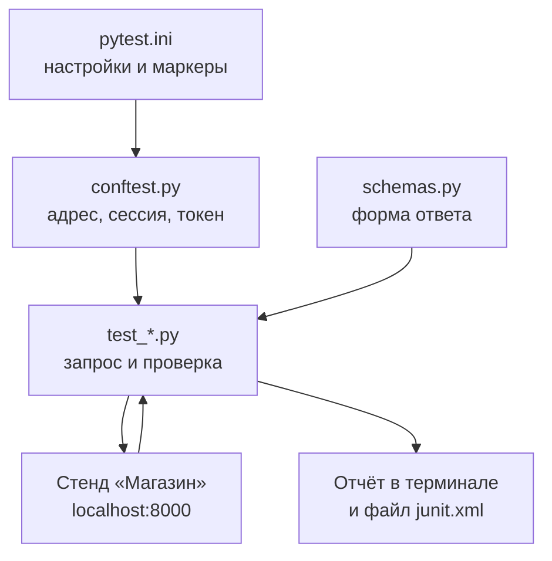
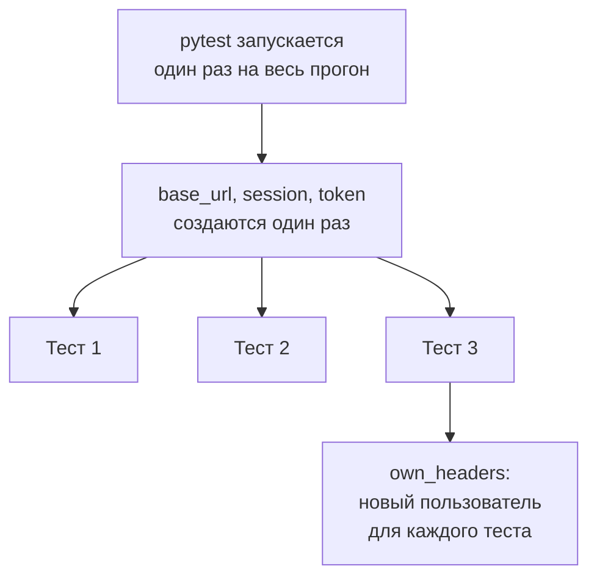
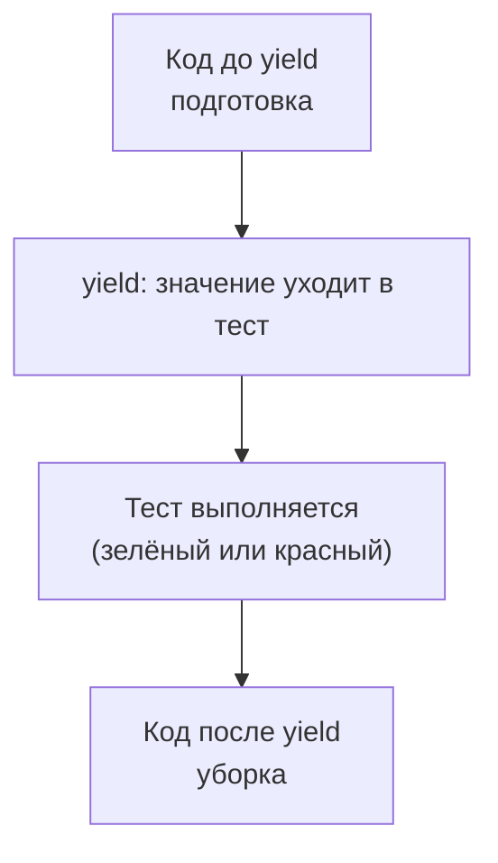
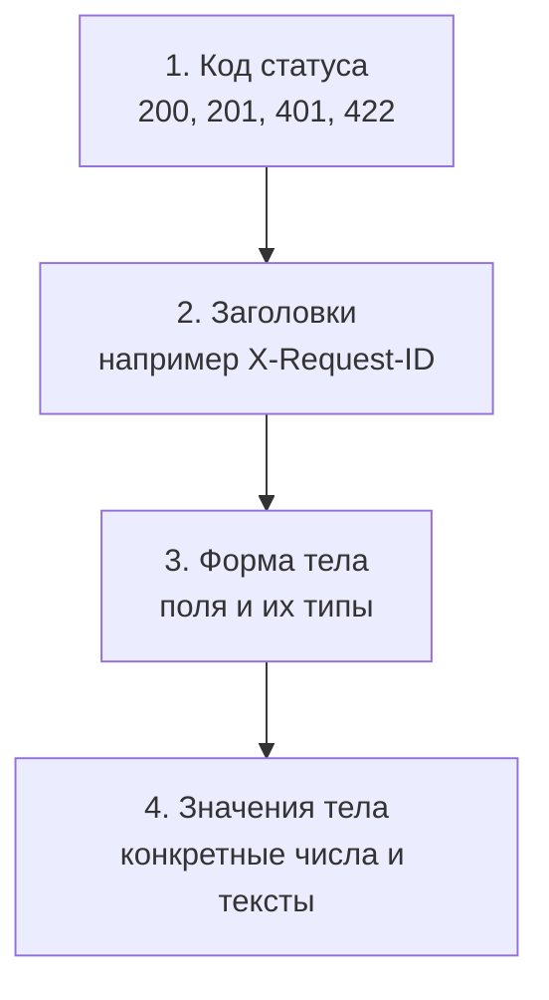

## Зачем это нужно

Я занимаюсь нагрузкой много лет, а сейчас сижу рядом с тобой и объясняю по ходу дела. Начну с истории, после которой я не запускаю нагрузку «на авось».

Перед одной распродажей коллега прогнал тест на оформление заказа. Графики вышли красивые: ответ за 40 миллисекунд, сервер почти не напрягается. Мы порадовались и позвали менеджера. А потом кто-то открыл сами ответы: на каждый запрос сервер говорил «вы не вошли» (код 401). Токен в сценарии давно протух. Быстро отказывать легко, поэтому графики и были такими чудесными. Мы измерили скорость отказов, а не скорость заказов.

С тех пор перед каждым нагрузочным прогоном я запускаю короткий набор проверок: вход работает, товар кладётся в корзину, заказ создаётся. Руками, как в [уроке 6.1](01-testing-basics.md), это двадцать проверок и полчаса скуки. А скучное рано или поздно пропускают. Автотест (проверка, записанная кодом и запускаемая одной командой) делает те же двадцать проверок за три секунды и не устаёт. Зелёный набор значит: «Магазин» отвечает правильно хотя бы одному пользователю, можно нагружать.

Шаг проекта: в `~/perf-lab/06-api-tests/` появятся `pytest.ini` (настройки), `conftest.py` (общая подготовка), `schemas.py` (форма ответов) и пять файлов с тестами: `test_health.py`, `test_auth.py`, `test_products.py`, `test_cart.py`, `test_orders.py`. Это около двадцати проверок «Магазина» одной командой. В [уроке 6.3](03-ci-actions.md) они начнут запускаться сами при каждом `git push`.

## Что нужно знать

- Основы pytest: `assert`, поиск тестов по именам, `parametrize` и фикстуры в [уроке 4.7](../04-python/07-pytest.md). Здесь мы не повторяем их с нуля, а применяем к реальному API и добавляем то, чего там не было: проверку формы ответа, маркеры, ожидаемые падения и отчёт для CI (continuous integration, «непрерывная интеграция»: сервер, который сам прогоняет тесты при каждом изменении кода; разберём в [уроке 6.3](03-ci-actions.md)).
- Библиотека `requests` и виртуальное окружение `~/perf-lab/.venv` из [урока 4.5](../04-python/05-venv-requests.md).
- Коды ответов и JSON из [урока 2.2](../02-web/02-rest-json-auth.md): 200, 201, 204, 401, 404, 409, 422.
- Тест-кейсы, классы эквивалентности и границы из [урока 6.1](01-testing-basics.md): сегодня они превращаются в код.
- Это **новый** набор в каталоге `~/perf-lab/06-api-tests/`, а не продолжение файлов из `~/perf-lab/04-python/`: там ты учился (`conftest.py` с фикстурами `base_url`, `shop`, `buyer` и `test_shop_api.py`), здесь строишь рабочий набор для проверки стенда перед нагрузкой. Те файлы остаются как есть, имена фикстур в новом наборе другие (`session`, `token`, `headers`, `own_headers`), потому что задачи шире: схема ответа, маркеры, отчёт для CI.
- Работающий стенд «Магазин» (`curl -s localhost:8000/readyz` отвечает `{"status":"ready"}`).


## Картина целиком

Представь приёмку квартиры. У контролёра в чемоданчике уровень, тестер розеток и рулетка. Проверки он не придумывает на месте: для каждой комнаты у него записан список, один и тот же для любой квартиры. Прошёл, вернул отчёт: «в комнате 2 розетка не работает». Автотесты API работают так же: заранее записанный список проверок, который прогоняют против любой версии стенда. Аналогия ломается в одном месте: контролёр приходит раз, а тесты запускаются сотни раз. Поэтому они обязаны давать одинаковый результат при каждом запуске и не мешать друг другу.



Здесь видно: тесты сами ничего не готовят, общее берут из `conftest.py` и `schemas.py`. Тест шлёт запрос, сравнивает ответ с ожиданием и выдаёт результат дважды: человеку в терминал, а программе (CI, сервер автоматических прогонов, подробнее в 6.3) в файл `junit.xml`.

Посмотри на живой прогон набора из 14 проверок, который ты соберёшь в практике. Переключай сценарии и наводи мышь на строки отчёта:

<div class="viz" data-viz="api-test-report" data-fail="ok" data-title="Прогон pytest -v: зелёный и красный отчёт"></div>

Каждая строка это один тест (файл, `::`, функция) с результатом справа. Если есть падение, внизу появляется блок `FAILURES` с кодом теста и строкой `E`, где сказано, что с чем не совпало.

## Теория

### Из чего состоит автотест API

Ты написал тест, он упал на последней строке. Какой из трёх запросов подвёл? Ответ зависит от того, как устроен тест.

Рецепт для человека: «посоли по вкусу». Кулинарному роботу нужно «5 граммов». Автотест это кейс из 6.1, где каждое «по вкусу» заменено точным значением. Он всегда делает три шага в одном порядке.

Сначала подготовка (по-английски arrange): адрес стенда, нужный пользователь, данные. В pytest её делают фикстуры, о них следующий раздел. Потом действие (act): один запрос, `session.get(...)` или `session.post(...)`. И наконец проверка (assert): сравнение ответа с ожиданием. Эти три шага называют AAA по первым буквам. Тест, который не делится на три части, обычно пытается проверить слишком много.

Возьмём кейс из 6.1, «`size=101` отклоняется»:

```python
def test_size_out_of_range(session, base_url):
    response = session.get(base_url + "/api/products", params={"size": 101}, timeout=10)  # действие
    assert response.status_code == 422                                                      # проверка
```

Подготовка спрятана в аргументах `session` (объект, который ходит по сети) и `base_url` (адрес стенда). Параметр `params={"size": 101}` библиотека сама превратит в `?size=101`.

> **Прикинь сам:** в тесте три запроса подряд (регистрация, вход, добавление в корзину), а `assert` стоит только после последнего. Он упал. Что подвело?
{: .predict}

Неизвестно: любой из трёх шагов мог вернуть что-то не то, например регистрация дала 409, и всё покатилось. Поэтому подготовку выносят в фикстуры со своими проверками (они покажут, на каком шаге беда), а в теле теста остаётся одно действие.

Осторожно: тест не должен готовиться за счёт другого теста. Если `test_order_flow` рассчитывает, что `test_add_item` уже положил товар в корзину, то один он упадёт. Каждый тест готовит себе всё сам или получает готовое.

> **Главное:** тест делает три шага (подготовка, одно действие, проверка), и каждый готовит себе всё сам.
{: .key}

Подготовку мы всё время выносим «в фикстуры». Пора посмотреть, что это такое.

### Фикстуры: адрес, сессия, токен

Адрес стенда нужен всем тестам. Впиши `http://localhost:8000` в каждый, и при переезде на другой порт придётся править сто мест. Нужно хранить адрес один раз.

Представь заправку: водителю не важно, как топливо попало в колонку, он берёт пистолет и заправляется. Фикстура (в [уроке 4.7](../04-python/07-pytest.md) это функция подготовки, чей результат pytest подставляет в тест по имени аргумента) работает как колонка. Отличие: пистолет берёшь ты, а фикстуру pytest вставляет сам.

Все общие фикстуры лежат в `conftest.py`: pytest читает этот файл сам и отдаёт фикстуры всем тестам рядом. У нас пять общих (шестую, `cart_item`, добавим в практике):

- `base_url`: адрес из переменной `BASE_URL`, по умолчанию `http://localhost:8000`;
- `session`: объект `requests.Session`, общий на все тесты;
- `token`: токен общего пользователя `user0001@shop.lab`;
- `headers`: заголовок `{"Authorization": "Bearer ..."}` с этим токеном;
- `own_headers`: такой же заголовок, но для нового пользователя, созданного только под один тест.

Первые три готовятся один раз на запуск, последние две перед каждым тестом. Это область действия (`scope`): `scope="session"` значит «один раз на запуск», по умолчанию фикстура живёт один тест. Адрес и сессию создавать на каждый тест незачем. Токен тоже: вход медленный, потому что пароль проверяется хешем bcrypt («отпечатком» пароля, который намеренно долго считать, чтобы его не подобрали). Это около четверти секунды на вход, и двадцать входов подряд съели бы пять секунд впустую.

Почему `requests.Session`, а не просто `requests.get`? Сессия держит соединение открытым и использует повторно, без нового «здравствуйте» с сервером ([урок 2.1](../02-web/01-client-server-http.md)).



Сверху то, что готовится один раз для всех, снизу то, что делается на каждый тест. Общее экономит время, личное защищает тесты друг от друга.

Фикстура токена:

```python
@pytest.fixture(scope="session")
def token(session, base_url):
    response = session.post(base_url + "/api/login",
                            json={"email": "user0001@shop.lab", "password": "password"}, timeout=30)
    assert response.status_code == 200, response.text
    return response.json()["token"]
```

`token` просит `session` и `base_url`, pytest готовит их первыми и потом зовёт `token`: цепочку строить вручную не надо. `json={...}` превращает словарь в JSON и ставит заголовок `Content-Type: application/json`. Текст после запятой в `assert` попадёт в отчёт: если вход не удался, сразу видно ответ сервера. Своё сообщение здесь оправдано, потому что фикстура проверяет подготовку, а не продукт. Тайм-аут 30 секунд щедрый: под нагрузкой bcrypt бывает медленным.

> **Прикинь сам:** в запросе нет `timeout`, а сервер завис. Сколько будет ждать тест?
{: .predict}

Бесконечно: у `requests` по умолчанию тайм-аута нет, и вместе с тестом зависнет весь CI. Поэтому `timeout=...` (предел ожидания в секундах) стоит в каждом запросе.

Осторожно с общим пользователем: `token` один на всех, значит, и корзина у `headers` одна. Читать каталог или список заказов безопасно. Менять данные (корзина, заказ) лучше через `own_headers`.

> **Главное:** то, что дорого и не меняется (адрес, сессия, токен для чтения), готовят один раз, а то, что тест меняет, на каждый тест.
{: .key}

Общая корзина привела к падению. Как сделать тесты независимыми?

### Независимость тестов и тестовые данные

Упавший тест, запущенный отдельно, внезапно проходит. Или pytest переставил файлы, и всё рухнуло. Таким тестам нельзя верить ни в зелёном, ни в красном.

Вспомни примерочную в магазине одежды: у каждого своя кабинка. Сложат все вещи в одну, и кто-нибудь наденет чужое. Тесты тоже нужно разводить по кабинкам. Правило одно: тест оставляет мир таким, каким нашёл, или не зависит от его состояния. На практике это три приёма.

Первый: уникальные данные. Email для регистрации каждый раз новый, `f"test-{uuid.uuid4().hex}@shop.lab"`. Здесь `uuid4` даёт случайный идентификатор из 32 символов, совпадение почти невозможно. Повторный запуск не наткнётся на «email занят» (409). Второй: свой пользователь на каждый изменяющий тест, корзина у него своя и пустая. Третий: проверять относительно, а не абсолютно. Вместо «в списке заказов ровно 3» пиши «заказ с моим `id` есть в списке»: база между запусками меняется, твой заказ нет.

Так выглядит фикстура нового пользователя:

```python
@pytest.fixture
def own_headers(session, base_url):
    credentials = {"email": f"test-{uuid.uuid4().hex}@shop.lab", "password": "password"}
    response = session.post(base_url + "/api/register", json=credentials, timeout=30)
    assert response.status_code == 201, response.text
    response = session.post(base_url + "/api/login", json=credentials, timeout=30)
    assert response.status_code == 200, response.text
    return {"Authorization": "Bearer " + response.json()["token"]}
```

`scope` не задан, значит, фикстура вызывается заново на каждый тест. Регистрация отвечает 201 (создано), вход возвращает токен длиной 64 символа: приложение берёт `secrets.token_hex(32)`, то есть 32 байта, а в шестнадцатеричной записи это 64 символа. Пароль `password` подходит: правило требует минимум 8 символов, и в слове ровно 8.

У подхода есть цена. Каждый тест с `own_headers` делает два запроса с bcrypt (хеш при регистрации, проверка при входе), по четверти секунды. Десять тестов съедают пять секунд.

> **Прикинь сам:** вместо `own_headers` ученик перед каждым тестом чистит корзину общего пользователя запросами `DELETE`. Чем это хуже?
{: .predict}

Уборка сама может упасть и оставить грязь. А если CI запустит два теста одновременно, они начнут наполнять и чистить одну корзину и мешать друг другу. Отдельный пользователь изолирует тесты по построению: делить им нечего.

Осторожно: уборка данных после теста хрупка, при падении посередине она не выполнится. Где можно, обходись уникальностью. Где нельзя, поможет `yield`.

> **Главное:** независимый тест создаёт свои данные (уникальный email, свой пользователь) и проверяет свои результаты, а не «состояние мира».
{: .key}

А если нужен именно общий пользователь `user0001`? Тогда пригодится уборка.

### yield-фикстура, область действия и `conftest.py`

Иногда уникальность не помогает. Допустим, надо проверить корзину у того, кто вошёл через `/api/login` как `user0001`, а она одна. Нужен способ сказать: «подготовь перед тестом и убери после, что бы с тестом ни случилось».

Гостиничный номер: перед заездом горничная готовит комнату, после выезда убирает, понравилось гостю или нет. В pytest это фикстура с `yield` вместо `return`. Код до `yield` готовит, `yield значение` отдаёт значение тесту и ждёт, код после `yield` убирает уже после теста. Уборка выполняется и после упавшего теста. Не выполнится она в одном случае: упала сама подготовка и до `yield` дело не дошло.



Уборка всегда идёт после теста, какой бы ни был результат. Если у теста несколько фикстур, убирают в обратном порядке: что готовили последним, убирают первым, как стопку тарелок.

Теперь про `scope` подробнее. Основные значения: `"function"` (по умолчанию, перед каждым тестом и после него), `"module"` (один раз на файл `test_*.py`) и `"session"` (один раз на запуск). Правило прежнее: дорогое и неизменяемое готовят шире, изменяемое уже. Токен `user0001` дорогой и только читается, он `session`. Фикстура, которая кладёт товар в корзину, меняет данные, она на тест. Есть жёсткое правило: фикстура может зависеть только от фикстур той же или более широкой области. Если `scope="session"` попросит фикстуру на один тест, pytest остановится с ошибкой `ScopeMismatch` («область не подходит»).

Про `conftest.py`: его фикстуры видны всем тестам в папке и ниже без `import`, а фикстуры из самого файла `test_*.py` видны только ему. Если ниже лежит свой `conftest.py` с фикстурой того же имени, для тестов той папки побеждает ближайший. Поэтому `base_url`, `session`, `token` и `headers` мы держим в одном месте: смена адреса правится одной строкой.

Вот фикстура «товар в корзине», которая убирает за собой:

```python
@pytest.fixture
def cart_item(session, base_url, headers):
    """Товар 7 в корзине общего пользователя; после теста корзина очищается."""
    product_id = 7
    response = session.post(base_url + "/api/cart/items", headers=headers,
                            json={"product_id": product_id, "qty": 1}, timeout=10)
    assert response.status_code == 201, response.text
    yield product_id
    response = session.delete(base_url + f"/api/cart/items/{product_id}", headers=headers, timeout=10)
    assert response.status_code == 204, response.text
```

До `yield` фикстура через API кладёт товар 7 в корзину (201 значит «создано»). `yield product_id` отдаёт тесту номер товара, чтобы «магическая» семёрка не жила в тесте. После `yield` идёт `DELETE /api/cart/items/7`, сервер убирает товар и отвечает `204` (успех без тела). Код уборки проверяется: молча проваленная уборка оставила бы следы для следующего запуска. Фикстура считает, что товара 7 у общего пользователя раньше не было. Для строгой изоляции берут `own_headers`.

> **Прикинь сам:** фикстура объявлена с `scope="session"` и просит `headers`, у которой область по умолчанию. Что скажет pytest?
{: .predict}

`ScopeMismatch`. Широкая фикстура готовится один раз, а `headers` живёт один тест: когда `cart_item` нужны заголовки, подходящего экземпляра ещё нет. Широкая не может зависеть от узкой.

Осторожно: `return` вместо `yield` убираться не умеет, после него код не выполняется. Если убирать нечего, `return` правильнее. Если падает уборка после `yield`, pytest сообщит об ошибке (`error`) в завершении теста, а сам тест останется зелёным: лучше узнать о грязи сразу.

> **Главное:** код после `yield` убирает за тестом даже при падении, а область фикстуры не шире областей тех, от кого она зависит.
{: .key}

С подготовкой и уборкой разобрались. Теперь о том, что вообще проверять в ответе.

### Что проверять в ответе: четыре слоя

Самая частая ошибка новичка: проверить `status_code == 200` и решить, что тест готов. Сервис может вернуть 200 и пустой JSON или 200 и объект с переименованным полем.

Посылка. Курьер сообщил «доставлено» (это код ответа). Но ты открываешь коробку: то ли это, что заказывал (значения), целое ли, все ли части на месте (форма). Ответ API проверяют слоями, от дешёвого к подробному.



Слой 1 самый грубый: код. Слой 2: что-то обязательное в заголовках. У «Магазина» каждый ответ содержит `X-Request-ID`, по нему запрос находят в логах приложения. Слой 3: какие поля есть и какого они типа, `id` целое, `name` строка, `price` число. Слой 4: сами значения, например `total == 10000` или `status == "paid"`.

Разберём ответ `GET /api/products/1`:

```json
{"id": 1, "name": "Товар 1", "price": 137.0, "category_id": 1, "stock": 1000000}
```

Слой 1 (`status_code == 200`) прошёл. Разработчик переименовал `stock` в `quantity`: слой 1 зелёный, а слой 3 (`set(product) == {"id", "name", "price", "category_id", "stock"}`) упал. Именно это показывает сценарий «поле переименовано» в виджете выше. Сервер вернул другой товар с кодом 200: поймает только слой 4, `product["id"] == 1`.

Для слоя 3 нужна схема ответа (schema): описание того, какие поля обязаны быть и какого типа. Нам хватит словаря «имя поля: тип» и десяти строк кода в `schemas.py`:

```python
PRODUCT = {"id": int, "name": str, "price": (int, float), "category_id": int, "stock": int}


def check_schema(data, schema):
    assert isinstance(data, dict), f"ожидался объект, пришло {type(data).__name__}"
    assert set(data) == set(schema), f"поля ответа {sorted(data)} вместо {sorted(schema)}"
    for name, expected in schema.items():
        value = data[name]
        assert isinstance(value, expected) and not isinstance(value, bool), \
            f"поле {name!r}: пришло {type(value).__name__} ({value!r}), ожидалось {expected}"
```

`isinstance(value, expected)` спрашивает Python: «это значение нужного типа?». Для `price` разрешены оба: JSON не различает целые и дробные, и число `137` библиотека превратит в `int`. Проверка на `bool` нужна, потому что в Python `True` считается подвидом `int`. Сообщение в `assert` объясняет падение само: «поле 'price': пришло str ('137')».

> **Прикинь сам:** разработчик добавил в ответ товара новое поле `weight`. Что сделает `check_schema` с условием `set(data) == set(schema)` и хорошо ли это?
{: .predict}

Тест упадёт: «поля ответа [...] вместо [...]». Для своего внутреннего API это то, что нужно: ты заметишь смену контракта и решишь, обновить схему или это ошибка. Для чужого API лучше мягкая проверка «обязательные поля на месте».

Осторожно: схема проверяет форму, а не смысл. Цена `-5.0` схему пройдёт, ведь это число. Смысл проверяют значениями. И обратная крайность: не сравнивай весь JSON с эталоном целиком (`assert response.json() == {...}`), если часть данных меняется, цены, остатки, даты. Такой тест падает от каждой мелочи, и его перестают читать.

> **Проверь понимание:** `GET /api/orders/5` вернул 200 и `{"detail": "order not found"}`. Какой слой это поймает, а какой нет?
>
> <details markdown="1">
> <summary>Ответ</summary>
>
> Код не поймает: 200 ожидаем. Форма поймает: у заказа должны быть `id`, `status`, `total`, `created_at`, `items`, а пришло `detail`. Настоящий «Магазин» на несуществующий заказ вернёт 404, но тест обязан ловить и такую поломку.
> </details>

> **Главное:** одного кода ответа мало: проверяй слоями, код, заголовки, форму, значения, и не требуй лишнего.
{: .key}

Мы проверяли успешные ответы. А что с отказами?

### Негативные проверки: код, тело и отсутствие последствий

Негативных проверок больше, чем позитивных (6.1). Хороший негативный тест проверяет три вещи: код (422, а не 500), тело (причина названа верно) и отсутствие последствий (отказ ничего не изменил).

Приложение отвечает на ошибки двумя способами. Ошибка валидации (запрос не подходит по форме): код 422 и тело вида `{"detail": [{"type": ..., "loc": ["query", "size"], "msg": ..., ...}]}`. Поле `loc` (location, «место») показывает, где ошибка: `["query", "size"]` это параметр адреса `size`. Значит, можно проверить не просто «был 422», а «422 из-за `size`». Ошибка бизнес-логики: тело `{"detail": "текст"}`. Примеры: 401 `bearer token required`, 404 `product not found`, 409 `not enough stock`, 400 `cart is empty`.

Тексты `detail` взяты из кода приложения, сверяй именно их. Сообщения `msg` пишет библиотека проверки данных Pydantic, и они меняются с версией библиотеки, поэтому для 422 сравнивай `loc`.

```python
@pytest.mark.parametrize("size", [0, 101])
def test_size_out_of_range(session, base_url, size):
    response = session.get(base_url + "/api/products", params={"size": size}, timeout=10)
    assert response.status_code == 422
    assert response.json()["detail"][0]["loc"] == ["query", "size"]
```

Код 422 говорит «отклонён из-за формы». Проверка `loc` говорит «причина в `size`, а не в `page`». Если разработчик нечаянно изменит правило и `size=101` начнёт отклоняться из-за другого параметра, тест заметит. Третья проверка нужна для записи, для чтения нет: добавили в корзину несуществующий товар, получили 404, а потом проверили, что корзина пуста. Без этого тест не поймает «вернул 404, но товар всё равно положил».

> **Прикинь сам:** на `GET /api/products?page=0` ты ждёшь 422, а сервер вернул 500. Тест `assert response.status_code != 200` пройдёт?
{: .predict}

Пройдёт, и баг останется незамеченным. Правильно требовать точный код: `assert response.status_code == 422` упадёт на 500 и покажет, что сервер сломался на неверном вводе.

Осторожно: `assert response.status_code >= 400` кажется разумным, но проходит и на 500, и на 404, и на 422. А 500 на неверный ввод это баг: сервер должен отказывать аккуратно.

> **Главное:** негативный тест сверяет точный код, причину в теле и то, что отказ ничего не изменил.
{: .key}

Тестов уже много. Как запускать только нужные?

### Маркеры, ожидаемые падения и выборочный запуск

Когда тестов десятки, нужно запускать подмножество: только быстрые «стенд жив?», только негативные, всё кроме медленных. А ещё бывает, что тест правильный, а продукт содержит известный баг, который пока не починили. Красный тест, который «всегда красный», приучает игнорировать красный цвет.

Для отбора есть маркеры (marks): метки на тестах, как цветные стикеры на карточках, по стикеру достаёшь нужные. Метку ставят строкой над тестом: `@pytest.mark.smoke`, а для всего файла строкой `pytestmark = pytest.mark.smoke` в начале. Список разрешённых меток лежит в `pytest.ini`, а опция `--strict-markers` превращает опечатку (`@pytest.mark.smok`) из тихого предупреждения в ошибку:

```ini
[pytest]
addopts = -ra --strict-markers
markers =
    smoke: быстрые проверки «стенд жив»
    negative: проверки отказов (401, 404, 409, 422)
```

`addopts` это ключи, которые добавляются к каждому запуску. `-ra` (report all) печатает в конце сводку всех не зелёных исходов с причинами. Запуск по метке: `pytest -m smoke`, исключить: `pytest -m "not negative"`. После `-m` понимаются `and`, `or`, `not` и скобки. Третья метка, `slow`, для долгих проверок вроде обхода каталога: после правки гоняешь `-m "not slow"`, полный прогон оставляешь на CI. Какие метки знает pytest, покажет `pytest --markers`.

Для известного бага есть `xfail` (expected failure, ожидаемое падение). Это табличка «лифт не работает, ремонт заказан»: ты не ходишь к нему каждый день с недоумением, но когда лифт заработает, табличку надо снять. С `strict=True` правило строгое: если тест неожиданно прошёл (по-английски XPASS), набор считается упавшим. Метка сама напоминает: баг починили, пора её снять.

Пример: BUG-001 из урока 6.1, поиск по `_` возвращает весь каталог. Тест описывает правильное поведение, а `xfail` честно говорит, что оно пока не достигнуто:

```python
@pytest.mark.xfail(strict=True, reason="BUG-001: _ и % в поиске работают как шаблон")
def test_search_underscore_is_literal(session, base_url):
    response = session.get(base_url + "/api/products", params={"q": "_"}, timeout=10)
    assert response.json()["total"] == 0
```

Приложение собирает шаблон `%_%` для поиска без учёта регистра (`ILIKE` в SQL), а в нём `_` значит «любой один символ». Находятся все 10 000 товаров, `assert 10000 == 0` падает, и pytest печатает `XFAIL`. После починки тест пройдёт, и `strict=True` превратит это в провал набора с пометкой `[XPASS(strict)]`.

> **Прикинь сам:** в наборе 20 тестов, один с `xfail(strict=True)`. Баг починили, а метку не сняли. Что покажет pytest?
{: .predict}

Тест неожиданно пройдёт, `strict=True` сделает это провалом: `19 passed, 1 failed`. Код выхода будет ненулевым, CI покраснеет. Так задумано: метка должна исчезнуть вместе с багом.

Осторожно: `skip` и `xfail` разные вещи. `skip` значит «не запускай» (тест, например, только для Linux). `xfail` значит «запусти, я жду падения». Для известного бага нужен `xfail`: ты увидишь починку.

> **Главное:** метки отбирают тесты, а `xfail(strict=True)` держит набор честным: известный баг не краснит, а починка не проходит незамеченной.
{: .key}

Отбирать научились. Как теперь запускать набор и показать результат программе?

### Запуск, отбор и отчёт для CI

Один набор запускают по-разному: целиком перед нагрузкой, один упавший при отладке, только быстрые после каждой правки. Под каждую ситуацию свой ключ. Целиком просто `pytest`, а `-v` печатает строку на тест, `-q` только точки. Если что-то упало, `-x` остановит на первом падении, `--lf` (last failed) перегонит только упавшие в прошлый раз, `--tb=short` сократит отчёт о падении. По части имени отбирает `-k "size and not 101"`, по метке `-m`.

Типичная работа за день:

```bash
pytest -m smoke        # три секунды: стенд жив, вход работает?
pytest                  # весь набор перед нагрузочным прогоном
pytest --lf -x --tb=short   # что-то упало: перепрогнать только упавшие, остановиться на первом, отчёт короче
```

Теперь отчёт, который читает программа. CI (сервер, который сам прогоняет тесты при каждом изменении, подробно в 6.3) умеет показывать список тестов в интерфейсе, если дать ему файл `--junitxml=junit.xml`. Формат JUnit XML вырос из мира Java, но стал общим: его читают почти все CI. Структура простая, один `<testsuite>` с итогами и по одному `<testcase>` на тест:

```xml
<testsuite name="pytest" errors="0" failures="1" skipped="0" tests="14" time="2.841">
  <testcase classname="test_products" name="test_size_out_of_range[101]" time="0.012">
    <failure message="assert 200 == 422">...</failure>
  </testcase>
</testsuite>
```

`tests="14"` сколько всего, `failures="1"` сколько упало (`assert` не сошёлся). `errors` считает ошибки подготовки, когда упала фикстура (разница `failed` и `error` из 4.7). `classname` и `name` вместе дают путь теста.

Но CI смотрит не на XML, а на код выхода: число, которое программа возвращает системе. У pytest `0` значит «всё зелёное», `1` «есть упавшие», `4` «ошибка запуска, например путь не найден», `5` «в пути нет тестов». Любое ненулевое число красит шаг в CI.

> **Прикинь сам:** ты запустил `pytest tests/`, а папки `tests` нет, тесты лежат в текущей. Что увидит CI?
{: .predict}

Pytest напишет `file or directory not found` и вернёт код `4`: шаг покраснеет, хотя падать нечему. Читай сообщение, а не только цвет.

> **Главное:** ключи подбирают под ситуацию, а CI судит по коду выхода (`0` успех, не `0` провал) и читает результаты из `junit.xml`.
{: .key}

Остался вопрос, который портит жизнь любому набору: почему тест иногда падает без причины?

### Почему тест бывает нестабильным (flaky)

Тест то проходит, то падает, а код не менялся. Такой тест называют нестабильным (flaky, «шаткий»). После трёх ложных падений команда начинает нажимать «перезапустить», не читая отчёт, и настоящий баг тонет в шуме. 

Причин в API-тестах обычно пять. Общее состояние: два теста делят одного пользователя или запись, мы это уже видели. Зависимость от порядка. Ожидание по времени: `time.sleep(2)` на медленной машине не хватает, на быстрой тратится зря. Ждать надо условия. Нестабильное окружение: стенд не прогрелся, Redis перезапускался. И данные, которые меняются сами: сравнение с «сегодняшней датой» или «текущим числом заказов».

Разберём по отчёту. Сценарий «тесты зависят друг от друга» в виджете выше показывает красный `test_cart_starts_empty` при исправном «Магазине». В строке `E` слева корзина с товаром (`'items': [{...}]`), справа ожидание с пустым `'items': []`. Значит, кто-то положил товар до нас. Диагноз: проблема изоляции, лечение `own_headers`.

> **Прикинь сам:** тест после `time.sleep(1)` проверяет, что заказ появился в списке. На ноутбуке работает, в CI падает раз в десять запусков. Почему?
{: .predict}

На загруженной машине CI секунды не всегда хватает, на ноутбуке хватает: тест зависит от скорости. Правильно проверять без ожидания (заказ в списке сразу после ответа 201) или опрашивать каждые 0,2 с до 10 секунд.

Осторожно: нестабильность не «лечат» автоматическим повтором упавшего теста. Повтор прячет причину, и баги гонок (результат зависит от того, кто успел первым) станут перемежающимися и доедут до живого сайта. Если тест упал один раз из ста, воспроизведи в цикле (`for i in $(seq 20); do pytest -x test_cart.py; done`) и найди общее состояние. Нестабильность это тоже баг, только в тесте.

> **Главное:** нестабильный тест лечат поиском причины (общее состояние, порядок, время), а не повтором и не `sleep`.
{: .key}

Вернёмся к распродаже. Будь у коллеги такой набор, он покраснел бы на первой проверке входа, и нагрузку никто бы не запустил. В практике ты соберёшь набор и сломаешь его, чтобы увидеть красный цвет.

## Практика

Стенд поднят (`curl -s localhost:8000/readyz`), окружение активно: `source ~/perf-lab/.venv/bin/activate`. Pytest и `requests` уже поставлены в [4.7](../04-python/07-pytest.md) и [4.5](../04-python/05-venv-requests.md). Если нет, повтори `pip install pytest==9.1.1 requests==2.34.2`.

### 1. Проверь окружение и каталог

```bash
cd ~/perf-lab/06-api-tests
source ~/perf-lab/.venv/bin/activate
python -c "import pytest, requests; print(pytest.__version__, requests.__version__)"
curl -s localhost:8000/readyz
```

Что делает: переходит в каталог из урока 6.1, включает окружение, печатает версии библиотек и проверяет готовность стенда.

Ожидаемый вывод:

```text
9.1.1 2.34.2
{"status":"ready"}
```

**Как читать вывод:** первая строка подтверждает, что обе библиотеки видны из активного окружения. Вторая, что стенд жив. Если вместо этого `ModuleNotFoundError`, окружение не включено (нет `(.venv)` в приглашении).

**Типичные ошибки:**

- `ModuleNotFoundError: No module named 'pytest'`: забыл `source ~/perf-lab/.venv/bin/activate` или не ставил pytest. Выполни активацию и `pip install pytest==9.1.1`.
- `curl: (7) Failed to connect to localhost port 8000`: стенд не запущен. Из `~/load-tester/project/shop` выполни `docker compose up -d --build --wait` ([урок 5.3](../05-docker/03-compose-shop.md)).

### 2. Общие фикстуры и настройки

Создай `pytest.ini`:

```ini
[pytest]
addopts = -ra --strict-markers
markers =
    smoke: быстрые проверки «стенд жив»
    negative: проверки отказов (401, 404, 409, 422)
```

Создай `conftest.py`:

```python
import os
import uuid

import pytest
import requests


@pytest.fixture(scope="session")
def base_url():
    return os.getenv("BASE_URL", "http://localhost:8000").rstrip("/")


@pytest.fixture(scope="session")
def session():
    with requests.Session() as client:
        yield client


@pytest.fixture(scope="session")
def token(session, base_url):
    response = session.post(base_url + "/api/login",
                            json={"email": "user0001@shop.lab", "password": "password"}, timeout=30)
    assert response.status_code == 200, response.text
    return response.json()["token"]


@pytest.fixture
def headers(token):
    return {"Authorization": "Bearer " + token}


@pytest.fixture
def own_headers(session, base_url):
    credentials = {"email": f"test-{uuid.uuid4().hex}@shop.lab", "password": "password"}
    response = session.post(base_url + "/api/register", json=credentials, timeout=30)
    assert response.status_code == 201, response.text
    response = session.post(base_url + "/api/login", json=credentials, timeout=30)
    assert response.status_code == 200, response.text
    return {"Authorization": "Bearer " + response.json()["token"]}
```

Разбор незнакомого. `os.getenv("BASE_URL", "http://localhost:8000")` читает переменную окружения, а если её нет, берёт запасное значение: в [уроке 6.3](03-ci-actions.md) CI подставит свой адрес без правки файла. `.rstrip("/")` убирает слэш в конце, чтобы `base_url + "/api/..."` не дал двойной. `yield client` внутри `with` отдаёт сессию тестам, а когда они закончатся, `with` аккуратно закроет её: всё, что после `yield`, выполняется в конце.

Проверка, что pytest видит фикстуры:

```bash
pytest --fixtures -q | grep -E "^(base_url|session|token|headers|own_headers)"
```

Ожидаемо появятся пять фикстур с твоими именами. Сам проект пока тестов не содержит: `pytest` ответит `no tests ran`.

### 3. Первые 14 проверок

Положи тесты в пять файлов. `test_health.py`:

```python
import pytest

pytestmark = pytest.mark.smoke


def test_healthz(session, base_url):
    response = session.get(base_url + "/healthz", timeout=10)
    assert response.status_code == 200
    assert response.json() == {"status": "ok"}
    assert response.headers["X-Request-ID"]


def test_readyz(session, base_url):
    response = session.get(base_url + "/readyz", timeout=15)
    assert response.status_code == 200
    assert response.json() == {"status": "ready"}
```

`pytestmark = pytest.mark.smoke` помечает все тесты файла. `response.headers["X-Request-ID"]` проверяет, что заголовок есть и не пуст: пустая строка в `assert` ложна, а отсутствие ключа даст `KeyError` и падение.

`test_auth.py`:

```python
import pytest


@pytest.mark.smoke
def test_login_ok(session, base_url):
    response = session.post(base_url + "/api/login",
                            json={"email": "user0001@shop.lab", "password": "password"}, timeout=30)
    assert response.status_code == 200
    assert len(response.json()["token"]) == 64
    assert response.json()["expires_in"] > 0


@pytest.mark.negative
def test_login_wrong_password(session, base_url):
    response = session.post(base_url + "/api/login",
                            json={"email": "user0001@shop.lab", "password": "wrong"}, timeout=30)
    assert response.status_code == 401
    assert response.json() == {"detail": "invalid credentials"}


@pytest.mark.negative
def test_cart_requires_token(session, base_url):
    response = session.get(base_url + "/api/cart", timeout=10)
    assert response.status_code == 401
    assert response.json() == {"detail": "bearer token required"}
```

`test_products.py` (форму ответа пока проверяем множеством полей, функцию `check_schema` добавим в шаге 4):

```python
import pytest


def test_product_schema(session, base_url):
    product = session.get(base_url + "/api/products/1", timeout=10).json()
    assert set(product) == {"id", "name", "price", "category_id", "stock"}
    assert product["id"] == 1


@pytest.mark.parametrize("size", [1, 100])
def test_size_in_range(session, base_url, size):
    body = session.get(base_url + "/api/products", params={"size": size}, timeout=10).json()
    assert body["size"] == size
    assert len(body["items"]) == size


@pytest.mark.negative
@pytest.mark.parametrize("size", [0, 101])
def test_size_out_of_range(session, base_url, size):
    response = session.get(base_url + "/api/products", params={"size": size}, timeout=10)
    assert response.status_code == 422
    assert response.json()["detail"][0]["loc"] == ["query", "size"]


@pytest.mark.negative
def test_product_not_found(session, base_url):
    response = session.get(base_url + "/api/products/99999999", timeout=10)
    assert response.status_code == 404
    assert response.json() == {"detail": "product not found"}
```

`test_cart.py`:

```python
def test_cart_starts_empty(session, base_url, own_headers):
    response = session.get(base_url + "/api/cart", headers=own_headers, timeout=10)
    assert response.status_code == 200
    assert response.json() == {"items": [], "total": 0}


def test_add_to_cart(session, base_url, own_headers):
    response = session.post(base_url + "/api/cart/items", headers=own_headers,
                            json={"product_id": 1, "qty": 2}, timeout=10)
    assert response.status_code == 201
    cart = response.json()
    assert cart["items"][0]["product_id"] == 1
    assert cart["items"][0]["qty"] == 2
    assert cart["total"] == cart["items"][0]["price"] * 2
```

`test_orders.py`:

```python
import pytest


@pytest.mark.negative
def test_empty_order_rejected(session, base_url, own_headers):
    response = session.post(base_url + "/api/orders", headers=own_headers, timeout=15)
    assert response.status_code == 400
    assert response.json() == {"detail": "cart is empty"}
```

Запуск:

```bash
pytest -v
```

Ожидаемый вывод (время будет другим):

```text
============================ test session starts ============================
platform linux -- Python 3.12.3, pytest-9.1.1, pluggy-1.6.0
rootdir: /home/student/perf-lab/06-api-tests
configfile: pytest.ini
collected 14 items

test_auth.py::test_login_ok PASSED                                    [  7%]
test_auth.py::test_login_wrong_password PASSED                        [ 14%]
test_auth.py::test_cart_requires_token PASSED                         [ 21%]
test_cart.py::test_cart_starts_empty PASSED                           [ 28%]
test_cart.py::test_add_to_cart PASSED                                 [ 35%]
test_health.py::test_healthz PASSED                                   [ 42%]
test_health.py::test_readyz PASSED                                    [ 50%]
test_orders.py::test_empty_order_rejected PASSED                      [ 57%]
test_products.py::test_product_schema PASSED                          [ 64%]
test_products.py::test_size_in_range[1] PASSED                        [ 71%]
test_products.py::test_size_in_range[100] PASSED                      [ 78%]
test_products.py::test_size_out_of_range[0] PASSED                    [ 85%]
test_products.py::test_size_out_of_range[101] PASSED                  [ 92%]
test_products.py::test_product_not_found PASSED                       [100%]

============================ 14 passed in 2.93s =============================
```

**Как читать вывод:** `configfile: pytest.ini` подтверждает, что настройки подхвачены. Тесты идут по файлам в алфавитном порядке, внутри файла сверху вниз. В квадратных скобках значение параметра из `parametrize`, так отличают `[0]` от `[101]`. Время около трёх секунд почти целиком уходит на bcrypt: два теста входа плюс по две операции (хеш при регистрации и проверка при входе) в каждой из трёх фикстур `own_headers`, итого восемь по четверти секунды. На остальные запросы хватает долей секунды.

**Типичные ошибки:**

- `ERROR ... fixture 'own_headers' not found`: файл `conftest.py` лежит не в `06-api-tests/` или в имени опечатка (`conftests.py`).
- `'smok' not found in markers configuration option`: сработал `--strict-markers`, потому что в тесте опечатка в метке. Это и есть его работа.
- `requests.exceptions.ConnectionError`: стенд не запущен или другой порт; задай `BASE_URL=http://localhost:8000 pytest`.
- `assert 201 == 200` в `test_login_ok` или падение регистрации с `409`: так бывает только при повторяющемся email. У нас он уникален, значит, что-то перехватывает запросы (например, другой сервис на порту 8000). Проверь `docker compose ps`.

> Тест падает, а причина непонятна? Скопируй текст теста и весь вывод `pytest` вместе со строкой `assert`, спроси нейросеть, что сравнивается с чем. Сначала сам посмотри, какое значение пришло и какое ожидалось, потом сверься с её объяснением и проверь правку повторным запуском.
{: .ai}

### 4. Схема ответа и больше негативных проверок

Создай `schemas.py`:

```python
NUMBER = (int, float)

PRODUCT = {"id": int, "name": str, "price": NUMBER, "category_id": int, "stock": int}
PRODUCT_PAGE = {"items": list, "page": int, "size": int, "total": int}
CART_ITEM = {"product_id": int, "name": str, "price": NUMBER, "qty": int}
CART = {"items": list, "total": NUMBER}
ORDER_CREATED = {"id": int, "status": str, "total": NUMBER, "items": list}


def check_schema(data, schema):
    assert isinstance(data, dict), f"ожидался объект, пришло {type(data).__name__}"
    assert set(data) == set(schema), f"поля ответа {sorted(data)} вместо {sorted(schema)}"
    for name, expected in schema.items():
        value = data[name]
        assert isinstance(value, expected) and not isinstance(value, bool), \
            f"поле {name!r}: пришло {type(value).__name__} ({value!r}), ожидалось {expected}"
```

В `test_products.py` замени `test_product_schema` на проверку через функцию и добавь тесты каталога:

```python
from schemas import PRODUCT, PRODUCT_PAGE, check_schema


def test_product_schema(session, base_url):
    response = session.get(base_url + "/api/products/1", timeout=10)
    check_schema(response.json(), PRODUCT)
    assert response.json()["id"] == 1


def test_catalog_defaults(session, base_url):
    body = session.get(base_url + "/api/products", timeout=10).json()
    check_schema(body, PRODUCT_PAGE)
    assert (body["page"], body["size"], body["total"]) == (1, 20, 10000)
    assert len(body["items"]) == 20
    for item in body["items"]:
        check_schema(item, PRODUCT)


@pytest.mark.negative
@pytest.mark.parametrize("page", [0, -1, "abc"])
def test_page_invalid(session, base_url, page):
    response = session.get(base_url + "/api/products", params={"page": page}, timeout=10)
    assert response.status_code == 422
    assert response.json()["detail"][0]["loc"] == ["query", "page"]


def test_page_beyond_the_end_is_empty(session, base_url):
    body = session.get(base_url + "/api/products", params={"page": 999999, "size": 5}, timeout=10).json()
    assert body["items"] == []
    assert body["total"] == 10000


def test_filter_by_category(session, base_url):
    body = session.get(base_url + "/api/products", params={"category_id": 1, "size": 50}, timeout=10).json()
    assert body["items"]
    assert all(p["category_id"] == 1 for p in body["items"])
```

Строка `from schemas import ...` в начале файла, остальные импорты (`import pytest`) остаются. Страница за концом списка (`page=999999`) в нашем приложении **не** ошибка: это 200 с пустым списком, и `total` остаётся 10 000. Тест фиксирует именно такое поведение, потому что оно решение, принятое осознанно. Если бы ты ожидал здесь 404, тест упал бы и показал расхождение между ожиданием и реальностью, а дальше нужно решать, что считать правильным (мини-версия того, что делает тестировщик на работе).

В `test_cart.py` добавь проверку формы и отказ без последствий. Блок ниже вставляй в конец файла, а строку `from schemas import ...` добавь к импортам вверху (если `import pytest` там уже есть, второй раз не пиши):

```python
import pytest

from schemas import CART, CART_ITEM, check_schema


def test_cart_shape(session, base_url, own_headers):
    response = session.post(base_url + "/api/cart/items", headers=own_headers,
                            json={"product_id": 1, "qty": 1}, timeout=10)
    cart = response.json()
    check_schema(cart, CART)
    check_schema(cart["items"][0], CART_ITEM)


@pytest.mark.negative
@pytest.mark.parametrize("body", [
    {"product_id": 1, "qty": 0},
    {"product_id": 0, "qty": 1},
    {"product_id": 1},
], ids=["qty-0", "product-0", "no-qty"])
def test_add_invalid_changes_nothing(session, base_url, own_headers, body):
    url = base_url + "/api/cart/items"
    assert session.post(url, headers=own_headers, json=body, timeout=10).status_code == 422
    cart = session.get(base_url + "/api/cart", headers=own_headers, timeout=10).json()
    assert cart["items"] == []


@pytest.mark.negative
def test_add_unknown_product(session, base_url, own_headers):
    response = session.post(base_url + "/api/cart/items", headers=own_headers,
                            json={"product_id": 99999999, "qty": 1}, timeout=10)
    assert response.status_code == 404
    assert response.json() == {"detail": "product not found"}
```

Параметр `ids=[...]` задаёт читаемые имена вариантов: в отчёте будет `test_add_invalid_changes_nothing[qty-0]`, а не `[body0]`.

И в `test_orders.py` тест полного сценария и двух отказов. Импорт добавь к импортам вверху файла, остальное вставь в конец:

```python
from schemas import ORDER_CREATED, check_schema


def put_in_cart(session, base_url, headers, product_id, qty):
    response = session.post(base_url + "/api/cart/items", headers=headers,
                            json={"product_id": product_id, "qty": qty}, timeout=10)
    assert response.status_code == 201, response.text


def test_order_flow(session, base_url, own_headers):
    put_in_cart(session, base_url, own_headers, 2, 2)
    response = session.post(base_url + "/api/orders", headers=own_headers, timeout=60)
    assert response.status_code == 201, response.text
    order = response.json()
    check_schema(order, ORDER_CREATED)
    assert order["status"] == "paid"
    assert order["total"] == order["items"][0]["price"] * 2
    listing = session.get(base_url + "/api/orders", headers=own_headers, timeout=15).json()
    assert order["id"] in [item["id"] for item in listing]
    assert session.get(base_url + "/api/cart", headers=own_headers, timeout=10).json()["items"] == []


@pytest.mark.negative
def test_not_enough_stock_keeps_cart(session, base_url, own_headers):
    put_in_cart(session, base_url, own_headers, 4, 1_000_001)
    response = session.post(base_url + "/api/orders", headers=own_headers, timeout=15)
    assert response.status_code == 409
    assert response.json() == {"detail": "not enough stock"}
    cart = session.get(base_url + "/api/cart", headers=own_headers, timeout=10).json()
    assert cart["items"][0]["qty"] == 1_000_001
```

Строка `import pytest` уже есть в начале файла, а `from schemas import ...` добавь рядом. На складе каждого товара лежит 1 000 000 штук (так заполнена база), поэтому 1 000 001 гарантированно не хватает. Тест проверяет не только 409, но и то, что отказ ничего не списал: корзина осталась как была. `put_in_cart` это обычная вспомогательная функция, а не фикстура: ей нужны разные аргументы при каждом вызове.

Запусти:

```bash
pytest -q
```

Ожидаемо:

```text
...........................                                                            [100%]
27 passed in 6.2s
```

Счёт сходится: 14 тестов из шага 3 плюс 13 новых (в каталоге 6, в корзине 5, в заказах 2). Время выросло, потому что почти каждый новый тест создаёт пользователя, а это два bcrypt-запроса.

**Как читать вывод:** каждая точка это прошедший тест, `F` упавший, `E` ошибка в фикстуре. Если точек столько же, сколько тестов, и в конце `passed`, набор зелёный.

### 5. Баг как `xfail`, маркеры и отчёт для CI

Добавь в `test_products.py` тест на BUG-001 из урока 6.1:

```python
@pytest.mark.xfail(strict=True, reason="BUG-001: _ и % в поиске работают как шаблон")
def test_search_underscore_is_literal(session, base_url):
    response = session.get(base_url + "/api/products", params={"q": "_"}, timeout=10)
    assert response.json()["total"] == 0
```

Запусти с выборкой по маркерам:

```bash
pytest -m smoke -q
pytest -m "not negative" -q
pytest -k "size or search" -v
```

Разбор: первая команда прогоняет только `smoke` (`test_healthz`, `test_readyz`, `test_login_ok`), вторая все, кроме негативных, третья по имени (`-k` принимает выражения с `and`, `or`, `not`). В выводе третьей найди строку:

```text
test_products.py::test_search_underscore_is_literal XFAIL (BUG-001: _ и % в поиске работают как шаблон)
```

и в конце сводку `-ra`:

```text
XFAIL test_products.py::test_search_underscore_is_literal - BUG-001: _ и % в поиске работают как шаблон
```

Теперь отчёт для CI:

```bash
pytest -q --junitxml=junit.xml
head -c 600 junit.xml
```

Ожидаемо начало файла (значения `time` и `tests` отличаются):

```text
<?xml version="1.0" encoding="utf-8"?><testsuites name="pytest tests"><testsuite name="pytest" errors="0" failures="0" skipped="1" tests="..." time="..." ...>
```

В файле `skipped="1"`: JUnit не знает про `xfail`, и pytest записывает такой тест как пропущенный. `junit.xml` не нужно коммитить, это результат прогона: добавь строку `junit.xml` в `~/perf-lab/.gitignore` (файл создан в [уроке 3.1](../03-git/01-git-basics.md)).

### 6. Уборка через `yield` и маркер `slow`

Добавь в `pytest.ini` третий маркер (строка в конец списка `markers`):

```ini
    slow: долгие проверки (больше нескольких секунд)
```

Добавь в конец `conftest.py` фикстуру `cart_item` (код из теории выше, вместе с проверкой `204` в конце, импорты уже есть). В `test_cart.py` добавь тест, который её использует:

```python
def test_item_in_cart(session, base_url, headers, cart_item):
    cart = session.get(base_url + "/api/cart", headers=headers, timeout=10).json()
    qty = {item["product_id"]: item["qty"] for item in cart["items"]}
    assert qty[cart_item] == 1
```

В `test_products.py` добавь обход каталога, помеченный как медленный:

```python
@pytest.mark.slow
def test_catalog_walk(session, base_url):
    seen = []
    for page in range(1, 21):
        body = session.get(base_url + "/api/products", params={"page": page, "size": 100}, timeout=10).json()
        seen += [item["id"] for item in body["items"]]
    assert len(seen) == len(set(seen)) == 2000
    assert seen == sorted(seen)
```

Разбор: `qty` это словарь «номер товара: количество» из ответа корзины, а `assert qty[cart_item] == 1` проверяет, что фикстура положила ровно одну штуку (лишние остатки от прошлых запусков сломали бы это условие). Тест обхода двадцать раз запрашивает по сто товаров: `seen` собирает `id`, `set(seen)` убирает повторы, и если длины совпали, ни один товар не попал на две страницы. Каталог отсортирован по `id`, поэтому `seen == sorted(seen)`.

Посмотри, когда выполняются подготовка и уборка:

```bash
pytest test_cart.py::test_item_in_cart --setup-show
```

Что делает: запускает один тест (путь `файл::имя_теста`), а ключ `--setup-show` печатает каждый шаг подготовки и уборки фикстур.

Ожидаемый вывод:

```text
test_cart.py
SETUP    S session
SETUP    S base_url
SETUP    S token (fixtures used: base_url, session)
        SETUP    F headers (fixtures used: token)
        SETUP    F cart_item (fixtures used: base_url, headers, session)
        test_cart.py::test_item_in_cart (fixtures used: base_url, cart_item, headers, session, token) .
        TEARDOWN F cart_item
        TEARDOWN F headers
TEARDOWN S token
TEARDOWN S base_url
TEARDOWN S session
```

**Как читать вывод:** буква после `SETUP` это область: `S` (session), одна на весь запуск, `F` (function), на один тест. Отступ показывает, что фикстура живёт внутри теста. Строка с тестом посередине, точка в конце значит «прошёл». Уборка идёт в обратном порядке: `cart_item` убирается раньше `headers`, а `session`-фикстуры убираются в самом конце, когда закончились все тесты. Запусти команду без `--setup-show` три раза подряд: тест должен проходить каждый раз, потому что `DELETE` в конце фикстуры возвращает корзину в исходное состояние.

Теперь выборка по маркерам. Запускай по очереди и смотри на последнюю строку каждого вывода:

```bash
pytest -m "not slow" -q
pytest -m "smoke and not slow" -q
pytest -q
```

Ожидаемые итоговые строки (время будет другим):

```text
28 passed, 1 deselected, 1 xfailed in 6.4s
3 passed, 27 deselected in 0.9s
29 passed, 1 xfailed in 7.1s
```

**Как читать вывод:** `deselected` значит «отобран прочь фильтром `-m`»: тест найден, но не запускался. В первой команде отсеян один тест (`slow`), во второй осталось только три теста `smoke`, третья команда без фильтра запускает все 30 (29 прошли и один ожидаемо упал, `x`). Все три выдали код выхода 0.

**Типичные ошибки:**

- `'slow' not found in markers configuration option`: строки `slow: ...` нет в `pytest.ini` (или она с отступом меньше, чем у соседних). `--strict-markers` ловит и опечатку в имени, и забытую регистрацию.
- `fixture 'cart_item' not found`: фикстура оказалась не в `conftest.py` (например, в другом файле `test_*.py`, и видна только ему) или `conftest.py` лежит не в `06-api-tests/`. Перенеси её в `06-api-tests/conftest.py`.
- `ScopeMismatch`: у `cart_item` написано `scope="session"`, а `headers` живёт на тест. Убери `scope`.

### 7. Закоммить результат

```bash
cd ~/perf-lab
echo "junit.xml" >> .gitignore
cat .gitignore
git add 06-api-tests .gitignore
git status --short
git commit -m "6.2: автотесты API Магазина: pytest, схемы, маркеры, уборка через yield"
git push
```

`cat .gitignore` должен показать и `junit.xml`, и `.pytest_cache/` (эту строку ты добавил в [уроке 4.7](../04-python/07-pytest.md); если её нет, допиши). `git status --short` перед коммитом покажет, что именно уйдёт: убедись, что в списке нет `junit.xml` и `__pycache__/` (если есть, добавь их в `.gitignore`).

## Сломай и почини

**Поломка 1: тест, который зависит от соседа.** В `test_cart.py` замени `own_headers` на `headers` в обоих тестах (`test_cart_starts_empty` и `test_add_to_cart`) и запусти `pytest -q test_cart.py` дважды подряд.

Что произойдёт: первый запуск зелёный, второй красный:

```text
E       assert {'items': [{'product_id': 1, 'name': 'Товар 1', 'price': 137.0, 'qty': 2}], 'total': 274.0} == {'items': [], 'total': 0}
```

Диагностика: слева то, что вернул сервер (корзина с товаром), справа то, что ждал тест. Но «Магазин» исправен: корзина общего пользователя живёт в Redis между запусками, и `test_add_to_cart` оставил в ней товар. Вернуть `own_headers`, и тест снова стабилен при любом числе запусков. Это отчёт сценария «тесты зависят друг от друга» в виджете выше: сверь.

**Поломка 2: подкрутка стенда.** Проверь, как тест ловит регресс. В `~/load-tester/project/shop/shop/app/main.py` измени `le=100` на `le=200` в параметре `size`, пересобери стенд (`docker compose up -d --build --wait`) и запусти `pytest -q test_products.py`: тест `test_size_out_of_range[101]` упадёт с `assert 200 == 422`: приложение теперь принимает 101. Верни `le=100`, пересобери и убедись, что набор снова зелёный. Правка кода стенда нужна только для этого упражнения, дальше стенд не меняй: всё нужное включается переменными в `.env`.

**Поломка 3: BUG-001 «починили».** Измени тест `test_search_underscore_is_literal`: убери `xfail` и поставь вместо него ожидание `== 10000`. Теперь он описывает неправильное поведение как правильное. Он зелёный, и баг оказался «закреплён» тестом: при починке этот тест упадёт. Запомни: тест должен описывать **ожидаемое** поведение, а не текущее. Верни как было.

**Поломка 4: уборка забыта.** Сначала убедись, что тест `test_item_in_cart` зелёный. Затем в фикстуре `cart_item` закомментируй две последние строки (запрос `session.delete(...)` и `assert` под ним, поставь перед каждой `#`) и запусти `pytest -q test_cart.py` дважды подряд.

Что произойдёт: первый запуск зелёный, второй красный:

```text
E       assert 2 == 1
```

Диагностика: `qty[cart_item]` теперь 2. Первый прогон положил товар и не убрал, второй добавил ещё одну штуку (сервер увеличивает количество, а не заменяет), и тест увидел остаток прошлого запуска. Верни обе строки. Корзина общего пользователя после поломки осталась грязной, поэтому один раз почисти её руками: получи токен через `/api/login` (как в [уроке 2.2](../02-web/02-rest-json-auth.md)) и выполни `curl -X DELETE -H "Authorization: Bearer $TOKEN" localhost:8000/api/cart/items/7`. Урок: изменяющая фикстура без уборки оставляет следы, и тесты начинают зависеть от истории запусков.

Если что-то пошло не так, `git restore .` откатит файлы, а `git stash` сохранит изменения.

## ИИ в помощь

Нейросеть быстро набрасывает тесты по образцу и объясняет падения `pytest`, но слепо принимать её тесты нельзя: тест, который всегда зелёный, хуже отсутствия теста. Общие правила: [ИИ-помощник](../ai.md).

**Задача:** набросать ещё несколько негативных проверок по образцу уже написанных.

```text
Pytest 9, библиотека requests. Вот мой тест и фикстура: <вставь код test_products.py и conftest.py>.
Напиши ещё три негативных теста для POST /api/cart/items: нет токена, несуществующий
product_id, отрицательное qty. Ожидаемые коды возьми из ответа сервиса, который я
дам ниже: <вставь реальные ответы curl>. Не придумывай коды сам.
Объясни, что проверяет каждый assert.
```
{: .wrap}

**Проверь ответ:** запусти тесты и убедись, что они проходят на правильном поведении и **падают**, если сломать условие (поменяй ожидаемый код на неверный). Типичная ошибка: тест без `assert` или с проверкой, которая верна при любом ответе, плюс выдуманные имена фикстур и маркеров, которых нет в твоём `conftest.py`.

**Задача:** разобрать красный вывод `pytest`.

```text
Pytest 9 упал. Вот полный вывод: <вставь вывод pytest -x -q>.
Объясни по строкам: что сравнивалось, какое значение пришло, какое ожидалось.
Назови две вероятные причины и скажи, какой командой curl проверить каждую.
```
{: .wrap}

**Проверь ответ:** выполни предложенный `curl` и сравни. Типичная ошибка: нейросеть предлагает «увеличить таймаут» или добавить `sleep` вместо поиска причины. Это маскирует баг.

В чат не отправляй токены из заголовков `Authorization`: замени на `Bearer <токен>`.

## Словарик урока

| Термин | Простыми словами |
|---|---|
| Автотест (automated test) | Проверка, записанная кодом и запускаемая командой |
| AAA (arrange, act, assert) | Три шага теста: подготовить, выполнить действие, проверить |
| Фикстура (fixture) | Функция подготовки, результат которой pytest подставляет в тест по имени |
| `conftest.py` | Файл, из которого pytest сам берёт общие фикстуры |
| Область фикстуры (`scope`) | Как часто готовить: для каждого теста или один раз на весь прогон |
| `requests.Session` | Объект, который держит соединение и общие настройки между запросами |
| Таймаут (timeout) | Предел ожидания ответа; без него зависший сервер зависит и тест |
| Схема ответа | Описание формы ответа: поля и их типы |
| Маркер (mark) | Метка на тесте для отбора: `smoke`, `negative`, `slow` |
| `--strict-markers` | Ключ pytest: маркер, которого нет в `pytest.ini`, считается ошибкой, а не предупреждением |
| `yield`-фикстура | Фикстура, у которой код до `yield` готовит, а после `yield` убирает, даже если тест упал |
| `xfail` | Тест, который ожидаемо падает из-за известного бага; со `strict=True` неожиданный успех тоже провал |
| Нестабильный тест (flaky) | Тест, результат которого меняется без изменения кода |
| JUnit XML | Общий формат файла с результатами тестов, который читают CI-системы |
| Код выхода (exit code) | Число, которое программа возвращает системе: 0 успех, не 0 провал |
| Независимость тестов | Свойство: результат теста не зависит от других тестов и порядка |

## Вопросы с собеседований

Раздел для повторения: ответь вслух, потом открой ответ. Короткие вопросы тренируй на скорость: ответ за 30 секунд.

### 1. [junior] [часто] Что такое фикстура pytest и зачем нужна?

<details markdown="1">
<summary>Ответ</summary>

Фикстура это функция подготовки (адрес, сессия, пользователь, данные). Тест просит её по имени аргумента, и pytest сам вызывает и подставляет результат. Это убирает повторение: подготовка в одном месте, а не в каждом тесте. После `yield` можно делать уборку, которая выполнится и при падении теста.

**Что хотят услышать:** подстановка по имени, общая подготовка, область действия, уборка.

**Красный флаг:** «это просто функция, которая вызывается из теста» (путают с обычным вызовом).

</details>

### 2. [junior] [часто] Что должен проверять тест API кроме кода ответа?

<details markdown="1">
<summary>Ответ</summary>

Тело: наличие и типы полей (форма), конкретные значения, если они гарантированы, а при отказах текст причины. Иногда заголовки. И последствия: после отказа данные не должны измениться. Только код 200 не ловит ответ с пустым или переименованным полем.

**Что хотят услышать:** слои (код, форма, значения), проверка последствий.

**Красный флаг:** «достаточно проверить status_code».

</details>

### 3. [junior] [часто] Почему тесты должны быть независимыми?

<details markdown="1">
<summary>Ответ</summary>

Иначе результат зависит от порядка и от следов прошлых запусков: упавший тест нельзя запустить отдельно, а зелёный нельзя считать надёжным. Достигают независимости уникальными данными (`uuid` в email), отдельным пользователем на изменяющий тест и проверками относительно своих данных.

**Что хотят услышать:** примеры приёмов, проблема порядка.

**Красный флаг:** «просто запускаем всегда в одном порядке».

</details>

### 4. [middle] Что такое `scope` фикстуры и как выбрать?

<details markdown="1">
<summary>Ответ</summary>

Область определяет, как часто фикстура готовится: на тест (по умолчанию), на модуль, на весь запуск (`session`). Дорогое и неизменяемое (адрес, сессия, токен для чтения) готовят один раз. Всё, что тест меняет (корзина, пользователь), готовят на каждый тест, иначе тесты влияют друг на друга.

**Что хотят услышать:** критерий «дорогое и неизменяемое против изменяемого».

**Красный флаг:** «`session` везде, чтобы быстрее».

</details>

### 5. [middle] Как проверить схему ответа и зачем?

<details markdown="1">
<summary>Ответ</summary>

Сравнить набор полей и их типы с описанием (словарь, JSON Schema, модель Pydantic). Нужно, чтобы замечать нарушение контракта: переименованное поле или другой тип сломает потребителя при зелёном коде 200. Строгая проверка («ровно эти поля») подходит для своего API, мягкая («эти поля на месте») для чужого, где поля добавляют.

**Что хотят услышать:** контракт, потребители, выбор строгости.

**Красный флаг:** «схему проверять не нужно, достаточно значений».

</details>

### 6. [middle] Что такое `xfail` и чем он отличается от `skip`?

<details markdown="1">
<summary>Ответ</summary>

`skip` не запускает тест. `xfail` запускает и ожидает падение: так помечают известный баг. С `strict=True` неожиданный успех (баг починили) тоже превращается в провал, и метку приходится снять. Так набор не врёт: он зелёный при известном баге и краснеет при любом изменении.

**Что хотят услышать:** разница «не запускать» против «ожидать падение», `strict`.

**Красный флаг:** «закомментирую падающий тест, пока не починят».

</details>

### 7. [middle] Тест падает раз в десять запусков. Что делаешь?

<details markdown="1">
<summary>Ответ</summary>

Не перезапускаю молча. Запускаю тест в цикле, смотрю на общее состояние (данные, порядок), фиксированные `sleep`, зависимость от окружения, время. Сравниваю отчёты упавшего и успешного запусков. Лечу причину: изоляция данных, ожидание условия вместо времени. Автоповтор допускаю только временно и с записанной причиной.

**Что хотят услышать:** воспроизведение, типовые причины, нелюбовь к слепым повторам.

**Красный флаг:** «поставлю retry на тест».

</details>

### 8. [middle] Зачем в негативных тестах проверять не только код, но и тело?

<details markdown="1">
<summary>Ответ</summary>

Один и тот же код могут давать разные причины: 422 из-за `size` или из-за `page`, 401 из-за отсутствия токена или из-за просроченного. Проверка тела (причины, `loc`) подтверждает, что отказ именно тот, который задуман, а не случайный. Для записи ещё проверяют, что отказ ничего не изменил.

**Что хотят услышать:** точная причина, отсутствие побочных эффектов.

**Красный флаг:** `assert status_code >= 400`.

</details>

### 9. [junior] Зачем нужен `timeout` в запросах `requests`?

<details markdown="1">
<summary>Ответ</summary>

По умолчанию `requests` ждёт ответа бесконечно. Если сервер завис, зависнет и тест, а вместе с ним весь CI. Тайм-аут превращает зависание в быстрое понятное падение.

**Что хотят услышать:** «по умолчанию нет», последствие для CI.

**Красный флаг:** «таймаут не нужен, сервер же отвечает».

</details>

### 10. [middle] Как организовать тесты: что в одном файле, как выбирать подмножество?

<details markdown="1">
<summary>Ответ</summary>

По областям продукта: авторизация, каталог, корзина, заказы. Общее в `conftest.py`, схемы в отдельном модуле. Подмножества выбирают маркерами (`smoke`, `negative`), `-k` по имени и путём к файлу или тесту. Разрешённые маркеры перечисляют в `pytest.ini` с `--strict-markers`.

**Что хотят услышать:** структура по областям, маркеры, `-k`.

**Красный флаг:** «всё в одном файле, потому что так проще».

</details>

### 11. [на скорость] Какой код выхода у pytest при падениях?

<details markdown="1">
<summary>Ответ</summary>

Ненулевой: `1` если тесты упали, `0` если всё прошло, `5` если тестов не нашлось, `4` если путь или ключ неверны. CI по этому коду решает, красить ли шаг.

</details>

### 12. [middle] Чем фикстура с `yield` отличается от фикстуры с `return`, и зачем нужен `conftest.py`?

<details markdown="1">
<summary>Ответ</summary>

Код до `yield` готовит значение, код после `yield` выполняется после теста и убирает за ним, в том числе когда тест упал. `return` ничего после себя не выполняет, поэтому годится, когда убирать нечего. Пример: фикстура кладёт товар в корзину, отдаёт его номер и после теста удаляет товар. `conftest.py` это файл, из которого pytest сам берёт фикстуры для всех тестов в папке и ниже, без `import`. Туда выносят общее (`base_url`, сессия, токен), а область `scope` выбирают по принципу «дорогое и неизменяемое шире, изменяемое уже».

**Что хотят услышать:** уборка после теста даже при падении, ближайший `conftest.py` побеждает, `session`-фикстура не может зависеть от `function`-фикстуры.

**Красный флаг:** «`yield` это просто возврат значения» или «`conftest.py` нужно импортировать в тесты».

</details>

## Проверено на версиях

Ubuntu 24.04, Python 3.12, pytest 9.1.1, requests 2.34.2, стенд «Магазин» из `project/shop` (FastAPI 0.142, Pydantic 2). Октябрь 2026.

## Итог урока: ты умеешь

- [ ] Превратить тест-кейс в автотест по схеме «подготовка, действие, проверка».
- [ ] Вынести общее в фикстуры `conftest.py` и выбрать для них область действия.
- [ ] Написать `yield`-фикстуру с подготовкой и уборкой и проверить её через `--setup-show`.
- [ ] Сделать тесты независимыми: уникальные данные, отдельный пользователь на изменяющий тест.
- [ ] Проверять ответ слоями: код, заголовки, форма, значения.
- [ ] Написать негативные проверки с точным кодом, причиной и отсутствием последствий.
- [ ] Пометить известный баг через `xfail(strict=True)`, зарегистрировать маркеры (`smoke`, `negative`, `slow`) с `--strict-markers` и выбрать тесты через `-m`.
- [ ] Получить отчёт `junit.xml` и узнать причину нестабильности теста.

Дальше: [урок 6.3. Тесты в CI: GitHub Actions на каждый push](03-ci-actions.md), где этот набор начнёт запускаться сам.
