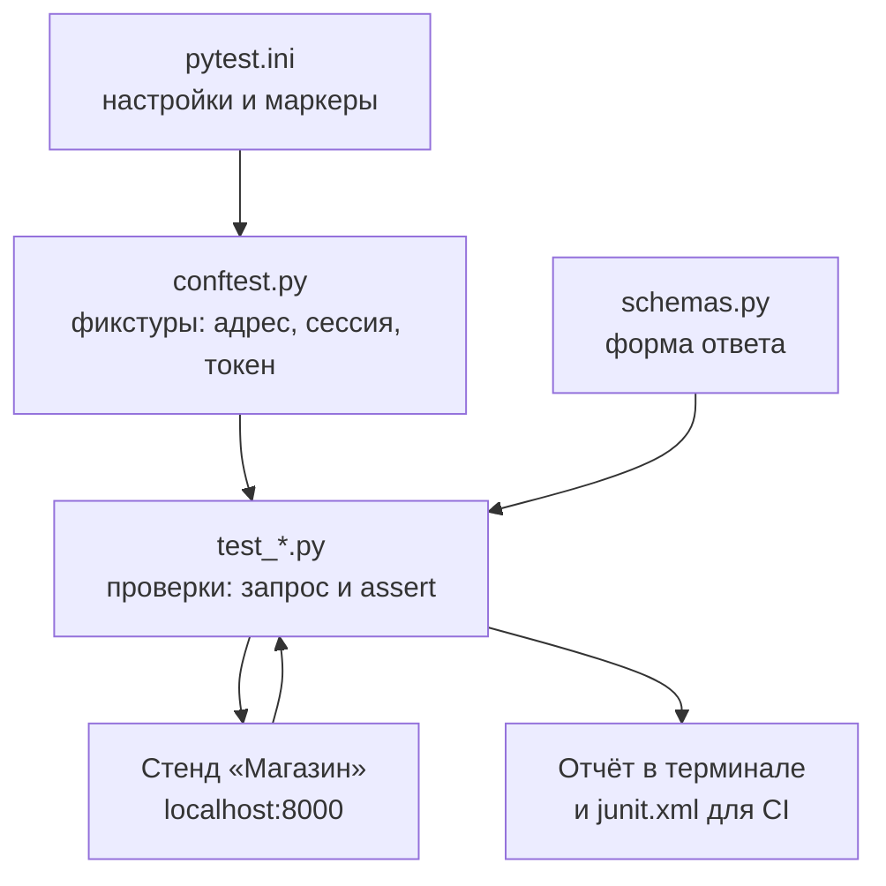
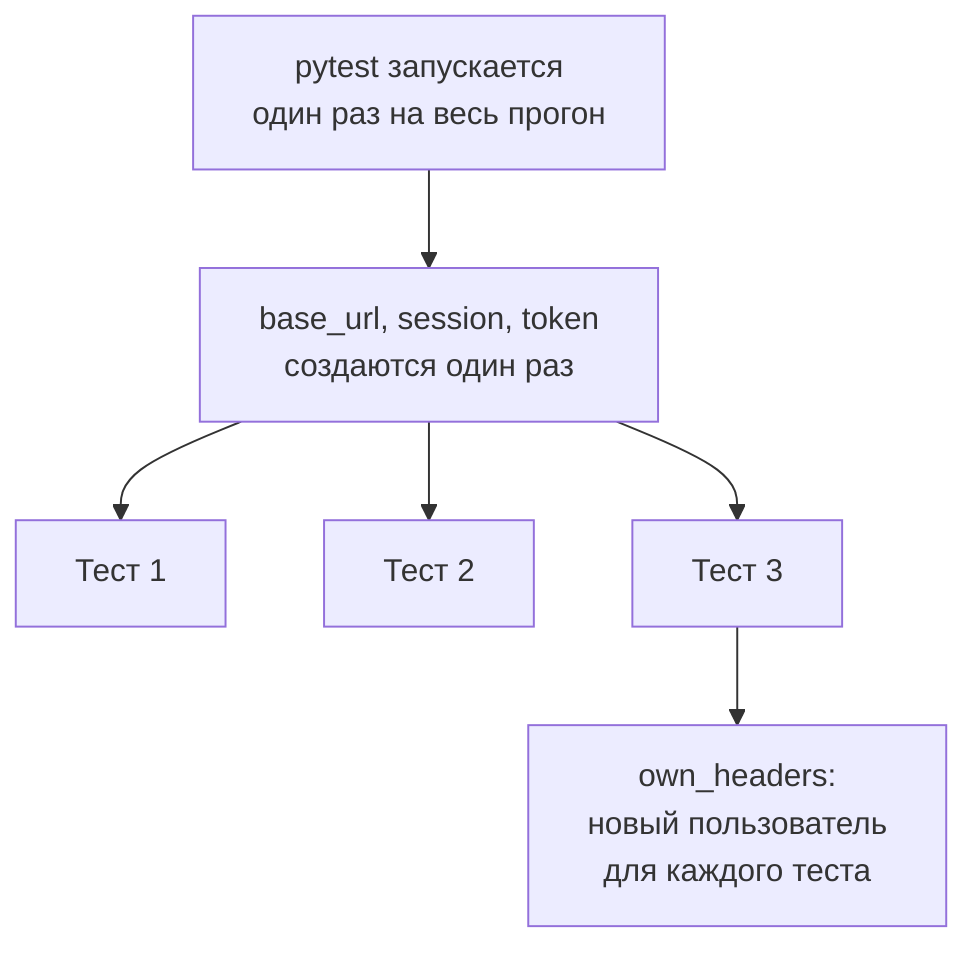
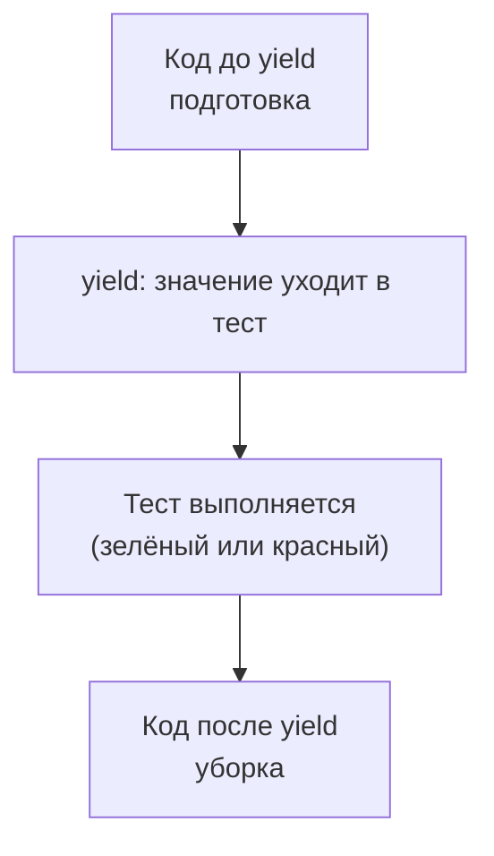

## Зачем это нужно

В [уроке 6.1](01-testing-basics.md) ты составил тест-кейсы руками: открыл терминал, набрал `curl`, посмотрел на ответ, сравнил с ожиданием. Для одного раза это нормально. Но стенд будет меняться: ты включишь кэш, уменьшишь пул соединений, перепишешь запрос к базе. После каждой такой правки нужно убедиться, что «Магазин» по-прежнему отвечает правильно. Двадцать проверок руками занимают полчаса и скучны, поэтому их начнут пропускать. Автотест (проверка, записанная кодом и запускаемая одной командой) делает те же двадцать проверок за три секунды и не устаёт.

Для нагрузочного тестировщика это не роскошь, а страховка. Нагрузка на сломанный сервис даёт красивые, но бессмысленные графики: «быстро отвечает» ничего не значит, если он быстро отдаёт ошибки. Перед каждым нагрузочным прогоном ты запустишь набор автотестов, и если он зелёный, можно считать, что сервис отвечает правильно хотя бы одному пользователю.

Шаг проекта: в каталоге `~/perf-lab/06-api-tests/` рядом с кейсами из 6.1 появятся файлы `conftest.py` (общие заготовки для тестов, разберём ниже), `pytest.ini`, `schemas.py` и четыре файла с тестами (`test_auth.py`, `test_products.py`, `test_cart.py`, `test_orders.py`) плюс `test_health.py`. Это около двадцати проверок API «Магазина», готовых к запуску одной командой. В [уроке 6.3](03-ci-actions.md) они начнут запускаться сами при каждом `git push`.

## Что нужно знать

- Основы pytest: `assert`, поиск тестов по именам, `parametrize` и фикстуры в [уроке 4.7](../04-python/07-pytest.md). Здесь мы не повторяем их с нуля, а применяем к реальному API и добавляем то, чего там не было: проверку формы ответа, маркеры, ожидаемые падения и отчёт для CI (continuous integration, «непрерывная интеграция»: сервер, который сам прогоняет тесты при каждом изменении кода; разберём в [уроке 6.3](03-ci-actions.md)).
- Библиотека `requests` и виртуальное окружение `~/perf-lab/.venv` из [урока 4.5](../04-python/05-venv-requests.md).
- Коды ответов и JSON из [урока 2.2](../02-web/02-rest-json-auth.md): 200, 201, 204, 401, 404, 409, 422.
- Тест-кейсы, классы эквивалентности и границы из [урока 6.1](01-testing-basics.md): сегодня они превращаются в код.
- Это **новый** набор в каталоге `~/perf-lab/06-api-tests/`, а не продолжение файлов из `~/perf-lab/04-python/`: там ты учился (`conftest.py` с фикстурами `base_url`, `shop`, `buyer` и `test_shop_api.py`), здесь строишь рабочий набор для проверки стенда перед нагрузкой. Те файлы остаются как есть, имена фикстур в новом наборе другие (`session`, `token`, `headers`, `own_headers`), потому что задачи шире: схема ответа, маркеры, отчёт для CI.
- Работающий стенд «Магазин» (`curl -s localhost:8000/readyz` отвечает `{"status":"ready"}`).

## Картина целиком

Возьми приёмку квартиры с бригадой-контролёром. У контролёра есть чемоданчик с инструментами: уровень, тестер розеток, рулетка. Он не придумывает проверки на месте: для каждой комнаты у него заранее записан список, и список один и тот же для любой квартиры. Приходит, прогоняет, возвращает отчёт: «в комнате 2 розетка не работает, всё остальное в порядке». Автотесты API это такой же контролёр: заранее записанный список проверок, который можно прогнать против любой версии стенда. Аналогия ломается в одном месте: контролёр приходит один раз, а наши тесты запускаются сотни раз, поэтому они обязаны давать одинаковый результат при каждом запуске и не мешать друг другу.



Что здесь видно: тесты сами ничего не готовят, всё общее берётся из `conftest.py` и `schemas.py`, а настройки лежат в `pytest.ini`. Тест отправляет запрос стенду, сравнивает ответ с ожиданием и отдаёт результат в двух видах: человеку в терминал и программе (CI) в файл `junit.xml`.

Посмотри на живой прогон. Это пример выполнения набора из 14 проверок, который ты соберёшь в практике. Переключай сценарии, наводи мышь на строки отчёта:

<div class="viz" data-viz="api-test-report" data-fail="ok" data-title="Прогон pytest -v: зелёный и красный отчёт"></div>

Что здесь видно: каждая строка это один тест (файл, `::`, функция), результат справа и процент выполнения. Если всё зелёное, в конце одна строка итога. Если есть падение, появляется раздел `FAILURES` с кодом теста и строкой `E`, о нём мы поговорим подробно ниже.

## Теория

### Из чего состоит автотест API

**Зачем это существует.** Тест-кейс из урока 6.1 написан для человека: «открой, отправь, проверь». Автотест это тот же кейс, переведённый на язык, который понимает машина. Без такого перевода повторять проверки пришлось бы вручную, а ручная проверка со временем начинает пропускаться.

**Аналогия.** Рецепт и кулинарный робот. Рецепт для человека: «посоли по вкусу». Для робота нужно записать «5 граммов». Автотест это кейс, в котором каждое «по вкусу» заменено точным значением.

**Как это устроено.** Любой тест API делает три шага в одном и том же порядке:

1. **Подготовка (arrange).** Адрес стенда, нужный пользователь, нужные данные. В pytest это делают фикстуры.
2. **Действие (act).** Один запрос: `session.get(...)` или `session.post(...)`. Тест, который отправляет пять запросов подряд и проверяет только последний, трудно читать и трудно диагностировать.
3. **Проверка (assert).** Сравнение ответа с ожиданием: код, тело, заголовки.

Эти три шага называют AAA (arrange, act, assert). Если тест нельзя разделить на эти три части, он, скорее всего, пытается проверить слишком много.

**Разобранный пример.** Кейс из 6.1: «`size=101` отклоняется». Автотест:

```python
def test_size_out_of_range(session, base_url):
    response = session.get(base_url + "/api/products", params={"size": 101}, timeout=10)  # действие
    assert response.status_code == 422                                                      # проверка
```

Подготовка здесь спрятана в двух фикстурах `session` и `base_url` (адрес и объект, который ходит по сети). Действие одно, проверка одна. Параметр `params={"size": 101}` библиотека сама превратит в `?size=101` в адресе, поэтому склеивать строку руками не нужно.

**Что путают.** Тест не должен «готовиться» в другом тесте. Если `test_order_flow` рассчитывает, что `test_add_item` уже положил товар в корзину, то при запуске одного `test_order_flow` он упадёт. Каждый тест готовит себе всё сам или получает готовое через фикстуру.

> **Проверь понимание:** в тесте три запроса: регистрация, вход, добавление в корзину, и `assert` стоит только после последнего. Тест упал на `assert`. Что из трёх запросов подвело?
>
> <details markdown="1">
> <summary>Ответ</summary>
>
> Неизвестно. Падение последней проверки могло быть вызвано любым из трёх шагов: например, регистрация вернула 409, и дальше всё пошло не так. Поэтому подготовку выносят в фикстуры с собственными `assert` (они покажут, на каком шаге беда), а в теле теста оставляют одно действие.
> </details>

### Фикстуры API-тестов: адрес, сессия, токен

**Зачем это существует.** Один и тот же адрес стенда нужен всем тестам. Если вписать `http://localhost:8000` в каждый, то при переезде стенда на другой порт придётся править сто мест. Фикстура (напоминание из [урока 4.7](../04-python/07-pytest.md): функция подготовки, результат которой pytest подставляет в тест по имени аргумента) хранит это в одном месте.

**Аналогия.** Заправочный пистолет и бак: водителю не нужно знать, как топливо попало на станцию, он берёт пистолет и заправляет. Ломается тем, что фикстуру pytest подставляет сам, по имени аргумента, пистолет в руки берёшь ты.

**Как это устроено.** В `conftest.py` (файл, который pytest читает сам и из которого берёт общие фикстуры для всех тестов рядом) лежат пять фикстур. Три готовятся один раз на весь запуск, две выдают заголовок авторизации:

| Фикстура | Область | Что отдаёт |
|---|---|---|
| `base_url` | session (один раз) | адрес стенда из переменной `BASE_URL`, по умолчанию `http://localhost:8000` |
| `session` | session | объект `requests.Session`, общий на все тесты |
| `token` | session | токен общего пользователя `user0001@shop.lab` |
| `headers` | на каждый тест | словарь `{"Authorization": "Bearer ..."}` для общего пользователя |
| `own_headers` | на каждый тест | заголовок **нового** пользователя, созданного только для этого теста |

**Область действия** (`scope`) решает, как часто готовить. `scope="session"` значит «один раз на весь запуск pytest»: адрес и сессию создавать на каждый тест незачем. Для токена тоже: вход по паролю занимает заметное время (пароли хранятся в виде **bcrypt**-хеша, намеренно медленного, чтобы пароль нельзя было быстро подобрать: примерно четверть секунды процессорного времени на проверку, подробнее в теме 11), и логиниться перед каждым из двадцати тестов расточительно.

Почему `requests.Session`, а не просто `requests.get`? Сессия держит открытое соединение с сервером и использует его повторно: не нужно каждый раз заново «здороваться» с сервером (TCP-рукопожатие из [урока 2.1](../02-web/01-client-server-http.md)). Для тестов это ускорение, а для будущих нагрузочных сценариев привычка, которая пригодится.



Что здесь видно: сверху то, что готовится один раз и используется всеми (адрес, сессия, токен), снизу то, что обновляется на каждый тест. Общее экономит время, личное защищает тесты друг от друга.

**Разобранный пример.** Фикстура токена:

```python
@pytest.fixture(scope="session")
def token(session, base_url):
    response = session.post(base_url + "/api/login",
                            json={"email": "user0001@shop.lab", "password": "password"}, timeout=30)
    assert response.status_code == 200, response.text
    return response.json()["token"]
```

Разбор: `token` просит у pytest `session` и `base_url`, и pytest сначала готовит их, потом вызывает `token`. Это цепочка зависимостей, строить её вручную не нужно. `json={...}` превращает словарь в JSON и ставит заголовок `Content-Type: application/json`. `assert response.status_code == 200, response.text` содержит сообщение после запятой: если вход не удался, в отчёте будет тело ответа сервера, и сразу понятно почему (например, «invalid credentials»). Это единственное место, где своё сообщение к `assert` оправдано: фикстура проверяет не продукт, а собственную подготовку, и упасть она должна с понятной причиной. Тайм-аут 30 секунд оставлен щедрым, потому что bcrypt под нагрузкой бывает медленным.

**Что путают.**

- **Тайм-аут.** У `requests` по умолчанию тайм-аута нет: зависший сервер зависит и тест, а вместе с ним весь CI на час. Поэтому в каждом запросе стоит `timeout=...`. Ожидание ответа `10` значит «не больше 10 секунд ждать».
- **Общий пользователь и состояние.** `token` общий на всех, поэтому и корзина у `headers` общая. Для проверок, которые только читают (каталог, список заказов), это безопасно. Для всего, что меняет данные (корзина, заказ), нужен `own_headers`.

> **Проверь понимание:** тест `test_add_to_cart` использует `headers` (общий пользователь), а `test_cart_starts_empty` проверяет, что корзина пуста, тоже через `headers`. Первый запуск набора зелёный, второй красный. Почему?
>
> <details markdown="1">
> <summary>Ответ</summary>
>
> Корзина хранится в Redis и живёт между запусками. После первого прогона в корзине общего пользователя остался товар, добавленный `test_add_to_cart`. Во втором запуске `test_cart_starts_empty` видит этот товар и падает. Виноваты не «Магазин», а тесты: они делят изменяемое состояние. Лечение: каждому такому тесту свой пользователь (`own_headers`).
> </details>

### Независимость тестов и тестовые данные

**Зачем это существует.** Тесты, которые зависят от порядка запуска, проходят «когда повезёт». Ты запустил один упавший тест отдельно, чтобы разобраться, и он внезапно прошёл. Или pytest перестановил файлы, и всё рухнуло. Такие тесты хуже отсутствующих: им нельзя верить ни в зелёном, ни в красном состоянии.

**Аналогия.** Отдельные кабинки в примерочной: каждый заходит в свою, оставляет там вещи и не мешает остальным. Если все складывают одежду в одну кабинку, рано или поздно кто-то наденет чужое.

**Как это устроено.** Правило одно: **тест оставляет мир таким, каким нашёл, или не зависит от его состояния.** Практически это три приёма:

1. **Уникальные данные.** Для регистрации email генерируется заново: `f"test-{uuid.uuid4().hex}@shop.lab"`. `uuid4` это случайный идентификатор длиной 32 символа, вероятность совпадения ничтожна. Так повторный запуск не наткнётся на «email уже занят» (409) от прошлого запуска.
2. **Свой пользователь на изменяющий тест.** Фикстура `own_headers` регистрирует нового пользователя и логинит его. Корзина у него своя и пустая.
3. **Проверка относительно, а не абсолютно.** Вместо «в списке заказов ровно 3» пиши «заказ с моим `id` есть в списке». Состояние базы между запусками меняется, твой собственный заказ нет.

**Разобранный пример.** Фикстура нового пользователя:

```python
@pytest.fixture
def own_headers(session, base_url):
    credentials = {"email": f"test-{uuid.uuid4().hex}@shop.lab", "password": "password"}
    response = session.post(base_url + "/api/register", json=credentials, timeout=30)
    assert response.status_code == 201, response.text
    response = session.post(base_url + "/api/login", json=credentials, timeout=30)
    assert response.status_code == 200, response.text
    return {"Authorization": "Bearer " + response.json()["token"]}
```

Без `scope`, значит, фикстура вызывается заново для каждого теста. Регистрация возвращает 201 (создано), вход возвращает токен длиной 64 символа (это видно по `secrets.token_hex(32)` в коде приложения: 32 байта в шестнадцатеричной записи дают 64 символа). Пароль `password` допустим: правило регистрации требует минимум 8 символов, и ровно 8 в слове `password`.

Цена такого подхода есть: каждый тест с `own_headers` делает два запроса с bcrypt (регистрация хеширует пароль, вход проверяет его), а это самые дорогие запросы стенда. Пока тестов десяток, это секунды. Если их станет несколько сотен, пользователей создают пачкой заранее или переиспользуют, но осознанно.

**Что путают.** Удалять данные после теста красиво, но хрупко: если тест упал посередине, «уборка» не выполнится. Уникальные данные надёжнее. Для таких случаев у фикстур есть `yield` (часть после него выполняется после теста даже при падении), о нём следующий раздел. Но там, где можно обойтись уникальностью, обходись.

> **Проверь понимание:** ученик решил обойтись без `own_headers`: перед каждым тестом корзины он очищает общего пользователя запросами `DELETE`. Почему это хуже, чем отдельный пользователь?
>
> <details markdown="1">
> <summary>Ответ</summary>
>
> Во-первых, уборка сама может упасть и оставить грязь. Во-вторых, если два теста запустятся одновременно (CI часто гоняет тесты параллельно), они будут чистить и наполнять одну и ту же корзину и мешать друг другу. Отдельный пользователь изолирует тесты по построению: им нечего делить.
> </details>

### yield-фикстура, область действия и `conftest.py`

**Зачем это существует.** Бывают тесты, которым нужен именно общий пользователь `user0001` (например, проверить, что корзина работает у того, кто залогинен через `/api/login`). Уникальные данные тут не помогут: корзина одна, и она переживает запуск. Нужен способ сказать «подготовь это перед тестом и **убери после**, что бы с тестом ни случилось». Без него уборку пришлось бы писать в конце каждого теста, а при падении на середине она бы не выполнилась.

**Аналогия.** Номер в гостинице: перед заездом горничная готовит комнату, после выезда убирает, и делает это независимо от того, понравился ли гостю номер. Аналогия ломается тем, что горничных можно нанять разных на разные этажи, а область фикстуры выбирается заранее и для всех тестов сразу.

**Как это устроено.** Если в фикстуре вместо `return` стоит `yield значение`, pytest делает три шага: выполняет код **до** `yield` (подготовка, она же setup), отдаёт значение тесту и ждёт, а когда тест закончился, выполняет код **после** `yield` (уборка, она же teardown). Уборка выполнится и после упавшего теста. Не выполнится она только в одном случае: если упала сама подготовка и до `yield` дело не дошло. Поэтому подготовку делают короткой и такой, чтобы её сбой не оставлял следов.



Что здесь видно: уборка всегда идёт после теста, независимо от его результата. Если у теста несколько фикстур, убирают в обратном порядке: что подготовлено последним, убирается первым (как разбирают стопку тарелок).

**Область действия** (`scope`) задаёт, как долго живёт фикстура, и тем самым когда выполняется её уборка:

| `scope` | Когда готовится и убирается | Для чего |
|---|---|---|
| `"function"` (по умолчанию) | перед каждым тестом и после него | всё, что тест меняет (корзина, пользователь) |
| `"module"` | один раз на файл `test_*.py` | дорогая подготовка для файла |
| `"session"` | один раз на весь запуск | адрес, `Session`, токен для чтения |

Правило из начала этого урока остаётся: дорогое и неизменяемое готовят шире, изменяемое уже. Токен `user0001` дорогой (bcrypt) и только читается, поэтому он `session`. Фикстура, которая кладёт товар в корзину, меняет данные, поэтому она на каждый тест. Фикстура может зависеть только от фикстур такой же или более широкой области: `scope="session"` не может просить `function`-фикстуру, pytest откажет с ошибкой `ScopeMismatch`.

**`conftest.py` как общий склад.** Фикстуры, лежащие в `conftest.py`, видны всем тестам в этой папке и ниже, без `import`. Фикстуры из самого файла `test_*.py` видны только ему. Если в папке ниже лежит свой `conftest.py` с фикстурой того же имени, для тестов этой папки победит ближайшая. Поэтому `base_url`, `session`, `token` и `headers` мы держим в одном `conftest.py`: тесты в любом файле берут их по имени, а смена адреса стенда правится в одном месте.

**Разобранный пример.** Фикстура «товар в корзине», которая убирает за собой:

```python
@pytest.fixture
def cart_item(session, base_url, headers):
    """Товар 7 в корзине общего пользователя; после теста корзина очищается."""
    product_id = 7
    response = session.post(base_url + "/api/cart/items", headers=headers,
                            json={"product_id": product_id, "qty": 1}, timeout=10)
    assert response.status_code == 201, response.text
    yield product_id
    response = session.delete(base_url + f"/api/cart/items/{product_id}", headers=headers, timeout=10)
    assert response.status_code == 204, response.text
```

Разбор: до `yield` фикстура через API кладёт в корзину товар с `id` 7 (код 201 означает «создано»). `yield product_id` отдаёт тесту номер товара, чтобы тест не хранил «магическую» семёрку у себя. После `yield` идёт запрос `DELETE /api/cart/items/7`: сервер убирает товар из корзины и отвечает `204` (успех без тела). Код ответа проверяется: молча проваленная уборка оставила бы следы, и упал бы уже следующий запуск. Фикстура считает, что до неё товара 7 в корзине общего пользователя не было: если он там лежал, количество вырастет, а уборка удалит и прежнее. Для строгой изоляции берут `own_headers`. Тест, использующий `cart_item`, получает корзину, в которой товар уже лежит, а после теста корзина снова пуста. Сколько бы раз ни запускали набор, количество не копится.

**Что путают.**

- **`return` вместо `yield`.** После `return` код не выполняется: уборки не будет, и тест на второй запуск упадёт. Если фикстуре нечего убирать, `return` правильнее.
- **Уборка после `yield` падает.** Тогда pytest сообщит об **ошибке** (`error`) в завершении теста: сам тест при этом остаётся зелёным. Это нужная сигнализация (лучше узнать о грязи сразу), поэтому код ответа в уборке проверяют, а сама уборка остаётся простой: один запрос.
- **`scope="session"` для изменяющих фикстур.** Тогда уборка наступит только после всех тестов, а до тех пор каждый тест видит чужие следы.

> **Проверь понимание:** фикстура `cart_item` объявлена с `scope="session"` и запрашивает фикстуру `headers`, у которой область по умолчанию. Что произойдёт при запуске и почему?
>
> <details markdown="1">
> <summary>Ответ</summary>
>
> pytest остановится с ошибкой `ScopeMismatch`. Фикстура на весь запуск готовится один раз, а `headers` живёт один тест: к моменту, когда `cart_item` нужны заголовки, подходящего экземпляра `headers` ещё нет, а после теста он исчезнет. Широкая фикстура не может зависеть от более узкой.
> </details>

### Что проверять в ответе: четыре слоя

**Зачем это существует.** Самая частая ошибка новичка: проверить только `status_code == 200` и решить, что тест готов. Сервис может вернуть 200 и пустой JSON, 200 и объект с переименованным полем, 200 и товар не из той категории. Код ответа это только первая из четырёх проверок.

**Аналогия.** Посылка. Курьер сообщил «доставлено» (код ответа). Но ты ещё открываешь коробку: то ли это, что заказывал (тело), целое ли оно (форма), и когда доставили (время).

**Как это устроено.** Проверки ответа лежат слоями, от дешёвого к подробному:

1. **Код статуса.** Первое и самое грубое: 200, 201, 204, 401, 404, 409, 422.
2. **Заголовки.** Что-то обязательное: у «Магазина» каждый ответ содержит `X-Request-ID` (его ты увидишь и в логах приложения, он связывает запрос и строку лога).
3. **Форма тела (схема).** Какие поля есть и какого они типа: `id` целое, `name` строка, `price` число. Это страховка от «тихой» поломки контракта.
4. **Значения тела.** Конкретные значения: `total == 10000`, `status == "paid"`, каждый товар в категории 1 имеет `category_id == 1`.

Ещё один слой, **время ответа**, в функциональных тестах почти не проверяют. У него другая работа: он про нагрузочное тестирование, и мерить его лучше специальными инструментами (Locust и k6 в темах 9 и 10). Исключение: грубая защита от зависания, поэтому и стоит `timeout`.

**Разобранный пример.** Один и тот же ответ, проверенный слоями. Запрос `GET /api/products/1` вернул:

```json
{"id": 1, "name": "Товар 1", "price": 137.0, "category_id": 1, "stock": 1000000}
```

- Слой 1: `response.status_code == 200`. Прошёл.
- Слой 3: `set(product) == {"id", "name", "price", "category_id", "stock"}`. Если разработчик переименует `stock` в `quantity`, этот слой упадёт, а слой 1 останется зелёным. Именно это показывает сценарий «поле переименовано» в виджете выше.
- Слой 4: `product["id"] == 1`. Если сервер вернёт другой товар с кодом 200, поймает только этот слой.

**Что путают.** Проверять **слишком много**: сравнивать весь JSON целиком с эталоном (`assert response.json() == {...}`) там, где часть данных меняется (цены, остатки, даты). Такой тест падает от каждой мелочи, и его перестают читать. Проверяй то, что составляет договорённость: наличие и тип полей, а точные значения только там, где они гарантированы (например, `total == 10000` для каталога).

> **Проверь понимание:** `GET /api/orders/5` вернул 200 и `{"detail": "order not found"}`. Какой слой проверки это поймает, а какой нет?
>
> <details markdown="1">
> <summary>Ответ</summary>
>
> Код статуса не поймает (200 ожидаемо). Проверка формы поймает (у заказа должны быть поля `id`, `status`, `total`, `items`, а тут `detail`). Это пример того, почему одного кода мало. Настоящее приложение, к счастью, на несуществующий заказ вернёт 404, но тест должен ловить и такой регресс.
> </details>

### Проверка формы ответа (схема)

**Зачем это существует.** Фронтенд, мобильное приложение и тесты читают поля ответа по именам. Если имя или тип изменились, потребитель ломается. Проверка формы это быстрый способ заметить: «контракт нарушен».

**Как это устроено.** **Схема ответа** (schema) это описание формы: какие поля обязаны быть и какого типа. В больших проектах для этого используют готовые языки описаний (JSON Schema, OpenAPI), но для старта хватает словаря «имя поля: тип» и десяти строк кода. Мы кладём их в `schemas.py` и вызываем из тестов.

```python
PRODUCT = {"id": int, "name": str, "price": (int, float), "category_id": int, "stock": int}


def check_schema(data, schema):
    assert isinstance(data, dict), f"ожидался объект, пришло {type(data).__name__}"
    assert set(data) == set(schema), f"поля ответа {sorted(data)} вместо {sorted(schema)}"
    for name, expected in schema.items():
        value = data[name]
        assert isinstance(value, expected) and not isinstance(value, bool), \
            f"поле {name!r}: пришло {type(value).__name__} ({value!r}), ожидалось {expected}"
```

Разбор. `isinstance(value, expected)` проверяет тип; `expected` может быть кортежем типов: `price` из JSON приходит как `137.0` или `137` (JSON не различает целые и дробные, а библиотека превращает число без точки в `int`), поэтому разрешены оба. Строка с `bool` нужна из-за особенности Python: `True` это подвид `int`, и без неё `True` сошло бы за число. Сообщения в `assert` пишут в виде f-строки, чтобы падение объясняло себя: «поле 'price': пришло str ('137')».

Отдельное решение: проверять ли «ровно эти поля» (`==`) или «минимум эти» (`<=`, как в примере `test_api.py` из стенда). Строгое равенство ловит и лишние поля, но ломается от безобидного добавления нового поля. Для внутреннего API, который ты тестируешь для себя, это приемлемо и полезно: любое изменение формы должно быть замечено и осознано.

**Что путают.** Схема проверяет **форму**, а не смысл: товар с ценой `-5.0` пройдёт проверку схемы (число, как и должно быть). Смысл проверяют значениями (слой 4).

> **Проверь понимание:** `check_schema` проверяет `set(data) == set(schema)`. Разработчик добавил в ответ товара новое поле `weight`. Что произойдёт и хорошо ли это?
>
> <details markdown="1">
> <summary>Ответ</summary>
>
> Тест упадёт с сообщением «поля ответа [...] вместо [...]». Это ровно то, что нужно для внутреннего контроля: ты узнаешь об изменении контракта и сам решишь, обновить схему или это ошибка. Для чужого стабильного API лучше мягкая проверка «обязательные поля на месте», иначе тесты будут падать от каждой безобидной добавки.
> </details>

### Негативные проверки: код, тело и отсутствие последствий

**Зачем это существует.** В 6.1 мы выяснили, что негативных проверок больше, чем позитивных. Хороший негативный тест проверяет три вещи, а не одну: **код** (422, а не 500), **тело** (причина названа правильно) и **отсутствие последствий** (отказ ничего не изменил).

**Как это устроено.** Приложение «Магазина» отвечает на ошибки по-разному, и эта разница важна:

- **Ошибка валидации** (запрос не соответствует схеме): код 422, тело `{"detail": [{"type": ..., "loc": ["query", "size"], "msg": ..., ...}]}`. Здесь `loc` («location») показывает, **где** ошибка: `["query", "size"]` это параметр адреса `size`. Это даёт точную проверку: не просто «был 422», а «422 именно из-за `size`».
- **Ошибка бизнес-логики:** тело `{"detail": "текст"}`. Примеры: 401 `bearer token required`, 404 `product not found`, 409 `not enough stock`, 400 `cart is empty`.

Все тексты `detail` взяты из кода приложения, и в тестах стоит сверять именно их. Исключение: валидатор Pydantic пишет собственные сообщения, они могут меняться с версией библиотеки, поэтому для 422 сравнивай `loc`, а не `msg`.

**Разобранный пример.** Три проверки одного отказа:

```python
@pytest.mark.parametrize("size", [0, 101])
def test_size_out_of_range(session, base_url, size):
    response = session.get(base_url + "/api/products", params={"size": size}, timeout=10)
    assert response.status_code == 422
    assert response.json()["detail"][0]["loc"] == ["query", "size"]
```

Код 422 говорит «запрос отклонён из-за формы». Проверка `loc` говорит «причина именно в `size`, а не, скажем, в `page`». Если разработчик нечаянно изменит правило и `size=101` начнёт отвечать 422 из-за другого параметра, тест заметит. Третья проверка («ничего не изменилось») для запросов на чтение не нужна, но для записи обязательна. Пример: добавить в корзину несуществующий товар (404), а потом проверить, что корзина осталась пустой. Без этого тест не поймает случай «вернул 404, но товар в корзину всё равно положил».

**Что путают.** Принимают любой код `>= 400` за «хорошо». Тест `assert response.status_code >= 400` пройдёт и на 500 (сервер сломался), и на 404, и на 422. А ведь 500 на неверный ввод это баг: сервер должен отказывать аккуратно. Сравнивай с точным кодом.

> **Проверь понимание:** на `GET /api/products?page=0` ты ожидаешь 422. Сервер вернул 500. Тест `assert response.status_code != 200` пройдёт или нет? Какой тест правильный?
>
> <details markdown="1">
> <summary>Ответ</summary>
>
> Пройдёт, и баг останется незамеченным. Правильный тест требует точного кода: `assert response.status_code == 422`. Он упадёт на 500 и покажет, что сервер сломался на неверном вводе.
> </details>

### Маркеры, ожидаемые падения и выборочный запуск

**Зачем это существует.** Когда тестов десятки, нужны способы запускать подмножество: только быстрые «стенд жив?», только негативные, всё кроме медленных. Для этого в pytest есть **маркеры** (marks, метки на тестах). И ещё одна ситуация: тест правильный, а продукт содержит известный баг, который пока не починили. Красный тест в наборе, который «всегда красный», приучает игнорировать красный цвет. Для этого есть `xfail` (expected failure, ожидаемое падение).

**Аналогия.** Маркеры это цветные стикеры на карточках: по стикеру можно достать нужные. `xfail` это табличка «лифт не работает, ремонт заказан»: ты не ходишь к лифту каждый день с недоумением, но если лифт вдруг заработает, табличку надо снять.

**Как это устроено.** Маркер ставится декоратором: `@pytest.mark.smoke`. Для всего файла: `pytestmark = pytest.mark.smoke` в начале. Список разрешённых маркеров задаётся в `pytest.ini`, а опция `--strict-markers` превращает опечатку (`@pytest.mark.smok`) из тихого предупреждения в ошибку:

```ini
[pytest]
addopts = -ra --strict-markers
markers =
    smoke: быстрые проверки «стенд жив»
    negative: проверки отказов (401, 404, 409, 422)
```

Здесь `addopts` это ключи, которые добавятся к каждому запуску, а `-ra` (report all) печатает в конце сводку всех не зелёных исходов с причинами. Запуск по маркеру: `pytest -m smoke`, исключить: `pytest -m "not negative"`. Выражение после `-m` понимает `and`, `or`, `not` и скобки: `pytest -m "smoke and not slow"`. Третий маркер, который нам скоро понадобится, `slow`: им помечают долгие проверки (например, обход всего каталога), чтобы после каждой правки гонять набор `-m "not slow"`, а полный прогон оставить на CI и на «перед нагрузкой».

Тот же список можно хранить не в `pytest.ini`, а в `pyproject.toml` (общий файл настроек Python-проекта), если он у тебя есть:

```toml
[tool.pytest.ini_options]
addopts = "-ra --strict-markers"
markers = [
    "smoke: быстрые проверки «стенд жив»",
    "negative: проверки отказов (401, 404, 409, 422)",
    "slow: долгие проверки (больше нескольких секунд)",
]
```

Содержимое то же, форма записи другая. Если в папке есть и `pytest.ini`, он главнее. В курсе используем `pytest.ini`: он проще и в нём меньше шансов ошибиться со скобками и кавычками. Сверить, что pytest знает маркеры, можно командой `pytest --markers`: она печатает и твои, и встроенные.

`xfail` помечает тест, который **ожидаемо падает**. С `strict=True` действует строгое правило: если тест неожиданно **прошёл** (XPASS), набор считается упавшим. Это делает метку самоочищающейся: когда баг починят, тест позеленеет, набор покраснеет, и ты узнаешь, что пометку надо снять.

**Разобранный пример.** Баг BUG-001 из урока 6.1: поиск по `_` возвращает весь каталог. Тест описывает **правильное** поведение, а `xfail` честно говорит, что оно пока не достигнуто:

```python
@pytest.mark.xfail(strict=True, reason="BUG-001: _ и % в поиске работают как шаблон")
def test_search_underscore_is_literal(session, base_url):
    response = session.get(base_url + "/api/products", params={"q": "_"}, timeout=10)
    assert response.json()["total"] == 0
```

Приложение собирает шаблон `%_%` для `ILIKE`, а в нём `_` значит «любой один символ», поэтому находятся все 10 000 товаров, и `assert 10000 == 0` падает: pytest ожидает это и печатает `XFAIL`. После починки (экранирование спецсимволов) тест пройдёт, и `strict=True` превратит неожиданное «прошёл» в провал набора с текстом `[XPASS(strict)]`. В отчёте ты увидишь строку `XFAIL ... - BUG-001: ...`, баг записан в самом тесте, и его легко найти.

**Что путают.** `skip` и `xfail` это разные вещи. `skip` значит «не запускай» (например, тест только для Linux). `xfail` значит «запусти, и я ожидаю падение». Если баг известен, нужен `xfail`: так ты продолжаешь проверять и увидишь починку.

> **Проверь понимание:** в наборе 20 тестов, из них один с `xfail(strict=True)`. Что покажет pytest, если баг починили, а метку не сняли?
>
> <details markdown="1">
> <summary>Ответ</summary>
>
> Тест неожиданно пройдёт (XPASS), а `strict=True` превращает это в провал: `19 passed, 1 failed`, с причиной `[XPASS(strict)]`. Код выхода будет ненулевой, и CI покраснеет. Это намеренно: метка должна исчезнуть вместе с багом.
> </details>

### Запуск, отбор и отчёт для CI

**Зачем это существует.** Один и тот же набор запускают в разных ситуациях: целиком перед нагрузочным прогоном, один упавший тест при отладке, только быстрые проверки после каждой правки. Нужны ключи под каждую ситуацию. И нужен отчёт, который читает не человек, а программа: CI показывает по такому файлу список тестов в интерфейсе.

**Как это устроено.** Ключи, которые стоит знать (часть из них была в [4.7](../04-python/07-pytest.md)):

| Ключ | Что делает |
|---|---|
| `-v` | по строке на тест с результатом |
| `-q` | коротко: точки вместо строк |
| `-x` | остановиться на первом падении |
| `--lf` | запустить только тесты, упавшие в прошлый раз (last failed) |
| `-k выражение` | отобрать тесты по части имени: `-k "size and not 101"` |
| `-m маркер` | отобрать по маркеру: `-m smoke`, `-m "not negative"` |
| `--tb=short` | короткий отчёт о падении |
| `--junitxml=файл` | записать результаты в файл формата JUnit (его понимают CI и многие системы отчётов) |

Формат **JUnit XML** вырос из мира Java, но стал общим: любой CI, от GitHub Actions до Jenkins, умеет его читать. Структура простая: один `<testsuite>` с итогами и по одному `<testcase>` на тест; у упавшего внутри есть `<failure>`.

```xml
<testsuite name="pytest" errors="0" failures="1" skipped="0" tests="14" time="2.841">
  <testcase classname="test_products" name="test_size_out_of_range[101]" time="0.012">
    <failure message="assert 200 == 422">...</failure>
  </testcase>
</testsuite>
```

Разбор: `tests="14"` это сколько всего, `failures="1"` сколько упало (assert не сошёлся), `errors` относится к ошибкам подготовки (упала фикстура, это та самая разница между `failed` и `error` из 4.7), `classname` и `name` вместе дают путь теста.

**Разобранный пример.** Типичная работа за день: ты поправил что-то в стенде и хочешь быстро проверить.

```bash
pytest -m smoke        # три секунды: стенд жив, вход работает?
pytest                  # весь набор перед нагрузочным прогоном
pytest --lf -x --tb=short   # что-то упало: перепрогнать только упавшие, остановиться на первом, отчёт короче
```

**Что путают.** Код выхода. pytest возвращает `0`, если всё зелёное, `1` если есть упавшие, `5` если не нашёл ни одного теста. CI смотрит именно на этот код: ненулевой значит «шаг провалился». Поэтому любая опечатка в имени файла (`pytest tests/` вместо `pytest`) может дать «тестов нет» и красный CI.

> **Проверь понимание:** запустил `pytest -m smoke` и увидел `5 deselected, 2 passed`. Что значит «deselected»?
>
> <details markdown="1">
> <summary>Ответ</summary>
>
> Pytest нашёл 7 тестов, но 5 из них без маркера `smoke`: они отсеяны фильтром и не запускались. Это не ошибка и не пропуск, а нормальный результат отбора.
> </details>

### Почему тест бывает нестабильным (flaky)

**Зачем это существует.** Тест, который то проходит, то падает без изменений в коде, называют **нестабильным** (flaky, от англ. «хлопья, шаткий»). Он разрушает доверие к набору: после трёх ложных падений команда начинает нажимать «перезапустить» не читая отчёт, и настоящий баг тонет в шуме.

**Как это устроено.** Причины в API-тестах почти всегда из одного короткого списка:

1. **Общее состояние.** Несколько тестов делят одного пользователя или одну запись (мы разбирали выше).
2. **Зависимость от порядка.** Тест рассчитывает, что другой уже что-то сделал.
3. **Ожидание по времени.** `time.sleep(2)` «на всякий случай»: на медленной машине двух секунд не хватает, на быстрой секунды потрачены зря. Лучше ждать условия (до таймаута), а не времени.
4. **Нестабильное окружение.** Стенд ещё не прогрелся, Redis перезапускался, сеть мигнула.
5. **Данные, которые меняются сами.** Сравнение с «сегодняшней датой» или «текущим числом заказов».

Что **не** делать: «лечить» нестабильность автоматическим повтором упавшего теста. Повтор скрывает причину, а баги гонок (когда результат зависит от того, кто успел первым) станут перемежающимися и уйдут в продакшен. Повтор допустим как временная мера, но с записью причины.

**Разобранный пример.** Сценарий «тесты зависят друг от друга» в виджете выше именно об этом: красный тест `test_cart_starts_empty`, хотя «Магазин» исправен. Диагностика по отчёту: в строке `E` слева видна непустая корзина `[{'name': 'Товар 1', ..., 'qty': 2}]`, а справа `[]`. Значит, кто-то положил товар до нас. Вывод: проблема в изоляции, лечение `own_headers`.

**Что путают.** Если тест упал один раз из ста, его не «просто перезапускают». Запиши условия (время, номер прогона, что менялось), попробуй воспроизвести в цикле (`for i in $(seq 20); do pytest -x test_cart.py; done`), найди общее состояние. Нестабильность это тоже баг, только в тесте.

> **Проверь понимание:** тест после `time.sleep(1)` проверяет, что заказ появился в списке. На ноутбуке работает, в CI падает раз в десять запусков. Почему и что делать?
>
> <details markdown="1">
> <summary>Ответ</summary>
>
> На загруженной машине CI секунды не всегда хватает, а на быстрой ноутбучной хватает: тест зависит от скорости. Правильно: либо проверять без ожидания (если приложение отвечает синхронно, заказ уже в списке сразу после ответа 201), либо ждать условия с таймаутом (опрашивать каждые 0,2 с до 10 секунд), а не фиксированное время.
> </details>

## Практика

Стенд поднят (`curl -s localhost:8000/readyz`), окружение активно: `source ~/perf-lab/.venv/bin/activate`. Pytest и `requests` уже поставлены в [4.7](../04-python/07-pytest.md) и [4.5](../04-python/05-venv-requests.md). Если нет, повтори `pip install pytest==9.1.1 requests==2.34.2`.

### 1. Проверь окружение и каталог

```bash
cd ~/perf-lab/06-api-tests
source ~/perf-lab/.venv/bin/activate
python -c "import pytest, requests; print(pytest.__version__, requests.__version__)"
curl -s localhost:8000/readyz
```

Что делает: переходит в каталог из урока 6.1, включает окружение, печатает версии библиотек и проверяет готовность стенда.

Ожидаемый вывод:

```text
9.1.1 2.34.2
{"status":"ready"}
```

**Как читать вывод:** первая строка подтверждает, что обе библиотеки видны из активного окружения. Вторая, что стенд жив. Если вместо этого `ModuleNotFoundError`, окружение не включено (нет `(.venv)` в приглашении).

**Типичные ошибки:**

- `ModuleNotFoundError: No module named 'pytest'`: забыл `source ~/perf-lab/.venv/bin/activate` или не ставил pytest. Выполни активацию и `pip install pytest==9.1.1`.
- `curl: (7) Failed to connect to localhost port 8000`: стенд не запущен. Из `~/load-tester/project/shop` выполни `docker compose up -d --build --wait` ([урок 5.3](../05-docker/03-compose-shop.md)).

### 2. Общие фикстуры и настройки

Создай `pytest.ini`:

```ini
[pytest]
addopts = -ra --strict-markers
markers =
    smoke: быстрые проверки «стенд жив»
    negative: проверки отказов (401, 404, 409, 422)
```

Создай `conftest.py`:

```python
import os
import uuid

import pytest
import requests


@pytest.fixture(scope="session")
def base_url():
    return os.getenv("BASE_URL", "http://localhost:8000").rstrip("/")


@pytest.fixture(scope="session")
def session():
    with requests.Session() as client:
        yield client


@pytest.fixture(scope="session")
def token(session, base_url):
    response = session.post(base_url + "/api/login",
                            json={"email": "user0001@shop.lab", "password": "password"}, timeout=30)
    assert response.status_code == 200, response.text
    return response.json()["token"]


@pytest.fixture
def headers(token):
    return {"Authorization": "Bearer " + token}


@pytest.fixture
def own_headers(session, base_url):
    credentials = {"email": f"test-{uuid.uuid4().hex}@shop.lab", "password": "password"}
    response = session.post(base_url + "/api/register", json=credentials, timeout=30)
    assert response.status_code == 201, response.text
    response = session.post(base_url + "/api/login", json=credentials, timeout=30)
    assert response.status_code == 200, response.text
    return {"Authorization": "Bearer " + response.json()["token"]}
```

Разбор незнакомого. `os.getenv("BASE_URL", "http://localhost:8000")` читает переменную окружения, а если её нет, берёт запасное значение: в [уроке 6.3](03-ci-actions.md) CI подставит свой адрес без правки файла. `.rstrip("/")` убирает слэш в конце, чтобы `base_url + "/api/..."` не дал двойной. `yield client` внутри `with` отдаёт сессию тестам, а когда они закончатся, `with` аккуратно закроет её: всё, что после `yield`, выполняется в конце.

Проверка, что pytest видит фикстуры:

```bash
pytest --fixtures -q | grep -E "base_url|own_headers|headers|token|session"
```

Ожидаемо появятся пять фикстур с твоими именами. Сам проект пока тестов не содержит: `pytest` ответит `no tests ran`.

### 3. Первые 14 проверок

Положи тесты в пять файлов. `test_health.py`:

```python
import pytest

pytestmark = pytest.mark.smoke


def test_healthz(session, base_url):
    response = session.get(base_url + "/healthz", timeout=10)
    assert response.status_code == 200
    assert response.json() == {"status": "ok"}
    assert response.headers["X-Request-ID"]


def test_readyz(session, base_url):
    response = session.get(base_url + "/readyz", timeout=15)
    assert response.status_code == 200
    assert response.json() == {"status": "ready"}
```

`pytestmark = pytest.mark.smoke` помечает все тесты файла. `response.headers["X-Request-ID"]` проверяет, что заголовок есть и не пуст: пустая строка в `assert` ложна, а отсутствие ключа даст `KeyError` и падение.

`test_auth.py`:

```python
import pytest


@pytest.mark.smoke
def test_login_ok(session, base_url):
    response = session.post(base_url + "/api/login",
                            json={"email": "user0001@shop.lab", "password": "password"}, timeout=30)
    assert response.status_code == 200
    assert len(response.json()["token"]) == 64
    assert response.json()["expires_in"] > 0


@pytest.mark.negative
def test_login_wrong_password(session, base_url):
    response = session.post(base_url + "/api/login",
                            json={"email": "user0001@shop.lab", "password": "wrong"}, timeout=30)
    assert response.status_code == 401
    assert response.json() == {"detail": "invalid credentials"}


@pytest.mark.negative
def test_cart_requires_token(session, base_url):
    response = session.get(base_url + "/api/cart", timeout=10)
    assert response.status_code == 401
    assert response.json() == {"detail": "bearer token required"}
```

`test_products.py` (форму ответа пока проверяем множеством полей, функцию `check_schema` добавим в шаге 4):

```python
import pytest


def test_product_schema(session, base_url):
    product = session.get(base_url + "/api/products/1", timeout=10).json()
    assert set(product) == {"id", "name", "price", "category_id", "stock"}
    assert product["id"] == 1


@pytest.mark.parametrize("size", [1, 100])
def test_size_in_range(session, base_url, size):
    body = session.get(base_url + "/api/products", params={"size": size}, timeout=10).json()
    assert body["size"] == size
    assert len(body["items"]) == size


@pytest.mark.negative
@pytest.mark.parametrize("size", [0, 101])
def test_size_out_of_range(session, base_url, size):
    response = session.get(base_url + "/api/products", params={"size": size}, timeout=10)
    assert response.status_code == 422
    assert response.json()["detail"][0]["loc"] == ["query", "size"]


@pytest.mark.negative
def test_product_not_found(session, base_url):
    response = session.get(base_url + "/api/products/99999999", timeout=10)
    assert response.status_code == 404
    assert response.json() == {"detail": "product not found"}
```

`test_cart.py`:

```python
def test_cart_starts_empty(session, base_url, own_headers):
    response = session.get(base_url + "/api/cart", headers=own_headers, timeout=10)
    assert response.status_code == 200
    assert response.json() == {"items": [], "total": 0}


def test_add_to_cart(session, base_url, own_headers):
    response = session.post(base_url + "/api/cart/items", headers=own_headers,
                            json={"product_id": 1, "qty": 2}, timeout=10)
    assert response.status_code == 201
    cart = response.json()
    assert cart["items"][0]["product_id"] == 1
    assert cart["items"][0]["qty"] == 2
    assert cart["total"] == cart["items"][0]["price"] * 2
```

`test_orders.py`:

```python
import pytest


@pytest.mark.negative
def test_empty_order_rejected(session, base_url, own_headers):
    response = session.post(base_url + "/api/orders", headers=own_headers, timeout=15)
    assert response.status_code == 400
    assert response.json() == {"detail": "cart is empty"}
```

Запуск:

```bash
pytest -v
```

Ожидаемый вывод (время будет другим):

```text
============================ test session starts ============================
platform linux -- Python 3.12.3, pytest-9.1.1, pluggy-1.6.0
rootdir: /home/student/perf-lab/06-api-tests
configfile: pytest.ini
collected 14 items

test_auth.py::test_login_ok PASSED                                    [  7%]
test_auth.py::test_login_wrong_password PASSED                        [ 14%]
test_auth.py::test_cart_requires_token PASSED                         [ 21%]
test_cart.py::test_cart_starts_empty PASSED                           [ 28%]
test_cart.py::test_add_to_cart PASSED                                 [ 35%]
test_health.py::test_healthz PASSED                                   [ 42%]
test_health.py::test_readyz PASSED                                    [ 50%]
test_orders.py::test_empty_order_rejected PASSED                      [ 57%]
test_products.py::test_product_schema PASSED                          [ 64%]
test_products.py::test_size_in_range[1] PASSED                        [ 71%]
test_products.py::test_size_in_range[100] PASSED                      [ 78%]
test_products.py::test_size_out_of_range[0] PASSED                    [ 85%]
test_products.py::test_size_out_of_range[101] PASSED                  [ 92%]
test_products.py::test_product_not_found PASSED                       [100%]

============================ 14 passed in 2.93s =============================
```

**Как читать вывод:** `configfile: pytest.ini` подтверждает, что настройки подхвачены. Тесты идут по файлам в алфавитном порядке, внутри файла сверху вниз. В квадратных скобках значение параметра из `parametrize`, так отличают `[0]` от `[101]`. Время около трёх секунд почти целиком уходит на bcrypt: два теста входа плюс по две операции (хеш при регистрации и проверка при входе) в каждой из трёх фикстур `own_headers`, итого восемь по четверти секунды. На остальные запросы хватает долей секунды.

**Типичные ошибки:**

- `ERROR ... fixture 'own_headers' not found`: файл `conftest.py` лежит не в `06-api-tests/` или в имени опечатка (`conftests.py`).
- `'smok' not found in markers configuration option`: сработал `--strict-markers`, потому что в тесте опечатка в метке. Это и есть его работа.
- `requests.exceptions.ConnectionError`: стенд не запущен или другой порт; задай `BASE_URL=http://localhost:8000 pytest`.
- `assert 201 == 200` в `test_login_ok` или падение регистрации с `409`: так бывает только при повторяющемся email. У нас он уникален, значит, что-то перехватывает запросы (например, другой сервис на порту 8000). Проверь `docker compose ps`.

> Тест падает, а причина непонятна? Скопируй текст теста и весь вывод `pytest` вместе со строкой `assert`, спроси нейросеть, что сравнивается с чем. Сначала сам посмотри, какое значение пришло и какое ожидалось, потом сверься с её объяснением и проверь правку повторным запуском.
{: .ai}

### 4. Схема ответа и больше негативных проверок

Создай `schemas.py`:

```python
NUMBER = (int, float)

PRODUCT = {"id": int, "name": str, "price": NUMBER, "category_id": int, "stock": int}
PRODUCT_PAGE = {"items": list, "page": int, "size": int, "total": int}
CART_ITEM = {"product_id": int, "name": str, "price": NUMBER, "qty": int}
CART = {"items": list, "total": NUMBER}
ORDER_CREATED = {"id": int, "status": str, "total": NUMBER, "items": list}


def check_schema(data, schema):
    assert isinstance(data, dict), f"ожидался объект, пришло {type(data).__name__}"
    assert set(data) == set(schema), f"поля ответа {sorted(data)} вместо {sorted(schema)}"
    for name, expected in schema.items():
        value = data[name]
        assert isinstance(value, expected) and not isinstance(value, bool), \
            f"поле {name!r}: пришло {type(value).__name__} ({value!r}), ожидалось {expected}"
```

В `test_products.py` замени `test_product_schema` на проверку через функцию и добавь тесты каталога:

```python
from schemas import PRODUCT, PRODUCT_PAGE, check_schema


def test_product_schema(session, base_url):
    response = session.get(base_url + "/api/products/1", timeout=10)
    check_schema(response.json(), PRODUCT)
    assert response.json()["id"] == 1


def test_catalog_defaults(session, base_url):
    body = session.get(base_url + "/api/products", timeout=10).json()
    check_schema(body, PRODUCT_PAGE)
    assert (body["page"], body["size"], body["total"]) == (1, 20, 10000)
    assert len(body["items"]) == 20
    for item in body["items"]:
        check_schema(item, PRODUCT)


@pytest.mark.negative
@pytest.mark.parametrize("page", [0, -1, "abc"])
def test_page_invalid(session, base_url, page):
    response = session.get(base_url + "/api/products", params={"page": page}, timeout=10)
    assert response.status_code == 422
    assert response.json()["detail"][0]["loc"] == ["query", "page"]


def test_page_beyond_the_end_is_empty(session, base_url):
    body = session.get(base_url + "/api/products", params={"page": 999999, "size": 5}, timeout=10).json()
    assert body["items"] == []
    assert body["total"] == 10000


def test_filter_by_category(session, base_url):
    body = session.get(base_url + "/api/products", params={"category_id": 1, "size": 50}, timeout=10).json()
    assert body["items"]
    assert all(p["category_id"] == 1 for p in body["items"])
```

Строка `from schemas import ...` в начале файла, остальные импорты (`import pytest`) остаются. Страница за концом списка (`page=999999`) в нашем приложении **не** ошибка: это 200 с пустым списком, и `total` остаётся 10 000. Тест фиксирует именно такое поведение, потому что оно решение, принятое осознанно. Если бы ты ожидал здесь 404, тест упал бы и показал расхождение между ожиданием и реальностью, а дальше нужно решать, что считать правильным (мини-версия того, что делает тестировщик на работе).

В `test_cart.py` добавь проверку формы и отказ без последствий. Блок ниже вставляй в конец файла, а строку `from schemas import ...` добавь к импортам вверху (если `import pytest` там уже есть, второй раз не пиши):

```python
import pytest

from schemas import CART, CART_ITEM, check_schema


def test_cart_shape(session, base_url, own_headers):
    response = session.post(base_url + "/api/cart/items", headers=own_headers,
                            json={"product_id": 1, "qty": 1}, timeout=10)
    cart = response.json()
    check_schema(cart, CART)
    check_schema(cart["items"][0], CART_ITEM)


@pytest.mark.negative
@pytest.mark.parametrize("body", [
    {"product_id": 1, "qty": 0},
    {"product_id": 0, "qty": 1},
    {"product_id": 1},
], ids=["qty-0", "product-0", "no-qty"])
def test_add_invalid_changes_nothing(session, base_url, own_headers, body):
    url = base_url + "/api/cart/items"
    assert session.post(url, headers=own_headers, json=body, timeout=10).status_code == 422
    cart = session.get(base_url + "/api/cart", headers=own_headers, timeout=10).json()
    assert cart["items"] == []


@pytest.mark.negative
def test_add_unknown_product(session, base_url, own_headers):
    response = session.post(base_url + "/api/cart/items", headers=own_headers,
                            json={"product_id": 99999999, "qty": 1}, timeout=10)
    assert response.status_code == 404
    assert response.json() == {"detail": "product not found"}
```

Параметр `ids=[...]` задаёт читаемые имена вариантов: в отчёте будет `test_add_invalid_changes_nothing[qty-0]`, а не `[body0]`.

И в `test_orders.py` тест полного сценария и двух отказов. Импорт добавь к импортам вверху файла, остальное вставь в конец:

```python
from schemas import ORDER_CREATED, check_schema


def put_in_cart(session, base_url, headers, product_id, qty):
    response = session.post(base_url + "/api/cart/items", headers=headers,
                            json={"product_id": product_id, "qty": qty}, timeout=10)
    assert response.status_code == 201, response.text


def test_order_flow(session, base_url, own_headers):
    put_in_cart(session, base_url, own_headers, 2, 2)
    response = session.post(base_url + "/api/orders", headers=own_headers, timeout=60)
    assert response.status_code == 201, response.text
    order = response.json()
    check_schema(order, ORDER_CREATED)
    assert order["status"] == "paid"
    assert order["total"] == order["items"][0]["price"] * 2
    listing = session.get(base_url + "/api/orders", headers=own_headers, timeout=15).json()
    assert order["id"] in [item["id"] for item in listing]
    assert session.get(base_url + "/api/cart", headers=own_headers, timeout=10).json()["items"] == []


@pytest.mark.negative
def test_not_enough_stock_keeps_cart(session, base_url, own_headers):
    put_in_cart(session, base_url, own_headers, 4, 1_000_001)
    response = session.post(base_url + "/api/orders", headers=own_headers, timeout=15)
    assert response.status_code == 409
    assert response.json() == {"detail": "not enough stock"}
    cart = session.get(base_url + "/api/cart", headers=own_headers, timeout=10).json()
    assert cart["items"][0]["qty"] == 1_000_001
```

Строка `import pytest` уже есть в начале файла, а `from schemas import ...` добавь рядом. На складе каждого товара лежит 1 000 000 штук (так заполнена база), поэтому 1 000 001 гарантированно не хватает. Тест проверяет не только 409, но и то, что отказ ничего не списал: корзина осталась как была. `put_in_cart` это обычная вспомогательная функция, а не фикстура: ей нужны разные аргументы при каждом вызове.

Запусти:

```bash
pytest -q
```

Ожидаемо:

```text
...........................                                                            [100%]
27 passed in 6.2s
```

Счёт сходится: 14 тестов из шага 3 плюс 13 новых (в каталоге 6, в корзине 5, в заказах 2). Время выросло, потому что почти каждый новый тест создаёт пользователя, а это два bcrypt-запроса.

**Как читать вывод:** каждая точка это прошедший тест, `F` упавший, `E` ошибка в фикстуре. Если точек столько же, сколько тестов, и в конце `passed`, набор зелёный.

### 5. Баг как `xfail`, маркеры и отчёт для CI

Добавь в `test_products.py` тест на BUG-001 из урока 6.1:

```python
@pytest.mark.xfail(strict=True, reason="BUG-001: _ и % в поиске работают как шаблон")
def test_search_underscore_is_literal(session, base_url):
    response = session.get(base_url + "/api/products", params={"q": "_"}, timeout=10)
    assert response.json()["total"] == 0
```

Запусти с выборкой по маркерам:

```bash
pytest -m smoke -q
pytest -m "not negative" -q
pytest -k "size or search" -v
```

Разбор: первая команда прогоняет только `smoke` (`test_healthz`, `test_readyz`, `test_login_ok`), вторая все, кроме негативных, третья по имени (`-k` принимает выражения с `and`, `or`, `not`). В выводе третьей найди строку:

```text
test_products.py::test_search_underscore_is_literal XFAIL (BUG-001: _ и % в поиске работают как шаблон)
```

и в конце сводку `-ra`:

```text
XFAIL test_products.py::test_search_underscore_is_literal - BUG-001: _ и % в поиске работают как шаблон
```

Теперь отчёт для CI:

```bash
pytest -q --junitxml=junit.xml
head -c 600 junit.xml
```

Ожидаемо начало файла (значения `time` и `tests` отличаются):

```text
<?xml version="1.0" encoding="utf-8"?><testsuites name="pytest tests"><testsuite name="pytest" errors="0" failures="0" skipped="1" tests="..." time="..." ...>
```

В файле `skipped="1"`: JUnit не знает про `xfail`, и pytest записывает такой тест как пропущенный. `junit.xml` не нужно коммитить, это результат прогона: добавь строку `junit.xml` в `~/perf-lab/.gitignore` (файл создан в [уроке 3.1](../03-git/01-git-basics.md)).

### 6. Уборка через `yield` и маркер `slow`

Добавь в `pytest.ini` третий маркер (строка в конец списка `markers`):

```ini
    slow: долгие проверки (больше нескольких секунд)
```

Добавь в конец `conftest.py` фикстуру `cart_item` (код из теории выше, вместе с проверкой `204` в конце, импорты уже есть). В `test_cart.py` добавь тест, который её использует:

```python
def test_item_in_cart(session, base_url, headers, cart_item):
    cart = session.get(base_url + "/api/cart", headers=headers, timeout=10).json()
    qty = {item["product_id"]: item["qty"] for item in cart["items"]}
    assert qty[cart_item] == 1
```

В `test_products.py` добавь обход каталога, помеченный как медленный:

```python
@pytest.mark.slow
def test_catalog_walk(session, base_url):
    seen = []
    for page in range(1, 21):
        body = session.get(base_url + "/api/products", params={"page": page, "size": 100}, timeout=10).json()
        seen += [item["id"] for item in body["items"]]
    assert len(seen) == len(set(seen)) == 2000
    assert seen == sorted(seen)
```

Разбор: `qty` это словарь «номер товара: количество» из ответа корзины, а `assert qty[cart_item] == 1` проверяет, что фикстура положила ровно одну штуку (лишние остатки от прошлых запусков сломали бы это условие). Тест обхода двадцать раз запрашивает по сто товаров: `seen` собирает `id`, `set(seen)` убирает повторы, и если длины совпали, ни один товар не попал на две страницы. Каталог отсортирован по `id`, поэтому `seen == sorted(seen)`.

Посмотри, когда выполняются подготовка и уборка:

```bash
pytest test_cart.py::test_item_in_cart --setup-show
```

Что делает: запускает один тест (путь `файл::имя_теста`), а ключ `--setup-show` печатает каждый шаг подготовки и уборки фикстур.

Ожидаемый вывод:

```text
test_cart.py
SETUP    S session
SETUP    S base_url
SETUP    S token (fixtures used: base_url, session)
        SETUP    F headers (fixtures used: token)
        SETUP    F cart_item (fixtures used: base_url, headers, session)
        test_cart.py::test_item_in_cart (fixtures used: base_url, cart_item, headers, session, token) .
        TEARDOWN F cart_item
        TEARDOWN F headers
TEARDOWN S token
TEARDOWN S base_url
TEARDOWN S session
```

**Как читать вывод:** буква после `SETUP` это область: `S` (session), одна на весь запуск, `F` (function), на один тест. Отступ показывает, что фикстура живёт внутри теста. Строка с тестом посередине, точка в конце значит «прошёл». Уборка идёт в обратном порядке: `cart_item` убирается раньше `headers`, а `session`-фикстуры убираются в самом конце, когда закончились все тесты. Запусти команду без `--setup-show` три раза подряд: тест должен проходить каждый раз, потому что `DELETE` в конце фикстуры возвращает корзину в исходное состояние.

Теперь выборка по маркерам. Запускай по очереди и смотри на последнюю строку каждого вывода:

```bash
pytest -m "not slow" -q
pytest -m "smoke and not slow" -q
pytest -q
```

Ожидаемые итоговые строки (время будет другим):

```text
28 passed, 1 deselected, 1 xfailed in 6.4s
3 passed, 27 deselected in 0.9s
29 passed, 1 xfailed in 7.1s
```

**Как читать вывод:** `deselected` значит «отобран прочь фильтром `-m`»: тест найден, но не запускался. В первой команде отсеян один тест (`slow`), во второй осталось только три теста `smoke`, третья команда без фильтра запускает все 30 (29 прошли и один ожидаемо упал, `x`). Все три выдали код выхода 0.

**Типичные ошибки:**

- `'slow' not found in markers configuration option`: строки `slow: ...` нет в `pytest.ini` (или она с отступом меньше, чем у соседних). `--strict-markers` ловит и опечатку в имени, и забытую регистрацию.
- `fixture 'cart_item' not found`: фикстура оказалась не в `conftest.py` (например, в другом файле `test_*.py`, и видна только ему) или `conftest.py` лежит не в `06-api-tests/`. Перенеси её в `06-api-tests/conftest.py`.
- `ScopeMismatch`: у `cart_item` написано `scope="session"`, а `headers` живёт на тест. Убери `scope`.

### 7. Закоммить результат

```bash
cd ~/perf-lab
echo "junit.xml" >> .gitignore
cat .gitignore
git add 06-api-tests .gitignore
git status --short
git commit -m "6.2: автотесты API Магазина: pytest, схемы, маркеры, уборка через yield"
git push
```

`cat .gitignore` должен показать и `junit.xml`, и `.pytest_cache/` (эту строку ты добавил в [уроке 4.7](../04-python/07-pytest.md); если её нет, допиши). `git status --short` перед коммитом покажет, что именно уйдёт: убедись, что в списке нет `junit.xml` и `__pycache__/` (если есть, добавь их в `.gitignore`).

## Сломай и почини

**Поломка 1: тест, который зависит от соседа.** В `test_cart.py` замени `own_headers` на `headers` в обоих тестах (`test_cart_starts_empty` и `test_add_to_cart`) и запусти `pytest -q test_cart.py` дважды подряд.

Что произойдёт: первый запуск зелёный, второй красный:

```text
E       assert [{'name': 'Товар 1', 'price': 137.0, 'product_id': 1, 'qty': 2}] == []
```

Диагностика: слева то, что вернул сервер (корзина с товаром), справа то, что ждал тест. Но «Магазин» исправен: корзина общего пользователя живёт в Redis между запусками, и `test_add_to_cart` оставил в ней товар. Вернуть `own_headers`, и тест снова стабилен при любом числе запусков. Это отчёт сценария «тесты зависят друг от друга» в виджете выше: сверь.

**Поломка 2: подкрутка стенда.** Проверь, как тест ловит регресс. В `~/load-tester/project/shop/shop/app/main.py` измени `le=100` на `le=200` в параметре `size`, пересобери стенд (`docker compose up -d --build --wait`) и запусти `pytest -q test_products.py`: тест `test_size_out_of_range[101]` упадёт с `assert 200 == 422`: приложение теперь принимает 101. Верни `le=100`, пересобери и убедись, что набор снова зелёный. Правка кода стенда нужна только для этого упражнения, дальше стенд не меняй: всё нужное включается переменными в `.env`.

**Поломка 3: BUG-001 «починили».** Измени тест `test_search_underscore_is_literal`: убери `xfail` и поставь вместо него ожидание `== 10000`. Теперь он описывает неправильное поведение как правильное. Он зелёный, и баг оказался «закреплён» тестом: при починке этот тест упадёт. Запомни: тест должен описывать **ожидаемое** поведение, а не текущее. Верни как было.

**Поломка 4: уборка забыта.** Сначала убедись, что тест `test_item_in_cart` зелёный. Затем в фикстуре `cart_item` закомментируй две последние строки (запрос `session.delete(...)` и `assert` под ним, поставь перед каждой `#`) и запусти `pytest -q test_cart.py` дважды подряд.

Что произойдёт: первый запуск зелёный, второй красный:

```text
E       assert 2 == 1
```

Диагностика: `qty[cart_item]` теперь 2. Первый прогон положил товар и не убрал, второй добавил ещё одну штуку (сервер увеличивает количество, а не заменяет), и тест увидел остаток прошлого запуска. Верни обе строки. Корзина общего пользователя после поломки осталась грязной, поэтому один раз почисти её руками: получи токен через `/api/login` (как в [уроке 2.2](../02-web/02-rest-json-auth.md)) и выполни `curl -X DELETE -H "Authorization: Bearer $TOKEN" localhost:8000/api/cart/items/7`. Урок: изменяющая фикстура без уборки оставляет следы, и тесты начинают зависеть от истории запусков.

Если что-то пошло не так, `git restore .` откатит файлы, а `git stash` сохранит изменения.

## ИИ в помощь

Нейросеть быстро набрасывает тесты по образцу и объясняет падения `pytest`, но слепо принимать её тесты нельзя: тест, который всегда зелёный, хуже отсутствия теста. Общие правила: [ИИ-помощник](../ai.md).

**Задача:** набросать ещё несколько негативных проверок по образцу уже написанных.

```text
Pytest 9, библиотека requests. Вот мой тест и фикстура: <вставь код test_products.py и conftest.py>.
Напиши ещё три негативных теста для POST /api/cart/items: нет токена, несуществующий
product_id, отрицательное qty. Ожидаемые коды возьми из ответа сервиса, который я
дам ниже: <вставь реальные ответы curl>. Не придумывай коды сам.
Объясни, что проверяет каждый assert.
```
{: .wrap}

**Проверь ответ:** запусти тесты и убедись, что они проходят на правильном поведении и **падают**, если сломать условие (поменяй ожидаемый код на неверный). Типичная ошибка: тест без `assert` или с проверкой, которая верна при любом ответе, плюс выдуманные имена фикстур и маркеров, которых нет в твоём `conftest.py`.

**Задача:** разобрать красный вывод `pytest`.

```text
Pytest 9 упал. Вот полный вывод: <вставь вывод pytest -x -q>.
Объясни по строкам: что сравнивалось, какое значение пришло, какое ожидалось.
Назови две вероятные причины и скажи, какой командой curl проверить каждую.
```
{: .wrap}

**Проверь ответ:** выполни предложенный `curl` и сравни. Типичная ошибка: нейросеть предлагает «увеличить таймаут» или добавить `sleep` вместо поиска причины. Это маскирует баг.

В чат не отправляй токены из заголовков `Authorization`: замени на `Bearer <токен>`.

## Словарик урока

| Термин | Простыми словами |
|---|---|
| Автотест (automated test) | Проверка, записанная кодом и запускаемая командой |
| AAA (arrange, act, assert) | Три шага теста: подготовить, выполнить действие, проверить |
| Фикстура (fixture) | Функция подготовки, результат которой pytest подставляет в тест по имени |
| `conftest.py` | Файл, из которого pytest сам берёт общие фикстуры |
| Область фикстуры (`scope`) | Как часто готовить: для каждого теста или один раз на весь прогон |
| `requests.Session` | Объект, который держит соединение и общие настройки между запросами |
| Таймаут (timeout) | Предел ожидания ответа; без него зависший сервер зависит и тест |
| Схема ответа | Описание формы ответа: поля и их типы |
| Маркер (mark) | Метка на тесте для отбора: `smoke`, `negative`, `slow` |
| `--strict-markers` | Ключ pytest: маркер, которого нет в `pytest.ini`, считается ошибкой, а не предупреждением |
| `yield`-фикстура | Фикстура, у которой код до `yield` готовит, а после `yield` убирает, даже если тест упал |
| `xfail` | Тест, который ожидаемо падает из-за известного бага; со `strict=True` неожиданный успех тоже провал |
| Нестабильный тест (flaky) | Тест, результат которого меняется без изменения кода |
| JUnit XML | Общий формат файла с результатами тестов, который читают CI-системы |
| Код выхода (exit code) | Число, которое программа возвращает системе: 0 успех, не 0 провал |
| Независимость тестов | Свойство: результат теста не зависит от других тестов и порядка |

## Вопросы с собеседований

Раздел для повторения: ответь вслух, потом открой ответ. Короткие вопросы тренируй на скорость: ответ за 30 секунд.

### 1. [junior] [часто] Что такое фикстура pytest и зачем нужна?

<details markdown="1">
<summary>Ответ</summary>

Фикстура это функция подготовки (адрес, сессия, пользователь, данные). Тест просит её по имени аргумента, и pytest сам вызывает и подставляет результат. Это убирает повторение: подготовка в одном месте, а не в каждом тесте. После `yield` можно делать уборку, которая выполнится и при падении теста.

**Что хотят услышать:** подстановка по имени, общая подготовка, область действия, уборка.

**Красный флаг:** «это просто функция, которая вызывается из теста» (путают с обычным вызовом).

</details>

### 2. [junior] [часто] Что должен проверять тест API кроме кода ответа?

<details markdown="1">
<summary>Ответ</summary>

Тело: наличие и типы полей (форма), конкретные значения, если они гарантированы, а при отказах текст причины. Иногда заголовки. И последствия: после отказа данные не должны измениться. Только код 200 не ловит ответ с пустым или переименованным полем.

**Что хотят услышать:** слои (код, форма, значения), проверка последствий.

**Красный флаг:** «достаточно проверить status_code».

</details>

### 3. [junior] [часто] Почему тесты должны быть независимыми?

<details markdown="1">
<summary>Ответ</summary>

Иначе результат зависит от порядка и от следов прошлых запусков: упавший тест нельзя запустить отдельно, а зелёный нельзя считать надёжным. Достигают независимости уникальными данными (`uuid` в email), отдельным пользователем на изменяющий тест и проверками относительно своих данных.

**Что хотят услышать:** примеры приёмов, проблема порядка.

**Красный флаг:** «просто запускаем всегда в одном порядке».

</details>

### 4. [middle] Что такое `scope` фикстуры и как выбрать?

<details markdown="1">
<summary>Ответ</summary>

Область определяет, как часто фикстура готовится: на тест (по умолчанию), на модуль, на весь запуск (`session`). Дорогое и неизменяемое (адрес, сессия, токен для чтения) готовят один раз. Всё, что тест меняет (корзина, пользователь), готовят на каждый тест, иначе тесты влияют друг на друга.

**Что хотят услышать:** критерий «дорогое и неизменяемое против изменяемого».

**Красный флаг:** «`session` везде, чтобы быстрее».

</details>

### 5. [middle] Как проверить схему ответа и зачем?

<details markdown="1">
<summary>Ответ</summary>

Сравнить набор полей и их типы с описанием (словарь, JSON Schema, модель Pydantic). Нужно, чтобы замечать нарушение контракта: переименованное поле или другой тип сломает потребителя при зелёном коде 200. Строгая проверка («ровно эти поля») подходит для своего API, мягкая («эти поля на месте») для чужого, где поля добавляют.

**Что хотят услышать:** контракт, потребители, выбор строгости.

**Красный флаг:** «схему проверять не нужно, достаточно значений».

</details>

### 6. [middle] Что такое `xfail` и чем он отличается от `skip`?

<details markdown="1">
<summary>Ответ</summary>

`skip` не запускает тест. `xfail` запускает и ожидает падение: так помечают известный баг. С `strict=True` неожиданный успех (баг починили) тоже превращается в провал, и метку приходится снять. Так набор не врёт: он зелёный при известном баге и краснеет при любом изменении.

**Что хотят услышать:** разница «не запускать» против «ожидать падение», `strict`.

**Красный флаг:** «закомментирую падающий тест, пока не починят».

</details>

### 7. [middle] Тест падает раз в десять запусков. Что делаешь?

<details markdown="1">
<summary>Ответ</summary>

Не перезапускаю молча. Запускаю тест в цикле, смотрю на общее состояние (данные, порядок), фиксированные `sleep`, зависимость от окружения, время. Сравниваю отчёты упавшего и успешного запусков. Лечу причину: изоляция данных, ожидание условия вместо времени. Автоповтор допускаю только временно и с записанной причиной.

**Что хотят услышать:** воспроизведение, типовые причины, нелюбовь к слепым повторам.

**Красный флаг:** «поставлю retry на тест».

</details>

### 8. [middle] Зачем в негативных тестах проверять не только код, но и тело?

<details markdown="1">
<summary>Ответ</summary>

Один и тот же код могут давать разные причины: 422 из-за `size` или из-за `page`, 401 из-за отсутствия токена или из-за просроченного. Проверка тела (причины, `loc`) подтверждает, что отказ именно тот, который задуман, а не случайный. Для записи ещё проверяют, что отказ ничего не изменил.

**Что хотят услышать:** точная причина, отсутствие побочных эффектов.

**Красный флаг:** `assert status_code >= 400`.

</details>

### 9. [junior] Зачем нужен `timeout` в запросах `requests`?

<details markdown="1">
<summary>Ответ</summary>

По умолчанию `requests` ждёт ответа бесконечно. Если сервер завис, зависнет и тест, а вместе с ним весь CI. Тайм-аут превращает зависание в быстрое понятное падение.

**Что хотят услышать:** «по умолчанию нет», последствие для CI.

**Красный флаг:** «таймаут не нужен, сервер же отвечает».

</details>

### 10. [middle] Как организовать тесты: что в одном файле, как выбирать подмножество?

<details markdown="1">
<summary>Ответ</summary>

По областям продукта: авторизация, каталог, корзина, заказы. Общее в `conftest.py`, схемы в отдельном модуле. Подмножества выбирают маркерами (`smoke`, `negative`), `-k` по имени и путём к файлу или тесту. Разрешённые маркеры перечисляют в `pytest.ini` с `--strict-markers`.

**Что хотят услышать:** структура по областям, маркеры, `-k`.

**Красный флаг:** «всё в одном файле, потому что так проще».

</details>

### 11. [на скорость] Какой код выхода у pytest при падениях?

<details markdown="1">
<summary>Ответ</summary>

Ненулевой: `1` если тесты упали, `0` если всё прошло, `5` если тестов не нашлось. CI по этому коду решает, красить ли шаг.

</details>

### 12. [middle] Чем фикстура с `yield` отличается от фикстуры с `return`, и зачем нужен `conftest.py`?

<details markdown="1">
<summary>Ответ</summary>

Код до `yield` готовит значение, код после `yield` выполняется после теста и убирает за ним, в том числе когда тест упал. `return` ничего после себя не выполняет, поэтому годится, когда убирать нечего. Пример: фикстура кладёт товар в корзину, отдаёт его номер и после теста удаляет товар. `conftest.py` это файл, из которого pytest сам берёт фикстуры для всех тестов в папке и ниже, без `import`. Туда выносят общее (`base_url`, сессия, токен), а область `scope` выбирают по принципу «дорогое и неизменяемое шире, изменяемое уже».

**Что хотят услышать:** уборка после теста даже при падении, ближайший `conftest.py` побеждает, `session`-фикстура не может зависеть от `function`-фикстуры.

**Красный флаг:** «`yield` это просто возврат значения» или «`conftest.py` нужно импортировать в тесты».

</details>

## Проверено на версиях

Ubuntu 24.04, Python 3.12, pytest 9.1.1, requests 2.34.2, стенд «Магазин» из `project/shop` (FastAPI 0.142, Pydantic 2). Октябрь 2026.

## Итог урока: ты умеешь

- [ ] Превратить тест-кейс в автотест по схеме «подготовка, действие, проверка».
- [ ] Вынести общее в фикстуры `conftest.py` и выбрать для них область действия.
- [ ] Написать `yield`-фикстуру с подготовкой и уборкой и проверить её через `--setup-show`.
- [ ] Сделать тесты независимыми: уникальные данные, отдельный пользователь на изменяющий тест.
- [ ] Проверять ответ слоями: код, заголовки, форма, значения.
- [ ] Написать негативные проверки с точным кодом, причиной и отсутствием последствий.
- [ ] Пометить известный баг через `xfail(strict=True)`, зарегистрировать маркеры (`smoke`, `negative`, `slow`) с `--strict-markers` и выбрать тесты через `-m`.
- [ ] Получить отчёт `junit.xml` и узнать причину нестабильности теста.

Дальше: [урок 6.3. Тесты в CI: GitHub Actions на каждый push](03-ci-actions.md), где этот набор начнёт запускаться сам.
