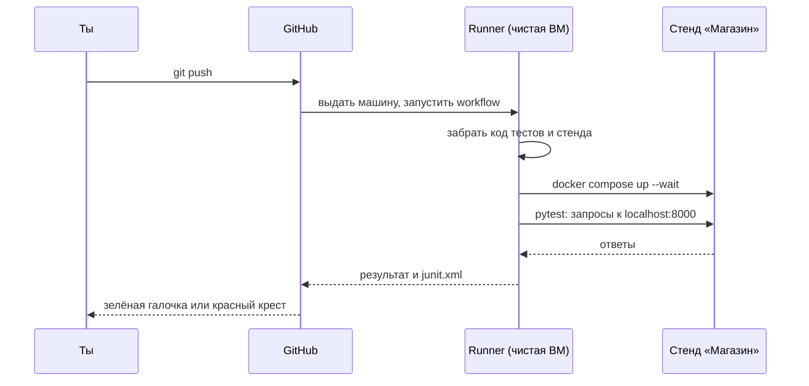
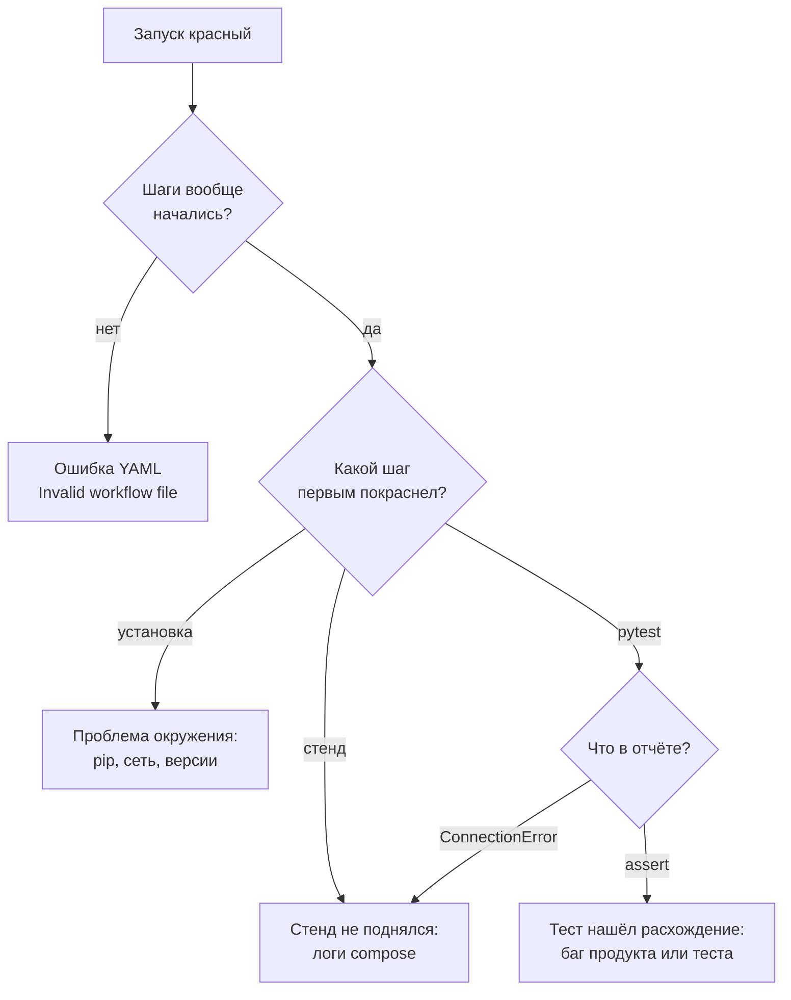

## Зачем это нужно

Набор автотестов из [урока 6.2](02-api-autotests.md) полезен ровно настолько, насколько часто его запускают. Если запускать «когда вспомнишь», то однажды ты забудешь, и именно в этот день поломка уедет дальше. Люди забывчивы, а компьютер нет: поэтому тесты подключают к **CI** (continuous integration, «непрерывная интеграция»). Это автоматика, которая при каждом изменении кода сама берёт свежую копию, собирает окружение, запускает проверки и сообщает результат: зелёная галочка или красный крест. Инструкция, что именно проверять, лежит в обычном файле в репозитории (его называют **workflow**, «рабочий процесс»), а выполняется всё на временной виртуальной машине, которую GitHub выдаёт на время запуска (её зовут **runner**, «бегун»). Подробно разберём оба слова в теории.

Для нагрузочного тестировщика у CI две задачи. Первая: **стерегать собственные тесты**. Ты поменял проверку или стенд, и через три минуты видишь, что набор остался зелёным (или не остался). Вторая впереди: в [теме 12](../12-process/index.md) ты добавишь в CI короткий нагрузочный тест, который краснеет, если сервис замедлился. Сегодняшний урок строит основу для обеих: автоматический запуск на чистой машине.

Шаг проекта: в репозитории `perf-lab` появится файл `.github/workflows/api-tests.yml`. При каждом `git push` GitHub выдаст временную виртуальную машину, поднимет на ней стенд «Магазин», прогонит все тесты из `06-api-tests/`, сохранит отчёт `junit.xml` и покажет результат. В `README.md` репозитория появится бейдж («значок» со статусом `passing` или `failing`), а в конце ты намеренно сломаешь тест и научишься читать красный запуск.

## Что нужно знать

- Автотесты из [урока 6.2](02-api-autotests.md): папка `~/perf-lab/06-api-tests/` с `conftest.py`, `pytest.ini` и файлами `test_*.py`. Они запускаются командой `pytest` и берут адрес стенда из переменной `BASE_URL`.
- `git commit` и `git push`, репозиторий `perf-lab` на GitHub: [тема 3](../03-git/index.md) (уроки [3.1](../03-git/01-git-basics.md) и [3.2](../03-git/02-github.md)).
- Формат YAML (отступы, `ключ: значение`, списки с `-`) и `docker compose up -d --build --wait`: [урок 5.3](../05-docker/03-compose-shop.md).
- `requirements.txt` и виртуальное окружение: [урок 4.5](../04-python/05-venv-requests.md).

## Картина целиком

Допустим, ты сдаёшь рукописи в издательство, и в каждом отделе стоит строгий проверяющий. Ты отдаёшь папку, она попадает в чистую комнату, где нет твоих заметок и привычного кресла. Проверяющий берёт папку, читает по списку и отвечает: «принято» или «вот что не так». Комнату после проверки убирают, чтобы следующая рукопись не наткнулась на мусор. CI делает то же с кодом: **чистая комната** (виртуальная машина), **список проверок** (твой workflow) и **вердикт** (зелёный или красный). Аналогия ломается тем, что издательский проверяющий читает после сдачи, а CI запускается мгновенно и сам, при каждом `push`.



Что здесь видно: стенд поднимается **на той же виртуалке**, где работают тесты, поэтому тесты обращаются к `localhost:8000`, как на твоём ноутбуке. Всё, что нужно, runner ставит и скачивает сам, а в конце машина исчезает вместе со стендом.

Пройди путь глазами: выбери, где сломать, и посмотри, что произойдёт со шагами. Наведи на любой шаг: появится пояснение.

<div class="viz" data-viz="api-test-ci" data-fail="ok" data-title="Путь от git push до зелёной галочки"></div>

Что здесь видно: десять шагов идут сверху вниз, время каждого шага справа. Самый долгий шаг это сборка стенда, тесты по сравнению с ним мелочь. Когда что-то падает, шаги после него пропускаются, кроме тех, что помечены `if: always()` (сохранить отчёт, погасить стенд) и `if: failure()` (напечатать логи).

## Теория

### Что такое CI и из каких частей состоит GitHub Actions

**Зачем это существует.** Человеческая проверка непостоянна: сегодня запустил все тесты, завтра торопился и пропустил. Кроме того, у тебя «работает у меня»: твой ноутбук накопил установленные программы, настройки и данные, которые есть не у всех. Чистая машина без истории выявляет скрытые зависимости: «у меня работало, потому что где-то лежал забытый файл».

**Аналогия.** Конвейер контроля качества на заводе: каждое изделие автоматически проходит одни и те же проверки, а брак останавливает линию. Аналогия ломается в одном: на заводе линия одна, а CI поднимает отдельную машину на каждый запуск, и несколько запусков идут одновременно.

**Как это устроено.** **GitHub Actions** это сервис CI, встроенный в GitHub. В нём несколько понятий, и важно держать их в голове в таком порядке:

| Понятие | Что это |
|---|---|
| **Событие** (event) | То, что запускает проверку: `push`, `pull_request`, ручной запуск, расписание |
| **Workflow** («рабочий процесс») | Один YAML-файл в `.github/workflows/`: что делать и когда |
| **Job** («задача») | Группа шагов, которая идёт на одной машине. В файле может быть несколько job |
| **Runner** («бегун») | Виртуальная машина, на которой выполняется job: `ubuntu-latest` |
| **Step** («шаг») | Одна команда (`run`) или готовое действие (`uses`) |
| **Action** («действие») | Готовый кусок автоматизации, который кто-то написал: `actions/checkout` |
| **Artifact** («артефакт») | Файл, который запуск сохранил: отчёт, лог, сборка |

Цепочка такая: произошло **событие**, GitHub нашёл подходящий **workflow**, выдал **runner**, и тот выполнил **шаги** job по порядку. Если любой шаг вернул ненулевой код выхода, job останавливается и становится красным (код выхода это число, которое программа сообщает системе: 0 значит успех, [урок 6.2](02-api-autotests.md)).

**Разобранный пример.** Ты делаешь `git push`. GitHub видит новый коммит и просматривает папку `.github/workflows/`. В файле `api-tests.yml` написано `on: push`, значит, он подходит. GitHub выдаёт машину Ubuntu с предустановленными Git, Docker, Python и многим другим, и дальше машина выполняет шаги. Через пять минут в интерфейсе на вкладке **Actions** появляется строка с названием коммита и статусом.

**Что путают.** Workflow и job. Workflow это файл целиком, job это блок внутри него. И ещё: **runner чистый**. Твой код туда не попадает сам, его нужно скачать шагом `checkout`. Новички пишут `pytest` и удивляются: «файлов нет».

> **Проверь понимание:** ты запушил коммит, но на вкладке Actions ничего не появилось. Назови две вероятные причины.
>
> <details markdown="1">
> <summary>Ответ</summary>
>
> Первая: файл лежит не в `.github/workflows/` (например, `.github/workflow/` без «s» или в корне) или у него расширение не `.yml`/`.yaml`. Вторая: событие в `on:` не совпало с тем, что ты сделал (например, там только `pull_request`, а ты пушишь в ветку). Ещё возможно, что файл не разбирается как YAML: тогда GitHub покажет ошибку «Invalid workflow file» с номером строки.
> </details>

### Устройство файла workflow

**Зачем это существует.** Файл workflow это инструкция для чужой машины, которая ничего о тебе не знает. Поэтому в нём всё явно: когда запускать, где, что поставить, что выполнить.

**Как это устроено.** Минимальный каркас:

```yaml
name: API-тесты Магазина        # название в интерфейсе
on:                              # когда запускать
  push:
  pull_request:
  workflow_dispatch:             # ещё и кнопка «Run workflow» вручную
permissions:
  contents: read                 # токен запуска может только читать код
jobs:
  api-tests:                     # имя job
    runs-on: ubuntu-latest       # на какой машине
    timeout-minutes: 20          # убить, если зависло
    steps:
      - name: Забрать код
        uses: actions/checkout@v5
      - name: Показать версию
        run: python3 --version
```

Разбор по частям:

- `on:` перечисляет события. `push:` и `pull_request:` без дополнительных настроек значат «любой push» и «любой pull request». `workflow_dispatch:` добавляет кнопку ручного запуска: удобно, когда нужно перепрогнать без нового коммита.
- `permissions: contents: read` ограничивает права временного токена, который GitHub выдаёт запуску. Принцип наименьших привилегий: тестам не нужно ничего писать в репозиторий, поэтому и право не даём.
- `runs-on: ubuntu-latest` выбирает образ машины. `latest` значит «текущий рекомендованный Ubuntu»; это удобно, но в редкие моменты смены версии что-то может измениться.
- `timeout-minutes: 20`: без него зависший шаг будет занимать машину до лимита по умолчанию (шесть часов). Для тестов 20 минут с запасом.
- `steps:` список. Каждый элемент начинается с `-`. Шаг бывает двух видов: `uses:` («используй готовое действие») и `run:` («выполни команду оболочки»). `name:` это подпись шага в интерфейсе.
- `actions/checkout@v5` значит «действие `checkout` из организации `actions`, версия 5». Версию указывают всегда: действие обновят, и без версии у тебя поменялось бы поведение без твоего участия.

Две вещи про YAML, на которых новички спотыкаются. **Отступы это синтаксис:** лишний пробел и блок уходит в чужую вложенность; табуляция запрещена. И **двоеточие в значении**: строку `run: echo "a: b"` YAML может понять неверно, поэтому команды с двоеточием пишут в кавычках или многострочным блоком `run: |` (вертикальная черта значит «дальше идёт текст в несколько строк, сохрани переводы строк»).

**Разобранный пример.** Шаг с несколькими командами:

```yaml
      - name: Поднять стенд
        working-directory: stand/project/shop
        run: |
          cp .env.example .env
          docker compose up -d --build --wait --wait-timeout 300
```

`working-directory` задаёт папку, в которой выполнится команда (как `cd` перед ней, но для одного шага). Блок `run: |` выполняет строки по очереди, и если любая вернёт ненулевой код выхода, шаг останавливается. Флаг `--wait-timeout 300` (секунды) ограничивает ожидание готовности контейнеров: без него `--wait` может ждать очень долго.

**Что путают.** Каждый шаг `run:` запускается в **новой** оболочке. Переменная, заданная в одном шаге командой `export`, в следующем пропадёт. Нужно передать между шагами: используют `env:` у шага или записывают в специальный файл. Нам это не потребуется: адрес стенда берётся по умолчанию.

> **Проверь понимание:** в шаге `run: cd stand/project/shop` и в следующем шаге `run: docker compose up -d`. Почему второй не найдёт `compose.yaml`?
>
> <details markdown="1">
> <summary>Ответ</summary>
>
> `cd` действует только внутри оболочки своего шага, а следующий шаг стартует в новой оболочке в исходной папке (корень клонированного репозитория). Правильно: `working-directory: stand/project/shop` у второго шага, или обе команды в одном `run`.
> </details>

### Два репозитория: код тестов и код стенда

**Зачем это существует.** Тесты лежат в твоём репозитории `perf-lab`, а стенд «Магазин» живёт в другом: `distinguished-sre/load-tester`. Чтобы протестировать стенд, runner должен получить оба.

**Как это устроено.** Шаг `actions/checkout` без параметров клонирует **текущий** репозиторий. С параметрами он клонирует любой доступный:

```yaml
      - name: Код тестов (perf-lab)
        uses: actions/checkout@v5
        with:
          persist-credentials: false
      - name: Код стенда (load-tester)
        uses: actions/checkout@v5
        with:
          repository: distinguished-sre/load-tester
          path: stand
          persist-credentials: false
```

`with:` передаёт параметры действию. `repository` говорит, какой репозиторий взять, `path: stand` кладёт его в подпапку `stand/`, чтобы он не смешался с первым. `persist-credentials: false` не оставляет на диске токен доступа после клонирования: нам он дальше не нужен, а лишний токен на диске лишний риск. Репозиторий курса публичный, поэтому токен для его чтения не требуется.

После двух шагов дерево на runner выглядит так:

```text
/home/runner/work/perf-lab/perf-lab/     <- рабочая папка (код твоего perf-lab)
├── 06-api-tests/                        <- тесты
├── requirements.txt
└── stand/                               <- клон load-tester
    └── project/shop/                    <- стенд: compose.yaml, .env.example
```

Что здесь видно: два дерева лежат рядом, и дальше в шагах мы просто указываем нужную папку: `06-api-tests` для тестов, `stand/project/shop` для стенда.

**Что путают.** Какую версию стенда ты тестируешь? По умолчанию `checkout` берёт **основную ветку** (`main`) репозитория стенда: у тебя всегда свежий стенд, а значит, твои тесты могут упасть, когда стенд изменили, хотя ты ничего не пушил. Если нужна воспроизводимость, укажи `ref: <тег или коммит>`. Для учебного проекта свежий стенд даже полезен: так ты узнаёшь о его изменениях.

> **Проверь понимание:** зачем `path: stand`? Что будет, если его убрать?
>
> <details markdown="1">
> <summary>Ответ</summary>
>
> Оба репозитория клонируются в одну и ту же рабочую папку: второй `checkout` попытается писать поверх файлов первого и либо упадёт, либо перемешает файлы. `path` разводит их по разным папкам.
> </details>

### Стенд на runner

**Зачем это существует.** Тесты API без работающего сервиса бесполезны. На твоём ноутбуке стенд поднят заранее, а на чистом runner ничего нет, значит, его нужно поднять в самом workflow.

**Как это устроено.** На `ubuntu-latest` предустановлены Docker и Docker Compose, поэтому стенд поднимается теми же командами, что у тебя (урок [5.3](../05-docker/03-compose-shop.md)):

```bash
cp .env.example .env
docker compose up -d --build --wait --wait-timeout 300
```

Сборка образов с нуля занимает пару минут: кэша на чистой машине нет. `--wait` блокирует команду, пока у всех сервисов с проверкой здоровья не станет статус «здоров»: после неё `readyz` отвечает, а в базе уже есть 10 000 товаров. Контейнеры публикуют порты на самой машине (`8000:8000`), поэтому тест, запущенный на runner, видит стенд по адресу `http://localhost:8000`, и `BASE_URL` задавать не нужно.

Если в репозитории стенда есть образец, смотри в него: в `load-tester` лежит `.github/workflows/stand.yml` с тем же шаблоном (поднять, проверить, потушить). Мы берём из него структуру, но убираем мониторинг, Locust и k6: для API-тестов нужен только сам «Магазин».

**Что путают.** Профиль `monitoring` (Prometheus, Grafana) для API-тестов не нужен, не включай его: дольше сборка и больше расход памяти (у runner два процессорных ядра и около 7 ГБ памяти). Каждый лишний контейнер это секунды и минуты, оплаченные каждым запуском.

> **Проверь понимание:** на твоём ноутбуке тесты зелёные, а в CI первый тест падает с `ConnectionError`. Какой шаг workflow вероятнее всего виноват и как это проверить?
>
> <details markdown="1">
> <summary>Ответ</summary>
>
> Либо шаг «Поднять стенд» завершился, но контейнеры не готовы (нет `--wait`), либо стенд упал и не поднялся. Проверка: открыть лог шага стенда и логи контейнеров (шаг с `if: failure()` печатает `docker compose logs`). Если стенд в порядке, ищи неверный `BASE_URL` в окружении.
> </details>

### Условия шагов, артефакты и логи

**Зачем это существует.** По умолчанию после упавшего шага остальные не выполняются. Но именно при падении нужны отчёт и логи, а стенд надо убрать при любом исходе. Для этого у шага есть условие `if:`.

**Как это устроено.** Специальные функции условия:

| Условие | Когда шаг выполнится |
|---|---|
| (не задано) | только если все предыдущие шаги успешны |
| `if: always()` | всегда: и после успеха, и после падения (даже после отмены) |
| `if: failure()` | только если какой-то предыдущий шаг упал |
| `if: success()` | только при успехе (это и есть умолчание) |

**Артефакт** это файл, который запуск сохраняет, чтобы его можно было скачать со страницы запуска. Для этого есть действие `actions/upload-artifact`:

```yaml
      - name: Сохранить отчёт pytest
        if: always()
        uses: actions/upload-artifact@v4
        with:
          name: junit-report
          path: 06-api-tests/junit.xml
```

Без `if: always()` отчёт не сохранился бы именно тогда, когда он нужен: после упавшего pytest. Параметр `name` это имя артефакта в интерфейсе, `path` путь к файлу на runner. Сохранённый артефакт хранится ограниченное время (по умолчанию 90 дней) и скачивается архивом со страницы запуска.

**Разобранный пример.** Три шага, которые работают вместе:

```yaml
      - name: Прогнать тесты
        working-directory: 06-api-tests
        run: python -m pytest -v --junitxml=junit.xml

      - name: Сохранить отчёт pytest
        if: always()
        uses: actions/upload-artifact@v4
        with:
          name: junit-report
          path: 06-api-tests/junit.xml

      - name: Логи стенда при падении
        if: failure()
        working-directory: stand/project/shop
        run: docker compose logs --no-color --tail=200
```

Разбор: pytest упал, код выхода 1, шаг красный. Дальше сработают шаг с `always()` (отчёт уходит в артефакт) и шаг с `failure()` (в лог печатаются последние 200 строк каждого контейнера: `--tail=200`, `--no-color` убирает цветовые коды, которые в логе превратились бы в мусор). Когда всё хорошо, шаг с `failure()` пропускается. Для стенда ещё нужен шаг очистки `docker compose down -v` с `always()`: на одноразовой машине он необязателен, но привычка убирать за собой полезна и пригодится, если ты запустишь тот же workflow на собственном постоянном runner.

**Что путают.** `if: always()` выполнит шаг и после **отмены** запуска, а иногда это нежелательно. Для задач, которые должны выполниться при успехе или падении, но не при отмене, пишут `if: success() || failure()`. Нам хватает `always()`.

> **Проверь понимание:** шаг «Логи стенда» стоит без `if:`. Тесты упали. Что будет с шагом логов?
>
> <details markdown="1">
> <summary>Ответ</summary>
>
> Он будет пропущен: по умолчанию шаг выполняется только после успешных предыдущих. Логи не попадут в отчёт именно тогда, когда нужны. Исправление: `if: failure()`.
> </details>

### Как читать красный запуск

**Зачем это существует.** Красный крест сам по себе ничего не говорит. Умение быстро найти причину отличает тестировщика, который решает проблему за пять минут, от того, который час «перезапускает и надеется».

**Как это устроено.** Красный запуск почти всегда относится к одной из четырёх категорий. Различай их **по тому, где остановились шаги**:



Что здесь видно: сначала смотрим, был ли вообще запуск шагов, потом какой шаг первым покраснел, и только дальше читаем отчёт pytest. Диагностика сверху вниз экономит время: в трёх из четырёх случаев отчёт pytest не нужен.

Порядок действий при красном запуске:

1. Открой вкладку **Actions**, нажми на красный запуск.
2. Найди **первый** красный шаг. Остальные красные шаги и пропущенные шаги после него это следствие.
3. Раскрой лог шага и **пролистай до первой ошибки**, а не до конца. Конец часто содержит только итог «Process completed with exit code 1».
4. Для pytest читай отчёт так же, как в 4.7 и 6.2: строка с `>` и строки с `E` (смотри сценарии виджета ниже).
5. Если шаг со стендом, открой «Логи стенда при падении».
6. Сохранённый `junit-report` скачай и найди `<failure>`.

Лог CI это тот же вывод pytest, который ты видел в терминале. Переключи сценарий и найди первую строку с `E`:

<div class="viz" data-viz="api-test-report" data-fail="schema" data-title="Лог pytest в CI: поле переименовали"></div>

Что здесь видно: упал один тест из четырнадцати, и по строке `E` понятно причину: в ответе появилось `quantity`, а ждали `stock`. В CI ты видишь ровно этот текст в логе шага «Прогнать тесты».

**Разобранный пример.** Запуск красный. Шаги: checkout, checkout стенда, setup-python и pip install зелёные, «Поднять стенд» красный, остальные серые (пропущены), «Логи стенда» выполнен. Вывод: тесты даже не начинались. Открываем лог стенда:

```text
shop-1  | psycopg_pool.PoolTimeout: couldn't get a connection after 60.00 sec
shop-1  | ... 
Error response from daemon: ... dependency failed to start: container shop-postgres-1 is unhealthy
```

Первая строка подсказывает: приложение не дождалось базы. Вторая: контейнер PostgreSQL не стал здоровым. Это проблема стенда (или окружения runner), а не наших тестов. Что делать: перезапустить запуск кнопкой **Re-run jobs** (если это сбой окружения), а если повторяется, смотреть логи PostgreSQL выше в том же шаге.

**Что путают.** Перезапуск «вслепую». Если красный запуск сам позеленел после перезапуска, это нестабильность ([урок 6.2](02-api-autotests.md)): запиши, что именно упало, и разберись, а не молчаливо перезапускай каждый раз.

> **Проверь понимание:** первый красный шаг называется «Установить зависимости», в логе `ERROR: No matching distribution found for requests==2.34.9`. Какая это категория и что делать?
>
> <details markdown="1">
> <summary>Ответ</summary>
>
> Окружение (не наш тест и не стенд): такой версии `requests` в индексе нет (опечатка в `requirements.txt` или версия ещё не выпущена). Исправляем `requirements.txt` на существующую версию, локально проверяем `pip install -r requirements.txt` в чистом окружении и пушим.
> </details>

### Бейдж, скорость и надёжность CI

**Зачем это существует.** Результат запуска нужен не только тебе. Бейдж в `README.md` показывает любому, кто открыл репозиторий, что тесты проходят: это часть портфолио ([урок 13.3](../13-final/03-portfolio-resume.md)). А быстрота и надёжность CI определяют, будут ли им пользоваться: запуск на двадцать минут с ложными падениями вызывает привычку игнорировать красный цвет.

**Как это устроено.** **Бейдж** (badge, значок статуса) это картинка, которую GitHub генерирует по адресу:

```text
https://github.com/<логин>/perf-lab/actions/workflows/api-tests.yml/badge.svg
```

В Markdown бейдж оформляют как картинку-ссылку:

```markdown
[](https://github.com/<логин>/perf-lab/actions/workflows/api-tests.yml)
```

Разбор: `` вставляет картинку, обёртка `[...](адрес)` делает её ссылкой на страницу запусков. Состояний три: `passing` (последний запуск на основной ветке зелёный), `failing` (красный), `no status` (запусков ещё не было). Бейдж отражает **последний запуск именно этого workflow**.

Скорость и надёжность: три практических приёма.

1. **Кэш pip.** Параметр `cache: pip` у `actions/setup-python` сохраняет скачанные пакеты между запусками, и `pip install` проходит за секунды. Для нас выигрыш небольшой (два пакета), но привычка бесплатна.
2. **Отмена устаревших запусков.** Если ты запушил два коммита подряд, запуск по первому уже не нужен. Блок `concurrency` отменяет прежний запуск в той же ветке.
3. **Расписание.** Тесты запускаются на `push` в **твой** репозиторий. Но стенд живёт в другом, и его изменение у тебя ничего не запустит. Событие `schedule` с `cron` («по расписанию») запускает workflow, например, каждую ночь, и ты узнаёшь о регрессе со стороны стенда. Время в `cron` указывается по UTC.


```yaml
concurrency:
  group: api-tests-${{ github.ref }}
  cancel-in-progress: true
on:
  schedule:
    - cron: '0 3 * * *'    # каждую ночь в 03:00 UTC
```


Конструкция с двойными фигурными скобками это **выражение** GitHub Actions: оно подставляет значение (здесь имя ветки `github.ref`). Группа `api-tests-refs/heads/main` для каждой ветки своя, поэтому отмена затрагивает только запуски той же ветки. Тебе эти настройки пригодятся позже, на минимальном пути они не нужны.

**Что путают.** Секреты. В нашем workflow их нет: пароль пользователей учебного стенда открытый (`password`), стенд живёт минуту на одноразовой машине. Но привычка нужна: **пароль, ключ, токен никогда не пишут в YAML и не коммитят**. Для них у GitHub есть раздел Secrets («Settings → Secrets and variables → Actions»), значение берётся выражением `secrets.ИМЯ`, а в логах GitHub заменяет его звёздочками. Ещё граница: **нагрузку в CI мы запускаем только против стенда на самом runner**. Чужие сайты и серверы нагружать нельзя ни из CI, ни откуда-то ещё.

> **Проверь понимание:** бейдж показывает `passing`, но сегодня ты запушил красный коммит в другую ветку. Почему бейдж зелёный?
>
> <details markdown="1">
> <summary>Ответ</summary>
>
> Бейдж по умолчанию показывает состояние основной ветки репозитория (`main`). Запуск на другой ветке в бейдж не попадает, пока ветка не влита. Поэтому красный крест на ветке ты видишь на вкладке Actions или в pull request, а бейдж отражает «что на main».
> </details>

## Практика

Условия: репозиторий `perf-lab` на GitHub публичный (урок [3.2](../03-git/02-github.md)), локально в `~/perf-lab` лежат `06-api-tests/` и `requirements.txt` в корне, тесты проходят командой `pytest` из папки `06-api-tests`. Если `requirements.txt` в корне нет или в нём нет pytest, поправь (шаг 1).

### 1. Проверь, что готово локально

```bash
cd ~/perf-lab
source .venv/bin/activate
cat requirements.txt
(cd 06-api-tests && pytest -q)
git status --short
```

Что делает: показывает список зависимостей, один раз прогоняет тесты (скобки `( ... )` выполняют `cd` во временной оболочке, и текущая папка не меняется) и показывает несохранённые изменения.

Ожидаемый вывод (версии у тебя могут быть шире):

```text
pytest==9.1.1
requests==2.34.2
...........................                                              [100%]
27 passed, 1 xfailed in 6.2s
```

**Как читать вывод:** в `requirements.txt` должны быть и `pytest`, и `requests` с точными версиями: CI поставит ровно их. Тесты должны быть зелёными ещё до CI: иначе ты не отличишь поломку CI от красных тестов. `git status` лучше без изменений в `06-api-tests/`.

**Типичные ошибки:**

- В `requirements.txt` нет `pytest`: добавь `pytest==9.1.1`, проверь `pip install -r requirements.txt` и закоммить.
- `pip freeze` добавил в файл десяток зависимостей зависимостей: это нормально, оставь.

### 2. Создай workflow

```bash
mkdir -p .github/workflows
```

Создай файл `.github/workflows/api-tests.yml`:

```yaml
name: API-тесты Магазина

on:
  push:
  pull_request:
  workflow_dispatch:

permissions:
  contents: read

jobs:
  api-tests:
    runs-on: ubuntu-latest
    timeout-minutes: 20
    steps:
      - name: Код тестов (perf-lab)
        uses: actions/checkout@v5
        with:
          persist-credentials: false

      - name: Код стенда (load-tester)
        uses: actions/checkout@v5
        with:
          repository: distinguished-sre/load-tester
          path: stand
          persist-credentials: false

      - name: Python
        uses: actions/setup-python@v6
        with:
          python-version: '3.12'
          cache: pip

      - name: Зависимости
        run: python -m pip install -r requirements.txt

      - name: Поднять стенд
        working-directory: stand/project/shop
        run: |
          cp .env.example .env
          docker compose up -d --build --wait --wait-timeout 300
          curl --fail --silent http://localhost:8000/readyz

      - name: Прогнать тесты
        working-directory: 06-api-tests
        run: python -m pytest -v --junitxml=junit.xml

      - name: Сохранить отчёт pytest
        if: always()
        uses: actions/upload-artifact@v4
        with:
          name: junit-report
          path: 06-api-tests/junit.xml

      - name: Логи стенда при падении
        if: failure()
        working-directory: stand/project/shop
        run: docker compose logs --no-color --tail=200

      - name: Погасить стенд
        if: always()
        working-directory: stand/project/shop
        run: docker compose down -v
```

Разбор незнакомого. `cache: pip` включает кэш скачанных пакетов, ключом служит содержимое `requirements.txt`. `python -m pip` вызывает `pip` именно той версии Python, которую поставил предыдущий шаг. `curl --fail --silent .../readyz` после запуска стенда это контрольный выстрел: `--fail` делает ненулевой код выхода, если сервер ответил ошибкой, `--silent` убирает индикатор прогресса. `python -m pytest` запускает pytest как модуль, что гарантирует тот же Python с теми же пакетами.

Проверь отступы глазами: все шаги начинаются с `-` на одном уровне, а `name`, `uses`, `with` внутри шага на два пробела глубже.

**Типичные ошибки:**

- `Invalid workflow file ... You have an error in your yaml syntax on line 18`: лишний или недостающий пробел. Число в сообщении это номер строки: открой её и сравни отступ с соседней.
- Файл лежит в `.github/workflow/` (без «s»): GitHub его не увидит, запусков не будет.

### 3. Запушь и дождись запуска

```bash
git add .github requirements.txt
git commit -m "6.3: GitHub Actions: API-тесты Магазина на каждый push"
git push
```

Открой в браузере `https://github.com/<логин>/perf-lab/actions` (подставь свой логин). Вверху появится запуск с названием коммита и жёлтым кружком (идёт), через несколько минут зелёная галочка. Нажми на запуск, потом на job `api-tests` слева.

Ожидаемо в списке шагов (время у тебя будет другим):

```text
✓ Set up job                      2s
✓ Код тестов (perf-lab)           1s
✓ Код стенда (load-tester)        2s
✓ Python                          3s
✓ Зависимости                     5s
✓ Поднять стенд                2m 31s
✓ Прогнать тесты                  8s
✓ Сохранить отчёт pytest          1s
- Логи стенда при падении         0s
✓ Погасить стенд                  6s
✓ Complete job                    0s
```

**Как читать вывод:** зелёная галочка это шаг успешен. Строка с прочерком (скипнут) у шага логов нормальна: условие `failure()` не сработало. Самый долгий шаг это стенд (сборка образов с нуля), тесты занимают секунды. Раскрой «Прогнать тесты» и убедись, что в логе тот же вывод `pytest -v`, что и локально.

**Типичные ошибки:**

- Шаг «Поднять стенд» красный: `dependency failed to start`: раскрой лог выше и найди, какой контейнер нездоров. Сначала просто перезапусти запуск (**Re-run all jobs**): бывает сбой скачивания образа.
- Шаг тестов красный, `ConnectionError`: стенд не готов, проверь, что `--wait` стоит и `curl .../readyz` отработал.
- `Error: Unable to resolve action 'actions/checkout@v5'`: опечатка в имени или версии действия.

### 4. Скачай отчёт

Внизу страницы запуска, в разделе **Artifacts**, лежит `junit-report`. Скачай его и распакуй:

```bash
cd ~/Downloads
unzip -o junit-report.zip -d junit-report
head -c 500 junit-report/junit.xml
```

Ожидаемо:

```text
<?xml version="1.0" encoding="utf-8"?><testsuites name="pytest tests"><testsuite name="pytest" errors="0" failures="0" skipped="1" tests="28" time="8.214" ...
```

**Как читать вывод:** `tests="28"`, `failures="0"`. `skipped="1"` это `xfail`-тест про BUG-001 из [6.2](02-api-autotests.md). Если `unzip` не установлен: `sudo apt install unzip`.

### 5. Добавь бейдж

В начало `~/perf-lab/README.md` (после заголовка, если он есть) добавь строку, подставив свой логин:

```markdown
[](https://github.com/<логин>/perf-lab/actions/workflows/api-tests.yml)
```

```bash
cd ~/perf-lab
git add README.md
git commit -m "README: бейдж API-тестов"
git push
```

Открой страницу репозитория на GitHub: под заголовком должен появиться зелёный значок `passing`. Если пишет `no status`, подожди минуту и обнови: бейдж появляется после первого завершённого запуска на основной ветке.

### 6. Сломай тест намеренно и прочитай красный запуск

Это упражнение, а не часть проекта: сделаем отдельную ветку, чтобы не пачкать основную.

```bash
cd ~/perf-lab
git switch -c experiment/red-ci
```

В `06-api-tests/test_products.py` в тесте `test_size_in_range` замени `[1, 100]` на `[1, 101]` (ожидаем, что 101 теперь допустимо). Закоммить и запушь:

```bash
git commit -am "эксперимент: size=101 допустим (ломаем намеренно)"
git push -u origin experiment/red-ci
```

Открой Actions. Запуск станет красным. Пройди по алгоритму: первый красный шаг (должен быть «Прогнать тесты»), в его логе строка `FAILED test_products.py::test_size_in_range[101]`, в отчёте строка `E` с `KeyError: 'size'`: сервер на `size=101` вернул 422 с телом `{"detail": ...}`, и поля `size` в нём нет, а тест прочитал его без проверки кода. Хороший повод вспомнить из 6.2: тест, который сразу читает тело, падает странной ошибкой вместо понятного «ожидали 200». Проверь, что в разделе **Artifacts** появился `junit-report`, а шаг «Логи стенда при падении» выполнился (теперь он без прочерка).

Верни как было и закрой эксперимент:

```bash
git switch main
git branch -D experiment/red-ci
git push origin --delete experiment/red-ci
```

Бейдж на `main` всё это время оставался зелёным: он показывает состояние основной ветки.

## Сломай и почини

**Поломка 1: опечатка в YAML.** В `api-tests.yml` сдвинь строку `uses: actions/checkout@v5` одного из шагов на один пробел вправо, закоммить и запушь в ветку эксперимента. Запуск не начнётся вообще: на странице Actions появится запись «Invalid workflow file» (или красная плашка в самом файле) с номером строки. Сравни: ни одного шага не выполнено, а значит, причина в самом файле. Верни отступ.

**Поломка 2: забытый `always()`.** Убери `if: always()` у шага «Сохранить отчёт pytest» и повтори сценарий из шага 6. Запуск красный, но раздел Artifacts пуст: отчёт не сохранён именно тогда, когда нужен. Верни условие.

**Поломка 3: стенд не успевает.** Замени `--wait --wait-timeout 300` на просто `-d` (убрав `--wait`). Запуск (при невезении, а иногда и всегда) упадёт на первом же тесте с `ConnectionError`: контейнеры созданы, но «Магазин» ещё не готов. Диагностика по категории: стенд-шаг зелёный, тесты красные с ошибкой подключения, значит, виновата синхронизация. Верни `--wait`.

Не оставляй сломанное в `main`: все три упражнения делай в ветке `experiment/red-ci` и удаляй её (команды из шага 6).

## Словарик урока

| Термин | Простыми словами |
|---|---|
| CI (continuous integration) | Автоматика, которая при каждом изменении сама проверяет код |
| GitHub Actions | Встроенный в GitHub сервис CI |
| Событие (event) | То, что запускает workflow: `push`, `pull_request`, расписание, ручной запуск |
| Workflow | YAML-файл в `.github/workflows/` с описанием, когда и что запускать |
| Job | Группа шагов, выполняемая на одной машине |
| Runner | Виртуальная машина, на которой идёт job (`ubuntu-latest`) |
| Шаг (step) | Одна команда (`run`) или готовое действие (`uses`) |
| Действие (action) | Готовый переиспользуемый шаг, например `actions/checkout` |
| Артефакт (artifact) | Файл, сохранённый запуском: отчёт, лог |
| `if: always()` | Условие шага: выполнить при любом исходе |
| `if: failure()` | Условие шага: выполнить, если что-то упало |
| Бейдж (badge) | Картинка-значок со статусом последнего запуска (`passing`, `failing`) |
| Секрет (secret) | Пароль или ключ, который хранят в настройках GitHub, а не в коде |
| Расписание (`cron`) | Запуск workflow в заданное время, по UTC |

## Вопросы с собеседований

Раздел для повторения: ответь вслух, потом открой ответ. Короткие вопросы тренируй на скорость: ответ за 30 секунд.

### 1. [junior] [часто] Что такое CI и зачем он нужен?

<details markdown="1">
<summary>Ответ</summary>

CI (непрерывная интеграция) это автоматический запуск проверок при каждом изменении кода на чистой машине. Он нужен, чтобы ловить поломки сразу, не зависеть от настроек чьего-то ноутбука («у меня работает») и не полагаться на то, что человек не забудет запустить тесты.

**Что хотят услышать:** автоматичность, чистое окружение, быстрая обратная связь.

**Красный флаг:** «CI это когда тесты запускаются на сервере» (без причин и последствий).

</details>

### 2. [junior] [часто] Из чего состоит workflow в GitHub Actions?

<details markdown="1">
<summary>Ответ</summary>

Файл YAML в `.github/workflows/`. В нём события (`on`), задачи (`jobs`), у каждой машина (`runs-on`) и список шагов (`steps`). Шаг это либо команда (`run`), либо готовое действие (`uses`).

**Что хотят услышать:** event, job, runner, step, action.

**Красный флаг:** путают workflow и job.

</details>

### 3. [junior] [часто] Тесты в CI упали, на ноутбуке проходят. С чего начнёшь?

<details markdown="1">
<summary>Ответ</summary>

Найду первый красный шаг и прочитаю его лог до первой ошибки. Сравню окружение: версии Python и библиотек, переменные (`BASE_URL`), состояние стенда, порядок тестов, данные. Помню, что runner чистый: в CI нет того, что накопилось у меня. Если стенд не поднялся, смотрю логи контейнеров, а не тестов.

**Что хотят услышать:** «первый красный шаг», сравнение окружения, чистая машина.

**Красный флаг:** «перезапущу, может, пройдёт».

</details>

### 4. [middle] Зачем нужен `if: always()`?

<details markdown="1">
<summary>Ответ</summary>

По умолчанию после упавшего шага остальные не выполняются. `always()` заставляет шаг выполниться при любом исходе: нужно, чтобы сохранить отчёт и убрать за собой именно после падения. `failure()` выполнит шаг только после падения (печать логов).

**Что хотят услышать:** пример шагов (отчёт, очистка, логи), разница `always` и `failure`.

**Красный флаг:** «чтобы шаг запускался быстрее».

</details>

### 5. [middle] Что такое артефакт и зачем сохранять `junit.xml`?

<details markdown="1">
<summary>Ответ</summary>

Артефакт это файл, который запуск сохраняет, чтобы его можно было скачать. `junit.xml` содержит результаты по каждому тесту; его читают инструменты отчётов, а человек может открыть, чтобы увидеть, что упало, даже если лог шага уже огромен. Сохраняют при любом исходе (`always()`).

**Что хотят услышать:** формат JUnit, смысл «при любом исходе».

**Красный флаг:** «артефакт это итоговая программа» (только сборка).

</details>

### 6. [middle] Как в CI протестировать сервис, живущий в другом репозитории?

<details markdown="1">
<summary>Ответ</summary>

Вторым шагом `actions/checkout` с параметрами `repository` и `path` клонировать репозиторий сервиса в подпапку, поднять его (например, `docker compose up --wait`) и запустить тесты против `localhost`. Версию сервиса фиксируют параметром `ref`, если нужна воспроизводимость.

**Что хотят услышать:** два `checkout`, `path`, ожидание готовности.

**Красный флаг:** «просто закопирую файлы руками в репозиторий».

</details>

### 7. [middle] Почему `--wait` важен при поднятии стенда?

<details markdown="1">
<summary>Ответ</summary>

Без него команда возвращается, когда контейнеры созданы, а приложение ещё не готово (миграции, подключение к базе). Тесты стартуют на неготовый сервис и падают нестабильно. `--wait` дожидается проверок здоровья, а `--wait-timeout` не даёт ждать бесконечно.

**Что хотят услышать:** гонка «создан против готов», healthcheck.

**Красный флаг:** «поставлю sleep 30».

</details>

### 8. [middle] Как не хранить пароли и ключи в репозитории при работе с CI?

<details markdown="1">
<summary>Ответ</summary>

Секреты кладут в настройки репозитория (Secrets) и берут в workflow через `secrets.ИМЯ`; GitHub маскирует их значения в логах. В коде и YAML секретов нет. Ограничивают права токена запуска (`permissions`). В учебном стенде пароли открытые и одноразовые, но привычка остаётся.

**Что хотят услышать:** Secrets, маскирование, наименьшие права.

**Красный флаг:** «зашифрую пароль в YAML base64».

</details>

### 9. [junior] Что показывает бейдж и чем он ограничен?

<details markdown="1">
<summary>Ответ</summary>

Статус последнего запуска конкретного workflow на основной ветке: `passing`, `failing` или `no status`. Он не показывает состояние других веток и не говорит, какие именно тесты покрыты: зелёный бейдж значит «то, что мы проверяем, проходит».

**Что хотят услышать:** основная ветка, три состояния, оговорка про покрытие.

**Красный флаг:** «зелёный бейдж значит, что багов нет».

</details>

### 10. [middle] Зачем тесты запускать ещё и по расписанию, а не только на push?

<details markdown="1">
<summary>Ответ</summary>

`push` срабатывает на изменения **моего** репозитория. Если меняется то, что я тестирую (чужой стенд, зависимость, образ), у меня ничего не запустится. Ночной запуск по `cron` ловит такие внешние изменения и «плавающие» поломки окружения.

**Что хотят услышать:** внешние зависимости, регресс со стороны сервиса.

**Красный флаг:** «расписание нужно, чтобы нагрузить CI».

</details>

### 11. [на скорость] Где хранятся файлы workflow?

<details markdown="1">
<summary>Ответ</summary>

В `.github/workflows/` в корне репозитория, расширение `.yml` или `.yaml`.

</details>

### 12. [на скорость] Как понять, какой шаг сломал запуск?

<details markdown="1">
<summary>Ответ</summary>

Найти первый красный шаг на странице job: остальные красные и серые следуют из него.

</details>

## Проверено на версиях

GitHub Actions: `actions/checkout@v5`, `actions/setup-python@v6`, `actions/upload-artifact@v4`, runner `ubuntu-latest` (Ubuntu 24.04, Docker Compose v2). Python 3.12, pytest 9.1.1, requests 2.34.2. Октябрь 2026. Версии действий проверь на странице действия в GitHub Marketplace, они обновляются.

## Итог урока: ты умеешь

- [ ] Объяснить, что такое CI, и назвать части GitHub Actions: событие, workflow, job, runner, шаг.
- [ ] Написать workflow, который клонирует два репозитория, ставит зависимости и поднимает стенд.
- [ ] Прогнать pytest в CI и сохранить `junit.xml` при любом исходе (`if: always()`).
- [ ] Прочитать красный запуск: найти первый красный шаг, различить ошибку YAML, окружения, стенда и теста.
- [ ] Добавить бейдж статуса в README.
- [ ] Объяснить, зачем нужны `--wait`, `timeout-minutes`, ограничение прав и запуск по расписанию.

Дальше: [тема 7. Метрики, логи и алерты](../07-observability/index.md). Нагрузочный регресс в CI ты соберёшь в [уроке 12.2](../12-process/02-perf-ci.md).
