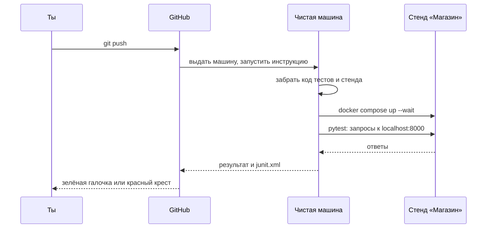
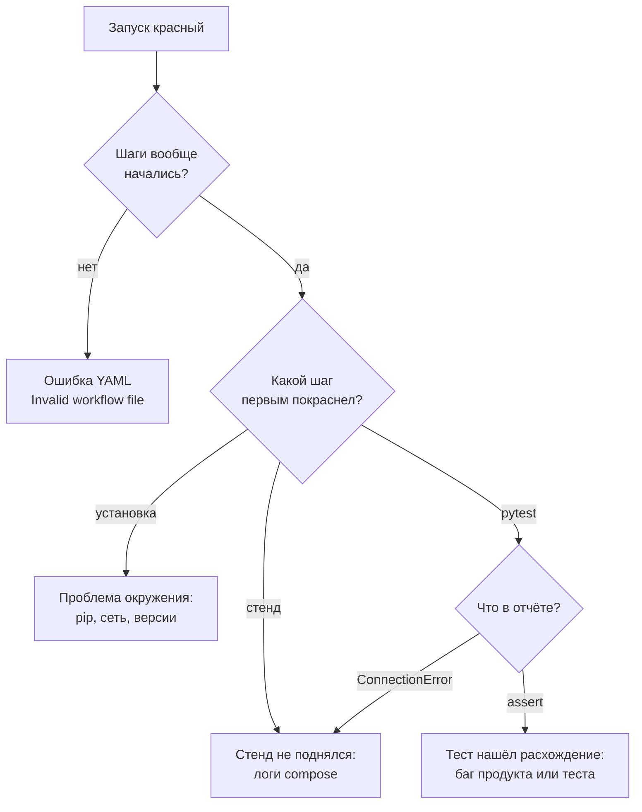

## Зачем это нужно

Я буду рядом с тобой весь курс, а начну с истории про себя. Перед одним релизом я прогнал тесты, увидел зелёное и отправил код коллеге. Через десять минут он написал: «У меня всё падает». На моём ноутбуке лежал забытый файл с настройками, без которого код не работал нигде, кроме моего компьютера. Тесты проверяли не код, а мой ноутбук.

С тех пор я не верю проверкам, которые человек запускает у себя на машине. Он забывает и торопится, а машина обрастает мусором. Твоя ситуация похожа: до распродажи нужно убедиться, что корзина и заказ работают, прежде чем их нагружать. Автотесты из [урока 6.2](02-api-autotests.md) у тебя уже есть, но пользы от них столько, сколько раз их запускают.

Решение называется **CI** (continuous integration, «непрерывная интеграция»). Это автоматика: при каждом изменении кода она сама берёт свежую копию, собирает чистое окружение, запускает проверки и показывает зелёную галочку или красный крест. У GitHub она зовётся GitHub Actions, и дальше мы разберём её по частям.

Для нагрузочного тестировщика у CI две задачи. Первая: стеречь собственные тесты, и через три минуты после правки видишь, остался ли набор зелёным. Вторая: краснеть при замедлении сервиса, короткий нагрузочный тест в CI ты добавишь в [теме 12](../12-process/index.md). Сегодня строим основу для обеих.

Шаг проекта: в `perf-lab` появится файл `.github/workflows/api-tests.yml`. При каждом `git push` GitHub поднимет на временной машине стенд «Магазин», прогонит тесты из `06-api-tests/`, сохранит отчёт `junit.xml` и покажет результат. В `README.md` появится бейдж («значок» со статусом `passing` или `failing`), а в конце ты намеренно сломаешь тест и научишься читать красный запуск.

## Что нужно знать

- Автотесты из [урока 6.2](02-api-autotests.md): папка `~/perf-lab/06-api-tests/` с `conftest.py`, `pytest.ini` и файлами `test_*.py`. Они запускаются командой `pytest` и берут адрес стенда из переменной `BASE_URL`.
- `git commit` и `git push`, репозиторий `perf-lab` на GitHub: [тема 3](../03-git/index.md) (уроки [3.1](../03-git/01-git-basics.md) и [3.2](../03-git/02-github.md)).
- Формат YAML (отступы, `ключ: значение`, списки с `-`) и `docker compose up -d --build --wait`: [урок 5.3](../05-docker/03-compose-shop.md).
- `requirements.txt` и виртуальное окружение: [урок 4.5](../04-python/05-venv-requests.md).


## Картина целиком

Представь издательство. Ты сдаёшь рукопись, и она попадает в чистую комнату, где нет твоих заметок и привычного кресла. Строгий проверяющий читает её по списку и отвечает: «принято» или «вот что не так». Потом комнату убирают, чтобы следующая рукопись не наткнулась на мусор. CI делает то же с кодом: комната это виртуальная машина, список это твой файл с инструкцией, вердикт это зелёный или красный цвет. Аналогия ломается в одном: издательский проверяющий читает после сдачи, а CI стартует сам и мгновенно, при каждом `push`.



Главное: стенд поднимается на той же машине, где работают тесты, поэтому они обращаются к `localhost:8000`, как на твоём ноутбуке.

Выбери, где сломать, и посмотри, что случится со шагами.

<div class="viz" data-viz="api-test-ci" data-fail="ok" data-title="Путь от git push до зелёной галочки"></div>

Десять шагов идут сверху вниз, время каждого справа. Самый долгий шаг это сборка стенда, тесты рядом с ним мелочь. Когда что-то падает, следующие шаги пропускаются, кроме помеченных особыми условиями: о них ниже.

## Теория

### Что происходит после git push

Ты нажал `git push` и пошёл за чаем. Что происходит за эти минуты на стороне GitHub?

Сначала GitHub заглядывает в папку `.github/workflows/`. Каждый YAML-файл в ней называется **workflow** («рабочий процесс»): это инструкция, что делать и когда. В файле стоит строка `on: push`, и такое «когда» называют **событием** (event).

Нашёл подходящий файл, и GitHub выдаёт **runner** («бегун»): временную виртуальную машину (компьютер внутри чужого сервера, который исчезает после работы) с Ubuntu, где уже стоят Git, Docker и Python. Машина одноразовая и после запуска исчезает. Поэтому она чистая, без твоих файлов и настроек, и в этом весь смысл CI.

Работа на машине делится на **шаги** (step). Шаг это либо команда оболочки (`run`), либо готовое **действие** (action, `uses`), которое кто-то уже написал: например, `actions/checkout` скачивает код репозитория. Шаги объединены в **job** («задачу»): это группа шагов, которая идёт на одной машине. У нас job будет одна. Если шаг вернул ненулевой код выхода (0 значит успех, [урок 6.2](02-api-autotests.md)), job останавливается и краснеет. Результат видно на вкладке **Actions**.

Осторожно: workflow и job путают. Workflow это файл целиком, job это блок внутри него. И ещё одно: runner чистый, твой код туда сам не попадает, его скачивает шаг `checkout`. 

> **Прикинь сам:** ты запушил коммит, а на вкладке Actions пусто. Назови две вероятные причины.
{: .predict}

Первая: файл лежит не там (`.github/workflow/` без «s») или у него не `.yml`/`.yaml`. Вторая: событие в `on:` не совпало с действием, например там только `pull_request`, а ты пушишь в ветку. Если файл не разбирается как YAML, GitHub покажет «Invalid workflow file» и номер строки.

> **Главное:** событие запускает workflow, GitHub выдаёт чистый runner, и тот выполняет шаги job по порядку.
{: .key}

Теперь посмотрим, как эта инструкция выглядит внутри.

### Как устроен файл workflow

Файл пишется для чужой машины, которая ничего о тебе не знает. Поэтому в нём всё сказано явно: когда запускать, где, что выполнить. Вот минимальный каркас:

```yaml
name: API-тесты Магазина        # название в интерфейсе
on:                              # когда запускать
  push:
  pull_request:
  workflow_dispatch:             # ещё и кнопка «Run workflow» вручную
permissions:
  contents: read                 # токен запуска может только читать код
jobs:
  api-tests:                     # имя job
    runs-on: ubuntu-latest       # на какой машине
    timeout-minutes: 20          # убить, если зависло
    steps:
      - name: Забрать код
        uses: actions/checkout@v5
      - name: Показать версию
        run: python3 --version
```

Здесь `push:` и `pull_request:` значат «любой push» и «любой pull request», а `workflow_dispatch:` добавляет кнопку ручного запуска. Блок `permissions: contents: read` ограничивает права «пропуска» (токена), который GitHub выдаёт запуску: тестам незачем писать в репозиторий, поэтому даём только чтение.

`runs-on` выбирает образ машины. `timeout-minutes: 20` нужен, потому что зависший шаг без него держал бы машину шесть часов. Каждый шаг в `steps:` начинается с `-`, а `name:` подписывает его. Запись `actions/checkout@v5` читается так: действие `checkout` из организации `actions`, версия 5. Версию пишут всегда: автор действия выпускает новые версии, и без номера твой запуск однажды изменится без тебя.

Главная ловушка YAML: **отступы это синтаксис**. Один лишний пробел, и шаг окажется внутри чужого блока. Теперь шаг с несколькими командами: многострочный блок начинается с `run: |` (черта значит «дальше текст в несколько строк»).

```yaml
      - name: Поднять стенд
        working-directory: stand/project/shop
        run: |
          cp .env.example .env
          docker compose up -d --build --wait --wait-timeout 300
```

`working-directory` задаёт папку для одного шага, как `cd` перед командой. Строки блока идут по очереди, и первая с ненулевым кодом останавливает шаг. Флаг `--wait-timeout 300` (секунды) не даёт ожиданию тянуться бесконечно.

Осторожно: каждый шаг `run:` стартует в новой оболочке. Переменная из `export` в следующем шаге пропадёт, а папка после `cd` вернётся к исходной.

> **Главное:** workflow это явная инструкция для чистой машины, где каждый шаг живёт в своей оболочке, а отступы и версии действий решают всё.
{: .key}

В примере мелькнула папка `stand/project/shop`. Откуда там стенд, если тесты лежат в другом репозитории?

### Два репозитория: тесты и стенд

Тесты лежат в твоём `perf-lab`, а стенд «Магазин» живёт в `distinguished-sre/load-tester`. Чтобы проверить стенд, машине нужны оба.

Шаг `actions/checkout` без параметров клонирует текущий репозиторий. С параметрами он клонирует любой доступный:

```yaml
      - name: Код тестов (perf-lab)
        uses: actions/checkout@v5
        with:
          persist-credentials: false
      - name: Код стенда (load-tester)
        uses: actions/checkout@v5
        with:
          repository: distinguished-sre/load-tester
          path: stand
          persist-credentials: false
```

`with:` передаёт параметры действию. `repository` говорит, какой репозиторий взять, а `path: stand` кладёт его в подпапку `stand/`, чтобы он не смешался с первым. `persist-credentials: false` не оставляет на диске токен доступа после клонирования: он дальше не нужен, а лишний токен это лишний риск. На машине получается такое дерево:

```text
/home/runner/work/perf-lab/perf-lab/     <- рабочая папка (код твоего perf-lab)
├── 06-api-tests/                        <- тесты
├── requirements.txt
└── stand/                               <- клон load-tester
    └── project/shop/                    <- стенд: compose.yaml, .env.example
```

Осторожно: какую версию стенда ты тестируешь? По умолчанию `checkout` берёт основную ветку (`main`), то есть всегда свежий стенд. Твои тесты могут упасть оттого, что стенд изменили, хотя ты ничего не пушил. Чтобы стенд не менялся, укажи `ref: <тег или коммит>` (ref это «метка», на какую версию кода встать).

> **Прикинь сам:** что будет, если убрать `path: stand`?
{: .predict}

Оба репозитория лягут в одну папку: второй `checkout` либо упадёт, либо перемешает файлы. `path` разводит их.

> **Главное:** два репозитория берут двумя шагами `checkout`, второй кладут в отдельную папку через `path`.
{: .key}

Код на машине есть. Остаётся поднять сам стенд.

### Стенд на чистой машине

Тесты API без работающего сервиса бесполезны, а на чистой машине стенда нет, значит, его поднимают в самом workflow.

На `ubuntu-latest` уже стоят Docker и Docker Compose, поэтому команды те же, что у тебя ([урок 5.3](../05-docker/03-compose-shop.md)):

```bash
cp .env.example .env
docker compose up -d --build --wait --wait-timeout 300
```

Сборка с нуля занимает пару минут: ни готовых слоёв образов, ни скачанных пакетов (урок 5.2) на новой машине нет. Флаг `--wait` держит команду, пока у всех сервисов с проверкой здоровья не появится статус «здоров». После этого `readyz` отвечает, а в базе уже лежат 10 000 товаров. Контейнеры публикуют порты на самой машине (`8000:8000`), и тест видит стенд по адресу `http://localhost:8000`, так что `BASE_URL` задавать не нужно.

Осторожно: профиль `monitoring` здесь не включай. Ресурсы у машины не безграничны, а каждый лишний контейнер удлиняет каждый запуск.

> **Проверь понимание:** на ноутбуке тесты зелёные, а в CI первый тест падает с `ConnectionError`. Куда смотреть?
>
> <details markdown="1">
> <summary>Ответ</summary>
>
> На шаг «Поднять стенд» и логи контейнеров (их печатает шаг с `if: failure()`): либо нет `--wait` и контейнеры не готовы, либо стенд упал. Если стенд в порядке, проверь `BASE_URL`.
> </details>

> **Главное:** на чистой машине стенд поднимают теми же командами, что дома, и обязательно с `--wait`, иначе тесты опередят готовность сервиса.
{: .key}

Но что делать, когда тесты упали? Шаги после упавшего пропускаются, а именно тогда нужны отчёт и логи.

### Условия шагов и артефакты

Просто так после упавшего шага остальные не запускаются. Но стенд надо убрать при любом исходе, а отчёт и логи нужны именно после падения. Для этого у шага есть условие `if:`.

Без условия шаг выполнится только после успешных предыдущих. `if: always()` запустит его всегда, и после успеха, и после падения. `if: failure()` запустит только тогда, когда какой-то предыдущий шаг упал.

Отчёт мы сохраним как **артефакт** (artifact): файл, который запуск оставляет на странице, чтобы его можно было скачать архивом. Для этого есть действие `actions/upload-artifact`. Три шага вместе:

```yaml
      - name: Прогнать тесты
        working-directory: 06-api-tests
        run: python -m pytest -v --junitxml=junit.xml

      - name: Сохранить отчёт pytest
        if: always()
        uses: actions/upload-artifact@v4
        with:
          name: junit-report
          path: 06-api-tests/junit.xml

      - name: Логи стенда при падении
        if: failure()
        working-directory: stand/project/shop
        run: docker compose logs --no-color --tail=200
```

Допустим, pytest упал с кодом 1. Сработают оба условных шага: отчёт уйдёт в артефакт, а в лог попадут последние 200 строк каждого контейнера (`--tail=200`, а `--no-color` убирает цветовые коды). Параметр `name` это имя артефакта, `path` путь к файлу на машине.

> **Прикинь сам:** шаг «Логи стенда» стоит без `if:`. Тесты упали. Что будет с шагом логов?
{: .predict}

Он будет пропущен: логи не появятся именно тогда, когда нужны. Лечится одной строкой `if: failure()`.

> **Главное:** `always()` для того, что нужно при любом исходе (отчёт, уборка), `failure()` для того, что нужно только после падения (логи).
{: .key}

Теперь у нас есть всё для диагностики. Осталось научиться её вести.

### Как читать красный запуск

Красный крест сам ничего не объясняет. Причину за пять минут находит тот, кто смотрит, где остановились шаги, а не тот, кто час «перезапускает и надеется».

Красный запуск почти всегда попадает в одну из четырёх категорий: YAML, окружение, стенд, тест. Различаются они по тому, что случилось с шагами:



Сначала смотрим, начались ли шаги, потом какой покраснел первым, и только затем читаем отчёт pytest. Из четырёх исходов схемы отчёт pytest нужен только в одном: `assert`.

На деле открой вкладку **Actions** и красный запуск. Найди **первый** красный шаг: остальные красные и серые после него это следствие. Пролистай его лог до первой ошибки, а не до конца, ведь в конце часто лежит лишь «Process completed with exit code 1». Для pytest читай строку с `>` и строки с `E`, как в 4.7 и 6.2, а для стенда шаг «Логи стенда при падении». В скачанном `junit-report` ищи `<failure>`.

Лог в CI это тот же вывод pytest, что ты видел в терминале. Переключи сценарий и найди первую строку с `E`:

<div class="viz" data-viz="api-test-report" data-fail="schema" data-title="Лог pytest в CI: поле переименовали"></div>

Упал один тест из четырнадцати, и по строке `E` ясно, почему: в ответе появилось `quantity`, а ждали `stock`. В CI ты увидишь ровно этот текст в логе шага «Прогнать тесты».

Теперь другой запуск: первые шаги зелёные, «Поднять стенд» красный, остальные серые, «Логи стенда» выполнен. Значит, тесты даже не начинались. Открываем лог стенда:

```text
shop-1  | psycopg_pool.PoolTimeout: couldn't get a connection after 60.00 sec
shop-1  | ... 
Error response from daemon: ... dependency failed to start: container shop-postgres-1 is unhealthy
```

Приложение не дождалось базы, а контейнер PostgreSQL не стал здоровым: проблема стенда или машины, не тестов. Нажми **Re-run jobs**, а при повторе ищи причину в логе PostgreSQL выше.

Осторожно: перезапуск вслепую. Если красный запуск позеленел сам, это нестабильный тест ([урок 6.2](02-api-autotests.md)): запиши, что упало, и разберись.

> **Главное:** сначала найди первый красный шаг и определи категорию (YAML, окружение, стенд, тест), и только потом читай детали.
{: .key}

Последний вопрос: как показать результат другим и сделать CI быстрым и надёжным?

### Бейдж, скорость и секреты

Результат нужен не только тебе. **Бейдж** (badge, значок статуса) в `README.md` показывает любому, кто открыл репозиторий, что тесты проходят: это часть портфолио ([урок 13.3](../13-final/03-portfolio-resume.md)). Но CI, который идёт двадцать минут и падает без причины, быстро учит всех игнорировать красный цвет.

GitHub рисует бейдж по адресу, который ты вставляешь в Markdown как картинку-ссылку:

```markdown
[](https://github.com/<логин>/perf-lab/actions/workflows/api-tests.yml)
```

`` вставляет картинку, обёртка `[...](адрес)` делает её ссылкой на страницу запусков. Состояний три: `passing` (последний запуск на основной ветке зелёный), `failing` (красный) и `no status` (запусков ещё не было). Бейдж отражает последний запуск именно этого workflow на основной ветке.

> **Прикинь сам:** бейдж зелёный, но сегодня ты запушил красный коммит в другую ветку. Почему бейдж не покраснел?
{: .predict}

Он показывает состояние основной ветки (`main`), а запуск на другой ветке туда не попадает, пока ветка не влита. Красный крест ты увидишь на вкладке Actions или в pull request.

Есть ещё приём, который пригодится позже. Представь: вчера кто-то поменял стенд, а твой репозиторий не менялся, и `push` не случился. Тесты молчат, хотя могли бы уже краснеть. Поэтому тесты запускают ещё и по расписанию:

```yaml
on:
  schedule:
    - cron: '0 3 * * *'    # каждую ночь в 03:00 UTC
```

Запись `cron` (формат расписания из пяти полей) читается как «каждый день в 03:00». Время по UTC, то есть по Гринвичу, а не по твоим часам. Расписание GitHub запускает только на основной ветке, а в публичном репозитории отключает после 60 дней без активности. Если два месяца ничего не менять, включи его заново на вкладке Actions.

Осторожно, секреты. В нашем workflow их нет: пароль пользователей учебного стенда открытый (`password`), а стенд живёт минуту на одноразовой машине. Но привычка нужна: **пароль, ключ, токен никогда не пишут в YAML и не коммитят**. Для них у GitHub есть раздел Secrets («Settings → Secrets and variables → Actions»). Значение берётся выражением `secrets.ИМЯ`, а в логах GitHub заменяет его звёздочками. И граница: нагрузку в CI мы запускаем только против стенда на самой машине. Чужие сайты и серверы нагружать нельзя ни из CI, ни откуда-то ещё.

> **Главное:** бейдж показывает состояние основной ветки, расписание ловит поломки со стороны стенда, а секреты живут в Secrets, а не в коде.
{: .key}

Вернёмся к распродаже. На вопрос менеджера «Корзина и заказ точно работают?» ты покажешь зелёный бейдж, а не «я вроде проверял».

## Практика

Условия: репозиторий `perf-lab` на GitHub публичный (урок [3.2](../03-git/02-github.md)), локально в `~/perf-lab` лежат `06-api-tests/` и `requirements.txt` в корне, тесты проходят командой `pytest` из папки `06-api-tests`. Если `requirements.txt` в корне нет или в нём нет pytest, поправь (шаг 1).

### 1. Проверь, что готово локально

```bash
cd ~/perf-lab
source .venv/bin/activate
cat requirements.txt
(cd 06-api-tests && pytest -q)
git status --short
```

Что делает: показывает список зависимостей, один раз прогоняет тесты (скобки `( ... )` выполняют `cd` во временной оболочке, и текущая папка не меняется) и показывает несохранённые изменения.

Ожидаемый вывод (версии у тебя могут быть шире):

```text
pytest==9.1.1
requests==2.34.2
.............................x                                        [100%]
29 passed, 1 xfailed in 7.1s
```

**Как читать вывод:** в `requirements.txt` должны быть и `pytest`, и `requests` с точными версиями: CI поставит ровно их. Тесты должны быть зелёными ещё до CI (с `slow`-тестом: набор целиком, без `-m`): иначе ты не отличишь поломку CI от красных тестов. `git status` лучше без изменений в `06-api-tests/`.

**Типичные ошибки:**

- В `requirements.txt` нет `pytest`: добавь `pytest==9.1.1`, проверь `pip install -r requirements.txt` и закоммить.
- `pip freeze` добавил в файл десяток зависимостей зависимостей: это нормально, оставь.

### 2. Создай workflow

```bash
mkdir -p .github/workflows
```

Создай файл `.github/workflows/api-tests.yml`:

```yaml
name: API-тесты Магазина

on:
  push:
  pull_request:
  workflow_dispatch:

permissions:
  contents: read

jobs:
  api-tests:
    runs-on: ubuntu-latest
    timeout-minutes: 20
    steps:
      - name: Код тестов (perf-lab)
        uses: actions/checkout@v5
        with:
          persist-credentials: false

      - name: Код стенда (load-tester)
        uses: actions/checkout@v5
        with:
          repository: distinguished-sre/load-tester
          path: stand
          persist-credentials: false

      - name: Python
        uses: actions/setup-python@v6
        with:
          python-version: '3.12'
          cache: pip

      - name: Зависимости
        run: python -m pip install -r requirements.txt

      - name: Поднять стенд
        working-directory: stand/project/shop
        run: |
          cp .env.example .env
          docker compose up -d --build --wait --wait-timeout 300
          curl --fail --silent http://localhost:8000/readyz

      - name: Прогнать тесты
        working-directory: 06-api-tests
        run: python -m pytest -v --junitxml=junit.xml

      - name: Сохранить отчёт pytest
        if: always()
        uses: actions/upload-artifact@v4
        with:
          name: junit-report
          path: 06-api-tests/junit.xml

      - name: Логи стенда при падении
        if: failure()
        working-directory: stand/project/shop
        run: docker compose logs --no-color --tail=200

      - name: Погасить стенд
        if: always()
        working-directory: stand/project/shop
        run: docker compose down -v
```

Про маркеры и `conftest.py`: шаг запуска выполняется с `working-directory: 06-api-tests`, а там лежат и `pytest.ini` (с `--strict-markers` и списком маркеров `smoke`, `negative`, `slow`), и `conftest.py`. Поэтому pytest в CI находит настройки и фикстуры так же, как у тебя в терминале, а опечатка в маркере обрушит шаг, как и локально. Тесты запускаются все, включая `slow`: CI не торопится. Если когда-нибудь понадобится быстрый предварительный шаг, добавь к команде `-m smoke`, остальное не меняется.

Разбор незнакомого. `cache: pip` включает кэш скачанных пакетов, ключом служит содержимое `requirements.txt`. `python -m pip` вызывает `pip` именно той версии Python, которую поставил предыдущий шаг. `curl --fail --silent .../readyz` после запуска стенда это контрольный выстрел: `--fail` делает ненулевой код выхода, если сервер ответил ошибкой, `--silent` убирает индикатор прогресса. `python -m pytest` запускает pytest как модуль, что гарантирует тот же Python с теми же пакетами.

Проверь отступы глазами: все шаги начинаются с `-` на одном уровне, а `name`, `uses`, `with` внутри шага на два пробела глубже.

**Типичные ошибки:**

- `Invalid workflow file ... You have an error in your yaml syntax on line 18`: лишний или недостающий пробел. Число в сообщении это номер строки: открой её и сравни отступ с соседней.
- Файл лежит в `.github/workflow/` (без «s»): GitHub его не увидит, запусков не будет.

### 3. Запушь и дождись запуска

```bash
git add .github requirements.txt
git commit -m "6.3: GitHub Actions: API-тесты Магазина на каждый push"
git push
```

Открой в браузере `https://github.com/<логин>/perf-lab/actions` (подставь свой логин). Вверху появится запуск с названием коммита и жёлтым кружком (идёт), через несколько минут зелёная галочка. Нажми на запуск, потом на job `api-tests` слева.

Ожидаемо в списке шагов (время у тебя будет другим):

```text
✓ Set up job                      2s
✓ Код тестов (perf-lab)           1s
✓ Код стенда (load-tester)        2s
✓ Python                          3s
✓ Зависимости                     5s
✓ Поднять стенд                2m 31s
✓ Прогнать тесты                  8s
✓ Сохранить отчёт pytest          1s
- Логи стенда при падении         0s
✓ Погасить стенд                  6s
✓ Complete job                    0s
```

**Как читать вывод:** зелёная галочка это шаг успешен. Строка с прочерком (скипнут) у шага логов нормальна: условие `failure()` не сработало. Самый долгий шаг это стенд (сборка образов с нуля), тесты занимают секунды. Раскрой «Прогнать тесты» и убедись, что в логе тот же вывод `pytest -v`, что и локально.

**Типичные ошибки:**

- Шаг «Поднять стенд» красный: `dependency failed to start`: раскрой лог выше и найди, какой контейнер нездоров. Сначала просто перезапусти запуск (**Re-run all jobs**): бывает сбой скачивания образа.
- Шаг тестов красный, `ConnectionError`: стенд не готов, проверь, что `--wait` стоит и `curl .../readyz` отработал.
- `Error: Unable to resolve action 'actions/checkout@v5'`: опечатка в имени или версии действия.

> Workflow красный, а строка с ошибкой в логе непонятна? Вставь нейросети свой `api-tests.yml` и текст упавшего шага, спроси, что значит ошибка. Проверь правку в ветке, а не в `main`: нейросети часто предлагают версии действий, которых нет, поэтому сверь `uses:` с репозиторием действия на GitHub.
{: .ai}

### 4. Скачай отчёт

Внизу страницы запуска, в разделе **Artifacts**, лежит `junit-report`. Скачай его и распакуй:

```bash
cd ~/Downloads
unzip -o junit-report.zip -d junit-report
head -c 500 junit-report/junit.xml
```

Ожидаемо:

```text
<?xml version="1.0" encoding="utf-8"?><testsuites name="pytest tests"><testsuite name="pytest" errors="0" failures="0" skipped="1" tests="30" time="8.214" ...
```

**Как читать вывод:** `tests="30"`, `failures="0"`. `skipped="1"` это `xfail`-тест про BUG-001 из [6.2](02-api-autotests.md). Если `unzip` не установлен: `sudo apt install unzip`.

### 5. Добавь бейдж

В начало `~/perf-lab/README.md` (после заголовка, если он есть) добавь строку, подставив свой логин:

```markdown
[](https://github.com/<логин>/perf-lab/actions/workflows/api-tests.yml)
```

```bash
cd ~/perf-lab
git add README.md
git commit -m "README: бейдж API-тестов"
git push
```

Открой страницу репозитория на GitHub: под заголовком должен появиться зелёный значок `passing`. Если пишет `no status`, подожди минуту и обнови: бейдж появляется после первого завершённого запуска на основной ветке.

### 6. Сломай тест намеренно и прочитай красный запуск

Это упражнение, а не часть проекта: сделаем отдельную ветку, чтобы не пачкать основную.

```bash
cd ~/perf-lab
git switch -c experiment/red-ci
```

В `06-api-tests/test_products.py` в тесте `test_size_in_range` замени `[1, 100]` на `[1, 101]` (ожидаем, что 101 теперь допустимо). Закоммить и запушь:

```bash
git commit -am "эксперимент: size=101 допустим (ломаем намеренно)"
git push -u origin experiment/red-ci
```

Открой Actions. Запуск станет красным. Пройди по алгоритму: первый красный шаг (должен быть «Прогнать тесты»), в его логе строка `FAILED test_products.py::test_size_in_range[101]`, в отчёте строка `E` с `KeyError: 'size'`: сервер на `size=101` вернул 422 с телом `{"detail": ...}`, и поля `size` в нём нет, а тест прочитал его без проверки кода. Хороший повод вспомнить из 6.2: тест, который сразу читает тело, падает странной ошибкой вместо понятного «ожидали 200». Проверь, что в разделе **Artifacts** появился `junit-report`, а шаг «Логи стенда при падении» выполнился (теперь он без прочерка).

Верни как было и закрой эксперимент:

```bash
git switch main
git branch -D experiment/red-ci
git push origin --delete experiment/red-ci
```

Бейдж на `main` всё это время оставался зелёным: он показывает состояние основной ветки.

## Сломай и почини

**Поломка 1: опечатка в YAML.** В `api-tests.yml` сдвинь строку `uses: actions/checkout@v5` одного из шагов на один пробел вправо, закоммить и запушь в ветку эксперимента. Запуск не начнётся вообще: на странице Actions появится запись «Invalid workflow file» (или красная плашка в самом файле) с номером строки. Сравни: ни одного шага не выполнено, а значит, причина в самом файле. Верни отступ.

**Поломка 2: забытый `always()`.** Убери `if: always()` у шага «Сохранить отчёт pytest» и повтори сценарий из шага 6. Запуск красный, но раздел Artifacts пуст: отчёт не сохранён именно тогда, когда нужен. Верни условие.

**Поломка 3: стенд не успевает.** Замени `--wait --wait-timeout 300` на просто `-d` (убрав `--wait`). Запуск (при невезении, а иногда и всегда) упадёт на первом же тесте с `ConnectionError`: контейнеры созданы, но «Магазин» ещё не готов. Диагностика по категории: стенд-шаг зелёный, тесты красные с ошибкой подключения, значит, виновата синхронизация. Верни `--wait`.

Не оставляй сломанное в `main`: все три упражнения делай в ветке `experiment/red-ci` и удаляй её (команды из шага 6).

## ИИ в помощь

Нейросеть хорошо читает логи Actions и объясняет YAML построчно, но версии действий и синтаксис шагов она нередко помнит устаревшими. Общие правила: [ИИ-помощник](../ai.md).

**Задача:** разобрать упавший запуск.

```text
GitHub Actions, workflow api-tests.yml на ubuntu-latest. Вот файл: <вставь api-tests.yml>.
Упал шаг «<имя шага>», вот его лог: <вставь последние 40 строк лога>.
Объясни, что означает ошибка, назови две вероятные причины и как отличить одну
от другой. Не переписывай весь файл, предложи минимальную правку.
```
{: .wrap}

**Проверь ответ:** внеси правку в отдельной ветке и запусти workflow. Типичные ошибки: несуществующая версия действия (`actions/checkout@v9`), отступы YAML, которые ломают структуру, и ключи не из того уровня (например, `run:` рядом с `uses:`). Проверь `uses:` на странице действия и отступы по образцу из урока.

**Задача:** понять незнакомый ключ workflow.

```text
Объясни простыми словами, что делает в GitHub Actions ключ <вставь ключ, например if: always()>
в моём шаге: <вставь шаг>. Когда он сработает, а когда нет? Пример, где он полезен для отчёта pytest.
```
{: .wrap}

**Проверь ответ:** найди ключ в документации GitHub Actions и проверь на деле: сломай тест и посмотри, загрузился ли отчёт.

В репозиторий и в чат не клади значения секретов: в workflow они живут в Secrets, а в запросе пиши `<секрет>`.

## Словарик урока

| Термин | Простыми словами |
|---|---|
| CI (continuous integration) | Автоматика, которая при каждом изменении сама проверяет код |
| GitHub Actions | Встроенный в GitHub сервис CI |
| Событие (event) | То, что запускает workflow: `push`, `pull_request`, расписание, ручной запуск |
| Workflow | YAML-файл в `.github/workflows/` с описанием, когда и что запускать |
| Job | Группа шагов, выполняемая на одной машине |
| Runner | Виртуальная машина, на которой идёт job (`ubuntu-latest`) |
| Шаг (step) | Одна команда (`run`) или готовое действие (`uses`) |
| Действие (action) | Готовый переиспользуемый шаг, например `actions/checkout` |
| Артефакт (artifact) | Файл, сохранённый запуском: отчёт, лог |
| `if: always()` | Условие шага: выполнить при любом исходе |
| `if: failure()` | Условие шага: выполнить, если что-то упало |
| Бейдж (badge) | Картинка-значок со статусом последнего запуска (`passing`, `failing`) |
| Секрет (secret) | Пароль или ключ, который хранят в настройках GitHub, а не в коде |
| Расписание (`cron`) | Запуск workflow в заданное время, по UTC |

## Вопросы с собеседований

Раздел для повторения: ответь вслух, потом открой ответ. Короткие вопросы тренируй на скорость: ответ за 30 секунд.

### 1. [junior] [часто] Что такое CI и зачем он нужен?

<details markdown="1">
<summary>Ответ</summary>

CI (непрерывная интеграция) это автоматический запуск проверок при каждом изменении кода на чистой машине. Он нужен, чтобы ловить поломки сразу, не зависеть от настроек чьего-то ноутбука («у меня работает») и не полагаться на то, что человек не забудет запустить тесты.

**Что хотят услышать:** автоматичность, чистое окружение, быстрая обратная связь.

**Красный флаг:** «CI это когда тесты запускаются на сервере» (без причин и последствий).

</details>

### 2. [junior] [часто] Из чего состоит workflow в GitHub Actions?

<details markdown="1">
<summary>Ответ</summary>

Файл YAML в `.github/workflows/`. В нём события (`on`), задачи (`jobs`), у каждой машина (`runs-on`) и список шагов (`steps`). Шаг это либо команда (`run`), либо готовое действие (`uses`).

**Что хотят услышать:** event, job, runner, step, action.

**Красный флаг:** путают workflow и job.

</details>

### 3. [junior] [часто] Тесты в CI упали, на ноутбуке проходят. С чего начнёшь?

<details markdown="1">
<summary>Ответ</summary>

Найду первый красный шаг и прочитаю его лог до первой ошибки. Сравню окружение: версии Python и библиотек, переменные (`BASE_URL`), состояние стенда, порядок тестов, данные. Помню, что runner чистый: в CI нет того, что накопилось у меня. Если стенд не поднялся, смотрю логи контейнеров, а не тестов.

**Что хотят услышать:** «первый красный шаг», сравнение окружения, чистая машина.

**Красный флаг:** «перезапущу, может, пройдёт».

</details>

### 4. [middle] Зачем нужен `if: always()`?

<details markdown="1">
<summary>Ответ</summary>

По умолчанию после упавшего шага остальные не выполняются. `always()` заставляет шаг выполниться при любом исходе: нужно, чтобы сохранить отчёт и убрать за собой именно после падения. `failure()` выполнит шаг только после падения (печать логов).

**Что хотят услышать:** пример шагов (отчёт, очистка, логи), разница `always` и `failure`.

**Красный флаг:** «чтобы шаг запускался быстрее».

</details>

### 5. [middle] Что такое артефакт и зачем сохранять `junit.xml`?

<details markdown="1">
<summary>Ответ</summary>

Артефакт это файл, который запуск сохраняет, чтобы его можно было скачать. `junit.xml` содержит результаты по каждому тесту; его читают инструменты отчётов, а человек может открыть, чтобы увидеть, что упало, даже если лог шага уже огромен. Сохраняют при любом исходе (`always()`).

**Что хотят услышать:** формат JUnit, смысл «при любом исходе».

**Красный флаг:** «артефакт это итоговая программа» (только сборка).

</details>

### 6. [middle] Как в CI протестировать сервис, живущий в другом репозитории?

<details markdown="1">
<summary>Ответ</summary>

Вторым шагом `actions/checkout` с параметрами `repository` и `path` клонировать репозиторий сервиса в подпапку, поднять его (например, `docker compose up --wait`) и запустить тесты против `localhost`. Версию сервиса фиксируют параметром `ref`, если нужна воспроизводимость.

**Что хотят услышать:** два `checkout`, `path`, ожидание готовности.

**Красный флаг:** «просто закопирую файлы руками в репозиторий».

</details>

### 7. [middle] Почему `--wait` важен при поднятии стенда?

<details markdown="1">
<summary>Ответ</summary>

Без него команда возвращается, когда контейнеры созданы, а приложение ещё не готово (миграции, подключение к базе). Тесты стартуют на неготовый сервис и падают нестабильно. `--wait` дожидается проверок здоровья, а `--wait-timeout` не даёт ждать бесконечно.

**Что хотят услышать:** гонка «создан против готов», healthcheck.

**Красный флаг:** «поставлю sleep 30».

</details>

### 8. [middle] Как не хранить пароли и ключи в репозитории при работе с CI?

<details markdown="1">
<summary>Ответ</summary>

Секреты кладут в настройки репозитория (Secrets) и берут в workflow через `secrets.ИМЯ`; GitHub маскирует их значения в логах. В коде и YAML секретов нет. Ограничивают права токена запуска (`permissions`). В учебном стенде пароли открытые и одноразовые, но привычка остаётся.

**Что хотят услышать:** Secrets, маскирование, наименьшие права.

**Красный флаг:** «зашифрую пароль в YAML base64».

</details>

### 9. [junior] Что показывает бейдж и чем он ограничен?

<details markdown="1">
<summary>Ответ</summary>

Статус последнего запуска конкретного workflow на основной ветке: `passing`, `failing` или `no status`. Он не показывает состояние других веток и не говорит, какие именно тесты покрыты: зелёный бейдж значит «то, что мы проверяем, проходит».

**Что хотят услышать:** основная ветка, три состояния, оговорка про покрытие.

**Красный флаг:** «зелёный бейдж значит, что багов нет».

</details>

### 10. [middle] Зачем тесты запускать ещё и по расписанию, а не только на push?

<details markdown="1">
<summary>Ответ</summary>

`push` срабатывает на изменения **моего** репозитория. Если меняется то, что я тестирую (чужой стенд, зависимость, образ), у меня ничего не запустится. Ночной запуск по `cron` ловит такие внешние изменения и «плавающие» поломки окружения.

**Что хотят услышать:** внешние зависимости, регресс со стороны сервиса.

**Красный флаг:** «расписание нужно, чтобы нагрузить CI».

</details>

### 11. [на скорость] Где хранятся файлы workflow?

<details markdown="1">
<summary>Ответ</summary>

В `.github/workflows/` в корне репозитория, расширение `.yml` или `.yaml`.

</details>

### 12. [на скорость] Как понять, какой шаг сломал запуск?

<details markdown="1">
<summary>Ответ</summary>

Найти первый красный шаг на странице job: остальные красные и серые следуют из него.

</details>

## Проверено на версиях

GitHub Actions: `actions/checkout@v5`, `actions/setup-python@v6`, `actions/upload-artifact@v4`, runner `ubuntu-latest` (Ubuntu 24.04, Docker Compose v2). Python 3.12, pytest 9.1.1, requests 2.34.2. Октябрь 2026. Версии действий проверь на странице действия в GitHub Marketplace, они обновляются.

## Итог урока: ты умеешь

- [ ] Объяснить, что такое CI, и назвать части GitHub Actions: событие, workflow, job, runner, шаг.
- [ ] Написать workflow, который клонирует два репозитория, ставит зависимости и поднимает стенд.
- [ ] Прогнать pytest в CI и сохранить `junit.xml` при любом исходе (`if: always()`).
- [ ] Прочитать красный запуск: найти первый красный шаг, различить ошибку YAML, окружения, стенда и теста.
- [ ] Добавить бейдж статуса в README.
- [ ] Объяснить, зачем нужны `--wait`, `timeout-minutes`, ограничение прав и запуск по расписанию.

Дальше: [тема 7. Метрики, логи, трейсы и алерты](../07-observability/index.md). Нагрузочный регресс в CI ты соберёшь в [уроке 12.2](../12-process/02-perf-ci.md).
