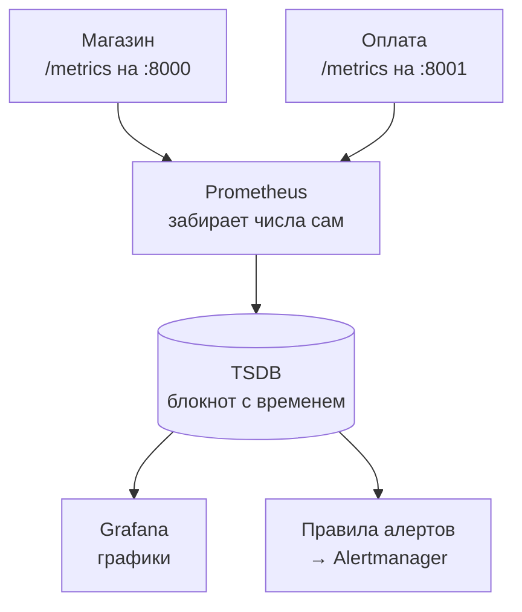
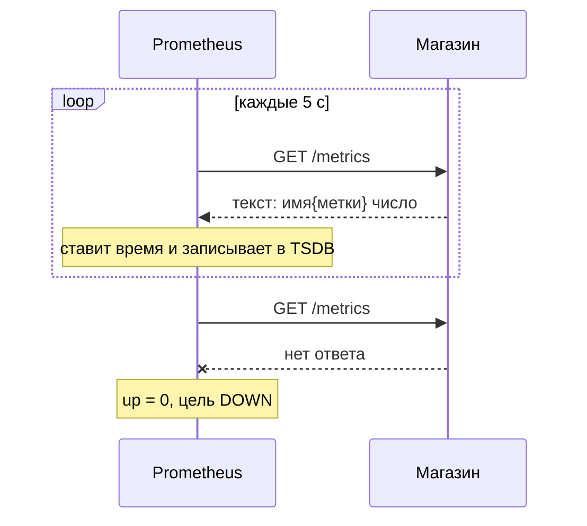

## Зачем это нужно

Нагрузочный тест без наблюдения похож на анализ крови без результатов: ты знаешь, что пациенту стало плохо, но не знаешь, что именно. Генератор нагрузки (Locust, k6) сообщает только то, что видит снаружи: «ответы стали медленными, пошли ошибки». Почему так случилось, он не скажет. Причина сидит внутри: закончились соединения с базой, процессор упёрся в потолок, оплата стала отвечать две секунды вместо пятидесяти миллисекунд. Увидеть это можно только если сервис сам рассказывает о своём состоянии, а кто-то это записывает.

**Метрика** (metric) это число, которое сервис сообщает о себе и которое записывается регулярно: сколько запросов обработано, сколько сейчас в работе, сколько соединений с базой свободно. Записанные во времени числа превращаются в график, а по графику видно, что и когда сломалось. **Prometheus** это программа, которая собирает такие числа с сервисов, хранит их и умеет отвечать на вопросы вроде «сколько запросов в секунду было вчера в три часа». Она стала стандартом в мониторинге: когда на собеседовании говорят «у нас есть метрики», почти всегда это означает Prometheus.

В этом уроке ты поднимешь Prometheus рядом со стендом «Магазин», посмотришь на «сырые» метрики сервиса глазами, разберёшь четыре типа метрик на настоящих примерах и поймёшь, почему неправильно выбранная метка может уронить сам мониторинг.

Шаг проекта: ты включаешь профиль мониторинга стенда (`--profile monitoring`), находишь все восемь целей Prometheus в состоянии «живые» и составляешь в `~/perf-lab/07-monitoring/metrics-catalog.md` каталог метрик «Магазина»: имя, тип, метки, что означает. Этот каталог пригодится в каждом следующем уроке темы и в теме 11, когда ты будешь искать узкие места.

## Что нужно знать

- Терминал, `curl` и `grep`: [урок 1.4](../01-linux/04-network-cli.md). Для разбора JSON-ответов используем `jq`, он установлен в [уроке 1.1](../01-linux/01-workstation-terminal.md).
- HTTP: метод, путь, код ответа 200 и 5xx, из чего состоит запрос: [урок 2.1](../02-web/01-client-server-http.md).
- Стенд «Магазин» запущен и отвечает на `localhost:8000`: [урок 2.1](../02-web/01-client-server-http.md), как он собран из контейнеров: [тема 5](../05-docker/index.md), команды `docker compose up -d` и `down`: [урок 5.3](../05-docker/03-compose-shop.md).
- Ничего о задержке и перцентилях знать заранее не нужно: ниже каждый термин объяснён с нуля, а подробный разбор будет в [уроке 8.1](../08-perf-theory/01-latency-throughput.md).

## Картина целиком

Возьми приборную панель автомобиля. Спидометр показывает скорость прямо сейчас, одометр складывает пройденные километры, указатель топлива показывает остаток. Сами датчики стоят в машине и всё время «знают» свои числа. Теперь добавь штурмана, который каждые пять секунд заглядывает на панель и записывает показания в блокнот с временем. Вечером по блокноту можно нарисовать график поездки: где разгонялись, где стояли в пробке, на каком километре начал падать уровень топлива.

В мониторинге те же роли. **Датчики** встроены в сам сервис: он считает свои запросы и ошибки и отдаёт числа по адресу `/metrics`. **Штурман** это Prometheus: он по расписанию заходит на `/metrics` каждого сервиса и записывает в блокнот (базу временных рядов). **Рисует график** уже другая программа, Grafana, она задаёт Prometheus вопросы на языке PromQL. Дежурному звонит четвёртая программа, Alertmanager, когда числа в блокноте выглядят опасно. Дальше в теме ты соберёшь всю цепочку.



На схеме стрелки от сервисов к Prometheus обозначают «Prometheus приходит и забирает», а не «сервис отправляет». Это ключевая особенность, её ты разберёшь в первом же разделе теории. Сервисы ничего не знают о Prometheus: они просто отдают текст по HTTP, как отдают любую страницу.

Три вещи, которые нужно унести из этой картины:

- метрика это число с именем, у которого есть **время**: само по себе «5 ошибок» ничего не значит, а «5 ошибок за минуту после выкладки» значит многое;
- метрики рассказывают, **что** происходит и **как много**, но не **почему именно этот запрос упал**: для этого есть логи (урок 7.5);
- чем больше разных меток, тем дороже хранить: мониторинг, как и сервис, имеет предел нагрузки.

## Теория

### Три источника правды: метрики, логи, трассы

**Зачем это существует.** Работающий сервис это «чёрный ящик». Пока всё хорошо, ты его не замечаешь, а когда стало плохо, понять причину без данных нельзя. Данные о работающем сервисе называют **наблюдаемостью** (observability): способность по тому, что сервис сообщает наружу, понять, что у него внутри. Она держится на трёх видах данных.

**Аналогия.** Представь больницу. **Метрики** это показания приборов у кровати: пульс, давление, температура, раз в минуту, одно число каждого вида. По ним видно тренд («температура растёт третий час»), но не видно, что съел пациент. **Логи** (logs) это записи медсестры: «14:05 дали лекарство, жалуется на головокружение»: каждое событие отдельно, с подробностями. **Трассы** (traces) это маршрутный лист пациента: из приёмного в рентген, оттуда в палату, на каждом этапе сколько ждал. Аналогия ломается в одном: приборы больницы стоят у одного пациента, а метрики сервиса складывают в одно число события от тысяч пользователей, поэтому по метрике нельзя разобрать судьбу одного запроса.

| | Метрики | Логи | Трассы |
|---|---|---|---|
| Что это | Числа во времени | Записи о событиях | Путь одного запроса по сервисам |
| Пример в «Магазине» | `http_requests_total` | JSON-строка «запрос завершён, статус 502, 2014 мс» | «заказ: магазин 2100 мс, из них оплата 2050 мс» |
| Отвечает на вопрос | Что происходит и сколько? | Что случилось с этим запросом? | Где потерялось время? |
| Размер | Маленький, не зависит от числа запросов | Растёт с каждым запросом | Дорого, обычно сохраняют долю |
| Где в курсе | Уроки 7.1–7.4 | Урок 7.5 | Только упоминание, трассы за рамками курса |

Для нагрузочного тестирования главные именно метрики: на тесте идут тысячи запросов в секунду, читать их по одному нельзя, а числа «в секунду», «в среднем» и «в 95% случаев» можно. Логи подключаются, когда метрика показала странное и нужно разобрать конкретный запрос.

**Что путают.** Метрику часто воспринимают как «ещё один вид логов». Разница в устройстве: лог это строка на каждое событие, и ста тысячам запросов соответствует сто тысяч строк. Метрика хранит одно число, которое при ста тысячах запросов просто стало больше. Поэтому метрики дешёвые, а потерять в них детали легко.

### Из чего состоит метрика: имя, метки, значение, время

**Зачем это существует.** Одного числа «ошибок 17» мало: ошибок где, каких, за какой период? Метрика должна быть описана так, чтобы по ней можно было задать вопрос и отфильтровать нужное. Для этого у неё есть имя и **метки** (labels): пары «ключ=значение», уточняющие, о чём именно число.

**Как это устроено.** Одна запись в Prometheus выглядит так:

```text
http_requests_total{method="GET", route="/api/products", status="200"}   1542   в момент 14:05:05
```

- `http_requests_total` это **имя метрики**: что считаем. По принятому правилу имя состоит из слов через подчёркивание и заканчивается единицей измерения или признаком типа (подробно ниже).
- `{method="GET", route="/api/products", status="200"}` это **метки**. Они делят общую метрику на отдельные числа: свой счёт у GET на `/api/products` с кодом 200, свой у POST на `/api/orders` с кодом 502.
- `1542` это **значение** на момент замера.
- Время замера Prometheus ставит сам, когда забрал число.

Набор «имя плюс все метки» называют **временным рядом** (time series, часто просто «серия»). Одна комбинация меток это одна серия, и у неё накапливается список пар «время, значение»: `(14:05:00, 1500)`, `(14:05:05, 1542)`, `(14:05:10, 1577)`. Именно эту таблицу Prometheus хранит и именно по ней строит графики. Две записи, в которых отличается хотя бы одна метка, это две разные серии.

Хранилище Prometheus называют **TSDB** (time series database, база временных рядов): она устроена так, чтобы быстро дописывать новые точки в конец серий и быстро читать их куском за период. По умолчанию данные живут 15 дней, потом удаляются. Для учебного стенда этого хватит с запасом.

**Разобранный пример.** Для «Магазина» запись `shop_db_pool_available 3.0` означает: «в пуле соединений с базой свободных 3 штуки». Меток нет, поэтому серия одна. Запись `shop_payment_requests_total{result="timeout"} 4.0` означает: «за всё время с запуска сервиса было 4 попытки оплаты, закончившиеся таймаутом».

**Что путают.** Метка это не «комментарий к значению», а часть **идентификатора**. Если сегодня ты поставишь метку `status="200"`, а завтра добавишь `version="2"`, то старая и новая серии станут разными, и график «разорвётся». Набор меток нужно продумать заранее.

**Проверь понимание:** сколько временных рядов в `http_requests_total`, если сервис получал запросы `GET /api/products` с кодами 200 и 500 и `POST /api/orders` с кодом 201?

<details markdown="1">
<summary>Ответ</summary>

Три: `{GET, /api/products, 200}`, `{GET, /api/products, 500}` и `{POST, /api/orders, 201}`. Каждая уникальная комбинация значений меток это отдельная серия. Для подсчёта серий метрики надо перемножить число значений каждой метки только для тех комбинаций, которые реально встречались, а не для всех возможных.

</details>

### Pull-модель: Prometheus сам приходит за числами

**Зачем это существует.** Есть два способа получить числа от сервиса. Первый (push, «толкать»): сервис сам отправляет их в хранилище, когда хочет. Второй (pull, «тянуть»): хранилище само приходит и забирает. Prometheus выбрал pull. Рассуждение такое: если сервис упал и молчит, при push непонятно, мёртв он или просто нечего сказать. При pull всё прозрачно: Prometheus пришёл, ответа нет, значит сервис недоступен, и это само по себе факт, который записывается.

**Аналогия.** Pull это как обход санитара с термометром: каждые пять секунд подходит к кровати и ставит градусник. Если пациент не отвечает, санитар записывает «не отвечает». Push это когда пациент сам должен прийти в процедурную и сообщить температуру: если не пришёл, непонятно, здоров он или потерял сознание. Аналогия ломается на скорости: Prometheus ходит по сотням «кроватей» за доли секунды.

**Как это устроено.** Одно обращение Prometheus к сервису называют **скрейпом** (scrape, «соскоб»). По шагам, в реальном порядке:

1. Каждые `scrape_interval` секунд (у нашего стенда 5) Prometheus делает HTTP-запрос `GET /metrics` на адрес сервиса.
2. Сервис отвечает обычным текстом: список строк «имя{метки} число».
3. Prometheus ставит на все полученные числа **одно общее время** (момент скрейпа) и дописывает их в серии.
4. Заодно Prometheus записывает собственную метрику `up` для этой цели: `1`, если скрейп удался, `0`, если нет (сервис недоступен, ответил ошибкой, не успел за таймаут).



Сервис не знает, кто и когда придёт. Он просто хранит у себя числа и отдаёт их по запросу. Если ответа нет, Prometheus не молчит, а записывает `up = 0`: по этому числу позже ты построишь алерт «сервис недоступен».

Слово «цель» (target) означает один адрес, с которого Prometheus собирает метрики: например, `shop:8000`. Группа однотипных целей называется **job** (задание): все экземпляры «Магазина» это job `shop`, а конкретный адрес внутри job это **instance**. Prometheus сам добавляет к каждой серии метки `job` и `instance`, поэтому в запросах можно писать `up{job="shop"}`.

Теперь важная тонкость, которую новички недооценивают: между скрейпами Prometheus ничего не видит. Он смотрит на сервис не непрерывно, а «снимками». Посмотри, как это влияет на разные метрики:

<div class="viz" data-viz="obs-scrape" data-interval="15"></div>

Смотри на виджет: два нижних графика построены по одним и тем же событиям. Верхний график (счётчик запросов) не теряет ничего: даже если замеры редкие, разница двух соседних замеров точно говорит, сколько запросов произошло между ними. А число запросов в работе (gauge) показывает только то, что было в момент замера: короткий всплеск, который случился между замерами, просто не виден. Отсюда практический вывод для нагрузочника: **для редких и коротких событий выбирай счётчики**, а на gauge смотри осторожно.

Из этого следует ещё одно: нельзя увидеть события, которые короче интервала скрейпа. Обычное значение интервала в боевых системах 15–30 секунд, на нашем стенде 5, чтобы графики быстрее реагировали на нагрузочный тест.

**Что путают.** «Prometheus собирает все метрики в реальном времени». На самом деле у каждой серии дырявая картина мира раз в `scrape_interval`. Второе заблуждение: «`/metrics` это что-то особенное». Нет, это обычный HTTP-путь, отвечающий текстом: ты можешь открыть его в браузере или вызвать `curl`.

### Формат /metrics: как выглядит текст

**Зачем это существует.** Формат намеренно простой, чтобы любой сервис на любом языке мог его выдать, даже скриптом из десяти строк. Библиотеки (`prometheus_client` для Python, которую использует «Магазин») делают это за тебя.

Вот выдержка из реального ответа `curl -s localhost:8000/metrics` после немного нагрузки:

```text
# HELP http_requests_total Запросы HTTP
# TYPE http_requests_total counter
http_requests_total{method="GET",route="/api/products",status="200"} 1542.0
http_requests_total{method="GET",route="/api/products/{id}",status="200"} 318.0
http_requests_total{method="GET",route="/api/products/{id}",status="404"} 6.0
# HELP http_requests_in_progress Запросы в работе
# TYPE http_requests_in_progress gauge
http_requests_in_progress 2.0
# HELP shop_db_pool_available Свободные соединения
# TYPE shop_db_pool_available gauge
shop_db_pool_available 3.0
# HELP http_request_duration_seconds Длительность HTTP
# TYPE http_request_duration_seconds histogram
http_request_duration_seconds_bucket{le="0.005",method="GET",route="/api/products"} 12.0
http_request_duration_seconds_bucket{le="0.01",method="GET",route="/api/products"} 233.0
http_request_duration_seconds_bucket{le="0.025",method="GET",route="/api/products"} 1301.0
http_request_duration_seconds_bucket{le="+Inf",method="GET",route="/api/products"} 1542.0
http_request_duration_seconds_sum{method="GET",route="/api/products"} 21.84
http_request_duration_seconds_count{method="GET",route="/api/products"} 1542.0
```

Как читать этот текст, строка за строкой:

- Строка на `# HELP` это человеческое описание метрики. Её пишет автор сервиса, Prometheus её не использует в вычислениях.
- Строка `# TYPE` объявляет **тип** метрики: `counter`, `gauge`, `histogram` или `summary`. Типы объяснены в следующем разделе.
- Остальные строки это сами данные: `имя{метки} значение`. Значение всегда число, в Python-библиотеке оно печатается с точкой (`1542.0`), это обычное число с плавающей точкой, а не «ошибка округления».
- Метка `le` у `_bucket` обозначает «меньше или равно» (less or equal). Подробно в разделе про гистограмму.
- В примере показаны не все 11 корзин ради краткости: на настоящем `/metrics` они есть все.

Ещё два замечания по этому конкретному `/metrics`:

1. Отсутствуют привычные метрики Python вроде `process_cpu_seconds_total`: «Магазин» работает в режиме нескольких воркеров (процессов-исполнителей Uvicorn, число задаёт `WEB_CONCURRENCY`), и библиотека суммирует метрики всех воркеров в один ответ. Поэтому `/metrics` показывает суммарную картину, а не отдельного воркера.
2. Метрики путей `/healthz`, `/readyz` и самого `/metrics` в HTTP-метрики не попадают: код стенда исключает их намеренно, чтобы проверки здоровья и скрейп Prometheus не искажали числа RPS.

### Четыре типа метрик

**Зачем это существует.** «Число» бывает разной природы. Количество обработанных запросов только растёт. Количество запросов, идущих прямо сейчас, то растёт, то падает. Время ответа вообще не одно число, а целое распределение. Если каждому виду выдать свой тип, Prometheus знает, как с ним правильно считать и какие операции допустимы.

#### Counter: счётчик, который только растёт

**Аналогия.** Одометр автомобиля: показывает пройденные километры за всё время жизни машины. Он только растёт, назад его не открутить. Чтобы узнать скорость, надо сравнить два показания одометра и поделить на время между ними.

**Как устроено.** Counter хранит одно число, которое только увеличивается (при перезапуске сервиса оно обнуляется). Сами по себе большие значения ничего не говорят: «обработано 1 542 000 запросов» ничего не сообщает о нагрузке. Полезна **скорость роста**: сколько прибавилось за секунду. Функция `rate()` из следующего урока делает именно это. По соглашению имена счётчиков заканчиваются на `_total`.

**Примеры «Магазина»:** `http_requests_total{method,route,status}`, `shop_orders_created_total`, `shop_cache_requests_total{result}`, `shop_payment_requests_total{result}`.

**Что путают.** Новичок строит график `http_requests_total` и видит ровную лестницу вверх: «нагрузка растёт». Это не нагрузка, а накопленный итог. Нагрузка это скорость подъёма лестницы. Второе: перезапуск сервиса обнуляет счётчик, и график падает в ноль. Это нормальное поведение, `rate()` его учитывает.

#### Gauge: стрелка, которая ходит вверх и вниз

**Аналогия.** Указатель уровня топлива или спидометр: показывает «сколько сейчас», значение свободно растёт и падает.

**Как устроено.** Gauge хранит текущее значение и может его и увеличивать, и уменьшать. Скорость роста ему не нужна, на графике смотрят само значение: больше, меньше, выросло ли. Все ограничения связаны с «снимками»: Prometheus видит gauge только в моменты скрейпа (вспомни виджет выше).

**Примеры «Магазина»:** `http_requests_in_progress` (запросов в работе прямо сейчас), `shop_db_pool_size` (сколько всего соединений в пуле), `shop_db_pool_available` (сколько из них свободно), `shop_db_pool_waiting` (сколько запросов ждут соединение). **Пул соединений** (connection pool) это набор заранее открытых соединений с базой: открывать новое на каждый запрос дорого, поэтому сервис держит несколько открытых и выдаёт запросам по очереди. Если свободных нет, запрос ждёт: это ровно то, что показывает `shop_db_pool_waiting`.

**Что путают.** Для чего-то, что считает события («сколько заказов было»), берут gauge. Тогда при перезапуске или потере скрейпа история теряется, а «сколько за последнюю минуту» посчитать нельзя. Правило: **считаешь события, нужен counter; меряешь текущее состояние, нужен gauge**.

#### Histogram: распределение по корзинам

**Зачем это существует.** Сколько длится запрос? Одного числа мало, и среднее врёт (подробно в [уроке 8.1](../08-perf-theory/01-latency-throughput.md)): надо знать, сколько запросов ответили быстро, сколько медленно, и насколько. Хранить время каждого запроса нельзя: их миллионы. Histogram решает задачу хитро: он заранее делит время на **корзины** (buckets) и просто считает, сколько запросов уложилось в каждую корзину.

**Аналогия.** Почтовый индекс не называет точный адрес, а относит письмо к району. Сортировка по районам даёт распределение писем без хранения самих писем. Аналогия ломается в том, что корзины гистограммы **накопительные**: каждая следующая включает предыдущие.

**Как устроено.** У «Магазина» границы корзин заданы в коде: 0.005, 0.01, 0.025, 0.05, 0.1, 0.25, 0.5, 1, 2.5, 5, 10 секунд. Каждая корзина это отдельный счётчик с меткой `le` («меньше или равно»): `le="0.1"` считает все запросы, которые ответили за 100 мс **или быстрее**. Поэтому счётчики идут вверх по `le`: в `le="1"` входят все из `le="0.5"`, `le="0.25"` и т.д. Последняя корзина `le="+Inf"` («до бесконечности») считает **вообще все** запросы. Рядом лежат два служебных счётчика: `_count` (всего запросов, равно `le="+Inf"`) и `_sum` (суммарное время всех запросов, секунд).

**Разобранный пример.** Возьми реальные числа из выдержки выше и пересчитай сам:

```text
le="0.005"   12      → 12 запросов были не медленнее 5 мс
le="0.01"    233     → 233 запроса не медленнее 10 мс (то есть 233 - 12 = 221 были в диапазоне 5–10 мс)
le="0.025"   1301    → 1301 не медленнее 25 мс (в диапазоне 10–25 мс: 1301 - 233 = 1068)
le="+Inf"    1542    → всего запросов (_count тоже 1542)
_sum         21.84   → суммарное время 21.84 секунды
```

Среднее время ответа = `_sum / _count` = 21.84 / 1542 = 0.0142 с, то есть 14,2 мс. А доля запросов не медленнее 25 мс = 1301 / 1542 = 84%. Видно, что 241 запрос (1542 - 1301) медленнее 25 мс, при этом среднее всего 14 мс. Именно такие хвосты прячет среднее. Как из этих корзин получить перцентили (p95, p99), ты разберёшь в уроке 7.2.

**Что путают.** Первое: корзины накопительные, а не «сколько в каждом диапазоне». Второе: границы корзин нельзя поменять задним числом, их задаёт код при запуске. Если реальные запросы все медленнее 10 секунд, перцентиль окажется «больше 10 с» и точнее сказать невозможно. Третье: корзины стоят много памяти, потому что **каждая корзина это отдельная серия** (см. кардинальность ниже).

#### Summary: перцентили, посчитанные в самом сервисе

Summary похож на histogram, но перцентили (например, p95 и p99) вычисляет сам сервис и отдаёт готовыми числами `{quantile="0.95"}`. Минус в том, что готовые перцентили нельзя корректно объединить: p95 двух серверов не равен p95 всего кластера. Поэтому в современных системах предпочитают histogram, а summary встречается редко. В «Магазине» summary не используется, но на собеседовании про него спросят: запомни, что главное отличие это **где считается перцентиль** (в сервисе или в Prometheus) и **можно ли агрегировать** (histogram можно, summary нет).

#### Сводка по типам

| Тип | Что хранит | Меняется | Что смотреть | Пример в «Магазине» |
|---|---|---|---|---|
| counter | Накопленное число событий | Только растёт (обнуляется при рестарте) | Скорость роста: `rate()` | `http_requests_total` |
| gauge | Текущее значение | Вверх и вниз | Само значение | `shop_db_pool_available` |
| histogram | Счётчики по корзинам времени | Все корзины только растут | `histogram_quantile()` | `http_request_duration_seconds` |
| summary | Готовые перцентили | Пересчитываются в сервисе | Само значение, нельзя агрегировать | нет |

**Проверь понимание:** метрика `shop_orders_created_total` показывает 840, потом после перезапуска сервиса 0, потом 25. Это ошибка в метрике? А метрика `shop_db_pool_waiting` вдруг показывает 0 после 5? Что здесь нормально?

<details markdown="1">
<summary>Ответ</summary>

Для counter падение до нуля при перезапуске нормально: процесс начал считать заново. Prometheus (через `rate()`) распознаёт такой «сброс» и не считает его отрицательным ростом. Для gauge `shop_db_pool_waiting` падение с 5 до 0 это обычное поведение: очередь за соединениями рассосалась. Gauge и должен ходить вверх и вниз.

</details>

### Метки и кардинальность

**Зачем это существует.** Метки превращают одну метрику в семейство: можно посмотреть RPS всего «Магазина» и тут же отдельно по маршруту. Но у меток есть цена, и о ней нужно знать до того, как положишь в метку что-то опасное.

**Как это устроено.** Каждая уникальная комбинация значений меток это отдельная серия, и Prometheus хранит каждую отдельно (память, диск, время на запросы). Число серий метрики называют **кардинальностью** (cardinality). Оно растёт перемножением. У `http_requests_total` три метки:

- `method`: GET, POST, DELETE → до 3 значений;
- `route`: около 13 шаблонов маршрутов и значение `other` → 14;
- `status`: 200, 201, 204, 400, 401, 404, 409, 422, 502, 503, 504 → 11.

Теоретический максимум 3 × 14 × 11 = 462 серий. На практике комбинаций гораздо меньше: GET на `/api/orders` с кодом 204 никогда не бывает. Prometheus заводит серию только когда событие **впервые произошло**: пока ни один запрос не вернул 503, серии со `status="503"` нет вообще. Поэтому в нулевом состоянии стенда запрос `http_requests_total` может вернуть пустой ответ, и это не поломка: просто ещё ничего не было.

С гистограммой всё серьёзнее. У `http_request_duration_seconds` две метки (`method`, `route`), но каждая комбинация даёт 11 корзин плюс `+Inf` плюс `_sum` плюс `_count`: 14 серий. При 10 живых парах «метод + маршрут» это 140 серий **только на задержку**. Вот как это выглядит для метрик «Магазина» после типичного теста (числа примерные, у тебя будут свои):

<div class="viz" data-viz="chart" data-type="bar" data-title="Сколько серий занимает метрика" data-x="duration,requests,db_wait,pay_dur,cache,pool" data-series='[{"name":"серий","values":[140,12,14,14,2,3]}]' data-x-label="метрика (сокращённо)" data-y-label="серий" data-explain="Расшифровка: duration это http_request_duration_seconds, requests это http_requests_total, db_wait это shop_db_connection_wait_seconds, pay_dur это shop_payment_duration_seconds, cache это shop_cache_requests_total, pool это три gauge пула. Одна гистограмма задержки с метками занимает в десять раз больше места, чем счётчик запросов с теми же метками."></div>

**Правило выбора меток.** Метка должна иметь **небольшое, ограниченное** число значений: метод, шаблон маршрута, код ответа, результат оплаты (`ok`, `error`, `timeout`). Никогда нельзя класть в метки то, что неограниченно: `user_id`, `order_id`, `request_id`, полный URL с числами, текст ошибки. Посмотри, как это решено в «Магазине»: в метке `route` стоит не реальный путь `/api/products/42`, а **шаблон** `/api/products/{id}`: все десять тысяч товаров попадают в одну серию. Неизвестные пути вроде `/wp-admin.php` или `/api/nope` объединены под значением `other`: иначе бот, перебирающий случайные адреса, создал бы миллионы серий и уронил Prometheus. Это называют **взрывом кардинальности** (cardinality explosion): число серий растёт без границы, память кончается, мониторинг падает именно тогда, когда он нужнее всего.

Подробности про конкретного пользователя или заказ живут в **логах** (там есть `user_id` и `request_id`, урок 7.5), а метрики остаются агрегатами.

**Что путают.** «Добавлю метку `user_id`, чтобы видеть, кто нагружает» (миллион серий). И обратное: «слишком много меток вредно, оставлю одну» (потом нельзя разделить по статусу). Золотая середина: метки, по которым ты действительно будешь делить график и у которых мало значений.

### Именование и единицы

Prometheus не знает, в чём измерено число: он хранит просто число. Чтобы не путаться, существует договорённость, которой следует «Магазин»:

- имена в `snake_case` с префиксом приложения (`shop_`, `payment_`) для собственных метрик;
- единицы только **базовые**: секунды, байты, а не миллисекунды и мегабайты (`http_request_duration_seconds`, а не `_ms`). Переводить в удобные единицы будешь в Grafana на этапе показа;
- счётчики заканчиваются на `_total`, гистограммы на единицу измерения, gauge без суффикса.

Если увидишь в запросе `0.25` и забудешь, что это секунды, график «250 секунд» собьёт тебя с толку. Всегда смотри на единицу в имени.

### Конфигурация Prometheus стенда

Prometheus настраивается одним YAML-файлом. Вот полный `prometheus.yml` стенда (путь `~/load-tester/project/shop/monitoring/prometheus/prometheus.yml`), разбор по частям:

```yaml
global:
  scrape_interval: 5s
  evaluation_interval: 5s
rule_files:
  - /etc/prometheus/rules/alerts.yml
alerting:
  alertmanagers:
    - static_configs:
        - targets: ["alertmanager:9093"]
scrape_configs:
  - job_name: shop
    static_configs: [{targets: ["shop:8000"]}]
  - job_name: payment
    static_configs: [{targets: ["payment:8001"]}]
  # ... node, cadvisor, postgres, prometheus, alertmanager, alloy
```

- `global.scrape_interval: 5s`: как часто ходить за метриками (по умолчанию в Prometheus 1 минута, у стенда 5 секунд, чтобы графики быстро реагировали на тест).
- `evaluation_interval: 5s`: как часто проверять правила алертов. Их разбираешь в уроке 7.6, а `rule_files` указывает, где они лежат.
- `alerting`: куда отправлять сработавшие алерты (Alertmanager, 7.6).
- `scrape_configs`: список заданий (job). `job_name: shop` и `targets: ["shop:8000"]` означают: ходи на `http://shop:8000/metrics`. Имя `shop` здесь это имя контейнера в сети Docker Compose: внутри сети контейнеры видят друг друга по именам сервисов. Путь `/metrics` подразумевается по умолчанию.
- Остальные задания (`node`, `cadvisor`, `postgres`) подключают экспортеры: программы, которые превращают состояние хоста, контейнеров и PostgreSQL в метрики. Их разбирает урок 7.4, а `prometheus`, `alertmanager` и `alloy` это собственные метрики самих инструментов.

В итоге у стенда **восемь целей**. Именно это число проверяет CI курса, и именно его ты проверишь в практике.

## Практика

Все файлы урока складывай в `~/perf-lab/07-monitoring/`. Нагрузку даём только на свой стенд.

### 1. Включи профиль мониторинга

Стенд из темы 2 включал только сам «Магазин» с базой. Мониторинг оформлен как **профиль** (profile) Docker Compose: набор дополнительных сервисов, которые не стартуют без явной просьбы. Включаются они флагом `--profile monitoring`.

```bash
mkdir -p ~/perf-lab/07-monitoring
cd ~/load-tester/project/shop
docker compose --profile monitoring up -d --wait --wait-timeout 300
```

Разбор команды:

- `docker compose` это управление набором контейнеров, описанных в `compose.yaml` ([урок 5.3](../05-docker/03-compose-shop.md));
- `--profile monitoring` добавляет к стартующим сервисам те, что помечены `profiles: [monitoring]`: Prometheus, Alertmanager, Grafana, Loki, Alloy и экспортеры;
- `up -d` запускает в фоне, `--wait` ждёт, пока у всех контейнеров пройдёт проверка здоровья (healthcheck), `--wait-timeout 300` не ждёт дольше пяти минут.

Одна оговорка про настройки самого Prometheus: в `compose.yaml` ему передан флаг `--web.enable-remote-write-receiver`. Он разрешает **принимать** метрики по запросу извне (remote write), а не только забирать их скрейпом. Флаг нужен в теме 10: k6 будет присылать свои метрики теста именно так. Порт 9090 на учебном стенде открыт на все интерфейсы машины, поэтому в чужой сети не оставляй стенд включённым.

Первый запуск скачает образы и займёт несколько минут. Когда команда вернула управление, проверь:


```bash
docker compose --profile monitoring ps --format 'table {{.Service}}\t{{.Status}}'
```


```text
SERVICE             STATUS
alertmanager        Up 40 seconds
alloy               Up 40 seconds
cadvisor            Up 40 seconds (healthy)
grafana             Up 40 seconds
loki                Up 40 seconds
node-exporter       Up 40 seconds
payment             Up 55 seconds (healthy)
postgres            Up 55 seconds (healthy)
postgres-exporter   Up 40 seconds
prometheus          Up 40 seconds
redis               Up 55 seconds (healthy)
shop                Up 50 seconds (healthy)
```

**Как читать вывод:** в колонке `STATUS` ищи слова `Up`. У части сервисов нет `(healthy)`: у них не задана проверка здоровья, это нормально. Если какого-то сервиса нет в списке или написано `Restarting` или `Exited`, открой логи: `docker compose --profile monitoring logs prometheus`.

**Типичные ошибки:**

- `port is already allocated` (порт занят): на машине уже что-то слушает 9090 или 3000. Найди владельца: `ss -ltnp | grep -E ':9090|:3000'` и останови его.
- `no configuration file provided`: ты не в каталоге `~/load-tester/project/shop`.
- Prometheus запустился, но в цели `shop` ошибка: подожди 30 секунд, пока `shop` станет здоровым.

### 2. Прочитай /metrics глазами

Сначала создай немного событий, чтобы метрики не были пустыми:

```bash
for i in $(seq 1 30); do curl -s -o /dev/null localhost:8000/api/products; done
curl -s -o /dev/null localhost:8000/api/products/42
curl -s -o /dev/null localhost:8000/api/products/999999
curl -s -o /dev/null localhost:8000/api/no-such-path
```

Разбор: цикл `for i in $(seq 1 30)` повторяет `curl` тридцать раз; `-s` убирает индикатор загрузки, `-o /dev/null` выбрасывает тело ответа, нам важен только факт запроса. Последние три команды создают успешный запрос, 404 на несуществующий товар и запрос на неизвестный путь (он попадёт в `route="other"`).

```bash
curl -s localhost:8000/metrics | grep '^http_requests_total'
```

```text
http_requests_total{method="GET",route="/api/products",status="200"} 30.0
http_requests_total{method="GET",route="/api/products/{id}",status="200"} 1.0
http_requests_total{method="GET",route="/api/products/{id}",status="404"} 1.0
http_requests_total{method="GET",route="other",status="404"} 1.0
```

Разбор: `grep '^http_requests_total'` оставляет строки, которые **начинаются** с имени метрики (`^` означает «начало строки»), и отбрасывает `# HELP` и `# TYPE`.

**Как читать вывод:** посмотри на путь `/api/products/42` и `/api/products/999999`: оба превратились в один и тот же `route="/api/products/{id}"`, это шаблон, о котором шла речь в разделе про кардинальность. Единица в конце строки с `status="404"` это тот самый запрос на несуществующий товар. А запрос на `/api/no-such-path` ушёл в `route="other"`. Если у тебя числа другие (ты запускал тесты раньше), главное, чтобы набор меток совпадал.

Теперь посмотри объявления типов:

```bash
curl -s localhost:8000/metrics | grep '^# TYPE'
```

```text
# TYPE http_requests_total counter
# TYPE http_request_duration_seconds histogram
# TYPE http_requests_in_progress gauge
# TYPE shop_db_pool_size gauge
# TYPE shop_db_pool_available gauge
# TYPE shop_db_pool_waiting gauge
# TYPE shop_db_connection_wait_seconds histogram
# TYPE shop_cache_requests_total counter
# TYPE shop_orders_created_total counter
# TYPE shop_payment_requests_total counter
# TYPE shop_payment_duration_seconds histogram
```

Порядок строк у тебя может отличаться, а некоторых метрик нет, пока не было событий (например, `shop_orders_created_total` появится после первого заказа). Для метрик с метками, пока не было события, строк `TYPE` может не быть вовсе.

### 3. Найди цели в UI Prometheus

Открой в браузере `http://localhost:9090/targets`, или в меню Prometheus «Status → Target health». Ты увидишь таблицу, сгруппированную по job. Если окно показывает строку «State: UP» зелёным у всех восьми целей, всё хорошо.

То же самое в терминале, чтобы не зависеть от интерфейса:

```bash
curl -s localhost:9090/api/v1/targets \
  | jq -r '.data.activeTargets[] | "\(.labels.job)\t\(.health)\t\(.scrapeUrl)"' | sort
```

Разбор: Prometheus отвечает на `/api/v1/targets` JSON-ом; `jq -r` вытаскивает из каждой активной цели название job, здоровье (`up` или `down`) и адрес скрейпа; `sort` упорядочивает по алфавиту.

```text
alertmanager	up	http://alertmanager:9093/metrics
alloy	up	http://alloy:12345/metrics
cadvisor	up	http://cadvisor:8080/metrics
node	up	http://node-exporter:9100/metrics
payment	up	http://payment:8001/metrics
postgres	up	http://postgres-exporter:9187/metrics
prometheus	up	http://prometheus:9090/metrics
shop	up	http://shop:8000/metrics
```

**Как читать вывод:** восемь строк, все `up`. Адреса используют имена контейнеров, а не `localhost`, потому что Prometheus сам работает внутри сети Docker. Правило: **«localhost» внутри контейнера это сам контейнер**, а не твой ноутбук. Если цель `down`, смотри колонку «Error»: там будет причина.

### 4. Первые запросы в Prometheus

Открой `http://localhost:9090/query`. В строку запроса вводи по очереди выражения и нажимай **Execute**. Результат показывается во вкладке **Table** (значения «сейчас») или **Graph** (во времени).

```promql
up
```

Вернёт 8 серий: по одной на цель, у каждой метки `instance` и `job`, значение 1. Это «сердцебиение» мониторинга.

```promql
http_requests_total
```

Список серий счётчика, как в `/metrics`, только с добавленными метками `instance="shop:8000"` и `job="shop"`.

```promql
http_requests_in_progress
```

Единственное число (серия без меток, кроме `instance` и `job`). Если генератора нагрузки сейчас нет, значение близко к нулю.

```promql
count({job="shop"})
```

Сколько **всего серий** у Prometheus от «Магазина». Это общее число серий твоей кардинальности. `{job="shop"}` без имени метрики выбирает все серии этого job, `count(...)` считает их.

```promql
count by (__name__) ({job="shop"})
```

Сколько серий у каждой метрики: `__name__` это служебная метка, в которой хранится имя метрики. Должно быть видно, что у гистограммы `http_request_duration_seconds_bucket` рядов в разы больше, чем у остальных. Посмотри на график в таблице и сверь с графиком в теории выше.

Если на вкладке **Graph** ничего нет, поставь диапазон «Last 15m» и подожди минуту: сначала нужны хотя бы две точки.

**Типичные ошибки:**

- `parse error: unexpected ...`: в выражении опечатка, например забыта закрывающая скобка или кавычка. Prometheus показывает позицию ошибки.
- `Empty query result` для `http_requests_total`: ни один запрос ещё не обработан. Выполни команды цикла `curl` из шага 2.
- Для `shop_orders_created_total` пустой результат тоже нормален: заказов ещё не было (серия появляется после первого события).

### 5. Составь каталог метрик

Теперь собери то, что узнал, в файл. Заготовка `~/perf-lab/07-monitoring/metrics-catalog.md`:

```markdown
# Каталог метрик «Магазина»

| Метрика | Тип | Метки | Что значит | Единица |
|---|---|---|---|---|
| http_requests_total | counter | method, route, status | Обработано HTTP-запросов | штук |
| http_requests_in_progress | gauge | (нет) | Запросов в работе сейчас | штук |
| http_request_duration_seconds | histogram | method, route | Время обработки запроса | секунды |
| shop_db_pool_size | gauge | | Соединений в пуле БД | штук |
| shop_db_pool_available | gauge | | Свободных соединений | штук |
| shop_db_pool_waiting | gauge | | Запросов ждёт соединение | штук |
| shop_db_connection_wait_seconds | histogram | | | секунды |
| shop_cache_requests_total | counter | result (hit, miss) | | |
| shop_orders_created_total | counter | | | |
| shop_payment_requests_total | counter | result (ok, error, timeout) | | |
| shop_payment_duration_seconds | histogram | | | |
```

Первые строки заполнены, остальные допиши сам. Чтобы не гадать, как работает `shop_db_connection_wait_seconds` или `shop_payment_duration_seconds`, найди их в `/metrics`, посмотри `# HELP` и тип. В колонке «Что значит» формулируй своими словами, опираясь на `HELP` и на разбор в этом уроке. Дополнительно допиши в конец файла раздел:

```markdown
## Что я проверил руками

- Количество целей Prometheus: 8, все up.
- `count({job="shop"})` вернул: ____ серий.
- Какая метрика занимает больше всего серий и почему: ____
```

Подставь реальные числа из своего стенда. Если ты уже прошёл тему 3, закоммить:

```bash
cd ~/perf-lab && git add 07-monitoring && git commit -m "7.1: каталог метрик Магазина" && git push
```

## Сломай и почини

**Поломка 1. Магазин пропал.** Остановим сервис и посмотрим, как это увидит мониторинг.

```bash
cd ~/load-tester/project/shop
docker compose stop shop
```

Подожди 10–15 секунд, потом в Prometheus выполни:

```promql
up{job="shop"}
```

**Задача:** без подсказок выясни, что показывает мониторинг, и найди причину в `http://localhost:9090/targets`.

<div class="viz" data-viz="flow" data-steps='[{"title":"Что показывает `up`","text":"Значение 1 или 0 для `job=\"shop\"`."},{"title":"Что говорит страница targets","text":"Состояние и текст ошибки напротив `shop`."},{"title":"Остальные цели","text":"Если упали все, проблема в сети или в самом Prometheus, а не в Магазине."},{"title":"Проверь сервис напрямую","text":"`curl localhost:8000/healthz` и `docker compose ps`."},{"title":"Почини","text":"Запусти остановленный сервис и дождись `up = 1`."}]'></div>

<details markdown="1">
<summary>Разбор</summary>

1. `up{job="shop"}` стал **0**. Prometheus пришёл на `shop:8000/metrics` и не получил ответа. Это тот самый случай «молчание тоже сигнал».
2. На странице targets цель `shop` в состоянии `DOWN`, в колонке ошибки текст вида `Get "http://shop:8000/metrics": dial tcp ...: connect: connection refused` (или `no such host`). Слова «connection refused» означают: до адреса добрались, но на порту никто не слушает.
3. Остальные семь целей продолжают быть `UP`: проблема только в «Магазине».
4. `curl localhost:8000/healthz` завершится ошибкой `Failed to connect`, `docker compose ps` не покажет `shop`.

Почини:

```bash
docker compose start shop
```

Через 15–20 секунд (контейнер ждёт проверку здоровья) `up{job="shop"}` снова 1. Теперь посмотри на `http_requests_total` в Graph за последние 15 минут: там **дырка** на время остановки, а значения после перезапуска **начались с нуля**, потому что счётчики живут в памяти сервиса. Это живой пример сброса counter из теории. Запомни этот график, в следующем уроке ты увидишь, как `rate()` справляется с таким обрывом.

</details>

**Поломка 2. Метрика не появилась.** Проверь:

```promql
shop_orders_created_total
```

Если заказов не было, результат пустой. Оформи заказ и повтори запрос:

```bash
TOKEN=$(curl -s localhost:8000/api/login -H 'Content-Type: application/json' \
  -d '{"email":"user0001@shop.lab","password":"password"}' | jq -r .token)
curl -s -X POST localhost:8000/api/cart/items -H "Authorization: Bearer $TOKEN" \
  -H 'Content-Type: application/json' -d '{"product_id":1,"qty":1}' > /dev/null
curl -s -X POST localhost:8000/api/orders -H "Authorization: Bearer $TOKEN" | jq '{id, status, total}'
```

Через пять-десять секунд (следующий скрейп) серия `shop_orders_created_total` появится со значением 1. **Вывод:** пустой результат запроса не всегда означает поломку. Метрика может не появиться, пока не было события. Поэтому в алертах и на дашбордах, где нужны нули, потом будут использовать приём `or vector(0)` (ты увидишь его в готовом дашборде в уроке 7.3).

## Словарик урока

| Термин | Простыми словами |
|---|---|
| Метрика (metric) | Число, которое сервис сообщает о себе и которое записывается во времени |
| Метка (label) | Пара «ключ=значение» у метрики, которая уточняет, о чём именно число (`status="200"`) |
| Временной ряд, серия (time series) | Имя метрики с одним набором меток и список пар «время, значение» |
| Prometheus | Программа, которая собирает, хранит и отдаёт метрики |
| TSDB | База временных рядов внутри Prometheus: быстро дописывает и читает точки по времени |
| `/metrics` | HTTP-адрес сервиса, который отдаёт все его метрики текстом |
| Скрейп (scrape) | Один заход Prometheus на `/metrics` за числами |
| Pull / push | Pull: хранилище само забирает данные. Push: сервис сам отправляет их |
| Цель (target), job, instance | Адрес, с которого собирают метрики; задание-группа таких адресов; один конкретный адрес |
| `up` | Служебная метрика Prometheus: 1, если скрейп цели удался, 0, если нет |
| Counter | Счётчик, который только растёт; смотрят на скорость роста |
| Gauge | Значение, которое ходит вверх и вниз; смотрят на само значение |
| Histogram | Набор накопительных счётчиков по корзинам времени, из них считают перцентили |
| Корзина, бакет (bucket), `le` | Счётчик запросов не медленнее заданной границы; `le` значит «меньше или равно» |
| Summary | Метрика с готовыми перцентилями, посчитанными в сервисе; нельзя объединять |
| Кардинальность (cardinality) | Сколько разных серий у метрики; растёт перемножением значений меток |
| Взрыв кардинальности | Число серий растёт без границы из-за метки с неограниченными значениями |
| Пул соединений (connection pool) | Заранее открытые соединения с базой, которые выдаются запросам по очереди |
| Профиль Compose (profile) | Набор сервисов, которые стартуют только при явной просьбе |

## Вопросы с собеседований

Раздел для повторения: ответь вслух, потом открой ответ. Короткие вопросы с пометкой `[на скорость]` тренируй на время: ответ за 30 секунд.

### 1. [junior] [часто] Что такое метрика и чем она отличается от лога?

<details markdown="1">
<summary>Ответ</summary>

Метрика это число (с именем и метками), которое записывается во времени, например количество запросов в секунду. Лог это запись о конкретном событии с подробностями. Метрика хранит агрегат: её размер не растёт с числом запросов, зато нельзя разобрать судьбу одного запроса. Лог хранит каждое событие, поэтому растёт вместе с нагрузкой, зато даёт детали. Обычно метрика показывает, что что-то не так, а лог объясняет, почему.

**Что хотят услышать:** агрегат против событий, размер, роль каждого (обнаружить против разобрать).

**Красный флаг:** «метрика это просто лог в другом формате».

</details>

### 2. [junior] [часто] Чем pull-модель Prometheus отличается от push и в чём плюсы pull?

<details markdown="1">
<summary>Ответ</summary>

При pull Prometheus сам регулярно приходит за числами на `/metrics` сервиса, при push сервис сам отправляет их. Плюсы pull: если сервис не отвечает, это видно сразу (`up = 0`), сервису не нужно знать адрес хранилища, легко проверить метрики руками через `curl`, нагрузкой на сбор управляет Prometheus. Минус: для коротких задач, которые успевают завершиться между скрейпами (batch-задания), pull не подходит, для них есть Pushgateway.

**Что хотят услышать:** `up` как сердцебиение, простота проверки, и минус для короткоживущих процессов.

**Красный флаг:** «Prometheus получает метрики, которые сервис ему присылает».

</details>

### 3. [junior] [часто] Назови четыре типа метрик Prometheus и приведи пример каждого.

<details markdown="1">
<summary>Ответ</summary>

Counter: только растёт, например `http_requests_total`. Gauge: ходит вверх и вниз, например `http_requests_in_progress` или число свободных соединений в пуле. Histogram: счётчики по корзинам, например длительность запросов `http_request_duration_seconds`, из него считают перцентили. Summary: готовые перцентили, посчитанные в самом сервисе, объединять между экземплярами нельзя.

**Что хотят услышать:** все четыре и правильные примеры, плюс как с каждым работают (rate для counter, значение для gauge, histogram_quantile для histogram).

**Красный флаг:** перепутать counter и gauge («счётчик запросов это gauge»).

</details>

### 4. [junior] Почему нельзя просто нарисовать график counter как есть?

<details markdown="1">
<summary>Ответ</summary>

Counter накапливает итог с момента запуска и поэтому только растёт: график это лестница вверх, из которой не видно ни нагрузки, ни пика. Полезна скорость роста: сколько запросов добавилось за секунду. Её даёт функция `rate()`. Ещё одна причина: при перезапуске сервиса counter обнуляется, и «сырой» график падает в ноль, а `rate()` умеет такие сбросы учитывать.

**Что хотят услышать:** скорость вместо накопленного итога, упоминание сброса.

**Красный флаг:** «график растёт, значит нагрузка растёт».

</details>

### 5. [junior] Что такое `job` и `instance` в Prometheus?

<details markdown="1">
<summary>Ответ</summary>

`job` это название группы однотипных целей, например все экземпляры «Магазина». `instance` это адрес конкретной цели внутри группы, например `shop:8000`. Prometheus сам добавляет обе метки к каждой серии, поэтому можно писать `up{job="shop"}` или смотреть, какой именно экземпляр отвечает медленнее.

**Что хотят услышать:** группа против конкретного экземпляра, что метки добавляются автоматически.

**Красный флаг:** «это названия, которые указал разработчик в коде сервиса».

</details>

### 6. [junior] Что делает метка `le` у histogram и почему корзины накопительные?

<details markdown="1">
<summary>Ответ</summary>

`le` значит «меньше или равно» и задаёт верхнюю границу корзины: `le="0.1"` считает запросы, ответившие за 100 мс или быстрее. Корзины накопительные, то есть каждая включает все предыдущие, а `le="+Inf"` равна общему числу запросов. Так устроено, чтобы можно было рассчитать, какая доля запросов уложилась в любую границу, простым делением двух счётчиков, и чтобы по ним считать перцентили.

**Что хотят услышать:** «меньше или равно», накопительность, `+Inf` равно `_count`.

**Красный флаг:** «в корзине те запросы, что попали именно в этот диапазон».

</details>

### 7. [middle] Что такое кардинальность и почему нельзя класть `user_id` в метку?

<details markdown="1">
<summary>Ответ</summary>

Кардинальность это число разных серий метрики, оно растёт перемножением значений всех меток. Метка `user_id` имеет столько значений, сколько пользователей: для миллиона пользователей и 10 маршрутов получится 10 миллионов серий, у гистограммы ещё в 14 раз больше. Память и диск Prometheus кончатся, запросы станут медленными, мониторинг упадёт в самый нужный момент. Идентификаторы конкретных запросов и пользователей принадлежат логам. В метках должны быть значения с ограниченным набором: метод, шаблон маршрута, код ответа.

**Что хотят услышать:** перемножение, расчёт на примере, куда вместо этого девать детали, понятие «взрыв кардинальности».

**Красный флаг:** «метки ничего не стоят, их можно добавлять сколько угодно».

</details>

### 8. [middle] Почему в метке `route` у «Магазина» шаблон `/api/products/{id}`, а не реальный путь?

<details markdown="1">
<summary>Ответ</summary>

Реальных путей десять тысяч (по одному на товар), каждый создал бы отдельную серию, и для гистограммы ещё в 14 раз больше. Шаблон объединяет все товары в одну серию и сохраняет полезную информацию: какой тип запроса. Неизвестные пути объединяются в `other`, чтобы случайные или вредоносные запросы не создавали бесконечное число серий.

**Что хотят услышать:** ограничение числа серий, принцип «шаблон вместо значения», защита от мусорных путей.

**Красный флаг:** «так проще читать».

</details>

### 9. [middle] Prometheus видит gauge `http_requests_in_progress` раз в 15 секунд. Что можно пропустить?

<details markdown="1">
<summary>Ответ</summary>

Любой всплеск короче интервала скрейпа, который не совпал с моментом замера: например, пять секунд, когда в работе было 50 запросов, при интервале 15 с могут не попасть ни в один замер. Counter такой проблемы не имеет: разница двух замеров покажет все события между ними. Поэтому для событий выбирают counter и считают rate, а для текущих уровней смотрят на gauge с запасом по интервалу, плюс подкрепляют гистограммами и счётчиками.

**Что хотят услышать:** снимки против накопления, практический вывод про выбор типа.

**Красный флаг:** «Prometheus видит всё, что происходит в сервисе».

</details>

### 10. [middle] Метрика `http_requests_total` в Prometheus пустая, хотя сервис работает. Какие причины?

<details markdown="1">
<summary>Ответ</summary>

Идти надо по цепочке. 1) Цель `down`: посмотреть `up` и страницу targets, прочитать текст ошибки. 2) Prometheus собирает не тот адрес или порт: сверить `prometheus.yml`. 3) Метрика не объявлена в этом процессе или ещё не было событий, значит серия не создана: сделать запрос и проверить через `curl` на `/metrics`. 4) Запрос ищет не то имя или метку: проверить имя в `/metrics`. 5) Слишком маленький интервал в Graph, нужны хотя бы две точки.

**Что хотят услышать:** последовательность от `up` к `/metrics`, знание, что серия появляется после первого события.

**Красный флаг:** «перезапущу Prometheus и посмотрю».

</details>

### 11. [middle] Как из histogram получить среднее время запроса, и почему этого недостаточно?

<details markdown="1">
<summary>Ответ</summary>

Среднее равно `_sum / _count` (суммарное время делить на число запросов), в PromQL `rate(..._sum[5m]) / rate(..._count[5m])`. Но среднее прячет хвост: несколько очень медленных запросов почти не меняют его, а пользователи страдают. Поэтому по корзинам считают перцентили p95 и p99 функцией `histogram_quantile`.

**Что хотят услышать:** формулу через `_sum` и `_count`, причину перехода к перцентилям.

**Красный флаг:** «среднего достаточно, оно показывает типичное время».

</details>

### 12. [junior] [на скорость] Назови три вида данных наблюдаемости.

<details markdown="1">
<summary>Ответ</summary>

Метрики (числа во времени), логи (записи о событиях), трассы (путь запроса через сервисы). Метрики показывают, что и сколько, логи объясняют конкретное событие, трассы показывают, где потерялось время.

</details>

### 13. [junior] [на скорость] Что значит `up == 0`?

<details markdown="1">
<summary>Ответ</summary>

Последний скрейп цели не удался: сервис недоступен, ответил ошибкой или не уложился в таймаут. Prometheus сам записывает `up` для каждой цели, 1 если всё хорошо.

</details>

### 14. [junior] [на скорость] Какой тип у «число свободных соединений в пуле»?

<details markdown="1">
<summary>Ответ</summary>

Gauge: значение ходит вверх и вниз. Counter не подходит, он только растёт.

</details>

### 15. [middle] [на скорость] Что произойдёт, если положить `request_id` в метку?

<details markdown="1">
<summary>Ответ</summary>

Каждый запрос создаст новую серию. Число серий вырастет без границы, память Prometheus кончится. Идентификаторы запросов хранят в логах, не в метках.

</details>

## Проверено на версиях

Ubuntu 24.04, Docker Engine с Compose v2, стенд «Магазин» из `project/shop` (Python 3.14, `prometheus_client` в режиме multiprocess), Prometheus 3.15, Grafana 13.2. Октябрь 2026.

## Итог урока: ты умеешь

- [ ] Объяснить, чем метрики отличаются от логов и трасс и чем pull-модель отличается от push.
- [ ] Включить профиль мониторинга и убедиться, что все восемь целей Prometheus живые.
- [ ] Прочитать вывод `/metrics`: имя, метки, значение, `# TYPE`, корзины `le`.
- [ ] Назвать тип любой метрики «Магазина» и объяснить, почему он именно такой.
- [ ] Посчитать среднее и долю запросов по корзинам гистограммы руками.
- [ ] Объяснить, что такое кардинальность и почему `user_id` нельзя класть в метку.
- [ ] Найти упавшую цель по `up` и странице targets и понять причину по тексту ошибки.
- [ ] Вести каталог метрик в `~/perf-lab/07-monitoring/metrics-catalog.md`.

Дальше: [урок 7.2. PromQL: rate, sum by, histogram_quantile](02-promql.md), где ты научишься задавать Prometheus вопросы: сколько запросов в секунду, какая доля ошибок и чему равен p95.

**Глубже:** устройство Prometheus и форматы метрик подробнее в [курсе DevOps](https://distinguished-sre.github.io/devops/08-observability/02-prometheus-basics.html), если захочется заглянуть дальше учебного стенда.
