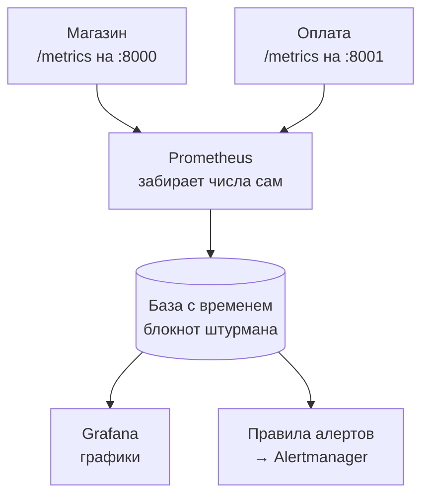
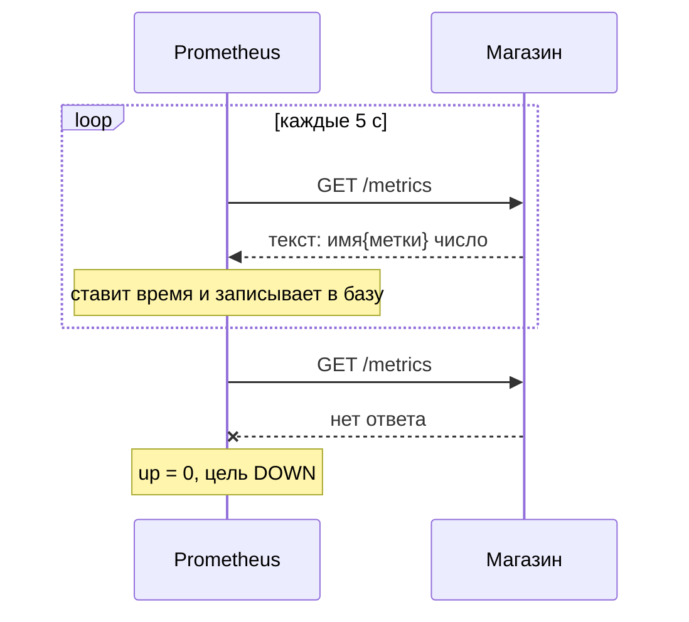

## Зачем это нужно

Ты пришёл в команду интернет-магазина, и впереди большая распродажа. В прошлом году сайт на ней упал, а на разборе сказали: «Мы не знали почему». Мы поставим приборы, чтобы в этом году знать. Я буду рядом как опытный коллега и объясню то, что мне самому когда-то пришлось выяснять на ошибках.

Начну с истории. Мы запустили мой первый нагрузочный тест. Генератор нагрузки (программа, которая засыпает сайт запросами) честно сообщил: на третьей минуте ответы стали медленными, потом пошли ошибки. Полдня мы гадали: база, процессор или сеть? Каждый защищал свою версию, а проверить никто не мог, потому что внутрь сервиса мы не заглядывали. Назавтра мы поставили мониторинг и повторили тест. На графике было видно: свободные соединения с базой закончились на второй минуте, и запросы выстроились в очередь. Версию проверили за пять минут вместо полудня. С тех пор я не запускаю тест, пока не вижу приборы.

Генератор видит сервис только снаружи, а причина сидит внутри. Увидеть её можно, если сервис сам рассказывает о себе, а кто-то это записывает.

То, что сервис рассказывает о себе, называется **метрикой**: мы встречали её в [уроке 2.3](../02-web/03-backend-anatomy.md) как число вроде «сколько запросов обработано». Записанные во времени числа превращаются в график, а по графику видно, что и когда сломалось. Записывает их **Prometheus**: программа, которая сама обходит сервисы, собирает числа, хранит и отвечает на вопросы вроде «сколько запросов в секунду было вчера в три часа». На работе «глянь метрики» почти всегда значит «открой Prometheus».

Шаг проекта: ты включаешь профиль мониторинга (`--profile monitoring`) и проверяешь, что Prometheus видит все восемь «целей» (адресов, откуда он собирает числа). Потом составляешь в `~/perf-lab/07-monitoring/metrics-catalog.md` каталог метрик «Магазина»: имя, тип, метки (уточнения к числу), смысл.

## Что нужно знать

- Терминал, `curl` и `grep`: [урок 1.4](../01-linux/04-network-cli.md). Для разбора JSON-ответов используем `jq`, он установлен в [уроке 1.1](../01-linux/01-workstation-terminal.md).
- HTTP: метод, путь, код ответа 200 и 5xx, из чего состоит запрос: [урок 2.1](../02-web/01-client-server-http.md).
- Стенд «Магазин» запущен и отвечает на `localhost:8000`: [урок 2.1](../02-web/01-client-server-http.md), как он собран из контейнеров: [тема 5](../05-docker/index.md), команды `docker compose up -d` и `down`: [урок 5.3](../05-docker/03-compose-shop.md).
- Ничего о задержке и перцентилях знать заранее не нужно: ниже каждый термин объяснён с нуля, а подробный разбор будет в [уроке 8.1](../08-perf-theory/01-latency-throughput.md).

## Картина целиком

Возьми приборную панель автомобиля. Спидометр показывает скорость прямо сейчас, одометр складывает пройденные километры. Теперь добавь штурмана, который каждые пять секунд заглядывает на панель и записывает показания в блокнот с временем. Вечером по блокноту рисуется график поездки.

В мониторинге те же роли. **Датчики** встроены в сервис: он считает свои запросы и ошибки и отдаёт числа обычной текстовой страницей по адресу `/metrics`. **Штурман** это Prometheus: по расписанию заходит на эту страницу каждого сервиса и пишет числа в блокнот (базу, где числа хранятся вместе со временем). **График** рисует Grafana, **тревогу** (алерт) дежурному поднимает Alertmanager, когда числа выглядят опасно. Всю цепочку ты соберёшь по ходу темы.



Стрелки от сервисов к Prometheus читай как «Prometheus приходит и забирает», а не «сервис отправляет». Почему именно так, увидишь в теории.

## Теория

### Метрики, логи и трассы: три вида данных

Сервис упал. Откуда узнать почему? Ответ зависит от того, что он о себе записывал. Способность понять по данным сервиса, что у него внутри, называют **наблюдаемостью** (observability).

Представь больницу. У кровати стоят приборы: пульс, давление, температура, одно число каждого вида раз в минуту. Это **метрики**: видно, что температура растёт третий час, но не видно, что съел пациент. Медсестра ведёт записи: «14:05 дали лекарство, жалуется на головокружение». Это **логи** (logs): каждое событие отдельной строкой, с подробностями. А маршрутный лист «приёмная, рентген, палата» с временем на каждом этапе это **трассы** (traces). Аналогия ломается в одном: метрика складывает события тысяч пользователей в одно число, судьбу одного запроса по ней не разобрать.

В «Магазине» метрика это `http_requests_total`, сколько запросов обработано. Лог это JSON-строка «запрос завершён, статус 502, 2014 мс». Трасса: «заказ занял 2100 мс, из них оплата 2050». Логи разберём в [уроке 7.5](05-logs-loki.md), трассы в [уроке 7.7](07-traces.md). Начнём с метрик: на тесте идут тысячи запросов в секунду, читать их по одному нельзя.

Осторожно: метрика не лог. Ста тысячам запросов соответствует сто тысяч строк лога, а метрика остаётся одним числом, которое выросло. Поэтому метрики дешёвые, но детали в них теряются.

> **Главное:** метрики показывают, что и сколько, логи объясняют конкретное событие, трассы показывают, где потерялось время.
{: .key}

Посмотрим, из чего устроено одно число метрики.

### Имя, метки, значение: из чего сделана метрика

Ты видишь «ошибок 17». Ошибок где, каких, за какой период? Метрику нужно описать так, чтобы по ней можно было задавать вопросы. Вот одна запись в Prometheus:

```text
http_requests_total{method="GET", route="/api/products", status="200"}   1542   в момент 14:05:05
```

Сначала **имя**: что считаем. В скобках **метки** (labels), пары «ключ=значение»: они уточняют число. Свой счёт у GET (чтение страницы) на `/api/products` с кодом 200, свой у POST на `/api/orders` с кодом 502. Дальше **значение**, 1542. Время замера Prometheus ставит сам.

Имя плюс полный набор меток называют **временным рядом** (time series, «серия»). У каждой серии копится список пар «время, значение»: `(14:05:00, 1500)`, `(14:05:05, 1542)`, `(14:05:10, 1577)`. Его хранит Prometheus и по нему строит графики. Хранилище называют **TSDB** (time series database, база временных рядов): оно быстро дописывает точки в конец серий и быстро читает их за период.

> **Прикинь сам:** сервис получал запросы `GET /api/products` с кодами 200 и 500 и `POST /api/orders` с кодом 201. Сколько рядов у `http_requests_total`?
{: .predict}

Три: `{GET, /api/products, 200}`, `{GET, /api/products, 500}` и `{POST, /api/orders, 201}`. Любая отличающаяся метка даёт новую серию, а считаются только комбинации, которые реально встречались.

Осторожно: метка это часть идентификатора, а не комментарий. Добавишь завтра `version="2"`, и старая и новая серии станут разными: у старой история оборвётся, у новой начнётся с нуля, и график «разорвётся».

> **Главное:** метрика это имя, метки и значение, а имя вместе с метками задаёт серию, у которой Prometheus хранит историю.
{: .key}

Как эти числа попадают в Prometheus?

### Pull: Prometheus сам приходит за числами

Если сервис молчит, он мёртв или ему нечего сказать? От способа доставки чисел зависит, сможешь ли ты это отличить. Есть два способа. **Push** («толкать»): сервис сам отправляет числа в хранилище, когда захочет. **Pull** («тянуть»): хранилище само приходит и забирает. Prometheus выбрал pull.

В больнице это санитар с градусником: обходит палаты и, если пациент не отвечает, записывает «не отвечает». А если бы пациент сам шёл в процедурную, не поймёшь, здоров он или потерял сознание.

Один заход Prometheus за числами называют **скрейпом** (scrape, «соскоб»). Каждые 5 секунд он делает запрос `GET /metrics` на адрес сервиса, получает текст «имя{метки} число», ставит на все числа одно время и дописывает их в серии. Заодно записывает метрику `up` для этого адреса: `1`, если скрейп удался, `0`, если нет.



Сервис не знает, кто и когда придёт. Нет ответа? Prometheus пишет `up = 0`: молчание тоже сигнал, по нему строят алерт «сервис недоступен».

Адрес, с которого собирают числа (например, `shop:8000`), называют **целью** (target). Группа однотипных целей это **job** («задание»): все экземпляры «Магазина» образуют job `shop`. Конкретный адрес внутри job это **instance**. Обе метки Prometheus добавляет к каждой серии сам, поэтому можно писать `up{job="shop"}`.

Теперь важное: между скрейпами Prometheus слепой, он смотрит снимками. Посмотри, как это влияет на два вида чисел:

<div class="viz" data-viz="obs-scrape" data-interval="15"></div>

Виджет показывает по одним событиям два вида чисел: счёт всех запросов с начала и число запросов «в работе» сейчас. Счёт не теряет ничего: разница двух соседних замеров точно говорит, сколько запросов прошло между ними. Число запросов «в работе» показывает только момент замера, и короткий всплеск между замерами не виден. Короткие события ловят накопленные счётчики, а текущим уровням доверяй с оглядкой.

Осторожно: Prometheus видит сервис не непрерывно, а раз в `scrape_interval`.

> **Главное:** Prometheus сам ходит за числами каждые несколько секунд, а недоступный сервис записывается как `up = 0`.
{: .key}

Теперь посмотрим глазами на то, что именно отдаёт сервис.

### Как выглядит /metrics

Открой в браузере адрес сервиса с `/metrics`, и увидишь обычный текст: формат простой, чтобы любой сервис мог его выдать. «Магазин» делает это библиотекой `prometheus_client`. Вот выдержка из `curl -s localhost:8000/metrics` после немного нагрузки:

```text
# HELP http_requests_total Запросы HTTP
# TYPE http_requests_total counter
http_requests_total{method="GET",route="/api/products",status="200"} 1542.0
http_requests_total{method="GET",route="/api/products/{id}",status="200"} 318.0
http_requests_total{method="GET",route="/api/products/{id}",status="404"} 6.0
# HELP shop_db_pool_available Свободные соединения
# TYPE shop_db_pool_available gauge
shop_db_pool_available 3.0
```

Строка `# HELP` это человеческое описание, его пишет автор сервиса. Строка `# TYPE` объявляет **тип** метрики: здесь `counter` и `gauge`, всего их четыре. Остальные строки это данные `имя{метки} значение`. Точка в `1542.0` это манера Python.

> **Главное:** `/metrics` это обычный HTTP-путь с текстом, его можно открыть в браузере или вызвать через `curl`, а в строке `# TYPE` написан тип метрики.
{: .key}

<details markdown="1">
<summary>Для любопытных: чего нет в /metrics «Магазина»</summary>

Данные в TSDB живут 15 дней, потом удаляются. Метрики нескольких воркеров «Магазина» (число задаёт `WEB_CONCURRENCY`) библиотека суммирует в один ответ.

Пути `/healthz`, `/readyz` и сам `/metrics` в HTTP-метрики не попадают: код стенда исключает их, чтобы проверки здоровья и скрейп не искажали число запросов в секунду.

</details>

Типов четыре, начнём со счётчика.

### Counter: счётчик, который только растёт

Ты построил график `http_requests_total` и видишь лестницу вверх. Нагрузка растёт? Нет. Метрика устроена как одометр: показывает километры за всю жизнь машины, назад не открутить. Скорость узнают, сравнив два показания и поделив на время между ними.

Такой тип называется **counter**: одно число, которое только растёт (при перезапуске сервиса оно обнуляется). Большое значение само по себе ничего не говорит, полезна **скорость роста**.

> **Прикинь сам:** в 14:05:00 счётчик показывал 1500, в 14:05:05 уже 1542. Сколько запросов в секунду пришло?
{: .predict}

За 5 секунд прибавилось 1542 - 1500 = 42 запроса, значит 42 / 5 = 8,4 запроса в секунду. Это делает функция `rate()` из следующего урока. Имена счётчиков заканчиваются на `_total`: `http_requests_total{method,route,status}`, `shop_orders_created_total`, `shop_cache_requests_total{result}`, `shop_payment_requests_total{result}`.

Осторожно: после перезапуска счётчик падает в ноль. Это нормально, `rate()` такой сброс учитывает.

> **Главное:** счётчик хранит накопленный итог, поэтому смотрят не на значение, а на скорость роста.
{: .key}

Но не всё только растёт.

### Gauge: стрелка, которая ходит вверх и вниз

Сколько запросов ждут соединение с базой прямо сейчас? Три, потом ноль, потом пять. Это не итог, а текущее состояние, как у спидометра: показывает «сколько сейчас» и ходит в обе стороны.

Такой тип называется **gauge**, и на графике смотрят само значение. В «Магазине» это `http_requests_in_progress` (запросов в работе), `shop_db_pool_size` (соединений в пуле), `shop_db_pool_available` (из них свободных) и `shop_db_pool_waiting` (запросов, ждущих соединение). Пул соединений мы разбирали в [уроке 2.3](../02-web/03-backend-anatomy.md): заранее открытые соединения с базой, выдаваемые запросам по очереди. Свободных нет, запрос ждёт: это и показывает `shop_db_pool_waiting`.

Осторожно: для счёта событий («сколько заказов было») новички берут gauge. Тогда при перезапуске история теряется, а «сколько за последнюю минуту» не посчитать. Правило: считаешь события, нужен counter. Меряешь текущее состояние, нужен gauge.

> **Главное:** gauge показывает состояние сейчас и ходит в обе стороны, а Prometheus видит его только в моменты скрейпа.
{: .key}

Остался самый хитрый случай: время ответа.

### Histogram: распределение по корзинам

Сколько длится запрос? Одно число не годится, и среднее врёт (подробно в [уроке 8.1](../08-perf-theory/01-latency-throughput.md)): надо знать, сколько запросов ответили быстро, сколько медленно. Хранить время каждого запроса нельзя: их миллионы. Поэтому тип **histogram** заранее делит время на **корзины** (buckets) и считает, сколько запросов в каждую уложилось. Это как сортировка писем по районам: точный адрес не нужен, а распределение видно.

Границы корзин у «Магазина» заданы в коде: от 0.005 до 10 секунд (0.005, 0.01, 0.025, 0.05, 0.1, 0.25, 0.5, 1, 2.5, 5, 10). У каждой корзины свой счётчик с меткой `le` («меньше или равно», less or equal): `le="0.1"` считает всех, кто ответил за 100 мс или быстрее. Корзины накопительные: каждая следующая включает предыдущие. Последняя, `le="+Inf"` («до бесконечности»), считает вообще все запросы. Рядом лежат `_count` (всего запросов) и `_sum` (суммарное время всех запросов в секундах):

```text
# TYPE http_request_duration_seconds histogram
http_request_duration_seconds_bucket{le="0.005",method="GET",route="/api/products"} 12.0
http_request_duration_seconds_bucket{le="0.01",method="GET",route="/api/products"} 233.0
http_request_duration_seconds_bucket{le="0.025",method="GET",route="/api/products"} 1301.0
http_request_duration_seconds_bucket{le="+Inf",method="GET",route="/api/products"} 1542.0
http_request_duration_seconds_sum{method="GET",route="/api/products"} 21.84
http_request_duration_seconds_count{method="GET",route="/api/products"} 1542.0
```

Показаны не все 11 корзин. Читаем: 12 запросов уложились в 5 мс, 233 в 10 мс, значит между 5 и 10 мс их 233 - 12 = 221. Всего запросов 1542, и `_count` совпадает с `le="+Inf"`.

> **Прикинь сам:** какое среднее время ответа и какая доля запросов медленнее 25 мс?
{: .predict}

Среднее это суммарное время, делённое на число запросов: 21,84 / 1542 = 0,0142 с, то есть 14,2 мс. Не медленнее 25 мс ответили 1301 запрос, это 1301 / 1542 = 84%. Значит, 1542 - 1301 = 241 запрос были медленнее, при среднем в 14 мс. Такие хвосты прячет среднее. Как получить из корзин перцентили (p95, p99), ты узнаешь в [уроке 7.2](02-promql.md).

Осторожно: корзины накопительные, а не «сколько в каждом диапазоне». Границы задаёт код: если все запросы медленнее 10 секунд, перцентиль выйдет «больше 10 с» и точнее не скажешь. И каждая корзина это отдельная серия.

Четвёртый тип, **summary**, похож на histogram, но перцентили вычисляет сам сервис. Их нельзя объединять: p95 двух серверов не равен p95 всего кластера. В «Магазине» summary нет, но на собеседовании про него спросят.

| Тип | Что хранит | Что смотреть | Пример в «Магазине» |
|---|---|---|---|
| counter | Накопленное число событий | Скорость роста: `rate()` | `http_requests_total` |
| gauge | Текущее значение | Само значение | `shop_db_pool_available` |
| histogram | Счётчики по корзинам времени | Перцентили: `histogram_quantile()` | `http_request_duration_seconds` |
| summary | Готовые перцентили | Само значение, объединять нельзя | нет |

> **Проверь понимание:** `shop_orders_created_total` показывает 840, после перезапуска 0, потом 25. Это ошибка? А `shop_db_pool_waiting` вдруг упал с 5 до 0?
{: .predict}

<details markdown="1">
<summary>Ответ</summary>

Для счётчика падение до нуля при перезапуске нормально: процесс начал считать заново, а `rate()` не считает такой сброс отрицательным ростом. Для gauge падение с 5 до 0 тоже нормально: очередь за соединениями рассосалась. Gauge и должен ходить вверх и вниз.

</details>

> **Главное:** histogram хранит накопительные счётчики по корзинам времени, из них считают среднее (`_sum / _count`) и перцентили.
{: .key}

С типами разобрались. Но метки, которые мы навешиваем на метрики, имеют цену.

### Метки и кардинальность

Я видел, как мониторинг упал от одной метки с идентификатором пользователя. Посчитаем, как так выходит. Каждая комбинация значений меток это отдельная серия, и Prometheus хранит её отдельно: память, диск, время. Число серий метрики называют **кардинальностью** (cardinality), и оно растёт перемножением.

У `http_requests_total` три метки. Метод: GET, POST, DELETE, три значения. Маршрут: десять шаблонов и `other`, одиннадцать. Код ответа: 200, 201, 204, 400, 401, 404, 409, 422, 500, 502, 503, 504, двенадцать. Максимум 3 × 11 × 12 = 396 серий. Реально меньше: серия рождается при первом событии, и пока ни один запрос не вернул 503, серии с `status="503"` нет. Поэтому на чистом стенде `http_requests_total` может быть пустой, и это не поломка.

С гистограммой серьёзнее. У `http_request_duration_seconds` две метки, но каждая комбинация даёт 11 корзин, плюс `+Inf`, `_sum` и `_count`: 14 серий. При десяти живых парах «метод и маршрут» это 140 серий только на задержку:

<div class="viz" data-viz="chart" data-type="bar" data-title="Сколько серий занимает метрика" data-x="duration,requests,db_wait,pay_dur,cache,pool" data-series='[{"name":"серий","values":[140,12,14,14,2,3]}]' data-x-label="метрика (сокращённо)" data-y-label="серий" data-explain="Расшифровка: duration это http_request_duration_seconds, requests это http_requests_total, db_wait это shop_db_connection_wait_seconds, pay_dur это shop_payment_duration_seconds, cache это shop_cache_requests_total, pool это три gauge пула. У счётчика запросов было 12 живых комбинаций меток, у гистограммы каждая дала 14 серий, поэтому она занимает примерно в десять раз больше места."></div>

Числа примерные: у счётчика запросов в этом тесте было 12 живых комбинаций, а у гистограммы каждая даёт 14 серий. Она весит примерно в десять раз больше.

> **Прикинь сам:** разработчик добавил в `http_request_duration_seconds` метку `user_id`. В «Магазине» тысяча пользователей. Сколько серий получится?
{: .predict}

На каждого пользователя 14 серий для каждой из десяти пар: 1000 × 10 × 14 = 140 000 вместо 140. С миллионом пользователей было бы 140 миллионов.

Отсюда правило: у метки должно быть небольшое, ограниченное число значений. Метод, шаблон маршрута, код ответа, результат оплаты (`ok`, `error`, `timeout`). Нельзя класть `user_id`, `order_id`, `request_id`, полный адрес с числами, текст ошибки. Поэтому в метке `route` стоит не путь `/api/products/42`, а **шаблон** `/api/products/{id}`: все десять тысяч товаров попадают в одну серию. Неизвестные пути вроде `/wp-admin.php` собраны под значением `other`, иначе бот, перебирающий случайные адреса, создал бы миллионы серий. Рост числа серий без границы называют **взрывом кардинальности** (cardinality explosion): память кончается, и мониторинг падает именно тогда, когда нужнее всего. Подробности про пользователя или заказ живут в логах, где есть `user_id` и `request_id` (урок 7.5).

Осторожно: одной меткой тоже не обойтись, по статусу график потом не разделишь. Нужны метки, по которым ты делишь график и у которых мало значений.

> **Главное:** серий столько, сколько разных комбинаций меток, поэтому в метку кладут только значения с ограниченным набором, а идентификаторы оставляют логам.
{: .key}

Метки выбрали, осталось договориться об именах.

### Имена и единицы

В запросе стоит число 0.25. Четверть секунды или 250 миллисекунд? Prometheus не знает, в чём измерено число, поэтому есть договорённость, которой следует «Магазин». Имена пишут через подчёркивание, с префиксом приложения для собственных метрик (`shop_`, `payment_`). Единицы всегда базовые: секунды и байты, не миллисекунды и мегабайты, чтобы числа разных сервисов можно было сравнивать без пересчёта, так что `http_request_duration_seconds`, а не `_ms`. В удобные единицы переводят в Grafana. Счётчики заканчиваются на `_total`, гистограммы на единицу измерения.

> **Главное:** единицу измерения читай в имени метрики: Prometheus хранит только числа.
{: .key}

Осталось посмотреть, как настроен сам Prometheus.

### Как настроен Prometheus на стенде

Prometheus настраивается одним YAML-файлом. Вот выдержка из `~/load-tester/project/shop/monitoring/prometheus/prometheus.yml`:

```yaml
global:
  scrape_interval: 5s
  evaluation_interval: 5s
rule_files:
  - /etc/prometheus/rules/alerts.yml
  - /etc/prometheus/rules/slo.yml
alerting:
  alertmanagers:
    - static_configs:
        - targets: ["alertmanager:9093"]
scrape_configs:
  - job_name: shop
    static_configs: [{targets: ["shop:8000"]}]
  - job_name: payment
    static_configs: [{targets: ["payment:8001"]}]
  # ... node, cadvisor, postgres, prometheus, alertmanager, alloy
```

`scrape_interval: 5s` задаёт, как часто ходить за метриками (по умолчанию минута, боевые системы ставят 15–30 секунд, у стенда 5, чтобы графики быстро реагировали на тест). Остальное сверху (`evaluation_interval`, `rule_files`, `alerting`) относится к алертам (правилам «когда звать дежурного»): [урок 7.6](06-alerts-incidents.md). Для сегодня важно `scrape_configs`: `job_name: shop` и `targets: ["shop:8000"]` значат «ходи на `http://shop:8000/metrics`» (путь `/metrics` подразумевается по умолчанию). `shop` здесь это имя контейнера в сети Docker Compose: внутри сети контейнеры видят друг друга по именам. Задания `node`, `cadvisor` и `postgres` подключают экспортеры: программы, которые превращают состояние хоста, контейнеров и PostgreSQL в метрики ([урок 7.4](04-exporters.md)). Ещё три цели, `prometheus`, `alertmanager` и `alloy`, отдают метрики самих инструментов.

Всего у стенда восемь целей: это число проверяет CI курса и его ты проверишь в практике. Помнишь полдня гаданий? Теперь каждая версия проверяется одним графиком.

> **Главное:** стенд собирает метрики с восьми целей каждые 5 секунд, а список целей лежит в `scrape_configs`.
{: .key}

## Практика

Все файлы урока складывай в `~/perf-lab/07-monitoring/`. Нагрузку даём только на свой стенд.

### 1. Включи профиль мониторинга

Стенд из темы 2 включал только сам «Магазин» с базой. Мониторинг оформлен как **профиль** (profile) Docker Compose: набор дополнительных сервисов, которые не стартуют без явной просьбы. Включаются они флагом `--profile monitoring`.

```bash
mkdir -p ~/perf-lab/07-monitoring
cd ~/load-tester/project/shop
docker compose --profile monitoring up -d --wait --wait-timeout 300
```

Разбор команды:

- `docker compose` это управление набором контейнеров, описанных в `compose.yaml` ([урок 5.3](../05-docker/03-compose-shop.md));
- `--profile monitoring` добавляет к стартующим сервисам те, что помечены `profiles: [monitoring]`: Prometheus, Alertmanager, Grafana, Loki, Tempo, Alloy и экспортеры;
- `up -d` запускает в фоне, `--wait` ждёт, пока у всех контейнеров пройдёт проверка здоровья (healthcheck), `--wait-timeout 300` не ждёт дольше пяти минут.

Одна оговорка про настройки самого Prometheus: в `compose.yaml` ему передан флаг `--web.enable-remote-write-receiver`. Он разрешает **принимать** метрики по запросу извне (remote write), а не только забирать их скрейпом. Флаг нужен в теме 10: k6 будет присылать свои метрики теста именно так. Порт 9090 на учебном стенде открыт на все интерфейсы машины, поэтому в чужой сети не оставляй стенд включённым.

Первый запуск скачает образы и займёт несколько минут. Когда команда вернула управление, проверь:


```bash
docker compose --profile monitoring ps --format 'table {{.Service}}\t{{.Status}}'
```


```text
SERVICE             STATUS
alertmanager        Up 40 seconds
alloy               Up 40 seconds
cadvisor            Up 40 seconds (healthy)
grafana             Up 40 seconds
loki                Up 40 seconds
node-exporter       Up 40 seconds
payment             Up 55 seconds (healthy)
postgres            Up 55 seconds (healthy)
postgres-exporter   Up 40 seconds
prometheus          Up 40 seconds
redis               Up 55 seconds (healthy)
shop                Up 50 seconds (healthy)
tempo               Up 40 seconds
```

**Как читать вывод:** в колонке `STATUS` ищи слова `Up`. У части сервисов нет `(healthy)`: у них не задана проверка здоровья, это нормально. Если какого-то сервиса нет в списке или написано `Restarting` или `Exited`, открой логи: `docker compose --profile monitoring logs prometheus`.

**Типичные ошибки:**

- `port is already allocated` (порт занят): на машине уже что-то слушает 9090 или 3000. Найди владельца: `ss -ltnp | grep -E ':9090|:3000'` и останови его.
- `no configuration file provided`: ты не в каталоге `~/load-tester/project/shop`.
- Prometheus запустился, но в цели `shop` ошибка: подожди 30 секунд, пока `shop` станет здоровым.

### 2. Прочитай /metrics глазами

Сначала создай немного событий, чтобы метрики не были пустыми:

```bash
for i in $(seq 1 30); do curl -s -o /dev/null localhost:8000/api/products; done
curl -s -o /dev/null localhost:8000/api/products/42
curl -s -o /dev/null localhost:8000/api/products/999999
curl -s -o /dev/null localhost:8000/api/no-such-path
```

Разбор: цикл `for i in $(seq 1 30)` повторяет `curl` тридцать раз; `-s` убирает индикатор загрузки, `-o /dev/null` выбрасывает тело ответа, нам важен только факт запроса. Последние три команды создают успешный запрос, 404 на несуществующий товар и запрос на неизвестный путь (он попадёт в `route="other"`).

```bash
curl -s localhost:8000/metrics | grep '^http_requests_total'
```

```text
http_requests_total{method="GET",route="/api/products",status="200"} 30.0
http_requests_total{method="GET",route="/api/products/{id}",status="200"} 1.0
http_requests_total{method="GET",route="/api/products/{id}",status="404"} 1.0
http_requests_total{method="GET",route="other",status="404"} 1.0
```

Разбор: `grep '^http_requests_total'` оставляет строки, которые **начинаются** с имени метрики (`^` означает «начало строки»), и отбрасывает `# HELP` и `# TYPE`.

**Как читать вывод:** посмотри на путь `/api/products/42` и `/api/products/999999`: оба превратились в один и тот же `route="/api/products/{id}"`, это шаблон, о котором шла речь в разделе про кардинальность. Единица в конце строки с `status="404"` это тот самый запрос на несуществующий товар. А запрос на `/api/no-such-path` ушёл в `route="other"`. Если у тебя числа другие (ты запускал тесты раньше), главное, чтобы набор меток совпадал.

Теперь посмотри объявления типов:

```bash
curl -s localhost:8000/metrics | grep '^# TYPE'
```

```text
# TYPE http_requests_total counter
# TYPE http_request_duration_seconds histogram
# TYPE http_requests_in_progress gauge
# TYPE shop_db_pool_size gauge
# TYPE shop_db_pool_available gauge
# TYPE shop_db_pool_waiting gauge
# TYPE shop_db_connection_wait_seconds histogram
# TYPE shop_cache_requests_total counter
# TYPE shop_orders_created_total counter
# TYPE shop_payment_requests_total counter
# TYPE shop_payment_duration_seconds histogram
```

Порядок строк у тебя может отличаться. У метрик с метками (`shop_payment_requests_total`, `shop_cache_requests_total`) строк `TYPE` может не быть, пока не случилось первое событие.

### 3. Найди цели в UI Prometheus

Открой в браузере `http://localhost:9090/targets`, или в меню Prometheus «Status → Target health». Ты увидишь таблицу, сгруппированную по job. Если окно показывает строку «State: UP» зелёным у всех восьми целей, всё хорошо.

То же самое в терминале, чтобы не зависеть от интерфейса:

```bash
curl -s localhost:9090/api/v1/targets \
  | jq -r '.data.activeTargets[] | "\(.labels.job)\t\(.health)\t\(.scrapeUrl)"' | sort
```

Разбор: Prometheus отвечает на `/api/v1/targets` JSON-ом; `jq -r` вытаскивает из каждой активной цели название job, здоровье (`up` или `down`) и адрес скрейпа; `sort` упорядочивает по алфавиту.

```text
alertmanager	up	http://alertmanager:9093/metrics
alloy	up	http://alloy:12345/metrics
cadvisor	up	http://cadvisor:8080/metrics
node	up	http://node-exporter:9100/metrics
payment	up	http://payment:8001/metrics
postgres	up	http://postgres-exporter:9187/metrics
prometheus	up	http://prometheus:9090/metrics
shop	up	http://shop:8000/metrics
```

**Как читать вывод:** восемь строк, все `up`. Адреса используют имена контейнеров, а не `localhost`, потому что Prometheus сам работает внутри сети Docker. Правило: **«localhost» внутри контейнера это сам контейнер**, а не твой ноутбук. Если цель `down`, смотри колонку «Error»: там будет причина.

### 4. Первые запросы в Prometheus

Открой `http://localhost:9090/query`. В строку запроса вводи по очереди выражения и нажимай **Execute**. Результат показывается во вкладке **Table** (значения «сейчас») или **Graph** (во времени).

```promql
up
```

Вернёт 8 серий: по одной на цель, у каждой метки `instance` и `job`, значение 1. Это «сердцебиение» мониторинга.

```promql
http_requests_total
```

Список серий счётчика, как в `/metrics`, только с добавленными метками `instance="shop:8000"` и `job="shop"`.

```promql
http_requests_in_progress
```

Единственное число (серия без меток, кроме `instance` и `job`). Если генератора нагрузки сейчас нет, значение близко к нулю.

```promql
count({job="shop"})
```

Сколько **всего серий** у Prometheus от «Магазина». Это общее число серий твоей кардинальности. `{job="shop"}` без имени метрики выбирает все серии этого job, `count(...)` считает их.

```promql
count by (__name__) ({job="shop"})
```

Сколько серий у каждой метрики: `__name__` это служебная метка, в которой хранится имя метрики. Должно быть видно, что у гистограммы `http_request_duration_seconds_bucket` рядов в разы больше, чем у остальных. Посмотри на график в таблице и сверь с графиком в теории выше.

Если на вкладке **Graph** ничего нет, поставь диапазон «Last 15m» и подожди минуту: сначала нужны хотя бы две точки.

**Типичные ошибки:**

- `parse error: unexpected ...`: в выражении опечатка, например забыта закрывающая скобка или кавычка. Prometheus показывает позицию ошибки.
- `Empty query result` для `http_requests_total`: ни один запрос ещё не обработан. Выполни команды цикла `curl` из шага 2.
- Для `shop_payment_requests_total` или `shop_cache_requests_total` пустой результат тоже нормален: событий с такими метками ещё не было.

> Не понимаешь строку из `/metrics`? Скопируй её вместе с соседними строками `# HELP` и `# TYPE` и спроси нейросеть, какого типа метрика и что значит каждая метка. Проверь ответ по строке `# TYPE` в самом выводе и по таблице типов в уроке.
{: .ai}

### 5. Составь каталог метрик

Теперь собери то, что узнал, в файл. Заготовка `~/perf-lab/07-monitoring/metrics-catalog.md`:

```markdown
# Каталог метрик «Магазина»

| Метрика | Тип | Метки | Что значит | Единица |
|---|---|---|---|---|
| http_requests_total | counter | method, route, status | Обработано HTTP-запросов | штук |
| http_requests_in_progress | gauge | (нет) | Запросов в работе сейчас | штук |
| http_request_duration_seconds | histogram | method, route | Время обработки запроса | секунды |
| shop_db_pool_size | gauge | | Соединений в пуле БД | штук |
| shop_db_pool_available | gauge | | Свободных соединений | штук |
| shop_db_pool_waiting | gauge | | Запросов ждёт соединение | штук |
| shop_db_connection_wait_seconds | histogram | | | секунды |
| shop_cache_requests_total | counter | result (hit, miss) | | |
| shop_orders_created_total | counter | | | |
| shop_payment_requests_total | counter | result (ok, error, timeout) | | |
| shop_payment_duration_seconds | histogram | | | |
```

Первые строки заполнены, остальные допиши сам. Чтобы не гадать, как работает `shop_db_connection_wait_seconds` или `shop_payment_duration_seconds`, найди их в `/metrics`, посмотри `# HELP` и тип. В колонке «Что значит» формулируй своими словами, опираясь на `HELP` и на разбор в этом уроке. Дополнительно допиши в конец файла раздел:

```markdown
## Что я проверил руками

- Количество целей Prometheus: 8, все up.
- `count({job="shop"})` вернул: ____ серий.
- Какая метрика занимает больше всего серий и почему: ____
```

Подставь реальные числа из своего стенда. Если ты уже прошёл тему 3, закоммить:

```bash
cd ~/perf-lab && git add 07-monitoring && git commit -m "7.1: каталог метрик Магазина" && git push
```

## Сломай и почини

**Поломка 1. Магазин пропал.** Остановим сервис и посмотрим, как это увидит мониторинг.

```bash
cd ~/load-tester/project/shop
docker compose stop shop
```

Подожди 10–15 секунд, потом в Prometheus выполни:

```promql
up{job="shop"}
```

**Задача:** без подсказок выясни, что показывает мониторинг, и найди причину в `http://localhost:9090/targets`.

<div class="viz" data-viz="flow" data-steps='[{"title":"Что показывает `up`","text":"Значение 1 или 0 для `job=\"shop\"`."},{"title":"Что говорит страница targets","text":"Состояние и текст ошибки напротив `shop`."},{"title":"Остальные цели","text":"Если упали все, проблема в сети или в самом Prometheus, а не в Магазине."},{"title":"Проверь сервис напрямую","text":"`curl localhost:8000/healthz` и `docker compose ps`."},{"title":"Почини","text":"Запусти остановленный сервис и дождись `up = 1`."}]'></div>

<details markdown="1">
<summary>Разбор</summary>

1. `up{job="shop"}` стал **0**. Prometheus пришёл на `shop:8000/metrics` и не получил ответа. Это тот самый случай «молчание тоже сигнал».
2. На странице targets цель `shop` в состоянии `DOWN`, в колонке ошибки текст вида `Get "http://shop:8000/metrics": dial tcp ...: connect: connection refused` (или `no such host`). Слова «connection refused» означают: до адреса добрались, но на порту никто не слушает.
3. Остальные семь целей продолжают быть `UP`: проблема только в «Магазине».
4. `curl localhost:8000/healthz` завершится ошибкой `Failed to connect`, `docker compose ps` не покажет `shop`.

Почини:

```bash
docker compose start shop
```

Через 15–20 секунд (контейнер ждёт проверку здоровья) `up{job="shop"}` снова 1. Теперь посмотри на `http_requests_total` в Graph за последние 15 минут: там **дырка** на время остановки, а значения после перезапуска **начались с нуля**, потому что счётчики живут в памяти сервиса. Это живой пример сброса counter из теории. Запомни этот график, в следующем уроке ты увидишь, как `rate()` справляется с таким обрывом.

</details>

**Поломка 2. Метрика не появилась.** Проверь два запроса:

```promql
shop_orders_created_total
shop_payment_requests_total
```

Первая метрика без меток: она есть сразу, со значением 0. Вторая с меткой `result`: если заказов ещё не было, результат пустой. Оформи заказ и повтори запросы:

```bash
TOKEN=$(curl -s localhost:8000/api/login -H 'Content-Type: application/json' \
  -d '{"email":"user0001@shop.lab","password":"password"}' | jq -r .token)
curl -s -X POST localhost:8000/api/cart/items -H "Authorization: Bearer $TOKEN" \
  -H 'Content-Type: application/json' -d '{"product_id":1,"qty":1}' > /dev/null
curl -s -X POST localhost:8000/api/orders -H "Authorization: Bearer $TOKEN" | jq '{id, status, total}'
```

Через пять-десять секунд (следующий скрейп) `shop_orders_created_total` вырастет с 0 до 1, а у `shop_payment_requests_total` появится серия `result="ok"`. **Вывод:** серия с метками рождается при первом событии, и пустой результат не всегда означает поломку. Поэтому в алертах и на дашбордах, где нужны нули, потом используют приём `or vector(0)` (ты увидишь его в готовом дашборде в уроке 7.3).

## ИИ в помощь

Нейросеть хорошо объясняет формат `/metrics` и помогает понять, чем счётчик отличается от гистограммы, но названий метрик твоего стенда она не знает. Общие правила: [ИИ-помощник](../ai.md).

**Задача:** разобрать фрагмент вывода `/metrics`.

```text
Я учу Prometheus. Вот кусок вывода http://localhost:8000/metrics:
<вставь 15-20 строк с http_request_duration_seconds_bucket, _sum, _count>.
Объясни по строкам: что такое le, почему бакеты накопительные, что значат _sum и _count,
и как из них получить среднее время запроса. Приведи числовой пример на моих значениях.
```
{: .wrap}

**Проверь ответ:** сверь с таблицей типов метрик из урока и пересчитай среднее сам: `_sum / _count` в Prometheus. Типичная ошибка: нейросеть выдумывает метрики, которых у «Магазина» нет (например, `http_request_latency_ms`). Сверяй имена с реальным `/metrics` и с каталогом, который ты ведёшь.

**Задача:** выбрать тип метрики для нового измерения.

```text
Для сервиса интернет-магазина нужно измерять: <вставь, что именно: число заказов, время оплаты, размер корзины>.
Для каждого предложи тип метрики Prometheus (counter, gauge, histogram), имя в стиле
Prometheus и метки. Объясни, какой метки не стоит заводить из-за большого числа значений.
```
{: .wrap}

**Проверь ответ:** сравни с готовыми метриками стенда (`shop_orders_created_total`, `shop_payment_duration_seconds`). Типичная ошибка: метка с `user_id` или `request_id`, которая разрывает число рядов; в уроке это названо кардинальностью.

## Словарик урока

| Термин | Простыми словами |
|---|---|
| Метрика (metric) | Число, которое сервис сообщает о себе и которое записывается во времени |
| Метка (label) | Пара «ключ=значение» у метрики, которая уточняет, о чём именно число (`status="200"`) |
| Временной ряд, серия (time series) | Имя метрики с одним набором меток и список пар «время, значение» |
| Prometheus | Программа, которая собирает, хранит и отдаёт метрики |
| TSDB | База временных рядов внутри Prometheus: быстро дописывает и читает точки по времени |
| `/metrics` | HTTP-адрес сервиса, который отдаёт все его метрики текстом |
| Скрейп (scrape) | Один заход Prometheus на `/metrics` за числами |
| Pull / push | Pull: хранилище само забирает данные. Push: сервис сам отправляет их |
| Цель (target), job, instance | Адрес, с которого собирают метрики; задание-группа таких адресов; один конкретный адрес |
| `up` | Служебная метрика Prometheus: 1, если скрейп цели удался, 0, если нет |
| Counter | Счётчик, который только растёт; смотрят на скорость роста |
| Gauge | Значение, которое ходит вверх и вниз; смотрят на само значение |
| Histogram | Набор накопительных счётчиков по корзинам времени, из них считают перцентили |
| Корзина, бакет (bucket), `le` | Счётчик запросов не медленнее заданной границы; `le` значит «меньше или равно» |
| Summary | Метрика с готовыми перцентилями, посчитанными в сервисе; нельзя объединять |
| Кардинальность (cardinality) | Сколько разных серий у метрики; растёт перемножением значений меток |
| Взрыв кардинальности | Число серий растёт без границы из-за метки с неограниченными значениями |
| Пул соединений (connection pool) | Заранее открытые соединения с базой, которые выдаются запросам по очереди |
| Профиль Compose (profile) | Набор сервисов, которые стартуют только при явной просьбе |

## Вопросы с собеседований

Раздел для повторения: ответь вслух, потом открой ответ. Короткие вопросы с пометкой `[на скорость]` тренируй на время: ответ за 30 секунд.

### 1. [junior] [часто] Что такое метрика и чем она отличается от лога?

<details markdown="1">
<summary>Ответ</summary>

Метрика это число (с именем и метками), которое записывается во времени, например количество запросов в секунду. Лог это запись о конкретном событии с подробностями. Метрика хранит агрегат: её размер не растёт с числом запросов, зато нельзя разобрать судьбу одного запроса. Лог хранит каждое событие, поэтому растёт вместе с нагрузкой, зато даёт детали. Обычно метрика показывает, что что-то не так, а лог объясняет, почему.

**Что хотят услышать:** агрегат против событий, размер, роль каждого (обнаружить против разобрать).

**Красный флаг:** «метрика это просто лог в другом формате».

</details>

### 2. [junior] [часто] Чем pull-модель Prometheus отличается от push и в чём плюсы pull?

<details markdown="1">
<summary>Ответ</summary>

При pull Prometheus сам регулярно приходит за числами на `/metrics` сервиса, при push сервис сам отправляет их. Плюсы pull: если сервис не отвечает, это видно сразу (`up = 0`), сервису не нужно знать адрес хранилища, легко проверить метрики руками через `curl`, нагрузкой на сбор управляет Prometheus. Минус: для коротких задач, которые успевают завершиться между скрейпами (batch-задания), pull не подходит, для них есть Pushgateway.

**Что хотят услышать:** `up` как сердцебиение, простота проверки, и минус для короткоживущих процессов.

**Красный флаг:** «Prometheus получает метрики, которые сервис ему присылает».

</details>

### 3. [junior] [часто] Назови четыре типа метрик Prometheus и приведи пример каждого.

<details markdown="1">
<summary>Ответ</summary>

Counter: только растёт, например `http_requests_total`. Gauge: ходит вверх и вниз, например `http_requests_in_progress` или число свободных соединений в пуле. Histogram: счётчики по корзинам, например длительность запросов `http_request_duration_seconds`, из него считают перцентили. Summary: готовые перцентили, посчитанные в самом сервисе, объединять между экземплярами нельзя.

**Что хотят услышать:** все четыре и правильные примеры, плюс как с каждым работают (rate для counter, значение для gauge, histogram_quantile для histogram).

**Красный флаг:** перепутать counter и gauge («счётчик запросов это gauge»).

</details>

### 4. [junior] Почему нельзя просто нарисовать график counter как есть?

<details markdown="1">
<summary>Ответ</summary>

Counter накапливает итог с момента запуска и поэтому только растёт: график это лестница вверх, из которой не видно ни нагрузки, ни пика. Полезна скорость роста: сколько запросов добавилось за секунду. Её даёт функция `rate()`. Ещё одна причина: при перезапуске сервиса counter обнуляется, и «сырой» график падает в ноль, а `rate()` умеет такие сбросы учитывать.

**Что хотят услышать:** скорость вместо накопленного итога, упоминание сброса.

**Красный флаг:** «график растёт, значит нагрузка растёт».

</details>

### 5. [junior] Что такое `job` и `instance` в Prometheus?

<details markdown="1">
<summary>Ответ</summary>

`job` это название группы однотипных целей, например все экземпляры «Магазина». `instance` это адрес конкретной цели внутри группы, например `shop:8000`. Prometheus сам добавляет обе метки к каждой серии, поэтому можно писать `up{job="shop"}` или смотреть, какой именно экземпляр отвечает медленнее.

**Что хотят услышать:** группа против конкретного экземпляра, что метки добавляются автоматически.

**Красный флаг:** «это названия, которые указал разработчик в коде сервиса».

</details>

### 6. [junior] Что делает метка `le` у histogram и почему корзины накопительные?

<details markdown="1">
<summary>Ответ</summary>

`le` значит «меньше или равно» и задаёт верхнюю границу корзины: `le="0.1"` считает запросы, ответившие за 100 мс или быстрее. Корзины накопительные, то есть каждая включает все предыдущие, а `le="+Inf"` равна общему числу запросов. Так устроено, чтобы можно было рассчитать, какая доля запросов уложилась в любую границу, простым делением двух счётчиков, и чтобы по ним считать перцентили.

**Что хотят услышать:** «меньше или равно», накопительность, `+Inf` равно `_count`.

**Красный флаг:** «в корзине те запросы, что попали именно в этот диапазон».

</details>

### 7. [middle] Что такое кардинальность и почему нельзя класть `user_id` в метку?

<details markdown="1">
<summary>Ответ</summary>

Кардинальность это число разных серий метрики, оно растёт перемножением значений всех меток. Метка `user_id` имеет столько значений, сколько пользователей: для миллиона пользователей и 10 маршрутов получится 10 миллионов серий, у гистограммы ещё в 14 раз больше. Память и диск Prometheus кончатся, запросы станут медленными, мониторинг упадёт в самый нужный момент. Идентификаторы конкретных запросов и пользователей принадлежат логам. В метках должны быть значения с ограниченным набором: метод, шаблон маршрута, код ответа.

**Что хотят услышать:** перемножение, расчёт на примере, куда вместо этого девать детали, понятие «взрыв кардинальности».

**Красный флаг:** «метки ничего не стоят, их можно добавлять сколько угодно».

</details>

### 8. [middle] Почему в метке `route` у «Магазина» шаблон `/api/products/{id}`, а не реальный путь?

<details markdown="1">
<summary>Ответ</summary>

Реальных путей десять тысяч (по одному на товар), каждый создал бы отдельную серию, и для гистограммы ещё в 14 раз больше. Шаблон объединяет все товары в одну серию и сохраняет полезную информацию: какой тип запроса. Неизвестные пути объединяются в `other`, чтобы случайные или вредоносные запросы не создавали бесконечное число серий.

**Что хотят услышать:** ограничение числа серий, принцип «шаблон вместо значения», защита от мусорных путей.

**Красный флаг:** «так проще читать».

</details>

### 9. [middle] Prometheus видит gauge `http_requests_in_progress` раз в 15 секунд. Что можно пропустить?

<details markdown="1">
<summary>Ответ</summary>

Любой всплеск короче интервала скрейпа, который не совпал с моментом замера: например, пять секунд, когда в работе было 50 запросов, при интервале 15 с могут не попасть ни в один замер. Counter такой проблемы не имеет: разница двух замеров покажет все события между ними. Поэтому для событий выбирают counter и считают rate, а для текущих уровней смотрят на gauge с запасом по интервалу, плюс подкрепляют гистограммами и счётчиками.

**Что хотят услышать:** снимки против накопления, практический вывод про выбор типа.

**Красный флаг:** «Prometheus видит всё, что происходит в сервисе».

</details>

### 10. [middle] Метрика `http_requests_total` в Prometheus пустая, хотя сервис работает. Какие причины?

<details markdown="1">
<summary>Ответ</summary>

Идти надо по цепочке. 1) Цель `down`: посмотреть `up` и страницу targets, прочитать текст ошибки. 2) Prometheus собирает не тот адрес или порт: сверить `prometheus.yml`. 3) Метрика не объявлена в этом процессе или ещё не было событий, значит серия не создана: сделать запрос и проверить через `curl` на `/metrics`. 4) Запрос ищет не то имя или метку: проверить имя в `/metrics`. 5) Слишком маленький интервал в Graph, нужны хотя бы две точки.

**Что хотят услышать:** последовательность от `up` к `/metrics`, знание, что серия появляется после первого события.

**Красный флаг:** «перезапущу Prometheus и посмотрю».

</details>

### 11. [middle] Как из histogram получить среднее время запроса, и почему этого недостаточно?

<details markdown="1">
<summary>Ответ</summary>

Среднее равно `_sum / _count` (суммарное время делить на число запросов), в PromQL `rate(..._sum[5m]) / rate(..._count[5m])`. Но среднее прячет хвост: несколько очень медленных запросов почти не меняют его, а пользователи страдают. Поэтому по корзинам считают перцентили p95 и p99 функцией `histogram_quantile`.

**Что хотят услышать:** формулу через `_sum` и `_count`, причину перехода к перцентилям.

**Красный флаг:** «среднего достаточно, оно показывает типичное время».

</details>

### 12. [junior] [на скорость] Назови три вида данных наблюдаемости.

<details markdown="1">
<summary>Ответ</summary>

Метрики (числа во времени), логи (записи о событиях), трассы (путь запроса через сервисы). Метрики показывают, что и сколько, логи объясняют конкретное событие, трассы показывают, где потерялось время.

</details>

### 13. [junior] [на скорость] Что значит `up == 0`?

<details markdown="1">
<summary>Ответ</summary>

Последний скрейп цели не удался: сервис недоступен, ответил ошибкой или не уложился в таймаут. Prometheus сам записывает `up` для каждой цели, 1 если всё хорошо.

</details>

### 14. [junior] [на скорость] Какой тип у «число свободных соединений в пуле»?

<details markdown="1">
<summary>Ответ</summary>

Gauge: значение ходит вверх и вниз. Counter не подходит, он только растёт.

</details>

### 15. [middle] [на скорость] Что произойдёт, если положить `request_id` в метку?

<details markdown="1">
<summary>Ответ</summary>

Каждый запрос создаст новую серию. Число серий вырастет без границы, память Prometheus кончится. Идентификаторы запросов хранят в логах, не в метках.

</details>

## Проверено на версиях

Ubuntu 24.04, Docker Engine с Compose v2, стенд «Магазин» из `project/shop` (Python 3.14, `prometheus_client` в режиме multiprocess), Prometheus 3.15, Grafana 13.2. Октябрь 2026.

## Итог урока: ты умеешь

- [ ] Объяснить, чем метрики отличаются от логов и трасс и чем pull-модель отличается от push.
- [ ] Включить профиль мониторинга и убедиться, что все восемь целей Prometheus живые.
- [ ] Прочитать вывод `/metrics`: имя, метки, значение, `# TYPE`, корзины `le`.
- [ ] Назвать тип любой метрики «Магазина» и объяснить, почему он именно такой.
- [ ] Посчитать среднее и долю запросов по корзинам гистограммы руками.
- [ ] Объяснить, что такое кардинальность и почему `user_id` нельзя класть в метку.
- [ ] Найти упавшую цель по `up` и странице targets и понять причину по тексту ошибки.
- [ ] Вести каталог метрик в `~/perf-lab/07-monitoring/metrics-catalog.md`.

Дальше: [урок 7.2. PromQL: rate, sum by, histogram_quantile](02-promql.md), где ты научишься задавать Prometheus вопросы: сколько запросов в секунду, какая доля ошибок и чему равен p95.

**Глубже:** устройство Prometheus и форматы метрик подробнее в [курсе DevOps](https://distinguished-sre.github.io/devops/08-observability/02-prometheus-basics.html), если захочется заглянуть дальше учебного стенда.
