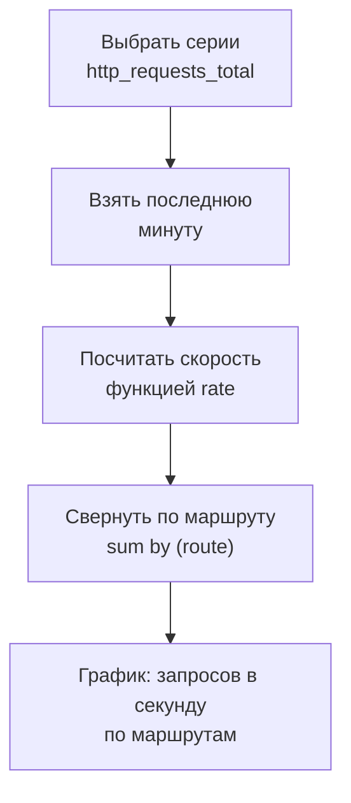
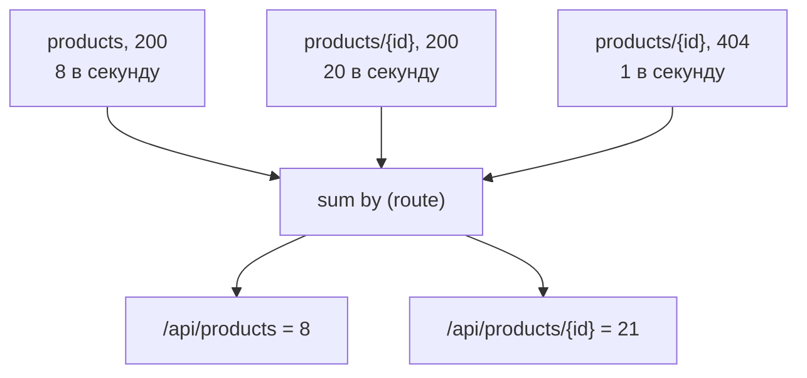
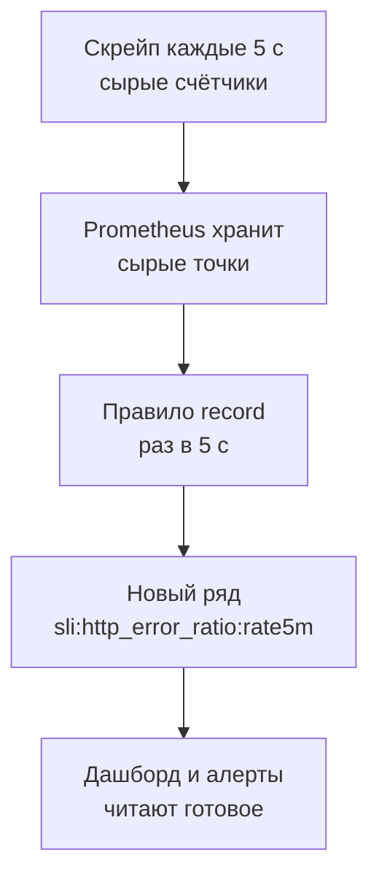

## Зачем это нужно

Я твой наставник на этих уроках: сижу рядом и подсказываю то, на чём сам когда-то спотыкался. Начну с истории, которая случается в каждой команде. Перед большой распродажей на главном мониторе висел один график: «всего запросов». Он красиво полз вверх, и все радовались. Потом сайт упал. Стали разбираться и поняли, что график растёт и тогда, когда сайт лежит: он показывал накопленный итог с запуска, а итог умеет только прибавлять. Ни скорости, ни ошибок, ни времени ожидания на нём не было. Приборы стояли, но спросить у них нужное никто не догадался.

У «Магазина» та же картина. Prometheus из [урока 7.1](01-metrics-prometheus.md) хранит тысячи временных рядов, а нагрузочнику нужны другие числа. Сколько запросов в секунду мы держим сейчас. За сколько секунд отвечают 95 покупателей из ста. Какая доля ответов закончилась ошибкой. В `/metrics` этих чисел нет, их надо вычислить из сырых счётчиков и корзин.

Для этого есть язык запросов PromQL (Prometheus Query Language). Ты не выбираешь строки таблицы, как в SQL. Ты берёшь временные ряды и применяешь к ним функции («скорость роста за минуту») и свёртки («сложи по маршрутам»). Каждый график в Grafana и каждый алерт это запрос на PromQL. Не прочитаешь чужой запрос, не сможешь доверять чужому графику.

Шаг проекта: ты заводишь `~/perf-lab/scripts/promq.sh` (запрос к Prometheus из терминала) и `traffic.sh` (фоновый трафик на стенд). Ещё ты записываешь в `~/perf-lab/07-monitoring/red-queries.promql` запросы RED для «Магазина». RED это три вопроса, которые задают любому сервису: Rate (запросов в секунду), Errors (доля ошибок), Duration (сколько ждут: p50, p95, p99). В следующем уроке из них вырастут панели дашборда.

## Что нужно знать

- Что Prometheus собирает числа со `/metrics` каждые 5 секунд и хранит их как временные ряды с метками: [урок 7.1](01-metrics-prometheus.md).
- Четыре типа метрик, особенно **counter** (только растёт) и **histogram** (накопительные корзины `le`): [урок 7.1](01-metrics-prometheus.md).
- Стенд «Магазин» с профилем мониторинга запущен (`docker compose --profile monitoring up -d`), Prometheus открывается на `http://localhost:9090/query`.
- `curl` и `jq` для разбора ответа: [урок 1.4](../01-linux/04-network-cli.md) и [урок 1.1](../01-linux/01-workstation-terminal.md).

## Картина целиком

Представь электронную таблицу, где каждая строка это временной ряд, а столбцы это моменты времени. Формулы в ней делают три вещи. Выбирают нужные строки (по имени и меткам). Считают по времени внутри строки (прирост за минуту, делённый на 60). Сворачивают строки между собой (сумма по маршрутам). Но таблицу считают один раз, а Prometheus пересчитывает запрос для каждой точки графика заново.



На схеме запрос `sum by (route) (rate(http_requests_total[1m]))` разложен на шаги. Читай такие запросы изнутри наружу.

По дороге значение меняет вид. После выбора серий это мгновенный вектор (instant vector): по одному значению на серию «сейчас». Допишешь окно `[1m]`, и получится вектор по интервалу (range vector): у каждой серии список точек за минуту. Нарисовать его нельзя, он нужен, чтобы отдать функции вроде `rate`. Функция `rate` ждёт именно второй вид, и если дать ей первый, Prometheus вернёт ошибку.

## Теория

### Селекторы: как показать пальцем на нужные серии

В Prometheus тысячи серий, а в вопросе нужны две-три. Как на них показать? Как контакт в телефоне: по имени и приметам.

Это делает селектор (selector): имя метрики и условия на метки в фигурных скобках. Одно условие называют matcher.

```promql
http_requests_total{route="/api/products", status="200"}
```

Условий четыре вида: `=` («точно равно»), `!=` («не равно»), `=~` («подходит под регулярное выражение») и `!~` («не подходит»). Регулярное выражение (regex) это шаблон текста, в котором часть символов заменяют «любым». Похоже на `*.jpg` при поиске файлов; в [уроке 1.2](../01-linux/02-text-logs.md) ты им уже пользовался с `grep`. В `status=~"5.."` шаблон `5..` значит «цифра 5 и ещё два любых символа»: подойдут 500, 502, 503. Знак `|` значит «или»: `status=~"502|504"`. Кавычки вокруг значения обязательны.

> **Прикинь сам:** найдёт ли что-нибудь `http_requests_total{status=~"5"}`, если в «Магазине» бывают ответы 500?
{: .predict}

Нет. Шаблон должен подойти ко всему значению метки целиком, будто в начале стоит `^`, а в конце `$`. Значение `"500"` не равно `"5"`. Нужно `5..`.

Осторожно: условия отбирают серии, а не значения внутри них. И если ошибок 5xx не было, запрос вернёт пустой результат (серий нет), а не ноль. Это пригодится при подсчёте доли ошибок.

> **Главное:** селектор это имя метрики плюс условия на метки; регулярка подходит ко всему значению целиком, а нет подходящих серий, результат пуст, а не равен нулю.
{: .key}

Серии выбрали. В какой момент брать у них значение?

### Как запрос вычисляется: момент и диапазон

Ты нажимаешь **Execute** на вкладке Table и видишь по числу на серию. Переключаешься на Graph и получаешь линию. Запрос тот же.

Prometheus вычисляет запрос на конкретный момент. Нажатие **Execute** это мгновенный запрос (instant query): один момент, «сейчас». График это запрос по диапазону (range query): вычисление повторяется для каждого момента с шагом (скажем, каждые 15 секунд за час), и результаты соединяются в линию.

Отсюда вывод: окно `[1m]` внутри запроса и шаг графика это разные вещи. Окно задаёт, на какую глубину смотреть назад при расчёте одной точки. Шаг задаёт, как часто эти точки считать.

> **Главное:** график это много вычислений подряд, каждое на свой момент; окно задаёт глубину одной точки, шаг частоту точек.
{: .key}

Теперь окно: без него скорость не посчитать.

### Окно: сколько точек нужно для скорости

В 14:05:00 счётчик показал 1500. По одной точке скорость роста не узнать, нужна вторая для сравнения. Поэтому счётчикам нужно окно в прошлое.

Его пишут в квадратных скобках сразу после селектора: `http_requests_total[1m]`. Запись `1m` это минута, `30s` тридцать секунд, `1h` час. Внутри окна лежат все точки серии от «сейчас минус окно» до «сейчас».

Сколько их там? Делим окно на интервал скрейпа. У нас скрейп раз в 5 секунд: в `[1m]` около 12 точек (60 / 5), в `[30s]` около 6, в `[5s]` одна или ни одной. Для скорости нужно минимум две, так что на `[5s]` график пуст. Отсюда правило: окно не короче четырёх интервалов скрейпа. Для стенда это от 20 секунд, берут `[1m]`.

На боевых системах скрейп раз в 15–30 секунд: в `[1m]` останется 2–4 точки, и одна пропущенная заставит график дрожать. Там берут `[2m]`–`[5m]` или переменную Grafana `$__rate_interval`, она подбирает окно сама ([урок 7.3](03-grafana.md)).

> **Главное:** в окно должно попасть не меньше четырёх точек; на стенде это `[1m]`, при скрейпе в 15 секунд лучше `[2m]` и больше.
{: .key}

Окно готово. Отдадим его функции.

### rate, irate и increase: скорость роста счётчика

Итог нагрузки не показывает, нужна скорость: прирост за секунду. Её считает `rate()` (по-английски «скорость»).

Представь одометр. В 10:00 он показал 12 000 км, в 11:00 12 060 км, скорость (12 060 − 12 000) / 1 час = 60 км/ч. Он сам скорости не знает, мы считаем её по разности показаний. Аналогия ломается на сбросе: у одометра нет «обнуления посреди пути», а у счётчика сервиса при перезапуске оно есть.

Для каждой серии `rate(http_requests_total[1m])` берёт точки за минуту, считает прирост от первой до последней и делит на время между ними. Сброс до нуля (значение вдруг меньше предыдущего) `rate` понимает как «счётчик пошёл заново» и прибавляет новый рост. Есть тонкость. Крайние точки редко лежат ровно на краях окна: первая, скажем, на 2-й секунде, последняя на 58-й. Тогда `rate` дотягивает прирост до краёв окна, как будто счётчик рос так же и в эти секунды (это называется экстраполяцией).

В окне `[30s]` счётчик `route="/api/products"` в 14:05:00 был 1500, в 14:05:30 стал 1830. Прирост 330 за 30 секунд, это 11 запросов в секунду. Если бы посередине был перезапуск (1830, потом 0, потом 120), прирост составил бы (1830 − 1500) + 120 = 450, а не отрицательное число. Проверь на виджете.

<div class="viz" data-viz="obs-rate" data-window="30"></div>

Верхний график это сырой счётчик со ступеньками, нижний это `rate` для окна с ползунка. Серая пунктирная линия это настоящая нагрузка. Чем больше окно, тем ровнее линия, но тем сильнее она запаздывает после скачка (на секунде 60 нагрузка выросла втрое). При окне 5 секунд линии нет совсем.

У `rate` две родственные функции. `increase(x[1m])` отвечает на вопрос «сколько штук за окно»: это `rate * окно`. `irate(x[1m])` считает скорость только по двум последним точкам, поэтому она «мгновенная», но дёрганая, и для алертов не подходит. Почти всегда берут `rate`.

`increase` из-за экстраполяции иногда даёт дробь, например 59,7 запроса. Включи на виджете irate: жёлтая линия дёргается сильнее, потому что строится по двум точкам.

Осторожно: к gauge `rate` не применяют, его значение ходит вверх и вниз. И `rate(...[1m])` даёт «в секунду», а не «за минуту». Нужно «за минуту», бери `increase(...[1m])` или `rate(...[1m]) * 60`.

> **Проверь понимание:** `rate(http_requests_total[5m])` показывает 12. Это 12 запросов в секунду, в минуту или за 5 минут? А что покажет `increase` с тем же окном?
{: .predict}

<details markdown="1">
<summary>Ответ</summary>

`rate` всегда даёт «в секунду»: 12 запросов в секунду, усреднённо за 5 минут. `increase` вернёт около 12 × 300 = 3600: прирост за всё окно.

</details>

> **Главное:** `rate` превращает накопленный итог в скорость «в секунду», `increase` в прирост за окно; `irate` берёт две последние точки и потому шумит.
{: .key}

Но `rate` вернёт по линии на каждую комбинацию меток. Их надо свернуть.

### Агрегация: sum, by и without

Я помню, как впервые выполнил `rate` по всей метрике и получил десятки линий: серия на каждую комбинацию `method`, `route`, `status`.

Свёртку делает `sum`: она складывает серии. Без уточнений сворачивает всё в одну серию и теряет все метки: `sum(rate(http_requests_total[1m]))` даёт общий RPS «Магазина». Чтобы сохранить часть меток, добавляют `by` (оставить перечисленные). Есть и обратный `without` (убрать перечисленные, остальные оставить):

```promql
sum by (route) (rate(http_requests_total[1m]))      # одна линия на маршрут
sum without (instance, method) (rate(http_requests_total[1m]))
```

Второй запрос убирает `instance` и `method`, а `route` и `status` оставляет: линий выйдет по одной на пару «маршрут и статус». Первый оставляет только `route`.

Посчитаем. Идут три потока: `GET /api/products` 8 запросов в секунду с кодом 200, `GET /api/products/{id}` 20 в секунду с 200 и 1 в секунду с 404.



Три серии вышли двумя: линии `products/{id}` сложились (20 + 1), статус пропал. Без `by` вышло бы 8 + 20 + 1 = 29.

> **Прикинь сам:** что вернёт `sum by (status)` для тех же потоков?
{: .predict}

Две серии: `200` = 28 (8 + 20) и `404` = 1.

Порядок такой: сначала `rate`, потом `sum`. Почему? Возьмём два экземпляра сервиса, A и B. Счётчик A равен 1000, счётчик B равен 500, их сумма 1500. Потом B перезапустили, и его счётчик стал 0.

Шаг первый: сумма теперь 1000 + 0 = 1000, то есть упала с 1500. Шаг второй: `rate` по сумме видит падение и решает, что обнулилась вся она. Он прибавляет 1000 несуществующих запросов: ложный скачок. А если сначала `rate` считать по каждому экземпляру, A растёт как раньше, у B засчитывается сброс, и сумма остаётся честной.

Осторожно: после `sum(...)` без `by` пропадают `route` и `status`, и фильтровать по ним уже нельзя. Долю ошибок по маршрутам считают как `sum by (route) (...5xx...) / sum by (route) (...)`, с одинаковыми `by` с обеих сторон.

> **Главное:** `sum by` оставляет перечисленные метки и складывает остальное; сначала `rate` по каждой серии, потом `sum`.
{: .key}

Складывать научились. А если один результат разделить на другой?

### Арифметика и доля ошибок

Доля ошибок это деление: ошибки на все запросы. Выражения в PromQL можно складывать, вычитать, умножать и делить, и работает это между сериями. При делении Prometheus сопоставляет серии по меткам: делит те, у кого наборы совпали. После `sum(...)` без меток пара одна. Если слева `sum by (route)`, справа тоже нужно `sum by (route)`. Когда метки не совпадают, добавляют `on(метки)` («только по этим») или `ignoring(метки)` («кроме этих»).

```promql
sum(rate(http_requests_total{status=~"5.."}[1m]))
/
sum(rate(http_requests_total[1m]))
```

Ошибок 1,5 в секунду, всего 60. Результат 1,5 / 60 = 0,025, то есть 2,5%. Prometheus отдаёт долю от 0 до 1, а в проценты её переводит Grafana (единица `percentunit`) или умножение на 100.

Теперь ловушка. Без ошибок числитель не нашёл серий, `sum` от пустого ничего не возвращает, и деление даёт пусто: на графике «нет данных», хотя ошибок ноль. Нужен явный ноль. Так сделан эталонный дашборд стенда (его запрос ты увидишь в следующем уроке):

```promql
(sum(rate(http_requests_total{status=~"5.."}[1m])) or vector(0))
/
clamp_min(sum(rate(http_requests_total[1m])), 0.001)
```

Оператор `or` берёт левую часть, а если она пуста, правую. `vector(0)` создаёт серию без меток со значением 0, поэтому «нет ошибок» превращается в честный ноль. `clamp_min(x, 0.001)` не даёт знаменателю стать меньше 0,001: без запросов выйдет 0 / 0,001 = 0, а не NaN («не число»).

В алерте так делать нельзя: `or vector(0)` превратит пропавшую метрику в «ноль ошибок», и алерт промолчит. Пропажу ловят отдельным правилом с `absent()` ([урок 7.6](06-alerts-incidents.md)).

> **Прикинь сам:** маршрут A: 1000 запросов, 5% ошибок. Маршрут B: 100 запросов, 3%. Какая доля ошибок по обоим вместе?
{: .predict}

Не 8% и не среднее 4%. Ошибок 50 + 3 = 53, запросов 1000 + 100 = 1100, и 53 / 1100 ≈ 0,048, то есть 4,8%. Проценты не складывают и не усредняют: делят сумму ошибок на сумму запросов.

> **Главное:** доля ошибок это сумма ошибок, делённая на сумму запросов; `or vector(0)` не даёт ряду пропасть при нуле ошибок, `clamp_min` защищает знаменатель.
{: .key}

С арифметикой разобрались. Как оставить только то, что превысило порог?

### Сравнения и сдвиг в прошлое

Допустим, тебе нужны только горячие маршруты. Поставь после запроса знак больше, и PromQL выбросит серии, для которых условие ложно (так работают и `<`, `==`, `!=`). Запрос `sum by (route) (rate(http_requests_total[1m])) > 10` вернёт только маршруты с RPS больше 10. На этом строятся алерты: он срабатывает, когда выражение вернуло хоть одну серию. Нужны 0 и 1 вместо фильтра, добавляют `bool`: `up == 0` покажет только недоступные цели, а `up == bool 0` вернёт 1 для недоступных и 0 для остальных.

Чтобы сравнить «сейчас» с прошлым, ставят `offset`: `http_requests_in_progress offset 1h` значит «каким было час назад».

```promql
sum(rate(http_requests_total[5m])) / sum(rate(http_requests_total[5m] offset 1h))
```

Сейчас 70 запросов в секунду, час назад было 50: 70 / 50 = 1,4, нагрузка выросла на 40%. `offset` ставят сразу после селектора (с окном), а не после функции. Так сравнивают «до» и «после» изменения: прогнал сценарий дважды, сверил `p95` с `p95 offset 30m`.

> **Главное:** сравнение отбрасывает серии, а `offset` даёт взглянуть на то же число в прошлом.
{: .key}

<details markdown="1">
<summary>Для любопытных: мелочи на каждый день</summary>

`topk(3, sum by (route) (rate(http_requests_total[1m])))` покажет три самых нагруженных маршрута. `max_over_time(http_requests_in_progress[5m])` вернёт пик gauge за 5 минут. `absent(up{job="shop"})` даёт 1, если серии нет вообще: на нём строят алерты «метрика пропала». `delta(x[5m])` даёт прирост gauge (для counter берут `increase`). Среди агрегаций есть `avg`, `min`, `max`, `count` и `topk(3, ...)` («три самых больших»). Единицы окна: `s`, `m`, `h`, `d`, `w`.

</details>

Остался главный запрос нагрузочника: перцентиль.

### histogram_quantile: перцентиль из корзин

p95 это значение, быстрее которого отвечают 95% запросов. Но Prometheus не хранит времена отдельных запросов, только накопительные счётчики по корзинам `le` ([урок 7.1](01-metrics-prometheus.md)). Как из них получить p95?

Возьмём минуту работы `/api/products`: пришло 1000 запросов. Прирост корзин (`increase`) такой:

| `le` | 0.025 | 0.05 | 0.1 | 0.25 | 0.5 | 1 | +Inf |
|---|---|---|---|---|---|---|---|
| Накоплено | 600 | 840 | 930 | 985 | 996 | 1000 | 1000 |

Функция `histogram_quantile(0.95, <корзины>)` (число 0,95 без меток называют скаляром) делает то же, что ты сделаешь глазами. Нужный запрос: 0,95 × 1000 = 950-й. Первая корзина, где накоплено не меньше 950, это `le="0.25"` (985, а в `le="0.1"` только 930). Значит, p95 между 0,1 и 0,25 секунды.

Где именно, Prometheus не знает: он видит только «столько-то попало между границами». Поэтому предполагает, что запросы стоят внутри равномерно, и считает по прямой (интерполяция). В корзине 55 запросов (985 − 930), нам нужен двадцатый по счёту (950 − 930):

```text
p95 = 0.1 + (0.25 - 0.1) × (950 - 930) / (985 - 930) = 0.1 + 0.15 × 20/55 = 0.1545 с ≈ 155 мс
```

Настоящий p95 может быть где угодно от 100 до 250 мс, поэтому перцентиль по гистограмме всегда приблизительный. Чем уже корзина вокруг нужного значения, тем он точнее. У «Магазина» вокруг 25–100 мс корзины узкие, а вокруг 0,5–1 секунды шириной в полсекунды, и там оценка грубая. Если p95 за 10 секунд, вернётся 10 (верх последней корзины).

Теперь сам запрос:

```promql
histogram_quantile(0.95, sum by (le) (rate(http_request_duration_seconds_bucket[1m])))
```

`http_request_duration_seconds_bucket[1m]` берёт корзины за минуту (суффикс `_bucket` обязателен: у гистограммы ещё `_sum` и `_count`). `rate` делает из накопленных счётчиков скорости, чтобы перцентиль считался по недавним запросам, а не по всей истории. `sum by (le)` складывает корзины методов и маршрутов, но метку `le` оставляет: без неё нечего сравнивать. Для p95 по маршрутам пиши `sum by (le, route)`.

<div class="viz" data-viz="obs-quantile" data-slow="5" data-q="95"></div>

Красная пунктирная линия это номер искомого запроса (при p95 из 2000 это 1900-й), жёлтая корзина первой пересекла её. Разница между оценкой и настоящим значением под виджетом и есть погрешность.

> **Прикинь сам:** на маршруте A 1000 запросов и p95 = 100 мс, на B 10 запросов и p95 = 2 с. Можно ли усреднить эти p95?
{: .predict}

Выйдет 1,05 с, а почти все покупатели ждали около 100 мс. Поэтому перцентили не усредняют: складывают корзины (`sum by (le)`) и считают от суммы. Из-за этого гистограмма лучше summary, у которого готовые перцентили объединять нельзя.

Среднее проще: `rate(..._sum[1m]) / rate(..._count[1m])`, суммарное время на число запросов. Если p95 в десять раз больше среднего, часть покупателей ждёт намного дольше остальных.

Осторожно: `histogram_quantile` без `rate` даёт перцентиль за всю жизнь сервиса, и график почти не движется. Теряют `le` в `sum by`. Считают результат точным: «p95 = 480 мс» читай как «около полусекунды».

> **Главное:** `histogram_quantile` находит корзину и считает по прямой внутри неё, поэтому результат приблизителен; корзины суммируют `sum by (le)`, перцентили не усредняют.
{: .key}

Запросы мы умеем. Но они тяжёлые, а на них смотрят десять панелей.

### Recording rules: запрос, посчитанный заранее

`rate(...[6h])` по всем сериям заставляет Prometheus каждый раз читать шесть часов точек, а дашборд обновляется каждые 5 секунд. 

В ресторане повар заранее нарезает овощи, а не режет под каждый заказ. Recording rule (правило записи) это заготовка для запроса. Prometheus сам считает запрос по расписанию (на стенде раз в 5 секунд) и сохраняет результат как новый ряд с твоим именем. Правила лежат в YAML-файле, а ключ `record:` задаёт имя ряда. Правило стенда из `monitoring/prometheus/rules/slo.yml`:

```yaml
- record: sli:http_error_ratio:rate5m
  expr: (sum(rate(http_requests_total{status=~"5.."}[5m])) or vector(0)) / sum(rate(http_requests_total[5m]))
```

Имя `sli:http_error_ratio:rate5m` сложено по шаблону `уровень:метрика:операции`: показатель качества сервиса (SLI), доля ошибок, `rate` за 5 минут. Рядом лежат `rate30m`, `rate1h`, `rate6h`: одна формула на четырёх окнах (зачем они, в [уроке 8.4](../08-perf-theory/04-load-profile-slo.md)).



Тяжёлое вычисление делается один раз, а читателей может быть сколько угодно. Прикинем на цифрах. В окне 6 часов 21 600 секунд, скрейп раз в 5 секунд: 4320 точек на серию. Серий 60, значит, 259 200 точек на одну проверку. Без правила каждый из четырёх читателей (алерт и три панели) читает их все, с правилом каждый берёт одну точку. На стенде разницы не видно, в бою она решает, откроется дашборд за секунду или за полминуты.

Осторожно: правило не пересчитывает прошлое, ряд появится с момента добавления. Выполни `sli:http_error_ratio:rate5m` (правила видно на `http://localhost:9090/rules`). При трафике без ошибок будет 0, на простаивающем стенде NaN (0 / 0).

> **Проверь понимание:** что случится без `or vector(0)`, когда за окно не было ни одной ошибки 5xx?
{: .predict}

<details markdown="1">
<summary>Ответ</summary>

Серий с `status=~"5.."` нет, числитель пуст, и деление «пусто / число» тоже пусто: ряд исчезнет ровно тогда, когда всё хорошо. `or vector(0)` подставляет ноль, и ряд существует (при простое будет NaN, ведь `clamp_min` в правиле нет; разбор в разделе «Арифметика и доля ошибок»).

</details>

> **Главное:** recording rule считает тяжёлый запрос один раз и сохраняет результат как новый ряд, а дашборды и алерты читают готовое.
{: .key}

Вернёмся к прошлогодней распродаже. Будь у нас эти запросы, мы увидели бы нагрузку, ошибки и p95, а не лестницу итога. Их ты сейчас соберёшь руками.

## Практика

Файлы складывай в `~/perf-lab/07-monitoring/` и `~/perf-lab/scripts/`. Нагрузку даём только на свой стенд.

### 1. Инструмент: запрос из терминала

В браузере удобно смотреть графики, но проверять запросы и вставлять результаты в отчёты удобнее из терминала. Prometheus отдаёт результат по HTTP API: `GET /api/v1/query?query=...`. Сделаем маленькую обёртку `~/perf-lab/scripts/promq.sh`:

```bash
#!/usr/bin/env bash
# promq.sh '<запрос PromQL>': мгновенный запрос к Prometheus, печатает «метки  значение»
set -euo pipefail
curl -sG localhost:9090/api/v1/query --data-urlencode "query=$1" \
  | jq -r 'if .status == "success"
           then .data.result[] | ((.metric | to_entries | map("\(.key)=\(.value)") | join(",")) + "  " + .value[1])
           else "ОШИБКА: " + .error end'
```

Разбор команды:

- `curl -sG ... --data-urlencode "query=$1"`: `-s` без индикатора загрузки, `-G` значит «отправь данные в адресе (GET), а не в теле», `--data-urlencode` сам закодирует спецсимволы запроса (скобки, кавычки, пробелы), чтобы адрес не сломался;
- `$1` это первый аргумент скрипта, то есть твой запрос;
- в `jq`: `.data.result[]` берёт каждую серию результата, `.metric` это словарь меток, `to_entries | map("\(.key)=\(.value)") | join(",")` превращает его в строку `метка=значение,метка=значение`, `.value[1]` это значение (в паре `[время, значение]` оно второе). Если запрос с ошибкой, Prometheus отвечает `status: "error"`, и скрипт печатает текст ошибки.

Сделай файл исполняемым и проверь:

```bash
chmod +x ~/perf-lab/scripts/promq.sh
~/perf-lab/scripts/promq.sh 'count(up)'
```

```text
  8
```

Пустые метки и значение 8: во всех восьми целях Prometheus. Если вывода нет вовсе, запрос вернул пустой результат; если `curl: (7) Failed to connect`, Prometheus не запущен (урок 7.1).

### 2. Инструмент: фоновый трафик

Для практики нужна **живая нагрузка**, иначе `rate` всегда нулевой. Скрипт `~/perf-lab/scripts/traffic.sh` шлёт смешанный трафик на «Магазин»: каталог, карточки, категории, раз в десять итераций заказ и один заведомо неверный запрос.

```bash
#!/usr/bin/env bash
# traffic.sh [секунд] [пауза]: смешанный лёгкий трафик на локальный Магазин (по умолчанию 300 с)
DURATION=${1:-300}; PAUSE=${2:-0.05}; BASE=http://localhost:8000
TOKEN=$(curl -s "$BASE/api/login" -H 'Content-Type: application/json' \
  -d '{"email":"user0003@shop.lab","password":"password"}' | jq -r .token)
end=$((SECONDS + DURATION)); n=0
while [ "$SECONDS" -lt "$end" ]; do
  n=$((n + 1))
  curl -s -o /dev/null "$BASE/api/products"
  curl -s -o /dev/null "$BASE/api/products/$((RANDOM % 10000 + 1))"
  curl -s -o /dev/null "$BASE/api/categories"
  if [ $((n % 10)) -eq 0 ]; then
    curl -s -o /dev/null -X POST "$BASE/api/cart/items" -H "Authorization: Bearer $TOKEN" \
      -H 'Content-Type: application/json' -d "{\"product_id\": $((RANDOM % 10000 + 1)), \"qty\": 1}"
    curl -s -o /dev/null -X POST "$BASE/api/orders" -H "Authorization: Bearer $TOKEN"
    curl -s -o /dev/null "$BASE/api/no-such-path"
  fi
  sleep "$PAUSE"
done
echo "готово: $n итераций"
```

Разбор команд:

- `SECONDS` это встроенный счётчик секунд работы оболочки bash, по нему цикл знает, когда остановиться;
- `$((RANDOM % 10000 + 1))` берёт случайное число от 1 до 10 000: разные товары;
- `n % 10 -eq 0` срабатывает на каждой десятой итерации: тогда добавляется товар в корзину, оформляется заказ и делается запрос на несуществующий путь (он попадёт в `route="other"` со статусом 404);
- `sleep "$PAUSE"` это пауза в секундах между итерациями, чтобы не нагружать машину сильнее нужного.

Запусти в фоне и оставь работать на всё время практики:

```bash
chmod +x ~/perf-lab/scripts/traffic.sh
~/perf-lab/scripts/traffic.sh 900 &
```

Знак `&` в конце запускает скрипт в фоне, терминал остаётся свободным. Через минуту трафик будет заметен в метриках. Остановить досрочно: `kill %1` (или просто дождаться конца 900 секунд).

**Типичные ошибки:** `jq: error ... null`: токен не получен, значит, «Магазин» не отвечает: проверь `curl -s localhost:8000/readyz`. Заказы возвращают 400 или 409 (пустая корзина, мало товара): для этого упражнения это не мешает.

### 3. Селекторы и окна

Открой `http://localhost:9090/query` или используй скрипт. Выполняй запросы по порядку и читай результат.

```bash
~/perf-lab/scripts/promq.sh 'http_requests_total{route="/api/products"}'
~/perf-lab/scripts/promq.sh 'http_requests_total{status=~"4..|5.."}'
~/perf-lab/scripts/promq.sh 'http_requests_total{route!~"/api/.*"}'
```

Первый возвращает все серии маршрута (у тебя один статус 200). Второй показывает 4xx и 5xx: должна быть строка `route=other,status=404` (запрос на несуществующий путь) и, возможно, 404/409/400 для заказов. Третий: все маршруты кроме начинающихся с `/api/`, то есть только `other`.

```bash
~/perf-lab/scripts/promq.sh 'http_requests_total{route="/api/products"}[1m]'
```

Скрипт напечатает ошибку или странный результат: `[1m]` возвращает range vector, а скрипт показывает только мгновенные векторы. В UI на вкладке Table ты увидишь список пар «значение @ время». Посчитай глазами, сколько там точек (около 12) и какой между ними интервал (5 секунд).

### 4. rate, increase, irate

```bash
~/perf-lab/scripts/promq.sh 'rate(http_requests_total{route="/api/products"}[1m])'
~/perf-lab/scripts/promq.sh 'increase(http_requests_total{route="/api/products"}[1m])'
~/perf-lab/scripts/promq.sh 'irate(http_requests_total{route="/api/products"}[1m])'
```

```text
instance=shop:8000,job=shop,method=GET,route=/api/products,status=200  9.35
instance=shop:8000,job=shop,method=GET,route=/api/products,status=200  561.2
instance=shop:8000,job=shop,method=GET,route=/api/products,status=200  8.8
```

**Как читать вывод:** числа у тебя будут другие, зависят от скорости машины и паузы в трафике. Проверь связь: `increase` примерно равен `rate × 60` (561.2 ≈ 9.35 × 60 = 561: расхождение на экстраполяции), а `irate` близок к `rate`, но немного отличается: он смотрит только на два последних замера. Попробуй окно `[10s]`: `rate` может ещё работать (две точки), а `[5s]` уже ничего не вернёт.

**Типичные ошибки:** запрос `rate(http_requests_total[1m])` возвращает много серий: это нормально, у метрики несколько комбинаций меток. Суммируй их агрегацией.

> Запрос возвращает пусто или не то, что ждал? Скопируй запрос и скриншот или текст результата, спроси нейросеть, что считает каждая часть. Проверь по алгоритму из урока: сначала вернись к простому селектору метрики, потом добавляй `rate`, `sum by` по одному.
{: .ai}

### 5. Агрегация: запросы RED

Теперь собери основу RED «Магазина»: Rate (сколько запросов), Errors (какая доля ошибок), Duration (сколько ждут). Создай файл `~/perf-lab/07-monitoring/red-queries.promql`:

```promql
# R: запросов в секунду, всего
sum(rate(http_requests_total[1m]))

# R: запросов в секунду по маршрутам
sum by (route) (rate(http_requests_total[1m]))

# E: доля ответов 5xx, от 0 до 1 (ноль, если ошибок не было)
(sum(rate(http_requests_total{status=~"5.."}[1m])) or vector(0))
/
clamp_min(sum(rate(http_requests_total[1m])), 0.001)

# E: доля 5xx по маршрутам (одинаковый by с обеих сторон)
sum by (route) (rate(http_requests_total{status=~"5.."}[1m]))
/
sum by (route) (rate(http_requests_total[1m]))

# D: p50, p95, p99 по всему магазину, секунды
histogram_quantile(0.50, sum by (le) (rate(http_request_duration_seconds_bucket[1m])))
histogram_quantile(0.95, sum by (le) (rate(http_request_duration_seconds_bucket[1m])))
histogram_quantile(0.99, sum by (le) (rate(http_request_duration_seconds_bucket[1m])))

# D: p95 по маршрутам
histogram_quantile(0.95, sum by (le, route) (rate(http_request_duration_seconds_bucket[1m])))

# D: среднее по маршрутам (сравни с p95: большая разница = длинный хвост)
sum by (route) (rate(http_request_duration_seconds_sum[1m]))
/
sum by (route) (rate(http_request_duration_seconds_count[1m]))
```

Теперь проверь каждый запрос. Запросы из нескольких строк передавай одной строкой, например:

```bash
~/perf-lab/scripts/promq.sh 'histogram_quantile(0.95, sum by (le) (rate(http_request_duration_seconds_bucket[1m])))'
```

```text
  0.0434
```

**Как читать вывод:** результат без меток, значение в **секундах**: 0.0434 с это 43 мс. На спокойном стенде p95 по всему магазину обычно десятки миллисекунд. Для самих маршрутов: `/api/products` (список с пагинацией) и `/api/orders` (заказ с оплатой, около 50 мс одной только оплаты) будут различаться. Запомни свои числа: это твоя первая **базовая линия** для темы 11.

Сохрани рядом свои числа в конце файла комментарием:

```promql
# Мои числа в спокойном состоянии (дата): RPS = ..., p95 = ... мс, 5xx = ...%
```

На графике в UI (вкладка **Graph**, период «Last 15m») построй `sum by (route) (rate(http_requests_total[1m]))`: за 15 минут ты увидишь линию на каждый маршрут. Вот примерно как выглядит p95 и RPS «Магазина» на ступенчатой нагрузке (числа реалистичны для этого стенда на одном ядре, у тебя будут другие):

<div class="viz" data-viz="chart" data-title="Ступенчатая нагрузка: RPS и p95" data-x="1,2,3,4,5,6" data-series='[{"name":"RPS","values":[20,40,60,80,95,98],"unit":"в с"},{"name":"p95","values":[45,52,70,160,780,2400],"unit":"мс"}]' data-x-label="минута теста" data-y-label="значение" data-explain="RPS растёт вместе с нагрузкой, пока у сервиса есть запас, потом упирается в потолок около 100. p95 тем временем почти не меняется до четвёртой минуты и затем взлетает: это хоккейная клюшка. Нагрузочник читает такие графики вместе: на какой нагрузке RPS перестал расти и p95 пошёл вверх, там и предел."></div>

### 6. Сравнение и фильтр

```bash
~/perf-lab/scripts/promq.sh 'sum by (route) (rate(http_requests_total[1m])) > 5'
~/perf-lab/scripts/promq.sh 'sum(rate(http_requests_total[1m])) / sum(rate(http_requests_total[1m] offset 5m))'
```

Первый вернёт только маршруты, нагрузка на которые превышает 5 запросов в секунду (остальные исчезнут). Второй сравнит сегодняшнюю нагрузку с той, что была 5 минут назад: если трафик ровный, число около 1. Пока скрипт работает меньше 6 минут, второй запрос вернёт пустой результат: для окна в минуту, сдвинутого на 5 минут, нужны данные примерно шестиминутной давности.

Закончи упражнение запросом на себя: найди самый нагруженный маршрут одним запросом (`topk(1, ...)`) и допиши этот запрос в файл.

Если ты уже прошёл тему 3, закоммить:

```bash
cd ~/perf-lab && git add scripts 07-monitoring && git commit -m "7.2: promq.sh, traffic.sh и запросы RED" && git push
```

## Сломай и почини

**Поломка.** Перед тобой пять запросов от «коллеги»: в каждом одна ошибка. Выполни каждый и скажи, что не так, не подсматривая в разбор.

```promql
# 1
rate(http_requests_total)

# 2
histogram_quantile(0.95, rate(http_request_duration_seconds_bucket[1m]))

# 3
histogram_quantile(0.95, sum by (route) (rate(http_request_duration_seconds_bucket[1m])))

# 4
sum(http_requests_total{status=~"5.."}) / sum(http_requests_total)

# 5
rate(http_requests_in_progress[1m])
```

**Задача:** найди для каждого, что именно неверно и как это отличить от правильного запроса. Порядок рассуждения:

<div class="viz" data-viz="flow" data-steps='[{"title":"Запрос не выполняется","text":"Прочитай текст ошибки: он называет тип ожидаемого значения и место."},{"title":"Запрос выполняется, но странный","text":"Сравни число серий и метки в ответе с тем, что ты ожидал."},{"title":"Проверь тип метрики","text":"Для counter нужен `rate`, для gauge значение, для histogram `_bucket` и `le`."},{"title":"Проверь порядок","text":"Сначала `rate` или `increase`, потом `sum`, потом `histogram_quantile`."},{"title":"Проверь пустоту","text":"Пустой результат: нет серии, нет события или потеряна нужная метка."}]'></div>

<details markdown="1">
<summary>Разбор</summary>

1. **Ошибка выполнения**: `parse error: expected type range vector in call to function "rate", got instant vector`. `rate` нужен интервал, `[1m]` пропущен. Исправление: `rate(http_requests_total[1m])`.
2. Запрос **выполнится**, но вернёт p95 отдельно для каждой серии (по одной на метод и маршрут, плюс `instance` и `job`), а не общий. Не хватает `sum by (le)` между `rate` и `histogram_quantile`. Если оставить как есть, ты получишь много серий вместо одной. Исправление: `histogram_quantile(0.95, sum by (le) (rate(...[1m])))`.
3. В `sum by (route)` потеряна метка `le`. Корзин больше нет, и результат окажется пустым или `NaN`. Исправление: `sum by (le, route)`.
4. Запрос выполняется, но считает **долю за всё время жизни сервиса**: счётчики не обёрнуты в `rate`. Эта доля почти не изменится за час нагрузочного теста, а при перезапуске сервиса сбросится. Исправление: `sum(rate(...5xx...[1m])) / sum(rate(...[1m]))`, плюс `or vector(0)` на случай отсутствия ошибок.
5. `rate` к gauge: PromQL не запретит, но результат бессмысленный: у значения «запросов в работе» нет скорости роста, а при убывании получится «сброс» и ложные скачки. Для gauge смотри само значение.

Правило, которое объединяет все пять: **у каждого типа метрики своя функция** (counter получает `rate`, gauge смотрят как есть, histogram идёт через `_bucket`, `rate`, `sum by (le)` и только потом `histogram_quantile`).

</details>

## ИИ в помощь

Нейросеть хорошо составляет запросы PromQL по описанию и объясняет чужие, но формулы перцентилей и окна она путает чаще всего. Общие правила: [ИИ-помощник](../ai.md).

**Задача:** составить запрос p95 задержки по маршрутам.

```text
Prometheus 3, метрика http_request_duration_seconds (гистограмма, метки method, route и le у бакетов).
Составь PromQL: p95 задержки по каждому route за последние 5 минут. Объясни по частям:
зачем rate, зачем sum by (le, route), что делает histogram_quantile и почему
без le в sum by результат неверный.
```
{: .wrap}

**Проверь ответ:** вставь запрос в Prometheus (`localhost:9090`) под фоновым трафиком и сравни со значениями на дашборде или с результатом твоего скрипта. Типичные ошибки: `sum by (route)` без `le` (результат бессмыслен), `rate` от бакета без окна, квантиль 95 вместо 0.95, использование несуществующего `http_request_duration_seconds_p95`.

**Задача:** объяснить чужой запрос.

```text
Объясни простыми словами, что считает этот запрос PromQL и в каких единицах результат:
<вставь запрос>. Что покажет, если трафика нет вообще? Где в нём может появиться NaN или пустой результат?
```
{: .wrap}

**Проверь ответ:** выполни по частям: сначала внутренний `rate(...)`, потом `sum`, потом остальное, и сравни с объяснением. Нейросеть часто путает `rate` и `increase`: сверь с разделом про `rate`, `irate` и `increase`.

## Словарик урока

| Термин | Простыми словами |
|---|---|
| PromQL | Язык запросов Prometheus: выбираешь серии, считаешь по времени, сворачиваешь по меткам |
| Селектор (selector) | Имя метрики и условия на метки в `{}`, описывающие нужные серии |
| Matcher | Одно условие в селекторе: `=`, `!=`, `=~`, `!~` |
| Регулярное выражение (regex) | Короткая запись шаблона текста; в Prometheus подходит ко всему значению метки целиком |
| Мгновенный вектор (instant vector) | Набор серий с одним значением на момент времени |
| Вектор по интервалу (range vector) | Набор серий со списком точек за период, например `[1m]`; нужен функциям |
| Скаляр (scalar) | Одно число без меток |
| Окно (window) | Глубина в прошлое, по которой считается функция: `[1m]` |
| `rate()` | Средняя скорость роста счётчика за окно, в штуках в секунду |
| `irate()` | Скорость по двум последним точкам окна, резкая и шумная |
| `increase()` | Прирост счётчика за окно в штуках; может быть дробным |
| Сброс счётчика (counter reset) | Значение вдруг упало (перезапуск); `rate` считает рост заново |
| Агрегация (aggregation) | Свёртка нескольких серий в меньшее число: `sum`, `avg`, `max`, `count`, `topk` |
| `by` / `without` | Оставить перечисленные метки при агрегации / убрать перечисленные |
| Recording rule | Правило, по которому Prometheus заранее считает запрос и сохраняет результат как новый ряд |
| `histogram_quantile()` | Считает перцентиль по накопительным корзинам; результат приблизителен |
| Интерполяция | Допущение, что внутри корзины запросы лежат равномерно, и расчёт по прямой |
| `offset` | Сдвиг вычисления в прошлое: «каким было час назад» |
| `bool` | Модификатор сравнения: вернуть 0 или 1 вместо фильтрации серий |
| Запрос по диапазону (range query) | Повторение вычисления для каждого шага времени; так строятся графики |
| RED | Три главные величины сервиса: Rate (запросов в секунду), Errors (ошибки), Duration (длительность) |

## Вопросы с собеседований

Раздел для повторения: ответь вслух, потом открой ответ. Короткие вопросы с пометкой `[на скорость]` тренируй на время: ответ за 30 секунд.



## Проверено на версиях

Ubuntu 24.04, Prometheus 3.15 (HTTP API `/api/v1/query`), `jq` 1.7, стенд «Магазин» из `project/shop`. Октябрь 2026.

## Итог урока: ты умеешь

- [ ] Выбирать серии селектором с `=`, `!=`, `=~`, `!~` и объяснить разницу instant и range vector.
- [ ] Объяснить, почему к counter применяют `rate`, и чем `rate` отличается от `irate` и `increase`.
- [ ] Выбрать окно и объяснить, почему оно не короче четырёх интервалов скрейпа.
- [ ] Агрегировать `sum by`, `sum without`, понимать, когда теряются метки.
- [ ] Посчитать долю ошибок и защитить запрос от пустого результата.
- [ ] Объяснить, что такое recording rule, и прочитать готовый ряд вместо тяжёлого запроса.
- [ ] Написать p50/p95/p99 из histogram и объяснить, почему результат приблизителен.
- [ ] Сравнить «сейчас» с прошлым через `offset` и отфильтровать серии сравнением.
- [ ] Найти ошибку в чужом запросе PromQL по тексту ошибки или по подозрительному результату.
- [ ] Выполнить любой запрос из терминала через `promq.sh` и держать фоновый трафик через `traffic.sh`.

Дальше: [урок 7.3. Grafana: дашборд RED и USE для «Магазина»](03-grafana.md), где эти запросы станут панелями дашборда, который ты будешь держать открытым на втором экране во время нагрузочного теста.

**Глубже:** больше о PromQL, `without`, `on` и `group_left` в [курсе DevOps](https://distinguished-sre.github.io/devops/08-observability/03-promql.html), если захочется заглянуть дальше нужного для тестов.
