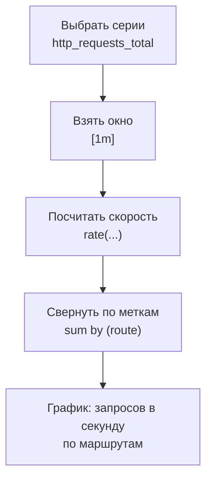
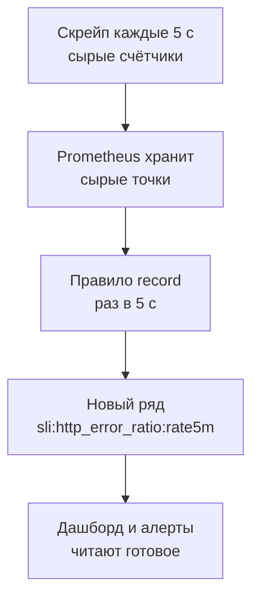

## Зачем это нужно

В прошлом уроке ты увидел, что Prometheus хранит тысячи временных рядов. Но тест нагрузки задаёт другие вопросы. Не «чему равен счётчик запросов», а «сколько запросов в секунду мы сейчас держим», не «сколько времени заняли все запросы», а «за сколько секунд отвечают 95 покупателей из ста», не «сколько было ошибок», а «какая **доля** ответов закончилась ошибкой». Ни одного из этих чисел в `/metrics` нет: их надо **вычислить** из сырых счётчиков и корзин.

Для этого у Prometheus есть язык запросов **PromQL** (Prometheus Query Language). Он не похож на SQL: ты не выбираешь строки таблицы, а берёшь временные ряды, применяешь к ним функции («скорость роста за минуту», «перцентиль по корзинам») и агрегации («сложи по всем экземплярам», «сгруппируй по маршруту»). Всё, что ты потом нарисуешь в Grafana и положишь в алерты, это запросы PromQL. Поэтому его знание это не «ещё один синтаксис», а **основной рабочий инструмент нагрузочника, который смотрит на графики**: если ты не можешь прочитать чужой запрос, ты не можешь доверять чужому графику.

Шаг проекта: ты заводишь рабочие инструменты `~/perf-lab/scripts/promq.sh` (запрос к Prometheus из терминала) и `traffic.sh` (фоновый трафик на стенд) и записываешь в `~/perf-lab/07-monitoring/red-queries.promql` набор запросов RED для «Магазина»: Rate (запросов в секунду), Errors (доля ошибок), Duration (p50, p95, p99). В следующем уроке из этих же запросов вырастут панели дашборда.

## Что нужно знать

- Что Prometheus собирает числа со `/metrics` каждые 5 секунд и хранит их как временные ряды с метками: [урок 7.1](01-metrics-prometheus.md).
- Четыре типа метрик, особенно **counter** (только растёт) и **histogram** (накопительные корзины `le`): [урок 7.1](01-metrics-prometheus.md).
- Стенд «Магазин» с профилем мониторинга запущен (`docker compose --profile monitoring up -d`), Prometheus открывается на `http://localhost:9090/query`.
- `curl` и `jq` для разбора ответа: [урок 1.4](../01-linux/04-network-cli.md) и [урок 1.1](../01-linux/01-workstation-terminal.md).

## Картина целиком

Электронная таблица, где каждая строка это временной ряд, а столбцы это моменты времени. Формулы в таблице делают три вещи: **выбирают** нужные строки (по имени и меткам), **считают по времени** внутри строки (разность значений за минуту, деленная на 60) и **сворачивают строки** между собой (сумма по всем маршрутам). PromQL устроен так же: запрос читается как конвейер, в котором данные идут слева направо и изнутри наружу.



На схеме: запрос `sum by (route) (rate(http_requests_total[1m]))` написан **изнутри наружу**: сначала выбор серий, потом окно, потом функция, потом агрегация. Читай такие запросы так же: найди самую внутреннюю часть и поднимайся наружу.

В PromQL значения бывают трёх видов, и от них зависит, какие функции допустимы:

- **Мгновенный вектор** (instant vector): набор серий, у каждой одно значение «в этот момент». Пример: `http_requests_in_progress` сейчас.
- **Вектор по интервалу** (range vector): набор серий, у каждой список точек за период, например за последнюю минуту. Пример: `http_requests_total[1m]`. Его нельзя нарисовать как график, он существует только для того, чтобы отдать его функции (`rate`, `increase`).
- **Скаляр** (scalar): одно число без меток, например `0.95`.

Эта тройка объясняет половину ошибок новичков: «функция ждёт range vector, а получила instant» (см. раздел «Сломай и почини»).

## Теория

### Селекторы: как выбрать серии

**Зачем это существует.** Prometheus хранит тысячи серий. Чтобы с ними работать, нужно описать, какие именно тебе нужны. Это делает **селектор** (selector): имя метрики и условия на метки в фигурных скобках.

**Как это устроено.** Простейший селектор это имя: `http_requests_total` вернёт все серии метрики. Условия на метки добавляются в `{}`:

```promql
http_requests_total{route="/api/products", status="200"}
```

Каждое условие называется **matcher**. Их четыре вида:

| Запись | Смысл | Пример |
|---|---|---|
| `=` | точно равно | `status="200"` |
| `!=` | не равно | `route!="other"` |
| `=~` | подходит под регулярное выражение | `status=~"5.."` |
| `!~` | не подходит под регулярное выражение | `route!~"/api/.*"` |

**Регулярное выражение** (regex) это короткая запись шаблона текста. В примере `5..` означает «цифра 5 и ещё два любых символа»: подойдут 500, 502, 503, 504. `.*` значит «любое количество любых символов», `|` значит «или»: `status=~"502|504"`. Важная особенность: в Prometheus регулярка должна подойти к **всему значению метки целиком**, как будто в начале стоит `^`, а в конце `$`. Поэтому `status=~"5"` ничего не найдёт: значение метки `"500"` не равно `"5"`.

**Разобранный пример.** Запрос `http_requests_total{status=~"5.."}` вернёт все серии со статусом, начинающимся на 5: ошибки сервера. Если ошибок ещё не было, вернётся **пустой** результат (серий нет), а не нулевое значение. Запомни это, оно пригодится при подсчёте доли ошибок.

Имя метрики на самом деле тоже метка: `__name__`. Поэтому `{job="shop"}` без имени выбирает все серии этого задания, а `http_requests_total{job="shop"}` это то же, что `{__name__="http_requests_total", job="shop"}`.

**Что путают.** Двойные кавычки вокруг значения обязательны (`status="200"`, а не `status=200`). И ещё: условия на метки **фильтруют серии**, а не значения внутри них. Нельзя сказать «покажи только значения больше 100» через matcher: для этого есть операторы сравнения (ниже).

### Как запрос вычисляется: момент и диапазон

**Зачем это существует.** Prometheus хранит точки с неровными временными отметками (скрейп случается каждые 5 секунд плюс-минус), а вопросы мы задаём на любое время. Нужно правило, что считать «значением в момент T».

**Как это устроено.** Запрос всегда вычисляется **на момент времени**. Для instant vector Prometheus берёт самую свежую точку серии не старше 5 минут от этого момента (это окно называют lookback, «оглядывание назад»). Если серия «замолчала» (сервис упал, и Prometheus перестал получать числа), серия получает специальную отметку «устарела» (stale marker) сразу после неудачного скрейпа и исчезает из результата. Если же цель пропала без отметки (например, Prometheus перезапустили), запрос ещё до 5 минут показывает её последнее значение: действует тот самый lookback.

Окно «5 минут» важно знать вот почему. Когда ты нажимаешь **Execute** на вкладке Table, это **мгновенный запрос** (instant query): один момент, «сейчас». Когда ты переключаешься на Graph, Grafana и Prometheus делают **запрос по диапазону** (range query): они повторяют вычисление для каждого момента с шагом (например, каждые 15 секунд за последний час) и соединяют полученные значения в линию. Каждая точка графика это отдельное вычисление запроса на свой момент времени.

Из этого следует практический вывод: **окно `[1m]` и шаг графика это не одно и то же.** Окно говорит, на какую глубину смотреть назад при вычислении одной точки. Шаг говорит, как часто вычислять точки.

### Range vector: окно в прошлое

**Зачем это существует.** Чтобы сказать «как быстро растёт счётчик», нужно сравнить несколько его значений во времени. Одного значения «сейчас» для этого мало. Окно `[1m]` отдаёт функции все точки серии за последнюю минуту.

**Как это устроено.** Окно записывается в квадратных скобках сразу после селектора: `http_requests_total[1m]`. Единицы: `s` секунды, `m` минуты, `h` часы, `d` дни, `w` недели: `[30s]`, `[5m]`, `[1h]`. В окне лежат точки от «сейчас минус окно» до «сейчас». Один нюанс актуален для Prometheus 3: левая граница окна исключается (точка ровно на «сейчас минус минута» в окно не входит), в Prometheus 2 она включалась. Для нагрузочного теста разница не важна, но если ты читаешь старый учебник, знай об этом.

Сколько точек окажется внутри? Окно делить на интервал скрейпа. На нашем стенде скрейп раз в 5 секунд, в окне `[1m]` будет около 12 точек, в `[30s]` около 6, в `[5s]` **одна или ни одной**. А чтобы посчитать скорость, нужно **минимум две** точки. Отсюда правило: **окно должно быть не меньше четырёх интервалов скрейпа** (для стенда: от 20 секунд, обычно берут `[1m]`). Если окно короче, `rate` не вернёт ничего, и график окажется пустым. Ты увидишь это на виджете ниже.

В стенде скрейп идёт каждые 5 секунд, поэтому `[1m]` (12 точек) годится. На боевых системах скрейп обычно 15-30 секунд: в окне `[1m]` останется 2-4 точки, график и алерты начнут дрожать от одной пропущенной точки. Там берут окно `[2m]`-`[5m]`, а в Grafana переменную `$__rate_interval`, которая подбирает окно сама (подробнее в [уроке 7.3](03-grafana.md)).

### rate, irate и increase: скорость роста счётчика

**Зачем это существует.** Вспомни урок 7.1: счётчик `http_requests_total` это накопленный итог, по нему не видно нагрузки. Нужна **скорость**: на сколько он вырос за секунду. Для этого придумана функция `rate()` (от английского «скорость»).

**Аналогия.** Одометр показал 12 000 км в 10:00 и 12 060 км в 11:00. Скорость = (12 060 - 12 000) / (1 час) = 60 км/ч. Одометр, как и счётчик, ничего не знает о скорости, мы вычисляем её по разности показаний и времени между ними. Аналогия ломается на сбросе: у одометра нет «обнуления посреди пути», а у счётчика сервиса при перезапуске оно есть.

**Как это устроено.** `rate(http_requests_total[1m])` для каждой серии:

1. берёт все точки за последнюю минуту (около 12);
2. считает, на сколько счётчик вырос от первой точки до последней, при этом **сброс до нуля** (значение вдруг меньше предыдущего) воспринимает как «счётчик обнулился и начал заново» и не вычитает, а прибавляет;
3. делит прирост на время между первой и последней точками (с небольшой поправкой, чтобы получить значение для всего окна, а не только между крайними точками: это называется экстраполяцией);
4. возвращает число «в секунду».

**Разобранный пример.** Допустим, в окне `[30s]` счётчик `http_requests_total{route="/api/products"}` имел значения: в 14:05:00 это 1500, в 14:05:30 это 1830. Прирост 330 за 30 секунд, скорость **11 запросов в секунду**. Если бы между точками был перезапуск (1830, потом 0, потом 120), `rate` посчитал бы прирост как (1830 - 1500) + 120, а не отрицательное число. На виджете ниже вместо одной серии три разные кривые, поэтому ты можешь убедиться на собственных глазах:

<div class="viz" data-viz="obs-rate" data-window="30"></div>

Смотри на графики: верхний график это сырой счётчик со ступеньками (замер каждые 5 секунд). Нижний это `rate` для окна, которое ты выставляешь ползунком. Серая пунктирная линия показывает настоящую нагрузку, которой в реальности Prometheus не знает, а только вычисляет. Синяя линия следует за ней: чем больше окно, тем ровнее линия, но тем сильнее она **запаздывает** при резком скачке (на секунде 60 нагрузка выросла втрое). Чем меньше окно, тем лучше видно скачок, но тем сильнее шум. При окне 5 секунд линии нет совсем: в окно не попадают две точки.

**Три родственные функции:**

| Функция | Что делает | Когда брать |
|---|---|---|
| `rate(x[1m])` | Среднюю скорость за всё окно, в штуках в секунду | Почти всегда: графики, алерты, расчёты |
| `irate(x[1m])` | Скорость по двум **последним** точкам окна («мгновенная») | Очень быстрые и дёрганые счётчики, когда важен каждый скачок. Для алертов не подходит: шумит |
| `increase(x[1m])` | Прирост **за всё окно**, в штуках | Когда нужны «штуки за период», а не «в секунду». Равен `rate * окно` |

Из-за экстраполяции `increase` может вернуть **дробное число** запросов (например, 59.7), хотя запросы целые: это не ошибка, а следствие того, что окно и замеры не совпадают по границам. Для оценки «сколько примерно было за минуту» этого достаточно. Включи на виджете кнопку irate и посмотри на жёлтую линию: она рисуется по двум соседним точкам и дёргается заметно сильнее.

**Что путают.** Первая и самая частая ошибка: применить `rate` к **gauge**. Для gauge скорость роста не имеет смысла (значение ходит вниз), а вот `rate` к счётчику обязателен. Вторая: взять слишком маленькое окно и получить пустой график. Третья: перепутать «в секунду» и «за минуту». `rate(...[1m])` возвращает число **в секунду**, независимо от длины окна. Окно лишь определяет, по какому периоду усреднять. Если нужно «за минуту», берут `increase(...[1m])` или `rate(...[1m]) * 60`.

**Проверь понимание:** `rate(http_requests_total[5m])` показывает 12. Это 12 запросов в секунду, в минуту или за 5 минут? А `increase(http_requests_total[5m])`?

<details markdown="1">
<summary>Ответ</summary>

`rate` возвращает всегда «в секунду»: 12 запросов в секунду, усреднённо за последние 5 минут. `increase` с тем же окном вернул бы около 12 × 300 = 3600: это прирост счётчика за всё окно в 5 минут.

</details>

### Агрегация: sum, avg, by и without

**Зачем это существует.** `rate(http_requests_total[1m])` возвращает **много серий**: по одной на каждую комбинацию `method`, `route`, `status`. Глядя на 14 линий, общую нагрузку не поймёшь. Агрегация сворачивает их в меньшее число.

**Как это устроено.** Основные функции агрегации: `sum` (сумма), `avg` (среднее), `min`, `max`, `count` (сколько серий), `topk(3, ...)` (три самых больших). Без уточнения они сворачивают **всё** в одну серию и теряют **все метки**:

```promql
sum(rate(http_requests_total[1m]))
```

Результат: одно число, общий RPS «Магазина», без меток. Чтобы сохранить часть меток, добавляют `by` (оставить перечисленные) или `without` (убрать перечисленные):

```promql
sum by (route) (rate(http_requests_total[1m]))      # одна линия на маршрут
sum by (route, status) (rate(http_requests_total[1m]))
sum without (instance, method) (rate(http_requests_total[1m]))
```

`by (route)` значит «сгруппируй по значению `route`, внутри каждой группы сложи, остальные метки выброси». Получится ровно столько серий, сколько разных маршрутов. `without` работает наоборот: «убери эти метки, остальные оставь».

**Разобранный пример.** Допустим, сейчас идёт `GET /api/products` 8 запросов в секунду с кодом 200, `GET /api/products/{id}` 20 в секунду с кодом 200 и 1 в секунду с кодом 404.

- `sum(rate(...))` вернёт одну серию: **29** (8 + 20 + 1).
- `sum by (route) (...)` вернёт две серии: `/api/products` = 8 и `/api/products/{id}` = 21 (20 + 1, статус свернулся).
- `sum by (status) (...)` вернёт: `200` = 28 и `404` = 1.

**Главное правило порядка: сначала `rate`, потом `sum`, а не наоборот.** Если сложить сырые счётчики разных серий (`sum(http_requests_total)`), а потом считать скорость, то при перезапуске **одного** экземпляра сумма резко упадёт, `rate` решит, что это сброс счётчика, и вернёт ложный скачок. Если сначала посчитать `rate` для каждой серии отдельно, то сбросы учитываются там, где они случились, и только потом результаты складываются. В PromQL так и не получится сделать наоборот: `rate(sum(x)[1m])` не пройдёт синтаксически, для такого есть тяжёлая конструкция subquery, о которой тебе пока не нужно думать.

**Что путают.** Потеря меток: после `sum(...)` без `by` пропадают `route` и `status`, и фильтровать результат по ним уже нельзя. Поэтому запрос «доля ошибок по маршрутам» надо считать как `sum by (route) (...5xx...) / sum by (route) (...)` с одинаковыми `by` с обеих сторон.

### Арифметика и доля ошибок

**Зачем это существует.** Доля ошибок это деление: «сколько запросов закончилось ошибкой» на «сколько запросов всего». Выражения в PromQL можно складывать, вычитать, умножать, делить, и это работает между сериями.

**Как это устроено.** Когда ты делишь один вектор на другой, Prometheus **сопоставляет серии по меткам**: делит те, у кого наборы меток совпадают. Если оба вектора после `sum(...)` без меток, сопоставление тривиально. Если слева `sum by (route)`, то справа тоже нужно `sum by (route)`, иначе пары не найдётся. Если метки не совпадают, добавляют `on(метки)` («сопоставляй только по этим») или `ignoring(метки)` («игнорируй эти»).

**Разобранный пример.** Доля 5xx:

```promql
sum(rate(http_requests_total{status=~"5.."}[1m]))
/
sum(rate(http_requests_total[1m]))
```

Пусть ошибок 1.5 в секунду, а всего 60 в секунду. Результат 1.5 / 60 = **0.025**: доля 2,5%. Prometheus выдаёт долю от 0 до 1, а в проценты её переводит Grafana (единица `percentunit`) или умножение на 100.

Но тут есть ловушка. Если ошибок нет, в числителе селектор `status=~"5.."` не нашёл серий, `sum` от пустого ничего не возвращает, а результат деления пустого на число тоже **пустой**. На графике это выглядит как «нет данных», хотя на самом деле ошибок ноль. Решение: подставить явный ноль. Для графика это удобно. В алерте так делать нельзя: `or vector(0)` превратит пропавшую метрику в «ноль ошибок», и алерт промолчит, хотя метрики нет вовсе. Для алертов пропажу проверяют отдельным правилом с `absent()` (урок 7.6). Так сделан эталонный дашборд стенда (его запрос ты увидишь в следующем уроке):

```promql
(sum(rate(http_requests_total{status=~"5.."}[1m])) or vector(0))
/
clamp_min(sum(rate(http_requests_total[1m])), 0.001)
```

- `or vector(0)`: оператор `or` берёт левую часть, а если она пустая, берёт правую. `vector(0)` создаёт серию без меток со значением 0. Итог: «если ошибок нет, считать ноль».
- `clamp_min(x, 0.001)`: не позволяет знаменателю быть меньше 0.001. Если сервис вообще не получает запросов, делить 0 на 0 нельзя (получится NaN, «не число»), а так получится 0 / 0.001 = 0.

**Что путают.** Складывать и делить проценты между собой нельзя: «5% от одного маршрута плюс 3% от другого» не равно «8% всех запросов», потому что у маршрутов разные объёмы. Всегда считай долю как **сумму ошибок, делённую на сумму всех**, а не как среднее долей.

### Сравнения и фильтры

Операторы сравнения `>`, `<`, `>=`, `==`, `!=` в PromQL ведут себя неожиданно для новичка: они **отбрасывают серии**, для которых условие ложно. Запрос

```promql
sum by (route) (rate(http_requests_total[1m])) > 10
```

вернёт только те маршруты, где RPS больше 10, остальные просто исчезнут из результата. Именно на этом построены алерты: алерт срабатывает, когда выражение вернуло хотя бы одну серию. Если нужно получить 0 или 1 (а не фильтр), добавляют модификатор `bool`: `... > bool 10`. Так, `up == 0` вернёт те цели, которые недоступны, а `up == bool 0` вернёт 1 для недоступных и 0 для остальных.

### Сравнение с прошлым: offset

Модификатор `offset` сдвигает вычисление в прошлое: `http_requests_in_progress offset 1h` значит «каким оно было час назад». Он помогает сравнивать «сейчас» с эталоном:

```promql
sum(rate(http_requests_total[5m])) / sum(rate(http_requests_total[5m] offset 1h))
```

Результат 1.4 значит «нагрузка выросла на 40% против часа назад». `offset` ставится **сразу после селектора** (до или вместе с окном), а не после функции. В нагрузочном тестировании так сравнивают «до» и «после» оптимизации: запусти один и тот же сценарий дважды, а потом смотри `p95` и `p95 offset 30m`.

### histogram_quantile: перцентиль из корзин

**Зачем это существует.** Перцентиль p95 это значение, не больше которого 95% измерений: «95 из 100 запросов ответили не медленнее X». Мы не храним времена отдельных запросов, а только накопительные счётчики по корзинам `le` (урок 7.1). Нужен способ получить p95 из них.

**Как это устроено.** Функция `histogram_quantile(0.95, <корзины>)` работает так:

1. По корзинам определяет, сколько всего запросов (`le="+Inf"`) и какой номер запроса отвечает 95-му перцентилю (95% от общего числа).
2. Находит **первую корзину, где накоплено не меньше этого числа запросов**.
3. Внутри этой корзины Prometheus **не знает**, где именно лежат запросы: он видит только «столько-то запросов оказалось между нижней и верхней границей». Поэтому он предполагает, что внутри корзины они распределены равномерно, и по прямой линии вычисляет, где находится нужный номер.

**Разобранный пример.** Окно в минуту, по `/api/products` пришло 1000 запросов, прирост корзин `rate`/`increase` такой:

| `le` | 0.025 | 0.05 | 0.1 | 0.25 | 0.5 | 1 | +Inf |
|---|---|---|---|---|---|---|---|
| Накоплено | 600 | 840 | 930 | 985 | 996 | 1000 | 1000 |

p95 это запрос номер 0.95 × 1000 = 950. Первая корзина, где накоплено не меньше 950, это `le="0.25"` (там 985, а в предыдущей `le="0.1"` только 930). Значит, p95 лежит между 0.1 и 0.25 секунды. В этой корзине находятся запросы с номерами 931…985, то есть 55 штук, а нужен 950-й, двадцатый по счёту в корзине. Равномерное предположение даёт:

```text
p95 = 0.1 + (0.25 - 0.1) × (950 - 930) / (985 - 930) = 0.1 + 0.15 × 20/55 = 0.1545 с ≈ 155 мс
```

Настоящий p95 может лежать где угодно между 100 и 250 мс: Prometheus этого знать не может. Вот почему **перцентиль по гистограмме всегда приблизительный**, и точность зависит от ширины корзины: чем уже корзина вокруг интересующего значения, тем точнее оценка. У «Магазина» корзины вокруг типичного времени 25–100 мс узкие (25, 50, 100), поэтому p95 для быстрых маршрутов оценивается хорошо, а вокруг 0.5–1 секунды корзина шириной в полсекунды, и оценка грубая. Если p95 вдруг уехал за 10 секунд, функция вернёт 10 (верхнюю границу последней обычной корзины), а настоящее значение ты не узнаешь: в такой ситуации пора расширять корзины в самом сервисе.

Теперь сам запрос, на котором всё это работает:

```promql
histogram_quantile(0.95, sum by (le) (rate(http_request_duration_seconds_bucket[1m])))
```

Разбор изнутри наружу:

- `http_request_duration_seconds_bucket[1m]` берёт серии корзин за минуту. Суффикс `_bucket` обязателен: у гистограммы три набора серий (`_bucket`, `_sum`, `_count`).
- `rate(...)` превращает накопленные счётчики корзин в скорости: так перцентиль считается по **недавним** запросам, а не по всей истории с момента запуска сервиса.
- `sum by (le) (...)` складывает корзины всех методов и маршрутов, сохраняя метку `le`. **Метку `le` терять нельзя**: без неё функции нечего сравнивать.
- `histogram_quantile(0.95, ...)` делает расчёт выше.

Хочешь p95 по маршрутам: `sum by (le, route) (...)`. Эти два параметра (`le` и то, что оставить) всегда пишутся вместе.

**Нельзя усреднять перцентили.** Если посчитать p95 по каждому маршруту, а потом взять среднее, ты получишь число, которое ничего не значит: у маршрутов разный объём запросов. Суммируй **корзины** (`sum by (le)`) и считай перцентиль от общей суммы, как в запросе выше. Это и есть причина, по которой гистограммы лучше summary.

Поэкспериментируй: на виджете корзины накапливаются по мере прихода запросов, а жёлтая корзина это та, внутри которой Prometheus ищет перцентиль.

<div class="viz" data-viz="obs-quantile" data-slow="5" data-q="95"></div>

Каждый столбик это накопительный счётчик корзины `le`, красная пунктирная линия это номер запроса, который ищется (при p95 из 2000 запросов это 1900-й). Желтоватая корзина первой пересекает эту линию. Под виджетом сравнены две цифры: оценка по корзинам и настоящее значение, которое можно посчитать только потому, что виджет знает все времена запросов. Так выглядит работа `histogram_quantile` и так возникает его погрешность.

**Среднее из гистограммы.** Для среднего не нужна интерполяция, достаточно двух счётчиков: `rate(..._sum[1m]) / rate(..._count[1m])`: суммарное время делить на число запросов. Сравнение «среднее против p95» это быстрый способ заметить хвост: если p95 в 10 раз больше среднего, у сервиса длинный хвост.

**Что путают.** Три ошибки: взять `histogram_quantile` без `rate` (получится перцентиль за всё время жизни сервиса: такой график почти не движется), потерять `le` в `sum by`, и считать результат точным числом, особенно в широких корзинах. Нагрузочник должен помнить: «p95 = 480 мс по гистограмме» означает «p95 где-то в районе полусекунды», а не «ровно 480».

### Recording rules: запрос, посчитанный заранее

**Зачем это существует.** Запрос `rate(...[6h])` по всем сериям магазина заставляет Prometheus каждый раз прочитать шесть часов точек. На дашборде, который обновляется каждые 5 секунд, или в алерте, который проверяется каждые 5 секунд, это лишняя работа: ответ почти не меняется между проверками. Хуже того, одно и то же сложное выражение копируют в десять панелей и три алерта, и однажды в одном месте его правят, а в остальных забывают.

**Аналогия.** В ресторане повар заранее нарезает овощи на смену (заготовка), а не режет их заново под каждый заказ. Recording rule это заготовка для запроса. Аналогия ломается на свежести: заготовка обновляется по расписанию, а не в момент заказа.

**Как это устроено.** **Recording rule** (правило записи) это запрос PromQL, который Prometheus сам вычисляет каждый `evaluation_interval` и сохраняет результат как **новый временной ряд** с именем, которое ты задал. Дальше на дашборде и в алертах читают готовый ряд. Правила лежат в том же формате, что алерты, но вместо `alert:` пишут `record:`. Вот правило стенда из `monitoring/prometheus/rules/slo.yml`:

```yaml
- record: sli:http_error_ratio:rate5m
  expr: (sum(rate(http_requests_total{status=~"5.."}[5m])) or vector(0)) / sum(rate(http_requests_total[5m]))
```

Имя `sli:http_error_ratio:rate5m` сложено по принятому шаблону `уровень:метрика:операции`: что это (показатель SLI), о чём (доля ошибок) и как посчитано (`rate` за 5 минут). Двоеточия в именах разрешены только для таких правил: обычные метрики с двоеточием называть нельзя. Окно записано прямо в имени, поэтому рядом лежат `rate30m`, `rate1h`, `rate6h`: одна формула на четырёх окнах (зачем они нужны, разберём в [уроке 8.4](../08-perf-theory/04-load-profile-slo.md)).



На схеме: тяжёлое вычисление делается один раз в правиле, а читателей (панели, алерты) может быть сколько угодно, и каждый берёт одну точку.

**Разобранный пример.** Допустим, у `http_requests_total` 60 серий (маршруты, методы и статусы в сочетаниях). Скрейп раз в 5 секунд, окно 6 часов: это 21 600 / 5 = 4320 точек на серию, всего 60 × 4320 = 259 200 точек, которые надо прочитать и сложить при каждой проверке. Правило считает это раз в 5 секунд и записывает **один** ряд. Если алерт и три панели используют этот ряд, каждый из четырёх читает одну точку вместо 259 200. В стенде нагрузка мала и разницы ты не заметишь, в бою с тысячами серий она решает, откроется ли дашборд за секунду или за полминуты.

**Что путают.** Во-первых, recording rule не пересчитывает прошлое: новый ряд появляется с момента добавления правила, а истории до этого нет. Во-вторых, ряд обновляется раз в `evaluation_interval`, поэтому значение чуть старше сырых данных. В-третьих, правило не заменяет метрику: сырые счётчики остаются, из них можно посчитать что-то другое. Чтобы увидеть правила стенда, открой `http://localhost:9090/rules` и выполни запрос `sli:http_error_ratio:rate5m`: при трафике без ошибок это ноль, а если трафика нет совсем, нет и ряда.

> **Проверь понимание:** в правиле есть `or vector(0)`. Что случится без него, когда у магазина за окно не было ни одной ошибки 5xx?

<details markdown="1">
<summary>Ответ</summary>

Без пятисотых нет ни одной серии с `status=~"5.."`, поэтому числитель пуст, и деление «пусто / число» тоже пусто: ряд доли ошибок исчезнет ровно тогда, когда всё хорошо. Алерты на нём молчали бы, но на графике была бы дыра. `or vector(0)` подставляет ноль вместо пустого числителя, и ряд существует всегда, пока есть трафик (разбор в разделе «Арифметика и доля ошибок»).

</details>

### Полезная мелочь на каждый день

- `topk(3, sum by (route) (rate(http_requests_total[1m])))`: три самых нагруженных маршрута.
- `max_over_time(http_requests_in_progress[5m])`: пик gauge за 5 минут (функции `*_over_time` берут окно по времени для одной серии, `avg_over_time`, `min_over_time`). Помогают поймать то, что gauge пропустил между замерами.
- `absent(up{job="shop"})`: возвращает 1, если серии нет вообще; нужна для алертов «метрика пропала».
- `delta(x[5m])`: прирост **gauge** за окно (для counter используется `increase`).
- `count by (job) (up)`: сколько целей в каждом задании.

## Практика

Файлы складывай в `~/perf-lab/07-monitoring/` и `~/perf-lab/scripts/`. Нагрузку даём только на свой стенд.

### 1. Инструмент: запрос из терминала

В браузере удобно смотреть графики, но проверять запросы и вставлять результаты в отчёты удобнее из терминала. Prometheus отдаёт результат по HTTP API: `GET /api/v1/query?query=...`. Сделаем маленькую обёртку `~/perf-lab/scripts/promq.sh`:

```bash
#!/usr/bin/env bash
# promq.sh '<запрос PromQL>': мгновенный запрос к Prometheus, печатает «метки  значение»
set -euo pipefail
curl -sG localhost:9090/api/v1/query --data-urlencode "query=$1" \
  | jq -r 'if .status == "success"
           then .data.result[] | ((.metric | to_entries | map("\(.key)=\(.value)") | join(",")) + "  " + .value[1])
           else "ОШИБКА: " + .error end'
```

Разбор команды:

- `curl -sG ... --data-urlencode "query=$1"`: `-s` без индикатора загрузки, `-G` значит «отправь данные в адресе (GET), а не в теле», `--data-urlencode` сам закодирует спецсимволы запроса (скобки, кавычки, пробелы), чтобы адрес не сломался;
- `$1` это первый аргумент скрипта, то есть твой запрос;
- в `jq`: `.data.result[]` берёт каждую серию результата, `.metric` это словарь меток, `to_entries | map("\(.key)=\(.value)") | join(",")` превращает его в строку `метка=значение,метка=значение`, `.value[1]` это значение (в паре `[время, значение]` оно второе). Если запрос с ошибкой, Prometheus отвечает `status: "error"`, и скрипт печатает текст ошибки.

Сделай файл исполняемым и проверь:

```bash
chmod +x ~/perf-lab/scripts/promq.sh
~/perf-lab/scripts/promq.sh 'count(up)'
```

```text
  8
```

Пустые метки и значение 8: во всех восьми целях Prometheus. Если вывода нет вовсе, запрос вернул пустой результат; если `curl: (7) Failed to connect`, Prometheus не запущен (урок 7.1).

### 2. Инструмент: фоновый трафик

Для практики нужна **живая нагрузка**, иначе `rate` всегда нулевой. Скрипт `~/perf-lab/scripts/traffic.sh` шлёт смешанный трафик на «Магазин»: каталог, карточки, категории, раз в десять итераций заказ и один заведомо неверный запрос.

```bash
#!/usr/bin/env bash
# traffic.sh [секунд] [пауза]: смешанный лёгкий трафик на локальный Магазин (по умолчанию 300 с)
DURATION=${1:-300}; PAUSE=${2:-0.05}; BASE=http://localhost:8000
TOKEN=$(curl -s "$BASE/api/login" -H 'Content-Type: application/json' \
  -d '{"email":"user0003@shop.lab","password":"password"}' | jq -r .token)
end=$((SECONDS + DURATION)); n=0
while [ "$SECONDS" -lt "$end" ]; do
  n=$((n + 1))
  curl -s -o /dev/null "$BASE/api/products"
  curl -s -o /dev/null "$BASE/api/products/$((RANDOM % 10000 + 1))"
  curl -s -o /dev/null "$BASE/api/categories"
  if [ $((n % 10)) -eq 0 ]; then
    curl -s -o /dev/null -X POST "$BASE/api/cart/items" -H "Authorization: Bearer $TOKEN" \
      -H 'Content-Type: application/json' -d "{\"product_id\": $((RANDOM % 10000 + 1)), \"qty\": 1}"
    curl -s -o /dev/null -X POST "$BASE/api/orders" -H "Authorization: Bearer $TOKEN"
    curl -s -o /dev/null "$BASE/api/no-such-path"
  fi
  sleep "$PAUSE"
done
echo "готово: $n итераций"
```

Разбор команд:

- `SECONDS` это встроенный счётчик секунд работы оболочки bash, по нему цикл знает, когда остановиться;
- `$((RANDOM % 10000 + 1))` берёт случайное число от 1 до 10 000: разные товары;
- `n % 10 -eq 0` срабатывает на каждой десятой итерации: тогда добавляется товар в корзину, оформляется заказ и делается запрос на несуществующий путь (он попадёт в `route="other"` со статусом 404);
- `sleep "$PAUSE"` это пауза в секундах между итерациями, чтобы не нагружать машину сильнее нужного.

Запусти в фоне и оставь работать на всё время практики:

```bash
chmod +x ~/perf-lab/scripts/traffic.sh
~/perf-lab/scripts/traffic.sh 900 &
```

Знак `&` в конце запускает скрипт в фоне, терминал остаётся свободным. Через минуту трафик будет заметен в метриках. Остановить досрочно: `kill %1` (или просто дождаться конца 900 секунд).

**Типичные ошибки:** `jq: error ... null`: токен не получен, значит, «Магазин» не отвечает: проверь `curl -s localhost:8000/readyz`. Заказы возвращают 400 или 409 (пустая корзина, мало товара): для этого упражнения это не мешает.

### 3. Селекторы и окна

Открой `http://localhost:9090/query` или используй скрипт. Выполняй запросы по порядку и читай результат.

```bash
~/perf-lab/scripts/promq.sh 'http_requests_total{route="/api/products"}'
~/perf-lab/scripts/promq.sh 'http_requests_total{status=~"4..|5.."}'
~/perf-lab/scripts/promq.sh 'http_requests_total{route!~"/api/.*"}'
```

Первый возвращает все серии маршрута (у тебя один статус 200). Второй показывает 4xx и 5xx: должна быть строка `route=other,status=404` (запрос на несуществующий путь) и, возможно, 404/409/400 для заказов. Третий: все маршруты кроме начинающихся с `/api/`, то есть только `other`.

```bash
~/perf-lab/scripts/promq.sh 'http_requests_total{route="/api/products"}[1m]'
```

Скрипт напечатает ошибку или странный результат: `[1m]` возвращает range vector, а скрипт показывает только мгновенные векторы. В UI на вкладке Table ты увидишь список пар «значение @ время». Посчитай глазами, сколько там точек (около 12) и какой между ними интервал (5 секунд).

### 4. rate, increase, irate

```bash
~/perf-lab/scripts/promq.sh 'rate(http_requests_total{route="/api/products"}[1m])'
~/perf-lab/scripts/promq.sh 'increase(http_requests_total{route="/api/products"}[1m])'
~/perf-lab/scripts/promq.sh 'irate(http_requests_total{route="/api/products"}[1m])'
```

```text
instance=shop:8000,job=shop,method=GET,route=/api/products,status=200  9.35
instance=shop:8000,job=shop,method=GET,route=/api/products,status=200  561.2
instance=shop:8000,job=shop,method=GET,route=/api/products,status=200  8.8
```

**Как читать вывод:** числа у тебя будут другие, зависят от скорости машины и паузы в трафике. Проверь связь: `increase` примерно равен `rate × 60` (561.2 ≈ 9.35 × 60 = 561: расхождение на экстраполяции), а `irate` близок к `rate`, но немного отличается: он смотрит только на два последних замера. Попробуй окно `[10s]`: `rate` может ещё работать (две точки), а `[5s]` уже ничего не вернёт.

**Типичные ошибки:** запрос `rate(http_requests_total[1m])` возвращает много серий: это нормально, у метрики несколько комбинаций меток. Суммируй их агрегацией.

> Запрос возвращает пусто или не то, что ждал? Скопируй запрос и скриншот или текст результата, спроси нейросеть, что считает каждая часть. Проверь по алгоритму из урока: сначала вернись к простому селектору метрики, потом добавляй `rate`, `sum by` по одному.
{: .ai}

### 5. Агрегация: запросы RED

Теперь собери основу RED «Магазина»: Rate (сколько запросов), Errors (какая доля ошибок), Duration (сколько ждут). Создай файл `~/perf-lab/07-monitoring/red-queries.promql`:

```promql
# R: запросов в секунду, всего
sum(rate(http_requests_total[1m]))

# R: запросов в секунду по маршрутам
sum by (route) (rate(http_requests_total[1m]))

# E: доля ответов 5xx, от 0 до 1 (ноль, если ошибок не было)
(sum(rate(http_requests_total{status=~"5.."}[1m])) or vector(0))
/
clamp_min(sum(rate(http_requests_total[1m])), 0.001)

# E: доля 5xx по маршрутам (одинаковый by с обеих сторон)
sum by (route) (rate(http_requests_total{status=~"5.."}[1m]))
/
sum by (route) (rate(http_requests_total[1m]))

# D: p50, p95, p99 по всему магазину, секунды
histogram_quantile(0.50, sum by (le) (rate(http_request_duration_seconds_bucket[1m])))
histogram_quantile(0.95, sum by (le) (rate(http_request_duration_seconds_bucket[1m])))
histogram_quantile(0.99, sum by (le) (rate(http_request_duration_seconds_bucket[1m])))

# D: p95 по маршрутам
histogram_quantile(0.95, sum by (le, route) (rate(http_request_duration_seconds_bucket[1m])))

# D: среднее по маршрутам (сравни с p95: большая разница = длинный хвост)
sum by (route) (rate(http_request_duration_seconds_sum[1m]))
/
sum by (route) (rate(http_request_duration_seconds_count[1m]))
```

Теперь проверь каждый запрос. Запросы из нескольких строк передавай одной строкой, например:

```bash
~/perf-lab/scripts/promq.sh 'histogram_quantile(0.95, sum by (le) (rate(http_request_duration_seconds_bucket[1m])))'
```

```text
  0.0434
```

**Как читать вывод:** результат без меток, значение в **секундах**: 0.0434 с это 43 мс. На спокойном стенде p95 по всему магазину обычно десятки миллисекунд. Для самих маршрутов: `/api/products` (список с пагинацией) и `/api/orders` (заказ с оплатой, около 50 мс одной только оплаты) будут различаться. Запомни свои числа: это твоя первая **базовая линия** для темы 11.

Сохрани рядом свои числа в конце файла комментарием:

```promql
# Мои числа в спокойном состоянии (дата): RPS = ..., p95 = ... мс, 5xx = ...%
```

На графике в UI (вкладка **Graph**, период «Last 15m») построй `sum by (route) (rate(http_requests_total[1m]))`: за 15 минут ты увидишь линию на каждый маршрут. Вот примерно как выглядит p95 и RPS «Магазина» на ступенчатой нагрузке (числа реалистичны для этого стенда на одном ядре, у тебя будут другие):

<div class="viz" data-viz="chart" data-title="Ступенчатая нагрузка: RPS и p95" data-x="1,2,3,4,5,6" data-series='[{"name":"RPS","values":[20,40,60,80,95,98],"unit":"в с"},{"name":"p95","values":[45,52,70,160,780,2400],"unit":"мс"}]' data-x-label="минута теста" data-y-label="значение" data-explain="RPS растёт вместе с нагрузкой, пока у сервиса есть запас, потом упирается в потолок около 100. p95 тем временем почти не меняется до четвёртой минуты и затем взлетает: это хоккейная клюшка. Нагрузочник читает такие графики вместе: на какой нагрузке RPS перестал расти и p95 пошёл вверх, там и предел."></div>

### 6. Сравнение и фильтр

```bash
~/perf-lab/scripts/promq.sh 'sum by (route) (rate(http_requests_total[1m])) > 5'
~/perf-lab/scripts/promq.sh 'sum(rate(http_requests_total[1m])) / sum(rate(http_requests_total[1m] offset 5m))'
```

Первый вернёт только маршруты, нагрузка на которые превышает 5 запросов в секунду (остальные исчезнут). Второй сравнит сегодняшнюю нагрузку с той, что была 5 минут назад: если трафик ровный, число около 1. Пока скрипт работает меньше 5 минут, второй запрос вернёт пустой результат: за это время данных «пять минут назад» ещё нет.

Закончи упражнение запросом на себя: найди самый нагруженный маршрут одним запросом (`topk(1, ...)`) и допиши этот запрос в файл.

Если ты уже прошёл тему 3, закоммить:

```bash
cd ~/perf-lab && git add scripts 07-monitoring && git commit -m "7.2: promq.sh, traffic.sh и запросы RED" && git push
```

## Сломай и почини

**Поломка.** Перед тобой пять запросов от «коллеги»: в каждом одна ошибка. Выполни каждый и скажи, что не так, не подсматривая в разбор.

```promql
# 1
rate(http_requests_total)

# 2
histogram_quantile(0.95, rate(http_request_duration_seconds_bucket[1m]))

# 3
histogram_quantile(0.95, sum by (route) (rate(http_request_duration_seconds_bucket[1m])))

# 4
sum(http_requests_total{status=~"5.."}) / sum(http_requests_total)

# 5
rate(http_requests_in_progress[1m])
```

**Задача:** найди для каждого, что именно неверно и как это отличить от правильного запроса. Порядок рассуждения:

<div class="viz" data-viz="flow" data-steps='[{"title":"Запрос не выполняется","text":"Прочитай текст ошибки: он называет тип ожидаемого значения и место."},{"title":"Запрос выполняется, но странный","text":"Сравни число серий и метки в ответе с тем, что ты ожидал."},{"title":"Проверь тип метрики","text":"Для counter нужен `rate`, для gauge значение, для histogram `_bucket` и `le`."},{"title":"Проверь порядок","text":"Сначала `rate` или `increase`, потом `sum`, потом `histogram_quantile`."},{"title":"Проверь пустоту","text":"Пустой результат: нет серии, нет события или потеряна нужная метка."}]'></div>

<details markdown="1">
<summary>Разбор</summary>

1. **Ошибка выполнения**: `parse error: expected type range vector in call to function "rate", got instant vector`. `rate` нужен интервал, `[1m]` пропущен. Исправление: `rate(http_requests_total[1m])`.
2. Запрос **выполнится**, но вернёт p95 отдельно для каждой пары «метод, маршрут» (и вместе с `le` внутри), а не общий. Не хватает `sum by (le)` между `rate` и `histogram_quantile`. Если оставить как есть, ты получишь много серий вместо одной. Исправление: `histogram_quantile(0.95, sum by (le) (rate(...[1m])))`.
3. В `sum by (route)` потеряна метка `le`. Корзин больше нет, и результат окажется пустым или `NaN`. Исправление: `sum by (le, route)`.
4. Запрос выполняется, но считает **долю за всё время жизни сервиса**: счётчики не обёрнуты в `rate`. Эта доля почти не изменится за час нагрузочного теста, а при перезапуске сервиса сбросится. Исправление: `sum(rate(...5xx...[1m])) / sum(rate(...[1m]))`, плюс `or vector(0)` на случай отсутствия ошибок.
5. `rate` к gauge: PromQL не запретит, но результат бессмысленный: у значения «запросов в работе» нет скорости роста, а при убывании получится «сброс» и ложные скачки. Для gauge смотри само значение или `avg_over_time(...)`.

Правило, которое объединяет все пять: **у каждого типа метрики своя функция** (counter получает `rate`, gauge смотрят как есть, histogram идёт через `_bucket`, `rate`, `sum by (le)` и только потом `histogram_quantile`).

</details>

## ИИ в помощь

Нейросеть хорошо составляет запросы PromQL по описанию и объясняет чужие, но формулы перцентилей и окна она путает чаще всего. Общие правила: [ИИ-помощник](../ai.md).

**Задача:** составить запрос p95 задержки по маршрутам.

```text
Prometheus 3, метрика http_request_duration_seconds (гистограмма, метки method, route и le у бакетов).
Составь PromQL: p95 задержки по каждому route за последние 5 минут. Объясни по частям:
зачем rate, зачем sum by (le, route), что делает histogram_quantile и почему
без le в sum by результат неверный.
```
{: .wrap}

**Проверь ответ:** вставь запрос в Prometheus (`localhost:9090`) под фоновым трафиком и сравни со значениями на дашборде или с результатом твоего скрипта. Типичные ошибки: `sum by (route)` без `le` (результат бессмыслен), `rate` от бакета без окна, квантиль 95 вместо 0.95, использование несуществующего `http_request_duration_seconds_p95`.

**Задача:** объяснить чужой запрос.

```text
Объясни простыми словами, что считает этот запрос PromQL и в каких единицах результат:
<вставь запрос>. Что покажет, если трафика нет вообще? Где в нём может появиться NaN или пустой результат?
```
{: .wrap}

**Проверь ответ:** выполни по частям: сначала внутренний `rate(...)`, потом `sum`, потом остальное, и сравни с объяснением. Нейросеть часто путает `rate` и `increase`: сверь с таблицей из урока.

## Словарик урока

| Термин | Простыми словами |
|---|---|
| PromQL | Язык запросов Prometheus: выбираешь серии, считаешь по времени, сворачиваешь по меткам |
| Селектор (selector) | Имя метрики и условия на метки в `{}`, описывающие нужные серии |
| Matcher | Одно условие в селекторе: `=`, `!=`, `=~`, `!~` |
| Регулярное выражение (regex) | Короткая запись шаблона текста; в Prometheus подходит ко всему значению метки целиком |
| Мгновенный вектор (instant vector) | Набор серий с одним значением на момент времени |
| Вектор по интервалу (range vector) | Набор серий со списком точек за период, например `[1m]`; нужен функциям |
| Скаляр (scalar) | Одно число без меток |
| Окно (window) | Глубина в прошлое, по которой считается функция: `[1m]` |
| `rate()` | Средняя скорость роста счётчика за окно, в штуках в секунду |
| `irate()` | Скорость по двум последним точкам окна, резкая и шумная |
| `increase()` | Прирост счётчика за окно в штуках; может быть дробным |
| Сброс счётчика (counter reset) | Значение вдруг упало (перезапуск); `rate` считает рост заново |
| Агрегация (aggregation) | Свёртка нескольких серий в меньшее число: `sum`, `avg`, `max`, `count`, `topk` |
| `by` / `without` | Оставить перечисленные метки при агрегации / убрать перечисленные |
| Recording rule | Правило, по которому Prometheus заранее считает запрос и сохраняет результат как новый ряд |
| `histogram_quantile()` | Считает перцентиль по накопительным корзинам; результат приблизителен |
| Интерполяция | Допущение, что внутри корзины запросы лежат равномерно, и расчёт по прямой |
| `offset` | Сдвиг вычисления в прошлое: «каким было час назад» |
| `bool` | Модификатор сравнения: вернуть 0 или 1 вместо фильтрации серий |
| Запрос по диапазону (range query) | Повторение вычисления для каждого шага времени; так строятся графики |
| RED | Три главные величины сервиса: Rate (запросов в секунду), Errors (ошибки), Duration (длительность) |

## Вопросы с собеседований

Раздел для повторения: ответь вслух, потом открой ответ. Короткие вопросы с пометкой `[на скорость]` тренируй на время: ответ за 30 секунд.

### 1. [junior] [часто] Зачем нужна функция `rate` и почему нельзя рисовать counter как есть?

<details markdown="1">
<summary>Ответ</summary>

Counter накапливает итог с момента запуска и только растёт, поэтому график это лестница, из которой не видно нагрузки. `rate` считает скорость роста: сколько запросов добавилось в секунду, усреднённо за окно. Плюс при перезапуске сервиса counter обнуляется, и `rate` умеет такой сброс учитывать, а сырой график падает в ноль.

**Что хотят услышать:** скорость вместо итога, единицы «в секунду», обработка сброса.

**Красный флаг:** «rate нужен, чтобы сгладить график».

</details>

### 2. [junior] [часто] Чем `rate` отличается от `irate` и `increase`?

<details markdown="1">
<summary>Ответ</summary>

`rate` это средняя скорость по всем точкам окна, в штуках в секунду. `irate` считает по двум последним точкам и поэтому «мгновенная», но шумная: для алертов не годится. `increase` возвращает прирост за всё окно в штуках, примерно `rate × длина окна`, и может быть дробным из-за экстраполяции. Для графиков и алертов по умолчанию берут `rate`.

**Что хотят услышать:** три функции, единицы каждой, когда какую брать.

**Красный флаг:** «irate точнее, потому что берёт свежие данные» (без оговорки про шум).

</details>

### 3. [junior] [часто] Что делает `sum by (route) (...)` и что будет, если убрать `by`?

<details markdown="1">
<summary>Ответ</summary>

С `by (route)` серии группируются по значению метки `route`, внутри группы значения складываются, остальные метки выбрасываются: получится по одной линии на маршрут. Без `by` вся метрика сворачивается в одно число, и все метки теряются, потом нельзя разбить или отфильтровать результат по маршруту или статусу.

**Что хотят услышать:** группировка, судьба меток, `without` как противоположность.

**Красный флаг:** «by сортирует результат».

</details>

### 4. [junior] Почему `rate` пишут внутри `sum`, а не наоборот?

<details markdown="1">
<summary>Ответ</summary>

Скорость считают для каждой серии отдельно, потому что сброс счётчика (перезапуск одного экземпляра) нужно видеть там, где он случился. Если сначала сложить сырые счётчики, то перезапуск одного экземпляра выглядит как падение общей суммы, и `rate` покажет ложный скачок. Поэтому сначала `rate` по сериям, потом `sum` по результатам.

**Что хотят услышать:** обработка сбросов на уровне одной серии.

**Красный флаг:** «в PromQL порядок не важен».

</details>

### 5. [junior] Как посчитать долю ошибок и что делать, если ошибок нет и на графике «нет данных»?

<details markdown="1">
<summary>Ответ</summary>

Доля = скорость 5xx-ответов, деленная на скорость всех ответов: `sum(rate(...{status=~"5.."}[1m])) / sum(rate(...[1m]))`. Если ошибок нет, числитель пуст, и результат пуст. Решение: `(... or vector(0))` в числителе и защита знаменателя `clamp_min(..., 0.001)`, чтобы при нуле запросов не получить 0 / 0.

**Что хотят услышать:** деление сумм (а не среднее долей), `or vector(0)`, понимание, почему результат пустой.

**Красный флаг:** «посчитаю среднее процентов по маршрутам».

</details>

### 6. [middle] [часто] Почему `histogram_quantile` даёт приблизительный результат?

<details markdown="1">
<summary>Ответ</summary>

Гистограмма хранит только счётчики по корзинам, а времена отдельных запросов нет. Prometheus находит корзину, в которую попадает нужный перцентиль, и считает, что запросы внутри неё распределены равномерно, то есть интерполирует по прямой. Настоящее значение может лежать в любом месте корзины. Точность определяют границы корзин: чем уже корзина вокруг интересующего значения, тем лучше. Если перцентиль попадает в последнюю корзину, результат равен её верхней границе.

**Что хотят услышать:** корзины, равномерное допущение, зависимость от границ, граничный случай.

**Красный флаг:** «histogram_quantile считает точный перцентиль».

</details>

### 7. [middle] Напиши запрос p95 по маршрутам и объясни каждую часть.

<details markdown="1">
<summary>Ответ</summary>

`histogram_quantile(0.95, sum by (le, route) (rate(http_request_duration_seconds_bucket[1m])))`. Изнутри: `_bucket[1m]` берёт серии корзин за минуту, `rate` превращает накопленные счётчики в скорости, чтобы смотреть недавние запросы, `sum by (le, route)` складывает методы, но сохраняет границы корзин `le` и разрез по маршруту, `histogram_quantile(0.95, ...)` считает перцентиль.

**Что хотят услышать:** все четыре шага, обязательность `le`, объяснение, почему нужен `rate`.

**Красный флаг:** потерять `le` или забыть `rate`.

</details>

### 8. [middle] Можно ли усреднять p95 разных маршрутов или серверов?

<details markdown="1">
<summary>Ответ</summary>

Нет. Среднее перцентилей не равно перцентилю общего набора: у серверов разный объём запросов и разные распределения. Правильно складывать корзины (`sum by (le)`) и считать перцентиль от суммы. Это одна из причин, почему гистограмма лучше summary, у которого готовые перцентили объединять нельзя.

**Что хотят услышать:** почему нельзя, как правильно (суммировать корзины).

**Красный флаг:** «усреднить можно, ошибка небольшая».

</details>

### 9. [middle] Как выбрать окно для `rate`?

<details markdown="1">
<summary>Ответ</summary>

Окно должно содержать хотя бы две точки, лучше не меньше четырёх интервалов скрейпа (для скрейпа 5 с это от 20 с, обычно `[1m]`). Короткое окно даёт шумный график, хотя быстро реагирует на скачок. Длинное сглаживает, но запаздывает: пик может размазаться. Для алертов берут окно подлиннее, чтобы не срабатывать на шум, для графиков при нагрузочном тесте 1 минуту.

**Что хотят услышать:** компромисс шум против запаздывания, правило про число точек.

**Красный флаг:** «чем меньше окно, тем точнее».

</details>

### 10. [middle] Чем instant query отличается от range query?

<details markdown="1">
<summary>Ответ</summary>

Instant query вычисляется на один момент времени и возвращает по одному значению на серию (так работает вкладка Table и алерты). Range query повторяет вычисление для каждого шага на периоде и возвращает ряд точек: так строятся графики. Каждая точка графика это отдельный instant query на свой момент. Окно `[1m]` внутри запроса и шаг графика это разные вещи: окно задаёт глубину расчёта одной точки, шаг частоту точек.

**Что хотят услышать:** момент против диапазона, независимость окна и шага.

**Красный флаг:** путать окно функции с периодом графика.

</details>

### 11. [middle] В графике нагрузки RPS растёт, а доля ошибок равна нулю. Эта доля может быть пустой на графике?

<details markdown="1">
<summary>Ответ</summary>

Может: если ошибок не было ни разу, серий с `status=~"5.."` нет, числитель пуст, и результат пуст. Это «нет данных», а не «ноль». В дашбордах и алертах это закрывают `or vector(0)`. Но при этом надо отличать это от ситуации, когда пропали сами метрики (цель упала): для неё делают отдельную проверку `up == 0` или `absent(...)`.

**Что хотят услышать:** отличие «ноль» от «нет данных», приём `or vector(0)`, разделение с проверкой доступности.

**Красный флаг:** «нет данных значит ошибок нет».

</details>

### 12. [junior] [на скорость] К какому типу метрик применяют `rate`?

<details markdown="1">
<summary>Ответ</summary>

К counter (и к `_bucket`, `_sum`, `_count` у histogram: они тоже счётчики). К gauge `rate` не применяют: смотрят само значение.

</details>

### 13. [junior] [на скорость] Что вернёт `rate(x[5s])` при скрейпе раз в 5 секунд?

<details markdown="1">
<summary>Ответ</summary>

Скорее всего ничего: в окно попадает одна точка, а для скорости нужно две. Окно берут не меньше четырёх интервалов скрейпа.

</details>

### 14. [middle] Что такое recording rule и когда он нужен?

<details markdown="1">
<summary>Ответ</summary>

Это запрос PromQL, который Prometheus сам вычисляет по расписанию и записывает результатом новый временной ряд. Нужен, когда выражение тяжёлое (длинные окна, много серий) или его используют много панелей и алертов: считается один раз, читается быстро, формула живёт в одном месте. Имена дают по шаблону `уровень:метрика:операции`, например `sli:http_error_ratio:rate5m`.

**Что хотят услышать:** «посчитано заранее», экономия на тяжёлых запросах, одно определение для дашбордов и алертов, соглашение об имени.

**Красный флаг:** «recording rule пересчитывает историю» или «это то же самое, что алерт».

</details>

### 15. [middle] [на скорость] Как получить среднее время запроса из histogram?

<details markdown="1">
<summary>Ответ</summary>

`rate(..._sum[1m]) / rate(..._count[1m])`: суммарное время, делённое на число запросов за окно.

</details>

## Проверено на версиях

Ubuntu 24.04, Prometheus 3.15 (HTTP API `/api/v1/query`), `jq` 1.7, стенд «Магазин» из `project/shop`. Октябрь 2026.

## Итог урока: ты умеешь

- [ ] Выбирать серии селектором с `=`, `!=`, `=~`, `!~` и объяснить разницу instant и range vector.
- [ ] Объяснить, почему к counter применяют `rate`, и чем `rate` отличается от `irate` и `increase`.
- [ ] Выбрать окно и объяснить, почему оно не короче четырёх интервалов скрейпа.
- [ ] Агрегировать `sum by`, `sum without`, понимать, когда теряются метки.
- [ ] Посчитать долю ошибок и защитить запрос от пустого результата.
- [ ] Объяснить, что такое recording rule, и прочитать готовый ряд вместо тяжёлого запроса.
- [ ] Написать p50/p95/p99 из histogram и объяснить, почему результат приблизителен.
- [ ] Сравнить «сейчас» с прошлым через `offset` и отфильтровать серии сравнением.
- [ ] Найти ошибку в чужом запросе PromQL по тексту ошибки или по подозрительному результату.
- [ ] Выполнить любой запрос из терминала через `promq.sh` и держать фоновый трафик через `traffic.sh`.

Дальше: [урок 7.3. Grafana: дашборд RED и USE для «Магазина»](03-grafana.md), где эти запросы станут панелями дашборда, который ты будешь держать открытым на втором экране во время нагрузочного теста.

**Глубже:** больше о PromQL, `without`, `on` и `group_left` в [курсе DevOps](https://distinguished-sre.github.io/devops/08-observability/03-promql.html), если захочется заглянуть дальше нужного для тестов.
