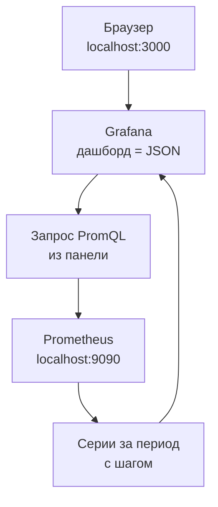

## Зачем это нужно

Запросы PromQL из урока 7.2 дают числа в терминале. Но во время нагрузочного теста ты не можешь каждые десять секунд перезапускать команды и сравнивать цифры в уме: тебе нужна **одна страница**, на которой рядом видно нагрузку, ошибки, задержку и загрузку ресурсов, и она сама обновляется. Такая страница называется **дашборд** (dashboard, «приборная панель», как в автомобиле: спидометр, температура, уровень топлива на одном щитке). Строит дашборды **Grafana**: программа, которая берёт данные из Prometheus (и других источников) и рисует по ним графики.

Для нагрузочника дашборд это ещё и **доказательство**. Фраза «стало медленно» ничего не значит, а график, где в 14:32 p95 ушёл вверх вместе с очередью на пул соединений, это отчёт, который можно показать разработчику и аргументированно спорить. Поэтому ты научишься не только рисовать панели, но и **читать их во время теста**.

Шаг проекта: ты открываешь готовый эталонный дашборд «Магазин: обзор (эталон)», разбираешь его панели, собираешь свой дашборд `lab-red` с переменной маршрута, сохраняешь его в JSON в `~/perf-lab/07-monitoring/dashboards/` (чтобы он жил в git, а не только в браузере) и загружаешь скриптом обратно в Grafana.

## Что нужно знать

- Запросы RED (`sum by (route) (rate(...))`, доля 5xx, `histogram_quantile`): [урок 7.2](02-promql.md). Все панели этого урока это те самые запросы.
- Как стенд с профилем мониторинга запускается и что Prometheus собирает метрики каждые 5 секунд: [урок 7.1](01-metrics-prometheus.md).
- `curl` и `jq`: [урок 1.4](../01-linux/04-network-cli.md). Скрипты `promq.sh` и `traffic.sh` из урока 7.2 лежат в `~/perf-lab/scripts/`.
- Git и репозиторий `~/perf-lab`: тема 3.

## Картина целиком

Grafana ничего не хранит из метрик сама. Это **витрина**: она берёт запрос, отправляет его в источник данных (Prometheus), получает числа и рисует. Метрики лежат в Prometheus, дашборд лежит в Grafana как один файл JSON, а ты смотришь на результат в браузере.



На схеме: дашборд это набор **панелей**, у каждой панели один или несколько **запросов**, у каждого запроса указан **источник данных**. Браузер открывает страницу Grafana, а та по запросам из панелей обращается в Prometheus. Если Prometheus пуст или недоступен, дашборд останется пустым, хоть сама Grafana работает.

Мы строим дашборд по двум известным методикам, которые отвечают на два вопроса. **RED** (Rate, Errors, Duration) смотрит на сервис глазами пользователя: сколько к нам приходит, сколько ломается, как быстро отвечаем. **USE** (Utilization, Saturation, Errors) смотрит на ресурсы глазами инженера: насколько занят процессор или пул соединений, есть ли очередь, есть ли сбои. RED показывает **что** болит, USE подсказывает **почему**.

## Теория

### Источник данных (datasource)

**Зачем это существует.** Одна Grafana умеет рисовать данные из разных хранилищ: метрики из Prometheus, логи из Loki, оповещения из Alertmanager. Чтобы панель знала, куда отправить запрос, существует понятие **источника данных** (data source): запись «название, тип, адрес, как подключаться».

**Как это устроено.** В «Магазине» источники заведены автоматически при старте. Это называется **provisioning** (авто-подготовка): Grafana при запуске читает файлы из каталога `provisioning/` и создаёт всё описанное. Ты видел файл `project/shop/monitoring/grafana/provisioning/datasources/*.yml`, в нём три записи: `Prometheus` (`uid: prometheus`, адрес `http://prometheus:9090`, основной), `Loki` (`uid: loki`) и `Alertmanager` (`uid: alertmanager`).

Адрес `http://prometheus:9090` выглядит странно: это не `localhost`. Внутри Docker-сети контейнеры находят друг друга **по имени сервиса**, и контейнер Grafana обращается к контейнеру Prometheus по имени `prometheus`. Браузер ходит на `localhost:3000` (порт опубликован на твою машину), а запросы в Prometheus делает сама Grafana, изнутри сети. Это ещё и ответ на вопрос «почему панель не работает, если Prometheus открывается в браузере»: у них разные «точки зрения» на сеть.

Параметр `uid` это стабильный идентификатор. На него ссылается каждая панель в JSON (`"datasource": {"uid": "prometheus"}`). Если ты перенесёшь дашборд в Grafana, где источник заведён с другим uid, панели покажут «datasource not found». Поэтому на стенде uid зафиксирован.

В веб-интерфейсе источники лежат в разделе подключений (**Connections**, **Data sources**), меню Grafana 13 меняется от версии к версии, поэтому ищи по смыслу. Кнопка **Save & test** внизу страницы источника проверяет связь и пишет «Successfully queried the Prometheus API».

**Что путают.** «Источник данных» и «дашборд» это разные сущности: источник отвечает на вопрос «откуда», дашборд «что и как показывать».

### Панель (panel) и её запрос

**Зачем это существует.** Один график отвечает на один вопрос. Дашборд состоит из таких ответов.

**Как это устроено.** У панели есть **тип визуализации**: `Time series` (линии во времени, самая частая), `Stat` (одно крупное число), `Gauge` (стрелочный индикатор), `Bar gauge`, `Table`, `Heatmap`. Для нагрузочного теста тебе хватит двух: **Time series** для динамики и **Stat** для «сколько прямо сейчас».

В режиме редактирования панели три зоны. Снизу **запросы** (Queries): вкладка с полем для PromQL. Справа **настройки** (Standard options: единица измерения, минимум и максимум, цвета). Сверху сам график.

Основные поля запроса:

- **Expression**: текст PromQL (копируешь из `red-queries.promql`);
- **Legend**: как называть линию (`{{route}}` подставит значение метки `route`, иначе легенда покажет длинный набор всех меток);
- **Min step / Interval**: шаг между точками; на стенде достаточно по умолчанию, Grafana подберёт шаг по ширине графика и по окну времени.

**Единицы измерения** (unit) критичны. Prometheus выдаёт сырые числа: секунды, доли от единицы, байты. Если не указать единицу, ты увидишь `0.0434` вместо «43,4 мс». В настройках выбери `Time / seconds (s)`: Grafana сама покажет «43,4 ms». Для доли ошибок выбери `Misc / Percent (0.0-1.0)`: значение 0.025 станет «2,5%». Для запросов в секунду `Throughput / requests/sec (reqps)`, для памяти `Data / bytes (IEC)`.

**Разобранный пример.** Панель «Errors: доля 5xx»: запрос `(sum(rate(...5xx...)) or vector(0)) / clamp_min(sum(rate(...)), 0.001)` (из 7.2), единица **percentunit**, минимум 0. Без `or vector(0)` при отсутствии ошибок на панели было бы «No data»: глядя на неё, ты не узнаешь, ноль ли это или сломан сбор метрик. С `or vector(0)` рисуется ровная нулевая линия.

**Что путают.** Выбор единицы **не меняет данные**, только их подпись. Если запрос возвращает секунды, а ты выберешь «миллисекунды», числа будут показаны неправильно.

### Период, обновление и шаг

**Зачем это существует.** Что видно на графике, зависит от трёх вещей, которые легко перепутать: за какое время смотрим, как часто обновляем, с каким шагом точки.

**Как это устроено.** В правом верхнем углу дашборда два выпадающих списка. **Time range** («последние 15 минут», `now-15m`): правый край графика это сейчас, левый край на 15 минут назад. **Auto-refresh** («5s»): как часто Grafana заново посылает запросы и сдвигает график. Эталонный дашборд стоит на 15 минут и обновлении раз в 5 секунд. И ещё есть **шаг** (step): расстояние между точками, Grafana делит ширину графика в пикселях на период. Для 15 минут получится шаг около 5 секунд, что совпадает с интервалом скрейпа. Для периода «последние 24 часа» шаг вырастет до нескольких минут, и если бы окно в запросе осталось фиксированным `[1m]`, окна перестали бы покрывать время целиком: каждая точка смотрит только на минуту до себя, минуты между точками никто не считал бы, и всплеск, который пришёлся между ними, на графике не появился бы. Окно запроса и шаг графика это разные вещи (урок 7.2).

Чтобы окно не отставало от шага, в Grafana есть встроенная переменная `$__rate_interval`. Её пишут в квадратных скобках вместо числа: `rate(http_requests_total[$__rate_interval])`. Grafana сама подставляет окно, равное большему из двух значений: «шаг графика плюс интервал скрейпа» или «четыре интервала скрейпа». Интервал скрейпа Grafana берёт из настройки источника данных (в стенде там `timeInterval: 5s`, как в `prometheus.yml`). Для стенда это значит: на периоде 15 минут окно около 20 секунд, на периоде 24 часа окно растёт вместе с шагом, и точки покрывают время без дыр. Фиксированное `[1m]` проще читать, пока смотришь короткие периоды, но на длинных оно теряет всплески: поэтому в Grafana его заменяют на `$__rate_interval`.

В эталонном дашборде «Магазин: обзор» во всех выражениях `rate` стоит `$__rate_interval`: откроешь его на сутки, и окно вырастет вместе с шагом, всплески не пропадут. В уроке 7.2 и в таблицах ниже запросы для наглядности написаны с `[1m]`: это то же выражение для короткого периода, а в панель Grafana ты вставляешь вариант с `$__rate_interval`. В своём дашборде `lab-red` из практики используй его же.

Практика для нагрузочного теста: **на время теста ставь период, чуть больший длительности теста** (тест 10 минут, смотри последние 15), а **после теста** фиксируй период по часам начала и конца, чтобы график не уезжал при обновлении. Для этого в Grafana есть абсолютное время и кнопка паузы автообновления.

### Переменные: один дашборд для всех маршрутов

**Зачем это существует.** Если у «Магазина» 8 маршрутов, а тебе нужно смотреть то все, то один, то два, не создавать же восемь копий дашборда. **Переменная** (variable) это выпадающий список вверху дашборда, значение которого подставляется в запросы.

**Как это устроено.** В настройках дашборда (**Settings**, **Variables**) добавляется переменная типа **Query**: `route`, запрос `label_values(http_requests_total, route)`. Функция `label_values(метрика, метка)` существует только в Grafana: она спрашивает Prometheus о всех значениях метки `route` и показывает как список. Включи **Multi-value** (можно выбрать несколько) и **Include All option** (пункт «All»). В запросе переменная записывается как `$route`:

```promql
sum by (route) (rate(http_requests_total{route=~"$route"}[$__rate_interval]))
```

Здесь `route=~"$route"`, а не `route="$route"`: при выборе нескольких значений Grafana подставляет их регулярным выражением с `|` между значениями, например `(/api/products|/api/orders)`. Для пункта «All» без заполненного поля Custom all value подставляется то же самое: список всех текущих значений метки через `|`. Строка `.*` подставляется, только если ты сам впишешь её в Custom all value (тогда в выборку попадут и серии, где метки `route` нет совсем). Поэтому в запросах с переменной всегда пиши `=~`.

**Что путают.** Переменная меняет **запрос**, а не отображение, поэтому панель, в которой забыли написать `$route`, на выбор в списке не реагирует. Если ты поменял переменную, а график остался прежним, проверь сначала именно это.

### RED: сервис глазами пользователя

Каждому вопросу отвечает своя панель, запрос для каждой взят из урока 7.2.

| Вопрос | Панель | Запрос (в общем виде) | Единица |
|---|---|---|---|
| **R**ate: сколько приходит? | Time series, линия на маршрут | `sum by (route) (rate(http_requests_total[$__rate_interval]))` | reqps |
| **E**rrors: сколько ломается? | Time series, одна линия | доля 5xx с `or vector(0)` | percentunit |
| **D**uration: как быстро? | Time series, p50 и p95 (и p99) | `histogram_quantile(...)` | s |

Нарисуй их рядом и **в таком порядке**: нагрузка, потом ошибки, потом задержка. Так проще читать причинно-следственную цепочку: «на 60-м RPS p95 начал расти, на 80-м пошли 5xx».

### USE: ресурсы глазами инженера

**Зачем это существует.** RED говорит «p95 вырос», но не говорит, **почему**. Причина обычно в том, что какой-то ресурс (процессор, память, соединения с БД) исчерпан. USE это проверка трёх свойств каждого ресурса:

- **Utilization** (использование): какая доля времени или объёма занята. Процессор занят на 85%.
- **Saturation** (насыщение): есть ли **очередь** сверх возможностей, то есть работа, которая ждёт. Это самое важное из трёх: ресурс на 100% может быть в порядке, если очередь пуста, и в беде при 70%, если очередь растёт.
- **Errors** (ошибки): отказы самого ресурса, например «пул соединений вернул таймаут».

**Аналогия.** Касса магазина: utilization это доля времени, когда кассир занят, saturation это длина очереди, errors это покупатели, которые ушли, не дождавшись.

**Разобранный пример для «Магазина».** Метрики есть для четырёх ресурсов:

| Ресурс | Utilization | Saturation | Метрика |
|---|---|---|---|
| Пул соединений с БД | `shop_db_pool_size - shop_db_pool_available` | `shop_db_pool_waiting` (ждущие) | собственные метрики shop |
| Процессор контейнера shop | `sum(rate(container_cpu_usage_seconds_total{...}[$__rate_interval]))` в ядрах | `rate(container_cpu_cfs_throttled_periods_total[$__rate_interval])` (подробнее в 7.4) | cAdvisor |
| Память shop | `container_memory_working_set_bytes` | рост до лимита | cAdvisor |
| Соединения PostgreSQL | `pg_stat_database_numbackends` | ожидание блокировок | postgres-exporter |

Метрики cAdvisor и node-exporter мы разберём подробно в уроке 7.4. Сейчас достаточно уметь **читать** их на эталонном дашборде: панели «CPU контейнера shop», «Память контейнера shop», «Соединения PostgreSQL», «Пул БД».

**Что путают.** Utilization и saturation. «Процессор 90%» это использование, а насыщение это очередь на процессор. В нашем случае самое наглядное насыщение это `shop_db_pool_waiting`: сколько запросов стоят в очереди за соединением с базой. Когда эта линия оторвалась от нуля, пул насыщен, и p95 скоро вырастет.

Поиграй с дашбордом ниже. Выбери сценарий и проведи мышью по графикам: перекрестие общее для всех панелей, и ты увидишь, **что происходило в одну и ту же секунду** на каждой.

<div class="viz" data-viz="obs-dashboard" data-scenario="ok"></div>

Смотри на виджет: в сценарии «Всё в порядке» все линии спокойны. Переключись на «Исчерпан пул БД»: сначала растёт p95 и очередь ожидающих, и только потом появляются 5xx. Главное здесь порядок событий: причина (очередь на пул) раньше следствий (задержка, ошибки). В сценарии «Тормозит оплата» картина другая: ожидания пула нет, а запросов «в работе» много. Умение различать такие картины и есть чтение дашборда.

### Как читать дашборд во время нагрузочного теста

Что сделать, прежде чем нажать «Пуск» в Locust или k6:

1. Открой дашборд на втором экране или в отдельном окне, период «последние 15 минут» (чуть больше теста), обновление 5 секунд.
2. Запиши **базовую линию** в спокойном состоянии: RPS, p95, 5xx (из урока 7.2).
3. Запиши время начала теста: потом нужно будет зафиксировать период.

Что смотреть во время теста, в таком порядке:

<div class="viz" data-viz="flow" data-steps='[{"title":"Rate растёт по плану?","text":"Нагрузка должна подниматься как ты задал. Если RPS уткнулся в потолок при растущей нагрузке теста, сервис упёрся в предел."},{"title":"Errors: нули?","text":"Первая же полоса `5xx` важнее всего остального: тест, который ломает сервис, надо останавливать или фиксировать момент."},{"title":"Duration: где p95?","text":"p50 и p95 растут вместе или только p95? Если только p95, у части запросов есть очередь, а не вся система медленная."},{"title":"Saturation: что в очереди?","text":"Очередь на пул БД, запросов в работе, процессор. Это ответ на вопрос «почему»."},{"title":"Зафиксируй момент","text":"Запомни время, когда p95 впервые вышел за порог, и нагрузку в этот момент. Это число идёт в отчёт."}]'></div>

Сразу реагируй на такие сигналы:

- **p95 растёт, а RPS перестал расти.** Классика «хоккейной клюшки» из темы 8: достигнут предел пропускной способности. Дальше повышать нагрузку бессмысленно.
- **5xx выросли, а загрузка процессора низкая.** Узкое место не в процессоре, а в чём-то, что ждёт: пул, внешний сервис, блокировка.
- **Всё в порядке на графике, а клиент жалуется.** Значит, мерили не то: проверь, что метрика собирается на нужном маршруте и что окно `rate` не слишком длинное и не сглаживает пик.

Ещё одна ловушка: **график запаздывает**. Prometheus скрейпит раз в 5 секунд, `rate` усредняет окно (на коротком периоде секунд 20), поэтому всплеск виден с задержкой в 10-20 секунд и немного размазан. Не удивляйся, что график «реагирует позже», чем ты нажал кнопку.

### Пороги, цвета и легенда: как график «говорит» без слов

**Зачем это существует.** Во время теста ты смотришь на дашборд боковым зрением. Если число не отличается цветом от «нормы», ты не заметишь, что оно перешло границу. Для этого у панелей есть **пороги** (thresholds): значения, при переходе через которые линия, фон или число меняют цвет.

**Как это устроено.** В настройках панели (Standard options, раздел **Thresholds**) задаётся список: базовый цвет (зелёный) и пары «от какого значения какой цвет». Для p95 «Магазина» разумно поставить жёлтый от 0,3 с и красный от 0,5 с. В режиме отображения порогов (**Show thresholds**) на графике появляется пунктирная линия, и сразу видно, когда кривая её пересекла. Для панели **Stat** цвет заливает всё число целиком: «Доля 5xx 0%» зелёным, «3,2%» красным.

**Разобранный пример.** Допустим, цель теста: p95 не больше 500 мс. Ставишь красный порог на 0,5 с. Во время ступенчатой нагрузки линия p95 поднимается: 0,08, 0,12, 0,25, 0,48, 0,95. Как только последняя точка пересекает пунктир, это и есть ответ на вопрос «на какой ступени мы нарушили цель». Не нужно сверять цифры в уме.

**Легенда** (legend) это список линий на графике, по умолчанию внизу. Клик по названию линии в легенде выделяет её и гасит остальные, клик с зажатым Ctrl добавляет или убирает линию. Для маршрутов с большими различиями в масштабе это спасает: линия `/api/orders` в десять раз меньше `/api/products` и теряется, а когда оставишь только её, она занимает всю высоту панели.

**Общее перекрестие** (shared crosshair) это настройка дашборда (**Settings**, поле **Graph tooltip**, значение **Shared crosshair**): вертикальная линия при наведении мыши появляется на **всех** панелях в одно и то же время, и ты видишь, что происходило на каждой в эту секунду. Именно так работает виджет выше. В нагрузочном тесте это главный способ связывать причину и следствие: «вот в 14:32:10 p95 ушёл вверх, а на соседней панели в эту же секунду очередь пула стала 6».

**Что путают.** Порог на панели не создаёт оповещения: это только раскраска. Чтобы Grafana или Prometheus прислали сообщение, нужны правила оповещения (урок 7.6). Порог на панели это подсказка глазам.

### Где у Grafana границы: чего дашборд не скажет

Дашборд показывает **агрегаты** (по всем запросам сразу, усреднённые окном), а не отдельные запросы. Из него не узнать, какой именно запрос был медленным, у какого пользователя ошибка, что написано в логе. Он также показывает только то, что кто-то предусмотрел и заложил в метрики: если нет метки `route`, разреза по маршрутам не будет. Поэтому рядом с метриками живут логи и трассировки (логи в уроке 7.5): метрики говорят «что и где болит», логи «какой именно запрос и почему».

Второе ограничение: дашборд показывает прошлое с запаздыванием в десятки секунд (мы это разобрали выше), поэтому для **принятия решения прямо сейчас** (остановить тест?) смотри на ошибки 5xx и на очередь, а не на сглаженный p95.

### Дашборд это JSON, а JSON живёт в git

**Зачем это существует.** Дашборд, собранный мышью и лежащий только в базе Grafana, пропадёт вместе со стендом (`docker compose down -v` удалит том), а изменения нельзя посмотреть и откатить. Дашборд, лежащий в репозитории как JSON, можно проревьюить, откатить, перенести на другой компьютер. Такой подход называется **«дашборды как код»** (dashboards as code).

**Как это устроено.** Внутри Grafana дашборд это один JSON-документ: заголовок, переменные, список панелей с запросами и расположением (`gridPos`: `x`, `y`, ширина `w` из 24 колонок, высота `h`). Выгрузить его можно двумя способами: в интерфейсе (**Export**, **Export as JSON**) или через **HTTP API** Grafana. Мы возьмём API, потому что его легко записать в скрипт. Анонимный вход на стенде имеет роль Admin, поэтому токены и пароли не нужны.

- Выгрузка: `GET /api/dashboards/uid/<uid>` возвращает `{"dashboard": {...}, "meta": {...}}`.
- Загрузка: `POST /api/dashboards/db` с телом `{"dashboard": {...}, "overwrite": true}`.

Эталонный дашборд `shop-overview` **провижининый**: он описан файлом, смонтирован в контейнер только для чтения, и через API перезаписать его не получится (ответ «Cannot save provisioned dashboard»). Поэтому свой дашборд мы создаём под **другим** `uid` (`lab-red`) и храним его JSON в `~/perf-lab`.

**Что путают.** Внутри выгруженного JSON есть числовое поле `id`, которое принадлежит конкретной базе Grafana. При загрузке в другую его надо обнулить (`id: null`), иначе будет конфликт. Идентификатором для людей и ссылок служит `uid`.

## Практика

Стенд с мониторингом должен быть запущен (урок 7.1), фоновый трафик из урока 7.2 идёт (`~/perf-lab/scripts/traffic.sh 1200 &`).

### 1. Открой эталонный дашборд

Открой `http://localhost:3000`. Вход не требуется: на стенде включён анонимный доступ с правами администратора (это допустимо только на локальном учебном стенде и недопустимо где-либо ещё). Затем перейди в **Dashboards** и открой «Магазин: обзор (эталон)». Либо прямой адрес `http://localhost:3000/d/shop-overview`.

Проверь, что источник данных рабочий: открой раздел подключений, найди **Prometheus**, внизу страницы нажми **Save & test**. Ожидаемо: зелёное «Successfully queried the Prometheus API».

На дашборде 12 панелей. Найди и запиши в `~/perf-lab/07-monitoring/dashboard-notes.md`: какая панель отвечает за R, какая за E, какая за D, какие из них относятся к USE. Подсказка: у каждой панели есть меню (три точки, **Edit**), в нём виден её запрос PromQL.

**Как читать вывод:** график «RPS по маршруту» показывает по линии на маршрут, значения порядка десятков в секунду при твоём фоновом трафике. «Доля HTTP 5xx» должна быть на нуле. «Пул БД» показывает три линии: размер пула, доступные соединения, ожидающие (последние должны быть около нуля).

**Типичные ошибки:** «No data» на всех панелях означает, что Prometheus пуст или недоступен: проверь `~/perf-lab/scripts/promq.sh 'count(up)'`, затем Status / Targets в Prometheus. Пустая только панель «CPU контейнера shop»: на Mac с Docker Desktop метки cAdvisor могут отличаться, это допустимо, подробности в уроке 7.4.

### 2. Свой дашборд как файл

Создай каталог и файл JSON. Это дашборд `lab-red` с переменной маршрута и четырьмя панелями (Rate, Errors, Duration, запросы в работе):


```bash
mkdir -p ~/perf-lab/07-monitoring/dashboards ~/perf-lab/scripts
cat > ~/perf-lab/07-monitoring/dashboards/lab-red.json <<'EOF'
{
  "uid": "lab-red",
  "title": "Моя лаборатория: RED",
  "tags": ["lab"],
  "schemaVersion": 41,
  "refresh": "5s",
  "time": { "from": "now-15m", "to": "now" },
  "templating": {
    "list": [
      {
        "name": "route",
        "label": "Маршрут",
        "type": "query",
        "datasource": { "type": "prometheus", "uid": "prometheus" },
        "query": { "query": "label_values(http_requests_total, route)", "refId": "route" },
        "refresh": 2,
        "multi": true,
        "includeAll": true,
        "current": { "text": "All", "value": "$__all" }
      }
    ]
  },
  "panels": [
    {
      "id": 1, "type": "timeseries", "title": "Rate: запросов в секунду",
      "gridPos": { "x": 0, "y": 0, "w": 12, "h": 8 },
      "datasource": { "type": "prometheus", "uid": "prometheus" },
      "fieldConfig": { "defaults": { "unit": "reqps" }, "overrides": [] },
      "targets": [
        { "refId": "A", "legendFormat": "{{route}}",
          "expr": "sum by (route) (rate(http_requests_total{route=~\"$route\"}[$__rate_interval]))" }
      ]
    },
    {
      "id": 2, "type": "timeseries", "title": "Errors: доля 5xx",
      "gridPos": { "x": 12, "y": 0, "w": 12, "h": 8 },
      "datasource": { "type": "prometheus", "uid": "prometheus" },
      "fieldConfig": { "defaults": { "unit": "percentunit", "min": 0 }, "overrides": [] },
      "targets": [
        { "refId": "A", "legendFormat": "5xx",
          "expr": "(sum(rate(http_requests_total{route=~\"$route\",status=~\"5..\"}[$__rate_interval])) or vector(0)) / clamp_min(sum(rate(http_requests_total{route=~\"$route\"}[$__rate_interval])), 0.001)" }
      ]
    },
    {
      "id": 3, "type": "timeseries", "title": "Duration: p50 и p95",
      "gridPos": { "x": 0, "y": 8, "w": 12, "h": 8 },
      "datasource": { "type": "prometheus", "uid": "prometheus" },
      "fieldConfig": { "defaults": { "unit": "s", "min": 0 }, "overrides": [] },
      "targets": [
        { "refId": "A", "legendFormat": "p50",
          "expr": "histogram_quantile(0.5, sum by (le) (rate(http_request_duration_seconds_bucket{route=~\"$route\"}[$__rate_interval])))" },
        { "refId": "B", "legendFormat": "p95",
          "expr": "histogram_quantile(0.95, sum by (le) (rate(http_request_duration_seconds_bucket{route=~\"$route\"}[$__rate_interval])))" }
      ]
    },
    {
      "id": 4, "type": "timeseries", "title": "Запросы в работе",
      "gridPos": { "x": 12, "y": 8, "w": 12, "h": 8 },
      "datasource": { "type": "prometheus", "uid": "prometheus" },
      "fieldConfig": { "defaults": { "unit": "short", "min": 0 }, "overrides": [] },
      "targets": [
        { "refId": "A", "legendFormat": "в работе", "expr": "sum(http_requests_in_progress)" }
      ]
    }
  ]
}
EOF
```


Разбор: `cat > файл <<'EOF' ... EOF` записывает всё между строками `EOF` в файл, одинарные кавычки вокруг `EOF` запрещают оболочке подставлять `$route` и обратные кавычки. Проверь, что файл корректный JSON:

```bash
jq -e '.panels | length' ~/perf-lab/07-monitoring/dashboards/lab-red.json
```

```text
4
```

`jq -e` завершается с ошибкой, если JSON сломан или результат пустой. Если видишь `parse error`, найди строку, которую назвал `jq`: обычно это пропущенная запятая или кавычка.

Устройство файла: `templating.list` содержит переменную `route`, у каждой панели есть `datasource` с `uid: prometheus`, `fieldConfig.defaults.unit` задаёт единицу, `targets[].expr` это тот самый PromQL, `legendFormat` это подпись линии.

### 3. Скрипты: загрузка и выгрузка

Скрипт `~/perf-lab/scripts/dash-import.sh` загружает дашборд из файла:

```bash
#!/usr/bin/env bash
# dash-import.sh файл.json: создать или обновить дашборд в локальной Grafana
set -euo pipefail
jq '{dashboard: (.id = null), overwrite: true}' "$1" \
  | curl -s -X POST localhost:3000/api/dashboards/db \
      -H 'Content-Type: application/json' -d @- \
  | jq -r '"\(.status // .message)  http://localhost:3000\(.url // "")"'
```

Разбор: `jq '{dashboard: (.id = null), overwrite: true}'` упаковывает файл в тело запроса `{"dashboard": <файл с id=null>, "overwrite": true}`. Трубой `|` оно уходит в `curl`, где `-d @-` значит «тело запроса прочитай из стандартного ввода». Ответ Grafana разбирает последний `jq`: статус (`success`) и адрес дашборда. Если статус другой, печатается сообщение об ошибке.

Скрипт `~/perf-lab/scripts/dash-export.sh` делает обратное: выгружает дашборд по `uid`, убирая служебные поля:

```bash
#!/usr/bin/env bash
# dash-export.sh uid > файл.json: выгрузить дашборд из локальной Grafana
set -euo pipefail
curl -s "localhost:3000/api/dashboards/uid/$1" | jq '.dashboard | .id = null | del(.version)'
```

Загрузи свой дашборд:

```bash
chmod +x ~/perf-lab/scripts/dash-*.sh
~/perf-lab/scripts/dash-import.sh ~/perf-lab/07-monitoring/dashboards/lab-red.json
```

```text
success  http://localhost:3000/d/lab-red/moya-laboratoriya-red
```

Открой выданный адрес. Ты должен увидеть четыре панели с живыми данными и список **Маршрут** вверху.

**Типичные ошибки:**

- `Cannot save provisioned dashboard`: ты взял `uid` эталонного `shop-overview`; у своего дашборда `uid` должен быть другой.
- `curl: (7) Failed to connect`: Grafana не запущена; проверь `docker compose --profile monitoring ps`.
- Панели пусты, в углу красный треугольник: наведи на него мышь, там текст ошибки запроса; чаще всего в запросе опечатка или datasource не `prometheus`.
- `jq: error ... Cannot index`: файл не JSON-объект дашборда; ты, возможно, скормил скрипту ответ API с обёрткой `dashboard/meta`. Тогда достань дашборд: `jq .dashboard`.

> Панель пустая или показывает странные числа? Скопируй запрос панели, единицы и интервал времени, спроси нейросеть, что может быть не так. Проверь по порядку из урока: тот же запрос в Prometheus, потом источник данных, потом единицы и подписи.
{: .ai}

### 4. Переменная и круг правки

Выбери в списке **Маршрут** только `/api/products` и посмотри, как перестроились панели: остался один маршрут. Выбери «All»: вернулись все. Теперь добавь панель мышью: в режиме редактирования дашборда (кнопка **Edit** вверху, затем **Add**, **Visualization**), выбери Prometheus, вставь запрос `topk(3, sum by (route) (rate(http_requests_total[$__rate_interval])))`, единицу `reqps`, заголовок «Топ-3 маршрута» и сохрани дашборд (**Save dashboard**). Затем выгрузи результат обратно в файл, чтобы он попал в git:

```bash
~/perf-lab/scripts/dash-export.sh lab-red > ~/perf-lab/07-monitoring/dashboards/lab-red.new.json \
  && mv ~/perf-lab/07-monitoring/dashboards/lab-red.new.json ~/perf-lab/07-monitoring/dashboards/lab-red.json
jq '.panels | length' ~/perf-lab/07-monitoring/dashboards/lab-red.json
```

```text
5
```

Выгрузка идёт во временный файл, а затем переименовывается: так не потеряешь рабочий JSON, если выгрузка упадёт посередине. Теперь панелей пять. Это правильный цикл: **правишь мышью, выгружаешь в файл, коммитишь**. Закоммить:

```bash
cd ~/perf-lab && git add scripts 07-monitoring && git commit -m "7.3: дашборд lab-red и скрипты импорта и экспорта" && git push
```

### 5. Прогон: читаем график под нагрузкой

Теперь увидь реальную картину. На панели «Duration» наблюдай p95, пока запускаешь **усиленный** трафик: в соседнем терминале запусти три копии скрипта с нулевой паузой.

```bash
for i in 1 2 3; do ~/perf-lab/scripts/traffic.sh 120 0 & done
```

Через 20-30 секунд на «Rate» линия вырастет, а на «Duration» поднимется p95. Отметь для отчёта: при каком RPS p95 впервые превысил 200 мс, и как изменились панели «Запросы в работе» и (на эталонном дашборде) «Пул БД». Запиши в `dashboard-notes.md` три-четыре строки: что выросло, что нет, какой ресурс первым выглядит насыщенным. Остановить фоновые копии досрочно можно командой `kill $(jobs -p)`.

Не нагружай ничего, кроме собственного стенда на своём компьютере.

## Сломай и почини

**Поломка 1.** Останови Prometheus и посмотри на дашборд:

```bash
cd ~/load-tester/project/shop && docker compose --profile monitoring stop prometheus
```

Подожди 10-15 секунд, обнови страницу дашборда. **Что видим:** на панелях «No data» или красные треугольники с ошибкой. При этом сама Grafana жива, а `shop` как работал, так и работает. Урок: пустой дашборд не значит «сервис упал», он значит «до метрик не достучались». Восстанови: `docker compose --profile monitoring start prometheus`. Данные за время остановки пропадут навсегда: Prometheus не скрейпил в этот период, и на графике останется провал.

**Поломка 2.** Открой свою панель Rate в режиме редактирования и поменяй в запросе `route=~"$route"` на `route="$route"`. Выбери в списке «All»: панель покажет «No data». Почему? Подсказка: какой текст подставляет Grafana вместо `$route` при выборе «All» и при выборе двух маршрутов?

<details markdown="1">
<summary>Разбор</summary>

При выборе «All» (или нескольких значений) Grafana подставляет регулярное выражение вроде `(/api/products|/api/orders)` (для «All» это список всех значений через `|`). Оператор `=` сравнивает значение метки с этим текстом буква в букву, совпадения нет, серий нет. Оператор `=~` трактует подставленное как регулярку, и всё работает. Чинится возвратом `=~`. Правило: **с переменными в Grafana в селекторах всегда `=~` и `!~`**. Ещё одна частая причина «No data» после правки: период слишком короткий для окна `rate` (например, окно `[1m]` и «последние 30 секунд»).

</details>

## ИИ в помощь

Нейросеть помогает набросать запрос панели и подобрать единицы, но интерфейс Grafana 13 меняется, и описание кликов у неё бывает устаревшим. Общие правила: [ИИ-помощник](../ai.md).

**Задача:** выбрать запрос и вид панели под вопрос.

```text
Grafana 13, источник Prometheus. Нужна панель «Задержка p95 по маршрутам» для сервиса магазина.
Метрика: http_request_duration_seconds (гистограмма, метки method, route).
Предложи запрос, тип панели, единицы (seconds или ms) и порог для линии. Объясни,
зачем здесь $__rate_interval и чем он лучше фиксированного [1m].
```
{: .wrap}

**Проверь ответ:** запусти запрос в Explore и сравни с дашбордом из урока. Типичные ошибки: названия полей меню, которых нет в текущей версии, перепутанные единицы (миллисекунды вместо секунд, график «в 1000 раз выше») и устаревший синтаксис JSON дашборда. JSON проверь импортом на тестовом дашборде, а не на рабочем.

**Задача:** правка JSON дашборда.

```text
Вот фрагмент JSON панели Grafana: <вставь фрагмент>. Добавь переменную route (query по label_values)
и подставь её в запрос панели. Объясни каждое изменённое поле.
```
{: .wrap}

**Проверь ответ:** импортируй результат и убедись, что переменная появилась и переключает панель. Типичная ошибка: нейросеть выдаёт неполный JSON без `uid` источника данных.

## Словарик урока

| Термин | Простыми словами |
|---|---|
| Grafana | Программа для рисования графиков и дашбордов по данным из Prometheus, Loki и других источников |
| Дашборд (dashboard) | Страница с набором панелей, обновляющаяся сама |
| Панель (panel) | Один график или число на дашборде с одним или несколькими запросами |
| Источник данных (data source) | Запись «откуда брать данные»: тип, адрес, uid |
| Provisioning | Авто-создание источников и дашбордов из файлов при старте Grafana |
| uid | Стабильный идентификатор дашборда или источника, по нему идут ссылки и API |
| Time series | Тип панели: линии во времени |
| Stat | Тип панели: одно крупное число |
| Единица (unit) | Подпись значения: секунды, проценты, запросы в секунду; не меняет данные |
| Переменная (variable) | Выпадающий список вверху дашборда, значение подставляется в запрос как `$имя` |
| Time range | Период, за который показан график |
| Auto-refresh | Как часто Grafana заново запрашивает данные |
| RED | Rate, Errors, Duration: сервис глазами пользователя |
| USE | Utilization, Saturation, Errors: ресурсы глазами инженера |
| Насыщение (saturation) | Очередь работы, не поместившейся в ресурс |
| Дашборды как код | Хранение дашбордов JSON-файлами в git |
| Базовая линия (baseline) | Показатели в спокойном состоянии для сравнения с тестом |

## Вопросы с собеседований

Раздел для повторения: ответь вслух, потом открой ответ. Вопросы `[на скорость]`: ответ за 30 секунд.

### 1. [junior] [часто] Что такое RED и зачем он нужен?

<details markdown="1">
<summary>Ответ</summary>

Три величины, которые описывают сервис глазами пользователя: Rate (запросов в секунду), Errors (доля или число ошибок), Duration (задержка, обычно p95 и p99). Они отвечают на «сколько приходит, сколько ломается, насколько медленно», и с них начинают любой дашборд сервиса и любой разбор инцидента.

**Что хотят услышать:** три буквы, что для каждой нужен свой запрос, что это взгляд пользователя.

**Красный флаг:** «RED это красный цвет тревоги на графике».

</details>

### 2. [junior] [часто] Чем USE отличается от RED?

<details markdown="1">
<summary>Ответ</summary>

RED смотрит на сервис (что видит пользователь), USE на ресурсы (процессор, память, диск, пул соединений): использование, насыщение, ошибки. RED показывает, что болит, USE помогает найти почему. Для расследования смотрят RED, затем USE ресурса, который подозревают.

**Что хотят услышать:** сервис против ресурса, «что» и «почему».

**Красный флаг:** считать их взаимозаменяемыми.

</details>

### 3. [junior] [часто] Что такое saturation и чем она отличается от utilization?

<details markdown="1">
<summary>Ответ</summary>

Utilization это доля занятости ресурса (процессор 85%). Saturation это очередь, то есть работа, которая ждёт ресурса: длина очереди на пул соединений, число потоков, ждущих процессор. Ресурс на 100% без очереди может справляться, а при очереди растёт задержка. Для нагрузочника saturation важнее, потому что первой проявляет проблему.

**Что хотят услышать:** очередь против занятости, пример.

**Красный флаг:** считать, что 100% загрузки всегда плохо, а 50% всегда хорошо.

</details>

### 4. [junior] Как Grafana связана с Prometheus?

<details markdown="1">
<summary>Ответ</summary>

Grafana сама метрик не хранит. Она отправляет запросы PromQL из панелей в источник данных (Prometheus), получает ряды и рисует. Если Prometheus недоступен, панели пустые, хотя Grafana работает. Источник описан в настройках (адрес, uid), в Docker-сети адрес Prometheus это имя сервиса, а не `localhost`.

**Что хотят услышать:** Grafana это витрина; источник данных; почему пустые панели не значат «сервис упал».

**Красный флаг:** «Grafana собирает метрики».

</details>

### 5. [junior] Зачем переменные на дашборде и как их подставляют в запрос?

<details markdown="1">
<summary>Ответ</summary>

Переменная даёт выпадающий список (маршрут, сервис, окружение), по которому один дашборд работает для всех вариантов. В запросе пишется `$route`. Значения берутся запросом, например `label_values(http_requests_total, route)`. При мульти-выборе значения подставляются как регулярка, поэтому в селекторе надо `=~`.

**Что хотят услышать:** `label_values`, `$имя`, `=~` вместо `=`.

**Красный флаг:** копировать дашборд по числу сервисов.

</details>

### 6. [middle] [часто] Почему дашборд надо хранить в git, и как его выгрузить?

<details markdown="1">
<summary>Ответ</summary>

Дашборд это JSON. Если он живёт только в базе Grafana, он пропадёт с её томом, а изменения нельзя ревьюить и откатывать. В git его можно проверить и перенести. Выгрузка: через интерфейс (Export as JSON) или HTTP API `GET /api/dashboards/uid/<uid>`, загрузка `POST /api/dashboards/db`. При переносе обнуляют числовой `id`, держат стабильный `uid`.

**Что хотят услышать:** dashboards as code, API, `uid` против `id`.

**Красный флаг:** «скриншоты дашбордов достаточно».

</details>

### 7. [middle] Что такое provisioning и чем он удобен?

<details markdown="1">
<summary>Ответ</summary>

Grafana при старте читает файлы из каталога provisioning и создаёт источники данных и дашборды. Стенд поднимается одной командой, настроенным и воспроизводимым, без ручных кликов. Минус: provisioned-дашборд нельзя перезаписать через API, правят файл.

**Что хотят услышать:** воспроизводимость, файлы вместо кликов, ограничение на правки.

**Красный флаг:** «настраиваю всё мышью, потом не помню как».

</details>

### 8. [middle] Что смотреть первым во время нагрузочного теста?

<details markdown="1">
<summary>Ответ</summary>

Сначала ошибки (если пошли 5xx, тест уже сломал сервис), затем связку RPS и p95: растёт ли пропускная способность вместе с нагрузкой, не оторвался ли p95. Дальше насыщение: очередь на пул, запросы в работе, процессор. И фиксируют время и нагрузку, когда p95 впервые вышел за порог.

**Что хотят услышать:** порядок, связка RPS и p95, фиксация момента.

**Красный флаг:** смотреть только на среднее.

</details>

### 9. [middle] Метрики на дашборде в порядке, а пользователи жалуются на медленную работу. Что проверишь?

<details markdown="1">
<summary>Ответ</summary>

Что метрики измеряют то, что видит пользователь: нужный ли маршрут, не сглаживает ли пик окно `rate`, нет ли разрыва между сервисом и клиентом (сеть, балансировщик, DNS), которого серверная метрика не видит. Смотрю p99, а не только p95, и сравниваю с метрикой снаружи (например, проба от клиента).

**Что хотят услышать:** сомнение в метрике, окно, p99, измерение снаружи.

**Красный флаг:** «на дашборде всё зелёное, значит проблем нет».

</details>

### 10. [middle] Почему график реагирует на нагрузку с задержкой?

<details markdown="1">
<summary>Ответ</summary>

Данные проходят цепочку: интервал скрейпа (5 с), окно `rate` (минута усредняет), шаг графика и автообновление. Всплеск виден через 10-20 секунд и размазан. Для быстрого просмотра окно уменьшают, для алертов, наоборот, увеличивают, чтобы не реагировать на шум.

**Что хотят услышать:** составные задержки; компромисс окна.

**Красный флаг:** «Grafana тормозит».

</details>

### 11. [junior] [на скорость] Какой тип панели нужен для динамики во времени?

<details markdown="1">
<summary>Ответ</summary>

Time series. Для одного числа «сейчас» Stat.

</details>

### 12. [junior] [на скорость] Что в запросе заменяет `route="..."`, чтобы работал выбор нескольких значений?

<details markdown="1">
<summary>Ответ</summary>

`route=~"$route"`: регулярное сравнение, потому что Grafana подставляет несколько значений через `|`.

</details>

### 13. [junior] [на скорость] Три буквы USE?

<details markdown="1">
<summary>Ответ</summary>

Utilization (занятость), Saturation (очередь), Errors (отказы ресурса).

</details>

### 14. [middle] [на скорость] Почему не работает сохранение эталонного дашборда через API?

<details markdown="1">
<summary>Ответ</summary>

Он provisioned: описан файлом, смонтированным только для чтения. Правят файл или создают копию с другим `uid`.

</details>

## Проверено на версиях

Grafana 13.2 (образ `grafana/grafana:13.2.3`), Prometheus 3.15, `jq` 1.7, стенд «Магазин» из `project/shop`. Названия пунктов меню Grafana меняются от версии к версии, смысл разделов остаётся. Октябрь 2026.

## Итог урока: ты умеешь

- [ ] Объяснить, как Grafana, Prometheus и дашборд связаны, и что значит «No data».
- [ ] Проверить источник данных и назвать его `uid`.
- [ ] Собрать панель Time series с запросом, легендой и правильной единицей.
- [ ] Добавить переменную `route` и использовать её в запросе через `=~`.
- [ ] Описать RED и USE и найти их панели на эталонном дашборде «Магазин: обзор (эталон)».
- [ ] Отличить utilization от saturation на примере пула соединений.
- [ ] Выгрузить и загрузить дашборд через API скриптами `dash-export.sh` и `dash-import.sh`, держать JSON в `~/perf-lab`.
- [ ] Читать дашборд во время теста: порядок просмотра, три сигнала тревоги, запаздывание графика.

Дальше: [урок 7.4. Экспортеры: хост, контейнеры и PostgreSQL](04-exporters.md), где ты разберёшь метрики процессора, памяти и базы, которые на дашборде USE пока читались «по смыслу».

**Глубже:** построение дашбордов, provisioning и переменные подробнее в [курсе DevOps](https://distinguished-sre.github.io/devops/08-observability/06-grafana-dashboards.html), если захочется заглянуть дальше нужного для тестов.
